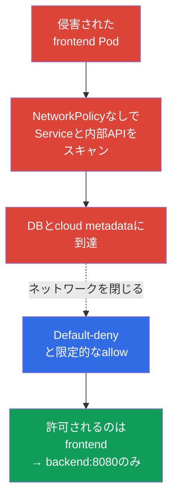
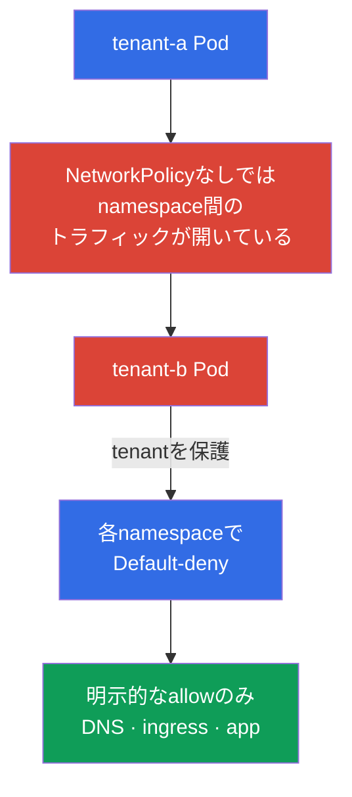

[Русская версия](ru.md) · [Eng version](README.md) · [Versión en español](es.md) · [Version française](fr.md) · [Deutsche Version](de.md) · [ქართული ვერსია](ge.md) · [繁體中文版](tw.md)

# 第04章. セキュリティのためのNetworkPolicy

> **課題。** 1つのPodでのRCEは攻撃者にfootholdを与えます。フラットなpodネットワークでは、そこからServiceのスキャン、DB、内部API、cloud metadataへのアクセスが可能になります。これはlateral movementであり、1つのアプリケーションの侵害が他システムへの入口になります。

> **この先。** 脅威モデルとLinuxの隔離メカニズムを確認しました。ここでは侵害されたPodが利用できるネットワーク経路を絞り込みます。**NetworkPolicy**はフラットなpodネットワークを明示的に許可された接続の集合に変えます。これはCKSのCluster Setup（15%）ドメインです。

> **CKAから必要なこと。** `NetworkPolicy`の基本構文、selector、Podネットワークモデルは[CKA第34章](../../../cka/course/34/jp.md)で、podネットワークとCNIの役割は[CKA第30章](../../../cka/course/30/jp.md)で扱っています。ここでは基礎を反復せず、防御手段として適用します。

> 🧠 `NetworkPolicy`はフラットなネットワークを、workload間の最小限の経路に変えます。

## 04.1. 攻撃シナリオ: フラットネットワーク内の侵害されたPod

policyがなければ、ほとんどのCNIはすべてのPod間のトラフィック、さらに多くの場合egressトラフィックも通します。攻撃者が`frontend`でコマンド実行を得れば、Serviceアドレスをスキャンし、DBへ接続し、内部HTTP APIを要求し、cloud metadataを取得しようとします。このinitial access後の移動を**lateral movement**と呼びます。



`NetworkPolicy`はServiceではなくlabelによりPodへ適用されます。Serviceは便利なDNS宛先のままですが、CNIは送信元・宛先Pod、IP、ポート、policyルールに基づいて判断します。policyはRBAC、TLS、security groupを置き換えず、defense in depthの一層です。

> 🎯 必要な方向をdefault-denyにし、labels、namespace、ポートによる限定的なallowを追加します。DNSと必要なnamespace間経路は別に許可してください。

## 04.2. Default-deny: まず閉じ、次に許可する

namespaceの安全な出発点は、全ingressとegressの拒否です。空の`podSelector`を持つpolicyはそのnamespaceの全Podを選択します。空の`ingress`と`egress`リストは、許可される方向がないことを意味します。

```yaml
apiVersion: networking.k8s.io/v1
kind: NetworkPolicy
metadata:
  name: default-deny-ingress
  namespace: payments
spec:
  podSelector: {}
  policyTypes:
  - Ingress
---
apiVersion: networking.k8s.io/v1
kind: NetworkPolicy
metadata:
  name: default-deny-egress
  namespace: payments
spec:
  podSelector: {}
  policyTypes:
  - Egress
```

両方向を1つのpolicyで宣言することもできます。

```yaml
apiVersion: networking.k8s.io/v1
kind: NetworkPolicy
metadata:
  name: default-deny
  namespace: payments
spec:
  podSelector: {}
  policyTypes:
  - Ingress
  - Egress
```

運用では順番が重要です。まず許可すべき接続の地図とallow policyを準備し、その後制御されたrolloutでdefault-denyと必要な許可を適用します。そうしなければアプリケーションはDNS、依存先、ingress/monitoringトラフィック、外部APIへのアクセスを失います。通常のkubelet liveness/readiness/startup probeは、標準NetworkPolicyモデルではdefault-denyがブロックする典型的なPod/ノード間トラフィックではありませんが、host/CNI固有の事情は環境で確認してください。新しい隔離namespaceでは稼働Podの前にdenyを作成すると有用です。

policyは加算的です。Kubernetesには`deny`/`allow`の順序や`NetworkPolicy`オブジェクト間の優先順位はありません。各`Pod`、各方向について、適用可能な全policyのallowルールが結合されます。`source Pod → destination Pod`では両側を独立して確認します。source`Pod`が`Egress`で隔離されていればegress rulesが宛先を許可し、destination`Pod`が`Ingress`で隔離されていればingress rulesが送信元を許可する必要があります。両側が隔離される場合は両方の許可が必要です。許可済み接続のreply trafficは暗黙に許可され、どの`NetworkPolicy`にも隔離されていない`Pod`の方向には追加allowは不要です。

| Policy | 隔離する対象 | 使用する場面 |
|---|---|---|
| `Ingress`のみ | 選択Podへの入力 | egress接続をまだ制限できないとき |
| `Egress`のみ | 選択Podからの出力 | metadata、外部API、exfiltrationの保護 |
| `Ingress`と`Egress` | 両方向 | 機密namespaceの通常の目標 |

## 04.3. 限定的な許可: selector、IP、ポート

default-denyの後、必要な接続だけを記述します。次の例は、同一namespaceで`app: frontend`のPodが`app: backend`のPodへTCP 8080で接続することを許可します。

```yaml
apiVersion: networking.k8s.io/v1
kind: NetworkPolicy
metadata:
  name: allow-frontend-to-backend
  namespace: payments
spec:
  podSelector:
    matchLabels:
      app: backend
  policyTypes:
  - Ingress
  ingress:
  - from:
    - podSelector:
        matchLabels:
          app: frontend
    ports:
    - protocol: TCP
      port: 8080
---
apiVersion: networking.k8s.io/v1
kind: NetworkPolicy
metadata:
  name: allow-frontend-egress-to-backend
  namespace: payments
spec:
  podSelector:
    matchLabels:
      app: frontend
  policyTypes:
  - Egress
  egress:
  - to:
    - podSelector:
        matchLabels:
          app: backend
    ports:
    - protocol: TCP
      port: 8080
```

別namespaceのPodに接続する場合、1つの`from`または`to`要素に両selectorを含めます。別々の2要素は交差ではなく論理ORです。

```yaml
apiVersion: networking.k8s.io/v1
kind: NetworkPolicy
metadata:
  name: allow-monitoring-scrape
  namespace: payments
spec:
  podSelector:
    matchLabels:
      app: backend
  policyTypes:
  - Ingress
  ingress:
  - from:
    - namespaceSelector:
        matchLabels:
          kubernetes.io/metadata.name: monitoring
      podSelector:
        matchLabels:
          app.kubernetes.io/name: prometheus
    ports:
    - protocol: TCP
      port: 8080
```

`ipBlock`はcorporate egress proxyや特定endpointなど、podネットワーク外のアドレスに使用します。Pod選択の主な手段として使わないでください。pod CIDRとの交差およびSNAT時の動作はCNI実装に依存します。

```yaml
apiVersion: networking.k8s.io/v1
kind: NetworkPolicy
metadata:
  name: allow-egress-proxy
  namespace: payments
spec:
  podSelector: {}
  policyTypes:
  - Egress
  egress:
  - to:
    - ipBlock:
        cidr: 192.0.2.10/32
    ports:
    - protocol: TCP
      port: 3128
```

送信元、宛先、ポートを同時に制限してください。`ports`なしの`podSelector`だけを持つpolicyは、選択宛先の全ポートを許可し、通常は必要以上に広くなります。数値ポートは`endPort`による範囲もサポートします（v1.25からStable）。`endPort`は`port`以上で、両方とも数値でなければなりません。実際の範囲適用はCNIに依存するため環境で確認してください。

## 04.4. namespaceのネットワーク隔離とmulti-tenancy

namespace自体はネットワーク境界ではありません。2つのtenantが異なるnamespaceでも、`NetworkPolicy`なしではPod間通信が可能なことがよくあります。multi-tenancyでは各tenant namespaceに次のbaselineを設定します。

1. 全Podのdefault-deny ingressとegress。
2. アプリケーション内部だけをallow: frontend -> backend、worker -> queue、monitoring -> metrics。
3. 明示的インフラ例外: DNS、ingress controller、observability、egress proxy。
4. 許可するチーム間接続用の個別namespace labelsと、reviewによる変更プロセス。



実務ではnamespace templateまたはpolicy engineでbaselineを自動適用すると有用です。ただし通常の`NetworkPolicy`はnamespaceスコープであり、特定CNIのcluster-wide policyを置き換えません。クラスター全体の拒否、FQDNルール、L7 filteringが必要なら第06章のCiliumとそのpolicyを検討してください。

> **Production note、試験範囲外。** Core `networking.k8s.io/v1` `NetworkPolicy`はCKSの主要な移植可能APIです。SIG Networkはcross-CNI APIの`ClusterNetworkPolicy`（`policy.networking.k8s.io/v1alpha2`）を開発していますが、CNI依存のsupportを持つemerging/experimental APIです。core APIもCilium/Calicoのvendor-specific拡張も置き換えません。

## 04.5. egressの落とし穴: DNSが動作しなくなる

default-deny egress後、アプリケーションは通常Service名や外部FQDNを名前解決できません。backendへのTCPルールがあってもアプリケーションエラーのように見えます。`curl`は`Could not resolve host`を報告し、`nslookup kubernetes.default.svc.cluster.local`はtimeoutを待ちます。

CoreDNSへのUDPとTCP 53を許可します。`k8s-app: kube-dns` labelはkube-systemのCoreDNSで一般的ですが、適用前に`kubectl -n kube-system get pod --show-labels`で実際のlabelsを確認します。

```yaml
apiVersion: networking.k8s.io/v1
kind: NetworkPolicy
metadata:
  name: allow-dns-egress
  namespace: payments
spec:
  podSelector: {}
  policyTypes:
  - Egress
  egress:
  - to:
    - namespaceSelector:
        matchLabels:
          kubernetes.io/metadata.name: kube-system
      podSelector:
        matchLabels:
          k8s-app: kube-dns
    ports:
    - protocol: UDP
      port: 53
    - protocol: TCP
      port: 53
```

クラスター固有の構成も確認してください。NodeLocal DNSCacheはローカルIPへクエリを送る場合があり、managed Kubernetesは別のlabelsやDNSコンポーネントを持つ場合があります。DNSを直すためだけにegress `0.0.0.0/0`を開かないでください。egress isolationの目的を失います。

## 04.6. 検証、診断、メカニズムの境界

まずCNIが`NetworkPolicy`を実装していることを確認します。APIオブジェクトはCNI機能にかかわらずKubernetesに受理されます。サポートがなければオブジェクトは存在してもトラフィックは変わりません。インストール済みCNIのドキュメントを照合し、制御されたテストを作成してください。

> 🎯 workloadパラメータを備えた既知のlistenerに、許可済み・拒否済みTCP/UDPリクエストを行いpolicyを証明します。

> 🔬 `hostNetwork`、NAT、node traffic、ICMPに対する仕様の境界とCNI edge case。

**NetworkPolicyの境界: 個別に確認してください。**

- **これはPodトラフィックfilteringであり、完全なtenant隔離ではありません。** NetworkPolicyはネットワーク経路を狭めますが、kernelとnode、Kubernetes API/RBAC、Secret、admission、schedulerを保護しません。TLS、host firewall、CNI固有の手段で補完します。
- **Local-node exceptionはKubernetes仕様です。** Podが実行されるnodeとPodの間のトラフィックはPod/node IPにかかわらず常に許可され、隔離されたPodへのローカルnode ingressも許可されます。これはCNI差異ではなく移植可能な仕様ルールです。
- **`hostNetwork`とhost-aware controlsはCNI依存です。** トラフィックはnode IPのように見えることがあり、`podSelector`と`namespaceSelector`は期待どおりに動かないことがあります。CNIで検証してください。
- **全プロトコルが同じ移植可能セマンティクスを持つわけではありません。** Core NetworkPolicyはTCP、UDP、SCTP（CNIが対応する場合）を定義します。ICMP、ARP、その他のallow/denyはimplementation-definedであり、`ping`ではdefault-denyを移植可能に証明できません。
- **内部routingのために移植可能な`ipBlock`ルールを作らないでください。** NAT/policy順序は実装依存です。Service `ClusterIP`、pod CIDR、SNAT後アドレスはPod selectorで選び、`ipBlock`は文書化された外部アドレス用に残します。
- **既存接続の挙動は異なります。** policyまたはlabels変更時にCNIは切断することも、閉じるまで維持することもあります。rollout、incident response、テストで考慮してください。

テスト前に既知で正常なcontrol endpointを準備します。たとえば正確な`app=control` labelのlistener Podを選びTCP 8080で応答するService `control`です。新policyなし、または事前許可済みdiagnostic Podから確認します。否定テストに存在しないDNS名を使わないでください。DNSだけを検証することになります。続いて全参加者の実際のlabelsを照合します。

```bash
# CNIとDNS Podを見つけ、作成したpolicyとlabelsを確認する
kubectl -n kube-system get pods -o wide
kubectl -n kube-system get pod --show-labels | grep -E 'coredns|kube-dns'
kubectl -n payments get networkpolicy
kubectl -n payments describe networkpolicy default-deny
kubectl -n payments get pod --show-labels

# policyと同じ正確なlabelsを持つ送信元を一時的に作成する。
# 標準NetworkPolicyではServiceAccountはselectorではない。これは
# CNI-specific identity policyまたは他の拡張でのみ重要である。
kubectl -n payments run netshoot \
  --image=nicolaka/netshoot:v0.16 \
  --labels=app=frontend \
  --restart=Never \
  --command -- sleep 3600
kubectl -n payments run netshoot-untrusted \
  --image=nicolaka/netshoot:v0.16 \
  --labels=app=untrusted \
  --restart=Never \
  --command -- sleep 3600
kubectl -n payments wait --for=condition=Ready pod/netshoot --timeout=90s
kubectl -n payments wait --for=condition=Ready pod/netshoot-untrusted --timeout=90s

# まずDNSと既知で正常なcontrol endpointを確認する
kubectl -n payments exec netshoot -- nslookup control.payments.svc.cluster.local
kubectl -n payments exec netshoot -- nc -vz -w 3 control 8080
```

再現可能な結果のため4ケースを実施します。表の`backend`、`control`、`egress-denied-control`は、各々`app=backend`、`app=control`、`app=egress-denied-control`の正確なlabelで選ばれるlistener Podを持つServiceです。否定ingressでは`app=untrusted`から`app=backend:8080`へのegressだけを一時許可します。否定egressでは`app=egress-denied-control`へのingressを`app=frontend`から許可しますが、当該宛先へのegress ruleは作成しません。これにより拒否を相手側policyではなく検証対象方向に帰属できます。

| ケース | 正確なlabelsと必要なpolicy | コマンドと期待結果 |
|---|---|---|
| 許可されるingress | `app=frontend` -> `app=backend`。backend ingressはfrontendを、frontend egressはTCP 8080のbackendを許可 | `kubectl -n payments exec netshoot -- nc -vz -w 3 backend 8080` - 成功 |
| 拒否されるingress | `app=untrusted` -> `app=backend`。untrusted egressは一時許可、backend ingressは`app=frontend`のみ許可 | `kubectl -n payments exec netshoot-untrusted -- nc -vz -w 3 backend 8080` - 拒否 |
| 許可されるegress | `app=frontend` -> `app=control`。control ingressとfrontend egressがTCP 8080を許可 | `kubectl -n payments exec netshoot -- nc -vz -w 3 control 8080` - 成功 |
| 拒否されるegress | `app=frontend` -> `app=egress-denied-control`。宛先ingressはfrontendを許可、frontend egressは宛先を許可しない | `kubectl -n payments exec netshoot -- nc -vz -w 3 egress-denied-control 8080` - 拒否 |

標準`NetworkPolicy`で送信元役割を確認するときは、アプリケーションと同じlabels、namespace、IP経路、ポートを使います。同じServiceAccountが必要なのはCNI-specific identity policyだけです。否定テストは事前確認済みlistenerへ実行してください。`connection refused`だけではpolicyブロックを証明しません。listener不在、誤ったService/backend、アプリケーション拒否があり得ます。成功するcontrol request、想定する到達不能、CNIが提供すればdeny/drop eventまたはflow logを記録し、その後一時test-policyとPodを削除します。

| 症状 | 確認事項と考えられる原因 |
|---|---|
| policyがあるのにトラフィックがブロックされない | CNIが`NetworkPolicy`非対応、policyが誤ったlabelsを選択、または方向が隔離されていない |
| 全リクエストが動作しなくなった | DNSや必須依存先allowなしでdefault-deny egressを適用した |
| namespace間トラフィックが広すぎる | `namespaceSelector`と`podSelector`を別リスト要素に書き、ORが適用された |
| policyがPodを選択しない | Deployment templateのlabelが`podSelector`と異なる。`kubectl get pod --show-labels`で照合する |
| 外部アドレスがブロックされない | egress isolationがない、`ipBlock`が実アドレスに一致しない、NAT順序が異なる、または想定地点を迂回している |

上記の学習診断では`nicolaka/netshoot:v0.16` tagを使います。tagは変わる、またはoffline環境に存在しない可能性があります。productionおよび再現可能なラボではimageをdigestでpinし、pre-pullまたはregistry到達性を事前に確保してください。

> 🏭 フローのインベントリ、stagingとcanary、DNS/エラー/flowsの観測、検証済みrollback、versioned baseline。

## 04.7. productionでの適用方法

- **コードとしてのbaseline。** Default-denyと最小allowルールをworkload manifestのそばに保存し、コードとして検査してnamespace作成時に適用します。
- **deny前の依存関係マップ。** DNS、health checks、metrics、registry、proxy、外部SaaS APIを含むingress/egress接続を記録し、rollout障害のリスクを下げます。
- **契約としてのlabels。** アプリケーション役割とtenantの安定labelsを文書化・検査します。labelスキーマ変更はAPI契約としてreviewします。偶発的または広すぎるlabelsはpolicyを想定より広くします。
- **enforcement前のpreview。** 新policyのimpactをフローマップで評価してstagingでテストし、CNIが対応すればaudit/observe modeを使います。enforcement rollout前に許可・拒否経路を確認します。
- **観測可能性。** policy変更の前後でCNI flow logs、エラー指標、latencyを確認します。CiliumではHubbleを使い、第06章で扱います。
- **多層防御。** egress policyをcloud firewall、private endpoints、identity、TLSで補完します。metadataなど高機密宛先は複数レイヤーで守ります。

## 04.8. ミニ用語集

- **NetworkPolicy** - 選択Podに許可するingress/egressを定義するKubernetes APIオブジェクト。
- **Default-deny** - 他policyが許可するまで、デフォルトで方向を隔離するpolicy。
- **Ingress** - Podへ入るトラフィック。
- **Egress** - Podから出るトラフィック。
- **podSelector** - policy namespaceでlabelsによりPodを選択すること。
- **namespaceSelector** - namespace間ルール用にlabelsでnamespaceを選ぶこと。
- **ipBlock** - CIDRまたは単一IPのルール。
- **Lateral movement** - 侵害されたworkloadから他システムへ攻撃者が移動すること。
- **CNI** - クラスターネットワークプラグイン。NetworkPolicy適用を実装する必要があります。

## 04.9. 章のまとめ

- フラットなpodネットワークは侵害workloadにlateral movement経路を与え、`NetworkPolicy`はこの攻撃対象領域を縮小します。
- default-deny ingress/egressから始め、必要な方向、送信元、宛先、ポートだけを許可します。
- policyは加算的です。隔離egress送信元と隔離ingress宛先の双方に許可が必要です。
- namespace間接続で両条件を求めるなら`namespaceSelector`と`podSelector`を同じルール要素に置きます。
- Egress default-denyには通常、CoreDNSへのUDP/TCP 53の明示許可が必要です。
- APIオブジェクトだけではfilteringを保証しません。対応CNIと許可・拒否トラフィックの検証が必要です。

## 04.10. 試験と実務での活用

**試験で。** namespaceのdefault-denyを素早く作り、指定Pod-to-Pod経路、DNS、IP/CIDRを許可して`kubectl exec`で確認する必要があります。制限方向（ingress、egress、両方）をよく読みます。典型的な誤りはbackend ingressを許可してfrontend egressやDNSを忘れることです。

**実務で。** NetworkPolicyはアプリケーション侵害の被害を制限しtenantを分離します。最も有用なスキルは大きなルールを書くことではなく、実際のネットワーク依存関係の最小マップを作り、サービスを壊さず安全にrolloutすることです。

> ### 🔴 攻撃者の視点
> **Asset:** backend Serviceと内部API。
>
> **Starting foothold:** Pod `frontend`内のRCE。
>
> **Attacker objective:** 内部endpointを発見しbackendへ到達すること。
>
> **Abuse path:** DNS discovery -> Service経由のアクセス -> ネットワーク未隔離ならPod/IPへ直接アクセス。
>
> **Expected evidence:** CNI/Hubble flows、DNSリクエスト、ブロック時のdropped packets。
>
> **Control:** ingress/egressのdefault-deny、identity/labelsとポートによる明示ルール。
>
> **Retest:** `frontend`からは許可backendだけに通り、無関係Podからのリクエストはブロックされる。

## 04.11. 自己確認の質問

<details>
<summary>1. NetworkPolicyがないと、Pod侵害後のlateral movementに役立つのはなぜですか?</summary>

policyがなければほとんどのCNIはPod間と多くの場合egressのトラフィックを通します。`frontend`でshell/RCEを得た攻撃者はServiceをスキャンし、DB、内部API、metadata endpointへ接続できます。限定allowを持つdefault-denyはこの経路を狭めます。
</details>

<details>
<summary>2. namespace policyで空の`podSelector: {}`は何を意味しますか?</summary>

空の`podSelector`はpolicyが作成されたnamespaceの全Podを選びます。`policyTypes: Ingress`または`Egress`と空ルールリストを組み合わせると、全Podの該当方向を隔離します。
</details>

<details>
<summary>3. egress隔離時、frontend -> backendにbackendのdefault-deny ingressだけでは不足するのはなぜですか?</summary>

ingressとegressは接続の両側で独立して確認されます。backendのingressはfrontendを許可しなければならず、frontendのegressが隔離されているならbackend:8080への別許可も必要です。reply trafficは既に許可済み接続にだけ暗黙許可されます。
</details>

<details>
<summary>4. 2つの別`from`要素と`namespaceSelector`と`podSelector`を持つ1要素の違いは何ですか?</summary>

2つの別要素は論理ORです。片方が選択namespace全体を、もう片方がpolicy namespaceのlabel付きPodを許可できます。両条件を求めるときは`namespaceSelector`と`podSelector`を同じルール要素に置き、送信元が同時に両方へ一致するようにします。
</details>

<details>
<summary>5. default-deny egress後にDNSが動かない理由と、許可するプロトコルは何ですか?</summary>

default-denyはPodからCoreDNSへのクエリをブロックし、Service名や外部FQDNを解決できなくします。実際のDNS endpointsへのUDP 53とTCP 53を許可し、CoreDNS labelsとNodeLocal DNSCacheの利用を事前確認します。
</details>

<details>
<summary>6. `NetworkPolicy`オブジェクトが存在しても、トラフィックがブロックされる証明にならないのはなぜですか?</summary>

KubernetesはCNIが`NetworkPolicy`を適用できるかにかかわらずAPIオブジェクトを受理します。CNI support、実labels、方向を確認し、既知listenerへの許可・拒否リクエストで検証します。`connection refused`だけではpolicyブロックを証明しません。
</details>

<details>
<summary>7. default-deny rollout前に、アプリケーションService以外のどの依存関係を考慮すべきですか?</summary>

DNS、ingress controller、monitoring/metrics、egress proxy、registry、外部SaaS API、環境に対応するhealth checksを考慮します。deny前に許可フローをマップしallow policyを準備して、制御されたrolloutで検証しサービスを壊さないようにします。
</details>

## 演習

🧪 ラボ101（NetworkPolicy: default-deny、隔離、metadata）: [tasks/cks/labs/101](../../labs/101/README_JP.MD)

🌐 追加インタラクティブ演習（killer.sh/killercoda、外部リソース）: [networkpolicy-create-default-deny](https://killercoda.com/killer-shell-cks/scenario/networkpolicy-create-default-deny) · [networkpolicy-namespace-communication](https://killercoda.com/killer-shell-cks/scenario/networkpolicy-namespace-communication)

## 参考資料

- [Kubernetes: Network Policies](https://kubernetes.io/docs/concepts/services-networking/network-policies/)
- [Kubernetes Network Policy API](https://network-policy-api.sigs.k8s.io/)

---
[目次](../README_JP.md) · [第03章](../03/jp.md) · [第05章](../05/jp.md)
