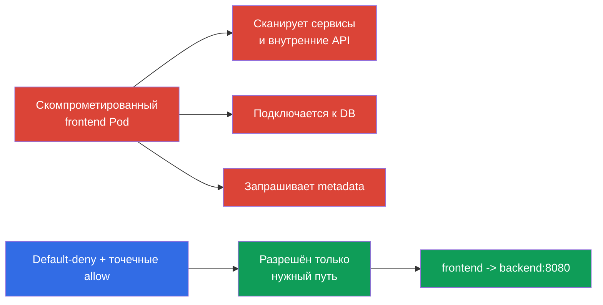
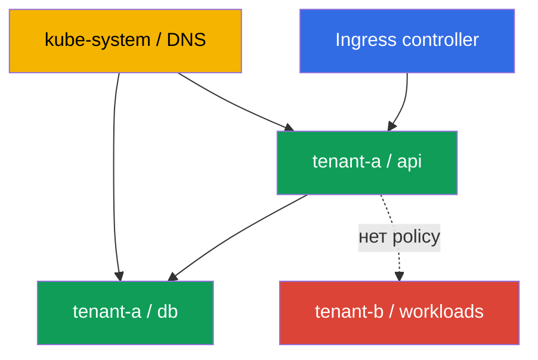

<!-- Standalone RU release: ссылки на переводы удалены, потому что соответствующие файлы не входят в архив. -->

# Глава 04. NetworkPolicy для безопасности

> **Что дальше.** В предыдущих главах мы разобрали модель угроз и механизмы изоляции Linux. Теперь ограничим один из главных путей lateral movement: сеть между Pod. **NetworkPolicy** превращает плоскую pod-сеть в набор явно разрешённых связей. Это домен Cluster Setup (10%) CKS.

> **Что нужно из CKA.** Базовый синтаксис `NetworkPolicy`, селекторы и модель сети Pod разобраны в [главе 34 CKA](../../../cka/course/34/ru.md). Устройство pod-сети и роль CNI - в [главе 30 CKA](../../../cka/course/30/ru.md). Здесь рассматриваем применение этих механизмов как средства защиты, а не повторяем основу.

## 04.1. Сценарий атаки: скомпрометированный Pod в плоской сети

Без политик большинство CNI пропускает трафик между всеми Pod, а часто и их исходящий трафик. Если атакующий получил выполнение команд в `frontend`, он может сканировать адреса сервисов, подключаться к базам данных, запрашивать внутренние HTTP API и пытаться получить cloud metadata. Такое перемещение после initial access называют **lateral movement**.



`NetworkPolicy` применяется к Pod по меткам, а не к Service. Service остаётся удобной DNS-точкой назначения, но CNI принимает решение по исходному и конечному Pod, IP, порту и правилам политики. Политика не заменяет RBAC, TLS или security group: это один слой defense in depth.

## 04.2. Default-deny: сначала закрыть, затем разрешить

Безопасная исходная позиция для namespace - запретить весь ingress и egress. Политика с пустым `podSelector` выбирает все Pod namespace. Пустые списки `ingress` и `egress` означают отсутствие разрешённых направлений.

```yaml
apiVersion: networking.k8s.io/v1
kind: NetworkPolicy
metadata:
  name: default-deny-ingress
  namespace: payments
spec:
  podSelector: {}
  policyTypes:
  - Ingress
---
apiVersion: networking.k8s.io/v1
kind: NetworkPolicy
metadata:
  name: default-deny-egress
  namespace: payments
spec:
  podSelector: {}
  policyTypes:
  - Egress
```

Можно объявить оба направления одной политикой:

```yaml
apiVersion: networking.k8s.io/v1
kind: NetworkPolicy
metadata:
  name: default-deny
  namespace: payments
spec:
  podSelector: {}
  policyTypes:
  - Ingress
  - Egress
```

Порядок важен для эксплуатации: сначала определите карту допустимых связей и подготовьте allow-политики, затем примените default-deny и сразу нужные разрешения в контролируемом rollout. Иначе приложения потеряют DNS, доступ к зависимостям, ingress/monitoring-трафику или внешнему API. Обычные kubelet liveness/readiness/startup probes между Pod и его нодой в стандартной модели NetworkPolicy не являются типичным трафиком, который блокирует default-deny; особенности host/CNI всё равно проверяйте в своём окружении. Для нового изолированного namespace полезно создавать deny до запуска рабочих Pod.

Политики аддитивны: Kubernetes не имеет порядка `deny`/`allow` и приоритета между объектами `NetworkPolicy`. Для каждого `Pod` и каждого направления отдельно объединяются allow-правила всех применимых политик. Для соединения `source Pod → destination Pod` стороны проверяются независимо: если source `Pod` изолирован для `Egress`, его egress rules должны разрешать назначение; если destination `Pod` изолирован для `Ingress`, его ingress rules должны разрешать источник. Когда изолированы обе стороны, нужны оба разрешения. Направление, для которого `Pod` не изолирован ни одной применимой `NetworkPolicy`, дополнительного allow-правила не требует.

| Политика | Что изолирует | Когда применять |
|---|---|---|
| Только `Ingress` | Вход в выбранные Pod | Когда исходящие связи пока нельзя ограничить |
| Только `Egress` | Исходящий трафик выбранных Pod | Для защиты metadata, внешних API и exfiltration |
| `Ingress` и `Egress` | Оба направления | Нормальная цель для чувствительного namespace |

## 04.3. Точечные разрешения: selector, IP и порт

После default-deny опишите только требуемые связи. Следующий пример разрешает Pod с `app: frontend` обратиться к Pod `app: backend` по TCP 8080 в том же namespace:

```yaml
apiVersion: networking.k8s.io/v1
kind: NetworkPolicy
metadata:
  name: allow-frontend-to-backend
  namespace: payments
spec:
  podSelector:
    matchLabels:
      app: backend
  policyTypes:
  - Ingress
  ingress:
  - from:
    - podSelector:
        matchLabels:
          app: frontend
    ports:
    - protocol: TCP
      port: 8080
---
apiVersion: networking.k8s.io/v1
kind: NetworkPolicy
metadata:
  name: allow-frontend-egress-to-backend
  namespace: payments
spec:
  podSelector:
    matchLabels:
      app: frontend
  policyTypes:
  - Egress
  egress:
  - to:
    - podSelector:
        matchLabels:
          app: backend
    ports:
    - protocol: TCP
      port: 8080
```

Для связи с Pod другого namespace один элемент `from` или `to` должен содержать оба селектора. Два отдельных элемента означают логическое OR, а не пересечение.

```yaml
apiVersion: networking.k8s.io/v1
kind: NetworkPolicy
metadata:
  name: allow-monitoring-scrape
  namespace: payments
spec:
  podSelector:
    matchLabels:
      app: backend
  policyTypes:
  - Ingress
  ingress:
  - from:
    - namespaceSelector:
        matchLabels:
          kubernetes.io/metadata.name: monitoring
      podSelector:
        matchLabels:
          app.kubernetes.io/name: prometheus
    ports:
    - protocol: TCP
      port: 8080
```

`ipBlock` нужен для адресов вне pod-сети: например, для корпоративного egress proxy или конкретного endpoint. Не используйте его как основной способ выбора Pod: пересечение с pod CIDR и поведение при SNAT зависят от реализации CNI.

```yaml
apiVersion: networking.k8s.io/v1
kind: NetworkPolicy
metadata:
  name: allow-egress-proxy
  namespace: payments
spec:
  podSelector: {}
  policyTypes:
  - Egress
  egress:
  - to:
    - ipBlock:
        cidr: 192.0.2.10/32
    ports:
    - protocol: TCP
      port: 3128
```

Ограничивайте одновременно источник, назначение и порт. Политика только с `podSelector` без `ports` допускает все порты выбранного назначения и обычно шире необходимого.

## 04.4. Сетевая изоляция namespace и multi-tenancy

Namespace сам по себе не является сетевой границей. Два tenant могут иметь разные namespace, но без `NetworkPolicy` их Pod часто смогут общаться. Для multi-tenancy задайте baseline для каждого tenant namespace:

1. Default-deny ingress и egress для всех Pod.
2. Allow только внутри приложения: frontend -> backend, worker -> queue, monitoring -> metrics.
3. Явные инфраструктурные исключения: DNS, ingress controller, observability, egress proxy.
4. Отдельные namespace labels для разрешённых межкомандных связей и процесс их изменения через review.



На практике полезно применять baseline автоматически шаблоном namespace или policy-движком. Но обычная `NetworkPolicy` имеет область namespace и не заменяет cluster-wide policy конкретного CNI. Если нужны общекластерные запреты, FQDN-правила или L7-фильтрация, рассмотрите Cilium и его политики в главе 06.

## 04.5. Ловушка egress: DNS перестаёт работать

После default-deny egress приложение обычно не может разрешать имена сервисов и внешние FQDN. Симптом выглядит как ошибка приложения, хотя TCP-правило к backend уже есть: `curl` сообщает `Could not resolve host`, а `nslookup kubernetes.default.svc.cluster.local` ждёт timeout.

Разрешите UDP и TCP 53 к CoreDNS. Метка `k8s-app: kube-dns` обычна для CoreDNS в kube-system, но перед применением подтвердите реальные labels командой `kubectl -n kube-system get pod --show-labels`.

```yaml
apiVersion: networking.k8s.io/v1
kind: NetworkPolicy
metadata:
  name: allow-dns-egress
  namespace: payments
spec:
  podSelector: {}
  policyTypes:
  - Egress
  egress:
  - to:
    - namespaceSelector:
        matchLabels:
          kubernetes.io/metadata.name: kube-system
      podSelector:
        matchLabels:
          k8s-app: kube-dns
    ports:
    - protocol: UDP
      port: 53
    - protocol: TCP
      port: 53
```

Проверяйте также конкретную архитектуру кластера: NodeLocal DNSCache может направлять запросы на локальный IP, а managed Kubernetes может иметь иные метки или DNS-компоненты. Не открывайте egress `0.0.0.0/0` только для исправления DNS: это отменяет цель egress isolation.

## 04.6. Проверка, диагностика и границы механизма

Сначала убедитесь, что CNI вообще реализует `NetworkPolicy`. Сам API-объект принимается Kubernetes независимо от возможностей CNI; при отсутствии поддержки объект существует, но трафик не меняется. Сверьте документацию установленного CNI и создайте контролируемый тест.

> **Граница NetworkPolicy.** Это фильтрация сетевого трафика Pod, а не полная изоляция tenant. Трафик Pod с node, на которой он размещён, включая node-local агенты, kubelet probes и host endpoints, обрабатывается CNI по-разному и не образует переносимой границы. Поведение для `hostNetwork` Pod также CNI-специфично: такой трафик нередко выглядит как node IP, поэтому `podSelector` и `namespaceSelector` могут не сработать ожидаемым образом. Порядок применения NAT и policy зависит от реализации: не делайте переносимое правило `ipBlock` для Service `ClusterIP`, pod CIDR или адреса после SNAT. Для Pod выбирайте источник и назначение селекторами, а `ipBlock` оставляйте для документированных внешних адресов. Помимо сети нужны отдельные controls для kernel и node, API/RBAC, Secret, admission и scheduler; также применяйте TLS, host firewall и возможности конкретного CNI.

Перед тестом подготовьте известный исправный контрольный endpoint: например, Service `control`, который выбирает listener Pod с точной меткой `app=control` и отвечает на TCP 8080. Проверьте его без новых policy или из заранее разрешённого диагностического Pod. Не используйте для отрицательного теста несуществующее DNS-имя: так будет проверен DNS, а не политика. Затем сверьте реальные labels всех участников:

```bash
# Найти CNI и DNS-поды, затем проверить созданные политики и labels
kubectl -n kube-system get pods -o wide
kubectl -n kube-system get pod --show-labels | grep -E 'coredns|kube-dns'
kubectl -n payments get networkpolicy
kubectl -n payments describe networkpolicy default-deny
kubectl -n payments get pod --show-labels

# Временно создать источники с теми же точными labels, что в policy
kubectl -n payments run netshoot \
  --image=nicolaka/netshoot:v0.16 \
  --labels=app=frontend \
  --restart=Never -- sleep 3600
kubectl -n payments run netshoot-untrusted \
  --image=nicolaka/netshoot:v0.16 \
  --labels=app=untrusted \
  --restart=Never -- sleep 3600
kubectl -n payments wait --for=condition=Ready pod/netshoot --timeout=90s
kubectl -n payments wait --for=condition=Ready pod/netshoot-untrusted --timeout=90s

# Сначала подтвердить DNS и известный исправный контрольный endpoint
kubectl -n payments exec netshoot -- nslookup control.payments.svc.cluster.local
kubectl -n payments exec netshoot -- nc -vz -w 3 control 8080
```

Для воспроизводимого результата выполняйте четыре случая. В таблице `backend`, `control` и `egress-denied-control` - Service с listener Pod, выбранными соответственно точными метками `app=backend`, `app=control` и `app=egress-denied-control`. Для отрицательного ingress временно разрешите только egress `app=untrusted` к `app=backend:8080`; для отрицательного egress разрешите ingress в `app=egress-denied-control` от `app=frontend`, но не создавайте egress rule для этого назначения. Тогда отказ можно отнести к проверяемому направлению, а не к политике другой стороны.

| Случай | Точные labels и требуемые policy | Команда и ожидаемый результат |
|---|---|---|
| Разрешённый ingress | `app=frontend` -> `app=backend`; backend ingress разрешает frontend, frontend egress разрешает backend на TCP 8080 | `kubectl -n payments exec netshoot -- nc -vz -w 3 backend 8080` - успех |
| Запрещённый ingress | `app=untrusted` -> `app=backend`; egress untrusted временно разрешён, но backend ingress допускает только `app=frontend` | `kubectl -n payments exec netshoot-untrusted -- nc -vz -w 3 backend 8080` - отказ |
| Разрешённый egress | `app=frontend` -> `app=control`; control ingress допускает frontend, frontend egress разрешает control на TCP 8080 | `kubectl -n payments exec netshoot -- nc -vz -w 3 control 8080` - успех |
| Запрещённый egress | `app=frontend` -> `app=egress-denied-control`; ingress назначения допускает frontend, но frontend egress не разрешает это назначение | `kubectl -n payments exec netshoot -- nc -vz -w 3 egress-denied-control 8080` - отказ |

Для проверки роли источника используйте те же labels и ServiceAccount, что у приложения. Результат запрещённого соединения зависит от CNI и listener: это может быть timeout, `connection refused` или сообщение CNI. Фиксируйте вместе успешный контрольный запрос и ожидаемую недоступность, а временные test-policy и Pod удаляйте после проверки.

| Симптом | Проверка и вероятная причина |
|---|---|
| Политика есть, трафик не блокируется | CNI не поддерживает `NetworkPolicy`, политика выбрала не те labels или направление не изолировано |
| Все запросы перестали работать | Default-deny egress применён без DNS или без allow к обязательной зависимости |
| Между namespace трафик разрешён слишком широко | `namespaceSelector` и `podSelector` записаны отдельными элементами списка, поэтому сработал OR |
| Policy не выбирает Pod | Метка задана у Deployment template иначе, чем в `podSelector`; сверить `kubectl get pod --show-labels` |
| Внешний адрес не блокируется | Не задана egress isolation, `ipBlock` не соответствует фактическому адресу, порядок NAT отличается от ожидания или трафик обходит ожидаемую точку |

## 04.7. Как это применяют в продакшене

- **Baseline как код.** Default-deny и минимальные allow-правила хранят рядом с манифестами рабочих нагрузок, проверяют как код и применяют при создании namespace.
- **Карта зависимостей до включения deny.** Команда фиксирует входящие и исходящие связи, включая DNS, health checks, metrics, registry, proxy и внешние SaaS API. Это уменьшает риск аварии при rollout.
- **Метки как контракт.** Стабильные labels для роли приложения и tenant документируют и проверяют. Случайные или слишком общие метки делают политику шире ожидаемого.
- **Наблюдаемость.** До и после изменения политики смотрят flow logs CNI, метрики ошибок и latency. Для Cilium это Hubble; подход разобран в главе 06.
- **Многоуровневая защита.** Egress policy дополняют cloud firewall, private endpoints, identity и TLS. Особенно чувствительные назначения, включая metadata, защищают на нескольких уровнях.

## 04.8. Мини-глоссарий

- **NetworkPolicy** - Kubernetes API-объект, который задаёт разрешённый ingress и egress для выбранных Pod.
- **Default-deny** - политика, изолирующая направление по умолчанию, пока его не разрешит другая политика.
- **Ingress** - трафик, входящий в Pod.
- **Egress** - трафик, исходящий из Pod.
- **podSelector** - выбор Pod по labels в namespace политики.
- **namespaceSelector** - выбор namespace по labels для межnamespace-правила.
- **ipBlock** - правило для CIDR или отдельного IP-адреса.
- **Lateral movement** - перемещение атакующего от скомпрометированной нагрузки к другим системам.
- **CNI** - сетевой плагин кластера; именно он должен реализовать применение NetworkPolicy.

## 04.9. Итоги главы

- Плоская pod-сеть даёт скомпрометированной нагрузке путь для lateral movement; `NetworkPolicy` уменьшает эту поверхность атаки.
- Начинайте с default-deny ingress и egress, затем разрешайте только необходимые направления, источники, назначения и порты.
- Политики аддитивны: разрешение должно существовать для изолированного egress источника и изолированного ingress назначения.
- Для межnamespace-связи помещайте `namespaceSelector` и `podSelector` в один элемент правила, если нужны оба условия.
- Egress default-deny требует явного разрешения DNS, обычно к CoreDNS на UDP/TCP 53.
- API-объект сам по себе не гарантирует фильтрацию: нужен CNI с поддержкой `NetworkPolicy` и проверка разрешённого и запрещённого трафика.

## 04.10. Как это пригодится: на экзамене и в реальной работе

**На экзамене.** Нужно быстро создать default-deny для namespace, разрешить заданный Pod-to-Pod путь, DNS или IP/CIDR и подтвердить результат `kubectl exec`. Внимательно читайте, какое направление ограничить: ingress, egress или оба. Типичная ошибка - разрешить backend ingress, но забыть frontend egress либо DNS.

**В реальной работе.** NetworkPolicy ограничивает ущерб при компрометации приложения и отделяет tenant друг от друга. Наиболее полезный навык - не написание большого правила, а составление минимальной карты фактических сетевых зависимостей и безопасный rollout без нарушения работы сервиса.

## 04.11. Вопросы для самопроверки

1. Почему отсутствие NetworkPolicy помогает lateral movement после компрометации Pod?
2. Что означает пустой `podSelector: {}` в политике namespace?
3. Почему default-deny ingress backend недостаточен для связи frontend -> backend при изолированном egress?
4. В чём разница между двумя отдельными элементами `from` и одним элементом с `namespaceSelector` и `podSelector`?
5. Почему после default-deny egress часто перестаёт работать DNS и какие протоколы надо разрешить?
6. Почему наличие объекта `NetworkPolicy` не доказывает, что трафик блокируется?
7. Какие зависимости, помимо прикладных сервисов, нужно учесть перед rollout default-deny?

## Практика

🧪 Лаба 101 (NetworkPolicy: default-deny, изоляция, metadata): [tasks/cks/labs/101](../../labs/101/README_RU.MD)

---
[Оглавление](../README_RU.md) · [Глава 03](../03/ru.md) · [Глава 05](../05/ru.md)
