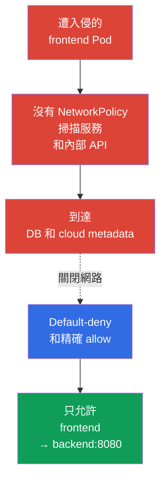
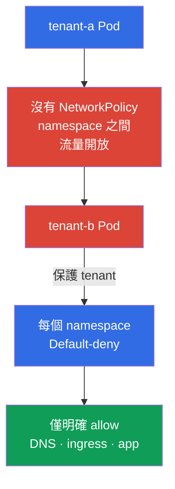

[Русская версия](ru.md) · [Eng version](README.md) · [Versión en español](es.md) · [Version française](fr.md) · [Deutsche Version](de.md) · [ქართული ვერსია](ge.md) · [日本語版](jp.md)

# 第 04 章。用 NetworkPolicy 實現安全防護

> **問題。** 某個 Pod 中的 RCE 會給攻擊者一個 foothold，而扁平的 pod 網路常讓他能掃描服務、連接 DB、內部 API 和 cloud metadata。這就是 lateral movement：一個應用程式被入侵，便成為進入其他系統的入口。

> **接下來。** 前幾章已說明威脅模型和 Linux 隔離機制。現在縮小遭入侵 Pod 可使用的網路路徑。**NetworkPolicy** 將扁平 pod 網路變成一組明確允許的連線。這是 CKS Cluster Setup（15%）領域。

> **需要的 CKA 基礎。** `NetworkPolicy` 基本語法、selector 和 Pod 網路模型見 [CKA 第 34 章](../../../cka/course/34/tw.md)。Pod 網路結構及 CNI 的作用見 [CKA 第 30 章](../../../cka/course/30/tw.md)。本章著重將這些機制作為防護工具，而不重複基礎內容。

> 🧠 `NetworkPolicy` 將扁平網路轉為 workload 之間的最小路徑集合。

## 04.1 攻擊情境：扁平網路中的遭入侵 Pod

沒有 policy 時，多數 CNI 允許所有 Pod 之間的流量，通常也允許其對外流量。若攻擊者在 `frontend` 取得命令執行能力，就能掃描服務位址、連線到資料庫、請求內部 HTTP API，並嘗試取得 cloud metadata。這種 initial access 後的移動稱為 **lateral movement**。



`NetworkPolicy` 依 labels 套用到 Pod，而不是 Service。Service 仍是方便的 DNS 目的地，但 CNI 會依來源與目的 Pod、IP、port 及 policy 規則決定。Policy 不能取代 RBAC、TLS 或 security group：它是 defense in depth 的一層。

> 🎯 先對需要的方向設定 default-deny，再依 labels、namespace 和 port 精確 allow；另行允許 DNS 及必要的跨 namespace 路徑。

## 04.2 Default-deny：先關閉，再允許

Namespace 的安全初始狀態是禁止所有 ingress 和 egress。空的 `podSelector` 選取 namespace 中的所有 Pod。空的 `ingress` 和 `egress` 清單表示沒有允許的方向。

```yaml
apiVersion: networking.k8s.io/v1
kind: NetworkPolicy
metadata:
  name: default-deny-ingress
  namespace: payments
spec:
  podSelector: {}
  policyTypes:
  - Ingress
---
apiVersion: networking.k8s.io/v1
kind: NetworkPolicy
metadata:
  name: default-deny-egress
  namespace: payments
spec:
  podSelector: {}
  policyTypes:
  - Egress
```

也可以用一個 policy 宣告兩個方向：

```yaml
apiVersion: networking.k8s.io/v1
kind: NetworkPolicy
metadata:
  name: default-deny
  namespace: payments
spec:
  podSelector: {}
  policyTypes:
  - Ingress
  - Egress
```

操作順序很重要：先繪製允許連線的地圖並準備 allow policy，再以受控 rollout 套用 default-deny 和必要的允許。否則應用程式會失去 DNS、依賴服務、ingress/monitoring 流量或外部 API。標準 NetworkPolicy 模型中，普通 kubelet liveness/readiness/startup probe 在 Pod 與其節點之間並不是通常會被 default-deny 阻擋的流量；仍要在自己的 host/CNI 環境確認。對新的隔離 namespace，適合在啟動工作 Pod 前建立 deny。

Policy 具有累加性：Kubernetes 沒有 policy 物件之間的 `deny`/`allow` 順序或優先級。對每個 Pod 和每個方向，會合併所有適用 policy 的 allow 規則。對 `source Pod → destination Pod` 連線，兩端獨立檢查：若來源 Pod 的 Egress 被隔離，其 egress rules 必須允許目的地；若目的 Pod 的 Ingress 被隔離，其 ingress rules 必須允許來源。兩端都隔離時，需要兩邊的允許。已允許連線的 reply traffic 不需要額外反向規則，會隱含允許。Pod 沒有被任何適用 policy 隔離的方向，不需要額外 allow。

| Policy | 隔離內容 | 使用時機 |
|---|---|---|
| 僅 `Ingress` | 進入所選 Pod 的流量 | 暫時不能限制對外連線時 |
| 僅 `Egress` | 所選 Pod 的對外流量 | 保護 metadata、外部 API 和 exfiltration |
| `Ingress` 和 `Egress` | 兩個方向 | 敏感 namespace 的正常目標 |

## 04.3 精確允許：selector、IP 與 port

Default-deny 後只描述必要連線。以下範例允許 `app: frontend` Pod 在同一 namespace 以 TCP 8080 存取 `app: backend` Pod：

```yaml
apiVersion: networking.k8s.io/v1
kind: NetworkPolicy
metadata:
  name: allow-frontend-to-backend
  namespace: payments
spec:
  podSelector:
    matchLabels:
      app: backend
  policyTypes:
  - Ingress
  ingress:
  - from:
    - podSelector:
        matchLabels:
          app: frontend
    ports:
    - protocol: TCP
      port: 8080
---
apiVersion: networking.k8s.io/v1
kind: NetworkPolicy
metadata:
  name: allow-frontend-egress-to-backend
  namespace: payments
spec:
  podSelector:
    matchLabels:
      app: frontend
  policyTypes:
  - Egress
  egress:
  - to:
    - podSelector:
        matchLabels:
          app: backend
    ports:
    - protocol: TCP
      port: 8080
```

連線到另一個 namespace 的 Pod 時，單一 `from` 或 `to` 元素必須包含兩個 selector。兩個分開的元素表示邏輯 OR，而不是交集。

```yaml
apiVersion: networking.k8s.io/v1
kind: NetworkPolicy
metadata:
  name: allow-monitoring-scrape
  namespace: payments
spec:
  podSelector:
    matchLabels:
      app: backend
  policyTypes:
  - Ingress
  ingress:
  - from:
    - namespaceSelector:
        matchLabels:
          kubernetes.io/metadata.name: monitoring
      podSelector:
        matchLabels:
          app.kubernetes.io/name: prometheus
    ports:
    - protocol: TCP
      port: 8080
```

`ipBlock` 用於 pod 網路之外的位址，例如企業 egress proxy 或特定 endpoint。不要用它作為選取 Pod 的主要方法：與 pod CIDR 的交集及 SNAT 行為取決於 CNI 實作。

```yaml
apiVersion: networking.k8s.io/v1
kind: NetworkPolicy
metadata:
  name: allow-egress-proxy
  namespace: payments
spec:
  podSelector: {}
  policyTypes:
  - Egress
  egress:
  - to:
    - ipBlock:
        cidr: 192.0.2.10/32
    ports:
    - protocol: TCP
      port: 3128
```

同時限制來源、目的地和 port。只有 `podSelector` 而沒有 `ports` 的 policy，會允許到所選目的地的所有 port，通常比需要的範圍更寬。API 也支援數值 port 的 `endPort` 範圍（v1.25 起 Stable）：`endPort` 不得小於 `port`，且兩者都必須是數值。實際範圍套用取決於 CNI，請在環境中驗證。

## 04.4 Namespace 網路隔離與 multi-tenancy

Namespace 本身不是網路邊界。兩個 tenant 可以使用不同 namespace，但沒有 `NetworkPolicy` 時其 Pod 常能互相連線。對 multi-tenancy，為每個 tenant namespace 設定 baseline：

1. 所有 Pod 的 ingress 和 egress default-deny。
2. 只允許應用程式內部：frontend -> backend、worker -> queue、monitoring -> metrics。
3. 明確的基礎設施例外：DNS、ingress controller、observability、egress proxy。
4. 為允許的跨團隊連線設定獨立 namespace labels，並透過 review 管理其變更流程。



實務上可用 namespace template 或 policy engine 自動套用 baseline。但普通 `NetworkPolicy` 只作用於其 namespace，不能取代特定 CNI 的 cluster-wide policy。若需要全叢集禁止、FQDN 規則或 L7 過濾，請考慮第 06 章的 Cilium policy。

> **Production note，非考試內容。** Core `networking.k8s.io/v1` `NetworkPolicy` 仍是 CKS 最具可攜性的主要 API。SIG Network 正在發展獨立的跨 CNI API `ClusterNetworkPolicy` (`policy.networking.k8s.io/v1alpha2`)，但它是 emerging/實驗性 API，支援程度取決於 CNI；不能取代 core API 或 Cilium/Calico 等 vendor-specific 擴充。

## 04.5 Egress 陷阱：DNS 停止運作

Default-deny egress 後，應用程式通常無法解析服務名稱和外部 FQDN。症狀看似應用程式錯誤，即使到 backend 的 TCP 規則已存在：`curl` 回報 `Could not resolve host`，而 `nslookup kubernetes.default.svc.cluster.local` 等待 timeout。

允許到 CoreDNS 的 UDP 和 TCP 53。`k8s-app: kube-dns` 是 kube-system 中 CoreDNS 的常見 label，但套用前請以 `kubectl -n kube-system get pod --show-labels` 確認實際 labels。

```yaml
apiVersion: networking.k8s.io/v1
kind: NetworkPolicy
metadata:
  name: allow-dns-egress
  namespace: payments
spec:
  podSelector: {}
  policyTypes:
  - Egress
  egress:
  - to:
    - namespaceSelector:
        matchLabels:
          kubernetes.io/metadata.name: kube-system
      podSelector:
        matchLabels:
          k8s-app: kube-dns
    ports:
    - protocol: UDP
      port: 53
    - protocol: TCP
      port: 53
```

也要確認叢集的實際架構：NodeLocal DNSCache 可能將請求導向本機 IP，managed Kubernetes 也可能使用不同 labels 或 DNS 元件。不要只為修復 DNS 而開放 `0.0.0.0/0` egress，這會取消 egress isolation 的目的。

## 04.6 驗證、診斷與機制邊界

先確認 CNI 確實實作 `NetworkPolicy`。不論 CNI 能力如何，Kubernetes 都會接受 API 物件；若不支援，物件存在但流量不變。查閱已安裝 CNI 文件，建立受控測試。

> 🎯 以對已確認 listener 的可控 TCP/UDP 允許和禁止請求，證明 policy 的效果。

> 🔬 對 `hostNetwork`、NAT、node traffic 和 ICMP 分別檢查規格邊界與 CNI edge cases。

**NetworkPolicy 的邊界：逐項驗證。**

- **它是 Pod 流量過濾，不是完整 tenant 隔離。** NetworkPolicy 縮小網路路徑，但不保護 kernel、node、Kubernetes API/RBAC、Secret、admission 或 scheduler；需搭配 TLS、host firewall 和 CNI 特定工具。
- **Local-node exception 由 Kubernetes 規格定義。** Pod 與其所在 node 之間的流量，不論 Pod 或 node IP，永遠允許；從本機 node ingress 到隔離 Pod 也允許。這是可攜規則，不是 CNI 差異。
- **`hostNetwork` 和 host-aware controls 取決於 CNI。** 這類流量常看起來像 node IP，因此 `podSelector` 和 `namespaceSelector` 可能不如預期；請在自己的 CNI 驗證。
- **所有協定沒有相同的可攜語義。** Core NetworkPolicy 為 TCP、UDP 和 SCTP 定義語義（SCTP 須有 CNI 支援）。ICMP、ARP 等協定的 allow/deny 由實作決定，因此 `ping` 不能可攜地證明 default-deny 生效或失效。
- **不要以內部路由為基礎建立可攜的 `ipBlock` 規則。** NAT 和 policy 順序取決於實作。對 Service `ClusterIP`、pod CIDR 或 SNAT 後位址，使用 Pod selector；`ipBlock` 僅留給有文件記錄的外部位址。
- **已開啟的連線行為不一致。** policy 或 labels 變更後，CNI 可能中斷連線，也可能讓它持續到關閉。rollout、incident response 和測試時要考慮這點。

測試前準備已知正常的控制 endpoint，例如 Service `control`，它選取具有精確 `app=control` label 且在 TCP 8080 監聽的 Pod。在新增 policy 前，或從預先允許的診斷 Pod，先確認它。不要用不存在的 DNS 名稱做負向測試，否則檢查的是 DNS 而非 policy。接著核對所有參與者的實際 labels：

```bash
# 找到 CNI 和 DNS Pod，然後檢查已建立的 policy 與 labels
kubectl -n kube-system get pods -o wide
kubectl -n kube-system get pod --show-labels | grep -E 'coredns|kube-dns'
kubectl -n payments get networkpolicy
kubectl -n payments describe networkpolicy default-deny
kubectl -n payments get pod --show-labels

# 暫時建立與 policy 相同精確 labels 的來源。
# 對標準 NetworkPolicy，ServiceAccount 不是 selector：它只對
# CNI-specific identity policy 或其他擴充重要。
kubectl -n payments run netshoot \
  --image=nicolaka/netshoot:v0.16 \
  --labels=app=frontend \
  --restart=Never \
  --command -- sleep 3600
kubectl -n payments run netshoot-untrusted \
  --image=nicolaka/netshoot:v0.16 \
  --labels=app=untrusted \
  --restart=Never \
  --command -- sleep 3600
kubectl -n payments wait --for=condition=Ready pod/netshoot --timeout=90s
kubectl -n payments wait --for=condition=Ready pod/netshoot-untrusted --timeout=90s

# 先確認 DNS 和已知正常的控制 endpoint
kubectl -n payments exec netshoot -- nslookup control.payments.svc.cluster.local
kubectl -n payments exec netshoot -- nc -vz -w 3 control 8080
```

為得到可重現結果，執行四種情況。表中 `backend`、`control` 和 `egress-denied-control` 是 Service，分別選取具有精確 `app=backend`、`app=control` 和 `app=egress-denied-control` labels 的 listener Pod。對負向 ingress，暫時只允許 `app=untrusted` 到 `app=backend:8080` 的 egress；對負向 egress，允許 `app=frontend` ingress 到 `app=egress-denied-control`，但不要為此目的地建立 egress rule。如此拒絕可歸因於被驗證的方向，而不是另一端的 policy。

| 情況 | 精確 labels 和必要 policy | 命令與預期結果 |
|---|---|---|
| 允許 ingress | `app=frontend` -> `app=backend`；backend ingress 允許 frontend，frontend egress 在 TCP 8080 允許 backend | `kubectl -n payments exec netshoot -- nc -vz -w 3 backend 8080` - 成功 |
| 禁止 ingress | `app=untrusted` -> `app=backend`；暫時允許 untrusted egress，但 backend ingress 只允許 `app=frontend` | `kubectl -n payments exec netshoot-untrusted -- nc -vz -w 3 backend 8080` - 拒絕 |
| 允許 egress | `app=frontend` -> `app=control`；control ingress 允許 frontend，frontend egress 在 TCP 8080 允許 control | `kubectl -n payments exec netshoot -- nc -vz -w 3 control 8080` - 成功 |
| 禁止 egress | `app=frontend` -> `app=egress-denied-control`；目的 ingress 允許 frontend，但 frontend egress 不允許目的地 | `kubectl -n payments exec netshoot -- nc -vz -w 3 egress-denied-control 8080` - 拒絕 |

對標準 `NetworkPolicy`，要驗證來源角色，使用與應用程式相同的 labels、namespace、IP 路徑和 port；同一 ServiceAccount 只對 CNI-specific identity policy 有用。負向測試要連到事先確認的 listener：單獨的 `connection refused` 不證明遭阻擋，因為可能沒有 listener、Service/backend 錯誤或應用程式拒絕。記錄成功的控制請求、預期不可用狀態，以及 CNI 提供的 deny/drop event 或 flow log，然後刪除暫時的 test-policy 和 Pod。

| 症狀 | 檢查與可能原因 |
|---|---|
| 有 policy，但流量未被阻擋 | CNI 不支援 `NetworkPolicy`、policy 選錯 labels，或該方向未隔離 |
| 所有請求都停止 | 套用 default-deny egress 卻沒有 DNS 或必要依賴的 allow |
| Namespace 間流量過度開放 | `namespaceSelector` 和 `podSelector` 寫成清單中的分開元素，因而使用 OR |
| Policy 未選取 Pod | Deployment template 的 label 與 `podSelector` 不同；用 `kubectl get pod --show-labels` 核對 |
| 外部位址未被阻擋 | 未設定 egress isolation、`ipBlock` 不符實際位址、NAT 順序與預期不同，或流量繞過預期位置 |

以上教學診斷使用 tag `nicolaka/netshoot:v0.16`；tag 可能變更，或在 offline 環境不存在。Production 和可重現實驗應以 digest pin image，並預先確保 pre-pull/registry 可用。

> 🏭 流量盤點、staging 和 canary、觀察 DNS/錯誤/flows、已驗證的 rollback 及 versioned baseline。

## 04.7 Production 中的應用方式

- **Baseline 即程式碼。** Default-deny 和最小 allow policy 與 workload manifest 一起保存，像程式碼一樣檢查，並在建立 namespace 時套用。
- **啟用 deny 前先列依賴。** 團隊記錄 ingress 和 egress 連線，包括 DNS、health checks、metrics、registry、proxy 和外部 SaaS API，降低 rollout 事故風險。
- **Labels 是契約。** 應用角色和 tenant 的穩定 labels 要記錄並驗證；labels schema 變更應作為 API 契約 review。隨意或過於寬泛的 labels 會使 policy 超出預期。
- **Enforcement 前先預覽。** 啟用新 policy 前依流量地圖評估影響，在 staging 測試；若 CNI 支援，使用 audit/observe mode。rollout enforcement 前驗證允許和禁止的路徑。
- **可觀測性。** policy 變更前後查看 CNI flow logs、錯誤指標和 latency。Cilium 使用 Hubble；方法見第 06 章。
- **多層防護。** Egress policy 需搭配 cloud firewall、private endpoints、identity 和 TLS。包括 metadata 在內的敏感目的地要由多層保護。

## 04.8 小詞彙表

- **NetworkPolicy** - 為所選 Pod 設定允許 ingress 和 egress 的 Kubernetes API 物件。
- **Default-deny** - 預設隔離一個方向，直到其他 policy 允許它。
- **Ingress** - 進入 Pod 的流量。
- **Egress** - 從 Pod 流出的流量。
- **podSelector** - 依 policy 所在 namespace 中的 labels 選取 Pod。
- **namespaceSelector** - 依 labels 選取 namespace，用於跨 namespace 規則。
- **ipBlock** - 針對 CIDR 或單一 IP 位址的規則。
- **Lateral movement** - 攻擊者從遭入侵 workload 移向其他系統。
- **CNI** - 叢集的網路 plugin；必須由它實作 NetworkPolicy 的套用。

## 04.9 本章總結

- 扁平 pod 網路讓遭入侵 workload 可進行 lateral movement；`NetworkPolicy` 降低這個攻擊面。
- 從 ingress 和 egress default-deny 開始，再只允許必要方向、來源、目的地和 port。
- Policy 具有累加性：隔離的 egress 來源和隔離的 ingress 目的都必須各有允許。
- 跨 namespace 連線若需要兩個條件，將 `namespaceSelector` 和 `podSelector` 放在同一個規則元素中。
- Egress default-deny 需要明確允許 DNS，通常是 CoreDNS 的 UDP/TCP 53。
- API 物件本身不保證過濾：需要支援 `NetworkPolicy` 的 CNI，並驗證允許與禁止流量。

## 04.10 這對考試和實際工作有何用

**考試中。** 需要快速為 namespace 建立 default-deny，允許指定的 Pod-to-Pod 路徑、DNS 或 IP/CIDR，並以 `kubectl exec` 確認結果。仔細閱讀要限制的方向：ingress、egress 或兩者。常見錯誤是允許 backend ingress，卻忘記 frontend egress 或 DNS。

**實際工作中。** NetworkPolicy 限制應用程式遭入侵時的損害，並隔離 tenant。最有用的能力不是寫大型規則，而是建立最小的實際網路依賴地圖，在不破壞服務的情況下安全 rollout。

> ### 🔴 攻擊者視角
> **Asset:** backend Service 和內部 API。
>
> **Starting foothold:** Pod `frontend` 中的 RCE。
>
> **Attacker objective:** 發現內部 endpoints 並連到 backend。
>
> **Abuse path:** DNS discovery -> 透過 Service 存取 -> 若網路未隔離則直接存取 Pod/IP。
>
> **Expected evidence:** CNI/Hubble flows、DNS 請求及封鎖時的 dropped packets。
>
> **Control:** ingress 和 egress default-deny，加上依 identity/labels 與 port 的明確規則。
>
> **Retest:** 同一請求從 `frontend` 只能到允許的 backend；來自其他 Pod 的請求被阻擋。

## 04.11 自我檢查問題

<details>
<summary>1. 為什麼沒有 NetworkPolicy 會幫助 Pod 遭入侵後的 lateral movement？</summary>

沒有 policy 時，多數 CNI 允許 Pod 之間及對外流量。攻擊者在 `frontend` 取得 shell 或 RCE 後，可以掃描 Service、連線 DB、內部 API 和 metadata endpoint；default-deny 加上精確 allow policy 可縮小這條路徑。
</details>

<details>
<summary>2. Policy namespace 中空的 `podSelector: {}` 是什麼意思？</summary>

空的 `podSelector` 選取建立 policy 的 namespace 中所有 Pod。與 `policyTypes: Ingress` 或 `Egress` 及空規則清單搭配時，會為全部這些 Pod 隔離相應方向。
</details>

<details>
<summary>3. 為什麼 backend 的 default-deny ingress 不足以支援隔離 egress 時的 frontend -> backend？</summary>

兩端的 ingress 和 egress 分開檢查。若 backend 以 ingress 隔離，其規則必須允許 frontend；frontend 若以 egress 隔離，還必須另行允許到 backend:8080。只有已允許的連線，其回覆流量才會隱含允許。
</details>

<details>
<summary>4. 兩個分開的 `from` 元素與一個同時含 `namespaceSelector`、`podSelector` 的元素有何不同？</summary>

兩個分開的清單元素表示邏輯 OR：一個可允許整個選定 namespace，另一個可允許 policy namespace 中具有 label 的 Pod。需要兩個條件時，將兩個 selector 放入同一元素，來源必須同時符合。
</details>

<details>
<summary>5. 為什麼 default-deny egress 後 DNS 常停止？要允許哪些協定？</summary>

Default-deny 阻擋 Pod 到 CoreDNS 的請求，因此 Service 名稱和外部 FQDN 無法解析。要對叢集實際 DNS endpoint 允許 UDP 53 和 TCP 53，並先檢查 CoreDNS labels 及可能使用的 NodeLocal DNSCache。
</details>

<details>
<summary>6. 為什麼存在 `NetworkPolicy` 物件不能證明流量會被阻擋？</summary>

無論已安裝 CNI 是否能套用 NetworkPolicy，Kubernetes 都會接受 API 物件。必須確認 CNI 支援、實際 labels 和方向，再對已知 listener 執行允許及禁止請求；單獨的 `connection refused` 不證明 policy 阻擋。
</details>

<details>
<summary>7. 在 rollout default-deny 前，除應用服務外要考慮哪些依賴？</summary>

要考慮 DNS、ingress controller、monitoring/metrics、egress proxy、registry、外部 SaaS API 和 health checks，並依實際環境確認。套用 deny 前先建立允許流量地圖、準備 allow policy，並在受控 rollout 中驗證，避免破壞服務。
</details>

## 實作

🧪 Lab 101（NetworkPolicy：default-deny、隔離、metadata）：[tasks/cks/labs/101](../../labs/101/README_TW.MD)

🌐 額外互動練習（killer.sh/killercoda，外部資源）：[networkpolicy-create-default-deny](https://killercoda.com/killer-shell-cks/scenario/networkpolicy-create-default-deny) · [networkpolicy-namespace-communication](https://killercoda.com/killer-shell-cks/scenario/networkpolicy-namespace-communication)

## 參考資料

- [Kubernetes：Network Policies](https://kubernetes.io/docs/concepts/services-networking/network-policies/)
- [Kubernetes Network Policy API](https://network-policy-api.sigs.k8s.io/)

---
[目錄](../README_TW.md) · [第 03 章](../03/tw.md) · [第 05 章](../05/tw.md)
