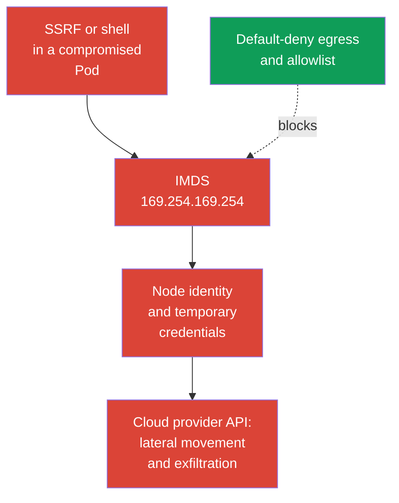
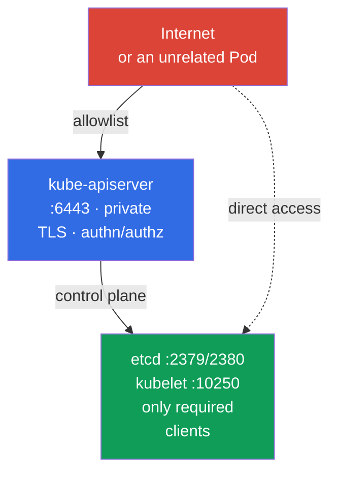

[Русская версия](ru.md)

# Chapter 05. Protecting node metadata and endpoints; protecting GUIs

> **The problem.** A compromised Pod or SSRF can reach an endpoint unavailable to an external user: node cloud metadata, the control plane, or an administrative GUI. A single improperly allowed network path can expose the node's cloud identity and temporary credentials or a privileged management interface. Ordinary workload RBAC does not protect metadata because it is not a Kubernetes API.

> **What comes next.** In Chapter 04, we turned a flat pod network into a set of allowed connections. Now we will apply egress isolation to especially dangerous destinations: cloud metadata, the control plane, and GUIs. This is the Cluster Setup (15%) CKS domain. An error in one such allowed network path can turn a Pod compromise into a cloud identity or cluster compromise.

> **What you need from CKA.** Basic egress `NetworkPolicy` syntax, `ipBlock`, and CNI operation are covered in [CKA Chapter 34](../../../cka/course/34/README.md). Here we consider node metadata and administrative endpoint threats rather than repeat policy basics.

## 05.1. Attack scenario: a Pod reads cloud metadata

A cloud provider often exposes a metadata service to a virtual machine instance at a link-local address. The best-known IPv4 address is `169.254.169.254`. If a Pod can reach it through the node network, an application vulnerability, SSRF, or shell access gives an attacker a new path: obtain instance information and, with a misconfigured cloud identity, temporary node role credentials.



Metadata is not a Kubernetes API or a Service. It is a node infrastructure endpoint, so a Pod can bypass RBAC, ServiceAccount, and application policy if the network permits the request. The threat is especially relevant for workloads that accept incoming HTTP: SSRF makes the application request an address unavailable to the external user.

Check whether the endpoint is reachable from a diagnostic Pod. It must reproduce the target workload's namespace, labels, and material networking characteristics, including `hostNetwork` if used; otherwise, the selector or dataplane can test the wrong path. In production, do not print credentials or the complete metadata response to the terminal and logs. An HTTP status code or a safe path such as the instance name is sufficient for verification.

```bash
kubectl -n payments run metadata-check \
  --image=curlimages/curl:8.22.0 --restart=Never -- sleep 3600
kubectl -n payments wait --for=condition=Ready pod/metadata-check --timeout=90s

# --noproxy excludes the effect of HTTP_PROXY and HTTPS_PROXY.
# A curl error alone does not prove that IMDS is blocked.
kubectl -n payments exec metadata-check -- sh -c '
  tmp_err=$(mktemp)
  http_code=$(curl --noproxy "*" --connect-timeout 3 --max-time 5 \
    -sS -o /dev/null -w "%{http_code}" \
    http://169.254.169.254/latest/meta-data/ 2>"$tmp_err")
  rc=$?

  if [ "$rc" -eq 0 ]; then
    echo "IMDS reachable, HTTP status: $http_code"
    rm -f "$tmp_err"
  else
    echo "IMDS request failed, curl rc=$rc" >&2
    cat "$tmp_err" >&2
    rm -f "$tmp_err"
    echo "REVIEW_REQUIRED: failure alone does not prove that IMDS is blocked" >&2
    exit "$rc"
  fi
'
```

Only a completed `curl` with a fast HTTP response (`200`, `401`, or another status) proves network reachability, but it does not prove access to credentials. A timeout, route/runtime error, or other failure requires separate policy/CNI investigation: it is **not** proof that IMDS is blocked. Delete the temporary Pod after checking:

```bash
kubectl -n payments delete pod metadata-check
```

The metadata address and protocol depend on the provider. `169.254.169.254` is a **typical AWS-like competency scenario, not a guaranteed exam task**. This well-known address is used by AWS IMDS and Azure IMDS; GKE Dataplane V2 also uses it for the GKE metadata server. For Azure, GCP, and a private metadata proxy, consult the provider's documented endpoint and add it separately to the threat model. On AWS with IPv6 IMDS enabled, also account for `fd00:ec2::254`: an IPv4-only block does not prove complete protection.

> 🧠 The metadata endpoint is not limited by RBAC or `ServiceAccount` permissions; SSRF or a shell in a workload can provide cloud credentials when the node network and IAM are broad.

## 05.2. Egress policy for metadata and IMDSv2

`NetworkPolicy` is an allow mechanism, not a global deny firewall. Therefore, the reliable sequence is:

1. Enable default-deny egress for the namespace.
2. Explicitly allow DNS and the application's actual dependencies.
3. Do not allow the node metadata path unless the selected provider workload identity requires it; use a provider-specific allow/block.
4. Check allowed paths and the lack of Pod access to the node's credentials/identity from a Pod with the workload labels.

The baseline below isolates egress for all Pods in the `payments` namespace.

> 🎯 Enable default-deny egress, allow DNS and verified dependencies, exclude metadata from the allowlist, and verify both the allowed path and a denied metadata request.

```yaml
apiVersion: networking.k8s.io/v1
kind: NetworkPolicy
metadata:
  name: default-deny-egress
  namespace: payments
spec:
  podSelector: {}
  policyTypes:
  - Egress
```

Then add separate narrow egress allow rules. For example, most Pods need DNS to CoreDNS. Confirm the actual labels and destination address in your cluster.

```yaml
apiVersion: networking.k8s.io/v1
kind: NetworkPolicy
metadata:
  name: allow-dns-egress
  namespace: payments
spec:
  podSelector: {}
  policyTypes:
  - Egress
  egress:
  - to:
    - namespaceSelector:
        matchLabels:
          kubernetes.io/metadata.name: kube-system
      podSelector:
        matchLabels:
          k8s-app: kube-dns
    ports:
    - protocol: UDP
      port: 53
    - protocol: TCP
      port: 53
```

Sometimes a legacy application temporarily needs broad IPv4 egress. In one such allow rule, `ipBlock.except` excludes IMDS:

```yaml
apiVersion: networking.k8s.io/v1
kind: NetworkPolicy
metadata:
  name: allow-external-ipv4-except-imds
  namespace: payments
spec:
  podSelector:
    matchLabels:
      app: legacy-client
  policyTypes:
  - Egress
  egress:
  - to:
    - ipBlock:
        cidr: 0.0.0.0/0
        except:
        - 169.254.169.254/32
```

This is a migration compromise, not a good final state: the rule still opens almost the whole IPv4 Internet. `except` excludes an address only from this rule. Policies are additive, so another egress allow with `0.0.0.0/0`, a broader CIDR, or the IMDS address will allow metadata again. The durable option is narrow rules for DNS, an egress proxy, CIDRs, or the endpoint of every required dependency. If IPv6 is used, design and test separate IPv6 paths rather than considering an IPv4 policy complete protection.

Network policy protects only when the CNI actually enforces `NetworkPolicy`. `ipBlock.except` for metadata is a common exam-style and transitional pattern, but its enforcement for link-local and host endpoints depends on the CNI and dataplane. In addition, traffic handling to the node and SNAT vary among CNIs and managed Kubernetes. Do not substitute this policy for cloud instance protection and the node firewall: in production, the primary boundary is provider metadata settings and workload identity, while policy is an additional layer.

> 🏭 Version-checked AWS/GKE/AKS controls and evidence for metadata access and the selected workload identity.

| Provider | Node identity | Workload identity and metadata path | Network control | IAM/control and evidence |
|---|---|---|---|---|
| AWS / EKS | Node IAM role through IMDS `169.254.169.254` (and `fd00:ec2::254` with IPv6) | EKS Pod Identity or IRSA instead of node credentials | IMDSv2 with hop limit `1` as a baseline for non-`hostNetwork` Pods; `hostNetwork: true` Pods retain IMDS access and require separate control/admission policy; policy/firewall are additional layers | Minimal node IAM role; CloudTrail and verification that a Pod does not obtain node credentials |
| GKE | Node Service account/access scopes | Workload Identity Federation: Pod -> GKE metadata server (`metadata.google.internal` / metadata IP) -> KSA token -> STS -> short-lived federated token | Current strict policy examples: regular dataplane - `169.254.169.252/32`, TCP `988` and `987`; GKE Dataplane V2 - `169.254.169.254/32`, TCP `80` and `8080`. Check GKE documentation before applying | Minimal KSA/GSA IAM roles; Cloud Audit Logs and federated token verification |
| Azure / AKS | Node managed identity through IMDS `169.254.169.254` | Microsoft Entra Workload ID | AKS IMDS restriction - **Preview**, only for non-`hostNetwork` Pods; it is not intended for a production SLA, is incompatible with some add-ons/extension scenarios, and does not support Windows node pools | Minimal node managed identity; Entra federation verification and separate verification of whether IMDS restriction applies |

GKE Workload Identity creates an important apparent paradox: a secure workload identity itself uses the GKE metadata server. Therefore, you cannot block `169.254.169.254` as a universal rule: this address is used by Azure IMDS and GKE Dataplane V2, not only by AWS. With a strict `NetworkPolicy`, allow only the documented path for the actual GKE dataplane: `169.254.169.252/32` on TCP `988` and `987` for Workload Identity Federation in the regular dataplane, or `169.254.169.254/32` on TCP `80` and `8080` for GKE Dataplane V2. These are current examples, not permanent constants: recheck GKE documentation before applying. `hostNetwork` Pods have a different access model and require separate assessment.

On AWS, enable IMDSv2 at the instance template or instance level: `HttpTokens=required` makes a client first obtain a temporary token through `PUT` and then send it in a header. This reduces a class of SSRF attacks designed for a simple `GET`, but does not replace egress policy: a compromised Pod can still perform a correct IMDSv2 exchange if the endpoint is accessible. For **new workloads on supported node types**, AWS recommends **EKS Pod Identity**; **IRSA** remains an alternative for existing OIDC/IRSA deployments and cases where Pod Identity is not supported, including some Fargate, Windows, or SDK scenarios. For EKS, AWS recommends **not disabling the IMDS endpoint**: node components can depend on it. The secure baseline for ordinary non-`hostNetwork` workloads that use IRSA/EKS Pod Identity is IMDSv2 with hop limit **1**, so that the IMDSv2 response does not cross an additional network hop into the pod network. Use hop limit **2** only as a deliberate exception when a workload genuinely must access IMDS.

This limit does not protect `hostNetwork: true` Pods: AWS states that such Pods retain direct access to IMDS. For untrusted workloads, separately restrict `hostNetwork` through admission/policy and do not consider hop limit `1` adequate protection for host-network Pods.

```bash
# AWS example: set by the infrastructure administrator, not from a Pod.
aws ec2 modify-instance-metadata-options \
  --instance-id i-0123456789abcdef0 \
  --http-tokens required \
  --http-put-response-hop-limit 1

# For EKS this is the baseline: the IMDSv2 response must not reach a Pod through the container network.
# Value 2 is allowed only if a workload genuinely must use IMDS;
# first verify the need and prefer IRSA/EKS Pod Identity over Pod node credentials.
# IMDSv2 requires a token. Use the command only in an isolated test.
TOKEN=$(curl --noproxy '*' -sS -X PUT \
  -H 'X-aws-ec2-metadata-token-ttl-seconds: 60' \
  http://169.254.169.254/latest/api/token)
curl --noproxy '*' -sS -o /dev/null -w '%{http_code}\n' \
  -H "X-aws-ec2-metadata-token: ${TOKEN}" \
  http://169.254.169.254/latest/meta-data/
```

> 🎯 For an endpoint, identify its clients and port, check the bind address, firewall/allowlist, TLS, and authn/authz, then confirm allowed and denied access.

## 05.3. Administrative endpoints: kubelet, etcd, and kube-apiserver

Metadata is not the only target. After gaining access to the pod network, an attacker searches for management endpoints, but their threat models differ. etcd and usually kubelet require strict network restriction. An ordinary Pod normally reaches kube-apiserver through `kubernetes.default`; its protection is built primarily on TLS, authentication, authorization/RBAC, and admission, while egress policy only further restricts unnecessary paths. Do not combine these endpoints into a rule to "block them from all Pods."

| Endpoint | Usual port | Risk when misconfigured | Baseline protection |
|---|---:|---|---|
| kubelet HTTPS | `10250` | Command execution, access to Pod data, or node API with weak authn/authz | Close with a firewall, disable anonymous access, enable Webhook authorization, use TLS |
| kubelet read-only | `10255` | Historically exposed Pod information without authentication | Do not enable it, `--read-only-port=0` |
| etcd client/peer | `2379` / `2380` | Reading or modifying cluster state, including Secrets | `2379` only from authorized etcd clients (primarily kube-apiserver), `2380` only between etcd members; mTLS, firewall, no public exposure |
| kube-apiserver | `6443` | Entry point to the entire Kubernetes API | TLS, strong authn/authz, private endpoint or allowlist, audit |



Check listening ports on a node with authorized administrative access:

```bash
sudo ss -lntp | grep -E ':(10250|10255|2379|2380|6443)\b' || true
# Check process flags and KubeletConfiguration separately: flags need not appear in the YAML configuration.
sudo grep -R -- '--read-only-port\|--anonymous-auth\|--authorization-mode' \
  /etc/systemd/system /usr/lib/systemd/system /etc/default /var/lib/kubelet 2>/dev/null || true
sudo grep -nE 'readOnlyPort|anonymous:|authorization:|webhook:' \
  /var/lib/kubelet/config.yaml 2>/dev/null || true
```

Expect `10250`, `2379`, `2380`, and `6443` to listen on the required interface depending on the topology. The criterion is not to turn off every port, but to restrict sources and enable authentication. For kubelet, check `--read-only-port=0`, `--anonymous-auth=false`, and `--authorization-mode=Webhook`; flags and CIS settings are covered in detail in Chapter 07.

Separately review RBAC: the `nodes/proxy` permission can give a subject access to the kubelet API through the API server and thus to sensitive node operations. Find roles with this permission and inspect their bindings:

```bash
kubectl get clusterrole -o yaml | grep -n -C 3 'nodes/proxy' || true
kubectl get clusterrolebinding \
  -o custom-columns=NAME:.metadata.name,ROLE:.roleRef.name,SUBJECTS:.subjects[*].name
```

`Webhook` authorization is a required baseline, but it is not proof of kubelet security. In Kubernetes v1.36, **Fine-Grained Kubelet Authorization is GA and its feature gate is locked enabled**. Instead of broad `nodes/proxy` for a monitoring/observability role, grant only the required subresources with the minimal set of verbs and only where genuinely necessary. The complete GA endpoint-to-RBAC-subresource map is:

| Kubelet endpoint | Fine-grained RBAC resource | Fallback through `nodes/proxy` |
|---|---|---|
| `/stats/*` | `nodes/stats` | no |
| `/metrics/*` | `nodes/metrics` | no |
| `/logs/*` | `nodes/log` | no |
| `/pods` | `nodes/pods` | yes |
| `/runningPods/` | `nodes/pods` | yes |
| `/healthz` | `nodes/healthz` | yes |
| `/configz` | `nodes/configz` | yes |
| `/spec/*` | `nodes/spec` | no |
| `/checkpoint/*` | `nodes/checkpoint` | no |
| everything else | `nodes/proxy` | applies directly |

> **⚠️ Version delta.** Fine-Grained Kubelet Authorization is GA in v1.36, while in the v1.35 exam snapshot, feature gate `KubeletFineGrainedAuthz` is still Beta (default-on). Before migrating, confirm `authorization.mode: Webhook` and the actual feature-gate state on the target kubelet. Separately check the RBAC of the identity that accesses kubelet, for example `kubectl auth can-i get nodes/metrics --as=system:serviceaccount:<namespace>:<serviceaccount>`. Do not remove `nodes/proxy` until configuration/gate, RBAC, and a real endpoint retest are confirmed.

For `/pods`, `/runningPods/`, `/healthz`, and `/configz`, kubelet first checks the corresponding fine-grained subresource and, on denial, repeats authorization through broad `nodes/proxy`. This is a backward-compatible dual check: while the subject retains `nodes/proxy`, a narrow permission alone does not reduce its effective privileges. After migrating roles, remove `nodes/proxy`; otherwise, least privilege will not be implemented.

For example, a metrics collector usually needs only `get` on `nodes/metrics` and/or `nodes/stats`:

```yaml
rules:
- apiGroups: [""]
  resources: ["nodes/metrics", "nodes/stats"]
  verbs: ["get"]
```

Remove `nodes/proxy` from such roles: even `get` on this subresource is not harmless read-only access. Through kubelet WebSocket endpoints, it can permit command execution in containers. Fine-grained authorization does not replace TLS, network controls, or RBAC review, but it makes it possible to migrate from this broad privilege to verifiable least privilege.

At the cloud layer, use a security group or firewall: allow `2379` only from authorized etcd clients, primarily kube-apiserver; allow `2380` only between etcd members. This difference is important for external etcd. Allow `10250` only to the control plane and explicitly required monitoring; allow `6443` only from trusted networks, a VPN, a bastion, or a private endpoint. Do not expose etcd through NodePort, LoadBalancer, a reverse proxy, or public DNS. etcd requires client/peer TLS and client certificates, not only port filtering.

Ordinary `NetworkPolicy` is useful for Pod-to-Pod traffic, but it is not a universal firewall for host endpoints. Traffic to a node IP can change its source because of SNAT, and a hostNetwork Pod can bypass the pod dataplane. To protect a node, combine CNI policy with a host firewall, cloud network controls, and component configuration. Cilium can provide additional host-aware controls, but they depend on CNI mode and require separate design.

> 🔬 Containment of an existing Kubernetes Dashboard installation and least privilege for Kubernetes GUIs.

## 05.4. Legacy: archived Kubernetes Dashboard and minimal GUI access

For an already installed Dashboard, plan a replacement or retirement. Until then, do not expose the UI through a public LoadBalancer or Internet-facing Ingress and do not use `cluster-admin` as the daily identity. Keep the UI behind a VPN or authenticated access proxy, apply TLS and minimal namespace-scoped RBAC. The same requirements apply to any other supported web or desktop UI on top of the Kubernetes API: private exposure, strong authentication, short sessions, audit, and minimal-scope kubeconfig or ServiceAccount.

For a read-only role, `get/list/watch` are needed for the common resource listing, while subresource `pods/log` practically needs only `get`:

```yaml
rules:
- apiGroups: [""]
  resources: ["pods", "services", "events"]
  verbs: ["get", "list", "watch"]
- apiGroups: [""]
  resources: ["pods/log"]
  verbs: ["get"]
```

Check the permissions of a specific ServiceAccount in the target namespace with `kubectl auth can-i`: `get pods/log` must return `yes`, while reading `secrets` and `create pods/exec` must return `no`.

> 🎯 Prove the required access and denial through positive/negative verification rather than stopping at a configuration change.

## 05.5. Verification, diagnosis, and common mistakes

Verification must prove two properties: required traffic continues to work, while metadata and unnecessary endpoints are unavailable. `kubectl get networkpolicy` alone proves the presence of YAML, not CNI enforcement.

> 🏭 Provider-specific diagnostics and operational checks for metadata/endpoints (AWS IMDS, GKE WIF, AKS Entra Workload ID).

```bash
# Compare selectors and describe the resulting egress isolation.
kubectl -n payments get networkpolicy
kubectl -n payments describe networkpolicy default-deny-egress
kubectl -n payments get pod --show-labels
kubectl -n kube-system get pod --show-labels | grep -E 'coredns|kube-dns'

# The Pod must reproduce the protected application's namespace and labels.
# For a target with hostNetwork or other special network settings, create a separate manifest with the same characteristics.
kubectl -n payments run egress-test \
  --image=curlimages/curl:8.22.0 --labels=app=legacy-client \
  --restart=Never -- sleep 3600
kubectl -n payments wait --for=condition=Ready pod/egress-test --timeout=90s

# AWS/EKS: DNS must work, while node IMDS credentials must not be available to the Pod.
kubectl -n payments exec egress-test -- nslookup kubernetes.default.svc.cluster.local
kubectl -n payments exec egress-test -- sh -c '
  tmp_err=$(mktemp)
  http_code=$(curl --noproxy "*" --connect-timeout 3 --max-time 5 \
    -sS -o /dev/null -w "%{http_code}" \
    http://169.254.169.254/latest/meta-data/ 2>"$tmp_err")
  rc=$?

  if [ "$rc" -eq 0 ]; then
    echo "IMDS request reached an HTTP endpoint; status: $http_code"
  else
    echo "REVIEW_REQUIRED: IMDS request failed, curl rc=$rc" >&2
    cat "$tmp_err" >&2
  fi

  rm -f "$tmp_err"
  exit "$rc"
'

# GKE WIF: the metadata path can be intentionally accessible; check acquisition of a
# short-lived workload identity rather than expecting a timeout, and confirm the absence of node identity.
# AKS: check Entra Workload ID separately; IMDS restriction is Preview, does not cover hostNetwork Pods, is not intended for a production SLA, can be incompatible with add-ons/extension scenarios, and does not support Windows node pools.
```

On timeout, `curl` can exit with a nonzero code, so automation must retain both the exit code and stdout/stderr. In Lab 101, the metadata check is built specifically on `curl --max-time 3`; do not require a specific error text from every CNI.

| Symptom | Check and probable cause |
|---|---|
| AWS metadata is still accessible | The Pod is not selected by the selector, the CNI does not enforce the policy, another additive policy allows a broad CIDR, IPv6 IMDS was not considered, the EKS hop limit is not 1 for a non-`hostNetwork` Pod, or the Pod itself uses `hostNetwork: true` and thus retains IMDS access regardless of hop limit |
| GKE metadata is accessible | With Workload Identity Federation, this can be the expected path to a short-lived workload token; verify that only the documented GKE metadata path is allowed and no node identity is issued |
| AKS metadata is accessible | IMDS restriction is Preview and does not cover `hostNetwork` Pods; it is not intended for a production SLA, can be incompatible with add-ons/extension scenarios, and does not support Windows node pools. Check Entra Workload ID and applicable restrictions separately |
| DNS does not work after default-deny | No allow rule for the actual CoreDNS or NodeLocal DNSCache; UDP/TCP `53` were omitted |
| `except` does not give the expected block | Another rule has a broader allow, metadata goes through IPv6, or link-local/host endpoint enforcement depends on the CNI and dataplane |
| Kubelet is accessible externally | Firewall/security group is open, anonymous access is enabled, the endpoint listens on the wrong interface, or RBAC grants excessive `nodes/proxy` |
| Legacy GUI is accessible from the Internet | The Service has `LoadBalancer`/`NodePort`, the Ingress is public, or there is no authentication proxy |
| A GUI user sees too much | `cluster-admin` was granted, `view` was applied cluster-wide without need, or the Role contains `secrets`/dangerous subresources |

A useful diagnostic order is to check Pod labels and policies, confirm CNI support, check DNS, then compare allowed and denied requests. For a node endpoint, separately check the cloud firewall, host firewall, binding address, and component flags. Do not test etcd with writes or unauthenticated destructive requests on a production cluster.

> 🏭 Node template, cloud IAM, firewall/security group, policy-as-code, and regular checks of metadata and management endpoints.

## 05.6. How this is applied in production

- **Identity without node credentials for Pods.** Do not give applications implicit access to the node IAM role. In EKS, use EKS Pod Identity or IRSA and IMDSv2 hop limit `1` for ordinary non-`hostNetwork` Pods without disabling the node endpoint. Assess `hostNetwork` Pods separately: they retain IMDS access, so prohibit `hostNetwork` for untrusted workloads through policy/admission. In GKE, allow the needed GKE metadata path for Workload Identity Federation; in AKS, account for the fact that IMDS restriction is Preview, does not cover `hostNetwork`, is not intended for a production SLA, can be incompatible with add-ons/extension scenarios, and does not support Windows node pools. In all cases, apply minimal provider IAM roles and retain Cloud audit evidence.
- **Egress allowlist as code.** Keep default-deny, DNS, and narrow destinations alongside the workload, review them, and test them in pre-production. A broad `0.0.0.0/0` with `except` must have an owner and removal deadline.
- **Private management plane.** The API server, kubelet, and etcd are reachable only from the required networks. Security group, host firewall, TLS, and RBAC work together because the failure of one layer must not expose an endpoint.
- **GUI as a legacy/management endpoint.** For an existing or supported UI, use SSO/auth proxy, short sessions, TLS, and namespace-scoped roles. Long-lived bearer tokens, a public LoadBalancer, and `cluster-admin` are not a normal configuration.
- **Observability and regular audit.** Track CNI flow logs, `NetworkPolicy` changes, public Services/Ingress, open security groups, and RBAC bindings. Check the metadata block after CNI, cloud template, and network topology updates.

## 05.7. Mini-glossary

- **IMDS** - Instance Metadata Service, an endpoint containing cloud provider instance metadata.
- **IMDSv2** - an AWS IMDS version that requires a temporary token for metadata requests.
- **SSRF** - Server-Side Request Forgery, a vulnerability that makes a server send requests to an attacker-selected address.
- **Egress policy** - a `NetworkPolicy` that defines allowed outbound Pod connections.
- **`ipBlock`** - an egress or ingress rule for a CIDR; `except` excludes subnets or addresses from it.
- **kubelet** - the Kubernetes node agent; its secured endpoint normally listens on `10250`.
- **etcd** - Kubernetes' key-value state store; its client and peer endpoints usually use `2379` and `2380`.
- **Kubernetes Dashboard** - an archived upstream web UI; for an existing installation, apply minimal RBAC permissions and plan replacement or retirement.
- **Host endpoint** - a network endpoint of a node, not an ordinary Pod in the CNI dataplane.

## 05.8. Chapter summary

- Cloud metadata can be a critical path from a compromised Pod to the node's cloud identity, but provider-specific workload identity changes expected behavior: on GKE, the metadata server is required for WIF, and on AWS also account for IPv6 IMDS.
- Start with default-deny egress and allow only DNS and required destinations. `ipBlock` with `except: 169.254.169.254/32` is useful for a transitional broad allow, but it does not replace a narrow allowlist.
- For EKS, IMDSv2 with hop limit `1` blocks the ordinary path to node IMDS for non-`hostNetwork` Pods. This does not apply to `hostNetwork: true` Pods, which retain IMDS access and require separate control; do not disable the IMDS endpoint, and reserve hop limit 2 only for justified workload access. This does not replace workload identity, network isolation, and a least-privilege cloud identity.
- kubelet, etcd, and kube-apiserver are protected by a combination of private network, firewall, TLS, authentication, authorization, `nodes/proxy` review, and safe flags, not only Pod policy.
- Do not use archived Kubernetes Dashboard for new installations; an existing GUI must not be public or run with `cluster-admin`. `pods/log` for a read-only role needs only `get`, not `list/watch`.
- Check actual provider-specific traffic: on AWS, a Pod does not obtain node IMDS credentials; on GKE, WIF works only through the expected metadata path; on AKS, separately check Entra federation and whether IMDS restriction applies; node endpoints are not exposed to unnecessary sources.

## 05.9. How this helps: on the exam and in real work

**On the exam.** Protecting metadata and node endpoints is a CKS competency; the specific provider, address, or implementation approach is not guaranteed. `169.254.169.254` and egress policy are the typical AWS-like scenario of this chapter. Remember that default-deny egress breaks DNS without an explicit allow, and `NetworkPolicy` objects are additive. In hardening tasks, look for exposed `10250`, `2379`, `2380`, `6443`, and excessive RBAC.

**In real work.** The most important skill is drawing the boundary between the Pod network, node network, and cloud control plane. Policy for workloads, host firewall, cloud security group, IMDSv2, workload identity, and RBAC are needed together. This prevents a single SSRF or RCE from becoming access to node credentials or the control plane.

> ### 🔴 The attacker's perspective
> **Asset:** kubelet API and containers on the node.
>
> **Starting foothold:** a compromised monitoring agent.
>
> **Attacker objective:** turn apparently read-only access into the ability to control containers on the node.
>
> **Abuse path:** an unsafe privilege - the ServiceAccount has `get` on `nodes/proxy`; kubelet `GET` and WebSocket endpoints then create the previously described RCE risk.
>
> **Expected evidence:** SubjectAccessReview, audit events, and kubelet access telemetry.
>
> **Control:** replace broad `nodes/proxy` with narrow `nodes/metrics` and `nodes/stats` with the minimal set of verbs.
>
> **Retest:** metrics continue to work, while the management/exec path is no longer authorized.
>
> **ATT&CK:** [T1609 - Container Administration Command](https://attack.mitre.org/techniques/T1609/) and [T1613 - Container and Resource Discovery](https://attack.mitre.org/techniques/T1613/).

## 05.10. Self-check questions

<details>
<summary>1. Why is a Pod's access to `169.254.169.254` more dangerous than an ordinary external HTTP request?</summary>

It is the typical node cloud metadata endpoint, not an ordinary external Service: through SSRF or a shell, a Pod can obtain instance information and, with an incorrectly configured cloud identity, temporary node role credentials. This path bypasses RBAC, ServiceAccount, and application policy and can enable lateral movement in the cloud API.
</details>

<details>
<summary>2. Why is `NetworkPolicy` with `ipBlock.except` not a global denial for every policy in the namespace?</summary>

`except` excludes an address only from one specific `ipBlock` rule. Policies are additive, so another egress policy with a broad CIDR or a direct allow rule for the metadata endpoint can reopen access; default-deny and narrow allows for actual dependencies are more durable.
</details>

<details>
<summary>3. Which egress allow rules are normally needed after default-deny so that the application does not lose DNS?</summary>

Usually, narrow egress to the actual CoreDNS endpoints in `kube-system` on UDP 53 and TCP 53 is needed. Before applying it, check the actual DNS Pod labels; in a given architecture, queries can be handled by NodeLocal DNSCache or another DNS component.
</details>

<details>
<summary>4. What does IMDSv2 improve and why is IMDSv2 alone insufficient after a Pod compromise?</summary>

AWS IMDSv2 first requires obtaining a temporary token through `PUT` and then sending it in a header, reducing a class of SSRF attacks designed for a simple `GET`. But a compromised Pod can perform a correct IMDSv2 exchange if the endpoint is accessible, so egress isolation, workload identity, and minimal IAM permissions are required; for EKS, hop limit `1` is the baseline for ordinary non-`hostNetwork` Pods, while `hostNetwork: true` Pods retain IMDS access and must be controlled separately.
</details>

<details>
<summary>5. How does protecting host endpoints differ from protecting ordinary Pods through `NetworkPolicy`?</summary>

Ordinary NetworkPolicy portably describes Pod-to-Pod traffic, but traffic to a node IP can change its source due to SNAT, and a `hostNetwork` Pod can bypass the expected pod dataplane. Protect kubelet, etcd, and the API server with a combination of host firewall, cloud security group, binding address, TLS, authentication, authorization, and component configuration.
</details>

<details>
<summary>6. Which kubelet settings must be checked together with the firewall for endpoint `10250`?</summary>

Check that the read-only port is disabled (`--read-only-port=0`), anonymous access is disabled (`--anonymous-auth=false`), and authorization runs in Webhook mode. TLS and RBAC review are also required, especially for `nodes/proxy` permissions; Webhook authorization does not itself replace network restriction.
</details>

<details>
<summary>7. Why is even `get` on `nodes/proxy` riskier than minimal `get` permissions on `nodes/metrics` or `nodes/stats`?</summary>

`nodes/proxy` is broad access to the kubelet API, and even `get` on it through kubelet WebSocket endpoints can permit command execution in containers. In v1.36, fine-grained kubelet authorization lets a monitoring role have only `get` on `nodes/metrics` and/or `nodes/stats`; remove broad `nodes/proxy` after migration.
</details>

<details>
<summary>8. How do metadata endpoint, node identity, and workload identity differ for AWS/EKS, GKE, and AKS, and why must the metadata path not be unconditionally blocked for GKE?</summary>

In AWS/EKS, IMDS issues the node identity and workloads use EKS Pod Identity or IRSA; in GKE, Workload Identity Federation receives a short-lived workload token through the GKE metadata server; AKS uses Microsoft Entra Workload ID. Therefore, the GKE metadata path can be required for workload identity, and a strict policy allows only the documented path for the used dataplane rather than unconditionally blocking the address.
</details>

<details>
<summary>9. Why does a read-only role for legacy Dashboard or another web UI normally require `get/list/watch` on resources but only `get` on `pods/log`, and how can this be checked with `kubectl auth can-i` without actual UI access?</summary>

The UI needs `get`, `list`, and `watch` to display lists of Pods, Services, and Events, but reading subresource `pods/log` practically requires only `get`. Check a specific ServiceAccount's permissions in the target namespace with `kubectl auth can-i`: `get pods/log` must return `yes`, while `get secrets` and `create pods/exec` must return `no`.
</details>

## Practice

🧪 Lab 101 (NetworkPolicy: default-deny, isolation, metadata): [tasks/cks/labs/101](../../labs/101/README.MD)

🌐 Additional interactive practice (killer.sh/killercoda, external resource): [networkpolicy-metadata-protection](https://killercoda.com/killer-shell-cks/scenario/networkpolicy-metadata-protection)

🧪 Lab 103 (CIS/kube-bench, Secure Ingress TLS, verify binaries): [tasks/cks/labs/103](../../labs/103/README.MD)

---
[Table of contents](../README.md) · [Chapter 04](../04/README.md) · [Chapter 06](../06/README.md)
