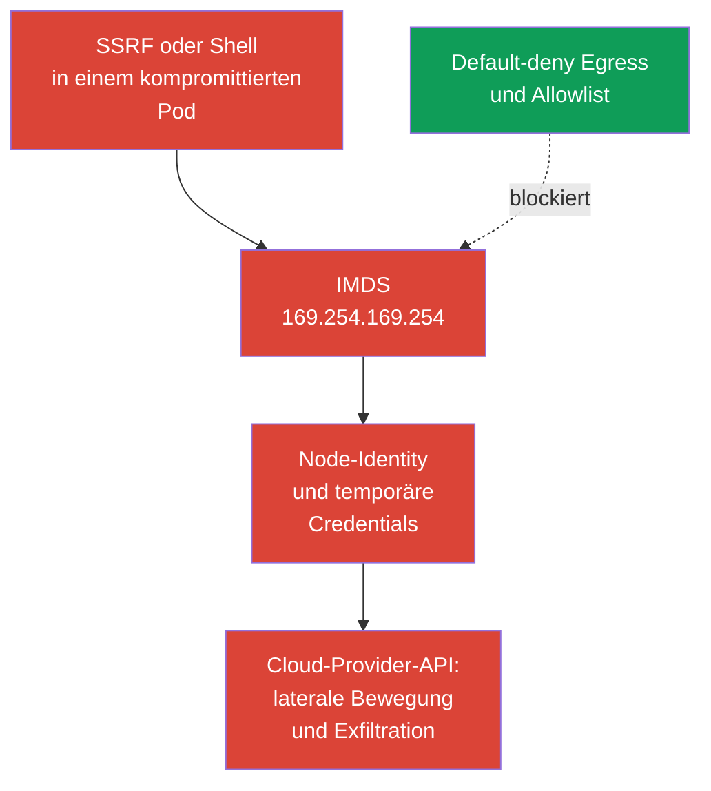
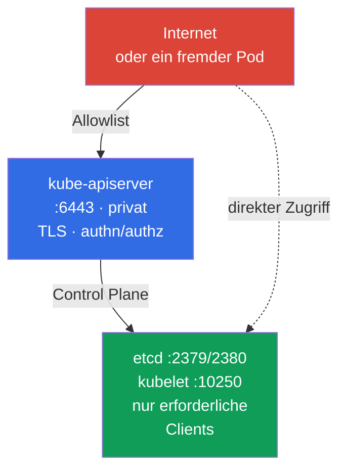

[Русская версия](ru.md) · [Eng version](README.md) · [Versión en español](es.md) · [Version française](fr.md) · [ქართული ვერსია](ge.md) · [繁體中文版](tw.md) · [日本語版](jp.md)

# Kapitel 05. Schutz von Node-Metadaten und Endpoints; Schutz von GUIs

> **Das Problem.** Ein kompromittierter Pod oder SSRF kann einen Endpoint erreichen, der externen Benutzern nicht zugänglich ist: Cloud-Metadaten der Node, die Control Plane oder ein administratives GUI. Ein einziger fälschlich erlaubter Netzwerkpfad kann die Cloud-Identity und temporäre Credentials der Node oder ein privilegiertes Verwaltungsinterface offenlegen. Das gewöhnliche RBAC eines Workload schützt Metadaten nicht, weil sie keine Kubernetes API sind.

> **Wie es weitergeht.** In Kapitel 04 haben wir ein flaches Pod-Netzwerk in eine Menge erlaubter Verbindungen verwandelt. Jetzt wenden wir Egress-Isolation auf besonders gefährliche Ziele an: Cloud-Metadaten, die Control Plane und GUIs. Dies gehört zur CKS-Domain Cluster Setup (15 %). Ein Fehler in einem solchen erlaubten Netzwerkpfad kann aus der Kompromittierung eines Pod eine Kompromittierung der Cloud-Identity oder des Clusters machen.

> **Was Sie aus CKA benötigen.** Die grundlegende Syntax von Egress-`NetworkPolicy`, `ipBlock` und die Arbeitsweise eines CNI werden in [CKA-Kapitel 34](../../../cka/course/34/de.md) behandelt. Hier betrachten wir Bedrohungen durch Node-Metadaten und administrative Endpoints, statt die Grundlagen von Policies zu wiederholen.

## 05.1. Angriffsszenario: Ein Pod liest Cloud-Metadaten

Ein Cloud-Provider stellt einer virtuellen Maschineninstanz oft einen Metadatendienst unter einer link-local Adresse bereit. Die bekannteste IPv4-Adresse lautet `169.254.169.254`. Kann ein Pod sie über das Node-Netzwerk erreichen, eröffnen eine Anwendungsschwachstelle, SSRF oder Shell-Zugriff einem Angreifer einen neuen Weg: Instanzinformationen und bei falsch konfigurierter Cloud-Identity temporäre Credentials der Node-Rolle zu erhalten.



Metadaten sind weder Kubernetes API noch Service. Sie sind ein Infrastruktur-Endpoint der Node. Daher kann ein Pod RBAC, ServiceAccount und die Anwendungs-Policy umgehen, wenn das Netzwerk die Anfrage erlaubt. Die Bedrohung ist besonders für Workloads mit eingehendem HTTP relevant: SSRF bringt die Anwendung dazu, eine für externe Benutzer nicht erreichbare Adresse anzufragen.

Prüfen Sie, ob der Endpoint von einem diagnostischen Pod aus erreichbar ist. Er muss Namespace, Labels und wesentliche Netzwerkmerkmale des Ziel-Workload nachbilden, einschließlich `hostNetwork`, falls es verwendet wird. Andernfalls können Selector oder Dataplane den falschen Pfad testen. Geben Sie in Production keine Credentials oder die vollständige Metadatenantwort im Terminal und in Logs aus. Ein HTTP-Statuscode oder ein sicherer Pfad wie der Instanzname genügt zur Prüfung.

```bash
kubectl -n payments run metadata-check \
  --image=curlimages/curl:8.22.0 --restart=Never -- sleep 3600
kubectl -n payments wait --for=condition=Ready pod/metadata-check --timeout=90s

# --noproxy schließt den Einfluss von HTTP_PROXY und HTTPS_PROXY aus.
# Ein curl-Fehler allein beweist nicht, dass IMDS blockiert ist.
kubectl -n payments exec metadata-check -- sh -c '
  tmp_err=$(mktemp)
  http_code=$(curl --noproxy "*" --connect-timeout 3 --max-time 5 \
    -sS -o /dev/null -w "%{http_code}" \
    http://169.254.169.254/latest/meta-data/ 2>"$tmp_err")
  rc=$?

  if [ "$rc" -eq 0 ]; then
    echo "IMDS reachable, HTTP status: $http_code"
    rm -f "$tmp_err"
  else
    echo "IMDS request failed, curl rc=$rc" >&2
    cat "$tmp_err" >&2
    rm -f "$tmp_err"
    echo "REVIEW_REQUIRED: failure alone does not prove that IMDS is blocked" >&2
    exit "$rc"
  fi
'
```

Nur ein abgeschlossenes `curl` mit einer schnellen HTTP-Antwort (`200`, `401` oder einem anderen Status) beweist die Netzwerk-Erreichbarkeit, aber nicht den Zugriff auf Credentials. Ein Timeout, Route-/Runtime-Fehler oder anderer Fehler erfordert eine getrennte Prüfung von Policy/CNI: Er ist **kein** Beweis dafür, dass IMDS blockiert ist. Löschen Sie den temporären Pod nach der Prüfung:

```bash
kubectl -n payments delete pod metadata-check
```

Metadatenadresse und -protokoll hängen vom Provider ab. `169.254.169.254` ist ein **typisches AWS-ähnliches Kompetenzszenario, keine garantierte Prüfungsaufgabe**. Diese well-known Adresse verwenden AWS IMDS und Azure IMDS; GKE Dataplane V2 verwendet sie ebenfalls für den GKE-Metadatenserver. Prüfen Sie für Azure, GCP und einen privaten Metadaten-Proxy den dokumentierten Endpoint des Providers und ergänzen Sie ihn separat im Bedrohungsmodell. Berücksichtigen Sie bei AWS mit aktiviertem IPv6 IMDS zusätzlich `fd00:ec2::254`: Eine reine IPv4-Blockierung beweist keinen vollständigen Schutz.

> 🧠 Der Metadaten-Endpoint wird nicht durch RBAC oder Berechtigungen eines `ServiceAccount` begrenzt; SSRF oder eine Shell in einem Workload können bei weit gefasstem Node-Netzwerk und IAM Cloud-Credentials liefern.

## 05.2. Egress-Policy für Metadaten und IMDSv2

`NetworkPolicy` ist ein Allow-Mechanismus, keine globale Deny-Firewall. Die zuverlässige Reihenfolge lautet daher:

1. Default-deny Egress für den Namespace aktivieren.
2. DNS und die tatsächlichen Abhängigkeiten der Anwendung explizit erlauben.
3. Den Node-Metadatenpfad nicht erlauben, sofern ihn die gewählte Provider-Workload-Identity nicht benötigt; einen Provider-spezifischen Allow/Block einsetzen.
4. Erlaubte Pfade sowie das Fehlen des Pod-Zugriffs auf Credentials/Identity der Node von einem Pod mit den Workload-Labels prüfen.

Die folgende Baseline isoliert den Egress aller Pods im Namespace `payments`.

> 🎯 Aktivieren Sie Default-deny Egress, erlauben Sie DNS und verifizierte Abhängigkeiten, schließen Sie Metadaten aus der Allowlist aus und prüfen Sie sowohl den erlaubten Pfad als auch eine abgelehnte Metadatenanfrage.

```yaml
apiVersion: networking.k8s.io/v1
kind: NetworkPolicy
metadata:
  name: default-deny-egress
  namespace: payments
spec:
  podSelector: {}
  policyTypes:
  - Egress
```

Fügen Sie danach getrennte, eng gefasste Egress-Allow-Regeln hinzu. Die meisten Pods benötigen beispielsweise DNS zu CoreDNS. Bestätigen Sie die tatsächlichen Labels und die Zieladresse in Ihrem Cluster.

```yaml
apiVersion: networking.k8s.io/v1
kind: NetworkPolicy
metadata:
  name: allow-dns-egress
  namespace: payments
spec:
  podSelector: {}
  policyTypes:
  - Egress
  egress:
  - to:
    - namespaceSelector:
        matchLabels:
          kubernetes.io/metadata.name: kube-system
      podSelector:
        matchLabels:
          k8s-app: kube-dns
    ports:
    - protocol: UDP
      port: 53
    - protocol: TCP
      port: 53
```

Manchmal benötigt eine Legacy-Anwendung vorübergehend breiten IPv4-Egress. In einer solchen Allow-Regel schließt `ipBlock.except` IMDS aus:

```yaml
apiVersion: networking.k8s.io/v1
kind: NetworkPolicy
metadata:
  name: allow-external-ipv4-except-imds
  namespace: payments
spec:
  podSelector:
    matchLabels:
      app: legacy-client
  policyTypes:
  - Egress
  egress:
  - to:
    - ipBlock:
        cidr: 0.0.0.0/0
        except:
        - 169.254.169.254/32
```

Dies ist ein Migrationskompromiss, kein guter Endzustand: Die Regel öffnet weiterhin fast das gesamte IPv4-Internet. `except` schließt eine Adresse nur aus dieser Regel aus. Policies sind additiv; eine weitere Egress-Allow-Regel mit `0.0.0.0/0`, einem breiteren CIDR oder der IMDS-Adresse erlaubt Metadaten also wieder. Die nachhaltige Option sind eng gefasste Regeln für DNS, einen Egress-Proxy, CIDRs oder den Endpoint jeder benötigten Abhängigkeit. Wird IPv6 verwendet, entwerfen und testen Sie getrennte IPv6-Pfade, statt eine IPv4-Policy als vollständigen Schutz anzusehen.

Eine Netzwerk-Policy schützt nur, wenn der CNI `NetworkPolicy` tatsächlich durchsetzt. `ipBlock.except` für Metadaten ist ein gängiges exam-style und Übergangsmuster, aber seine Durchsetzung für link-local und Host-Endpoints hängt von CNI und Dataplane ab. Außerdem unterscheiden sich die Behandlung von Verkehr zur Node und SNAT zwischen CNIs und Managed Kubernetes. Ersetzen Sie den Schutz der Cloud-Instanz und die Node-Firewall nicht durch diese Policy: In Production sind Provider-Metadateneinstellungen und Workload-Identity die primäre Grenze, während die Policy eine zusätzliche Schicht ist.

> 🏭 Versionsgeprüfte AWS/GKE/AKS-Kontrollen und Nachweise für Metadatenzugriff und die gewählte Workload-Identity.

| Provider | Node-Identity | Workload-Identity und Metadatenpfad | Netzwerkkontrolle | IAM/Kontrolle und Nachweis |
|---|---|---|---|---|
| AWS / EKS | IAM-Rolle der Node über IMDS `169.254.169.254` (und `fd00:ec2::254` bei IPv6) | EKS Pod Identity oder IRSA statt Node-Credentials | IMDSv2 mit Hop Limit `1` als Baseline für non-`hostNetwork` Pods; `hostNetwork: true` Pods behalten IMDS-Zugriff und benötigen getrennte Kontrolle/Admission-Policy; Policy/Firewall sind zusätzliche Schichten | Minimale IAM-Rolle der Node; CloudTrail und Prüfung, dass ein Pod keine Node-Credentials erhält |
| GKE | Service Account/Access Scopes der Node | Workload Identity Federation: Pod -> GKE-Metadatenserver (`metadata.google.internal` / metadata IP) -> KSA Token -> STS -> kurzlebiges föderiertes Token | Aktuelle Beispiele für strikte Policy: reguläre Dataplane - `169.254.169.252/32`, TCP `988` und `987`; GKE Dataplane V2 - `169.254.169.254/32`, TCP `80` und `8080`. Prüfen Sie vor dem Anwenden die GKE-Dokumentation | Minimale KSA/GSA-IAM-Rollen; Cloud Audit Logs und Prüfung des föderierten Tokens |
| Azure / AKS | Managed Identity der Node über IMDS `169.254.169.254` | Microsoft Entra Workload ID | AKS IMDS restriction - **Preview**, nur für non-`hostNetwork` Pods; nicht für eine Production-SLA vorgesehen, mit einigen Add-ons/Extension-Szenarien inkompatibel und ohne Unterstützung für Windows-Node-Pools | Minimale Managed Identity der Node; Prüfung der Entra-Föderation und getrennte Prüfung, ob die IMDS restriction greift |

GKE Workload Identity erzeugt ein wichtiges scheinbares Paradox: Eine sichere Workload-Identity verwendet selbst den GKE-Metadatenserver. Daher können Sie `169.254.169.254` nicht als universelle Regel blockieren: Diese Adresse nutzen Azure IMDS und GKE Dataplane V2, nicht nur AWS. Mit einer strikten `NetworkPolicy` erlauben Sie nur den dokumentierten Pfad für die tatsächlich verwendete GKE-Dataplane: `169.254.169.252/32` auf TCP `988` und `987` für Workload Identity Federation in der regulären Dataplane oder `169.254.169.254/32` auf TCP `80` und `8080` für GKE Dataplane V2. Dies sind aktuelle Beispiele, keine dauerhaften Konstanten: Prüfen Sie die GKE-Dokumentation vor dem Anwenden erneut. `hostNetwork` Pods haben ein anderes Zugriffsmodell und benötigen eine getrennte Bewertung.

Aktivieren Sie bei AWS IMDSv2 auf Ebene des Instance Template oder der Instanz: `HttpTokens=required` zwingt einen Client dazu, zunächst über `PUT` ein temporäres Token zu beschaffen und es dann in einem Header zu senden. Das verringert eine Klasse von SSRF-Angriffen, die auf ein einfaches `GET` ausgelegt sind, ersetzt aber keine Egress-Policy: Ein kompromittierter Pod kann weiterhin einen korrekten IMDSv2-Austausch durchführen, wenn der Endpoint erreichbar ist. Für **neue Workloads auf unterstützten Node-Typen** empfiehlt AWS **EKS Pod Identity**; **IRSA** bleibt eine Alternative für bestehende OIDC/IRSA-Deployments und Fälle, in denen Pod Identity nicht unterstützt wird, einschließlich einiger Fargate-, Windows- oder SDK-Szenarien. Für EKS empfiehlt AWS, den **IMDS-Endpoint nicht zu deaktivieren**: Node-Komponenten können von ihm abhängen. Die sichere Baseline für gewöhnliche non-`hostNetwork` Workloads mit IRSA/EKS Pod Identity ist IMDSv2 mit Hop Limit **1**, damit die IMDSv2-Antwort keinen zusätzlichen Network Hop in das Pod-Netzwerk überschreitet. Verwenden Sie Hop Limit **2** nur als bewusste Ausnahme, wenn ein Workload tatsächlich auf IMDS zugreifen muss.

Dieses Limit schützt `hostNetwork: true` Pods nicht: AWS erklärt, dass solche Pods direkten IMDS-Zugriff behalten. Beschränken Sie `hostNetwork` für nicht vertrauenswürdige Workloads getrennt mittels Admission/Policy und betrachten Sie Hop Limit `1` nicht als ausreichenden Schutz für Host-Network-Pods.

```bash
# AWS-Beispiel: Wird vom Infrastrukturadministrator gesetzt, nicht aus einem Pod.
aws ec2 modify-instance-metadata-options \
  --instance-id i-0123456789abcdef0 \
  --http-tokens required \
  --http-put-response-hop-limit 1

# Für EKS ist dies die Baseline: Die IMDSv2-Antwort darf einen Pod nicht über das Container-Netzwerk erreichen.
# Der Wert 2 ist nur zulässig, wenn ein Workload IMDS tatsächlich verwenden muss;
# prüfen Sie zuerst die Notwendigkeit und bevorzugen Sie IRSA/EKS Pod Identity gegenüber Node-Credentials für Pods.
# IMDSv2 benötigt ein Token. Verwenden Sie den Befehl nur in einem isolierten Test.
TOKEN=$(curl --noproxy '*' -sS -X PUT \
  -H 'X-aws-ec2-metadata-token-ttl-seconds: 60' \
  http://169.254.169.254/latest/api/token)
curl --noproxy '*' -sS -o /dev/null -w '%{http_code}\n' \
  -H "X-aws-ec2-metadata-token: ${TOKEN}" \
  http://169.254.169.254/latest/meta-data/
```

> 🎯 Bestimmen Sie für einen Endpoint dessen Clients und Port, prüfen Sie Bind Address, Firewall/Allowlist, TLS und authn/authz und bestätigen Sie dann erlaubten sowie verweigerten Zugriff.

## 05.3. Administrative Endpoints: kubelet, etcd und kube-apiserver

Metadaten sind nicht das einzige Ziel. Nach dem Zugriff auf das Pod-Netzwerk sucht ein Angreifer nach Management-Endpoints, doch ihre Bedrohungsmodelle unterscheiden sich. etcd und gewöhnlich kubelet verlangen eine strikte Netzwerkeinschränkung. Ein gewöhnlicher Pod erreicht kube-apiserver üblicherweise über `kubernetes.default`; dessen Schutz beruht primär auf TLS, Authentication, Authorization/RBAC und Admission, während Egress-Policy nur unnötige Pfade zusätzlich einschränkt. Fassen Sie diese Endpoints nicht in einer Regel zusammen, um sie "für alle Pods zu blockieren".

| Endpoint | Üblicher Port | Risiko bei Fehlkonfiguration | Baseline-Schutz |
|---|---:|---|---|
| kubelet HTTPS | `10250` | Befehlsausführung, Zugriff auf Pod-Daten oder Node API bei schwacher authn/authz | Mit Firewall schließen, anonymous access deaktivieren, Webhook Authorization aktivieren, TLS verwenden |
| kubelet read-only | `10255` | Gab historisch Pod-Informationen ohne Authentication preis | Nicht aktivieren, `--read-only-port=0` |
| etcd client/peer | `2379` / `2380` | Lesen oder Ändern des Clusterzustands einschließlich Secrets | `2379` nur von autorisierten etcd Clients, vor allem kube-apiserver, `2380` nur zwischen etcd Members; mTLS, Firewall, keine public exposure |
| kube-apiserver | `6443` | Eingangspunkt für die gesamte Kubernetes API | TLS, starke authn/authz, private Endpoint oder Allowlist, Audit |



Prüfen Sie lauschende Ports auf einer Node mit autorisiertem administrativem Zugriff:

```bash
sudo ss -lntp | grep -E ':(10250|10255|2379|2380|6443)\b' || true
# Process Flags und KubeletConfiguration getrennt prüfen: Flags müssen nicht in der YAML-Konfiguration stehen.
sudo grep -R -- '--read-only-port\|--anonymous-auth\|--authorization-mode' \
  /etc/systemd/system /usr/lib/systemd/system /etc/default /var/lib/kubelet 2>/dev/null || true
sudo grep -nE 'readOnlyPort|anonymous:|authorization:|webhook:' \
  /var/lib/kubelet/config.yaml 2>/dev/null || true
```

Rechnen Sie damit, dass `10250`, `2379`, `2380` und `6443` je nach Topologie auf dem erforderlichen Interface lauschen. Das Kriterium besteht nicht darin, jeden Port abzuschalten, sondern Quellen zu beschränken und Authentication zu aktivieren. Prüfen Sie für kubelet `--read-only-port=0`, `--anonymous-auth=false` und `--authorization-mode=Webhook`; Flags und CIS-Einstellungen behandelt Kapitel 07 ausführlich.

Prüfen Sie RBAC zudem gesondert: Die Berechtigung `nodes/proxy` kann einem Subject Zugriff auf die kubelet API über den API server und damit auf sensible Node-Operationen geben. Suchen Sie Rollen mit dieser Berechtigung und untersuchen Sie ihre Bindings:

```bash
kubectl get clusterrole -o yaml | grep -n -C 3 'nodes/proxy' || true
kubectl get clusterrolebinding \
  -o custom-columns=NAME:.metadata.name,ROLE:.roleRef.name,SUBJECTS:.subjects[*].name
```

`Webhook` Authorization ist eine erforderliche Baseline, aber kein Beweis für kubelet-Sicherheit. In Kubernetes v1.36 ist **Fine-Grained Kubelet Authorization GA und sein Feature Gate ist dauerhaft aktiviert**. Statt einem breiten `nodes/proxy` für eine Monitoring-/Observability-Rolle gewähren Sie nur die benötigten Subresources mit der minimalen Menge an Verbs und nur dort, wo sie wirklich nötig sind. Die vollständige GA-Zuordnung Endpoint zu RBAC-Subresource lautet:

| Kubelet-Endpoint | Fine-grained RBAC-Resource | Fallback über `nodes/proxy` |
|---|---|---|
| `/stats/*` | `nodes/stats` | nein |
| `/metrics/*` | `nodes/metrics` | nein |
| `/logs/*` | `nodes/log` | nein |
| `/pods` | `nodes/pods` | ja |
| `/runningPods/` | `nodes/pods` | ja |
| `/healthz` | `nodes/healthz` | ja |
| `/configz` | `nodes/configz` | ja |
| `/spec/*` | `nodes/spec` | nein |
| `/checkpoint/*` | `nodes/checkpoint` | nein |
| alles andere | `nodes/proxy` | direkt anwendbar |

> **⚠️ Versionsdelta.** Fine-Grained Kubelet Authorization ist in v1.36 GA, während das Feature Gate `KubeletFineGrainedAuthz` im Prüfungssnapshot v1.35 noch Beta (default-on) ist. Bestätigen Sie vor der Migration auf dem Ziel-kubelet `authorization.mode: Webhook` und den tatsächlichen Zustand des Feature Gate. Prüfen Sie außerdem RBAC genau der Identity, die auf kubelet zugreift, beispielsweise mit `kubectl auth can-i get nodes/metrics --as=system:serviceaccount:<namespace>:<serviceaccount>`. Entfernen Sie `nodes/proxy` erst, wenn Configuration/Gate, RBAC und ein erneuter Test eines realen Endpoint bestätigt sind.

Für `/pods`, `/runningPods/`, `/healthz` und `/configz` prüft kubelet zunächst die entsprechende Fine-grained Subresource und wiederholt bei einer Ablehnung die Authorization über das breite `nodes/proxy`. Dies ist eine backward-compatible Doppelprüfung: Solange das Subject `nodes/proxy` behält, reduziert eine enge Berechtigung allein nicht seine effektiven Privilegien. Entfernen Sie `nodes/proxy` nach der Rollen-Migration, anderenfalls wird Least Privilege nicht umgesetzt.

Ein Metrics Collector benötigt beispielsweise gewöhnlich nur `get` auf `nodes/metrics` und/oder `nodes/stats`:

```yaml
rules:
- apiGroups: [""]
  resources: ["nodes/metrics", "nodes/stats"]
  verbs: ["get"]
```

Entfernen Sie `nodes/proxy` aus solchen Rollen: Selbst `get` auf dieser Subresource ist kein harmloser read-only Zugriff. Über kubelet WebSocket-Endpoints kann es Befehlsausführung in Containern erlauben. Fine-grained Authorization ersetzt TLS, Netzwerkkontrollen oder RBAC-Review nicht, ermöglicht aber die Migration von dieser breiten Berechtigung zu überprüfbarem Least Privilege.

Verwenden Sie auf der Cloud-Ebene eine Security Group oder Firewall: Erlauben Sie `2379` nur von autorisierten etcd Clients, primär kube-apiserver; `2380` nur zwischen etcd Members. Dieser Unterschied ist für external etcd wichtig. Erlauben Sie `10250` nur für die Control Plane und ausdrücklich benötigtes Monitoring; `6443` nur aus vertrauenswürdigen Netzwerken, einem VPN, einem Bastion Host oder einem privaten Endpoint. Stellen Sie etcd nicht über NodePort, LoadBalancer, einen Reverse Proxy oder public DNS bereit. etcd benötigt Client-/Peer-TLS und Client-Zertifikate, nicht nur Port-Filtering.

Eine gewöhnliche `NetworkPolicy` ist für Pod-to-Pod Verkehr hilfreich, jedoch keine universelle Firewall für Host-Endpoints. Verkehr zu einer Node-IP kann aufgrund von SNAT seine Quelle ändern, und ein hostNetwork Pod kann die Pod-Dataplane umgehen. Kombinieren Sie zum Schutz einer Node CNI-Policy mit Host-Firewall, Cloud-Netzwerkkontrollen und Component Configuration. Cilium kann zusätzliche host-aware Kontrollen bereitstellen, die jedoch vom CNI-Modus abhängen und ein separates Design erfordern.

> 🔬 Eindämmung einer bestehenden Kubernetes-Dashboard-Installation und Least Privilege für Kubernetes-GUIs.

## 05.4. Legacy: archiviertes Kubernetes Dashboard und minimaler GUI-Zugriff

Planen Sie für ein bereits installiertes Dashboard dessen Ablösung oder Stilllegung. Bis dahin dürfen Sie das UI nicht über einen öffentlichen LoadBalancer oder Internet-facing Ingress bereitstellen und `cluster-admin` nicht als alltägliche Identity verwenden. Halten Sie das UI hinter einem VPN oder authentifizierten Access Proxy, wenden Sie TLS und minimale Namespace-spezifische RBAC an. Dieselben Anforderungen gelten für jedes andere unterstützte Web- oder Desktop-UI über der Kubernetes API: private Bereitstellung, starke Authentication, kurze Sessions, Audit und kubeconfig oder ServiceAccount mit minimalem Scope.

Für eine read-only Rolle werden für die übliche Auflistung von Ressourcen `get/list/watch` benötigt, während die Subresource `pods/log` praktisch nur `get` braucht:

```yaml
rules:
- apiGroups: [""]
  resources: ["pods", "services", "events"]
  verbs: ["get", "list", "watch"]
- apiGroups: [""]
  resources: ["pods/log"]
  verbs: ["get"]
```

Prüfen Sie die Berechtigungen eines bestimmten ServiceAccount im Ziel-Namespace mit `kubectl auth can-i`: `get pods/log` muss `yes` zurückgeben, während das Lesen von `secrets` und `create pods/exec` `no` zurückgeben müssen.

> 🎯 Belegen Sie den benötigten Zugriff und die Ablehnung durch positive/negative Prüfung, statt bei einer Konfigurationsänderung stehenzubleiben.

## 05.5. Prüfung, Diagnose und typische Fehler

Die Prüfung muss zwei Eigenschaften belegen: Erforderlicher Verkehr funktioniert weiter, während Metadaten und unnötige Endpoints nicht verfügbar sind. `kubectl get networkpolicy` allein belegt die Existenz von YAML, nicht die Durchsetzung durch den CNI.

> 🏭 Provider-spezifische Diagnose und Betriebskontrollen für Metadaten/Endpoints (AWS IMDS, GKE WIF, AKS Entra Workload ID).

```bash
# Selectors vergleichen und die daraus resultierende Egress-Isolation beschreiben.
kubectl -n payments get networkpolicy
kubectl -n payments describe networkpolicy default-deny-egress
kubectl -n payments get pod --show-labels
kubectl -n kube-system get pod --show-labels | grep -E 'coredns|kube-dns'

# Der Pod muss Namespace und Labels der geschützten Anwendung nachbilden.
# Erstellen Sie für ein Ziel mit hostNetwork oder anderen besonderen Netzwerkeinstellungen ein separates Manifest mit denselben Merkmalen.
kubectl -n payments run egress-test \
  --image=curlimages/curl:8.22.0 --labels=app=legacy-client \
  --restart=Never -- sleep 3600
kubectl -n payments wait --for=condition=Ready pod/egress-test --timeout=90s

# AWS/EKS: DNS muss funktionieren, während Node-IMDS-Credentials für den Pod nicht verfügbar sein dürfen.
kubectl -n payments exec egress-test -- nslookup kubernetes.default.svc.cluster.local
kubectl -n payments exec egress-test -- sh -c '
  tmp_err=$(mktemp)
  http_code=$(curl --noproxy "*" --connect-timeout 3 --max-time 5 \
    -sS -o /dev/null -w "%{http_code}" \
    http://169.254.169.254/latest/meta-data/ 2>"$tmp_err")
  rc=$?

  if [ "$rc" -eq 0 ]; then
    echo "IMDS request reached an HTTP endpoint; status: $http_code"
  else
    echo "REVIEW_REQUIRED: IMDS request failed, curl rc=$rc" >&2
    cat "$tmp_err" >&2
  fi

  rm -f "$tmp_err"
  exit "$rc"
'

# GKE WIF: Der Metadatenpfad kann absichtlich erreichbar sein; prüfen Sie die Beschaffung
# einer kurzlebigen Workload-Identity, statt einen Timeout zu erwarten, und bestätigen Sie das Fehlen einer Node-Identity.
# AKS: Entra Workload ID getrennt prüfen; IMDS restriction ist Preview, deckt keine hostNetwork Pods ab, ist nicht für eine Production-SLA vorgesehen, kann mit Add-ons/Extension-Szenarien inkompatibel sein und unterstützt keine Windows-Node-Pools.
```

Bei einem Timeout kann `curl` mit einem von null verschiedenen Code enden. Die Automatisierung muss deshalb sowohl Exit-Code als auch stdout/stderr beibehalten. In Lab 101 basiert die Metadatenprüfung ausdrücklich auf `curl --max-time 3`; verlangen Sie nicht von jedem CNI einen bestimmten Fehlertext.

| Symptom | Prüfung und wahrscheinliche Ursache |
|---|---|
| AWS-Metadaten sind weiterhin erreichbar | Der Pod wird nicht vom Selector ausgewählt, der CNI setzt die Policy nicht durch, eine andere additive Policy erlaubt ein breites CIDR, IPv6 IMDS wurde nicht berücksichtigt, das EKS Hop Limit ist für einen non-`hostNetwork` Pod nicht 1 oder der Pod selbst verwendet `hostNetwork: true` und behält deshalb unabhängig vom Hop Limit IMDS-Zugriff |
| GKE-Metadaten sind erreichbar | Bei Workload Identity Federation kann dies der erwartete Pfad zu einem kurzlebigen Workload-Token sein; prüfen Sie, dass nur der dokumentierte GKE-Metadatenpfad erlaubt ist und keine Node-Identity ausgegeben wird |
| AKS-Metadaten sind erreichbar | IMDS restriction ist Preview und deckt keine `hostNetwork` Pods ab; sie ist nicht für eine Production-SLA vorgesehen, kann mit Add-ons/Extension-Szenarien inkompatibel sein und unterstützt keine Windows-Node-Pools. Prüfen Sie Entra Workload ID und anwendbare Einschränkungen getrennt |
| DNS funktioniert nach Default-deny nicht | Keine Allow-Regel für den tatsächlichen CoreDNS oder NodeLocal DNSCache; UDP/TCP `53` fehlen |
| `except` führt nicht zur erwarteten Blockierung | Eine andere Regel enthält ein breiteres Allow, Metadaten laufen über IPv6 oder die Durchsetzung für link-local/Host-Endpoint hängt von CNI und Dataplane ab |
| Kubelet ist extern erreichbar | Firewall/Security Group ist offen, anonymous access ist aktiviert, der Endpoint lauscht auf dem falschen Interface oder RBAC gewährt übermäßiges `nodes/proxy` |
| Legacy-GUI ist aus dem Internet erreichbar | Der Service hat `LoadBalancer`/`NodePort`, der Ingress ist öffentlich oder es gibt keinen Authentication Proxy |
| Ein GUI-Benutzer sieht zu viel | `cluster-admin` wurde gewährt, `view` wurde ohne konkreten Bedarf clusterweit angewendet oder die Role enthält `secrets`/gefährliche Subresources |

Eine hilfreiche Diagnose-Reihenfolge besteht darin, Pod-Labels und Policies zu prüfen, die CNI-Unterstützung zu bestätigen, DNS zu prüfen und dann erlaubte mit abgelehnten Anfragen zu vergleichen. Prüfen Sie für einen Node-Endpoint separat Cloud-Firewall, Host-Firewall, Bind Address und Component Flags. Testen Sie etcd in einem Production-Cluster nicht mit Schreibvorgängen oder nicht authentifizierten destruktiven Anfragen.

> 🏭 Node Template, Cloud IAM, Firewall/Security Group, Policy-as-Code und regelmäßige Prüfungen von Metadaten und Management-Endpoints.

## 05.6. So wird dies in Production angewendet

- **Identity ohne Node-Credentials für Pods.** Geben Sie Anwendungen keinen impliziten Zugriff auf die Node-IAM-Rolle. Verwenden Sie in EKS EKS Pod Identity oder IRSA und IMDSv2 Hop Limit `1` für gewöhnliche non-`hostNetwork` Pods, ohne den Node-Endpoint zu deaktivieren. Bewerten Sie `hostNetwork` Pods getrennt: Sie behalten IMDS-Zugriff. Verbieten Sie `hostNetwork` daher für nicht vertrauenswürdige Workloads durch Policy/Admission. Erlauben Sie in GKE den erforderlichen GKE-Metadatenpfad für Workload Identity Federation; berücksichtigen Sie in AKS, dass IMDS restriction Preview ist, `hostNetwork` nicht abdeckt, nicht für eine Production-SLA vorgesehen ist, mit Add-ons/Extension-Szenarien inkompatibel sein kann und keine Windows-Node-Pools unterstützt. Wenden Sie in allen Fällen minimale Provider-IAM-Rollen an und bewahren Sie Cloud-Audit-Nachweise auf.
- **Egress-Allowlist als Code.** Bewahren Sie Default-deny, DNS und eng gefasste Ziele zusammen mit dem Workload auf, prüfen Sie sie im Review und testen Sie sie vor Production. Ein breites `0.0.0.0/0` mit `except` muss einen Owner und ein Fristdatum für die Entfernung haben.
- **Private Management Plane.** API server, kubelet und etcd sind nur aus den erforderlichen Netzwerken erreichbar. Security Group, Host-Firewall, TLS und RBAC arbeiten zusammen, weil der Ausfall einer Schicht keinen Endpoint offenlegen darf.
- **GUI als Legacy-/Management-Endpoint.** Verwenden Sie für ein bestehendes oder unterstütztes UI SSO/Authentication Proxy, kurze Sessions, TLS und Namespace-spezifische Rollen. Langlebige Bearer Tokens, ein öffentlicher LoadBalancer und `cluster-admin` sind keine normale Konfiguration.
- **Observability und regelmäßiges Audit.** Verfolgen Sie CNI Flow Logs, `NetworkPolicy`-Änderungen, öffentliche Services/Ingress, offene Security Groups und RBAC-Bindings. Prüfen Sie die Metadatenblockierung nach Aktualisierungen von CNI, Cloud-Template und Netzwerktopologie.

## 05.7. Mini-Glossar

- **IMDS** - Instance Metadata Service, ein Endpoint mit Metadaten der Instanz beim Cloud-Provider.
- **IMDSv2** - eine AWS-IMDS-Version, die für Metadatenanfragen ein temporäres Token erfordert.
- **SSRF** - Server-Side Request Forgery, eine Schwachstelle, die einen Server dazu bringt, Anfragen an eine vom Angreifer ausgewählte Adresse zu senden.
- **Egress-Policy** - eine `NetworkPolicy`, die erlaubte ausgehende Pod-Verbindungen definiert.
- **`ipBlock`** - eine Egress- oder Ingress-Regel für ein CIDR; `except` schließt Subnetze oder Adressen daraus aus.
- **kubelet** - der Kubernetes-Node-Agent; sein abgesicherter Endpoint lauscht gewöhnlich auf `10250`.
- **etcd** - der Key-Value State Store von Kubernetes; seine Client- und Peer-Endpoints nutzen normalerweise `2379` und `2380`.
- **Kubernetes Dashboard** - ein archiviertes Upstream-Web-UI; für eine bestehende Installation minimale RBAC-Berechtigungen anwenden und Ablösung oder Stilllegung planen.
- **Host-Endpoint** - ein Netzwerk-Endpoint einer Node, nicht ein gewöhnlicher Pod in der CNI-Dataplane.

## 05.8. Zusammenfassung des Kapitels

- Cloud-Metadaten können ein kritischer Pfad von einem kompromittierten Pod zur Cloud-Identity der Node sein, aber Provider-spezifische Workload-Identity verändert das erwartete Verhalten: Bei GKE wird der Metadatenserver für WIF benötigt, und bei AWS muss auch IPv6 IMDS berücksichtigt werden.
- Beginnen Sie mit Default-deny Egress und erlauben Sie nur DNS und erforderliche Ziele. `ipBlock` mit `except: 169.254.169.254/32` ist für ein vorübergehend breites Allow nützlich, ersetzt jedoch keine enge Allowlist.
- Für EKS blockiert IMDSv2 mit Hop Limit `1` den gewöhnlichen Pfad zu Node-IMDS für non-`hostNetwork` Pods. Dies gilt nicht für `hostNetwork: true` Pods, die IMDS-Zugriff behalten und getrennte Kontrolle benötigen; deaktivieren Sie den IMDS-Endpoint nicht und reservieren Sie Hop Limit 2 nur für begründeten Workload-Zugriff. Dies ersetzt weder Workload-Identity noch Netzwerkisolation und Cloud-Identity mit Least Privilege.
- kubelet, etcd und kube-apiserver werden durch eine Kombination aus privatem Netzwerk, Firewall, TLS, Authentication, Authorization, `nodes/proxy`-Review und sicheren Flags geschützt, nicht nur durch Pod-Policy.
- Verwenden Sie das archivierte Kubernetes Dashboard nicht für neue Installationen; ein bestehendes GUI darf weder öffentlich sein noch mit `cluster-admin` laufen. `pods/log` für eine read-only Rolle benötigt nur `get`, nicht `list/watch`.
- Prüfen Sie den tatsächlich Provider-spezifischen Verkehr: Bei AWS erhält ein Pod keine Node-IMDS-Credentials; bei GKE funktioniert WIF nur über den erwarteten Metadatenpfad; bei AKS prüfen Sie Entra-Föderation und die Anwendbarkeit der IMDS restriction getrennt; Node-Endpoints sind für unnötige Quellen nicht offen.

## 05.9. Nutzen für Prüfung und praktische Arbeit

**In der Prüfung.** Der Schutz von Metadaten und Node-Endpoints ist eine CKS-Kompetenz; Provider, Adresse oder Umsetzungsansatz sind nicht garantiert. `169.254.169.254` und Egress-Policy bilden das typische AWS-ähnliche Szenario dieses Kapitels. Beachten Sie, dass Default-deny Egress DNS ohne ein explizites Allow unterbricht und `NetworkPolicy`-Objekte additiv sind. Suchen Sie bei Hardening-Aufgaben nach offenem `10250`, `2379`, `2380`, `6443` und übermäßigem RBAC.

**In der praktischen Arbeit.** Die wichtigste Fähigkeit ist, die Grenze zwischen Pod-Netzwerk, Node-Netzwerk und Cloud-Control-Plane zu ziehen. Policy für Workloads, Host-Firewall, Cloud Security Group, IMDSv2, Workload-Identity und RBAC werden gemeinsam benötigt. Das verhindert, dass ein einzelnes SSRF oder RCE zu Zugriff auf Node-Credentials oder die Control Plane wird.

> ### 🔴 Aus Sicht des Angreifers
> **Asset:** kubelet API und Container auf der Node.
>
> **Ausgangszugang:** ein kompromittierter Monitoring-Agent.
>
> **Ziel des Angreifers:** einen scheinbar read-only Zugriff in die Fähigkeit verwandeln, Container auf der Node zu kontrollieren.
>
> **Missbrauchspfad:** eine unsichere Berechtigung - der ServiceAccount hat `get` auf `nodes/proxy`; kubelet `GET` und WebSocket-Endpoints schaffen dann das zuvor beschriebene RCE-Risiko.
>
> **Erwarteter Nachweis:** SubjectAccessReview, Audit Events und kubelet Access Telemetry.
>
> **Kontrolle:** das breite `nodes/proxy` durch enges `nodes/metrics` und `nodes/stats` mit der minimalen Menge an Verbs ersetzen.
>
> **Erneuter Test:** Metrics funktionieren weiter, während der Management-/Exec-Pfad nicht länger autorisiert ist.
>
> **ATT&CK:** [T1609 - Container Administration Command](https://attack.mitre.org/techniques/T1609/) und [T1613 - Container and Resource Discovery](https://attack.mitre.org/techniques/T1613/).

## 05.10. Fragen zur Selbstprüfung

<details>
<summary>1. Warum ist der Zugriff eines Pod auf `169.254.169.254` gefährlicher als eine gewöhnliche externe HTTP-Anfrage?</summary>

Dies ist der typische Cloud-Metadaten-Endpoint der Node und kein gewöhnlicher externer Service: Über SSRF oder eine Shell kann ein Pod Instanzinformationen und bei falsch konfigurierter Cloud-Identity temporäre Credentials der Node-Rolle erhalten. Dieser Pfad umgeht RBAC, ServiceAccount und Anwendungs-Policy und kann laterale Bewegung in der Cloud API ermöglichen.
</details>

<details>
<summary>2. Warum ist eine `NetworkPolicy` mit `ipBlock.except` keine globale Ablehnung für jede Policy im Namespace?</summary>

`except` schließt eine Adresse nur aus einer bestimmten `ipBlock`-Regel aus. Policies sind additiv, daher kann eine andere Egress-Policy mit einem breiten CIDR oder einer direkten Allow-Regel für den Metadaten-Endpoint den Zugriff wieder öffnen; Default-deny und enge Allows für tatsächliche Abhängigkeiten sind dauerhafter.
</details>

<details>
<summary>3. Welche Egress-Allow-Regeln werden nach Default-deny normalerweise benötigt, damit die Anwendung DNS nicht verliert?</summary>

Üblicherweise wird enger Egress zu den tatsächlichen CoreDNS-Endpoints in `kube-system` auf UDP 53 und TCP 53 benötigt. Prüfen Sie vor dem Anwenden die tatsächlichen DNS-Pod-Labels; in einer gegebenen Architektur können Anfragen durch NodeLocal DNSCache oder eine andere DNS-Komponente verarbeitet werden.
</details>

<details>
<summary>4. Was verbessert IMDSv2 und warum reicht IMDSv2 allein nach einer Pod-Kompromittierung nicht aus?</summary>

AWS IMDSv2 verlangt zuerst, über `PUT` ein temporäres Token zu beschaffen und es dann in einem Header zu senden. Das verringert eine Klasse von SSRF-Angriffen, die auf ein einfaches `GET` ausgelegt sind. Aber ein kompromittierter Pod kann einen korrekten IMDSv2-Austausch durchführen, wenn der Endpoint erreichbar ist. Daher sind Egress-Isolation, Workload-Identity und minimale IAM-Berechtigungen nötig; für EKS ist Hop Limit `1` die Baseline für gewöhnliche non-`hostNetwork` Pods, während `hostNetwork: true` Pods IMDS-Zugriff behalten und getrennt kontrolliert werden müssen.
</details>

<details>
<summary>5. Worin unterscheidet sich der Schutz von Host-Endpoints vom Schutz gewöhnlicher Pods über `NetworkPolicy`?</summary>

Eine gewöhnliche NetworkPolicy beschreibt portabel Pod-to-Pod Verkehr, doch Verkehr zu einer Node-IP kann seine Quelle wegen SNAT ändern, und ein `hostNetwork` Pod kann die erwartete Pod-Dataplane umgehen. Schützen Sie kubelet, etcd und API server durch die Kombination aus Host-Firewall, Cloud Security Group, Bind Address, TLS, Authentication, Authorization und Component Configuration.
</details>

<details>
<summary>6. Welche kubelet-Einstellungen müssen zusammen mit der Firewall für Endpoint `10250` geprüft werden?</summary>

Prüfen Sie, dass der read-only Port deaktiviert ist (`--read-only-port=0`), anonymous access deaktiviert ist (`--anonymous-auth=false`) und Authorization im Webhook-Modus läuft. TLS und RBAC-Review sind ebenfalls erforderlich, insbesondere für Berechtigungen zu `nodes/proxy`; Webhook Authorization ersetzt die Netzwerkeinschränkung nicht selbst.
</details>

<details>
<summary>7. Warum ist selbst `get` auf `nodes/proxy` riskanter als minimale `get`-Berechtigungen auf `nodes/metrics` oder `nodes/stats`?</summary>

`nodes/proxy` ist breiter Zugriff auf die kubelet API, und selbst `get` darauf kann über kubelet WebSocket-Endpoints Befehlsausführung in Containern erlauben. In v1.36 ermöglicht Fine-grained kubelet authorization einer Monitoring-Rolle nur `get` auf `nodes/metrics` und/oder `nodes/stats`; entfernen Sie das breite `nodes/proxy` nach der Migration.
</details>

<details>
<summary>8. Wie unterscheiden sich Metadaten-Endpoint, Node-Identity und Workload-Identity für AWS/EKS, GKE und AKS, und warum darf der Metadatenpfad für GKE nicht bedingungslos blockiert werden?</summary>

Bei AWS/EKS stellt IMDS die Node-Identity aus und Workloads verwenden EKS Pod Identity oder IRSA; bei GKE erhält Workload Identity Federation über den GKE-Metadatenserver ein kurzlebiges Workload-Token; AKS verwendet Microsoft Entra Workload ID. Daher kann der GKE-Metadatenpfad für Workload-Identity erforderlich sein, und eine strikte Policy erlaubt nur den dokumentierten Pfad für die verwendete Dataplane, statt die Adresse bedingungslos zu blockieren.
</details>

<details>
<summary>9. Warum benötigt eine read-only Rolle für ein Legacy-Dashboard oder anderes Web-UI normalerweise `get/list/watch` für Ressourcen, aber nur `get` auf `pods/log`, und wie lässt sich das ohne tatsächlichen UI-Zugriff mit `kubectl auth can-i` prüfen?</summary>

Das UI benötigt `get`, `list` und `watch`, um Listen von Pods, Services und Events darzustellen, doch das Lesen der Subresource `pods/log` benötigt praktisch nur `get`. Prüfen Sie die Berechtigungen eines bestimmten ServiceAccount im Ziel-Namespace mit `kubectl auth can-i`: `get pods/log` muss `yes` zurückgeben, während `get secrets` und `create pods/exec` `no` zurückgeben müssen.
</details>

## Praxis

🧪 Lab 101 (NetworkPolicy: Default-deny, Isolation, Metadaten): [tasks/cks/labs/101](../../labs/101/README_DE.MD)

🌐 Zusätzliche interaktive Übung (killer.sh/killercoda, externe Ressource): [networkpolicy-metadata-protection](https://killercoda.com/killer-shell-cks/scenario/networkpolicy-metadata-protection)

🧪 Lab 103 (CIS/kube-bench, Secure Ingress TLS, Binaries prüfen): [tasks/cks/labs/103](../../labs/103/README_DE.MD)

---
[Inhaltsverzeichnis](../README_DE.md) · [Kapitel 04](../04/de.md) · [Kapitel 06](../06/de.md)
