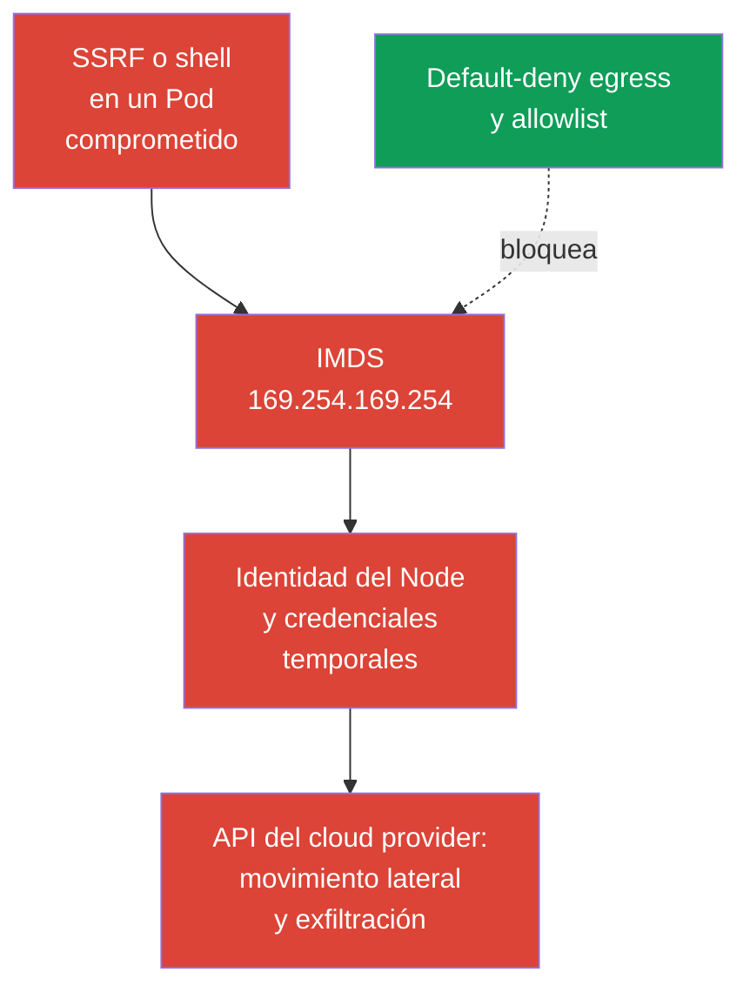
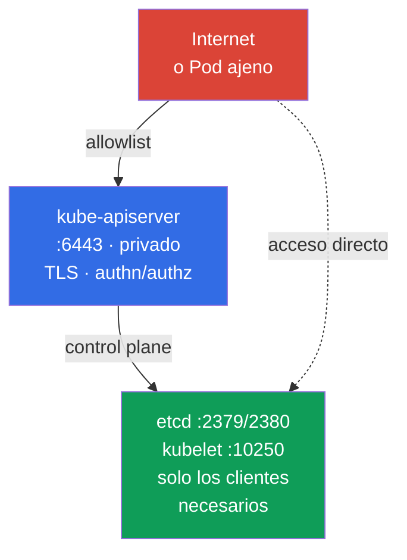

[Русская версия](ru.md) · [Eng version](README.md) · [Version française](fr.md) · [Deutsche Version](de.md) · [ქართული ვერსია](ge.md) · [繁體中文版](tw.md) · [日本語版](jp.md)

# Capítulo 05. Protección de metadata y endpoints de Node; protección de GUI

> **El problema.** Un Pod comprometido o SSRF puede acceder a un endpoint que no está disponible para un usuario externo: metadata cloud del Node, control plane o GUI administrativo. Una sola ruta de red permitida incorrectamente puede revelar la cloud identity y las credentials temporales del Node, o una privileged management interface. El RBAC habitual de un workload no protege metadata, porque no es una API de Kubernetes.

> **Lo que sigue.** En el capítulo 04 convertimos la red plana de Pod en un conjunto de conexiones permitidas. Ahora aplicaremos egress isolation a destinos especialmente peligrosos: cloud metadata, control plane y GUI. Este es el dominio Cluster Setup (15%) de CKS. Un error en una de estas autorizaciones puede convertir la vulneración de un Pod en la vulneración de una cloud identity o del clúster.

> **Lo que se necesita de CKA.** La sintaxis básica de egress `NetworkPolicy`, `ipBlock` y el funcionamiento de CNI se explican en el [capítulo 34 de CKA](../../../cka/course/34/es.md). Aquí abordamos las amenazas de node metadata y endpoints administrativos, no repetimos los fundamentos de las políticas.

## 05.1. Escenario de ataque: un Pod lee cloud metadata

Un cloud provider suele ofrecer un metadata service a una instancia de máquina virtual en una dirección link-local. La dirección IPv4 más conocida es `169.254.169.254`. Si un Pod puede acceder a ella a través de la red del Node, una vulnerabilidad en la aplicación, SSRF o acceso a una shell proporcionan al atacante una nueva ruta: obtener información de la instancia y, con una cloud identity configurada incorrectamente, credentials temporales del rol del Node.



Metadata no es una API de Kubernetes ni un Service. Es un endpoint de infraestructura del Node, por lo que un Pod puede eludir RBAC, ServiceAccount y la policy de la aplicación si la red permite la solicitud. La amenaza es especialmente relevante para workload que aceptan HTTP entrante: SSRF hace que la aplicación solicite una dirección no disponible para el usuario externo.

Compruebe si el endpoint es accesible desde un Pod de diagnóstico. Debe reproducir el namespace, las labels y las características de red relevantes del workload objetivo, incluido `hostNetwork` si se usa; de lo contrario, el selector o dataplane pueden comprobar la ruta equivocada. En production, no imprima en el terminal ni en los logs credentials o la respuesta completa de metadata. Para comprobarlo basta un código HTTP o una ruta segura, por ejemplo, el nombre de la instancia.

```bash
kubectl -n payments run metadata-check \
  --image=curlimages/curl:8.22.0 --restart=Never -- sleep 3600
kubectl -n payments wait --for=condition=Ready pod/metadata-check --timeout=90s

# --noproxy excluye la influencia de HTTP_PROXY y HTTPS_PROXY.
# Un error de curl por sí solo no demuestra que IMDS esté bloqueado.
kubectl -n payments exec metadata-check -- sh -c '
  tmp_err=$(mktemp)
  http_code=$(curl --noproxy "*" --connect-timeout 3 --max-time 5 \
    -sS -o /dev/null -w "%{http_code}" \
    http://169.254.169.254/latest/meta-data/ 2>"$tmp_err")
  rc=$?

  if [ "$rc" -eq 0 ]; then
    echo "IMDS reachable, HTTP status: $http_code"
    rm -f "$tmp_err"
  else
    echo "IMDS request failed, curl rc=$rc" >&2
    cat "$tmp_err" >&2
    rm -f "$tmp_err"
    echo "REVIEW_REQUIRED: failure alone does not prove that IMDS is blocked" >&2
    exit "$rc"
  fi
'
```

Solo un `curl` completado con una respuesta HTTP rápida (`200`, `401` u otro status) demuestra la accesibilidad de red, pero no demuestra acceso a credentials. Un timeout, route/runtime error u otro fallo requieren una comprobación separada de policy/CNI: **no** son prueba de que IMDS esté bloqueado. Elimine el Pod temporal después de la comprobación:

```bash
kubectl -n payments delete pod metadata-check
```

La dirección y el protocolo de metadata dependen del provider. `169.254.169.254` es un **escenario de competencia típico parecido a AWS, no una tarea garantizada del examen**. AWS IMDS y Azure IMDS utilizan esta well-known address; GKE Dataplane V2 también la utiliza para GKE metadata server. Para Azure, GCP y un private metadata proxy, consulte el endpoint documentado por el provider y añádalo por separado al modelo de amenazas. En AWS, si IPv6 IMDS está activado, incluya también `fd00:ec2::254`: un bloqueo solo de IPv4 no demuestra una protección completa.

> 🧠 El metadata endpoint no está limitado por RBAC ni por los permisos de `ServiceAccount`; SSRF o una shell en un workload pueden proporcionar cloud credentials cuando la red y el IAM del Node son amplios.

## 05.2. Egress policy para metadata e IMDSv2

`NetworkPolicy` es un mecanismo de allow, no un firewall deny global. Por ello, el orden fiable es el siguiente:

1. Activar default-deny egress para el namespace.
2. Permitir explícitamente DNS y las dependencias reales de la aplicación.
3. No permitir el node metadata path, salvo que lo requiera la provider workload identity elegida; usar allow/block específico del provider.
4. Comprobar las rutas permitidas y la ausencia de acceso del Pod a las credentials/identity del Node desde un Pod con las labels del workload.

El siguiente baseline aísla el egress de todos los Pod del namespace `payments`.

> 🎯 Active default-deny egress, permita DNS y las dependencias verificadas, excluya metadata de la allowlist y compruebe tanto la ruta permitida como el rechazo de la solicitud de metadata.

```yaml
apiVersion: networking.k8s.io/v1
kind: NetworkPolicy
metadata:
  name: default-deny-egress
  namespace: payments
spec:
  podSelector: {}
  policyTypes:
  - Egress
```

Después añada permisos mínimos independientes. Por ejemplo, la mayoría de los Pod necesitan DNS hacia CoreDNS. Las labels y la dirección de destino reales deben confirmarse en su clúster.

```yaml
apiVersion: networking.k8s.io/v1
kind: NetworkPolicy
metadata:
  name: allow-dns-egress
  namespace: payments
spec:
  podSelector: {}
  policyTypes:
  - Egress
  egress:
  - to:
    - namespaceSelector:
        matchLabels:
          kubernetes.io/metadata.name: kube-system
      podSelector:
        matchLabels:
          k8s-app: kube-dns
    ports:
    - protocol: UDP
      port: 53
    - protocol: TCP
      port: 53
```

A veces una aplicación legacy necesita temporalmente egress amplio a IPv4. En una de esas reglas allow, `ipBlock.except` excluye IMDS:

```yaml
apiVersion: networking.k8s.io/v1
kind: NetworkPolicy
metadata:
  name: allow-external-ipv4-except-imds
  namespace: payments
spec:
  podSelector:
    matchLabels:
      app: legacy-client
  policyTypes:
  - Egress
  egress:
  - to:
    - ipBlock:
        cidr: 0.0.0.0/0
        except:
        - 169.254.169.254/32
```

Es un compromiso de migración, no un buen final state: la regla sigue abriendo casi todo Internet IPv4. `except` excluye la dirección solo de esta regla. Las políticas son aditivas, así que otro egress allow con `0.0.0.0/0`, un CIDR más amplio o la dirección de IMDS volverá a permitir metadata. La opción resistente son reglas específicas para DNS, egress proxy, CIDR o endpoint de cada dependencia necesaria. Si se usa IPv6, diseñe y compruebe rutas IPv6 independientes, en vez de considerar la política IPv4 una protección completa.

La política de red protege solo si CNI realmente aplica `NetworkPolicy`. `ipBlock.except` para metadata es un patrón exam-style y de transición habitual, pero su enforcement para endpoints link-local y host depende de CNI y del dataplane. Además, la implementación del tráfico al Node y SNAT difiere entre CNI y managed Kubernetes. No sustituya con esta política la protección de la cloud instance y el firewall del Node: en production, el límite principal son provider metadata settings y workload identity; la policy sirve como capa adicional.

> 🏭 Controles AWS/GKE/AKS comprobados por versión y evidence del acceso a metadata y de la workload identity elegida.

| Provider | Node identity | Workload identity y metadata path | Network control | IAM/control y evidence |
|---|---|---|---|---|
| AWS / EKS | IAM role del Node mediante IMDS `169.254.169.254` (y `fd00:ec2::254` con IPv6) | EKS Pod Identity o IRSA en lugar de node credentials | IMDSv2 con hop limit `1` como baseline para Pod non-`hostNetwork`; los Pod `hostNetwork: true` conservan acceso a IMDS y requieren control/admission policy independiente; policy/firewall son capas adicionales | IAM role mínima del Node; CloudTrail y comprobación de que el Pod no obtiene node credentials |
| GKE | Service account/access scopes del Node | Workload Identity Federation: Pod -> GKE metadata server (`metadata.google.internal` / metadata IP) -> KSA token -> STS -> short-lived federated token | Ejemplos actuales para policy estricta: dataplane normal - `169.254.169.252/32`, TCP `988` y `987`; GKE Dataplane V2 - `169.254.169.254/32`, TCP `80` y `8080`. Compruebe la documentación de GKE antes de aplicar | IAM roles mínimas KSA/GSA; Cloud Audit Logs y comprobación del federated token |
| Azure / AKS | Managed identity del Node mediante IMDS `169.254.169.254` | Microsoft Entra Workload ID | AKS IMDS restriction - **Preview**, solo para Pod non-`hostNetwork`; no está destinado a un SLA de production, es incompatible con algunos escenarios de add-ons/extensions y no admite Windows node pools | Managed identity mínima del Node; comprobación de Entra federation y, por separado, de la aplicabilidad de IMDS restriction |

GKE Workload Identity crea una paradoja importante a primera vista: una workload identity segura utiliza por sí misma GKE metadata server. Por ello, no se puede bloquear `169.254.169.254` como una regla universal: Azure IMDS y GKE Dataplane V2 utilizan esta dirección, no solo AWS. Con `NetworkPolicy` estricta, permita solo la ruta documentada para el dataplane real de GKE: `169.254.169.252/32` en TCP `988` y `987` para Workload Identity Federation en el dataplane normal, o bien `169.254.169.254/32` en TCP `80` y `8080` para GKE Dataplane V2. Son ejemplos actuales, no constantes eternas: vuelva a comprobar la documentación de GKE antes de aplicar. Los Pod `hostNetwork` tienen un modelo de acceso distinto y requieren una evaluación independiente.

En AWS, active IMDSv2 en el nivel de instance template o instance: `HttpTokens=required` obliga al cliente a obtener primero un token temporal mediante `PUT` y después enviarlo en un encabezado. Esto reduce la clase de ataques SSRF diseñados para un `GET` simple, pero no sustituye egress policy: un Pod comprometido todavía puede realizar el intercambio IMDSv2 correcto si el endpoint es accesible. Para **nuevos workload en node types compatibles**, AWS recomienda **EKS Pod Identity**; **IRSA** sigue siendo una alternativa para despliegues OIDC/IRSA existentes y casos en los que Pod Identity no es compatible, incluidos algunos escenarios de Fargate, Windows o SDK. Para EKS, AWS recomienda **no desactivar el endpoint IMDS**: los componentes del Node pueden depender de él. El baseline seguro para workload non-`hostNetwork` habituales que usan IRSA/EKS Pod Identity es IMDSv2 con hop limit **1**, para que la response de IMDSv2 no atraviese un network hop adicional en la red de Pod. El hop limit **2** se utiliza solo como una excepción consciente, cuando el workload realmente debe acceder a IMDS.

Esta limitación no protege los Pod `hostNetwork: true`: AWS indica que dichos Pod conservan acceso directo a IMDS. Para workload no confiables, limite por separado el uso de `hostNetwork` mediante admission/policy y no considere hop limit `1` una protección suficiente para Pod host-network.

```bash
# Ejemplo para AWS: lo establece el administrador de infraestructura, no desde un Pod.
aws ec2 modify-instance-metadata-options \
  --instance-id i-0123456789abcdef0 \
  --http-tokens required \
  --http-put-response-hop-limit 1

# Para EKS, este es el baseline: la response de IMDSv2 no debe llegar al Pod a través de la red de contenedores.
# El valor 2 solo se admite si el workload realmente debe usar IMDS;
# primero compruebe la necesidad y prefiera IRSA/EKS Pod Identity en lugar de node credentials del Pod.
# IMDSv2 requiere token. Use el comando únicamente en una prueba aislada.
TOKEN=$(curl --noproxy '*' -sS -X PUT \
  -H 'X-aws-ec2-metadata-token-ttl-seconds: 60' \
  http://169.254.169.254/latest/api/token)
curl --noproxy '*' -sS -o /dev/null -w '%{http_code}\n' \
  -H "X-aws-ec2-metadata-token: ${TOKEN}" \
  http://169.254.169.254/latest/meta-data/
```

> 🎯 Para cada endpoint, determine los clientes y el puerto, compruebe bind address, firewall/allowlist, TLS y authn/authz, y después confirme el acceso permitido y el denegado.

## 05.3. Endpoints administrativos: kubelet, etcd y kube-apiserver

Metadata no es el único objetivo. Tras acceder a la red de Pod, el atacante busca endpoints de administración, pero sus modelos de amenazas difieren. etcd y, normalmente, kubelet requieren una restricción de red estricta. Un Pod habitual accede a kube-apiserver mediante `kubernetes.default`; su protección se basa sobre todo en TLS, authentication, authorization/RBAC y admission, mientras que egress policy solo limita adicionalmente las rutas innecesarias. No agrupe estos endpoints en la regla «cerrar para todos los Pod».

| Endpoint | Puerto habitual | Riesgo ante un error | Protección básica |
|---|---:|---|---|
| kubelet HTTPS | `10250` | Ejecución de comandos, acceso a datos de Pod o a la API de Node con authn/authz débil | Cerrar el firewall, desactivar anonymous access, activar Webhook authorization, usar TLS |
| kubelet read-only | `10255` | Históricamente revelaba información de Pod sin autenticación | No activarlo, `--read-only-port=0` |
| etcd client/peer | `2379` / `2380` | Lectura o modificación del estado del clúster, incluidos los Secret | `2379` solo desde etcd clients autorizados (principalmente kube-apiserver), `2380` solo entre etcd members; mTLS, firewall, sin public exposure |
| kube-apiserver | `6443` | Punto de entrada a toda la API de Kubernetes | TLS, authn/authz fuerte, private endpoint o allowlist, audit |



La comprobación de los puertos en escucha se realiza en el Node con acceso administrativo autorizado:

```bash
sudo ss -lntp | grep -E ':(10250|10255|2379|2380|6443)\b' || true
# Los process flags y KubeletConfiguration se comprueban por separado: los flags no tienen por qué estar en la configuración YAML.
sudo grep -R -- '--read-only-port\|--anonymous-auth\|--authorization-mode' \
  /etc/systemd/system /usr/lib/systemd/system /etc/default /var/lib/kubelet 2>/dev/null || true
sudo grep -nE 'readOnlyPort|anonymous:|authorization:|webhook:' \
  /var/lib/kubelet/config.yaml 2>/dev/null || true
```

Cabe esperar que `10250`, `2379`, `2380` y `6443` escuchen en la interfaz necesaria según la topology. El criterio no es desactivar todos los puertos, sino limitar los orígenes y activar la autenticación. Para kubelet, compruebe `--read-only-port=0`, `--anonymous-auth=false` y `--authorization-mode=Webhook`; los flags y las configuraciones CIS se tratan en detalle en el capítulo 07.

Revise también RBAC: el permiso `nodes/proxy` puede dar a un sujeto acceso a la API de kubelet mediante API server y, por ello, a operaciones sensibles del Node. Localice los roles con este permiso y compruebe sus bindings:

```bash
kubectl get clusterrole -o yaml | grep -n -C 3 'nodes/proxy' || true
kubectl get clusterrolebinding \
  -o custom-columns=NAME:.metadata.name,ROLE:.roleRef.name,SUBJECTS:.subjects[*].name
```

La autorización `Webhook` es un baseline necesario, pero no una prueba de la seguridad de kubelet. En Kubernetes v1.36, **Fine-Grained Kubelet Authorization - GA y feature gate locked enabled**. En lugar de conceder el amplio `nodes/proxy` a un rol de monitoring/observability, conceda únicamente los subresources necesarios con el conjunto mínimo de verbs y solo donde realmente sea necesario. El mapa GA completo de endpoint -> RBAC subresource es el siguiente:

| Kubelet endpoint | Fine-grained RBAC resource | Fallback mediante `nodes/proxy` |
|---|---|---|
| `/stats/*` | `nodes/stats` | no |
| `/metrics/*` | `nodes/metrics` | no |
| `/logs/*` | `nodes/log` | no |
| `/pods` | `nodes/pods` | sí |
| `/runningPods/` | `nodes/pods` | sí |
| `/healthz` | `nodes/healthz` | sí |
| `/configz` | `nodes/configz` | sí |
| `/spec/*` | `nodes/spec` | no |
| `/checkpoint/*` | `nodes/checkpoint` | no |
| todo lo demás | `nodes/proxy` | se aplica directamente |

> **⚠️ Delta de versión.** Fine-Grained Kubelet Authorization es GA en v1.36, mientras que en la exam snapshot v1.35 feature gate `KubeletFineGrainedAuthz` todavía es Beta (default-on). Antes de migrar, confirme en el kubelet objetivo `authorization.mode: Webhook` y el estado real de feature gate. Compruebe por separado el RBAC de la identity que accede a kubelet, por ejemplo `kubectl auth can-i get nodes/metrics --as=system:serviceaccount:<namespace>:<serviceaccount>`. No elimine `nodes/proxy` hasta confirmar configuration/gate, RBAC y una nueva prueba del endpoint real.

Para `/pods`, `/runningPods/`, `/healthz` y `/configz`, kubelet comprueba primero el subresource fine-grained correspondiente y, ante una denegación, repite la autorización mediante el amplio `nodes/proxy`. Es una dual-check backward-compatible: mientras el sujeto conserve `nodes/proxy`, un permiso estrecho por sí solo no reduce sus privilegios efectivos. Después de migrar los roles, elimine `nodes/proxy`; de lo contrario, no se aplicará least privilege.

Por ejemplo, un recolector de métricas normalmente solo necesita `get` en `nodes/metrics` y/o `nodes/stats`:

```yaml
rules:
- apiGroups: [""]
  resources: ["nodes/metrics", "nodes/stats"]
  verbs: ["get"]
```

Debe eliminarse `nodes/proxy` de estos roles: incluso `get` en este subresource no es acceso read-only inocuo. Mediante endpoints WebSocket de kubelet puede permitir ejecutar comandos en contenedores. La autorización fine-grained no sustituye TLS, network controls ni la revisión de RBAC, pero permite migrar de este privilegio amplio a least privilege verificable.

En la capa cloud, aplique security group o firewall: `2379` se permite solo desde etcd clients autorizados, principalmente kube-apiserver; `2380`, solo entre etcd members. Esta diferencia es importante para etcd external. `10250`, solo para control plane y monitoring explícitamente necesario; `6443`, solo para trusted networks, VPN, bastion o private endpoint. No publique etcd mediante `NodePort`, `LoadBalancer`, reverse proxy o DNS público. Para etcd son obligatorios TLS client/peer y certificados de cliente, no solo el filtrado de puertos.

`NetworkPolicy` ordinaria es útil para tráfico Pod-to-Pod, pero no es un firewall universal para host endpoints. El tráfico a una IP de Node puede cambiar de source debido a SNAT, y un Pod hostNetwork puede eludir el dataplane de Pod. Para proteger un Node, combine la policy CNI con host firewall, cloud network controls y configuración de componentes. Cilium puede proporcionar host-aware controls adicionales, pero dependen del modo CNI y requieren un diseño independiente.

> 🔬 Containment de una instalación existente de Kubernetes Dashboard y least privilege para Kubernetes GUI.

## 05.4. Legacy: Kubernetes Dashboard archivado y acceso GUI mínimo

Para un Dashboard ya instalado, planifique su sustitución o retirada. Hasta entonces, no exponga la UI mediante `LoadBalancer` público o Ingress Internet-facing, ni use `cluster-admin` como identity cotidiana. Mantenga la UI detrás de VPN o un authenticated access proxy, aplique TLS y RBAC mínimo limitado al namespace. Los mismos requisitos se aplican a cualquier otra UI web o desktop compatible sobre la API de Kubernetes: exposición privada, strong authentication, sesiones cortas, audit y kubeconfig o ServiceAccount de minimal scope.

En un rol read-only, para la lista general de recursos se necesitan `get/list/watch`, mientras que el subresource `pods/log` prácticamente solo necesita `get`:

```yaml
rules:
- apiGroups: [""]
  resources: ["pods", "services", "events"]
  verbs: ["get", "list", "watch"]
- apiGroups: [""]
  resources: ["pods/log"]
  verbs: ["get"]
```

Compruebe los permisos de una ServiceAccount concreta en el namespace objetivo con `kubectl auth can-i`: `get pods/log` debe devolver `yes`, mientras que leer `secrets` y `create pods/exec` debe devolver `no`.

> 🎯 Demuestre el acceso necesario y la denegación mediante positive/negative verification, en vez de limitarse a cambiar la configuración.

## 05.5. Verificación, diagnóstico y errores habituales

La verificación debe demostrar dos propiedades: el tráfico necesario sigue funcionando, mientras metadata y los endpoints innecesarios no están disponibles. La sola orden `kubectl get networkpolicy` demuestra la presencia de YAML, no que CNI lo aplique.

> 🏭 Diagnóstico específico por provider y comprobaciones operativas de metadata/endpoints (AWS IMDS, GKE WIF, AKS Entra Workload ID).

```bash
# Compare los selectors y describa el aislamiento de egress resultante.
kubectl -n payments get networkpolicy
kubectl -n payments describe networkpolicy default-deny-egress
kubectl -n payments get pod --show-labels
kubectl -n kube-system get pod --show-labels | grep -E 'coredns|kube-dns'

# El Pod debe reproducir el namespace y las labels de la aplicación protegida.
# Para un target con hostNetwork u otras configuraciones de red especiales, cree un manifest independiente con las mismas características.
kubectl -n payments run egress-test \
  --image=curlimages/curl:8.22.0 --labels=app=legacy-client \
  --restart=Never -- sleep 3600
kubectl -n payments wait --for=condition=Ready pod/egress-test --timeout=90s

# AWS/EKS: DNS debe funcionar, y las node IMDS credentials no deben estar disponibles para el Pod.
kubectl -n payments exec egress-test -- nslookup kubernetes.default.svc.cluster.local
kubectl -n payments exec egress-test -- sh -c '
  tmp_err=$(mktemp)
  http_code=$(curl --noproxy "*" --connect-timeout 3 --max-time 5 \
    -sS -o /dev/null -w "%{http_code}" \
    http://169.254.169.254/latest/meta-data/ 2>"$tmp_err")
  rc=$?

  if [ "$rc" -eq 0 ]; then
    echo "IMDS request reached an HTTP endpoint; status: $http_code"
  else
    echo "REVIEW_REQUIRED: IMDS request failed, curl rc=$rc" >&2
    cat "$tmp_err" >&2
  fi

  rm -f "$tmp_err"
  exit "$rc"
'

# GKE WIF: metadata path puede estar intencionadamente accesible; compruebe la obtención de
# una workload identity de corta duración, no espere un timeout, y confirme la ausencia de node identity.
# AKS: compruebe Entra Workload ID por separado; IMDS restriction es Preview, no cubre Pod hostNetwork, no está destinado a un SLA de production, puede ser incompatible con escenarios de add-ons/extensions y no admite Windows node pools.
```

En caso de timeout, `curl` puede terminar con un código distinto de cero, por lo que la automatización debe conservar tanto el exit code como stdout/stderr. En el laboratorio 101, la comprobación de metadata se basa precisamente en `curl --max-time 3`; no exija un texto de error concreto de todos los CNI.

| Síntoma | Comprobación y causa probable |
|---|---|
| AWS metadata sigue accesible | El Pod no está seleccionado por el selector, CNI no aplica la policy, otra policy aditiva permite un CIDR amplio, no se tuvo en cuenta IPv6 IMDS, el hop limit de EKS no es 1 para un Pod non-`hostNetwork`, o el propio Pod usa `hostNetwork: true` y por ello conserva acceso a IMDS independientemente del hop limit |
| GKE metadata es accesible | Con Workload Identity Federation, puede ser la ruta esperada a un workload token de corta duración; compruebe que solo esté permitido el GKE metadata path documentado y que no se emita node identity |
| AKS metadata es accesible | IMDS restriction tiene estado Preview y no cubre Pod `hostNetwork`; no está destinado a un SLA de production, puede ser incompatible con escenarios de add-ons/extensions y no admite Windows node pools. Compruebe Entra Workload ID y las restricciones aplicables por separado |
| DNS no funciona después de default-deny | No hay allow para el CoreDNS o NodeLocal DNSCache real, se omitieron UDP/TCP `53` |
| `except` no ofrece el bloqueo esperado | Otra regla tiene un allow más amplio, metadata va por IPv6 o el enforcement de endpoint link-local/host depende de CNI y dataplane |
| Kubelet es accesible desde fuera | El firewall/security group está abierto, anonymous access está activado, el endpoint escucha en la interfaz incorrecta o RBAC concede `nodes/proxy` de más |
| Legacy GUI es accesible desde Internet | El Service tiene `LoadBalancer`/`NodePort`, el Ingress es público o falta authentication proxy |
| Un usuario de GUI ve demasiado | Se concedió `cluster-admin`, `view` se aplicó cluster-wide sin necesidad o el Role contiene `secrets`/subresources peligrosos |

Un orden de diagnóstico útil es comprobar las labels de Pod y las políticas, confirmar la compatibilidad de CNI, comprobar DNS y luego comparar las solicitudes permitidas y denegadas. Para un endpoint de Node, compruebe por separado cloud firewall, host firewall, binding address y component flags. No pruebe etcd con escrituras ni solicitudes destructivas no autenticadas en un clúster de production.

> 🏭 Node template, cloud IAM, firewall/security group, policy-as-code y comprobación regular de metadata y management endpoints.

## 05.6. Cómo se aplica esto en production

- **Identity sin node credentials para Pod.** No dé a las aplicaciones acceso implícito al IAM role del Node. En EKS, use EKS Pod Identity o IRSA e IMDSv2 hop limit `1` para Pod non-`hostNetwork` habituales, sin desactivar el endpoint del Node. Evalúe los Pod `hostNetwork` por separado: conservan acceso a IMDS, por lo que prohíba `hostNetwork` a workload no confiables mediante policy/admission. En GKE, permita el GKE metadata path necesario para Workload Identity Federation; en AKS, tenga en cuenta que IMDS restriction tiene estado Preview, no cubre `hostNetwork`, no está destinado a un SLA de production, puede ser incompatible con escenarios de add-ons/extensions y no admite Windows node pools. En todos los casos, aplique IAM roles mínimas del provider y conserve Cloud audit evidence.
- **Egress allowlist como código.** Default-deny, DNS y destinos específicos se guardan junto al workload, pasan review y se comprueban en pre-production. Un `0.0.0.0/0` amplio con `except` debe tener un responsable y una fecha de retirada.
- **Private management plane.** API server, kubelet y etcd están disponibles solo desde las redes necesarias. Security group, host firewall, TLS y RBAC funcionan juntos, porque el fallo de una capa no debe exponer un endpoint.
- **GUI como legacy/management endpoint.** Para una UI existente o compatible, se usan SSO/auth proxy, sesiones cortas, TLS y roles por namespace. Los bearer tokens de larga duración, un `LoadBalancer` público y `cluster-admin` no son una configuración normal.
- **Observability y audit periódico.** Siga los flow logs de CNI, los cambios de `NetworkPolicy`, los Services/Ingress públicos, los security group abiertos y los RBAC bindings. Compruebe el bloqueo de metadata después de actualizar CNI, cloud template y network topology.

## 05.7. Mini glosario

- **IMDS** - Instance Metadata Service, endpoint con metadata de una instancia de cloud provider.
- **IMDSv2** - variante de AWS IMDS con token temporal obligatorio para solicitudes de metadata.
- **SSRF** - Server-Side Request Forgery, vulnerabilidad que obliga al servidor a hacer solicitudes a una dirección elegida por el atacante.
- **Egress policy** - `NetworkPolicy` que define las conexiones salientes permitidas de un Pod.
- **`ipBlock`** - regla de egress o ingress para un CIDR; `except` excluye subredes o direcciones de él.
- **kubelet** - agente Kubernetes del Node; su endpoint protegido normalmente escucha en `10250`.
- **etcd** - almacén key-value del estado de Kubernetes; sus endpoints client y peer suelen ser `2379` y `2380`.
- **Kubernetes Dashboard** - web UI upstream archivada; para una instalación existente se aplican permisos RBAC mínimos y se planifica su sustitución o retirada.
- **Host endpoint** - endpoint de red de un Node, no de un Pod habitual en el dataplane CNI.

## 05.8. Resumen del capítulo

- Cloud metadata puede ser una ruta crítica desde un Pod comprometido hasta la cloud identity del Node, pero la workload identity específica del provider cambia el comportamiento esperado: en GKE, metadata server es necesario para WIF y, en AWS, también hay que considerar IPv6 IMDS.
- Empiece con default-deny egress y permita solo DNS y los destinos necesarios. `ipBlock` con `except: 169.254.169.254/32` es útil para un allow amplio de transición, pero no sustituye una allowlist específica.
- Para EKS, IMDSv2 con hop limit `1` bloquea la ruta habitual al node IMDS para Pod non-`hostNetwork`. No se aplica a Pod `hostNetwork: true`, que conservan acceso a IMDS y requieren control separado; no desactive el endpoint IMDS y deje hop limit 2 solo para acceso justificado del workload. Esto no sustituye workload identity, network isolation ni cloud identity de mínimos privilegios.
- kubelet, etcd y kube-apiserver se protegen mediante una combinación de red privada, firewall, TLS, authentication, authorization, revisión de `nodes/proxy` y flags seguros, no solo con policy de Pod.
- No use Kubernetes Dashboard archivado en instalaciones nuevas; una GUI existente no debe ser pública ni ejecutarse con `cluster-admin`. `pods/log` para un rol read-only necesita solo `get`, no `list/watch`.
- Compruebe el tráfico real específico del provider: en AWS, un Pod no obtiene node IMDS credentials; en GKE, WIF funciona solo mediante el metadata path esperado; en AKS, compruebe por separado Entra federation y la aplicabilidad de IMDS restriction; los endpoints de Node no están expuestos a orígenes innecesarios.

## 05.9. Cómo resulta útil: en el examen y en el trabajo real

**En el examen.** Proteger metadata y endpoints de Node es una competencia de CKS; el provider, la dirección o la forma de implementación concretos no están garantizados. `169.254.169.254` y egress policy son el escenario típico similar a AWS de este capítulo. Recuerde que default-deny egress rompe DNS sin un allow explícito y que las `NetworkPolicy` son aditivas. En tareas de hardening, busque `10250`, `2379`, `2380`, `6443` expuestos y RBAC excesivo.

**En el trabajo real.** La habilidad más importante es trazar el límite entre Pod network, Node network y cloud control plane. Policy para workload, host firewall, cloud security group, IMDSv2, workload identity y RBAC son necesarios en conjunto. Así, un solo SSRF o RCE no se convierte en acceso a las credentials del Node o al control plane.

> ### 🔴 Perspectiva del atacante
> **Asset:** API de kubelet y contenedores del Node.
>
> **Starting foothold:** monitoring agent comprometido.
>
> **Attacker objective:** convertir un acceso aparentemente read-only en la capacidad de controlar contenedores del Node.
>
> **Abuse path:** un privilegio inseguro - la ServiceAccount tiene `get` en `nodes/proxy`; mediante `GET` de kubelet y endpoints WebSocket surge el riesgo de RCE ya descrito.
>
> **Expected evidence:** SubjectAccessReview, eventos de audit y telemetría de acceso a kubelet.
>
> **Control:** sustituir el amplio `nodes/proxy` por `nodes/metrics` y `nodes/stats` específicos con el conjunto mínimo de verbs.
>
> **Retest:** las métricas siguen funcionando, mientras que management/exec path ya no está autorizado.
>
> **ATT&CK:** [T1609 - Container Administration Command](https://attack.mitre.org/techniques/T1609/) y [T1613 - Container and Resource Discovery](https://attack.mitre.org/techniques/T1613/).

## 05.10. Preguntas de autoevaluación

<details>
<summary>1. ¿Por qué el acceso de un Pod a `169.254.169.254` es más peligroso que una solicitud HTTP externa habitual?</summary>

Es el endpoint típico de cloud metadata del Node, no un Service externo habitual: mediante SSRF o una shell, un Pod puede obtener información de la instancia y, con una cloud identity configurada incorrectamente, credentials temporales del rol del Node. Esta ruta elude RBAC, ServiceAccount y la policy de la aplicación, y puede permitir movimiento lateral en la API cloud.
</details>

<details>
<summary>2. ¿Por qué una `NetworkPolicy` con `ipBlock.except` no es una denegación global para todas las políticas del namespace?</summary>

`except` excluye una dirección solo de una regla `ipBlock` concreta. Las políticas son aditivas, por lo que otra egress policy con un CIDR amplio o una autorización directa de metadata puede volver a abrir el acceso; default-deny y allow específicos para las dependencias reales son más resistentes.
</details>

<details>
<summary>3. ¿Qué permisos egress se necesitan normalmente después de default-deny para que la aplicación no pierda DNS?</summary>

Normalmente se necesita egress específico hacia los endpoints CoreDNS reales en `kube-system` por UDP 53 y TCP 53. Antes de aplicarlo, compruebe las labels de DNS Pod reales; en una arquitectura concreta, las consultas pueden ser atendidas por NodeLocal DNSCache u otro componente DNS.
</details>

<details>
<summary>4. ¿Qué mejora IMDSv2 y por qué IMDSv2 por sí solo no basta tras comprometer un Pod?</summary>

AWS IMDSv2 exige obtener primero un token temporal mediante `PUT` y después enviarlo en un encabezado, con lo que reduce una clase de ataques SSRF diseñados para un `GET` simple. Pero un Pod comprometido puede realizar un intercambio IMDSv2 correcto si el endpoint es accesible, por lo que se necesitan egress isolation, workload identity e IAM de mínimos privilegios; para EKS, hop limit `1` es el baseline para Pod non-`hostNetwork` habituales, mientras que los Pod `hostNetwork: true` conservan acceso a IMDS y deben controlarse por separado.
</details>

<details>
<summary>5. ¿En qué se diferencia proteger host endpoints de proteger Pod habituales mediante `NetworkPolicy`?</summary>

Una NetworkPolicy habitual describe de forma portable el tráfico Pod-to-Pod, pero el tráfico a una IP de Node puede cambiar de source debido a SNAT y un Pod `hostNetwork` puede eludir el dataplane de Pod esperado. Kubelet, etcd y API server se protegen mediante una combinación de host firewall, cloud security group, binding address, TLS, authentication, authorization y configuración de componentes.
</details>

<details>
<summary>6. ¿Qué configuraciones de kubelet se deben comprobar junto al firewall para el endpoint `10250`?</summary>

Compruebe que el puerto read-only está desactivado (`--read-only-port=0`), anonymous access está desactivado (`--anonymous-auth=false`) y authorization funciona en modo Webhook. También se requieren TLS y revisión de RBAC, en especial de los permisos `nodes/proxy`; Webhook authorization por sí sola no sustituye la restricción de red.
</details>

<details>
<summary>7. ¿Por qué incluso `get` en `nodes/proxy` es más arriesgado que permisos mínimos `get` en `nodes/metrics` o `nodes/stats`?</summary>

`nodes/proxy` es acceso amplio a la API de kubelet e incluso `get` en él, mediante endpoints WebSocket de kubelet, puede permitir ejecutar comandos en contenedores. En v1.36, fine-grained kubelet authorization permite que un rol de monitoring tenga solo `get` en `nodes/metrics` y/o `nodes/stats`; después de la migración se debe eliminar el amplio `nodes/proxy`.
</details>

<details>
<summary>8. ¿Cómo difieren metadata endpoint, node identity y workload identity entre AWS/EKS, GKE y AKS, y por qué no se debe bloquear incondicionalmente metadata path en GKE?</summary>

En AWS/EKS, IMDS emite la identity del Node y los workload usan EKS Pod Identity o IRSA; en GKE, Workload Identity Federation recibe un workload token de corta duración mediante GKE metadata server; en AKS se usa Microsoft Entra Workload ID. Por tanto, GKE metadata path puede ser necesario para workload identity, y una policy estricta permite solo la ruta documentada para el dataplane utilizado, en vez de bloquear la dirección incondicionalmente.
</details>

<details>
<summary>9. ¿Por qué un rol read-only para Dashboard legacy u otra UI web normalmente requiere `get/list/watch` en recursos, pero solo `get` en `pods/log`, y cómo se comprueba mediante `kubectl auth can-i` sin acceso real a la UI?</summary>

La UI necesita `get`, `list` y `watch` para mostrar listas de Pod, Service y Events, pero leer el subresource `pods/log` prácticamente solo requiere `get`. Los permisos de una ServiceAccount concreta se comprueban en el namespace objetivo con `kubectl auth can-i`: `get pods/log` debe devolver `yes`, mientras que `get secrets` y `create pods/exec` deben devolver `no`.
</details>

## Práctica

🧪 Laboratorio 101 (NetworkPolicy: default-deny, aislamiento, metadata): [tasks/cks/labs/101](../../labs/101/README_ES.MD)

🌐 Práctica interactiva adicional (killer.sh/killercoda, recurso externo): [networkpolicy-metadata-protection](https://killercoda.com/killer-shell-cks/scenario/networkpolicy-metadata-protection)

🧪 Laboratorio 103 (CIS/kube-bench, Secure Ingress TLS, verify binaries): [tasks/cks/labs/103](../../labs/103/README_ES.MD)

---
[Índice](../README_ES.md) · [Capítulo 04](../04/es.md) · [Capítulo 06](../06/es.md)
