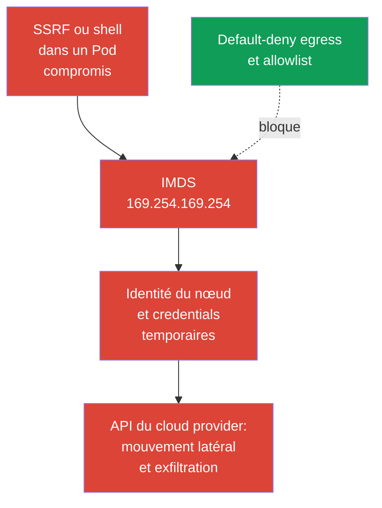
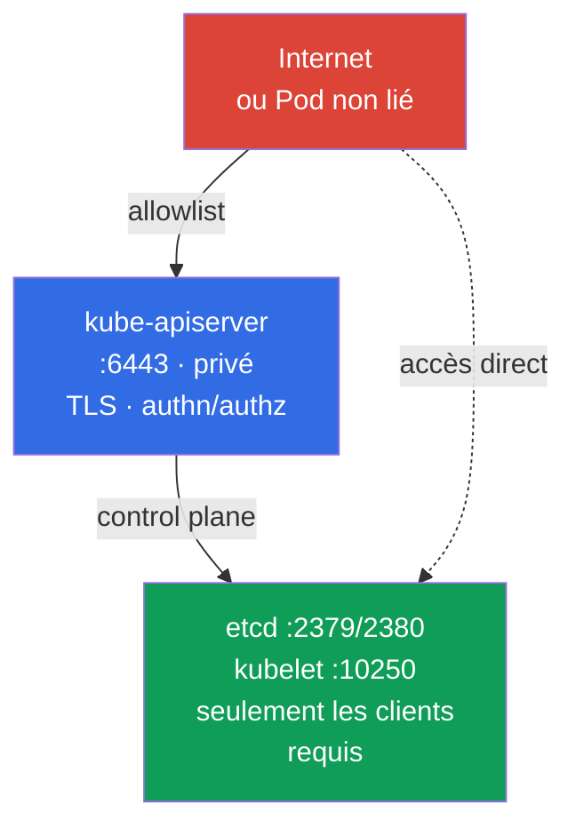

[Русская версия](ru.md) · [Eng version](README.md) · [Versión en español](es.md) · [Deutsche Version](de.md) · [ქართული ვერსია](ge.md) · [繁體中文版](tw.md) · [日本語版](jp.md)

# Chapitre 05. Protection des métadonnées et des endpoints de nœud; protection des GUI

> **Le problème.** Un Pod compromis ou une SSRF peut atteindre un endpoint inaccessible à un utilisateur externe: les métadonnées cloud du nœud, le control plane ou un GUI d'administration. Un seul chemin réseau autorisé à tort peut exposer l'identité cloud et les credentials temporaires du nœud, ou une interface de gestion privilégiée. Le RBAC ordinaire d'un workload ne protège pas les métadonnées, car elles ne font pas partie de l'API Kubernetes.

> **La suite.** Dans le chapitre 04, nous avons transformé un réseau de Pod plat en un ensemble de connexions autorisées. Nous allons maintenant appliquer l'isolation egress aux destinations particulièrement dangereuses: les métadonnées cloud, le control plane et les GUI. Il s'agit du domaine Cluster Setup (15 %) de CKS. Une erreur dans l'une de ces autorisations peut transformer la compromission d'un Pod en compromission de l'identité cloud ou du cluster.

> **Ce qu'il faut connaître de CKA.** La syntaxe de base des `NetworkPolicy` egress, `ipBlock` et le fonctionnement d'un CNI sont traités dans le [chapitre 34 de CKA](../../../cka/course/34/fr.md). Nous examinons ici les menaces liées aux métadonnées de nœud et aux endpoints d'administration, plutôt que de répéter les bases des politiques.

## 05.1. Scénario d'attaque: un Pod lit les métadonnées cloud

Un cloud provider expose souvent un service de métadonnées à une instance de machine virtuelle sur une adresse link-local. L'adresse IPv4 la plus connue est `169.254.169.254`. Si un Pod peut l'atteindre via le réseau du nœud, une vulnérabilité applicative, une SSRF ou un accès shell offrent à un attaquant un nouveau chemin: obtenir des informations sur l'instance et, avec une identité cloud mal configurée, les credentials temporaires du rôle du nœud.



Les métadonnées ne sont ni une API Kubernetes ni un Service. C'est un endpoint de l'infrastructure du nœud, donc un Pod peut contourner RBAC, ServiceAccount et la politique de l'application si le réseau autorise la requête. La menace est particulièrement pertinente pour les workloads qui reçoivent du HTTP entrant: une SSRF fait demander à l'application une adresse inaccessible à l'utilisateur externe.

Vérifiez si l'endpoint est joignable depuis un Pod de diagnostic. Il doit reproduire le namespace, les labels et les caractéristiques réseau importantes du workload cible, notamment `hostNetwork` s'il est utilisé; sinon, le selector ou le dataplane peut tester le mauvais chemin. En production, n'affichez pas les credentials ni la réponse complète des métadonnées dans le terminal ou les logs. Un code de statut HTTP ou un chemin sans danger, tel que le nom de l'instance, suffit à la vérification.

```bash
kubectl -n payments run metadata-check \
  --image=curlimages/curl:8.22.0 --restart=Never -- sleep 3600
kubectl -n payments wait --for=condition=Ready pod/metadata-check --timeout=90s

# --noproxy exclut l'influence de HTTP_PROXY et HTTPS_PROXY.
# Une erreur curl seule ne prouve pas qu'IMDS est bloqué.
kubectl -n payments exec metadata-check -- sh -c '
  tmp_err=$(mktemp)
  http_code=$(curl --noproxy "*" --connect-timeout 3 --max-time 5 \
    -sS -o /dev/null -w "%{http_code}" \
    http://169.254.169.254/latest/meta-data/ 2>"$tmp_err")
  rc=$?

  if [ "$rc" -eq 0 ]; then
    echo "IMDS reachable, HTTP status: $http_code"
    rm -f "$tmp_err"
  else
    echo "IMDS request failed, curl rc=$rc" >&2
    cat "$tmp_err" >&2
    rm -f "$tmp_err"
    echo "REVIEW_REQUIRED: failure alone does not prove that IMDS is blocked" >&2
    exit "$rc"
  fi
'
```

Seul un `curl` terminé avec une réponse HTTP rapide (`200`, `401` ou un autre statut) prouve la joignabilité du réseau, mais ne prouve pas l'accès aux credentials. Un timeout, une erreur de route/runtime ou un autre échec impose une investigation distincte de la policy ou du CNI: ce n'est **pas** la preuve qu'IMDS est bloqué. Supprimez le Pod temporaire après la vérification:

```bash
kubectl -n payments delete pod metadata-check
```

L'adresse et le protocole des métadonnées dépendent du provider. `169.254.169.254` est un **scénario de compétence typique ressemblant à AWS, et non une tâche d'examen garantie**. Cette well-known address est utilisée par AWS IMDS et Azure IMDS; GKE Dataplane V2 l'utilise aussi pour le serveur de métadonnées GKE. Pour Azure, GCP et un proxy de métadonnées privé, consultez l'endpoint documenté par le provider et ajoutez-le séparément au modèle de menaces. Sur AWS quand IMDS IPv6 est activé, prenez aussi en compte `fd00:ec2::254`: un blocage IPv4 seul ne prouve pas une protection complète.

> 🧠 L'endpoint de métadonnées n'est pas limité par RBAC ou les permissions de `ServiceAccount`; une SSRF ou un shell dans un workload peut fournir des credentials cloud quand le réseau du nœud et IAM sont larges.

## 05.2. Policy egress pour les métadonnées et IMDSv2

`NetworkPolicy` est un mécanisme d'autorisation, pas un firewall de refus global. L'ordre fiable est donc le suivant:

1. Activez default-deny egress pour le namespace.
2. Autorisez explicitement DNS et les dépendances réelles de l'application.
3. N'autorisez pas le chemin de métadonnées du nœud sauf si l'identité workload du provider choisi l'exige; utilisez une autorisation ou un blocage spécifique au provider.
4. Vérifiez les chemins autorisés et l'absence d'accès du Pod aux credentials ou à l'identité du nœud depuis un Pod avec les labels du workload.

Le baseline suivant isole l'egress de tous les Pod dans le namespace `payments`.

> 🎯 Activez default-deny egress, autorisez DNS et les dépendances vérifiées, excluez les métadonnées de l'allowlist et vérifiez à la fois le chemin autorisé et le refus d'une requête de métadonnées.

```yaml
apiVersion: networking.k8s.io/v1
kind: NetworkPolicy
metadata:
  name: default-deny-egress
  namespace: payments
spec:
  podSelector: {}
  policyTypes:
  - Egress
```

Ajoutez ensuite des règles d'autorisation egress étroites et distinctes. Par exemple, la plupart des Pod ont besoin de DNS vers CoreDNS. Confirmez les labels réels et l'adresse de destination dans votre cluster.

```yaml
apiVersion: networking.k8s.io/v1
kind: NetworkPolicy
metadata:
  name: allow-dns-egress
  namespace: payments
spec:
  podSelector: {}
  policyTypes:
  - Egress
  egress:
  - to:
    - namespaceSelector:
        matchLabels:
          kubernetes.io/metadata.name: kube-system
      podSelector:
        matchLabels:
          k8s-app: kube-dns
    ports:
    - protocol: UDP
      port: 53
    - protocol: TCP
      port: 53
```

Il arrive qu'une application legacy ait temporairement besoin d'un egress IPv4 large. Dans une telle règle d'autorisation, `ipBlock.except` exclut IMDS:

```yaml
apiVersion: networking.k8s.io/v1
kind: NetworkPolicy
metadata:
  name: allow-external-ipv4-except-imds
  namespace: payments
spec:
  podSelector:
    matchLabels:
      app: legacy-client
  policyTypes:
  - Egress
  egress:
  - to:
    - ipBlock:
        cidr: 0.0.0.0/0
        except:
        - 169.254.169.254/32
```

Il s'agit d'un compromis de migration, pas d'un bon état final: la règle ouvre encore presque tout l'Internet IPv4. `except` exclut une adresse seulement de cette règle. Les policies sont additives: une autre autorisation egress avec `0.0.0.0/0`, un CIDR plus large ou l'adresse IMDS autorisera de nouveau les métadonnées. L'option durable consiste en règles étroites pour DNS, un proxy egress, les CIDR ou l'endpoint de chaque dépendance requise. Si IPv6 est utilisé, concevez et testez des chemins IPv6 séparés au lieu de considérer qu'une policy IPv4 offre une protection complète.

La policy réseau ne protège que si le CNI applique réellement `NetworkPolicy`. `ipBlock.except` pour les métadonnées est un modèle courant de style examen et transitoire, mais son enforcement pour les endpoints link-local et host dépend du CNI et du dataplane. De plus, la gestion du trafic vers le nœud et SNAT varie parmi les CNI et les Kubernetes managés. Ne remplacez pas par cette policy la protection de l'instance cloud et le firewall du nœud: en production, la frontière principale est constituée des paramètres de métadonnées du provider et de l'identité workload, la policy étant une couche additionnelle.

> 🏭 Contrôles AWS/GKE/AKS vérifiés par version et éléments de preuve pour l'accès aux métadonnées et l'identité workload choisie.

| Provider | Identité du nœud | Identité workload et chemin de métadonnées | Contrôle réseau | Contrôle IAM et éléments de preuve |
|---|---|---|---|---|
| AWS / EKS | Rôle IAM du nœud via IMDS `169.254.169.254` (et `fd00:ec2::254` avec IPv6) | EKS Pod Identity ou IRSA au lieu des credentials du nœud | IMDSv2 avec hop limit `1` comme baseline pour les Pod non-`hostNetwork`; les Pod `hostNetwork: true` conservent l'accès à IMDS et exigent un contrôle ou une admission policy distincts; policy et firewall sont des couches additionnelles | Rôle IAM de nœud minimal; CloudTrail et vérification qu'un Pod n'obtient pas les credentials du nœud |
| GKE | Service account/access scopes du nœud | Workload Identity Federation: Pod -> serveur de métadonnées GKE (`metadata.google.internal` / metadata IP) -> token KSA -> STS -> token fédéré à courte durée de vie | Exemples actuels de policy stricte: dataplane ordinaire - `169.254.169.252/32`, TCP `988` et `987`; GKE Dataplane V2 - `169.254.169.254/32`, TCP `80` et `8080`. Vérifiez la documentation GKE avant application | Rôles IAM KSA/GSA minimaux; Cloud Audit Logs et vérification du token fédéré |
| Azure / AKS | Managed identity du nœud via IMDS `169.254.169.254` | Microsoft Entra Workload ID | Restriction IMDS AKS - **Preview**, seulement pour les Pod non-`hostNetwork`; elle n'est pas prévue pour une production SLA, est incompatible avec certains scénarios add-ons/extensions et ne prend pas en charge les Windows node pools | Managed identity de nœud minimale; vérification de la fédération Entra et vérification séparée de l'applicabilité de la restriction IMDS |

GKE Workload Identity crée un paradoxe apparent important: une identité workload sécurisée utilise elle-même le serveur de métadonnées GKE. Il est donc impossible de bloquer `169.254.169.254` comme règle universelle: cette adresse est utilisée par Azure IMDS et GKE Dataplane V2, et pas seulement par AWS. Avec une `NetworkPolicy` stricte, n'autorisez que le chemin documenté du dataplane GKE effectivement utilisé: `169.254.169.252/32` sur TCP `988` et `987` pour Workload Identity Federation dans le dataplane ordinaire, ou `169.254.169.254/32` sur TCP `80` et `8080` pour GKE Dataplane V2. Ce sont des exemples actuels, pas des constantes permanentes: revérifiez la documentation GKE avant application. Les Pod `hostNetwork` ont un modèle d'accès différent et exigent une évaluation distincte.

Sur AWS, activez IMDSv2 au niveau du template d'instance ou de l'instance: `HttpTokens=required` oblige un client à obtenir d'abord un token temporaire via `PUT`, puis à l'envoyer dans un en-tête. Cela réduit une catégorie d'attaques SSRF prévues pour un simple `GET`, mais ne remplace pas la policy egress: un Pod compromis peut toujours réaliser un échange IMDSv2 correct si l'endpoint est accessible. Pour les **nouveaux workloads sur des node types pris en charge**, AWS recommande **EKS Pod Identity**; **IRSA** demeure une alternative pour les déploiements OIDC/IRSA existants et les cas où Pod Identity n'est pas pris en charge, notamment certains scénarios Fargate, Windows ou SDK. Pour EKS, AWS recommande de **ne pas désactiver l'endpoint IMDS**: les composants du nœud peuvent en dépendre. Le baseline sécurisé pour les workloads ordinaires non-`hostNetwork` qui utilisent IRSA/EKS Pod Identity est IMDSv2 avec un hop limit de **1**, afin que la réponse IMDSv2 ne traverse pas un saut réseau additionnel vers le réseau des Pod. Utilisez un hop limit de **2** seulement comme exception délibérée lorsqu'un workload doit réellement accéder à IMDS.

Cette limite ne protège pas les Pod `hostNetwork: true`: AWS indique que ces Pod conservent un accès direct à IMDS. Pour les workloads non fiables, limitez séparément `hostNetwork` par admission/policy et ne considérez pas le hop limit `1` comme une protection suffisante des Pod host-network.

```bash
# Exemple AWS: défini par l'administrateur de l'infrastructure, et non depuis un Pod.
aws ec2 modify-instance-metadata-options \
  --instance-id i-0123456789abcdef0 \
  --http-tokens required \
  --http-put-response-hop-limit 1

# Pour EKS, c'est le baseline: la réponse IMDSv2 ne doit pas atteindre un Pod par le réseau de conteneurs.
# La valeur 2 n'est permise que si un workload doit réellement utiliser IMDS;
# vérifiez d'abord ce besoin et préférez IRSA/EKS Pod Identity aux credentials de nœud du Pod.
# IMDSv2 exige un token. Utilisez la commande seulement dans un test isolé.
TOKEN=$(curl --noproxy '*' -sS -X PUT \
  -H 'X-aws-ec2-metadata-token-ttl-seconds: 60' \
  http://169.254.169.254/latest/api/token)
curl --noproxy '*' -sS -o /dev/null -w '%{http_code}\n' \
  -H "X-aws-ec2-metadata-token: ${TOKEN}" \
  http://169.254.169.254/latest/meta-data/
```

> 🎯 Pour un endpoint, identifiez ses clients et son port, vérifiez l'adresse de bind, le firewall ou l'allowlist, TLS et authn/authz, puis confirmez les accès autorisés et refusés.

## 05.3. Endpoints d'administration: kubelet, etcd et kube-apiserver

Les métadonnées ne sont pas la seule cible. Après avoir accédé au réseau des Pod, un attaquant recherche des endpoints de gestion, mais leurs modèles de menaces diffèrent. etcd et, en général, kubelet exigent une restriction réseau stricte. Un Pod ordinaire atteint normalement kube-apiserver via `kubernetes.default`; sa protection repose avant tout sur TLS, authentication, authorization/RBAC et admission, tandis qu'une policy egress ne restreint que davantage les chemins inutiles. Ne regroupez pas ces endpoints dans une règle qui les « bloque pour tous les Pod ».

| Endpoint | Port habituel | Risque en cas de mauvaise configuration | Protection de base |
|---|---:|---|---|
| kubelet HTTPS | `10250` | Exécution de commandes, accès aux données de Pod ou à l'API du nœud avec authn/authz faible | Fermer avec un firewall, désactiver l'accès anonymous, activer Webhook authorization, utiliser TLS |
| kubelet read-only | `10255` | Exposait historiquement des informations sur les Pod sans authentication | Ne pas l'activer, `--read-only-port=0` |
| etcd client/peer | `2379` / `2380` | Lecture ou modification de l'état du cluster, notamment des Secrets | `2379` seulement depuis les clients etcd autorisés (principalement kube-apiserver), `2380` seulement entre les membres etcd; mTLS, firewall, aucune exposition publique |
| kube-apiserver | `6443` | Point d'entrée vers l'ensemble de l'API Kubernetes | TLS, authn/authz forte, endpoint privé ou allowlist, audit |



Vérifiez les ports en écoute sur un nœud disposant d'un accès administratif autorisé:

```bash
sudo ss -lntp | grep -E ':(10250|10255|2379|2380|6443)\b' || true
# Vérifiez séparément les flags du processus et KubeletConfiguration: les flags ne doivent pas nécessairement figurer dans la configuration YAML.
sudo grep -R -- '--read-only-port\|--anonymous-auth\|--authorization-mode' \
  /etc/systemd/system /usr/lib/systemd/system /etc/default /var/lib/kubelet 2>/dev/null || true
sudo grep -nE 'readOnlyPort|anonymous:|authorization:|webhook:' \
  /var/lib/kubelet/config.yaml 2>/dev/null || true
```

Attendez-vous à ce que `10250`, `2379`, `2380` et `6443` écoutent sur l'interface requise selon la topologie. Le critère n'est pas de désactiver chaque port, mais de restreindre les sources et d'activer l'authentication. Pour kubelet, vérifiez `--read-only-port=0`, `--anonymous-auth=false` et `--authorization-mode=Webhook`; les flags et les paramètres CIS sont traités en détail dans le chapitre 07.

Examinez séparément RBAC: la permission `nodes/proxy` peut donner à un sujet accès à l'API kubelet via l'API server, et donc à des opérations sensibles sur le nœud. Trouvez les rôles disposant de cette permission et inspectez leurs bindings:

```bash
kubectl get clusterrole -o yaml | grep -n -C 3 'nodes/proxy' || true
kubectl get clusterrolebinding \
  -o custom-columns=NAME:.metadata.name,ROLE:.roleRef.name,SUBJECTS:.subjects[*].name
```

L'authorization `Webhook` est un baseline obligatoire, mais ne constitue pas la preuve que kubelet est sécurisé. Dans Kubernetes v1.36, **Fine-Grained Kubelet Authorization est GA et son feature gate est verrouillé comme activé**. Au lieu d'accorder le large `nodes/proxy` à un rôle de monitoring/observability, accordez uniquement les subresources nécessaires avec le minimum de verbs et seulement quand c'est réellement nécessaire. La carte complète GA endpoint-vers-subresource-RBAC est:

| Endpoint kubelet | Ressource RBAC fine-grained | Fallback via `nodes/proxy` |
|---|---|---|
| `/stats/*` | `nodes/stats` | non |
| `/metrics/*` | `nodes/metrics` | non |
| `/logs/*` | `nodes/log` | non |
| `/pods` | `nodes/pods` | oui |
| `/runningPods/` | `nodes/pods` | oui |
| `/healthz` | `nodes/healthz` | oui |
| `/configz` | `nodes/configz` | oui |
| `/spec/*` | `nodes/spec` | non |
| `/checkpoint/*` | `nodes/checkpoint` | non |
| tout le reste | `nodes/proxy` | s'applique directement |

> **⚠️ Écart de version.** Fine-Grained Kubelet Authorization est GA dans v1.36, tandis que dans le snapshot d'examen v1.35, le feature gate `KubeletFineGrainedAuthz` est encore Beta (activé par défaut). Avant de migrer, confirmez `authorization.mode: Webhook` et l'état réel du feature gate sur le kubelet cible. Vérifiez séparément le RBAC de l'identité qui accède à kubelet, par exemple avec `kubectl auth can-i get nodes/metrics --as=system:serviceaccount:<namespace>:<serviceaccount>`. Ne retirez pas `nodes/proxy` avant d'avoir confirmé la configuration ou le gate, RBAC et un retest d'endpoint réel.

Pour `/pods`, `/runningPods/`, `/healthz` et `/configz`, kubelet vérifie d'abord le subresource fine-grained correspondant puis, en cas de refus, répète l'authorization via le large `nodes/proxy`. Il s'agit d'une double vérification rétrocompatible: tant que le sujet conserve `nodes/proxy`, une permission étroite seule ne réduit pas ses privilèges effectifs. Après avoir migré les rôles, retirez `nodes/proxy`; sinon, le least privilege ne sera pas mis en œuvre.

Par exemple, un collecteur de métriques n'a habituellement besoin que de `get` sur `nodes/metrics` et/ou `nodes/stats`:

```yaml
rules:
- apiGroups: [""]
  resources: ["nodes/metrics", "nodes/stats"]
  verbs: ["get"]
```

Retirez `nodes/proxy` de ces rôles: même `get` sur ce subresource n'est pas un accès read-only inoffensif. Via les endpoints WebSocket de kubelet, il peut autoriser l'exécution de commandes dans des conteneurs. L'authorization fine-grained ne remplace pas TLS, les contrôles réseau ni la revue RBAC, mais elle permet de migrer de cette permission large vers un least privilege vérifiable.

Au niveau cloud, utilisez un security group ou un firewall: autorisez `2379` seulement depuis les clients etcd autorisés, principalement kube-apiserver; autorisez `2380` seulement entre les membres etcd. Cette différence est importante pour un etcd externe. N'autorisez `10250` qu'au control plane et au monitoring explicitement requis; n'autorisez `6443` que depuis des réseaux de confiance, un VPN, un bastion ou un endpoint privé. N'exposez pas etcd par NodePort, LoadBalancer, reverse proxy ou DNS public. etcd exige TLS client/peer et des certificats client, pas seulement le filtrage de port.

Une `NetworkPolicy` ordinaire est utile au trafic Pod-to-Pod, mais ce n'est pas un firewall universel pour les endpoints host. Le trafic vers une IP de nœud peut changer de source à cause de SNAT, et un Pod hostNetwork peut contourner le dataplane Pod. Pour protéger un nœud, associez la policy CNI au firewall host, aux contrôles réseau cloud et à la configuration des composants. Cilium peut fournir des contrôles host-aware supplémentaires, mais ils dépendent du mode CNI et exigent une conception séparée.

> 🔬 Confinement d'une installation Kubernetes Dashboard existante et least privilege pour les GUI Kubernetes.

## 05.4. Legacy: Kubernetes Dashboard archivé et accès GUI minimal

Pour un Dashboard déjà installé, prévoyez son remplacement ou son retrait. En attendant, n'exposez pas l'UI par un LoadBalancer public ou un Ingress exposé à Internet et n'utilisez pas `cluster-admin` comme identité quotidienne. Conservez l'UI derrière un VPN ou un proxy d'accès authentifié, appliquez TLS et un RBAC minimal limité au namespace. Les mêmes exigences s'appliquent à toute autre UI web ou desktop prise en charge au-dessus de l'API Kubernetes: exposition privée, authentication forte, sessions courtes, audit et kubeconfig ou ServiceAccount de périmètre minimal.

Pour un rôle read-only, `get/list/watch` sont nécessaires au listing courant des ressources, tandis que le subresource `pods/log` ne demande en pratique que `get`:

```yaml
rules:
- apiGroups: [""]
  resources: ["pods", "services", "events"]
  verbs: ["get", "list", "watch"]
- apiGroups: [""]
  resources: ["pods/log"]
  verbs: ["get"]
```

Vérifiez les permissions d'une ServiceAccount précise dans le namespace cible avec `kubectl auth can-i`: `get pods/log` doit répondre `yes`, tandis que la lecture de `secrets` et `create pods/exec` doivent répondre `no`.

> 🎯 Prouvez l'accès requis et le refus par une vérification positive et négative plutôt que de vous arrêter à une modification de configuration.

## 05.5. Vérification, diagnostic et erreurs courantes

La vérification doit prouver deux propriétés: le trafic requis continue à fonctionner, tandis que les métadonnées et les endpoints inutiles sont inaccessibles. `kubectl get networkpolicy` seul prouve la présence du YAML, pas l'enforcement par le CNI.

> 🏭 Diagnostics spécifiques au provider et contrôles opérationnels pour les métadonnées/endpoints (AWS IMDS, GKE WIF, AKS Entra Workload ID).

```bash
# Comparez les selectors et décrivez l'isolation egress résultante.
kubectl -n payments get networkpolicy
kubectl -n payments describe networkpolicy default-deny-egress
kubectl -n payments get pod --show-labels
kubectl -n kube-system get pod --show-labels | grep -E 'coredns|kube-dns'

# Le Pod doit reproduire le namespace et les labels de l'application protégée.
# Pour une cible avec hostNetwork ou d'autres paramètres réseau particuliers, créez un manifest distinct présentant les mêmes caractéristiques.
kubectl -n payments run egress-test \
  --image=curlimages/curl:8.22.0 --labels=app=legacy-client \
  --restart=Never -- sleep 3600
kubectl -n payments wait --for=condition=Ready pod/egress-test --timeout=90s

# AWS/EKS: DNS doit fonctionner, alors que les credentials IMDS du nœud ne doivent pas être disponibles pour le Pod.
kubectl -n payments exec egress-test -- nslookup kubernetes.default.svc.cluster.local
kubectl -n payments exec egress-test -- sh -c '
  tmp_err=$(mktemp)
  http_code=$(curl --noproxy "*" --connect-timeout 3 --max-time 5 \
    -sS -o /dev/null -w "%{http_code}" \
    http://169.254.169.254/latest/meta-data/ 2>"$tmp_err")
  rc=$?

  if [ "$rc" -eq 0 ]; then
    echo "IMDS request reached an HTTP endpoint; status: $http_code"
  else
    echo "REVIEW_REQUIRED: IMDS request failed, curl rc=$rc" >&2
    cat "$tmp_err" >&2
  fi

  rm -f "$tmp_err"
  exit "$rc"
'

# GKE WIF: le chemin des métadonnées peut être intentionnellement accessible; vérifiez l'obtention d'une
# identité workload à courte durée de vie au lieu d'attendre un timeout, et confirmez l'absence d'identité de nœud.
# AKS: vérifiez Entra Workload ID séparément; la restriction IMDS est Preview, ne couvre pas les Pod hostNetwork, n'est pas prévue pour une production SLA, peut être incompatible avec des scénarios add-ons/extensions et ne prend pas en charge les Windows node pools.
```

Lors d'un timeout, `curl` peut se terminer avec un code non nul, donc l'automatisation doit conserver à la fois le code de sortie et stdout/stderr. Dans la lab 101, la vérification des métadonnées repose précisément sur `curl --max-time 3`; n'exigez pas un texte d'erreur précis de chaque CNI.

| Symptôme | Vérification et cause probable |
|---|---|
| Les métadonnées AWS restent accessibles | Le Pod n'est pas sélectionné par le selector, le CNI n'applique pas la policy, une autre policy additive autorise un CIDR large, IMDS IPv6 n'a pas été pris en compte, le hop limit EKS n'est pas de 1 pour un Pod non-`hostNetwork`, ou le Pod lui-même utilise `hostNetwork: true` et conserve donc l'accès à IMDS quel que soit le hop limit |
| Les métadonnées GKE sont accessibles | Avec Workload Identity Federation, cela peut être le chemin attendu vers un token workload à courte durée de vie; vérifiez que seul le chemin de métadonnées GKE documenté est autorisé et qu'aucune identité de nœud n'est émise |
| Les métadonnées AKS sont accessibles | La restriction IMDS est Preview et ne couvre pas les Pod `hostNetwork`; elle n'est pas prévue pour une production SLA, peut être incompatible avec des scénarios add-ons/extensions et ne prend pas en charge les Windows node pools. Vérifiez séparément Entra Workload ID et les restrictions applicables |
| DNS ne fonctionne plus après default-deny | Aucune règle allow pour le CoreDNS réel ou NodeLocal DNSCache; UDP/TCP `53` a été omis |
| `except` ne produit pas le blocage attendu | Une autre règle comporte une autorisation plus large, les métadonnées passent par IPv6 ou l'enforcement des endpoints link-local/host dépend du CNI et du dataplane |
| Kubelet est accessible de l'extérieur | Le firewall/security group est ouvert, l'accès anonymous est activé, l'endpoint écoute sur la mauvaise interface ou RBAC accorde un `nodes/proxy` excessif |
| Le GUI legacy est accessible depuis Internet | Le Service a `LoadBalancer`/`NodePort`, l'Ingress est public ou aucun proxy d'authentication n'est présent |
| Un utilisateur GUI voit trop de choses | `cluster-admin` a été accordé, `view` a été appliqué à l'échelle du cluster sans besoin précis ou le Role contient `secrets`/des subresources dangereux |

Un ordre de diagnostic utile consiste à vérifier les labels et les policies des Pod, confirmer la prise en charge du CNI, vérifier DNS, puis comparer les requêtes autorisées et refusées. Pour un endpoint de nœud, vérifiez séparément le firewall cloud, le firewall host, l'adresse de binding et les flags du composant. Ne testez pas etcd avec des écritures ni des requêtes destructives non authentifiées sur un cluster de production.

> 🏭 Template de nœud, IAM cloud, firewall/security group, policy-as-code et vérifications régulières des métadonnées et des endpoints de gestion.

## 05.6. Application en production

- **Identité sans credentials de nœud pour les Pod.** Ne donnez pas aux applications un accès implicite au rôle IAM du nœud. Dans EKS, utilisez EKS Pod Identity ou IRSA et un hop limit IMDSv2 de `1` pour les Pod ordinaires non-`hostNetwork`, sans désactiver l'endpoint du nœud. Évaluez séparément les Pod `hostNetwork`: ils conservent l'accès à IMDS; interdisez donc `hostNetwork` aux workloads non fiables par policy/admission. Dans GKE, autorisez le chemin de métadonnées GKE nécessaire à Workload Identity Federation; dans AKS, tenez compte du fait que la restriction IMDS est Preview, ne couvre pas `hostNetwork`, n'est pas prévue pour une production SLA, peut être incompatible avec des scénarios add-ons/extensions et ne prend pas en charge les Windows node pools. Dans tous les cas, appliquez des rôles IAM provider minimaux et conservez des éléments de preuve d'audit cloud.
- **Allowlist egress comme code.** Conservez default-deny, DNS et les destinations étroites avec le workload, soumettez-les à review et testez-les en pre-production. Un large `0.0.0.0/0` avec `except` doit avoir un propriétaire et une date de retrait.
- **Management plane privé.** L'API server, kubelet et etcd ne sont joignables que depuis les réseaux requis. Security group, firewall host, TLS et RBAC fonctionnent ensemble, car la défaillance d'une couche ne doit pas exposer un endpoint.
- **GUI comme endpoint legacy/de gestion.** Pour une UI existante ou prise en charge, utilisez SSO/auth proxy, des sessions courtes, TLS et des rôles limités au namespace. Les bearer tokens de longue durée, un LoadBalancer public et `cluster-admin` ne sont pas une configuration normale.
- **Observability et audit régulier.** Suivez les flow logs CNI, les modifications de `NetworkPolicy`, les Services/Ingress publics, les security groups ouverts et les bindings RBAC. Vérifiez le blocage des métadonnées après les mises à jour du CNI, du template cloud et de la topologie réseau.

## 05.7. Mini-glossaire

- **IMDS** - Instance Metadata Service, endpoint contenant les métadonnées d'une instance de cloud provider.
- **IMDSv2** - version AWS d'IMDS qui exige un token temporaire pour les requêtes de métadonnées.
- **SSRF** - Server-Side Request Forgery, vulnérabilité qui force un serveur à envoyer des requêtes vers une adresse choisie par l'attaquant.
- **Policy egress** - `NetworkPolicy` qui définit les connexions sortantes de Pod autorisées.
- **`ipBlock`** - règle egress ou ingress pour un CIDR; `except` en exclut des sous-réseaux ou des adresses.
- **kubelet** - agent de nœud Kubernetes; son endpoint sécurisé écoute normalement sur `10250`.
- **etcd** - stockage key-value de l'état Kubernetes; ses endpoints client et peer utilisent généralement `2379` et `2380`.
- **Kubernetes Dashboard** - web UI upstream archivée; pour une installation existante, appliquez des permissions RBAC minimales et prévoyez son remplacement ou son retrait.
- **Endpoint host** - endpoint réseau d'un nœud, et non d'un Pod ordinaire dans le dataplane CNI.

## 05.8. Résumé du chapitre

- Les métadonnées cloud peuvent être un chemin critique d'un Pod compromis vers l'identité cloud du nœud, mais l'identité workload spécifique au provider modifie le comportement attendu: sur GKE, le serveur de métadonnées est requis pour WIF; sur AWS, prenez aussi en compte IMDS IPv6.
- Commencez par default-deny egress et n'autorisez que DNS et les destinations requises. `ipBlock` avec `except: 169.254.169.254/32` est utile pour une autorisation large transitoire, mais ne remplace pas une allowlist étroite.
- Pour EKS, IMDSv2 avec un hop limit de `1` bloque le chemin ordinaire vers IMDS du nœud pour les Pod non-`hostNetwork`. Cela ne s'applique pas aux Pod `hostNetwork: true`, qui conservent l'accès à IMDS et exigent un contrôle séparé; ne désactivez pas l'endpoint IMDS et réservez le hop limit 2 au seul accès workload justifié. Cela ne remplace ni l'identité workload, ni l'isolation réseau, ni une identité cloud de least privilege.
- kubelet, etcd et kube-apiserver sont protégés par une combinaison de réseau privé, firewall, TLS, authentication, authorization, revue de `nodes/proxy` et flags sûrs, et pas seulement par une policy Pod.
- N'utilisez pas Kubernetes Dashboard archivé pour de nouvelles installations; un GUI existant ne doit pas être public ni s'exécuter avec `cluster-admin`. `pods/log` pour un rôle read-only ne requiert que `get`, pas `list/watch`.
- Vérifiez le trafic réel spécifique au provider: sur AWS, un Pod n'obtient pas les credentials IMDS du nœud; sur GKE, WIF ne fonctionne que par le chemin de métadonnées attendu; sur AKS, vérifiez séparément la fédération Entra et l'applicabilité de la restriction IMDS; les endpoints de nœud ne sont pas exposés à des sources inutiles.

## 05.9. Utilité à l'examen et dans le travail réel

**À l'examen.** La protection des métadonnées et des endpoints de nœud est une compétence CKS; le provider, l'adresse ou l'approche d'implémentation précise ne sont pas garantis. `169.254.169.254` et la policy egress représentent le scénario typique ressemblant à AWS de ce chapitre. Souvenez-vous que default-deny egress casse DNS sans autorisation explicite et que les objets `NetworkPolicy` sont additifs. Dans les tâches de hardening, recherchez les `10250`, `2379`, `2380`, `6443` exposés et un RBAC excessif.

**Dans le travail réel.** La compétence la plus importante est de tracer la frontière entre le réseau Pod, le réseau de nœud et le control plane cloud. La policy des workloads, le firewall host, le security group cloud, IMDSv2, l'identité workload et RBAC sont nécessaires ensemble. Ainsi, une seule SSRF ou RCE ne devient pas un accès aux credentials du nœud ou au control plane.

> ### 🔴 Le point de vue de l'attaquant
> **Asset:** API kubelet et conteneurs du nœud.
>
> **Point d'appui initial:** un agent de monitoring compromis.
>
> **Objectif de l'attaquant:** transformer un accès apparemment read-only en capacité de contrôler les conteneurs du nœud.
>
> **Chemin d'abus:** une permission dangereuse - la ServiceAccount a `get` sur `nodes/proxy`; les endpoints kubelet `GET` et WebSocket créent alors le risque de RCE décrit précédemment.
>
> **Éléments de preuve attendus:** SubjectAccessReview, événements d'audit et télémétrie d'accès à kubelet.
>
> **Contrôle:** remplacer le large `nodes/proxy` par les étroits `nodes/metrics` et `nodes/stats` avec le minimum de verbs.
>
> **Retest:** les métriques continuent de fonctionner, tandis que le chemin management/exec n'est plus autorisé.
>
> **ATT&CK:** [T1609 - Container Administration Command](https://attack.mitre.org/techniques/T1609/) et [T1613 - Container and Resource Discovery](https://attack.mitre.org/techniques/T1613/).

## 05.10. Questions d'auto-évaluation

<details>
<summary>1. Pourquoi l'accès d'un Pod à `169.254.169.254` est-il plus dangereux qu'une requête HTTP externe ordinaire?</summary>

C'est l'endpoint typique des métadonnées cloud du nœud, et non un Service externe ordinaire: via SSRF ou un shell, un Pod peut obtenir des informations sur l'instance et, avec une identité cloud incorrectement configurée, les credentials temporaires du rôle du nœud. Ce chemin contourne RBAC, ServiceAccount et la policy applicative et peut permettre un mouvement latéral dans l'API cloud.
</details>

<details>
<summary>2. Pourquoi une `NetworkPolicy` avec `ipBlock.except` n'est-elle pas un refus global pour chaque policy du namespace?</summary>

`except` exclut une adresse seulement d'une règle `ipBlock` précise. Les policies sont additives: une autre policy egress avec un CIDR large ou une autorisation directe de l'endpoint de métadonnées peut rouvrir l'accès; default-deny et des autorisations étroites pour les dépendances réelles sont plus durables.
</details>

<details>
<summary>3. Quelles règles d'autorisation egress sont normalement nécessaires après default-deny pour que l'application ne perde pas DNS?</summary>

Un egress étroit vers les endpoints CoreDNS réels dans `kube-system` sur UDP 53 et TCP 53 est généralement nécessaire. Avant de l'appliquer, vérifiez les labels des Pod DNS réels; dans une architecture donnée, les requêtes peuvent être traitées par NodeLocal DNSCache ou un autre composant DNS.
</details>

<details>
<summary>4. Qu'améliore IMDSv2 et pourquoi IMDSv2 seul est-il insuffisant après la compromission d'un Pod?</summary>

AWS IMDSv2 exige d'abord l'obtention d'un token temporaire via `PUT`, puis son envoi dans un en-tête, ce qui réduit une catégorie d'attaques SSRF conçues pour un simple `GET`. Mais un Pod compromis peut réaliser un échange IMDSv2 correct si l'endpoint est accessible; isolation egress, identité workload et permissions IAM minimales sont donc nécessaires. Pour EKS, un hop limit de `1` est le baseline des Pod ordinaires non-`hostNetwork`, tandis que les Pod `hostNetwork: true` conservent l'accès à IMDS et doivent être contrôlés séparément.
</details>

<details>
<summary>5. En quoi la protection des endpoints host diffère-t-elle de la protection de Pod ordinaires avec `NetworkPolicy`?</summary>

Une NetworkPolicy ordinaire décrit de manière portable le trafic Pod-to-Pod, mais le trafic vers une IP de nœud peut changer de source à cause de SNAT et un Pod `hostNetwork` peut contourner le dataplane Pod attendu. Protégez kubelet, etcd et l'API server par une combinaison de firewall host, security group cloud, adresse de binding, TLS, authentication, authorization et configuration des composants.
</details>

<details>
<summary>6. Quels paramètres kubelet faut-il vérifier avec le firewall pour l'endpoint `10250`?</summary>

Vérifiez que le port read-only est désactivé (`--read-only-port=0`), que l'accès anonymous est désactivé (`--anonymous-auth=false`) et que l'authorization s'exécute en mode Webhook. TLS et une revue RBAC sont aussi requis, surtout pour les permissions `nodes/proxy`; Webhook authorization ne remplace pas à elle seule la restriction réseau.
</details>

<details>
<summary>7. Pourquoi même `get` sur `nodes/proxy` est-il plus risqué que les permissions minimales `get` sur `nodes/metrics` ou `nodes/stats`?</summary>

`nodes/proxy` donne un accès large à l'API kubelet et même `get` sur ce subresource, via les endpoints WebSocket kubelet, peut permettre l'exécution de commandes dans les conteneurs. Dans v1.36, l'authorization kubelet fine-grained permet à un rôle de monitoring de n'avoir que `get` sur `nodes/metrics` et/ou `nodes/stats`; retirez le large `nodes/proxy` après la migration.
</details>

<details>
<summary>8. En quoi l'endpoint de métadonnées, l'identité de nœud et l'identité workload diffèrent-ils entre AWS/EKS, GKE et AKS, et pourquoi ne faut-il pas bloquer inconditionnellement le chemin de métadonnées pour GKE?</summary>

Dans AWS/EKS, IMDS délivre l'identité du nœud et les workloads utilisent EKS Pod Identity ou IRSA; dans GKE, Workload Identity Federation obtient un token workload à courte durée de vie via le serveur de métadonnées GKE; AKS utilise Microsoft Entra Workload ID. Le chemin de métadonnées GKE peut donc être nécessaire à l'identité workload et une policy stricte n'autorise que le chemin documenté du dataplane utilisé, au lieu de bloquer l'adresse sans condition.
</details>

<details>
<summary>9. Pourquoi un rôle read-only pour un Dashboard legacy ou une autre web UI requiert-il habituellement `get/list/watch` sur les ressources mais seulement `get` sur `pods/log`, et comment le vérifier avec `kubectl auth can-i` sans accès réel à l'UI?</summary>

L'UI a besoin de `get`, `list` et `watch` pour afficher les listes de Pod, Service et Events, mais la lecture du subresource `pods/log` ne requiert en pratique que `get`. Vérifiez les permissions d'une ServiceAccount précise dans le namespace cible avec `kubectl auth can-i`: `get pods/log` doit répondre `yes`, alors que `get secrets` et `create pods/exec` doivent répondre `no`.
</details>

## Pratique

🧪 Lab 101 (NetworkPolicy: default-deny, isolation, métadonnées): [tasks/cks/labs/101](../../labs/101/README_FR.MD)

🌐 Pratique interactive supplémentaire (killer.sh/killercoda, ressource externe): [networkpolicy-metadata-protection](https://killercoda.com/killer-shell-cks/scenario/networkpolicy-metadata-protection)

🧪 Lab 103 (CIS/kube-bench, Secure Ingress TLS, vérification des binaires): [tasks/cks/labs/103](../../labs/103/README_FR.MD)

---
[Table des matières](../README_FR.md) · [Chapitre 04](../04/fr.md) · [Chapitre 06](../06/fr.md)
