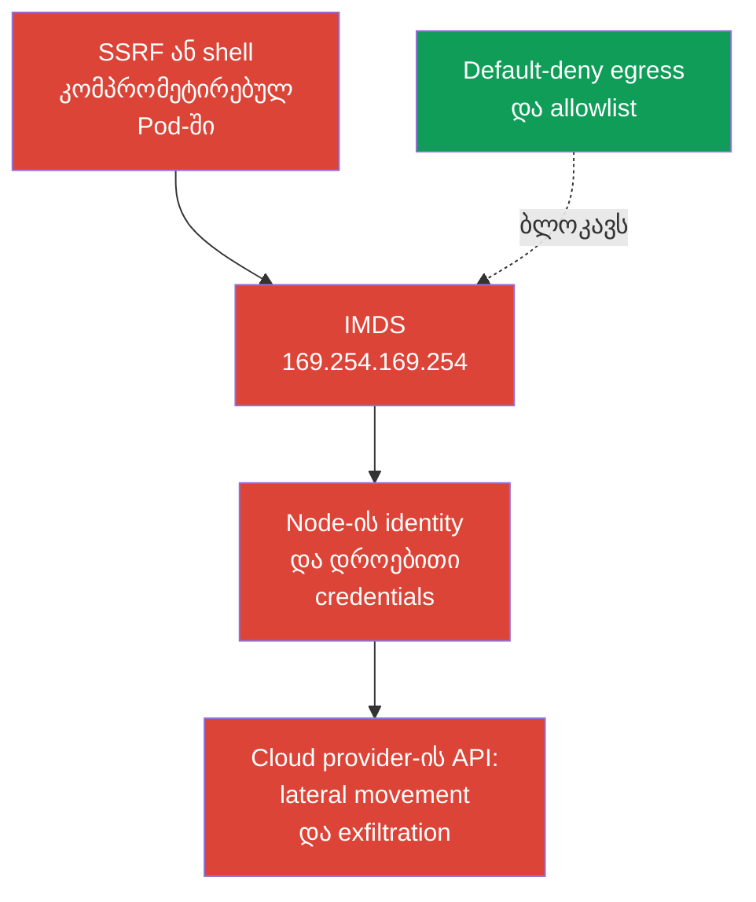
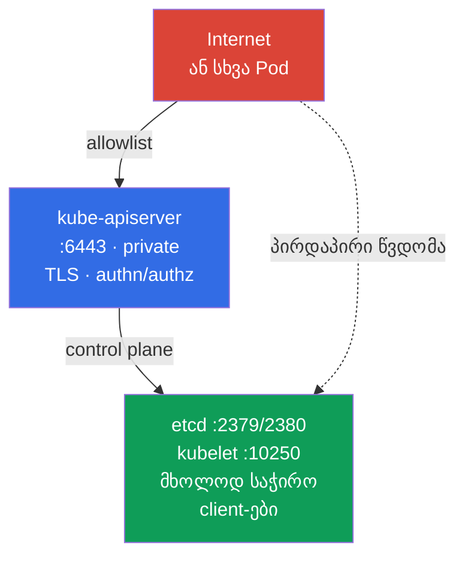

[Русская версия](ru.md) · [Eng version](README.md) · [Versión en español](es.md) · [Version française](fr.md) · [Deutsche Version](de.md) · [繁體中文版](tw.md) · [日本語版](jp.md)

# თავი 05. Node metadata-სა და endpoint-ების დაცვა; GUI-ს დაცვა

> **პრობლემა.** კომპრომეტირებულმა Pod-მა ან SSRF-მა შეიძლება მიწვდეს endpoint-ს, რომელიც გარე მომხმარებლისთვის მიუწვდომელია: node-ის cloud metadata, control plane ან სამსახურებრივი GUI. ერთმა არასწორად დაშვებულმა ქსელურმა გზამ შეიძლება გახსნას node-ის cloud identity და დროებითი credentials, ან privileged management interface. ჩვეულებრივი workload-ის RBAC არ იცავს metadata-ს, რადგან ის Kubernetes API არ არის.

> **რა არის შემდეგ.** 04-ე თავში ბრტყელი pod-ქსელი გადავაქციეთ ნებადართული კავშირების ერთობლიობად. ახლა გამოვიყენებთ egress isolation-ს განსაკუთრებით საშიშ დანიშნულებებზე: cloud metadata, control plane და GUI. ეს არის CKS-ის Cluster Setup (15%) დომენი. ერთ ასეთ ნებართვაში შეცდომამ შეიძლება Pod-ის კომპრომეტაცია cloud identity-ის ან კლასტერის კომპრომეტაციად აქციოს.

> **რა გჭირდებათ CKA-დან.** egress `NetworkPolicy`-ის ძირითადი სინტაქსი, `ipBlock` და CNI-ის მუშაობა განხილულია [CKA-ის 34-ე თავში](../../../cka/course/34/ge.md). აქ განვიხილავთ node metadata-ისა და სამსახურებრივი endpoint-ების საფრთხეებს და არა policy-ების საფუძვლების გამეორებას.

## 05.1. შეტევის სცენარი: Pod კითხულობს cloud metadata-ს

Cloud provider ხშირად აწვდის ვირტუალური მანქანის ეგზემპლარს metadata service-ს link-local მისამართზე. ყველაზე ცნობილი IPv4-მისამართია `169.254.169.254`. თუ Pod-ს შეუძლია მასთან წვდომა node-ის ქსელის მეშვეობით, აპლიკაციის მოწყვლადობა, SSRF ან shell-ზე წვდომა თავდამსხმელს აძლევს ახალ გზას: ეგზემპლარის შესახებ ცნობების მიღება, ხოლო არასწორად კონფიგურირებული cloud identity-ის შემთხვევაში - node-ის role-ის დროებით credentials-ს.



Metadata არ არის Kubernetes API და არც Service. ეს არის node-ის ინფრასტრუქტურის endpoint, ამიტომ Pod-ს შეუძლია RBAC-ის, ServiceAccount-ისა და აპლიკაციის policy-ის გვერდის ავლა, თუ ქსელი მოთხოვნას უშვებს. საფრთხე განსაკუთრებით აქტუალურია შემომავალი HTTP-ის მიმღები workload-ისთვის: SSRF აპლიკაციას აიძულებს, მოთხოვნა გაუგზავნოს გარე მომხმარებლისთვის მიუწვდომელ მისამართზე.

შეამოწმეთ, მისაწვდომია თუ არა endpoint დიაგნოსტიკური Pod-იდან. მან უნდა გაიმეოროს სამიზნე workload-ის namespace, labels და მნიშვნელოვანი ქსელური მახასიათებლები, მათ შორის `hostNetwork`, თუ ის გამოიყენება: სხვაგვარად selector-მა ან dataplane-მა შეიძლება არასწორი გზა შეამოწმოს. production-ში ტერმინალსა და log-ებში ნუ გამოიტანთ credentials-ს ან metadata-ს სრულ პასუხს. შემოწმებისთვის საკმარისია HTTP-კოდი ან უსაფრთხო path, მაგალითად ეგზემპლარის სახელი.

```bash
kubectl -n payments run metadata-check \
  --image=curlimages/curl:8.22.0 --restart=Never -- sleep 3600
kubectl -n payments wait --for=condition=Ready pod/metadata-check --timeout=90s

# --noproxy გამორიცხავს HTTP_PROXY-ისა და HTTPS_PROXY-ის გავლენას.
# curl-ის შეცდომა თავისთავად არ ამტკიცებს, რომ IMDS დაბლოკილია.
kubectl -n payments exec metadata-check -- sh -c '
  tmp_err=$(mktemp)
  http_code=$(curl --noproxy "*" --connect-timeout 3 --max-time 5 \
    -sS -o /dev/null -w "%{http_code}" \
    http://169.254.169.254/latest/meta-data/ 2>"$tmp_err")
  rc=$?

  if [ "$rc" -eq 0 ]; then
    echo "IMDS reachable, HTTP status: $http_code"
    rm -f "$tmp_err"
  else
    echo "IMDS request failed, curl rc=$rc" >&2
    cat "$tmp_err" >&2
    rm -f "$tmp_err"
    echo "REVIEW_REQUIRED: failure alone does not prove that IMDS is blocked" >&2
    exit "$rc"
  fi
'
```

მხოლოდ დასრულებული `curl`, სწრაფი HTTP-პასუხით (`200`, `401` ან სხვა status), ამტკიცებს ქსელის მისაწვდომობას, მაგრამ არ ამტკიცებს credentials-ზე წვდომას. Timeout, route/runtime error ან სხვა ვარდნა მოითხოვს policy/CNI-ის ცალკე შემოწმებას: ეს **არ** არის IMDS-ის დაბლოკვის დამტკიცება. შემოწმების შემდეგ წაშალეთ დროებითი Pod:

```bash
kubectl -n payments delete pod metadata-check
```

Metadata-ს მისამართი და პროტოკოლი provider-ზეა დამოკიდებული. `169.254.169.254` - **AWS-ის მსგავსი, ტიპური კომპეტენციის სცენარია, და არა გარანტირებული საგამოცდო ამოცანა**. ამ well-known მისამართს იყენებენ AWS IMDS და Azure IMDS; GKE Dataplane V2-ში მას ასევე იყენებს GKE metadata server. Azure-ისთვის, GCP-ისთვის და private metadata proxy-სთვის შეამოწმეთ provider-ის დოკუმენტირებული endpoint და ცალკე დაამატეთ ის საფრთხის მოდელში. AWS-ზე, თუ IPv6 IMDS ჩართულია, დამატებით გაითვალისწინეთ `fd00:ec2::254`: მხოლოდ IPv4-ის დაბლოკვა სრულ დაცვას არ ამტკიცებს.

> 🧠 Metadata endpoint არ იზღუდება RBAC-ითა და `ServiceAccount`-ის უფლებებით; SSRF-მა ან shell-მა workload-ში შეიძლება cloud credentials მისცეს, თუ node-ის ქსელი და IAM ფართოა.

## 05.2. Egress policy metadata-სა და IMDSv2-სთვის

`NetworkPolicy` - ეს allow-მექანიზმია და არა გლობალური deny firewall. ამიტომ საიმედო თანმიმდევრობა ასეთია:

1. Namespace-ისთვის ჩართეთ default-deny egress.
2. ცალსახად დაუშვით DNS და აპლიკაციის რეალური დამოკიდებულებები.
3. ნუ დაუშვებთ node metadata path-ს, თუ ის არ სჭირდება workload-ის არჩეულ provider identity-ს; გამოიყენეთ provider-specific allow/block.
4. შეამოწმეთ ნებადართული გზები და workload-ის labels-ის მქონე Pod-იდან credentials/identity-ზე Pod-ის წვდომის არარსებობა.

ქვემოთ არის baseline, რომელიც იზოლირებს `payments` namespace-ის ყველა Pod-ის egress-ს.

> 🎯 ჩართეთ default-deny egress, დაუშვით DNS და დადასტურებული დამოკიდებულებები, გამორიცხეთ metadata allowlist-იდან და შეამოწმეთ ნებადართული გზაც და metadata-მოთხოვნის უარყოფაც.

```yaml
apiVersion: networking.k8s.io/v1
kind: NetworkPolicy
metadata:
  name: default-deny-egress
  namespace: payments
spec:
  podSelector: {}
  policyTypes:
  - Egress
```

ამის შემდეგ დაამატეთ ცალკეული მინიმალური ნებართვები. მაგალითად, უმეტეს Pod-ს სჭირდება DNS CoreDNS-თან. რეალური labels და დანიშნულების მისამართი უნდა დაადასტუროთ თქვენს კლასტერში.

```yaml
apiVersion: networking.k8s.io/v1
kind: NetworkPolicy
metadata:
  name: allow-dns-egress
  namespace: payments
spec:
  podSelector: {}
  policyTypes:
  - Egress
  egress:
  - to:
    - namespaceSelector:
        matchLabels:
          kubernetes.io/metadata.name: kube-system
      podSelector:
        matchLabels:
          k8s-app: kube-dns
    ports:
    - protocol: UDP
      port: 53
    - protocol: TCP
      port: 53
```

ზოგჯერ legacy-აპლიკაციას დროებით სჭირდება ფართო გასვლა IPv4-ში. ასეთ ერთ allow-წესში `ipBlock.except` გამორიცხავს IMDS-ს:

```yaml
apiVersion: networking.k8s.io/v1
kind: NetworkPolicy
metadata:
  name: allow-external-ipv4-except-imds
  namespace: payments
spec:
  podSelector:
    matchLabels:
      app: legacy-client
  policyTypes:
  - Egress
  egress:
  - to:
    - ipBlock:
        cidr: 0.0.0.0/0
        except:
        - 169.254.169.254/32
```

ეს მიგრაციული კომპრომისია და არა კარგი საბოლოო მდგომარეობა: წესი კვლავ ხსნის თითქმის მთელ IPv4 ინტერნეტს. `except` მისამართს მხოლოდ ამ წესიდან გამორიცხავს. Policy-ები ადიტიურია, ამიტომ სხვა egress allow `0.0.0.0/0`-ით, უფრო ფართო CIDR-ით ან IMDS-ის მისამართით ისევ დაუშვებს metadata-ს. მდგრადი ვარიანტია წერტილოვანი წესები DNS-ისთვის, egress proxy-სთვის, CIDR-ისთვის ან თითოეული საჭირო დამოკიდებულების endpoint-ისთვის. თუ IPv6 გამოიყენება, დააპროექტეთ და შეამოწმეთ ცალკეული IPv6-გზები და IPv4-policy არ ჩათვალოთ სრულ დაცვად.

ქსელური policy იცავს მხოლოდ იმ CNI-ის შემთხვევაში, რომელიც რეალურად იყენებს `NetworkPolicy`-ს. `ipBlock.except` metadata-სთვის ხშირად exam-style და გარდამავალი პატერნია, მაგრამ მისი enforcement link-local-სა და host endpoint-ებისთვის CNI-სა და dataplane-ზეა დამოკიდებული. გარდა ამისა, node-სთან ტრაფიკისა და SNAT-ის რეალიზაცია სხვადასხვა CNI-სა და managed Kubernetes-ს შორის განსხვავდება. ამ policy-ით ნუ ჩაანაცვლებთ cloud instance-ისა და node-ის firewall-ის დაცვას: production-ში ძირითადი საზღვარია provider-ის metadata settings და workload identity, ხოლო policy დამატებითი შრეა.

> 🏭 Version-checked AWS/GKE/AKS კონტროლები და metadata-წვდომისა და არჩეული workload identity-ის evidence.

| Provider | Node identity | Workload identity და metadata path | Network control | IAM/control და evidence |
|---|---|---|---|---|
| AWS / EKS | Node-ის IAM role IMDS-ის `169.254.169.254`-ის მეშვეობით (და `fd00:ec2::254`, IPv6-ის შემთხვევაში) | EKS Pod Identity ან IRSA, node credentials-ის ნაცვლად | IMDSv2 hop limit `1`-ით baseline-ად non-`hostNetwork` Pod-ისთვის; `hostNetwork: true` Pod-ები ინარჩუნებენ IMDS-ზე წვდომას და მოითხოვენ ცალკე კონტროლს/admission policy-ს; policy/firewall - დამატებითი შრეებია | Node-ის მინიმალური IAM role; CloudTrail და შემოწმება, რომ Pod-ი node credentials-ს არ იღებს |
| GKE | Node-ის service account/access scopes | Workload Identity Federation: Pod -> GKE metadata server (`metadata.google.internal` / metadata IP) -> KSA token -> STS -> short-lived federated token | Strict policy-ის მიმდინარე მაგალითები: ჩვეულებრივი dataplane - `169.254.169.252/32`, TCP `988` და `987`; GKE Dataplane V2 - `169.254.169.254/32`, TCP `80` და `8080`. გამოყენებამდე შეამოწმეთ GKE-ის დოკუმენტაცია | KSA/GSA-ის მინიმალური IAM roles; Cloud Audit Logs და federated token-ის შემოწმება |
| Azure / AKS | Node-ის managed identity IMDS-ის `169.254.169.254`-ის მეშვეობით | Microsoft Entra Workload ID | AKS IMDS restriction - **Preview**, მხოლოდ non-`hostNetwork` Pod-ისთვის; არ არის განკუთვნილი production SLA-სთვის, შეუთავსებელია ზოგიერთ add-ons/extension სცენართან და არ უჭერს მხარს Windows node pool-ებს | Node-ის მინიმალური managed identity; Entra federation-ის შემოწმება და IMDS restriction-ის გამოყენებადობის ცალკე შემოწმება |

GKE Workload Identity ქმნის ერთი შეხედვით მნიშვნელოვან პარადოქსს: უსაფრთხო workload identity თავად იყენებს GKE metadata server-ს. ამიტომ `169.254.169.254`-ის უნივერსალურ წესად დაბლოკვა შეუძლებელია: ამ მისამართს იყენებენ Azure IMDS და GKE Dataplane V2, და არა მხოლოდ AWS. Strict `NetworkPolicy`-ისას დაუშვით მხოლოდ დოკუმენტირებული გზა GKE-ის ფაქტობრივი dataplane-ისთვის: `169.254.169.252/32` TCP `988`-ზე და `987`-ზე Workload Identity Federation-ისთვის ჩვეულებრივ dataplane-ში, ან `169.254.169.254/32` TCP `80`-ზე და `8080`-ზე GKE Dataplane V2-ისთვის. ეს არის მიმდინარე მაგალითები და არა მარადიული მუდმივები: გამოყენებამდე გადაამოწმეთ GKE-ის დოკუმენტაცია. `hostNetwork` Pod-ებს წვდომის სხვა მოდელი აქვთ და ცალკე შეფასებას მოითხოვენ.

AWS-ზე ჩართეთ IMDSv2 instance template-ის ან instance-ის დონეზე: `HttpTokens=required` კლიენტს აიძულებს, ჯერ `PUT`-ის მეშვეობით დროებითი token მიიღოს, შემდეგ header-ში გადასცეს ის. ეს ამცირებს SSRF-შეტევების იმ კლასს, რომელიც მარტივ `GET`-ზეა გათვლილი, მაგრამ egress policy-ს არ ანაცვლებს: კომპრომეტირებულ Pod-ს კვლავ შეუძლია სწორი IMDSv2 exchange-ის შესრულება, თუ endpoint მისაწვდომია. **მხარდაჭერილი node types-ზე ახალი workload-ებისთვის** AWS გირჩევთ **EKS Pod Identity**-ს; **IRSA** ალტერნატივად რჩება არსებული OIDC/IRSA-განლაგებებისთვის და შემთხვევებისთვის, სადაც Pod Identity არ არის მხარდაჭერილი, მათ შორის ზოგიერთი Fargate, Windows ან SDK სცენარისთვის. EKS-ისთვის AWS გირჩევთ, **არ გამორთოთ IMDS endpoint**: მასზე node-ის კომპონენტები შეიძლება იყოს დამოკიდებული. IRSA/EKS Pod Identity-ს გამოყენებელი ჩვეულებრივი non-`hostNetwork` workload-ისთვის საბაზისო უსაფრთხო ვარიანტია IMDSv2 hop limit **1**-ით, რომ IMDSv2-ის response-მა pod-ქსელში დამატებითი network hop არ გაიაროს. Hop limit **2**-ს იყენებენ მხოლოდ გააზრებულ გამონაკლისად, როცა workload-ს ნამდვილად სჭირდება IMDS-თან მიმართვა.

ეს შეზღუდვა არ იცავს `hostNetwork: true` Pod-ს: AWS მიუთითებს, რომ ასეთი Pod-ები ინარჩუნებენ IMDS-თან პირდაპირ წვდომას. არასანდო workload-ისთვის ცალკე შეზღუდეთ `hostNetwork`-ის გამოყენება admission/policy-ის მეშვეობით და hop limit `1` host-network Pod-ისთვის საკმარის დაცვად ნუ ჩათვლით.

```bash
# მაგალითი AWS-ისთვის: ინფრასტრუქტურის ადმინისტრატორი აყენებს, და არა Pod-იდან.
aws ec2 modify-instance-metadata-options \
  --instance-id i-0123456789abcdef0 \
  --http-tokens required \
  --http-put-response-hop-limit 1

# EKS-ისთვის ეს baseline-ია: IMDSv2-ის response-მა container-ქსელით Pod-მდე არ უნდა მიაღწიოს.
# მნიშვნელობა 2 დასაშვებია მხოლოდ იმ შემთხვევაში, თუ workload-ს ნამდვილად სჭირდება IMDS-ის გამოყენება;
# ჯერ შეამოწმეთ საჭიროება და Pod-ის node credentials-ის ნაცვლად IRSA/EKS Pod Identity აირჩიეთ.
# IMDSv2 token-ს მოითხოვს. ეს ბრძანება მხოლოდ იზოლირებულ ტესტში გამოიყენეთ.
TOKEN=$(curl --noproxy '*' -sS -X PUT \
  -H 'X-aws-ec2-metadata-token-ttl-seconds: 60' \
  http://169.254.169.254/latest/api/token)
curl --noproxy '*' -sS -o /dev/null -w '%{http_code}\n' \
  -H "X-aws-ec2-metadata-token: ${TOKEN}" \
  http://169.254.169.254/latest/meta-data/
```

> 🎯 Endpoint-ისთვის განსაზღვრეთ კლიენტები და პორტი, შეამოწმეთ bind address, firewall/allowlist, TLS და authn/authz, შემდეგ დაადასტურეთ ნებადართული და აკრძალული წვდომა.

## 05.3. სამსახურებრივი endpoint-ები: kubelet, etcd და kube-apiserver

Metadata ერთადერთი სამიზნე არ არის. Pod-ქსელში წვდომის შემდეგ თავდამსხმელი მართვის endpoint-ებს ეძებს, მაგრამ მათი საფრთხის მოდელები განსხვავდება. etcd და, ჩვეულებრივ, kubelet მკაცრ ქსელურ შეზღუდვას მოითხოვს. ჩვეულებრივი Pod kube-apiserver-ს ჩვეულებრივ `kubernetes.default`-ის მეშვეობით მიწვდება; მისი დაცვა ძირითადად TLS-ზე, authentication-ზე, authorization/RBAC-ზე და admission-ზეა აგებული, ხოლო egress policy მხოლოდ დამატებით ზღუდავს არასაჭირო გზებს. ეს endpoint-ები ნუ გააერთიანებთ წესში «დახურვა ყველა Pod-ისთვის».

| Endpoint | ჩვეულებრივი პორტი | რისკი შეცდომისას | საბაზისო დაცვა |
|---|---:|---|---|
| kubelet HTTPS | `10250` | ბრძანებების შესრულება, Pod-ის მონაცემებზე ან node API-ზე წვდომა სუსტი authn/authz-ის დროს | Firewall-ის დახურვა, anonymous access-ის გამორთვა, Webhook authorization-ის ჩართვა, TLS-ის გამოყენება |
| kubelet read-only | `10255` | ისტორიულად ავლენდა Pod-ის ინფორმაციას აუთენტიფიკაციის გარეშე | არ ჩართოთ, `--read-only-port=0` |
| etcd client/peer | `2379` / `2380` | კლასტერის მდგომარეობის, მათ შორის Secret-ების, წაკითხვა ან შეცვლა | `2379` მხოლოდ ავტორიზებული etcd client-ებიდან (უმეტესად kube-apiserver), `2380` მხოლოდ etcd member-ებს შორის; mTLS, firewall, public exposure-ის გარეშე |
| kube-apiserver | `6443` | შესასვლელი წერტილი მთელ Kubernetes API-ში | TLS, ძლიერი authn/authz, private endpoint ან allowlist, audit |



მოსმენადი პორტების შემოწმება ხდება node-ზე ავტორიზებული ადმინისტრაციული წვდომით:

```bash
sudo ss -lntp | grep -E ':(10250|10255|2379|2380|6443)\b' || true
# Process flags და KubeletConfiguration ცალ-ცალკე მოწმდება: flags სულაც არ არის ვალდებული, YAML-კონფიგში იყოს.
sudo grep -R -- '--read-only-port\|--anonymous-auth\|--authorization-mode' \
  /etc/systemd/system /usr/lib/systemd/system /etc/default /var/lib/kubelet 2>/dev/null || true
sudo grep -nE 'readOnlyPort|anonymous:|authorization:|webhook:' \
  /var/lib/kubelet/config.yaml 2>/dev/null || true
```

მოსალოდნელია, რომ `10250`, `2379`, `2380` და `6443` topology-ის მიხედვით საჭირო ინტერფეისზე მოისმენონ. კრიტერიუმი არ არის ყველა პორტის გამორთვა, არამედ წყაროების შეზღუდვა და აუთენტიფიკაციის ჩართვა. kubelet-ისთვის შეამოწმეთ `--read-only-port=0`, `--anonymous-auth=false` და `--authorization-mode=Webhook`; flags და CIS-პარამეტრები დაწვრილებით 07-ე თავშია განხილული.

ცალკე გადახედეთ RBAC-ს: უფლებამ `nodes/proxy` შეიძლება subject-ს kubelet API-ზე წვდომა მისცეს API server-ის მეშვეობით, და, აქედან გამომდინარე, node-ის მგრძნობიარე ოპერაციებზეც. იპოვეთ roles, ამ უფლებით, და შეამოწმეთ მათი bindings:

```bash
kubectl get clusterrole -o yaml | grep -n -C 3 'nodes/proxy' || true
kubectl get clusterrolebinding \
  -o custom-columns=NAME:.metadata.name,ROLE:.roleRef.name,SUBJECTS:.subjects[*].name
```

`Webhook` authorization აუცილებელი baseline-ია, მაგრამ არა kubelet-ის უსაფრთხოების დამტკიცება. Kubernetes v1.36-ში **Fine-Grained Kubelet Authorization - GA-ა და feature gate ჩაკეტილია ჩართულ მდგომარეობაში**. monitoring/observability-ის role-ისთვის ფართო `nodes/proxy`-ის ნაცვლად გასცით მხოლოდ საჭირო subresources მინიმალური verbs-ების ნაკრებით და მხოლოდ იქ, სადაც ეს ნამდვილად საჭიროა. endpoint → RBAC subresource-ის სრული GA-რუკა ასეთია:

| Kubelet endpoint | Fine-grained RBAC resource | Fallback `nodes/proxy`-ის მეშვეობით |
|---|---|---|
| `/stats/*` | `nodes/stats` | არა |
| `/metrics/*` | `nodes/metrics` | არა |
| `/logs/*` | `nodes/log` | არა |
| `/pods` | `nodes/pods` | დიახ |
| `/runningPods/` | `nodes/pods` | დიახ |
| `/healthz` | `nodes/healthz` | დიახ |
| `/configz` | `nodes/configz` | დიახ |
| `/spec/*` | `nodes/spec` | არა |
| `/checkpoint/*` | `nodes/checkpoint` | არა |
| ყველაფერი დანარჩენი | `nodes/proxy` | პირდაპირ გამოიყენება |

> **⚠️ ვერსიული სხვაობა.** Fine-Grained Kubelet Authorization GA-ა v1.36-ში, ხოლო საგამოცდო snapshot v1.35-ში feature gate `KubeletFineGrainedAuthz` ჯერ კიდევ Beta-ა (default-on). მიგრაციამდე დაადასტურეთ სამიზნე kubelet-ზე `authorization.mode: Webhook` და feature gate-ის ფაქტობრივი მდგომარეობა. ცალკე შეამოწმეთ ზუსტად იმ identity-ის RBAC, რომელიც kubelet-ს მიწვდება, მაგალითად `kubectl auth can-i get nodes/metrics --as=system:serviceaccount:<namespace>:<serviceaccount>`. `nodes/proxy` არ წაშალოთ, სანამ configuration/gate, RBAC და endpoint-ის რეალური retest არ დადასტურდება.

`/pods`-ის, `/runningPods/`-ის, `/healthz`-ისა და `/configz`-ისთვის kubelet ჯერ შესაბამის fine-grained subresource-ს ამოწმებს, ხოლო უარის შემთხვევაში authorization-ს ფართო `nodes/proxy`-ის მეშვეობით იმეორებს. ეს backward-compatible dual-check-ია: სანამ subject-ს `nodes/proxy` შერჩენილი აქვს, ვიწრო ნებართვა თავისთავად არ ამცირებს მის ფაქტობრივ პრივილეგიებს. roles-ის მიგრაციის შემდეგ წაშალეთ `nodes/proxy`, სხვაგვარად least privilege არ განხორციელდება.

მაგალითად, მეტრიკების შემგროვებელს ჩვეულებრივ საკმარისია `get` `nodes/metrics`-ზე და/ან `nodes/stats`-ზე:

```yaml
rules:
- apiGroups: [""]
  resources: ["nodes/metrics", "nodes/stats"]
  verbs: ["get"]
```

`nodes/proxy` ასეთი roles-იდან უნდა წაიშალოს: ამ subresource-ზეც კი `get` არ არის უწყინარი read-only წვდომა. kubelet-ის WebSocket endpoint-ების მეშვეობით მან შეიძლება კონტეინერებში ბრძანებების შესრულება დაუშვას. Fine-grained authorization არ ანაცვლებს TLS-ს, network controls-ს და RBAC-ის გადახედვას, მაგრამ საშუალებას იძლევა, ამ ფართო პრივილეგიიდან შემოწმებად least privilege-ზე გადავიდეთ.

Cloud-ის დონეზე გამოიყენეთ security group ან firewall: `2379` დაშვებულია მხოლოდ ავტორიზებული etcd client-ებიდან, უმეტესად kube-apiserver-იდან; `2380` - მხოლოდ etcd member-ებს შორის. ეს განსხვავება მნიშვნელოვანია external etcd-ისთვის. `10250` - მხოლოდ control plane-ისთვის და ცალსახად საჭირო monitoring-ისთვის, `6443` - მხოლოდ trusted networks, VPN, bastion ან private endpoint-ისთვის. ნუ გამოაქვეყნებთ etcd-ს `NodePort`-ის, `LoadBalancer`-ის, reverse proxy-ის ან public DNS-ის მეშვეობით. etcd-ისთვის სავალდებულოა client/peer TLS და კლიენტის სერტიფიკატები, და არა მხოლოდ პორტების ფილტრაცია.

ჩვეულებრივი `NetworkPolicy` სასარგებლოა Pod-to-Pod ტრაფიკისთვის, მაგრამ არ არის host endpoint-ების უნივერსალური firewall. Node-ის IP-სთან ტრაფიკს SNAT-ის გამო შეიძლება source შეეცვალოს, ხოლო hostNetwork Pod-ს შეუძლია pod dataplane-ის გვერდის ავლა. Node-ის დასაცავად შეაერთეთ CNI policy host firewall-თან, cloud network controls-თან და კომპონენტების პარამეტრებთან. Cilium-მა შეიძლება დამატებითი host-aware controls მისცეს, მაგრამ ისინი CNI-ის რეჟიმზეა დამოკიდებული და ცალკე დაპროექტებას მოითხოვს.

> 🔬 Kubernetes Dashboard-ის არსებული ინსტალაციის containment და least privilege Kubernetes GUI-სთვის.

## 05.4. Legacy: დაარქივებული Kubernetes Dashboard და GUI-ის მინიმალური წვდომა

უკვე დაყენებული Dashboard-ისთვის დაგეგმეთ ჩანაცვლება ან ექსპლუატაციიდან გამოყვანა. ამამდე ნუ გამოაქვეყნებთ UI-ს public `LoadBalancer`-ის ან Internet-facing Ingress-ის მეშვეობით და ნუ გამოიყენებთ `cluster-admin`-ს ყოველდღიურ identity-ად. UI შეინახეთ VPN-ის ან authenticated access proxy-ის უკან, გამოიყენეთ TLS და მინიმალური namespace-scoped RBAC. იგივე მოთხოვნები ვრცელდება Kubernetes API-ზე ნაშენ ნებისმიერ სხვა მხარდაჭერილ web ან desktop UI-ზეც: private exposure, strong authentication, მოკლე სესიები, audit და minimal-scope kubeconfig ან ServiceAccount.

read-only role-ში რესურსების ზოგადი ჩამონათვალისთვის საჭიროა `get/list/watch`, ხოლო `pods/log` subresource-ისთვის პრაქტიკულად საჭიროა მხოლოდ `get`:

```yaml
rules:
- apiGroups: [""]
  resources: ["pods", "services", "events"]
  verbs: ["get", "list", "watch"]
- apiGroups: [""]
  resources: ["pods/log"]
  verbs: ["get"]
```

შეამოწმეთ კონკრეტული ServiceAccount-ის უფლებები სამიზნე namespace-ში `kubectl auth can-i`-ის მეშვეობით: `get pods/log`-მა `yes` უნდა დააბრუნოს, ხოლო `secrets`-ის წაკითხვამ და `create pods/exec`-მა - `no`.

> 🎯 საჭირო წვდომა და უარი დაამტკიცეთ positive/negative verification-ით და არა მხოლოდ კონფიგურაციის ცვლილებით შემოიფარგლოთ.

## 05.5. შემოწმება, დიაგნოსტიკა და ტიპური შეცდომები

შემოწმებამ ორი თვისება უნდა დაამტკიცოს: საჭირო ტრაფიკი კვლავ მუშაობს, ხოლო metadata და ზედმეტი endpoint-ები მიუწვდომელია. მხოლოდ ბრძანება `kubectl get networkpolicy` ამტკიცებს YAML-ის არსებობას, და არა CNI-ის მიერ მის გამოყენებას.

> 🏭 Provider-specific დიაგნოსტიკა და metadata/endpoint-ების ექსპლუატაციური შემოწმებები (AWS IMDS, GKE WIF, AKS Entra Workload ID).

```bash
# შეადარეთ selectors და აღწერეთ საბოლოო egress isolation.
kubectl -n payments get networkpolicy
kubectl -n payments describe networkpolicy default-deny-egress
kubectl -n payments get pod --show-labels
kubectl -n kube-system get pod --show-labels | grep -E 'coredns|kube-dns'

# Pod-მა უნდა გაიმეოროს დაცული აპლიკაციის namespace და labels.
# hostNetwork-ის ან სხვა განსაკუთრებული ქსელური პარამეტრების მქონე target-ისთვის შექმენით ცალკე manifest იმავე მახასიათებლებით.
kubectl -n payments run egress-test \
  --image=curlimages/curl:8.22.0 --labels=app=legacy-client \
  --restart=Never -- sleep 3600
kubectl -n payments wait --for=condition=Ready pod/egress-test --timeout=90s

# AWS/EKS: DNS უნდა მუშაობდეს, ხოლო node IMDS credentials Pod-ისთვის მიუწვდომელი უნდა იყოს.
kubectl -n payments exec egress-test -- nslookup kubernetes.default.svc.cluster.local
kubectl -n payments exec egress-test -- sh -c '
  tmp_err=$(mktemp)
  http_code=$(curl --noproxy "*" --connect-timeout 3 --max-time 5 \
    -sS -o /dev/null -w "%{http_code}" \
    http://169.254.169.254/latest/meta-data/ 2>"$tmp_err")
  rc=$?

  if [ "$rc" -eq 0 ]; then
    echo "IMDS request reached an HTTP endpoint; status: $http_code"
  else
    echo "REVIEW_REQUIRED: IMDS request failed, curl rc=$rc" >&2
    cat "$tmp_err" >&2
  fi

  rm -f "$tmp_err"
  exit "$rc"
'

# GKE WIF: metadata path შეიძლება განზრახ იყოს მისაწვდომი; შეამოწმეთ short-lived
# workload identity-ის მიღება და არა timeout-ის მოლოდინი, და დაადასტურეთ node identity-ის არარსებობა.
# AKS: Entra Workload ID ცალკე შეამოწმეთ; IMDS restriction - Preview-ია, hostNetwork Pod-ს არ ფარავს, არ არის განკუთვნილი production SLA-სთვის, შეიძლება შეუთავსებელი იყოს add-ons/extension სცენარებთან და არ უჭერს მხარს Windows node pool-ებს.
```

Timeout-ისას `curl`-მა შეიძლება ნულოვანი არ არის კოდით დაასრულოს, ამიტომ ავტომატიზაციაში შეინახეთ როგორც exit code, ისე stdout/stderr. ლაბ 101-ში metadata-ს შემოწმება სწორედ `curl --max-time 3`-ზეა აგებული; ყველა CNI-სგან კონკრეტული შეცდომის ტექსტი ნუ მოგეთხოვებათ.

| სიმპტომი | შემოწმება და სავარაუდო მიზეზი |
|---|---|
| AWS metadata კვლავ მისაწვდომია | Pod არ არის შერჩეული selector-ით, CNI policy-ს არ იყენებს, სხვა ადიტიური policy ფართო CIDR-ს უშვებს, IPv6 IMDS არ არის გათვალისწინებული, EKS-ის hop limit non-`hostNetwork` Pod-ისთვის 1-ის ტოლი არ არის, ან თავად Pod-ი იყენებს `hostNetwork: true`-ს და ამიტომ hop limit-ის მიუხედავად IMDS-ზე წვდომას ინარჩუნებს |
| GKE metadata მისაწვდომია | Workload Identity Federation-ის დროს ეს შეიძლება იყოს short-lived workload token-ისკენ მოსალოდნელი გზა; შეამოწმეთ, რომ დაშვებულია მხოლოდ დოკუმენტირებული GKE metadata path და node identity არ გაიცემა |
| AKS metadata მისაწვდომია | IMDS restriction-ს Preview სტატუსი აქვს და `hostNetwork` Pod-ს არ ფარავს; ის არ არის განკუთვნილი production SLA-სთვის, შეიძლება შეუთავსებელი იყოს add-ons/extension სცენარებთან და არ უჭერს მხარს Windows node pool-ებს. Entra Workload ID და გამოყენებადი შეზღუდვები ცალკე შეამოწმეთ |
| default-deny-ის შემდეგ DNS არ მუშაობს | არ არის allow ფაქტობრივი CoreDNS-ისთვის ან NodeLocal DNSCache-ისთვის, დავიწყებულია UDP/TCP `53` |
| `except` მოსალოდნელ ბლოკირებას არ იძლევა | სხვა წესში არსებობს უფრო ფართო allow, metadata IPv6-ით მიდის ან link-local/host endpoint-ის enforcement CNI-სა და dataplane-ზეა დამოკიდებული |
| Kubelet მისაწვდომია გარედან | Firewall/security group ღიაა, anonymous access ჩართულია, endpoint არასწორ ინტერფეისზე უსმენს ან RBAC ზედმეტ `nodes/proxy`-ს იძლევა |
| Legacy GUI მისაწვდომია Internet-იდან | Service-ს აქვს `LoadBalancer`/`NodePort`, Ingress საჯაროა ან authentication proxy არ არსებობს |
| GUI-ის მომხმარებელი ზედმეტს ხედავს | გაცემულია `cluster-admin`, `view` გამოყენებულია cluster-wide საჭიროების გარეშე ან Role შეიცავს `secrets`/საშიშ subresources |

დიაგნოსტიკის სასარგებლო თანმიმდევრობაა: შეამოწმეთ Pod-ის labels და policy-ები, დარწმუნდით CNI-ის მხარდაჭერაში, შეამოწმეთ DNS, შემდეგ შეადარეთ ნებადართული და აკრძალული მოთხოვნები. Node-ის endpoint-ისთვის ცალკე შეამოწმეთ cloud firewall, host firewall, binding address და component flags. Production-კლასტერზე ნუ დატესტავთ etcd-ს ჩანაწერებით ან არააუთენტიფიცირებული destructive მოთხოვნებით.

> 🏭 Node template, cloud IAM, firewall/security group, policy-as-code და metadata-ისა და management endpoint-ების რეგულარული შემოწმება.

## 05.6. როგორ გამოიყენება ეს პროდაქშენში

- **Identity Pod-ისთვის node credentials-ის გარეშე.** ნუ მისცემთ აპლიკაციებს node-ის IAM-role-ზე ირიბ წვდომას. EKS-ში გამოიყენეთ EKS Pod Identity ან IRSA და IMDSv2 hop limit `1` ჩვეულებრივი non-`hostNetwork` Pod-ისთვის, node-ის endpoint-ის გამორთვის გარეშე. `hostNetwork` Pod-ები ცალკე შეაფასეთ: ისინი IMDS-ზე წვდომას ინარჩუნებენ, ამიტომ `hostNetwork` აკრძალეთ არასანდო workload-ისთვის policy/admission-ის მეშვეობით. GKE-ში დაუშვით Workload Identity Federation-ისთვის საჭირო GKE metadata path; AKS-ში გაითვალისწინეთ, რომ IMDS restriction-ს Preview სტატუსი აქვს, `hostNetwork`-ს არ ფარავს, არ არის განკუთვნილი production SLA-სთვის, შეიძლება შეუთავსებელი იყოს add-ons/extension სცენარებთან და არ უჭერს მხარს Windows node pool-ებს. ყველა შემთხვევაში გამოიყენეთ provider-ის მინიმალური IAM roles და შეინახეთ Cloud audit evidence.
- **Egress allowlist, როგორც კოდი.** Default-deny, DNS და წერტილოვანი დანიშნულებები ინახება workload-თან ერთად, გადის review-ს და მოწმდება pre-production-ში. ფართო `0.0.0.0/0`-ს `except`-ით უნდა ჰყავდეს პასუხისმგებელი და ჰქონდეს წაშლის ვადა.
- **Private management plane.** API server, kubelet და etcd მისაწვდომია მხოლოდ საჭირო ქსელებიდან. Security group, host firewall, TLS და RBAC ერთად მუშაობს, რადგან ერთი შრის შეცდომამ endpoint არ უნდა გახსნას.
- **GUI, როგორც legacy/management endpoint.** არსებული ან მხარდაჭერილი UI-სთვის იყენებენ SSO/auth proxy-ს, მოკლე სესიებს, TLS-სა და namespace-ის მიხედვით roles-ს. ხანგრძლივი bearer tokens, public `LoadBalancer` და `cluster-admin` ნორმალური კონფიგურაცია არ არის.
- **დაკვირვებადობა და რეგულარული აუდიტი.** დააკვირდით CNI-ის flow logs-ს, `NetworkPolicy`-ის ცვლილებებს, საჯარო Services/Ingress-ს, ღია security group-ებსა და RBAC bindings-ს. CNI-ის, cloud template-ისა და ქსელური topology-ის განახლების შემდეგ შეამოწმეთ metadata-ს ბლოკირება.

## 05.7. მინი-ლექსიკონი

- **IMDS** - Instance Metadata Service, endpoint cloud provider-ის ეგზემპლარის metadata-ით.
- **IMDSv2** - AWS IMDS-ის ვარიანტი, metadata-მოთხოვნებისთვის სავალდებულო დროებითი token-ით.
- **SSRF** - Server-Side Request Forgery, მოწყვლადობა, რომელიც სერვერს აიძულებს, მოთხოვნები თავდამსხმელის მიერ არჩეულ მისამართზე გააგზავნოს.
- **Egress policy** - `NetworkPolicy`, რომელიც Pod-ის დასაშვებ გამავალ კავშირებს განსაზღვრავს.
- **`ipBlock`** - CIDR-ისთვის egress-ის ან ingress-ის წესი; `except` მისგან ქვექსელებს ან მისამართებს გამორიცხავს.
- **kubelet** - Kubernetes node-ის აგენტი; დაცული endpoint ჩვეულებრივ `10250`-ზე უსმენს.
- **etcd** - Kubernetes-ის მდგომარეობის key-value საცავი; client და peer endpoint-ები ჩვეულებრივ `2379` და `2380`-ია.
- **Kubernetes Dashboard** - დაარქივებული upstream web UI; არსებული ინსტალაციისთვის იყენებენ RBAC-ის მინიმალურ უფლებებს და გეგმავენ ჩანაცვლებას ან ექსპლუატაციიდან გამოყვანას.
- **Host endpoint** - node-ის ქსელური endpoint, და არა CNI dataplane-ში ჩვეულებრივი Pod-ის.

## 05.8. თავის შეჯამება

- Cloud metadata შეიძლება იყოს კრიტიკული გზა კომპრომეტირებული Pod-იდან node-ის cloud identity-მდე, მაგრამ provider-specific workload identity მოსალოდნელ ქცევას ცვლის: GKE-ში metadata server WIF-ისთვის საჭიროა, ხოლო AWS-ში ასევე გაითვალისწინეთ IPv6 IMDS.
- დაიწყეთ default-deny egress-ით და დაუშვით მხოლოდ DNS და საჭირო დანიშნულებები. `ipBlock` `except: 169.254.169.254/32`-ით სასარგებლოა გარდამავალი ფართო allow-სთვის, მაგრამ არ ანაცვლებს წერტილოვან allowlist-ს.
- EKS-ისთვის IMDSv2 hop limit `1`-ით ბლოკავს node IMDS-ისკენ ჩვეულებრივ გზას non-`hostNetwork` Pod-ისთვის. ეს არ ეხება `hostNetwork: true` Pod-ს, რომელიც IMDS-ზე წვდომას ინარჩუნებს და ცალკე კონტროლს მოითხოვს; IMDS-ის endpoint არ გამორთოთ, ხოლო hop limit 2 დატოვეთ მხოლოდ workload-ის დასაბუთებული წვდომისთვის. ეს არ ანაცვლებს workload identity-ს, ქსელურ იზოლაციას და მინიმალური უფლებების cloud identity-ს.
- kubelet, etcd და kube-apiserver დაცულია private network-ის, firewall-ის, TLS-ის, authentication-ის, authorization-ის, `nodes/proxy`-ის გადახედვისა და უსაფრთხო flags-ების ერთობლიობით, და არა მხოლოდ Pod policy-ით.
- დაარქივებული Kubernetes Dashboard ახალი ინსტალაციებისთვის არ გამოიყენება; არსებული GUI არ უნდა იყოს public ან მუშაობდეს `cluster-admin`-ისგან. read-only role-ისთვის `pods/log` მოითხოვს მხოლოდ `get`-ს, და არა `list/watch`-ს.
- შეამოწმეთ რეალური provider-specific ტრაფიკი: AWS-ში Pod-ი node IMDS credentials-ს არ იღებს, GKE WIF მხოლოდ მოსალოდნელი metadata path-ის მეშვეობით მუშაობს, AKS-ში ცალკე მოწმდება Entra federation და IMDS restriction-ის გამოყენებადობა; node-ის endpoint-ები ზედმეტ წყაროებზე ღია არ არის.

## 05.9. როგორ გამოგადგებათ: გამოცდაზე და რეალურ სამუშაოში

**გამოცდაზე.** Metadata-სა და node endpoint-ების დაცვა CKS-ის კომპეტენციაა; კონკრეტული provider, მისამართი ან რეალიზაციის ხერხი გარანტირებული არ არის. `169.254.169.254` და egress policy ამ თავის AWS-ის მსგავსი ტიპური სცენარია. გახსოვდეთ, რომ default-deny egress ცალსახა allow-ის გარეშე DNS-ს ამტვრევს, ხოლო `NetworkPolicy` ადიტიურია. hardening-ის ამოცანებში მოძებნეთ ღია `10250`, `2379`, `2380`, `6443` და გადაჭარბებული RBAC.

**რეალურ სამუშაოში.** ყველაზე მნიშვნელოვანი უნარია Pod network-ს, node network-სა და cloud control plane-ს შორის საზღვრის გავლება. Workload-ისთვის policy, host firewall, cloud security group, IMDSv2, workload identity და RBAC ერთად არის საჭირო. ასე ერთი SSRF ან RCE არ იქცევა node-ის credentials-ზე ან control plane-ზე წვდომად.

> ### 🔴 თავდამსხმელის მზერა
> **Asset:** kubelet API და კონტეინერები node-ზე.
>
> **Starting foothold:** კომპრომეტირებული monitoring agent.
>
> **Attacker objective:** ერთი შეხედვით read-only წვდომის node-ზე კონტეინერების მართვის შესაძლებლობად ქცევა.
>
> **Abuse path:** უსაფრთხოებას მოკლებული პრივილეგია - ServiceAccount-ს აქვს `get` `nodes/proxy`-ზე; kubelet-ის `GET`- და WebSocket-endpoint-ების მეშვეობით უკვე აღწერილი RCE-ს რისკი წარმოიქმნება.
>
> **Expected evidence:** SubjectAccessReview, audit events და kubelet-ზე წვდომის telemetry.
>
> **Control:** ფართო `nodes/proxy` ჩაანაცვლეთ ზუსტი `nodes/metrics`-ითა და `nodes/stats`-ით, verbs-ის მინიმალური ნაკრებით.
>
> **Retest:** metrics კვლავ მუშაობს, ხოლო management/exec path აღარ არის ავტორიზებული.
>
> **ATT&CK:** [T1609 — Container Administration Command](https://attack.mitre.org/techniques/T1609/) და [T1613 — Container and Resource Discovery](https://attack.mitre.org/techniques/T1613/).

## 05.10. თვითშემოწმების კითხვები

<details>
<summary>1. რატომ არის Pod-ის წვდომა `169.254.169.254`-ზე უფრო საშიში, ვიდრე ჩვეულებრივი გარე HTTP-მოთხოვნა?</summary>

ეს node-ის cloud metadata-ს ტიპური endpoint-ია, და არა ჩვეულებრივი გარე Service: SSRF-ის ან shell-ის მეშვეობით Pod-ს შეუძლია ეგზემპლარის შესახებ ცნობების მიღება, ხოლო არასწორი cloud identity-ის დროს - node-ის role-ის დროებითი credentials-ისაც. ასეთი გზა ხელს უწყობს RBAC-ის, ServiceAccount-ისა და აპლიკაციის policy-ის გვერდის ავლას და შეიძლება cloud API-ში lateral movement გახსნას.
</details>

<details>
<summary>2. რატომ არ არის `NetworkPolicy`, `ipBlock.except`-ით, namespace-ის ყველა policy-ისთვის გლობალური აკრძალვა?</summary>

`except` მისამართს მხოლოდ ერთი კონკრეტული `ipBlock` წესიდან გამორიცხავს. Policy-ები ადიტიურია, ამიტომ სხვა egress policy-მ ფართო CIDR-ით ან metadata-ს პირდაპირი ნებართვით შეიძლება ისევ გახსნას წვდომა; უფრო მდგრადია default-deny და წერტილოვანი allow ფაქტობრივი დამოკიდებულებებისთვის.
</details>

<details>
<summary>3. default-deny egress-ის შემდეგ ჩვეულებრივ რა ნებართვებია საჭირო, რომ აპლიკაციამ DNS არ დაკარგოს?</summary>

ჩვეულებრივ საჭიროა წერტილოვანი egress `kube-system`-ში ფაქტობრივი CoreDNS endpoint-ებისკენ UDP 53-სა და TCP 53-ზე. გამოყენებამდე უნდა შეამოწმოთ DNS Pod-ის რეალური labels; კონკრეტულ არქიტექტურაში მოთხოვნებს შეიძლება NodeLocal DNSCache ან სხვა DNS-კომპონენტი ემსახურებოდეს.
</details>

<details>
<summary>4. რას აუმჯობესებს IMDSv2 და რატომ არ არის მარტო IMDSv2 საკმარისი Pod-ის კომპრომეტაციისას?</summary>

AWS IMDSv2 მოითხოვს, ჯერ `PUT`-ის მეშვეობით მიღებულ იქნას დროებითი token, შემდეგ ის header-ში გადაეცეს, ამიტომ ამცირებს SSRF-ის იმ კლასს, რომელიც მარტივ `GET`-ზეა გათვლილი. მაგრამ კომპრომეტირებულ Pod-ს შეუძლია სწორი IMDSv2 exchange-ის შესრულება, თუ endpoint მისაწვდომია, ამიტომ საჭიროა egress isolation, workload identity და IAM-ის მინიმალური უფლებები; EKS-ისთვის hop limit `1` baseline-ია ჩვეულებრივი non-`hostNetwork` Pod-ისთვის, ხოლო `hostNetwork: true` Pod-ები IMDS-ზე წვდომას ინარჩუნებენ და ცალკე უნდა კონტროლდებოდნენ.
</details>

<details>
<summary>5. რით განსხვავდება host endpoint-ების დაცვა ჩვეულებრივი Pod-ების `NetworkPolicy`-ით დაცვისგან?</summary>

ჩვეულებრივი NetworkPolicy პორტირებადად აღწერს Pod-to-Pod ტრაფიკს, მაგრამ node-ის IP-სთან ტრაფიკს SNAT-ის გამო შეიძლება source შეეცვალოს, ხოლო `hostNetwork` Pod-ს შეუძლია მოსალოდნელი pod dataplane-ის გვერდის ავლა. Kubelet, etcd და API server დაცულია host firewall-ის, cloud security group-ის, binding address-ის, TLS-ის, authentication-ის, authorization-ისა და კომპონენტების პარამეტრების ერთობლიობით.
</details>

<details>
<summary>6. Endpoint `10250`-ისთვის firewall-თან ერთად kubelet-ის რა პარამეტრები უნდა შემოწმდეს?</summary>

მოწმდება, რომ read-only პორტი გამორთულია (`--read-only-port=0`), anonymous access გამორთულია (`--anonymous-auth=false`), ხოლო authorization Webhook რეჟიმში მუშაობს. ასევე საჭიროა TLS და RBAC-ის გადახედვა, განსაკუთრებით `nodes/proxy`-ის უფლებებისა; Webhook authorization თავისთავად ქსელურ შეზღუდვას არ ანაცვლებს.
</details>

<details>
<summary>7. რატომ არის `nodes/proxy`-ზე `get`-იც კი უფრო სარისკო, ვიდრე `nodes/metrics`-ზე ან `nodes/stats`-ზე მინიმალური `get` უფლებები?</summary>

`nodes/proxy` — ეს kubelet API-ზე ფართო წვდომაა, და მასზეც კი `get`-მა kubelet-ის WebSocket endpoint-ების მეშვეობით შეიძლება კონტეინერებში ბრძანებების შესრულება დაუშვას. v1.36-ში fine-grained kubelet authorization monitoring-role-ს საშუალებას აძლევს, ჰქონდეს მხოლოდ `get` `nodes/metrics`-ზე და/ან `nodes/stats`-ზე; მიგრაციის შემდეგ ფართო `nodes/proxy` უნდა წაიშალოს.
</details>

<details>
<summary>8. რით განსხვავდება metadata endpoint, node identity და workload identity AWS/EKS-ში, GKE-სა და AKS-ში, და რატომ არ შეიძლება GKE-სთვის metadata path-ის უპირობო ბლოკირება?</summary>

AWS/EKS-ში IMDS node-ის identity-ს გასცემს, ხოლო workload-ები EKS Pod Identity-ს ან IRSA-ს იყენებენ; GKE-ში Workload Identity Federation short-lived workload token-ს GKE metadata server-ის მეშვეობით იღებს; AKS-ში გამოიყენება Microsoft Entra Workload ID. ამიტომ GKE metadata path შეიძლება საჭირო იყოს workload identity-სთვის, ხოლო strict policy მხოლოდ გამოყენებული dataplane-ის დოკუმენტირებულ გზას უშვებს და არა მისამართის უპირობო ბლოკირებას.
</details>

<details>
<summary>9. რატომ საჭიროებს read-only role ჩვეულებრივ legacy Dashboard-ისთვის ან სხვა web UI-სთვის `get/list/watch`-ს რესურსებზე, მაგრამ `pods/log`-ზე მხოლოდ `get`-ს, და როგორ მოწმდება ეს `kubectl auth can-i`-ით, UI-ზე რეალური წვდომის გარეშე?</summary>

Pod-ების, Service-ებისა და Events-ის ჩამონათვალის ჩვენებისთვის UI-ს სჭირდება `get`, `list` და `watch`, მაგრამ `pods/log` subresource-ის წაკითხვა პრაქტიკულად მხოლოდ `get`-ს მოითხოვს. კონკრეტული ServiceAccount-ის უფლებები სამიზნე namespace-ში მოწმდება ბრძანებით `kubectl auth can-i`: `get pods/log`-მა `yes` უნდა დააბრუნოს, ხოლო `get secrets`-მა და `create pods/exec`-მა — `no`.
</details>

## პრაქტიკა

🧪 ლაბი 101 (NetworkPolicy: default-deny, იზოლაცია, metadata): [tasks/cks/labs/101](../../labs/101/README_GE.MD)

🌐 დამატებითი ინტერაქტიული პრაქტიკა (killer.sh/killercoda, გარე რესურსი): [networkpolicy-metadata-protection](https://killercoda.com/killer-shell-cks/scenario/networkpolicy-metadata-protection)

🧪 ლაბი 103 (CIS/kube-bench, Secure Ingress TLS, verify binaries): [tasks/cks/labs/103](../../labs/103/README_GE.MD)

---
[სარჩევი](../README_GE.md) · [თავი 04](../04/ge.md) · [თავი 06](../06/ge.md)
