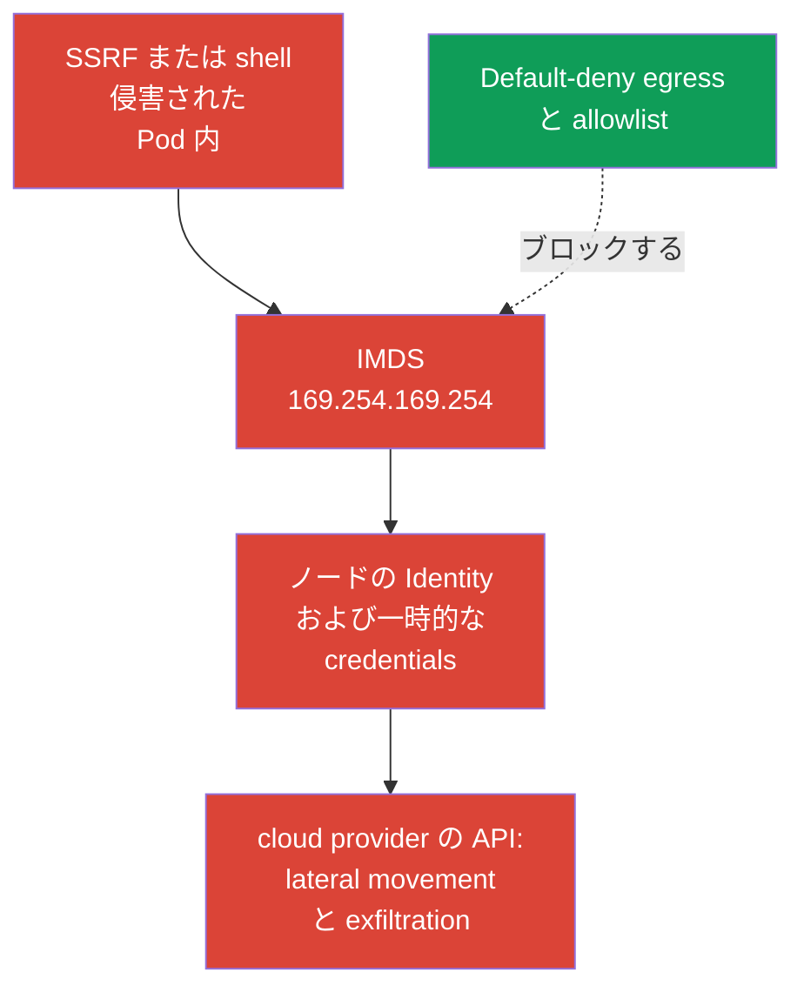
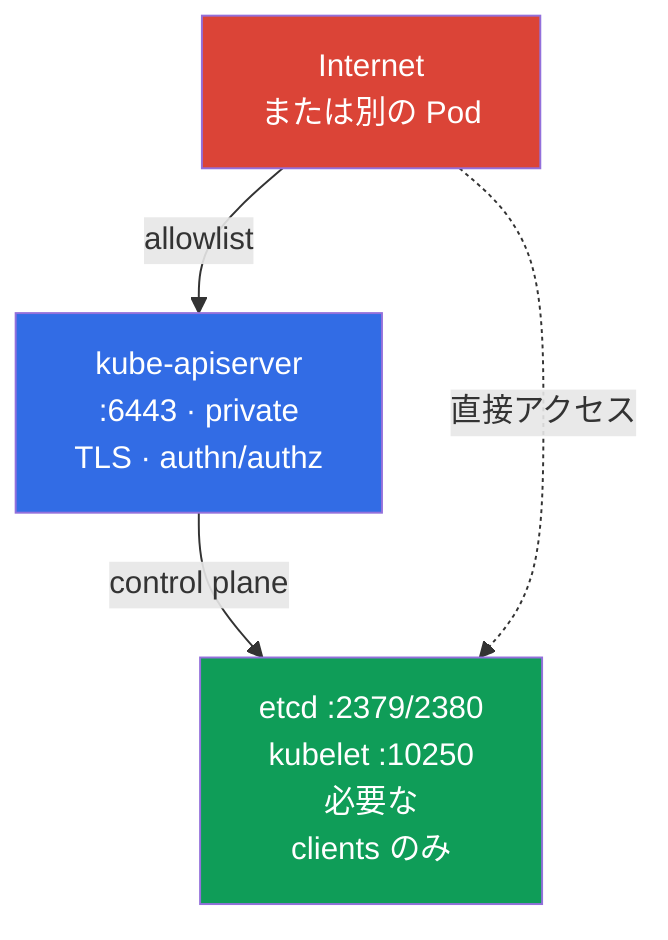

[Русская версия](ru.md) · [Eng version](README.md) · [Versión en español](es.md) · [Version française](fr.md) · [Deutsche Version](de.md) · [ქართული ვერსია](ge.md) · [繁體中文版](tw.md)

# 第05章. node metadata と endpoints の保護; GUI の保護

> **課題。** 侵害された Pod または SSRF は、外部ユーザーには到達できない endpoint、すなわちノードの cloud metadata、control plane、または管理用 GUI にアクセスできます。誤って許可された一つのネットワークパスだけで、cloud identity とノードの一時的な credentials、または privileged management interface が露出し得ます。これは Kubernetes API ではないため、通常の workload RBAC は metadata を保護しません。

> **この先。** 第04章では、フラットな pod ネットワークを許可された接続の集合に変えました。ここでは egress isolation を、cloud metadata、control plane、GUI という特に危険な宛先へ適用します。これは CKS の Cluster Setup (15%) ドメインです。一つの許可ミスが、Pod の侵害を cloud identity またはクラスターの侵害に変える可能性があります。

> **CKAで必要な知識。** egress `NetworkPolicy`、`ipBlock`、CNI の基本構文と動作は[CKA 第34章](../../../cka/course/34/jp.md)で扱っています。ここでは policy の基礎を繰り返さず、node metadata と管理用 endpoints の脅威を扱います。

## 05.1. 攻撃シナリオ: Pod が cloud metadata を読む

Cloud provider は仮想マシンインスタンスに対し、link-local アドレスで metadata service を提供することがよくあります。最もよく知られた IPv4 アドレスは `169.254.169.254` です。Pod がノードネットワーク経由でここにアクセスできる場合、アプリケーションの脆弱性、SSRF、shell アクセスは攻撃者に新たな経路を与えます。すなわち、インスタンス情報、そして cloud identity が誤設定されていればノードロールの一時的な credentials を取得できます。



Metadata は Kubernetes API でも Service でもありません。これはノードインフラの endpoint なので、ネットワークがリクエストを許可すれば Pod は RBAC、ServiceAccount、アプリケーション policy を回避できます。この脅威は、受信 HTTP にアクセスできる workload で特に重要です。SSRF は、外部ユーザーに届かないアドレスへのリクエストをアプリケーションに実行させます。

診断 Pod から endpoint に到達できるか確認してください。`hostNetwork` を使用する場合を含め、対象 workload の namespace、labels、重要なネットワーク特性を再現する必要があります。そうしないと selector または dataplane が異なるパスを検査するかもしれません。production では credentials や metadata の完全な応答を端末やログに出力しないでください。HTTP コードまたはインスタンス名など安全なパスで十分です。

```bash
kubectl -n payments run metadata-check \
  --image=curlimages/curl:8.22.0 --restart=Never -- sleep 3600
kubectl -n payments wait --for=condition=Ready pod/metadata-check --timeout=90s

# --noproxy は HTTP_PROXY と HTTPS_PROXY の影響を除外します。
# curl の失敗だけでは IMDS がブロックされた証明になりません。
kubectl -n payments exec metadata-check -- sh -c '
  tmp_err=$(mktemp)
  http_code=$(curl --noproxy "*" --connect-timeout 3 --max-time 5 \
    -sS -o /dev/null -w "%{http_code}" \
    http://169.254.169.254/latest/meta-data/ 2>"$tmp_err")
  rc=$?

  if [ "$rc" -eq 0 ]; then
    echo "IMDS reachable, HTTP status: $http_code"
    rm -f "$tmp_err"
  else
    echo "IMDS request failed, curl rc=$rc" >&2
    cat "$tmp_err" >&2
    rm -f "$tmp_err"
    echo "REVIEW_REQUIRED: failure alone does not prove that IMDS is blocked" >&2
    exit "$rc"
  fi
'
```

迅速な HTTP 応答（`200`、`401`、その他の status）で完了した `curl` だけがネットワーク到達性を証明しますが、credentials へのアクセスを証明するものではありません。Timeout、route/runtime error、その他の失敗では policy/CNI を個別に確認する必要があります。これは IMDS がブロックされた**証明ではありません**。確認後は一時 Pod を削除してください。

```bash
kubectl -n payments delete pod metadata-check
```

Metadata のアドレスとプロトコルは provider に依存します。`169.254.169.254` は**典型的な AWS 類似の能力シナリオであり、試験で保証された課題ではありません**。この well-known address は AWS IMDS、Azure IMDS、GKE Dataplane V2 の GKE metadata server でも使用されます。Azure、GCP、private metadata proxy では、provider が文書化した endpoint を確認し、個別に脅威モデルへ追加してください。IPv6 IMDS が有効な AWS では `fd00:ec2::254` も考慮します。IPv4 だけのブロックは完全な保護を証明しません。

> 🧠 Metadata endpoint は RBAC と `ServiceAccount` 権限で制限されません。広いネットワークとノード IAM があれば、workload の SSRF または shell が cloud credentials をもたらします。

## 05.2. Metadata と IMDSv2 の egress policy

`NetworkPolicy` はグローバル deny firewall ではなく allow メカニズムです。したがって信頼できる順序は次のとおりです。

1. namespace に default-deny egress を有効化する。
2. DNS とアプリケーションの実際の依存先を明示的に許可する。
3. 選択した provider workload identity に必要でない node metadata path は許可せず、provider 固有の allow/block を使う。
4. 動作中の labels を持つ Pod から、許可されたパスとノード credentials/identity にアクセスできないことを確認する。

以下は namespace `payments` の全 Pod の egress を分離する baseline です。

> 🎯 default-deny egress を有効にし、DNS と確認済みの依存先を許可し、allowlist から metadata を除外して、許可パスと metadata リクエストの拒否を確認してください。

```yaml
apiVersion: networking.k8s.io/v1
kind: NetworkPolicy
metadata:
  name: default-deny-egress
  namespace: payments
spec:
  podSelector: {}
  policyTypes:
  - Egress
```

その後、個別の最小許可を追加します。たとえば CoreDNS への DNS は大半の Pod に必要です。実際の labels と宛先アドレスはクラスターで確認してください。

```yaml
apiVersion: networking.k8s.io/v1
kind: NetworkPolicy
metadata:
  name: allow-dns-egress
  namespace: payments
spec:
  podSelector: {}
  policyTypes:
  - Egress
  egress:
  - to:
    - namespaceSelector:
        matchLabels:
          kubernetes.io/metadata.name: kube-system
      podSelector:
        matchLabels:
          k8s-app: kube-dns
    ports:
    - protocol: UDP
      port: 53
    - protocol: TCP
      port: 53
```

legacy アプリケーションが一時的に広い IPv4 egress を必要とする場合があります。そのような一つの allow ルールでは、`ipBlock.except` で IMDS を除外します。

```yaml
apiVersion: networking.k8s.io/v1
kind: NetworkPolicy
metadata:
  name: allow-external-ipv4-except-imds
  namespace: payments
spec:
  podSelector:
    matchLabels:
      app: legacy-client
  policyTypes:
  - Egress
  egress:
  - to:
    - ipBlock:
        cidr: 0.0.0.0/0
        except:
        - 169.254.169.254/32
```

これは移行上の妥協であり、良い final state ではありません。このルールはほぼ全 IPv4 Internet を依然として開放します。`except` がアドレスを除外するのは、このルールだけです。policy は加算的なので、別の `0.0.0.0/0`、より広い CIDR、IMDS アドレスを許可する egress allow があれば、metadata は再び許可されます。持続的な方法は DNS、egress proxy、CIDR、必要な各依存先 endpoint に対する個別ルールです。IPv6 を使うなら、IPv4 policy を完全な保護と見なさず、IPv6 パスを別途設計・検証してください。

ネットワーク policy は `NetworkPolicy` を実際に適用する CNI でのみ保護します。metadata 用 `ipBlock.except` は一般的な exam-style および移行パターンですが、link-local と host endpoints に対する enforcement は CNI と dataplane に依存します。ノードへのトラフィックと SNAT の実装も CNI や managed Kubernetes により異なります。この policy で cloud instance とノード firewall の保護を置き換えてはいけません。production の主要境界は provider metadata 設定と workload identity であり、policy は追加層です。

> 🏭 Metadata アクセスと選択した workload identity のための、バージョン確認済み AWS/GKE/AKS controls と evidence。

| Provider | Node identity | Workload identity と metadata path | Network control | IAM/control と evidence |
|---|---|---|---|---|
| AWS / EKS | IMDS `169.254.169.254` によるノード IAM role（IPv6 では `fd00:ec2::254` も） | node credentials の代わりに EKS Pod Identity または IRSA | non-`hostNetwork` Pod の baseline は hop limit `1` の IMDSv2。`hostNetwork: true` Pod は IMDS にアクセスできるため、個別 control/admission policy が必要。policy/firewall は追加層 | 最小のノード IAM role; CloudTrail と Pod が node credentials を得ないことの確認 |
| GKE | ノード service account/access scopes | Workload Identity Federation: Pod -> GKE metadata server (`metadata.google.internal` / metadata IP) -> KSA token -> STS -> short-lived federated token | strict policy の現行例: 通常 dataplane は `169.254.169.252/32`、TCP `988` と `987`; GKE Dataplane V2 は `169.254.169.254/32`、TCP `80` と `8080`。適用前に GKE ドキュメントを確認 | 最小の KSA/GSA IAM roles; Cloud Audit Logs と federated token の確認 |
| Azure / AKS | IMDS `169.254.169.254` によるノード managed identity | Microsoft Entra Workload ID | AKS IMDS restriction は **Preview** で、non-`hostNetwork` Pod のみ。production SLA 向けではなく、一部 add-ons/extension scenarios と非互換、Windows node pools 非対応 | 最小のノード managed identity; Entra federation と IMDS restriction の適用可能性を個別に確認 |

GKE Workload Identity には一見重要なパラドックスがあります。安全な workload identity 自体が GKE metadata server を使います。そのため、`169.254.169.254` を普遍ルールとして拒否することはできません。このアドレスは AWS だけでなく Azure IMDS と GKE Dataplane V2 でも使われます。strict `NetworkPolicy` では、実際の GKE dataplane 向けに文書化されたパスだけを許可します。通常の dataplane の Workload Identity Federation では TCP `988`、`987` の `169.254.169.252/32`、GKE Dataplane V2 では TCP `80`、`8080` の `169.254.169.254/32` です。これは現行例であり恒久的な定数ではありません。適用前に GKE ドキュメントを再確認してください。`hostNetwork` Pod は別のアクセスモデルであり、個別評価が必要です。

AWS では instance template または instance レベルで IMDSv2 を有効化します。`HttpTokens=required` はクライアントに、まず `PUT` で一時 token を取得し、その後ヘッダーで渡すよう強制します。これは単純な `GET` を想定する SSRF のクラスを減らしますが、egress policy の代替ではありません。endpoint に到達できるなら、侵害された Pod は正しい IMDSv2 exchange を実行できます。**サポートされる node types の新しい workload** には AWS は **EKS Pod Identity** を推奨します。**IRSA** は既存の OIDC/IRSA 展開や、Pod Identity が対応しない一部の Fargate、Windows、SDK シナリオの代替です。EKS ではノードコンポーネントが依存する可能性があるため AWS は **IMDS endpoint を無効化しない**ことを推奨します。IRSA/EKS Pod Identity を使う通常の non-`hostNetwork` workload の安全な baseline は hop limit **1** の IMDSv2 です。これにより IMDSv2 response は pod network への追加の network hop を越えられません。hop limit **2** は workload が本当に IMDS にアクセスする必要がある場合に限る、意図的な例外です。

この制限は `hostNetwork: true` Pod を保護しません。AWS が示すように、これらの Pod は IMDS への直接アクセスを維持します。信頼できない workload では admission/policy により `hostNetwork` の使用を個別に制限し、hop limit `1` を host-network Pod に対する十分な保護と見なさないでください。

```bash
# AWS の例: Pod からではなくインフラ管理者が設定します。
aws ec2 modify-instance-metadata-options \
  --instance-id i-0123456789abcdef0 \
  --http-tokens required \
  --http-put-response-hop-limit 1

# EKS ではこの baseline により、IMDSv2 response は container network 経由で Pod に届きません。
# 値 2 は workload が本当に IMDS を使う必要がある場合だけ許可します。
# まず必要性を確認し、Pod の node credentials より IRSA/EKS Pod Identity を優先します。
# IMDSv2 には token が必要です。このコマンドは隔離されたテストでのみ使用してください。
TOKEN=$(curl --noproxy '*' -sS -X PUT \
  -H 'X-aws-ec2-metadata-token-ttl-seconds: 60' \
  http://169.254.169.254/latest/api/token)
curl --noproxy '*' -sS -o /dev/null -w '%{http_code}\n' \
  -H "X-aws-ec2-metadata-token: ${TOKEN}" \
  http://169.254.169.254/latest/meta-data/
```

> 🎯 endpoint ごとにクライアントとポートを特定し、bind address、firewall/allowlist、TLS、authn/authz を確認してから、許可・拒否されたアクセスを確認してください。

## 05.3. 管理用 endpoints: kubelet、etcd、kube-apiserver

Metadata だけが標的ではありません。pod ネットワークに入った攻撃者は管理 endpoints を探しますが、脅威モデルは異なります。etcd と通常 kubelet には厳格なネットワーク制限が必要です。通常の Pod は `kubernetes.default` 経由で kube-apiserver にアクセスします。その保護は主に TLS、authentication、authorization/RBAC、admission によるもので、egress policy は不要なパスを追加的に制限するだけです。これらの endpoints を「すべての Pod から閉じる」一つのルールにまとめないでください。

| Endpoint | 通常のポート | 誤設定時のリスク | 基本保護 |
|---|---:|---|---|
| kubelet HTTPS | `10250` | 弱い authn/authz によるコマンド実行、Pod データまたは node API へのアクセス | firewall で閉じ、anonymous access を無効化し、Webhook authorization と TLS を使う |
| kubelet read-only | `10255` | 歴史的に認証なしで Pod 情報を露出した | 有効化しない、`--read-only-port=0` |
| etcd client/peer | `2379` / `2380` | Secrets を含むクラスター状態の読み取りまたは変更 | `2379` は認可済み etcd clients（主に kube-apiserver）のみ、`2380` は etcd members 間のみ; mTLS、firewall、public exposure なし |
| kube-apiserver | `6443` | Kubernetes API 全体への入口 | TLS、強い authn/authz、private endpoint または allowlist、audit |



リッスンしているポートは、許可された管理アクセスを持つノード上で確認します。

```bash
sudo ss -lntp | grep -E ':(10250|10255|2379|2380|6443)\b' || true
# Process flags と KubeletConfiguration は別々に確認します。フラグが YAML 設定にあるとは限りません。
sudo grep -R -- '--read-only-port\|--anonymous-auth\|--authorization-mode' \
  /etc/systemd/system /usr/lib/systemd/system /etc/default /var/lib/kubelet 2>/dev/null || true
sudo grep -nE 'readOnlyPort|anonymous:|authorization:|webhook:' \
  /var/lib/kubelet/config.yaml 2>/dev/null || true
```

topology に応じて `10250`、`2379`、`2380`、`6443` が必要なインターフェースで listen することはあります。基準はすべてのポートを止めることではなく、送信元を制限し認証を有効にすることです。kubelet では `--read-only-port=0`、`--anonymous-auth=false`、`--authorization-mode=Webhook` を確認します。フラグと CIS 設定は第07章で詳しく扱います。

RBAC も個別に review します。`nodes/proxy` 権限は、API server 経由で kubelet API へのアクセスを主体に与え、センシティブなノード操作につながり得ます。この権限を持つ roles と bindings を見つけてください。

```bash
kubectl get clusterrole -o yaml | grep -n -C 3 'nodes/proxy' || true
kubectl get clusterrolebinding \
  -o custom-columns=NAME:.metadata.name,ROLE:.roleRef.name,SUBJECTS:.subjects[*].name
```

`Webhook` authorization は必要な baseline ですが、kubelet の安全性の証明ではありません。Kubernetes v1.36 では **Fine-Grained Kubelet Authorization は GA で feature gate は locked enabled** です。monitoring/observability role に広い `nodes/proxy` を付与する代わりに、必要な subresources を最小 verbs で、実際に必要な場所だけに付与してください。完全な GA endpoint → RBAC subresource 対応は次のとおりです。

| Kubelet endpoint | Fine-grained RBAC resource | `nodes/proxy` 経由の fallback |
|---|---|---|
| `/stats/*` | `nodes/stats` | なし |
| `/metrics/*` | `nodes/metrics` | なし |
| `/logs/*` | `nodes/log` | なし |
| `/pods` | `nodes/pods` | あり |
| `/runningPods/` | `nodes/pods` | あり |
| `/healthz` | `nodes/healthz` | あり |
| `/configz` | `nodes/configz` | あり |
| `/spec/*` | `nodes/spec` | なし |
| `/checkpoint/*` | `nodes/checkpoint` | なし |
| その他すべて | `nodes/proxy` | 直接適用 |

> **⚠️ バージョン差分。** Fine-Grained Kubelet Authorization は v1.36 では GA ですが、試験 snapshot v1.35 では feature gate `KubeletFineGrainedAuthz` はまだ Beta（default-on）です。移行前に対象 kubelet の `authorization.mode: Webhook` と feature gate の実際の状態を確認してください。kubelet にアクセスする identity の RBAC、たとえば `kubectl auth can-i get nodes/metrics --as=system:serviceaccount:<namespace>:<serviceaccount>` も確認します。configuration/gate、RBAC、実際の endpoint retest が確認されるまで `nodes/proxy` を削除しないでください。

`/pods`、`/runningPods/`、`/healthz`、`/configz` では、kubelet は対応する fine-grained subresource を先に確認し、拒否された場合は広い `nodes/proxy` で再度認可を確認します。これは後方互換の dual-check です。主体に `nodes/proxy` が残っている限り、狭い許可だけでは実際の特権は減りません。roles 移行後に `nodes/proxy` を削除しなければ least privilege は実現されません。

たとえば metrics collector には通常 `nodes/metrics` と `nodes/stats` の `get` だけで十分です。

```yaml
rules:
- apiGroups: [""]
  resources: ["nodes/metrics", "nodes/stats"]
  verbs: ["get"]
```

このような role からは `nodes/proxy` を削除します。この subresource の `get` でさえ無害な read-only アクセスではありません。kubelet WebSocket endpoints 経由でコンテナ内のコマンド実行を許可し得ます。Fine-grained authorization は TLS、network controls、RBAC review を置き換えませんが、この広い特権から検証可能な least privilege への移行を可能にします。

cloud レベルでは security group または firewall を使います。`2379` は認可済み etcd clients、主に kube-apiserver だけに許可し、`2380` は etcd members 間だけに許可します。この違いは external etcd で重要です。`10250` は control plane と明示的に必要な monitoring のみ、`6443` は trusted networks、VPN、bastion、private endpoint のみです。etcd を `NodePort`、`LoadBalancer`、reverse proxy、public DNS 経由で公開しないでください。etcd にはポートフィルタだけでなく client/peer TLS と client certificates が必須です。

通常の `NetworkPolicy` は Pod-to-Pod traffic に有用ですが、host endpoints の普遍的 firewall ではありません。ノード IP へのトラフィックは SNAT により source が変わることがあり、hostNetwork Pod は pod dataplane を回避できます。ノード保護では CNI policy、host firewall、cloud network controls、コンポーネント設定を組み合わせます。Cilium は追加の host-aware controls を提供できますが、CNI モードに依存し、個別の設計が必要です。

> 🔬 既存 Kubernetes Dashboard インストールの containment と Kubernetes GUI の least privilege。

## 05.4. Legacy: アーカイブされた Kubernetes Dashboard と最小 GUI アクセス

すでにある Dashboard は置き換えまたは廃止を計画してください。それまで UI を public `LoadBalancer` や Internet-facing Ingress で公開せず、日常的な identity として `cluster-admin` を使わないでください。UI は VPN または authenticated access proxy の背後に置き、TLS と最小の namespace-scoped RBAC を適用します。同じ要件は Kubernetes API 上の他のサポート対象 web または desktop UI にも適用されます。private exposure、strong authentication、短いセッション、audit、minimal-scope kubeconfig または ServiceAccount です。

共有リソースの read-only role には `get/list/watch` が必要ですが、subresource `pods/log` には実質的に `get` だけが必要です。

```yaml
rules:
- apiGroups: [""]
  resources: ["pods", "services", "events"]
  verbs: ["get", "list", "watch"]
- apiGroups: [""]
  resources: ["pods/log"]
  verbs: ["get"]
```

対象 namespace の特定 ServiceAccount 権限を `kubectl auth can-i` で確認します。`get pods/log` は `yes`、`secrets` の読み取りと `create pods/exec` は `no` を返すべきです。

> 🎯 設定変更だけで済ませず、positive/negative verification により必要なアクセスと拒否を証明してください。

## 05.5. 検証、診断、典型的な誤り

検証では、必要なトラフィックが引き続き動作し、metadata と余分な endpoints にアクセスできないことの二点を証明します。`kubectl get networkpolicy` だけでは YAML の存在を証明するに過ぎず、CNI の適用は証明しません。

> 🏭 Metadata/endpoints 向け provider 固有の診断と運用確認（AWS IMDS、GKE WIF、AKS Entra Workload ID）。

```bash
# selectors を照合し、最終的な egress isolation を記述する。
kubectl -n payments get networkpolicy
kubectl -n payments describe networkpolicy default-deny-egress
kubectl -n payments get pod --show-labels
kubectl -n kube-system get pod --show-labels | grep -E 'coredns|kube-dns'

# Pod は保護対象アプリケーションの namespace と labels を再現する必要がある。
# hostNetwork など特別なネットワーク設定の target では、同じ特性を持つ別 manifest を作成する。
kubectl -n payments run egress-test \
  --image=curlimages/curl:8.22.0 --labels=app=legacy-client \
  --restart=Never -- sleep 3600
kubectl -n payments wait --for=condition=Ready pod/egress-test --timeout=90s

# AWS/EKS: DNS は動作し、node IMDS credentials は Pod に利用可能であってはならない。
kubectl -n payments exec egress-test -- nslookup kubernetes.default.svc.cluster.local
kubectl -n payments exec egress-test -- sh -c '
  tmp_err=$(mktemp)
  http_code=$(curl --noproxy "*" --connect-timeout 3 --max-time 5 \
    -sS -o /dev/null -w "%{http_code}" \
    http://169.254.169.254/latest/meta-data/ 2>"$tmp_err")
  rc=$?

  if [ "$rc" -eq 0 ]; then
    echo "IMDS request reached an HTTP endpoint; status: $http_code"
  else
    echo "REVIEW_REQUIRED: IMDS request failed, curl rc=$rc" >&2
    cat "$tmp_err" >&2
  fi

  rm -f "$tmp_err"
  exit "$rc"
'

# GKE WIF: metadata path は意図的にアクセス可能なことがある。timeout を期待せず、
# short-lived workload identity の取得と node identity がないことを確認する。
# AKS: Entra Workload ID を別途確認する。IMDS restriction は Preview で hostNetwork Pod を対象外とし、production SLA 向けでなく、一部 add-ons/extension scenarios と非互換、Windows node pools 非対応。
```

timeout では `curl` が非ゼロ終了する場合があるため、自動化では exit code と stdout/stderr の両方を保存します。ラボ101の metadata 検証は `curl --max-time 3` に基づきます。すべての CNI に特定のエラー文言を要求しないでください。

| 症状 | 確認と考えられる原因 |
|---|---|
| AWS metadata がまだ利用可能 | Pod が selector に選ばれていない、CNI が policy を適用しない、別の加算的 policy が広い CIDR を許可する、IPv6 IMDS が未考慮、non-`hostNetwork` Pod の EKS hop limit が 1 でない、または Pod 自身が `hostNetwork: true` で hop limit にかかわらず IMDS にアクセスできる |
| GKE metadata が利用可能 | Workload Identity Federation では short-lived workload token への期待されたパスの場合がある。文書化された GKE metadata path だけが許可され、node identity が付与されないことを確認する |
| AKS metadata が利用可能 | IMDS restriction は Preview で `hostNetwork` Pod を対象外とし、production SLA 向けではなく、一部 add-ons/extension scenarios と非互換、Windows node pools 非対応。Entra Workload ID と適用可能な制約を別途確認する |
| default-deny 後に DNS が動かない | 実際の CoreDNS または NodeLocal DNSCache の allow がなく、UDP/TCP `53` を忘れている |
| `except` が期待どおりブロックしない | 別ルールにより広い allow がある、metadata が IPv6 を通る、または link-local/host endpoint の enforcement が CNI と dataplane に依存する |
| Kubelet が外部から利用可能 | Firewall/security group が開いている、anonymous access が有効、endpoint が誤ったインターフェースで listen、または RBAC が余分な `nodes/proxy` を付与している |
| Legacy GUI が Internet から利用可能 | Service が `LoadBalancer`/`NodePort`、Ingress が public、または authentication proxy がない |
| GUI ユーザーに見えすぎる | `cluster-admin` が付与されている、`view` が不要に cluster-wide で適用されている、または Role に `secrets`/危険な subresources がある |

有用な診断順序は、Pod labels と policies の確認、CNI サポートの確認、DNS の確認、そして許可・拒否リクエストの比較です。ノード endpoint では cloud firewall、host firewall、binding address、component flags を個別に確認します。production クラスターで etcd への書き込みや、認証なしの destructive リクエストを試さないでください。

> 🏭 Node template、cloud IAM、firewall/security group、policy-as-code、および metadata と management endpoints の定期的な検証。

## 05.6. production での適用方法

- **Pod に node credentials を与えない identity。** アプリケーションにノード IAM role への暗黙アクセスを与えません。EKS ではノード endpoint を無効にせず、通常の non-`hostNetwork` Pod に EKS Pod Identity または IRSA と IMDSv2 hop limit `1` を使います。`hostNetwork` Pod は IMDS にアクセスできるので個別に評価し、信頼できない workload では policy/admission で禁止します。GKE では Workload Identity Federation に必要な GKE metadata path を許可します。AKS では IMDS restriction が Preview で `hostNetwork` を対象外とし、production SLA 向けではなく、一部 add-ons/extension scenarios と非互換、Windows node pools 非対応であることを考慮します。すべての場合で最小の provider IAM roles を適用し、Cloud audit evidence を保存します。
- **コードとしての egress allowlist。** Default-deny、DNS、個別宛先を workload と共に管理し、review と pre-production 検証を行います。`except` を伴う広い `0.0.0.0/0` には所有者と削除期限が必要です。
- **Private management plane。** API server、kubelet、etcd は必要なネットワークだけからアクセス可能にします。単一層のミスで endpoint が開かないよう、Security group、host firewall、TLS、RBAC を組み合わせます。
- **legacy/management endpoint としての GUI。** 既存またはサポート対象 UI には SSO/auth proxy、短いセッション、TLS、namespace ごとの roles を使います。長期 bearer tokens、public `LoadBalancer`、`cluster-admin` は正常な構成ではありません。
- **観測性と定期 audit。** CNI flow logs、`NetworkPolicy` の変更、public Services/Ingress、開いた security group、RBAC bindings を追跡します。CNI、cloud template、ネットワーク topology の更新後に metadata block を確認します。

## 05.7. ミニ用語集

- **IMDS** - Instance Metadata Service、cloud provider インスタンスの metadata を提供する endpoint。
- **IMDSv2** - metadata リクエストに一時 token を必須とする AWS IMDS の形式。
- **SSRF** - Server-Side Request Forgery。攻撃者が選んだアドレスへのリクエストをサーバーに実行させる脆弱性。
- **Egress policy** - Pod から許可される送信接続を設定する `NetworkPolicy`。
- **`ipBlock`** - CIDR の egress または ingress ルール。`except` はそこから subnet またはアドレスを除外する。
- **kubelet** - Kubernetes ノードエージェント。保護された endpoint は通常 `10250` で listen する。
- **etcd** - Kubernetes 状態の key-value ストア。client と peer endpoints は通常 `2379` と `2380`。
- **Kubernetes Dashboard** - アーカイブ済み upstream web UI。既存インストールには最小 RBAC を適用し、置き換えまたは廃止を計画する。
- **Host endpoint** - CNI dataplane の通常 Pod ではなく、ノードのネットワーク endpoint。

## 05.8. 章のまとめ

- Cloud metadata は侵害された Pod からノードの cloud identity へ至る重要な経路になり得ますが、provider 固有の workload identity により期待動作は変わります。GKE では metadata server が WIF に必要であり、AWS では IPv6 IMDS も考慮します。
- default-deny egress から始め、DNS と必要な宛先だけを許可します。`except: 169.254.169.254/32` を持つ `ipBlock` は移行用の広い allow では有用ですが、個別の allowlist を置き換えません。
- EKS では hop limit `1` の IMDSv2 が non-`hostNetwork` Pod の通常経路から node IMDS をブロックします。これは IMDS へアクセスできる `hostNetwork: true` Pod には適用されず、別の control が必要です。IMDS endpoint は無効にせず、hop limit 2 は根拠のある workload アクセスに限ります。これは workload identity、ネットワーク分離、最小権限 cloud identity の代替ではありません。
- kubelet、etcd、kube-apiserver は Pod policy だけでなく、private network、firewall、TLS、authentication、authorization、`nodes/proxy` review、安全な flags の組み合わせで保護します。
- アーカイブ済み Kubernetes Dashboard は新規インストールに使いません。既存 GUI は public にせず、`cluster-admin` で実行しません。read-only role の `pods/log` は `list/watch` ではなく `get` だけを必要とします。
- 実際の provider 固有トラフィックを確認します。AWS では Pod が node IMDS credentials を得ず、GKE WIF は想定 metadata path 経由だけで動作し、AKS では Entra federation と IMDS restriction の適用可能性を個別に確認します。ノード endpoint は余分な送信元に開かれてはなりません。

## 05.9. 役立つ場面: 試験と実務

**試験で。** Metadata と node endpoints の保護は CKS の能力です。特定の provider、アドレス、実装方法は保証されません。`169.254.169.254` と egress policy はこの章での典型的な AWS 類似シナリオです。明示的な allow がなければ default-deny egress が DNS を壊すこと、`NetworkPolicy` は加算的であることを覚えてください。hardening の課題では、開かれた `10250`、`2379`、`2380`、`6443` と過剰な RBAC を探します。

**実務で。** 最も重要なスキルは Pod network、node network、cloud control plane の間に境界を引くことです。workload の policy、host firewall、cloud security group、IMDSv2、workload identity、RBAC は共に必要です。これにより一つの SSRF または RCE がノード credentials や control plane へのアクセスになりません。

> ### 🔴 攻撃者の視点
> **Asset:** kubelet API とノード上のコンテナ。
>
> **Starting foothold:** 侵害された monitoring agent。
>
> **Attacker objective:** 一見 read-only に見えるアクセスを、ノード上のコンテナを制御できる能力へ変える。
>
> **Abuse path:** 安全でない特権 - ServiceAccount が `nodes/proxy` に `get` を持つ。kubelet の `GET` と WebSocket endpoints 経由で、既述の RCE リスクが生じる。
>
> **Expected evidence:** SubjectAccessReview、audit events、kubelet アクセスの telemetry。
>
> **Control:** 広い `nodes/proxy` を、最小 verbs の正確な `nodes/metrics` と `nodes/stats` に置き換える。
>
> **Retest:** metrics は動作し続け、management/exec path は認可されなくなる。
>
> **ATT&CK:** [T1609 — Container Administration Command](https://attack.mitre.org/techniques/T1609/) と [T1613 — Container and Resource Discovery](https://attack.mitre.org/techniques/T1613/)。

## 05.10. 自己確認の質問

<details>
<summary>1. Pod による `169.254.169.254` へのアクセスが、通常の外部 HTTP リクエストより危険なのはなぜですか？</summary>

これは通常の外部 Service ではなく、ノードの典型的な cloud metadata endpoint です。SSRF または Pod shell により、インスタンス情報、cloud identity が誤設定ならノードロールの一時的 credentials を取得できます。この経路は RBAC、ServiceAccount、アプリケーション policy を回避し、cloud API で lateral movement を可能にします。
</details>

<details>
<summary>2. `ipBlock.except` を持つ `NetworkPolicy` が、namespace の全 policies に対するグローバル拒否ではないのはなぜですか？</summary>

`except` がアドレスを除外するのは一つの特定 `ipBlock` rule だけです。policy は加算的なので、広い CIDR または metadata の直接許可を持つ別 egress policy が再びアクセスを開けます。default-deny と実際の依存先への個別 allow の方が持続的です。
</details>

<details>
<summary>3. default-deny egress 後にアプリケーションが DNS を失わないため、通常どの許可が必要ですか？</summary>

通常は `kube-system` にある実際の CoreDNS endpoints への UDP 53 と TCP 53 の個別 egress が必要です。適用前に DNS Pod の実際の labels を確認します。特定のアーキテクチャでは NodeLocal DNSCache または別 DNS コンポーネントがリクエストを処理する場合があります。
</details>

<details>
<summary>4. IMDSv2 は何を改善しますか。また Pod の侵害時に IMDSv2 だけでは不十分なのはなぜですか？</summary>

AWS IMDSv2 ではまず `PUT` により一時 token を取得し、それをヘッダーで渡す必要があるため、単純な `GET` を想定する SSRF のクラスを減らします。しかし endpoint に到達できれば侵害された Pod は正しい IMDSv2 exchange を実行できます。したがって egress isolation、workload identity、最小 IAM 権限が必要です。EKS の通常の non-`hostNetwork` Pod では hop limit `1` が baseline ですが、`hostNetwork: true` Pod は IMDS にアクセスできるので別途制御します。
</details>

<details>
<summary>5. host endpoints の保護は、通常 Pod を `NetworkPolicy` で保護することと何が異なりますか？</summary>

通常の NetworkPolicy は Pod-to-Pod traffic を移植可能に記述しますが、ノード IP へのトラフィックは SNAT により source が変わることがあり、`hostNetwork` Pod は想定する pod dataplane を回避できます。kubelet、etcd、API server は host firewall、cloud security group、binding address、TLS、authentication、authorization、コンポーネント設定の組み合わせで保護します。
</details>

<details>
<summary>6. endpoint `10250` では firewall と共にどの kubelet 設定を確認すべきですか？</summary>

read-only port が無効（`--read-only-port=0`）、anonymous access が無効（`--anonymous-auth=false`）、authorization が Webhook モードであることを確認します。TLS と、特に `nodes/proxy` 権限の RBAC review も必要です。Webhook authorization だけでネットワーク制限を置き換えることはできません。
</details>

<details>
<summary>7. `nodes/proxy` の `get` でさえ、`nodes/metrics` または `nodes/stats` の最小 `get` より危険なのはなぜですか？</summary>

`nodes/proxy` は kubelet API への広いアクセスであり、その `get` でさえ kubelet WebSocket endpoints を通じたコンテナ内コマンド実行を許可し得ます。v1.36 の fine-grained kubelet authorization では、monitoring role に `nodes/metrics` と `nodes/stats` の `get` だけを付与できます。移行後は広い `nodes/proxy` を削除します。
</details>

<details>
<summary>8. AWS/EKS、GKE、AKS では metadata endpoint、node identity、workload identity はどう異なり、GKE で metadata path を無条件にブロックできないのはなぜですか？</summary>

AWS/EKS では IMDS が node identity を提供し、workload は EKS Pod Identity または IRSA を使います。GKE Workload Identity Federation は GKE metadata server を介して short-lived workload token を取得し、AKS は Microsoft Entra Workload ID を使います。したがって GKE metadata path は workload identity に必要な場合があり、strict policy では無条件にアドレスをブロックせず、使用中 dataplane 向けに文書化されたパスだけを許可します。
</details>

<details>
<summary>9. legacy Dashboard または別 web UI の read-only role が、リソースには通常 `get/list/watch`、`pods/log` には `get` だけを必要とするのはなぜですか。また実際の UI アクセスなしで `kubectl auth can-i` によりどう確認しますか？</summary>

Pod、Service、Events の一覧表示には UI に `get`、`list`、`watch` が必要ですが、subresource `pods/log` を読むには実質的に `get` だけが必要です。対象 namespace の ServiceAccount を `kubectl auth can-i` で確認します。`get pods/log` は `yes`、`get secrets` と `create pods/exec` は `no` を返すべきです。
</details>

## 演習

🧪 ラボ101（NetworkPolicy: default-deny、分離、metadata）: [tasks/cks/labs/101](../../labs/101/README_JP.MD)

🌐 追加のインタラクティブ演習（killer.sh/killercoda、外部リソース）: [networkpolicy-metadata-protection](https://killercoda.com/killer-shell-cks/scenario/networkpolicy-metadata-protection)

🧪 ラボ103（CIS/kube-bench、Secure Ingress TLS、verify binaries）: [tasks/cks/labs/103](../../labs/103/README_JP.MD)

---
[目次](../README_JP.md) · [第04章](../04/jp.md) · [第06章](../06/jp.md)
