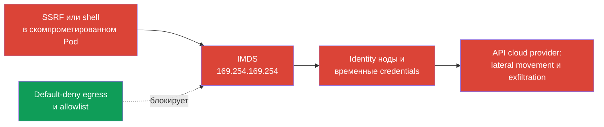
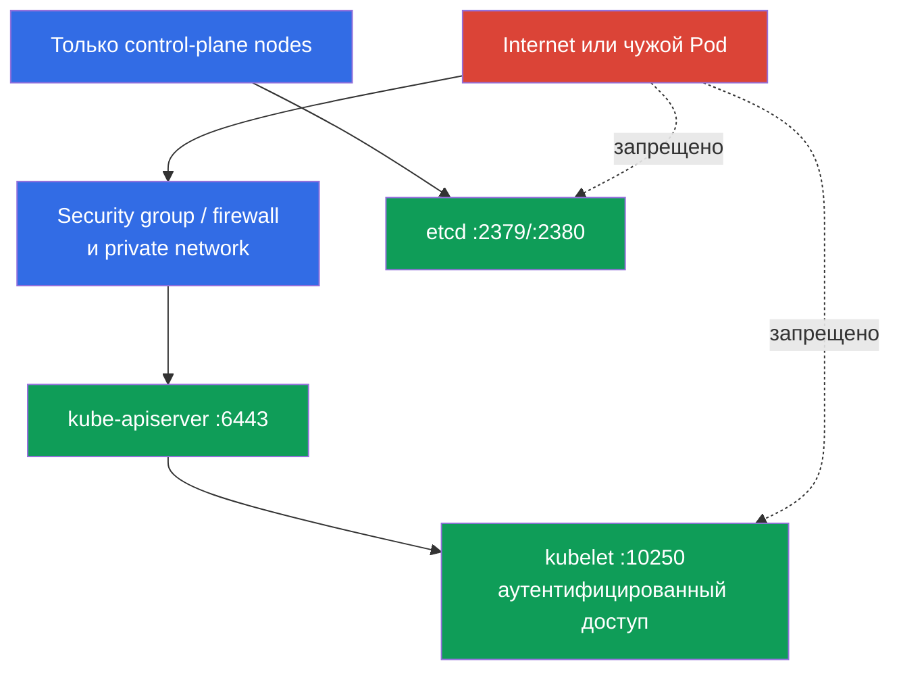

[Eng version](README.md) · [Versión en español](es.md) · [Version française](fr.md) · [Deutsche Version](de.md) · [ქართული ვერსია](ge.md) · [繁體中文版](tw.md) · [日本語版](jp.md)

# Глава 05. Защита node metadata и endpoints; защита GUI

> **Что дальше.** В главе 04 мы превратили плоскую pod-сеть в набор разрешённых связей. Теперь применим egress isolation к особенно опасным назначениям: cloud metadata, control plane и GUI. Это домен Cluster Setup (15%) CKS. Ошибка в одном таком разрешении может превратить компрометацию Pod в компрометацию cloud identity или кластера.

> **Что нужно из CKA.** Базовый синтаксис egress `NetworkPolicy`, `ipBlock` и работа CNI разобраны в [главе 34 CKA](../../../cka/course/34/ru.md). Здесь рассматриваем угрозы node metadata и служебных endpoints, а не повторяем основу политик.

## 05.1. Сценарий атаки: Pod читает cloud metadata

Cloud provider часто предоставляет экземпляру виртуальной машины metadata service по link-local адресу. Наиболее известный IPv4-адрес - `169.254.169.254`. Если Pod может обратиться к нему через сеть ноды, уязвимость в приложении, SSRF или доступ к shell дают атакующему новый путь: получить сведения об экземпляре, а при неверно настроенной cloud identity - временные credentials роли ноды.



Metadata - не Kubernetes API и не Service. Это endpoint инфраструктуры ноды, поэтому Pod может обойти RBAC, ServiceAccount и policy приложения, если сеть разрешает запрос. Угроза особенно актуальна для workload с доступом к входному HTTP: SSRF заставляет приложение выполнить запрос к адресу, недоступному пользователю извне.

Проверьте, достижим ли endpoint из диагностического Pod. В production не выводите в терминал и логи credentials или полный metadata-ответ. Для проверки достаточно HTTP-кода или безопасного пути, например имени экземпляра.

```bash
kubectl -n payments run metadata-check \
  --image=curlimages/curl:8.12.1 --restart=Never -- sleep 3600
kubectl -n payments wait --for=condition=Ready pod/metadata-check --timeout=90s

# --noproxy исключает влияние HTTP_PROXY и HTTPS_PROXY.
kubectl -n payments exec metadata-check -- \
  curl --noproxy '*' --connect-timeout 3 --max-time 5 -sS -o /dev/null -w '%{http_code}\n' \
  http://169.254.169.254/latest/meta-data/
```

`200`, `401` или иной быстрый ответ доказывает достижимость сети, но не доказывает доступ к credentials. После защиты ожидайте timeout или иной отказ, определяемый CNI. Удалите временный Pod после проверки:

```bash
kubectl -n payments delete pod metadata-check
```

Адрес и протокол metadata зависят от provider. В этой главе `169.254.169.254` - обязательный пример для IMDS. Для Azure, GCP и private metadata proxy сверяйте документированный endpoint provider и добавляйте его в модель угроз отдельно.

## 05.2. Egress policy для metadata и IMDSv2

`NetworkPolicy` - allow-механизм, а не глобальный deny firewall. Поэтому надёжный порядок такой:

1. Включить default-deny egress для namespace.
2. Явно разрешить DNS и реальные зависимости приложения.
3. Не создавать allow-правило, покрывающее `169.254.169.254`.
4. Проверить разрешённые пути и невозможность обращения к metadata из Pod с рабочими labels.

Ниже baseline, изолирующий egress всех Pod в namespace `payments`.

```yaml
apiVersion: networking.k8s.io/v1
kind: NetworkPolicy
metadata:
  name: default-deny-egress
  namespace: payments
spec:
  podSelector: {}
  policyTypes:
  - Egress
```

После него добавьте отдельные минимальные разрешения. Например, DNS к CoreDNS нужен большинству Pod. Реальные labels и адрес назначения надо подтвердить в своём кластере.

```yaml
apiVersion: networking.k8s.io/v1
kind: NetworkPolicy
metadata:
  name: allow-dns-egress
  namespace: payments
spec:
  podSelector: {}
  policyTypes:
  - Egress
  egress:
  - to:
    - namespaceSelector:
        matchLabels:
          kubernetes.io/metadata.name: kube-system
      podSelector:
        matchLabels:
          k8s-app: kube-dns
    ports:
    - protocol: UDP
      port: 53
    - protocol: TCP
      port: 53
```

Иногда legacy-приложению временно требуется широкий выход в IPv4. В одном таком allow-правиле `ipBlock.except` исключает IMDS:

```yaml
apiVersion: networking.k8s.io/v1
kind: NetworkPolicy
metadata:
  name: allow-external-ipv4-except-imds
  namespace: payments
spec:
  podSelector:
    matchLabels:
      app: legacy-client
  policyTypes:
  - Egress
  egress:
  - to:
    - ipBlock:
        cidr: 0.0.0.0/0
        except:
        - 169.254.169.254/32
```

Это миграционный компромисс, а не хороший final state: правило всё ещё открывает почти весь IPv4 Internet. `except` исключает адрес только из данного правила. Политики аддитивны, поэтому другое egress allow с `0.0.0.0/0`, более широким CIDR или адресом IMDS снова разрешит metadata. Устойчивый вариант - точечные правила для DNS, egress proxy, CIDR или endpoint каждой требуемой зависимости. Если IPv6 используется, спроектируйте и проверьте отдельные IPv6-пути, а не считайте IPv4-политику полной защитой.

Сетевая политика защищает только при CNI, который реально применяет `NetworkPolicy`. Кроме того, реализация трафика к ноде и SNAT различается между CNI и managed Kubernetes. Не заменяйте этой политикой защиту cloud instance и firewall ноды.

На AWS включайте IMDSv2 на уровне instance template или instance: `HttpTokens=required` заставляет клиента сначала получить временный token через `PUT`, а затем передать его в заголовке. Это уменьшает класс SSRF-атак, рассчитанных на простой `GET`, но не заменяет egress policy: скомпрометированный Pod всё ещё может выполнить корректный IMDSv2 exchange, если endpoint доступен. Когда metadata не нужна, отключайте endpoint; значение hop limit выбирайте после теста workload и контейнерной сети.

```bash
# Пример для AWS: задаётся администратором инфраструктуры, а не из Pod.
aws ec2 modify-instance-metadata-options \
  --instance-id i-0123456789abcdef0 \
  --http-tokens required \
  --http-put-response-hop-limit 1

# IMDSv2 требует token. Команду используйте только в изолированном тесте.
TOKEN=$(curl --noproxy '*' -sS -X PUT \
  -H 'X-aws-ec2-metadata-token-ttl-seconds: 60' \
  http://169.254.169.254/latest/api/token)
curl --noproxy '*' -sS -o /dev/null -w '%{http_code}\n' \
  -H "X-aws-ec2-metadata-token: ${TOKEN}" \
  http://169.254.169.254/latest/meta-data/
```

## 05.3. Служебные endpoints: kubelet, etcd и kube-apiserver

Metadata - не единственная цель. После доступа в pod-сеть атакующий ищет endpoints управления. Они не должны быть доступны всем Pod, внешним клиентам или Internet.

| Endpoint | Обычный порт | Риск при ошибке | Базовая защита |
|---|---:|---|---|
| kubelet HTTPS | `10250` | Выполнение команд, доступ к данным Pod или node API при слабой authn/authz | Закрыть firewall, отключить anonymous access, включить Webhook authorization, использовать TLS |
| kubelet read-only | `10255` | Исторически раскрывал информацию о Pod без аутентификации | Не включать, `--read-only-port=0` |
| etcd client/peer | `2379` / `2380` | Чтение или изменение состояния кластера, включая Secrets | Только control plane, mTLS, firewall, без public exposure |
| kube-apiserver | `6443` | Точка входа в весь Kubernetes API | TLS, сильные authn/authz, private endpoint или allowlist, audit |



Проверка слушающих портов выполняется на ноде с разрешённым административным доступом:

```bash
sudo ss -lntp | grep -E ':(10250|10255|2379|2380|6443)\b' || true
sudo grep -R -- '--read-only-port\|--anonymous-auth\|--authorization-mode' \
  /var/lib/kubelet/config.yaml /etc/kubernetes/manifests 2>/dev/null
```

Ожидайте, что `10250`, `2379`, `2380` и `6443` могут слушать нужный интерфейс в зависимости от topology. Критерий не в том, чтобы выключить все порты, а в том, чтобы ограничить источники и включить аутентификацию. Для kubelet проверьте `--read-only-port=0`, `--anonymous-auth=false` и `--authorization-mode=Webhook`; подробно флаги и CIS-настройки разбираются в главе 07.

На уровне cloud применяйте security group или firewall: `2379` и `2380` разрешены только между control-plane nodes, `10250` - только control plane и явно нужным monitoring, `6443` - только trusted networks, VPN, bastion или private endpoint. Не публикуйте etcd через `NodePort`, `LoadBalancer`, reverse proxy или public DNS. Для etcd обязательны client/peer TLS и клиентские сертификаты, а не только фильтрация портов.

Обычная `NetworkPolicy` полезна для Pod-to-Pod traffic, но не является универсальным firewall для host endpoints. Трафик к IP ноды может изменить source из-за SNAT, а hostNetwork Pod может обходить pod dataplane. Для защиты ноды сочетайте CNI policy с host firewall, cloud network controls и настройками компонентов. Cilium может дать дополнительные host-aware controls, но они зависят от режима CNI и требуют отдельного проектирования.

## 05.4. Kubernetes Dashboard: GUI без лишних привилегий

Kubernetes Dashboard - удобный GUI, но одновременно ещё один API client и web endpoint. Опасный сценарий: Dashboard опубликован через public `LoadBalancer` или Ingress, пользователь входит токеном `cluster-admin`, а украденный token даёт атакующему полный контроль над кластером.

Правило по умолчанию: не устанавливайте Dashboard, если он не нужен. Если GUI требуется, держите его private, публикуйте через VPN или authenticated access proxy, применяйте TLS и выдавайте отдельному пользователю минимальные RBAC-права. Не используйте `cluster-admin` как повседневный Dashboard account.

Безопасный путь для краткой административной сессии - port-forward с локальной машины, уже прошедшей контроль доступа. Сначала проверьте фактическое имя Service версии Dashboard:

```bash
kubectl -n kubernetes-dashboard get deploy,svc
kubectl -n kubernetes-dashboard port-forward \
  service/kubernetes-dashboard-kong-proxy 8443:443
```

Не меняйте этот Service на `type: LoadBalancer` или `NodePort` ради удобства. Если для организации нужен shared GUI, Ingress должен быть внутренним, иметь TLS, централизованную authentication и allowlist источников. Сам Dashboard не заменяет Kubernetes RBAC.

Следующий пример даёт Dashboard только read-only доступ к ресурсам namespace `apps`. ServiceAccount живёт в namespace Dashboard, но `RoleBinding` действует в `apps`. В список намеренно не включены `secrets`, `pods/exec`, `pods/portforward`, `create`, `update` и `delete`.

```yaml
apiVersion: v1
kind: ServiceAccount
metadata:
  name: dashboard-viewer
  namespace: kubernetes-dashboard
---
apiVersion: rbac.authorization.k8s.io/v1
kind: Role
metadata:
  name: dashboard-viewer
  namespace: apps
rules:
- apiGroups: [""]
  resources: ["pods", "pods/log", "services", "events"]
  verbs: ["get", "list", "watch"]
- apiGroups: ["apps"]
  resources: ["deployments", "replicasets"]
  verbs: ["get", "list", "watch"]
---
apiVersion: rbac.authorization.k8s.io/v1
kind: RoleBinding
metadata:
  name: dashboard-viewer
  namespace: apps
subjects:
- kind: ServiceAccount
  name: dashboard-viewer
  namespace: kubernetes-dashboard
roleRef:
  apiGroup: rbac.authorization.k8s.io
  kind: Role
  name: dashboard-viewer
```

```bash
kubectl apply -f dashboard-viewer.yaml

# Короткоживущий token для входа; не сохраняйте его в shell history или тикете.
kubectl -n kubernetes-dashboard create token dashboard-viewer --duration=15m

# Проверяем именно права субъекта в целевом namespace.
kubectl auth can-i list pods -n apps \
  --as=system:serviceaccount:kubernetes-dashboard:dashboard-viewer
kubectl auth can-i get secrets -n apps \
  --as=system:serviceaccount:kubernetes-dashboard:dashboard-viewer
kubectl auth can-i create pods/exec -n apps \
  --as=system:serviceaccount:kubernetes-dashboard:dashboard-viewer
```

Первый запрос должен вернуть `yes`; два последних - `no`. Для read-only обзора нескольких namespace создавайте отдельные RoleBinding или, только когда это обосновано, ограниченный ClusterRole без `secrets`. `ClusterRoleBinding` к `cluster-admin` для Dashboard - аварийная, краткоживущая мера под отдельным контролем, а не шаблон установки.

## 05.5. Проверка, диагностика и типичные ошибки

Проверка должна доказывать два свойства: требуемый трафик продолжает работать, а metadata и лишние endpoints недоступны. Одна только команда `kubectl get networkpolicy` доказывает наличие YAML, но не применение CNI.

```bash
# Сверить selectors и описать итоговую egress isolation.
kubectl -n payments get networkpolicy
kubectl -n payments describe networkpolicy default-deny-egress
kubectl -n payments get pod --show-labels
kubectl -n kube-system get pod --show-labels | grep -E 'coredns|kube-dns'

# Запустить диагностический Pod с labels защищаемого приложения.
kubectl -n payments run egress-test \
  --image=curlimages/curl:8.12.1 --labels=app=legacy-client \
  --restart=Never -- sleep 3600
kubectl -n payments wait --for=condition=Ready pod/egress-test --timeout=90s

# DNS должен работать, metadata после policy не должна отвечать.
kubectl -n payments exec egress-test -- nslookup kubernetes.default.svc.cluster.local
kubectl -n payments exec egress-test -- \
  curl --noproxy '*' --connect-timeout 3 --max-time 5 \
  -sS -o /dev/null -w '%{http_code}\n' \
  http://169.254.169.254/latest/meta-data/ || echo 'metadata blocked'
```

При timeout `curl` может завершиться с ненулевым кодом, поэтому в автоматизации сохраняйте и exit code, и stdout/stderr. В лабе 101 проверка metadata строится именно на `curl --max-time 3`; не требуйте конкретный текст ошибки от всех CNI.

| Симптом | Проверка и вероятная причина |
|---|---|
| Metadata всё ещё доступна | Pod не выбран selector, CNI не применяет policy или другая аддитивная policy разрешает широкий CIDR |
| После default-deny не работает DNS | Нет allow для фактического CoreDNS или NodeLocal DNSCache, забыты UDP/TCP `53` |
| `except` не даёт ожидаемой блокировки | В другом правиле есть более широкий allow, metadata идёт по IPv6 или трафик к host endpoint обрабатывается особенностью CNI |
| Kubelet доступен извне | Firewall/security group открыт, anonymous access включён или endpoint слушает не тот интерфейс |
| Dashboard открывается из Internet | Service имеет `LoadBalancer`/`NodePort`, Ingress public или отсутствует authentication proxy |
| Dashboard user видит слишком много | Выдан `cluster-admin`, `view` применён cluster-wide без необходимости или Role содержит `secrets`/опасные subresources |

Полезный порядок диагностики: проверить labels Pod и политики, убедиться в поддержке CNI, проверить DNS, затем сравнить разрешённый и запрещённый запросы. Для endpoint ноды отдельно проверьте cloud firewall, host firewall, binding address и component flags. Не тестируйте etcd записью или неаутентифицированными destructive запросами на production-кластере.

## 05.6. Как это применяют в продакшене

- **Identity без node credentials для Pod.** Не выдавайте приложениям неявный доступ к IAM-роли ноды. Используйте workload identity механизм provider или отдельные минимальные identities, а metadata закрывайте несколькими слоями.
- **Egress allowlist как код.** Default-deny, DNS и точечные назначения хранятся рядом с workload, проходят review и проверяются в pre-production. Широкий `0.0.0.0/0` с `except` должен иметь владельца и срок удаления.
- **Private management plane.** API server, kubelet и etcd доступны только из нужных сетей. Security group, host firewall, TLS и RBAC работают вместе, потому что ошибка одного слоя не должна открывать endpoint.
- **GUI с federated identity.** Для общих Dashboard используют SSO/auth proxy, короткие сессии, TLS и roles по namespace. Долгоживущие bearer tokens, public `LoadBalancer` и `cluster-admin` не являются нормальной конфигурацией.
- **Наблюдаемость и регулярный аудит.** Отслеживайте flow logs CNI, изменения `NetworkPolicy`, публичные Services/Ingress, открытые security group и RBAC bindings. Проверяйте metadata block после обновления CNI, cloud template и сетевой topology.

## 05.7. Мини-глоссарий

- **IMDS** - Instance Metadata Service, endpoint с metadata экземпляра cloud provider.
- **IMDSv2** - вариант AWS IMDS с обязательным временным token для запросов metadata.
- **SSRF** - Server-Side Request Forgery, уязвимость, заставляющая сервер выполнять запросы к выбранному атакующим адресу.
- **Egress policy** - `NetworkPolicy`, задающая допустимые исходящие соединения Pod.
- **`ipBlock`** - правило egress или ingress для CIDR; `except` исключает из него подсети или адреса.
- **kubelet** - агент ноды Kubernetes; защищённый endpoint обычно слушает `10250`.
- **etcd** - key-value хранилище состояния Kubernetes; client и peer endpoints обычно `2379` и `2380`.
- **Kubernetes Dashboard** - web UI, работающий как Kubernetes API client и требующий минимальных RBAC-прав.
- **Host endpoint** - сетевой endpoint ноды, а не обычного Pod в CNI dataplane.

## 05.8. Итоги главы

- Cloud metadata по `169.254.169.254` - критичный путь от скомпрометированного Pod к cloud identity ноды.
- Начинайте с default-deny egress и разрешайте только DNS и необходимые назначения. `ipBlock` с `except: 169.254.169.254/32` полезен для переходного широкого allow, но не заменяет точечный allowlist.
- IMDSv2 уменьшает риск простого SSRF, но не заменяет сетевую изоляцию, cloud identity с минимальными правами и защиту instance metadata.
- kubelet, etcd и kube-apiserver защищаются сочетанием private network, firewall, TLS, authentication, authorization и безопасных флагов, а не только Pod policy.
- Dashboard не должен быть public и не должен работать от `cluster-admin`; используйте private access, короткие tokens и namespace-scoped RBAC.
- Проверяйте реальный трафик: разрешённые DNS и зависимости работают, metadata недоступна, а endpoint ноды не открыт лишним источникам.

## 05.9. Как это пригодится: на экзамене и в реальной работе

**На экзамене.** Нужно распознать `169.254.169.254` как metadata endpoint и создать egress policy, которая не даёт Pod обратиться к нему. Помните, что default-deny egress ломает DNS без явного allow, а `NetworkPolicy` аддитивны. В заданиях на hardening ищите открытые `10250`, `2379`, `2380`, `6443`, небезопасный Dashboard exposure и чрезмерный RBAC.

**В реальной работе.** Самый важный навык - провести границу между Pod network, node network и cloud control plane. Policy для workload, host firewall, cloud security group, IMDSv2, workload identity и RBAC нужны вместе. Так одиночная SSRF или RCE не превращается в доступ к credentials ноды или control plane.

## 05.10. Вопросы для самопроверки

1. Почему доступ Pod к `169.254.169.254` опаснее обычного внешнего HTTP-запроса?
2. Почему `NetworkPolicy` с `ipBlock.except` не является глобальным запретом для всех политик namespace?
3. Какие разрешения обычно нужны после default-deny egress, чтобы приложение не потеряло DNS?
4. Что улучшает IMDSv2 и почему одного IMDSv2 недостаточно при компрометации Pod?
5. Чем защита host endpoints отличается от защиты обычных Pod через `NetworkPolicy`?
6. Какие настройки kubelet нужно проверить наряду с firewall для endpoint `10250`?
7. Почему `cluster-admin` token в public Kubernetes Dashboard создаёт критический риск?
8. Как проверить, что Dashboard user может читать Pod, но не читать Secrets и не выполнять `pods/exec`?

## Практика

🧪 Лаба 101 (NetworkPolicy: default-deny, изоляция, metadata): [tasks/cks/labs/101](../../labs/101/README_RU.MD)

🧪 Лаба 103 (CIS/kube-bench, Secure Ingress TLS, verify binaries): [tasks/cks/labs/103](../../labs/103/README_RU.MD)

---
[Оглавление](../README_RU.md) · [Глава 04](../04/ru.md) · [Глава 06](../06/ru.md)
