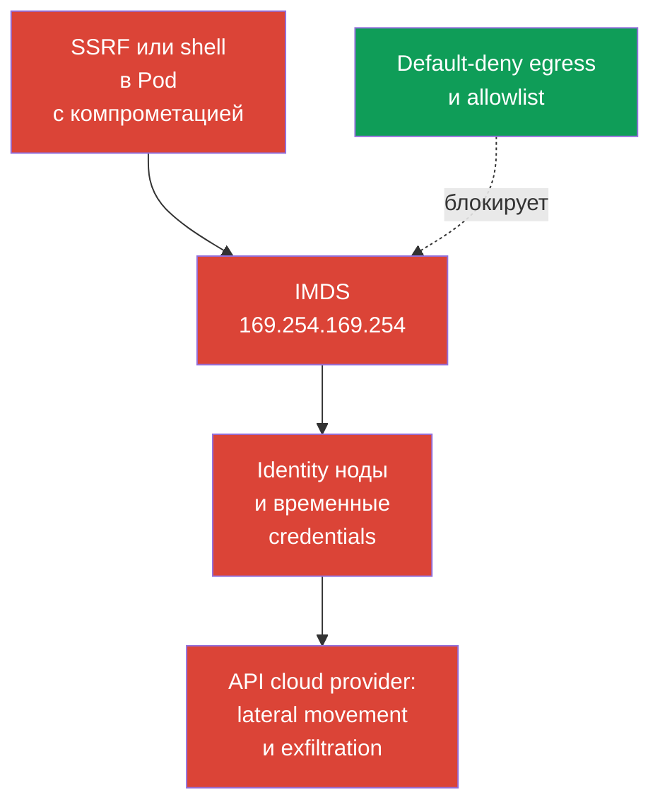
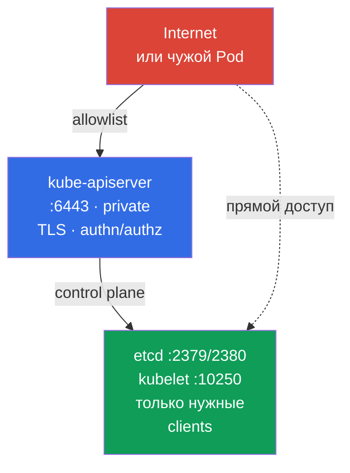

<!-- Standalone RU release: ссылки на переводы удалены, потому что соответствующие файлы не входят в архив. -->

# Глава 05. Защита node metadata и endpoints; защита GUI

> **Проблема.** Скомпрометированный Pod или SSRF может обратиться к endpoint, который недоступен внешнему пользователю: cloud metadata ноды, control plane или служебному GUI. Один неверно разрешённый сетевой путь способен раскрыть cloud identity и временные credentials ноды либо privileged management interface. Обычный RBAC workload не защищает metadata, потому что это не Kubernetes API.

> **Что дальше.** В главе 04 мы превратили плоскую pod-сеть в набор разрешённых связей. Теперь применим egress isolation к особенно опасным назначениям: cloud metadata, control plane и GUI. Это домен Cluster Setup (15%) CKS. Ошибка в одном таком разрешении может превратить компрометацию Pod в компрометацию cloud identity или кластера.

> **Что нужно из CKA.** Базовый синтаксис egress `NetworkPolicy`, `ipBlock` и работа CNI разобраны в [главе 34 CKA](../../../cka/course/34/ru.md). Здесь рассматриваем угрозы node metadata и служебных endpoints, а не повторяем основу политик.

## 05.1. Сценарий атаки: Pod читает cloud metadata

Cloud provider часто предоставляет экземпляру виртуальной машины metadata service по link-local адресу. Наиболее известный IPv4-адрес - `169.254.169.254`. Если Pod может обратиться к нему через сеть ноды, уязвимость в приложении, SSRF или доступ к shell дают атакующему новый путь: получить сведения об экземпляре, а при неверно настроенной cloud identity - временные credentials роли ноды.



Metadata - не Kubernetes API и не Service. Это endpoint инфраструктуры ноды, поэтому Pod может обойти RBAC, ServiceAccount и policy приложения, если сеть разрешает запрос. Угроза особенно актуальна для workload с доступом к входному HTTP: SSRF заставляет приложение выполнить запрос к адресу, недоступному пользователю извне.

Проверьте, достижим ли endpoint из диагностического Pod. Он должен воспроизводить namespace, labels и существенные сетевые характеристики целевого workload, включая `hostNetwork`, если оно используется: иначе selector или dataplane могут проверить не тот путь. В production не выводите в терминал и логи credentials или полный metadata-ответ. Для проверки достаточно HTTP-кода или безопасного пути, например имени экземпляра.

```bash
kubectl -n payments run metadata-check \
  --image=curlimages/curl:8.22.0 --restart=Never -- sleep 3600
kubectl -n payments wait --for=condition=Ready pod/metadata-check --timeout=90s

# --noproxy исключает влияние HTTP_PROXY и HTTPS_PROXY.
kubectl -n payments exec metadata-check -- \
  curl --noproxy '*' --connect-timeout 3 --max-time 5 -sS -o /dev/null -w '%{http_code}\n' \
  http://169.254.169.254/latest/meta-data/
```

`200`, `401` или иной быстрый ответ доказывает достижимость сети, но не доказывает доступ к credentials. После защиты ожидайте timeout или иной отказ, определяемый CNI. Удалите временный Pod после проверки:

```bash
kubectl -n payments delete pod metadata-check
```

Адрес и протокол metadata зависят от provider. `169.254.169.254` — **типовой AWS-подобный сценарий компетенции, а не гарантированная задача экзамена**. Этот well-known address используют AWS IMDS и Azure IMDS; в GKE Dataplane V2 его также использует GKE metadata server. Для Azure, GCP и private metadata proxy сверяйте документированный endpoint provider и добавляйте его в модель угроз отдельно. В AWS при включённом IPv6 IMDS дополнительно учитывайте `fd00:ec2::254`: IPv4-only блокировка не доказывает полную защиту.

> 🧠 Metadata endpoint не ограничивается RBAC и правами `ServiceAccount`; SSRF или shell в workload могут дать cloud credentials при широких сети и IAM ноды.

## 05.2. Egress policy для metadata и IMDSv2

`NetworkPolicy` - allow-механизм, а не глобальный deny firewall. Поэтому надёжный порядок такой:

1. Включить default-deny egress для namespace.
2. Явно разрешить DNS и реальные зависимости приложения.
3. Не разрешать node metadata path, если он не требуется выбранной provider workload identity; использовать provider-specific allow/block.
4. Проверить разрешённые пути и отсутствие доступа Pod к credentials/identity ноды из Pod с рабочими labels.

Ниже baseline, изолирующий egress всех Pod в namespace `payments`.

> 🎯 Включите default-deny egress, разрешите DNS и подтверждённые зависимости, исключите metadata из allowlist и проверьте разрешённый путь и отказ metadata-запроса.

```yaml
apiVersion: networking.k8s.io/v1
kind: NetworkPolicy
metadata:
  name: default-deny-egress
  namespace: payments
spec:
  podSelector: {}
  policyTypes:
  - Egress
```

После него добавьте отдельные минимальные разрешения. Например, DNS к CoreDNS нужен большинству Pod. Реальные labels и адрес назначения надо подтвердить в своём кластере.

```yaml
apiVersion: networking.k8s.io/v1
kind: NetworkPolicy
metadata:
  name: allow-dns-egress
  namespace: payments
spec:
  podSelector: {}
  policyTypes:
  - Egress
  egress:
  - to:
    - namespaceSelector:
        matchLabels:
          kubernetes.io/metadata.name: kube-system
      podSelector:
        matchLabels:
          k8s-app: kube-dns
    ports:
    - protocol: UDP
      port: 53
    - protocol: TCP
      port: 53
```

Иногда legacy-приложению временно требуется широкий выход в IPv4. В одном таком allow-правиле `ipBlock.except` исключает IMDS:

```yaml
apiVersion: networking.k8s.io/v1
kind: NetworkPolicy
metadata:
  name: allow-external-ipv4-except-imds
  namespace: payments
spec:
  podSelector:
    matchLabels:
      app: legacy-client
  policyTypes:
  - Egress
  egress:
  - to:
    - ipBlock:
        cidr: 0.0.0.0/0
        except:
        - 169.254.169.254/32
```

Это миграционный компромисс, а не хороший final state: правило всё ещё открывает почти весь IPv4 Internet. `except` исключает адрес только из данного правила. Политики аддитивны, поэтому другое egress allow с `0.0.0.0/0`, более широким CIDR или адресом IMDS снова разрешит metadata. Устойчивый вариант - точечные правила для DNS, egress proxy, CIDR или endpoint каждой требуемой зависимости. Если IPv6 используется, спроектируйте и проверьте отдельные IPv6-пути, а не считайте IPv4-политику полной защитой.

Сетевая политика защищает только при CNI, который реально применяет `NetworkPolicy`. `ipBlock.except` для metadata - распространённый exam-style и переходный паттерн, но его enforcement для link-local и host endpoints зависит от CNI и dataplane. Кроме того, реализация трафика к ноде и SNAT различается между CNI и managed Kubernetes. Не заменяйте этой политикой защиту cloud instance и firewall ноды: в production основная граница - provider metadata settings и workload identity, а policy служит дополнительным слоем.

> 🏭 Version-checked AWS/GKE/AKS controls и evidence для metadata-доступа и выбранной workload identity.

| Provider | Node identity | Workload identity и metadata path | Network control | IAM/control и evidence |
|---|---|---|---|---|
| AWS / EKS | IAM role ноды через IMDS `169.254.169.254` (и `fd00:ec2::254` при IPv6) | EKS Pod Identity или IRSA вместо node credentials | IMDSv2 с hop limit `1` как baseline для non-`hostNetwork` Pod; `hostNetwork: true` Pod сохраняют доступ к IMDS и требуют отдельного контроля/admission policy; policy/firewall - дополнительные слои | Минимальная IAM role ноды; CloudTrail и проверка, что Pod не получает node credentials |
| GKE | Service account/access scopes ноды | Workload Identity Federation: Pod -> GKE metadata server (`metadata.google.internal` / metadata IP) -> KSA token -> STS -> short-lived federated token | Current examples для strict policy: обычный dataplane — `169.254.169.252/32`, TCP `988` и `987`; GKE Dataplane V2 — `169.254.169.254/32`, TCP `80` и `8080`. Перед применением сверяйте документацию GKE | Минимальные IAM роли KSA/GSA; Cloud Audit Logs и проверка federated token |
| Azure / AKS | Managed identity ноды через IMDS `169.254.169.254` | Microsoft Entra Workload ID | AKS IMDS restriction — **Preview**, только для non-`hostNetwork` Pod; не предназначен для production SLA, несовместим с рядом add-ons/extension scenarios и не поддерживает Windows node pools | Минимальная managed identity ноды; проверка Entra federation и отдельно применимости IMDS restriction |

GKE Workload Identity создаёт важный на первый взгляд парадокс: безопасная workload identity сама использует GKE metadata server. Поэтому запретить `169.254.169.254` как универсальное правило нельзя: этот адрес используют Azure IMDS и GKE Dataplane V2, а не только AWS. При strict `NetworkPolicy` разрешите только документированный путь для фактического GKE dataplane: `169.254.169.252/32` на TCP `988` и `987` для Workload Identity Federation в обычном dataplane либо `169.254.169.254/32` на TCP `80` и `8080` для GKE Dataplane V2. Это текущие примеры, а не вечные константы: перепроверьте документацию GKE перед применением. `hostNetwork` Pod имеют другую модель доступа и требуют отдельной оценки.

На AWS включайте IMDSv2 на уровне instance template или instance: `HttpTokens=required` заставляет клиента сначала получить временный token через `PUT`, а затем передать его в заголовке. Это уменьшает класс SSRF-атак, рассчитанных на простой `GET`, но не заменяет egress policy: скомпрометированный Pod всё ещё может выполнить корректный IMDSv2 exchange, если endpoint доступен. Для **новых workload на поддерживаемых node types** AWS рекомендует **EKS Pod Identity**; **IRSA** остаётся альтернативой для существующих OIDC/IRSA-развёртываний и случаев, где Pod Identity не поддерживается, включая некоторые сценарии Fargate, Windows или SDK. Для EKS AWS рекомендует **не отключать IMDS endpoint**: от него могут зависеть компоненты ноды. Базовый безопасный вариант для обычных non-`hostNetwork` workload, использующих IRSA/EKS Pod Identity, - IMDSv2 с hop limit **1**, чтобы response IMDSv2 не прошёл дополнительный network hop в pod network. Hop limit **2** используют только как осознанное исключение, когда workload действительно обязан обращаться к IMDS.

Это ограничение не защищает `hostNetwork: true` Pod: AWS указывает, что такие Pod сохраняют прямой доступ к IMDS. Для недоверенных workload отдельно ограничивайте использование `hostNetwork` через admission/policy и не рассматривайте hop limit `1` как достаточную защиту для host-network Pod.

```bash
# Пример для AWS: задаётся администратором инфраструктуры, а не из Pod.
aws ec2 modify-instance-metadata-options \
  --instance-id i-0123456789abcdef0 \
  --http-tokens required \
  --http-put-response-hop-limit 1

# Для EKS это baseline: IMDSv2 response не должен дойти до Pod через container network.
# Значение 2 допустимо только если workload действительно обязан использовать IMDS;
# сначала проверьте необходимость и предпочитайте IRSA/EKS Pod Identity вместо node credentials Pod.
# IMDSv2 требует token. Команду используйте только в изолированном тесте.
TOKEN=$(curl --noproxy '*' -sS -X PUT \
  -H 'X-aws-ec2-metadata-token-ttl-seconds: 60' \
  http://169.254.169.254/latest/api/token)
curl --noproxy '*' -sS -o /dev/null -w '%{http_code}\n' \
  -H "X-aws-ec2-metadata-token: ${TOKEN}" \
  http://169.254.169.254/latest/meta-data/
```

> 🎯 Для endpoint определите клиентов и порт, проверьте bind address, firewall/allowlist, TLS и authn/authz, затем подтвердите разрешённый и запрещённый доступ.

## 05.3. Служебные endpoints: kubelet, etcd и kube-apiserver

Metadata - не единственная цель. После доступа в pod-сеть атакующий ищет endpoints управления, но их модели угроз различаются. etcd и обычно kubelet требуют жёсткого сетевого ограничения. Обычный Pod штатно обращается к kube-apiserver через `kubernetes.default`; его защита строится прежде всего на TLS, authentication, authorization/RBAC и admission, а egress policy лишь дополнительно ограничивает ненужные пути. Не объединяйте эти endpoints в правило «закрыть от всех Pod».

| Endpoint | Обычный порт | Риск при ошибке | Базовая защита |
|---|---:|---|---|
| kubelet HTTPS | `10250` | Выполнение команд, доступ к данным Pod или node API при слабой authn/authz | Закрыть firewall, отключить anonymous access, включить Webhook authorization, использовать TLS |
| kubelet read-only | `10255` | Исторически раскрывал информацию о Pod без аутентификации | Не включать, `--read-only-port=0` |
| etcd client/peer | `2379` / `2380` | Чтение или изменение состояния кластера, включая Secrets | `2379` только от авторизованных etcd clients (прежде всего kube-apiserver), `2380` только между etcd members; mTLS, firewall, без public exposure |
| kube-apiserver | `6443` | Точка входа в весь Kubernetes API | TLS, сильные authn/authz, private endpoint или allowlist, audit |



Проверка слушающих портов выполняется на ноде с разрешённым административным доступом:

```bash
sudo ss -lntp | grep -E ':(10250|10255|2379|2380|6443)\b' || true
# Process flags и KubeletConfiguration проверяют раздельно: флаги не обязаны быть в YAML-конфиге.
sudo grep -R -- '--read-only-port\|--anonymous-auth\|--authorization-mode' \
  /etc/systemd/system /usr/lib/systemd/system /etc/default /var/lib/kubelet 2>/dev/null || true
sudo grep -nE 'readOnlyPort|anonymous:|authorization:|webhook:' \
  /var/lib/kubelet/config.yaml 2>/dev/null || true
```

Ожидайте, что `10250`, `2379`, `2380` и `6443` могут слушать нужный интерфейс в зависимости от topology. Критерий не в том, чтобы выключить все порты, а в том, чтобы ограничить источники и включить аутентификацию. Для kubelet проверьте `--read-only-port=0`, `--anonymous-auth=false` и `--authorization-mode=Webhook`; подробно флаги и CIS-настройки разбираются в главе 07.

Отдельно review RBAC: право `nodes/proxy` может дать субъекту доступ к kubelet API через API server и тем самым к чувствительным операциям ноды. Найдите роли с этим правом и проверьте их bindings:

```bash
kubectl get clusterrole -o yaml | grep -n -C 3 'nodes/proxy' || true
kubectl get clusterrolebinding \
  -o custom-columns=NAME:.metadata.name,ROLE:.roleRef.name,SUBJECTS:.subjects[*].name
```

`Webhook` authorization - необходимый baseline, но не доказательство безопасности kubelet. В Kubernetes v1.36 **Fine-Grained Kubelet Authorization — GA и feature gate locked enabled**. Вместо широкого `nodes/proxy` для роли monitoring/observability выдавайте только нужные subresources с минимальным набором verbs и только там, где это действительно необходимо. Полная GA-карта endpoint → RBAC subresource следующая:

| Kubelet endpoint | Fine-grained RBAC resource | Fallback через `nodes/proxy` |
|---|---|---|
| `/stats/*` | `nodes/stats` | нет |
| `/metrics/*` | `nodes/metrics` | нет |
| `/logs/*` | `nodes/log` | нет |
| `/pods` | `nodes/pods` | да |
| `/runningPods/` | `nodes/pods` | да |
| `/healthz` | `nodes/healthz` | да |
| `/configz` | `nodes/configz` | да |
| `/spec/*` | `nodes/spec` | нет |
| `/checkpoint/*` | `nodes/checkpoint` | нет |
| всё остальное | `nodes/proxy` | применимо напрямую |

Для `/pods`, `/runningPods/`, `/healthz` и `/configz` kubelet сначала проверяет соответствующий fine-grained subresource, а при отказе повторяет авторизацию через широкий `nodes/proxy`. Это backward-compatible dual-check: пока у субъекта остаётся `nodes/proxy`, узкое разрешение само по себе не уменьшает его фактические привилегии. После миграции ролей удалите `nodes/proxy`, иначе least privilege не будет реализован.

Например, сборщику метрик обычно достаточно `get` на `nodes/metrics` и/или `nodes/stats`:

```yaml
rules:
- apiGroups: [""]
  resources: ["nodes/metrics", "nodes/stats"]
  verbs: ["get"]
```

`nodes/proxy` следует удалять из таких ролей: даже `get` на этом subresource не является безобидным read-only доступом. Через kubelet WebSocket endpoints оно может разрешить выполнение команд в контейнерах. Fine-grained authorization не заменяет TLS, network controls и review RBAC, но позволяет мигрировать от этой широкой привилегии к проверяемому least privilege.

На уровне cloud применяйте security group или firewall: `2379` разрешён только от авторизованных etcd clients, прежде всего kube-apiserver; `2380` - только между etcd members. Это различие важно для external etcd. `10250` - только control plane и явно нужным monitoring, `6443` - только trusted networks, VPN, bastion или private endpoint. Не публикуйте etcd через `NodePort`, `LoadBalancer`, reverse proxy или public DNS. Для etcd обязательны client/peer TLS и клиентские сертификаты, а не только фильтрация портов.

Обычная `NetworkPolicy` полезна для Pod-to-Pod traffic, но не является универсальным firewall для host endpoints. Трафик к IP ноды может изменить source из-за SNAT, а hostNetwork Pod может обходить pod dataplane. Для защиты ноды сочетайте CNI policy с host firewall, cloud network controls и настройками компонентов. Cilium может дать дополнительные host-aware controls, но они зависят от режима CNI и требуют отдельного проектирования.

> 🔬 Containment существующей инсталляции Kubernetes Dashboard и least privilege для Kubernetes GUI.

## 05.4. Legacy: архивированный Kubernetes Dashboard и минимальный доступ GUI

Для уже установленного Dashboard запланируйте замену или вывод из эксплуатации. До этого не публикуйте UI через public `LoadBalancer` или Internet-facing Ingress и не используйте `cluster-admin` как повседневную identity. Держите UI за VPN или authenticated access proxy, применяйте TLS и минимальный namespace-scoped RBAC. Те же требования действуют для любого другого поддерживаемого web или desktop UI поверх Kubernetes API: private exposure, strong authentication, короткие сессии, audit и minimal-scope kubeconfig или ServiceAccount.

В read-only роли для общего списка ресурсов нужны `get/list/watch`, а для subresource `pods/log` практически нужен только `get`:

```yaml
rules:
- apiGroups: [""]
  resources: ["pods", "services", "events"]
  verbs: ["get", "list", "watch"]
- apiGroups: [""]
  resources: ["pods/log"]
  verbs: ["get"]
```

Проверяйте права конкретной ServiceAccount в целевом namespace через `kubectl auth can-i`: `get pods/log` должен вернуть `yes`, а чтение `secrets` и `create pods/exec` — `no`.

> 🎯 Доказать нужный доступ и отказ через positive/negative verification, а не ограничиваться изменением конфигурации.

## 05.5. Проверка, диагностика и типичные ошибки

Проверка должна доказывать два свойства: требуемый трафик продолжает работать, а metadata и лишние endpoints недоступны. Одна только команда `kubectl get networkpolicy` доказывает наличие YAML, но не применение CNI.

> 🏭 Provider-specific диагностика и эксплуатационные проверки metadata/endpoints (AWS IMDS, GKE WIF, AKS Entra Workload ID).

```bash
# Сверить selectors и описать итоговую egress isolation.
kubectl -n payments get networkpolicy
kubectl -n payments describe networkpolicy default-deny-egress
kubectl -n payments get pod --show-labels
kubectl -n kube-system get pod --show-labels | grep -E 'coredns|kube-dns'

# Pod должен повторять namespace и labels защищаемого приложения.
# Для target с hostNetwork или иными особыми сетевыми настройками создайте отдельный manifest с теми же характеристиками.
kubectl -n payments run egress-test \
  --image=curlimages/curl:8.22.0 --labels=app=legacy-client \
  --restart=Never -- sleep 3600
kubectl -n payments wait --for=condition=Ready pod/egress-test --timeout=90s

# AWS/EKS: DNS должен работать, а node IMDS credentials не должны быть доступны Pod.
kubectl -n payments exec egress-test -- nslookup kubernetes.default.svc.cluster.local
kubectl -n payments exec egress-test -- \
  curl --noproxy '*' --connect-timeout 3 --max-time 5 \
  -sS -o /dev/null -w '%{http_code}\n' \
  http://169.254.169.254/latest/meta-data/ || echo 'AWS IMDS blocked'

# GKE WIF: metadata path может быть намеренно доступен; проверяйте получение
# short-lived workload identity, а не ожидайте timeout, и подтверждайте отсутствие node identity.
# AKS: проверяйте Entra Workload ID отдельно; IMDS restriction — Preview, не покрывает hostNetwork Pod, не предназначен для production SLA, может быть несовместим с add-ons/extension scenarios и не поддерживает Windows node pools.
```

При timeout `curl` может завершиться с ненулевым кодом, поэтому в автоматизации сохраняйте и exit code, и stdout/stderr. В лабе 101 проверка metadata строится именно на `curl --max-time 3`; не требуйте конкретный текст ошибки от всех CNI.

| Симптом | Проверка и вероятная причина |
|---|---|
| AWS metadata всё ещё доступна | Pod не выбран selector, CNI не применяет policy, другая аддитивная policy разрешает широкий CIDR, IPv6 IMDS не учтён, EKS hop limit не равен 1 для non-`hostNetwork` Pod, или сам Pod использует `hostNetwork: true` и поэтому сохраняет доступ к IMDS независимо от hop limit |
| GKE metadata доступна | При Workload Identity Federation это может быть ожидаемым путём к short-lived workload token; проверьте, что разрешён только документированный GKE metadata path и не выдаётся node identity |
| AKS metadata доступна | IMDS restriction имеет статус Preview и не покрывает `hostNetwork` Pod; он не предназначен для production SLA, может быть несовместим с add-ons/extension scenarios и не поддерживает Windows node pools. Проверьте Entra Workload ID и применимые ограничения отдельно |
| После default-deny не работает DNS | Нет allow для фактического CoreDNS или NodeLocal DNSCache, забыты UDP/TCP `53` |
| `except` не даёт ожидаемой блокировки | В другом правиле есть более широкий allow, metadata идёт по IPv6 или enforcement link-local/host endpoint зависит от CNI и dataplane |
| Kubelet доступен извне | Firewall/security group открыт, anonymous access включён, endpoint слушает не тот интерфейс или RBAC даёт лишнее `nodes/proxy` |
| Legacy GUI доступен из Internet | Service имеет `LoadBalancer`/`NodePort`, Ingress public или отсутствует authentication proxy |
| Пользователь GUI видит слишком много | Выдан `cluster-admin`, `view` применён cluster-wide без необходимости или Role содержит `secrets`/опасные subresources |

Полезный порядок диагностики: проверить labels Pod и политики, убедиться в поддержке CNI, проверить DNS, затем сравнить разрешённый и запрещённый запросы. Для endpoint ноды отдельно проверьте cloud firewall, host firewall, binding address и component flags. Не тестируйте etcd записью или неаутентифицированными destructive запросами на production-кластере.

> 🏭 Node template, cloud IAM, firewall/security group, policy-as-code и регулярная проверка metadata и management endpoints.

## 05.6. Как это применяют в продакшене

- **Identity без node credentials для Pod.** Не выдавайте приложениям неявный доступ к IAM-роли ноды. В EKS используйте EKS Pod Identity или IRSA и IMDSv2 hop limit `1` для обычных non-`hostNetwork` Pod, не отключая endpoint ноды. `hostNetwork` Pod оценивайте отдельно: они сохраняют доступ к IMDS, поэтому запрещайте `hostNetwork` недоверенным workload через policy/admission. В GKE разрешайте необходимый GKE metadata path для Workload Identity Federation; в AKS учитывайте, что IMDS restriction имеет статус Preview, не покрывает `hostNetwork`, не предназначен для production SLA, может быть несовместим с add-ons/extension scenarios и не поддерживает Windows node pools. Во всех случаях применяйте минимальные provider IAM roles и сохраняйте Cloud audit evidence.
- **Egress allowlist как код.** Default-deny, DNS и точечные назначения хранятся рядом с workload, проходят review и проверяются в pre-production. Широкий `0.0.0.0/0` с `except` должен иметь владельца и срок удаления.
- **Private management plane.** API server, kubelet и etcd доступны только из нужных сетей. Security group, host firewall, TLS и RBAC работают вместе, потому что ошибка одного слоя не должна открывать endpoint.
- **GUI как legacy/management endpoint.** Для существующего или поддерживаемого UI используют SSO/auth proxy, короткие сессии, TLS и roles по namespace. Долгоживущие bearer tokens, public `LoadBalancer` и `cluster-admin` не являются нормальной конфигурацией.
- **Наблюдаемость и регулярный аудит.** Отслеживайте flow logs CNI, изменения `NetworkPolicy`, публичные Services/Ingress, открытые security group и RBAC bindings. Проверяйте metadata block после обновления CNI, cloud template и сетевой topology.

## 05.7. Мини-глоссарий

- **IMDS** - Instance Metadata Service, endpoint с metadata экземпляра cloud provider.
- **IMDSv2** - вариант AWS IMDS с обязательным временным token для запросов metadata.
- **SSRF** - Server-Side Request Forgery, уязвимость, заставляющая сервер выполнять запросы к выбранному атакующим адресу.
- **Egress policy** - `NetworkPolicy`, задающая допустимые исходящие соединения Pod.
- **`ipBlock`** - правило egress или ingress для CIDR; `except` исключает из него подсети или адреса.
- **kubelet** - агент ноды Kubernetes; защищённый endpoint обычно слушает `10250`.
- **etcd** - key-value хранилище состояния Kubernetes; client и peer endpoints обычно `2379` и `2380`.
- **Kubernetes Dashboard** - архивированный upstream web UI; для существующей установки применяют минимальные RBAC-права и планируют замену или вывод из эксплуатации.
- **Host endpoint** - сетевой endpoint ноды, а не обычного Pod в CNI dataplane.

## 05.8. Итоги главы

- Cloud metadata может быть критичным путём от скомпрометированного Pod к cloud identity ноды, но provider-specific workload identity меняет ожидаемое поведение: в GKE metadata server нужен для WIF, а в AWS учитывайте также IPv6 IMDS.
- Начинайте с default-deny egress и разрешайте только DNS и необходимые назначения. `ipBlock` с `except: 169.254.169.254/32` полезен для переходного широкого allow, но не заменяет точечный allowlist.
- Для EKS IMDSv2 с hop limit `1` блокирует обычный путь к node IMDS для non-`hostNetwork` Pod. Это не относится к `hostNetwork: true` Pod, которые сохраняют доступ к IMDS и требуют отдельного контроля; endpoint IMDS не отключают, а hop limit 2 оставляют только для обоснованного доступа workload. Это не заменяет workload identity, сетевую изоляцию и cloud identity с минимальными правами.
- kubelet, etcd и kube-apiserver защищаются сочетанием private network, firewall, TLS, authentication, authorization, review `nodes/proxy` и безопасных флагов, а не только Pod policy.
- Архивированный Kubernetes Dashboard не используют для новых установок; существующий GUI не должен быть public или работать от `cluster-admin`. `pods/log` для read-only роли требует только `get`, а не `list/watch`.
- Проверяйте реальный трафик provider-specific: в AWS Pod не получает node IMDS credentials, в GKE WIF работает только через ожидаемый metadata path, в AKS отдельно проверяются Entra federation и применимость IMDS restriction; endpoint ноды не открыт лишним источникам.

## 05.9. Как это пригодится: на экзамене и в реальной работе

**На экзамене.** Защита metadata и node endpoints — компетенция CKS; конкретный provider, адрес или способ реализации не гарантированы. `169.254.169.254` и egress policy — типовой AWS-подобный сценарий этой главы. Помните, что default-deny egress ломает DNS без явного allow, а `NetworkPolicy` аддитивны. В заданиях на hardening ищите открытые `10250`, `2379`, `2380`, `6443` и чрезмерный RBAC.

**В реальной работе.** Самый важный навык - провести границу между Pod network, node network и cloud control plane. Policy для workload, host firewall, cloud security group, IMDSv2, workload identity и RBAC нужны вместе. Так одиночная SSRF или RCE не превращается в доступ к credentials ноды или control plane.

> ### 🔴 Взгляд атакующего
> **Asset:** kubelet API и контейнеры на ноде.
>
> **Starting foothold:** скомпрометированный monitoring agent.
>
> **Attacker objective:** превратить кажущийся read-only доступ в возможность управлять контейнерами на ноде.
>
> **Abuse path:** небезопасная привилегия — ServiceAccount имеет `get` на `nodes/proxy`; через kubelet `GET` и WebSocket endpoints возникает уже описанный риск RCE.
>
> **Expected evidence:** SubjectAccessReview, audit events и telemetry доступа к kubelet.
>
> **Control:** заменить широкий `nodes/proxy` на точные `nodes/metrics` и `nodes/stats` с минимальным набором verbs.
>
> **Retest:** metrics продолжают работать, а management/exec path больше не авторизован.
>
> **ATT&CK:** [T1609 — Container Administration Command](https://attack.mitre.org/techniques/T1609/) и [T1613 — Container and Resource Discovery](https://attack.mitre.org/techniques/T1613/).

## 05.10. Вопросы для самопроверки

<details>
<summary>1. Почему доступ Pod к `169.254.169.254` опаснее обычного внешнего HTTP-запроса?</summary>

Это типовой endpoint cloud metadata ноды, а не обычный внешний Service: через SSRF или shell Pod может получить сведения об экземпляре и, при неверной cloud identity, временные credentials роли ноды. Такой путь обходит RBAC, ServiceAccount и policy приложения и может открыть lateral movement в cloud API.
</details>

<details>
<summary>2. Почему `NetworkPolicy` с `ipBlock.except` не является глобальным запретом для всех политик namespace?</summary>

`except` исключает адрес только из одного конкретного `ipBlock` rule. Политики аддитивны, поэтому другая egress policy с широким CIDR или прямым разрешением metadata снова может открыть доступ; устойчивее default-deny и точечные allow для фактических зависимостей.
</details>

<details>
<summary>3. Какие разрешения обычно нужны после default-deny egress, чтобы приложение не потеряло DNS?</summary>

Обычно нужен точечный egress к фактическим CoreDNS endpoints в `kube-system` на UDP 53 и TCP 53. Перед применением надо проверить реальные labels DNS Pod; в конкретной архитектуре запросы может обслуживать NodeLocal DNSCache или другой DNS-компонент.
</details>

<details>
<summary>4. Что улучшает IMDSv2 и почему одного IMDSv2 недостаточно при компрометации Pod?</summary>

AWS IMDSv2 требует сначала получить временный token через `PUT`, а затем передать его в заголовке, поэтому уменьшает класс SSRF, рассчитанных на простой `GET`. Но скомпрометированный Pod способен выполнить корректный IMDSv2 exchange, если endpoint доступен, поэтому нужны egress isolation, workload identity и минимальные IAM-права; для EKS hop limit `1` является baseline для обычных non-`hostNetwork` Pod, а `hostNetwork: true` Pod сохраняют доступ к IMDS и должны контролироваться отдельно.
</details>

<details>
<summary>5. Чем защита host endpoints отличается от защиты обычных Pod через `NetworkPolicy`?</summary>

Обычная NetworkPolicy переносимо описывает Pod-to-Pod traffic, но трафик к IP ноды может менять source из-за SNAT, а `hostNetwork` Pod способен обходить ожидаемый pod dataplane. Kubelet, etcd и API server защищают сочетанием host firewall, cloud security group, binding address, TLS, authentication, authorization и настроек компонентов.
</details>

<details>
<summary>6. Какие настройки kubelet нужно проверить наряду с firewall для endpoint `10250`?</summary>

Проверяют, что read-only порт отключён (`--read-only-port=0`), anonymous access выключен (`--anonymous-auth=false`), а authorization работает в режиме Webhook. Также требуется TLS и review RBAC, особенно прав `nodes/proxy`; Webhook authorization сам по себе не заменяет сетевое ограничение.
</details>

<details>
<summary>7. Почему даже `get` на `nodes/proxy` рискованнее, чем минимальные права `get` на `nodes/metrics` или `nodes/stats`?</summary>

`nodes/proxy` — широкий доступ к kubelet API, и даже `get` на нём через kubelet WebSocket endpoints может разрешить выполнение команд в контейнерах. В v1.36 fine-grained kubelet authorization позволяет monitoring-роли получить только `get` на `nodes/metrics` и/или `nodes/stats`; после миграции широкий `nodes/proxy` нужно удалить.
</details>

<details>
<summary>8. Как различаются metadata endpoint, node identity и workload identity для AWS/EKS, GKE и AKS, и почему для GKE нельзя безусловно блокировать metadata path?</summary>

В AWS/EKS IMDS выдаёт identity ноды, а workload используют EKS Pod Identity или IRSA; в GKE Workload Identity Federation получает short-lived workload token через GKE metadata server; в AKS применяется Microsoft Entra Workload ID. Поэтому GKE metadata path может быть необходим workload identity, и strict policy разрешает только документированный путь для используемого dataplane, а не безусловно блокирует адрес.
</details>

<details>
<summary>9. Почему read-only роль для legacy Dashboard или другого web UI обычно требует `get/list/watch` на ресурсах, но только `get` на `pods/log`, и как проверить это через `kubectl auth can-i` без реального доступа к UI?</summary>

Для отображения списков Pod, Service и Events UI нужны `get`, `list` и `watch`, но чтение subresource `pods/log` практически требует только `get`. Права конкретной ServiceAccount проверяют в целевом namespace командой `kubectl auth can-i`: `get pods/log` должен вернуть `yes`, а `get secrets` и `create pods/exec` — `no`.
</details>

## Практика

🧪 Лаба 101 (NetworkPolicy: default-deny, изоляция, metadata): [tasks/cks/labs/101](../../labs/101/README_RU.MD)

🌐 Дополнительная интерактивная практика (killer.sh/killercoda, внешний ресурс): [networkpolicy-metadata-protection](https://killercoda.com/killer-shell-cks/scenario/networkpolicy-metadata-protection)

🧪 Лаба 103 (CIS/kube-bench, Secure Ingress TLS, verify binaries): [tasks/cks/labs/103](../../labs/103/README_RU.MD)

---
[Оглавление](../README_RU.md) · [Глава 04](../04/ru.md) · [Глава 06](../06/ru.md)
