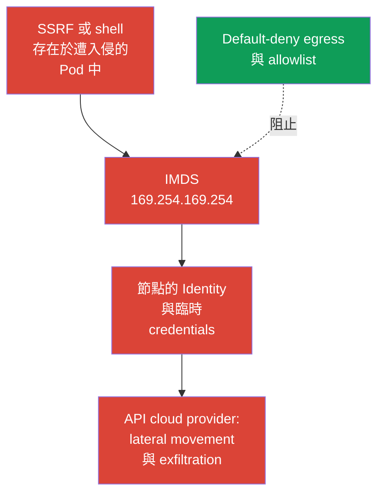
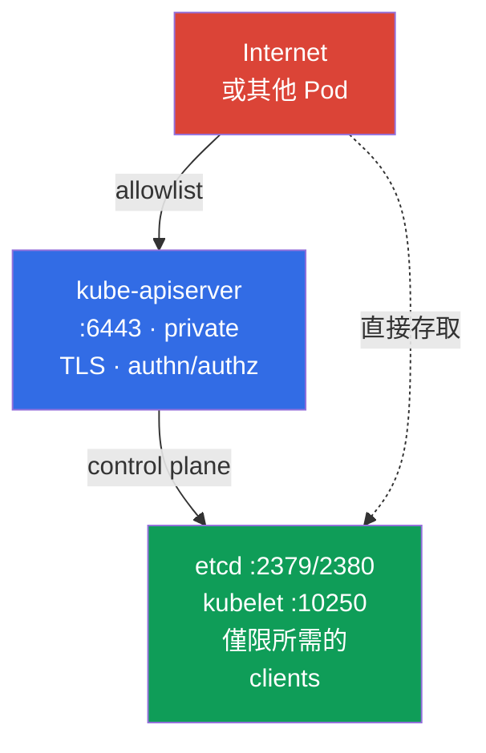

[Русская версия](ru.md) · [Eng version](README.md) · [Versión en español](es.md) · [Version française](fr.md) · [Deutsche Version](de.md) · [ქართული ვერსია](ge.md) · [日本語版](jp.md)

# 第 05 章。保護節點元資料與端點;保護 GUI

> **問題。** 遭入侵的 Pod 或 SSRF 可以存取外部使用者無法存取的端點:節點的 cloud metadata、control plane 或服務用的 GUI。一個解析錯誤的網路路徑,就能暴露節點的 cloud identity 和臨時 credentials,或是特權管理介面。一般的 RBAC workload 無法保護 metadata,因為它不是 Kubernetes API。

> **接下來是什麼。** 在第 04 章中,我們把扁平的 pod 網路轉變成一組已解析的連線。現在,讓我們把 egress isolation 應用到特別危險的目的地:cloud metadata、control plane 和 GUI。這是 CKS 的 Cluster Setup (15%) 領域。此類權限中的一個錯誤,就能把 Pod 遭入侵轉變成 cloud identity 或叢集遭入侵。

> **從 CKA 需要具備的知識。** egress `NetworkPolicy`、`ipBlock` 的基本語法和 CNI 的運作方式,已在 [CKA 第 34 章](../../../cka/course/34/tw.md) 中討論過。這裡我們探討的是對節點 metadata 和服務端點的威脅,而不是重複策略的基礎知識。

## 05.1. 攻擊情境:Pod 讀取 cloud metadata

Cloud provider 通常會透過 link-local 位址,向虛擬機器 instance 提供 metadata service。最著名的 IPv4 位址是 `169.254.169.254`。如果 Pod 可以透過節點網路存取它,那麼應用程式的漏洞、SSRF 或 shell 存取就會為攻擊者提供一條新途徑:取得該 instance 的資訊,而在 cloud identity 設定錯誤時,還能取得節點角色的臨時 credentials。



Metadata 不是 Kubernetes API 也不是 Service。它是節點基礎設施的端點,因此如果網路允許該請求,Pod 就能繞過應用程式的 RBAC、ServiceAccount 和 policy。此威脅對於能存取輸入 HTTP 的 workload 特別相關:SSRF 會讓應用程式對外部使用者無法存取的位址發出請求。

檢查是否能從診斷用的 Pod 存取該端點。它必須重現目標 workload 的 namespace、labels 以及重要的網路特徵,包括 `hostNetwork`(如果有使用):否則 selector 或 dataplane 可能會檢查到錯誤的路徑。在生產環境中,不要把 credentials 或完整的 metadata 回應輸出到終端機和日誌。只要有 HTTP 狀態碼或安全的路徑(例如 instance 名稱)即可用於驗證。

```bash
kubectl -n payments run metadata-check \
  --image=curlimages/curl:8.22.0 --restart=Never -- sleep 3600
kubectl -n payments wait --for=condition=Ready pod/metadata-check --timeout=90s

# --noproxy 排除 HTTP_PROXY 與 HTTPS_PROXY 的影響。
# curl 本身出錯,並不能證明 IMDS 已被封鎖。
kubectl -n payments exec metadata-check -- sh -c '
  tmp_err=$(mktemp)
  http_code=$(curl --noproxy "*" --connect-timeout 3 --max-time 5 \
    -sS -o /dev/null -w "%{http_code}" \
    http://169.254.169.254/latest/meta-data/ 2>"$tmp_err")
  rc=$?

  if [ "$rc" -eq 0 ]; then
    echo "IMDS reachable, HTTP status: $http_code"
    rm -f "$tmp_err"
  else
    echo "IMDS request failed, curl rc=$rc" >&2
    cat "$tmp_err" >&2
    rm -f "$tmp_err"
    echo "REVIEW_REQUIRED: failure alone does not prove that IMDS is blocked" >&2
    exit "$rc"
  fi
'
```

只有成功完成、且帶有快速 HTTP 回應(`200`、`401` 或其他 status)的 `curl`,才能證明網路可達性,但不能證明能存取 credentials。Timeout、route/runtime 錯誤或其他失敗,需要另外檢查 policy/CNI:這**不是**證明 IMDS 已被封鎖。驗證完成後刪除臨時 Pod:

```bash
kubectl -n payments delete pod metadata-check
```

metadata 的位址和協定取決於 provider。`169.254.169.254` 是**典型的類 AWS 能力情境,而不是保證出現的考試任務**。這個 well-known address 由 AWS IMDS 和 Azure IMDS 使用;在 GKE Dataplane V2 中,GKE metadata server 也使用它。對於 Azure、GCP 和 private metadata proxy,請查核 provider 記錄的端點,並將其另外加入威脅模型中。在 AWS 中,若啟用了 IPv6 IMDS,還要額外考慮 `fd00:ec2::254`:僅封鎖 IPv4 並不能證明已完全防護。

> 🧠 metadata 端點不受 RBAC 和 `ServiceAccount` 權限限制;workload 中的 SSRF 或 shell,在網路和節點 IAM 較寬鬆時,可能取得 cloud credentials。

## 05.2. metadata 和 IMDSv2 的 egress policy

`NetworkPolicy` 是一種 allow 機制,而不是全域的 deny firewall。因此可靠的順序是:

1. 為 namespace 啟用 default-deny egress。
2. 明確允許 DNS 和真正的應用程式相依性。
3. 若所選 provider 的 workload identity 不需要,就不要允許 node metadata path;使用 provider 專屬的 allow/block。
4. 從具有工作 labels 的 Pod 檢查允許的路徑,以及 Pod 確實無法存取節點的 credentials/identity。

以下是 baseline,用來隔離 namespace `payments` 中所有 Pod 的 egress。

> 🎯 啟用 default-deny egress、允許 DNS 和已確認的相依性、把 metadata 排除在 allowlist 之外,並檢查允許的路徑以及 metadata 請求是否被拒絕。

```yaml
apiVersion: networking.k8s.io/v1
kind: NetworkPolicy
metadata:
  name: default-deny-egress
  namespace: payments
spec:
  podSelector: {}
  policyTypes:
  - Egress
```

在此之後,再加入個別的最小許可。例如,大多數 Pod 都需要能連到 CoreDNS 的 DNS。實際的 labels 和目的地位址,需要在你自己的叢集中確認。

```yaml
apiVersion: networking.k8s.io/v1
kind: NetworkPolicy
metadata:
  name: allow-dns-egress
  namespace: payments
spec:
  podSelector: {}
  policyTypes:
  - Egress
  egress:
  - to:
    - namespaceSelector:
        matchLabels:
          kubernetes.io/metadata.name: kube-system
      podSelector:
        matchLabels:
          k8s-app: kube-dns
    ports:
    - protocol: UDP
      port: 53
    - protocol: TCP
      port: 53
```

有時,legacy 應用程式暫時需要較寬的 IPv4 出口。在這種 allow 規則中,`ipBlock.except` 可以排除 IMDS:

```yaml
apiVersion: networking.k8s.io/v1
kind: NetworkPolicy
metadata:
  name: allow-external-ipv4-except-imds
  namespace: payments
spec:
  podSelector:
    matchLabels:
      app: legacy-client
  policyTypes:
  - Egress
  egress:
  - to:
    - ipBlock:
        cidr: 0.0.0.0/0
        except:
        - 169.254.169.254/32
```

這是遷移期的折衷方案,而不是良好的最終狀態:此規則仍然開放了幾乎整個 IPv4 網際網路。`except` 只會把該位址從這條規則中排除。policy 是可疊加的,因此另一個帶有 `0.0.0.0/0`、更寬 CIDR 或 IMDS 位址的 egress allow,會再次允許 metadata。更穩健的做法,是針對每個必要相依性,分別使用精確的 DNS、egress proxy、CIDR 或端點規則。如果有使用 IPv6,請設計並驗證獨立的 IPv6 路徑,不要把 IPv4 policy 當成完整的防護。

只有在 CNI 確實有落實 `NetworkPolicy` 時,網路 policy 才能提供防護。針對 metadata 的 `ipBlock.except` 是常見的考試風格與過渡模式,但它對 link-local 和 host 端點的落實情況,取決於 CNI 和 dataplane。此外,節點流量與 SNAT 的實作方式,在不同 CNI 與 managed Kubernetes 之間也有差異。不要用這個 policy 取代 cloud instance 和節點防火牆的防護:在生產環境中,主要的邊界是 provider 的 metadata 設定和 workload identity,而 policy 只是額外的一層。

> 🏭 針對 metadata 存取與所選 workload identity,經版本核對的 AWS/GKE/AKS controls 與 evidence。

| Provider | Node identity | Workload identity和metadata path | Network control | IAM/control與evidence |
|---|---|---|---|---|
| AWS / EKS | 透過 IMDS `169.254.169.254`(若使用 IPv6 則為 `fd00:ec2::254`)取得節點的 IAM role | EKS Pod Identity 或 IRSA,取代 node credentials | 對於非 `hostNetwork` 的 Pod,以 hop limit `1` 的 IMDSv2 作為 baseline;`hostNetwork: true` 的 Pod 仍保留對 IMDS 的存取,需要另外的控制/admission policy;policy/firewall 是額外的層 | 最小化節點的 IAM role;CloudTrail,並檢查 Pod 沒有取得 node credentials |
| GKE | 節點的 service account/access scopes | Workload Identity Federation:Pod -> GKE metadata server(`metadata.google.internal` / metadata IP) -> KSA token -> STS -> 短期的 federated token | 目前 strict policy 的範例:一般 dataplane 為 `169.254.169.252/32`,TCP `988` 和 `987`;GKE Dataplane V2 為 `169.254.169.254/32`,TCP `80` 和 `8080`。套用前請核對 GKE 文件 | 最小化 KSA/GSA 的 IAM roles;Cloud Audit Logs,並檢查 federated token |
| Azure / AKS | 透過 IMDS `169.254.169.254` 取得節點的 managed identity | Microsoft Entra Workload ID | AKS IMDS restriction — **Preview**,僅適用於非 `hostNetwork` 的 Pod;不適用於 production SLA,與部分 add-ons/extension 情境不相容,且不支援 Windows node pools | 最小化節點的 managed identity;檢查 Entra federation,並另外檢查 IMDS restriction 的適用性 |

GKE Workload Identity 帶來了一個乍看之下重要的矛盾:安全的 workload identity 本身就會使用 GKE metadata server。因此不能把封鎖 `169.254.169.254` 當成通用規則:這個位址由 Azure IMDS 和 GKE Dataplane V2 使用,而不只是 AWS。在 strict `NetworkPolicy` 中,只允許實際 GKE dataplane 所記錄的路徑:一般 dataplane 中的 Workload Identity Federation 使用 `169.254.169.252/32` 的 TCP `988` 和 `987`,或是 GKE Dataplane V2 使用 `169.254.169.254/32` 的 TCP `80` 和 `8080`。這些是目前的範例,而不是永久不變的常數:套用前請重新核對 GKE 文件。`hostNetwork` 的 Pod 有不同的存取模型,需要另外評估。

在 AWS 上,請在 instance template 或 instance 層級啟用 IMDSv2:`HttpTokens=required` 會強制客戶端先透過 `PUT` 取得臨時 token,然後在標頭中傳遞它。這減少了針對簡單 `GET` 的一類 SSRF 攻擊,但不能取代 egress policy:若端點可存取,遭入侵的 Pod 仍然可以完成正確的 IMDSv2 exchange。對於**支援的 node types 上的新 workload**,AWS 建議使用 **EKS Pod Identity**;**IRSA** 仍然是既有 OIDC/IRSA 部署,以及 Pod Identity 不受支援場景(包括部分 Fargate、Windows 或 SDK 場景)的替代方案。對於 EKS,AWS 建議**不要停用 IMDS 端點**:節點的元件可能依賴它。對於使用 IRSA/EKS Pod Identity 的一般非 `hostNetwork` workload,基本的安全選項是 hop limit 為 **1** 的 IMDSv2,讓 IMDSv2 的 response 無法多經過一次 pod network 中的 network hop。Hop limit **2** 只在 workload 確實必須存取 IMDS 的特意例外情況下使用。

這個限制無法保護 `hostNetwork: true` 的 Pod:AWS 指出,這類 Pod 仍保有對 IMDS 的直接存取。對於不受信任的 workload,請透過 admission/policy 另外限制 `hostNetwork` 的使用,不要把 hop limit `1` 當成對 host-network Pod 已足夠的防護。

```bash
# AWS 的範例:由基礎設施管理員設定,而不是從 Pod 內部設定。
aws ec2 modify-instance-metadata-options \
  --instance-id i-0123456789abcdef0 \
  --http-tokens required \
  --http-put-response-hop-limit 1

# 對 EKS 而言,這是 baseline:IMDSv2 response 不應透過 container network 到達 Pod。
# 只有 workload 確實必須使用 IMDS 時,數值 2 才是可接受的;
# 請先確認是否真的有此必要,並優先使用 IRSA/EKS Pod Identity,而不是給 Pod node credentials。
# IMDSv2 需要 token。此指令僅應在隔離的測試環境中使用。
TOKEN=$(curl --noproxy '*' -sS -X PUT \
  -H 'X-aws-ec2-metadata-token-ttl-seconds: 60' \
  http://169.254.169.254/latest/api/token)
curl --noproxy '*' -sS -o /dev/null -w '%{http_code}\n' \
  -H "X-aws-ec2-metadata-token: ${TOKEN}" \
  http://169.254.169.254/latest/meta-data/
```

> 🎯 針對端點,定義客戶端和 port,檢查 bind address、firewall/allowlist、TLS 和 authn/authz,然後確認允許與拒絕的存取。

## 05.3. 服務端點:kubelet、etcd 和 kube-apiserver

metadata 不是唯一的目標。在進入 pod 網路後,攻擊者會尋找管理端點,但它們的威脅模型各不相同。etcd 以及通常的 kubelet,需要嚴格的網路限制。一般的 Pod 通常是透過 `kubernetes.default` 存取 kube-apiserver;它的防護主要建立在 TLS、authentication、authorization/RBAC 和 admission 之上,egress policy 只是額外限制不必要的路徑。不要把這些端點都納入「對所有 Pod 關閉」這種單一規則。

| Endpoint | 常見 port | 錯誤設定時的風險 | 基本防護 |
|---|---:|---|---|
| kubelet HTTPS | `10250` | 在 authn/authz 較弱時,可執行指令、存取 Pod 資料或 node API | 關閉 firewall、停用 anonymous access、啟用 Webhook authorization、使用 TLS |
| kubelet read-only | `10255` | 過去曾在未經驗證的情況下暴露 Pod 資訊 | 不要啟用,設定 `--read-only-port=0` |
| etcd client/peer | `2379` / `2380` | 讀取或修改叢集狀態,包括 Secrets | `2379` 僅允許授權的 etcd clients(主要是 kube-apiserver)存取,`2380` 僅允許 etcd members 之間存取;mTLS、firewall,不對外公開 |
| kube-apiserver | `6443` | 整個 Kubernetes API 的入口點 | TLS、強固的 authn/authz、private endpoint 或 allowlist、audit |



檢查監聽 port,需要在具備允許之管理存取權限的節點上執行:

```bash
sudo ss -lntp | grep -E ':(10250|10255|2379|2380|6443)\b' || true
# Process flags 與 KubeletConfiguration 要分開檢查:flags 不一定會出現在 YAML 設定中。
sudo grep -R -- '--read-only-port\|--anonymous-auth\|--authorization-mode' \
  /etc/systemd/system /usr/lib/systemd/system /etc/default /var/lib/kubelet 2>/dev/null || true
sudo grep -nE 'readOnlyPort|anonymous:|authorization:|webhook:' \
  /var/lib/kubelet/config.yaml 2>/dev/null || true
```

依照 topology,`10250`、`2379`、`2380` 和 `6443` 有可能在所需的介面上監聽。判斷標準不是關閉所有 port,而是限制來源並啟用驗證。針對 kubelet,請檢查 `--read-only-port=0`、`--anonymous-auth=false` 和 `--authorization-mode=Webhook`;詳細的 flags 和 CIS 設定會在第 07 章詳述。

另外請 review RBAC:`nodes/proxy` 這項權限,可讓主體透過 API server 存取 kubelet API,進而執行敏感的節點操作。找出擁有此權限的角色,並檢查其 bindings:

```bash
kubectl get clusterrole -o yaml | grep -n -C 3 'nodes/proxy' || true
kubectl get clusterrolebinding \
  -o custom-columns=NAME:.metadata.name,ROLE:.roleRef.name,SUBJECTS:.subjects[*].name
```

`Webhook` authorization 是必要的 baseline,但不是 kubelet 安全性的證明。在 Kubernetes v1.36 中,**Fine-Grained Kubelet Authorization 已經 GA,且 feature gate locked enabled**。不要為 monitoring/observability 角色提供寬泛的 `nodes/proxy`,而是只在真正必要的地方,提供最少 verbs 集合的所需 subresources。完整的 GA endpoint → RBAC subresource 對照表如下:

| Kubelet endpoint | Fine-grained RBAC resource | 透過 `nodes/proxy` 的 Fallback |
|---|---|---|
| `/stats/*` | `nodes/stats` | 沒有 |
| `/metrics/*` | `nodes/metrics` | 沒有 |
| `/logs/*` | `nodes/log` | 沒有 |
| `/pods` | `nodes/pods` | 有 |
| `/runningPods/` | `nodes/pods` | 有 |
| `/healthz` | `nodes/healthz` | 有 |
| `/configz` | `nodes/configz` | 有 |
| `/spec/*` | `nodes/spec` | 沒有 |
| `/checkpoint/*` | `nodes/checkpoint` | 沒有 |
| 其他所有項目 | `nodes/proxy` | 直接適用 |

> **⚠️ 版本差異。** Fine-Grained Kubelet Authorization 在 v1.36 中為 GA,而在考試快照的 v1.35 中,feature gate `KubeletFineGrainedAuthz` 仍是 Beta(預設開啟)。遷移前,請在目標 kubelet 上確認 `authorization.mode: Webhook` 以及該 feature gate 的實際狀態。另外請檢查實際存取 kubelet 的那個 identity 的 RBAC,例如 `kubectl auth can-i get nodes/metrics --as=system:serviceaccount:<namespace>:<serviceaccount>`。在確認 configuration/gate、RBAC 與實際端點都已重新測試之前,不要刪除 `nodes/proxy`。

對於 `/pods`、`/runningPods/`、`/healthz` 和 `/configz`,kubelet 會先檢查對應的 fine-grained subresource,若失敗,再透過寬泛的 `nodes/proxy` 重新進行授權。這是向後相容的雙重檢查:只要該主體仍擁有 `nodes/proxy`,那個較窄的權限本身並不會減少它實際的特權。在角色遷移完成後,請移除 `nodes/proxy`,否則就無法真正實現最小權限。

例如,metrics 收集器通常只需要對 `nodes/metrics` 和/或 `nodes/stats` 的 `get`:

```yaml
rules:
- apiGroups: [""]
  resources: ["nodes/metrics", "nodes/stats"]
  verbs: ["get"]
```

應從這類角色中移除 `nodes/proxy`:即使是對此 subresource 的 `get`,也不是無害的 read-only 存取。透過 kubelet 的 WebSocket endpoints,它可能允許在容器中執行指令。Fine-grained authorization 不能取代 TLS、network controls 和 RBAC review,但它讓我們能從這種寬泛的權限,遷移到可驗證的最小權限。

在 cloud 層級,請套用 security group 或 firewall:`2379` 只允許授權的 etcd clients(主要是 kube-apiserver)存取;`2380` 只允許 etcd members 之間存取。這個區分對外部 etcd 來說很重要。`10250` 只允許 control plane 以及確實需要的 monitoring 存取,`6443` 只允許 trusted networks、VPN、bastion 或 private endpoint 存取。不要透過 `NodePort`、`LoadBalancer`、reverse proxy 或 public DNS 公開 etcd。etcd 必須使用 client/peer TLS 和 client 憑證,而不能只靠 port 過濾。

一般的 `NetworkPolicy` 對 Pod-to-Pod 流量很有用,但不是 host 端點的通用 firewall。到節點 IP 的流量,可能因 SNAT 而改變 source,而 hostNetwork Pod 可能繞過 pod dataplane。要保護節點,需要結合 CNI policy、host firewall、cloud network controls 和元件設定。Cilium 可以提供額外的 host-aware controls,但這取決於 CNI 模式,且需要另外設計。

> 🔬 對既有安裝的 Kubernetes Dashboard 進行 containment,並為 Kubernetes GUI 套用最小權限。

## 05.4. Legacy:已封存的 Kubernetes Dashboard 與最小化 GUI 存取

對於已安裝的 Dashboard,請規劃更換或下線。在此之前,不要透過公開的 `LoadBalancer` 或面向 Internet 的 Ingress 公開此 UI,也不要把 `cluster-admin` 當成日常身分使用。讓 UI 留在 VPN 或經驗證的 access proxy 之後,套用 TLS 和最小化的 namespace-scoped RBAC。同樣的要求也適用於任何其他建構在 Kubernetes API 之上、受支援的 web 或桌面 UI:private exposure、strong authentication、短時效 session、audit,以及最小範圍的 kubeconfig 或 ServiceAccount。

在 read-only 角色中,列出一般資源清單需要 `get/list/watch`,而對 subresource `pods/log` 實際上只需要 `get`:

```yaml
rules:
- apiGroups: [""]
  resources: ["pods", "services", "events"]
  verbs: ["get", "list", "watch"]
- apiGroups: [""]
  resources: ["pods/log"]
  verbs: ["get"]
```

透過 `kubectl auth can-i` 檢查特定 ServiceAccount 在目標 namespace 中的權限:`get pods/log` 應回傳 `yes`,而讀取 `secrets` 和 `create pods/exec` 應回傳 `no`。

> 🎯 透過 positive/negative verification 證明所需的存取與拒絕,而不是只停留在修改設定。

## 05.5. 驗證、診斷與常見錯誤

驗證必須證明兩個特性:所需的流量能持續運作,而 metadata 和不必要的端點則無法存取。單靠 `kubectl get networkpolicy` 這個指令,只能證明 YAML 存在,不能證明 CNI 已經套用。

> 🏭 針對 metadata/endpoints 的 provider 專屬診斷與作業檢查(AWS IMDS、GKE WIF、AKS Entra Workload ID)。

```bash
# 核對 selectors,並描述最終的 egress isolation。
kubectl -n payments get networkpolicy
kubectl -n payments describe networkpolicy default-deny-egress
kubectl -n payments get pod --show-labels
kubectl -n kube-system get pod --show-labels | grep -E 'coredns|kube-dns'

# Pod 必須重現受保護應用程式的 namespace 和 labels。
# 若 target 使用 hostNetwork 或其他特殊網路設定,請建立具有相同特徵的獨立 manifest。
kubectl -n payments run egress-test \
  --image=curlimages/curl:8.22.0 --labels=app=legacy-client \
  --restart=Never -- sleep 3600
kubectl -n payments wait --for=condition=Ready pod/egress-test --timeout=90s

# AWS/EKS:DNS 應該正常運作,而 node IMDS credentials 不應該讓 Pod 存取得到。
kubectl -n payments exec egress-test -- nslookup kubernetes.default.svc.cluster.local
kubectl -n payments exec egress-test -- sh -c '
  tmp_err=$(mktemp)
  http_code=$(curl --noproxy "*" --connect-timeout 3 --max-time 5 \
    -sS -o /dev/null -w "%{http_code}" \
    http://169.254.169.254/latest/meta-data/ 2>"$tmp_err")
  rc=$?

  if [ "$rc" -eq 0 ]; then
    echo "IMDS request reached an HTTP endpoint; status: $http_code"
  else
    echo "REVIEW_REQUIRED: IMDS request failed, curl rc=$rc" >&2
    cat "$tmp_err" >&2
  fi

  rm -f "$tmp_err"
  exit "$rc"
'

# GKE WIF:metadata path 可能是刻意保持可存取的;請驗證取得的是
# short-lived workload identity,而不是等待逾時,並確認 node identity 無法取得。
# AKS:請單獨驗證 Entra Workload ID;IMDS restriction 目前為 Preview,不涵蓋 hostNetwork Pod,不適用於 production SLA,可能與 add-ons/extension 情境不相容,且不支援 Windows node pools。
```

發生 timeout 時,`curl` 可能以非零 code 結束,因此在自動化流程中,要同時保留 exit code 和 stdout/stderr。在 lab 101 中,metadata 的驗證正是建立在 `curl --max-time 3` 上;不要要求所有 CNI 都回傳特定的錯誤文字。

| 症狀 | 檢查方式與可能原因 |
|---|---|
| AWS metadata 仍可存取 | Pod 未被 selector 選中、CNI 未套用 policy、另一個可疊加的 policy 允許了較寬的 CIDR、未考慮 IPv6 IMDS、非 `hostNetwork` Pod 的 EKS hop limit 不等於 1,或是 Pod 本身使用了 `hostNetwork: true`,因而不論 hop limit 為何都仍保有 IMDS 存取 |
| GKE metadata 可存取 | 在 Workload Identity Federation 下,這可能是取得 short-lived workload token 的預期路徑;請檢查是否只允許已記錄的 GKE metadata path,且沒有發出 node identity |
| AKS metadata 可存取 | IMDS restriction 的狀態是 Preview,且不涵蓋 `hostNetwork` Pod;它不適用於 production SLA,可能與 add-ons/extension 情境不相容,且不支援 Windows node pools。請另外檢查 Entra Workload ID 以及該限制的適用性 |
| default-deny 之後 DNS 無法運作 | 沒有針對實際的 CoreDNS 或 NodeLocal DNSCache 設定 allow,遺漏了 UDP/TCP `53` |
| `except` 沒有帶來預期的封鎖 | 另一個規則有更寬的 allow,metadata 走的是 IPv6,或是 link-local/host 端點的落實情況取決於 CNI 與 dataplane |
| Kubelet 可從外部存取 | firewall/security group 是開放的、啟用了 anonymous access、端點監聽了錯誤的介面,或是 RBAC 給了不必要的 `nodes/proxy` |
| Legacy GUI 可從 Internet 存取 | Service 使用了 `LoadBalancer`/`NodePort`、Ingress 是公開的,或是缺少 authentication proxy |
| GUI 使用者看到過多內容 | 發出了 `cluster-admin`、`view` 被套用在整個叢集範圍而沒有必要,或是 Role 包含了 `secrets`/危險的 subresources |

有用的診斷順序是:先檢查 Pod 的 labels 和 policies,確認 CNI 支援,檢查 DNS,再比較允許和拒絕的請求。針對節點端點,則要另外檢查 cloud firewall、host firewall、binding address 和元件的 flags。不要在生產叢集上用寫入或未經驗證的破壞性請求來測試 etcd。

> 🏭 節點範本、cloud IAM、firewall/security group、policy-as-code,以及對 metadata 與管理端點的定期檢查。

## 05.6. 生產環境中的實際做法

- **Pod 不使用 node credentials 的 identity。** 不要讓應用程式隱含取得節點的 IAM role。在 EKS 中,對一般非 `hostNetwork` Pod 使用 EKS Pod Identity 或 IRSA,以及 IMDSv2 hop limit `1`,且不停用節點的端點。`hostNetwork` Pod 要另外評估:它們仍保有對 IMDS 的存取,因此要透過 policy/admission 禁止不受信任的 workload 使用 `hostNetwork`。在 GKE 中,允許 Workload Identity Federation 所需的 GKE metadata path;在 AKS 中,請留意 IMDS restriction 的狀態是 Preview,不涵蓋 `hostNetwork`,不適用於 production SLA,可能與 add-ons/extension 情境不相容,且不支援 Windows node pools。在所有情況下,都要套用最小化的 provider IAM roles,並保留 Cloud audit evidence。
- **Egress allowlist 即程式碼。** default-deny、DNS 和精確的目的地都與 workload 一起儲存,經過 review,並在 pre-production 中驗證。帶有 `except` 的寬鬆 `0.0.0.0/0` 必須要有負責人,以及移除期限。
- **Private management plane。** API server、kubelet 和 etcd 只能從所需的網路存取。security group、host firewall、TLS 和 RBAC 要一起發揮作用,因為任一層出錯,都不應該暴露端點。
- **GUI 視為 legacy/管理端點。** 對於既有或受支援的 UI,使用 SSO/auth proxy、短時效 session、TLS,以及依 namespace 劃分的 roles。長效的 bearer tokens、公開的 `LoadBalancer` 和 `cluster-admin`,都不是正常的設定。
- **可觀測性與定期稽核。** 追蹤 CNI 的 flow logs、`NetworkPolicy` 的變更、公開的 Services/Ingress、開放的 security group,以及 RBAC bindings。在更新 CNI、cloud template 和網路 topology 之後,要檢查 metadata block。

## 05.7. 迷你詞彙表

- **IMDS** - Instance Metadata Service,cloud provider 提供 instance metadata 的端點。
- **IMDSv2** - AWS IMDS 的一種變體,存取 metadata 前需要取得臨時 token。
- **SSRF** - Server-Side Request Forgery,一種讓伺服器對攻擊者選定的位址發出請求的漏洞。
- **Egress policy** - `NetworkPolicy`,用來定義 Pod 允許的傳出連線。
- **`ipBlock`** - 針對 CIDR 的 egress 或 ingress 規則;`except` 可從其中排除子網路或位址。
- **kubelet** - Kubernetes 節點的 agent;受保護的端點通常監聽 `10250`。
- **etcd** - 儲存 Kubernetes 狀態的 key-value 儲存體;client 和 peer 端點通常是 `2379` 和 `2380`。
- **Kubernetes Dashboard** - 已封存的上游 web UI;對於既有安裝,應套用最小化的 RBAC 權限,並規劃更換或下線。
- **Host endpoint** - 節點的網路端點,而不是 CNI dataplane 中一般的 Pod。

## 05.8. 本章總結

- Cloud metadata 可能是從遭入侵的 Pod 到節點 cloud identity 的關鍵路徑,但 provider 專屬的 workload identity 會改變預期行為:在 GKE 中,metadata server 是 WIF 所需的;而在 AWS 中,還要考慮 IPv6 IMDS。
- 從 default-deny egress 開始,只允許 DNS 和必要的目的地。帶有 `except: 169.254.169.254/32` 的 `ipBlock` 適用於過渡期的較寬 allow,但不能取代精確的 allowlist。
- 對於 EKS,hop limit `1` 的 IMDSv2 會封鎖非 `hostNetwork` Pod 通往 node IMDS 的一般路徑。這不適用於 `hostNetwork: true` 的 Pod,它們仍保有 IMDS 存取,需要另外的控制;IMDS 端點不會被停用,hop limit 2 只保留給有正當理由的 workload 存取使用。這也不能取代 workload identity、網路隔離和最小權限的 cloud identity。
- kubelet、etcd 和 kube-apiserver 是靠結合 private network、firewall、TLS、authentication、authorization、review `nodes/proxy` 以及安全的 flags 來保護,而不只是 Pod policy。
- 已封存的 Kubernetes Dashboard 不應用於新安裝;既有的 GUI 不應該公開,也不應以 `cluster-admin` 執行。read-only 角色的 `pods/log` 只需要 `get`,不需要 `list/watch`。
- 要檢查真實的、provider 專屬的流量:在 AWS 中,Pod 沒有取得 node IMDS credentials;在 GKE WIF 中,只透過預期的 metadata path 運作;在 AKS 中,要另外檢查 Entra federation 以及 IMDS restriction 的適用性;節點的端點不應對不必要的來源開放。

## 05.9. 這對你有何幫助:考試與實際工作

**在考試中。** 保護 metadata 和節點端點是 CKS 的能力範疇;具體的 provider、位址或實作方式並不保證。`169.254.169.254` 和 egress policy 是本章典型的類 AWS 情境。請記住,default-deny egress 若沒有明確 allow,會破壞 DNS,而 `NetworkPolicy` 是可疊加的。在 hardening 任務中,要找出開放的 `10250`、`2379`、`2380`、`6443` 以及過度寬鬆的 RBAC。

**在實際工作中。** 最重要的技能,是劃分 Pod network、node network 和 cloud control plane 之間的界線。workload 的 policy、host firewall、cloud security group、IMDSv2、workload identity 和 RBAC 都需要一起使用。這樣單一的 SSRF 或 RCE,就不會演變成對節點或 control plane credentials 的存取。

> ### 🔴 攻擊者視角
> **Asset:** 節點上的 kubelet API 與容器。
>
> **Starting foothold:** 遭入侵的 monitoring agent。
>
> **Attacker objective:** 把看似 read-only 的存取,轉變成能夠管理節點上容器的能力。
>
> **Abuse path:** 不安全的權限 — ServiceAccount 對 `nodes/proxy` 有 `get`;透過 kubelet 的 `GET` 和 WebSocket endpoints,產生了前面已描述過的 RCE 風險。
>
> **Expected evidence:** SubjectAccessReview、audit events,以及對 kubelet 存取的 telemetry。
>
> **Control:** 把寬泛的 `nodes/proxy` 換成精確的 `nodes/metrics` 和 `nodes/stats`,並使用最少的 verbs 集合。
>
> **Retest:** metrics 持續正常運作,而管理/exec 路徑不再被授權。
>
> **ATT&CK:** [T1609 — Container Administration Command](https://attack.mitre.org/techniques/T1609/) 與 [T1613 — Container and Resource Discovery](https://attack.mitre.org/techniques/T1613/)。

## 05.10. 自我檢查問題

<details>
<summary>1. 為什麼 Pod 存取 `169.254.169.254` 比一般的外部 HTTP 請求更危險?</summary>

這是節點 cloud metadata 的典型端點,而不是一般的外部 Service:透過 SSRF 或 shell,Pod 可以取得該 instance 的資訊,而在 cloud identity 設定錯誤時,還能取得節點角色的臨時 credentials。這條路徑會繞過 RBAC、ServiceAccount 和應用程式的 policy,並可能在 cloud API 中開啟 lateral movement。
</details>

<details>
<summary>2. 為什麼帶有 `ipBlock.except` 的 `NetworkPolicy`,不是該 namespace 所有 policy 的全域禁令?</summary>

`except` 只會把該位址從單一特定的 `ipBlock` 規則中排除。policy 是可疊加的,因此另一個帶有較寬 CIDR 或直接允許 metadata 的 egress policy,仍可能再次開放存取;更穩健的做法是 default-deny,再加上針對實際相依性的精確 allow。
</details>

<details>
<summary>3. default-deny egress 之後,通常需要哪些許可,才不會讓應用程式失去 DNS?</summary>

通常需要對 `kube-system` 中實際的 CoreDNS endpoints,在 UDP 53 和 TCP 53 上設定精確的 egress。套用前需要先確認 DNS Pod 真實的 labels;在特定架構中,請求也可能由 NodeLocal DNSCache 或其他 DNS 元件處理。
</details>

<details>
<summary>4. IMDSv2 改善了什麼?為什麼 Pod 遭入侵時,單靠 IMDSv2 還不夠?</summary>

AWS IMDSv2 要求先透過 `PUT` 取得臨時 token,再於標頭中傳遞它,因此減少了針對簡單 `GET` 的一類 SSRF。但遭入侵的 Pod,如果端點可存取,仍能完成正確的 IMDSv2 exchange,因此還需要 egress isolation、workload identity 和最小化的 IAM 權限;對於 EKS,hop limit `1` 是一般非 `hostNetwork` Pod 的 baseline,而 `hostNetwork: true` 的 Pod 仍保有 IMDS 存取,必須另外控制。
</details>

<details>
<summary>5. 保護 host endpoints,與透過 `NetworkPolicy` 保護一般 Pod 有何不同?</summary>

一般的 NetworkPolicy 能可攜地描述 Pod-to-Pod 流量,但到節點 IP 的流量,可能因 SNAT 而改變 source,而 `hostNetwork` Pod 能夠繞過預期的 pod dataplane。kubelet、etcd 和 API server 是靠結合 host firewall、cloud security group、binding address、TLS、authentication、authorization 和元件設定來保護。
</details>

<details>
<summary>6. 針對端點 `10250`,除了 firewall 之外,還需要檢查哪些 kubelet 設定?</summary>

要檢查 read-only port 是否已停用(`--read-only-port=0`)、anonymous access 是否已關閉(`--anonymous-auth=false`),以及 authorization 是否以 Webhook 模式運作。也需要 TLS,並 review RBAC,特別是 `nodes/proxy` 的權限;Webhook authorization 本身並不能取代網路限制。
</details>

<details>
<summary>7. 為什麼即使是 `nodes/proxy` 上的 `get`,也比 `nodes/metrics` 或 `nodes/stats` 上最小化的 `get` 更有風險?</summary>

`nodes/proxy` 是對 kubelet API 的寬泛存取,即使是對它的 `get`,透過 kubelet 的 WebSocket endpoints,也可能允許在容器中執行指令。在 v1.36 中,fine-grained kubelet authorization 讓 monitoring 角色只能取得對 `nodes/metrics` 和/或 `nodes/stats` 的 `get`;遷移完成後,應移除寬泛的 `nodes/proxy`。
</details>

<details>
<summary>8. AWS/EKS、GKE 和 AKS 的 metadata endpoint、node identity 和 workload identity 有何差異,為什麼 GKE 不能無條件封鎖 metadata path?</summary>

在 AWS/EKS 中,IMDS 發出的是節點的 identity,而 workload 使用 EKS Pod Identity 或 IRSA;在 GKE 中,Workload Identity Federation 透過 GKE metadata server 取得 short-lived workload token;在 AKS 中,採用的是 Microsoft Entra Workload ID。因此 GKE 的 metadata path 對 workload identity 而言可能是必要的,strict policy 只會允許實際使用中 dataplane 所記錄的路徑,而不是無條件封鎖該位址。
</details>

<details>
<summary>9. 為什麼 legacy Dashboard 或其他 web UI 的 read-only 角色,通常需要對資源使用 `get/list/watch`,但對 `pods/log` 只需要 `get`?又如何透過 `kubectl auth can-i` 在不實際存取 UI 的情況下驗證這一點?</summary>

要顯示 Pod、Service 和 Events 的清單,UI 需要 `get`、`list` 和 `watch`,但讀取 subresource `pods/log` 實際上只需要 `get`。可以在目標 namespace 中,用 `kubectl auth can-i` 指令檢查特定 ServiceAccount 的權限:`get pods/log` 應回傳 `yes`,而 `get secrets` 和 `create pods/exec` 應回傳 `no`。
</details>

## 實踐

🧪 Lab 101(NetworkPolicy:default-deny、隔離、metadata):[tasks/cks/labs/101](../../labs/101/README_TW.MD)

🌐 額外的互動式練習(killer.sh/killercoda,外部資源):[networkpolicy-metadata-protection](https://killercoda.com/killer-shell-cks/scenario/networkpolicy-metadata-protection)

🧪 Lab 103(CIS/kube-bench、Secure Ingress TLS、verify binaries):[tasks/cks/labs/103](../../labs/103/README_TW.MD)

---
[目錄](../README_TW.md) · [第 04 章](../04/tw.md) · [第 06 章](../06/tw.md)
