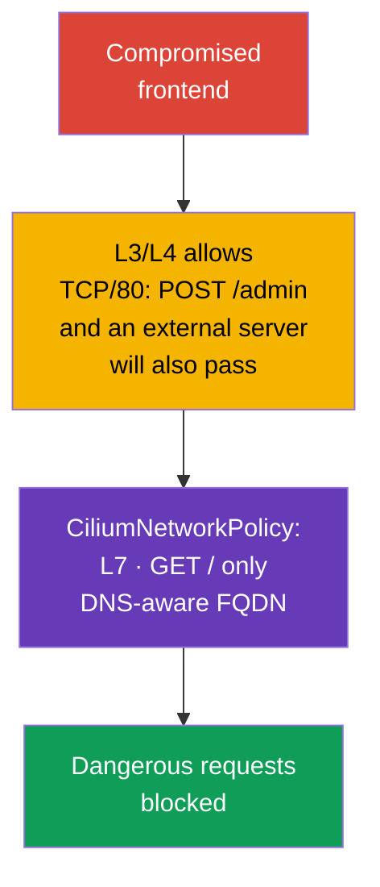

[Русская версия](ru.md) · [Versión en español](es.md) · [Version française](fr.md) · [Deutsche Version](de.md) · [ქართული ვერსია](ge.md) · [繁體中文版](tw.md) · [日本語版](jp.md)

# Chapter 06. Cilium NetworkPolicy

> **The problem.** A compromised frontend can use permitted TCP access to the backend for
> `POST /admin` or send data to an external IP after DNS resolution:
> L3/L4 NetworkPolicy cannot distinguish this. Without L7, FQDN, and identity-aware restrictions,
> a permitted connection becomes a channel for a dangerous request or exfiltration,
> while the lack of observability makes detecting a DROP and investigating it harder.

> **What comes next.** Native NetworkPolicy already allows isolating Pods and blocking
> access to metadata services. But that is insufficient for some scenarios: you need to allow
> a specific HTTP method, account for DNS names of external services, distinguish traffic to the cluster
> from traffic to the Internet, and see the reason for every DROP (a packet is discarded without a reply
> to its sender). **CiliumNetworkPolicy** extends the basic Cilium network-policy capabilities
> with L7 filtering, FQDN rules, identities, and observability.
> This chapter deepens the CKS Cluster Setup competency “Use Network security
> policies to restrict cluster level access” and is the foundation for lab 102.
>
> The public CKS curriculum does not require CiliumNetworkPolicy, `toFQDNs`, or Hubble in
> every exam environment, so treat Cilium-specific commands and CRDs as an advanced topic
> for clusters where Cilium is actually provided.

> **Cilium does not appear in a cluster by itself.** It is a separate CNI installed by
> a cluster administrator - through the `cilium` CLI or a Helm chart, on an already created
> cluster or instead of the standard CNI while creating it. If Cilium is not yet installed in your environment,
> all examples in this chapter are inapplicable until installation. Official guidance:
> [Cilium Quick Installation](https://docs.cilium.io/en/stable/gettingstarted/k8s-install-default/).
> More detailed examples of L3/L4/L7 rules than those covered in this chapter are in the official
> [Overview of Network Policy](https://docs.cilium.io/en/stable/security/policy/),
> including dedicated Layer 3, Layer 4, and Layer 7 Policies pages.

> **What you need from CKA.** For the basic CNI model and Pod and Service IP addresses, see
> [CKA chapter 30](../../../cka/course/30/README.md), and for CNI's purpose and place in the networking
> stack, see [CKA chapter 40](../../../cka/course/40/README.md). The basic Kubernetes
> NetworkPolicy syntax is covered in chapter 04 of this course; here we do not repeat it, but use
> Cilium capabilities.

> 🧠 `kube-proxy` routes `ClusterIP:port` to a selected Pod, while a CNI applies `NetworkPolicy` separately.

## 06.0. What is new for you: the eBPF datapath instead of kube-proxy

### Baseline without Cilium: how traffic reaches a Service now

Before this chapter, `kube-proxy` provided the packet path to a Service. The mechanism has three
parts:

- **Watching.** On every node, `kube-proxy` watches changes to Service and
  `EndpointSlice` objects.
- **Kernel programming.** For every change, it updates kernel rules - typically through
  `iptables` or `nftables` (the aging `ipvs` is also possible).
- **Interception and DNAT.** A rule intercepts traffic to `ClusterIP:port` and performs DNAT to the IP of
  a particular Pod, selected randomly or through session affinity.

`NetworkPolicy` from chapter 04 is a separate layer over the same model: the CNI, on its side,
reads the `NetworkPolicy` object and adds its own kernel rules that allow or
block a packet **before or after** kube-proxy rules, depending on the implementation.

> 🧠 Cilium maps workload labels to identity and applies L3/L4 policy through eBPF maps; L7 requires a proxy path.

### What Cilium changes: eBPF as the primary L3/L4 datapath

Cilium offers a different architecture for the same packet path:

- **eBPF as the primary L3/L4 datapath.** For pod networking, L3/L4 policy, and
  kube-proxy replacement, Cilium uses eBPF programs and BPF maps. Programs attach
  to kernel hook points, such as network interfaces and cgroups.
- **Map lookup instead of a linear `iptables` traversal.** In kube-proxy replacement, Cilium
  stores Service/backend state in BPF maps and performs a lookup without sequentially traversing a
  long `iptables` chain. This is an important difference specifically from kube-proxy in `iptables` mode.
  Do not apply this comparison to kube-proxy `nftables`: modern nftables mode also
  uses map-based dispatch (`verdict map`) with an approximately O(1) lookup - details are in the
  official Kubernetes blog about kube-proxy nftables mode.
- **Two operating modes.** Full **kube-proxy replacement** implements all Service load
  balancing in eBPF and lets you remove `kube-proxy` from the cluster. In cooperative mode,
  `kube-proxy` continues to serve Services, while Cilium adds policy
  enforcement and L7 capabilities alongside it.

Both modes are possible in production, and the CKS exam does not require either specific one.

It is important to separate the layers. In Cilium, L3/L4 forwarding, policy enforcement, and Service load balancing with
kube-proxy replacement are primarily implemented through eBPF.

L7 HTTP/DNS policy works differently: selected traffic is redirected to a node-local userspace
proxy (Envoy or DNS proxy). In current stable Cilium versions, this proxy redirection can
also use netfilter/`iptables` TPROXY. Therefore, Cilium should not be described as a
datapath that completely excludes `iptables` and userspace under every feature.

> 🎯 Use native `NetworkPolicy` for labels/CIDR and L3/L4 ports, and CNP for L7 HTTP/DNS, `toFQDNs`, `toEntities`, and Cilium observability.

### When `NetworkPolicy` is enough and when CNP is needed

The difference in mechanisms leads to a practical criterion for choosing between native
`NetworkPolicy` and `CiliumNetworkPolicy` (CNP):

- **Start with native `NetworkPolicy`.** If the task is to allow or deny traffic
  between Pods by labels, namespace, CIDR, and TCP/UDP/SCTP port, it is sufficient. The policy
  is portable between clusters and CNIs, so moving to CNP without a reason complicates migration
  and maintenance.
- **Move to CNP when control inside an already permitted L3/L4 connection is needed.**
  Typical triggers are restricting a specific HTTP method or path (L7), allowing or
  denying specific external DNS names (`toFQDNs`), explicitly describing traffic to `world`,
  `cluster`, or `host` (`toEntities`), or gaining Hubble observability to investigate a
  `DROP`.
- **The two models can be combined.** Native `NetworkPolicy` remains portable L3/L4
  control, while CNP adds finer granularity where L3/L4 is no longer sufficient.
  Details of the combined allow/deny evaluation are covered later in this chapter.

> 🧠 CNP adds labels, L7, and FQDN to native `NetworkPolicy`; an explicit Cilium deny takes precedence over allow.

## 06.1. Why Cilium policy is needed

Native `NetworkPolicy` describes network relationships at L3/L4: which Pods,
CIDRs, and ports can exchange TCP/UDP traffic. It deliberately does not know HTTP paths,
DNS names, or connection context. Cilium implements network policy in eBPF and adds
workload identities, an L7 proxy, and observability.

Attack scenario: a frontend is compromised through an application vulnerability. An ordinary policy
may allow it TCP/80 to a backend, so the attacker obtains the same access. If the
backend accepts only `GET /`, then `POST /admin` or `DELETE /data` must not pass
even with a permitted TCP connection. Another common scenario is a Pod connecting to an arbitrary
external IP after DNS resolution and sending data to the attacker.



Cilium evaluates policy by identity, not only by IP. For Kubernetes workloads,
an identity is built from labels. When a Pod is recreated, its IP changes, but a rule with
`endpointSelector` continues to work if labels remain the same.

| Capability | Native `NetworkPolicy` | `CiliumNetworkPolicy` |
|---|---|---|
| L3: pod/CIDR | yes | yes, labels and identities |
| L4: TCP/UDP/SCTP port | yes | yes |
| L7: HTTP, DNS | no | yes |
| FQDN rules | no | yes, `toFQDNs` |
| `world` / `cluster` / `host` | no | yes, `toEntities` |
| Flow observability | depends on CNI | Hubble and `cilium` CLI |

`CiliumNetworkPolicy` (CNP) applies in the namespace of its object. It suits
team or application policies. `CiliumClusterwideNetworkPolicy` (CCNP) applies to the entire
cluster and is useful for platform-wide rules, such as forbidding dangerous egress in all
namespaces. CCNP has stronger consequences: an error in a broad selector can cut off an entire
cluster, so test the rule in a separate namespace first and use narrow labels.

### Coexistence with native `NetworkPolicy`

`NetworkPolicy` from [chapter 04](../04/README.md) and CNP/CCNP can select the same
endpoint at once. Their allow rules are considered together, but an explicit Cilium
`ingressDeny`/`egressDeny` takes precedence over **all** allow rules: from CNP, CCNP, and native Kubernetes
`NetworkPolicy`. Therefore, an allow from ordinary `NetworkPolicy` cannot bypass a Cilium deny.
On an unexpected `DROP`, inventory all these objects, their selectors, and directions instead of
looking for the error only in the most recently applied CNP. Native policy remains portable L3/L4
control; Cilium supplements it with L7, FQDN, entities, and observability.

> **Advanced: Kubernetes `ClusterNetworkPolicy`.** In modern Cilium versions, alongside
> `NetworkPolicy`, CNP, and CCNP, Kubernetes `ClusterNetworkPolicy` (KCNP,
> `v1alpha2`) can apply. Its tiers model separates `Admin`, `NetworkPolicy`, and `Baseline`; the
> `Admin` tier rules take precedence over CNP, CCNP, and ordinary `NetworkPolicy`. This is useful for
> platform-wide boundaries, but is not a mandatory separate CKS topic: before using it,
> verify that the relevant APIs and support are enabled in your Cilium cluster.

> 🎯 In CNP, `endpointSelector` selects a Pod, `fromEndpoints`/`toEndpoints` select identity, and `toPorts` selects protocol and port; ingress and egress create default-deny independently.

## 06.2. L3/L4: allow only the required workload and port

A policy becomes applicable to an endpoint when `endpointSelector` selects it. With
`policyEnforcementMode: default`, Cilium enables enforcement when a policy selects the
endpoint; `always` enables it for all endpoints (an endpoint without allow rules is denied),
while `never` disables enforcement. By default, an allow-list applies
**separately in each direction**: the presence of `ingress` makes ingress default-deny until
an allow rule matches, and the presence of `egress` likewise makes only egress default-deny.
A policy with only `ingress` does not close egress, and vice versa. Therefore, the selector must be
precise.

This behavior can be changed through `enableDefaultDeny`: a direction for which it is
set to `false` is not considered when an endpoint is put into default-deny. This lets an
administrator safely apply a cluster-wide policy - for example DNS interception -
without putting the endpoint into default-deny and blocking legitimate traffic. The exception
must not be carried over to L7 policy: `enableDefaultDeny` does not apply to layer-7 rules,
and adding an L7 rule without the matching L7 allow-all causes a DROP even with default-deny
explicitly disabled.

Cilium tracks connection state: allowing an initiating ingress or
egress flow permits **response traffic of the same connection**, but does not permit a new
connection in the reverse direction. Therefore, do not mechanically duplicate a rule for the response;
instead, explicitly describe an independent callback if the application needs one.

Below, a backend with label `app: backend` accepts only TCP/80 from a frontend with label
`app: frontend` in the same `cks-102` namespace. `fromEndpoints` is an L3 identity restriction,
and `toPorts` is an L4 protocol and port restriction.

```yaml
apiVersion: cilium.io/v2
kind: CiliumNetworkPolicy
metadata:
  name: backend-from-frontend-http
  namespace: cks-102
spec:
  endpointSelector:
    matchLabels:
      app: backend
  ingress:
  - fromEndpoints:
    - matchLabels:
        app: frontend
    toPorts:
    - ports:
      - port: "80"
        protocol: TCP
```

Apply the manifest and verify the object before considering the policy working:

```bash
kubectl apply -f backend-l3-l4.yaml
kubectl -n cks-102 get ciliumnetworkpolicy
kubectl -n cks-102 describe ciliumnetworkpolicy backend-from-frontend-http

# First check the labels from which Cilium builds identity.
kubectl -n cks-102 get pod --show-labels
```

For cross-namespace traffic, add the namespace label to `matchLabels`. Cilium automatically
adds Kubernetes labels with the `k8s:` prefix; a namespace is usually represented by the
`k8s:io.kubernetes.pod.namespace` label.

```yaml
  ingress:
  - fromEndpoints:
    - matchLabels:
        k8s:io.kubernetes.pod.namespace: storefront
        app: frontend
    toPorts:
    - ports:
      - port: "8080"
        protocol: TCP
```

Do not replace identity with a rule using arbitrary `toCIDR` when the destination is a Pod. A CIDR does not
follow workload recreation and can include another workload's IP. `toCIDR` is justified for
stable external networks or narrow service ranges, not as the usual way to connect
two Kubernetes Services.

> 🔬 Active FTP uses a dynamic reverse port that a static L3/L4 CNP cannot express; a protocol-aware gateway or passive FTP with a fixed range is required.

### Corner case: active FTP cannot be expressed through L3/L4

Active FTP shows the boundary of L3/L4 policy. A client opens a control connection to TCP/21
and tells the server its port for the data connection; then the **server itself initiates a new
TCP connection back to the client** on that port. The port is unknown in advance and negotiated
dynamically inside the session, so a static `toPorts`/`fromEndpoints` rule cannot describe “allow an
incoming connection on a port that the parties agree on later.”

Before Kubernetes and Cilium, **kernel-level connection tracking** solved this problem: the
`nf_conntrack_ftp` module parses the control channel, sees the negotiated port, and dynamically
adds the related connection as allowed. `kube-proxy` and its `iptables`/`nftables`
rules do not solve this task by themselves - a separate conntrack helper above
netfilter solves it, not the Service forwarding mechanism itself.

For protocols with supported application-level semantics, Cilium can use an
L7 proxy, but FTP is not among them.

Standard CiliumNetworkPolicy does not provide an FTP-aware helper or a built-in FTP L7
parser. Therefore, Cilium cannot automatically determine the negotiated
active-mode data-connection port through the FTP control channel and create a temporary policy allowance for it.

For a Kubernetes environment, **passive FTP** with a pre-limited range of
data ports is preferable: then control traffic on TCP/21 and data traffic on a fixed range can
be expressed with ordinary L3/L4 policy rules (`endPort`).

If a legacy application must use active FTP with dynamically negotiated ports, this is
already the task of a separate protocol-aware gateway/proxy or specially designed
network layer, not a standard CNP.

Of the built-in application-level rules in modern Cilium, focus on HTTP and DNS.
gRPC is filtered through HTTP/2 semantics with `rules.http`; there is no separate gRPC rule type.
Kafka-aware network policy was removed in Cilium 1.20.

> 🎯 In `toPorts.rules.http`, allow only the required method and path, and test both an allowed and a denied request.

## 06.3. L7: restrict HTTP and DNS

An L7 rule is added inside a `toPorts` item. Cilium routes selected traffic through the
appropriate L7 proxy: HTTP or DNS. An important consequence is that L7 rules apply only
to a correctly recognized protocol on the specified port. Do not expect HTTP filtering if a
client speaks TLS on a port without configured TLS termination: the proxy cannot see plaintext HTTP.

The following rule allows a frontend only `GET /` to a backend. The path regular expression
`^/$` is intentionally narrow: `/healthz`, `/api`, and any `POST` do not match and will be denied.

```yaml
apiVersion: cilium.io/v2
kind: CiliumNetworkPolicy
metadata:
  name: backend-read-only
  namespace: cks-102
spec:
  endpointSelector:
    matchLabels:
      app: backend
  ingress:
  - fromEndpoints:
    - matchLabels:
        app: frontend
    toPorts:
    - ports:
      - port: "80"
        protocol: TCP
      rules:
        http:
        - method: "GET"
          path: "^/$"
```

Check not only a successful request, but also the denial. The test Pod image must contain
`curl` or another HTTP client:

```bash
kubectl -n cks-102 exec deploy/frontend -- curl -i http://backend/
kubectl -n cks-102 exec deploy/frontend -- \
  curl -i -X POST http://backend/

# Expected: GET returns 200; Cilium proxy rejects a nonmatching L7 request, usually with 403.
```

For an API, it is safer to enumerate permitted methods, paths, and, when needed, headers than to
use a broad `path: ".*"`. L7 policy does not replace application authentication and authorization:
it reduces the available surface, but does not know the user or API business rules.

Cilium can also filter DNS by query name. Do not enable an L7 proxy unless it is required: it
adds processing to the traffic path and requires separate load testing.

> 🔬 gRPC is filtered as HTTP/2 through `POST` and the method path.

### gRPC: filtering through HTTP, with a load-balancing caveat

Cilium has no separate “gRPC parser”. gRPC works on top of HTTP/2, and every method call
is encoded as an ordinary HTTP request: a `POST` to a path such as `/Package.Service/Method`.
Thus, gRPC L7 filtering is the same HTTP `path` rule that you just saw above,
except the regex or exact path describes `/cloudcity.DoorManager/GetName` instead of `/`.

For example, the following rule allows `public-terminal` to call only status-reading methods
at `cc-door-mgr`, not change the access code:

```yaml
apiVersion: cilium.io/v2
kind: CiliumNetworkPolicy
metadata:
  name: door-read-only-grpc
spec:
  endpointSelector:
    matchLabels:
      app: cc-door-mgr
  ingress:
  - fromEndpoints:
    - matchLabels:
        app: public-terminal
    toPorts:
    - ports:
      - port: "50051"
        protocol: TCP
      rules:
        http:
        - method: "POST"
          path: "/cloudcity.DoorManager/GetName"
        - method: "POST"
          path: "/cloudcity.DoorManager/GetLocation"
```

A `SetAccessCode` call matches no rule and is denied - the client receives the
gRPC status `PERMISSION_DENIED`, not an ordinary network timeout. A detailed step-by-step example
with a demo application is in the official documentation: [Securing gRPC](https://docs.cilium.io/en/stable/security/grpc/).

A separate problem arises with load balancing if Cilium **fully replaces
kube-proxy** (`kube-proxy-replacement`). gRPC holds one long-lived TCP connection and
runs many method calls through it in sequence. Ordinary Cilium eBPF load balancing selects a Pod
**once when the connection is established**, not for each individual call inside it. If a
client opens a connection and keeps it for a long time, all its traffic goes to the same Pod, while
other backend replicas do not receive their share of the load - this is called connection pinning.

The solution is to enable Cilium **Proxy Load Balancing** for the required Service: traffic is
routed through the built-in Envoy, which can look inside the HTTP/2 stream and
distribute individual gRPC calls among Pods instead of the entire connection. Without this
setting, long-lived gRPC clients in a cluster without kube-proxy should be checked separately for
even load across replicas.

It is enabled by a single annotation on the Service object, without changing the workload manifest:

```bash
kubectl annotate service payment-grpc-service \
  service.cilium.io/lb-l7=enabled
```

Afterwards, traffic to `payment-grpc-service` goes through a Cilium-managed Envoy that
distributes individual calls among Pods rather than pinning the entire TCP connection to one backend.
The load-balancing algorithm can be specified with a separate
`service.cilium.io/lb-l7-algorithm` annotation (`round_robin`, `least_request`, or `random`). The feature
is **beta**; before enabling it in production, test its behavior in your Cilium
version. A step-by-step example with traffic observation through Hubble is in the official
documentation: [Proxy Load Balancing for Kubernetes Services](https://docs.cilium.io/en/stable/network/servicemesh/envoy-load-balancing/).

**Where Envoy physically runs.** It is not a sidecar in every Pod. Envoy is included in the
Cilium image and runs **once on every node**: either as a process inside `cilium-agent` or
as a separate `cilium-envoy` DaemonSet shared by all Pods on that node. In the
scenarios above, it handles traffic redirected by L7 policy or
proxy load balancing (`lb-l7`). This is not an exhaustive list: Cilium Ingress, Gateway API, and
`CiliumEnvoyConfig` also direct traffic through the same per-node Envoy. Ordinary Pod-to-Pod
L3/L4 traffic for which none of these proxy-based functions is enabled stays on the
eBPF datapath without passing through userspace.

**How this affects latency and connection parameters.** Each redirected packet
passes an additional transition through the Envoy userspace process on the same node, not through
the network to another node or Pod. This adds:

- **A small additional latency** to every request - a transition from kernel to userspace and
  back, plus protocol parsing (HTTP/gRPC). The value is usually small for a local
  hop but not zero, and should be measured under real load before enabling it.
- **Additional CPU and memory use on the node** - Envoy handles traffic as a
  separate process, so node load grows proportionally with a high volume of
  L7 traffic.
- **The source address depends on the proxy path and configuration.** Merely passing through
  Envoy does not mean that a backend necessarily sees the proxy's own source IP. For L7 policy
  enforcement, Cilium uses the original source address by default; `CiliumEnvoyConfig`, Ingress,
  and Gateway API have separate source-visibility settings and rules.
  Therefore, check the backend-visible source IP/port for the specific mode rather than inferring it
  only from use of Envoy.
- **The overhead applies only to selected traffic** - ordinary L3/L4 connections without
  L7 rules and without the `lb-l7` annotation do not pay this cost: they remain on the fast
  eBPF path without Envoy.

> **Currency.** Kafka L7 filtering in Cilium has been deprecated since version 1.18 and removed
> in version 1.20. For CKS, focus on L7 HTTP and DNS/`toFQDNs`, and treat Kafka policy
> only as a historical example, not current practice.

> 🎯 Allow UDP/TCP 53 to trusted CoreDNS and restrict external access with `toFQDNs`; Cilium uses observed DNS replies and an FQDN cache.

## 06.4. DNS-aware egress and `toFQDNs`

The IPs of a public SaaS service change, a CDN returns different addresses, and an application usually knows
the name rather than the IP. `toFQDNs` allows egress to names by mapping them to IPs that the Cilium
DNS proxy saw in permitted DNS responses; it is not a static DNS resolve at the time the YAML is
applied. The proxy fills the FQDN cache with TTL considered and then permits a connection to an IP from
that cache. Therefore, direct DNS resolution only to trusted cluster DNS (for example CoreDNS),
selected with a precise selector: Cilium does not request DNS itself and must not
trust an arbitrary nameserver.

The policy below permits frontend DNS queries to CoreDNS and HTTPS only to
`example.com`. `rules.dns` allows the DNS query, while `toFQDNs` allows the subsequent connection
to the IP returned for the permitted name.

```yaml
apiVersion: cilium.io/v2
kind: CiliumNetworkPolicy
metadata:
  name: frontend-external-api-only
  namespace: cks-102
spec:
  endpointSelector:
    matchLabels:
      app: frontend
  egress:
  - toEndpoints:
    - matchLabels:
        k8s:io.kubernetes.pod.namespace: kube-system
        k8s:k8s-app: kube-dns
    toPorts:
    - ports:
      - port: "53"
        protocol: UDP
      - port: "53"
        protocol: TCP
      rules:
        dns:
        - matchPattern: "*"
  - toFQDNs:
    - matchName: "example.com"
    toPorts:
    - ports:
      - port: "443"
        protocol: TCP
```

`matchName` selects exactly one name. For a controlled set of subdomains, use
`matchPattern`, for example `"*.example.com"`: such a wildcard must not be treated as allowing
the apex name `example.com`. If both `example.com` and its subdomains are required, express them in
separate rules. Do not use `"*"` without an explicit need: in `toFQDNs`, that
pattern removes the DNS-name restriction and permits destinations learned from the DNS cache
for all matching names; other conditions of the same rule, such as `toPorts`,
continue to apply. Before applying it, check the actual CoreDNS labels in your
cluster - some installations use another label instead of `k8s-app: kube-dns`.

```bash
kubectl -n kube-system get pod --show-labels | grep -E 'coredns|dns'
```

The next example is an illustrative manual check, not a deterministic acceptance
test. IANA explicitly states that the HTTP service of documentation domains (`example.com`,
`example.org`, and so on) is provided best-effort and is not intended as a testing
endpoint for software: https://www.iana.org/news/2024/example-domain-http-methods.
If `example.com`/`www.google.com` are unavailable in your environment (network restrictions,
a temporary failure, blocking in a particular network), that does not mean the policy is incorrect - replace
them with an FQDN for which you independently confirmed DNS resolution and working HTTPS before
applying the policy.

```bash
kubectl -n cks-102 exec deploy/frontend -- \
  curl -I --max-time 5 https://example.com
kubectl -n cks-102 exec deploy/frontend -- \
  curl -I --max-time 5 https://www.google.com
```

Before applying the policy, confirm that both requests above pass without restrictions.
Only then apply `toFQDNs` and compare: `example.com:443` must pass, while
`www.google.com:443` must be blocked by the policy itself, not by random unavailability of the
external service.

`toFQDNs` is not full DLP or HTTP `Host` verification: it is network-access control
by observed DNS resolution. DoH/DoT hides a DNS query from the DNS proxy and does not itself
fill the FQDN cache. A direct IP connection does not create an FQDN mapping either; it works
only if that IP is already in the cache after a permitted DNS response or is allowed by a
broader L3/L4 rule. Do not permit unapproved DNS servers, DoH/DoT, or direct IP if it
matters to the threat model: restrict egress to trusted DNS, enable the required DNS
visibility, and combine rules with a proxy/firewall at the network boundary.

> 🔬 `world`, `cluster`, `host`, and CCNP for platform-wide boundaries; test a narrow scope and account for the host firewall and system traffic.

## 06.5. Entities and cluster-wide policy

Entities provide readable identifiers for groups of addresses for which Kubernetes labels do not
fit. The most useful values are:

| Entity | Includes | Typical use |
|---|---|---|
| `world` | addresses outside the cluster | allow egress to an external API or ingress from outside |
| `cluster` | endpoints inside the cluster | distinguish in-cluster traffic from the Internet |
| `host` | the node's local host endpoint | explicitly control access to a node |
| `remote-node` | other cluster nodes | allow required inter-node communication |
| `kube-apiserver` | Kubernetes API server | restrict workload access to the API |

For example, a Service that must accept HTTPS only from the Internet can be selected by
label and restricted to the `world` ingress entity:

```yaml
apiVersion: cilium.io/v2
kind: CiliumNetworkPolicy
metadata:
  name: public-gateway-from-world
  namespace: cks-102
spec:
  endpointSelector:
    matchLabels:
      app: public-gateway
  ingress:
  - fromEntities:
    - world
    toPorts:
    - ports:
      - port: "443"
        protocol: TCP
```

CCNP is used for platform protection. The example below denies egress to the metadata IP for all
endpoints selected by policy while preserving other egress: an applicable `egress` policy
itself enables egress default-deny, so an explicit `toEntities: [all]` allow is required here.
`egressDeny` takes precedence over any allow, including this allow-all and rules in other
CNP/CCNP, so the metadata IP cannot be opened accidentally. First assess whether system workloads
need metadata calls and, if necessary, exclude them with a separate selector or namespace.

```yaml
apiVersion: cilium.io/v2
kind: CiliumClusterwideNetworkPolicy
metadata:
  name: deny-cloud-metadata
spec:
  endpointSelector: {}
  egress:
  - toEntities:
    - all
  egressDeny:
  - toCIDR:
    - 169.254.169.254/32
```

Do not treat `host` as a harmless object. `toEntities: host` controls network access
to the local node and host-networked workloads, and can therefore open a path to the kubelet or
other TCP/UDP listeners on the host. The runtime CRI socket is a separate mechanism: for example,
containerd is normally available through the Unix domain socket
`/var/run/containerd/containerd.sock`, and exposing it depends on filesystem
mounts/`hostPath` and Pod privileges, not on `toEntities: host` by itself. Restricting
host traffic requires understanding the Cilium host firewall, the `hostFirewall.enabled` mode, and
control-plane traffic; test it in a test cluster so as not to lose access to
nodes or the API server. Restrict access to the runtime socket separately through mount/privilege
controls.

## 06.6. Observability and verification with Hubble

### What Hubble is and what problem it solves

An ordinary `NetworkPolicy` or `CiliumNetworkPolicy` answers “what is allowed?”
It does not answer “what actually happened?”: why a particular request did not
pass, which exact rule a DROP relates to, whether the client saw a TCP connect, or whether the failure
occurred at L7. Without such a tool, investigation comes down to rereading YAML
and guessing.

**Hubble** is a Cilium observability component that reads the same eBPF events the datapath
already collects and turns them into a readable stream of flow events: source/destination
identity, L4/L7 context, verdict (`FORWARDED`/`DROPPED`), and the denial reason. It does not replace a
Kubernetes audit log and does not read request content for you - it shows what Cilium decided to
do with a particular connection and why.

> 🔬 The Hubble Server/Relay/UI architecture, CLI, and components depend on the Cilium version and installation method.

Architecturally, Hubble consists of four parts:

- **Hubble Server** - built into `cilium-agent` and runs on every node; exposes flow
  events over gRPC.
- **Hubble Relay** (`hubble-relay`) - a separate component that connects to Server
  on all nodes and gives a unified cluster view instead of one node at a time.
- **Hubble CLI** (`hubble`) - a command-line client; connects either to Relay for a
  cluster-wide view or to a local Server on one node.
- **Hubble UI** (`hubble-ui`) - an optional graphical interface over Relay with a map of
  service relationships.

**How it is enabled.** In managed distributions and standard Cilium installations, Hubble is
normally enabled with a Helm flag on installation or upgrade, for example
`--set hubble.relay.enabled=true --set hubble.ui.enabled=true`; the exact flag depends on the
chart version. For CKS and this chapter, it is enough to know one thing: if Hubble is already enabled in
the cluster, `cilium status` shows its state, and the `hubble` CLI can be connected through
a port-forward to Relay, as shown below. Enabling Hubble from scratch for the lab is not required -
that is a cluster-administrator task, not part of the CNP you apply.

> 🎯 Generate expected allowed and denied traffic, then observe Hubble flows with a namespace, verdict, or protocol filter.

Before testing, make sure the Cilium agents are healthy. Commands are normally run on a worker
machine with the `cilium` CLI available; the exact method of enabling Hubble depends on the Cilium installation.

`hubble` is a separate binary, not part of the `cilium` CLI. Install it once on the worker
machine by downloading the appropriate release from GitHub; platform-specific steps are in the official
[Install the Hubble Client](https://docs.cilium.io/en/stable/observability/hubble/setup/#install-the-hubble-client)
instructions. After installation, check the binary with `hubble help`.

```bash
cilium status --wait
cilium connectivity test

# If Hubble relay is enabled, the CLI creates a local connection to it.
cilium hubble port-forward &
hubble status

# Traffic and denials only from the training namespace.
hubble observe --namespace cks-102 --verdict DROPPED
hubble observe --namespace cks-102 --protocol http
```

The verification sequence for L3/L4, L7, and FQDN in lab 102 must be reproducible:

1. Ensure that `frontend` and `backend` are Running and that their labels match the selectors.
2. Apply an L3/L4 CNP. A request from frontend to backend:80 must pass; from a Pod without
   `app: frontend`, it must get a timeout or DROP.
3. Replace or supplement the rule with an L7 CNP. `GET /` must return `200`, while `POST /` must
   receive a proxy denial (usually `403`).
4. Apply the DNS/FQDN policy. Check resolution and HTTPS to the permitted name, then
   try to access an unpermitted name.
5. In a separate terminal, watch Hubble and save a flow for permitted and denied
   traffic as evidence of the result.

The agent CLI and Kubernetes objects are also useful for diagnosis:

```bash
kubectl -n cks-102 get ciliumnetworkpolicy -o yaml
kubectl -n kube-system get pods -l k8s-app=cilium

# Run in the cilium Pod on the selected node.
kubectl -n kube-system exec ds/cilium -- cilium-dbg endpoint list
kubectl -n kube-system exec ds/cilium -- cilium-dbg policy get
```

If `hubble observe` is empty, first check `hubble status`, the presence of Hubble Relay,
the kubeconfig context, and namespace/verdict filters. If DNS stops working after default
deny, it is almost always a missing UDP/TCP 53 allowance to the actual CoreDNS endpoints.
If an L7 rule unexpectedly does not match, check the port, protocol, HTTP method, path
regular expression, and TLS: encrypted HTTP without a suitable configuration is invisible to the L7 proxy.

> 🎯 Check labels/selectors, direction, ports, and DNS, then compare allowed and denied flow in Hubble; roll out from a narrow allow with rollback.

## 06.7. Common mistakes and a safe deployment order

| Symptom | Likely cause | What to check |
|---|---|---|
| Names stop resolving after a policy | DNS is not allowed or the CoreDNS selector is wrong | CoreDNS labels, UDP and TCP 53, Hubble DROPPED |
| Both `GET` and `POST` are denied | L3 identity or the L4 port did not match | endpoint labels, Service port, and targetPort |
| An L7 rule does not restrict a request | traffic is not recognized as HTTP or there is a broader rule | protocol, TLS, `cilium policy get`, Hubble HTTP flows |
| FQDN policy does not grant service access | name does not match the DNS response or the IP cache is not populated yet | `hubble observe --protocol dns`, `matchName`, TTL |
| CCNP broke system traffic | selector is too broad or system endpoints were not considered | policy scope, namespace/labels, rollout in a test namespace |
| There are no events in Hubble | Hubble Relay/CLI are not connected or the filter is too narrow | `hubble status`, port-forward, remove filters |

**Cilium Policy Audit Mode** is useful while preparing L3/L4 policy: when enabled
for the daemon (`--policy-audit-mode=true`) or a selected endpoint, it passes traffic that
policy would otherwise drop and records the corresponding policy verdict. In this mode, do not look for
such traffic only through `--verdict DROPPED`: observe policy verdicts instead:

```bash
hubble observe flows -t policy-verdict --namespace cks-102
```

A flow matching a future denial is visible as `AUDITED`, although the connection still passes.
After disabling Audit Mode, the same test either becomes `DENIED` if the rule really
denies it or remains `ALLOWED` if an allow rule covers the flow. First collect
these events through Hubble, narrow the allow rules, and only then enable
enforcement. This is a temporary diagnostic mode, not production protection: blocks are not applied
in it; for L7 policy, it also does not replace a real HTTP/DNS test.

Safe order: first observe Hubble in staging and save a baseline of actual
flows, use Policy Audit Mode briefly when needed, then add a narrow allow and test it from a test Pod;
only after that enable a deny or expand the scope in production. Do not start with
`endpointSelector: {}` in a CCNP on a production cluster. Every change needs a rollback:
`kubectl delete ciliumnetworkpolicy <name> -n <namespace>` or rollback through GitOps, not a
manual edit without history.

> 🏭 CNP rollout: review, staging, GitOps, baseline flows, and separate ownership for CCNP and application policy.

## 06.8. How this is used in production

- **Keep policies with the workload.** Application CNPs go through code review,
  are tested in staging, and are applied by a GitOps tool. The platform team separately
  owns broadly applicable CCNPs.
- **Labels are a security contract.** Teams standardize labels such as `app`, `component`,
  and `tenant`, and do not allow a workload to arbitrarily alter security-relevant labels. Otherwise,
  a policy selector can begin to select the wrong endpoint.
- **Use L7 for valuable APIs.** Allowing only expected HTTP methods/paths reduces the
  risk of lateral movement, but does not replace OAuth, mTLS, or application authorization.
- **Build egress from DNS and destination.** Use `toFQDNs` for known external APIs,
  not as a universal rule. DNS, a proxy, and a perimeter firewall remain defense-in-depth layers.
- **Enable Hubble before an incident.** Dashboards for `DROPPED` flows and retained flow logs
  make it possible to distinguish a policy error from an application failure and investigate
  suspicious egress faster.

## 06.9. Mini-glossary

- **Cilium** - an eBPF-based CNI and security platform for Kubernetes.
- **CiliumNetworkPolicy (CNP)** - Cilium's namespace-scoped policy resource.
- **CiliumClusterwideNetworkPolicy (CCNP)** - Cilium's cluster-wide policy.
- **Identity** - an endpoint identifier built by Cilium from labels.
- **L3/L4** - the network layer and transport protocol/port.
- **L7** - the protocol layer, for example an HTTP method/path or DNS.
- **`toFQDNs`** - an egress rule by DNS names and observed DNS responses.
- **Entity** - a predefined Cilium address group, for example `world`, `cluster`, or `host`.
- **Hubble** - Cilium network-flow observability.
- **eBPF** - a Linux kernel mechanism on which Cilium implements the datapath and policy enforcement.

## 06.10. Chapter summary

- Cilium supplements native NetworkPolicy with L3/L4/L7 policies, identities, FQDN, and
  Hubble observability.
- CNP applies in a namespace, while CCNP applies across the cluster; broad CCNPs require a particularly
  careful rollout.
- `endpointSelector` selects the protected endpoint, `fromEndpoints`/`toEndpoints` define
  L3, and `toPorts` defines L4.
- HTTP L7 rules allow only the required methods and paths, but do not replace
  application authentication and require a recognizable plaintext protocol.
- `toFQDNs` restricts external egress by names; it requires DNS to be allowed separately
  and requires accounting for DNS cache, TTL, and possible bypasses.
- `toEntities` expresses access to `world`, `cluster`, `host`, and other system groups.
- Hubble shows permitted and denied flows and is the primary tool for policy
  verification and troubleshooting.

## 06.11. How this helps: on the exam and in real work

**On the exam.** The portable skill of applying network security policies is mandatory: quickly
read labels, choose a namespace and direction (`ingress`/`egress`), allow the required
flow, and demonstrate the result. **If the provided cluster or fixture uses Cilium**,
you must also know how to create a `CiliumNetworkPolicy` with `endpointSelector`, restrict
HTTP or `toFQDNs` when needed, and verify flows with `hubble observe`. L7, FQDN, and
Hubble are Cilium-specific advanced topics, not an interface guaranteed by the public curriculum in
every task; still allow DNS with a separate rule.

**In real work.** Cilium policy turns architectural boundaries into enforceable rules:
a frontend does not get arbitrary access to a backend, a workload cannot access an arbitrary
Internet destination, and flow to an API can be narrowed to required operations. Hubble makes these boundaries
verifiable during rollout and incident investigation.

## 06.12. Self-check questions

<details>
<summary>1. How does CNP differ from native `NetworkPolicy` besides the resource format?</summary>

CNP uses Cilium identities built from labels and adds HTTP/DNS L7 filtering, `toFQDNs`, entities (`world`, `cluster`, `host`), and Hubble observability. Native NetworkPolicy remains portable L3/L4 control, while CNP/CCNP supplement it; an explicit Cilium deny takes precedence over allow from both policy types.
</details>

<details>
<summary>2. What happens to an endpoint's ingress if CNP selects it but traffic matches no allow rule?</summary>

In `policyEnforcementMode: default`, an endpoint becomes isolated for the direction described by an applicable policy. If a CNP contains `ingress`, ingress acts as default-deny until an allow rule matches; similarly, `egress` isolates only outbound traffic.
</details>

<details>
<summary>3. How can one CNP rule express “only frontend to backend TCP/80”?</summary>

A CNP selects the backend through an `endpointSelector` with `app: backend`, and uses `fromEndpoints` with `app: frontend` in `ingress`. In `toPorts`, set port `"80"` and `protocol: TCP`; for a cross-namespace connection, add `k8s:io.kubernetes.pod.namespace` to the source `matchLabels`.
</details>

<details>
<summary>4. Why does allowing TCP/80 not yet restrict `POST /admin`, and how can it be restricted?</summary>

An L3/L4 rule allows the entire TCP connection on port 80 and does not distinguish an HTTP method or path. Add `rules.http` inside `toPorts`, for example `method: "GET"` and narrow `path: "^/$"`; the Cilium L7 proxy then rejects a nonmatching request, usually with 403.
</details>

<details>
<summary>5. How does `toFQDNs` work, and why must DNS be allowed separately with it?</summary>

`toFQDNs` does not resolve a name when YAML is applied: the Cilium DNS proxy observes a permitted DNS response, fills an FQDN cache with TTL, and allows a connection to the obtained IP. Therefore, separately allow a Pod's DNS traffic to trusted CoreDNS; DoH/DoT does not fill this cache, and a direct IP does not create an FQDN mapping.
</details>

<details>
<summary>6. When do the `world`, `cluster`, and `host` entities fit, and why does `host` require special care?</summary>

`world` denotes addresses outside the cluster, `cluster` denotes endpoints inside it, and `host` denotes the node's local host endpoint and host-networked workloads. Access to `host` can affect the kubelet and other node network listeners, so it requires a careful host-firewall policy. The runtime CRI socket is another attack path: it is normally a Unix socket on the node filesystem and must be protected by restricting `hostPath`, privileges, and other host-filesystem access mechanisms.
</details>

<details>
<summary>7. Which Hubble commands help prove that Cilium dropped a forbidden flow?</summary>

After `cilium status --wait` and configuring access to Hubble, observe denials with `hubble observe --namespace cks-102 --verdict DROPPED`. To correlate HTTP and DNS, use `hubble observe --namespace cks-102 --protocol http` and DNS observation respectively; in Policy Audit Mode, a future denial appears as `AUDITED` through `hubble observe flows -t policy-verdict --namespace cks-102`.
</details>

<details>
<summary>8. Why is it dangerous to start CCNP deployment with `endpointSelector: {}` on a production cluster?</summary>

CCNP applies across the cluster and an empty selector selects all endpoints, so an allow/deny error can cut off system and application traffic. First test the rule with narrow labels in a separate namespace, observe the baseline through Hubble, and prepare rollback by deleting the policy or rolling back with GitOps.
</details>

## Practice

Reinforce L3/L4, L7 HTTP, DNS-aware egress, and Hubble in lab 102. Complete tasks in
policy order rather than trying to debug all layers at once.

🧪 Lab 102 (Cilium NetworkPolicy L3/L4/L7): [tasks/cks/labs/102](../../labs/102/README.MD)

🧪 Lab 115 (bootstrapping Cilium from scratch: kube-proxy replacement, WireGuard and SPIRE-based Mutual Authentication - advanced/production track, not part of the formal CKS Core exam requirement): [tasks/cks/labs/115](../../labs/115/README_RU.MD)

🎮 Cilium Hubble (documentation and interactive examples):
[Hubble observability](https://docs.cilium.io/en/stable/observability/hubble/) ·
[Network policy](https://docs.cilium.io/en/stable/security/network/)

---
[Table of contents](../README.md) · [Chapter 05](../05/README.md) · [Chapter 07](../07/README.md)
