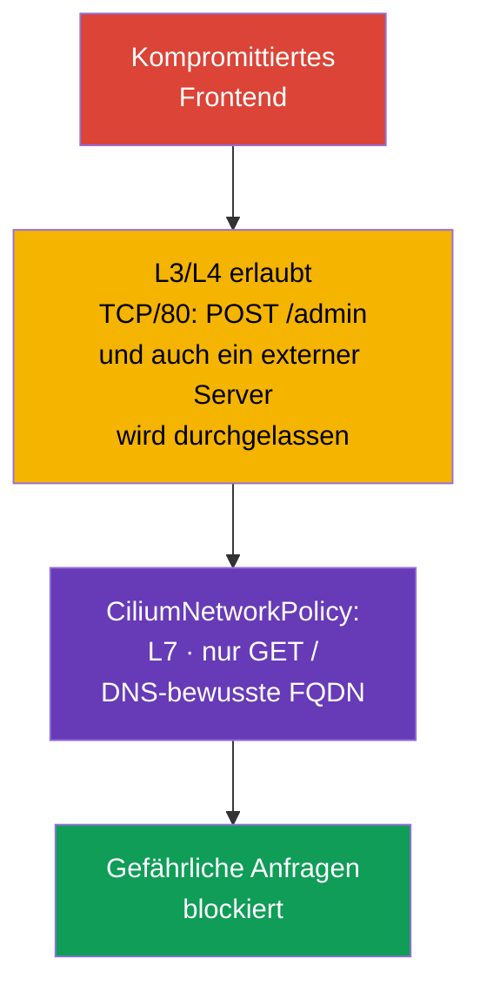

[Русская версия](ru.md) · [Eng version](README.md) · [Versión en español](es.md) · [Version française](fr.md) · [ქართული ვერსია](ge.md) · [繁體中文版](tw.md) · [日本語版](jp.md)

# Kapitel 06. Cilium NetworkPolicy

> **Das Problem.** Ein kompromittiertes Frontend kann einen erlaubten TCP-Zugang zum Backend für `POST /admin` nutzen oder nach der DNS-Auflösung Daten an eine externe IP senden: L3/L4 NetworkPolicy kann das nicht unterscheiden. Ohne L7-, FQDN- und identitätsbewusste Einschränkungen wird eine erlaubte Verbindung zu einem Kanal für eine gefährliche Anfrage oder Exfiltration, und fehlende Beobachtbarkeit erschwert das Erkennen und Untersuchen eines DROP.

> **Wie es weitergeht.** Native NetworkPolicy erlaubt bereits, Pods zu isolieren und den Zugriff auf Metadata-Services zu sperren. Für einige Szenarien reicht das aber nicht: Es muss eine bestimmte HTTP-Methode erlaubt werden, DNS-Namen externer Services müssen berücksichtigt werden, Traffic zum Cluster muss von Traffic ins Internet unterschieden werden, und der Grund für jeden DROP muss sichtbar sein (ein Paket wird ohne Antwort an seinen Absender verworfen). **CiliumNetworkPolicy** erweitert die grundlegenden Fähigkeiten der Cilium-Netzwerkrichtlinien um L7-Filterung, FQDN-Regeln, Identities und Beobachtbarkeit. Dieses Kapitel vertieft die CKS-Cluster-Setup-Kompetenz „Netzwerksicherheitsrichtlinien verwenden, um den Zugriff auf Clusterebene einzuschränken“ und ist die Grundlage für Lab 102.
>
> Das öffentliche CKS-Curriculum verlangt nicht in jeder Prüfungsumgebung ausdrücklich CiliumNetworkPolicy, `toFQDNs` oder Hubble. Betrachten Sie Cilium-spezifische Befehle und CRDs daher als Vertiefung für Cluster, in denen Cilium tatsächlich bereitgestellt wird.

> **Cilium erscheint nicht von selbst im Cluster.** Es ist ein separates CNI, das ein Clusteradministrator installiert - über die `cilium` CLI oder ein Helm chart, auf einem bereits erstellten Cluster oder beim Erstellen statt des Standard-CNI. Wenn Cilium in Ihrer Umgebung noch nicht installiert ist, sind alle Beispiele dieses Kapitels bis zur Installation nicht anwendbar. Offizielle Anleitung: [Cilium-Schnellinstallation](https://docs.cilium.io/en/stable/gettingstarted/k8s-install-default/). Detailliertere Beispiele für L3/L4/L7-Regeln als die in diesem Kapitel behandelten finden Sie in der offiziellen Übersicht [Overview of Network Policy](https://docs.cilium.io/en/stable/security/policy/), einschließlich eigener Seiten für Layer 3, Layer 4 und Layer 7 Policies.

> **Was Sie aus CKA benötigen.** Das grundlegende CNI-Modell sowie die IP-Adressen von Pods und Services finden Sie in [CKA-Kapitel 30](../../../cka/course/30/de.md), Zweck und Platz von CNI im Netzwerk-Stack in [CKA-Kapitel 40](../../../cka/course/40/de.md). Die grundlegende Kubernetes-NetworkPolicy-Syntax wird in Kapitel 04 dieses Kurses behandelt; hier wiederholen wir sie nicht, sondern nutzen die Fähigkeiten von Cilium.

> 🧠 `kube-proxy` leitet `ClusterIP:port` an einen ausgewählten Pod weiter, während ein CNI `NetworkPolicy` separat anwendet.

## 06.0. Was für Sie neu ist: eBPF-Datapath statt kube-proxy

### Baseline ohne Cilium: Wie Traffic jetzt einen Service erreicht

Vor diesem Kapitel stellte `kube-proxy` den Paketpfad zu einem Service bereit. Der Mechanismus besteht aus drei Teilen:

- **Beobachtung.** Auf jeder node beobachtet `kube-proxy` Änderungen an Service- und `EndpointSlice`-Objekten.
- **Programmierung des Kernels.** Bei jeder Änderung aktualisiert es Kernel-Regeln - üblicherweise über `iptables` oder `nftables` (auch das veraltende `ipvs` ist möglich).
- **Abfangen und DNAT.** Eine Regel fängt Traffic zu `ClusterIP:port` ab und führt DNAT auf die IP eines bestimmten Pods aus, der zufällig oder über session affinity ausgewählt wird.

`NetworkPolicy` aus Kapitel 04 ist eine eigene Schicht über demselben Modell: Das CNI liest seinerseits das `NetworkPolicy`-Objekt und fügt eigene Kernel-Regeln hinzu, die ein Paket - abhängig von der Implementierung - **vor oder nach** den Regeln von kube-proxy erlauben oder blockieren.

> 🧠 Cilium ordnet Workload-Labels einer Identity zu und wendet L3/L4-Policy über eBPF-Maps an; L7 benötigt einen Proxy-Pfad.

### Was Cilium verändert: eBPF als primärer L3/L4-Datapath

Cilium bietet für denselben Paketpfad eine andere Architektur:

- **eBPF als primärer L3/L4-Datapath.** Für Pod-Networking, L3/L4-Policy und kube-proxy replacement verwendet Cilium eBPF-Programme und BPF-Maps. Die Programme werden an Kernel-Hook-Punkte angehängt, etwa an Netzwerkschnittstellen und cgroups.
- **Map-Lookup statt linearer `iptables`-Traversal.** Beim kube-proxy replacement speichert Cilium den Service/Backend-State in BPF-Maps und führt einen Lookup ohne sequenzielles Durchlaufen einer langen `iptables`-Kette aus. Das ist ein wichtiger Unterschied speziell zu kube-proxy im `iptables`-Modus. Übertragen Sie diesen Vergleich nicht auf kube-proxy `nftables`: Der moderne nftables-Modus verwendet ebenfalls map-basierten Dispatch (`verdict map`) mit annähernd O(1)-Lookup - Details finden Sie im offiziellen Kubernetes-Blog zum nftables-Modus von kube-proxy.
- **Zwei Betriebsmodi.** Vollständiger **kube-proxy replacement** implementiert das gesamte Service Load Balancing in eBPF und ermöglicht, `kube-proxy` aus dem Cluster zu entfernen. Im kooperativen Modus bedient `kube-proxy` Services weiter, während Cilium daneben Policy Enforcement und L7-Fähigkeiten ergänzt.

Beide Modi sind in Produktion möglich, und die CKS-Prüfung verlangt keinen bestimmten davon.

Es ist wichtig, die Ebenen zu trennen. L3/L4-Forwarding, Policy Enforcement und Service Load Balancing mit kube-proxy replacement werden in Cilium überwiegend über eBPF umgesetzt.

L7-HTTP/DNS-Policy funktioniert anders: Ausgewählter Traffic wird zu einem node-lokalen Userspace-Proxy (Envoy oder DNS-Proxy) umgeleitet. In aktuellen stabilen Cilium-Versionen kann diese Proxy-Umleitung auch netfilter/`iptables` TPROXY verwenden. Cilium sollte daher nicht als Datapath beschrieben werden, der bei allen Funktionen `iptables` und Userspace vollständig ausschließt.

> 🎯 Verwenden Sie native `NetworkPolicy` für Labels/CIDR und L3/L4-Ports, CNP für L7 HTTP/DNS, `toFQDNs`, `toEntities` und Cilium-Beobachtbarkeit.

### Wann `NetworkPolicy` genügt und wann CNP benötigt wird

Aus dem Unterschied der Mechanismen ergibt sich ein praktisches Kriterium für die Auswahl zwischen nativer `NetworkPolicy` und `CiliumNetworkPolicy` (CNP):

- **Beginnen Sie mit nativer `NetworkPolicy`.** Wenn die Aufgabe darin besteht, Traffic zwischen Pods anhand von Labels, Namespace, CIDR und TCP/UDP/SCTP-Port zu erlauben oder zu verbieten, genügt sie. Die Policy ist zwischen Clustern und CNI portabel, daher erschwert ein unbegründeter Wechsel zu CNP Migration und Wartung.
- **Wechseln Sie zu CNP, wenn Kontrolle innerhalb einer bereits erlaubten L3/L4-Verbindung benötigt wird.** Typische Auslöser sind, eine bestimmte HTTP-Methode oder einen Pfad (L7) einzuschränken, bestimmte externe DNS-Namen (`toFQDNs`) zu erlauben oder zu verbieten, Traffic zu `world`, `cluster` oder `host` (`toEntities`) explizit zu beschreiben oder über Hubble Beobachtbarkeit zur Untersuchung eines `DROP` zu erhalten.
- **Beide Modelle können kombiniert werden.** Native `NetworkPolicy` bleibt portable L3/L4-Kontrolle, während CNP dort feinere Granularität ergänzt, wo L3/L4 nicht mehr genügt. Die Details der gemeinsamen Allow/Deny-Auswertung werden weiter unten in diesem Kapitel behandelt.

> 🧠 CNP ergänzt native `NetworkPolicy` um Labels, L7 und FQDN; ein explizites Cilium deny hat Vorrang vor allow.

## 06.1. Warum eine Cilium-Policy benötigt wird

Native `NetworkPolicy` beschreibt Netzwerkbeziehungen auf L3/L4: Welche Pods, CIDRs und Ports TCP/UDP-Traffic austauschen dürfen. Sie kennt absichtlich keine HTTP-Pfade, DNS-Namen oder den Kontext einer Verbindung. Cilium implementiert Netzwerkrichtlinien in eBPF und ergänzt Workload-Identities, einen L7-Proxy und Beobachtbarkeit.

Angriffsszenario: Ein Frontend wird durch eine Anwendungsschwachstelle kompromittiert. Eine gewöhnliche Policy kann ihm TCP/80 zum Backend erlauben, sodass ein Angreifer denselben Zugriff erhält. Akzeptiert das Backend nur `GET /`, dürfen `POST /admin` oder `DELETE /data` selbst bei erlaubter TCP-Verbindung nicht durchgelassen werden. Ein weiteres häufiges Szenario ist, dass ein Pod nach der DNS-Auflösung eine beliebige externe IP anspricht und Daten an den Angreifer sendet.



Cilium wertet Policy nach Identity aus, nicht nur nach IP. Für Kubernetes-Workloads wird eine Identity aus Labels aufgebaut. Wird ein Pod neu erstellt, ändert sich seine IP, aber eine Regel mit `endpointSelector` funktioniert weiter, wenn die Labels gleich bleiben.

| Fähigkeit | Native `NetworkPolicy` | `CiliumNetworkPolicy` |
|---|---|---|
| L3: Pod/CIDR | ja | ja, Labels und Identities |
| L4: TCP/UDP/SCTP-Port | ja | ja |
| L7: HTTP, DNS | nein | ja |
| FQDN-Regeln | nein | ja, `toFQDNs` |
| `world` / `cluster` / `host` | nein | ja, `toEntities` |
| Flow-Beobachtbarkeit | hängt vom CNI ab | Hubble und `cilium` CLI |

`CiliumNetworkPolicy` (CNP) gilt im Namespace ihres Objekts. Sie eignet sich für Team- oder Anwendungs-Policies. `CiliumClusterwideNetworkPolicy` (CCNP) gilt für den gesamten Cluster und ist für plattformweite gemeinsame Regeln nützlich, etwa um gefährlichen Egress in allen Namespaces zu verbieten. CCNP hat stärkere Folgen: Ein Fehler in einem breiten Selector kann einen ganzen Cluster abschneiden. Testen Sie die Regel daher zuerst in einem separaten Namespace und verwenden Sie enge Labels.

### Zusammenspiel mit nativer `NetworkPolicy`

`NetworkPolicy` aus [Kapitel 04](../04/de.md) und CNP/CCNP können gleichzeitig denselben Endpoint auswählen. Ihre Allow-Regeln werden gemeinsam berücksichtigt, aber ein explizites Cilium `ingressDeny`/`egressDeny` hat Vorrang vor **allen** Allow-Regeln: aus CNP, CCNP und nativer Kubernetes-`NetworkPolicy`. Daher kann ein Allow aus gewöhnlicher `NetworkPolicy` ein Cilium deny nicht umgehen. Erfassen Sie bei einem unerwarteten `DROP` alle diese Objekte, ihre Selectors und Richtungen, statt den Fehler nur in der zuletzt angewendeten CNP zu suchen. Native Policy bleibt portable L3/L4-Kontrolle; Cilium ergänzt sie um L7, FQDN, Entities und Beobachtbarkeit.

> **Fortgeschritten: Kubernetes `ClusterNetworkPolicy`.** In modernen Cilium-Versionen kann neben `NetworkPolicy`, CNP und CCNP Kubernetes `ClusterNetworkPolicy` (KCNP, `v1alpha2`) gelten. Sein Tiers-Modell trennt `Admin`, `NetworkPolicy` und `Baseline`; die Regeln des `Admin`-Tiers haben Vorrang vor CNP, CCNP und gewöhnlicher `NetworkPolicy`. Das ist für plattformweite Grenzen nützlich, aber kein eigenständiges Pflichtthema in CKS: Prüfen Sie vor der Verwendung, ob die betreffenden APIs und die Unterstützung in Ihrem Cilium-Cluster aktiviert sind.

> 🎯 In CNP wählt `endpointSelector` Pods aus, `fromEndpoints`/`toEndpoints` wählen die Identity und `toPorts` Protokoll und Port; ingress und egress erzeugen unabhängig voneinander default-deny.

## 06.2. L3/L4: Nur den benötigten Workload und Port erlauben

Eine Policy wird auf einen Endpoint anwendbar, wenn `endpointSelector` ihn auswählt. Bei `policyEnforcementMode: default` aktiviert Cilium Enforcement, wenn eine Policy den Endpoint auswählt; `always` aktiviert es für alle Endpoints (ein Endpoint ohne Allow-Regeln wird verboten), während `never` Enforcement deaktiviert. Standardmäßig gilt eine Allow-List **für jede Richtung getrennt**: Das Vorhandensein von `ingress` macht ingress bis zum Match einer Allow-Regel zu default-deny, und das Vorhandensein von `egress` macht ebenso nur egress zu default-deny. Eine Policy nur mit `ingress` sperrt egress nicht und umgekehrt. Der Selector muss daher präzise sein.

Dieses Verhalten lässt sich über `enableDefaultDeny` ändern: Eine Richtung, für die `false` gesetzt ist, wird nicht berücksichtigt, wenn ein Endpoint in default-deny überführt wird. So kann ein Administrator eine clusterweite Policy - etwa das Abfangen von DNS - sicher anwenden, ohne den Endpoint in default-deny zu versetzen und legitimen Traffic zu blockieren. Diese Ausnahme darf nicht auf L7-Policy übertragen werden: `enableDefaultDeny` gilt nicht für Layer-7-Regeln, und das Hinzufügen einer L7-Regel ohne die entsprechende L7-allow-all-Regel verursacht selbst bei explizit deaktiviertem default-deny einen DROP.

Cilium verfolgt den Verbindungszustand: Das Erlauben eines initiierenden ingress- oder egress-Flows erlaubt **Antwort-Traffic derselben Verbindung**, jedoch keine neue Verbindung in umgekehrter Richtung. Duplizieren Sie daher nicht mechanisch die Regel für die Antwort, sondern beschreiben Sie einen eigenständigen Callback explizit, wenn die Anwendung ihn benötigt.

Im Folgenden akzeptiert ein Backend mit dem Label `app: backend` nur TCP/80 von einem Frontend mit dem Label `app: frontend` im selben Namespace `cks-102`. `fromEndpoints` ist eine L3-Einschränkung nach Identity, `toPorts` eine L4-Einschränkung nach Protokoll und Port.

```yaml
apiVersion: cilium.io/v2
kind: CiliumNetworkPolicy
metadata:
  name: backend-from-frontend-http
  namespace: cks-102
spec:
  endpointSelector:
    matchLabels:
      app: backend
  ingress:
  - fromEndpoints:
    - matchLabels:
        app: frontend
    toPorts:
    - ports:
      - port: "80"
        protocol: TCP
```

Wenden Sie das Manifest an und prüfen Sie das Objekt, bevor Sie die Policy für funktionierend halten:

```bash
kubectl apply -f backend-l3-l4.yaml
kubectl -n cks-102 get ciliumnetworkpolicy
kubectl -n cks-102 describe ciliumnetworkpolicy backend-from-frontend-http

# Prüfen Sie zuerst die Labels, aus denen Cilium die Identity aufbaut.
kubectl -n cks-102 get pod --show-labels
```

Fügen Sie für Namespace-übergreifenden Traffic das Namespace-Label zu `matchLabels` hinzu. Cilium fügt Kubernetes-Labels mit dem Präfix `k8s:` automatisch hinzu; ein Namespace wird normalerweise durch das Label `k8s:io.kubernetes.pod.namespace` repräsentiert.

```yaml
  ingress:
  - fromEndpoints:
    - matchLabels:
        k8s:io.kubernetes.pod.namespace: storefront
        app: frontend
    toPorts:
    - ports:
      - port: "8080"
        protocol: TCP
```

Ersetzen Sie die Identity nicht durch eine Regel mit beliebigem `toCIDR`, wenn das Ziel ein Pod ist. Ein CIDR folgt der Neuerstellung eines Workloads nicht und kann IPs eines fremden Workloads einschließen. `toCIDR` ist für stabile externe Netzwerke oder enge Service-Bereiche gerechtfertigt, nicht als übliche Methode, zwei Kubernetes-Services zu verbinden.

> 🔬 Aktives FTP verwendet einen dynamischen Rückport, den eine statische L3/L4-CNP nicht ausdrücken kann; erforderlich sind ein protocol-aware Gateway oder passives FTP mit festem Bereich.

### Sonderfall: Aktives FTP lässt sich nicht über L3/L4 ausdrücken

Aktives FTP zeigt die Grenze von L3/L4-Policy. Ein Client öffnet eine Control-Verbindung zu TCP/21 und teilt dem Server seinen Port für die Data-Verbindung mit; anschließend **initiiert der Server selbst eine neue TCP-Verbindung zurück zum Client** auf diesem Port. Der Port ist im Voraus unbekannt und wird innerhalb der Sitzung dynamisch ausgehandelt. Daher kann eine statische `toPorts`/`fromEndpoints`-Regel nicht beschreiben: „Erlaube eine eingehende Verbindung an einem Port, auf den sich die Parteien später einigen."

Vor Kubernetes und Cilium löste **Connection Tracking auf Kernel-Ebene** dieses Problem: Das Modul `nf_conntrack_ftp` parst den Control-Kanal, erkennt den ausgehandelten Port und fügt die zugehörige Verbindung dynamisch als erlaubt hinzu. `kube-proxy` und seine `iptables`/`nftables`-Regeln lösen diese Aufgabe nicht selbst - ein separater Conntrack-Helper über netfilter löst sie, nicht der Service-Forwarding-Mechanismus selbst.

Für Protokolle mit unterstützter Semantik auf Anwendungsebene kann Cilium einen L7-Proxy verwenden, FTP gehört jedoch nicht dazu.

Die Standard-CiliumNetworkPolicy bietet keinen FTP-aware Helper und keinen eingebauten FTP-L7-Parser. Daher kann Cilium über den FTP-Control-Channel nicht automatisch den ausgehandelten Data-Connection-Port im aktiven Modus bestimmen und dafür eine temporäre Policy-Erlaubnis erstellen.

Für eine Kubernetes-Umgebung ist **passives FTP** mit einem vorab begrenzten Bereich von Data-Ports vorzuziehen: Dann lassen sich Control-Traffic auf TCP/21 und Data-Traffic auf einem festen Bereich mit gewöhnlichen L3/L4-Policy-Regeln (`endPort`) ausdrücken.

Wenn eine Legacy-Anwendung zwingend aktives FTP mit dynamisch ausgehandelten Ports benötigt, ist das bereits die Aufgabe eines separaten protocol-aware Gateway/Proxy oder einer speziell entworfenen Netzwerkschicht, nicht einer Standard-CNP.

Konzentrieren Sie sich bei den integrierten Regeln auf Anwendungsebene im modernen Cilium auf HTTP und DNS. gRPC wird über HTTP/2-Semantik mit `rules.http` gefiltert; es gibt keinen eigenen gRPC-Regeltyp. Kafka-aware NetworkPolicy wurde in Cilium 1.20 entfernt.

> 🎯 Erlauben Sie in `toPorts.rules.http` nur die benötigte Methode und den benötigten Pfad und prüfen Sie sowohl eine erlaubte als auch eine verbotene Anfrage.

## 06.3. L7: HTTP und DNS einschränken

Eine L7-Regel wird innerhalb eines `toPorts`-Elements hinzugefügt. Cilium leitet ausgewählten Traffic durch den passenden L7-Proxy: HTTP oder DNS. Eine wichtige Folge ist, dass L7-Regeln nur auf ein korrekt erkanntes Protokoll am angegebenen Port anwendbar sind. Erwarten Sie keine HTTP-Filterung, wenn ein Client TLS an einem Port ohne konfigurierte TLS-Terminierung spricht: Der Proxy sieht kein Klartext-HTTP.

Die folgende Regel erlaubt einem Frontend nur `GET /` zu einem Backend. Der reguläre Ausdruck für den Pfad `^/$` ist absichtlich eng: `/healthz`, `/api` und jedes `POST` stimmen nicht überein und werden verboten.

```yaml
apiVersion: cilium.io/v2
kind: CiliumNetworkPolicy
metadata:
  name: backend-read-only
  namespace: cks-102
spec:
  endpointSelector:
    matchLabels:
      app: backend
  ingress:
  - fromEndpoints:
    - matchLabels:
        app: frontend
    toPorts:
    - ports:
      - port: "80"
        protocol: TCP
      rules:
        http:
        - method: "GET"
          path: "^/$"
```

Prüfen Sie nicht nur eine erfolgreiche Anfrage, sondern auch die Verweigerung. Das Image des Test-Pod muss `curl` oder einen anderen HTTP-Client enthalten:

```bash
kubectl -n cks-102 exec deploy/frontend -- curl -i http://backend/
kubectl -n cks-102 exec deploy/frontend -- \
  curl -i -X POST http://backend/

# Erwartung: GET gibt 200 zurück; Cilium-Proxy weist eine nicht passende L7-Anfrage gewöhnlich mit 403 zurück.
```

Für eine API ist es sicherer, erlaubte Methoden, Pfade und bei Bedarf Header aufzuzählen, als ein breites `path: ".*"` zu verwenden. L7-Policy ersetzt weder Authentifizierung noch Autorisierung der Anwendung: Sie reduziert die verfügbare Angriffsfläche, kennt aber weder den Benutzer noch die Geschäftsregeln der API.

Cilium kann DNS auch nach dem Namen der Anfrage filtern. Aktivieren Sie einen L7-Proxy nicht ohne Bedarf: Er fügt Verarbeitung zum Traffic-Pfad hinzu und erfordert eigene Load-Tests.

> 🔬 gRPC wird als HTTP/2 über `POST` und den Methodenpfad gefiltert.

### gRPC: Filterung über HTTP, mit Besonderheit beim Load Balancing

Cilium hat keinen eigenen „gRPC-Parser“. gRPC arbeitet über HTTP/2, und jeder Methodenaufruf wird als gewöhnliche HTTP-Anfrage kodiert: ein `POST` auf einen Pfad wie `/Paket.Service/Methode`. Die gRPC-L7-Filterung ist daher dieselbe HTTP-Regel `path`, die Sie gerade oben gesehen haben, nur dass der Regex oder der genaue Pfad statt `/` `/cloudcity.DoorManager/GetName` beschreibt.

Zum Beispiel erlaubt die folgende Regel `public-terminal`, bei `cc-door-mgr` nur Methoden zum Lesen des Status aufzurufen, nicht aber den Zugangscode zu ändern:

```yaml
apiVersion: cilium.io/v2
kind: CiliumNetworkPolicy
metadata:
  name: door-read-only-grpc
spec:
  endpointSelector:
    matchLabels:
      app: cc-door-mgr
  ingress:
  - fromEndpoints:
    - matchLabels:
        app: public-terminal
    toPorts:
    - ports:
      - port: "50051"
        protocol: TCP
      rules:
        http:
        - method: "POST"
          path: "/cloudcity.DoorManager/GetName"
        - method: "POST"
          path: "/cloudcity.DoorManager/GetLocation"
```

Ein Aufruf von `SetAccessCode` passt zu keiner Regel und wird abgewiesen - der Client erhält den gRPC-Status `PERMISSION_DENIED` und nicht einen gewöhnlichen Netzwerk-Timeout. Ein ausführliches Schritt-für-Schritt-Beispiel mit einer Demo-Anwendung finden Sie in der offiziellen Dokumentation: [gRPC absichern](https://docs.cilium.io/en/stable/security/grpc/).

Ein separates Problem bei der Lastverteilung entsteht, wenn Cilium **kube-proxy vollständig ersetzt** (`kube-proxy-replacement`). gRPC hält eine langlebige TCP-Verbindung und führt darüber viele Methodenaufrufe nacheinander aus. Gewöhnliches Cilium-eBPF-Load-Balancing wählt einen Pod **einmal beim Aufbau der Verbindung**, nicht bei jedem einzelnen Aufruf innerhalb der Verbindung. Öffnet ein Client eine Verbindung und hält sie lange, geht sein gesamter Traffic zu demselben Pod, während andere Backend-Replikate nicht ihren Anteil der Last erhalten - dies wird als Connection Pinning bezeichnet.

Die Lösung besteht darin, für den benötigten Service in Cilium **Proxy Load Balancing** zu aktivieren: Traffic wird durch den eingebauten Envoy geleitet, der in den HTTP/2-Stream hineinschauen und einzelne gRPC-Aufrufe zwischen Pods verteilen kann, statt die gesamte Verbindung zu verteilen. Ohne diese Einstellung sollten langlebige gRPC-Clients in einem Cluster ohne kube-proxy gesondert auf gleichmäßige Last zwischen den Replikaten geprüft werden.

Dies wird mit einer einzigen Annotation am Service-Objekt aktiviert, ohne das Workload-Manifest zu ändern:

```bash
kubectl annotate service payment-grpc-service \
  service.cilium.io/lb-l7=enabled
```

Danach läuft Traffic zu `payment-grpc-service` durch einen von Cilium verwalteten Envoy, der einzelne Aufrufe auf Pods verteilt, statt die gesamte TCP-Verbindung an ein Backend zu pinnen. Der Load-Balancing-Algorithmus kann mit einer separaten Annotation `service.cilium.io/lb-l7-algorithm` (`round_robin`, `least_request` oder `random`) festgelegt werden. Die Funktion hat den Status **beta**; prüfen Sie ihr Verhalten in Ihrer Cilium-Version, bevor Sie sie in Produktion aktivieren. Ein Schritt-für-Schritt-Beispiel mit Traffic-Beobachtung über Hubble finden Sie in der offiziellen Dokumentation: [Proxy-Lastverteilung für Kubernetes Services](https://docs.cilium.io/en/stable/network/servicemesh/envoy-load-balancing/).

**Wo Envoy physisch läuft.** Es ist kein Sidecar in jedem Pod. Envoy ist im Cilium-Image enthalten und läuft **einmal auf jeder node**: entweder als Prozess in `cilium-agent` oder als separates `cilium-envoy` DaemonSet, das von allen Pods auf dieser node genutzt wird. In den oben betrachteten Szenarien wird Traffic durch ihn geleitet, der von L7-Policy oder Proxy Load Balancing (`lb-l7`) umgeleitet wurde. Dies ist keine vollständige Liste: Auch Cilium Ingress, Gateway API und `CiliumEnvoyConfig` leiten Traffic durch denselben per-node Envoy. Gewöhnlicher Pod-to-Pod-L3/L4-Traffic, für den keine dieser proxy-basierten Funktionen aktiviert ist, bleibt ohne Durchlauf durch den Userspace auf dem eBPF-Datapath.

**Wie dies Latenz und Verbindungsparameter beeinflusst.** Jedes umgeleitete Paket durchläuft einen zusätzlichen Übergang durch den Envoy-Userspace-Prozess auf derselben node, nicht über das Netzwerk zu einer anderen node oder einem Pod. Das fügt Folgendes hinzu:

- **Eine kleine zusätzliche Latenz** für jede Anfrage - einen Übergang vom Kernel in den Userspace und zurück sowie die Protokollanalyse (HTTP/gRPC). Der Wert ist für einen lokalen Hop gewöhnlich klein, aber nicht null, und sollte vor dem Aktivieren unter realer Last gemessen werden.
- **Zusätzliche CPU- und Speichernutzung auf der node** - Envoy verarbeitet Traffic als eigener Prozess, deshalb wächst die Last auf der node bei hohem L7-Traffic-Volumen proportional.
- **Die Source Address hängt vom Proxy-Pfad und von der Konfiguration ab.** Allein der Durchlauf durch Envoy bedeutet nicht, dass ein Backend zwingend die Source-IP des Proxys sieht. Für L7-Policy-Enforcement verwendet Cilium standardmäßig die ursprüngliche Source Address; `CiliumEnvoyConfig`, Ingress und Gateway API haben eigene Einstellungen und Regeln für die Source Visibility. Prüfen Sie deshalb die vom Backend sichtbare Source-IP/Port für den konkreten Modus, statt sie allein aus der Verwendung von Envoy abzuleiten.
- **Der Overhead gilt nur für ausgewählten Traffic** - gewöhnliche L3/L4-Verbindungen ohne L7-Regeln und ohne die Annotation `lb-l7` zahlen diesen Preis nicht: Sie bleiben ohne Envoy auf dem schnellen eBPF-Pfad.

> **Aktualität.** Die L7-Filterung für Kafka in Cilium ist seit Version 1.18 deprecated und wurde in Version 1.20 entfernt. Konzentrieren Sie sich für CKS auf L7 HTTP und DNS/`toFQDNs` und behandeln Sie Kafka-Policy nur als historisches Beispiel, nicht als aktuelle Praxis.

> 🎯 Erlauben Sie UDP/TCP 53 zu vertrauenswürdigem CoreDNS und beschränken Sie externen Zugriff mit `toFQDNs`; Cilium verwendet beobachtete DNS-Antworten und einen FQDN-Cache.

## 06.4. DNS-bewusster Egress und `toFQDNs`

Die IPs eines öffentlichen SaaS-Service ändern sich, ein CDN liefert verschiedene Adressen, und eine Anwendung kennt gewöhnlich den Namen statt der IP. `toFQDNs` erlaubt Egress zu Namen, indem sie den IPs zugeordnet werden, die der DNS-Proxy von Cilium in erlaubten DNS-Antworten gesehen hat; es ist keine statische DNS-Auflösung zur Zeit der Anwendung des YAML. Der Proxy füllt den FQDN-Cache unter Berücksichtigung der TTL und erlaubt anschließend eine Verbindung zu einer IP aus diesem Cache. Leiten Sie die DNS-Auflösung daher nur an vertrauenswürdiges Cluster-DNS (zum Beispiel CoreDNS), das durch einen präzisen Selector ausgewählt wird: Cilium fragt DNS nicht selbst ab und darf keinem beliebigen Nameserver vertrauen.

Die folgende Policy erlaubt dem Frontend DNS-Anfragen an CoreDNS und HTTPS nur zu `example.com`. `rules.dns` erlaubt die DNS-Anfrage, während `toFQDNs` die anschließende Verbindung zu der für den erlaubten Namen zurückgegebenen IP erlaubt.

```yaml
apiVersion: cilium.io/v2
kind: CiliumNetworkPolicy
metadata:
  name: frontend-external-api-only
  namespace: cks-102
spec:
  endpointSelector:
    matchLabels:
      app: frontend
  egress:
  - toEndpoints:
    - matchLabels:
        k8s:io.kubernetes.pod.namespace: kube-system
        k8s:k8s-app: kube-dns
    toPorts:
    - ports:
      - port: "53"
        protocol: UDP
      - port: "53"
        protocol: TCP
      rules:
        dns:
        - matchPattern: "*"
  - toFQDNs:
    - matchName: "example.com"
    toPorts:
    - ports:
      - port: "443"
        protocol: TCP
```

`matchName` wählt genau einen Namen aus. Verwenden Sie für einen kontrollierten Satz von Subdomains `matchPattern`, zum Beispiel `"*.example.com"`: Ein solcher Wildcard darf nicht als Erlaubnis für den Apex-Namen `example.com` betrachtet werden. Wenn sowohl `example.com` als auch dessen Subdomains benötigt werden, drücken Sie sie in getrennten Regeln aus. Verwenden Sie `"*"` nicht ohne ausdrücklichen Bedarf: In `toFQDNs` entfernt dieses Pattern die Einschränkung nach DNS-Namen und erlaubt Ziele, die für alle passenden Namen aus dem DNS-Cache gelernt wurden; andere Bedingungen derselben Regel, etwa `toPorts`, gelten weiter. Prüfen Sie vor der Anwendung die tatsächlichen CoreDNS-Labels in Ihrem Cluster - einige Installationen verwenden statt `k8s-app: kube-dns` ein anderes Label.

```bash
kubectl -n kube-system get pod --show-labels | grep -E 'coredns|dns'
```

Das folgende Beispiel ist eine illustrative manuelle Prüfung, kein deterministischer Acceptance-Test. IANA weist ausdrücklich darauf hin, dass der HTTP-Service der Dokumentationsdomains (`example.com`, `example.org` usw.) best-effort bereitgestellt wird und nicht als Testing-Endpoint für Software gedacht ist: https://www.iana.org/news/2024/example-domain-http-methods. Falls `example.com`/`www.google.com` in Ihrer Umgebung nicht verfügbar sind (Netzwerkeinschränkungen, vorübergehender Ausfall, Blockierung in einem bestimmten Netzwerk), bedeutet das nicht, dass die Policy fehlerhaft ist - ersetzen Sie sie durch einen FQDN, für den Sie vor der Anwendung der Policy unabhängig DNS-Auflösung und funktionierendes HTTPS bestätigt haben.

```bash
kubectl -n cks-102 exec deploy/frontend -- \
  curl -I --max-time 5 https://example.com
kubectl -n cks-102 exec deploy/frontend -- \
  curl -I --max-time 5 https://www.google.com
```

Bestätigen Sie vor der Anwendung der Policy, dass beide obigen Anfragen ohne Einschränkungen durchgehen. Wenden Sie erst danach `toFQDNs` an und vergleichen Sie: `example.com:443` muss durchgehen, während `www.google.com:443` durch die Policy selbst blockiert werden muss, nicht wegen zufälliger Nichtverfügbarkeit des externen Service.

`toFQDNs` ist weder vollständiges DLP noch eine Prüfung von HTTP `Host`: Es ist Zugriffskontrolle nach beobachteter DNS-Auflösung. DoH/DoT verbirgt eine DNS-Anfrage vor dem DNS-Proxy und füllt den FQDN-Cache nicht selbst. Auch eine direkte Verbindung zu einer IP erzeugt keine FQDN-Zuordnung; sie funktioniert nur, wenn diese IP nach einer erlaubten DNS-Antwort bereits im Cache ist oder eine breitere L3/L4-Regel sie erlaubt. Erlauben Sie keine nicht genehmigten DNS-Server, DoH/DoT oder direkte IP, wenn dies für das Threat Model wesentlich ist: Beschränken Sie Egress auf vertrauenswürdiges DNS, aktivieren Sie die benötigte DNS Visibility und kombinieren Sie Regeln mit einem Proxy/Firewall an der Netzwerkgrenze.

> 🔬 `world`, `cluster`, `host` und CCNP für plattformweite Grenzen; testen Sie einen engen Scope und berücksichtigen Sie Host Firewall und System-Traffic.

## 06.5. Entities und clusterweite Policy

Entities liefern lesbare Bezeichner für Adressgruppen, für die Kubernetes-Labels nicht
geeignet sind. Die wichtigsten Werte sind:

| Entity | Was sie umfasst | Typischer Fall |
|---|---|---|
| `world` | Adressen außerhalb des Clusters | Egress zu einer externen API oder Ingress von außen erlauben |
| `cluster` | Endpoints innerhalb des Clusters | Clusterinternen Traffic vom Internet trennen |
| `host` | lokaler Host-Endpoint der node | Zugriff auf die node explizit steuern |
| `remote-node` | andere nodes des Clusters | benötigte Kommunikation zwischen nodes erlauben |
| `kube-apiserver` | Kubernetes API server | Zugriff von Workloads auf die API beschränken |

Beispielsweise lässt sich ein Service, der HTTPS nur aus dem Internet akzeptieren soll,
über ein Label auswählen und der Ingress auf die Entity `world` beschränken:

```yaml
apiVersion: cilium.io/v2
kind: CiliumNetworkPolicy
metadata:
  name: public-gateway-from-world
  namespace: cks-102
spec:
  endpointSelector:
    matchLabels:
      app: public-gateway
  ingress:
  - fromEntities:
    - world
    toPorts:
    - ports:
      - port: "443"
        protocol: TCP
```

Für plattformweiten Schutz verwendet man CCNP. Das folgende Beispiel verweigert Egress
zur Metadata-IP für alle von der Policy ausgewählten Endpoints, lässt den übrigen Egress
aber zu: Eine anwendbare `egress`-Policy aktiviert selbst egress default-deny, deshalb ist
das explizite Allow `toEntities: [all]` hier erforderlich. `egressDeny` hat Vorrang vor
jedem Allow, auch vor diesem allow-all und Regeln anderer CNP/CCNP; die Metadata-IP kann
also nicht versehentlich geöffnet werden. Prüfen Sie zuerst, ob System-Workloads Metadata-
Aufrufe benötigen, und schließen Sie sie bei Bedarf durch einen separaten Selector oder
Namespace aus.

```yaml
apiVersion: cilium.io/v2
kind: CiliumClusterwideNetworkPolicy
metadata:
  name: deny-cloud-metadata
spec:
  endpointSelector: {}
  egress:
  - toEntities:
    - all
  egressDeny:
  - toCIDR:
    - 169.254.169.254/32
```

Betrachten Sie `host` nicht als harmloses Objekt. `toEntities: host` steuert den
Netzwerkzugriff auf die lokale node und host-networked Workloads und kann daher einen Weg
zum kubelet oder anderen TCP/UDP-Listenern auf dem Host öffnen. Der Runtime-CRI-Socket ist
ein separater Mechanismus: containerd ist beispielsweise gewöhnlich über den Unix domain
socket `/var/run/containerd/containerd.sock` verfügbar, und seine Exposition hängt von
Filesystem-Mounts/`hostPath` und den Privilegien eines Pods ab, nicht von
`toEntities: host` allein. Die Einschränkung von Host-Traffic erfordert ein Verständnis der
Cilium Host Firewall, des Modus `hostFirewall.enabled` und des Control-Plane-Traffics;
testen Sie sie in einem Testcluster, damit Sie nicht den Zugang zu nodes oder zum API server
verlieren. Beschränken Sie den Zugang zum Runtime-Socket separat über Mount-/Privilege-
Controls.

## 06.6. Beobachtbarkeit und Überprüfung mit Hubble

### Was Hubble ist und welches Problem es löst

Eine gewöhnliche `NetworkPolicy` oder `CiliumNetworkPolicy` beantwortet die Frage „was ist
erlaubt“. Sie beantwortet nicht die Frage „was ist tatsächlich passiert“: warum eine
bestimmte Anfrage nicht durchging, zu welcher Regel ein DROP gehört, ob der Client einen
TCP-connect sieht oder die Verweigerung bereits auf L7 erfolgte. Ohne ein solches Werkzeug
reduziert sich die Untersuchung auf das erneute Lesen von YAML und Vermutungen.

**Hubble** ist die Beobachtbarkeitskomponente von Cilium. Sie liest dieselben eBPF-Events,
die der Datapath bereits sammelt, und wandelt sie in einen lesbaren Strom von Flow-Events
um: Source-/Destination-Identity, L4/L7-Kontext, Verdict (`FORWARDED`/`DROPPED`) und Grund
der Verweigerung. Sie ersetzt weder das Kubernetes Audit Log noch liest sie den Inhalt einer
Anfrage für Sie; sie zeigt, was Cilium mit einer bestimmten Verbindung entschieden hat und
warum.

> 🔬 Architektur von Hubble Server/Relay/UI, CLI und Komponenten hängen von Version und Installationsart von Cilium ab.

Architektonisch besteht Hubble aus vier Teilen:

- **Hubble Server** ist in `cilium-agent` eingebettet und läuft auf jeder node; er liefert
  Flow-Events über gRPC aus.
- **Hubble Relay** (`hubble-relay`) ist eine separate Komponente, die sich mit den Servern
  auf allen nodes verbindet und statt einer node-für-node-Sicht eine einheitliche
  Clustersicht liefert.
- **Hubble CLI** (`hubble`) ist ein Kommandozeilenclient; er verbindet sich entweder mit
  Relay für eine Clusterübersicht oder mit dem lokalen Server auf einer node.
- **Hubble UI** (`hubble-ui`) ist eine optionale grafische Oberfläche auf Relay mit einer
  Karte der Service-Verbindungen.

**Wie es aktiviert wird.** In managed Distributionen und Standardinstallationen von Cilium
wird Hubble gewöhnlich beim Installieren oder Aktualisieren über ein Helm-Flag aktiviert,
zum Beispiel `--set hubble.relay.enabled=true --set hubble.ui.enabled=true`; das genaue Flag
hängt von der Chart-Version ab. Für CKS und dieses Kapitel genügt eine Sache: Wenn Hubble im
Cluster bereits aktiviert ist, zeigt `cilium status` seinen Zustand, und die CLI `hubble`
kann wie unten gezeigt über port-forward mit Relay verbunden werden. Hubble für das Lab von
Grund auf zu aktivieren ist nicht nötig - das ist die Aufgabe des Clusteradministrators,
nicht Teil der CNP, die Sie anwenden.

> 🎯 Erzeugen Sie erwarteten erlaubten und verbotenen Traffic und beobachten Sie anschließend Hubble-Flows mit Filtern nach Namespace, Verdict oder Protokoll.

Stellen Sie vor dem Test sicher, dass die Cilium-Agents gesund sind. Die Befehle führt man
normalerweise auf der Arbeitsmaschine mit verfügbarer `cilium` CLI aus; die genaue Methode,
Hubble zu aktivieren, hängt von der Cilium-Installation ab.

`hubble` ist ein separates Binary und nicht Teil der `cilium` CLI. Es muss einmal auf der
Arbeitsmaschine installiert werden, indem der passende Release von GitHub heruntergeladen
wird; die Schritte für die einzelnen Plattformen stehen in der offiziellen Anleitung
[Hubble Client installieren](https://docs.cilium.io/en/stable/observability/hubble/setup/#install-the-hubble-client).
Prüfen Sie das Binary nach der Installation mit `hubble help`.

```bash
cilium status --wait
cilium connectivity test

# Wenn Hubble Relay aktiviert ist, erstellt die CLI eine lokale Verbindung dorthin.
cilium hubble port-forward &
hubble status

# Traffic und Verweigerungen nur aus dem Übungs-Namespace.
hubble observe --namespace cks-102 --verdict DROPPED
hubble observe --namespace cks-102 --protocol http
```


Die Prüfreihenfolge für L3/L4, L7 und FQDN in Lab 102 muss reproduzierbar sein:

1. Stellen Sie sicher, dass `frontend` und `backend` Running sind und ihre Labels den
   Selectors entsprechen.
2. Wenden Sie die L3/L4-CNP an. Eine Anfrage vom Frontend an backend:80 muss durchgehen;
   von einem Pod ohne `app: frontend` muss sie einen Timeout oder DROP erhalten.
3. Ersetzen oder ergänzen Sie die L7-CNP-Regel. `GET /` muss `200` zurückgeben, während
   `POST /` eine Verweigerung vom Proxy erhalten muss (gewöhnlich `403`).
4. Wenden Sie die DNS/FQDN-Policy an. Prüfen Sie die Auflösung und HTTPS zum erlaubten Namen
   und versuchen Sie dann, einen nicht erlaubten Namen aufzurufen.
5. Beobachten Sie Hubble in einem separaten Terminal und speichern Sie den Flow des
   erlaubten und verbotenen Traffics als Nachweis des Ergebnisses.

Für die Diagnose sind auch die Agent-CLI und das Kubernetes-Objekt nützlich:

```bash
kubectl -n cks-102 get ciliumnetworkpolicy -o yaml
kubectl -n kube-system get pods -l k8s-app=cilium

# Wird im Pod cilium auf der ausgewählten node ausgeführt.
kubectl -n kube-system exec ds/cilium -- cilium-dbg endpoint list
kubectl -n kube-system exec ds/cilium -- cilium-dbg policy get
```

Wenn `hubble observe` leer bleibt, prüfen Sie zuerst `hubble status`, das Vorhandensein von
Hubble Relay, den kubeconfig-Kontext und die Namespace-/Verdict-Filter. Wenn DNS nach
default-deny nicht mehr funktioniert, fehlt fast immer die Erlaubnis für UDP/TCP 53 zu den
tatsächlichen CoreDNS-Endpoints. Wenn eine L7-Regel unerwartet nicht passt, prüfen Sie Port,
Protokoll, HTTP-Methode, regulären Ausdruck für den Pfad und TLS: Verschlüsseltes HTTP ohne
passende Konfiguration ist für den L7-Proxy nicht sichtbar.

> 🎯 Prüfen Sie Labels/Selectors, Richtung, Ports und DNS, vergleichen Sie dann den erlaubten und verbotenen Flow in Hubble; rollen Sie von einem engen Allow mit Rollback aus.

## 06.7. Häufige Fehler und sichere Einführungsreihenfolge

| Symptom | Wahrscheinliche Ursache | Was prüfen |
|---|---|---|
| Namen werden nach der Policy nicht aufgelöst | DNS ist nicht erlaubt oder der CoreDNS-Selector ist falsch | CoreDNS-Labels, UDP und TCP 53, Hubble DROPPED |
| `GET` und `POST` sind beide verboten | L3-Identity oder L4-Port stimmen nicht überein | Endpoint-Labels, Service-Port und targetPort |
| L7-Regel beschränkt die Anfrage nicht | Traffic wird nicht als HTTP erkannt oder es gibt eine breitere Regel | Protokoll, TLS, `cilium policy get`, Hubble-HTTP-Flows |
| FQDN-Policy gibt keinen Zugriff auf den Service | Name stimmt nicht mit der DNS-Antwort überein oder der IP-Cache ist noch nicht gefüllt | `hubble observe --protocol dns`, `matchName`, TTL |
| CCNP hat System-Traffic unterbrochen | Selector ist zu breit oder System-Endpoints wurden nicht berücksichtigt | Policy-Scope, Namespace/Labels, Rollout im Test-Namespace |
| Hubble enthält keine Events | Hubble Relay/CLI sind nicht verbunden oder der Filter ist zu eng | `hubble status`, port-forward, Filter entfernen |

**Cilium Policy Audit Mode** ist in der Vorbereitungsphase einer L3/L4-Policy nützlich: Wenn
er für den Daemon (`--policy-audit-mode=true`) oder einen ausgewählten Endpoint aktiviert
ist, lässt er Traffic durch, den die Policy sonst verwerfen würde, und zeichnet das
entsprechende Policy-Verdict auf. Suchen Sie solchen Traffic in diesem Modus nicht nur über
`--verdict DROPPED`: Beobachten Sie Policy-Verdicts:

```bash
hubble observe flows -t policy-verdict --namespace cks-102
```

Ein Flow, der mit einer zukünftigen Verweigerung übereinstimmt, ist als `AUDITED` sichtbar,
obwohl die Verbindung noch durchgeht. Nach dem Deaktivieren des Audit Mode wird derselbe Test
entweder `DENIED`, wenn die Regel ihn tatsächlich verbietet, oder bleibt `ALLOWED`, wenn eine
Allow-Regel den Flow abdeckt. Sammeln Sie diese Events zunächst über Hubble, engen Sie die
Allow-Regeln ein und aktivieren Sie erst dann Enforcement. Dies ist ein temporärer
Diagnosemodus und kein Production-Schutz: In ihm werden keine Blockierungen durchgesetzt;
auch für L7-Policy ersetzt er keine tatsächliche HTTP/DNS-Prüfung.

Sichere Reihenfolge: Beobachten Sie in Staging zuerst Hubble und speichern Sie eine Baseline
realer Flows, verwenden Sie bei Bedarf kurzzeitig den Policy Audit Mode, fügen Sie dann ein
enges Allow hinzu und prüfen Sie es von einem Test-Pod aus; erst danach aktivieren Sie Deny
oder erweitern den Scope in Production. Beginnen Sie nicht mit `endpointSelector: {}` in
einer CCNP auf einem Production-Cluster. Für jede Änderung ist ein Rollback nötig:
`kubectl delete ciliumnetworkpolicy <name> -n <namespace>` oder ein Rollback über GitOps,
nicht manuelles Ändern ohne Historie.

> 🏭 CNP-Rollout: Review, Staging, GitOps, Baseline-Flows und getrennte Verantwortlichkeiten für CCNP und Anwendungs-Policy.


## 06.8. Wie dies in Production eingesetzt wird

- **Policies werden zusammen mit dem Workload gespeichert.** CNP für eine Anwendung
  durchlaufen Code Review, werden in Staging getestet und mit einem GitOps-Werkzeug
  angewendet. Das Platform-Team verantwortet separat CCNP mit breiter Wirkung.
- **Labels sind ein Sicherheitsvertrag.** Teams legen Labels wie `app`, `component` und
  `tenant` fest und erlauben einem Workload nicht, sicherheitsrelevante Labels beliebig zu
  ändern. Andernfalls kann der Selector einer Policy den falschen Endpoint auswählen.
- **L7 wird für wertvolle APIs eingesetzt.** Das Erlauben nur erwarteter HTTP-Methoden/-Pfade
  verringert das Risiko von lateral movement, ersetzt aber weder OAuth, mTLS noch die
  Autorisierung der Anwendung.
- **Egress wird von DNS und dem Ziel aus aufgebaut.** `toFQDNs` wird für bekannte externe
  APIs verwendet, nicht als universelle Regel. DNS, Proxy und Perimeter-Firewall bleiben
  Schichten von defense in depth.
- **Hubble wird vor einem Incident aktiviert.** Dashboards für `DROPPED`-Flows und das
  Speichern von Flow Logs erlauben, einen Policy-Fehler von einem Anwendungsausfall zu
  unterscheiden und verdächtigen Egress schneller zu untersuchen.

## 06.9. Mini-Glossar

- **Cilium** - CNI und Sicherheitsplattform auf eBPF-Basis für Kubernetes.
- **CiliumNetworkPolicy (CNP)** - Namespace-Ressource für eine Cilium-Policy.
- **CiliumClusterwideNetworkPolicy (CCNP)** - Cluster-Policy von Cilium.
- **Identity** - von Cilium aus Labels gebildeter Identifier eines Endpoints.
- **L3/L4** - Netzwerkschicht und Transportprotokoll/-Port.
- **L7** - Protokollschicht, beispielsweise HTTP-Methode/-Pfad oder DNS.
- **`toFQDNs`** - Egress-Regel nach DNS-Namen und beobachteten DNS-Antworten.
- **Entity** - vordefinierte Cilium-Adressgruppe, beispielsweise `world`, `cluster`, `host`.
- **Hubble** - Beobachtbarkeit der Cilium-Netzwerk-Flows.
- **eBPF** - Linux-Kernel-Mechanismus, auf dem Cilium Datapath und Policy Enforcement umsetzt.

## 06.10. Zusammenfassung des Kapitels

- Cilium ergänzt die native NetworkPolicy durch L3/L4/L7-Policies, Identities, FQDN und
  Hubble-Beobachtbarkeit.
- CNP wirkt in einem Namespace, CCNP im gesamten Cluster; breite CCNP erfordern ein
  besonders vorsichtiges Rollout.
- `endpointSelector` wählt den zu schützenden Endpoint, `fromEndpoints`/`toEndpoints`
  definieren L3 und `toPorts` L4.
- HTTP-L7-Regeln ermöglichen, nur benötigte Methoden und Pfade zu erlauben, ersetzen aber
  nicht die Authentifizierung der Anwendung und erfordern ein erkennbares
  Klartextprotokoll.
- `toFQDNs` beschränkt externen Egress nach Namen; DNS muss dafür separat erlaubt werden,
  außerdem müssen DNS-Cache, TTL und mögliche Umgehungen berücksichtigt werden.
- `toEntities` drückt den Zugang zu `world`, `cluster`, `host` und anderen Systemgruppen aus.
- Hubble zeigt erlaubte und verbotene Flows und ist das wichtigste Werkzeug zum Prüfen und
  Debuggen einer Policy.

## 06.11. Wie dies in Prüfung und realer Arbeit hilft

**In der Prüfung.** Die übertragbare Fähigkeit, Network-Security-Policies anzuwenden, ist
Pflicht: Labels schnell lesen, Namespace und Richtung (`ingress`/`egress`) wählen, den
benötigten Flow erlauben und das Ergebnis nachweisen. **Falls der bereitgestellte Cluster
oder das Fixture Cilium verwendet**, müssen Sie zudem eine `CiliumNetworkPolicy` mit
`endpointSelector` erstellen, bei Bedarf HTTP oder `toFQDNs` beschränken und Flows mit
`hubble observe` prüfen können. L7, FQDN und Hubble sind Cilium-spezifische Vertiefungen,
kein von der öffentlichen Prüfungsvorgabe garantiertes Interface jeder Aufgabe; DNS muss
trotzdem mit einer eigenen Regel erlaubt werden.

**In der realen Arbeit.** Cilium-Policy übersetzt Architekturgrenzen in ausführbare Regeln:
Ein Frontend erhält keinen beliebigen Zugriff auf ein Backend, ein Workload erreicht nicht
beliebig das Internet, und der Flow zur API lässt sich auf die benötigten Operationen
eingrenzen. Hubble macht diese Grenzen während des Rollouts und der Incident-Untersuchung
überprüfbar.


## 06.12. Fragen zur Selbstkontrolle

<details>
<summary>1. Worin unterscheidet sich CNP neben dem Ressourcenformat von einer nativen `NetworkPolicy`?</summary>

CNP verwendet Cilium-Identities, die aus Labels gebildet werden, und ergänzt L7-Filterung
für HTTP/DNS, `toFQDNs`, Entities (`world`, `cluster`, `host`) sowie Hubble-Beobachtbarkeit.
Native NetworkPolicy bleibt eine übertragbare L3/L4-Kontrolle, während CNP/CCNP sie
ergänzen; ein explizites Cilium-Deny hat Vorrang vor Allow aus beiden Policy-Typen.
</details>

<details>
<summary>2. Was geschieht mit einem Ingress-Endpoint, wenn eine CNP ihn auswählt, der Traffic aber mit keiner Allow-Regel übereinstimmt?</summary>

Bei `policyEnforcementMode: default` wird der Endpoint für die Richtung isoliert, die durch
eine anwendbare Policy beschrieben ist. Enthält die CNP `ingress`, wirkt Ingress bis zu einer
Übereinstimmung mit einer Allow-Regel als default-deny; analog isoliert `egress` nur den
ausgehenden Traffic.
</details>

<details>
<summary>3. Wie lässt sich in einer CNP-Regel „nur Frontend zu Backend TCP/80“ ausdrücken?</summary>

Die CNP wählt das Backend über `endpointSelector` mit `app: backend`, in `ingress` verwendet
sie `fromEndpoints` mit `app: frontend`. In `toPorts` werden Port `"80"` und
`protocol: TCP` gesetzt; für eine Namespace-übergreifende Verbindung fügt man den
`matchLabels` der Quelle `k8s:io.kubernetes.pod.namespace` hinzu.
</details>

<details>
<summary>4. Warum beschränkt das Erlauben von TCP/80 noch nicht `POST /admin`, und wie gelingt es?</summary>

Eine L3/L4-Regel erlaubt die gesamte TCP-Verbindung auf Port 80 und unterscheidet weder
HTTP-Methode noch Pfad. Innerhalb von `toPorts` fügt man `rules.http` hinzu, beispielsweise
`method: "GET"` und einen engen `path: "^/$"`; der Cilium-L7-Proxy weist eine nicht passende
Anfrage dann gewöhnlich mit 403 ab.
</details>

<details>
<summary>5. Wie funktionieren `toFQDNs`, und warum muss DNS zusammen mit ihnen separat erlaubt werden?</summary>

`toFQDNs` löst Namen nicht beim Anwenden des YAML auf: Der DNS-Proxy von Cilium beobachtet
eine erlaubte DNS-Antwort, füllt den FQDN-Cache unter Berücksichtigung der TTL und erlaubt
eine Verbindung zur erhaltenen IP. Deshalb erlaubt man dem Pod DNS zu vertrauenswürdigem
CoreDNS separat; DoH/DoT füllen diesen Cache nicht, und eine direkte IP erzeugt keine
FQDN-Zuordnung.
</details>

<details>
<summary>6. Wann sind die Entities `world`, `cluster` und `host` passend, und warum erfordert `host` besondere Vorsicht?</summary>

`world` bezeichnet Adressen außerhalb des Clusters, `cluster` Endpoints darin und `host`
den lokalen Host-Endpoint der node sowie host-networked Workloads. Der Zugang zu `host` kann
kubelet und andere Netzwerk-Listener der node betreffen und benötigt daher eine vorsichtige
Host-Firewall-Policy. Der Runtime-CRI-Socket ist ein anderer Attack Path: gewöhnlich ist er
ein Unix socket im Filesystem der node und muss durch Einschränken von `hostPath`,
Privilegien und anderen Mechanismen für den Zugang zum Host-Filesystem geschützt werden.
</details>

<details>
<summary>7. Welche Hubble-Befehle helfen nachzuweisen, dass Cilium einen verbotenen Flow verworfen hat?</summary>

Nach `cilium status --wait` und dem Einrichten des Zugangs zu Hubble lassen sich
Verweigerungen mit `hubble observe --namespace cks-102 --verdict DROPPED` beobachten. Für
die Zuordnung von HTTP und DNS verwendet man jeweils `hubble observe --namespace cks-102
--protocol http` und DNS-Beobachtung; im Policy Audit Mode ist eine künftige Verweigerung
über `hubble observe flows -t policy-verdict --namespace cks-102` als `AUDITED` sichtbar.
</details>

<details>
<summary>8. Warum ist es gefährlich, die Einführung einer CCNP mit `endpointSelector: {}` in einem Production-Cluster zu beginnen?</summary>

CCNP wirkt im gesamten Cluster und ein leerer Selector wählt alle Endpoints aus; ein Fehler
in Allow/Deny kann somit System- und Anwendungstraffic abschneiden. Prüfen Sie die Regel
zuerst mit engen Labels in einem separaten Namespace, beobachten Sie die Baseline über Hubble
und bereiten Sie ein Rollback vor, indem Sie die Policy löschen oder GitOps zurückrollen.
</details>

## Praxis

Festigen Sie L3/L4, L7 HTTP, DNS-aware Egress und Hubble in Lab 102. Bearbeiten Sie die
Aufgaben in der Reihenfolge der Policies, statt zu versuchen, alle Ebenen gleichzeitig zu
debuggen.

🧪 Lab 102 (Cilium NetworkPolicy L3/L4/L7): [tasks/cks/labs/102](../../labs/102/README_DE.MD)

🧪 Lab 115 (Cilium von Grund auf installieren: kube-proxy-Ersatz, WireGuard und SPIRE-basierte Mutual Authentication - Advanced-/Production-Track, nicht Teil der formalen CKS-Core-Prüfungsanforderung): [tasks/cks/labs/115](../../labs/115/README_RU.MD)

🎮 Cilium Hubble (Dokumentation und interaktive Beispiele):
[Hubble-Beobachtbarkeit](https://docs.cilium.io/en/stable/observability/hubble/) ·
[Netzwerk-Policy](https://docs.cilium.io/en/stable/security/network/)

---
[Inhaltsverzeichnis](../README_DE.md) · [Kapitel 05](../05/de.md) · [Kapitel 07](../07/de.md)
