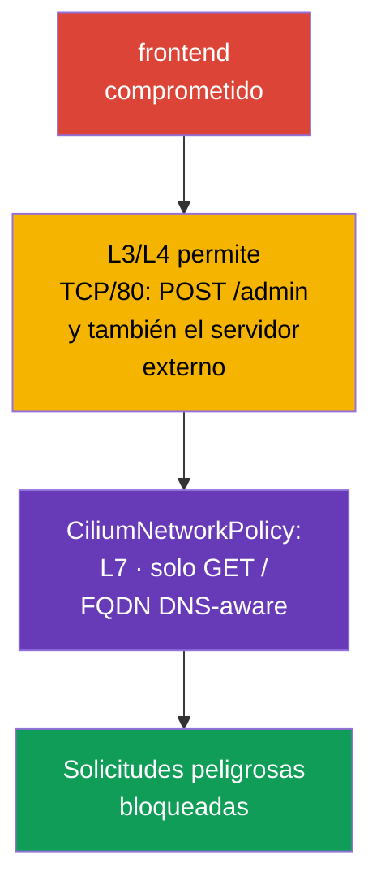

[Русская версия](ru.md) · [Eng version](README.md) · [Version française](fr.md) · [Deutsche Version](de.md) · [ქართული ვერსია](ge.md) · [繁體中文版](tw.md) · [日本語版](jp.md)

# Capítulo 06. Cilium NetworkPolicy

> **El problema.** Un frontend comprometido puede usar el acceso TCP permitido
> al backend para `POST /admin` o enviar datos a una IP externa después de DNS-resolve:
> NetworkPolicy L3/L4 no distingue esto. Sin restricciones L7, FQDN e identity-aware,
> una conexión permitida se convierte en un canal para una solicitud peligrosa o exfiltración,
> y la falta de observabilidad dificulta detectar un DROP e investigarlo.

> **Qué sigue.** Las NetworkPolicy nativas ya permiten aislar Pods y cerrar el
> acceso a servicios de metadata. Pero para algunos escenarios no es suficiente: se debe permitir
> un método HTTP específico, tener en cuenta nombres DNS de servicios externos, diferenciar el tráfico al clúster
> del tráfico a Internet y ver la causa de cada DROP (un paquete descartado sin respuesta
> para el remitente). **CiliumNetworkPolicy** amplía
> las capacidades básicas de las políticas de red de Cilium con filtrado L7, reglas FQDN, identities y
> observabilidad. Este capítulo profundiza la competencia CKS Cluster Setup «Use Network security
> policies to restrict cluster level access» y sirve de base para el laboratorio 102.
>
> El programa público de CKS no exige CiliumNetworkPolicy, `toFQDNs` ni Hubble en
> todos los entornos de examen, por lo que debes considerar los comandos y CRD específicos de Cilium como
> una profundización para clústeres donde Cilium esté realmente disponible.

> **Cilium no aparece por sí solo en el clúster.** Es un CNI independiente que
> instala el administrador del clúster, mediante la CLI `cilium` o un Helm chart, sobre un clúster ya
> creado o en lugar del CNI estándar al crearlo. Si Cilium aún no está instalado en tu entorno,
> todos los ejemplos de este capítulo son inaplicables hasta instalarlo. Instrucción oficial:
> [Instalación rápida de Cilium](https://docs.cilium.io/en/stable/gettingstarted/k8s-install-default/).
> Encontrarás ejemplos L3/L4/L7 más detallados que los analizados en este capítulo en la sección oficial
> [Resumen de Network Policy](https://docs.cilium.io/en/stable/security/policy/),
> incluidas páginas independientes para las políticas Layer 3, Layer 4 y Layer 7.

> **Qué necesitas de CKA.** Consulta el modelo básico de CNI y las direcciones IP de Pods y Services en el
> [capítulo 30 de CKA](../../../cka/course/30/es.md), y el propósito de CNI y su lugar en el stack
> de red en el [capítulo 40 de CKA](../../../cka/course/40/es.md). La sintaxis básica de Kubernetes
> NetworkPolicy se explica en el capítulo 04 de este curso; aquí no la repetimos, sino que usamos las
> capacidades de Cilium.

> 🧠 `kube-proxy` dirige `ClusterIP:port` al Pod seleccionado y el CNI aplica `NetworkPolicy` por separado.

## 06.0. Qué es nuevo para ti: eBPF datapath en vez de kube-proxy

### Baseline sin Cilium: cómo llega actualmente el tráfico a un Service

Hasta este capítulo, `kube-proxy` proporcionaba la ruta de un paquete a un Service. El mecanismo tiene tres
partes:

- **Observación.** En cada nodo, `kube-proxy` escucha cambios en los objetos Service y
  `EndpointSlice`.
- **Programación del kernel.** En cada cambio actualiza reglas del kernel, normalmente mediante
  `iptables` o `nftables` (el obsolescente `ipvs` también es posible).
- **Interceptación y DNAT.** Una regla intercepta tráfico hacia `ClusterIP:port` y realiza DNAT a la IP
  de un Pod específico elegido de forma aleatoria o por session affinity.

La `NetworkPolicy` del capítulo 04 es una capa independiente sobre este mismo modelo: el CNI, por su parte,
lee el objeto `NetworkPolicy` y añade sus propias reglas de kernel que permiten o bloquean un paquete **antes o después**
de las reglas de kube-proxy, según la implementación.

> 🧠 Cilium vincula los labels de workload con identity y aplica la policy L3/L4 mediante eBPF maps; L7 requiere una proxy path.

### Qué cambia Cilium: eBPF como datapath L3/L4 principal

Cilium propone una arquitectura diferente para la misma ruta de paquetes:

- **eBPF como datapath L3/L4 principal.** Para pod networking, policy L3/L4 y
  kube-proxy-replacement, Cilium usa programas eBPF y BPF maps. Los programas se
  conectan a hook points del kernel, por ejemplo, interfaces de red y cgroup.
- **Map lookup en lugar de recorrido lineal de `iptables`.** En kube-proxy-replacement, Cilium
  almacena el estado Service/backend en BPF maps y realiza lookup sin recorrer secuencialmente una
  larga cadena de `iptables`. Esta es una diferencia importante específicamente frente a kube-proxy en modo `iptables`.
  No extiendas esta comparación a kube-proxy `nftables`: el modo nftables moderno también
  usa map-based dispatch (`verdict map`) con lookup aproximadamente O(1); consulta los detalles en
  el blog oficial de Kubernetes sobre el modo nftables de kube-proxy.
- **Dos modos de funcionamiento.** El **kube-proxy-replacement** completo implementa todo el Service load
  balancing en eBPF y permite eliminar `kube-proxy` del clúster. En modo de coexistencia,
  `kube-proxy` sigue atendiendo Service, mientras Cilium añade policy enforcement y capacidades L7
  a su lado.

Ambos modos son posibles en producción y el examen CKS no exige uno concreto.

Es importante separar las capas. L3/L4 forwarding, policy enforcement y Service load balancing en
kube-proxy-replacement de Cilium se implementan principalmente mediante eBPF.

La policy L7 HTTP/DNS funciona de forma distinta: el tráfico seleccionado se redirige a un node-local userspace
proxy (Envoy o DNS proxy). En las versiones stable actuales de Cilium, dicha redirección de proxy
también puede usar netfilter/`iptables` TPROXY. Por ello, Cilium no debe describirse como un
datapath que, con cualquier función, excluye por completo `iptables` y userspace.

> 🎯 Usa `NetworkPolicy` nativa para labels/CIDR y puertos L3/L4, CNP para L7 HTTP/DNS, `toFQDNs`, `toEntities` y observabilidad de Cilium.

### Cuándo basta `NetworkPolicy` y cuándo se necesita CNP

De la diferencia entre mecanismos se sigue un criterio práctico para elegir entre la
`NetworkPolicy` nativa y CiliumNetworkPolicy (CNP):

- **Empieza con `NetworkPolicy` nativa.** Si la tarea es permitir o denegar tráfico
  entre Pods por labels, namespace, CIDR y puerto TCP/UDP/SCTP, basta con ella. La policy es
  portable entre clústeres y CNI, por lo que pasar a CNP sin motivo complica la migración
  y el mantenimiento.
- **Pasa a CNP cuando necesites control dentro de una conexión L3/L4 ya permitida.** Los
  desencadenantes típicos son limitar un método o ruta HTTP específicos (L7), permitir o
  denegar nombres DNS externos específicos (`toFQDNs`), describir explícitamente el tráfico a
  `world`, `cluster` o `host` (`toEntities`), u obtener observabilidad mediante Hubble para
  investigar un `DROP`.
- **Ambos modelos se pueden combinar.** La `NetworkPolicy` nativa sigue siendo un control L3/L4
  portable, y CNP aporta más granularidad donde L3/L4 ya no basta.
  Los detalles de la evaluación conjunta de allow/deny se analizan más adelante en este capítulo.

> 🧠 CNP añade labels, L7 y FQDN a `NetworkPolicy` nativa; un deny explícito de Cilium tiene prioridad sobre allow.

## 06.1. Por qué se necesita una policy de Cilium

La `NetworkPolicy` nativa describe relaciones de red en las capas L3/L4: qué Pods,
CIDR y puertos pueden intercambiar tráfico TCP/UDP. Intencionadamente no conoce rutas HTTP,
nombres DNS ni contexto de conexión. Cilium implementa policy de red en eBPF y añade
identities de workloads, proxy L7 y observabilidad.

Escenario de ataque: frontend se compromete mediante una vulnerabilidad de la aplicación. Una policy
normal puede permitirle TCP/80 hacia backend, por lo que el atacante obtiene el mismo acceso. Si
backend acepta solo `GET /`, `POST /admin` o `DELETE /data` no deberían pasar ni siquiera
con una conexión TCP permitida. Otro escenario frecuente es que un Pod contacte una IP externa arbitraria
tras DNS-resolve y envíe datos al atacante.



Cilium evalúa la policy por identity, no solo por IP. Para workloads de Kubernetes, la
identity se construye a partir de labels. Al recrearse un Pod cambia su IP, pero una regla con
`endpointSelector` sigue funcionando si los labels se mantienen iguales.

| Capacidad | `NetworkPolicy` nativa | `CiliumNetworkPolicy` |
|---|---|---|
| L3: pod/CIDR | sí | sí, labels e identities |
| L4: puerto TCP/UDP/SCTP | sí | sí |
| L7: HTTP, DNS | no | sí |
| Reglas por FQDN | no | sí, `toFQDNs` |
| `world` / `cluster` / `host` | no | sí, `toEntities` |
| Observabilidad de flujos | depende de CNI | Hubble y CLI `cilium` |

`CiliumNetworkPolicy` (CNP) opera en el namespace de su objeto. Es adecuada para policies
de equipo o aplicación. `CiliumClusterwideNetworkPolicy` (CCNP) opera en todo el
clúster y resulta cómoda para reglas comunes de plataforma, por ejemplo denegar egress peligroso en todos los
namespaces. CCNP tiene consecuencias más fuertes: un error en un selector amplio puede aislar todo el
clúster, por lo que primero debes comprobar la regla en un namespace independiente y usar labels específicos.

### Trabajo conjunto con `NetworkPolicy` nativa

La `NetworkPolicy` del [capítulo 04](../04/es.md) y CNP/CCNP pueden seleccionar el mismo
endpoint simultáneamente. Sus reglas allow se tienen en cuenta juntas, pero un Cilium `ingressDeny`/`egressDeny`
explícito tiene prioridad sobre **todas** las reglas allow: de CNP, CCNP y `NetworkPolicy`
nativa de Kubernetes. Por ello, un allow de una `NetworkPolicy` ordinaria no puede sortear un deny de Cilium.
Ante un `DROP` inesperado, inventaría todos estos objetos, sus selectors y direcciones, no busques el
error solo en la última CNP aplicada. La policy nativa sigue siendo un control L3/L4 portable; Cilium la
complementa con L7, FQDN, entities y observabilidad.

> **Avanzado: `ClusterNetworkPolicy` de Kubernetes.** En versiones modernas de Cilium, junto con
> `NetworkPolicy`, CNP y CCNP puede aplicarse `ClusterNetworkPolicy` (KCNP) de Kubernetes,
> `v1alpha2`. Su modelo de tiers separa `Admin`, `NetworkPolicy` y `Baseline`; las reglas del
> tier `Admin` tienen prioridad sobre CNP, CCNP y `NetworkPolicy` ordinaria. Es útil para límites
> platform-wide, pero no es un tema CKS independiente obligatorio: antes de usarlo, comprueba que las
> API y el soporte correspondientes estén habilitados en tu clúster Cilium.

> 🎯 En CNP, `endpointSelector` selecciona Pods, `fromEndpoints`/`toEndpoints` la identity y `toPorts` el protocolo y puerto; ingress y egress crean default-deny de forma independiente.

## 06.2. L3/L4: permitir solo el workload y puerto necesarios

Una policy se vuelve aplicable a un endpoint cuando lo selecciona `endpointSelector`. En
`policyEnforcementMode: default`, Cilium habilita enforcement cuando un endpoint es seleccionado
por una policy; `always` lo habilita para todos los endpoints (un endpoint sin reglas allow recibe
una denegación), y `never` deshabilita enforcement. De forma predeterminada, la allow-list actúa
**para cada dirección por separado**: la presencia de `ingress` hace ingress default-deny hasta
coincidir con una regla allow, y la presencia de `egress` hace default-deny solo para egress.
Una policy con solo `ingress` no cierra egress, y viceversa. Por ello, el selector debe ser
preciso.

Este comportamiento se puede cambiar mediante `enableDefaultDeny`: una dirección para la que se
establece `false` no se considera al convertir un endpoint en default-deny. Así, el
administrador puede aplicar con seguridad una policy cluster-wide, por ejemplo, para interceptar DNS,
sin riesgo de convertir un endpoint en default-deny y bloquear tráfico legítimo. La excepción
no debe trasladarse a una L7-policy: `enableDefaultDeny` no se aplica a reglas layer-7,
y añadir una regla L7 sin el L7 allow-all correspondiente provocará DROP incluso con
default-deny explícitamente deshabilitado.

Cilium sigue el estado de conexión: permitir un flujo iniciador de ingress o egress
permite **el tráfico de respuesta de la misma conexión**, pero no permite una conexión nueva en sentido
inverso. Por tanto, no dupliques mecánicamente una regla para la respuesta, pero describe explícitamente una
llamada independiente de vuelta si la aplicación la necesita.

A continuación, backend con el label `app: backend` acepta solo TCP/80 desde frontend con el label
`app: frontend` en el mismo namespace `cks-102`. `fromEndpoints` es una restricción L3 por identity,
`toPorts` una restricción L4 por protocolo y puerto.

```yaml
apiVersion: cilium.io/v2
kind: CiliumNetworkPolicy
metadata:
  name: backend-from-frontend-http
  namespace: cks-102
spec:
  endpointSelector:
    matchLabels:
      app: backend
  ingress:
  - fromEndpoints:
    - matchLabels:
        app: frontend
    toPorts:
    - ports:
      - port: "80"
        protocol: TCP
```

Aplica el manifest y comprueba el objeto antes de considerar que la policy funciona:

```bash
kubectl apply -f backend-l3-l4.yaml
kubectl -n cks-102 get ciliumnetworkpolicy
kubectl -n cks-102 describe ciliumnetworkpolicy backend-from-frontend-http

# Primero comprueba los labels con los que Cilium construye identity.
kubectl -n cks-102 get pod --show-labels
```

Para tráfico cross-namespace, añade un namespace label a `matchLabels`. Cilium añade automáticamente
Kubernetes labels con el prefijo `k8s:`; el namespace suele representarse mediante el label
`k8s:io.kubernetes.pod.namespace`.

```yaml
  ingress:
  - fromEndpoints:
    - matchLabels:
        k8s:io.kubernetes.pod.namespace: storefront
        app: frontend
    toPorts:
    - ports:
      - port: "8080"
        protocol: TCP
```

No sustituyas identity por una regla con `toCIDR` arbitrario si el destinatario es un Pod. Un CIDR no
sigue la recreación de un workload y puede incluir IP ajenas. `toCIDR` se justifica para redes externas
estables o rangos de servicio específicos, no como forma habitual de conectar dos Services de Kubernetes.

> 🔬 Active FTP usa un puerto de respuesta dinámico que una CNP L3/L4 estática no puede expresar; se necesita un protocol-aware gateway o passive FTP con un rango fijo.

### Caso límite: active FTP no se expresa mediante L3/L4

Active FTP muestra el límite de una policy L3/L4. El cliente abre una conexión de control en TCP/21
y comunica al servidor su puerto para la conexión de datos; después **el propio servidor inicia una nueva
conexión TCP de vuelta al cliente** en ese puerto. El puerto es desconocido de antemano y se negocia
dinámicamente dentro de la sesión, por lo que una regla estática `toPorts`/`fromEndpoints` no puede
describir «permite la conexión entrante al puerto que las partes acordarán más tarde».

Antes de Kubernetes y Cilium, este problema lo resolvía el **connection tracking de nivel de kernel**:
el módulo `nf_conntrack_ftp` analiza el canal de control, ve el puerto acordado y añade dinámicamente la
conexión related como permitida. `kube-proxy` y sus reglas `iptables`/`nftables` por sí solas no resuelven
esta tarea: la resuelve un conntrack helper independiente sobre netfilter, no el propio mecanismo de
Service forwarding.

Para protocolos con semántica application-level admitida, Cilium puede usar un L7 proxy, pero FTP no
es uno de ellos.

La CiliumNetworkPolicy estándar no proporciona un helper FTP-aware ni un FTP L7 parser integrado.
Por eso, Cilium no puede determinar automáticamente por el canal de control FTP el negotiated
port de una conexión de datos active-mode ni crear para ella una autorización temporal de policy.

Para entornos Kubernetes se prefiere **passive FTP** con un rango limitado previamente de data ports:
entonces el control traffic en TCP/21 y el data traffic en un rango fijo se pueden expresar con
reglas de policy L3/L4 ordinarias (`endPort`).

Si una aplicación legacy necesita obligatoriamente active FTP con puertos negociados dinámicamente, ya
es una tarea de un protocol-aware gateway/proxy independiente o de una capa de red especialmente diseñada,
no de una CNP estándar.

Entre las reglas application-level integradas de Cilium moderno, oriéntate por HTTP y DNS.
gRPC se filtra mediante semántica HTTP/2 con `rules.http`; no existe un tipo de regla gRPC independiente.
La network policy Kafka-aware se eliminó en Cilium 1.20.

> 🎯 En `toPorts.rules.http`, permite solo los method y path necesarios y comprueba tanto la solicitud permitida como la denegada.

## 06.3. L7: limitar HTTP y DNS

Una regla L7 se añade dentro de un elemento `toPorts`. Cilium dirige el tráfico seleccionado a través del
L7-proxy correspondiente: HTTP o DNS. Consecuencia importante: las reglas L7 se aplican solo a un
protocolo reconocido correctamente en el puerto indicado. No esperes filtrado HTTP si el cliente habla TLS
en un puerto sin TLS termination configurada: el proxy no ve HTTP en plaintext.

La siguiente regla permite al frontend solo `GET /` hacia backend. La expresión regular de ruta
`^/$` es intencionadamente estrecha: `/healthz`, `/api` y cualquier `POST` no coincidirán y se denegarán.

```yaml
apiVersion: cilium.io/v2
kind: CiliumNetworkPolicy
metadata:
  name: backend-read-only
  namespace: cks-102
spec:
  endpointSelector:
    matchLabels:
      app: backend
  ingress:
  - fromEndpoints:
    - matchLabels:
        app: frontend
    toPorts:
    - ports:
      - port: "80"
        protocol: TCP
      rules:
        http:
        - method: "GET"
          path: "^/$"
```

Comprueba no solo una solicitud satisfactoria, sino también la denegación. La imagen del Pod de prueba debe tener
`curl` u otro cliente HTTP:

```bash
kubectl -n cks-102 exec deploy/frontend -- curl -i http://backend/
kubectl -n cks-102 exec deploy/frontend -- \
  curl -i -X POST http://backend/

# Esperado: GET devuelve 200; Cilium proxy rechaza una solicitud L7 sin coincidencia, normalmente con 403.
```

Para una API es más seguro enumerar los métodos, rutas y, si es necesario, headers permitidos, en vez de
usar un `path: ".*"` amplio. La L7-policy no sustituye autenticación y autorización de la aplicación:
reduce la superficie disponible, pero no conoce al usuario ni las reglas de negocio de la API.

Cilium también puede filtrar DNS por el nombre de la solicitud. No habilites L7-proxy sin necesidad: añade
procesamiento a la ruta de tráfico y requiere pruebas de carga independientes.

> 🔬 gRPC se filtra como HTTP/2 mediante `POST` y la ruta del método.

### gRPC: filtrado mediante HTTP, pero con una particularidad de balanceo

Cilium no tiene un «parser gRPC» independiente. gRPC funciona sobre HTTP/2 y cada llamada de método
se codifica como una solicitud HTTP ordinaria: `POST` a una ruta del tipo `/Paquete.Servicio/Método`.
Por tanto, el filtrado gRPC L7 es la misma regla HTTP `path` que acabas de ver arriba,
solo que el regex o ruta exacta describe `/cloudcity.DoorManager/GetName` en vez de `/`.

Por ejemplo, la regla siguiente permite a `public-terminal` llamar en `cc-door-mgr` solo a la lectura
de estado, pero no al cambio de código de acceso:

```yaml
apiVersion: cilium.io/v2
kind: CiliumNetworkPolicy
metadata:
  name: door-read-only-grpc
spec:
  endpointSelector:
    matchLabels:
      app: cc-door-mgr
  ingress:
  - fromEndpoints:
    - matchLabels:
        app: public-terminal
    toPorts:
    - ports:
      - port: "50051"
        protocol: TCP
      rules:
        http:
        - method: "POST"
          path: "/cloudcity.DoorManager/GetName"
        - method: "POST"
          path: "/cloudcity.DoorManager/GetLocation"
```

La llamada `SetAccessCode` no coincide con ninguna regla y será rechazada: el cliente recibirá
el estado gRPC `PERMISSION_DENIED`, no un timeout de red ordinario. Hay un ejemplo detallado paso a paso
con una aplicación de demostración en la documentación oficial: [Protección de gRPC](https://docs.cilium.io/en/stable/security/grpc/).

Surge un problema independiente de balanceo si Cilium **reemplaza completamente
kube-proxy** (`kube-proxy-replacement`). gRPC mantiene una conexión TCP de larga duración y ejecuta
muchas llamadas consecutivas a través de ella. El balanceo eBPF ordinario de Cilium elige un Pod
**una vez al establecer la conexión**, no para cada llamada individual que contiene. Si el cliente
abre la conexión y la mantiene mucho tiempo, todo su tráfico irá al mismo Pod y las demás réplicas de
backend no recibirán su parte de carga: esto se llama connection pinning.

La solución es habilitar en Cilium **Proxy Load Balancing** para el Service necesario: el tráfico
se dirige por Envoy integrado, que puede inspeccionar el flujo HTTP/2 y distribuir llamadas gRPC individuales
entre Pods, en vez de toda la conexión. Sin esta configuración, los clientes gRPC de larga duración en un
clúster sin kube-proxy se deben probar por separado para comprobar la distribución uniforme de carga entre réplicas.

Se habilita con una anotación en el objeto Service, sin cambiar el manifest del workload:

```bash
kubectl annotate service payment-grpc-service \
  service.cilium.io/lb-l7=enabled
```

Después, el tráfico a `payment-grpc-service` pasa por Envoy gestionado por Cilium, que distribuye
llamadas individuales entre Pods en vez de fijar toda la conexión TCP a un backend. El algoritmo de
balanceo se puede precisar con la anotación independiente
`service.cilium.io/lb-l7-algorithm` (`round_robin`, `least_request` o `random`). La función
tiene estado **beta**; antes de habilitarla en producción, comprueba su comportamiento en
tu versión de Cilium. Encontrarás un ejemplo detallado con observación de tráfico mediante Hubble en la
documentación oficial: [Proxy Load Balancing para Kubernetes Services](https://docs.cilium.io/en/stable/network/servicemesh/envoy-load-balancing/).

**Dónde está Envoy físicamente.** No es un sidecar en cada Pod. Envoy forma parte de la imagen
Cilium y se ejecuta **una vez en cada nodo**: como proceso dentro de `cilium-agent` o como
un DaemonSet `cilium-envoy` independiente compartido por todos los Pods de ese nodo. En los
escenarios analizados arriba, pasa por él el tráfico redirigido por L7-policy o proxy load balancing
(`lb-l7`). No es una lista exhaustiva: Cilium Ingress, Gateway API y `CiliumEnvoyConfig` también
dirigen tráfico por el mismo Envoy per-node. El tráfico L3/L4 Pod-to-Pod ordinario, para el que no se ha
habilitado ninguna de estas funciones proxy-based, permanece en el eBPF datapath sin pasar por userspace.

**Cómo afecta esto a la latencia y parámetros de conexión.** Cada paquete redirigido
pasa por una transición adicional mediante el proceso userspace Envoy en el mismo nodo, no por la
red hacia otro nodo o Pod. Esto añade:

- **Pequeña latencia adicional** a cada solicitud: transición del kernel a userspace y
  de vuelta, más el análisis de protocolo (HTTP/gRPC). La cantidad suele ser pequeña para un
  hop local, pero no nula, y debe medirse bajo carga real antes de habilitarla.
- **Uso adicional de CPU y memoria en el nodo:** Envoy procesa el tráfico como proceso
  independiente, por lo que la carga del nodo crece proporcionalmente con un gran volumen de
  tráfico L7.
- **La source address depende de proxy path y configuración.** El mero paso por
  Envoy no implica que backend vea obligatoriamente la source IP del proxy. Para enforcement de policy
  L7, Cilium usa por defecto la original source address; `CiliumEnvoyConfig`, Ingress y Gateway API tienen
  configuraciones y reglas independientes de source visibility. Por ello, la source IP/port visible para backend se debe
  comprobar para el modo concreto, no deducirse solo del uso de Envoy.
- **El overhead se aplica solo al tráfico seleccionado:** las conexiones L3/L4 ordinarias sin
  reglas L7 y sin anotación `lb-l7` no pagan este coste: permanecen en la ruta rápida
  eBPF sin Envoy.

> **Vigencia.** El filtrado Kafka L7 de Cilium está deprecated desde la versión 1.18 y se eliminó
> en la versión 1.20. Para CKS, oriéntate por HTTP L7 y DNS/`toFQDNs`, y considera la policy Kafka
> solo como un ejemplo histórico, no como práctica actual.

> 🎯 Permite UDP/TCP 53 hacia CoreDNS confiable y limita el acceso externo con `toFQDNs`; Cilium usa respuestas DNS observadas y una caché FQDN.
