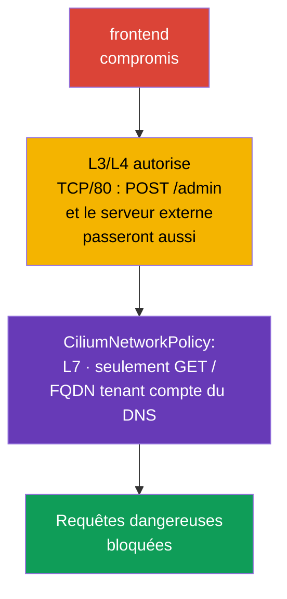

[Русская версия](ru.md) · [Eng version](README.md) · [Versión en español](es.md) · [Deutsche Version](de.md) · [ქართული ვერსია](ge.md) · [繁體中文版](tw.md) · [日本語版](jp.md)

# Chapitre 06. Cilium NetworkPolicy

> **Problème.** Un frontend compromis peut utiliser son accès TCP autorisé
> au backend pour `POST /admin` ou envoyer des données vers une IP externe après une résolution DNS :
> une NetworkPolicy L3/L4 ne fait pas cette distinction. Sans restrictions L7,
> FQDN et tenant compte de l'identity, une connexion autorisée devient un canal pour une requête
> dangereuse ou une exfiltration, et le manque d'observabilité complique la détection des DROP et l'investigation.

> **Suite.** Les NetworkPolicy natives permettent déjà d'isoler les Pod et de fermer
> l'accès aux services de metadata. Mais, dans certains scénarios, cela ne suffit pas : il faut autoriser
> une méthode HTTP précise, prendre en compte les noms DNS de services externes, distinguer le trafic vers le cluster
> du trafic vers Internet et voir la cause de chaque DROP (le paquet est abandonné sans réponse
> à l'expéditeur). **CiliumNetworkPolicy** étend
> les capacités de base des politiques réseau de Cilium avec le filtrage L7, les règles FQDN, les identities et
> l'observabilité. Ce chapitre approfondit la compétence CKS Cluster Setup « Use Network security
> policies to restrict cluster level access » et sert de base au lab 102.
>
> Le programme public CKS n'exige pas spécifiquement CiliumNetworkPolicy, `toFQDNs` ou Hubble dans
> chaque environnement d'examen ; considérez donc les commandes et CRD spécifiques à Cilium comme
> un approfondissement pour les clusters où Cilium est effectivement fourni.

> **Cilium n'apparaît pas de lui-même dans un cluster.** C'est un CNI distinct, que
> l'administrateur du cluster installe - avec le CLI `cilium` ou un Helm chart, sur un cluster
> déjà créé ou à la place du CNI par défaut pendant sa création. Si Cilium n'est pas encore installé
> dans votre environnement, tous les exemples de ce chapitre ne s'appliquent pas avant son installation. Instruction
> officielle : [Cilium Quick Installation](https://docs.cilium.io/en/stable/gettingstarted/k8s-install-default/).
> Des exemples plus détaillés de règles L3/L4/L7 que ceux présentés dans ce chapitre figurent dans la
> section officielle [Overview of Network Policy](https://docs.cilium.io/en/stable/security/policy/),
> y compris des pages distinctes pour les politiques Layer 3, Layer 4 et Layer 7.

> **Pré-requis CKA.** Consultez le modèle de base du CNI, les adresses IP des Pod et des services dans le
> [chapitre 30 de CKA](../../../cka/course/30/fr.md), ainsi que le rôle du CNI et sa place dans la pile
> réseau dans le [chapitre 40 de CKA](../../../cka/course/40/fr.md). La syntaxe de base de Kubernetes
> NetworkPolicy est présentée au chapitre 04 de ce cours ; nous ne la répétons pas ici, mais utilisons
> les capacités de Cilium.

> 🧠 `kube-proxy` dirige `ClusterIP:port` vers le Pod sélectionné, tandis que le CNI applique séparément `NetworkPolicy`.

## 06.0. Ce qui est nouveau pour vous : eBPF datapath au lieu de kube-proxy

### Baseline sans Cilium : comment le trafic atteint actuellement un Service

Jusqu'à ce chapitre, `kube-proxy` assurait le chemin d'un paquet vers un Service. Le mécanisme comporte trois
parties :

- **Observation.** Sur chaque nœud, `kube-proxy` écoute les modifications des objets Service et
  `EndpointSlice`.
- **Programmation du noyau.** À chaque modification, il met à jour les règles du noyau - généralement avec
  `iptables` ou `nftables` (`ipvs`, devenu obsolète, reste également possible).
- **Interception et DNAT.** Une règle intercepte le trafic vers `ClusterIP:port` et effectue un DNAT vers l'IP
  d'un Pod précis, choisi aléatoirement ou selon l'affinité de session.

La `NetworkPolicy` du chapitre 04 est une couche distincte sur ce même modèle : de son côté, le CNI
lit l'objet `NetworkPolicy` et ajoute ses propres règles du noyau qui autorisent ou
bloquent le paquet **avant ou après** les règles kube-proxy, selon l'implémentation.

> 🧠 Cilium associe les labels des workload à une identity et applique les politiques L3/L4 au moyen de eBPF maps ; L7 exige un proxy path.

### Ce que Cilium change : eBPF comme principal datapath L3/L4

Cilium propose une autre architecture pour le même chemin de paquet :

- **eBPF comme principal datapath L3/L4.** Pour le pod networking, les politiques L3/L4 et
  kube-proxy-replacement, Cilium utilise des programmes eBPF et des BPF maps. Les programmes
  sont attachés à des hook points du noyau, par exemple aux interfaces réseau et aux cgroup.
- **Map lookup au lieu d'un parcours linéaire de `iptables`.** En kube-proxy-replacement, Cilium
  conserve l'état Service/backend dans des BPF maps et effectue une lookup sans parcourir séquentiellement
  une longue chaîne `iptables`. C'est une différence importante précisément par rapport à kube-proxy en mode `iptables`.
  Ne transposez pas cette comparaison à kube-proxy `nftables` : le mode nftables moderne utilise lui aussi
  un dispatch fondé sur des maps (`verdict map`) avec une lookup approximativement O(1) - voir les détails dans
  le blog officiel Kubernetes sur le mode nftables de kube-proxy.
- **Deux modes de fonctionnement.** Le **kube-proxy-replacement** complet réalise tout le Service load
  balancing dans eBPF et permet de supprimer `kube-proxy` du cluster. En mode de fonctionnement conjoint,
  `kube-proxy` continue de gérer les Service et Cilium ajoute à côté le policy
  enforcement et les capacités L7.

Les deux modes sont possibles en production, et l'examen CKS n'en exige aucun en particulier.

Il est important de distinguer les niveaux. Le forwarding L3/L4, le policy enforcement et le Service load balancing avec
kube-proxy-replacement dans Cilium sont principalement réalisés avec eBPF.

La politique L7 HTTP/DNS fonctionne différemment : le trafic sélectionné est redirigé vers un userspace
proxy local au nœud (Envoy ou DNS proxy). Dans les versions stable actuelles de Cilium, une telle proxy redirection peut
également utiliser netfilter/`iptables` TPROXY. Il ne faut donc pas décrire Cilium comme un
datapath qui exclut complètement `iptables` et userspace pour toutes les fonctionnalités.

> 🎯 Utilisez la `NetworkPolicy` native pour les labels/CIDR et les ports L3/L4, CNP pour L7 HTTP/DNS, `toFQDNs`, `toEntities` et l'observabilité Cilium.

### Quand `NetworkPolicy` suffit et quand un CNP est nécessaire

De la différence entre les mécanismes découle un critère pratique de choix entre la
`NetworkPolicy` native et `CiliumNetworkPolicy` (CNP) :

- **Commencez par la `NetworkPolicy` native.** Si la tâche consiste à autoriser ou interdire le trafic
  entre des Pod par labels, namespace, CIDR et port TCP/UDP/SCTP, cela suffit. La politique est
  portable entre les clusters et les CNI ; passer à CNP sans raison complique donc la migration
  et la maintenance.
- **Passez à CNP lorsqu'un contrôle est nécessaire à l'intérieur d'une connexion L3/L4 déjà autorisée.**
  Les déclencheurs typiques sont : limiter une méthode ou un chemin HTTP précis (L7), autoriser ou
  interdire des noms DNS externes précis (`toFQDNs`), décrire explicitement le trafic vers `world`,
  `cluster` ou `host` (`toEntities`), ou obtenir l'observabilité Hubble pour l'investigation d'un
  `DROP`.
- **Les deux modèles peuvent être combinés.** La `NetworkPolicy` native reste un contrôle L3/L4 portable,
  tandis que CNP apporte une granularité plus fine là où L3/L4 ne suffit plus.
  Les détails du calcul conjoint des allow/deny sont présentés plus loin dans ce chapitre.

> 🧠 CNP ajoute labels, L7 et FQDN à la `NetworkPolicy` native ; un Cilium deny explicite a priorité sur allow.

## 06.1. Pourquoi une politique Cilium est nécessaire

La `NetworkPolicy` native décrit les relations réseau aux niveaux L3/L4 : quels Pod,
CIDR et ports peuvent échanger du trafic TCP/UDP. Elle ne connaît intentionnellement ni les chemins HTTP,
ni les noms DNS, ni le contexte de la connexion. Cilium met en œuvre la politique réseau dans eBPF et ajoute
des identities de workload, un proxy L7 et l'observabilité.

Scénario d'attaque : le frontend est compromis par une vulnérabilité de l'application. Une politique ordinaire
peut lui autoriser TCP/80 vers le backend, et l'attaquant obtient donc le même accès. Si le
backend n'accepte que `GET /`, alors `POST /admin` ou `DELETE /data` ne doivent pas passer
même avec une connexion TCP autorisée. Un autre scénario fréquent est celui d'un pod qui se connecte à une IP externe
arbitraire après une résolution DNS et envoie des données à l'attaquant.



Cilium évalue la politique par identity, et non uniquement par IP. Pour les workloads Kubernetes,
l'identity est construite à partir des labels. Lorsqu'un Pod est recréé, son IP change, mais la règle avec
`endpointSelector` continue de fonctionner si les labels restent les mêmes.

| Capacité | `NetworkPolicy` native | `CiliumNetworkPolicy` |
|---|---|---|
| L3 : pod/CIDR | oui | oui, labels et identities |
| L4 : port TCP/UDP/SCTP | oui | oui |
| L7 : HTTP, DNS | non | oui |
| Règles par FQDN | non | oui, `toFQDNs` |
| `world` / `cluster` / `host` | non | oui, `toEntities` |
| Observabilité des flux | dépend du CNI | Hubble et CLI `cilium` |

`CiliumNetworkPolicy` (CNP) agit dans le namespace de son objet. Elle convient aux
politiques d'une équipe ou d'une application. `CiliumClusterwideNetworkPolicy` (CCNP) agit sur tout le
cluster et est pratique pour des règles communes de plateforme, par exemple l'interdiction d'un egress dangereux dans tous les
namespace. CCNP a des conséquences plus fortes : une erreur dans un selector large peut couper tout le
cluster ; testez donc d'abord la règle dans un namespace distinct et utilisez des labels étroits.

### Fonctionnement conjoint avec la `NetworkPolicy` native

La `NetworkPolicy` du [chapitre 04](../04/fr.md) et CNP/CCNP peuvent sélectionner simultanément un même
endpoint. Leurs règles allow sont prises en compte ensemble, mais un Cilium `ingressDeny`/`egressDeny` explicite
a priorité sur **toutes** les règles allow : issues de CNP, CCNP et de la Kubernetes
`NetworkPolicy` native. Un allow provenant d'une `NetworkPolicy` ordinaire ne peut donc pas contourner un Cilium deny.
En cas de `DROP` inattendu, inventoriez tous ces objets, leurs selectors et leurs directions, plutôt que de
chercher l'erreur seulement dans la dernière CNP appliquée. La politique native reste un contrôle L3/L4
portable ; Cilium la complète avec L7, FQDN, entities et observabilité.

> **Avancé : Kubernetes `ClusterNetworkPolicy`.** Dans les versions modernes de Cilium, Kubernetes `ClusterNetworkPolicy` (KCNP,
> `v1alpha2`) peut s'appliquer en plus de `NetworkPolicy`, CNP et CCNP. Son modèle de tiers sépare `Admin`,
> `NetworkPolicy` et `Baseline` ; les règles du tier `Admin` ont priorité sur CNP, CCNP et la
> `NetworkPolicy` ordinaire. Cela est utile pour des frontières à l'échelle de la plateforme, mais ce n'est pas un sujet CKS distinct obligatoire : avant de l'utiliser,
> vérifiez que les API correspondantes et leur prise en charge sont activées dans votre cluster Cilium.

> 🎯 Dans CNP, `endpointSelector` sélectionne les Pod, `fromEndpoints`/`toEndpoints` - l'identity, `toPorts` - le protocole et le port ; ingress et egress créent default-deny indépendamment.

## 06.2. L3/L4 : autoriser uniquement le workload et le port nécessaires

Une politique devient applicable à un endpoint lorsque `endpointSelector` le sélectionne. En
`policyEnforcementMode: default`, Cilium active enforcement lorsqu'un endpoint est sélectionné par une
politique ; `always` l'active pour tous les endpoints (un endpoint sans règle allow reçoit une
interdiction), tandis que `never` désactive enforcement. Par défaut, la allow-list agit
**indépendamment pour chaque direction** : la présence de `ingress` rend ingress default-deny jusqu'à
correspondance avec une règle allow, et la présence de `egress` rend aussi default-deny uniquement pour egress.
Une politique avec seulement `ingress` ne ferme pas egress, et inversement. Le selector doit donc être
précis.

Ce comportement peut être modifié avec `enableDefaultDeny` : une direction pour laquelle la valeur
est `false` n'est pas prise en compte lors du passage d'un endpoint en default-deny. Ainsi,
l'administrateur peut appliquer sans risque une cluster-wide policy - par exemple l'interception DNS -
sans risquer de mettre l'endpoint en default-deny et de bloquer le trafic légitime. Cette exception
ne doit pas être transposée à une politique L7 : `enableDefaultDeny` ne s'applique pas aux règles layer-7,
et l'ajout d'une règle L7 sans L7 allow-all correspondant provoquera un DROP même si default-deny est
explicitement désactivé.

Cilium suit l'état de la connexion : l'autorisation d'un flux ingress ou egress initiateur permet le
**trafic de réponse de cette même connexion**, mais n'autorise pas une nouvelle connexion dans la direction inverse.
Ne dupliquez donc pas mécaniquement la règle pour la réponse, mais décrivez explicitement un rappel inverse autonome
s'il est nécessaire à l'application.

Le backend ci-dessous, avec le label `app: backend`, n'accepte que TCP/80 depuis le frontend ayant le label
`app: frontend` dans le même namespace `cks-102`. `fromEndpoints` est une restriction L3 par identity,
`toPorts` est une restriction L4 par protocole et port.

```yaml
apiVersion: cilium.io/v2
kind: CiliumNetworkPolicy
metadata:
  name: backend-from-frontend-http
  namespace: cks-102
spec:
  endpointSelector:
    matchLabels:
      app: backend
  ingress:
  - fromEndpoints:
    - matchLabels:
        app: frontend
    toPorts:
    - ports:
      - port: "80"
        protocol: TCP
```

Appliquez le manifeste et vérifiez l'objet avant de considérer la politique comme fonctionnelle :

```bash
kubectl apply -f backend-l3-l4.yaml
kubectl -n cks-102 get ciliumnetworkpolicy
kubectl -n cks-102 describe ciliumnetworkpolicy backend-from-frontend-http

# Vérifiez d'abord les labels à partir desquels Cilium construit l'identity.
kubectl -n cks-102 get pod --show-labels
```

Pour le trafic inter-namespace, ajoutez le label du namespace à `matchLabels`. Cilium ajoute automatiquement
les labels Kubernetes avec le préfixe `k8s:` ; le namespace est généralement représenté par le label
`k8s:io.kubernetes.pod.namespace`.

```yaml
  ingress:
  - fromEndpoints:
    - matchLabels:
        k8s:io.kubernetes.pod.namespace: storefront
        app: frontend
    toPorts:
    - ports:
      - port: "8080"
        protocol: TCP
```

Ne remplacez pas l'identity par une règle avec un `toCIDR` arbitraire si le destinataire est un pod. Un CIDR ne
suit pas la recréation du workload et peut inclure des IP étrangères. `toCIDR` se justifie pour
des réseaux externes stables ou des plages de service étroites, et non comme façon habituelle de relier
deux services Kubernetes.

> 🔬 Active FTP utilise un port de retour dynamique qu'une CNP L3/L4 statique ne peut exprimer ; un protocol-aware gateway ou passive FTP avec une plage fixe sont nécessaires.

### Cas limite : active FTP ne peut pas être exprimé avec L3/L4

Active FTP montre la limite de la politique L3/L4. Le client ouvre une connexion control sur TCP/21
et communique au serveur son port pour la connexion data ; le **serveur initie ensuite lui-même une nouvelle
connexion TCP de retour vers le client** sur ce port. Le port est inconnu à l'avance et négocié
dynamiquement dans la session ; une règle statique `toPorts`/`fromEndpoints` ne peut donc pas
décrire « autoriser une connexion entrante vers le port dont les parties conviendront plus tard ».

Avant Kubernetes et Cilium, ce problème était résolu par le **connection tracking au niveau du noyau** : le module
`nf_conntrack_ftp` analyse le canal control, voit le port négocié et ajoute dynamiquement la connexion
related comme autorisée. Les règles `iptables`/`nftables` de `kube-proxy` ne résolvent pas elles-mêmes cette tâche -
elle est résolue par un conntrack helper distinct au-dessus de netfilter, et non par le mécanisme forwarding
Service lui-même.

Pour les protocoles dotés d'une sémantique application-level prise en charge, Cilium peut utiliser un
proxy L7, mais FTP n'en fait pas partie.

La CiliumNetworkPolicy standard ne fournit ni FTP-aware helper ni FTP L7 parser intégré. Cilium ne peut donc pas
déterminer automatiquement, à partir du canal FTP control, le port negotiated de la connexion data en mode active
et créer pour elle une autorisation de politique temporaire.

Dans un environnement Kubernetes, il est préférable d'utiliser **passive FTP** avec une plage limitée à l'avance de
ports data : le trafic control sur TCP/21 et le trafic data sur une plage fixe peuvent alors être
exprimés avec des règles de politique L3/L4 ordinaires (`endPort`).

Si une application legacy doit impérativement utiliser active FTP avec des ports négociés dynamiquement, il s'agit
d'un problème de gateway/proxy protocol-aware distinct ou d'une couche réseau conçue spécialement,
et non d'une CNP standard.

Parmi les règles application-level intégrées du Cilium moderne, concentrez-vous sur HTTP et DNS.
gRPC est filtré avec la sémantique HTTP/2 par `rules.http` ; il n'existe pas de type de règle gRPC distinct.
La politique réseau tenant compte de Kafka a été supprimée dans Cilium 1.20.

> 🎯 Dans `toPorts.rules.http`, n'autorisez que les method et path nécessaires et vérifiez la requête autorisée comme celle qui est interdite.

## 06.3. L7 : limiter HTTP et DNS

Une règle L7 est ajoutée à l'intérieur d'un élément `toPorts`. Cilium dirige le trafic sélectionné via le
proxy L7 correspondant : HTTP ou DNS. Conséquence importante : les règles L7 ne s'appliquent qu'à un
protocole correctement reconnu sur le port indiqué. Il ne faut pas attendre un filtrage HTTP si le
client parle TLS sur un port sans TLS termination configurée : le proxy ne voit pas le plaintext HTTP.

La règle suivante n'autorise au frontend que `GET /` vers le backend. L'expression régulière du chemin
`^/$` est volontairement étroite : `/healthz`, `/api` et tout `POST` ne correspondront pas et seront interdits.

```yaml
apiVersion: cilium.io/v2
kind: CiliumNetworkPolicy
metadata:
  name: backend-read-only
  namespace: cks-102
spec:
  endpointSelector:
    matchLabels:
      app: backend
  ingress:
  - fromEndpoints:
    - matchLabels:
        app: frontend
    toPorts:
    - ports:
      - port: "80"
        protocol: TCP
      rules:
        http:
        - method: "GET"
          path: "^/$"
```

Vérifiez non seulement une requête réussie, mais aussi l'interdiction. L'image du Pod de test doit contenir
`curl` ou un autre client HTTP :

```bash
kubectl -n cks-102 exec deploy/frontend -- curl -i http://backend/
kubectl -n cks-102 exec deploy/frontend -- \
  curl -i -X POST http://backend/

# Attendu : GET renvoie 200 ; le proxy Cilium rejette une requête L7 qui ne correspond pas, généralement avec 403.
```

Pour une API, il est plus sûr d'énumérer les méthodes, chemins et, si nécessaire, headers autorisés que de
faire un `path: ".*"` large. Une politique L7 ne remplace pas l'authentification ni l'autorisation de l'application :
elle réduit la surface accessible, mais ne connaît ni l'utilisateur ni les règles métier de l'API.

Cilium sait aussi filtrer DNS par nom de requête. N'activez pas de proxy L7 sans nécessité : il
ajoute un traitement au chemin du trafic et nécessite ses propres tests de charge.

> 🔬 gRPC est filtré comme HTTP/2 par `POST` et le chemin de méthode.

### gRPC : filtrage par HTTP, avec une particularité d'équilibrage

Cilium ne possède pas de « parser gRPC » distinct. gRPC fonctionne sur HTTP/2, et chaque appel de méthode
est encodé comme une requête HTTP ordinaire : `POST` vers un chemin tel que `/Package.Service/Méthode`. Le
filtrage L7 de gRPC est donc la même règle HTTP `path` que celle vue ci-dessus,
seule la regex ou le chemin exact décrit `/cloudcity.DoorManager/GetName` au lieu de `/`.

Par exemple, la règle ci-dessous autorise `public-terminal` à appeler sur `cc-door-mgr` uniquement la lecture
de l'état, et non la modification du code d'accès :

```yaml
apiVersion: cilium.io/v2
kind: CiliumNetworkPolicy
metadata:
  name: door-read-only-grpc
spec:
  endpointSelector:
    matchLabels:
      app: cc-door-mgr
  ingress:
  - fromEndpoints:
    - matchLabels:
        app: public-terminal
    toPorts:
    - ports:
      - port: "50051"
        protocol: TCP
      rules:
        http:
        - method: "POST"
          path: "/cloudcity.DoorManager/GetName"
        - method: "POST"
          path: "/cloudcity.DoorManager/GetLocation"
```

L'appel `SetAccessCode` ne correspondra à aucune règle et sera rejeté - le client recevra le statut
gRPC `PERMISSION_DENIED`, et non un timeout réseau ordinaire. Un exemple détaillé pas à pas avec
une application de démonstration est disponible dans la documentation officielle : [Securing gRPC](https://docs.cilium.io/en/stable/security/grpc/).

Un problème distinct survient avec l'équilibrage lorsque Cilium **remplace entièrement
kube-proxy** (`kube-proxy-replacement`). gRPC maintient une connexion TCP longue durée et y fait
passer de nombreux appels successifs. L'équilibrage eBPF ordinaire de Cilium choisit un Pod
**une seule fois à l'établissement de la connexion**, et non pour chaque appel individuel qui la traverse. Si le
client ouvre une connexion et la conserve longtemps, tout son trafic partira vers le même Pod, et les
autres répliques backend ne recevront pas leur part de charge - on parle de pinning de connexion.

La solution consiste à activer dans Cilium **Proxy Load Balancing** pour le Service concerné : le trafic
est envoyé via l'Envoy intégré, qui peut regarder à l'intérieur du flux HTTP/2 et
répartir les appels gRPC individuels entre les Pod, et non toute la connexion. Sans ce
paramètre, il faut vérifier séparément l'uniformité de la charge entre les répliques pour les clients gRPC longue durée dans un cluster sans kube-proxy.

Cela s'active avec une seule annotation sur l'objet Service, sans modifier le manifeste du workload :

```bash
kubectl annotate service payment-grpc-service \
  service.cilium.io/lb-l7=enabled
```

Après cela, le trafic vers `payment-grpc-service` passe par un Envoy géré par Cilium, qui
répartit les appels individuels entre les Pod au lieu de pinner toute la connexion TCP à un seul backend.
L'algorithme d'équilibrage peut être précisé avec l'annotation distincte
`service.cilium.io/lb-l7-algorithm` (`round_robin`, `least_request` ou `random`). Cette fonctionnalité
est au statut **beta** ; avant de l'activer en production, vérifiez son comportement dans
votre version de Cilium. Un exemple pas à pas avec l'observation du trafic via Hubble figure dans la
documentation officielle : [Proxy Load Balancing for Kubernetes Services](https://docs.cilium.io/en/stable/network/servicemesh/envoy-load-balancing/).

**Où se trouve physiquement Envoy.** Ce n'est pas un sidecar dans chaque Pod. Envoy fait partie de l'image
Cilium et s'exécute **une seule fois sur chaque nœud** : soit comme processus dans `cilium-agent`, soit
comme DaemonSet `cilium-envoy` distinct, partagé par tous les Pod de ce nœud. Dans les
scénarios examinés ci-dessus, le trafic redirigé par une politique L7 ou
proxy load balancing (`lb-l7`) le traverse. Cette liste n'est pas exhaustive : Cilium Ingress, Gateway API et
`CiliumEnvoyConfig` dirigent également le trafic par le même Envoy par nœud. Le trafic Pod-to-Pod ordinaire
L3/L4, pour lequel aucune de ces fonctionnalités fondées sur un proxy n'est activée, reste sur le
eBPF datapath sans passer par userspace.

**Comment cela affecte la latence et les paramètres de connexion.** Chaque paquet redirigé
effectue une transition supplémentaire via le processus userspace Envoy sur le même nœud, et non via le
réseau vers un autre nœud ou Pod. Cela ajoute :

- **Un léger surcroît de latence** à chaque requête - passage du noyau à userspace et
  retour, plus l'analyse du protocole (HTTP/gRPC). Il est généralement faible pour un
  hop local, mais pas nul, et doit être mesuré sous une charge réelle avant activation.
- **Une consommation supplémentaire de CPU et de mémoire sur le nœud** - Envoy traite le trafic comme
  processus distinct ; la charge sur le nœud augmente donc proportionnellement pour un grand volume de
  trafic L7.
- **L'adresse source dépend du proxy path et de la configuration.** Le seul fait de passer par
  Envoy ne signifie pas que le backend verra nécessairement l'IP source du proxy lui-même. Pour le L7 policy
  enforcement, Cilium utilise par défaut l'original source address ; `CiliumEnvoyConfig`, Ingress et Gateway API ont
  des paramètres et règles distincts de source visibility. Il faut donc vérifier l'IP/le port source visibles par le backend pour le mode
  précis, et ne pas les déduire du seul fait d'utiliser Envoy.
- **Le surcoût ne s'applique qu'au trafic sélectionné** - les connexions L3/L4 ordinaires sans
  règles L7 ni annotation `lb-l7` ne paient pas ce coût : elles restent sur le chemin eBPF
  rapide sans Envoy.

> **Actualité.** Le filtrage L7 Kafka de Cilium est deprecated depuis la version 1.18 et a été supprimé
> dans la version 1.20. Pour CKS, concentrez-vous sur L7 HTTP et DNS/`toFQDNs`, et
> considérez la politique Kafka seulement comme un exemple historique, et non une pratique actuelle.

> 🎯 Autorisez UDP/TCP 53 vers un CoreDNS de confiance et limitez l'accès externe avec `toFQDNs` ; Cilium utilise les réponses DNS observées et le cache FQDN.

## 06.4. Egress DNS-aware et `toFQDNs`

Les IP d'un service SaaS public changent, un CDN fournit des adresses différentes, et l'application connaît généralement
non pas une IP, mais un nom. `toFQDNs` autorise l'egress vers des noms en les faisant correspondre aux IP que le DNS proxy
Cilium a vues dans les réponses DNS autorisées ; ce n'est pas une résolution DNS statique au moment de l'application du
YAML. Le proxy remplit le cache FQDN en tenant compte du TTL, puis autorise la connexion vers une IP de ce
cache. Dirigez donc la résolution DNS uniquement vers un DNS de cluster de confiance (par exemple CoreDNS),
sélectionné par un selector précis : Cilium n'interroge pas DNS lui-même et ne doit pas faire
confiance à un nameserver arbitraire.

La politique ci-dessous autorise les requêtes DNS du frontend vers CoreDNS, et HTTPS uniquement vers
`example.com`. `rules.dns` autorise la DNS query, tandis que `toFQDNs` autorise la connexion suivante
vers l'IP renvoyée pour le nom autorisé.

```yaml
apiVersion: cilium.io/v2
kind: CiliumNetworkPolicy
metadata:
  name: frontend-external-api-only
  namespace: cks-102
spec:
  endpointSelector:
    matchLabels:
      app: frontend
  egress:
  - toEndpoints:
    - matchLabels:
        k8s:io.kubernetes.pod.namespace: kube-system
        k8s:k8s-app: kube-dns
    toPorts:
    - ports:
      - port: "53"
        protocol: UDP
      - port: "53"
        protocol: TCP
      rules:
        dns:
        - matchPattern: "*"
  - toFQDNs:
    - matchName: "example.com"
    toPorts:
    - ports:
      - port: "443"
        protocol: TCP
```

`matchName` sélectionne exactement un nom. Pour un ensemble contrôlé de sous-domaines, utilisez
`matchPattern`, par exemple `"*.example.com"` : ce wildcard ne doit pas être considéré comme l'autorisation
du nom apex `example.com`. Si vous avez besoin à la fois de `example.com` et de ses sous-domaines, exprimez-les
par des règles distinctes. N'utilisez pas `"*"` sans nécessité explicite : dans `toFQDNs`, un tel
pattern supprime la restriction par nom DNS et autorise les destinations obtenues depuis le cache DNS
pour tous les noms correspondants ; les autres conditions de la même règle, par exemple `toPorts`,
continuent de s'appliquer. Avant l'application, vérifiez les labels réels de CoreDNS dans votre
cluster - certaines installations utilisent un label différent à la place de `k8s-app: kube-dns`.

```bash
kubectl -n kube-system get pod --show-labels | grep -E 'coredns|dns'
```

L'exemple suivant est une vérification manuelle illustrative, non un acceptance
test déterministe. IANA indique explicitement que le service HTTP des domaines de documentation (`example.com`,
`example.org`, etc.) est fourni au mieux et n'est pas destiné à servir d'endpoint de test pour un
software : https://www.iana.org/news/2024/example-domain-http-methods.
Si `example.com`/`www.google.com` sont indisponibles dans votre environnement (restrictions réseau,
défaillance temporaire, blocage sur un réseau donné), cela ne signifie pas une erreur de politique - remplacez-les
par un FQDN pour lequel vous avez confirmé indépendamment, avant d'appliquer la politique, la résolution DNS
et le bon fonctionnement de HTTPS.

```bash
kubectl -n cks-102 exec deploy/frontend -- \
  curl -I --max-time 5 https://example.com
kubectl -n cks-102 exec deploy/frontend -- \
  curl -I --max-time 5 https://www.google.com
```

Avant d'appliquer la politique, confirmez que les deux requêtes ci-dessus passent sans restrictions.
Appliquez seulement ensuite `toFQDNs` et comparez : `example.com:443` doit passer, tandis que
`www.google.com:443` doit être bloqué précisément par la politique, et non par une indisponibilité accidentelle
du service externe.

`toFQDNs` n'est pas un DLP complet ni une vérification de HTTP `Host` : c'est un contrôle de l'accès
réseau par résolution DNS observée. DoH/DoT cachent la requête DNS au DNS proxy et ne remplissent pas eux-mêmes
le cache FQDN. Une connexion directe à une IP ne crée pas non plus de correspondance FQDN ; elle ne
fonctionnera que si cette IP est déjà dans le cache après une réponse DNS autorisée ou si une règle L3/L4
plus large l'autorise. N'autorisez pas de serveurs DNS non autorisés, DoH/DoT ou une IP directe si cela est essentiel
pour le modèle de menace : limitez l'egress au DNS de confiance, activez la DNS visibility nécessaire et combinez
les règles avec un proxy/firewall à la frontière du réseau.

> 🔬 `world`, `cluster`, `host` et CCNP pour les frontières platform-wide ; testez un scope étroit et tenez compte du host firewall et du trafic système.

## 06.5. Entities et politique à l'échelle du cluster

Les entities fournissent des identifiants lisibles pour des groupes d'adresses auxquels les labels Kubernetes ne
conviennent pas. Les valeurs les plus utiles sont les suivantes :

| Entity | Ce qu'elle comprend | Cas typique |
|---|---|---|
| `world` | adresses hors du cluster | autoriser la sortie vers une API externe ou l'entrée depuis l'extérieur |
| `cluster` | endpoints dans le cluster | séparer le trafic interne au cluster de celui vers Internet |
| `host` | endpoint host local du nœud | contrôler explicitement l'accès au nœud |
| `remote-node` | autres nœuds du cluster | autoriser les interactions nécessaires entre nœuds |
| `kube-apiserver` | Kubernetes API server | limiter l'accès des workloads à l'API |

Par exemple, un service qui ne doit accepter HTTPS que depuis Internet peut être sélectionné par un
label et son ingress limité à l'entity `world` :

```yaml
apiVersion: cilium.io/v2
kind: CiliumNetworkPolicy
metadata:
  name: public-gateway-from-world
  namespace: cks-102
spec:
  endpointSelector:
    matchLabels:
      app: public-gateway
  ingress:
  - fromEntities:
    - world
    toPorts:
    - ports:
      - port: "443"
        protocol: TCP
```

Pour la protection de la plateforme, on utilise CCNP. L'exemple ci-dessous interdit l'egress vers l'IP metadata à tous les
endpoints sélectionnés par la politique, mais conserve le reste de l'egress : une politique `egress` applicable
active elle-même egress default-deny, donc l'allow explicite `toEntities: [all]` est ici nécessaire.
`egressDeny` a priorité sur tout allow, y compris cet allow-all et les règles d'autres
CNP/CCNP ; l'IP metadata ne pourra donc pas être ouverte par accident. Évaluez d'abord si les
appels metadata sont nécessaires aux workloads système et, au besoin, excluez-les avec un
selector ou namespace distinct.

```yaml
apiVersion: cilium.io/v2
kind: CiliumClusterwideNetworkPolicy
metadata:
  name: deny-cloud-metadata
spec:
  endpointSelector: {}
  egress:
  - toEntities:
    - all
  egressDeny:
  - toCIDR:
    - 169.254.169.254/32
```

Ne considérez pas `host` comme un objet inoffensif. `toEntities: host` contrôle l'accès réseau
au nœud local et aux workloads host-networked et peut donc ouvrir un chemin vers kubelet ou
d'autres listener TCP/UDP sur le host. Le runtime CRI socket est un mécanisme distinct : par exemple,
containerd est habituellement accessible via le Unix domain socket
`/var/run/containerd/containerd.sock`, et son exposition dépend des filesystem
mounts/`hostPath` et des privilèges du Pod, et non de `toEntities: host` à lui seul. La restriction
du trafic host exige de comprendre le host firewall Cilium, le mode `hostFirewall.enabled` et le
trafic control plane ; testez-la dans un cluster de test pour ne pas perdre l'accès aux
nœuds ou à l'API server. Limitez séparément l'accès au runtime socket avec les mount/privilege
controls.

## 06.6. Observabilité et vérification avec Hubble

### Qu'est-ce que Hubble et quel problème résout-il

Une `NetworkPolicy` ou une `CiliumNetworkPolicy` ordinaire répond à la question « qu'est-ce qui est autorisé ».
Elle ne répond pas à la question « qu'est-il réellement arrivé » : pourquoi une requête précise n'est pas
passée, à quelle règle correspond le DROP, si le TCP-connect est visible au client ou si le refus
s'est déjà produit au L7. Sans un tel outil, l'enquête se résume à relire le YAML
et à faire des suppositions.

**Hubble** est le composant d'observabilité de Cilium. Il lit les mêmes événements eBPF que le
datapath collecte déjà et les transforme en un flux lisible de flow events : source/destination
identity, contexte L4/L7, verdict (`FORWARDED`/`DROPPED`) et motif du refus. Il ne remplace pas le
Kubernetes audit log et ne lit pas le contenu de la requête à votre place : il montre ce que Cilium a décidé
de faire avec une connexion précise et pourquoi.

> 🔬 L'architecture Hubble Server/Relay/UI, le CLI et les composants dépendent de la version et de la méthode d'installation de Cilium.

Du point de vue de l'architecture, Hubble se compose de quatre parties :

- **Hubble Server** est intégré à `cilium-agent` et s'exécute sur chaque nœud ; il expose les flow
  events via gRPC.
- **Hubble Relay** (`hubble-relay`) est un composant distinct qui se connecte au Server
  sur tous les nœuds et donne une vue unifiée du cluster plutôt qu'une vue nœud par nœud.
- **Hubble CLI** (`hubble`) est le client en ligne de commande ; il se connecte soit au Relay pour
  une vue du cluster, soit au Server local d'un seul nœud.
- **Hubble UI** (`hubble-ui`) est une interface graphique facultative au-dessus du Relay avec une carte
  des connexions entre services.

**Comment l'activer.** Dans les distributions managed et les installations Cilium standard, Hubble est
habituellement activé par un flag Helm lors de l'installation ou de la mise à jour, par exemple
`--set hubble.relay.enabled=true --set hubble.ui.enabled=true` ; le flag exact dépend de la
version du chart. Pour CKS et ce chapitre, il suffit de savoir une chose : si Hubble est déjà activé dans le
cluster, `cilium status` affiche son état, et le CLI `hubble` peut être connecté au Relay via
port-forward, comme indiqué ci-dessous. Il n'est pas nécessaire d'activer Hubble depuis zéro pour la lab -
c'est le travail de l'administrateur du cluster, et non une partie des CNP que vous appliquez.

> 🎯 Générez le trafic attendu, autorisé et interdit, puis observez les Hubble flows avec un filtre namespace, verdict ou protocol.

Avant le test, assurez-vous que les agents Cilium sont sains. Les commandes sont habituellement exécutées sur une
machine de travail disposant du CLI `cilium` ; la méthode précise d'activation de Hubble dépend de l'installation Cilium.

`hubble` est un binaire distinct, et non une partie du CLI `cilium`. Il doit être installé une fois
sur la machine de travail en téléchargeant la release requise depuis GitHub ; les étapes par plateforme figurent dans la
documentation officielle [Install the Hubble Client](https://docs.cilium.io/en/stable/observability/hubble/setup/#install-the-hubble-client).
Après l'installation, vérifiez le binaire avec la commande `hubble help`.

```bash
cilium status --wait
cilium connectivity test

# Si Hubble relay est activé, le CLI créera une connexion locale vers lui.
cilium hubble port-forward &
hubble status

# Trafic et refus uniquement depuis le namespace de formation.
hubble observe --namespace cks-102 --verdict DROPPED
hubble observe --namespace cks-102 --protocol http
```

La séquence de vérification L3/L4, L7 et FQDN de la lab 102 doit être reproductible :

1. Assurez-vous que `frontend` et `backend` sont Running et que leurs labels correspondent aux selectors.
2. Appliquez la CNP L3/L4. Depuis frontend, la requête vers backend:80 doit passer ; depuis un Pod sans
   `app: frontend`, elle doit obtenir un timeout ou un DROP.
3. Remplacez ou complétez la règle L7 CNP. `GET /` doit renvoyer `200`, et `POST /` doit
   recevoir un refus du proxy (généralement `403`).
4. Appliquez la policy DNS/FQDN. Vérifiez la résolution et HTTPS vers le nom autorisé, puis
   essayez d'accéder à un nom non autorisé.
5. Dans un terminal distinct, observez Hubble et conservez le flow du trafic autorisé et interdit
   comme preuve du résultat.

Pour le diagnostic, le CLI de l'agent et l'objet Kubernetes sont également utiles :

```bash
kubectl -n cks-102 get ciliumnetworkpolicy -o yaml
kubectl -n kube-system get pods -l k8s-app=cilium

# Exécuté dans le Pod cilium du nœud sélectionné.
kubectl -n kube-system exec ds/cilium -- cilium-dbg endpoint list
kubectl -n kube-system exec ds/cilium -- cilium-dbg policy get
```

Si `hubble observe` est vide, vérifiez d'abord `hubble status`, la présence de Hubble Relay,
le contexte kubeconfig et les filtres namespace/verdict. Si DNS a cessé de fonctionner après default-deny,
c'est presque toujours l'absence d'autorisation UDP/TCP 53 vers les endpoints CoreDNS réels.
Si une règle L7 ne correspond pas comme prévu, vérifiez le port, le protocol, la HTTP method, l'expression
régulière path et TLS : HTTP chiffré sans configuration appropriée n'est pas visible par le L7-proxy.

> 🎯 Vérifiez labels/selectors, direction, ports et DNS, puis comparez le flow autorisé et interdit dans Hubble ; déployez à partir d'un allow étroit avec rollback.

## 06.7. Erreurs fréquentes et ordre de déploiement sûr

| Symptôme | Cause probable | À vérifier |
|---|---|---|
| Les noms ne se résolvent plus après la politique | DNS non autorisé ou selector CoreDNS incorrect | labels CoreDNS, UDP et TCP 53, Hubble DROPPED |
| `GET` et `POST` sont tous les deux interdits | L'identity L3 ou le port L4 ne correspondent pas | labels de l'endpoint, port Service et targetPort |
| La règle L7 ne limite pas la requête | le trafic n'est pas reconnu comme HTTP ou une règle plus large existe | protocol, TLS, `cilium policy get`, Hubble HTTP flows |
| La policy FQDN ne donne pas accès au service | le nom ne correspond pas à la réponse DNS ou le cache IP n'est pas encore rempli | `hubble observe --protocol dns`, `matchName`, TTL |
| La CCNP a perturbé le trafic système | selector trop large ou endpoints système non pris en compte | scope de la politique, namespace/labels, rollout dans un namespace de test |
| Aucun événement dans Hubble | Hubble Relay/CLI ne sont pas connectés ou le filtre est trop étroit | `hubble status`, port-forward, retirer les filtres |

Le **Policy Audit Mode de Cilium** est utile lors de la préparation d'une politique L3/L4 : lorsqu'il est activé
pour le daemon (`--policy-audit-mode=true`) ou un endpoint sélectionné, il laisse passer le trafic
que la policy aurait autrement rejeté et enregistre le policy verdict correspondant. Dans ce
mode, ne cherchez pas ce trafic uniquement avec `--verdict DROPPED` : observez les policy verdicts :

```bash
hubble observe flows -t policy-verdict --namespace cks-102
```

Un flux correspondant à une future interdiction apparaîtra comme `AUDITED`, même si la connexion passe encore.
Après la désactivation de l'Audit Mode, le même test deviendra soit `DENIED`, si la règle l'interdit réellement,
soit restera `ALLOWED`, si une règle allow couvre le flux. Recueillez d'abord ces événements
avec Hubble, resserrez les règles allow, puis activez seulement ensuite enforcement.
Il s'agit d'un mode de diagnostic temporaire, et non d'une protection de production : les blocages n'y
sont pas appliqués ; pour une L7-policy, il ne remplace pas non plus la vérification HTTP/DNS réelle.

Ordre sûr : en staging, observez d'abord Hubble et conservez le baseline des flows réels ; au besoin,
utilisez brièvement le Policy Audit Mode, puis ajoutez un allow étroit et vérifiez-le depuis un Pod de test ;
activez seulement après cela deny ou élargissez le scope en production. Ne commencez pas avec
`endpointSelector: {}` dans une CCNP sur un cluster de production. Chaque changement nécessite un rollback :
`kubectl delete ciliumnetworkpolicy <name> -n <namespace>` ou un retour en arrière via GitOps, et non
une modification manuelle sans historique.

> 🏭 CNP rollout : review, staging, GitOps, baseline flows et séparation des responsables CCNP et des policy applicatives.

## 06.8. Comment l'appliquer en production

- **Les politiques sont conservées avec le workload.** Les CNP d'une application passent par code review,
  sont testées en staging et appliquées par un outil GitOps. L'équipe platform est séparément
  responsable des CCNP à large portée.
- **Les labels sont un contrat de sécurité.** Les équipes fixent des labels comme `app`, `component`,
  `tenant` et ne permettent pas au workload de modifier arbitrairement les labels importants pour la sécurité. Sinon,
  le selector de la politique peut commencer à sélectionner le mauvais endpoint.
- **L7 s'applique aux API de valeur.** N'autoriser que les HTTP methods/paths attendus réduit le
  risque de lateral movement, mais ne remplace ni OAuth, ni mTLS, ni l'autorisation de l'application.
- **L'egress est construit à partir du DNS et de la destination.** `toFQDNs` est utilisé pour des API externes connues,
  et non comme règle universelle. DNS, proxy et perimeter firewall restent des couches de defense
  in depth.
- **Hubble est activé avant l'incident.** Les dashboards sur les flows `DROPPED` et la conservation des flow logs
  permettent de distinguer une erreur de politique d'une défaillance de l'application et d'enquêter plus vite sur un
  egress suspect.

## 06.9. Mini-glossaire

- **Cilium** est une plateforme CNI et de sécurité eBPF pour Kubernetes.
- **CiliumNetworkPolicy (CNP)** est une ressource de politique Cilium à l'échelle d'un namespace.
- **CiliumClusterwideNetworkPolicy (CCNP)** est une politique Cilium à l'échelle du cluster.
- **Identity** est l'identifiant d'un endpoint construit par Cilium à partir des labels.
- **L3/L4** est la couche réseau et le protocol/port de transport.
- **L7** est la couche de protocole, par exemple HTTP method/path ou DNS.
- **`toFQDNs`** est une règle egress fondée sur les noms DNS et les réponses DNS observées.
- **Entity** est un groupe d'adresses Cilium prédéfini, par exemple `world`, `cluster`, `host`.
- **Hubble** est l'observabilité des flows réseau Cilium.
- **eBPF** est le mécanisme du noyau Linux avec lequel Cilium met en œuvre le datapath et policy enforcement.

## 06.10. Résumé du chapitre

- Cilium complète la NetworkPolicy native avec des politiques L3/L4/L7, des identities, FQDN et
  l'observabilité Hubble.
- La CNP agit dans un namespace, la CCNP dans l'ensemble du cluster ; les CCNP à large portée exigent un
  rollout particulièrement prudent.
- `endpointSelector` sélectionne l'endpoint protégé, `fromEndpoints`/`toEndpoints` définissent
  L3, et `toPorts` définit L4.
- Les règles HTTP L7 permettent de n'autoriser que les méthodes et chemins nécessaires, mais ne remplacent pas
  l'authentification de l'application et exigent un protocole plaintext reconnaissable.
- `toFQDNs` limite l'egress externe par nom ; il faut autoriser séparément DNS
  et tenir compte du cache DNS, du TTL et des éventuels contournements.
- `toEntities` exprime l'accès à `world`, `cluster`, `host` et aux autres groupes système.
- Hubble montre les flows autorisés et interdits et est l'outil principal de
  vérification et de débogage de la politique.

## 06.11. Utilité pour l'examen et le travail réel

**À l'examen.** La compétence transférable d'appliquer des politiques de sécurité réseau est obligatoire : lire rapidement
les labels, choisir le namespace et la direction (`ingress`/`egress`), autoriser le
flux requis et prouver le résultat. **Si le cluster ou le fixture fourni utilise Cilium**,
vous devez aussi savoir créer une `CiliumNetworkPolicy` avec `endpointSelector`, au besoin
limiter HTTP ou `toFQDNs` et vérifier les flows avec la commande `hubble observe`. L7, FQDN et
Hubble sont un approfondissement Cilium-specific, et non une interface garantie par le programme public de
chaque exercice ; DNS doit de toute façon être autorisé par une règle distincte.

**Dans le travail réel.** La policy Cilium traduit les frontières architecturales en règles exécutables :
frontend ne reçoit pas un accès arbitraire au backend, un workload ne sort pas vers un Internet arbitraire,
et le flux vers l'API peut être réduit aux opérations nécessaires. Hubble rend ces frontières
vérifiables durant le rollout et l'enquête sur un incident.

## 06.12. Questions d'auto-évaluation

<details>
<summary>1. En quoi une CNP diffère-t-elle d'une `NetworkPolicy` native, en dehors du format de ressource ?</summary>

Une CNP utilise des identities Cilium construites à partir des labels et ajoute le filtrage L7 HTTP/DNS, `toFQDNs`, les entities (`world`, `cluster`, `host`) et l'observabilité Hubble. La NetworkPolicy native reste un control L3/L4 portable, et CNP/CCNP le complètent ; un deny Cilium explicite a priorité sur un allow des deux types de policy.
</details>

<details>
<summary>2. Qu'arrivera-t-il à l'endpoint ingress s'il est sélectionné par une CNP, mais que le trafic ne correspond à aucune règle allow ?</summary>

Dans `policyEnforcementMode: default`, l'endpoint devient isolé pour la direction décrite par la policy applicable. Si la CNP contient `ingress`, ingress agit comme default-deny jusqu'à la correspondance avec une règle allow ; de même, `egress` isole seulement le trafic sortant.
</details>

<details>
<summary>3. Comment exprimer dans une seule règle CNP « seulement frontend vers backend TCP/80 » ?</summary>

La CNP sélectionne backend avec `endpointSelector` et `app: backend`, puis utilise dans `ingress` `fromEndpoints` avec `app: frontend`. Dans `toPorts`, elle définit le port `"80"` et `protocol: TCP` ; pour une connexion inter-namespace, on ajoute `k8s:io.kubernetes.pod.namespace` aux `matchLabels` de la source.
</details>

<details>
<summary>4. Pourquoi autoriser TCP/80 ne limite-t-il toujours pas `POST /admin`, et comment le faire ?</summary>

Une règle L3/L4 autorise toute la connexion TCP sur le port 80 et ne distingue ni HTTP method ni path. À l'intérieur de `toPorts`, on ajoute `rules.http`, par exemple `method: "GET"` et le `path: "^/$"` étroit ; le L7-proxy Cilium rejette alors la requête qui ne correspond pas, généralement avec 403.
</details>

<details>
<summary>5. Comment fonctionnent `toFQDNs` et pourquoi faut-il autoriser DNS séparément avec ces règles ?</summary>

`toFQDNs` ne résout pas le nom lors de l'application du YAML : le DNS-proxy Cilium observe une réponse DNS autorisée, remplit le cache FQDN avec le TTL et autorise la connexion vers l'IP obtenue. Les Pod doivent donc être autorisés séparément à joindre un CoreDNS de confiance ; DoH/DoT ne remplissent pas ce cache et une IP directe ne crée pas de correspondance FQDN.
</details>

<details>
<summary>6. Quand les entities `world`, `cluster` et `host` sont-elles adaptées, et pourquoi `host` demande-t-il une prudence particulière ?</summary>

`world` désigne les adresses hors du cluster, `cluster` les endpoints en son sein, et `host` l'endpoint host local du nœud ainsi que les workloads host-networked. L'accès à `host` peut toucher kubelet et d'autres listener réseau du nœud, et exige donc une host-firewall policy prudente. Le runtime CRI socket est un autre attack path : il s'agit habituellement d'un Unix socket dans le filesystem du nœud, qui doit être protégé en limitant `hostPath`, les privilèges et les autres mécanismes d'accès au host filesystem.
</details>

<details>
<summary>7. Quelles commandes Hubble aident à prouver que Cilium a rejeté un flux interdit ?</summary>

Après `cilium status --wait` et la configuration de l'accès à Hubble, les refus peuvent être observés avec `hubble observe --namespace cks-102 --verdict DROPPED`. Pour mettre HTTP et DNS en correspondance, utilisez respectivement `hubble observe --namespace cks-102 --protocol http` et l'observation DNS ; en Policy Audit Mode, une future interdiction apparaît comme `AUDITED` via `hubble observe flows -t policy-verdict --namespace cks-102`.
</details>

<details>
<summary>8. Pourquoi est-il dangereux de commencer le déploiement d'une CCNP avec `endpointSelector: {}` dans un cluster de production ?</summary>

Une CCNP agit dans tout le cluster, et un selector vide choisit tous les endpoints ; une erreur de allow/deny peut donc couper le trafic système et applicatif. Testez d'abord la règle avec des labels étroits dans un namespace distinct, observez le baseline avec Hubble et préparez un rollback en supprimant la policy ou en revenant en arrière via GitOps.
</details>

## Pratique

Exercez-vous à L3/L4, HTTP L7, DNS-aware egress et Hubble dans la lab 102. Réalisez les exercices dans
l'ordre des politiques au lieu d'essayer de déboguer tous les niveaux simultanément.

🧪 Lab 102 (Cilium NetworkPolicy L3/L4/L7) : [tasks/cks/labs/102](../../labs/102/README_FR.MD)

🧪 Lab 115 (installer Cilium depuis zéro : remplacement de kube-proxy, WireGuard et Mutual Authentication basée sur SPIRE - niveau avancé/production, hors du périmètre formel de l'examen CKS Core) : [tasks/cks/labs/115](../../labs/115/README_RU.MD)

🎮 Cilium Hubble (documentation et exemples interactifs) :
[Hubble observability](https://docs.cilium.io/en/stable/observability/hubble/) ·
[Network policy](https://docs.cilium.io/en/stable/security/network/)

---
[Table des matières](../README_FR.md) · [Chapitre 05](../05/fr.md) · [Chapitre 07](../07/fr.md)
