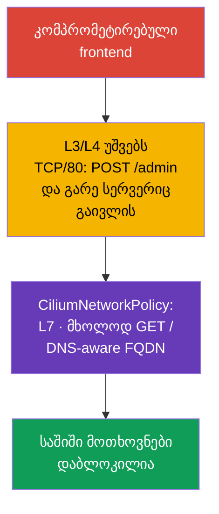

[Русская версия](ru.md) · [Eng version](README.md) · [Versión en español](es.md) · [Version française](fr.md) · [Deutsche Version](de.md) · [繁體中文版](tw.md) · [日本語版](jp.md)

# თავი 06. Cilium NetworkPolicy

> **პრობლემა.** კომპრომეტირებულმა frontend-მა შეიძლება გამოიყენოს backend-თან ნებადართული
> TCP-წვდომა `POST /admin`-ისთვის ან გაუგზავნოს მონაცემები გარე IP-ს DNS-resolve-ის შემდეგ:
> L3/L4 NetworkPolicy ამას ვერ განასხვავებს. L7-, FQDN- და identity-aware შეზღუდვების გარეშე
> დასაშვები კავშირი გადაიქცევა საშიში მოთხოვნის ან ექსფილტრაციის არხად, ხოლო
> დაკვირვებადობის (observability) არარსებობა ართულებს DROP-ის აღმოჩენას და გამოძიებას.

> **რა არის შემდეგ.** ნატიური NetworkPolicy უკვე იძლევა Pod-ის იზოლაციისა და
> metadata-სერვისებთან წვდომის დახურვის შესაძლებლობას. მაგრამ ნაწილი სცენარებისთვის ეს
> არასაკმარისია: საჭიროა კონკრეტული HTTP-მეთოდის დაშვება, გარე სერვისების DNS-სახელების
> გათვალისწინება, კლასტერისკენ და ინტერნეტისკენ მიმართული ტრაფიკის გარჩევა და თითოეული
> DROP-ის მიზეზის დანახვა (პაკეტი უარყოფილია გამომგზავნისთვის პასუხის გარეშე).
> **CiliumNetworkPolicy** აფართოვებს Cilium-ის სქელური network policy-ის საბაზისო
> შესაძლებლობებს L7-ფილტრაციით, FQDN-წესებით, identity-ებით და დაკვირვებადობით. ეს თავი
> აღრმავებს CKS Cluster Setup კომპეტენციას «Use Network security policies to restrict
> cluster level access» და საფუძველია 102-ე ლაბისთვის.
>
> CKS-ის საჯარო პროგრამა არ მოითხოვს ზუსტად CiliumNetworkPolicy-ს, `toFQDNs`-ს ან
> Hubble-ს ყოველ საგამოცდო გარემოში, ამიტომ Cilium-specific ბრძანებები და CRD-ები
> განიხილეთ როგორც გაღრმავება იმ კლასტერებისთვის, სადაც Cilium ნამდვილად არის მოწოდებული.

> **Cilium კლასტერში თავისთავად არ ჩნდება.** ეს ცალკე CNI-ია, რომელსაც ამონტაჟებს
> კლასტერის ადმინისტრატორი - `cilium` CLI-ის ან Helm chart-ის მეშვეობით, უკვე შექმნილ
> კლასტერზე ან სტანდარტული CNI-ის ნაცვლად მისი შექმნისას. თუ თქვენს გარემოში Cilium ჯერ
> დაყენებული არ არის, ამ თავის ყველა მაგალითი დაყენებამდე გამოუსადეგარია. ოფიციალური
> ინსტრუქცია: [Cilium Quick Installation](https://docs.cilium.io/en/stable/gettingstarted/k8s-install-default/).
> უფრო დეტალური L3/L4/L7-წესების მაგალითები, ვიდრე ამ თავშია განხილული, - ოფიციალურ
> [Overview of Network Policy](https://docs.cilium.io/en/stable/security/policy/) განყოფილებაში,
> Layer 3, Layer 4 და Layer 7 Policies ცალკეული გვერდების ჩათვლით.

> **რა გჭირდებათ CKA-დან.** CNI-ის საბაზისო მოდელი, Pod-ისა და სერვისების IP-მისამართები -
> იხილეთ [CKA-ის 30-ე თავში](../../../cka/course/30/ge.md), ხოლო CNI-ის დანიშნულება და
> ადგილი ქსელურ სტეკში - [CKA-ის 40-ე თავში](../../../cka/course/40/ge.md). Kubernetes
> NetworkPolicy-ის საბაზისო სინტაქსი განხილულია ამ კურსის 04-ე თავში; აქ მას არ ვიმეორებთ,
> არამედ ვიყენებთ Cilium-ის შესაძლებლობებს.

> 🧠 `kube-proxy` მიმართავს `ClusterIP:port`-ს არჩეულ Pod-ისკენ, ხოლო CNI ცალკე იყენებს `NetworkPolicy`-ს.

## 06.0. რა არის თქვენთვის ახალი: eBPF-datapath kube-proxy-ის ნაცვლად

### Baseline Cilium-ის გარეშე: როგორ აღწევს ტრაფიკი Service-მდე ახლა

ამ თავამდე პაკეტის გზას Service-მდე უზრუნველყოფდა `kube-proxy`. მექანიზმი სამი ნაწილისგან
შედგება:

- **დაკვირვება.** ყოველ კვანძზე `kube-proxy` უსმენს Service და `EndpointSlice`
  ობიექტების ცვლილებებს.
- **ბირთვის პროგრამირება.** ყოველ ცვლილებაზე ის ანახლებს ბირთვის წესებს - ჩვეულებრივ
  `iptables`-ის ან `nftables`-ის მეშვეობით (მოძველებული `ipvs`-იც შესაძლებელია).
- **ჩაჭერა და DNAT.** წესი ჭერს `ClusterIP:port`-ისკენ მიმართულ ტრაფიკს და აკეთებს DNAT-ს
  კონკრეტული Pod-ის IP-ზე, არჩეულს შემთხვევით ან session affinity-ის მიხედვით.

`NetworkPolicy` 04-ე თავიდან - ცალკე ფენაა იმავე მოდელზე: CNI თავისი მხრივ კითხულობს
`NetworkPolicy` ობიექტს და ამატებს საკუთარ ბირთვის წესებს, რომლებიც ატარებენ ან
ბლოკავენ პაკეტს kube-proxy-ის წესებამდე **ან** შემდეგ, რეალიზაციის მიხედვით.

> 🧠 Cilium აკავშირებს workload-ის labels-ს identity-სთან და იყენებს L3/L4 policy-ს eBPF maps-ის მეშვეობით; L7 საჭიროებს proxy path-ს.

### რას ცვლის Cilium: eBPF, როგორც ძირითადი L3/L4 datapath

Cilium სთავაზობს სხვა არქიტექტურას იმავე პაკეტის გზისთვის:

- **eBPF, როგორც ძირითადი L3/L4 datapath.** pod networking-ისთვის, L3/L4 policy-სთვის და
  kube-proxy-replacement-ისთვის Cilium იყენებს eBPF-პროგრამებს და BPF maps-ს. პროგრამები
  ერთვის ბირთვის hook-წერტილებს, მაგალითად ქსელურ ინტერფეისებსა და cgroup-ს.
- **Map lookup ხაზოვანი `iptables`-შემოვლის ნაცვლად.** kube-proxy-replacement რეჟიმში
  Cilium ინახავს Service/backend state-ს BPF maps-ში და ასრულებს lookup-ს გრძელი
  `iptables`-ჯაჭვის თანმიმდევრული შემოვლის გარეშე. ეს მნიშვნელოვანი განსხვავებაა ზუსტად
  kube-proxy-ის `iptables` რეჟიმისგან. ეს შედარება ნუ გადაიტანთ kube-proxy `nftables`-ზე:
  თანამედროვე nftables-რეჟიმიც იყენებს map-based dispatch-ს (`verdict map`) დაახლოებით
  O(1) lookup-ით - დეტალები ოფიციალურ Kubernetes-ის ბლოგში kube-proxy-ის nftables-რეჟიმის
  შესახებ.
- **მუშაობის ორი რეჟიმი.** სრული **kube-proxy-replacement** მთელ Service load
  balancing-ს რეალიზებს eBPF-ში და საშუალებას იძლევა `kube-proxy` კლასტერიდან
  ამოიღონ. თანამშრომლობის რეჟიმში `kube-proxy` აგრძელებს Service-ის მომსახურებას, ხოლო
  Cilium ამატებს policy enforcement-სა და L7-შესაძლებლობებს გვერდით.

ორივე რეჟიმი შესაძლებელია production-ში, და CKS-ის გამოცდა არცერთ კონკრეტულს არ
მოითხოვს.

მნიშვნელოვანია დონეების გარჩევა. L3/L4 forwarding, policy enforcement და Service load
balancing kube-proxy-replacement-ის დროს Cilium-ში ძირითადად eBPF-ის მეშვეობით
რეალიზდება.

L7 HTTP/DNS policy სხვაგვარად მუშაობს: შერჩეული ტრაფიკი გადამისამართდება node-local
userspace proxy-ში (Envoy ან DNS proxy). Cilium-ის მიმდინარე stable-ვერსიებში ასეთმა
proxy redirection-მა შეიძლება ასევე გამოიყენოს netfilter/`iptables` TPROXY. ამიტომ
Cilium არ უნდა აღიწეროს, როგორც datapath, რომელიც ნებისმიერი ფუნქციისას სრულად გამორიცხავს
`iptables`-სა და userspace-ს.

> 🎯 გამოიყენეთ ნატიური `NetworkPolicy` labels/CIDR-სა და L3/L4-პორტებისთვის, CNP - L7 HTTP/DNS-ისთვის, `toFQDNs`-ისთვის, `toEntities`-ისთვის და Cilium-ის დაკვირვებადობისთვის.

### როცა საკმარისია `NetworkPolicy`, და როცა საჭიროა CNP

მექანიზმების განსხვავებიდან გამომდინარეობს პრაქტიკული კრიტერიუმი ნატიურ
`NetworkPolicy`-სა და `CiliumNetworkPolicy`-ს (CNP) შორის არჩევისთვის:

- **დაიწყეთ ნატიური `NetworkPolicy`-დან.** თუ ამოცანაა Pod-ებს შორის ტრაფიკის დაშვება ან
  აკრძალვა labels-ის, namespace-ის, CIDR-ისა და TCP/UDP/SCTP-პორტის მიხედვით, ეს საკმარისია.
  policy გადატანადია კლასტერებსა და CNI-ებს შორის, ამიტომ CNP-ზე გადასვლა მიზეზის გარეშე
  ართულებს მიგრაციასა და მხარდაჭერას.
- **გადადით CNP-ზე, როცა საჭიროა კონტროლი უკვე ნებადართული L3/L4-კავშირის შიგნით.**
  ტიპური ტრიგერები: კონკრეტული HTTP-მეთოდის ან path-ის შეზღუდვა (L7), კონკრეტული გარე
  DNS-სახელების დაშვება ან აკრძალვა (`toFQDNs`), ტრაფიკის ცხადად აღწერა `world`-ისკენ,
  `cluster`-ისკენ ან `host`-ისკენ (`toEntities`), ან Hubble-ის მეშვეობით დაკვირვებადობის
  მიღება `DROP`-ის გამოძიებისთვის.
- **ორივე მოდელის კომბინირება შესაძლებელია.** ნატიური `NetworkPolicy` რჩება
  გადატანად L3/L4 კონტროლად, ხოლო CNP ამატებს უფრო ზუსტ granularity-ს იქ, სადაც L3/L4
  უკვე არასაკმარისია. ერთობლივი allow/deny გამოთვლის დეტალები განხილულია ქვემოთ ამ
  თავში.

> 🧠 CNP ამატებს labels-ს, L7-ს და FQDN-ს ნატიურ `NetworkPolicy`-ს; ცხადი Cilium deny-ს პრიორიტეტი აქვს allow-ზე.

## 06.1. რატომ არის საჭირო Cilium policy

ნატიური `NetworkPolicy` აღწერს ქსელურ ურთიერთობებს L3/L4 დონეზე: რომელ Pod-ებს,
CIDR-ებსა და პორტებს შეუძლიათ TCP/UDP-ტრაფიკის გაცვლა. ის განზრახ არ იცის HTTP-path,
DNS-სახელები ან კავშირის კონტექსტი. Cilium ახორციელებს ქსელურ policy-ს eBPF-ში და ამატებს
სამუშაო დატვირთვების identity-ებს, L7-პროქსის და დაკვირვებადობას.

შეტევის სცენარი: frontend კომპრომეტირებულია აპლიკაციის დაუცველობის მეშვეობით. ჩვეულებრივმა
policy-მ შეიძლება მას დაუშვას TCP/80 backend-ისკენ, ამიტომ თავდამსხმელი იგივე წვდომას
იღებს. თუ backend იღებს მხოლოდ `GET /`-ს, მაშინ `POST /admin` ან `DELETE /data` არ
უნდა გავიდეს ნებადართული TCP-კავშირის დროსაც კი. კიდევ ერთი ხშირი სცენარია - Pod
მიმართავს ნებისმიერ გარე IP-ს DNS-resolve-ის შემდეგ და აგზავნის მონაცემებს
თავდამსხმელისკენ.



Cilium აფასებს policy-ს identity-ის, არა მხოლოდ IP-ის მიხედვით. Kubernetes-ის სამუშაო
დატვირთვებისთვის identity აიგება labels-იდან. Pod-ის ხელახალი შექმნისას მისი IP იცვლება,
მაგრამ `endpointSelector`-იანი წესი აგრძელებს მუშაობას, თუ labels იგივე დარჩა.

| შესაძლებლობა | ნატიური `NetworkPolicy` | `CiliumNetworkPolicy` |
|---|---|---|
| L3: pod/CIDR | კი | კი, labels და identities |
| L4: TCP/UDP/SCTP-პორტი | კი | კი |
| L7: HTTP, DNS | არა | კი |
| წესები FQDN-ის მიხედვით | არა | კი, `toFQDNs` |
| `world` / `cluster` / `host` | არა | კი, `toEntities` |
| ნაკადების დაკვირვებადობა | დამოკიდებულია CNI-ზე | Hubble და `cilium` CLI |

`CiliumNetworkPolicy` (CNP) მოქმედებს საკუთარი ობიექტის namespace-ში. ის შესაფერისია
გუნდის ან აპლიკაციის policy-ებისთვის. `CiliumClusterwideNetworkPolicy` (CCNP) მოქმედებს
მთელ კლასტერზე და მოსახერხებელია პლატფორმის საერთო წესებისთვის, მაგალითად საშიში egress-ის
აკრძალვისთვის ყველა namespace-ში. CCNP უფრო ძლიერია შედეგების მხრივ: შეცდომა ფართო
selector-ში შეიძლება მთელ კლასტერს მოწყვიტოს, ამიტომ ჯერ შეამოწმეთ წესი ცალკე
namespace-ში და გამოიყენეთ ვიწრო labels.

### თანამშრომლობა ნატიურ `NetworkPolicy`-სთან

`NetworkPolicy` [04-ე თავიდან](../04/ge.md) და CNP/CCNP შეიძლება ერთდროულად ირჩევდნენ
ერთსა და იმავე endpoint-ს. მათი allow-წესები ერთად გაითვალისწინება, მაგრამ ცხადი Cilium
`ingressDeny`/`egressDeny`-ს პრიორიტეტი აქვს **ყველა** allow-წესზე: CNP-დან, CCNP-დან და
ნატიური Kubernetes `NetworkPolicy`-დან. ამიტომ ჩვეულებრივი `NetworkPolicy`-ს allow ვერ
გვერდს აუვლის Cilium deny-ს. მოულოდნელი `DROP`-ის დროს ინვენტარიზაცია გაუკეთეთ ყველა ამ
ობიექტს, მათ selector-ებსა და მიმართულებებს და არა მხოლოდ ბოლოს გამოყენებულ CNP-ში ეძებოთ
შეცდომა. ნატიური policy რჩება გადატანად L3/L4 კონტროლად; Cilium ავსებს მას L7-ით,
FQDN-ით, entities-ით და დაკვირვებადობით.

> **Advanced: Kubernetes `ClusterNetworkPolicy`.** Cilium-ის თანამედროვე ვერსიებში
> `NetworkPolicy`-სთან, CNP-სთან და CCNP-სთან ერთად შეიძლება გამოყენებულ იქნას Kubernetes
> `ClusterNetworkPolicy` (KCNP, `v1alpha2`). მისი tiers-მოდელი ყოფს `Admin`-ს,
> `NetworkPolicy`-ს და `Baseline`-ს; `Admin` tier-ის წესებს პრიორიტეტი აქვთ CNP-ზე,
> CCNP-ზე და ჩვეულებრივ `NetworkPolicy`-ზე. ეს სასარგებლოა platform-wide საზღვრებისთვის,
> მაგრამ არ არის CKS-ის სავალდებულო ცალკე თემა: გამოყენებამდე შეამოწმეთ, ჩართულია თუ არა
> შესაბამისი API-ები და მხარდაჭერა თქვენს Cilium-კლასტერში.

> 🎯 CNP-ში `endpointSelector` ირჩევს Pod-ს, `fromEndpoints`/`toEndpoints` - identity-ს, `toPorts` - პროტოკოლსა და პორტს; ingress-ი და egress-ი ცალ-ცალკე ქმნიან default-deny-ს.

## 06.2. L3/L4: მხოლოდ საჭირო workload-ისა და პორტის დაშვება

Policy გახდება გამოსაყენებელი endpoint-ისთვის, თუ მას ირჩევს `endpointSelector`.
`policyEnforcementMode: default`-ში Cilium ამორთავს enforcement-ს, როცა endpoint-ს
policy ირჩევს; `always` ჩართავს მას ყველა endpoint-ისთვის (endpoint allow-წესების გარეშე
იღებს აკრძალვას), ხოლო `never` თიშავს enforcement-ს. ნაგულისხმევად allow-list მოქმედებს
**თითოეული მიმართულებისთვის ცალკე**: `ingress`-ის არსებობა ხდის ingress-ს default-deny-ად
allow-წესთან დამთხვევამდე, `egress`-ის არსებობა ანალოგიურად ხდის default-deny-ად მხოლოდ
egress-ს. Policy მხოლოდ `ingress`-ით არ ხურავს egress-ს და პირიქით. ამიტომ selector
ზუსტი უნდა იყოს.

ეს ქცევა შეიძლება შეიცვალოს `enableDefaultDeny`-ის მეშვეობით: მიმართულება, რომლისთვისაც
დაყენებულია `false`, არ ითვლება endpoint-ის default-deny-ში გადაყვანისას. ასე
ადმინისტრატორს შეუძლია უსაფრთხოდ გამოიყენოს cluster-wide policy - მაგალითად, DNS-ის
ჩაჭერა - endpoint-ის default-deny-ში გადაყვანისა და ლეგიტიმური ტრაფიკის დაბლოკვის
რისკის გარეშე. გამონაკლისი არ უნდა გადაიტანოთ L7-policy-ზე: `enableDefaultDeny` არ
ვრცელდება layer-7 წესებზე, და L7 წესის დამატება შესაბამისი L7 allow-all-ის გარეშე
გამოიწვევს DROP-ს ცხადად გამორთული default-deny-ის დროსაც კი.

Cilium ადევნებს თვალს კავშირის მდგომარეობას: ინიცირებადი ingress- ან egress-ნაკადის
დაშვება უშვებს **იმავე კავშირის პასუხის ტრაფიკს**, მაგრამ არ უშვებს ახალ კავშირს
საწინააღმდეგო მიმართულებით. ამიტომ მექანიკურად ნუ დააგდუბლირებთ წესს პასუხისთვის, არამედ
ცხადად აღწერეთ დამოუკიდებელი საპასუხო გამოძახება, თუ ის აპლიკაციას სჭირდება.

ქვემოთ backend label-ით `app: backend` იღებს მხოლოდ TCP/80-ს frontend-იდან label-ით
`app: frontend` იმავე namespace `cks-102`-ში. `fromEndpoints` - L3-შეზღუდვაა identity-ის
მიხედვით, `toPorts` - L4-შეზღუდვა პროტოკოლისა და პორტის მიხედვით.

```yaml
apiVersion: cilium.io/v2
kind: CiliumNetworkPolicy
metadata:
  name: backend-from-frontend-http
  namespace: cks-102
spec:
  endpointSelector:
    matchLabels:
      app: backend
  ingress:
  - fromEndpoints:
    - matchLabels:
        app: frontend
    toPorts:
    - ports:
      - port: "80"
        protocol: TCP
```

გამოიყენეთ manifest და შეამოწმეთ ობიექტი, სანამ policy-ს მომუშავედ ჩათვლით:

```bash
kubectl apply -f backend-l3-l4.yaml
kubectl -n cks-102 get ciliumnetworkpolicy
kubectl -n cks-102 describe ciliumnetworkpolicy backend-from-frontend-http

# ჯერ შეამოწმეთ labels, რომელთა მიხედვითაც Cilium აგებს identity-ს.
kubectl -n cks-102 get pod --show-labels
```

Cross-namespace ტრაფიკისთვის დაამატეთ namespace label `matchLabels`-ში. Cilium
ავტომატურად ამატებს Kubernetes labels-ს პრეფიქსით `k8s:`; namespace ჩვეულებრივ
წარმოდგენილია label-ით `k8s:io.kubernetes.pod.namespace`.

```yaml
  ingress:
  - fromEndpoints:
    - matchLabels:
        k8s:io.kubernetes.pod.namespace: storefront
        app: frontend
    toPorts:
    - ports:
      - port: "8080"
        protocol: TCP
```

არ ჩაანაცვლოთ identity თვითნებური `toCIDR`-ის წესით, თუ ადრესატია pod. CIDR არ
მისდევს სამუშაო დატვირთვის ხელახალ შექმნას და შეიძლება მოიცავდეს სხვისი IP-ებს. `toCIDR`
გამართლებულია სტაბილური გარე ქსელებისთვის ან ვიწრო სამსახურეობრივი დიაპაზონებისთვის, და
არა როგორც ჩვეულებრივი საშუალება ორი Kubernetes-სერვისის დასაკავშირებლად.

> 🔬 Active FTP იყენებს დინამიურ საპასუხო პორტს, რომელსაც სტატიკური L3/L4 CNP ვერ გამოხატავს; საჭიროა protocol-aware gateway ან passive FTP ფიქსირებული დიაპაზონით.

### Corner case: active FTP არ გამოისახება L3/L4-ის მეშვეობით

Active FTP აჩვენებს L3/L4-policy-ის საზღვარს. კლიენტი ხსნის control-კავშირს TCP/21-ზე
და ატყობინებს სერვერს თავის პორტს data-კავშირისთვის; შემდეგ **სერვერი თავად ინიცირებს
ახალ TCP-კავშირს უკან, კლიენტისკენ** ამ პორტზე. პორტი წინასწარ უცნობია და დინამიურად
შეთანხმებულია სესიის შიგნით, ამიტომ სტატიკურ `toPorts`/`fromEndpoints` წესს არ შეუძლია
აღწეროს «დაუშვი შემომავალი კავშირი პორტზე, რომელზეც მხარეები მოგვიანებით შეთანხმდებიან».

Kubernetes-ისა და Cilium-ის გარეშე ამ პრობლემას წყვეტდა **connection tracking ბირთვის
დონეზე**: მოდული `nf_conntrack_ftp` არჩევს control-არხს, ხედავს შეთანხმებულ პორტს და
დინამიურად ამატებს related-კავშირს, როგორც ნებადართულს. `kube-proxy` და მისი
`iptables`/`nftables` წესები თავისთავად არ წყვეტენ ამ ამოცანას - მას წყვეტს ცალკე
conntrack helper netfilter-ზე, და არა თავად Service-ის forwarding-ის მექანიზმი.

პროტოკოლებისთვის მხარდაჭერილი application-level სემანტიკით Cilium-ს შეუძლია გამოიყენოს
L7 proxy, მაგრამ FTP მათ არ ეკუთვნის.

სტანდარტული CiliumNetworkPolicy არ იძლევა FTP-aware helper-ს ან ჩაშენებულ FTP L7
parser-ს. ამიტომ Cilium ვერ ახერხებს FTP control channel-იდან ავტომატურად განსაზღვროს
active-mode data connection-ის negotiated port და შექმნას მისთვის დროებითი
policy-ნებართვა.

Kubernetes-გარემოსთვის სასურველია **passive FTP** წინასწარ შეზღუდული data ports-ის
დიაპაზონით: მაშინ control ტრაფიკი TCP/21-ზე და data ტრაფიკი ფიქსირებულ დიაპაზონზე
შესაძლებელია გამოისახოს ჩვეულებრივი L3/L4 policy წესებით (`endPort`).

თუ legacy-აპლიკაციას აუცილებლად სჭირდება active FTP დინამიურად შეთანხმებული
პორტებით, ეს უკვე ცალკე protocol-aware gateway/proxy-ის ან სპეციალურად დაპროექტებული
ქსელური ფენის ამოცანაა, და არა სტანდარტული CNP-ის.

Cilium-ის თანამედროვე ჩაშენებული application-level წესებიდან HTTP-სა და DNS-ზე
ორიენტირდით. gRPC ფილტრდება HTTP/2 semantics-ის მეშვეობით `rules.http`-ით; ცალკე gRPC
rule ტიპი არ არსებობს. Kafka-aware network policy ამოღებულია Cilium 1.20-ში.

> 🎯 `toPorts.rules.http`-ში დაუშვით მხოლოდ საჭირო method და path და შეამოწმეთ ნებადართული და აკრძალული მოთხოვნა.

## 06.3. L7: HTTP-ისა და DNS-ის შეზღუდვა

L7-წესი ემატება `toPorts` ელემენტის შიგნით. Cilium მიმართავს შერჩეულ ტრაფიკს
შესაბამის L7-proxy-ში: HTTP ან DNS. მნიშვნელოვანი შედეგი: L7-წესები გამოსაყენებელია
მხოლოდ სწორად ამოცნობილი პროტოკოლისთვის მითითებულ პორტზე. ვერ ელოდებით HTTP-ის
ფილტრაციას, თუ კლიენტი ლაპარაკობს TLS-ს პორტზე TLS-ტერმინაციის დაყენების გარეშე: proxy
ვერ ხედავს plaintext HTTP-ს.

შემდეგი წესი უშვებს frontend-ს მხოლოდ `GET /`-ს backend-ისკენ. path-ის რეგულარული
გამოსახულება `^/$` განზრახ ვიწროა: `/healthz`, `/api` და ნებისმიერი `POST` არ დაემთხვევა
და აიკრძალება.

```yaml
apiVersion: cilium.io/v2
kind: CiliumNetworkPolicy
metadata:
  name: backend-read-only
  namespace: cks-102
spec:
  endpointSelector:
    matchLabels:
      app: backend
  ingress:
  - fromEndpoints:
    - matchLabels:
        app: frontend
    toPorts:
    - ports:
      - port: "80"
        protocol: TCP
      rules:
        http:
        - method: "GET"
          path: "^/$"
```

შეამოწმეთ არა მხოლოდ წარმატებული მოთხოვნა, არამედ აკრძალვაც. სატესტო Pod-ის იმიჯში
უნდა იყოს `curl` ან სხვა HTTP-კლიენტი:

```bash
kubectl -n cks-102 exec deploy/frontend -- curl -i http://backend/
kubectl -n cks-102 exec deploy/frontend -- \
  curl -i -X POST http://backend/

# მოსალოდნელია: GET აბრუნებს 200-ს; შეუთანხმებელ L7-მოთხოვნას Cilium proxy უარყოფს, ჩვეულებრივ 403-ით.
```

API-სთვის უფრო უსაფრთხოა ჩამოთვალოთ ნებადართული მეთოდები, path-ები და საჭიროების
შემთხვევაში headers, და არა გააკეთოთ ფართო `path: ".*"`. L7-policy არ ანაცვლებს
აპლიკაციის აუთენტიფიკაციასა და ავტორიზაციას: ის ამცირებს ხელმისაწვდომ ზედაპირს, მაგრამ
არ იცნობს მომხმარებელსა და API-ის ბიზნეს-წესებს.

Cilium ასევე შეუძლია DNS-ის ფილტრაცია მოთხოვნის სახელის მიხედვით. არ ჩართოთ L7-proxy
საჭიროების გარეშე: ის ამატებს დამუშავებას ტრაფიკის გზაზე და მოითხოვს ცალკე დატვირთვის
ტესტირებას.

> 🔬 gRPC ფილტრდება როგორც HTTP/2 `POST`-ისა და მეთოდის path-ის მეშვეობით.

### gRPC: ფილტრაცია HTTP-ის მეშვეობით, მაგრამ ბალანსირების თავისებურებით

Cilium-ს არ აქვს ცალკე «gRPC-პარსერი». gRPC მუშაობს HTTP/2-ზე, და ყოველი მეთოდის
გამოძახება კოდირებულია, როგორც ჩვეულებრივი HTTP-მოთხოვნა: `POST` path-ზე სახით
`/პაკეტი.სერვისი/მეთოდი`. ამიტომ gRPC-ის L7-ფილტრაცია - იგივე HTTP-წესია `path`-ით,
რომელიც ზემოთ უკვე ნახეთ, მხოლოდ regex ან ზუსტი path აღწერს
`/cloudcity.DoorManager/GetName`-ს `/`-ის ნაცვლად.

მაგალითად, ქვემოთ მოცემული წესი უშვებს `public-terminal`-ს, გამოიძახოს
`cc-door-mgr`-ისგან მხოლოდ სტატუსის წაკითხვა, მაგრამ არა წვდომის კოდის შეცვლა:

```yaml
apiVersion: cilium.io/v2
kind: CiliumNetworkPolicy
metadata:
  name: door-read-only-grpc
spec:
  endpointSelector:
    matchLabels:
      app: cc-door-mgr
  ingress:
  - fromEndpoints:
    - matchLabels:
        app: public-terminal
    toPorts:
    - ports:
      - port: "50051"
        protocol: TCP
      rules:
        http:
        - method: "POST"
          path: "/cloudcity.DoorManager/GetName"
        - method: "POST"
          path: "/cloudcity.DoorManager/GetLocation"
```

`SetAccessCode`-ის გამოძახება არცერთ წესს არ დაემთხვევა და უარყოფილი იქნება - კლიენტი
მიიღებს gRPC-სტატუსს `PERMISSION_DENIED`, და არა ჩვეულებრივ ქსელურ timeout-ს. დეტალურად
გარჩეული ნაბიჯ-ნაბიჯ მაგალითი დემო-აპლიკაციით არის ოფიციალურ დოკუმენტაციაში:
[Securing gRPC](https://docs.cilium.io/en/stable/security/grpc/).

ცალკე პრობლემა წარმოიქმნება ბალანსირებასთან, თუ Cilium **სრულად ცვლის
kube-proxy**-ს (`kube-proxy-replacement`). gRPC ინახავს ერთ დიდხანს ცოცხალ
TCP-კავშირს და ატარებს მასში ბევრ გამოძახებას ზედიზედ. Cilium-ის ჩვეულებრივი
eBPF-ბალანსირება ირჩევს Pod-ს **ერთხელ, კავშირის დამყარებისას**, და არა ყოველ ცალკეულ
გამოძახებაზე მის შიგნით. თუ კლიენტმა კავშირი გახსნა და დიდხანს ინახავს, მთელი მისი
ტრაფიკი წავა ერთსა და იმავე Pod-ზე, ხოლო backend-ის დანარჩენი რეპლიკები არ მიიღებენ
თავიანთ წილ დატვირთვას - ამას ეწოდება კავშირის pinning.

გადაწყვეტა - Cilium-ში ჩართოთ **Proxy Load Balancing** საჭირო Service-ისთვის: ტრაფიკი
მიმართულია ჩაშენებული Envoy-ის მეშვეობით, რომელსაც შეუძლია შეხედოს HTTP/2-ნაკადის
შიგნით და გაანაწილოს ცალკეული gRPC-გამოძახებები Pod-ებს შორის, და არა მთელი კავშირი
ერთიანად. ამ პარამეტრის გარეშე, დიდხანს ცოცხალი gRPC-კლიენტები kube-proxy-ის გარეშე
კლასტერში ღირს ცალკე შემოწმდეს რეპლიკებს შორის დატვირთვის თანაბრობაზე.

ეს ერთი annotation-ით ირთვება Service ობიექტზე, workload-ის manifest-ის შეცვლის გარეშე:

```bash
kubectl annotate service payment-grpc-service \
  service.cilium.io/lb-l7=enabled
```

ამის შემდეგ ტრაფიკი `payment-grpc-service`-ისკენ მიდის Cilium-managed Envoy-ის
მეშვეობით, რომელიც ანაწილებს ცალკეულ გამოძახებებს Pod-ებს შორის, და არა აპინინგებს მთელ
TCP-კავშირს ერთ backend-ზე. ბალანსირების ალგორითმის დაზუსტება შესაძლებელია ცალკე
annotation-ით `service.cilium.io/lb-l7-algorithm` (`round_robin`, `least_request` ან
`random`). ფუნქცია **beta** სტატუსშია; production-ში ჩართვამდე შეამოწმეთ მისი ქცევა
თქვენს Cilium-ვერსიაში. ნაბიჯ-ნაბიჯ მაგალითი ტრაფიკის Hubble-ით დაკვირვებით -
ოფიციალურ დოკუმენტაციაში: [Proxy Load Balancing for Kubernetes Services](https://docs.cilium.io/en/stable/network/servicemesh/envoy-load-balancing/).

**სად მდებარეობს ფიზიკურად Envoy.** ეს არ არის sidecar თითოეულ Pod-ში. Envoy შედის
Cilium-ის იმიჯში და მუშაობს **თითოეულ კვანძზე ერთხელ**: ან როგორც პროცესი
`cilium-agent`-ის შიგნით, ან როგორც ცალკე `cilium-envoy` DaemonSet, საერთო ყველა
Pod-ისთვის ამ კვანძზე. ზემოთ განხილულ სცენარებში მასში გადის ტრაფიკი, გადამისამართებული
L7-policy-ით ან proxy load balancing-ით (`lb-l7`). ეს არ არის ამომწურავი სია: Cilium
Ingress, Gateway API და `CiliumEnvoyConfig`-იც მიმართავენ ტრაფიკს იმავე per-node
Envoy-ში. ჩვეულებრივი Pod-to-Pod L3/L4 ტრაფიკი, რომლისთვისაც არცერთი ეს
proxy-based ფუნქცია ჩართული არ არის, რჩება eBPF-datapath-ზე userspace-ში გავლის
გარეშე.

**როგორ მოქმედებს ეს დაყოვნებასა და კავშირის პარამეტრებზე.** ყოველი გადამისამართებული
პაკეტი გადის დამატებით გადასვლას userspace-პროცესის Envoy-ის მეშვეობით იმავე კვანძზე,
და არა ქსელით სხვა კვანძთან ან Pod-თან. ეს ამატებს:

- **მცირე დამატებით დაყოვნებას** ყოველ მოთხოვნაზე - გადასვლა ბირთვიდან userspace-ში და
  უკან, პლუს პროტოკოლის (HTTP/gRPC) გარჩევა. სიდიდე ჩვეულებრივ მცირეა ლოკალური
  hop-ისთვის, მაგრამ არა ნულოვანი, და ღირს გაზომოთ რეალურ დატვირთვაზე ჩართვამდე.
- **CPU-სა და მეხსიერების დამატებით გამოყენებას კვანძზე** - Envoy ამუშავებს ტრაფიკს
  ცალკე პროცესად, ამიტომ პროპორციულად იზრდება დატვირთვა კვანძზე L7-ტრაფიკის დიდი
  მოცულობისას.
- **Source address დამოკიდებულია proxy path-ზე და კონფიგურაციაზე.** თავად Envoy-ის
  გავლის ფაქტი არ ნიშნავს, რომ backend აუცილებლად დაინახავს თავად proxy-ის source
  IP-ს. L7 policy enforcement-ისთვის Cilium ნაგულისხმევად იყენებს original source
  address-ს; `CiliumEnvoyConfig`-ს, Ingress-სა და Gateway API-ს აქვთ ცალკე
  პარამეტრები და source visibility-ის წესები. ამიტომ backend-visible source IP/port
  ღირს შეამოწმოთ კონკრეტული რეჟიმისთვის, და არა გამოიტანოთ მხოლოდ Envoy-ის გამოყენების
  ფაქტიდან.
- **ხარჯი ეხება მხოლოდ შერჩეულ ტრაფიკს** - ჩვეულებრივი L3/L4-კავშირები L7-წესებისა და
  `lb-l7` annotation-ის გარეშე ამ ფასს არ იხდიან: ისინი რჩებიან სწრაფ eBPF-გზაზე
  Envoy-ის გარეშე.

> **აქტუალურობა.** Kafka-ს L7-ფილტრაცია Cilium-ში deprecated გახდა 1.18 ვერსიიდან და
> ამოღებულია 1.20 ვერსიაში. CKS-ისთვის ორიენტირდით L7 HTTP-სა და DNS/`toFQDNs`-ზე, ხოლო
> Kafka-policy განიხილეთ მხოლოდ როგორც ისტორიული მაგალითი, და არა მიმდინარე პრაქტიკა.

> 🎯 დაუშვით UDP/TCP 53 სანდო CoreDNS-ისკენ და შეზღუდეთ გარე წვდომა `toFQDNs`-ით; Cilium იყენებს დაკვირვებულ DNS-პასუხებსა და FQDN-cache-ს.

## 06.4. DNS-aware egress და `toFQDNs`

საჯარო SaaS-სერვისის IP იცვლება, CDN გასცემს სხვადასხვა მისამართებს, ხოლო აპლიკაცია
ჩვეულებრივ იცნობს არა IP-ს, არამედ სახელს. `toFQDNs` უშვებს egress-ს სახელებისკენ,
დაუკავშირებს მათ IP-ებთან, რომლებიც Cilium-ის DNS-proxy-მა დაინახა ნებადართულ
DNS-პასუხებში; ეს არ არის სტატიკური DNS-resolve YAML-ის გამოყენების დროს. Proxy ავსებს
FQDN-cache-ს TTL-ის გათვალისწინებით და შემდეგ უშვებს კავშირს ამ cache-ის IP-სთან.
ამიტომ DNS-გარჩევა მიმართეთ მხოლოდ სანდო cluster DNS-ისკენ (მაგალითად, CoreDNS),
რომელიც არჩეულია ზუსტი selector-ით: Cilium დამოუკიდებლად DNS-ს არ ითხოვს და არ უნდა
ენდოს ნებისმიერ nameserver-ს.

ქვემოთ მოცემული policy უშვებს frontend-ის DNS-მოთხოვნებს CoreDNS-ისკენ და HTTPS-ს
მხოლოდ `example.com`-ისკენ. `rules.dns` უშვებს DNS query-ს, ხოლო `toFQDNs` -
შემდგომ კავშირს IP-სთან, დაბრუნებულს ნებადართული სახელისთვის.

```yaml
apiVersion: cilium.io/v2
kind: CiliumNetworkPolicy
metadata:
  name: frontend-external-api-only
  namespace: cks-102
spec:
  endpointSelector:
    matchLabels:
      app: frontend
  egress:
  - toEndpoints:
    - matchLabels:
        k8s:io.kubernetes.pod.namespace: kube-system
        k8s:k8s-app: kube-dns
    toPorts:
    - ports:
      - port: "53"
        protocol: UDP
      - port: "53"
        protocol: TCP
      rules:
        dns:
        - matchPattern: "*"
  - toFQDNs:
    - matchName: "example.com"
    toPorts:
    - ports:
      - port: "443"
        protocol: TCP
```

`matchName` ირჩევს ზუსტად ერთ სახელს. საქვედომენების კონტროლირებადი ნაკრებისთვის
გამოიყენეთ `matchPattern`, მაგალითად `"*.example.com"`: ასეთი wildcard არ ჩაითვალოს
apex-სახელ `example.com`-ის ნებართვად. თუ საჭიროა როგორც `example.com`, ისე მისი
საქვედომენები, გამოხატეთ ისინი ცალკე წესებით. არ გამოიყენოთ `"*"` ცხადი
საჭიროების გარეშე: `toFQDNs`-ში ასეთი pattern ხსნის შეზღუდვას DNS-სახელის მიხედვით და
უშვებს დანიშნულებებს, მიღებულს DNS cache-იდან ყველა დამთხვეული სახელისთვის; იმავე
წესის დანარჩენი პირობები, მაგალითად `toPorts`, აგრძელებენ მოქმედებას. გამოყენებამდე
შეამოწმეთ CoreDNS-ის რეალური labels თქვენს კლასტერში - ზოგ ინსტალაციაში
`k8s-app: kube-dns`-ის ნაცვლად სხვა label გამოიყენება.

```bash
kubectl -n kube-system get pod --show-labels | grep -E 'coredns|dns'
```

შემდეგი მაგალითი - საილუსტრაციო ხელით შემოწმებაა, და არა დეტერმინირებული acceptance
test. IANA პირდაპირ მიუთითებს, რომ დოკუმენტაციური დომენების (`example.com`,
`example.org` და მისთ.) HTTP-სერვისი ხელმისაწვდომია best-effort რეჟიმში და არ არის
განკუთვნილი როგორც testing endpoint პროგრამული უზრუნველყოფისთვის:
https://www.iana.org/news/2024/example-domain-http-methods.
თუ თქვენს გარემოში `example.com`/`www.google.com` მიუწვდომელია (ქსელური შეზღუდვები,
დროებითი უარი, ბლოკირება კონკრეტულ ქსელში), ეს არ ნიშნავს policy-ის შეცდომას -
ჩაანაცვლეთ ისინი FQDN-ით, რომლისთვისაც დამოუკიდებლად, policy-ის გამოყენებამდე,
დაადასტურეთ DNS-გარჩევა და მომუშავე HTTPS.

```bash
kubectl -n cks-102 exec deploy/frontend -- \
  curl -I --max-time 5 https://example.com
kubectl -n cks-102 exec deploy/frontend -- \
  curl -I --max-time 5 https://www.google.com
```

Policy-ის გამოყენებამდე დაადასტურეთ, რომ ზემოთ ორივე მოთხოვნა გადის შეზღუდვების
გარეშე. მხოლოდ შემდეგ გამოიყენეთ `toFQDNs` და შეადარეთ: `example.com:443` უნდა
გაიაროს, ხოლო `www.google.com:443` - იყოს დაბლოკილი ზუსტად policy-ის მიერ, და არა
გარე სერვისის შემთხვევითი მიუწვდომლობით.

`toFQDNs` არ არის სრულფასოვანი DLP ან HTTP `Host`-ის შემოწმება: ეს არის ქსელური
წვდომის კონტროლი დაკვირვებული DNS-გარჩევის მიხედვით. DoH/DoT მალავს DNS-მოთხოვნას
DNS-proxy-სგან და თავად არ ავსებენ FQDN-cache-ს. პირდაპირი კავშირი IP-სთანაც არ
ქმნის FQDN-შესაბამისობას; ის იმუშავებს მხოლოდ თუ ეს IP უკვე არის cache-ში ნებადართული
DNS-პასუხის შემდეგ, ან მას უშვებს უფრო ფართო L3/L4-წესი. არ დაუშვათ ამოუცნობი
DNS-სერვერები, DoH/DoT ან პირდაპირი IP, თუ ეს არსებითია საფრთხის მოდელისთვის:
შეზღუდეთ egress სანდო DNS-მდე, ჩართეთ საჭირო DNS visibility და შეაერთეთ წესები
proxy/firewall-თან ქსელის საზღვარზე.

> 🔬 `world`, `cluster`, `host` და CCNP platform-wide საზღვრებისთვის; შეამოწმეთ ვიწრო scope და გაითვალისწინეთ host firewall და სისტემური ტრაფიკი.

## 06.5. Entities და cluster-wide policy

Entities იძლევა წაკითხვად იდენტიფიკატორებს მისამართთა ჯგუფებისთვის, რომლებისთვისაც
Kubernetes labels არ შეესაბამება. ყველაზე გამოსადეგი მნიშვნელობები:

| Entity | რას მოიცავს | ტიპური შემთხვევა |
|---|---|---|
| `world` | კლასტერგარეთა მისამართები | გარე API-სთან გასვლის ან გარედან შემოსვლის დაშვება |
| `cluster` | endpoints კლასტერის შიგნით | კლასტერშიდა ტრაფიკის ინტერნეტისგან გამოყოფა |
| `host` | კვანძის ლოკალური host endpoint | კვანძთან წვდომის ცხადი კონტროლი |
| `remote-node` | კლასტერის სხვა კვანძები | საჭირო კვანძთაშორისი ურთიერთობის დაშვება |
| `kube-apiserver` | Kubernetes API server | სამუშაო დატვირთვების API-სთან წვდომის შეზღუდვა |

მაგალითად, სერვისი, რომელსაც HTTPS მხოლოდ ინტერნეტიდან უნდა მიიღოს, შეიძლება
შეირჩეს label-ით და შეიზღუდოს ingress entity `world`-ით:

```yaml
apiVersion: cilium.io/v2
kind: CiliumNetworkPolicy
metadata:
  name: public-gateway-from-world
  namespace: cks-102
spec:
  endpointSelector:
    matchLabels:
      app: public-gateway
  ingress:
  - fromEntities:
    - world
    toPorts:
    - ports:
      - port: "443"
        protocol: TCP
```

პლატფორმის დაცვისთვის გამოიყენება CCNP. ქვემოთ მოცემული მაგალითი კრძალავს egress-ს
metadata IP-სკენ ყველა endpoint-ისთვის, არჩეულის policy-ის მიერ, მაგრამ ინარჩუნებს
დანარჩენ egress-ს: გამოსაყენებელი `egress`-policy თავად ჩართავს egress default-deny-ს,
ამიტომ ცხადი allow `toEntities: [all]` აქ საჭიროა. `egressDeny`-ს პრიორიტეტი აქვს
ნებისმიერ allow-ზე, მათ შორის ამ allow-all-ზეც და სხვა CNP/CCNP-ის წესებზეც, ამიტომ
metadata IP შემთხვევით ვერ გაიხსნება. ჯერ შეაფასეთ, სჭირდებათ თუ არა metadata
გამოძახებები სისტემურ სამუშაო დატვირთვებს, და საჭიროების შემთხვევაში გამორიცხეთ ისინი
ცალკე selector-ით ან namespace-ით.

```yaml
apiVersion: cilium.io/v2
kind: CiliumClusterwideNetworkPolicy
metadata:
  name: deny-cloud-metadata
spec:
  endpointSelector: {}
  egress:
  - toEntities:
    - all
  egressDeny:
  - toCIDR:
    - 169.254.169.254/32
```

არ ჩათვალოთ `host` უსაფრთხო ობიექტად. `toEntities: host` მართავს ქსელურ წვდომას
ლოკალურ კვანძთან და host-networked სამუშაო დატვირთვებთან, და ამიტომ შეუძლია გახსნას
გზა kubelet-ისკენ ან კვანძის სხვა TCP/UDP listener-ისკენ. Runtime CRI socket - ცალკე
მექანიზმია: მაგალითად, containerd ჩვეულებრივ ხელმისაწვდომია Unix domain socket-ის
მეშვეობით `/var/run/containerd/containerd.sock`, და მისი ექსპოზიცია დამოკიდებულია
filesystem mounts/`hostPath`-სა და Pod-ის პრივილეგიებზე, და არა თავად `toEntities:
host`-ზე. Host-ტრაფიკის შეზღუდვა მოითხოვს Cilium host firewall-ის გაგებას, რეჟიმ
`hostFirewall.enabled`-ს და control plane-ის ტრაფიკს; შეამოწმეთ ეს სატესტო
კლასტერში, რომ არ დაკარგოთ წვდომა კვანძებზე ან API server-ზე. Runtime socket-თან
წვდომა ცალკე შეზღუდეთ mount/privilege კონტროლებით.

## 06.6. დაკვირვებადობა და შემოწმება Hubble-ით

### რა არის Hubble და რა ამოცანას წყვეტს ის

ჩვეულებრივი `NetworkPolicy` ან `CiliumNetworkPolicy` პასუხობს კითხვას «რა არის
ნებადართული». ის არ პასუხობს კითხვას «რა მოხდა სინამდვილეში»: რატომ ვერ გაიარა
კონკრეტულმა მოთხოვნამ, რომელ წესს ეხება DROP, ხედავს თუ არა კლიენტი TCP-connect-ს
თუ უარი უკვე L7-ზე მოხდა. ასეთი ინსტრუმენტის გარეშე გამოძიება დაიყვანება YAML-ის
ხელახლა წაკითხვამდე და გამოცნობამდე.

**Hubble** - Cilium-ის დაკვირვებადობის კომპონენტია, რომელიც კითხულობს იმავე
eBPF-მოვლენებს, რომლებსაც datapath უკვე აგროვებს, და გარდაქმნის მათ წაკითხვად
flow-მოვლენების ნაკადად: source/destination identity, L4/L7-კონტექსტი, verdict
(`FORWARDED`/`DROPPED`) და უარის მიზეზი. ის არ ანაცვლებს Kubernetes audit log-ს და
თქვენს ნაცვლად არ კითხულობს მოთხოვნის შინაარსს - ის აჩვენებს, რა გადაწყვიტა
Cilium-მა გაეკეთებინა კონკრეტულ კავშირთან და რატომ.

> 🔬 Hubble-ის Server/Relay/UI არქიტექტურა, CLI და კომპონენტები დამოკიდებულია Cilium-ის ვერსიასა და დაყენების ხერხზე.

არქიტექტურულად Hubble შედგება ოთხი ნაწილისგან:

- **Hubble Server** - ჩაშენებულია `cilium-agent`-ში და მუშაობს თითოეულ კვანძზე;
  გასცემს flow events-ს gRPC-ის მეშვეობით.
- **Hubble Relay** (`hubble-relay`) - ცალკე კომპონენტი, რომელიც უკავშირდება Server-ს
  ყველა კვანძზე და იძლევა ერთიან კლასტერულ ხედვას კვანძი-კვანძის ნაცვლად.
- **Hubble CLI** (`hubble`) - საკომანდო ხაზის კლიენტი; უკავშირდება ან Relay-ს
  კლასტერული მიმოხილვისთვის, ან ლოკალურ Server-ს ერთ კვანძზე.
- **Hubble UI** (`hubble-ui`) - არასავალდებულო გრაფიკული ინტერფეისი Relay-ს ზემოთ,
  სერვისების კავშირების რუკით.

**როგორ ირთვება ეს.** Managed-დისტრიბუციებსა და სტანდარტულ Cilium-ინსტალაციებში
Hubble ჩვეულებრივ ირთვება Helm-ის ფლაგით დაყენების ან განახლების დროს, მაგალითად
`--set hubble.relay.enabled=true --set hubble.ui.enabled=true`; ზუსტი ფლაგი
დამოკიდებულია chart-ის ვერსიაზე. CKS-ისა და ამ თავისთვის საკმარისია ერთი რამის ცოდნა:
თუ Hubble უკვე ჩართულია კლასტერში, `cilium status` აჩვენებს მის მდგომარეობას, ხოლო
CLI `hubble` შეიძლება მიუერთდეთ port-forward-ის მეშვეობით Relay-ს, როგორც ქვემოთაა
ნაჩვენები. Hubble-ის ნულიდან ჩართვა ლაბისთვის საჭირო არ არის - ეს კლასტერის
ადმინისტრატორის ამოცანაა, და არა CNP-ების ნაწილი, რომლებსაც თქვენ იყენებთ.

> 🎯 გენერირეთ მოსალოდნელი ნებადართული და აკრძალული ტრაფიკი, შემდეგ დააკვირდით Hubble flows-ს namespace-ის, verdict-ის ან protocol-ის ფილტრით.

ტესტამდე დარწმუნდით, რომ Cilium-ის აგენტები ჯანმრთელია. ბრძანებები ჩვეულებრივ
სრულდება სამუშაო მანქანაზე ხელმისაწვდომი `cilium` CLI-ით; Hubble-ის ჩართვის ზუსტი
ხერხი დამოკიდებულია Cilium-ის დაყენებაზე.

`hubble` - ცალკე ბინარულია, და არა `cilium` CLI-ის ნაწილი. ის ერთხელ უნდა დააყენოთ
სამუშაო მანქანაზე, საჭირო რელიზის GitHub-იდან ჩამოტვირთვით; ნაბიჯები პლატფორმების
მიხედვით - ოფიციალურ ინსტრუქციაში [Install the Hubble Client](https://docs.cilium.io/en/stable/observability/hubble/setup/#install-the-hubble-client).
დაყენების შემდეგ შეამოწმეთ ბინარული ბრძანებით `hubble help`.

```bash
cilium status --wait
cilium connectivity test

# თუ Hubble relay ჩართულია, CLI შექმნის ლოკალურ კავშირს მასთან.
cilium hubble port-forward &
hubble status

# ტრაფიკი და უარები მხოლოდ სასწავლო namespace-იდან.
hubble observe --namespace cks-102 --verdict DROPPED
hubble observe --namespace cks-102 --protocol http
```

L3/L4, L7 და FQDN-ის შემოწმების თანმიმდევრობა 102-ე ლაბაში უნდა იყოს
რეპროდუცირებადი:

1. დარწმუნდით, რომ `frontend` და `backend` Running-ია და მათი labels ემთხვევა
   selector-ებს.
2. გამოიყენეთ L3/L4 CNP. frontend-იდან მოთხოვნა backend:80-ისკენ უნდა გაიაროს; Pod-იდან
   `app: frontend`-ის გარეშე - მიიღოს timeout ან DROP.
3. ჩაანაცვლეთ ან დაამატეთ L7 CNP წესი. `GET /` უნდა დააბრუნოს `200`, ხოლო `POST /` -
   მიიღოს proxy-ის უარი (ჩვეულებრივ `403`).
4. გამოიყენეთ DNS/FQDN policy. შეამოწმეთ resolve და HTTPS ნებადართული სახელისკენ,
   შემდეგ სცადეთ მიმართოთ ამოუცნობ სახელს.
5. ცალკე ტერმინალში დააკვირდით Hubble-ს და შეინახეთ ნებადართული და აკრძალული
   ტრაფიკის flow, როგორც შედეგის დამადასტურებელი საბუთი.

დიაგნოსტიკისთვის გამოსადეგია აგრეთვე აგენტის CLI და Kubernetes-ობიექტი:

```bash
kubectl -n cks-102 get ciliumnetworkpolicy -o yaml
kubectl -n kube-system get pods -l k8s-app=cilium

# სრულდება Pod cilium-ში არჩეულ კვანძზე.
kubectl -n kube-system exec ds/cilium -- cilium-dbg endpoint list
kubectl -n kube-system exec ds/cilium -- cilium-dbg policy get
```

თუ `hubble observe` ცარიელია, ჯერ შეამოწმეთ `hubble status`, Hubble Relay-ის
არსებობა, kubeconfig-ის კონტექსტი და namespace/verdict ფილტრები. თუ DNS-მა შეწყვიტა
მუშაობა default deny-ის შემდეგ, ეს თითქმის ყოველთვის UDP/TCP 53-ის ნებართვის
არქონაა CoreDNS-ის ფაქტობრივი endpoints-ისკენ. თუ L7 წესი მოულოდნელად არ ემთხვევა,
შეამოწმეთ პორტი, protocol, HTTP მეთოდი, path-ის რეგულარული გამოსახულება და TLS:
დაშიფრული HTTP შესაბამისი კონფიგურაციის გარეშე L7-proxy-სთვის უხილავია.

> 🎯 შეამოწმეთ labels/selectors, მიმართულება, პორტები და DNS, შემდეგ შეადარეთ ნებადართული და აკრძალული flow Hubble-ში; გაშალეთ ვიწრო allow-დან rollback-ით.

## 06.7. ხშირი შეცდომები და დანერგვის უსაფრთხო თანმიმდევრობა

| სიმპტომი | ალბათური მიზეზი | რა შეამოწმოთ |
|---|---|---|
| policy-ის შემდეგ სახელები არ resolve-დება | DNS ნებადართული არ არის ან CoreDNS-ის selector არასწორია | CoreDNS-ის labels, UDP და TCP 53, Hubble DROPPED |
| `GET` და `POST` ორივე აკრძალულია | L3 identity ან L4-პორტი არ დაემთხვა | endpoint-ის labels, Service-ის პორტი და targetPort |
| L7 წესი არ ზღუდავს მოთხოვნას | ტრაფიკი HTTP-ად არ არის ამოცნობილი ან არსებობს უფრო ფართო წესი | protocol, TLS, `cilium policy get`, Hubble HTTP flows |
| FQDN policy არ იძლევა სერვისთან წვდომას | სახელი არ ემთხვევა DNS-პასუხს ან IP-cache ჯერ არ არის შევსებული | `hubble observe --protocol dns`, `matchName`, TTL |
| CCNP-მა დაარღვია სისტემური ტრაფიკი | selector ზედმეტად ფართოა ან სისტემური endpoints არ არის გათვალისწინებული | policy-ის scope, namespace/labels, rollout სატესტო namespace-ში |
| Hubble-ში მოვლენები არ არის | Hubble Relay/CLI არ არის დაკავშირებული ან ფილტრი ზედმეტად ვიწროა | `hubble status`, port-forward, ფილტრების მოხსნა |

**Cilium-ის Policy Audit Mode** გამოსადეგია L3/L4-policy-ის მომზადების ეტაპზე: daemon-ისთვის
(`--policy-audit-mode=true`) ან არჩეული endpoint-ისთვის ჩართვისას ის ატარებს ტრაფიკს,
რომელსაც policy სხვაგვარად გადააგდებდა, და აფიქსირებს შესაბამის policy verdict-ს. ამ
რეჟიმში ასეთი ტრაფიკი ნუ მოძებნით მხოლოდ `--verdict DROPPED`-ის მეშვეობით: დააკვირდით
policy verdicts-ს:

```bash
hubble observe flows -t policy-verdict --namespace cks-102
```

მომავალ აკრძალვასთან დამთხვეული ნაკადი გამოჩნდება, როგორც `AUDITED`, თუმცა კავშირი
ჯერ კიდევ გადის. Audit Mode-ის გამორთვის შემდეგ იგივე ტესტი ან გახდება `DENIED`, თუ
წესი ნამდვილად კრძალავს მას, ან დარჩება `ALLOWED`, თუ allow-წესი ფარავს ნაკადს. ჯერ
შეაგროვეთ ეს მოვლენები Hubble-ის მეშვეობით, დააზუსტეთ allow-წესები და მხოლოდ შემდეგ
ჩართეთ enforcement. ეს დიაგნოსტიკური დროებითი რეჟიმია, და არა production-დაცვა: მასში
დაბლოკვები არ გამოიყენება; L7-policy-სთვისაც ის არ ანაცვლებს HTTP/DNS-ის რეალურ
შემოწმებას.

უსაფრთხო თანმიმდევრობა: staging-ში ჯერ დააკვირდით Hubble-ს და შეინახეთ რეალური
flows-ის baseline, საჭიროების შემთხვევაში ხანმოკლედ გამოიყენეთ Policy Audit Mode,
შემდეგ დაამატეთ ვიწრო allow და შეამოწმეთ ის სატესტო Pod-იდან; მხოლოდ ამის შემდეგ
ჩართეთ deny ან გააფართოვეთ scope production-ში. არ დაიწყოთ `endpointSelector: {}`-ით
CCNP-ში production-კლასტერზე. ყოველი ცვლილებისთვის საჭიროა rollback:
`kubectl delete ciliumnetworkpolicy <name> -n <namespace>` ან GitOps-ის მეშვეობით
გაუქმება, და არა ხელით რედაქტირება ისტორიის გარეშე.

> 🏭 CNP rollout: review, staging, GitOps, baseline flows და CCNP-სა და აპლიკაციური policy-ის მფლობელების გამიჯვნა.

## 06.8. როგორ გამოიყენება ეს პროდაქშენში

- **Policy-ები ინახება სამუშაო დატვირთვასთან ახლოს.** აპლიკაციისთვის CNP გადის code
  review-ს, ტესტირდება staging-ში და გამოიყენება GitOps-ინსტრუმენტით. Platform-გუნდი
  ცალკე ფლობს ფართო მოქმედების CCNP-ს.
- **Labels - უსაფრთხოების კონტრაქტია.** გუნდები აფიქსირებენ labels-ს, როგორიც
  `app`, `component`, `tenant`, და არ აძლევენ სამუშაო დატვირთვას საშუალებას თვითნებურად
  შეცვალოს უსაფრთხოებისთვის მნიშვნელოვანი labels. სხვანაირად policy-ის selector-მა
  შეიძლება დაიწყოს არასწორი endpoint-ის შერჩევა.
- **L7 გამოიყენება ღირებული API-ებისთვის.** მხოლოდ მოსალოდნელი HTTP methods/paths-ის
  დაშვება ამცირებს lateral movement-ის რისკს, მაგრამ არ ანაცვლებს OAuth-ს, mTLS-ს და
  აპლიკაციის ავტორიზაციას.
- **Egress აიგება DNS-სა და დანიშნულებაზე დაყრდნობით.** `toFQDNs` გამოიყენება ცნობილი
  გარე API-ებისთვის, და არა როგორც უნივერსალური წესი. DNS, proxy და perimeter
  firewall რჩება defense in depth-ის ფენად.
- **Hubble ირთვება ინციდენტამდე.** Dashboard-ები `DROPPED` flows-ზე და flow logs-ის
  შენახვა საშუალებას იძლევა გაირჩეს policy-ის შეცდომა აპლიკაციის უარისგან და უფრო
  სწრაფად გამოიძიოს საეჭვო egress.

## 06.9. მინი-ლექსიკონი

- **Cilium** - CNI და უსაფრთხოების პლატფორმა eBPF-ზე Kubernetes-ისთვის.
- **CiliumNetworkPolicy (CNP)** - Cilium-ის policy-ის namespace-რესურსი.
- **CiliumClusterwideNetworkPolicy (CCNP)** - Cilium-ის კლასტერული policy.
- **Identity** - endpoint-ის იდენტიფიკატორი, აგებული Cilium-ის მიერ labels-იდან.
- **L3/L4** - ქსელური დონე და ტრანსპორტის პროტოკოლი/პორტი.
- **L7** - პროტოკოლის დონე, მაგალითად HTTP method/path ან DNS.
- **`toFQDNs`** - egress-წესი DNS-სახელებისა და დაკვირვებული DNS-პასუხების მიხედვით.
- **Entity** - Cilium-ის წინასწარ განსაზღვრული მისამართთა ჯგუფი, მაგალითად `world`,
  `cluster`, `host`.
- **Hubble** - Cilium-ის ქსელური flows-ის დაკვირვებადობა.
- **eBPF** - Linux ბირთვის მექანიზმი, რომელზეც Cilium ახორციელებს datapath-სა და
  policy enforcement-ს.

## 06.10. თავის შეჯამება

- Cilium ავსებს ნატიურ NetworkPolicy-ს L3/L4/L7 policy-ებით, identities-ით, FQDN-ითა და
  Hubble-ის დაკვირვებადობით.
- CNP მოქმედებს namespace-ში, CCNP - მთელ კლასტერზე; ფართო CCNP მოითხოვს განსაკუთრებით
  ფრთხილ rollout-ს.
- `endpointSelector` ირჩევს დასაცავ endpoint-ს, `fromEndpoints`/`toEndpoints`
  განსაზღვრავს L3-ს, ხოლო `toPorts` - L4-ს.
- HTTP L7-წესები საშუალებას იძლევა დაშვებულ იქნას მხოლოდ საჭირო მეთოდები და path-ები,
  მაგრამ არ ანაცვლებს აპლიკაციის აუთენტიფიკაციას და მოითხოვს ამოცნობად
  plaintext-პროტოკოლს.
- `toFQDNs` ზღუდავს გარე egress-ს სახელების მიხედვით; მისთვის ცალკე საჭიროა DNS-ის
  დაშვება და DNS-cache-ის, TTL-ისა და შესაძლო გვერდის ავლის გათვალისწინება.
- `toEntities` გამოხატავს წვდომას `world`-ისკენ, `cluster`-ისკენ, `host`-ისკენ და სხვა
  სისტემურ ჯგუფებისკენ.
- Hubble აჩვენებს ნებადართულ და აკრძალულ flows-ს და არის policy-ის შემოწმებისა და
  გამართვის მთავარი ინსტრუმენტი.

## 06.11. როგორ გამოგადგებათ: გამოცდაზე და რეალურ სამუშაოში

**გამოცდაზე.** სავალდებულოა network security policies-ის გამოყენების გადატანადი
უნარი: სწრაფად წაიკითხოთ labels, აირჩიოთ namespace და direction (`ingress`/`egress`),
დაუშვათ საჭირო ნაკადი და დაადასტუროთ შედეგი. **თუ მოწოდებული კლასტერი ან fixture
იყენებს Cilium-ს**, საჭიროა ასევე შეძლოთ `CiliumNetworkPolicy`-ის შექმნა
`endpointSelector`-ით, საჭიროების შემთხვევაში HTTP-ის ან `toFQDNs`-ის შეზღუდვა და
flows-ის შემოწმება ბრძანებით `hubble observe`. L7, FQDN და Hubble - Cilium-specific
გაღრმავებაა, და არა საჯარო პროგრამით გარანტირებული ინტერფეისი ყოველი ამოცანისთვის;
DNS მაინც დაუშვით ცალკე წესით.

**რეალურ სამუშაოში.** Cilium policy თარგმნის არქიტექტურულ საზღვრებს
შესასრულებელ წესებად: frontend არ იღებს თვითნებურ წვდომას backend-თან, workload არ
გადის თვითნებურ ინტერნეტში, ხოლო API-სკენ ნაკადი შეიძლება შევიწროვდეს საჭირო
ოპერაციებამდე. Hubble ხდის ამ საზღვრებს შესამოწმებლად rollout-ისა და ინციდენტის
გამოძიების დროს.

## 06.12. თვითშემოწმების კითხვები

<details>
<summary>1. რით განსხვავდება CNP ნატიური `NetworkPolicy`-სგან, გარდა რესურსის ფორმატისა?</summary>

CNP იყენებს Cilium-ის identities-ს, აგებულს labels-იდან, და ამატებს L7-ფილტრაციას
HTTP/DNS-ისთვის, `toFQDNs`-ს, entities-ს (`world`, `cluster`, `host`) და Hubble-ის
დაკვირვებადობას. ნატიური NetworkPolicy რჩება გადატანად L3/L4 control-ად, ხოლო
CNP/CCNP ავსებს მას; ცხადი Cilium deny-ს პრიორიტეტი აქვს ორივე ტიპის policy-ის
allow-ზე.
</details>

<details>
<summary>2. რა მოუვა ingress endpoint-ს, თუ მას ირჩევს CNP, მაგრამ ტრაფიკი არცერთ allow-წესს არ დაემთხვა?</summary>

`policyEnforcementMode: default`-ში endpoint იზოლირდება მიმართულებისთვის, რომელიც
აღწერილია გამოსაყენებელი policy-ით. თუ CNP შეიცავს `ingress`-ს, ingress მოქმედებს
როგორც default-deny allow-წესთან დამთხვევამდე; ანალოგიურად `egress` იზოლირებს
მხოლოდ გამავალ ტრაფიკს.
</details>

<details>
<summary>3. როგორ გამოვხატოთ CNP-ის ერთ წესში «მხოლოდ frontend backend-ისკენ TCP/80»?</summary>

CNP ირჩევს backend-ს `endpointSelector`-ით `app: backend`-ის მეშვეობით, ხოლო
`ingress`-ში იყენებს `fromEndpoints`-ს `app: frontend`-ით. `toPorts`-ში მითითებულია
პორტი `"80"` და `protocol: TCP`; cross-namespace კავშირისთვის წყაროს
`matchLabels`-ს ემატება `k8s:io.kubernetes.pod.namespace`.
</details>

<details>
<summary>4. რატომ არ ზღუდავს TCP/80-ის ნებართვა ჯერ კიდევ `POST /admin`-ს, და როგორ გავაკეთოთ ეს?</summary>

L3/L4 წესი უშვებს მთელ TCP-კავშირს 80 პორტზე და არ განასხვავებს HTTP მეთოდს ან
path-ს. `toPorts`-ის შიგნით ემატება `rules.http`, მაგალითად `method: "GET"` და
ვიწრო `path: "^/$"`; Cilium-ის L7-proxy მაშინ უარყოფს შეუთანხმებელ მოთხოვნას,
ჩვეულებრივ 403-ით.
</details>

<details>
<summary>5. როგორ მუშაობს `toFQDNs` და რატომ არის საჭირო მასთან ერთად ცალკე DNS-ის დაშვება?</summary>

`toFQDNs` არ resolve-ავს სახელს YAML-ის გამოყენებისას: Cilium-ის DNS-proxy
აკვირდება ნებადართულ DNS-პასუხს, ავსებს FQDN-cache-ს TTL-ით და უშვებს კავშირს
მიღებულ IP-სთან. ამიტომ Pod-ი ცალკე უშვებს DNS-ს სანდო CoreDNS-ისკენ; DoH/DoT
ამ cache-ს არ ავსებს, ხოლო პირდაპირი IP არ ქმნის FQDN-შესაბამისობას.
</details>

<details>
<summary>6. როდის შეესაბამება entities `world`, `cluster` და `host`, და რატომ საჭიროებს `host` განსაკუთრებულ სიფრთხილეს?</summary>

`world` აღნიშნავს კლასტერგარეთა მისამართებს, `cluster` - endpoints მის შიგნით,
ხოლო `host` - კვანძის ლოკალურ host endpoint-ს და host-networked სამუშაო
დატვირთვებს. `host`-თან წვდომამ შეიძლება იმოქმედოს kubelet-ზე და კვანძის სხვა
ქსელურ listener-ებზე, ამიტომ საჭიროებს ფრთხილ host-firewall policy-ს. Runtime CRI
socket - სხვა attack path-ია: ჩვეულებრივ ეს არის Unix socket კვანძის
filesystem-ზე, და ის უნდა დაცული იყოს `hostPath`-ის, პრივილეგიების და host
filesystem-თან წვდომის სხვა მექანიზმების შეზღუდვით.
</details>

<details>
<summary>7. რომელი Hubble-ბრძანებები დაგეხმარებათ დაადასტუროთ, რომ Cilium-მა გადააგდო აკრძალული ნაკადი?</summary>

`cilium status --wait`-ისა და Hubble-ისადმი წვდომის დაყენების შემდეგ შეგიძლიათ
დააკვირდეთ უარებს ბრძანებით `hubble observe --namespace cks-102 --verdict
DROPPED`. HTTP-სა და DNS-ის შესაბამისობისთვის გამოიყენება შესაბამისად `hubble
observe --namespace cks-102 --protocol http` და DNS-დაკვირვება; Policy Audit
Mode-ში მომავალი აკრძალვა ჩანს ბრძანებით `hubble observe flows -t
policy-verdict --namespace cks-102`, როგორც `AUDITED`.
</details>

<details>
<summary>8. რატომ არის სახიფათო CCNP-ის დანერგვის დაწყება `endpointSelector: {}`-ით production-კლასტერში?</summary>

CCNP მოქმედებს მთელ კლასტერზე, ხოლო ცარიელი selector ირჩევს ყველა endpoint-ს,
ამიტომ შეცდომამ allow/deny-ში შეიძლება მოწყვიტოს სისტემური და აპლიკაციური
ტრაფიკი. ჯერ წესი მოწმდება ვიწრო labels-ით ცალკე namespace-ში, Hubble-ით
დაკვირვდება baseline და მზადდება rollback policy-ის წაშლის ან GitOps-ის
მეშვეობით გაუქმებით.
</details>

## პრაქტიკა

გაიმეორეთ L3/L4, L7 HTTP, DNS-aware egress და Hubble 102-ე ლაბაში. შეასრულეთ
დავალებები policy-ის თანმიმდევრობით, და ნუ შეეცდებით ერთდროულად გამართოთ ყველა
დონე.

🧪 ლაბი 102 (Cilium NetworkPolicy L3/L4/L7): [tasks/cks/labs/102](../../labs/102/README_GE.MD)

🧪 ლაბი 115 (Cilium-ის დაყენება ნულიდან: kube-proxy replacement, WireGuard და SPIRE-ზე დაფუძნებული Mutual Authentication - advanced/production ტრეკი, არ შედის CKS Core exam-ის ფორმალურ მოცულობაში): [tasks/cks/labs/115](../../labs/115/README_RU.MD)

🎮 Cilium Hubble (დოკუმენტაცია და ინტერაქტიული მაგალითები):
[Hubble observability](https://docs.cilium.io/en/stable/observability/hubble/) ·
[Network policy](https://docs.cilium.io/en/stable/security/network/)

---
[სარჩევი](../README_GE.md) · [თავი 05](../05/ge.md) · [თავი 07](../07/ge.md)
