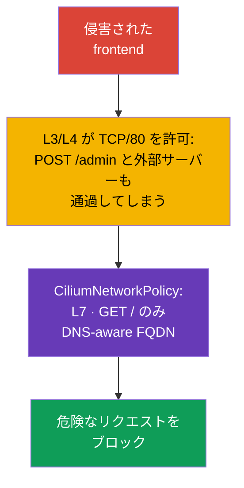

[Русская версия](ru.md) · [Eng version](README.md) · [Versión en español](es.md) · [Version française](fr.md) · [Deutsche Version](de.md) · [ქართული ვერსია](ge.md) · [繁體中文版](tw.md)

# 第06章. Cilium NetworkPolicy

> **課題。** 侵害された frontend は、許可された backend への TCP アクセスを使って
> `POST /admin` を実行したり、DNS 解決後に外部 IP へデータを送信したりできます。
> L3/L4 NetworkPolicy ではこれらを区別できません。L7、FQDN、identity-aware の制限がなければ、
> 許可された接続は危険なリクエストまたはデータ流出の経路になり、可観測性がなければ DROP の検知と調査が困難になります。

> **この先。** ネイティブの NetworkPolicy でも Pod の分離や metadata service へのアクセス遮断は可能です。
> ただし、一部のシナリオでは不十分です。特定の HTTP メソッドだけを許可し、外部サービスの DNS 名を考慮し、
> クラスター宛てのトラフィックとインターネット宛てのトラフィックを区別し、各 DROP（送信元に応答せずパケットを破棄すること）の理由を確認する必要があります。
> **CiliumNetworkPolicy** は、L7 フィルタリング、FQDN ルール、identity、可観測性によって、Cilium のネットワークポリシーの基本機能を拡張します。
> この章は CKS Cluster Setup の「Use Network security policies to restrict cluster level access」という能力を深め、ラボ 102 の基礎となります。
>
> CKS の公開カリキュラムは、すべての試験環境で CiliumNetworkPolicy、`toFQDNs`、Hubble を必須としていません。
> したがって Cilium 固有のコマンドと CRD は、実際に Cilium が提供されるクラスター向けの発展内容として扱ってください。

> **Cilium がクラスターに自然に現れることはありません。** これは独立した CNI であり、クラスター管理者が
> `cilium` CLI または Helm chart を用いて、作成済みクラスター上に、またはクラスター作成時の標準 CNI の代わりにインストールします。
> 環境にまだ Cilium がインストールされていない場合、この章の例はインストールするまで適用できません。公式手順は
> [Cilium のクイックインストール](https://docs.cilium.io/en/stable/gettingstarted/k8s-install-default/)です。
> この章で扱うものより詳細な L3/L4/L7 ルールの例は、公式の
> [Network Policy の概要](https://docs.cilium.io/en/stable/security/policy/)にあります。Layer 3、Layer 4、Layer 7 Policies の個別ページも含まれます。

> **CKA で必要な知識。** CNI の基本モデル、Pod と Service の IP アドレスは
> [CKA 第30章](../../../cka/course/30/jp.md)を、CNI の目的とネットワークスタックにおける位置は
> [CKA 第40章](../../../cka/course/40/jp.md)を参照してください。Kubernetes NetworkPolicy の基本構文はこのコースの第04章で扱っています。
> ここでは繰り返さず、Cilium の機能を利用します。

> 🧠 `kube-proxy` は `ClusterIP:port` を選択された Pod に転送し、CNI は別途 `NetworkPolicy` を適用します。

## 06.0. 新しく学ぶこと: kube-proxy の代わりとなる eBPF datapath

### Cilium なしのベースライン: 現在 Service までトラフィックが届く仕組み

この章以前は、Service へのパケット経路は `kube-proxy` が提供していました。仕組みは三つの部分からなります。

- **監視。** 各ノードの `kube-proxy` は Service と `EndpointSlice` オブジェクトの変更を監視します。
- **カーネルのプログラミング。** 変更ごとにカーネルルールを更新します。通常は `iptables` または `nftables` を使います（非推奨になりつつある `ipvs` も可能です）。
- **インターセプトと DNAT。** ルールが `ClusterIP:port` 宛てのトラフィックをインターセプトし、ランダムまたは session affinity により選んだ特定 Pod の IP へ DNAT します。

第04章の `NetworkPolicy` は、このモデルの上にある別のレイヤーです。CNI は `NetworkPolicy` オブジェクトを読み、実装に応じて kube-proxy ルールの**前または後**でパケットを許可・ブロックする独自のカーネルルールを追加します。

> 🧠 Cilium は workload の labels を identity に結び付け、eBPF maps を通じて L3/L4 policy を適用します。L7 には proxy path が必要です。

### Cilium が変えるもの: 主要な L3/L4 datapath としての eBPF

Cilium は同じパケット経路に別のアーキテクチャを提供します。

- **主要な L3/L4 datapath としての eBPF。** pod networking、L3/L4 policy、kube-proxy-replacement に、Cilium は eBPF プログラムと BPF maps を使用します。プログラムはネットワークインターフェースや cgroup など、カーネルの hook point にアタッチされます。
- **線形の `iptables` 走査ではなく map lookup。** kube-proxy-replacement では、Cilium は Service/backend の state を BPF maps に保持し、長い `iptables` chain を順番に走査せず lookup を実行します。これは `iptables` モードの kube-proxy との重要な違いです。この比較を kube-proxy の `nftables` に当てはめないでください。現代の nftables モードも map-based dispatch（`verdict map`）を用い、おおむね O(1) の lookup を行います。詳細は kube-proxy の nftables モードに関する Kubernetes 公式ブログを参照してください。
- **二つの動作モード。** 完全な **kube-proxy-replacement** はすべての Service load balancing を eBPF で実装し、クラスターから `kube-proxy` を削除できます。協調モードでは `kube-proxy` が引き続き Service を処理し、Cilium はその横で policy enforcement と L7 機能を追加します。

どちらのモードも production で利用でき、CKS 試験はいずれか一方を必須としていません。

レイヤーを区別することが重要です。Cilium の L3/L4 forwarding、policy enforcement、kube-proxy-replacement における Service load balancing は、主に eBPF で実装されます。

L7 HTTP/DNS policy は異なる方法で動きます。選択されたトラフィックは node-local の userspace proxy（Envoy または DNS proxy）へリダイレクトされます。現在の stable 版 Cilium では、その proxy redirection に netfilter/`iptables` TPROXY も使用されることがあります。したがって Cilium を、どの機能でも `iptables` と userspace を完全に排除する datapath と説明すべきではありません。

> 🎯 labels/CIDR と L3/L4 ポートにはネイティブの `NetworkPolicy` を、L7 HTTP/DNS、`toFQDNs`、`toEntities`、Cilium の可観測性には CNP を使います。

### `NetworkPolicy` で十分な場合と CNP が必要な場合

仕組みの違いから、ネイティブの `NetworkPolicy` と `CiliumNetworkPolicy`（CNP）の使い分けについて実践的な基準が導けます。

- **まずネイティブの `NetworkPolicy` から始めます。** Pod 間のトラフィックを labels、namespace、CIDR、TCP/UDP/SCTP ポートで許可または禁止するだけなら、これで十分です。ポリシーはクラスターと CNI をまたいで移植できるため、理由なく CNP に移行すると移行と保守が複雑になります。
- **許可済みの L3/L4 接続内部を制御する必要があるときに CNP へ移ります。** 典型的な契機は、特定の HTTP メソッドまたは path（L7）の制限、特定の外部 DNS 名（`toFQDNs`）の許可または禁止、`world`、`cluster`、`host` 宛てのトラフィック（`toEntities`）の明示、あるいは DROP 調査のため Hubble で可観測性を得ることです。
- **両方のモデルを組み合わせられます。** ネイティブの `NetworkPolicy` は移植可能な L3/L4 制御として残し、L3/L4 だけでは足りない箇所に CNP がより細かい granularity を追加します。allow/deny を組み合わせた評価の詳細は、この章の後半で扱います。

> 🧠 CNP はネイティブの `NetworkPolicy` に labels、L7、FQDN を追加します。明示的な Cilium deny は allow より優先されます。

## 06.1. Cilium ポリシーが必要な理由

ネイティブの `NetworkPolicy` は L3/L4 のネットワーク関係、すなわち TCP/UDP トラフィックを交換できる Pod、CIDR、ポートを記述します。HTTP path、DNS 名、接続のコンテキストを意図的に認識しません。Cilium は eBPF でネットワークポリシーを実装し、workload identity、L7 proxy、可観測性を加えます。

攻撃シナリオを考えます。frontend がアプリケーションの脆弱性により侵害されました。通常のポリシーは backend への TCP/80 を許可できるため、攻撃者にも同じアクセスが得られます。backend が `GET /` だけを受け付けるなら、TCP 接続が許可されていても `POST /admin` や `DELETE /data` は通すべきではありません。もう一つのよくあるシナリオは、pod が DNS 解決後に任意の外部 IP へ接続し、攻撃者へデータを送ることです。



Cilium は IP だけでなく identity に基づいてポリシーを評価します。Kubernetes workload の identity は labels から構築されます。Pod を再作成すると IP は変わりますが、labels が同じなら `endpointSelector` を持つルールは引き続き動作します。

| 機能 | ネイティブの `NetworkPolicy` | `CiliumNetworkPolicy` |
|---|---|---|
| L3: pod/CIDR | はい | はい、labels と identities |
| L4: TCP/UDP/SCTP ポート | はい | はい |
| L7: HTTP、DNS | いいえ | はい |
| FQDN によるルール | いいえ | はい、`toFQDNs` |
| `world` / `cluster` / `host` | いいえ | はい、`toEntities` |
| フローの可観測性 | CNI に依存 | Hubble と `cilium` CLI |

`CiliumNetworkPolicy`（CNP）はオブジェクトの namespace 内で作用します。チームまたはアプリケーションのポリシーに適しています。`CiliumClusterwideNetworkPolicy`（CCNP）はクラスター全体に作用し、たとえば全 namespace で危険な egress を禁止するような、プラットフォーム共通ルールに便利です。CCNP は影響がより大きく、広すぎる selector の誤りはクラスター全体を切断し得ます。まず個別の namespace でルールを検証し、狭い labels を使ってください。

### ネイティブの `NetworkPolicy` との併用

[第04章](../04/jp.md)の `NetworkPolicy` と CNP/CCNP は、同時に同じ endpoint を選択できます。allow ルールはまとめて考慮されますが、明示的な Cilium の `ingressDeny`/`egressDeny` は CNP、CCNP、ネイティブ Kubernetes `NetworkPolicy` の**すべての** allow ルールより優先されます。したがって通常の `NetworkPolicy` の allow で Cilium deny を回避することはできません。予期しない `DROP` が起きたら、最後に適用した CNP だけに誤りを探すのではなく、これらすべてのオブジェクト、その selectors、方向を棚卸ししてください。ネイティブ policy は移植可能な L3/L4 制御として残り、Cilium は L7、FQDN、entities、可観測性で補完します。

> **Advanced: Kubernetes `ClusterNetworkPolicy`。** 最近の Cilium では、`NetworkPolicy`、CNP、CCNP に加えて Kubernetes `ClusterNetworkPolicy`（KCNP、`v1alpha2`）も適用できます。その tiers モデルは `Admin`、`NetworkPolicy`、`Baseline` を分離し、`Admin` tier のルールは CNP、CCNP、通常の `NetworkPolicy` より優先されます。これは platform-wide の境界に有用ですが、独立した必須 CKS トピックではありません。使用前に、対応する API とサポートが Cilium クラスターで有効か確認してください。

> 🎯 CNP では `endpointSelector` が Pod を、`fromEndpoints`/`toEndpoints` が identity を、`toPorts` がプロトコルとポートを選択します。ingress と egress はそれぞれ独立して default-deny を作ります。

## 06.2. L3/L4: 必要な workload とポートだけを許可する

endpoint は `endpointSelector` が選択するとポリシーの対象になります。`policyEnforcementMode: default` では、endpoint がポリシーに選択されたときに Cilium が enforcement を有効にします。`always` は全 endpoint で有効にします（allow ルールのない endpoint は拒否されます）。`never` は enforcement を無効にします。デフォルトでは allow-list は**方向ごとに独立して**作用します。`ingress` があれば allow ルールに一致するまで ingress は default-deny となり、`egress` があれば egress だけが同様に default-deny となります。`ingress` だけのポリシーは egress を閉じず、その逆も同様です。したがって selector は正確でなければなりません。

この動作は `enableDefaultDeny` で変更できます。`false` に設定した方向は、endpoint を default-deny に移す際に考慮されません。これにより管理者は、たとえば DNS interception のような cluster-wide policy を、endpoint を default-deny にして正当なトラフィックをブロックするリスクなく安全に適用できます。この例外を L7-policy に持ち込むべきではありません。`enableDefaultDeny` は layer-7 ルールには適用されず、対応する L7 allow-all なしで L7 rule を追加すると、明示的に default-deny を無効にしていても DROP が発生します。

Cilium は接続状態を追跡します。開始した ingress または egress フローを許可すると、**同じ接続の応答トラフィック**も許可されますが、逆方向の新しい接続が許可されるわけではありません。したがって応答のためだけにルールを機械的に複製せず、アプリケーションに独立した reverse callback が必要なら明示的に記述してください。

以下では、label `app: backend` を持つ backend が、同じ namespace `cks-102` の label `app: frontend` を持つ frontend からの TCP/80 だけを受け入れます。`fromEndpoints` は identity による L3 制限、`toPorts` はプロトコルとポートによる L4 制限です。

```yaml
apiVersion: cilium.io/v2
kind: CiliumNetworkPolicy
metadata:
  name: backend-from-frontend-http
  namespace: cks-102
spec:
  endpointSelector:
    matchLabels:
      app: backend
  ingress:
  - fromEndpoints:
    - matchLabels:
        app: frontend
    toPorts:
    - ports:
      - port: "80"
        protocol: TCP
```

ポリシーが機能していると判断する前に、manifest を適用してオブジェクトを確認します。

```bash
kubectl apply -f backend-l3-l4.yaml
kubectl -n cks-102 get ciliumnetworkpolicy
kubectl -n cks-102 describe ciliumnetworkpolicy backend-from-frontend-http

# Cilium が identity を構築する labels を最初に確認します。
kubectl -n cks-102 get pod --show-labels
```

namespace をまたぐトラフィックでは、`matchLabels` に namespace label を追加します。Cilium は `k8s:` 接頭辞付きの Kubernetes labels を自動的に追加します。namespace は通常、`k8s:io.kubernetes.pod.namespace` label で表されます。

```yaml
  ingress:
  - fromEndpoints:
    - matchLabels:
        k8s:io.kubernetes.pod.namespace: storefront
        app: frontend
    toPorts:
    - ports:
      - port: "8080"
        protocol: TCP
```

宛先が pod の場合、identity を任意の `toCIDR` ルールで置き換えないでください。CIDR は workload の再作成に追従せず、無関係な IP を含む可能性があります。`toCIDR` は、二つの Kubernetes Service を結び付ける通常の方法ではなく、安定した外部ネットワークまたは狭いサービス用範囲に対して正当化されます。

> 🔬 Active FTP は動的な逆方向ポートを使うため、静的な L3/L4 CNP では表現できません。protocol-aware gateway、または固定範囲を持つ passive FTP が必要です。

### Corner case: active FTP は L3/L4 では表現できない

Active FTP は L3/L4-policy の限界を示します。クライアントは TCP/21 に control 接続を開き、data 接続用のポートをサーバーに通知します。その後、**サーバー自身が**このポートに向けてクライアントへ新しい TCP 接続を開始します。ポートは事前に分からず session 内で動的に合意されるため、静的な `toPorts`/`fromEndpoints` ルールでは「後で両者が合意するポートへの着信接続を許可する」を記述できません。

Kubernetes と Cilium より前は、**カーネルレベルの connection tracking** がこの問題を解決していました。`nf_conntrack_ftp` module は control channel を解析し、合意されたポートを確認して、related connection を許可済みとして動的に追加します。`kube-proxy` とその `iptables`/`nftables` ルールだけではこの課題を解決しません。解決するのは Service forwarding の仕組みそのものではなく、netfilter 上の別個の conntrack helper です。

application-level semantics をサポートするプロトコルでは、Cilium は L7 proxy を使用できますが、FTP はその対象ではありません。

標準の CiliumNetworkPolicy は FTP-aware helper や組み込み FTP L7 parser を提供しません。したがって Cilium は FTP control channel から active-mode data connection の negotiated port を自動的に特定し、そのための一時的な policy 許可を作成できません。

Kubernetes 環境では、data port の範囲をあらかじめ限定した **passive FTP** が望ましい選択です。その場合、TCP/21 の control traffic と固定範囲の data traffic は通常の L3/L4 policy rules（`endPort`）で表現できます。

legacy アプリケーションで動的に合意するポートを持つ active FTP がどうしても必要なら、これは標準 CNP ではなく、別個の protocol-aware gateway/proxy または専用に設計されたネットワーク層の課題です。

組み込みの application-level ルールでは、現代の Cilium では HTTP と DNS を基準にしてください。gRPC は `rules.http` を用いた HTTP/2 semantics によってフィルタリングされ、独立した gRPC rule type はありません。Kafka-aware network policy は Cilium 1.20 で削除されました。

> 🎯 `toPorts.rules.http` では必要な method と path だけを許可し、許可されるリクエストと拒否されるリクエストの両方を検証します。

## 06.3. L7: HTTP と DNS を制限する

L7 ルールは `toPorts` 要素の内部に追加します。Cilium は選択されたトラフィックを、対応する L7-proxy（HTTP または DNS）経由にします。重要な結果として、L7 ルールは指定したポート上で正しく認識されたプロトコルにだけ適用されます。TLS termination を構成していないポートでクライアントが TLS を話す場合、HTTP のフィルタリングは期待できません。proxy には plaintext HTTP が見えないためです。

次のルールは frontend から backend への `GET /` だけを許可します。path の正規表現 `^/$` は意図的に狭くしています。`/healthz`、`/api`、すべての `POST` は一致せず、拒否されます。

```yaml
apiVersion: cilium.io/v2
kind: CiliumNetworkPolicy
metadata:
  name: backend-read-only
  namespace: cks-102
spec:
  endpointSelector:
    matchLabels:
      app: backend
  ingress:
  - fromEndpoints:
    - matchLabels:
        app: frontend
    toPorts:
    - ports:
      - port: "80"
        protocol: TCP
      rules:
        http:
        - method: "GET"
          path: "^/$"
```

成功するリクエストだけでなく、拒否も検証してください。テスト Pod のイメージには `curl` または別の HTTP クライアントが必要です。

```bash
kubectl -n cks-102 exec deploy/frontend -- curl -i http://backend/
kubectl -n cks-102 exec deploy/frontend -- \
  curl -i -X POST http://backend/

# 期待結果: GET は 200 を返す。一致しない L7 リクエストは Cilium proxy が拒否し、通常は 403 となる。
```

API では、広い `path: ".*"` を使うより、許可するメソッド、path、必要なら header を列挙する方が安全です。L7-policy はアプリケーションの authentication や authorization を置き換えません。到達可能な surface は減らしますが、API のユーザーや business rule を認識しないからです。

Cilium はリクエスト名により DNS をフィルタリングすることもできます。必要なしに L7-proxy を有効にしないでください。トラフィック経路に処理を加えるため、別途 load test が必要です。

> 🔬 gRPC は `POST` と method path を使う HTTP/2 としてフィルタリングされます。

### gRPC: HTTP によるフィルタリング、ただし load balancing には注意点がある

Cilium には独立した「gRPC parser」はありません。gRPC は HTTP/2 上で動作し、各 method call は通常の HTTP request として、`/パッケージ.サービス/メソッド` 形式の path への `POST` にエンコードされます。したがって gRPC の L7 filtering は、先ほど見た HTTP の `path` ルールと同じものです。ただし regex または完全な path は `/` ではなく `/cloudcity.DoorManager/GetName` を記述します。

たとえば次のルールは、`public-terminal` が `cc-door-mgr` に status の読み取りだけを実行でき、access code の変更はできないようにします。

```yaml
apiVersion: cilium.io/v2
kind: CiliumNetworkPolicy
metadata:
  name: door-read-only-grpc
spec:
  endpointSelector:
    matchLabels:
      app: cc-door-mgr
  ingress:
  - fromEndpoints:
    - matchLabels:
        app: public-terminal
    toPorts:
    - ports:
      - port: "50051"
        protocol: TCP
      rules:
        http:
        - method: "POST"
          path: "/cloudcity.DoorManager/GetName"
        - method: "POST"
          path: "/cloudcity.DoorManager/GetLocation"
```

`SetAccessCode` 呼び出しはいずれのルールにも一致せず拒否されます。クライアントは通常の network timeout ではなく、gRPC status `PERMISSION_DENIED` を受け取ります。demo application を用いた段階的な例は公式ドキュメントの [gRPC の保護](https://docs.cilium.io/en/stable/security/grpc/)にあります。

Cilium が **完全に kube-proxy を置き換える**（`kube-proxy-replacement`）場合、load balancing には別の問題が起きます。gRPC は一つの長寿命 TCP 接続を維持し、その上で多数の call を連続して流します。Cilium の通常の eBPF load balancing は、内部の個々の call ごとではなく、**接続確立時に一度だけ** Pod を選択します。クライアントが接続を開いたまま長く維持すると、すべてのトラフィックが同じ Pod へ送られ、残りの backend replica は負荷の分担を受けません。これは connection pinning と呼ばれます。

解決策は、必要な Service に対して Cilium の **Proxy Load Balancing** を有効にすることです。トラフィックは組み込み Envoy を経由し、Envoy は HTTP/2 stream の内部を見て、接続全体ではなく個々の gRPC call を Pod 間に分散できます。この設定がない場合、kube-proxy のないクラスターの長寿命 gRPC client は、replica 間で負荷が均等かを個別に確認してください。

これは workload manifest を変更せず、Service オブジェクトへの一つの annotation で有効にします。

```bash
kubectl annotate service payment-grpc-service \
  service.cilium.io/lb-l7=enabled
```

この後 `payment-grpc-service` へのトラフィックは Cilium 管理の Envoy を経由し、TCP 接続全体を一つの backend に pin するのではなく、個々の call を Pod 間に分散します。load balancing algorithm は別の annotation、`service.cilium.io/lb-l7-algorithm`（`round_robin`、`least_request`、`random`）で指定できます。この機能は **beta** の段階です。production で有効にする前に、自身の Cilium version で動作を確認してください。Hubble によるトラフィック観測を含む段階的な例は、公式ドキュメントの [Kubernetes Services の Proxy Load Balancing](https://docs.cilium.io/en/stable/network/servicemesh/envoy-load-balancing/)にあります。

**Envoy が物理的に存在する場所。** 各 Pod の sidecar ではありません。Envoy は Cilium image に含まれ、**各 node で一つだけ**動作します。`cilium-agent` 内の process として、またはその node のすべての Pod が共有する独立した `cilium-envoy` DaemonSet として動きます。上で扱ったシナリオでは、L7-policy または proxy load balancing（`lb-l7`）によりリダイレクトされたトラフィックが通ります。これは網羅的なリストではありません。Cilium Ingress、Gateway API、`CiliumEnvoyConfig` もトラフィックを同じ per-node Envoy に送ります。これらの proxy-based 機能がどれも有効でない通常の Pod-to-Pod L3/L4 traffic は、userspace を経由せず eBPF-datapath 上に残ります。

**latency と接続パラメータへの影響。** リダイレクトされた各パケットは、別 node や Pod へのネットワークを通るのではなく、同じ node の userspace process である Envoy を追加で通過します。これにより次の影響があります。

- **各 request にわずかな追加 latency。** kernel から userspace への遷移とその復帰に加え、protocol（HTTP/gRPC）の解析が発生します。local hop では通常小さいもののゼロではないため、有効化前に実際の負荷で測定してください。
- **node の CPU と memory の追加使用。** Envoy は独立した process としてトラフィックを処理するため、大量の L7 traffic では node の負荷が比例して増加します。
- **source address は proxy path と configuration に依存します。** Envoy を通ること自体は、backend が必ず proxy 自身の source IP を見ることを意味しません。L7 policy enforcement では Cilium はデフォルトで original source address を使います。`CiliumEnvoyConfig`、Ingress、Gateway API には source visibility のための個別設定とルールがあります。そのため backend から見える source IP/port は、Envoy を使うという事実だけから推測せず、特定のモードで確認してください。
- **overhead は選択した traffic にだけ適用されます。** L7 rule も `lb-l7` annotation もない通常の L3/L4 connection はこのコストを負担せず、Envoy を経由しない高速な eBPF path に残ります。

> **現状。** Cilium の Kafka L7 filtering は version 1.18 で deprecated となり、version 1.20 で削除されました。CKS では L7 HTTP と DNS/`toFQDNs` を対象とし、Kafka policy は現在の実践ではなく歴史的な例としてのみ扱ってください。

> 🎯 信頼できる CoreDNS への UDP/TCP 53 を許可し、外部アクセスを `toFQDNs` で制限します。Cilium は観測した DNS 応答と FQDN cache を使用します。

## 06.4. DNS-aware egress と `toFQDNs`

public SaaS service の IP は変化し、CDN は異なる address を返します。アプリケーションが通常知っているのは IP ではなく名前です。`toFQDNs` は、Cilium の DNS-proxy が許可された DNS response で確認した IP に名前を対応付けることで、名前への egress を許可します。これは YAML を適用する時点での静的な DNS resolve ではありません。proxy は TTL を考慮して FQDN cache を満たし、その cache の IP への接続を許可します。したがって DNS resolution は、正確な selector で選んだ信頼できる cluster DNS（たとえば CoreDNS）だけに向けてください。Cilium は自ら DNS を問い合わせず、任意の nameserver を信頼すべきではありません。

以下の policy は frontend から CoreDNS への DNS query と、`example.com` だけへの HTTPS を許可します。`rules.dns` は DNS query を許可し、`toFQDNs` は許可された名前に対して返された IP への後続接続を許可します。

```yaml
apiVersion: cilium.io/v2
kind: CiliumNetworkPolicy
metadata:
  name: frontend-external-api-only
  namespace: cks-102
spec:
  endpointSelector:
    matchLabels:
      app: frontend
  egress:
  - toEndpoints:
    - matchLabels:
        k8s:io.kubernetes.pod.namespace: kube-system
        k8s:k8s-app: kube-dns
    toPorts:
    - ports:
      - port: "53"
        protocol: UDP
      - port: "53"
        protocol: TCP
      rules:
        dns:
        - matchPattern: "*"
  - toFQDNs:
    - matchName: "example.com"
    toPorts:
    - ports:
      - port: "443"
        protocol: TCP
```

`matchName` は厳密に一つの名前を選択します。管理対象の subdomain の集合には、たとえば `"*.example.com"` のように `matchPattern` を使います。この wildcard を apex name の `example.com` も許可するものと考えてはいけません。`example.com` とその subdomain の両方が必要なら、別々のルールで記述します。明示的な必要性なく `"*"` を使わないでください。`toFQDNs` におけるこの pattern は DNS name による制限を外し、一致したすべての名前について DNS cache から得た宛先を許可します。同じルールのほかの条件、たとえば `toPorts` は引き続き有効です。適用前に、実際のクラスターで CoreDNS の labels を確認してください。一部のインストールでは `k8s-app: kube-dns` とは別の label が使われます。

```bash
kubectl -n kube-system get pod --show-labels | grep -E 'coredns|dns'
```

次の例は説明目的の手動確認であり、決定的な acceptance test ではありません。IANA は、documentation domain（`example.com`、`example.org` など）の HTTP service は best-effort で提供され、software の testing endpoint を意図したものではないと明記しています: https://www.iana.org/news/2024/example-domain-http-methods 。環境で `example.com`/`www.google.com` に到達できない場合（network restriction、一時的な障害、特定 network での block）、それは policy の誤りを意味しません。policy を適用する**前に** DNS resolution と正常な HTTPS を独立して確認した FQDN に置き換えてください。

```bash
kubectl -n cks-102 exec deploy/frontend -- \
  curl -I --max-time 5 https://example.com
kubectl -n cks-102 exec deploy/frontend -- \
  curl -I --max-time 5 https://www.google.com
```

policy を適用する前に、上の両方の request が制限なしで通ることを確認します。その後に `toFQDNs` を適用して比較してください。`example.com:443` は通過し、`www.google.com:443` は外部 service が偶然到達不能だからではなく、policy によってブロックされるべきです。

`toFQDNs` は完全な DLP や HTTP `Host` の検証ではありません。観測された DNS resolution による network access control です。DoH/DoT は DNS-proxy から DNS query を隠すため、それ自体では FQDN cache を満たしません。IP への直接接続も FQDN mapping を作りません。その IP が許可された DNS response によりすでに cache にあるか、より広い L3/L4 rule が許可する場合にのみ動作します。threat model にとって重要なら、未許可の DNS server、DoH/DoT、直接 IP を許可しないでください。信頼できる DNS への egress を制限し、必要な DNS visibility を有効にし、network boundary の proxy/firewall とルールを組み合わせます。

> 🔬 `world`、`cluster`、`host`、および platform-wide 境界の CCNP。狭い scope で test し、host firewall と system traffic を考慮してください。

## 06.5. Entities と cluster-wide policy

Entities は、Kubernetes labels が適さない address group に読みやすい identifier を与えます。特に有用な値は次のとおりです。

| Entity | 含まれるもの | 典型的な用途 |
|---|---|---|
| `world` | クラスター外の address | 外部 API への egress または外部からの ingress を許可する |
| `cluster` | クラスター内部の endpoints | クラスター内 traffic をインターネットから分離する |
| `host` | node の local host endpoint | node へのアクセスを明示的に制御する |
| `remote-node` | クラスターの他の node | 必要な node 間通信を許可する |
| `kube-apiserver` | Kubernetes API server | workload の API へのアクセスを制限する |

たとえば、インターネットからの HTTPS だけを受け入れる Service は label で選択し、ingress entity `world` に制限できます。

```yaml
apiVersion: cilium.io/v2
kind: CiliumNetworkPolicy
metadata:
  name: public-gateway-from-world
  namespace: cks-102
spec:
  endpointSelector:
    matchLabels:
      app: public-gateway
  ingress:
  - fromEntities:
    - world
    toPorts:
    - ports:
      - port: "443"
        protocol: TCP
```

platform protection には CCNP を使用します。次の例は、policy に選択されたすべての endpoint から metadata IP への egress を拒否しつつ、その他の egress は維持します。適用可能な `egress` policy 自体が egress default-deny を有効にするため、ここでは明示的な allow `toEntities: [all]` が必要です。`egressDeny` はこの allow-all やほかの CNP/CCNP のルールを含む、あらゆる allow より優先されるため、metadata IP が誤って公開されることはありません。まず system workload に metadata call が必要かを評価し、必要なら別の selector または namespace で除外してください。

```yaml
apiVersion: cilium.io/v2
kind: CiliumClusterwideNetworkPolicy
metadata:
  name: deny-cloud-metadata
spec:
  endpointSelector: {}
  egress:
  - toEntities:
    - all
  egressDeny:
  - toCIDR:
    - 169.254.169.254/32
```

`host` を無害な object と見なさないでください。`toEntities: host` は local node と host-networked workload への network access を制御するため、kubelet や host 上のほかの TCP/UDP listener への経路を開く可能性があります。runtime CRI socket は別の仕組みです。たとえば containerd は通常、Unix domain socket の `/var/run/containerd/containerd.sock` 経由で利用され、その露出は `toEntities: host` そのものではなく filesystem mounts/`hostPath` と Pod privileges に依存します。host traffic を制限するには Cilium host firewall、`hostFirewall.enabled` mode、control plane traffic を理解する必要があります。node や API server へのアクセスを失わないよう、test cluster で確認してください。runtime socket へのアクセスは mount/privilege controls で別途制限します。

## 06.6. Hubble による可観測性と検証

### Hubble とは何か、どの課題を解決するか

通常の `NetworkPolicy` または `CiliumNetworkPolicy` は「何が許可されるか」という問いには答えます。しかし「実際に何が起きたか」、つまりなぜ特定の request が通らなかったのか、DROP がどの rule に対応するのか、client から TCP-connect が見えるのか、または拒否が L7 で起きたのかには答えません。そのようなツールがなければ、調査は YAML を読み返して推測することになります。

**Hubble** は Cilium の observability component です。datapath がすでに収集する eBPF events を読み、source/destination identity、L4/L7 context、verdict（`FORWARDED`/`DROPPED`）、拒否理由を含む読みやすい flow event stream に変換します。Kubernetes audit log の代わりではなく、request content を代わりに読んでもくれません。特定の connection に対して Cilium が何を決定し、なぜそうしたかを示します。

> 🔬 Hubble Server/Relay/UI の architecture、CLI、components は Cilium の version と installation method に依存します。

architecture 上、Hubble は四つの部分で構成されます。

- **Hubble Server** — `cilium-agent` に組み込まれ、各 node で動作します。gRPC で flow events を提供します。
- **Hubble Relay**（`hubble-relay`）— すべての node の Server に接続する独立 component で、node ごとではなく一つの cluster-wide view を提供します。
- **Hubble CLI**（`hubble`）— command-line client です。cluster-wide view には Relay、一つの node には local Server に接続します。
- **Hubble UI**（`hubble-ui`）— Relay の上にある、service connection map を備えた任意の graphical interface です。

**有効化方法。** managed distribution と標準 Cilium installation では、通常 installation または update 時の Helm flag、たとえば `--set hubble.relay.enabled=true --set hubble.ui.enabled=true` により Hubble を有効にします。正確な flag は chart version に依存します。CKS とこの章では、一つだけ覚えれば十分です。クラスターですでに Hubble が有効なら、`cilium status` がその状態を示し、下のように Relay への port-forward で `hubble` CLI を接続できます。ラボ用に Hubble をゼロから有効化する必要はありません。これは CNP の一部ではなく、クラスター管理者の仕事です。

> 🎯 想定される許可・拒否 traffic を生成してから、namespace、verdict、protocol の filter で Hubble flows を観察します。

test の前に Cilium agent が健全であることを確認します。コマンドは通常 `cilium` CLI が利用できる workstation で実行します。Hubble を有効にする正確な方法は Cilium installation に依存します。

`hubble` は `cilium` CLI の一部ではなく、別の binary です。GitHub から適切な release をダウンロードして、workstation に一度 install する必要があります。platform ごとの手順は公式の [Hubble Client のインストール](https://docs.cilium.io/en/stable/observability/hubble/setup/#install-the-hubble-client)にあります。install 後は `hubble help` で binary を確認します。

```bash
cilium status --wait
cilium connectivity test

# Hubble relay が有効なら、CLI がそれへの local connection を作成します。
cilium hubble port-forward &
hubble status

# 学習用 namespace からの traffic と拒否のみを表示します。
hubble observe --namespace cks-102 --verdict DROPPED
hubble observe --namespace cks-102 --protocol http
```

ラボ 102 における L3/L4、L7、FQDN の検証手順は再現可能であるべきです。

1. `frontend` と `backend` が Running であり、その labels が selectors と一致することを確認します。
2. L3/L4 CNP を適用します。frontend から backend:80 への request は通過し、`app: frontend` を持たない Pod からは timeout または DROP になります。
3. L7 CNP rule を置き換えるか追加します。`GET /` は `200` を返し、`POST /` は proxy の拒否（通常 `403`）を受けるべきです。
4. DNS/FQDN policy を適用します。許可された名前への resolve と HTTPS を確認し、次に未許可の名前へ接続を試みます。
5. 別の terminal で Hubble を見て、結果の証拠として許可・拒否 traffic の flow を保存します。

diagnosis には agent CLI と Kubernetes object も役立ちます。

```bash
kubectl -n cks-102 get ciliumnetworkpolicy -o yaml
kubectl -n kube-system get pods -l k8s-app=cilium

# 選択した node の cilium Pod 内で実行します。
kubectl -n kube-system exec ds/cilium -- cilium-dbg endpoint list
kubectl -n kube-system exec ds/cilium -- cilium-dbg policy get
```

`hubble observe` が空の場合は、最初に `hubble status`、Hubble Relay の有無、kubeconfig context、namespace/verdict filters を確認します。default deny の後に DNS が動かなくなった場合、ほぼ常に実際の CoreDNS endpoints への UDP/TCP 53 を許可していないことが原因です。L7 rule が意図せず一致しないなら、port、protocol、HTTP method、path の正規表現、TLS を確認してください。適切な configuration のない encrypted HTTP は L7-proxy から見えません。

> 🎯 labels/selectors、direction、ports、DNS を確認してから、Hubble で許可された flow と拒否された flow を比較します。狭い allow から始め、rollback を用意して rollout してください。

## 06.7. よくある間違いと安全な導入順序

| 症状 | 考えられる原因 | 確認すること |
|---|---|---|
| policy 後に名前を resolve できない | DNS が許可されていない、または CoreDNS selector が誤っている | CoreDNS labels、UDP と TCP 53、Hubble DROPPED |
| `GET` と `POST` の両方が拒否される | L3 identity または L4 port が一致していない | endpoint labels、Service port と targetPort |
| L7 rule が request を制限しない | traffic が HTTP として認識されない、またはより広い rule がある | protocol、TLS、`cilium policy get`、Hubble HTTP flows |
| FQDN policy で service にアクセスできない | 名前が DNS response と一致しない、または IP cache がまだ満たされていない | `hubble observe --protocol dns`、`matchName`、TTL |
| CCNP が system traffic を壊した | selector が広すぎる、または system endpoints が考慮されていない | policy scope、namespace/labels、test namespace での rollout |
| Hubble に event がない | Hubble Relay/CLI が接続されていない、または filter が狭すぎる | `hubble status`、port-forward、filters を外す |

**Cilium Policy Audit Mode** は L3/L4-policy 準備段階で役立ちます。daemon（`--policy-audit-mode=true`）または選択した endpoint で有効にすると、policy なら破棄する traffic を通過させ、対応する policy verdict を記録します。この mode では、その traffic を `--verdict DROPPED` だけで探さないでください。policy verdicts を観察します。

```bash
hubble observe flows -t policy-verdict --namespace cks-102
```

将来の deny に一致する flow は、connection がまだ通っていても `AUDITED` として見えます。Audit Mode を無効にした後、同じ test は rule が実際に禁止する場合 `DENIED` となり、allow rule が flow をカバーする場合は `ALLOWED` のままです。まず Hubble でこれらの events を集め、allow rules を絞り、それから enforcement を有効にしてください。これは diagnostic 用の一時的 mode であり、production protection ではありません。この mode では block は適用されず、L7-policy の実際の HTTP/DNS test を置き換えるものでもありません。

安全な順序は次のとおりです。staging でまず Hubble を観察し、実際の flows の baseline を保存します。必要なら Policy Audit Mode を短時間使い、その後 narrow allow を追加して test Pod から確認します。その後に初めて deny を有効にするか production の scope を広げます。production cluster で `endpointSelector: {}` を持つ CCNP から始めないでください。各変更には rollback が必要です。履歴なしの手動編集ではなく、`kubectl delete ciliumnetworkpolicy <name> -n <namespace>` または GitOps rollback を使います。

> 🏭 CNP rollout: review、staging、GitOps、baseline flows、CCNP と application policy の ownership 分離。

## 06.8. production での適用方法

- **policy は workload の隣に保管します。** application 用 CNP は code review を通し、staging で test し、GitOps tool で適用します。platform team は広い影響を持つ CCNP を別途所有します。
- **Labels は security contract です。** team は `app`、`component`、`tenant` のような labels を固定し、workload が security 上重要な labels を任意に変更できないようにします。そうしないと policy selector が誤った endpoint を選び始める可能性があります。
- **L7 は重要な API に適用します。** 期待される HTTP methods/paths だけを許可することで lateral movement のリスクは減りますが、OAuth、mTLS、application authorization の代替にはなりません。
- **egress は DNS と宛先から構築します。** `toFQDNs` は既知の外部 API に用い、万能 rule としては使いません。DNS、proxy、perimeter firewall は defense in depth の層として残ります。
- **Hubble は incident 前に有効にします。** `DROPPED` flows の dashboard と flow logs の保存により、policy の誤りと application failure を区別し、疑わしい egress をより速く調査できます。

## 06.9. ミニ用語集

- **Cilium** — Kubernetes 向けの eBPF ベースの CNI および security platform。
- **CiliumNetworkPolicy (CNP)** — Cilium の namespace policy resource。
- **CiliumClusterwideNetworkPolicy (CCNP)** — Cilium の cluster-wide policy。
- **Identity** — Cilium が labels から構築する endpoint identifier。
- **L3/L4** — network layer と transport protocol/port。
- **L7** — HTTP method/path や DNS などの protocol layer。
- **`toFQDNs`** — DNS names と観測された DNS responses による egress rule。
- **Entity** — `world`、`cluster`、`host` など Cilium が定義する address group。
- **Hubble** — Cilium network flows の observability。
- **eBPF** — Cilium が datapath と policy enforcement を実装する Linux kernel mechanism。

## 06.10. この章のまとめ

- Cilium はネイティブ NetworkPolicy を L3/L4/L7 policy、identities、FQDN、Hubble observability で補完します。
- CNP は namespace 内で、CCNP はクラスター全体で作用します。広い CCNP には特に慎重な rollout が必要です。
- `endpointSelector` は保護する endpoint を選び、`fromEndpoints`/`toEndpoints` は L3 を、`toPorts` は L4 を定義します。
- HTTP L7 rules は必要な methods と paths だけを許可できますが、application authentication を置き換えるものではなく、認識可能な plaintext protocol が必要です。
- `toFQDNs` は名前で外部 egress を制限します。そのため DNS を別途許可し、DNS cache、TTL、可能な bypass を考慮する必要があります。
- `toEntities` は `world`、`cluster`、`host`、その他の system group へのアクセスを表現します。
- Hubble は許可・拒否された flows を示し、policy の検証と debugging の主な tool です。

## 06.11. 役立つ場面: 試験と実務

**試験で。** 必須なのは、移植可能な network security policies の適用スキルです。labels を素早く読み、namespace と direction（`ingress`/`egress`）を選び、必要な flow を許可して結果を証明します。**提供されたクラスターまたは fixture が Cilium を使っている場合**は、`endpointSelector` を持つ `CiliumNetworkPolicy` を作成し、必要なら HTTP や `toFQDNs` を制限し、`hubble observe` で flows を確認することも必要です。L7、FQDN、Hubble は Cilium 固有の発展内容であり、各問題で公開カリキュラムが保証する interface ではありません。それでも DNS は別の rule で許可してください。

**実務で。** Cilium policy は architectural boundary を実行可能な rule に変換します。frontend には backend への任意アクセスを与えず、workload は任意のインターネットへ出ず、API への flow は必要な operation まで狭められます。Hubble により、これらの境界を rollout 中や incident 調査中に検証できます。

## 06.12. 自己確認問題

<details>
<summary>1. resource format 以外で、CNP はネイティブの `NetworkPolicy` とどう異なりますか?</summary>

CNP は labels から構築された Cilium identities を使用し、L7 HTTP/DNS filtering、`toFQDNs`、entities（`world`、`cluster`、`host`）、Hubble observability を追加します。ネイティブ NetworkPolicy は移植可能な L3/L4 control として残り、CNP/CCNP が補完します。明示的な Cilium deny は両方の policy type の allow より優先されます。
</details>

<details>
<summary>2. endpoint が CNP に選択されているが、traffic が allow rule のどれにも一致しない場合、その endpoint の ingress はどうなりますか?</summary>

`policyEnforcementMode: default` では、endpoint は適用可能な policy が記述する direction について isolated になります。CNP に `ingress` があれば、allow rule に一致するまで ingress は default-deny となります。同様に `egress` は outgoing traffic だけを isolated にします。
</details>

<details>
<summary>3. 一つの CNP rule で「frontend から backend の TCP/80 のみ」をどう表現しますか?</summary>

CNP は `app: backend` を持つ `endpointSelector` で backend を選び、`ingress` では `app: frontend` を持つ `fromEndpoints` を使います。`toPorts` に port `"80"` と `protocol: TCP` を設定します。namespace をまたぐ connection では、source の `matchLabels` に `k8s:io.kubernetes.pod.namespace` を追加します。
</details>

<details>
<summary>4. TCP/80 を許可しても `POST /admin` を制限できないのはなぜですか。どうすれば制限できますか?</summary>

L3/L4 rule は port 80 上の TCP connection 全体を許可し、HTTP method や path を区別しません。`toPorts` 内に `rules.http` を追加します。たとえば `method: "GET"` と狭い `path: "^/$"` です。Cilium L7-proxy は一致しない request を通常 403 で拒否します。
</details>

<details>
<summary>5. `toFQDNs` はどのように動き、なぜ DNS を別途許可する必要がありますか?</summary>

`toFQDNs` は YAML 適用時に名前を resolve しません。Cilium DNS-proxy が許可された DNS response を観察し、TTL を持つ FQDN cache を満たして、得られた IP への connection を許可します。そのため Pod には信頼できる CoreDNS への DNS を別途許可します。DoH/DoT はこの cache を満たさず、直接 IP は FQDN mapping を作りません。
</details>

<details>
<summary>6. entities `world`、`cluster`、`host` はいつ適し、なぜ `host` には特別な注意が必要ですか?</summary>

`world` はクラスター外の address、`cluster` は内部 endpoint、`host` は local node host endpoint と host-networked workloads を表します。`host` へのアクセスは kubelet や node のほかの network listener に影響するため、慎重な host-firewall policy が必要です。runtime CRI socket は別の attack path です。通常は node filesystem 上の Unix socket であり、`hostPath`、privilege、host filesystem へのほかの access controls によって保護する必要があります。
</details>

<details>
<summary>7. Cilium が禁止された flow を破棄したことを証明するには、どの Hubble commands が役立ちますか?</summary>

`cilium status --wait` と Hubble access の設定後、`hubble observe --namespace cks-102 --verdict DROPPED` で拒否を観察できます。HTTP と DNS の対応付けには、それぞれ `hubble observe --namespace cks-102 --protocol http` と DNS observation を使います。Policy Audit Mode では、将来の deny は `hubble observe flows -t policy-verdict --namespace cks-102` で `AUDITED` として見えます。
</details>

<details>
<summary>8. production cluster で `endpointSelector: {}` を持つ CCNP から始めるのが危険なのはなぜですか?</summary>

CCNP はクラスター全体に作用し、空の selector は全 endpoint を選ぶため、allow/deny の誤りにより system traffic と application traffic を切断し得ます。まず狭い labels で個別 namespace 内の rule を検証し、Hubble で baseline を観察して、policy 削除または GitOps rollback による rollback を準備します。
</details>

## 練習

ラボ 102 で L3/L4、L7 HTTP、DNS-aware egress、Hubble を定着させましょう。すべての level を一度に debug しようとせず、policy の順序で課題を進めてください。

🧪 ラボ 102（Cilium NetworkPolicy L3/L4/L7）: [tasks/cks/labs/102](../../labs/102/README_JP.MD)

🧪 ラボ 115（Cilium をゼロから構築: kube-proxy replacement、WireGuard、SPIRE ベースの Mutual Authentication - advanced/production トラック、CKS Core exam の正式スコープ外）: [tasks/cks/labs/115](../../labs/115/README_RU.MD)

🎮 Cilium Hubble（documentation と interactive examples）:
[Hubble observability](https://docs.cilium.io/en/stable/observability/hubble/) ·
[Network policy](https://docs.cilium.io/en/stable/security/network/)

---
[目次](../README_JP.md) · [第05章](../05/jp.md) · [第07章](../07/jp.md)
