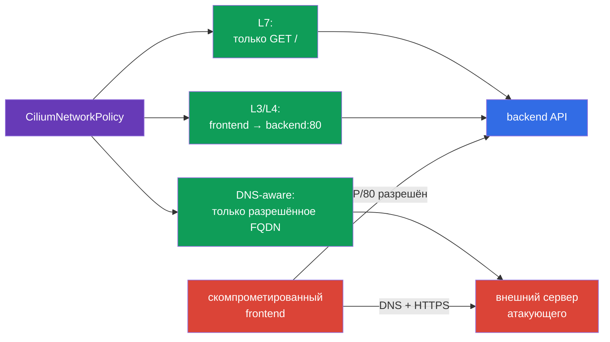

<!-- Standalone RU release: ссылки на переводы удалены, потому что соответствующие файлы не входят в архив. -->

# Глава 06. Cilium NetworkPolicy

> **Что дальше.** Нативные NetworkPolicy уже позволяют изолировать Pod и закрывать
> доступ к metadata-сервисам. Но для части сценариев этого недостаточно: нужно разрешить
> конкретный HTTP-метод, учитывать DNS-имена внешних сервисов, отличать трафик к кластеру
> от трафика в интернет и видеть причину каждого DROP. **CiliumNetworkPolicy** добавляет
> эти возможности поверх eBPF. Это новая тема домена Cluster Setup (10%) и основа для
> лабы 102.

> **Что нужно из CKA.** Базовую модель CNI, IP-адреса Pod и сервисов см. в
> [главе 30 CKA](../../../cka/course/30/ru.md), а назначение CNI и его место в сетевом
> стеке - в [главе 40 CKA](../../../cka/course/40/ru.md). Базовый синтаксис Kubernetes
> NetworkPolicy разобран в главе 04 этого курса; здесь не повторяем его, а используем
> возможности Cilium.

## 06.1. Зачем нужна политика Cilium

Нативная `NetworkPolicy` описывает сетевые отношения на уровнях L3/L4: какие Pod,
CIDR и порты могут обмениваться TCP/UDP-трафиком. Она намеренно не знает HTTP-пути,
DNS-имена или контекст соединения. Cilium реализует сетевую политику в eBPF и добавляет
идентичности рабочих нагрузок, L7-прокси и наблюдаемость.

Сценарий атаки: frontend скомпрометирован через уязвимость приложения. Обычная политика
может разрешать ему TCP/80 к backend, поэтому атакующий получает такой же доступ. Если
backend принимает только `GET /`, то `POST /admin` или `DELETE /data` не должны проходить
даже при разрешённом TCP-соединении. Другой частый сценарий - под обращается к произвольному
внешнему IP после DNS-resolve и отправляет данные атакующему.



Cilium оценивает политику по identity, а не только по IP. Для рабочих нагрузок Kubernetes
identity строится из labels. При пересоздании Pod его IP меняется, но правило с
`endpointSelector` продолжает работать, если labels остались теми же.

| Возможность | Нативная `NetworkPolicy` | `CiliumNetworkPolicy` |
|---|---|---|
| L3: pod/CIDR | да | да, labels и identities |
| L4: TCP/UDP/SCTP-порт | да | да |
| L7: HTTP, DNS | нет | да |
| Правила по FQDN | нет | да, `toFQDNs` |
| `world` / `cluster` / `host` | нет | да, `toEntities` |
| Наблюдаемость потоков | зависит от CNI | Hubble и `cilium` CLI |

`CiliumNetworkPolicy` (CNP) действует в namespace своего объекта. Она подходит для
политик команды или приложения. `CiliumClusterwideNetworkPolicy` (CCNP) действует на весь
кластер и удобна для платформенных общих правил, например запрета опасного egress во всех
namespace. CCNP сильнее по последствиям: ошибка в широком селекторе может отрезать целый
кластер, поэтому сначала проверяйте правило в отдельном namespace и используйте узкие labels.

## 06.2. L3/L4: разрешить только нужный workload и порт

Политика становится применимой к endpoint, если его выбирает `endpointSelector`. В
`policyEnforcementMode: default` Cilium включает enforcement, когда endpoint выбран
политикой; `always` включает его для всех endpoints (endpoint без allow-правил получает
запрет), а `never` отключает enforcement. При применимой политике allow-list действует
**по каждому направлению отдельно**: наличие `ingress` делает ingress default-deny до
совпадения с allow-правилом, наличие `egress` так же делает default-deny только для egress.
Политика только с `ingress` не закрывает egress и наоборот. Поэтому selector должен быть
точным.

Ниже backend с label `app: backend` принимает только TCP/80 от frontend с label
`app: frontend` в том же namespace `cks-102`. `fromEndpoints` - L3-ограничение по identity,
`toPorts` - L4-ограничение по протоколу и порту.

```yaml
apiVersion: cilium.io/v2
kind: CiliumNetworkPolicy
metadata:
  name: backend-from-frontend-http
  namespace: cks-102
spec:
  endpointSelector:
    matchLabels:
      app: backend
  ingress:
  - fromEndpoints:
    - matchLabels:
        app: frontend
    toPorts:
    - ports:
      - port: "80"
        protocol: TCP
```

Примените манифест и проверьте объект прежде, чем считать политику работающей:

```bash
kubectl apply -f backend-l3-l4.yaml
kubectl -n cks-102 get ciliumnetworkpolicy
kubectl -n cks-102 describe ciliumnetworkpolicy backend-from-frontend-http

# Сначала проверьте labels, по которым Cilium строит identity.
kubectl -n cks-102 get pod --show-labels
```

Для межnamespace-трафика добавьте namespace label в `matchLabels`. Cilium автоматически
добавляет Kubernetes labels с префиксом `k8s:`; namespace обычно представлен label
`k8s:io.kubernetes.pod.namespace`.

```yaml
  ingress:
  - fromEndpoints:
    - matchLabels:
        k8s:io.kubernetes.pod.namespace: storefront
        app: frontend
    toPorts:
    - ports:
      - port: "8080"
        protocol: TCP
```

Не заменяйте identity правилом с произвольным `toCIDR`, если адресат - pod. CIDR не
следует за пересозданием рабочей нагрузки и может включить чужие IP. `toCIDR` оправдан для
стабильных внешних сетей или узких служебных диапазонов, а не как обычный способ связать
два сервиса Kubernetes.

## 06.3. L7: ограничить HTTP и DNS

L7-правило добавляется внутрь элемента `toPorts`. Cilium направляет выбранный трафик через
соответствующий L7-proxy: HTTP или DNS. Важное следствие: L7-правила применимы только
к корректно распознанному протоколу на указанном порту. Нельзя ожидать фильтрации HTTP, если
клиент говорит TLS на порту без настроенной TLS-терминации: proxy не видит plaintext HTTP.

Следующее правило разрешает frontend только `GET /` к backend. Регулярное выражение пути
`^/$` намеренно узкое: `/healthz`, `/api` и любой `POST` не совпадут и будут запрещены.

```yaml
apiVersion: cilium.io/v2
kind: CiliumNetworkPolicy
metadata:
  name: backend-read-only
  namespace: cks-102
spec:
  endpointSelector:
    matchLabels:
      app: backend
  ingress:
  - fromEndpoints:
    - matchLabels:
        app: frontend
    toPorts:
    - ports:
      - port: "80"
        protocol: TCP
      rules:
        http:
        - method: "GET"
          path: "^/$"
```

Проверяйте не только успешный запрос, но и запрет. В образе тестового Pod должны быть
`curl` или другой HTTP-клиент:

```bash
kubectl -n cks-102 exec deploy/frontend -- curl -i http://backend/
kubectl -n cks-102 exec deploy/frontend -- \
  curl -i -X POST http://backend/

# Ожидание: GET возвращает 200; несовпавший L7-запрос Cilium proxy отклоняет, обычно 403.
```

Для API безопаснее перечислять разрешённые методы, пути и при необходимости заголовки, а не
делать широкое `path: ".*"`. L7-policy не заменяет аутентификацию и авторизацию приложения:
она уменьшает доступную поверхность, но не знает пользователя и бизнес-правила API.

Cilium также умеет фильтровать DNS по имени запроса. Не включайте L7-proxy без нужды: он
добавляет обработку на пути трафика и требует отдельного нагрузочного тестирования.

> **Актуальность.** L7-фильтрация Kafka в Cilium deprecated с версии 1.18 и удалена
> в версии 1.20. Для CKS ориентируйтесь на L7 HTTP и DNS/`toFQDNs`, а Kafka-политику
> рассматривайте только как исторический пример, а не текущую практику.

## 06.4. DNS-aware egress и `toFQDNs`

IP публичного SaaS-сервиса меняются, CDN отдаёт разные адреса, а приложение обычно знает
не IP, а имя. `toFQDNs` разрешает egress к именам, сопоставляя их с IP, которые DNS-proxy
Cilium увидел в разрешённых DNS-ответах; это не статический DNS-resolve во время применения
YAML. Proxy заполняет FQDN-кэш с учётом TTL и затем допускает соединение к IP из этого
кэша. Поэтому DNS-разрешение направляйте только к доверенным cluster DNS (например, CoreDNS),
которые выбраны точным selector: Cilium не запрашивает DNS самостоятельно и не должен
доверять произвольному nameserver.

Политика ниже разрешает frontend DNS-запросы к CoreDNS и HTTPS только к
`api.example.com`. `rules.dns` разрешает DNS query, а `toFQDNs` - последующее соединение
к IP, возвращённому для разрешённого имени.

```yaml
apiVersion: cilium.io/v2
kind: CiliumNetworkPolicy
metadata:
  name: frontend-external-api-only
  namespace: cks-102
spec:
  endpointSelector:
    matchLabels:
      app: frontend
  egress:
  - toEndpoints:
    - matchLabels:
        k8s:io.kubernetes.pod.namespace: kube-system
        k8s:k8s-app: kube-dns
    toPorts:
    - ports:
      - port: "53"
        protocol: UDP
      - port: "53"
        protocol: TCP
      rules:
        dns:
        - matchPattern: "*"
  - toFQDNs:
    - matchName: "api.example.com"
    toPorts:
    - ports:
      - port: "443"
        protocol: TCP
```

`matchName` выбирает ровно одно имя. Для контролируемого набора поддоменов применяйте
`matchPattern`, например `"*.example.com"`. Не используйте `"*"` без явной необходимости:
в `toFQDNs` такой pattern снимает ограничение по DNS-имени и разрешает назначения,
полученные из DNS cache для всех совпавших имён; остальные условия того же правила,
например `toPorts`, продолжают действовать. Перед применением проверьте реальные labels
CoreDNS в своём кластере - у некоторых установок вместо `k8s-app: kube-dns` используется
другая метка.

```bash
kubectl -n kube-system get pod --show-labels | grep -E 'coredns|dns'

# Разрешённое имя должно работать, чужое - нет.
kubectl -n cks-102 exec deploy/frontend -- \
  curl -I --max-time 5 https://api.example.com
kubectl -n cks-102 exec deploy/frontend -- \
  curl -I --max-time 5 https://www.example.org
```

`toFQDNs` не является полноценным DLP или проверкой HTTP `Host`: это контроль сетевого
доступа по наблюдаемому DNS-разрешению. DoH/DoT скрывают DNS-запрос от DNS-proxy и сами
не заполняют FQDN-кэш. Прямое соединение к IP также не создаёт FQDN-сопоставление; оно
сработает лишь если этот IP уже есть в кэше после разрешённого DNS-ответа либо его допускает
более широкое L3/L4-правило. Не допускайте неразрешённые DNS-серверы, DoH/DoT или прямой
IP, если для модели угроз это существенно: ограничьте egress до доверенного DNS, включите
нужную DNS visibility и сочетайте правила с proxy/firewall на границе сети.

## 06.5. Entities и cluster-wide политика

Entities дают читаемые идентификаторы групп адресов, для которых labels Kubernetes не
подходят. Наиболее полезные значения:

| Entity | Что включает | Типичный случай |
|---|---|---|
| `world` | адреса вне кластера | разрешить выход к внешнему API или вход снаружи |
| `cluster` | endpoints внутри кластера | отделить внутрикластерный трафик от интернета |
| `host` | локальный host endpoint ноды | явно контролировать доступ к ноде |
| `remote-node` | другие ноды кластера | разрешить нужное межнодовое взаимодействие |
| `kube-apiserver` | Kubernetes API server | ограничить доступ рабочих нагрузок к API |

Например, сервис, который должен принимать HTTPS только из интернета, можно выбрать по
label и ограничить ingress entity `world`:

```yaml
apiVersion: cilium.io/v2
kind: CiliumNetworkPolicy
metadata:
  name: public-gateway-from-world
  namespace: cks-102
spec:
  endpointSelector:
    matchLabels:
      app: public-gateway
  ingress:
  - fromEntities:
    - world
    toPorts:
    - ports:
      - port: "443"
        protocol: TCP
```

Для платформенной защиты применяют CCNP. Пример ниже запрещает egress к metadata IP всем
endpoint, выбранным политикой, но сохраняет остальной egress: применимая `egress`-политика
сама включает egress default-deny, поэтому явный allow `toEntities: [all]` здесь необходим.
`egressDeny` имеет приоритет над любым allow, в том числе этим allow-all и правилами других
CNP/CCNP, поэтому metadata IP не получится случайно открыть. Сначала оцените, нужны ли
metadata вызовы системным рабочим нагрузкам, и при необходимости исключите их отдельным
selector или namespace.

```yaml
apiVersion: cilium.io/v2
kind: CiliumClusterwideNetworkPolicy
metadata:
  name: deny-cloud-metadata
spec:
  endpointSelector: {}
  egress:
  - toEntities:
    - all
  egressDeny:
  - toCIDR:
    - 169.254.169.254/32
```

Не трактуйте `host` как безобидный объект. Доступ к kubelet, runtime socket или localhost
ноды часто даёт путь к эскалации. Ограничение host-трафика требует понимания Cilium
host firewall, режима `hostFirewall.enabled` и трафика control plane; проверяйте его в
тестовом кластере, чтобы не потерять доступ к нодам или API server.

## 06.6. Наблюдаемость и проверка с Hubble

Политика, которую нельзя наблюдать, сложно безопасно менять. Hubble получает flow events
из eBPF datapath Cilium: source/destination identity, verdict, L4/L7-контекст и причину
отказа. Он не заменяет audit-логи Kubernetes, но отвечает на вопрос: «какое соединение
Cilium разрешил или отбросил и почему?»

Перед тестом убедитесь, что агенты Cilium здоровы. Команды обычно выполняют на рабочей
машине с доступным `cilium` CLI; точный способ включения Hubble зависит от установки Cilium.

```bash
cilium status --wait
cilium connectivity test

# Если Hubble relay включён, CLI создаст локальное подключение к нему.
cilium hubble port-forward &
hubble status

# Трафик и отказы только из учебного namespace.
hubble observe --namespace cks-102 --verdict DROPPED
hubble observe --namespace cks-102 --protocol http
```

Последовательность проверки L3/L4, L7 и FQDN в лабе 102 должна быть воспроизводимой:

1. Убедитесь, что `frontend` и `backend` Running и их labels совпадают с селекторами.
2. Примените L3/L4 CNP. Из frontend запрос к backend:80 должен пройти; из Pod без
   `app: frontend` - получить timeout или DROP.
3. Замените либо дополните правило L7 CNP. `GET /` должен вернуть `200`, а `POST /` -
   получить отказ proxy (обычно `403`).
4. Примените DNS/FQDN policy. Проверьте resolve и HTTPS к разрешённому имени, затем
   попытайтесь обратиться к неразрешённому имени.
5. В отдельном терминале смотрите Hubble и сохраните flow разрешённого и запрещённого
   трафика как доказательство результата.

Для диагностики полезны также CLI агента и Kubernetes-объект:

```bash
kubectl -n cks-102 get ciliumnetworkpolicy -o yaml
kubectl -n kube-system get pods -l k8s-app=cilium

# Выполняется в Pod cilium на выбранной ноде.
kubectl -n kube-system exec ds/cilium -- cilium-dbg endpoint list
kubectl -n kube-system exec ds/cilium -- cilium-dbg policy get
```

Если `hubble observe` пуст, сначала проверьте `hubble status`, наличие Hubble Relay,
контекст kubeconfig и фильтры namespace/verdict. Если DNS перестал работать после default
 deny, это почти всегда отсутствие разрешения UDP/TCP 53 к фактическим endpoints CoreDNS.
Если L7 правило неожиданно не совпадает, проверьте порт, protocol, HTTP method, регулярное
выражение path и TLS: шифрованный HTTP без подходящей конфигурации не виден L7-proxy.

## 06.7. Частые ошибки и безопасный порядок внедрения

| Симптом | Вероятная причина | Что проверить |
|---|---|---|
| После политики не резолвятся имена | не разрешён DNS или selector CoreDNS неверен | labels CoreDNS, UDP и TCP 53, Hubble DROPPED |
| `GET` и `POST` оба запрещены | L3 identity либо L4-порт не совпали | labels endpoint, порт Service и targetPort |
| L7 правило не ограничивает запрос | трафик не распознан как HTTP или есть более широкое правило | protocol, TLS, `cilium policy get`, Hubble HTTP flows |
| FQDN policy не даёт доступ к сервису | имя не совпадает с DNS-ответом или IP-кэш ещё не заполнен | `hubble observe --protocol dns`, `matchName`, TTL |
| CCNP сломала системный трафик | selector слишком широк или не учтены системные endpoints | scope политики, namespace/labels, rollout в тестовом namespace |
| В Hubble нет событий | Hubble Relay/CLI не подключены либо фильтр слишком узок | `hubble status`, порт-forward, убрать фильтры |

Безопасный порядок: в staging сначала наблюдать Hubble и сохранить baseline реальных
flows, затем добавить narrow allow и проверить его из тестового Pod; только после этого
включать deny или расширять scope в production. Не начинайте с `endpointSelector: {}` в
CCNP на production-кластере. Для каждого изменения нужен rollback:
`kubectl delete ciliumnetworkpolicy <name> -n <namespace>` или откат через GitOps, а не
ручная правка без истории.

## 06.8. Как это применяют в продакшене

- **Политики хранят рядом с рабочей нагрузкой.** CNP для приложения проходят code review,
  тестируются в staging и применяются GitOps-инструментом. Platform-команда отдельно
  владеет CCNP с широким действием.
- **Labels - контракт безопасности.** Команды фиксируют labels вроде `app`, `component`,
  `tenant` и не позволяют рабочей нагрузке произвольно менять security-значимые labels. Иначе
  selector политики может начать выбирать не тот endpoint.
- **L7 применяют к ценным API.** Разрешение только ожидаемых HTTP methods/paths уменьшает
  риск lateral movement, но не заменяет OAuth, mTLS и авторизацию приложения.
- **Egress строят от DNS и назначения.** `toFQDNs` используют для известных внешних API,
  а не как универсальное правило. DNS, proxy и perimeter firewall остаются слоями defense
  in depth.
- **Hubble включают до инцидента.** Дашборды по `DROPPED` flows и сохранение flow logs
  позволяют отличить ошибку политики от отказа приложения и быстрее расследовать
  подозрительный egress.

## 06.9. Мини-глоссарий

- **Cilium** - CNI и security-платформа на eBPF для Kubernetes.
- **CiliumNetworkPolicy (CNP)** - namespace-ресурс политики Cilium.
- **CiliumClusterwideNetworkPolicy (CCNP)** - кластерная политика Cilium.
- **Identity** - идентификатор endpoint, построенный Cilium из labels.
- **L3/L4** - сетевой уровень и транспортный протокол/порт.
- **L7** - протокольный уровень, например HTTP method/path или DNS.
- **`toFQDNs`** - egress-правило по DNS-именам и наблюдаемым DNS-ответам.
- **Entity** - предопределённая группа адресов Cilium, например `world`, `cluster`, `host`.
- **Hubble** - наблюдаемость сетевых flows Cilium.
- **eBPF** - механизм ядра Linux, на котором Cilium реализует datapath и policy enforcement.

## 06.10. Итоги главы

- Cilium дополняет нативную NetworkPolicy политиками L3/L4/L7, identities, FQDN и
  наблюдаемостью Hubble.
- CNP действует в namespace, CCNP - во всём кластере; широкие CCNP требуют особенно
  осторожного rollout.
- `endpointSelector` выбирает защищаемый endpoint, `fromEndpoints`/`toEndpoints` задают
  L3, а `toPorts` - L4.
- HTTP L7-правила позволяют разрешить только нужные методы и пути, но не заменяют
  аутентификацию приложения и требуют распознаваемого plaintext-протокола.
- `toFQDNs` ограничивает внешний egress по именам; для него нужно отдельно разрешить DNS
  и учитывать DNS-кэш, TTL и возможные обходы.
- `toEntities` выражает доступ к `world`, `cluster`, `host` и другим системным группам.
- Hubble показывает разрешённые и запрещённые flows и является главным инструментом
  проверки и отладки политики.

## 06.11. Как это пригодится: на экзамене и в реальной работе

**На экзамене.** Нужно уметь быстро прочитать labels, создать `CiliumNetworkPolicy` с
`endpointSelector`, ограничить поток по портам и HTTP, разрешить egress через `toFQDNs` и
доказать результат командой `hubble observe`. Перед применением CNP обязательно проверьте
namespace, direction (`ingress` или `egress`) и то, что DNS разрешён отдельным правилом.

**В реальной работе.** Cilium policy переводит архитектурные границы в исполнимые правила:
frontend не получает произвольный доступ к backend, workload не выходит в произвольный
интернет, а поток к API можно сузить до нужных операций. Hubble делает эти границы
проверяемыми во время rollout и расследования инцидента.

## 06.12. Вопросы для самопроверки

1. Чем CNP отличается от нативной `NetworkPolicy`, кроме формата ресурса?
2. Что произойдёт с ingress endpoint, если его выбирает CNP, но трафик не совпал ни с
   одним allow-правилом?
3. Как в одном правиле CNP выразить «только frontend к backend TCP/80»?
4. Почему разрешение TCP/80 ещё не ограничивает `POST /admin`, и как это сделать?
5. Как работают `toFQDNs` и почему вместе с ними нужно отдельно разрешить DNS?
6. Когда подходят entities `world`, `cluster` и `host`, и почему `host` требует особой
   осторожности?
7. Какие Hubble-команды помогут доказать, что Cilium отбросил запрещённый поток?
8. Почему опасно начать внедрение CCNP с `endpointSelector: {}` в production-кластере?

## Практика

Закрепите L3/L4, L7 HTTP, DNS-aware egress и Hubble в лабе 102. Выполняйте задания в
порядке политики, а не пытайтесь сразу отладить все уровни одновременно.

🧪 Лаба 102 (Cilium NetworkPolicy L3/L4/L7): [tasks/cks/labs/102](../../labs/102/README_RU.MD)

🎮 Cilium Hubble (документация и интерактивные примеры):
[Hubble observability](https://docs.cilium.io/en/stable/observability/hubble/) ·
[Network policy](https://docs.cilium.io/en/stable/security/network/)

---
[Оглавление](../README_RU.md) · [Глава 05](../05/ru.md) · [Глава 07](../07/ru.md)
