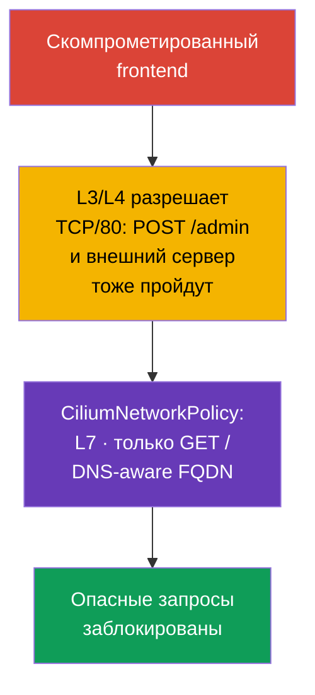

<!-- Standalone RU release: ссылки на переводы удалены, потому что соответствующие файлы не входят в архив. -->

# Глава 06. Cilium NetworkPolicy

> **Что дальше.** Нативные NetworkPolicy уже позволяют изолировать Pod и закрывать
> доступ к metadata-сервисам. Но для части сценариев этого недостаточно: нужно разрешить
> конкретный HTTP-метод, учитывать DNS-имена внешних сервисов, отличать трафик к кластеру
> от трафика в интернет и видеть причину каждого DROP (пакет отброшен без ответа
> отправителю). **CiliumNetworkPolicy** расширяет
> базовые возможности сетевых политик Cilium L7-фильтрацией, FQDN-правилами, identities и
> наблюдаемостью. Эта глава углубляет компетенцию CKS Cluster Setup «Use Network security
> policies to restrict cluster level access» и служит основой для лабы 102.
>
> Публичная программа CKS не требует именно CiliumNetworkPolicy, `toFQDNs` или Hubble в
> каждой экзаменационной среде, поэтому Cilium-specific команды и CRD рассматривайте как
> углубление для кластеров, где Cilium действительно предоставлен.

> **Cilium сам по себе в кластере не появляется.** Это отдельный CNI, который
> устанавливает администратор кластера - через `cilium` CLI или Helm chart, поверх уже
> созданного кластера или вместо стандартного CNI при его создании. Если в вашем окружении
> Cilium ещё не установлен, все примеры этой главы неприменимы до установки. Официальная
> инструкция: [Cilium Quick Installation](https://docs.cilium.io/en/stable/gettingstarted/k8s-install-default/).
> Более подробные примеры L3/L4/L7-правил, чем разобраны в этой главе, - в официальном
> разделе [Overview of Network Policy](https://docs.cilium.io/en/stable/security/policy/),
> включая отдельные страницы Layer 3, Layer 4 и Layer 7 Policies.

> **Что нужно из CKA.** Базовую модель CNI, IP-адреса Pod и сервисов см. в
> [главе 30 CKA](../../../cka/course/30/ru.md), а назначение CNI и его место в сетевом
> стеке - в [главе 40 CKA](../../../cka/course/40/ru.md). Базовый синтаксис Kubernetes
> NetworkPolicy разобран в главе 04 этого курса; здесь не повторяем его, а используем
> возможности Cilium.

## 06.0. Что для вас нового: eBPF-datapath вместо kube-proxy

### Baseline без Cilium: как трафик доходит до Service сейчас

До этой главы путь пакета к Service обеспечивал `kube-proxy`. Механизм состоит из трёх
частей:

- **Наблюдение.** На каждой ноде `kube-proxy` слушает изменения объектов Service и
  `EndpointSlice`.
- **Программирование ядра.** По каждому изменению он обновляет правила ядра - обычно через
  `iptables` или `nftables` (устаревающий `ipvs` тоже возможен).
- **Перехват и DNAT.** Правило перехватывает трафик к `ClusterIP:port` и делает DNAT на IP
  конкретного Pod, выбранного случайно или по session affinity.

`NetworkPolicy` из главы 04 - отдельный слой поверх этой же модели: CNI со своей стороны
читает объект `NetworkPolicy` и добавляет собственные правила ядра, которые разрешают или
блокируют пакет **до или после** правил kube-proxy, в зависимости от реализации.

### Что меняет Cilium: eBPF как основной L3/L4 datapath

Cilium предлагает другую архитектуру для того же пути пакета:

- **eBPF как основной L3/L4 datapath.** Для pod networking, L3/L4 policy и
- **eBPF как основной L3/L4 datapath.** Для pod networking, L3/L4 policy и
  kube-proxy-replacement Cilium использует eBPF-программы и BPF maps. Программы
  прикрепляются к hook-точкам ядра, например сетевым интерфейсам и cgroup.
- **Map lookup вместо линейного `iptables`-обхода.** В kube-proxy-replacement Cilium
  хранит Service/backend state в BPF maps и выполняет lookup без последовательного обхода
  длинной `iptables`-цепочки. Это важное отличие именно от kube-proxy в режиме `iptables`.
  Не переносите это сравнение на kube-proxy `nftables`: современный nftables-режим тоже
  использует map-based dispatch (`verdict map`) с примерно O(1) lookup - подробности в
  официальном блоге Kubernetes про nftables-режим kube-proxy.
- **Два режима работы.** Полный **kube-proxy-replacement** реализует весь Service load
  balancing в eBPF и позволяет удалить `kube-proxy` из кластера. В режиме совместной
  работы `kube-proxy` продолжает обслуживать Service, а Cilium добавляет policy
  enforcement и L7-возможности рядом.

Оба режима возможны в production, и экзамен CKS не требует конкретного из них.

Важно разделять уровни. L3/L4 forwarding, policy enforcement и Service load balancing при
kube-proxy-replacement в Cilium в основном реализуются через eBPF.

L7 HTTP/DNS policy работает иначе: выбранный трафик перенаправляется в node-local userspace
proxy (Envoy или DNS proxy). В текущих stable-версиях Cilium такой proxy redirection может
также использовать netfilter/`iptables` TPROXY. Поэтому Cilium не следует описывать как
datapath, который при любых функциях полностью исключает `iptables` и userspace.

### Когда достаточно `NetworkPolicy`, а когда нужен CNP

Из разницы механизмов следует практический критерий выбора между нативной
`NetworkPolicy` и `CiliumNetworkPolicy` (CNP):

- **Начинайте с нативной `NetworkPolicy`.** Если задача - разрешить или запретить трафик
  между Pod по labels, namespace, CIDR и TCP/UDP/SCTP-порту, этого достаточно. Политика
  переносима между кластерами и CNI, поэтому переход на CNP без причины усложняет миграцию
  и поддержку.
- **Переходите на CNP, когда нужен контроль внутри уже разрешённого L3/L4-соединения.**
  Типичные триггеры: ограничить конкретный HTTP-метод или путь (L7), разрешить или
  запретить конкретные внешние DNS-имена (`toFQDNs`), явно описать трафик к `world`,
  `cluster` или `host` (`toEntities`), либо получить наблюдаемость через Hubble для
  расследования `DROP`.
- **Обе модели можно комбинировать.** Нативная `NetworkPolicy` остаётся переносимым L3/L4
  контролем, а CNP добавляет более тонкую granularity там, где L3/L4 уже недостаточно.
  Подробности совместного вычисления allow/deny разобраны ниже в этой главе.

## 06.1. Зачем нужна политика Cilium

Нативная `NetworkPolicy` описывает сетевые отношения на уровнях L3/L4: какие Pod,
CIDR и порты могут обмениваться TCP/UDP-трафиком. Она намеренно не знает HTTP-пути,
DNS-имена или контекст соединения. Cilium реализует сетевую политику в eBPF и добавляет
идентичности рабочих нагрузок, L7-прокси и наблюдаемость.

Сценарий атаки: frontend скомпрометирован через уязвимость приложения. Обычная политика
может разрешать ему TCP/80 к backend, поэтому атакующий получает такой же доступ. Если
backend принимает только `GET /`, то `POST /admin` или `DELETE /data` не должны проходить
даже при разрешённом TCP-соединении. Другой частый сценарий - под обращается к произвольному
внешнему IP после DNS-resolve и отправляет данные атакующему.



Cilium оценивает политику по identity, а не только по IP. Для рабочих нагрузок Kubernetes
identity строится из labels. При пересоздании Pod его IP меняется, но правило с
`endpointSelector` продолжает работать, если labels остались теми же.

| Возможность | Нативная `NetworkPolicy` | `CiliumNetworkPolicy` |
|---|---|---|
| L3: pod/CIDR | да | да, labels и identities |
| L4: TCP/UDP/SCTP-порт | да | да |
| L7: HTTP, DNS | нет | да |
| Правила по FQDN | нет | да, `toFQDNs` |
| `world` / `cluster` / `host` | нет | да, `toEntities` |
| Наблюдаемость потоков | зависит от CNI | Hubble и `cilium` CLI |

`CiliumNetworkPolicy` (CNP) действует в namespace своего объекта. Она подходит для
политик команды или приложения. `CiliumClusterwideNetworkPolicy` (CCNP) действует на весь
кластер и удобна для платформенных общих правил, например запрета опасного egress во всех
namespace. CCNP сильнее по последствиям: ошибка в широком селекторе может отрезать целый
кластер, поэтому сначала проверяйте правило в отдельном namespace и используйте узкие labels.

### Совместная работа с нативной `NetworkPolicy`

`NetworkPolicy` из [главы 04](../04/ru.md) и CNP/CCNP могут одновременно выбирать один
endpoint. Их allow-правила учитываются вместе, но явный Cilium `ingressDeny`/`egressDeny`
имеет приоритет над **всеми** allow-правилами: из CNP, CCNP и нативной Kubernetes
`NetworkPolicy`. Поэтому allow из обычной `NetworkPolicy` не может обойти Cilium deny.
При неожиданном `DROP` инвентаризируйте все эти объекты, их selectors и направления, а не
ищите ошибку только в последней применённой CNP. Нативная policy остаётся переносимым L3/L4
контролем; Cilium дополняет её L7, FQDN, entities и наблюдаемостью.

> **Advanced: Kubernetes `ClusterNetworkPolicy`.** В современных версиях Cilium наряду с
> `NetworkPolicy`, CNP и CCNP может применяться Kubernetes `ClusterNetworkPolicy` (KCNP,
> `v1alpha2`). Его модель tiers разделяет `Admin`, `NetworkPolicy` и `Baseline`; правила
> `Admin` tier имеют приоритет над CNP, CCNP и обычной `NetworkPolicy`. Это полезно для
> platform-wide границ, но не обязательная отдельная тема CKS: перед использованием
> проверьте, включены ли соответствующие API и поддержка в вашем Cilium-кластере.

## 06.2. L3/L4: разрешить только нужный workload и порт

Политика становится применимой к endpoint, если его выбирает `endpointSelector`. В
`policyEnforcementMode: default` Cilium включает enforcement, когда endpoint выбран
политикой; `always` включает его для всех endpoints (endpoint без allow-правил получает
запрет), а `never` отключает enforcement. По умолчанию allow-list действует
**по каждому направлению отдельно**: наличие `ingress` делает ingress default-deny до
совпадения с allow-правилом, наличие `egress` так же делает default-deny только для egress.
Политика только с `ingress` не закрывает egress и наоборот. Поэтому selector должен быть
точным.

Это поведение можно изменить через `enableDefaultDeny`: направление, для которого
установлено `false`, не учитывается при переводе endpoint в default-deny. Так
администратор может безопасно применить cluster-wide policy - например, перехват DNS -
без риска перевести endpoint в default-deny и заблокировать легитимный трафик. Исключение
не следует переносить на L7-policy: `enableDefaultDeny` не применяется к layer-7 правилам,
и добавление L7 rule без соответствующего L7 allow-all вызовет DROP даже при явно
отключённом default-deny.

Cilium отслеживает состояние соединения: разрешение инициирующего ingress- или
egress-потока позволяет **ответный трафик того же соединения**, но не разрешает новое
соединение в обратном направлении. Поэтому не дублируйте механически правило для ответа,
но явно описывайте самостоятельный обратный вызов, если он нужен приложению.

Ниже backend с label `app: backend` принимает только TCP/80 от frontend с label
`app: frontend` в том же namespace `cks-102`. `fromEndpoints` - L3-ограничение по identity,
`toPorts` - L4-ограничение по протоколу и порту.

```yaml
apiVersion: cilium.io/v2
kind: CiliumNetworkPolicy
metadata:
  name: backend-from-frontend-http
  namespace: cks-102
spec:
  endpointSelector:
    matchLabels:
      app: backend
  ingress:
  - fromEndpoints:
    - matchLabels:
        app: frontend
    toPorts:
    - ports:
      - port: "80"
        protocol: TCP
```

Примените манифест и проверьте объект прежде, чем считать политику работающей:

```bash
kubectl apply -f backend-l3-l4.yaml
kubectl -n cks-102 get ciliumnetworkpolicy
kubectl -n cks-102 describe ciliumnetworkpolicy backend-from-frontend-http

# Сначала проверьте labels, по которым Cilium строит identity.
kubectl -n cks-102 get pod --show-labels
```

Для межnamespace-трафика добавьте namespace label в `matchLabels`. Cilium автоматически
добавляет Kubernetes labels с префиксом `k8s:`; namespace обычно представлен label
`k8s:io.kubernetes.pod.namespace`.

```yaml
  ingress:
  - fromEndpoints:
    - matchLabels:
        k8s:io.kubernetes.pod.namespace: storefront
        app: frontend
    toPorts:
    - ports:
      - port: "8080"
        protocol: TCP
```

Не заменяйте identity правилом с произвольным `toCIDR`, если адресат - pod. CIDR не
следует за пересозданием рабочей нагрузки и может включить чужие IP. `toCIDR` оправдан для
стабильных внешних сетей или узких служебных диапазонов, а не как обычный способ связать
два сервиса Kubernetes.

### Corner case: active FTP не выражается через L3/L4

Active FTP показывает границу L3/L4-policy. Клиент открывает control-соединение на TCP/21
и сообщает серверу свой порт для data-соединения; затем **сервер сам инициирует новое
TCP-соединение обратно к клиенту** на этот порт. Порт заранее неизвестен и договаривается
динамически внутри сессии, поэтому статичное правило `toPorts`/`fromEndpoints` не может
описать «разреши входящее соединение на порт, о котором стороны договорятся позже».

До Kubernetes и Cilium эту проблему решал **connection tracking на уровне ядра**: модуль
`nf_conntrack_ftp` разбирает control-канал, видит согласованный порт и динамически
добавляет related-соединение как разрешённое. `kube-proxy` и его `iptables`/`nftables`
правила сами по себе не решают эту задачу - её решает отдельный conntrack helper поверх
netfilter, а не сам механизм forwarding Service.

Для протоколов с поддерживаемой application-level семантикой Cilium может использовать
L7 proxy, но FTP к ним не относится.

Стандартный CiliumNetworkPolicy не предоставляет FTP-aware helper или встроенный FTP L7
parser. Поэтому Cilium не может по FTP control channel автоматически определить negotiated
port active-mode data connection и создать для него временное policy-разрешение.

Для Kubernetes-среды предпочтительнее **passive FTP** с заранее ограниченным диапазоном
data ports: тогда control traffic на TCP/21 и data traffic на фиксированном диапазоне можно
выразить обычными L3/L4 policy rules (`endPort`).

Если legacy-приложению обязательно нужен active FTP с динамически согласуемыми портами, это
уже задача отдельного protocol-aware gateway/proxy или специально спроектированного
сетевого слоя, а не стандартной CNP.

Из встроенных application-level правил современного Cilium ориентируйтесь на HTTP и DNS.
gRPC фильтруется через HTTP/2 semantics с `rules.http`; отдельного gRPC rule type нет.
Kafka-aware network policy удалена в Cilium 1.20.

## 06.3. L7: ограничить HTTP и DNS

L7-правило добавляется внутрь элемента `toPorts`. Cilium направляет выбранный трафик через
соответствующий L7-proxy: HTTP или DNS. Важное следствие: L7-правила применимы только
к корректно распознанному протоколу на указанном порту. Нельзя ожидать фильтрации HTTP, если
клиент говорит TLS на порту без настроенной TLS-терминации: proxy не видит plaintext HTTP.

Следующее правило разрешает frontend только `GET /` к backend. Регулярное выражение пути
`^/$` намеренно узкое: `/healthz`, `/api` и любой `POST` не совпадут и будут запрещены.

```yaml
apiVersion: cilium.io/v2
kind: CiliumNetworkPolicy
metadata:
  name: backend-read-only
  namespace: cks-102
spec:
  endpointSelector:
    matchLabels:
      app: backend
  ingress:
  - fromEndpoints:
    - matchLabels:
        app: frontend
    toPorts:
    - ports:
      - port: "80"
        protocol: TCP
      rules:
        http:
        - method: "GET"
          path: "^/$"
```

Проверяйте не только успешный запрос, но и запрет. В образе тестового Pod должны быть
`curl` или другой HTTP-клиент:

```bash
kubectl -n cks-102 exec deploy/frontend -- curl -i http://backend/
kubectl -n cks-102 exec deploy/frontend -- \
  curl -i -X POST http://backend/

# Ожидание: GET возвращает 200; несовпавший L7-запрос Cilium proxy отклоняет, обычно 403.
```

Для API безопаснее перечислять разрешённые методы, пути и при необходимости заголовки, а не
делать широкое `path: ".*"`. L7-policy не заменяет аутентификацию и авторизацию приложения:
она уменьшает доступную поверхность, но не знает пользователя и бизнес-правила API.

Cilium также умеет фильтровать DNS по имени запроса. Не включайте L7-proxy без нужды: он
добавляет обработку на пути трафика и требует отдельного нагрузочного тестирования.

### gRPC: фильтрация через HTTP, но с особенностью в балансировке

У Cilium нет отдельного «gRPC-парсера». gRPC работает поверх HTTP/2, а каждый вызов метода
кодируется как обычный HTTP-запрос: `POST` на путь вида `/Пакет.Сервис/Метод`. Поэтому
L7-фильтрация gRPC - это то же самое HTTP-правило `path`, что вы только что видели выше,
только regex или точный путь описывает `/cloudcity.DoorManager/GetName` вместо `/`.

Например, правило ниже разрешает `public-terminal` вызывать у `cc-door-mgr` только чтение
статуса, но не изменение кода доступа:

```yaml
apiVersion: cilium.io/v2
kind: CiliumNetworkPolicy
metadata:
  name: door-read-only-grpc
spec:
  endpointSelector:
    matchLabels:
      app: cc-door-mgr
  ingress:
  - fromEndpoints:
    - matchLabels:
        app: public-terminal
    toPorts:
    - ports:
      - port: "50051"
        protocol: TCP
      rules:
        http:
        - method: "POST"
          path: "/cloudcity.DoorManager/GetName"
        - method: "POST"
          path: "/cloudcity.DoorManager/GetLocation"
```

Вызов `SetAccessCode` не совпадёт ни с одним правилом и будет отклонён - клиент получит
gRPC-статус `PERMISSION_DENIED`, а не обычный сетевой timeout. Разобранный пошаговый пример
с демо-приложением есть в официальной документации: [Securing gRPC](https://docs.cilium.io/en/stable/security/grpc/).

Отдельная проблема возникает с балансировкой, если Cilium **полностью заменяет
kube-proxy** (`kube-proxy-replacement`). gRPC держит одно долгоживущее TCP-соединение и
прогоняет через него много вызовов подряд. Обычная eBPF-балансировка Cilium выбирает Pod
**один раз при установке соединения**, а не на каждый отдельный вызов внутри него. Если
клиент открыл соединение и держит его долго, весь его трафик уйдёт на один и тот же Pod, а
остальные реплики backend не получат свою долю нагрузки - это называют pinning соединения.

Решение - включить у Cilium **Proxy Load Balancing** для нужного Service: трафик
направляется через встроенный Envoy, который умеет заглянуть внутрь HTTP/2-потока и
распределить отдельные gRPC-вызовы между Pod, а не всё соединение целиком. Без этой
настройки долгоживущие gRPC-клиенты в кластере без kube-proxy стоит проверять отдельно на
равномерность нагрузки между репликами.

Включается это одной аннотацией на объекте Service, без изменения манифеста workload:

```bash
kubectl annotate service payment-grpc-service \
  service.cilium.io/lb-l7=enabled
```

После этого трафик к `payment-grpc-service` идёт через Cilium-managed Envoy, который
распределяет отдельные вызовы между Pod, а не пиннит всё TCP-соединение к одному backend.
Алгоритм балансировки можно уточнить отдельной аннотацией
`service.cilium.io/lb-l7-algorithm` (`round_robin`, `least_request` или `random`). Функция
находится в статусе **beta**; перед включением в production проверьте её поведение в
своей версии Cilium. Пошаговый пример с наблюдением трафика через Hubble - в официальной
документации: [Proxy Load Balancing for Kubernetes Services](https://docs.cilium.io/en/stable/network/servicemesh/envoy-load-balancing/).

**Где физически находится Envoy.** Это не sidecar в каждом Pod. Envoy входит в образ
Cilium и работает **на каждой ноде один раз**: либо как процесс внутри `cilium-agent`, либо
как отдельный `cilium-envoy` DaemonSet, разделяемый всеми Pod на этой ноде. В
рассматриваемых выше сценариях через него проходит трафик, перенаправленный L7-policy или
proxy load balancing (`lb-l7`). Это не исчерпывающий список: Cilium Ingress, Gateway API и
`CiliumEnvoyConfig` также направляют трафик через тот же per-node Envoy. Обычный Pod-to-Pod
L3/L4 трафик, для которого не включена ни одна из этих proxy-based функций, остаётся на
eBPF-datapath без прохода через userspace.

**Как это влияет на задержку и параметры соединения.** Каждый перенаправленный пакет
проходит дополнительный переход через userspace-процесс Envoy на той же ноде, а не через
сеть к другой ноде или Pod. Это добавляет:

- **Небольшую дополнительную задержку** на каждый запрос - переход из ядра в userspace и
  обратно, плюс разбор протокола (HTTP/gRPC). Величина обычно небольшая для локального
  hop, но не нулевая, и её стоит измерять под реальной нагрузкой перед включением.
- **Дополнительное использование CPU и памяти на ноде** - Envoy обрабатывает трафик как
  отдельный процесс, поэтому пропорционально растёт нагрузка на ноду при большом объёме
  L7-трафика.
- **Source address зависит от proxy path и конфигурации.** Сам факт прохождения через
  Envoy не означает, что backend обязательно увидит source IP самого proxy. Для L7 policy
  enforcement Cilium по умолчанию использует original source address; у
  `CiliumEnvoyConfig`, Ingress и Gateway API есть отдельные настройки и правила source
  visibility. Поэтому backend-visible source IP/port нужно проверять для конкретного
  режима, а не выводить из одного только факта использования Envoy.
- **Оверхед применяется только к выбранному трафику** - обычные L3/L4-соединения без
  L7-правил и без аннотации `lb-l7` эту цену не платят: они остаются на быстром
  eBPF-пути без Envoy.

> **Актуальность.** L7-фильтрация Kafka в Cilium deprecated с версии 1.18 и удалена
> в версии 1.20. Для CKS ориентируйтесь на L7 HTTP и DNS/`toFQDNs`, а Kafka-политику
> рассматривайте только как исторический пример, а не текущую практику.

## 06.4. DNS-aware egress и `toFQDNs`

IP публичного SaaS-сервиса меняются, CDN отдаёт разные адреса, а приложение обычно знает
не IP, а имя. `toFQDNs` разрешает egress к именам, сопоставляя их с IP, которые DNS-proxy
Cilium увидел в разрешённых DNS-ответах; это не статический DNS-resolve во время применения
YAML. Proxy заполняет FQDN-кэш с учётом TTL и затем допускает соединение к IP из этого
кэша. Поэтому DNS-разрешение направляйте только к доверенным cluster DNS (например, CoreDNS),
которые выбраны точным selector: Cilium не запрашивает DNS самостоятельно и не должен
доверять произвольному nameserver.

Политика ниже разрешает frontend DNS-запросы к CoreDNS и HTTPS только к
`example.com`. `rules.dns` разрешает DNS query, а `toFQDNs` - последующее соединение
к IP, возвращённому для разрешённого имени.

```yaml
apiVersion: cilium.io/v2
kind: CiliumNetworkPolicy
metadata:
  name: frontend-external-api-only
  namespace: cks-102
spec:
  endpointSelector:
    matchLabels:
      app: frontend
  egress:
  - toEndpoints:
    - matchLabels:
        k8s:io.kubernetes.pod.namespace: kube-system
        k8s:k8s-app: kube-dns
    toPorts:
    - ports:
      - port: "53"
        protocol: UDP
      - port: "53"
        protocol: TCP
      rules:
        dns:
        - matchPattern: "*"
  - toFQDNs:
    - matchName: "example.com"
    toPorts:
    - ports:
      - port: "443"
        protocol: TCP
```

`matchName` выбирает ровно одно имя. Для контролируемого набора поддоменов применяйте
`matchPattern`, например `"*.example.com"`: такой wildcard не следует считать разрешением
apex-имени `example.com`. Если нужны и `example.com`, и его поддомены, выразите их
отдельными правилами. Не используйте `"*"` без явной необходимости: в `toFQDNs` такой
pattern снимает ограничение по DNS-имени и разрешает назначения, полученные из DNS cache
для всех совпавших имён; остальные условия того же правила, например `toPorts`,
продолжают действовать. Перед применением проверьте реальные labels CoreDNS в своём
кластере - у некоторых установок вместо `k8s-app: kube-dns` используется другая метка.

```bash
kubectl -n kube-system get pod --show-labels | grep -E 'coredns|dns'
```

Следующий пример - иллюстративная ручная проверка, а не детерминированный acceptance
test. IANA прямо указывает, что HTTP-сервис документационных доменов (`example.com`,
`example.org` и т. п.) предоставляется best-effort и не предназначен как testing
endpoint для software: https://www.iana.org/news/2024/example-domain-http-methods.
Если в вашем окружении `example.com`/`www.google.com` недоступны (сетевые ограничения,
временный отказ, блокировка в конкретной сети), это не означает ошибку policy - замените
их на FQDN, для которого вы независимо, до применения policy, подтвердили DNS-разрешение
и рабочий HTTPS.

```bash
kubectl -n cks-102 exec deploy/frontend -- \
  curl -I --max-time 5 https://example.com
kubectl -n cks-102 exec deploy/frontend -- \
  curl -I --max-time 5 https://www.google.com
```

Перед применением policy подтвердите, что оба запроса выше проходят без ограничений.
Только затем примените `toFQDNs` и сравните: `example.com:443` должен пройти, а
`www.google.com:443` - быть заблокирован именно policy, а не случайной недоступностью
внешнего сервиса.

`toFQDNs` не является полноценным DLP или проверкой HTTP `Host`: это контроль сетевого
доступа по наблюдаемому DNS-разрешению. DoH/DoT скрывают DNS-запрос от DNS-proxy и сами
не заполняют FQDN-кэш. Прямое соединение к IP также не создаёт FQDN-сопоставление; оно
сработает лишь если этот IP уже есть в кэше после разрешённого DNS-ответа либо его допускает
более широкое L3/L4-правило. Не допускайте неразрешённые DNS-серверы, DoH/DoT или прямой
IP, если для модели угроз это существенно: ограничьте egress до доверенного DNS, включите
нужную DNS visibility и сочетайте правила с proxy/firewall на границе сети.

## 06.5. Entities и cluster-wide политика

Entities дают читаемые идентификаторы групп адресов, для которых labels Kubernetes не
подходят. Наиболее полезные значения:

| Entity | Что включает | Типичный случай |
|---|---|---|
| `world` | адреса вне кластера | разрешить выход к внешнему API или вход снаружи |
| `cluster` | endpoints внутри кластера | отделить внутрикластерный трафик от интернета |
| `host` | локальный host endpoint ноды | явно контролировать доступ к ноде |
| `remote-node` | другие ноды кластера | разрешить нужное межнодовое взаимодействие |
| `kube-apiserver` | Kubernetes API server | ограничить доступ рабочих нагрузок к API |

Например, сервис, который должен принимать HTTPS только из интернета, можно выбрать по
label и ограничить ingress entity `world`:

```yaml
apiVersion: cilium.io/v2
kind: CiliumNetworkPolicy
metadata:
  name: public-gateway-from-world
  namespace: cks-102
spec:
  endpointSelector:
    matchLabels:
      app: public-gateway
  ingress:
  - fromEntities:
    - world
    toPorts:
    - ports:
      - port: "443"
        protocol: TCP
```

Для платформенной защиты применяют CCNP. Пример ниже запрещает egress к metadata IP всем
endpoint, выбранным политикой, но сохраняет остальной egress: применимая `egress`-политика
сама включает egress default-deny, поэтому явный allow `toEntities: [all]` здесь необходим.
`egressDeny` имеет приоритет над любым allow, в том числе этим allow-all и правилами других
CNP/CCNP, поэтому metadata IP не получится случайно открыть. Сначала оцените, нужны ли
metadata вызовы системным рабочим нагрузкам, и при необходимости исключите их отдельным
selector или namespace.

```yaml
apiVersion: cilium.io/v2
kind: CiliumClusterwideNetworkPolicy
metadata:
  name: deny-cloud-metadata
spec:
  endpointSelector: {}
  egress:
  - toEntities:
    - all
  egressDeny:
  - toCIDR:
    - 169.254.169.254/32
```

Не трактуйте `host` как безобидный объект. `toEntities: host` управляет сетевым доступом
к локальной ноде и host-networked workloads и поэтому может открыть путь к kubelet или
другим TCP/UDP listener на host. Runtime CRI socket - отдельный механизм: например,
containerd обычно доступен через Unix domain socket
`/var/run/containerd/containerd.sock`, и его экспозиция зависит от filesystem
mounts/`hostPath` и привилегий Pod, а не от `toEntities: host` сама по себе. Ограничение
host-трафика требует понимания Cilium host firewall, режима `hostFirewall.enabled` и
трафика control plane; проверяйте его в тестовом кластере, чтобы не потерять доступ к
нодам или API server. Доступ к runtime socket отдельно ограничивайте через mount/privilege
controls.

## 06.6. Наблюдаемость и проверка с Hubble

### Что такое Hubble и какую задачу он решает

Обычная `NetworkPolicy` или `CiliumNetworkPolicy` отвечает на вопрос «что разрешено».
Она не отвечает на вопрос «что произошло на самом деле»: почему конкретный запрос не
прошёл, к какому именно правилу относится DROP, виден ли клиенту TCP-connect или отказ
случился уже на L7. Без такого инструмента расследование сводится к перечитыванию YAML
и догадкам.

**Hubble** - компонент наблюдаемости Cilium, который читает те же eBPF-события, что уже
собирает datapath, и превращает их в читаемый поток flow-событий: source/destination
identity, L4/L7-контекст, verdict (`FORWARDED`/`DROPPED`) и причину отказа. Он не заменяет
Kubernetes audit log и не читает контент запроса за вас - он показывает, что Cilium решил
сделать с конкретным соединением и почему.

Архитектурно Hubble состоит из четырёх частей:

- **Hubble Server** - встроен в `cilium-agent` и работает на каждой ноде; отдаёт flow
  events по gRPC.
- **Hubble Relay** (`hubble-relay`) - отдельный компонент, который подключается к Server
  на всех нодах и даёт единый кластерный вид вместо ноды за нодой.
- **Hubble CLI** (`hubble`) - клиент командной строки; подключается либо к Relay для
  кластерного обзора, либо к локальному Server на одной ноде.
- **Hubble UI** (`hubble-ui`) - опциональный графический интерфейс поверх Relay с картой
  связей сервисов.

**Как это включается.** В managed-дистрибутивах и стандартных инсталляциях Cilium Hubble
обычно включают флагом Helm при установке или обновлении, например
`--set hubble.relay.enabled=true --set hubble.ui.enabled=true`; точный флаг зависит от
версии chart. Для CKS и этой главы достаточно знать одну вещь: если Hubble уже включён в
кластере, `cilium status` покажет его состояние, а CLI `hubble` можно подключить через
port-forward к Relay, как показано ниже. Включать Hubble с нуля для лабы не требуется -
это задача администратора кластера, а не части CNP, которые вы применяете.

Перед тестом убедитесь, что агенты Cilium здоровы. Команды обычно выполняют на рабочей
машине с доступным `cilium` CLI; точный способ включения Hubble зависит от установки Cilium.

`hubble` - это отдельный бинарник, а не часть `cilium` CLI. Его нужно один раз установить
на рабочую машину, скачав нужный релиз с GitHub; шаги по платформам - в официальной
инструкции [Install the Hubble Client](https://docs.cilium.io/en/stable/observability/hubble/setup/#install-the-hubble-client).
После установки проверьте бинарник командой `hubble help`.

```bash
cilium status --wait
cilium connectivity test

# Если Hubble relay включён, CLI создаст локальное подключение к нему.
cilium hubble port-forward &
hubble status

# Трафик и отказы только из учебного namespace.
hubble observe --namespace cks-102 --verdict DROPPED
hubble observe --namespace cks-102 --protocol http
```

Последовательность проверки L3/L4, L7 и FQDN в лабе 102 должна быть воспроизводимой:

1. Убедитесь, что `frontend` и `backend` Running и их labels совпадают с селекторами.
2. Примените L3/L4 CNP. Из frontend запрос к backend:80 должен пройти; из Pod без
   `app: frontend` - получить timeout или DROP.
3. Замените либо дополните правило L7 CNP. `GET /` должен вернуть `200`, а `POST /` -
   получить отказ proxy (обычно `403`).
4. Примените DNS/FQDN policy. Проверьте resolve и HTTPS к разрешённому имени, затем
   попытайтесь обратиться к неразрешённому имени.
5. В отдельном терминале смотрите Hubble и сохраните flow разрешённого и запрещённого
   трафика как доказательство результата.

Для диагностики полезны также CLI агента и Kubernetes-объект:

```bash
kubectl -n cks-102 get ciliumnetworkpolicy -o yaml
kubectl -n kube-system get pods -l k8s-app=cilium

# Выполняется в Pod cilium на выбранной ноде.
kubectl -n kube-system exec ds/cilium -- cilium-dbg endpoint list
kubectl -n kube-system exec ds/cilium -- cilium-dbg policy get
```

Если `hubble observe` пуст, сначала проверьте `hubble status`, наличие Hubble Relay,
контекст kubeconfig и фильтры namespace/verdict. Если DNS перестал работать после default
 deny, это почти всегда отсутствие разрешения UDP/TCP 53 к фактическим endpoints CoreDNS.
Если L7 правило неожиданно не совпадает, проверьте порт, protocol, HTTP method, регулярное
выражение path и TLS: шифрованный HTTP без подходящей конфигурации не виден L7-proxy.

## 06.7. Частые ошибки и безопасный порядок внедрения

| Симптом | Вероятная причина | Что проверить |
|---|---|---|
| После политики не резолвятся имена | не разрешён DNS или selector CoreDNS неверен | labels CoreDNS, UDP и TCP 53, Hubble DROPPED |
| `GET` и `POST` оба запрещены | L3 identity либо L4-порт не совпали | labels endpoint, порт Service и targetPort |
| L7 правило не ограничивает запрос | трафик не распознан как HTTP или есть более широкое правило | protocol, TLS, `cilium policy get`, Hubble HTTP flows |
| FQDN policy не даёт доступ к сервису | имя не совпадает с DNS-ответом или IP-кэш ещё не заполнен | `hubble observe --protocol dns`, `matchName`, TTL |
| CCNP сломала системный трафик | selector слишком широк или не учтены системные endpoints | scope политики, namespace/labels, rollout в тестовом namespace |
| В Hubble нет событий | Hubble Relay/CLI не подключены либо фильтр слишком узок | `hubble status`, порт-forward, убрать фильтры |

**Policy Audit Mode Cilium** полезен на стадии подготовки L3/L4-политики: при включении
для daemon (`--policy-audit-mode=true`) или выбранного endpoint он пропускает трафик,
который policy иначе отбросила бы, и записывает соответствующий policy verdict. В этом
режиме не ищите такой трафик только через `--verdict DROPPED`: наблюдайте policy verdicts:

```bash
hubble observe flows -t policy-verdict --namespace cks-102
```

Совпавший с будущим запретом поток будет виден как `AUDITED`, хотя соединение ещё проходит.
После выключения Audit Mode тот же тест либо станет `DENIED`, если правило действительно
запрещает его, либо останется `ALLOWED`, если allow-правило покрывает поток. Сначала
соберите эти события через Hubble, сузьте allow-правила и только затем включайте
enforcement. Это диагностический временный режим, а не production-защита: в нём блокировки
не применяются; для L7-policy он также не заменяет реальную проверку HTTP/DNS.

Безопасный порядок: в staging сначала наблюдать Hubble и сохранить baseline реальных
flows, при необходимости кратковременно использовать Policy Audit Mode, затем добавить
narrow allow и проверить его из тестового Pod; только после этого включать deny или
расширять scope в production. Не начинайте с `endpointSelector: {}` в CCNP на
production-кластере. Для каждого изменения нужен rollback:
`kubectl delete ciliumnetworkpolicy <name> -n <namespace>` или откат через GitOps, а не
ручная правка без истории.

## 06.8. Как это применяют в продакшене

- **Политики хранят рядом с рабочей нагрузкой.** CNP для приложения проходят code review,
  тестируются в staging и применяются GitOps-инструментом. Platform-команда отдельно
  владеет CCNP с широким действием.
- **Labels - контракт безопасности.** Команды фиксируют labels вроде `app`, `component`,
  `tenant` и не позволяют рабочей нагрузке произвольно менять security-значимые labels. Иначе
  selector политики может начать выбирать не тот endpoint.
- **L7 применяют к ценным API.** Разрешение только ожидаемых HTTP methods/paths уменьшает
  риск lateral movement, но не заменяет OAuth, mTLS и авторизацию приложения.
- **Egress строят от DNS и назначения.** `toFQDNs` используют для известных внешних API,
  а не как универсальное правило. DNS, proxy и perimeter firewall остаются слоями defense
  in depth.
- **Hubble включают до инцидента.** Дашборды по `DROPPED` flows и сохранение flow logs
  позволяют отличить ошибку политики от отказа приложения и быстрее расследовать
  подозрительный egress.

## 06.9. Мини-глоссарий

- **Cilium** - CNI и security-платформа на eBPF для Kubernetes.
- **CiliumNetworkPolicy (CNP)** - namespace-ресурс политики Cilium.
- **CiliumClusterwideNetworkPolicy (CCNP)** - кластерная политика Cilium.
- **Identity** - идентификатор endpoint, построенный Cilium из labels.
- **L3/L4** - сетевой уровень и транспортный протокол/порт.
- **L7** - протокольный уровень, например HTTP method/path или DNS.
- **`toFQDNs`** - egress-правило по DNS-именам и наблюдаемым DNS-ответам.
- **Entity** - предопределённая группа адресов Cilium, например `world`, `cluster`, `host`.
- **Hubble** - наблюдаемость сетевых flows Cilium.
- **eBPF** - механизм ядра Linux, на котором Cilium реализует datapath и policy enforcement.

## 06.10. Итоги главы

- Cilium дополняет нативную NetworkPolicy политиками L3/L4/L7, identities, FQDN и
  наблюдаемостью Hubble.
- CNP действует в namespace, CCNP - во всём кластере; широкие CCNP требуют особенно
  осторожного rollout.
- `endpointSelector` выбирает защищаемый endpoint, `fromEndpoints`/`toEndpoints` задают
  L3, а `toPorts` - L4.
- HTTP L7-правила позволяют разрешить только нужные методы и пути, но не заменяют
  аутентификацию приложения и требуют распознаваемого plaintext-протокола.
- `toFQDNs` ограничивает внешний egress по именам; для него нужно отдельно разрешить DNS
  и учитывать DNS-кэш, TTL и возможные обходы.
- `toEntities` выражает доступ к `world`, `cluster`, `host` и другим системным группам.
- Hubble показывает разрешённые и запрещённые flows и является главным инструментом
  проверки и отладки политики.

## 06.11. Как это пригодится: на экзамене и в реальной работе

**На экзамене.** Обязателен переносимый навык применения network security policies: быстро
прочитать labels, выбрать namespace и direction (`ingress`/`egress`), разрешить нужный
поток и доказать результат. **Если предоставленный кластер или fixture использует Cilium**,
нужно также уметь создать `CiliumNetworkPolicy` с `endpointSelector`, при необходимости
ограничить HTTP или `toFQDNs` и проверить flows командой `hubble observe`. L7, FQDN и
Hubble — Cilium-specific углубление, а не гарантированный публичной программой интерфейс
каждой задачи; DNS всё равно разрешайте отдельным правилом.

**В реальной работе.** Cilium policy переводит архитектурные границы в исполнимые правила:
frontend не получает произвольный доступ к backend, workload не выходит в произвольный
интернет, а поток к API можно сузить до нужных операций. Hubble делает эти границы
проверяемыми во время rollout и расследования инцидента.

## 06.12. Вопросы для самопроверки

<details>
<summary>1. Чем CNP отличается от нативной `NetworkPolicy`, кроме формата ресурса?</summary>

CNP использует Cilium identities, построенные из labels, и добавляет L7-фильтрацию HTTP/DNS, `toFQDNs`, entities (`world`, `cluster`, `host`) и наблюдаемость Hubble. Нативная NetworkPolicy остаётся переносимым L3/L4 control, а CNP/CCNP дополняют его; явный Cilium deny имеет приоритет над allow из обоих типов policy.
</details>

<details>
<summary>2. Что произойдёт с ingress endpoint, если его выбирает CNP, но трафик не совпал ни с одним allow-правилом?</summary>

В `policyEnforcementMode: default` endpoint становится изолирован для направления, которое описано применимой policy. Если CNP содержит `ingress`, ingress действует как default-deny до совпадения с allow-правилом; аналогично `egress` изолирует только исходящий трафик.
</details>

<details>
<summary>3. Как в одном правиле CNP выразить «только frontend к backend TCP/80»?</summary>

CNP выбирает backend через `endpointSelector` с `app: backend`, а в `ingress` использует `fromEndpoints` с `app: frontend`. В `toPorts` задают порт `"80"` и `protocol: TCP`; для межnamespace-связи к `matchLabels` источника добавляют `k8s:io.kubernetes.pod.namespace`.
</details>

<details>
<summary>4. Почему разрешение TCP/80 ещё не ограничивает `POST /admin`, и как это сделать?</summary>

L3/L4 rule разрешает всё TCP-соединение на порту 80 и не различает HTTP method или path. Внутри `toPorts` добавляют `rules.http`, например `method: "GET"` и узкий `path: "^/$"`; Cilium L7-proxy тогда отклоняет несовпавший запрос, обычно с 403.
</details>

<details>
<summary>5. Как работают `toFQDNs` и почему вместе с ними нужно отдельно разрешить DNS?</summary>

`toFQDNs` не резолвит имя при применении YAML: DNS-proxy Cilium наблюдает разрешённый DNS-ответ, заполняет FQDN-кэш с TTL и разрешает соединение к полученному IP. Поэтому Pod отдельно разрешают DNS к доверенному CoreDNS; DoH/DoT не заполняют этот кэш, а прямой IP не создаёт FQDN-сопоставления.
</details>

<details>
<summary>6. Когда подходят entities `world`, `cluster` и `host`, и почему `host` требует особой осторожности?</summary>

`world` обозначает адреса вне кластера, `cluster` — endpoints внутри него, а `host` —
локальный host endpoint ноды и host-networked workloads. Доступ к `host` может затрагивать
kubelet и другие сетевые listener ноды, поэтому требует осторожной host-firewall policy.
Runtime CRI socket — другой attack path: обычно это Unix socket на filesystem ноды, и его
нужно защищать ограничением `hostPath`, привилегий и других механизмов доступа к host
filesystem.
</details>

<details>
<summary>7. Какие Hubble-команды помогут доказать, что Cilium отбросил запрещённый поток?</summary>

После `cilium status --wait` и настройки доступа к Hubble можно наблюдать отказы командой `hubble observe --namespace cks-102 --verdict DROPPED`. Для сопоставления HTTP и DNS используют соответственно `hubble observe --namespace cks-102 --protocol http` и DNS-наблюдение; в Policy Audit Mode будущий запрет виден через `hubble observe flows -t policy-verdict --namespace cks-102` как `AUDITED`.
</details>

<details>
<summary>8. Почему опасно начать внедрение CCNP с `endpointSelector: {}` в production-кластере?</summary>

CCNP действует во всём кластере, а пустой selector выбирает все endpoints, поэтому ошибка в allow/deny может отрезать системный и прикладной трафик. Сначала правило проверяют с узкими labels в отдельном namespace, наблюдают baseline через Hubble и подготавливают rollback через удаление policy или GitOps-откат.
</details>

## Практика

Закрепите L3/L4, L7 HTTP, DNS-aware egress и Hubble в лабе 102. Выполняйте задания в
порядке политики, а не пытайтесь сразу отладить все уровни одновременно.

🧪 Лаба 102 (Cilium NetworkPolicy L3/L4/L7): [tasks/cks/labs/102](../../labs/102/README_RU.MD)

🎮 Cilium Hubble (документация и интерактивные примеры):
[Hubble observability](https://docs.cilium.io/en/stable/observability/hubble/) ·
[Network policy](https://docs.cilium.io/en/stable/security/network/)

---
[Оглавление](../README_RU.md) · [Глава 05](../05/ru.md) · [Глава 07](../07/ru.md)
