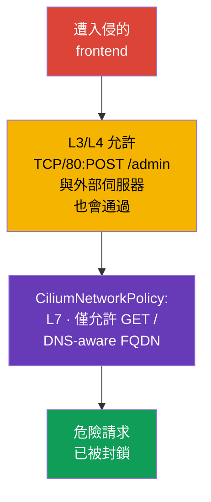

[Русская версия](ru.md) · [Eng version](README.md) · [Versión en español](es.md) · [Version française](fr.md) · [Deutsche Version](de.md) · [ქართული ვერსია](ge.md) · [日本語版](jp.md)

# 第 06 章。Cilium NetworkPolicy

> **問題。** 遭入侵的 frontend 可能利用已允許的 TCP 存取權連到 backend 執行 `POST /admin`，
> 或在 DNS 解析後將資料送到外部 IP：L3/L4 NetworkPolicy 無法區分這些情況。若沒有 L7、
> FQDN 與 identity-aware 的限制,一個原本合法的連線就會變成危險請求或資料外洩的管道,
> 而缺乏可觀測性又讓 DROP 的偵測與調查變得困難。

> **接下來。** 原生 NetworkPolicy 已經可以隔離 Pod 並封鎖對 metadata 服務的存取。但對部分情境
> 這還不夠:需要允許特定的 HTTP 方法、考量外部服務的 DNS 名稱、區分往叢集內部的流量與往
> 網際網路的流量,並看到每個 DROP 的原因(封包被丟棄而不回應傳送端)。**CiliumNetworkPolicy**
> 用 L7 過濾、FQDN 規則、identity 與可觀測性擴充了 Cilium 網路政策的基本能力。本章深化 CKS
> Cluster Setup 領域中「Use Network security policies to restrict cluster level access」的
> 能力,並作為 lab 102 的基礎。
>
> 公開的 CKS 大綱並未要求每個考試環境都一定使用 CiliumNetworkPolicy、`toFQDNs` 或 Hubble,
> 因此請將 Cilium 專屬的命令與 CRD 視為深化知識,適用於實際提供 Cilium 的叢集。

> **Cilium 不會自己出現在叢集中。** 它是獨立的 CNI,由叢集管理員透過 `cilium` CLI 或 Helm
> chart 安裝——可以在已建立的叢集上安裝,也可以在建立叢集時取代標準 CNI。若你的環境尚未安裝
> Cilium,本章所有範例在安裝前都無法套用。官方安裝說明:
> [Cilium Quick Installation](https://docs.cilium.io/en/stable/gettingstarted/k8s-install-default/)。
> 比本章更詳細的 L3/L4/L7 規則範例,請見官方章節
> [Overview of Network Policy](https://docs.cilium.io/en/stable/security/policy/),
> 其中包含獨立的 Layer 3、Layer 4 與 Layer 7 Policies 頁面。

> **需要哪些 CKA 基礎。** CNI 的基本模型、Pod 與 Service 的 IP 位址請見
> [CKA 第 30 章](../../../cka/course/30/tw.md),CNI 的用途及其在網路堆疊中的位置請見
> [CKA 第 40 章](../../../cka/course/40/tw.md)。Kubernetes NetworkPolicy 的基本語法已在本課程
> 第 04 章解說過;這裡不再重複,而是直接使用 Cilium 的能力。

> 🧠 `kube-proxy` 將 `ClusterIP:port` 導向選定的 Pod,而 CNI 則另外套用 `NetworkPolicy`。

## 06.0. 對你而言的新知:以 eBPF datapath 取代 kube-proxy

### 沒有 Cilium 時的基準:流量目前如何到達 Service

在本章之前,封包到達 Service 的路徑由 `kube-proxy` 負責。這個機制由三部分組成:

- **觀察。** 每個節點上的 `kube-proxy` 監聽 Service 與 `EndpointSlice` 物件的變化。
- **編寫核心規則。** 每次變化時,它會更新核心規則——通常透過 `iptables` 或 `nftables`
  (逐漸淘汰的 `ipvs` 也仍可能使用)。
- **攔截與 DNAT。** 規則攔截往 `ClusterIP:port` 的流量,並 DNAT 到隨機或依 session
  affinity 選出的特定 Pod 的 IP。

第 04 章的 `NetworkPolicy` 是疊加在同一模型上的獨立層:CNI 會自行讀取 `NetworkPolicy`
物件,並加入自己的核心規則,依實作方式在 kube-proxy 規則**之前或之後**允許或封鎖封包。

> 🧠 Cilium 將 workload 的 labels 與 identity 綁定,並透過 eBPF maps 套用 L3/L4 policy;L7 需要 proxy path。

### Cilium 帶來的改變:以 eBPF 作為主要的 L3/L4 datapath

Cilium 為同一條封包路徑提出了不同的架構:

- **以 eBPF 作為主要的 L3/L4 datapath。** 對於 pod networking、L3/L4 policy 與
  kube-proxy-replacement,Cilium 使用 eBPF 程式與 BPF maps。這些程式會附掛在核心的
  hook 點上,例如網路介面與 cgroup。
- **Map lookup 取代線性的 `iptables` 遍歷。** 在 kube-proxy-replacement 模式下,Cilium 在
  BPF maps 中保存 Service/backend 狀態,並執行 lookup 而不必依序遍歷長串的 `iptables`
  鏈。這是與 `iptables` 模式下 kube-proxy 的重要差異。請不要把這個比較套用到 kube-proxy
  的 `nftables` 模式:現代的 nftables 模式同樣使用以 map 為基礎的分派
  (`verdict map`),lookup 大約是 O(1)——詳情請見 Kubernetes 官方部落格關於
  kube-proxy nftables 模式的說明。
- **兩種運作模式。** 完整的 **kube-proxy-replacement** 在 eBPF 中實作整個 Service 負載
  平衡,並允許將 `kube-proxy` 從叢集中移除。在協作模式下,`kube-proxy` 繼續服務
  Service,而 Cilium 則在旁加入 policy enforcement 與 L7 能力。

這兩種模式都可以用於生產環境,CKS 考試不要求特定的其中一種。

必須區分不同層級。kube-proxy-replacement 下的 L3/L4 forwarding、policy enforcement 與
Service 負載平衡,在 Cilium 中主要透過 eBPF 實作。

L7 的 HTTP/DNS policy 運作方式不同:選定的流量會被重新導向到節點本地的 userspace proxy
(Envoy 或 DNS proxy)。在目前的 stable 版本中,這種 proxy redirection 也可能使用
netfilter/`iptables` TPROXY。因此不應把 Cilium 描述成在任何功能下都完全排除 `iptables`
與 userspace 的 datapath。

> 🎯 針對 labels/CIDR 與 L3/L4 埠使用原生 `NetworkPolicy`,針對 L7 HTTP/DNS、`toFQDNs`、
> `toEntities` 與 Cilium 可觀測性使用 CNP。

### 何時原生 `NetworkPolicy` 就夠用,何時需要 CNP

從機制上的差異可以得到在原生 `NetworkPolicy` 與 `CiliumNetworkPolicy`(CNP)之間選擇的
實務準則:

- **先從原生 `NetworkPolicy` 開始。** 如果任務是依 labels、namespace、CIDR 與
  TCP/UDP/SCTP 埠允許或禁止 Pod 之間的流量,這就足夠了。這種政策可跨叢集與 CNI 移植,
  因此沒有理由就改用 CNP 只會讓遷移與維護更複雜。
- **當需要控制已允許的 L3/L4 連線內部時,改用 CNP。** 典型的觸發情境包括:限制特定的
  HTTP 方法或路徑(L7)、允許或禁止特定的外部 DNS 名稱(`toFQDNs`)、明確描述往
  `world`、`cluster` 或 `host` 的流量(`toEntities`),或透過 Hubble 取得可觀測性以
  調查 `DROP`。
- **兩種模型可以結合使用。** 原生 `NetworkPolicy` 仍是可移植的 L3/L4 控制,CNP 則在
  L3/L4 已不足以應付的地方加入更細緻的粒度。allow/deny 如何一起計算的細節在本章後面說明。

> 🧠 CNP 為原生 `NetworkPolicy` 加入 labels、L7 與 FQDN;明確的 Cilium deny 優先於 allow。

## 06.1. 為什麼需要 Cilium 政策

原生 `NetworkPolicy` 在 L3/L4 層描述網路關係:哪些 Pod、CIDR 與埠可以交換
TCP/UDP 流量。它有意不知道 HTTP 路徑、DNS 名稱或連線的上下文。Cilium 在 eBPF 中實作
網路政策,並加入 workload identity、L7 proxy 與可觀測性。

攻擊情境:frontend 因應用程式漏洞遭入侵。一般的政策可能允許它以 TCP/80 存取
backend,因此攻擊者取得相同的存取權。如果 backend 只接受 `GET /`,那麼即使 TCP 連線被
允許,`POST /admin` 或 `DELETE /data` 也不應該通過。另一個常見情境是:Pod 在 DNS
解析後存取任意外部 IP,並將資料傳送給攻擊者。



Cilium 依 identity 而非僅依 IP 來評估政策。對於 Kubernetes workload,identity 是由
labels 建構的。重新建立 Pod 時它的 IP 會改變,但只要 labels 不變,使用
`endpointSelector` 的規則仍會繼續生效。

| 能力 | 原生 `NetworkPolicy` | `CiliumNetworkPolicy` |
|---|---|---|
| L3:pod/CIDR | 是 | 是,labels 與 identities |
| L4:TCP/UDP/SCTP 埠 | 是 | 是 |
| L7:HTTP、DNS | 否 | 是 |
| 依 FQDN 的規則 | 否 | 是,`toFQDNs` |
| `world` / `cluster` / `host` | 否 | 是,`toEntities` |
| 流量可觀測性 | 依 CNI 而定 | Hubble 與 `cilium` CLI |

`CiliumNetworkPolicy`(CNP)作用於其物件所在的 namespace,適合團隊或應用程式層級的
政策。`CiliumClusterwideNetworkPolicy`(CCNP)作用於整個叢集,適合平台層級的共用規則,
例如在所有 namespace 中禁止危險的 egress。CCNP 的後果更嚴重:選擇器範圍過廣的錯誤可能
切斷整個叢集,因此請先在獨立的 namespace 中測試規則,並使用範圍狹窄的 labels。

### 與原生 `NetworkPolicy` 的協作

[第 04 章](../04/tw.md)的 `NetworkPolicy` 與 CNP/CCNP 可以同時選中同一個
endpoint。它們的 allow 規則會一起被納入考量,但明確的 Cilium `ingressDeny`/`egressDeny`
優先於**所有** allow 規則:包括來自 CNP、CCNP 與原生 Kubernetes `NetworkPolicy` 的
allow。因此一般 `NetworkPolicy` 的 allow 無法繞過 Cilium 的 deny。遇到意外的 `DROP`
時,應盤點所有這些物件、它們的 selector 與方向,而不是只在最後套用的 CNP 中找錯誤。
原生政策仍是可移植的 L3/L4 控制;Cilium 則以 L7、FQDN、entities 與可觀測性補充它。

> **進階:Kubernetes `ClusterNetworkPolicy`。** 在較新版本的 Cilium 中,除了
> `NetworkPolicy`、CNP 與 CCNP 之外,還可能套用 Kubernetes `ClusterNetworkPolicy`
> (KCNP,`v1alpha2`)。它的 tiers 模型區分 `Admin`、`NetworkPolicy` 與
> `Baseline`;`Admin` tier 的規則優先於 CNP、CCNP 與一般 `NetworkPolicy`。這對於
> platform-wide 邊界很有用,但不是 CKS 必考的獨立主題:使用前請確認你的 Cilium
> 叢集是否啟用了對應的 API 與支援。

> 🎯 在 CNP 中 `endpointSelector` 選擇 Pod,`fromEndpoints`/`toEndpoints` 選擇
> identity,`toPorts` 選擇協定與埠;ingress 與 egress 各自獨立造成 default-deny。

## 06.2. L3/L4:只允許所需的 workload 與埠

只有被 `endpointSelector` 選中,政策才會套用到 endpoint。在
`policyEnforcementMode: default` 下,只要有政策選中該 endpoint,Cilium 就會啟用
enforcement;`always` 會對所有 endpoint 啟用(沒有 allow 規則的 endpoint 會被拒絕),
`never` 則停用 enforcement。預設情況下,allow-list **各方向獨立生效**:存在 `ingress`
就會讓 ingress 在符合 allow 規則之前呈 default-deny 狀態,存在 `egress` 同樣只讓
egress 呈 default-deny。只有 `ingress` 的政策不會關閉 egress,反之亦然。因此
selector 必須精確。

這個行為可以透過 `enableDefaultDeny` 更改:設為 `false` 的方向不會被納入 default-deny
的判斷。這樣管理員就能安全地套用 cluster-wide 政策——例如攔截 DNS——而不會有把
endpoint 轉為 default-deny、封鎖合法流量的風險。這個例外不應套用到 L7 政策:
`enableDefaultDeny` 不適用於 layer-7 規則,即使已明確停用 default-deny,加入
L7 rule 而沒有對應的 L7 allow-all 仍會導致 DROP。

Cilium 會追蹤連線狀態:允許起始的 ingress 或 egress 流量,會允許**同一連線的回應
流量**,但不會允許反方向的新連線。因此不要機械式地為回應複製一條規則,而應在應用程式
真正需要時明確描述獨立的反向呼叫。

下面的範例中,label 為 `app: backend` 的 backend 只接受來自同一個 namespace
`cks-102` 中 label 為 `app: frontend` 的 frontend 的 TCP/80 流量。`fromEndpoints`
是依 identity 的 L3 限制,`toPorts` 是依協定與埠的 L4 限制。

```yaml
apiVersion: cilium.io/v2
kind: CiliumNetworkPolicy
metadata:
  name: backend-from-frontend-http
  namespace: cks-102
spec:
  endpointSelector:
    matchLabels:
      app: backend
  ingress:
  - fromEndpoints:
    - matchLabels:
        app: frontend
    toPorts:
    - ports:
      - port: "80"
        protocol: TCP
```

套用 manifest 後,先驗證物件狀態,再認定政策已生效:

```bash
kubectl apply -f backend-l3-l4.yaml
kubectl -n cks-102 get ciliumnetworkpolicy
kubectl -n cks-102 describe ciliumnetworkpolicy backend-from-frontend-http

# 先檢查 Cilium 用來建構 identity 的 labels。
kubectl -n cks-102 get pod --show-labels
```

對於跨 namespace 的流量,請在 `matchLabels` 中加入 namespace label。Cilium 會自動
加上前綴為 `k8s:` 的 Kubernetes labels;namespace 通常以
`k8s:io.kubernetes.pod.namespace` 這個 label 表示。

```yaml
  ingress:
  - fromEndpoints:
    - matchLabels:
        k8s:io.kubernetes.pod.namespace: storefront
        app: frontend
    toPorts:
    - ports:
      - port: "8080"
        protocol: TCP
```

如果目的地是 Pod,不要用任意的 `toCIDR` 規則取代 identity。CIDR 不會跟隨 workload
重新建立而更新,而且可能誤含其他人的 IP。`toCIDR` 適合用於穩定的外部網路或狹窄的服務
IP 範圍,而不是連接兩個 Kubernetes 服務的常規方式。

> 🔬 Active FTP 使用動態的反向埠,靜態的 L3/L4 CNP 無法表達這一點;需要
> protocol-aware gateway 或使用固定範圍的 passive FTP。

### 邊界情況:active FTP 無法用 L3/L4 表達

Active FTP 展示了 L3/L4 政策的界限。客戶端在 TCP/21 上開啟控制連線,並告知伺服器
它用於資料連線的埠;接著**伺服器自己會發起一條新的 TCP 連線回連到客戶端**的該埠上。
這個埠事先未知,是在連線期間動態協商出來的,因此靜態的 `toPorts`/`fromEndpoints`
規則無法表達「允許一個稍後才會協商出埠號的入站連線」。

在 Kubernetes 與 Cilium 之前,這個問題是由**核心層的 connection tracking** 解決的:
`nf_conntrack_ftp` 模組會解析控制通道,看到協商出的埠,並動態把這條 related 連線加入
允許清單。`kube-proxy` 及其 `iptables`/`nftables` 規則本身無法解決這個問題——這是由
netfilter 之上一個獨立的 conntrack helper 解決的,而不是 Service forwarding 機制本身。

對於有受支援的應用層語義的協定,Cilium 可以使用 L7 proxy,但 FTP 不屬於這類協定。

標準的 CiliumNetworkPolicy 沒有提供 FTP-aware helper 或內建的 FTP L7 parser。因此
Cilium 無法透過 FTP 控制通道自動判斷 active-mode 資料連線協商出的埠,並為它建立臨時的
政策許可。

在 Kubernetes 環境中,更適合使用**passive FTP**,搭配預先限定範圍的資料埠:這樣
TCP/21 上的控制流量與固定範圍內的資料流量,就可以用一般的 L3/L4 政策規則
(`endPort`)表達出來。

如果 legacy 應用程式一定需要動態協商埠的 active FTP,這已經是獨立的
protocol-aware gateway/proxy 或專門設計的網路層的任務,而不是標準 CNP 能解決的。

在目前 Cilium 內建的應用層規則中,請以 HTTP 與 DNS 為主。gRPC 是透過 HTTP/2 語義搭配
`rules.http` 過濾的;沒有獨立的 gRPC rule type。Kafka-aware 網路政策在 Cilium 1.20
中已移除。

> 🎯 在 `toPorts.rules.http` 中只允許所需的 method 與 path,並同時測試被允許與被
> 拒絕的請求。

## 06.3. L7:限制 HTTP 與 DNS

L7 規則加在 `toPorts` 元素內部。Cilium 會將選定的流量導向對應的 L7 proxy:HTTP 或
DNS。重要的推論是:L7 規則只對指定埠上被正確識別的協定生效。如果客戶端在沒有設定 TLS
終止的埠上使用 TLS,不能期待 HTTP 過濾能生效:proxy 看不到明文的 HTTP。

以下規則只允許 frontend 對 backend 執行 `GET /`。路徑的正規表示式 `^/$` 特意寫得很
窄:`/healthz`、`/api` 以及任何 `POST` 都不會符合,將被拒絕。

```yaml
apiVersion: cilium.io/v2
kind: CiliumNetworkPolicy
metadata:
  name: backend-read-only
  namespace: cks-102
spec:
  endpointSelector:
    matchLabels:
      app: backend
  ingress:
  - fromEndpoints:
    - matchLabels:
        app: frontend
    toPorts:
    - ports:
      - port: "80"
        protocol: TCP
      rules:
        http:
        - method: "GET"
          path: "^/$"
```

不只要驗證成功的請求,也要驗證被拒絕的情況。測試用 Pod 的映像中應含有 `curl` 或其他
HTTP 客戶端:

```bash
kubectl -n cks-102 exec deploy/frontend -- curl -i http://backend/
kubectl -n cks-102 exec deploy/frontend -- \
  curl -i -X POST http://backend/

# 預期:GET 回傳 200;未符合的 L7 請求會被 Cilium proxy 拒絕,通常是 403。
```

對於 API,更安全的做法是列舉允許的方法、路徑,並在必要時列舉標頭,而不是使用寬鬆的
`path: ".*"`。L7 政策無法取代應用程式的驗證與授權:它縮小了可用的攻擊面,但不知道使用
者身分與業務規則。

Cilium 也能依查詢名稱過濾 DNS。不要在沒有需要時啟用 L7-proxy:它會在流量路徑上增加
處理負擔,需要單獨進行效能測試。

> 🔬 gRPC 是以 HTTP/2 的方式過濾,透過 `POST` 與方法路徑。

### gRPC:透過 HTTP 過濾,但負載平衡上有特別之處

Cilium 沒有獨立的「gRPC 解析器」。gRPC 執行在 HTTP/2 之上,每個方法呼叫都被編碼成
一般的 HTTP 請求:對形如 `/套件.服務/方法` 的路徑執行 `POST`。因此 gRPC 的 L7
過濾,其實就是你上面剛看到的同一種 HTTP `path` 規則,只是 regex 或精確路徑描述的是
`/cloudcity.DoorManager/GetName` 而不是 `/`。

例如,下面的規則只允許 `public-terminal` 對 `cc-door-mgr` 呼叫讀取狀態,但不允許
變更存取密碼:

```yaml
apiVersion: cilium.io/v2
kind: CiliumNetworkPolicy
metadata:
  name: door-read-only-grpc
spec:
  endpointSelector:
    matchLabels:
      app: cc-door-mgr
  ingress:
  - fromEndpoints:
    - matchLabels:
        app: public-terminal
    toPorts:
    - ports:
      - port: "50051"
        protocol: TCP
      rules:
        http:
        - method: "POST"
          path: "/cloudcity.DoorManager/GetName"
        - method: "POST"
          path: "/cloudcity.DoorManager/GetLocation"
```

呼叫 `SetAccessCode` 不會符合任何規則而被拒絕——客戶端會收到 gRPC 狀態
`PERMISSION_DENIED`,而不是一般的網路 timeout。附有示範應用程式的詳細逐步範例請見
官方文件:[Securing gRPC](https://docs.cilium.io/en/stable/security/grpc/)。

如果 Cilium **完全取代 kube-proxy**(`kube-proxy-replacement`),負載平衡上會出現
另一個問題。gRPC 使用一條長效的 TCP 連線,並在其中連續執行大量呼叫。Cilium 一般的
eBPF 負載平衡是在**建立連線時選擇一次** Pod,而不是連線內每次個別呼叫都重新選擇。如果
客戶端開啟連線後長時間保持不放,它的所有流量都會流向同一個 Pod,而其他 backend 副本
分不到應有的負載份額——這稱為連線 pinning。

解決方法是為所需的 Service 啟用 Cilium 的 **Proxy Load Balancing**:流量會經由內建
的 Envoy 導向,它能夠檢視 HTTP/2 串流內部,把個別的 gRPC 呼叫分配到不同的 Pod,而不是
把整條連線都導向同一處。若不做這項設定,在沒有 kube-proxy 的叢集中,長效的 gRPC
客戶端值得單獨檢查各副本間的負載是否均衡。

只需在 Service 物件加上一個 annotation 即可啟用,不需要修改 workload 的 manifest:

```bash
kubectl annotate service payment-grpc-service \
  service.cilium.io/lb-l7=enabled
```

之後,往 `payment-grpc-service` 的流量會經由 Cilium 管理的 Envoy,由它把個別呼叫分配
到不同的 Pod,而不是把整條 TCP 連線 pin 到同一個 backend。可以用另一個 annotation
`service.cilium.io/lb-l7-algorithm`(`round_robin`、`least_request` 或
`random`)進一步調整負載平衡演算法。這個功能目前處於 **beta** 狀態;在生產環境啟用
前請先在你所用的 Cilium 版本中確認其行為。透過 Hubble 觀察流量的逐步範例請見官方文件:
[Proxy Load Balancing for Kubernetes Services](https://docs.cilium.io/en/stable/network/servicemesh/envoy-load-balancing/)。

**Envoy 實際上位於何處。** 它不是每個 Pod 裡的 sidecar。Envoy 內建於 Cilium 映像中,
**在每個節點上執行一次**:可以是 `cilium-agent` 內部的一個處理程序,也可以是該節點上
所有 Pod 共用的獨立 `cilium-envoy` DaemonSet。在上面討論的情境中,經過它的是被
L7 政策或 proxy load balancing(`lb-l7`)重新導向的流量。這不是完整清單:Cilium
Ingress、Gateway API 與 `CiliumEnvoyConfig` 也會把流量導向同一個 per-node 的
Envoy。一般 Pod-to-Pod 的 L3/L4 流量,如果沒有啟用這些以 proxy 為基礎的功能,仍會停留
在 eBPF datapath 而不經過 userspace。

**這對延遲與連線參數有何影響。** 每個被重新導向的封包都會多經過同一節點上 Envoy
這個 userspace 處理程序一次,而不是經過網路到另一個節點或 Pod。這會增加:

- **每個請求的少量額外延遲**——從核心到 userspace 再返回的切換,加上協定解析
  (HTTP/gRPC)。對本地 hop 而言這個量通常很小,但並非零,啟用前值得在真實負載下
  測量。
- **節點上額外的 CPU 與記憶體使用**——Envoy 是作為獨立處理程序處理流量,因此在
  L7 流量較大時,節點負載會相應增加。
- **Source address 取決於 proxy path 與設定。** 經過 Envoy 這一事實本身,並不代表
  backend 一定會看到 proxy 自己的 source IP。對於 L7 policy enforcement,Cilium
  預設使用 original source address;`CiliumEnvoyConfig`、Ingress 與 Gateway API
  則有各自的設定與 source visibility 規則。因此 backend 可見的 source IP/port
  需要針對具體模式驗證,不能單憑使用了 Envoy 這一點就推斷。
- **額外負擔只施加在被選中的流量上**——沒有 L7 規則、沒有 `lb-l7` annotation 的一般
  L3/L4 連線不會付出這個代價:它們仍走快速的 eBPF 路徑,不經過 Envoy。

> **時效性提醒。** Cilium 的 Kafka L7 過濾從 1.18 版起已被 deprecated,並在 1.20
> 版中移除。CKS 應以 L7 HTTP 與 DNS/`toFQDNs` 為主,Kafka 政策只當作歷史範例參考,
> 而不是目前的實務做法。

> 🎯 允許 UDP/TCP 53 存取可信的 CoreDNS,並用 `toFQDNs` 限制外部存取;Cilium 使用
> 觀察到的 DNS 回應與 FQDN 快取。

## 06.4. DNS-aware egress 與 `toFQDNs`

公開 SaaS 服務的 IP 會變動,CDN 會回應不同的位址,而應用程式通常知道的是名稱而不是
IP。`toFQDNs` 允許往名稱的 egress,方式是把名稱對應到 Cilium 的 DNS-proxy 在已允許
的 DNS 回應中觀察到的 IP;這不是套用 YAML 時做一次靜態 DNS 解析。Proxy 會依 TTL
填入 FQDN 快取,然後允許連往快取中該 IP 的連線。因此 DNS 解析只應導向被精確 selector
選定的可信 cluster DNS(例如 CoreDNS):Cilium 不會自己發出 DNS 查詢,也不應信任任意
的 nameserver。

下面的政策允許 frontend 向 CoreDNS 發出 DNS 查詢,並只允許以 HTTPS 存取
`example.com`。`rules.dns` 允許 DNS 查詢,`toFQDNs` 則允許後續連往已允許名稱所解析
出的 IP 的連線。

```yaml
apiVersion: cilium.io/v2
kind: CiliumNetworkPolicy
metadata:
  name: frontend-external-api-only
  namespace: cks-102
spec:
  endpointSelector:
    matchLabels:
      app: frontend
  egress:
  - toEndpoints:
    - matchLabels:
        k8s:io.kubernetes.pod.namespace: kube-system
        k8s:k8s-app: kube-dns
    toPorts:
    - ports:
      - port: "53"
        protocol: UDP
      - port: "53"
        protocol: TCP
      rules:
        dns:
        - matchPattern: "*"
  - toFQDNs:
    - matchName: "example.com"
    toPorts:
    - ports:
      - port: "443"
        protocol: TCP
```

`matchName` 只選擇一個確切的名稱。若需要一組可控制的子網域,請使用
`matchPattern`,例如 `"*.example.com"`:這種 wildcard 不應被視為同時允許了 apex
名稱 `example.com`。如果同時需要 `example.com` 及其子網域,請用獨立的規則分別表達。
不要在沒有明確需要時使用 `"*"`:在 `toFQDNs` 中這種 pattern 會取消 DNS 名稱的限制,
允許所有符合名稱在 DNS 快取中取得的目的地;同一規則中的其他條件,例如
`toPorts`,仍會繼續生效。套用前請確認你叢集中 CoreDNS 實際的 labels——某些安裝
使用的 label 不是 `k8s-app: kube-dns`。

```bash
kubectl -n kube-system get pod --show-labels | grep -E 'coredns|dns'
```

下面的範例是說明性的手動檢查,而不是確定性的 acceptance test。IANA 明確指出,
文件用網域(`example.com`、`example.org` 等)的 HTTP 服務是 best-effort 提供的,
並非設計給軟體作為 testing endpoint:
https://www.iana.org/news/2024/example-domain-http-methods.html。如果你的環境
中 `example.com`/`www.google.com` 無法存取(網路限制、暫時性故障、特定網路的封鎖),
這不代表政策有誤——請換成你在套用政策**之前**已經獨立確認過 DNS 可解析且 HTTPS
可正常運作的 FQDN。

```bash
kubectl -n cks-102 exec deploy/frontend -- \
  curl -I --max-time 5 https://example.com
kubectl -n cks-102 exec deploy/frontend -- \
  curl -I --max-time 5 https://www.google.com
```

套用政策前,先確認上面兩個請求都能不受限制地通過。之後才套用 `toFQDNs`,並比較結果:
`example.com:443` 應該通過,而 `www.google.com:443` 應該**正是被政策**封鎖,而不是
因外部服務偶然不可用而失敗。

`toFQDNs` 不是完整的 DLP,也不是對 HTTP `Host` 的檢查:它是依觀察到的 DNS 解析做的
網路存取控制。DoH/DoT 會讓 DNS 查詢對 DNS-proxy 不可見,本身不會填入 FQDN 快取。
直接連往 IP 也不會建立 FQDN 對應;只有當該 IP 已因先前被允許的 DNS 回應而存在於快取
中,或有更寬的 L3/L4 規則允許時才會成功。如果這對你的威脅模型很重要,不要放行未經
解析的 DNS 伺服器、DoH/DoT 或直接 IP:將 egress 限制到可信的 DNS、開啟所需的 DNS
visibility,並將這些規則與邊界的 proxy/firewall 結合使用。

> 🔬 `world`、`cluster`、`host` 與 CCNP 用於 platform-wide 邊界;測試時範圍要窄,
> 並考量 host firewall 與系統流量。

## 06.5. Entities 與 cluster-wide 政策

Entities 為那些不適合用 Kubernetes labels 表達的地址群組提供了可讀的識別碼。最有用
的值包括:

| Entity | 包含內容 | 典型情境 |
|---|---|---|
| `world` | 叢集外部的位址 | 允許往外部 API 的出口或來自外部的入口 |
| `cluster` | 叢集內部的 endpoints | 把叢集內部流量與網際網路區分開來 |
| `host` | 節點的本地 host endpoint | 明確控制對節點的存取 |
| `remote-node` | 叢集中的其他節點 | 允許所需的節點間互動 |
| `kube-apiserver` | Kubernetes API server | 限制 workload 對 API 的存取 |

例如,一個只應從網際網路接受 HTTPS 的服務,可以用 label 選中它,並用 entity
`world` 限制 ingress:

```yaml
apiVersion: cilium.io/v2
kind: CiliumNetworkPolicy
metadata:
  name: public-gateway-from-world
  namespace: cks-102
spec:
  endpointSelector:
    matchLabels:
      app: public-gateway
  ingress:
  - fromEntities:
    - world
    toPorts:
    - ports:
      - port: "443"
        protocol: TCP
```

平台層級的防護會使用 CCNP。下面的範例禁止被政策選中的所有 endpoint 存取
metadata IP,但保留其他 egress:因為生效中的 `egress` 政策本身就會啟用 egress
default-deny,所以這裡必須有明確的 allow `toEntities: [all]`。`egressDeny`
優先於任何 allow,包括這個 allow-all 以及其他 CNP/CCNP 的規則,因此 metadata IP
不會被意外開放。請先評估系統 workload 是否需要呼叫 metadata,必要時用獨立的
selector 或 namespace 排除它們。

```yaml
apiVersion: cilium.io/v2
kind: CiliumClusterwideNetworkPolicy
metadata:
  name: deny-cloud-metadata
spec:
  endpointSelector: {}
  egress:
  - toEntities:
    - all
  egressDeny:
  - toCIDR:
    - 169.254.169.254/32
```

不要把 `host` 當作無害的物件。`toEntities: host` 控制的是對本地節點與
host-networked workload 的網路存取,因此可能開啟通往 kubelet 或節點上其他
TCP/UDP listener 的路徑。Runtime CRI socket 是另一個機制:例如 containerd 通常是
透過 Unix domain socket `/var/run/containerd/containerd.sock` 存取,其暴露程度
取決於檔案系統掛載/`hostPath` 與 Pod 的權限,而不是取決於 `toEntities: host`
本身。限制 host 流量需要理解 Cilium host firewall、`hostFirewall.enabled`
模式以及 control plane 流量;請在測試叢集中驗證,以免失去對節點或 API server 的
存取。存取 runtime socket 的問題應另外透過 mount/privilege controls 限制。

## 06.6. 用 Hubble 進行可觀測性與驗證

### Hubble 是什麼,它解決什麼問題

一般的 `NetworkPolicy` 或 `CiliumNetworkPolicy` 回答的是「允許什麼」這個問題。它不
回答「實際發生了什麼」:為什麼某個具體請求沒有通過、DROP 究竟對應哪條規則、客戶端是
否能看到 TCP-connect,還是拒絕已發生在 L7。沒有這類工具,調查就只能靠反覆閱讀 YAML
與猜測。

**Hubble** 是 Cilium 的可觀測性元件,讀取 datapath 本來就在收集的同一批 eBPF 事件,
並將其轉換成可讀的 flow 事件串流:source/destination identity、L4/L7 上下文、
verdict(`FORWARDED`/`DROPPED`)與拒絕原因。它不會取代 Kubernetes audit log,也不會
替你讀取請求的內容——它顯示的是 Cilium 對某個具體連線做出了什麼決定,以及原因。

> 🔬 Hubble 的 Server/Relay/UI 架構、CLI 與各元件依 Cilium 的版本與安裝方式而不同。

架構上,Hubble 由四個部分組成:

- **Hubble Server**——內建在 `cilium-agent` 中,在每個節點上執行;透過 gRPC 提供
  flow events。
- **Hubble Relay**(`hubble-relay`)——一個獨立元件,連接所有節點上的 Server,提供
  統一的叢集視角,而不必逐節點查看。
- **Hubble CLI**(`hubble`)——命令列客戶端;可以連到 Relay 取得叢集層級的視角,
  也可以連到單一節點上的本地 Server。
- **Hubble UI**(`hubble-ui`)——建立在 Relay 之上、可選用的圖形介面,附帶服務關係
  地圖。

**如何啟用。** 在 managed 發行版與標準安裝中,Hubble 通常是在安裝或升級 Cilium 時
透過 Helm flag 啟用,例如
`--set hubble.relay.enabled=true --set hubble.ui.enabled=true`;確切的 flag 依
chart 版本而異。對 CKS 與本章而言,只需知道一件事:如果叢集中已啟用 Hubble,
`cilium status` 會顯示其狀態,而 CLI `hubble` 可以透過 port-forward 連到 Relay,
如下所示。為這個 lab 從零啟用 Hubble不是必須的——那是叢集管理員的工作,不是你套用
CNP 的一部分。

> 🎯 產生預期中允許與禁止的流量,然後用 namespace、verdict 或 protocol 篩選觀察
> Hubble flows。

測試前先確認 Cilium 的 agent 是健康的。命令通常在有可用 `cilium` CLI 的工作機上
執行;啟用 Hubble 的確切方式依 Cilium 的安裝方式而異。

`hubble` 是獨立的執行檔,不是 `cilium` CLI 的一部分。需要先在工作機上安裝一次,方式
是從 GitHub 下載對應的發行版;各平台的步驟見官方說明
[Install the Hubble Client](https://docs.cilium.io/en/stable/observability/hubble/setup/#install-the-hubble-client)。
安裝後用 `hubble help` 命令驗證這個執行檔。

```bash
cilium status --wait
cilium connectivity test

# 如果啟用了 Hubble relay,CLI 會建立一條到它的本地連線。
cilium hubble port-forward &
hubble status

# 只顯示來自練習用 namespace 的流量與拒絕。
hubble observe --namespace cks-102 --verdict DROPPED
hubble observe --namespace cks-102 --protocol http
```

在 lab 102 中,L3/L4、L7 與 FQDN 的驗證順序應該是可重現的:

1. 確認 `frontend` 與 `backend` 都在 Running 狀態,且其 labels 與 selector 相符。
2. 套用 L3/L4 CNP。從 frontend 對 backend:80 的請求應能通過;來自沒有
   `app: frontend` label 的 Pod 的請求應該 timeout 或 DROP。
3. 替換或補充 L7 CNP 規則。`GET /` 應回傳 `200`,而 `POST /` 應被 proxy 拒絕
   (通常是 `403`)。
4. 套用 DNS/FQDN 政策。驗證對已允許名稱的解析與 HTTPS,然後嘗試存取未被允許的名稱。
5. 在另一個終端機觀察 Hubble,並將允許與禁止流量的 flow 保存下來作為結果證據。

以下的 CLI 與 Kubernetes 物件也有助於除錯:

```bash
kubectl -n cks-102 get ciliumnetworkpolicy -o yaml
kubectl -n kube-system get pods -l k8s-app=cilium

# 在選定節點上的 cilium Pod 中執行。
kubectl -n kube-system exec ds/cilium -- cilium-dbg endpoint list
kubectl -n kube-system exec ds/cilium -- cilium-dbg policy get
```

如果 `hubble observe` 沒有輸出,先檢查 `hubble status`、是否有 Hubble Relay、
kubeconfig 的 context 以及 namespace/verdict 篩選器。如果 default deny 之後 DNS
失效,幾乎都是因為沒有允許到 CoreDNS 實際 endpoints 的 UDP/TCP 53。如果 L7 規則
意外不符合,請檢查埠、protocol、HTTP method、路徑的正規表示式與 TLS:未經適當設定的
加密 HTTP,L7-proxy 是看不到的。

> 🎯 檢查 labels/selectors、方向、埠與 DNS,然後在 Hubble 中比較允許與禁止的
> flow;從狹窄的 allow 開始展開,並準備 rollback。

## 06.7. 常見錯誤與安全的導入順序

| 現象 | 可能原因 | 該檢查什麼 |
|---|---|---|
| 政策生效後名稱無法解析 | 沒有允許 DNS,或 CoreDNS 的 selector 不正確 | CoreDNS 的 labels、UDP 與 TCP 53、Hubble DROPPED |
| `GET` 與 `POST` 都被拒絕 | L3 identity 或 L4 埠不符合 | endpoint 的 labels、Service 的埠與 targetPort |
| L7 規則沒有限制到請求 | 流量未被識別為 HTTP,或有更寬的規則 | protocol、TLS、`cilium policy get`、Hubble HTTP flows |
| FQDN policy 沒有給予對服務的存取 | 名稱與 DNS 回應不符,或 IP 快取尚未填入 | `hubble observe --protocol dns`、`matchName`、TTL |
| CCNP 破壞了系統流量 | selector 範圍過廣,或未考慮系統 endpoints | 政策範圍、namespace/labels、在測試 namespace 中 rollout |
| Hubble 中沒有事件 | Hubble Relay/CLI 未連接,或篩選器過窄 | `hubble status`、port-forward、移除篩選器 |

**Cilium 的 Policy Audit Mode** 在準備 L3/L4 政策階段很有用:對 daemon 啟用
(`--policy-audit-mode=true`)或對選定 endpoint 啟用時,它會放行原本會被政策丟棄
的流量,並記錄對應的 policy verdict。在這個模式下,不要只透過 `--verdict DROPPED`
尋找這類流量,而要觀察 policy verdicts:

```bash
hubble observe flows -t policy-verdict --namespace cks-102
```

符合未來禁止規則的流量會顯示為 `AUDITED`,即使該連線目前仍然通過。關閉 Audit
Mode 之後,同一個測試如果真的被規則禁止,會變成 `DENIED`;如果有 allow 規則覆蓋
該流量,則仍會是 `ALLOWED`。應先透過 Hubble 收集這些事件、收窄 allow 規則,然後
才啟用 enforcement。這是一種診斷用的臨時模式,而不是生產環境的防護:在此模式下不會
真正執行封鎖;對 L7 政策而言,它也不能取代對 HTTP/DNS 的真實檢查。

安全的導入順序:先在 staging 中觀察 Hubble 並保存真實流量的 baseline,必要時短暫
使用 Policy Audit Mode,然後加入狹窄的 allow 並從測試 Pod 驗證;只有在此之後才在
生產環境啟用 deny 或擴大範圍。不要在生產叢集的 CCNP 中以 `endpointSelector: {}`
開始。每次變更都要有 rollback 方式:
`kubectl delete ciliumnetworkpolicy <name> -n <namespace>`,或透過 GitOps 回退,
而不是沒有歷史記錄的手動修改。

> 🏭 CNP rollout:review、staging、GitOps、baseline flows,以及 CCNP 與應用層
> 政策擁有者的分離。

## 06.8. 生產環境中的實際做法

- **政策與 workload 放在一起管理。** 應用程式的 CNP 要經過 code review、在
  staging 中測試,並透過 GitOps 工具套用。Platform 團隊另外擁有影響範圍廣的 CCNP。
- **Labels 是安全性合約。** 團隊固定 `app`、`component`、`tenant` 之類的 labels,
  不允許 workload 隨意變更具安全意義的 labels,否則政策的 selector 可能開始選中
  錯誤的 endpoint。
- **L7 用於高價值的 API。** 只允許預期中的 HTTP methods/paths 能降低橫向移動的
  風險,但不能取代 OAuth、mTLS 與應用程式層的授權。
- **Egress 依 DNS 與目的地構建。** `toFQDNs` 用於已知的外部 API,而不是作為通用
  規則。DNS、proxy 與邊界防火牆仍是縱深防禦的各層。
- **在事件發生前就啟用 Hubble。** 針對 `DROPPED` flows 的儀表板與 flow log 的
  保存,能區分政策錯誤與應用程式故障,並更快調查可疑的 egress。

## 06.9. 小詞彙表

- **Cilium**——為 Kubernetes 提供的、以 eBPF 為基礎的 CNI 與安全平台。
- **CiliumNetworkPolicy(CNP)**——namespace 層級的 Cilium 政策資源。
- **CiliumClusterwideNetworkPolicy(CCNP)**——叢集層級的 Cilium 政策。
- **Identity**——Cilium 依 labels 建構出的 endpoint 識別碼。
- **L3/L4**——網路層與傳輸層協定/埠。
- **L7**——協定層,例如 HTTP method/path 或 DNS。
- **`toFQDNs`**——依 DNS 名稱與觀察到的 DNS 回應設定的 egress 規則。
- **Entity**——Cilium 預先定義的位址群組,例如 `world`、`cluster`、`host`。
- **Hubble**——Cilium 網路 flows 的可觀測性元件。
- **eBPF**——Linux 核心的機制,Cilium 藉此實作 datapath 與 policy enforcement。

## 06.10. 本章總結

- Cilium 用 L3/L4/L7 政策、identities、FQDN 與 Hubble 可觀測性補充原生
  NetworkPolicy。
- CNP 作用於 namespace,CCNP 作用於整個叢集;範圍廣的 CCNP 需要特別謹慎的
  rollout。
- `endpointSelector` 選擇受保護的 endpoint,`fromEndpoints`/`toEndpoints`
  設定 L3,`toPorts` 設定 L4。
- HTTP L7 規則能只允許所需的方法與路徑,但不能取代應用程式的驗證,而且需要能被
  識別的明文協定。
- `toFQDNs` 依名稱限制外部 egress;需要另外允許 DNS,並考量 DNS 快取、TTL 與可能
  的規避手法。
- `toEntities` 表達對 `world`、`cluster`、`host` 及其他系統群組的存取。
- Hubble 顯示被允許與被禁止的 flows,是驗證與除錯政策的主要工具。

## 06.11. 這對你有何幫助:考試與實務工作

**在考試中。** 必須具備可移植的技能:應用網路安全政策,快速讀懂 labels、選擇
namespace 與方向(`ingress`/`egress`)、允許所需的流量並證明結果。**如果提供的叢集
或 fixture 使用 Cilium**,還需要能建立帶有 `endpointSelector` 的
`CiliumNetworkPolicy`,必要時限制 HTTP 或使用 `toFQDNs`,並用 `hubble observe`
驗證 flows。L7、FQDN 與 Hubble 屬於 Cilium 特有的深化知識,並非公開大綱保證每個
任務都有的介面;DNS 仍應以獨立規則處理。

**在實務工作中。** Cilium 政策把架構上的邊界轉譯成可執行的規則:frontend 不會取得
對 backend 的任意存取權,workload 不會任意存取網際網路,而往 API 的流量可以收窄到
所需的操作。Hubble 讓這些邊界在 rollout 與事件調查期間都可被驗證。

## 06.12. 自我檢查問題

<details>
<summary>1. 除了資源格式之外,CNP 與原生 `NetworkPolicy` 有什麼不同?</summary>

CNP 使用由 labels 建構的 Cilium identities,並加入 HTTP/DNS 的 L7 過濾、
`toFQDNs`、entities(`world`、`cluster`、`host`)與 Hubble 可觀測性。原生
NetworkPolicy 仍是可移植的 L3/L4 控制,CNP/CCNP 則補充它;明確的 Cilium deny
優先於這兩種政策類型的 allow。
</details>

<details>
<summary>2. 如果 ingress endpoint 被 CNP 選中,但流量沒有符合任何 allow 規則,會發生什麼事?</summary>

在 `policyEnforcementMode: default` 下,endpoint 會被隔離,隔離的方向是生效中
政策所描述的方向。如果 CNP 含有 `ingress`,ingress 就會呈 default-deny 狀態,
直到符合某條 allow 規則;同理 `egress` 只會隔離出站流量。
</details>

<details>
<summary>3. 如何在一條 CNP 規則中表達「只允許 frontend 到 backend 的 TCP/80」?</summary>

CNP 透過 `endpointSelector` 搭配 `app: backend` 選中 backend,並在 `ingress`
中用 `fromEndpoints` 搭配 `app: frontend`。在 `toPorts` 中設定埠
`"80"` 與 `protocol: TCP`;若是跨 namespace 的連線,則在來源的 `matchLabels`
中加上 `k8s:io.kubernetes.pod.namespace`。
</details>

<details>
<summary>4. 為什麼允許 TCP/80 還不足以限制 `POST /admin`,該怎麼做?</summary>

L3/L4 規則允許的是整條在埠 80 上的 TCP 連線,不會區分 HTTP method 或 path。需要
在 `toPorts` 內部加入 `rules.http`,例如 `method: "GET"` 與狹窄的
`path: "^/$"`;這樣 Cilium 的 L7-proxy 就會拒絕不符合的請求,通常回應 403。
</details>

<details>
<summary>5. `toFQDNs` 是如何運作的,為什麼還需要另外允許 DNS?</summary>

`toFQDNs` 不會在套用 YAML 時解析名稱:Cilium 的 DNS-proxy 會觀察已允許的 DNS
回應,依 TTL 填入 FQDN 快取,然後允許連往取得的 IP 的連線。因此需要另外允許 Pod
對可信 CoreDNS 的 DNS;DoH/DoT 不會填入這個快取,直接使用 IP 也不會建立 FQDN
對應。
</details>

<details>
<summary>6. entities `world`、`cluster` 與 `host` 分別適用於什麼情境,為什麼 `host` 需要特別謹慎?</summary>

`world` 表示叢集外部的位址,`cluster` 表示叢集內部的 endpoints,而 `host` 表示
節點的本地 host endpoint 與 host-networked workload。對 `host` 的存取可能牽涉
到 kubelet 與節點上的其他網路 listener,因此需要謹慎設計 host-firewall 政策。
Runtime CRI socket 是另一條攻擊路徑:通常是節點檔案系統上的 Unix socket,需要透過
限制 `hostPath`、權限與其他存取節點檔案系統的機制來保護。
</details>

<details>
<summary>7. 哪些 Hubble 命令有助於證明 Cilium 丟棄了被禁止的流量?</summary>

在執行 `cilium status --wait` 並設定好對 Hubble 的存取之後,可以用
`hubble observe --namespace cks-102 --verdict DROPPED` 觀察被拒絕的流量。對照
HTTP 與 DNS 分別使用 `hubble observe --namespace cks-102 --protocol http` 與
DNS 觀察;在 Policy Audit Mode 中,未來的禁止規則會透過
`hubble observe flows -t policy-verdict --namespace cks-102` 顯示為
`AUDITED`。
</details>

<details>
<summary>8. 為什麼在生產叢集中以 `endpointSelector: {}` 開始導入 CCNP 很危險?</summary>

CCNP 作用於整個叢集,空的 selector 會選中所有 endpoints,因此 allow/deny 中的
錯誤可能切斷系統與應用層的流量。應先在獨立的 namespace 中用狹窄的 labels 測試
規則,透過 Hubble 觀察 baseline,並準備好透過刪除政策或 GitOps 回退的 rollback
方式。
</details>

## 練習

在 lab 102 中鞏固 L3/L4、L7 HTTP、DNS-aware egress 與 Hubble。請依政策的順序完成
任務,不要一開始就試圖同時除錯所有層級。

🧪 Lab 102(Cilium NetworkPolicy L3/L4/L7):[tasks/cks/labs/102](../../labs/102/README_TW.MD)

🧪 Lab 115(從零安裝 Cilium:取代 kube-proxy、WireGuard 與基於 SPIRE 的 Mutual Authentication - advanced/production 進階實務內容,不屬於 CKS Core 考試正式範圍):[tasks/cks/labs/115](../../labs/115/README_RU.MD)

🎮 Cilium Hubble(文件與互動範例):
[Hubble observability](https://docs.cilium.io/en/stable/observability/hubble/) ·
[Network policy](https://docs.cilium.io/en/stable/security/network/)

---
[目錄](../README_TW.md) · [第 05 章](../05/tw.md) · [第 07 章](../07/tw.md)
