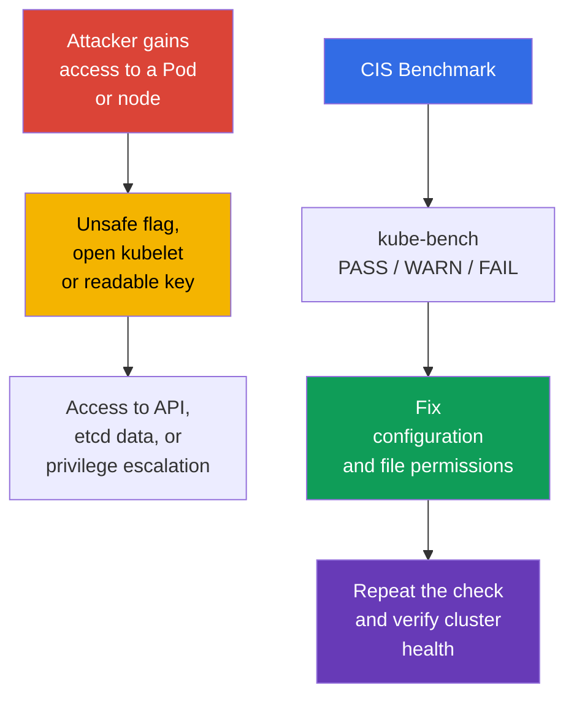
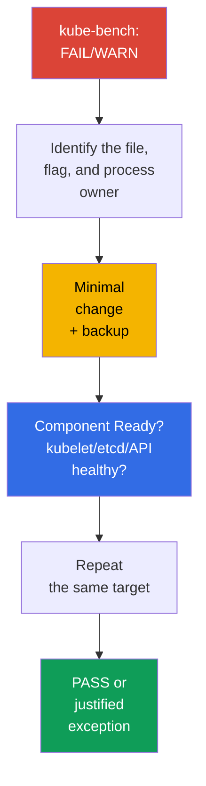

[Русская версия](ru.md)

# Chapter 07. CIS Benchmark and kube-bench

> **The problem.** A cluster is rarely compromised through a vulnerability in Kubernetes itself. More often, an attacker who already obtained access to a Pod or node finds an unsafe detail nearby - an unnecessary open port, weak component flag, or key readable by everyone. Individually these details go unnoticed; together they create a path to the API without verification, secrets in etcd, or privilege escalation on a node - and none are visible from application code.

> **What comes next.** Network policies limit an attacker's path between workloads. Now we check how securely the control plane and nodes themselves are configured. The **CIS Kubernetes Benchmark** turns hardening guidance into verifiable items, and `kube-bench` automatically compares them with cluster configuration. This belongs to the **Cluster Setup** domain (CKS, 15%): you need not only find an unsafe setting but also fix it without losing cluster functionality.

> **What you need from CKA.** This chapter does not repeat how `kubeadm`, static Pod objects, and PKI work. Before proceeding, recall [kubeadm and control-plane files](../../../cka/course/35/README.md) and [Kubernetes certificates](../../../cka/course/39/README.md).

## 07.1. CIS Kubernetes Benchmark: what exactly we check

The **CIS Kubernetes Benchmark** is a set of Center for Internet Security recommendations for Kubernetes configuration. It does not replace threat modeling, updates, or policy; it provides a minimal reproducible checklist of component settings, flags, and file permissions that reduce known attack surface.



> 🧠 `kube-bench` compares accessible files, arguments, and the CIS profile; `FAIL`/`WARN` require assessment of active state and risk.

Checks are grouped by roles and components. Profile names and recommendation IDs change between benchmark versions, so use the profile that `kube-bench` selected for the installed Kubernetes version. Kubernetes and CIS Benchmark versions do not map one-to-one: a benchmark version can cover several Kubernetes versions and vice versa. `kube-bench` can select a benchmark automatically only when the installed Kubernetes version is present in its published version mapping.

> 🔬 Version/profile mapping determines report reliability. Use a profile selected by supported `kube-bench`, and remediate the specific check.

> **Version-support snapshot as of 2026-09-08.** `kube-bench` branch `main` publishes a table in `docs/platforms.md`: CIS `1.12` for Kubernetes `1.32-1.33` and CIS `2.0` for Kubernetes `1.34-1.35`.
>
> However, distinguish the published support table from the contents of a particular kube-bench release. For example, pinned `v0.16.0` below does not yet contain `cfg/cis-2.0`: its bundled `cfg/config.yaml` maps Kubernetes `1.34` to `cis-1.12`, and has no mapping for `1.35`.
>
> Therefore, before running, check not only `docs/platforms.md`, but also the actual `cfg/config.yaml` and presence of the required `cfg/<benchmark>` directory in the tag/image in use. Do not treat a profile as supported by a specific release merely because its `main`-branch documentation already mentions it. If the cluster version is absent from the pinned release mapping, do not treat a forced `--benchmark` as an authoritative CIS assessment: `--benchmark` changes only the set of tests applied; it does not make it valid for an uncovered version.
>
> If the lab goal is a deterministic assessment of a Kubernetes version that `kube-bench:v0.16.0` actually covers in its bundled mapping, use Kubernetes `1.33` + `cis-1.12`.
>
> Related Lab 103 intentionally uses the training baseline Kubernetes `1.36.0`, which `v0.16.0` does not cover. There `cis-1.12` is forced only as a `forced-approximate` training scenario: the result helps practice remediation but is not authoritative CIS compliance for Kubernetes `1.36`.

| CIS section | What is checked | Typical objects |
|---|---|---|
| Control plane / master | `kube-apiserver`, `kube-controller-manager`, and `kube-scheduler` flags | static Pod manifests in `/etc/kubernetes/manifests/` |
| etcd | TLS, data access, data-directory and key permissions | `/etc/kubernetes/pki/etcd/`, `/var/lib/etcd` |
| Worker node | kubelet API, authentication/authorization, sysctl protection | kubelet configuration and systemd arguments |
| Policies | RBAC, ServiceAccount, NetworkPolicy, Pod Security | API objects and admission configuration |

`PASS` means that the tool observed compliance with its rule. `FAIL` means a violation; `WARN` usually means the check could not determine state unambiguously or needs a manual decision. Do not mechanically fix every `WARN`: some items do not apply to a managed control plane, an alternative CNI, or a particular architecture.

## 07.2. Running kube-bench and reading the report

Use the following commands only after confirming that the installed `kube-bench` version has a supported benchmark mapping for your cluster. In the 2026-09-08 snapshot, Kubernetes `1.36` is absent from the generic mapping (see §07.1).

Run `kube-bench` on the node whose files it must read. A control-plane node usually needs `master` and `etcd` sections; a worker needs `node`. In a training cluster or with SSH access to the node, the clearest option is a local run:

> 🎯 Run the scanner as the file owner, fix one active source with a backup, wait for restart, verify effective state and health, then repeat the check.

```bash
# On the control-plane node; available targets depend on the kube-bench version.
sudo kube-bench run --targets master,etcd | tee kube-bench-control-plane.txt

# On the worker node.
sudo kube-bench run --targets node | tee kube-bench-worker.txt

# Quickly find failed items and their IDs.
grep -E '\[FAIL\]|\[WARN\]' kube-bench-control-plane.txt

# After remediation, repeat the check ID from the report rather than the entire target.
# Confirm syntax with `kube-bench run --help` for your version.
sudo kube-bench run --targets master --check 1.2.1
```

If the `kube-bench` binary is not installed directly on a node, it can instead run in a Pod/Job with `hostPID` and required `hostPath` mounts for component configuration and data. The upstream `kube-bench` repository contains ready-made examples. This checks only nodes on which the Pod can be scheduled and whose host namespaces/files it can access. In managed Kubernetes, it usually allows checking accessible worker nodes, but not the provider-owned control plane of GKE/EKS/AKS/ACK: Kubernetes API access alone does not make control-plane checks accessible.

This chapter assumes a cluster brought up with `kubeadm` and direct access to nodes, so it uses a local run from here on.

Read a result in this order: record the recommendation ID, path or flag, effective value, file owner/mode, and the verification method after remediation. This matters more than simply increasing the number of `PASS` results.

| Status | Action |
|---|---|
| `PASS` | record it as initial compliance; do not weaken it in later changes |
| `FAIL` | determine which component and configuration source the cluster uses, then remediate and verify |
| `WARN` | read the recommendation text; confirm manually, document an exception, or remediate it |

This cycle - run `kube-bench`, find the particular `FAIL`/`WARN` in your report, remediate it, and check again - is the workflow used throughout this chapter. Each cluster has different findings, based on deployment method, kubeadm distribution, component versions, and existing hardening. Therefore, the remainder of this chapter does not work through CIS recommendations in numeric order. It covers one section for each control-plane component and node (`kube-apiserver`, `kube-controller-manager`, `kube-scheduler`, `kubelet`, and `etcd`), which are the most common categories in real `kube-bench` reports, and explains how to remediate them safely rather than list every possible benchmark item.

## 07.3. Example: find and remediate a kube-apiserver FAIL

In a kubeadm cluster, `kube-apiserver` runs as a static Pod: kubelet watches `/etc/kubernetes/manifests/kube-apiserver.yaml` on the control-plane node disk and automatically recreates the Pod when it changes. Therefore edit this file, not the Pod object through `kubectl`.

You do not need to invent remediation instructions - `kube-bench` provides them in its report. Every `FAIL` has its own item in the `== Remediations ==` section, for example:

```text
[FAIL] 1.2.15 Ensure that the --profiling argument is set to false (Automated)
...
== Remediations master ==
1.2.15 Edit the API server pod specification file
/etc/kubernetes/manifests/kube-apiserver.yaml on the master node and set the
below parameter.
--profiling=false
```

The remediation specifies the exact file and flag. Before editing, make a backup **outside** `/etc/kubernetes/manifests/`: kubelet reads every file in that directory whose name does not start with a dot, regardless of extension, and may try to create a static Pod from an accidentally retained copy. When Pod names collide, behavior is undefined and an outdated backup specification can silently win over the current manifest.

```bash
sudo install -d -m 0700 /etc/kubernetes/backup
sudo cp -a /etc/kubernetes/manifests/kube-apiserver.yaml \
  "/etc/kubernetes/backup/kube-apiserver.yaml.$(date +%Y%m%d%H%M%S)"
```

Add the remediation flag to the static Pod `command` array, save the file, and wait for kubelet to recreate the Pod:

```bash
# kubelet should automatically recreate the static Pod.
watch -n 2 'sudo crictl ps --name kube-apiserver'

# After API recovery.
kubectl get --raw='/readyz?verbose'
kubectl -n kube-system get pods -l component=kube-apiserver -o wide

# Re-run this check only, not the whole target.
sudo kube-bench run --targets master --check 1.2.15
```

## 07.4. Example: find and remediate a kube-scheduler FAIL

The check for disabling profiling exists for all three primary control-plane components, but its ID depends on the benchmark section. In `kube-bench v0.16.0 / cis-1.12` it is:

- `1.2.15` - `kube-apiserver`;
- `1.3.2` - `kube-controller-manager`;
- `1.4.1` - `kube-scheduler`.

All three belong to target `master`, not `node`. For scheduler, for example:

```text
[FAIL] 1.4.1 Ensure that the --profiling argument is set to false (Automated)
...
== Remediations master ==
1.4.1 Edit the Scheduler pod specification file
/etc/kubernetes/manifests/kube-scheduler.yaml on the master node and set the
below parameter.
--profiling=false
```

Use the same process as in 07.3: edit `/etc/kubernetes/manifests/kube-scheduler.yaml`, wait for the static Pod to be recreated, and repeat `sudo kube-bench run --targets master --check 1.4.1`.

But first check whether `kube-scheduler` runs with `--config=<path>`. If `--config` is set, CLI flag `--profiling` is deprecated and ignored at runtime; the effective setting is in `KubeSchedulerConfiguration`:

```yaml
apiVersion: kubescheduler.config.k8s.io/v1
kind: KubeSchedulerConfiguration
enableProfiling: false
```

`kube-bench v0.16.0 / cis-1.12` has a limitation: check `1.4.1` analyzes the process command line and does not read `KubeSchedulerConfiguration`. Therefore, with a scheduler using `--config`, `1.4.1` must not be considered stand-alone evidence of effective profiling state: correct config can return `FAIL`, while ignored `--profiling=false` gives a formal `PASS`. In this case, check the active `--config` file separately, ensure `enableProfiling: false`, verify scheduler health, and document the `kube-bench` discrepancy as a limitation of the benchmark/tool version. Do not add an ignored CLI flag merely to obtain `PASS`.

For `kube-controller-manager`, `--profiling` remains a regular CLI flag, so its finding (`1.3.2`) is remediated exactly as in 07.3 without this caveat.

The same cycle - run `kube-bench`, find `FAIL`, edit the manifest, verify it - also applies to worker nodes, only with target and flags for `node` (`kubelet`, not control-plane components). Section 07.5 covers that finding.

**On the exam, speed matters more than completeness.** A typical CKS task says “the kube-bench report for kube-apiserver/kubelet has a FAIL with this ID - fix it” and evaluates the fact of remediation, not a general overview of findings. Fast algorithm: open `== Remediations ==` for the particular ID → determine whether it is a static Pod or systemd service (kubelet) → edit the correct file → wait for restart → repeat using the same `--check <ID>`, not the entire target.

**If the component does not start after the edit.** An error in an argument or a static-Pod manifest YAML does not prevent editing - it prevents the new Pod from starting. Typical causes are a typo in a flag name, duplicate conflicting arguments, or a nonexistent path referenced by a flag. Recovery order:

1. Check what actually happens: `sudo crictl ps -a --name <component>` and `sudo journalctl -u kubelet -n 100 --no-pager`. kubelet logs why it cannot start the static Pod from the new manifest.
2. If the cause is not found quickly, revert the edit using the manifest backup - this is faster than parsing complex YAML under exam pressure.
3. After recovery, repeat the edit more accurately and wait for `Ready` again before moving to the next finding.

## 07.5. kubelet: a locked-down API and kernel-parameter protection

Kubelet runs on every node and has authority to execute Pod objects. An exposed read-only API, anonymous access, or weak authorization can reveal node data and in some cases enable further compromise. `protectKernelDefaults: true` makes kubelet fail initialization if kernel flags that it expects for its work have different values. With `protectKernelDefaults: false`, kubelet tries to set these parameters to their expected values itself.

On a kubeadm node, the main file is usually `/var/lib/kubelet/config.yaml`, while extra arguments are set in `/var/lib/kubelet/kubeadm-flags.env` and a systemd drop-in. In Kubernetes 1.36, also check `--config-dir`: kubelet applies the main configuration, then only `*.conf` files in that directory, including subdirectories, in lexical order; it does not load `*.yaml` there. CLI flags have higher precedence. Determine the real configuration source rather than assume a path:

```bash
sudo systemctl cat kubelet
sudo ps -ef | grep '[k]ubelet'

# Determine --config and --config-dir values from the actual ExecStart/process.
# Do not substitute kubeadm paths if the process uses others.
KUBELET_CONFIG='<actual --config value>'
KUBELET_CONFIG_DIR='<actual --config-dir value or empty string>'

if [[ -n "$KUBELET_CONFIG" ]]; then
  sudo grep -nE \
    'readOnlyPort|anonymous:|authorization:|protectKernelDefaults' \
    "$KUBELET_CONFIG"
else
  echo 'kubelet is running without --config: account for built-in defaults, drop-ins, and CLI flags'
fi

if [[ -n "$KUBELET_CONFIG_DIR" ]]; then
  sudo find "$KUBELET_CONFIG_DIR" -type f -name '*.conf' -print
fi
```

If `--config` is absent, do not assign a default path to it: kubelet uses built-in defaults, then `--config-dir` when set, after which CLI flags can override the resulting values. To prove effective state, compare `/configz` at the end in either case.

For the kubelet configuration API, set equivalent fields:

```yaml
# /var/lib/kubelet/config.yaml
readOnlyPort: 0
authentication:
  anonymous:
    enabled: false
authorization:
  mode: Webhook
protectKernelDefaults: true
```

If your installation passes a parameter as a flag, add it to the actually connected systemd environment/drop-in without duplicating the value across sources. The following are not shell commands; they are the required kubelet argument fragments:

```text
--read-only-port=0
--anonymous-auth=false
--authorization-mode=Webhook
--protect-kernel-defaults=true
```

Check sysctl before restarting. For Kubernetes 1.36, expected kubelet values are `1`, `0`, `10`, `1`, `1000000`, and `25000000` respectively. Do not change them blindly: first determine which sysctl source manages the node, then bring it to a consistent baseline, and only then restart kubelet.

```bash
# Kubernetes 1.36: parameters kubelet checks in setupKernelTunables().
sudo sysctl \
  vm.overcommit_memory \
  vm.panic_on_oom \
  kernel.panic \
  kernel.panic_on_oops \
  kernel.keys.root_maxkeys \
  kernel.keys.root_maxbytes

# After checking/bringing parameters to your OS and Kubernetes baseline:
sudo systemctl restart kubelet
sudo systemctl --no-pager --full status kubelet
sudo journalctl -u kubelet -n 100 --no-pager
```

Verify that the read-only port is really not listening and that the protected API responds only with valid credentials and authorization. At the end, compare more than files: `/configz` shows the final configuration after base config, `*.conf` drop-ins, and CLI overrides. The request must be authorized for the kubelet API, for example with an administrative kubeconfig through the API-server proxy:

```bash
listeners=$(sudo ss -lntp) || {
  echo 'ERROR: cannot inspect TCP listeners' >&2
  exit 1
}

if grep -q ':10255' <<<"$listeners"; then
  echo 'ERROR: read-only kubelet port is listening' >&2
  exit 1
else
  echo 'OK: read-only kubelet port is closed'
fi

# Show the protected kubelet API, if it is listening.
grep ':10250' <<<"$listeners"
kubectl get nodes

NODE="${NODE:?set target node name from kubectl get nodes}"
kubectl get --raw "/api/v1/nodes/${NODE}/proxy/configz" \
  | jq '.kubeletconfig | {readOnlyPort, authentication, authorization, protectKernelDefaults}'
```

For an external user, access to `10250` must still be restricted by firewall and network topology. `authorization-mode=Webhook` does not make the port safe by itself - it makes kubelet ask the Kubernetes API about the permissions of an authenticated subject.

## 07.6. Example: find and remediate an etcd FAIL

etcd holds Kubernetes API persistent state: Secrets, RBAC, configuration, and workload specifications. Reading its data directory or a TLS private key is equivalent to serious cluster compromise, so CIS separately checks etcd file ownership and permissions.

```text
[FAIL] 1.1.12 Ensure that the etcd data directory ownership is set to etcd:etcd (Automated)
...
== Remediations master ==
1.1.12 On the etcd server node, get the etcd data directory, passed as an argument
--data-dir, from the below command:
ps -ef | grep etcd
Run the below command (based on the etcd data directory found above).
For example, chown etcd:etcd /var/lib/etcd
```

The remediation states it directly: first determine the actual data directory with `ps`, then set its ownership to `etcd:etcd`. The `ps` command is used to find the actual `--data-dir`, not to derive its expected owner. Check `1.1.12` itself requires literal `etcd:etcd` regardless of the user that actually runs the process.

Separate this requirement from the runtime identity of a particular installation. In a normal kubeadm control plane, static Pod objects run as `root` by default; with `RootlessControlPlane`, kubeadm uses a separate non-root identity (`kubeadm-etcd` for etcd). Before changing ownership, check the actual data directory, applicability of the selected CIS profile to your installation, and the required `etcd`/`etcd` account/group mapping on the host. Do not substitute the benchmark's literal requirement with the process user.

If the environment must comply with this check and `etcd:etcd` mapping is valid for the host, apply minimal remediation to that directory and repeat exactly that check:

```bash
# Determine the actual --data-dir from the process/manifest.
sudo ps -ef | grep '[e]tcd'
DATA_DIR=/var/lib/etcd   # replace with the actual discovered value

sudo stat -c '%A %a %U:%G %n' "$DATA_DIR"
getent passwd etcd
getent group etcd

# Only if the selected benchmark applies and the etcd:etcd mapping is valid for the host.
sudo chown etcd:etcd "$DATA_DIR"

# Repeat exactly this check (target master, not etcd).
sudo kube-bench run --targets master --check 1.1.12
```

Permissions are a separate check, `1.1.11` (“permissions 700 or more restrictive”). If that too is being remediated, apply and repeat it separately:

```bash
sudo chmod 700 "$DATA_DIR"
sudo kube-bench run --targets master --check 1.1.11
```

The same principle - “remediation gives a command, but apply it after checking the actual data directory and profile applicability” - applies to neighboring CIS etcd findings: permissions and owner of the Pod specification file (`/etc/kubernetes/manifests/etcd.yaml`) and TLS keys (`/etc/kubernetes/pki/etcd/*.key`). Do not expose `2379`/`2380` externally, and do not copy this example unchanged into a managed cluster where the data directory and etcd process are not yours.

## 07.7. Repeat run, diagnostics, and proof of remediation

For every `FAIL` or consciously accepted `WARN`, use a short procedure: (1) record Kubernetes version, `kube-bench` version or digest, selected profile, and the CIS check ID from the report; (2) back up the active file or object - for a filesystem-hosted static Pod, keep the backup **outside `staticPodPath`** because kubelet does not filter files in that directory by extension and can process `.backup` as another manifest; (3) change exactly one control; (4) wait for restart and check component and cluster health; (5) repeat only the affected target or check (for example, `kube-bench run --targets master --check <ID>` on a version supporting that syntax); (6) on a health failure, restore the backup immediately, wait for recovery, and repeat the health check. Do not declare remediation successful until component health, effective configuration, and a targeted rerun are checked. If a particular `kube-bench` check evaluates a configuration source that the component does not actually use (as in the scheduler with `--config` in 07.4), document this as a tool limitation and do not replace effective-state verification with a formal `PASS`.

In a self-managed cluster, this procedure applies to the control plane, nodes, and their files that the operator owns. In managed Kubernetes, the provider normally owns the control plane: do not try to bypass this through hostPath or direct edits. Compare provider-owned controls with its documentation, and record customer-owned/provider-owned responsibility.



Minimum checks after control-plane hardening:

```bash
# API server and basic objects are available.
kubectl get --raw='/readyz?verbose'
kubectl get nodes
kubectl get --all-namespaces pods

# Static Pod objects and etcd are actually running.
kubectl -n kube-system get pods -o wide
sudo crictl ps | grep -E 'kube-apiserver|kube-controller-manager|kube-scheduler|etcd'

# Look for active values in the real process, not only a backup copy of the file.
sudo crictl ps --name kube-apiserver
sudo ps -ef | grep -E '[k]ube-apiserver|[k]ube-controller-manager|[k]ube-scheduler|[k]ubelet'

# Repeat assessment and save an artifact for review.
sudo kube-bench run --targets master,etcd | tee kube-bench-after.txt
grep -E '\[FAIL\]|\[WARN\]' kube-bench-after.txt
```

Common errors and diagnostics:

| Symptom | Likely cause | What to check |
|---|---|---|
| API unavailable after an edit | YAML error or unsupported static-Pod flag | `journalctl -u kubelet`, `crictl ps -a`, manifest backup |
| kubelet does not start after `protectKernelDefaults` | node sysctl does not match the required baseline | `journalctl -u kubelet`, sysctl source, and OS policy |
| `kube-bench` continues to show `FAIL` | an inactive file was changed or a conflicting flag was specified | `systemctl cat kubelet`, `ps`, `crictl inspect` |
| etcd does not start after permissions change | process user lost access to data directory or key | `stat`, process owner, etcd logs |
| check does not pass in managed Kubernetes | user does not own the control plane and part of the recommendation does not apply | provider documentation; divide customer-owned and provider-owned controls |

> 🏭 A versioned CIS baseline, regular drift checking, an exception owner, and evidence after rollout.

## 07.8. How this is applied in production

- **Hardening as a baseline.** Describe control-plane and kubelet configuration and PKI permissions in kubeadm configuration, a node image, or automation; do not edit them manually after every deployment.
- **Regular drift control.** Run `kube-bench` after a Kubernetes upgrade and periodically in CI/CD or a separate security task. Store the result as an artifact together with benchmark and Kubernetes versions.
- **Document exceptions.** A managed control plane, alternative CNI, or architectural decision can make a rule inapplicable. For every exception, record the risk owner, reason, and compensating control.
- **Make changes in small batches.** Change static Pod objects one at a time, checking `/readyz` and restart. For an HA control plane, use a rolling order and a rollback plan.
- **Grant access only as needed.** A private key, kubeconfig, manifest, and data directory are available only to the service user and administrators who truly need them. Check permissions regularly with configuration-management tooling.

## 07.9. Mini-glossary

- **CIS Kubernetes Benchmark** - CIS recommendations for secure Kubernetes configuration.
- **kube-bench** - a tool that checks configuration against CIS Benchmark profiles.
- **static Pod** - a Pod described by a local node manifest and started by kubelet without API management.
- **profiling** - process performance-diagnostics endpoints. Disable them through the component's active configuration source. For `kube-scheduler` with `--config`, this is `enableProfiling: false` in `KubeSchedulerConfiguration`, not CLI flag `--profiling`.
- **read-only port** - the unauthenticated kubelet port; it must be disabled with `--read-only-port=0`.
- **protectKernelDefaults** - a kubelet setting that prevents start when the sysctl baseline does not match.
- **etcd data directory** - the directory holding etcd data, normally `/var/lib/etcd`.
- **private key** - the secret half of a TLS identity; it needs restricted access mode, normally `0600`.

## 07.10. Chapter summary

- CIS Benchmark provides a verifiable hardening baseline for the control plane, etcd, workers, and policies; `kube-bench` shows specific `PASS`, `WARN`, and `FAIL` results.
- First identify the active configuration source and process owner, then change settings. A report without a repeat check does not prove remediation.
- For `kube-apiserver`, minimize anonymous access with regard to health probes and kubeadm discovery; use secure authorization, audit, and `--profiling=false`. Do not apply `--anonymous-auth=false` mechanically without checking cluster lifecycle.
- Disable profiling on `kube-apiserver`, `kube-controller-manager`, and `kube-scheduler`, but the active configuration method differs by component. For `kube-scheduler` with `--config`, verify `enableProfiling: false` in `KubeSchedulerConfiguration`, not CLI flag `--profiling`.
- For kubelet, use `--read-only-port=0`, `--anonymous-auth=false`, `--authorization-mode=Webhook`, and `--protect-kernel-defaults=true`, or their `config.yaml` equivalents.
- The etcd data directory, PKI private keys, kubeconfig, and static Pod manifests need minimal permissions. For a CIS check, first determine the actual data directory, then apply the exact benchmark ownership/permissions required, considering profile applicability and the runtime model of the particular installation.

## 07.11. How this helps on the exam and at work

**On the exam.** A task normally names one or more `FAIL` results from `kube-bench` and gives node access. Quickly determine whether the component is a static Pod, kubelet service, or etcd; make a backup, fix the active file, wait for restart, and prove the result. Especially remember common items: profiling on all three components, kubelet `protect-kernel-defaults`, a closed read-only port, anonymous access, and file modes.

**In real work.** CIS is a useful shared language between platform and security teams, but does not replace architecture analysis. It helps detect configuration drift before an incident, while reproducible checks and documented exceptions make cluster updates predictable.

## 07.12. Self-check questions

<details>
<summary>1. How does a `WARN` in a `kube-bench` report differ from `FAIL`, and why must they not be remediated identically?</summary>

`FAIL` means the tool detected a violation of its rule; `WARN` usually means state cannot be determined unambiguously or needs a manual decision. For `WARN`, read the recommendation, confirm its applicability to a managed control plane, CNI, or architecture, then document an exception or remediate it rather than changing all items mechanically.
</details>

<details>
<summary>2. Why is it insufficient to change a static Pod file without verifying the new container?</summary>

Kubelet must notice the manifest change and recreate the static Pod, but a YAML error or unsupported flag can leave the control plane unavailable. After the edit, check the new container with `crictl ps`, API availability using `kubectl get --raw='/readyz?verbose'`, and a targeted rerun of the affected check.
</details>

<details>
<summary>3. Which control-plane components require profiling to be disabled, and is the configuration method the same?</summary>

Disable profiling on `kube-apiserver`, `kube-controller-manager`, and `kube-scheduler`; it is not sufficient to do only apiserver because CIS checks profiling endpoints on all three. The configuration method is not always the same: `kube-apiserver` and `kube-controller-manager` use CLI flag `--profiling=false`, but that scheduler flag is deprecated. If it runs with `--config=<path>`, disable profiling with `enableProfiling: false` in `KubeSchedulerConfiguration`, not through the CLI. Disabling profiling is not the same as disabling metrics.
</details>

<details>
<summary>4. Which four kubelet settings from this chapter close its API and protect the sysctl baseline?</summary>

They are `--read-only-port=0`, `--anonymous-auth=false`, `--authorization-mode=Webhook`, and `--protect-kernel-defaults=true`, or equivalent `config.yaml` fields. Check sysctl before enabling `protectKernelDefaults`: kubelet can fail to start if the baseline does not match.
</details>

<details>
<summary>5. Why cannot the etcd process user automatically be considered the required owner of the data directory in a CIS check?</summary>

The CIS check defines its own expected ownership (`etcd:etcd`), while `ps` in the remediation is used first to determine the actual `--data-dir`. Runtime identity depends on the implementation: a normal kubeadm control plane runs etcd as `root` by default, while a rootless variant uses a separate identity. Therefore check the data directory, benchmark applicability, and UID/GID mapping first, then perform exact remediation; the process user does not replace the check requirement itself.
</details>

<details>
<summary>6. Which permissions suit a TLS private key, and why can a certificate be read more broadly?</summary>

A private key is secret material, so it needs the most restrictive access possible; a typical baseline is mode `0600`. Owner is not universal: in a normal root-run kubeadm installation it is often `root:root`, while in a non-root control plane the key must belong to the service identity that really needs it. Changing ownership mechanically to `root:root` without checking runtime identity can prevent such a process from accessing its own key.

When a particular CIS control is checked, compare its literal requirement separately: for example, `cis-1.12` check `1.1.19` expects `root:root` for Kubernetes PKI. This is a requirement of that benchmark, not a universal rule for every runtime model.

A certificate contains the public part of a TLS identity, so mode `0644` is often acceptable; still check its ownership and real paths against the deployment and selected benchmark.
</details>

<details>
<summary>7. Which commands prove that the API, etcd, and kubelet are healthy after remediation?</summary>

For the API and objects, use `kubectl get --raw='/readyz?verbose'`, `kubectl get nodes`, and `kubectl get --all-namespaces pods`. Check static Pod objects and etcd using `kubectl -n kube-system get pods -o wide` and `sudo crictl ps`, and kubelet using `sudo systemctl status kubelet` and `journalctl -u kubelet`; then repeat the required `kube-bench` target or check.
</details>

## Practice

In [Lab 103](../../labs/103/README.MD), you run `kube-bench`, save the report, remediate kubelet and `kube-apiserver` settings, configure TLS for Ingress, and verify a binary hash. Because the task changes static Pod objects and system configuration, perform it from the control-node console and check cluster state after every step.

🌐 Additional interactive practice (killer.sh/killercoda, external resource): [cis-benchmarks-kube-bench-fix-controlplane](https://killercoda.com/killer-shell-cks/scenario/cis-benchmarks-kube-bench-fix-controlplane)

Additionally, [CIS Kubernetes Benchmark](https://www.cisecurity.org/benchmark/kubernetes) and [kube-bench](https://github.com/aquasecurity/kube-bench) are the primary sources for profiles and check explanations.

---
[Table of contents](../README.md) · [Chapter 06](../06/README.md) · [Chapter 08](../08/README.md)
