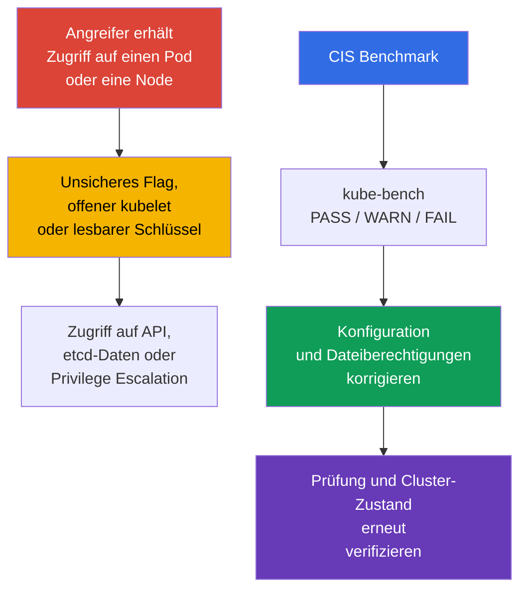
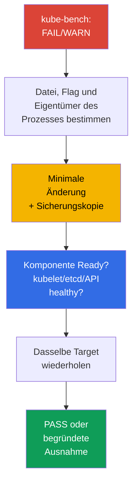

[Русская версия](ru.md) · [Eng version](README.md) · [Versión en español](es.md) · [Version française](fr.md) · [ქართული ვერსია](ge.md) · [繁體中文版](tw.md) · [日本語版](jp.md)

# Kapitel 07. CIS Benchmark und kube-bench

> **Das Problem.** Ein Cluster wird selten über eine Schwachstelle in Kubernetes selbst kompromittiert: Typischerweise findet ein Angreifer, der bereits Zugriff auf einen Pod oder eine Node erlangt hat, in der Nähe eine unsichere Kleinigkeit - einen zusätzlich offenen Port, ein schwaches Komponenten-Flag, einen für alle lesbaren Schlüssel. Einzeln sind solche Details unauffällig, zusammen eröffnen sie jedoch einen Weg zur API ohne Prüfung, zu Secrets in etcd oder zur Privilege Escalation auf der Node - und keine davon ist im Anwendungscode sichtbar.

> **Wie es weitergeht.** Netzwerkrichtlinien beschränken den Weg eines Angreifers zwischen Workloads. Jetzt prüfen wir, wie sicher die Control Plane und die Nodes selbst konfiguriert sind. Der **CIS Kubernetes Benchmark** übersetzt Hardening-Empfehlungen in überprüfbare Punkte, und `kube-bench` gleicht sie automatisch mit der Cluster-Konfiguration ab. Dies ist Teil der Domain **Cluster Setup** (CKS, 15 %): Sie müssen nicht nur eine unsichere Einstellung finden, sondern sie auch korrigieren, ohne die Funktionsfähigkeit des Clusters zu verlieren.

> **Was Sie aus CKA benötigen.** Dieses Kapitel wiederholt nicht den Aufbau von `kubeadm`, static Pods und PKI. Rufen Sie sich vor der Arbeit [kubeadm und Control-Plane-Dateien](../../../cka/course/35/de.md) sowie [Kubernetes-Zertifikate](../../../cka/course/39/de.md) in Erinnerung.

## 07.1. CIS Kubernetes Benchmark: Was genau wird geprüft?

Der **CIS Kubernetes Benchmark** ist eine Sammlung von Empfehlungen des Center for Internet Security für die Konfiguration von Kubernetes. Er ersetzt weder Threat Modeling, Updates noch Policies, sondern bietet eine minimale reproduzierbare Checkliste: Welche Flags, Dateiberechtigungen und Komponenten-Einstellungen reduzieren die bekannte Angriffsfläche?



> 🧠 `kube-bench` gleicht verfügbare Dateien, Argumente und das CIS profile ab; `FAIL`/`WARN` erfordern eine Bewertung des aktiven Zustands und des Risikos.

Die Checks sind nach Rollen und Komponenten gruppiert. Namen der Profile und Nummern der Empfehlungen ändern sich zwischen Benchmark-Versionen; orientieren Sie sich deshalb an dem Profil, das `kube-bench` für die installierte Kubernetes-Version auswählt. Kubernetes-Versionen und Versionen des CIS Kubernetes Benchmark sind nicht eins zu eins verbunden: Eine Benchmark-Version kann mehrere Kubernetes-Versionen abdecken und umgekehrt. `kube-bench` kann einen Benchmark nur dann automatisch auswählen, wenn die installierte Kubernetes-Version in seinem veröffentlichten version mapping enthalten ist.

> 🔬 Das Version/profile mapping bestimmt die Aussagekraft des Berichts; verwenden Sie das von unterstütztem `kube-bench` ausgewählte profile und beheben Sie den konkreten check.

> **Stand der Aktualität am 2026-09-08.** In `docs/platforms.md` des Branches `main` veröffentlicht kube-bench eine Tabelle: CIS `1.12` für Kubernetes `1.32-1.33` und CIS `2.0` für Kubernetes `1.34-1.35`.
>
> Die veröffentlichte Support-Tabelle ist jedoch vom Inhalt eines konkreten kube-bench-Releases zu unterscheiden. Beispielsweise enthält das unten fixierte `v0.16.0` noch kein `cfg/cis-2.0`: Sein gebündeltes `cfg/config.yaml` ordnet Kubernetes `1.34` `cis-1.12` zu, und ein Mapping für `1.35` fehlt.
>
> Prüfen Sie daher vor dem Ausführen nicht nur `docs/platforms.md`, sondern auch `cfg/config.yaml` selbst und das Vorhandensein des benötigten Verzeichnisses `cfg/<benchmark>` genau im verwendeten Tag/Image. Betrachten Sie ein Profil nicht allein deshalb als von einem konkreten Release unterstützt, weil es bereits in der Dokumentation des Branches `main` steht. Fehlt die Cluster-Version im Mapping des fixierten Releases, betrachten Sie ein erzwungenes `--benchmark` nicht als autoritative CIS-Bewertung: `--benchmark` ändert nur den Satz der angewendeten Tests, macht ihn aber nicht für eine nicht abgedeckte Version gültig.
>
> Besteht das Ziel des Labs darin, für eine Kubernetes-Version, die `kube-bench:v0.16.0` mit seinem gebündelten Mapping tatsächlich abdeckt, eine deterministische Bewertung zu erhalten, verwenden Sie Kubernetes `1.33` + `cis-1.12`.
>
> Das zu diesem Kapitel gehörende Lab103 verwendet absichtlich die Trainingsbaseline Kubernetes `1.36.0`, die `v0.16.0` nicht abdeckt. Dort wird `cis-1.12` nur als `forced-approximate`-Lernszenario erzwungen ausgeführt: Das Ergebnis ist für die Remediation-Praxis nützlich, stellt aber keine authoritative CIS compliance für Kubernetes `1.36` dar.

| CIS-Abschnitt | Was wird geprüft? | Typische Objekte |
|---|---|---|
| Control plane / master | Flags von `kube-apiserver`, `kube-controller-manager`, `kube-scheduler` | static-Pod-Manifeste in `/etc/kubernetes/manifests/` |
| etcd | TLS, Zugriff auf Daten, Berechtigungen des data directory und der Schlüssel | `/etc/kubernetes/pki/etcd/`, `/var/lib/etcd` |
| Worker node | kubelet API, authentication/authorization, Schutz der sysctl | kubelet config und systemd-Argumente |
| Policies | RBAC, ServiceAccount, NetworkPolicy, Pod Security | API-Objekte und admission-Einstellungen |

`PASS` bedeutet, dass das Werkzeug die Übereinstimmung mit seiner Regel erkannt hat. `FAIL` bedeutet eine Verletzung, und `WARN` bedeutet in der Regel, dass der Check den Zustand nicht eindeutig bestimmen konnte oder eine manuelle Entscheidung erfordert. Korrigieren Sie nicht alle `WARN` mechanisch: Einige Punkte sind für eine managed Control Plane, ein alternatives CNI oder eine bestimmte Architektur nicht anwendbar.

## 07.2. kube-bench ausführen und den Bericht lesen

Wenden Sie die folgenden Befehle erst an, nachdem Sie bestätigt haben, dass die installierte `kube-bench`-Version ein unterstütztes benchmark mapping für Ihren Cluster enthält: Im Stand vom 2026-09-08 fehlt Kubernetes `1.36` im generic mapping (siehe §07.1).

Führen Sie `kube-bench` auf der Node aus, deren Dateien es lesen soll. Auf einer Control-Plane-Node werden in der Regel die Abschnitte `master` und `etcd` benötigt, auf einer Worker-Node `node`. In einem Trainingscluster oder bei SSH-Zugriff auf die Node ist die transparenteste Variante der lokale Aufruf:

> 🎯 Führen Sie den Scanner beim Eigentümer der Dateien aus, korrigieren Sie mit einem Backup die einzige aktive Quelle, warten Sie auf den Neustart, prüfen Sie effective state und health und wiederholen Sie anschließend den Check.

```bash
# Auf der Control-Plane-Node; verfügbare targets hängen von der kube-bench-Version ab.
sudo kube-bench run --targets master,etcd | tee kube-bench-control-plane.txt

# Auf der Worker-Node.
sudo kube-bench run --targets node | tee kube-bench-worker.txt

# Nicht bestandene Punkte und ihre Kennungen schnell finden.
grep -E '\[FAIL\]|\[WARN\]' kube-bench-control-plane.txt

# Nach der Korrektur die check ID aus dem Bericht wiederholen, nicht das gesamte target.
# Bestätigen Sie die Syntax mit `kube-bench run --help` Ihrer Version.
sudo kube-bench run --targets master --check 1.2.1
```

Ist das Binary `kube-bench` nicht direkt auf der Node installiert, kann es alternativ in einem Pod/Job mit `hostPID` sowie den erforderlichen `hostPath`-Mounts für Konfiguration und Komponentendaten ausgeführt werden; fertige Beispiele gibt es im Upstream-Repository von `kube-bench`. Ein solcher Aufruf prüft nur die Nodes, auf die der Pod geplant werden kann und deren Host-Namespaces/-Dateien ihm zugänglich sind. In managed Kubernetes erlaubt das in der Regel die Prüfung zugänglicher Worker-Nodes, jedoch nicht der provider-owned Control Plane von GKE/EKS/AKS/ACK: Der Zugriff auf die Kubernetes API allein macht Control-Plane-Checks nicht zugänglich.

In diesem Kapitel wird ein mit `kubeadm` eingerichteter Cluster mit direktem Zugriff auf die Nodes vorausgesetzt; deshalb wird im Folgenden genau der lokale Aufruf verwendet.

Lesen Sie das Ergebnis in dieser Reihenfolge: Halten Sie die Nummer der Empfehlung, den Pfad oder das Flag, den tatsächlichen Wert, den Eigentümer/Dateimodus und die Prüfmethode nach der Korrektur fest. Das ist wichtiger, als lediglich die Zahl der `PASS` zu erhöhen.

| Status | Aktion |
|---|---|
| `PASS` | als anfängliche Übereinstimmung festhalten; bei folgenden Änderungen nicht abschwächen |
| `FAIL` | ermitteln, welche Komponente und welche Konfigurationsquelle der Cluster verwendet, dann korrigieren und prüfen |
| `WARN` | Text der Empfehlung lesen; manuell bestätigen, die Ausnahme dokumentieren oder korrigieren |

Genau dieser Zyklus - `kube-bench` ausführen, im eigenen Bericht ein konkretes `FAIL`/`WARN` finden, korrigieren und erneut prüfen - ist der Arbeitsablauf des gesamten Kapitels. Die Funde jedes Clusters sind unterschiedlich: Sie hängen von Bereitstellungsmethode, kubeadm-Distribution, Komponentenversionen und bereits angewendetem Hardening ab. Deshalb behandelt das Kapitel im Folgenden nicht die Nummern der CIS-Empfehlungen der Reihe nach, sondern je einen Abschnitt pro Control-Plane-Komponente und Node (`kube-apiserver`, `kube-controller-manager` und `kube-scheduler`, `kubelet`, `etcd`) - als häufigste Kategorien von Befunden in realen `kube-bench`-Berichten und wie sie sicher zu korrigieren sind, nicht als vollständige Liste aller möglichen Benchmark-Punkte.

## 07.3. Beispiel: Ein FAIL bei kube-apiserver finden und beheben

`kube-apiserver` wird in einem kubeadm-Cluster als static Pod ausgeführt: kubelet überwacht das Manifest `/etc/kubernetes/manifests/kube-apiserver.yaml` auf dem Datenträger der Control-Plane-Node und erstellt den Pod bei einer Änderung automatisch neu. Bearbeiten Sie deshalb genau diese Datei und nicht das Pod-Objekt über `kubectl`.

Die Anleitung zur Korrektur müssen Sie nicht selbst erfinden - `kube-bench` liefert sie im Bericht. Jedes `FAIL` enthält einen eigenen Punkt im Abschnitt `== Remediations ==`, zum Beispiel:

```text
[FAIL] 1.2.15 Ensure that the --profiling argument is set to false (Automated)
...
== Remediations master ==
1.2.15 Edit the API server pod specification file
/etc/kubernetes/manifests/kube-apiserver.yaml on the master node and set the
below parameter.
--profiling=false
```

Die Remediation nennt die genaue Datei und das genaue Flag. Erstellen Sie vor der Änderung eine Sicherungskopie **außerhalb** von `/etc/kubernetes/manifests/`: kubelet liest alle Dateien dieses Verzeichnisses, deren Name nicht mit einem Punkt beginnt, unabhängig von der Erweiterung, und kann versuchen, aus einer versehentlich daneben abgelegten Kopie einen static Pod zu erstellen - bei übereinstimmendem Pod-Namen ist das Verhalten nicht definiert, und die veraltete Spezifikation aus dem Backup kann still die aktuelle Manifest-Datei überstimmen.

```bash
sudo install -d -m 0700 /etc/kubernetes/backup
sudo cp -a /etc/kubernetes/manifests/kube-apiserver.yaml \
  "/etc/kubernetes/backup/kube-apiserver.yaml.$(date +%Y%m%d%H%M%S)"
```

Fügen Sie das Flag aus der Remediation dem Array `command` des static Pod hinzu, speichern Sie die Datei und warten Sie, bis kubelet den Pod neu erstellt hat:

```bash
# kubelet sollte den static Pod automatisch neu erstellen.
watch -n 2 'sudo crictl ps --name kube-apiserver'

# Nach der Wiederherstellung der API.
kubectl get --raw='/readyz?verbose'
kubectl -n kube-system get pods -l component=kube-apiserver -o wide

# Genau diesen check erneut prüfen, nicht das gesamte target.
sudo kube-bench run --targets master --check 1.2.15
```

## 07.4. Beispiel: Ein FAIL bei kube-scheduler finden und beheben

Den Check zum Deaktivieren von profiling gibt es bei allen drei zentralen Control-Plane-Komponenten, seine ID hängt jedoch vom Benchmark-Abschnitt ab. In `kube-bench v0.16.0 / cis-1.12` ist das:

- `1.2.15` - `kube-apiserver`;
- `1.3.2` - `kube-controller-manager`;
- `1.4.1` - `kube-scheduler`.

Alle drei gehören zum target `master`, nicht zu `node`. Für scheduler beispielsweise:

```text
[FAIL] 1.4.1 Ensure that the --profiling argument is set to false (Automated)
...
== Remediations master ==
1.4.1 Edit the Scheduler pod specification file
/etc/kubernetes/manifests/kube-scheduler.yaml on the master node and set the
below parameter.
--profiling=false
```

Es gilt derselbe Prozess wie in 07.3: Das Manifest `/etc/kubernetes/manifests/kube-scheduler.yaml` bearbeiten, auf die Neuerstellung des static Pod warten und `sudo kube-bench run --targets master --check 1.4.1` erneut prüfen.

Prüfen Sie jedoch zunächst, ob `kube-scheduler` mit `--config=<path>` läuft. Ist `--config` gesetzt, ist das CLI-Flag `--profiling` deprecated und wird zur Laufzeit ignoriert; die effective Einstellung befindet sich in `KubeSchedulerConfiguration`:

```yaml
apiVersion: kubescheduler.config.k8s.io/v1
kind: KubeSchedulerConfiguration
enableProfiling: false
```

`kube-bench v0.16.0 / cis-1.12` hat eine Einschränkung: Check `1.4.1` analysiert die process command line und liest `KubeSchedulerConfiguration` nicht. Bei einem scheduler mit `--config` kann das Ergebnis von `1.4.1` deshalb nicht als eigenständiger Nachweis des effective profiling state gelten: Eine korrekte Config kann zu `FAIL` führen und ein ignoriertes `--profiling=false` zu einem formalen `PASS`. Prüfen Sie in diesem Fall die aktive Datei `--config` separat, vergewissern Sie sich, dass `enableProfiling: false` gesetzt ist, prüfen Sie die Gesundheit des scheduler und dokumentieren Sie die Abweichung von `kube-bench` als Einschränkung der verwendeten Benchmark-/Tool-Version. Fügen Sie das ignorierte CLI-Flag nicht nur hinzu, um ein `PASS` zu erhalten.

Bei `kube-controller-manager` bleibt `--profiling` ein reguläres CLI-Flag, daher wird sein Befund (`1.3.2`) genau wie in 07.3 korrigiert, ohne diesen Vorbehalt.

Genau derselbe Zyklus - `kube-bench` ausführen, ein `FAIL` finden, das Manifest bearbeiten, prüfen - wird auch auf Worker-Nodes ausgeführt, nur mit den targets und dem Satz von `node`-Flags (`kubelet` statt Control-Plane-Komponenten). Abschnitt 07.5 behandelt genau diesen Befund.

**Bei der Prüfung ist Geschwindigkeit wichtiger als Vollständigkeit.** Eine typische CKS-Aufgabe lautet: „Im kube-bench-Bericht für kube-apiserver/kubelet gibt es ein FAIL mit einer bestimmten ID - beheben Sie es“, und bewertet wird genau die Tatsache der Korrektur, nicht ein Gesamtüberblick über alle Befunde. Schneller Algorithmus: `== Remediations ==` für die konkrete ID öffnen → feststellen, ob es ein static Pod oder ein systemd-Service (kubelet) ist → die benötigte Datei bearbeiten → auf den Neustart warten → mit demselben `--check <ID>` erneut prüfen, nicht das gesamte target.

**Wenn die Komponente nach der Änderung nicht startet.** Ein Fehler in einem Argument oder im YAML-Manifest des static Pod verhindert nicht die Bearbeitung - er verhindert den Start des neuen Pod. Typische Ursachen: Tippfehler im Flag-Namen, ein widersprüchliches doppeltes Argument, ein nicht vorhandener Pfad zu einer Datei, auf die das Flag verweist. Reihenfolge der Wiederherstellung:

1. Prüfen, was tatsächlich geschieht: `sudo crictl ps -a --name <component>` und `sudo journalctl -u kubelet -n 100 --no-pager` - kubelet protokolliert den Grund, warum es den static Pod aus dem neuen Manifest nicht starten kann.
2. Wird die Ursache nicht schnell gefunden, die Änderung mit der Sicherungskopie des Manifests zurückrollen - das ist schneller, als unter Prüfungsdruck komplexes YAML zu analysieren.
3. Nach der Wiederherstellung die Änderung präziser wiederholen und erneut auf `Ready` warten, bevor Sie zum nächsten Befund übergehen.

## 07.5. kubelet: abgesicherte API und Schutz von Kernel-Parametern

Kubelet läuft auf jeder Node und ist berechtigt, Pods auszuführen. Eine offene read-only API, anonymer Zugriff oder schwache authorization ermöglichen das Abrufen von Node-Daten und in einigen Fällen eine weitergehende Kompromittierung. `protectKernelDefaults: true` veranlasst kubelet, die Initialisierung mit einem Fehler abzubrechen, wenn kernel flags, die kubelet für seine Arbeit erwartet, andere Werte haben. Bei `protectKernelDefaults: false` versucht kubelet, diese Parameter selbst auf die erwarteten Werte zu setzen.

Auf einer kubeadm-Node ist die Hauptdatei normalerweise `/var/lib/kubelet/config.yaml`; zusätzliche Argumente werden in `/var/lib/kubelet/kubeadm-flags.env` und einem systemd drop-in angegeben. Prüfen Sie in Kubernetes 1.36 außerdem `--config-dir`: kubelet wendet die Hauptkonfiguration an und danach nur die Dateien `*.conf` aus diesem Verzeichnis (einschließlich Unterverzeichnissen) in lexikographischer Reihenfolge; `*.yaml` werden dort nicht geladen. CLI-Flags haben eine höhere Priorität. Vergewissern Sie sich über die tatsächliche Konfigurationsquelle, statt einen Pfad anzunehmen:

```bash
sudo systemctl cat kubelet
sudo ps -ef | grep '[k]ubelet'

# Bestimmen Sie aus dem tatsächlichen ExecStart/process die Werte von --config und --config-dir.
# Verwenden Sie keine kubeadm-Pfade, wenn der Prozess andere verwendet.
KUBELET_CONFIG='<effektiver Wert von --config>'
KUBELET_CONFIG_DIR='<effektiver Wert von --config-dir oder leere Zeichenkette>'

if [[ -n "$KUBELET_CONFIG" ]]; then
  sudo grep -nE \
    'readOnlyPort|anonymous:|authorization:|protectKernelDefaults' \
    "$KUBELET_CONFIG"
else
  echo 'kubelet läuft ohne --config: berücksichtigen Sie Built-in Defaults, Drop-ins und CLI-Flags'
fi

if [[ -n "$KUBELET_CONFIG_DIR" ]]; then
  sudo find "$KUBELET_CONFIG_DIR" -type f -name '*.conf' -print
fi
```

Fehlt `--config`, weisen Sie ihm keinen Standardpfad zu: kubelet verwendet built-in defaults, danach `--config-dir` (falls gesetzt), anschließend können CLI flags die endgültigen Werte überschreiben. Zum Nachweis des effective state gleichen Sie am Ende dennoch `/configz` ab.

Legen Sie für die configuration API von kubelet die äquivalenten Felder fest:

```yaml
# /var/lib/kubelet/config.yaml
readOnlyPort: 0
authentication:
  anonymous:
    enabled: false
authorization:
  mode: Webhook
protectKernelDefaults: true
```

Wird der Parameter in Ihrer Installation als Flag übergeben, fügen Sie ihn der tatsächlich eingebundenen systemd environment/drop-in-Konfiguration hinzu, ohne den Wert zwischen Quellen zu duplizieren. Im Folgenden stehen keine Shell-Befehle, sondern die erforderlichen Fragmente von kubelet-Argumenten:

```text
--read-only-port=0
--anonymous-auth=false
--authorization-mode=Webhook
--protect-kernel-defaults=true
```

Prüfen Sie vor dem Neustart sysctl. Für Kubernetes 1.36 betragen die erwarteten kubelet-Werte jeweils `1`, `0`, `10`, `1`, `1000000` und `25000000`. Ändern Sie sie nicht blind: Stellen Sie zunächst fest, welche sysctl source die Node verwaltet, bringen Sie sie dann auf eine abgestimmte Baseline und starten Sie erst danach kubelet neu.

```bash
# Kubernetes 1.36: Parameter, die kubelet in setupKernelTunables() prüft.
sudo sysctl \
  vm.overcommit_memory \
  vm.panic_on_oom \
  kernel.panic \
  kernel.panic_on_oops \
  kernel.keys.root_maxkeys \
  kernel.keys.root_maxbytes

# Nach dem Prüfen/Anpassen der Parameter an die Baseline Ihres Betriebssystems und Kubernetes:
sudo systemctl restart kubelet
sudo systemctl --no-pager --full status kubelet
sudo journalctl -u kubelet -n 100 --no-pager
```

Prüfen Sie, dass der read-only port tatsächlich nicht lauscht und die geschützte API nur mit korrekten credentials und authorization antwortet. Prüfen Sie am Ende nicht nur Dateien: `/configz` zeigt die endgültige Konfiguration nach base config, `*.conf` drop-ins und CLI overrides. Dafür muss die Anfrage für die kubelet API autorisiert sein (beispielsweise durch einen administrativen kubeconfig über den API-server proxy):

```bash
listeners=$(sudo ss -lntp) || {
  echo 'ERROR: cannot inspect TCP listeners' >&2
  exit 1
}

if grep -q ':10255' <<<"$listeners"; then
  echo 'ERROR: read-only kubelet port is listening' >&2
  exit 1
else
  echo 'OK: read-only kubelet port is closed'
fi

# Die geschützte kubelet API anzeigen, wenn sie lauscht.
grep ':10250' <<<"$listeners"
kubectl get nodes

NODE="${NODE:?set target node name from kubectl get nodes}"
kubectl get --raw "/api/v1/nodes/${NODE}/proxy/configz" \
  | jq '.kubeletconfig | {readOnlyPort, authentication, authorization, protectKernelDefaults}'
```

Für einen externen Benutzer muss der Zugriff auf `10250` weiterhin durch Firewall und Netzwerktopologie beschränkt sein. `authorization-mode=Webhook` macht den Port nicht selbst sicher - es veranlasst kubelet, die Kubernetes API nach den Rechten des authentifizierten Subjekts zu fragen.


## 07.6. Beispiel: FAIL bei etcd finden und beheben

etcd speichert den persistenten Zustand der Kubernetes API: Secrets, RBAC, Konfiguration und
Workload-Spezifikationen. Das Lesen des Data Directory oder eines TLS Private Key kommt einer
schwerwiegenden Kompromittierung des Clusters gleich; CIS prüft deshalb Eigentümer und Rechte
der etcd-Dateien separat.

```text
[FAIL] 1.1.12 Ensure that the etcd data directory ownership is set to etcd:etcd (Automated)
...
== Remediations master ==
1.1.12 On the etcd server node, get the etcd data directory, passed as an argument
--data-dir, from the below command:
ps -ef | grep etcd
Run the below command (based on the etcd data directory found above).
For example, chown etcd:etcd /var/lib/etcd
```

Die Remediation sagt ausdrücklich: Bestimmen Sie zuerst das tatsächliche Data Directory über
`ps` und setzen Sie dann dessen Ownership auf `etcd:etcd`. Der Befehl `ps` dient hier gerade
dazu, das echte `--data-dir` zu finden, nicht dazu, aus ihm den erwarteten Eigentümer
abzuleiten - der Check `1.1.12` erfordert das Literal `etcd:etcd` unabhängig davon, unter
welchem Benutzer der Prozess tatsächlich läuft.

Diese Anforderung muss von der Runtime Identity der konkreten Installation getrennt werden.
In einer gewöhnlichen kubeadm Control Plane laufen Static Pods standardmäßig als `root`;
mit `RootlessControlPlane` verwendet kubeadm eine eigene Non-root Identity (für etcd:
`kubeadm-etcd`). Prüfen Sie daher vor dem Ändern des Ownership das tatsächliche Data
Directory, die Anwendbarkeit des gewählten CIS Profile auf Ihre Installation und das
Vorhandensein des benötigten Account-/Group-Mapping `etcd`/`etcd` auf dem Host - ersetzen
Sie die Literal-Anforderung des Benchmark nicht durch den Benutzer des Prozesses.

Wenn die Umgebung genau diesen Check erfüllen soll und das Mapping `etcd:etcd` für den Host
gültig ist, wenden Sie die minimale Remediation auf das Verzeichnis selbst an und prüfen
genau sie erneut:

```bash
# Bestimmen Sie das tatsächliche --data-dir aus Prozess/Manifest.
sudo ps -ef | grep '[e]tcd'
DATA_DIR=/var/lib/etcd   # durch den tatsächlich gefundenen Wert ersetzen

sudo stat -c '%A %a %U:%G %n' "$DATA_DIR"
getent passwd etcd
getent group etcd

# Nur wenn der gewählte Benchmark anwendbar ist und das Mapping etcd:etcd für den Host gültig ist.
sudo chown etcd:etcd "$DATA_DIR"

# Genau diesen Check erneut prüfen (Target master, nicht etcd).
sudo kube-bench run --targets master --check 1.1.12
```

Die Zugriffsrechte sind ein separater Check `1.1.11` („permissions 700 oder restriktiver“);
wird auch dieser korrigiert, wenden und prüfen Sie ihn getrennt:

```bash
sudo chmod 700 "$DATA_DIR"
sudo kube-bench run --targets master --check 1.1.11
```

Dasselbe Prinzip „die Remediation gibt den Befehl vor, wird aber erst nach Prüfung des
tatsächlichen Data Directory und der Profil-Anwendbarkeit ausgeführt“ gilt auch für
benachbarte CIS-Befunde zu etcd - Rechte und Eigentümer der Pod-spec-Datei
(`/etc/kubernetes/manifests/etcd.yaml`) und TLS-Keys
(`/etc/kubernetes/pki/etcd/*.key`). Öffnen Sie `2379`/`2380` nicht nach außen und
übertragen Sie das Beispiel nicht unverändert auf einen Managed Cluster, in dem Ihnen Data
Directory und etcd-Prozess nicht gehören.


## 07.7. Wiederholungslauf, Diagnose und Nachweis der Behebung

Gehen Sie für jeden `FAIL` oder bewusst akzeptierten `WARN` nach einem kurzen Verfahren vor:
(1) halten Sie die Kubernetes-Version, Version oder Digest von `kube-bench`, das gewählte
Profil und die CIS Check ID aus dem Bericht fest; (2) erstellen Sie eine Sicherung der
aktiven Datei oder des Objekts - für filesystem-hosted Static Pods muss die Sicherung
**außerhalb von `staticPodPath`** liegen: kubelet filtert Dateien in diesem Verzeichnis nicht
nach Erweiterung und kann eine `.backup` als weiteres Manifest verarbeiten; (3) ändern Sie
genau einen Control; (4) warten Sie auf den Neustart und prüfen Sie die Gesundheit der
Komponente und des Clusters; (5) wiederholen Sie nur das betroffene Target oder den Check
(etwa `kube-bench run --targets master --check <ID>` für eine Version, die diese Syntax
unterstützt); (6) stellen Sie bei einem Health-Fehler sofort die Sicherung zurück, warten
Sie auf die Wiederherstellung und wiederholen Sie den Health Check. Erklären Sie eine
Behebung nicht für erfolgreich, bevor Component Health, Effective Configuration und der
Targeted Rerun geprüft sind. Prüft ein bestimmter `kube-bench`-Check nicht die
Konfigurationsquelle, die die Komponente tatsächlich verwendet (wie beim Scheduler-Beispiel
mit `--config` aus 07.4), dokumentieren Sie dies als Einschränkung des Werkzeugs und
ersetzen Sie die Effective-state-Verifikation nicht durch ein formales `PASS`.

In einem Self-managed Cluster gilt dieses Verfahren für Control Plane, Nodes und deren
Dateien, für die der Operator verantwortlich ist. In Managed Kubernetes gehört die Control
Plane gewöhnlich dem Provider: Versuchen Sie nicht, dies über hostPath oder direkte
Änderungen zu umgehen, sondern gleichen Sie provider-owned Controls mit der Dokumentation
ab und halten Sie die customer-/provider-owned Verantwortung fest.



Der minimale Satz an Prüfungen nach dem Hardening der Control Plane:

```bash
# API server und grundlegende Objekte sind erreichbar.
kubectl get --raw='/readyz?verbose'
kubectl get nodes
kubectl get --all-namespaces pods

# Static Pod und etcd laufen tatsächlich.
kubectl -n kube-system get pods -o wide
sudo crictl ps | grep -E 'kube-apiserver|kube-controller-manager|kube-scheduler|etcd'

# Aktive Werte im tatsächlichen Prozess suchen, nicht nur in einer Sicherungskopie der Datei.
sudo crictl ps --name kube-apiserver
sudo ps -ef | grep -E '[k]ube-apiserver|[k]ube-controller-manager|[k]ube-scheduler|[k]ubelet'

# Erneute Bewertung und Artefakt für das Review speichern.
sudo kube-bench run --targets master,etcd | tee kube-bench-after.txt
grep -E '\[FAIL\]|\[WARN\]' kube-bench-after.txt
```

Typische Fehler und Diagnose:

| Symptom | Wahrscheinliche Ursache | Was prüfen |
|---|---|---|
| API ist nach der Änderung nicht erreichbar | YAML-Fehler oder nicht unterstütztes Flag des Static Pod | `journalctl -u kubelet`, `crictl ps -a`, Sicherungskopie des Manifests |
| kubelet startet nach `protectKernelDefaults` nicht | Das Sysctl der node entspricht nicht der erforderlichen Baseline | `journalctl -u kubelet`, Sysctl-Quelle und Betriebssystem-Policy |
| `kube-bench` zeigt weiterhin `FAIL` | Eine inaktive Datei wurde geändert oder ein widersprüchliches Flag gesetzt | `systemctl cat kubelet`, `ps`, `crictl inspect` |
| etcd startet nach Änderung der Rechte nicht | Der Prozessbenutzer hat Zugriff auf Data Directory oder Key verloren | `stat`, Prozesseigentümer, etcd-Logs |
| Prüfung in Managed Kubernetes besteht nicht | Die Control Plane gehört nicht dem Benutzer und ein Teil der Empfehlungen ist nicht anwendbar | Provider-Dokumentation, customer- und provider-owned Controls trennen |

> 🏭 Versioned CIS Baseline, regelmäßige Drift-Prüfung, Eigentümer von Ausnahmen und Evidence nach dem Rollout.


## 07.8. Wie dies in Production eingesetzt wird

- **Hardening als Baseline.** Die Konfiguration von Control Plane, kubelet und PKI-Rechten
  wird in kubeadm-Konfiguration, Node-Image oder Automation beschrieben, statt nach jeder
  Bereitstellung manuell korrigiert zu werden.
- **Regelmäßige Drift-Kontrolle.** `kube-bench` wird nach einem Kubernetes-Upgrade und
  regelmäßig in CI/CD oder einer separaten Security-Aufgabe ausgeführt. Das Ergebnis wird
  als Artefakt mit Version von Benchmark und Kubernetes gespeichert.
- **Ausnahmen werden dokumentiert.** Eine Managed Control Plane, ein anderes CNI oder eine
  Architekturentscheidung kann eine Regel unanwendbar machen. Für jede Ausnahme werden
  Risikoeigentümer, Grund und kompensierender Control festgehalten.
- **Änderungen in kleinen Chargen.** Static Pods werden einzeln geändert; prüfen Sie
  `/readyz` und den Neustart. In einer HA Control Plane beachten Sie die Rolling-Reihenfolge
  und den Rollback-Plan.
- **Rechte werden zweckgebunden erteilt.** Private Key, kubeconfig, Manifeste und Data
  Directory sind nur für den Service-Benutzer und Administratoren zugänglich, die sie
  tatsächlich benötigen. Die Rechte werden regelmäßig mit Configuration-Management-Mitteln
  geprüft.

## 07.9. Mini-Glossar

- **CIS Kubernetes Benchmark** - CIS-Empfehlungen zur sicheren Kubernetes-Konfiguration.
- **kube-bench** - Werkzeug, das die Konfiguration anhand von CIS-Benchmark-Profilen prüft.
- **static Pod** - ein Pod, der durch ein lokales Manifest einer node beschrieben und von
  kubelet ohne Steuerung über die API gestartet wird.
- **profiling** - Endpoints zur Leistungsdiagnose eines Prozesses; sie werden über die aktive
  Konfigurationsquelle der Komponente deaktiviert. Für `kube-scheduler` mit `--config` ist
  dies `enableProfiling: false` in `KubeSchedulerConfiguration`, nicht das CLI-Flag
  `--profiling`.
- **read-only port** - nicht authentisierter kubelet-Port; er muss durch
  `--read-only-port=0` deaktiviert werden.
- **protectKernelDefaults** - kubelet-Einstellung, die den Start bei einer nicht
  übereinstimmenden Sysctl-Baseline verweigert.
- **etcd data directory** - Verzeichnis mit etcd-Daten, üblicherweise `/var/lib/etcd`.
- **private key** - geheimer Teil einer TLS-Identity; er benötigt einen eingeschränkten
  Zugriffsmodus, gewöhnlich `0600`.

## 07.10. Zusammenfassung des Kapitels

- CIS Benchmark setzt eine prüfbare Hardening-Baseline für Control Plane, etcd, Worker und
  Policies; `kube-bench` zeigt konkrete `PASS`, `WARN` und `FAIL`.
- Bestimmen Sie zuerst die aktive Konfigurationsquelle und den Prozesseigentümer, danach
  ändern Sie Einstellungen. Ein Bericht ohne erneute Prüfung beweist keine Behebung.
- Auf `kube-apiserver` ist anonymer Zugriff unter Berücksichtigung von Health Probes und
  kubeadm Discovery zu minimieren, sichere Authorization und Audit zu nutzen sowie
  `--profiling=false` einzusetzen. Wenden Sie `--anonymous-auth=false` nicht mechanisch an,
  ohne den Cluster-Lifecycle zu prüfen.
- Profiling muss bei `kube-apiserver`, `kube-controller-manager` und `kube-scheduler`
  deaktiviert sein, doch die aktive Konfigurationsmethode hängt von der Komponente ab: Bei
  `kube-scheduler` mit `--config` prüfen Sie `enableProfiling: false` in
  `KubeSchedulerConfiguration` und nicht das CLI-Flag `--profiling`.
- Für kubelet werden `--read-only-port=0`, `--anonymous-auth=false`,
  `--authorization-mode=Webhook` und `--protect-kernel-defaults=true` oder ihre
  Entsprechungen in `config.yaml` benötigt.
- etcd Data Directory, PKI Private Keys, kubeconfig und Static-Pod-Manifeste benötigen
  minimale Rechte. Für einen CIS Check bestimmen Sie zuerst das tatsächliche Data Directory
  und wenden dann genau die vom Benchmark verlangten Ownership/Permissions unter
  Berücksichtigung der Profil-Anwendbarkeit und des Runtime-Modells der konkreten
  Installation an.

## 07.11. Wie dies in Prüfung und realer Arbeit hilft

**In der Prüfung.** Die Aufgabe nennt gewöhnlich einen oder mehrere `FAIL` aus `kube-bench`
und gibt Zugang zur node. Finden Sie schnell, ob die Komponente ein Static Pod, ein
kubelet-Service oder etcd ist, erstellen Sie eine Sicherung, korrigieren Sie die aktive
Datei, warten Sie auf den Neustart und weisen Sie das Ergebnis nach. Merken Sie sich
insbesondere die häufigen Punkte: Profiling bei drei Komponenten,
`protect-kernel-defaults` des kubelet, geschlossener Read-only-Port, anonymer Zugriff und
Dateimodi.

**In der realen Arbeit.** CIS ist eine nützliche gemeinsame Sprache zwischen Platform- und
Security-Teams, aber kein Ersatz für Architektur-Analyse. Es hilft, Konfigurationsdrift vor
einem Incident zu erkennen, und reproduzierbare Prüfungen sowie dokumentierte Ausnahmen
machen Cluster-Upgrades vorhersehbar.

## 07.12. Fragen zur Selbstkontrolle

<details>
<summary>1. Worin unterscheidet sich `WARN` im `kube-bench`-Bericht von `FAIL`, und warum können sie nicht gleich behoben werden?</summary>

`FAIL` bedeutet, dass das Werkzeug einen Verstoß gegen seine Regel erkannt hat, während
`WARN` gewöhnlich sagt, dass sich der Zustand nicht eindeutig bestimmen lässt oder eine
manuelle Entscheidung nötig ist. Lesen Sie bei `WARN` den Remediation-Text, bestätigen Sie
die Anwendbarkeit auf Managed Control Plane, CNI oder Architektur und dokumentieren Sie dann
die Ausnahme oder beheben sie, statt alle Punkte mechanisch zu ändern.
</details>

<details>
<summary>2. Warum genügt es zur Korrektur eines Static Pod nicht, nur die Datei zu ändern und den neuen Container nicht zu prüfen?</summary>

Kubelet muss die Manifest-Änderung bemerken und den Static Pod neu erstellen, doch ein
YAML-Fehler oder ein nicht unterstütztes Flag kann die Control Plane unerreichbar lassen.
Prüfen Sie nach der Änderung den neuen Container mit `crictl ps`, die API-Erreichbarkeit mit
`kubectl get --raw='/readyz?verbose'` und den Targeted Rerun des betroffenen Checks.
</details>

<details>
<summary>3. Bei welchen Control-Plane-Komponenten muss Profiling deaktiviert werden, und ist die Konfigurationsart dieselbe?</summary>

Profiling muss bei `kube-apiserver`, `kube-controller-manager` und `kube-scheduler`
deaktiviert werden: Es genügt nicht, sich auf den API server zu beschränken, CIS prüft die
Profiling Endpoints aller drei Komponenten. Die Konfigurationsart ist nicht immer gleich:
`kube-apiserver` und `kube-controller-manager` nutzen das CLI-Flag `--profiling=false`, bei
`kube-scheduler` ist dieses Flag jedoch deprecated - läuft er mit `--config=<path>`, muss
Profiling über `enableProfiling: false` in `KubeSchedulerConfiguration` und nicht über die
CLI deaktiviert werden. Das Abschalten von Profiling entspricht nicht dem Abschalten von
Metriken.
</details>

<details>
<summary>4. Welche vier kubelet-Einstellungen dieses Kapitels schließen seine API und schützen die Sysctl-Baseline?</summary>

Dies sind `--read-only-port=0`, `--anonymous-auth=false`, `--authorization-mode=Webhook`
und `--protect-kernel-defaults=true` oder äquivalente Felder in `config.yaml`. Prüfen Sie
vor dem Aktivieren von `protectKernelDefaults` Sysctl: Bei einer abweichenden Baseline kann
kubelet nicht starten.
</details>

<details>
<summary>5. Warum darf der Benutzer des etcd-Prozesses nicht automatisch als verlangter Eigentümer des Data Directory in einem CIS Check gelten?</summary>

Der CIS Check definiert seine eigene erwartete Ownership (`etcd:etcd`), und `ps` wird in der
Remediation primär zum Bestimmen des tatsächlichen `--data-dir` verwendet. Die Runtime
Identity hängt von der Implementierung ab: Eine gewöhnliche kubeadm Control Plane startet
etcd standardmäßig als `root`, die rootless Variante verwendet eine eigene Identity. Prüfen
Sie daher zuerst Data Directory, Benchmark-Anwendbarkeit und UID/GID-Mapping und führen Sie
dann die präzise Remediation aus; der Prozessbenutzer ersetzt nicht die Anforderung des
Checks selbst.
</details>

<details>
<summary>6. Welche Rechte sind für einen TLS Private Key angemessen, und warum darf ein Zertifikat breiter lesbar sein?</summary>

Ein Private Key ist geheimes Material und benötigt daher den maximal eingeschränkten Zugriff;
eine typische Baseline ist der Modus `0600`. Der Eigentümer ist nicht universell: In einer
gewöhnlichen root-run kubeadm-Installation ist dies oft `root:root`, bei einer Non-root
Control Plane muss der Key der Service Identity gehören, die ihn tatsächlich benötigt - ein
mechanisches Ändern des Eigentümers zu `root:root` ohne Prüfung der Runtime Identity kann
einem solchen Prozess den Zugriff auf seinen eigenen Key entziehen.

Wird ein konkreter CIS Control geprüft, gleichen Sie dessen Literal-Anforderung getrennt ab:
Beispielsweise erwartet der Check `1.1.19` in `cis-1.12` für Kubernetes PKI `root:root`;
dies ist eine Anforderung des jeweiligen Benchmark und keine universelle Regel für jedes
Runtime-Modell.

Ein Zertifikat enthält den öffentlichen Teil einer TLS-Identity, deshalb ist Modus `0644`
oft zulässig; Ownership und tatsächliche Pfade werden dennoch mit Deployment und gewähltem
Benchmark abgeglichen.
</details>

<details>
<summary>7. Mit welchen Befehlen weisen Sie nach, dass API, etcd und kubelet nach der Behebung gesund sind?</summary>

Für API und Objekte verwenden Sie `kubectl get --raw='/readyz?verbose'`, `kubectl get nodes`
und `kubectl get --all-namespaces pods`. Static Pods und etcd prüfen Sie mit
`kubectl -n kube-system get pods -o wide` und `sudo crictl ps`, kubelet mit
`sudo systemctl status kubelet` und `journalctl -u kubelet`; danach wiederholen Sie das
benötigte Target oder den benötigten `kube-bench`-Check.
</details>

## Praxis

In [Lab 103](../../labs/103/README_DE.MD) führen Sie `kube-bench` aus, speichern den
Bericht, korrigieren Einstellungen von kubelet und `kube-apiserver`, konfigurieren TLS für
Ingress und prüfen den Hash eines Binary. Aufgrund der Änderungen an Static Pods und
Systemkonfigurationen führen Sie die Aufgaben von der Konsole der Control-Plane-Node aus und
prüfen nach jedem Schritt den Zustand des Clusters.

🌐 Zusätzliche interaktive Praxis (killer.sh/killercoda, externe Ressource): [cis-benchmarks-kube-bench-fix-controlplane](https://killercoda.com/killer-shell-cks/scenario/cis-benchmarks-kube-bench-fix-controlplane)

Zusätzlich: [CIS Kubernetes Benchmark](https://www.cisecurity.org/benchmark/kubernetes) und
[kube-bench](https://github.com/aquasecurity/kube-bench) - Primärquellen für Profile und
Erläuterungen zu Checks.

---
[Inhaltsverzeichnis](../README_DE.md) · [Kapitel 06](../06/de.md) · [Kapitel 08](../08/de.md)
