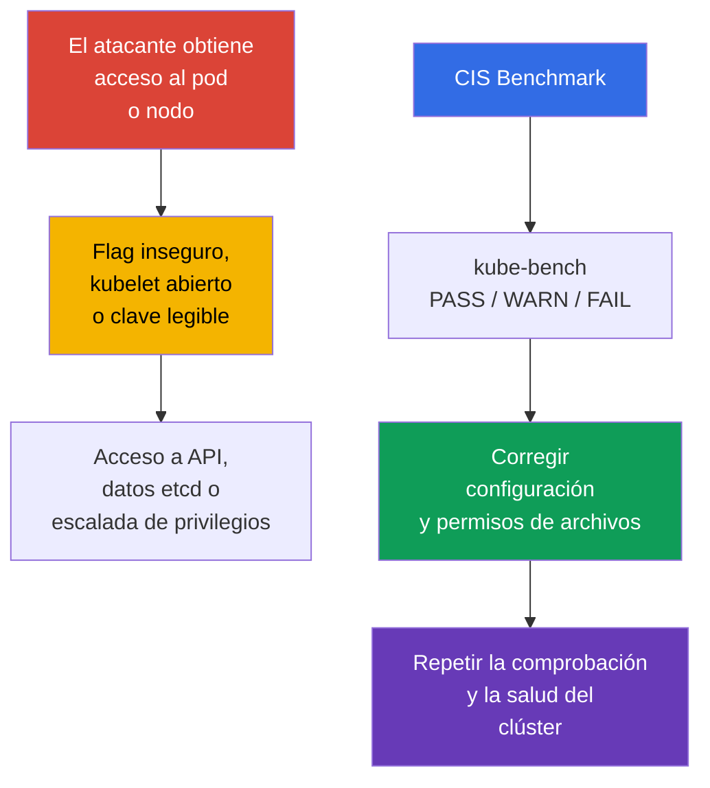
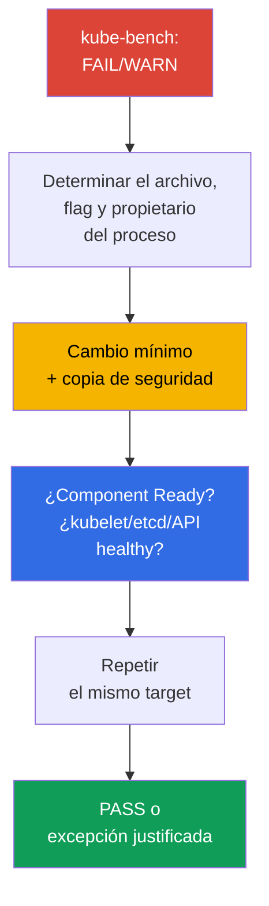

[Русская версия](ru.md) · [Eng version](README.md) · [Version française](fr.md) · [Deutsche Version](de.md) · [ქართული ვერსია](ge.md) · [繁體中文版](tw.md) · [日本語版](jp.md)

# Capítulo 07. CIS Benchmark y kube-bench

> **Problema.** El clúster rara vez se vulnera mediante una vulnerabilidad del propio Kubernetes: normalmente, un atacante que ya obtuvo acceso a un Pod o nodo encuentra cerca un detalle inseguro: un puerto abierto de más, un flag débil de un componente o una clave legible por todos. Por separado, estos detalles pasan desapercibidos, pero juntos proporcionan una vía a la API sin comprobación, a secretos en etcd o a escalada de privilegios en el nodo; ninguno es visible desde el código de la aplicación.

> **Qué sigue.** Las políticas de red restringen la vía del atacante entre workload. Ahora comprobaremos la seguridad de la configuración del propio control plane y de los nodos. **CIS Kubernetes Benchmark** convierte las recomendaciones de hardening en elementos comprobables, y `kube-bench` las correlaciona automáticamente con la configuración del clúster. Forma parte del dominio **Cluster Setup** (CKS, 15%): no basta con encontrar una configuración insegura; hay que corregirla sin perder la operatividad del clúster.

> **Qué debe saber de CKA.** Este capítulo no repite la estructura de `kubeadm`, static Pod ni PKI. Antes de trabajar, recuerde [kubeadm y los archivos de control plane](../../../cka/course/35/es.md) y los [certificados de Kubernetes](../../../cka/course/39/es.md).

## 07.1. CIS Kubernetes Benchmark: qué comprobamos exactamente

**CIS Kubernetes Benchmark** es un conjunto de recomendaciones del Center for Internet Security para la configuración de Kubernetes. No sustituye el modelo de amenazas, las actualizaciones ni policy, sino que proporciona una checklist mínima y reproducible: qué flags, permisos de archivos y configuraciones de componentes reducen la superficie de ataque conocida.



> 🧠 `kube-bench` correlaciona los archivos, argumentos y CIS profile disponibles; `FAIL`/`WARN` requieren evaluar el active state y el riesgo.

Las comprobaciones se agrupan por roles y componentes. Los nombres de los profiles y los números de recomendación cambian entre versiones del benchmark; por ello, guíese por el profile que `kube-bench` seleccionó para la versión de Kubernetes instalada. Las versiones de Kubernetes y las de CIS Benchmark no se relacionan uno a uno: una versión del benchmark puede cubrir varias versiones de Kubernetes y viceversa, y `kube-bench` puede seleccionar automáticamente un benchmark solo cuando la versión instalada de Kubernetes está presente en su version mapping publicado.

> 🔬 Version/profile mapping determina la fiabilidad del informe; use el profile que seleccionó un `kube-bench` compatible y corrija el check concreto.

> **Instantánea de vigencia al 2026-09-08.** En `docs/platforms.md` de la rama `main` de kube-bench se publica una tabla: CIS `1.12` para Kubernetes `1.32-1.33` y CIS `2.0` para Kubernetes `1.34-1.35`.
>
> Sin embargo, hay que distinguir la published support table del contenido de una release concreta de kube-bench. Por ejemplo, el `v0.16.0` fijado abajo todavía no contiene `cfg/cis-2.0`: su `cfg/config.yaml` incluido correlaciona Kubernetes `1.34` con `cis-1.12`, y no existe mapping para `1.35`.
>
> Por eso, antes de ejecutar, compruebe no solo `docs/platforms.md`, sino también el propio `cfg/config.yaml` y la existencia del directorio requerido `cfg/<benchmark>` precisamente en el tag/image utilizado. No considere que un profile está soportado por una release concreta solo porque ya figure en la documentación de la rama `main`. Si la versión del clúster no está en el mapping de la release fijada, no considere `--benchmark` forzado como una evaluación CIS autoritativa: `--benchmark` cambia solamente el conjunto de pruebas aplicadas, pero no lo hace válido para una versión no cubierta.
>
> Si el objetivo de la lab es obtener una evaluación determinista en una versión de Kubernetes que `kube-bench:v0.16.0` cubre realmente con su bundled mapping, use Kubernetes `1.33` + `cis-1.12`.
>
> La Lab103 relacionada con este capítulo usa deliberadamente el training baseline Kubernetes `1.36.0`, que `v0.16.0` no cubre. Allí, `cis-1.12` se ejecuta forzadamente solo como escenario educativo `forced-approximate`: el resultado es útil para practicar remediation, pero no es CIS compliance autoritativo para Kubernetes `1.36`.

| Sección CIS | Qué se comprueba | Objetos típicos |
|---|---|---|
| Control plane / master | flags de `kube-apiserver`, `kube-controller-manager`, `kube-scheduler` | static Pod-manifests en `/etc/kubernetes/manifests/` |
| etcd | TLS, acceso a datos, permisos de data directory y claves | `/etc/kubernetes/pki/etcd/`, `/var/lib/etcd` |
| Worker node | kubelet API, authentication/authorization, protección sysctl | kubelet config y argumentos systemd |
| Policies | RBAC, ServiceAccount, NetworkPolicy, Pod Security | objetos API y configuraciones admission |

`PASS` significa que la herramienta detectó conformidad con su regla. `FAIL` indica una infracción, y `WARN` normalmente significa que la comprobación no pudo determinar el estado sin ambigüedad o requiere una decisión manual. No corrija todos los `WARN` mecánicamente: algunos elementos no se aplican a un control plane administrado, CNI alternativo o una arquitectura concreta.

## 07.2. Ejecución de kube-bench y lectura del informe

Aplique los siguientes comandos solo después de confirmar que la versión instalada de `kube-bench` tiene un benchmark mapping compatible para su clúster: en la instantánea 2026-09-08 Kubernetes `1.36` no aparece en el generic mapping (véase §07.1).

Ejecute `kube-bench` en el nodo cuyos archivos debe leer. En el nodo control plane normalmente se necesitan las secciones `master` y `etcd`; en un worker, `node`. En un clúster de formación o con acceso SSH al nodo, la variante más transparente es la ejecución local:

> 🎯 Ejecute el scanner junto al propietario de los archivos, corrija la única fuente activa con backup, espere el restart, compruebe el effective state y health, y después repita el check.

```bash
# En el nodo control plane; los targets disponibles dependen de la versión de kube-bench.
sudo kube-bench run --targets master,etcd | tee kube-bench-control-plane.txt

# En el nodo worker.
sudo kube-bench run --targets node | tee kube-bench-worker.txt

# Encontrar rápidamente los elementos no superados y sus identificadores.
grep -E '\[FAIL\]|\[WARN\]' kube-bench-control-plane.txt

# Después de corregir, repetir el check ID del informe, no todo el target.
# Confirme la sintaxis con `kube-bench run --help` de su versión.
sudo kube-bench run --targets master --check 1.2.1
```

Si el binario `kube-bench` no está instalado directamente en el nodo, también puede ejecutarse en un Pod/Job con `hostPID` y los hostPath-mounts necesarios de configuración y datos de componentes; hay ejemplos preparados en el repositorio upstream de `kube-bench`. Esta ejecución comprueba solo los nodos donde el Pod se puede programar y cuyos host namespaces/archivos tiene disponibles. En managed Kubernetes normalmente permite comprobar los worker-nodes accesibles, pero no el control plane propiedad del provider de GKE/EKS/AKS/ACK: el mero acceso a Kubernetes API no hace accesibles los control-plane checks.

En este capítulo se considera un clúster levantado con `kubeadm` y acceso directo a los nodos, por lo que a continuación se usa precisamente la ejecución local.

Lea el resultado en este orden: registre el número de recomendación, la ruta o flag, el valor efectivo, el propietario/modo de archivo y el método de comprobación tras corregir. Esto es más importante que limitarse a aumentar el número de `PASS`.

| Estado | Acción |
|---|---|
| `PASS` | registrarlo como conformidad de partida; no debilitarlo en cambios posteriores |
| `FAIL` | determinar qué componente y qué fuente de configuración utiliza el clúster, después corregir y comprobar |
| `WARN` | leer el texto de la recomendación; confirmar manualmente, documentar la excepción o corregir |

Precisamente este ciclo - ejecutar `kube-bench`, encontrar el `FAIL`/`WARN` concreto en su informe, corregir y volver a comprobar - es el proceso de trabajo de todo el capítulo. El conjunto de hallazgos es distinto en cada clúster: depende del método de despliegue, la distribución kubeadm, las versiones de los componentes y el hardening ya aplicado. Por tanto, el capítulo no sigue números de recomendaciones CIS consecutivos; analiza una sección para cada componente del control plane y del nodo (`kube-apiserver`, `kube-controller-manager` y `kube-scheduler`, `kubelet`, `etcd`) como las categorías de hallazgos más frecuentes en informes reales de `kube-bench` y cómo corregirlas de forma segura, no como lista exhaustiva de todos los elementos posibles del benchmark.

## 07.3. Ejemplo: encontrar y corregir FAIL en kube-apiserver

En un clúster kubeadm, `kube-apiserver` se ejecuta como static Pod: kubelet vigila el manifiesto `/etc/kubernetes/manifests/kube-apiserver.yaml` en el disco del nodo control plane y vuelve a crear automáticamente el Pod cuando este cambia. Por tanto, se edita precisamente este archivo, no el objeto Pod mediante `kubectl`.

No hace falta inventar la instrucción de corrección: la proporciona el propio `kube-bench` en el informe. Cada `FAIL` viene acompañado de su elemento en la sección `== Remediations ==`, por ejemplo:

```text
[FAIL] 1.2.15 Ensure that the --profiling argument is set to false (Automated)
...
== Remediations master ==
1.2.15 Edit the API server pod specification file
/etc/kubernetes/manifests/kube-apiserver.yaml on the master node and set the
below parameter.
--profiling=false
```

Remediation indica el archivo y flag exactos. Antes de editar, guarde una copia de seguridad **fuera** de `/etc/kubernetes/manifests/`: kubelet lee todos los archivos de ese directorio cuyo nombre no comienza por punto, sin importar la extensión, y puede intentar crear un static Pod desde una copia dejada accidentalmente junto al original; si coincide el nombre del Pod, el comportamiento no está definido y la especificación obsoleta del backup puede ganar silenciosamente al manifest actual.

```bash
sudo install -d -m 0700 /etc/kubernetes/backup
sudo cp -a /etc/kubernetes/manifests/kube-apiserver.yaml \
  "/etc/kubernetes/backup/kube-apiserver.yaml.$(date +%Y%m%d%H%M%S)"
```

Añada el flag de remediation al array `command` del static Pod, guarde el archivo y espere a que kubelet vuelva a crear el Pod:

```bash
# kubelet debe volver a crear automáticamente el static Pod.
watch -n 2 'sudo crictl ps --name kube-apiserver'

# Después de recuperar la API.
kubectl get --raw='/readyz?verbose'
kubectl -n kube-system get pods -l component=kube-apiserver -o wide

# Volver a comprobar este check concreto, no todo el target.
sudo kube-bench run --targets master --check 1.2.15
```

## 07.4. Ejemplo: encontrar y corregir FAIL en kube-scheduler

La comprobación de desactivar profiling existe en los tres componentes principales de control plane, pero su ID depende de la sección del benchmark. En `kube-bench v0.16.0 / cis-1.12` es:

- `1.2.15` - `kube-apiserver`;
- `1.3.2` - `kube-controller-manager`;
- `1.4.1` - `kube-scheduler`.

Los tres pertenecen al target `master`, no a `node`. Por ejemplo, para scheduler:

```text
[FAIL] 1.4.1 Ensure that the --profiling argument is set to false (Automated)
...
== Remediations master ==
1.4.1 Edit the Scheduler pod specification file
/etc/kubernetes/manifests/kube-scheduler.yaml on the master node and set the
below parameter.
--profiling=false
```

Se aplica el mismo proceso que en 07.3: editar el manifiesto `/etc/kubernetes/manifests/kube-scheduler.yaml`, esperar la recreación del static Pod y volver a comprobar con `sudo kube-bench run --targets master --check 1.4.1`.

Pero primero compruebe si `kube-scheduler` se inicia con `--config=<path>`. Si se indica `--config`, el CLI-flag `--profiling` está deprecated y runtime lo ignora; la configuración effective se encuentra en `KubeSchedulerConfiguration`:

```yaml
apiVersion: kubescheduler.config.k8s.io/v1
kind: KubeSchedulerConfiguration
enableProfiling: false
```

`kube-bench v0.16.0 / cis-1.12` tiene una limitación: el check `1.4.1` analiza la process command line y no lee `KubeSchedulerConfiguration`. Por tanto, con scheduler configurado por `--config`, el resultado de `1.4.1` no puede considerarse evidencia independiente del effective profiling state: una configuración correcta puede producir `FAIL`, y un `--profiling=false` ignorado, un `PASS` formal. En tal caso, compruebe por separado el archivo `--config` activo, asegúrese de que `enableProfiling: false`, compruebe la salud de scheduler y documente la discrepancia de `kube-bench` como una limitación de la versión de benchmark/tool utilizada. No añada un CLI-flag ignorado solo para obtener `PASS`.

En `kube-controller-manager`, `--profiling` sigue siendo un CLI-flag normal, por lo que su hallazgo
(`1.3.2`) se corrige exactamente igual que en 07.3, sin esta salvedad.

El mismo ciclo — ejecutar `kube-bench`, localizar el `FAIL`, editar el manifiesto y comprobar el
resultado — se aplica también en los worker nodes, pero con los targets y el conjunto de flags de
`node` (`kubelet`, no los componentes del control plane). La sección 07.5 analiza precisamente este
tipo de hallazgo.

**En el examen, la velocidad importa más que la exhaustividad.** Una tarea típica de CKS se formula
como «el informe de kube-bench para kube-apiserver/kubelet contiene un FAIL con este ID: corríjalo»,
y se evalúa que ese hallazgo concreto quede corregido, no una revisión general de todos los
resultados. Algoritmo rápido: abrir `== Remediations ==` para el ID concreto → determinar si se
trata de un static Pod o de un servicio systemd (`kubelet`) → editar el archivo correcto → esperar
el reinicio → volver a comprobar con el mismo `--check <ID>`, en lugar de ejecutar de nuevo todo el
target.

**Si el componente no arranca después del cambio.** Un error en un argumento o en el YAML del
manifiesto de un static Pod no impide editarlo: impide que arranque el Pod nuevo. Las causas
habituales son un error tipográfico en el nombre de un flag, un argumento duplicado que entra en
conflicto o una ruta inexistente a un archivo referenciado por el flag. Orden de recuperación:

1. Compruebe qué ocurre realmente con `sudo crictl ps -a --name <component>` y
   `sudo journalctl -u kubelet -n 100 --no-pager`: kubelet registra la causa por la que no puede
   iniciar el static Pod desde el manifiesto nuevo.
2. Si la causa no se identifica rápidamente, revierta el cambio usando la copia de seguridad del
   manifiesto; bajo la presión de tiempo del examen es más rápido que depurar un YAML complejo.
3. Después de recuperar el componente, repita el cambio con más precisión y espere de nuevo a
   `Ready` antes de pasar al siguiente hallazgo.

## 07.5. kubelet: API restringida y protección de los parámetros del kernel

Kubelet se ejecuta en cada nodo y tiene permisos para ejecutar Pod. Una API read-only abierta,
el acceso anónimo o una authorization débil permiten obtener datos del nodo y, en algunos
casos, desarrollar la vulneración. `protectKernelDefaults: true` hace que kubelet termine la
inicialización con un error si los kernel flags que kubelet espera para su funcionamiento tienen
otros valores. Con `protectKernelDefaults: false`, kubelet intenta por sí mismo llevar estos
parámetros a los valores esperados.

En un nodo kubeadm, el archivo principal suele ser `/var/lib/kubelet/config.yaml`, y los
argumentos adicionales se establecen en `/var/lib/kubelet/kubeadm-flags.env` y en un drop-in de
systemd. En Kubernetes 1.36, compruebe también `--config-dir`: kubelet aplica el config principal
y después solo los archivos `*.conf` de ese directorio (incluidos los subdirectorios), en orden
lexicográfico; los `*.yaml` no se cargan allí. Los CLI-flags tienen mayor prioridad. Confirme la
fuente real de configuración, en lugar de suponer la ruta:

```bash
sudo systemctl cat kubelet
sudo ps -ef | grep '[k]ubelet'

# Determine los valores de --config y --config-dir a partir del ExecStart/process efectivo.
# No sustituya rutas kubeadm si el proceso utiliza otras.
KUBELET_CONFIG='<valor real de --config>'
KUBELET_CONFIG_DIR='<valor real de --config-dir o cadena vacía>'

if [[ -n "$KUBELET_CONFIG" ]]; then
  sudo grep -nE \
    'readOnlyPort|anonymous:|authorization:|protectKernelDefaults' \
    "$KUBELET_CONFIG"
else
  echo 'kubelet se ejecuta sin --config: tenga en cuenta los built-in defaults, drop-ins y CLI flags'
fi

if [[ -n "$KUBELET_CONFIG_DIR" ]]; then
  sudo find "$KUBELET_CONFIG_DIR" -type f -name '*.conf' -print
fi
```

Si falta `--config`, no le asigne una ruta predeterminada: kubelet usa los built-in defaults,
luego `--config-dir` (si está configurado), tras lo cual los CLI flags pueden sobrescribir los
valores finales. Como evidencia del effective state, compruebe igualmente `/configz` al final.

Para el API de configuración de kubelet, establezca los campos equivalentes:

```yaml
# /var/lib/kubelet/config.yaml
readOnlyPort: 0
authentication:
  anonymous:
    enabled: false
authorization:
  mode: Webhook
protectKernelDefaults: true
```

Si en su instalación el parámetro se pasa mediante un flag, añádalo al environment/drop-in de
systemd realmente conectado, sin duplicar el valor entre fuentes. A continuación no hay
shell-commands, sino los fragmentos de argumentos kubelet requeridos:

```text
--read-only-port=0
--anonymous-auth=false
--authorization-mode=Webhook
--protect-kernel-defaults=true
```

Antes del restart, compruebe sysctl. Para Kubernetes 1.36, los valores esperados por kubelet son
`1`, `0`, `10`, `1`, `1000000` y `25000000`, respectivamente. No los cambie a ciegas: primero
determine qué sysctl source gestiona el nodo, llévelo a un baseline coherente y solo entonces
reinicie kubelet.

```bash
# Kubernetes 1.36: parámetros que kubelet comprueba en setupKernelTunables().
sudo sysctl \
  vm.overcommit_memory \
  vm.panic_on_oom \
  kernel.panic \
  kernel.panic_on_oops \
  kernel.keys.root_maxkeys \
  kernel.keys.root_maxbytes

# Tras comprobar/ajustar los parámetros al baseline de su SO y Kubernetes:
sudo systemctl restart kubelet
sudo systemctl --no-pager --full status kubelet
sudo journalctl -u kubelet -n 100 --no-pager
```

Compruebe que el read-only port no esté escuchando realmente y que el API protegido responda solo
con credentials y authorization correctas. Al final, no compruebe solo los archivos: `/configz`
muestra la configuración final después del base config, los drop-ins `*.conf` y los CLI overrides.
Para ello, la solicitud debe estar autorizada para el API de kubelet (por ejemplo, mediante un
kubeconfig administrativo a través del API-server proxy):

```bash
listeners=$(sudo ss -lntp) || {
  echo 'ERROR: cannot inspect TCP listeners' >&2
  exit 1
}

if grep -q ':10255' <<<"$listeners"; then
  echo 'ERROR: read-only kubelet port is listening' >&2
  exit 1
else
  echo 'OK: read-only kubelet port is closed'
fi

# Muestre el API de kubelet protegido si está escuchando.
grep ':10250' <<<"$listeners"
kubectl get nodes

NODE="${NODE:?set target node name from kubectl get nodes}"
kubectl get --raw "/api/v1/nodes/${NODE}/proxy/configz" \
  | jq '.kubeletconfig | {readOnlyPort, authentication, authorization, protectKernelDefaults}'
```

Para un usuario externo, el acceso a `10250` debe seguir limitado por el firewall y la topología
de red. `authorization-mode=Webhook` no vuelve seguro el puerto por sí solo: obliga a kubelet a
consultar al Kubernetes API sobre los permisos del sujeto autenticado.

## 07.6. Ejemplo: encontrar y corregir FAIL en etcd

etcd almacena el persistent state del Kubernetes API: Secrets, RBAC, configuración y
especificaciones de workload. Leer el data directory o una TLS private key equivale a una
vulneración grave del clúster, por lo que CIS comprueba por separado el propietario y los permisos
de los archivos etcd.

```text
[FAIL] 1.1.12 Ensure that the etcd data directory ownership is set to etcd:etcd (Automated)
...
== Remediations master ==
1.1.12 On the etcd server node, get the etcd data directory, passed as an argument
--data-dir, from the below command:
ps -ef | grep etcd
Run the below command (based on the etcd data directory found above).
For example, chown etcd:etcd /var/lib/etcd
```

Remediation lo dice claramente: primero determine el data directory efectivo con `ps` y después
lleve su ownership a `etcd:etcd`. Aquí el comando `ps` sirve precisamente para encontrar el
`--data-dir` real, no para inferir de él el propietario esperado: el propio check `1.1.12` exige
literalmente `etcd:etcd` con independencia del usuario que realmente ejecuta el proceso.

Este requisito debe separarse de la runtime identity de la instalación concreta. En un control
plane kubeadm habitual, los static Pod se ejecutan por defecto como `root`; con
`RootlessControlPlane`, kubeadm usa una non-root identity independiente (para etcd,
`kubeadm-etcd`). Por tanto, antes de cambiar el ownership compruebe el data directory efectivo,
la aplicabilidad del CIS profile seleccionado a su instalación y la existencia del account/group
mapping `etcd`/`etcd` necesario en el host: no sustituya el literal requirement del benchmark por
el usuario del proceso.

Si el entorno debe satisfacer exactamente este check y el mapping `etcd:etcd` es válido para el
host, aplique la remediation mínima al propio directorio y vuelva a comprobarla específicamente:

```bash
# Determine el --data-dir efectivo a partir del proceso/manifiesto.
sudo ps -ef | grep '[e]tcd'
DATA_DIR=/var/lib/etcd   # reemplácelo por el valor realmente encontrado

sudo stat -c '%A %a %U:%G %n' "$DATA_DIR"
getent passwd etcd
getent group etcd

# Solo si el benchmark seleccionado es aplicable y el mapping etcd:etcd es válido para el host.
sudo chown etcd:etcd "$DATA_DIR"

# Vuelva a comprobar este check concreto (target master, no etcd).
sudo kube-bench run --targets master --check 1.1.12
```

Los permisos son un check separado, `1.1.11` ("permissions 700 o más estrictos"); si también se
corrige, aplíquelo y vuelva a comprobarlo por separado:

```bash
sudo chmod 700 "$DATA_DIR"
sudo kube-bench run --targets master --check 1.1.11
```

El mismo principio - «remediation proporciona un comando, pero se aplica tras verificar el data
directory efectivo y la aplicabilidad del profile» - también corresponde a los hallazgos CIS
vecinos sobre etcd: permisos y propietario del pod spec-file
(`/etc/kubernetes/manifests/etcd.yaml`) y de las TLS keys (`/etc/kubernetes/pki/etcd/*.key`). No
exponga `2379`/`2380` al exterior ni traslade el ejemplo literalmente a un managed cluster, donde
el data directory y el proceso etcd no le pertenecen.

## 07.7. Nueva ejecución, diagnóstico y evidencia de la corrección

Para cada `FAIL` o `WARN` consciente, siga un procedimiento breve: (1) registre la versión de
Kubernetes, la versión o digest de `kube-bench`, el profile seleccionado y el CIS check ID del
informe; (2) haga una copia de seguridad del archivo u objeto activo - para un static Pod alojado
en filesystem, guarde el backup **fuera de `staticPodPath`**: kubelet no filtra los archivos de
ese directorio por extensión y puede procesar `.backup` como otro manifest; (3) cambie
exactamente un control; (4) espere el restart y compruebe la salud del componente y del clúster;
(5) repita solo el target o check afectado (por ejemplo, `kube-bench run --targets master --check <ID>` para una versión que admita esta sintaxis); (6) ante un error de salud, restaure de inmediato la
copia de seguridad, espere la recuperación y repita el health check. No declare la corrección
correcta hasta comprobar la salud del componente, la configuración effective y el targeted rerun.
Si un check concreto de `kube-bench` comprueba una fuente de configuración distinta de la que el
componente utiliza realmente (como en el ejemplo de scheduler con `--config` de 07.4), regístrelo
como una limitación de la herramienta y no sustituya la effective-state verification por un
`PASS` formal.

En un clúster self-managed, este procedimiento se aplica al control plane, los nodos y sus
archivos, de los que es responsable el operador. En managed Kubernetes, el provider normalmente
posee el control plane: no intente eludirlo mediante hostPath o edición directa; contraste los
controles provider-owned con la documentación y registre la responsabilidad customer-/provider-owned.



Conjunto mínimo de comprobaciones después del hardening del control plane:

```bash
# El API server y los objetos básicos están disponibles.
kubectl get --raw='/readyz?verbose'
kubectl get nodes
kubectl get --all-namespaces pods

# El static Pod y etcd están realmente funcionando.
kubectl -n kube-system get pods -o wide
sudo crictl ps | grep -E 'kube-apiserver|kube-controller-manager|kube-scheduler|etcd'

# Busque los valores activos en el proceso real, no solo en una copia de seguridad del archivo.
sudo crictl ps --name kube-apiserver
sudo ps -ef | grep -E '[k]ube-apiserver|[k]ube-controller-manager|[k]ube-scheduler|[k]ubelet'

# Nueva evaluación y conservación del artefacto para revisión.
sudo kube-bench run --targets master,etcd | tee kube-bench-after.txt
grep -E '\[FAIL\]|\[WARN\]' kube-bench-after.txt
```

Errores y diagnóstico habituales:

| Síntoma | Causa probable | Qué comprobar |
|---|---|---|
| API no disponible tras la edición | error de YAML o flag no admitido del static Pod | `journalctl -u kubelet`, `crictl ps -a`, copia de seguridad del manifest |
| kubelet no se inició tras `protectKernelDefaults` | sysctl del nodo no coincide con el baseline requerido | `journalctl -u kubelet`, fuente de sysctl y policy del SO |
| `kube-bench` sigue mostrando `FAIL` | se cambió un archivo inactivo o se indicó un flag en conflicto | `systemctl cat kubelet`, `ps`, `crictl inspect` |
| etcd no inicia tras cambiar permisos | el usuario del proceso perdió acceso al data directory o a la key | `stat`, propietario del proceso, logs de etcd |
| La comprobación no pasa en managed Kubernetes | el control plane no pertenece al usuario y parte de las recomendaciones no se aplica | documentación del provider, separar controles customer- y provider-owned |

> 🏭 Versioned CIS baseline, comprobación periódica de drift, propietario de las excepciones y evidence después del rollout.

## 07.8. Cómo se aplica en producción

- **Hardening como baseline.** La configuración del control plane, kubelet y los permisos de PKI
  se describen en la configuración kubeadm, la image del nodo o la automation, en vez de
  editarlos manualmente después de cada despliegue.
- **Control periódico del drift.** `kube-bench` se ejecuta después de actualizar Kubernetes y
  periódicamente en CI/CD o en una tarea de seguridad separada. El resultado se conserva como
  artefacto con la versión de benchmark y de Kubernetes.
- **Las excepciones se documentan.** Un control plane managed, otro CNI o una decisión de
  arquitectura pueden volver una regla inaplicable. Para cada excepción se registran el
  propietario del riesgo, el motivo y el control compensatorio.
- **Cambios en tandas pequeñas.** Los static Pod se cambian de uno en uno, comprobando `/readyz`
  y el restart. En un control plane HA se respeta el orden rolling y el plan de reversión.
- **Los permisos se asignan según su finalidad.** Las private keys, kubeconfig, manifests y el
  data directory están disponibles solo para el usuario de servicio y los administradores que
  realmente los necesitan. Los permisos se comprueban periódicamente mediante herramientas de
  gestión de la configuración.

## 07.9. Mini-glosario

- **CIS Kubernetes Benchmark** - recomendaciones CIS para una configuración segura de Kubernetes.
- **kube-bench** - herramienta que comprueba la configuración según los profiles de CIS Benchmark.
- **static Pod** - Pod descrito por un manifest local del nodo y ejecutado por kubelet sin gestión
  mediante API.
- **profiling** - endpoints de diagnóstico del rendimiento del proceso; se desactivan mediante la
  fuente de configuración activa del componente. Para `kube-scheduler` con `--config`, es
  `enableProfiling: false` en `KubeSchedulerConfiguration`, no el CLI-flag `--profiling`.
- **read-only port** - puerto kubelet sin autenticación; debe desactivarse con
  `--read-only-port=0`.
- **protectKernelDefaults** - configuración kubelet que impide el inicio cuando no coincide el
  sysctl baseline.
- **etcd data directory** - directorio con los datos etcd, normalmente `/var/lib/etcd`.
- **private key** - parte secreta de una identidad TLS; necesita un modo de acceso restringido,
  normalmente `0600`.

## 07.10. Resumen del capítulo

- CIS Benchmark proporciona un baseline de hardening comprobable para el control plane, etcd,
  worker y las políticas; `kube-bench` muestra `PASS`, `WARN` y `FAIL` concretos.
- Primero se determina la fuente de configuración activa y el propietario del proceso, y después
  se cambian las opciones. Un informe sin una nueva comprobación no demuestra la corrección.
- En `kube-apiserver` es importante minimizar el acceso anonymous teniendo en cuenta los health
  probes y kubeadm discovery, usar una authorization segura, audit y `--profiling=false`. No
  aplique `--anonymous-auth=false` mecánicamente sin comprobar el lifecycle del clúster.
- profiling debe estar desactivado en `kube-apiserver`, `kube-controller-manager` y
  `kube-scheduler`, pero la forma de configuración activa depende del componente: para
  `kube-scheduler` con `--config`, compruebe `enableProfiling: false` en
  `KubeSchedulerConfiguration`, no el CLI-flag `--profiling`.
- Para kubelet se necesitan `--read-only-port=0`, `--anonymous-auth=false`,
  `--authorization-mode=Webhook` y `--protect-kernel-defaults=true`, o sus equivalentes en
  `config.yaml`.
- El etcd data directory, las PKI private keys, kubeconfig y los static Pod-manifests requieren
  permisos mínimos. Para un CIS check, primero se determina el data directory efectivo y después
  se aplican exactamente los benchmark ownership/permissions requeridos, teniendo en cuenta la
  aplicabilidad del profile y el runtime model de la instalación concreta.

## 07.11. Cómo será útil: en el examen y en el trabajo real

**En el examen.** La tarea normalmente nombra uno o varios `FAIL` de `kube-bench` y proporciona
acceso al nodo. Determine rápidamente si el componente es un static Pod, un kubelet service o
etcd, haga una copia de seguridad, corrija el archivo activo, espere el restart y demuestre el
resultado. Recuerde especialmente los elementos frecuentes: profiling en los tres componentes,
`protect-kernel-defaults` de kubelet, el read-only port cerrado, el anonymous access y los modos
de archivo.

**En el trabajo real.** CIS es un lenguaje común útil entre los equipos de platform y security,
pero no sustituye el análisis arquitectónico. Ayuda a detectar el drift de configuración antes de
un incidente, y las comprobaciones reproducibles y excepciones documentadas hacen previsibles las
actualizaciones del clúster.

## 07.12. Preguntas de autoevaluación

<details>
<summary>1. ¿En qué se diferencia un `WARN` de un `FAIL` en un informe de `kube-bench` y por qué no se pueden corregir de la misma manera?</summary>

`FAIL` significa que la herramienta detectó una infracción de su regla, mientras que `WARN`
normalmente indica que el estado no se puede determinar sin ambigüedad o que hace falta una
decisión manual. Para un `WARN`, se lee el texto de la recomendación, se confirma su aplicabilidad
a un control plane managed, CNI o arquitectura y después se documenta la excepción o se corrige,
en vez de cambiar mecánicamente todos los elementos.
</details>

<details>
<summary>2. ¿Por qué no basta con cambiar un archivo para corregir un static Pod sin comprobar el contenedor nuevo?</summary>

Kubelet debe detectar el cambio del manifest y volver a crear el static Pod, pero un error de YAML
o un flag no admitido puede dejar el control plane no disponible. Tras editar, se comprueban el
contenedor nuevo mediante `crictl ps`, la disponibilidad del API mediante
`kubectl get --raw='/readyz?verbose'` y el targeted rerun del check afectado.
</details>

<details>
<summary>3. ¿En qué componentes del control plane se debe desactivar profiling y es idéntico el modo de configuración?</summary>

profiling debe estar desactivado en `kube-apiserver`, `kube-controller-manager` y
`kube-scheduler`: no se puede limitar a apiserver, CIS comprueba los profiling endpoints de los
tres componentes. El modo de configuración no siempre es idéntico: `kube-apiserver` y
`kube-controller-manager` usan el CLI-flag `--profiling=false`, pero en `kube-scheduler` ese flag
está deprecated; si se inició con `--config=<path>`, profiling debe desactivarse mediante
`enableProfiling: false` en `KubeSchedulerConfiguration`, no mediante CLI. Desactivar profiling
no equivale a desactivar las métricas.
</details>

<details>
<summary>4. ¿Qué cuatro configuraciones kubelet de este capítulo cierran su API y protegen el sysctl baseline?</summary>

Son `--read-only-port=0`, `--anonymous-auth=false`, `--authorization-mode=Webhook` y
`--protect-kernel-defaults=true`, o los campos equivalentes de `config.yaml`. Antes de habilitar
`protectKernelDefaults`, se comprueba sysctl: si el baseline no coincide, kubelet podría no
iniciarse.
</details>

<details>
<summary>5. ¿Por qué no se puede considerar automáticamente al usuario del proceso etcd como el propietario requerido del data directory en un CIS check?</summary>

Un CIS check establece su ownership esperado propio (`etcd:etcd`), y `ps` en remediation se usa
ante todo para determinar el `--data-dir` efectivo. La runtime identity depende de la
implementación: un control plane kubeadm común ejecuta etcd como `root` por defecto, mientras que
la variante rootless usa una identity separada. Por ello, primero se comprueban el data directory,
la aplicabilidad del benchmark y el UID/GID mapping, y después se realiza la remediation exacta;
el usuario del proceso no sustituye el requirement del propio check.
</details>

<details>
<summary>6. ¿Qué permisos son adecuados para una TLS private key y por qué el certificado se puede leer con mayor amplitud?</summary>

Una private key es material secreto y por ello necesita el acceso más restringido posible; un
baseline típico es el modo `0600`. El propietario no es universal: en una instalación kubeadm
habitual que se ejecuta como root, a menudo es `root:root`, mientras que, con un control plane
non-root, la key debe pertenecer a la service identity que realmente la necesita; cambiar
mecánicamente el propietario a `root:root` sin comprobar la runtime identity puede privar a dicho
proceso de acceso a su propia key.

Si se comprueba un CIS control concreto, confirme por separado su literal requirement: por ejemplo,
el check `1.1.19` de `cis-1.12` espera `root:root` para Kubernetes PKI, y este requisito es propio
de ese benchmark, no una regla universal para cualquier runtime model.

Un certificado contiene la parte pública de una identidad TLS, por lo que el modo `0644` suele ser
admisible; su ownership y sus rutas efectivas se siguen contrastando con el deployment y el
benchmark seleccionados.
</details>

<details>
<summary>7. ¿Con qué comandos demostrará que API, etcd y kubelet están sanos después de la corrección?</summary>

Para API y objetos se usan `kubectl get --raw='/readyz?verbose'`, `kubectl get nodes` y
`kubectl get --all-namespaces pods`. El static Pod y etcd se comprueban con
`kubectl -n kube-system get pods -o wide` y `sudo crictl ps`; kubelet, con
`sudo systemctl status kubelet` y `journalctl -u kubelet`; después se repite el target o check
`kube-bench` necesario.
</details>

## Práctica

En la [lab 103](../../labs/103/README_ES.MD), ejecutará `kube-bench`, guardará el informe,
corregirá la configuración de kubelet y `kube-apiserver`, configurará TLS para Ingress y comprobará
el hash del binario. Debido a la edición de static Pod y configuraciones del sistema, realice las
tareas desde la consola del nodo control plane y compruebe el estado del clúster después de cada
paso.

🌐 Práctica interactiva adicional (killer.sh/killercoda, recurso externo): [cis-benchmarks-kube-bench-fix-controlplane](https://killercoda.com/killer-shell-cks/scenario/cis-benchmarks-kube-bench-fix-controlplane)

Además: [CIS Kubernetes Benchmark](https://www.cisecurity.org/benchmark/kubernetes) y
[kube-bench](https://github.com/aquasecurity/kube-bench), fuentes primarias de profiles y
explicaciones de las comprobaciones.

---
[Índice](../README_ES.md) · [Capítulo 06](../06/es.md) · [Capítulo 08](../08/es.md)
