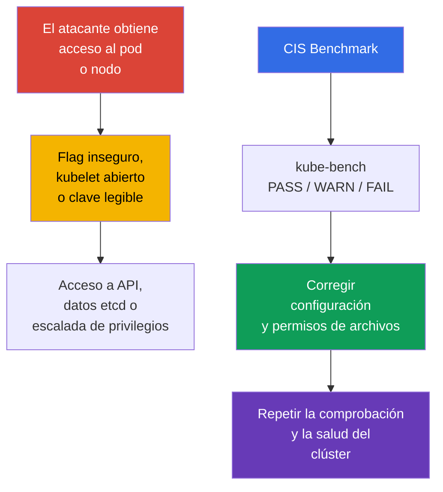

[Русская версия](ru.md) · [Eng version](README.md) · [Version française](fr.md) · [Deutsche Version](de.md) · [ქართული ვერსია](ge.md) · [繁體中文版](tw.md) · [日本語版](jp.md)

# Capítulo 07. CIS Benchmark y kube-bench

> **Problema.** El clúster rara vez se vulnera mediante una vulnerabilidad del propio Kubernetes: normalmente, un atacante que ya obtuvo acceso a un Pod o nodo encuentra cerca un detalle inseguro: un puerto abierto de más, un flag débil de un componente o una clave legible por todos. Por separado, estos detalles pasan desapercibidos, pero juntos proporcionan una vía a la API sin comprobación, a secretos en etcd o a escalada de privilegios en el nodo; ninguno es visible desde el código de la aplicación.

> **Qué sigue.** Las políticas de red restringen la vía del atacante entre workload. Ahora comprobaremos la seguridad de la configuración del propio control plane y de los nodos. **CIS Kubernetes Benchmark** convierte las recomendaciones de hardening en elementos comprobables, y `kube-bench` las correlaciona automáticamente con la configuración del clúster. Forma parte del dominio **Cluster Setup** (CKS, 15%): no basta con encontrar una configuración insegura; hay que corregirla sin perder la operatividad del clúster.

> **Qué debe saber de CKA.** Este capítulo no repite la estructura de `kubeadm`, static Pod ni PKI. Antes de trabajar, recuerde [kubeadm y los archivos de control plane](../../../cka/course/35/es.md) y los [certificados de Kubernetes](../../../cka/course/39/es.md).

## 07.1. CIS Kubernetes Benchmark: qué comprobamos exactamente

**CIS Kubernetes Benchmark** es un conjunto de recomendaciones del Center for Internet Security para la configuración de Kubernetes. No sustituye el modelo de amenazas, las actualizaciones ni policy, sino que proporciona una checklist mínima y reproducible: qué flags, permisos de archivos y configuraciones de componentes reducen la superficie de ataque conocida.



> 🧠 `kube-bench` correlaciona los archivos, argumentos y CIS profile disponibles; `FAIL`/`WARN` requieren evaluar el active state y el riesgo.

Las comprobaciones se agrupan por roles y componentes. Los nombres de los profiles y los números de recomendación cambian entre versiones del benchmark; por ello, guíese por el profile que `kube-bench` seleccionó para la versión de Kubernetes instalada. Las versiones de Kubernetes y las de CIS Benchmark no se relacionan uno a uno: una versión del benchmark puede cubrir varias versiones de Kubernetes y viceversa, y `kube-bench` puede seleccionar automáticamente un benchmark solo cuando la versión instalada de Kubernetes está presente en su version mapping publicado.

> 🔬 Version/profile mapping determina la fiabilidad del informe; use el profile que seleccionó un `kube-bench` compatible y corrija el check concreto.

> **Instantánea de vigencia al 2026-09-08.** En `docs/platforms.md` de la rama `main` de kube-bench se publica una tabla: CIS `1.12` para Kubernetes `1.32-1.33` y CIS `2.0` para Kubernetes `1.34-1.35`.
>
> Sin embargo, hay que distinguir la published support table del contenido de una release concreta de kube-bench. Por ejemplo, el `v0.16.0` fijado abajo todavía no contiene `cfg/cis-2.0`: su `cfg/config.yaml` incluido correlaciona Kubernetes `1.34` con `cis-1.12`, y no existe mapping para `1.35`.
>
> Por eso, antes de ejecutar, compruebe no solo `docs/platforms.md`, sino también el propio `cfg/config.yaml` y la existencia del directorio requerido `cfg/<benchmark>` precisamente en el tag/image utilizado. No considere que un profile está soportado por una release concreta solo porque ya figure en la documentación de la rama `main`. Si la versión del clúster no está en el mapping de la release fijada, no considere `--benchmark` forzado como una evaluación CIS autoritativa: `--benchmark` cambia solamente el conjunto de pruebas aplicadas, pero no lo hace válido para una versión no cubierta.
>
> Si el objetivo de la lab es obtener una evaluación determinista en una versión de Kubernetes que `kube-bench:v0.16.0` cubre realmente con su bundled mapping, use Kubernetes `1.33` + `cis-1.12`.
>
> La Lab103 relacionada con este capítulo usa deliberadamente el training baseline Kubernetes `1.36.0`, que `v0.16.0` no cubre. Allí, `cis-1.12` se ejecuta forzadamente solo como escenario educativo `forced-approximate`: el resultado es útil para practicar remediation, pero no es CIS compliance autoritativo para Kubernetes `1.36`.

| Sección CIS | Qué se comprueba | Objetos típicos |
|---|---|---|
| Control plane / master | flags de `kube-apiserver`, `kube-controller-manager`, `kube-scheduler` | static Pod-manifests en `/etc/kubernetes/manifests/` |
| etcd | TLS, acceso a datos, permisos de data directory y claves | `/etc/kubernetes/pki/etcd/`, `/var/lib/etcd` |
| Worker node | kubelet API, authentication/authorization, protección sysctl | kubelet config y argumentos systemd |
| Policies | RBAC, ServiceAccount, NetworkPolicy, Pod Security | objetos API y configuraciones admission |

`PASS` significa que la herramienta detectó conformidad con su regla. `FAIL` indica una infracción, y `WARN` normalmente significa que la comprobación no pudo determinar el estado sin ambigüedad o requiere una decisión manual. No corrija todos los `WARN` mecánicamente: algunos elementos no se aplican a un control plane administrado, CNI alternativo o una arquitectura concreta.

## 07.2. Ejecución de kube-bench y lectura del informe

Aplique los siguientes comandos solo después de confirmar que la versión instalada de `kube-bench` tiene un benchmark mapping compatible para su clúster: en la instantánea 2026-09-08 Kubernetes `1.36` no aparece en el generic mapping (véase §07.1).

Ejecute `kube-bench` en el nodo cuyos archivos debe leer. En el nodo control plane normalmente se necesitan las secciones `master` y `etcd`; en un worker, `node`. En un clúster de formación o con acceso SSH al nodo, la variante más transparente es la ejecución local:

> 🎯 Ejecute el scanner junto al propietario de los archivos, corrija la única fuente activa con backup, espere el restart, compruebe el effective state y health, y después repita el check.

```bash
# En el nodo control plane; los targets disponibles dependen de la versión de kube-bench.
sudo kube-bench run --targets master,etcd | tee kube-bench-control-plane.txt

# En el nodo worker.
sudo kube-bench run --targets node | tee kube-bench-worker.txt

# Encontrar rápidamente los elementos no superados y sus identificadores.
grep -E '\[FAIL\]|\[WARN\]' kube-bench-control-plane.txt

# Después de corregir, repetir el check ID del informe, no todo el target.
# Confirme la sintaxis con `kube-bench run --help` de su versión.
sudo kube-bench run --targets master --check 1.2.1
```

Si el binario `kube-bench` no está instalado directamente en el nodo, también puede ejecutarse en un Pod/Job con `hostPID` y los hostPath-mounts necesarios de configuración y datos de componentes; hay ejemplos preparados en el repositorio upstream de `kube-bench`. Esta ejecución comprueba solo los nodos donde el Pod se puede programar y cuyos host namespaces/archivos tiene disponibles. En managed Kubernetes normalmente permite comprobar los worker-nodes accesibles, pero no el control plane propiedad del provider de GKE/EKS/AKS/ACK: el mero acceso a Kubernetes API no hace accesibles los control-plane checks.

En este capítulo se considera un clúster levantado con `kubeadm` y acceso directo a los nodos, por lo que a continuación se usa precisamente la ejecución local.

Lea el resultado en este orden: registre el número de recomendación, la ruta o flag, el valor efectivo, el propietario/modo de archivo y el método de comprobación tras corregir. Esto es más importante que limitarse a aumentar el número de `PASS`.

| Estado | Acción |
|---|---|
| `PASS` | registrarlo como conformidad de partida; no debilitarlo en cambios posteriores |
| `FAIL` | determinar qué componente y qué fuente de configuración utiliza el clúster, después corregir y comprobar |
| `WARN` | leer el texto de la recomendación; confirmar manualmente, documentar la excepción o corregir |

Precisamente este ciclo - ejecutar `kube-bench`, encontrar el `FAIL`/`WARN` concreto en su informe, corregir y volver a comprobar - es el proceso de trabajo de todo el capítulo. El conjunto de hallazgos es distinto en cada clúster: depende del método de despliegue, la distribución kubeadm, las versiones de los componentes y el hardening ya aplicado. Por tanto, el capítulo no sigue números de recomendaciones CIS consecutivos; analiza una sección para cada componente del control plane y del nodo (`kube-apiserver`, `kube-controller-manager` y `kube-scheduler`, `kubelet`, `etcd`) como las categorías de hallazgos más frecuentes en informes reales de `kube-bench` y cómo corregirlas de forma segura, no como lista exhaustiva de todos los elementos posibles del benchmark.

## 07.3. Ejemplo: encontrar y corregir FAIL en kube-apiserver

En un clúster kubeadm, `kube-apiserver` se ejecuta como static Pod: kubelet vigila el manifiesto `/etc/kubernetes/manifests/kube-apiserver.yaml` en el disco del nodo control plane y vuelve a crear automáticamente el Pod cuando este cambia. Por tanto, se edita precisamente este archivo, no el objeto Pod mediante `kubectl`.

No hace falta inventar la instrucción de corrección: la proporciona el propio `kube-bench` en el informe. Cada `FAIL` viene acompañado de su elemento en la sección `== Remediations ==`, por ejemplo:

```text
[FAIL] 1.2.15 Ensure that the --profiling argument is set to false (Automated)
...
== Remediations master ==
1.2.15 Edit the API server pod specification file
/etc/kubernetes/manifests/kube-apiserver.yaml on the master node and set the
below parameter.
--profiling=false
```

Remediation indica el archivo y flag exactos. Antes de editar, guarde una copia de seguridad **fuera** de `/etc/kubernetes/manifests/`: kubelet lee todos los archivos de ese directorio cuyo nombre no comienza por punto, sin importar la extensión, y puede intentar crear un static Pod desde una copia dejada accidentalmente junto al original; si coincide el nombre del Pod, el comportamiento no está definido y la especificación obsoleta del backup puede ganar silenciosamente al manifest actual.

```bash
sudo install -d -m 0700 /etc/kubernetes/backup
sudo cp -a /etc/kubernetes/manifests/kube-apiserver.yaml \
  "/etc/kubernetes/backup/kube-apiserver.yaml.$(date +%Y%m%d%H%M%S)"
```

Añada el flag de remediation al array `command` del static Pod, guarde el archivo y espere a que kubelet vuelva a crear el Pod:

```bash
# kubelet debe volver a crear automáticamente el static Pod.
watch -n 2 'sudo crictl ps --name kube-apiserver'

# Después de recuperar la API.
kubectl get --raw='/readyz?verbose'
kubectl -n kube-system get pods -l component=kube-apiserver -o wide

# Volver a comprobar este check concreto, no todo el target.
sudo kube-bench run --targets master --check 1.2.15
```

## 07.4. Ejemplo: encontrar y corregir FAIL en kube-scheduler

La comprobación de desactivar profiling existe en los tres componentes principales de control plane, pero su ID depende de la sección del benchmark. En `kube-bench v0.16.0 / cis-1.12` es:

- `1.2.15` - `kube-apiserver`;
- `1.3.2` - `kube-controller-manager`;
- `1.4.1` - `kube-scheduler`.

Los tres pertenecen al target `master`, no a `node`. Por ejemplo, para scheduler:

```text
[FAIL] 1.4.1 Ensure that the --profiling argument is set to false (Automated)
...
== Remediations master ==
1.4.1 Edit the Scheduler pod specification file
/etc/kubernetes/manifests/kube-scheduler.yaml on the master node and set the
below parameter.
--profiling=false
```

Se aplica el mismo proceso que en 07.3: editar el manifiesto `/etc/kubernetes/manifests/kube-scheduler.yaml`, esperar la recreación del static Pod y volver a comprobar con `sudo kube-bench run --targets master --check 1.4.1`.

Pero primero compruebe si `kube-scheduler` se inicia con `--config=<path>`. Si se indica `--config`, el CLI-flag `--profiling` está deprecated y runtime lo ignora; la configuración effective se encuentra en `KubeSchedulerConfiguration`:

```yaml
apiVersion: kubescheduler.config.k8s.io/v1
kind: KubeSchedulerConfiguration
enableProfiling: false
```

`kube-bench v0.16.0 / cis-1.12` tiene una limitación: el check `1.4.1` analiza la process command line y no lee `KubeSchedulerConfiguration`. Por tanto, con scheduler configurado por `--config`, el resultado de `1.4.1` no puede considerarse evidencia independiente del effective profiling state: una configuración correcta puede producir `FAIL`, y un `--profiling=false` ignorado, un `PASS` formal. En tal caso, compruebe por separado el archivo `--config` activo, asegúrese de que `enableProfiling: false`, compruebe la salud de scheduler y documente la discrepancia de `kube-bench` como una limitación de la versión de benchmark/tool utilizada. No añada un CLI-flag ignorado solo para obtener `PASS`.

En `kube-controller-manager`, `--profiling` sigue siendo un CLI-flag normal, por lo que su hallazgo
