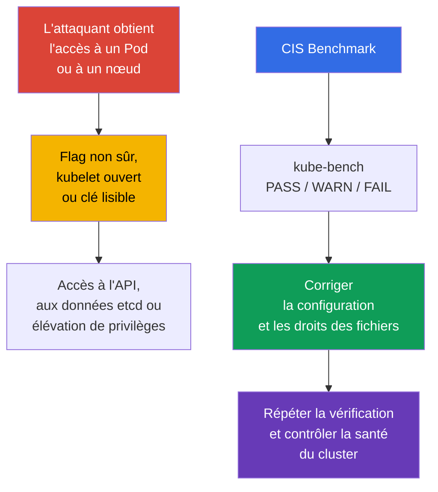
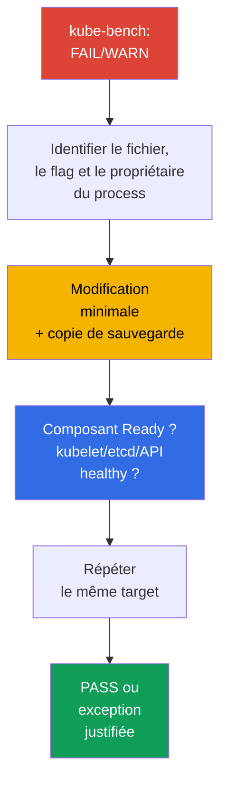

[Русская версия](ru.md) · [Eng version](README.md) · [Versión en español](es.md) · [Deutsche Version](de.md) · [ქართული ვერსია](ge.md) · [繁體中文版](tw.md) · [日本語版](jp.md)

# Chapitre 07. CIS Benchmark et kube-bench

> **Le problème.** Un cluster est rarement compromis au moyen d'une vulnérabilité de Kubernetes lui-même : le plus souvent, un attaquant qui a déjà obtenu l'accès à un Pod ou à un nœud trouve à proximité un détail non sûr - un port superflu ouvert, un flag de composant faible ou une clé lisible par tous. Pris isolément, ces détails passent inaperçus, mais ensemble ils ouvrent une voie vers l'API sans vérification, les secrets dans etcd ou une élévation de privilèges sur le nœud - et aucun n'est visible dans le code de l'application.

> **La suite.** Les politiques réseau limitent le chemin de l'attaquant entre les workloads. Vérifions maintenant la sécurité de la configuration du control plane et des nœuds eux-mêmes. Le **CIS Kubernetes Benchmark** transforme les recommandations de hardening en points vérifiables, et `kube-bench` les compare automatiquement avec la configuration du cluster. Cela fait partie du domaine **Cluster Setup** (CKS, 15 %) : il faut non seulement trouver un paramètre non sûr, mais aussi le corriger sans perdre le fonctionnement du cluster.

> **Ce qu'il faut connaître de CKA.** Ce chapitre ne répète pas le fonctionnement de `kubeadm`, des static Pod et de PKI. Avant de commencer, revoyez [kubeadm et les fichiers du control plane](../../../cka/course/35/fr.md) et les [certificats Kubernetes](../../../cka/course/39/fr.md).

## 07.1. CIS Kubernetes Benchmark : ce que nous vérifions exactement

Le **CIS Kubernetes Benchmark** est un ensemble de recommandations du Center for Internet Security pour la configuration de Kubernetes. Il ne remplace ni le modèle de menace, ni les mises à jour, ni les policy, mais fournit une checklist minimale et reproductible : quels flags, droits sur les fichiers et paramètres des composants réduisent la surface d'attaque connue.



> 🧠 `kube-bench` compare les fichiers, arguments et CIS profile accessibles ; `FAIL`/`WARN` exigent d'évaluer l'état actif et le risque.

Les vérifications sont regroupées par rôles et composants. Les noms de profile et les numéros de recommandations changent entre les versions du benchmark ; utilisez donc le profile sélectionné par `kube-bench` pour la version de Kubernetes installée. Les versions de Kubernetes et du CIS Benchmark ne correspondent pas une à une : une version du benchmark peut couvrir plusieurs versions de Kubernetes et inversement, et `kube-bench` ne peut sélectionner automatiquement un benchmark que lorsque la version de Kubernetes installée est présente dans son version mapping publié.

> 🔬 Le version/profile mapping détermine la fiabilité du rapport ; utilisez le profile choisi par un `kube-bench` pris en charge et corrigez le check précis.

> **Instantané d'actualité au 2026-09-08.** Dans `docs/platforms.md` de la branche `main`, kube-bench publie un tableau : CIS `1.12` pour Kubernetes `1.32-1.33` et CIS `2.0` pour Kubernetes `1.34-1.35`.
>
> Il faut toutefois distinguer la published support table du contenu d'une version particulière de kube-bench. Par exemple, la version épinglée `v0.16.0` ci-dessous ne contient pas encore `cfg/cis-2.0` : son `cfg/config.yaml` bundled associe Kubernetes `1.34` à `cis-1.12`, et le mapping pour `1.35` est absent.
>
> Avant l'exécution, vérifiez donc non seulement `docs/platforms.md`, mais aussi le vrai `cfg/config.yaml` et la présence du répertoire `cfg/<benchmark>` nécessaire dans le tag/image utilisé. Ne considérez pas un profile comme pris en charge par une version donnée uniquement parce qu'il est déjà mentionné dans la documentation de la branche `main`. Si la version du cluster est absente du mapping de la version épinglée, ne considérez pas un `--benchmark` forcé comme une évaluation CIS faisant autorité : `--benchmark` ne modifie que l'ensemble des tests appliqués, il ne les rend pas valides pour une version non couverte.
>
> Si l'objectif de la lab est d'obtenir une évaluation déterministe d'une version de Kubernetes que `kube-bench:v0.16.0` couvre réellement avec son bundled mapping, utilisez Kubernetes `1.33` + `cis-1.12`.
>
> La Lab103 associée à ce chapitre utilise volontairement le training baseline Kubernetes `1.36.0`, que `v0.16.0` ne couvre pas. `cis-1.12` y est forcé uniquement comme scénario pédagogique `forced-approximate` : le résultat est utile pour s'exercer à la remediation, mais ne constitue pas une CIS compliance authoritative pour Kubernetes `1.36`.

| Section CIS | Ce qui est vérifié | Objets typiques |
|---|---|---|
| Control plane / master | flags de `kube-apiserver`, `kube-controller-manager`, `kube-scheduler` | manifestes static Pod dans `/etc/kubernetes/manifests/` |
| etcd | TLS, accès aux données, droits du data directory et des clés | `/etc/kubernetes/pki/etcd/`, `/var/lib/etcd` |
| Worker node | API kubelet, authentication/authorization, protection sysctl | kubelet config et arguments systemd |
| Policies | RBAC, ServiceAccount, NetworkPolicy, Pod Security | objets API et paramètres admission |

`PASS` signifie que l'outil a constaté le respect de sa règle. `FAIL` signifie une violation, et `WARN` signifie généralement que la vérification n'a pas pu déterminer l'état sans ambiguïté ou qu'une décision manuelle est nécessaire. Ne corrigez pas tous les `WARN` mécaniquement : certains points ne s'appliquent pas à un control plane managed, à un CNI alternatif ou à une architecture donnée.

## 07.2. Exécuter kube-bench et lire le rapport

N'utilisez les commandes suivantes qu'après avoir confirmé que la version installée de `kube-bench` possède un benchmark mapping pris en charge pour votre cluster : dans l'instantané du 2026-09-08, Kubernetes `1.36` est absent du generic mapping (voir §07.1).

Exécutez `kube-bench` sur le nœud dont il doit lire les fichiers. Un nœud control plane nécessite en général les sections `master` et `etcd`, un worker la section `node`. Dans un cluster d'entraînement ou avec un accès SSH au nœud, l'option la plus transparente est une exécution locale :

> 🎯 Exécutez le scanner chez le propriétaire des fichiers, corrigez une unique source active avec un backup, attendez le restart, vérifiez l'effective state et la health, puis répétez le check.

```bash
# Sur le nœud control plane ; les targets disponibles dépendent de la version de kube-bench.
sudo kube-bench run --targets master,etcd | tee kube-bench-control-plane.txt

# Sur le nœud worker.
sudo kube-bench run --targets node | tee kube-bench-worker.txt

# Trouver rapidement les points non validés et leurs identifiants.
grep -E '\[FAIL\]|\[WARN\]' kube-bench-control-plane.txt

# Après la correction, répéter le check ID du rapport, et non le target entier.
# Confirmez la syntaxe avec `kube-bench run --help` de votre version.
sudo kube-bench run --targets master --check 1.2.1
```

Si le binaire `kube-bench` n'est pas installé directement sur le nœud, il peut aussi être exécuté dans un Pod/Job avec `hostPID` et les montages `hostPath` nécessaires à la configuration et aux données des composants ; le dépôt upstream de `kube-bench` contient des exemples prêts à l'emploi. Cette exécution ne vérifie que les nœuds sur lesquels le Pod peut être planifié et dont les host namespaces/fichiers lui sont accessibles. Dans Kubernetes managed, elle permet en général de vérifier les worker-nœuds accessibles, mais pas le control plane GKE/EKS/AKS/ACK appartenant au provider : l'accès à l'API Kubernetes seul ne rend pas les control-plane checks accessibles.

Ce chapitre suppose un cluster monté avec `kubeadm` et un accès direct aux nœuds ; il utilise donc l'exécution locale dans la suite.

Lisez le résultat dans cet ordre : consignez le numéro de recommandation, le chemin ou le flag, la valeur réelle, le propriétaire/mode du fichier et la méthode de vérification après la correction. C'est plus important que de simplement augmenter le nombre de `PASS`.

| Statut | Action |
|---|---|
| `PASS` | le noter comme conformité initiale ; ne pas l'affaiblir lors des changements suivants |
| `FAIL` | déterminer quel composant et quelle source de configuration utilise le cluster, puis corriger et vérifier |
| `WARN` | lire le texte de la recommandation ; confirmer manuellement, documenter l'exception ou corriger |

Ce cycle même - exécuter `kube-bench`, trouver un `FAIL`/`WARN` précis dans son rapport, corriger et revérifier - constitue le flux de travail de tout le chapitre. L'ensemble des constats varie selon chaque cluster : il dépend de la méthode de déploiement, de la distribution kubeadm, des versions des composants et du hardening déjà appliqué. La suite du chapitre ne parcourt donc pas les recommandations CIS dans l'ordre de leurs numéros, mais examine une section pour chaque composant du control plane et des nœuds (`kube-apiserver`, `kube-controller-manager` et `kube-scheduler`, `kubelet`, `etcd`) - les catégories de constats les plus fréquentes dans les rapports réels de `kube-bench` et la manière de les corriger sans risque, plutôt qu'une liste exhaustive de tous les points possibles du benchmark.

## 07.3. Exemple : trouver et corriger un FAIL de kube-apiserver

Dans un cluster kubeadm, `kube-apiserver` est lancé comme static Pod : kubelet surveille le manifeste `/etc/kubernetes/manifests/kube-apiserver.yaml` sur le disque du nœud control plane et recrée automatiquement le Pod lorsqu'il change. Il faut donc éditer ce fichier, et non l'objet Pod par `kubectl`.

Il n'est pas nécessaire d'inventer l'instruction de correction : `kube-bench` lui-même la fournit dans le rapport. Chaque `FAIL` a son propre point dans la section `== Remediations ==`, par exemple :

```text
[FAIL] 1.2.15 Ensure that the --profiling argument is set to false (Automated)
...
== Remediations master ==
1.2.15 Edit the API server pod specification file
/etc/kubernetes/manifests/kube-apiserver.yaml on the master node and set the
below parameter.
--profiling=false
```

La remediation indique le fichier et le flag exacts. Avant l'édition, sauvegardez une copie **hors de** `/etc/kubernetes/manifests/` : kubelet lit tous les fichiers de ce répertoire dont le nom ne commence pas par un point, quelle que soit leur extension, et peut tenter de créer un static Pod à partir d'une copie laissée par erreur à côté - en cas de nom de Pod identique, le comportement est indéfini et une spécification obsolète du backup peut silencieusement l'emporter sur le manifest actuel.

```bash
sudo install -d -m 0700 /etc/kubernetes/backup
sudo cp -a /etc/kubernetes/manifests/kube-apiserver.yaml \
  "/etc/kubernetes/backup/kube-apiserver.yaml.$(date +%Y%m%d%H%M%S)"
```

Ajoutez le flag de la remediation au tableau `command` du static Pod, enregistrez le fichier et attendez que kubelet recrée le Pod :

```bash
# kubelet doit recréer automatiquement le static Pod.
watch -n 2 'sudo crictl ps --name kube-apiserver'

# Après le rétablissement de l'API.
kubectl get --raw='/readyz?verbose'
kubectl -n kube-system get pods -l component=kube-apiserver -o wide

# Revérifier précisément ce check, et non tout le target.
sudo kube-bench run --targets master --check 1.2.15
```

## 07.4. Exemple : trouver et corriger un FAIL de kube-scheduler

La vérification de la désactivation de profiling existe pour les trois principaux composants du control plane, mais son ID dépend de la section du benchmark. Dans `kube-bench v0.16.0 / cis-1.12`, il s'agit de :

- `1.2.15` - `kube-apiserver`;
- `1.3.2` - `kube-controller-manager`;
- `1.4.1` - `kube-scheduler`.

Les trois concernent le target `master`, et non `node`. Par exemple, pour scheduler :

```text
[FAIL] 1.4.1 Ensure that the --profiling argument is set to false (Automated)
...
== Remediations master ==
1.4.1 Edit the Scheduler pod specification file
/etc/kubernetes/manifests/kube-scheduler.yaml on the master node and set the
below parameter.
--profiling=false
```

Le même processus qu'en 07.3 s'applique : éditez le manifeste `/etc/kubernetes/manifests/kube-scheduler.yaml`, attendez la recréation du static Pod, puis revérifiez `sudo kube-bench run --targets master --check 1.4.1`.

Mais vérifiez d'abord si `kube-scheduler` est lancé avec `--config=<path>`. Si `--config` est fourni, le CLI-flag `--profiling` est deprecated et ignoré au runtime ; le paramètre effectif se trouve dans `KubeSchedulerConfiguration` :

```yaml
apiVersion: kubescheduler.config.k8s.io/v1
kind: KubeSchedulerConfiguration
enableProfiling: false
```

`kube-bench v0.16.0 / cis-1.12` a une limite : le check `1.4.1` analyse la process command line et ne lit pas `KubeSchedulerConfiguration`. Avec un scheduler utilisant `--config`, le résultat `1.4.1` ne peut donc pas être considéré comme une preuve autonome de l'effective profiling state : une config correcte peut produire un `FAIL`, et un `--profiling=false` ignoré un `PASS` formel. Dans ce cas, contrôlez séparément le fichier `--config` actif, assurez-vous que `enableProfiling: false`, vérifiez la santé de scheduler et consignez la divergence de `kube-bench` comme une limite de la version benchmark/tool utilisée. N'ajoutez pas un CLI-flag ignoré dans le seul but d'obtenir un `PASS`.

Pour `kube-controller-manager`, `--profiling` reste un CLI-flag normal ; son constat (`1.3.2`) se corrige donc exactement comme en 07.3, sans cette réserve.

Le même cycle - exécuter `kube-bench`, trouver `FAIL`, éditer le manifeste, vérifier - se fait aussi sur les worker-nœuds, uniquement avec les targets et l'ensemble de flags `node` (`kubelet`, et non les composants control plane). La section 07.5 traite précisément ce constat.

**À l'examen, la vitesse prime sur l'exhaustivité.** Une tâche CKS typique indique qu'un rapport kube-bench pour kube-apiserver/kubelet contient un FAIL pour un ID donné et demande de le corriger ; c'est le fait de la correction qui est évalué, non une revue générale de tous les constats. Algorithme rapide : ouvrir `== Remediations ==` pour l'ID précis → déterminer s'il s'agit d'un static Pod ou d'un service systemd (kubelet) → éditer le bon fichier → attendre le redémarrage → revérifier avec le même `--check <ID>`, et non tout le target.

**Si le composant ne démarre plus après l'édition.** Une erreur d'argument ou dans le YAML du manifeste d'un static Pod n'empêche pas l'édition - elle empêche le lancement du nouveau Pod. Causes fréquentes : faute de frappe dans le nom du flag, argument dupliqué en conflit, chemin de fichier inexistant référencé par le flag. Ordre de rétablissement :

1. Vérifier ce qui se produit réellement : `sudo crictl ps -a --name <component>` et `sudo journalctl -u kubelet -n 100 --no-pager` - kubelet consigne la raison pour laquelle il ne peut pas lancer le static Pod à partir du nouveau manifeste.
2. Si la cause n'est pas trouvée rapidement, annuler l'édition à l'aide de la copie de sauvegarde du manifeste - c'est plus rapide que d'analyser un YAML complexe sous la pression du temps de l'examen.
3. Après le rétablissement, refaire l'édition avec davantage de précision et attendre de nouveau `Ready` avant de passer au constat suivant.

## 07.5. kubelet : API fermée et protection des paramètres du noyau

Kubelet s'exécute sur chaque nœud et a l'autorité nécessaire pour exécuter des Pod. Une read-only API ouverte, un accès anonyme ou une authorization faible permettent d'obtenir les données du nœud et, dans certains cas, d'étendre la compromission. `protectKernelDefaults: true` force kubelet à terminer son initialisation avec une erreur si les kernel flags que kubelet attend pour son fonctionnement ont d'autres valeurs. Avec `protectKernelDefaults: false`, kubelet tente lui-même de ramener ces paramètres aux valeurs attendues.

Sur un nœud kubeadm, le fichier principal est généralement `/var/lib/kubelet/config.yaml`, et les arguments supplémentaires sont définis dans `/var/lib/kubelet/kubeadm-flags.env` et un systemd drop-in. Dans Kubernetes 1.36, vérifiez aussi `--config-dir` : kubelet applique le config principal, puis uniquement les fichiers `*.conf` de ce répertoire (y compris les sous-répertoires) dans l'ordre lexicographique ; les fichiers `*.yaml` n'y sont pas chargés. Les CLI-flags ont une priorité supérieure. Établissez la véritable source de configuration, sans présumer du chemin :

```bash
sudo systemctl cat kubelet
sudo ps -ef | grep '[k]ubelet'

# Déterminez depuis le vrai ExecStart/process les valeurs de --config et --config-dir.
# Ne substituez pas les chemins kubeadm si le process en utilise d'autres.
KUBELET_CONFIG='<valeur effective de --config>'
KUBELET_CONFIG_DIR='<valeur effective de --config-dir ou chaîne vide>'

if [[ -n "$KUBELET_CONFIG" ]]; then
  sudo grep -nE \
    'readOnlyPort|anonymous:|authorization:|protectKernelDefaults' \
    "$KUBELET_CONFIG"
else
  echo 'kubelet est lancé sans --config : tenez compte des valeurs par défaut intégrées, des drop-ins et des flags CLI'
fi

if [[ -n "$KUBELET_CONFIG_DIR" ]]; then
  sudo find "$KUBELET_CONFIG_DIR" -type f -name '*.conf' -print
fi
```

Si `--config` est absent, ne lui attribuez pas un chemin par défaut : kubelet utilise les built-in defaults, puis `--config-dir` (s'il est défini), après quoi les CLI flags peuvent surcharger les valeurs finales. Pour prouver l'effective state, contrôlez quand même `/configz` à la fin.

Pour l'API de configuration kubelet, définissez les champs équivalents :

```yaml
# /var/lib/kubelet/config.yaml
readOnlyPort: 0
authentication:
  anonymous:
    enabled: false
authorization:
  mode: Webhook
protectKernelDefaults: true
```

Si, dans votre installation, le paramètre est passé par flag, ajoutez-le à l'environnement/drop-in systemd effectivement connecté, sans dupliquer une valeur entre les sources. Ci-dessous, il ne s'agit pas de commandes shell mais des fragments d'arguments kubelet requis :

```text
--read-only-port=0
--anonymous-auth=false
--authorization-mode=Webhook
--protect-kernel-defaults=true
```

Avant le restart, vérifiez sysctl. Pour Kubernetes 1.36, les valeurs kubelet attendues sont respectivement `1`, `0`, `10`, `1`, `1000000` et `25000000`. Ne les modifiez pas aveuglément : établissez d'abord quelle source sysctl gère le nœud, ramenez-la ensuite à un baseline cohérent, puis seulement redémarrez kubelet.

```bash
# Kubernetes 1.36 : paramètres que kubelet vérifie dans setupKernelTunables().
sudo sysctl \
  vm.overcommit_memory \
  vm.panic_on_oom \
  kernel.panic \
  kernel.panic_on_oops \
  kernel.keys.root_maxkeys \
  kernel.keys.root_maxbytes

# Après avoir vérifié/aligné les paramètres sur le baseline de votre OS et de Kubernetes :
sudo systemctl restart kubelet
sudo systemctl --no-pager --full status kubelet
sudo journalctl -u kubelet -n 100 --no-pager
```

Vérifiez que le read-only port n'écoute réellement pas et que l'API protégée ne répond qu'avec des credentials et une authorization corrects. Enfin, ne vérifiez pas seulement les fichiers : `/configz` affiche la configuration finale après le base config, les drop-ins `*.conf` et les CLI overrides. La requête doit pour cela être autorisée vers l'API kubelet (par exemple avec un kubeconfig administratif via l'API-server proxy) :

```bash
listeners=$(sudo ss -lntp) || {
  echo 'ERROR: cannot inspect TCP listeners' >&2
  exit 1
}

if grep -q ':10255' <<<"$listeners"; then
  echo 'ERROR: read-only kubelet port is listening' >&2
  exit 1
else
  echo 'OK: read-only kubelet port is closed'
fi

# Afficher l'API kubelet protégée, si elle écoute.
grep ':10250' <<<"$listeners"
kubectl get nodes

NODE="${NODE:?set target node name from kubectl get nodes}"
kubectl get --raw "/api/v1/nodes/${NODE}/proxy/configz" \
  | jq '.kubeletconfig | {readOnlyPort, authentication, authorization, protectKernelDefaults}'
```

Pour un utilisateur externe, l'accès à `10250` doit toujours être limité par le firewall et la topologie réseau. `authorization-mode=Webhook` ne rend pas le port sûr en soi - il oblige kubelet à demander à l'API Kubernetes les droits du sujet authentifié.

## 07.6. Exemple : trouver et corriger un FAIL de etcd

etcd stocke le persistent state de l'API Kubernetes : Secrets, RBAC, configuration et spécifications des workloads. Lire le data directory ou une TLS private key équivaut à une grave compromission du cluster ; CIS vérifie donc séparément le propriétaire et les droits des fichiers etcd.

```text
[FAIL] 1.1.12 Ensure that the etcd data directory ownership is set to etcd:etcd (Automated)
...
== Remediations master ==
1.1.12 On the etcd server node, get the etcd data directory, passed as an argument
--data-dir, from the below command:
ps -ef | grep etcd
Run the below command (based on the etcd data directory found above).
For example, chown etcd:etcd /var/lib/etcd
```

La remediation dit explicitement de déterminer d'abord le véritable data directory via `ps`, puis de ramener son ownership à `etcd:etcd`. La commande `ps` sert ici à trouver le vrai `--data-dir`, et non à déduire d'elle le propriétaire attendu - le check `1.1.12` exige littéralement `etcd:etcd`, quel que soit l'utilisateur qui exécute réellement le process.

Cette exigence doit être distinguée de la runtime identity de l'installation concernée. Dans un control plane kubeadm habituel, les static Pod s'exécutent par défaut sous `root` ; avec `RootlessControlPlane`, kubeadm utilise une non-root identity séparée (pour etcd - `kubeadm-etcd`). Avant de modifier l'ownership, vérifiez le data directory réel, l'applicabilité du CIS profile choisi à votre installation, et la présence du compte/group mapping `etcd`/`etcd` nécessaire sur le host - ne remplacez pas la literal requirement du benchmark par l'utilisateur du process.

Si l'environnement doit satisfaire précisément ce check et que le mapping `etcd:etcd` est valide pour le host, appliquez la remediation minimale au répertoire lui-même et revérifiez-la précisément :

```bash
# Déterminez le --data-dir réel à partir du process/manifeste.
sudo ps -ef | grep '[e]tcd'
DATA_DIR=/var/lib/etcd   # remplacez par la valeur réellement trouvée

sudo stat -c '%A %a %U:%G %n' "$DATA_DIR"
getent passwd etcd
getent group etcd

# Uniquement si le benchmark choisi est applicable et le mapping etcd:etcd est valide pour le host.
sudo chown etcd:etcd "$DATA_DIR"

# Revérifier précisément ce check (target master, et non etcd).
sudo kube-bench run --targets master --check 1.1.12
```

Les droits constituent un check distinct, `1.1.11` ("permissions 700 ou plus restrictives") ; s'il faut aussi le corriger, appliquez-le et revérifiez-le séparément :

```bash
sudo chmod 700 "$DATA_DIR"
sudo kube-bench run --targets master --check 1.1.11
```

Le même principe - « la remediation donne une commande, mais on l'applique après avoir contrôlé le data directory réel et l'applicabilité du profile » - concerne les constats CIS voisins sur etcd : droits et propriétaire du fichier pod spec (`/etc/kubernetes/manifests/etcd.yaml`) et des TLS-keys (`/etc/kubernetes/pki/etcd/*.key`). N'ouvrez pas `2379`/`2380` vers l'extérieur et ne transposez pas l'exemple tel quel dans un cluster managed, où le data directory et le process etcd ne vous appartiennent pas.

## 07.7. Nouvelle exécution, diagnostic et preuve de la correction

Pour chaque `FAIL` ou `WARN` accepté en connaissance de cause, suivez une procédure courte : (1) consignez la version de Kubernetes, la version ou le digest de `kube-bench`, le profile choisi et le CIS check ID du rapport ; (2) faites un backup du fichier ou de l'objet actif - pour un static Pod hébergé dans le filesystem, conservez le backup **hors de `staticPodPath`** : kubelet ne filtre pas les fichiers de ce répertoire par extension et peut traiter `.backup` comme un autre manifest ; (3) modifiez exactement un control ; (4) attendez le restart et vérifiez la santé du composant et du cluster ; (5) répétez seulement le target ou le check concerné (par exemple, `kube-bench run --targets master --check <ID>` pour une version qui prend en charge cette syntaxe) ; (6) en cas d'erreur de santé, restaurez immédiatement le backup, attendez le rétablissement et répétez le health check. Ne déclarez pas la correction réussie tant que la santé du composant, l'effective configuration et le targeted rerun n'ont pas été vérifiés. Si un check particulier de `kube-bench` vérifie une source de configuration que le composant n'utilise pas réellement (comme l'exemple du scheduler avec `--config` en 07.4), consignez-le comme une limite de l'outil et ne remplacez pas l'effective-state verification par un `PASS` formel.

Dans un cluster self-managed, cette procédure s'applique au control plane, aux nœuds et à leurs fichiers, dont l'opérateur est responsable. Dans Kubernetes managed, le provider possède en général le control plane : ne cherchez pas à contourner cela via hostPath ou une édition directe, mais comparez les contrôles provider-owned à la documentation et consignez la responsabilité customer-/provider-owned.



Ensemble minimal de vérifications après le hardening du control plane :

```bash
# L'API server et les objets de base sont accessibles.
kubectl get --raw='/readyz?verbose'
kubectl get nodes
kubectl get --all-namespaces pods

# Les static Pod et etcd fonctionnent réellement.
kubectl -n kube-system get pods -o wide
sudo crictl ps | grep -E 'kube-apiserver|kube-controller-manager|kube-scheduler|etcd'

# Cherchez les valeurs actives dans le vrai process, pas seulement dans une copie de sauvegarde du fichier.
sudo crictl ps --name kube-apiserver
sudo ps -ef | grep -E '[k]ube-apiserver|[k]ube-controller-manager|[k]ube-scheduler|[k]ubelet'

# Répéter l'évaluation et conserver un artefact pour la revue.
sudo kube-bench run --targets master,etcd | tee kube-bench-after.txt
grep -E '\[FAIL\]|\[WARN\]' kube-bench-after.txt
```

Erreurs courantes et diagnostic :

| Symptôme | Cause probable | À vérifier |
|---|---|---|
| API inaccessible après l'édition | erreur YAML ou flag static Pod non pris en charge | `journalctl -u kubelet`, `crictl ps -a`, copie du manifeste |
| kubelet ne démarre pas après `protectKernelDefaults` | le sysctl du nœud ne correspond pas au baseline requis | `journalctl -u kubelet`, source sysctl et policy OS |
| `kube-bench` affiche toujours `FAIL` | un fichier inactif a été modifié ou un flag en conflit est indiqué | `systemctl cat kubelet`, `ps`, `crictl inspect` |
| etcd ne démarre pas après la modification des droits | l'utilisateur du process a perdu l'accès au data directory ou à la key | `stat`, propriétaire du process, logs etcd |
| La vérification ne passe pas dans Kubernetes managed | l'utilisateur ne possède pas le control plane et une partie de la recommandation ne s'applique pas | documentation du provider, séparer les contrôles customer-owned et provider-owned |

> 🏭 CIS baseline versionné, contrôle régulier du drift, propriétaire des exceptions et evidence après le rollout.

## 07.8. Comment l'appliquer en production

- **Hardening comme baseline.** Décrivez la configuration du control plane et de kubelet ainsi que les droits PKI dans la configuration kubeadm, l'image du nœud ou l'automation, plutôt que de les modifier manuellement après chaque déploiement.
- **Contrôle régulier du drift.** Exécutez `kube-bench` après la mise à jour de Kubernetes et périodiquement dans CI/CD ou dans une tâche de sécurité distincte. Conservez le résultat comme artefact avec la version du benchmark et celle de Kubernetes.
- **Documenter les exceptions.** Un control plane managed, un autre CNI ou une décision architecturale peut rendre une règle inapplicable. Pour chaque exception, consignez le propriétaire du risque, la raison et le contrôle compensatoire.
- **Modifications par petites séries.** Modifiez les static Pod un par un, en vérifiant `/readyz` et le redémarrage. Dans un control plane HA, respectez un ordre rolling et un plan de rollback.
- **Droits accordés selon le besoin.** La private key, le kubeconfig, les manifestes et le data directory ne sont accessibles qu'au service user et aux administrateurs qui en ont réellement besoin. Vérifiez régulièrement les droits avec des outils de gestion de configuration.

## 07.9. Mini-glossaire

- **CIS Kubernetes Benchmark** - recommandations CIS pour une configuration Kubernetes sûre.
- **kube-bench** - outil qui vérifie la configuration selon les profiles CIS Benchmark.
- **static Pod** - Pod décrit par un manifeste local du nœud et démarré par kubelet sans gestion via l'API.
- **profiling** - endpoints de diagnostic des performances du process ; ils sont désactivés via la source de configuration active du composant. Pour `kube-scheduler` avec `--config`, il s'agit de `enableProfiling: false` dans `KubeSchedulerConfiguration`, et non du CLI-flag `--profiling`.
- **read-only port** - port kubelet non authentifié ; il doit être désactivé avec `--read-only-port=0`.
- **protectKernelDefaults** - paramètre kubelet qui interdit le démarrage lorsque le sysctl baseline ne correspond pas.
- **etcd data directory** - répertoire qui contient les données etcd, généralement `/var/lib/etcd`.
- **private key** - partie secrète d'une identité TLS ; elle nécessite un mode d'accès restrictif, en général `0600`.

## 07.10. Résumé du chapitre

- CIS Benchmark fournit un baseline de hardening vérifiable pour le control plane, etcd, les worker et les policies ; `kube-bench` affiche des `PASS`, `WARN` et `FAIL` précis.
- Identifiez d'abord la source de configuration active et le propriétaire du process, puis modifiez les paramètres. Un rapport sans vérification répétée ne prouve pas la correction.
- Pour `kube-apiserver`, il importe de minimiser l'accès anonymous en tenant compte des health probes et du kubeadm discovery, d'utiliser une authorization sûre, audit et `--profiling=false`. N'appliquez pas `--anonymous-auth=false` mécaniquement sans vérifier le lifecycle du cluster.
- profiling doit être désactivé sur `kube-apiserver`, `kube-controller-manager` et `kube-scheduler`, mais la manière active de le configurer dépend du composant : pour `kube-scheduler` avec `--config`, vérifiez `enableProfiling: false` dans `KubeSchedulerConfiguration`, et non le CLI-flag `--profiling`.
- Pour kubelet, utilisez `--read-only-port=0`, `--anonymous-auth=false`, `--authorization-mode=Webhook` et `--protect-kernel-defaults=true`, ou leurs équivalents dans `config.yaml`.
- Le etcd data directory, les PKI private keys, le kubeconfig et les manifestes static Pod nécessitent des droits minimaux. Pour un CIS check, déterminez d'abord le data directory réel, puis appliquez exactement les benchmark ownership/permissions requis, compte tenu de l'applicabilité du profile et du runtime model de l'installation concernée.

## 07.11. Utilité à l'examen et dans le travail réel

**À l'examen.** Une tâche indique généralement un ou plusieurs `FAIL` de `kube-bench` et donne accès au nœud. Déterminez rapidement si le composant est un static Pod, un kubelet service ou etcd, faites une copie de sauvegarde, corrigez le fichier actif, attendez le restart et démontrez le résultat. Retenez particulièrement les points fréquents : profiling des trois composants, `protect-kernel-defaults` de kubelet, read-only port fermé, anonymous access et modes de fichiers.

**Dans le travail réel.** CIS est un langage commun utile entre les équipes platform et security, mais ne remplace pas l'analyse d'architecture. Il aide à détecter le drift de configuration avant un incident, tandis que les vérifications reproductibles et les exceptions documentées rendent les mises à jour du cluster prévisibles.

## 07.12. Questions d'auto-vérification

<details>
<summary>1. En quoi un `WARN` dans le rapport `kube-bench` diffère-t-il d'un `FAIL`, et pourquoi ne faut-il pas les corriger de la même manière ?</summary>

`FAIL` signifie que l'outil a détecté une violation de sa règle, tandis que `WARN` indique généralement que l'état ne peut pas être déterminé sans ambiguïté ou qu'une décision manuelle est nécessaire. Pour un `WARN`, lisez le texte de la recommandation, confirmez son applicabilité à un control plane managed, à un CNI ou à l'architecture, puis documentez une exception ou corrigez-le, sans modifier tous les points mécaniquement.
</details>

<details>
<summary>2. Pourquoi ne suffit-il pas de modifier le fichier d'un static Pod sans vérifier le nouveau conteneur ?</summary>

Kubelet doit remarquer la modification du manifeste et recréer le static Pod, mais une erreur YAML ou un flag non pris en charge peut laisser le control plane inaccessible. Après l'édition, vérifiez le nouveau conteneur avec `crictl ps`, la disponibilité de l'API avec `kubectl get --raw='/readyz?verbose'` et le targeted rerun du check concerné.
</details>

<details>
<summary>3. Sur quels composants du control plane faut-il désactiver profiling, et la méthode de configuration est-elle identique ?</summary>

profiling doit être désactivé sur `kube-apiserver`, `kube-controller-manager` et `kube-scheduler` : il ne suffit pas de le faire seulement sur apiserver, car CIS vérifie les profiling endpoints des trois composants. La méthode de configuration n'est pas toujours identique : `kube-apiserver` et `kube-controller-manager` utilisent le CLI-flag `--profiling=false`, mais ce flag scheduler est deprecated - s'il s'exécute avec `--config=<path>`, il faut désactiver profiling avec `enableProfiling: false` dans `KubeSchedulerConfiguration`, et non via le CLI. Désactiver profiling n'équivaut pas à désactiver les metrics.
</details>

<details>
<summary>4. Quels sont les quatre paramètres kubelet de ce chapitre qui ferment son API et protègent le sysctl baseline ?</summary>

Ce sont `--read-only-port=0`, `--anonymous-auth=false`, `--authorization-mode=Webhook` et `--protect-kernel-defaults=true`, ou les champs `config.yaml` équivalents. Avant d'activer `protectKernelDefaults`, vérifiez sysctl : kubelet peut ne pas démarrer si le baseline ne correspond pas.
</details>

<details>
<summary>5. Pourquoi l'utilisateur du process etcd ne peut-il pas être considéré automatiquement comme le propriétaire requis du data directory dans un CIS check ?</summary>

Le CIS check définit son propre ownership attendu (`etcd:etcd`), et `ps` dans la remediation sert d'abord à déterminer le véritable `--data-dir`. La runtime identity dépend de l'implémentation : un control plane kubeadm normal exécute etcd sous `root` par défaut, alors qu'une variante rootless utilise une identity distincte. Il faut donc contrôler d'abord le data directory, l'applicabilité du benchmark et le UID/GID mapping, puis effectuer la remediation exacte ; le process user ne remplace pas la requirement du check lui-même.
</details>

<details>
<summary>6. Quels droits conviennent à une TLS private key, et pourquoi le certificat peut-il être lu plus largement ?</summary>

Une private key est un secret ; elle nécessite donc un accès aussi restreint que possible, le baseline typique étant le mode `0600`. Son propriétaire n'est pas universel : dans une installation kubeadm root-run ordinaire, c'est souvent `root:root`, mais dans un control plane non-root, la key doit appartenir à la service identity qui en a réellement besoin - changer mécaniquement le propriétaire en `root:root` sans vérifier la runtime identity peut priver ce process de l'accès à sa propre clé.

Lorsqu'un CIS control précis est vérifié, contrôlez séparément sa literal requirement : par exemple, le check `1.1.19` de `cis-1.12` attend `root:root` pour la Kubernetes PKI, ce qui est une exigence de ce benchmark précis, et non une règle universelle pour tout runtime model.

Un certificat contient la partie publique d'une identité TLS, donc le mode `0644` est souvent admissible ; son ownership et ses chemins effectifs sont tout de même vérifiés par rapport au deployment et au benchmark sélectionné.
</details>

<details>
<summary>7. Quelles commandes prouvent qu'après la correction, l'API, etcd et kubelet sont sains ?</summary>

Pour l'API et les objets, utilisez `kubectl get --raw='/readyz?verbose'`, `kubectl get nodes` et `kubectl get --all-namespaces pods`. Les static Pod et etcd se vérifient avec `kubectl -n kube-system get pods -o wide` et `sudo crictl ps`, kubelet avec `sudo systemctl status kubelet` et `journalctl -u kubelet` ; répétez ensuite le target ou le check `kube-bench` nécessaire.
</details>

## Pratique

Dans la [lab 103](../../labs/103/README_FR.MD), vous exécuterez `kube-bench`, enregistrerez le rapport, corrigerez les paramètres de kubelet et de `kube-apiserver`, configurerez TLS pour Ingress et vérifierez le hash du binaire. À cause de l'édition des static Pod et des configurations système, réalisez les tâches depuis la console du nœud de contrôle et vérifiez l'état du cluster après chaque étape.

🌐 Pratique interactive supplémentaire (killer.sh/killercoda, ressource externe) : [cis-benchmarks-kube-bench-fix-controlplane](https://killercoda.com/killer-shell-cks/scenario/cis-benchmarks-kube-bench-fix-controlplane)

En complément : [CIS Kubernetes Benchmark](https://www.cisecurity.org/benchmark/kubernetes) et [kube-bench](https://github.com/aquasecurity/kube-bench) - sources premières des profiles et des explications des vérifications.

---
[Table des matières](../README_FR.md) · [Chapitre 06](../06/fr.md) · [Chapitre 08](../08/fr.md)
