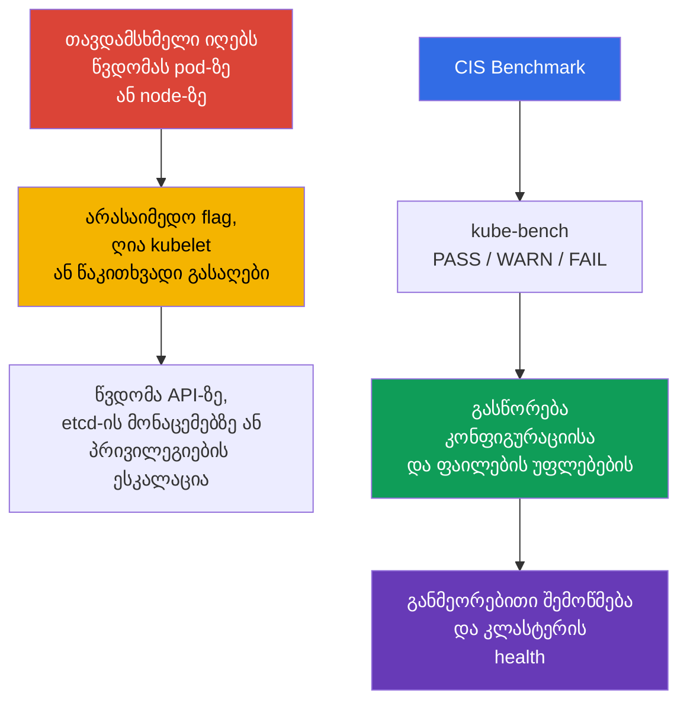
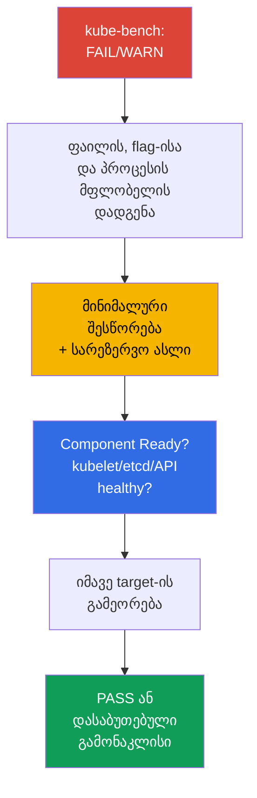

[Русская версия](ru.md) · [Eng version](README.md) · [Versión en español](es.md) · [Version française](fr.md) · [Deutsche Version](de.md) · [繁體中文版](tw.md) · [日本語版](jp.md)

# თავი 07. CIS Benchmark და kube-bench

> **პრობლემა.** კლასტერს იშვიათად ტეხენ თავად Kubernetes-ში არსებული დაუცველობით: ჩვეულებრივ
> თავდამსხმელი, რომელმაც უკვე მოიპოვა წვდომა Pod-ზე ან node-ზე, ახლომახლო პოულობს უსაფრთხო
> არ ყოფილ წვრილმანს - ზედმეტად ღია პორტს, კომპონენტის სუსტ flag-ს, ყველასთვის წაკითხვად
> გასაღებს. ცალ-ცალკე ასეთი დეტალები შეუმჩნეველია, მაგრამ ერთად ისინი ტოვებენ გზას API-სთან
> შემოწმების გარეშე, secrets-თან etcd-ში ან პრივილეგიების ესკალაციისკენ node-ზე - და ამათგან
> არცერთი არ ჩანს აპლიკაციის კოდიდან.

> **რა არის შემდეგ.** ქსელური policy-ები ზღუდავენ თავდამსხმელის გზას workload-ებს შორის.
> ახლა შევამოწმებთ, რამდენად უსაფრთხოდაა კონფიგურირებული თავად control plane და node-ები.
> **CIS Kubernetes Benchmark** hardening-ის რეკომენდაციებს გარდაქმნის შემოწმებად პუნქტებად,
> ხოლო `kube-bench` ავტომატურად ადარებს მათ კლასტერის კონფიგურაციას. ეს არის დომენის
> **Cluster Setup** (CKS, 15%) ნაწილი: საჭიროა არა მხოლოდ არასაიმედო პარამეტრის პოვნა, არამედ
> მისი გასწორებაც კლასტერის მუშაუნარიანობის დაკარგვის გარეშე.

> **რა უნდა იცოდეთ CKA-დან.** ეს თავი არ იმეორებს `kubeadm`-ის, static Pod-ისა და PKI-ის
> მოწყობას. სამუშაოს დაწყებამდე გაიხსენეთ [kubeadm და control plane-ის ფაილები](../../../cka/course/35/ge.md)
> და [Kubernetes-ის სერტიფიკატები](../../../cka/course/39/ge.md).

## 07.1. CIS Kubernetes Benchmark: რას ვამოწმებთ ზუსტად

**CIS Kubernetes Benchmark** - Center for Internet Security-ის რეკომენდაციების ნაკრები
Kubernetes-ის კონფიგურაციისთვის. ის არ ცვლის threat model-ს, განახლებებს ან policy-ს, არამედ
იძლევა მინიმალურ, რეპროდუცირებად checklist-ს: რომელი flag-ები, ფაილების უფლებები და კომპონენტების
პარამეტრები ამცირებენ ცნობილ თავდასხმის ზედაპირს.



> 🧠 `kube-bench` ადარებს ხელმისაწვდომ ფაილებს, არგუმენტებს და CIS profile-ს; `FAIL`/`WARN` მოითხოვს active state-ისა და რისკის შეფასებას.

შემოწმებები დაჯგუფებულია როლებისა და კომპონენტების მიხედვით. profile-ების სახელები და
რეკომენდაციების ნომრები benchmark-ის ვერსიებს შორის იცვლება, ამიტომ ორიენტირდით იმ profile-ზე,
რომელიც `kube-bench`-მა აირჩია დაყენებული Kubernetes-ის ვერსიისთვის. Kubernetes-ის ვერსიები და
CIS Benchmark-ის ვერსიები ერთმანეთთან ერთი-ერთზე არაა დაკავშირებული: benchmark-ის ერთმა
ვერსიამ შეიძლება რამდენიმე Kubernetes-ის ვერსია დაფაროს და პირიქითაც, ხოლო `kube-bench`-ს
benchmark-ის ავტომატურად არჩევა შეუძლია მხოლოდ მაშინ, როცა დაყენებული Kubernetes-ის ვერსია
მის გამოქვეყნებულ version mapping-შია წარმოდგენილი.

> 🔬 Version/profile mapping განსაზღვრავს ანგარიშის სანდოობას; გამოიყენეთ profile, რომელიც შერჩეულია მხარდაჭერილი `kube-bench`-ის მიერ, და გაასწორეთ კონკრეტული check.

> **Currentness-ის სურათი 2026-09-08 მდგომარეობით.** kube-bench-ის `main` branch-ის
> `docs/platforms.md`-ში გამოქვეყნებულია ცხრილი: CIS `1.12` - Kubernetes `1.32-1.33`-სთვის და
> CIS `2.0` - Kubernetes `1.34-1.35`-სთვის.
>
> თუმცა published support table უნდა განვასხვავოთ kube-bench-ის კონკრეტული release-ის
> შემცველობისგან. მაგალითად, ქვემოთ დაფიქსირებული `v0.16.0` ჯერ არ შეიცავს `cfg/cis-2.0`-ს: მისი
> bundled `cfg/config.yaml` Kubernetes `1.34`-ს `cis-1.12`-ს უსადაგებს, ხოლო mapping
> `1.35`-სთვის არ არსებობს.
>
> ამიტომ გაშვებამდე შეამოწმეთ არა მხოლოდ `docs/platforms.md`, არამედ თავად `cfg/config.yaml`-იც
> და საჭირო `cfg/<benchmark>` კატალოგის არსებობა სწორედ იმ tag/image-ში, რომელსაც იყენებთ. არ
> ჩათვალოთ profile კონკრეტული release-ის მიერ მხარდაჭერილად მხოლოდ იმის გამო, რომ ის უკვე
> `main` branch-ის დოკუმენტაციაშია მითითებული. თუ კლასტერის ვერსია არ არის დაფიქსირებული
> release-ის mapping-ში, ნუ ჩათვლით ძალით მითითებულ `--benchmark`-ს ავტორიტეტულ CIS-შეფასებად:
> `--benchmark` მხოლოდ გამოყენებული ტესტების ნაკრებს ცვლის, მაგრამ არ ხდის მას ვალიდურად
> დაუფარავი ვერსიისთვის.
>
> თუ ლაბორატორიის მიზანია მიღწეული იქნას დეტერმინირებული შეფასება Kubernetes-ის იმ ვერსიაზე,
> რომელსაც `kube-bench:v0.16.0` თავისი bundled mapping-ით რეალურად ფარავს, გამოიყენეთ
> Kubernetes `1.33` + `cis-1.12`.
>
> ამ თავთან დაკავშირებული Lab103 განზრახ იყენებს სასწავლო baseline-ს Kubernetes `1.36.0`,
> რომელსაც `v0.16.0` არ ფარავს. იქ `cis-1.12` ძალით გაშვებულია მხოლოდ როგორც
> `forced-approximate` სასწავლო სცენარი: შედეგი სასარგებლოა remediation-ის ვარჯიშისთვის, მაგრამ
> არ წარმოადგენს ავტორიტეტულ CIS compliance-ს Kubernetes `1.36`-სთვის.

| CIS-ის განყოფილება | რა მოწმდება | ტიპური ობიექტები |
|---|---|---|
| Control plane / master | `kube-apiserver`, `kube-controller-manager`, `kube-scheduler`-ის flag-ები | static Pod-manifest-ები `/etc/kubernetes/manifests/`-ში |
| etcd | TLS, მონაცემებზე წვდომა, data directory-სა და გასაღებების უფლებები | `/etc/kubernetes/pki/etcd/`, `/var/lib/etcd` |
| Worker node | kubelet API, authentication/authorization, sysctl-ის დაცვა | kubelet config და systemd-არგუმენტები |
| Policies | RBAC, ServiceAccount, NetworkPolicy, Pod Security | API-ობიექტები და admission-ის პარამეტრები |

`PASS` ნიშნავს, რომ ინსტრუმენტმა დაინახა შესაბამისობა თავის წესთან. `FAIL` ნიშნავს დარღვევას,
ხოლო `WARN` ჩვეულებრივ ნიშნავს, რომ შემოწმებამ ვერ დაადგინა მდგომარეობა ცალსახად ან საჭიროებს
ხელით გადაწყვეტას. ყველა `WARN` მექანიკურად ნუ გაასწორებთ: ნაწილი პუნქტებისა არ ეხება managed
control plane-ს, ალტერნატიულ CNI-ს ან კონკრეტულ არქიტექტურას.

## 07.2. kube-bench-ის გაშვება და ანგარიშის წაკითხვა

შემდეგი ბრძანებები გამოიყენეთ მხოლოდ იმის დადასტურების შემდეგ, რომ დაყენებულ `kube-bench`-ის
ვერსიას აქვს თქვენი კლასტერისთვის მხარდაჭერილი benchmark mapping: 2026-09-08 მდგომარეობით
Kubernetes `1.36` generic mapping-ში არ გვხვდება (იხ. §07.1).

გაუშვით `kube-bench` იმ node-ზე, რომლის ფაილებიც მას უნდა წაუკითხავს. control plane node-ზე
ჩვეულებრივ საჭიროა განყოფილებები `master` და `etcd`, worker-ზე - `node`. სასწავლო კლასტერში
ან node-ზე SSH-წვდომისას ყველაზე გამჭვირვალე ვარიანტია ლოკალური გაშვება:

> 🎯 გაუშვით scanner ფაილების მფლობელთან, გაასწორეთ backup-ით ერთადერთი აქტიური წყარო, დაელოდეთ restart-ს, შეამოწმეთ effective state და health, შემდეგ გაიმეორეთ check.

```bash
# control plane node-ზე; ხელმისაწვდომი targets დამოკიდებულია kube-bench-ის ვერსიაზე.
sudo kube-bench run --targets master,etcd | tee kube-bench-control-plane.txt

# worker node-ზე.
sudo kube-bench run --targets node | tee kube-bench-worker.txt

# სწრაფად ვიპოვოთ ვერგავლილი პუნქტები და მათი იდენტიფიკატორები.
grep -E '\[FAIL\]|\[WARN\]' kube-bench-control-plane.txt

# გასწორების შემდეგ გაიმეორეთ check ID ანგარიშიდან და არა მთელი target.
# სინტაქსი დაადასტურეთ თქვენი ვერსიის `kube-bench run --help`-ით.
sudo kube-bench run --targets master --check 1.2.1
```

თუ `kube-bench`-ის ბინარული ფაილი node-ზე უშუალოდ დაყენებული არ არის, ალტერნატივის სახით
შეიძლება მისი გაშვება Pod/Job-ში `hostPID`-ით და კომპონენტების კონფიგურაცია-მონაცემების
საჭირო `hostPath`-მონტირებებით; მზა მაგალითები არსებობს `kube-bench`-ის upstream-რეპოზიტორიაში.
ასეთი გაშვება ამოწმებს მხოლოდ იმ node-ებს, რომლებზეც Pod-ის დაგეგმვა შესაძლებელია და რომელთა
host namespace-ებზე/ფაილებზეც მას წვდომა აქვს. managed Kubernetes-ში ეს ჩვეულებრივ იძლევა
ხელმისაწვდომი worker-node-ების შემოწმების საშუალებას, მაგრამ არა GKE/EKS/AKS/ACK-ის
provider-owned control plane-ის: თავად Kubernetes API-ზე წვდომა control-plane check-ებს
ხელმისაწვდომს არ ხდის.

ამ თავში კლასტერი მიჩნეულია `kubeadm`-ით აღმართულად, node-ებზე პირდაპირი წვდომით, ამიტომ
შემდგომში სწორედ ლოკალური გაშვება გამოიყენება.

წაიკითხეთ შედეგი ამ თანმიმდევრობით: დაფიქსირეთ რეკომენდაციის ნომერი, გზა ან flag, ფაქტობრივი
მნიშვნელობა, ფაილის მფლობელი/რეჟიმი და გასწორების შემდგომი შემოწმების ხერხი. ეს უფრო მნიშვნელოვანია,
ვიდრე უბრალოდ `PASS`-ების რაოდენობის ზრდა.

| სტატუსი | ქმედება |
|---|---|
| `PASS` | ჩაწერეთ როგორც საწყისი შესაბამისობა; შემდგომი ცვლილებებისას ნუ შეასუსტებთ |
| `FAIL` | დაადგინეთ, რომელი კომპონენტი და რომელი კონფიგურაციის წყარო იყენებს კლასტერი, შემდეგ გაასწორეთ და შეამოწმეთ |
| `WARN` | წაიკითხეთ რეკომენდაციის ტექსტი; ხელით დაადასტურეთ, დააფიქსირეთ გამონაკლისი ან გაასწორეთ |

სწორედ ეს ციკლი - `kube-bench`-ის გაშვება, თავის ანგარიშში კონკრეტული `FAIL`/`WARN`-ის პოვნა,
გასწორება და ხელახალი შემოწმება - არის მთელი თავის სამუშაო პროცესი. თითოეული კლასტერის
ნაპოვნი პრობლემების ნაკრები საკუთარია: ის დამოკიდებულია განლაგების ხერხზე, kubeadm-ის
დისტრიბუციაზე, კომპონენტების ვერსიებზე და უკვე გატარებულ hardening-ზე. ამიტომ თავი შემდგომში
არ მიჰყვება CIS-რეკომენდაციების ნომრებს რიგრიგობით, არამედ განიხილავს თითო განყოფილებას
control plane-ისა და node-ის თითოეულ კომპონენტზე (`kube-apiserver`, `kube-controller-manager`
და `kube-scheduler`, `kubelet`, `etcd`) - როგორც ყველაზე ხშირი კატეგორიების ნაპოვნებს რეალურ
`kube-bench`-ის ანგარიშებში და მათი უსაფრთხო გასწორების ხერხს, და არა როგორც benchmark-ის
ყველა შესაძლო პუნქტის ამომწურავ ჩამონათვალს.

## 07.3. მაგალითი: ვპოულობთ და ვასწორებთ FAIL-ს kube-apiserver-ში

`kube-apiserver` kubeadm-კლასტერში static Pod-ად გაშვებულია: kubelet ადევნებს თვალს
manifest-ს `/etc/kubernetes/manifests/kube-apiserver.yaml` control plane node-ის დისკზე და
ავტომატურად ხელახლა ქმნის Pod-ს მისი შეცვლისას. ამიტომ სწორედ ეს ფაილი უნდა შეიცვალოს და არა
Pod-ობიექტი `kubectl`-ის მეშვეობით.

გასწორების ინსტრუქცია არ არის საჭირო თვითონ მოგონდეთ - მას თავად `kube-bench` აწვდის
ანგარიშში. თითოეულ `FAIL`-ს თან ახლავს საკუთარი პუნქტი `== Remediations ==` სექციაში, მაგალითად:

```text
[FAIL] 1.2.15 Ensure that the --profiling argument is set to false (Automated)
...
== Remediations master ==
1.2.15 Edit the API server pod specification file
/etc/kubernetes/manifests/kube-apiserver.yaml on the master node and set the
below parameter.
--profiling=false
```

Remediation მიუთითებს ზუსტ ფაილს და ზუსტ flag-ს. რედაქტირებამდე შეინახეთ სარეზერვო ასლი
`/etc/kubernetes/manifests/`-ის **გარეთ**: kubelet კითხულობს ამ კატალოგის ყველა ფაილს, რომლის
სახელიც წერტილით არ იწყება, გაფართოებისგან დამოუკიდებლად, და შეიძლება შემთხვევით გვერდით
დარჩენილი ასლიდან სცადოს static Pod-ის შექმნა - Pod-ის სახელის დამთხვევისას ქცევა
განუსაზღვრელია, და backup-ის მოძველებულმა სპეციფიკაციამ შეიძლება ჩუმად სძლიოს აქტუალურ
manifest-ს.

```bash
sudo install -d -m 0700 /etc/kubernetes/backup
sudo cp -a /etc/kubernetes/manifests/kube-apiserver.yaml \
  "/etc/kubernetes/backup/kube-apiserver.yaml.$(date +%Y%m%d%H%M%S)"
```

დაამატეთ remediation-ის flag static Pod-ის `command` მასივში, შეინახეთ ფაილი და დაელოდეთ,
სანამ kubelet ხელახლა შექმნის Pod-ს:

```bash
# kubelet-მა ავტომატურად უნდა ხელახლა შექმნას static Pod.
watch -n 2 'sudo crictl ps --name kube-apiserver'

# API-ის აღდგენის შემდეგ.
kubectl get --raw='/readyz?verbose'
kubectl -n kube-system get pods -l component=kube-apiserver -o wide

# ხელახლა შეამოწმეთ სწორედ ეს check და არა მთელი target.
sudo kube-bench run --targets master --check 1.2.15
```

## 07.4. მაგალითი: ვპოულობთ და ვასწორებთ FAIL-ს kube-scheduler-ში

profiling-ის გამორთვის შემოწმება არსებობს სამივე ძირითადი control-plane-კომპონენტისთვის,
მაგრამ მისი ID დამოკიდებულია benchmark-ის განყოფილებაზე. `kube-bench v0.16.0 / cis-1.12`-ში
ეს არის:

- `1.2.15` - `kube-apiserver`;
- `1.3.2` - `kube-controller-manager`;
- `1.4.1` - `kube-scheduler`.

სამივე ეკუთვნის target `master`-ს და არა `node`-ს. მაგალითად, scheduler-ისთვის:

```text
[FAIL] 1.4.1 Ensure that the --profiling argument is set to false (Automated)
...
== Remediations master ==
1.4.1 Edit the Scheduler pod specification file
/etc/kubernetes/manifests/kube-scheduler.yaml on the master node and set the
below parameter.
--profiling=false
```

გამოიყენება იგივე პროცესი, რაც 07.3-ში: გავასწოროთ manifest
`/etc/kubernetes/manifests/kube-scheduler.yaml`, დაველოდოთ static Pod-ის ხელახლა შექმნას,
ხელახლა შევამოწმოთ `sudo kube-bench run --targets master --check 1.4.1`.

მაგრამ ჯერ შეამოწმეთ, ხომ არ არის `kube-scheduler` გაშვებული `--config=<path>`-ით. თუ
`--config` მითითებულია, CLI-flag `--profiling` deprecated-ია და runtime-ის მიერ იგნორირდება;
effective პარამეტრი მდებარეობს `KubeSchedulerConfiguration`-ში:

```yaml
apiVersion: kubescheduler.config.k8s.io/v1
kind: KubeSchedulerConfiguration
enableProfiling: false
```

`kube-bench v0.16.0 / cis-1.12`-ს აქვს შეზღუდვა: check `1.4.1` აანალიზებს process command
line-ს და არ კითხულობს `KubeSchedulerConfiguration`-ს. ამიტომ scheduler-ის `--config`-თან
ერთად გაშვების შემთხვევაში `1.4.1`-ის შედეგი ვერ ჩაითვლება effective profiling state-ის
დამოუკიდებელ მტკიცებულებად: სწორმა config-მა შეიძლება `FAIL` მოგვცეს, ხოლო იგნორირებულმა
`--profiling=false`-მა - ფორმალური `PASS`. ასეთ შემთხვევაში ცალკე შეამოწმეთ აქტიური ფაილი
`--config`, დარწმუნდით, რომ `enableProfiling: false` არის, შეამოწმეთ scheduler-ის health და
დააფიქსირეთ `kube-bench`-ის შეუსაბამობა, როგორც გამოყენებული benchmark/tool-ვერსიის
შეზღუდვა. ნუ დაამატებთ იგნორირებულ CLI-flag-ს მხოლოდ `PASS`-ის მისაღებად.

`kube-controller-manager`-ში `--profiling` რჩება ჩვეულებრივ CLI-flag-ად, ამიტომ მისი ნაპოვნი
(`1.3.2`) სწორდება ზუსტად ისე, როგორც 07.3-ში, ამ დათქმის გარეშე.

ზუსტად იგივე ციკლი - `kube-bench`-ის გაშვება, `FAIL`-ის პოვნა, manifest-ის რედაქტირება,
შემოწმება - სრულდება worker-node-ებზეც, მხოლოდ `node`-ის targets-ითა და flag-ების ნაკრებით
(`kubelet`, და არა control-plane-კომპონენტები). განყოფილება 07.5 სწორედ ამ ნაპოვნს განიხილავს.

**გამოცდაზე სისწრაფე უფრო მნიშვნელოვანია, ვიდრე სისრულე.** CKS-ის ტიპური დავალება
ჩამოყალიბებულია ასე: «kube-apiserver/kubelet-ის kube-bench ანგარიშში არის FAIL ამა თუ იმ
ID-ით - გაასწორეთ ის», და ფასდება სწორედ გასწორების ფაქტი და არა ყველა ნაპოვნის საერთო
მიმოხილვა. სწრაფი ალგორითმი: გახსენით `== Remediations ==` კონკრეტული ID-სთვის → დაადგინეთ,
static Pod-ია ეს თუ systemd-სერვისი (kubelet) → გაასწორეთ საჭირო ფაილი → დაელოდეთ
გადატვირთვას → ხელახლა შეამოწმეთ იმავე `--check <ID>`-ით და არა მთელი target-ით ხელახლა.

**თუ შესწორების შემდეგ კომპონენტი არ ამოქმედდა.** flag-ში ან static Pod-ის manifest-ის
YAML-ში შეცდომა არ აბლოკავს რედაქტირებას - ის ბლოკავს ახალი Pod-ის გაშვებას. ტიპური
მიზეზები: შეცდომა flag-ის სახელში, კონფლიქტური დუბლირებული არგუმენტი, არარსებული გზა
ფაილამდე, რომელზეც flag მიუთითებს. აღდგენის თანმიმდევრობა:

1. შეამოწმეთ, რა ხდება რეალურად: `sudo crictl ps -a --name <component>` და
   `sudo journalctl -u kubelet -n 100 --no-pager` - kubelet ლოგავს მიზეზს, რის გამოც ვერ
   უშვებს static Pod-ს ახალი manifest-იდან.
2. თუ მიზეზი სწრაფად ვერ მოიძებნა, დააბრუნეთ ცვლილება manifest-ის სარეზერვო ასლით - ეს
   უფრო სწრაფია, ვიდრე გამოცდის დროის ზეწოლის ქვეშ რთული YAML-ის ანალიზი.
3. აღდგენის შემდეგ გაიმეორეთ შესწორება უფრო ზუსტად და ისევ დაელოდეთ `Ready`-ს, სანამ
   შემდეგ ნაპოვნზე გადახვალთ.

## 07.5. kubelet: დაცული API და kernel-პარამეტრების დაცვა

kubelet გაშვებულია ყოველ node-ზე და აქვს Pod-ის შესრულების უფლებამოსილება. ღია read-only
API, ანონიმური წვდომა ან სუსტი authorization იძლევა node-ის მონაცემების მიღების საშუალებას
და ზოგ შემთხვევაში კომპრომეტაციის განვითარების. `protectKernelDefaults: true`-ის დროს
kubelet აჩერებს ინიციალიზაციას შეცდომით, თუ kernel flags-ს, რომლებსაც kubelet თავისი
მუშაობისთვის ელოდება, სხვა მნიშვნელობები აქვს. `protectKernelDefaults: false`-ის დროს
kubelet ცდილობს ამ პარამეტრების დამოუკიდებლად მიყვანას მოსალოდნელ მნიშვნელობებამდე.

kubeadm-node-ზე ძირითადი ფაილი ჩვეულებრივ არის `/var/lib/kubelet/config.yaml`, ხოლო
დამატებითი არგუმენტები მითითებულია `/var/lib/kubelet/kubeadm-flags.env`-სა და systemd
drop-in-ში. Kubernetes 1.36-ში ასევე შეამოწმეთ `--config-dir`: kubelet იყენებს ძირითად
config-ს, შემდეგ კი მხოლოდ ამ კატალოგის `*.conf` ფაილებს (ქვეკატალოგების ჩათვლით)
ლექსიკოგრაფიული თანმიმდევრობით; `*.yaml` იქ არ იტვირთება. CLI-flag-ებს უფრო მაღალი
პრიორიტეტი აქვთ. დარწმუნდით რეალურ კონფიგურაციის წყაროში და ნუ იფიქრებთ გზას წინასწარ:

```bash
sudo systemctl cat kubelet
sudo ps -ef | grep '[k]ubelet'

# ფაქტობრივი ExecStart/process-იდან დაადგინეთ --config და --config-dir-ის მნიშვნელობები.
# ნუ ჩასვამთ kubeadm-გზებს, თუ პროცესი სხვას იყენებს.
KUBELET_CONFIG='<--config-ის ფაქტობრივი მნიშვნელობა>'
KUBELET_CONFIG_DIR='<--config-dir-ის ფაქტობრივი მნიშვნელობა ან ცარიელი სტრიქონი>'

if [[ -n "$KUBELET_CONFIG" ]]; then
  sudo grep -nE \
    'readOnlyPort|anonymous:|authorization:|protectKernelDefaults' \
    "$KUBELET_CONFIG"
else
  echo 'kubelet გაშვებულია --config-ის გარეშე: გაითვალისწინეთ built-in defaults, drop-in-ები და CLI flags'
fi

if [[ -n "$KUBELET_CONFIG_DIR" ]]; then
  sudo find "$KUBELET_CONFIG_DIR" -type f -name '*.conf' -print
fi
```

თუ `--config` არ არსებობს, ნუ მიანიჭებთ მას ნაგულისხმევ გზას: kubelet იყენებს built-in
defaults-ს, შემდეგ `--config-dir`-ს (თუ მითითებულია), რის შემდეგაც CLI flags-მა შეიძლება
გადაფაროს საბოლოო მნიშვნელობები. effective state-ის დასამტკიცებლად ბოლოს მაინც შეადარეთ
`/configz`-ს.

kubelet-ის კონფიგურაციის API-სთვის მიუთითეთ ეკვივალენტური ველები:

```yaml
# /var/lib/kubelet/config.yaml
readOnlyPort: 0
authentication:
  anonymous:
    enabled: false
authorization:
  mode: Webhook
protectKernelDefaults: true
```

თუ თქვენს ინსტალაციაში პარამეტრი flag-ის სახით გადაეცემა, დაამატეთ ის ფაქტობრივად ჩართულ
systemd environment/drop-in-ში, მნიშვნელობის წყაროებს შორის დუბლირების გარეშე. ქვემოთ არ
არის shell-ბრძანებები, არამედ kubelet-ის არგუმენტების საჭირო ფრაგმენტები:

```text
--read-only-port=0
--anonymous-auth=false
--authorization-mode=Webhook
--protect-kernel-defaults=true
```

გადატვირთვამდე შეამოწმეთ sysctl. Kubernetes 1.36-ისთვის kubelet-ის მოსალოდნელი მნიშვნელობებია
`1`, `0`, `10`, `1`, `1000000` და `25000000` შესაბამისად. ისინი ბრმად ნუ შეცვლით: ჯერ
დაადგინეთ, რომელი sysctl-წყარო მართავს node-ს, შემდეგ მიიყვანეთ ის შეთანხმებულ baseline-მდე
და მხოლოდ ამის შემდეგ გადატვირთეთ kubelet.

```bash
# Kubernetes 1.36: პარამეტრები, რომლებსაც kubelet ამოწმებს setupKernelTunables()-ში.
sudo sysctl \
  vm.overcommit_memory \
  vm.panic_on_oom \
  kernel.panic \
  kernel.panic_on_oops \
  kernel.keys.root_maxkeys \
  kernel.keys.root_maxbytes

# პარამეტრების თქვენი OS-ისა და Kubernetes-ის baseline-თან შემოწმების/მიყვანის შემდეგ:
sudo systemctl restart kubelet
sudo systemctl --no-pager --full status kubelet
sudo journalctl -u kubelet -n 100 --no-pager
```

შეამოწმეთ, რომ read-only პორტი მართლაც არ უსმენს, ხოლო დაცული API პასუხობს მხოლოდ სწორი
credentials-ითა და authorization-ით. ბოლოს არა მხოლოდ ფაილებს ადარეთ: `/configz` აჩვენებს
საბოლოო კონფიგურაციას base config-ის, `*.conf` drop-in-ებისა და CLI overrides-ის შემდეგ.
ამისთვის მოთხოვნა უნდა იყოს ავტორიზებული kubelet API-სთვის (მაგალითად, ადმინისტრაციული
kubeconfig-ით API-server proxy-ის მეშვეობით):

```bash
listeners=$(sudo ss -lntp) || {
  echo 'ERROR: cannot inspect TCP listeners' >&2
  exit 1
}

if grep -q ':10255' <<<"$listeners"; then
  echo 'ERROR: read-only kubelet port is listening' >&2
  exit 1
else
  echo 'OK: read-only kubelet port is closed'
fi

# დაცული kubelet API-ის ჩვენება, თუ ის უსმენს.
grep ':10250' <<<"$listeners"
kubectl get nodes

NODE="${NODE:?set target node name from kubectl get nodes}"
kubectl get --raw "/api/v1/nodes/${NODE}/proxy/configz" \
  | jq '.kubeletconfig | {readOnlyPort, authentication, authorization, protectKernelDefaults}'
```

გარე მომხმარებლისთვის წვდომა `10250`-ზე მაინც უნდა იყოს შეზღუდული firewall-ითა და ქსელური
ტოპოლოგიით. `authorization-mode=Webhook` თავისთავად არ ხდის პორტს უსაფრთხოს - ის
kubelet-ს აიძულებს, Kubernetes API-ს ჰკითხოს ავთენტიფიცირებული სუბიექტის უფლებების შესახებ.

## 07.6. მაგალითი: ვპოულობთ და ვასწორებთ FAIL-ს etcd-ში

etcd ინახავს Kubernetes API-ის persistent state-ს: Secrets, RBAC, კონფიგურაციასა და
workload-ის სპეციფიკაციებს. data directory-ის ან TLS private key-ის წაკითხვა კლასტერის
სერიოზული კომპრომეტაციის ტოლფასია, ამიტომ CIS ცალკე ამოწმებს etcd-ის ფაილების მფლობელსა
და უფლებებს.

```text
[FAIL] 1.1.12 Ensure that the etcd data directory ownership is set to etcd:etcd (Automated)
...
== Remediations master ==
1.1.12 On the etcd server node, get the etcd data directory, passed as an argument
--data-dir, from the below command:
ps -ef | grep etcd
Run the below command (based on the etcd data directory found above).
For example, chown etcd:etcd /var/lib/etcd
```

Remediation პირდაპირ ამბობს: ჯერ დაადგინეთ ფაქტობრივი data directory `ps`-ის მეშვეობით, შემდეგ
კი მიუყვანეთ მისი ownership `etcd:etcd`-მდე. ბრძანება `ps` აქ საჭიროა სწორედ იმისთვის, რომ
ვიპოვოთ რეალური `--data-dir`, და არა იმისთვის, რომ მისგან გამოვიტანოთ მოსალოდნელი მფლობელი -
თავად check `1.1.12` მოითხოვს literal `etcd:etcd`-ს, დამოუკიდებლად იმისგან, თუ რომელი
მომხმარებლით არის რეალურად გაშვებული პროცესი.

ეს მოთხოვნა უნდა გავმიჯნოთ კონკრეტული ინსტალაციის runtime identity-სგან. ჩვეულებრივ
kubeadm control plane-ში static Pod-ები ნაგულისხმევად გაშვებულია `root`-ის სახელით;
`RootlessControlPlane`-ის დროს kubeadm იყენებს ცალკე non-root identity-ს (etcd-სთვის -
`kubeadm-etcd`). ამიტომ ownership-ის შეცვლამდე შეამოწმეთ ფაქტობრივი data directory, არჩეული
CIS profile-ის შესაბამისობა თქვენს ინსტალაციასთან და საჭირო account/group mapping-ის
`etcd`/`etcd` არსებობა host-ზე - ნუ ჩაანაცვლებთ benchmark-ის literal მოთხოვნას პროცესის
მომხმარებლით.

თუ გარემომ ზუსტად ეს check უნდა დააკმაყოფილოს და mapping `etcd:etcd` host-ისთვის ვალიდურია,
გამოიყენეთ მინიმალური remediation თავად კატალოგზე და ხელახლა შეამოწმეთ სწორედ ის:

```bash
# დაადგინეთ ფაქტობრივი --data-dir პროცესიდან/manifest-იდან.
sudo ps -ef | grep '[e]tcd'
DATA_DIR=/var/lib/etcd   # შეცვალეთ რეალურად ნაპოვნი მნიშვნელობით

sudo stat -c '%A %a %U:%G %n' "$DATA_DIR"
getent passwd etcd
getent group etcd

# მხოლოდ იმ შემთხვევაში, თუ არჩეული benchmark შესაბამისია და mapping etcd:etcd ვალიდურია host-ისთვის.
sudo chown etcd:etcd "$DATA_DIR"

# ხელახლა შეამოწმეთ სწორედ ეს check (target master, და არა etcd).
sudo kube-bench run --targets master --check 1.1.12
```

წვდომის უფლებები ცალკე check `1.1.11`-ია («permissions 700 ან უფრო მკაცრი»); თუ ისიც
სწორდება, გამოიყენეთ და ხელახლა შეამოწმეთ ცალკე:

```bash
sudo chmod 700 "$DATA_DIR"
sudo kube-bench run --targets master --check 1.1.11
```

იგივე პრინციპი «remediation იძლევა ბრძანებას, მაგრამ ის გამოიყენება ფაქტობრივი data
directory-ისა და profile-ის შესაბამისობის შემოწმების შემდეგ» ეხება etcd-ის მეზობელ
CIS-ნაპოვნებსაც - pod spec-ფაილის (`/etc/kubernetes/manifests/etcd.yaml`) და TLS-გასაღებების
(`/etc/kubernetes/pki/etcd/*.key`) უფლებებსა და მფლობელს. ნუ გახსნით `2379`/`2380`-ს გარეთ
და ნუ გადაიტანთ მაგალითს ერთი-ერთში managed-კლასტერში, სადაც data directory და etcd-პროცესი
თქვენ არ გეკუთვნით.

## 07.7. განმეორებითი გაშვება, დიაგნოსტიკა და გასწორების დამტკიცება

ყოველი `FAIL`-ისთვის ან შეგნებულად მიღებული `WARN`-ისთვის იმოქმედეთ მოკლე პროცედურით: (1)
დააფიქსირეთ Kubernetes-ის ვერსია, `kube-bench`-ის ვერსია ან digest, არჩეული profile და CIS
check ID ანგარიშიდან; (2) გააკეთეთ აქტიური ფაილის ან ობიექტის სარეზერვო ასლი - filesystem-hosted
static Pod-ისთვის ინახეთ backup **`staticPodPath`-ის გარეთ**: kubelet არ ფილტრავს ამ კატალოგის
ფაილებს გაფართოებით და შეიძლება `.backup`-ს კიდევ ერთ manifest-ად ამუშაოს; (3) შეცვალეთ
ზუსტად ერთი control; (4) დაელოდეთ გადატვირთვას და შეამოწმეთ კომპონენტისა და კლასტერის health;
(5) გაიმეორეთ მხოლოდ დაზარალებული target ან check (მაგალითად, `kube-bench run --targets master --check <ID>` იმ ვერსიისთვის, რომელიც ამ სინტაქსს უჭერს მხარს); (6) health-ის შეცდომისას
დაუყოვნებლივ დააბრუნეთ სარეზერვო ასლი, დაელოდეთ აღდგენას და გაიმეორეთ health check. ნუ
გამოაცხადებთ გასწორებას წარმატებულად, სანამ არ არის შემოწმებული კომპონენტის health, effective
კონფიგურაცია და targeted rerun. თუ კონკრეტული `kube-bench`-check ამოწმებს არა იმ
კონფიგურაციის წყაროს, რომელსაც კომპონენტი რეალურად იყენებს (როგორც scheduler-ის მაგალითში
`--config`-ით 07.4-დან), დააფიქსირეთ ეს, როგორც ინსტრუმენტის შეზღუდვა და ნუ ჩაანაცვლებთ
effective-state-verification-ს ფორმალური `PASS`-ით.

self-managed კლასტერში ეს პროცედურა ეხება control plane-ს, node-ებსა და მათ ფაილებს,
რომლებზეც პასუხისმგებელია ოპერატორი. managed Kubernetes-ში control plane ჩვეულებრივ
provider-ს ეკუთვნის: ნუ შეეცდებით ამის გვერდის ავლას hostPath-ით ან პირდაპირი შესწორებით,
არამედ შეადარეთ provider-owned კონტროლები დოკუმენტაციას და დააფიქსირეთ customer-/provider-owned
პასუხისმგებლობა.



control plane-ის hardening-ის შემდეგ შემოწმებების მინიმალური ნაკრები:

```bash
# API server და საბაზისო ობიექტები ხელმისაწვდომია.
kubectl get --raw='/readyz?verbose'
kubectl get nodes
kubectl get --all-namespaces pods

# Static Pod და etcd მართლაც მუშაობს.
kubectl -n kube-system get pods -o wide
sudo crictl ps | grep -E 'kube-apiserver|kube-controller-manager|kube-scheduler|etcd'

# აქტიურ მნიშვნელობებს ვეძებთ რეალურ პროცესში და არა მხოლოდ ფაილის სარეზერვო ასლში.
sudo crictl ps --name kube-apiserver
sudo ps -ef | grep -E '[k]ube-apiserver|[k]ube-controller-manager|[k]ube-scheduler|[k]ubelet'

# ხელახალი შეფასება და არტეფაქტის შენახვა review-სთვის.
sudo kube-bench run --targets master,etcd | tee kube-bench-after.txt
grep -E '\[FAIL\]|\[WARN\]' kube-bench-after.txt
```

ტიპური შეცდომები და დიაგნოსტიკა:

| სიმპტომი | სავარაუდო მიზეზი | რა შევამოწმოთ |
|---|---|---|
| API მიუწვდომელია შესწორების შემდეგ | YAML-ის შეცდომა ან static Pod-ის მხარდაუჭერელი flag | `journalctl -u kubelet`, `crictl ps -a`, manifest-ის სარეზერვო ასლი |
| kubelet არ ამოქმედდა `protectKernelDefaults`-ის შემდეგ | node-ის sysctl არ შეესაბამება საჭირო baseline-ს | `journalctl -u kubelet`, sysctl-წყარო და OS-policy |
| `kube-bench` ისევ აჩვენებს `FAIL`-ს | შეცვლილია არააქტიური ფაილი ან მითითებულია კონფლიქტური flag | `systemctl cat kubelet`, `ps`, `crictl inspect` |
| etcd არ ეშვება უფლებების შეცვლის შემდეგ | პროცესის მომხმარებელმა დაკარგა წვდომა data directory-ზე ან key-ზე | `stat`, პროცესის მფლობელი, etcd-ის ლოგები |
| managed Kubernetes-ში შემოწმება ვერ გადის | control plane არ ეკუთვნის მომხმარებელს და რეკომენდაციების ნაწილი არ ეხება მას | provider-ის დოკუმენტაცია, customer- და provider-owned კონტროლების გამიჯვნა |

> 🏭 Versioned CIS baseline, drift-ის რეგულარული შემოწმება, გამონაკლისების მფლობელი და evidence rollout-ის შემდეგ.

## 07.8. როგორ გამოიყენება ეს პროდაქშენში

- **Hardening როგორც baseline.** control plane-ის, kubelet-ისა და PKI-ის უფლებების
  კონფიგურაცია აღიწერება kubeadm-კონფიგურაციაში, node-ის image-ში ან automation-ში და არა
  ხელით სწორდება ყოველი განლაგების შემდეგ.
- **Drift-ის რეგულარული კონტროლი.** `kube-bench` ეშვება Kubernetes-ის განახლების შემდეგ და
  პერიოდულად CI/CD-ში ან ცალკე security-ამოცანაში. შედეგი ინახება როგორც არტეფაქტი
  benchmark-ისა და Kubernetes-ის ვერსიის მითითებით.
- **გამონაკლისები დოკუმენტირდება.** managed control plane-მა, სხვა CNI-მ ან
  არქიტექტურულმა გადაწყვეტილებამ შეიძლება წესი გახადოს არარელევანტური. თითოეული
  გამონაკლისისთვის ფიქსირდება რისკის მფლობელი, მიზეზი და კომპენსატორული კონტროლი.
- **ცვლილებები მცირე პარტიებად.** static Pod ცვლილება ხდება ერთ-ერთზე, `readyz`-ისა და
  გადატვირთვის შემოწმებით. HA control plane-ში დაცულია rolling-თანმიმდევრობა და rollback-გეგმა.
- **უფლებები გაიცემა დანიშნულებისამებრ.** Private key, kubeconfig, manifest-ები და data
  directory ხელმისაწვდომია მხოლოდ სერვისის მომხმარებლისა და იმ ადმინისტრატორებისთვის,
  რომლებსაც ეს ნამდვილად სჭირდებათ. უფლებები რეგულარულად მოწმდება კონფიგურაციის მართვის
  საშუალებებით.

## 07.9. მინი-ლექსიკონი

- **CIS Kubernetes Benchmark** - CIS-ის რეკომენდაციები Kubernetes-ის უსაფრთხო
  კონფიგურაციისთვის.
- **kube-bench** - ინსტრუმენტი, რომელიც ამოწმებს კონფიგურაციას CIS Benchmark-ის profile-ების
  მიხედვით.
- **static Pod** - Pod, აღწერილი node-ის ლოკალური manifest-ით და გაშვებული kubelet-ის
  მიერ API-ის მეშვეობით მართვის გარეშე.
- **profiling** - პროცესის წარმადობის დიაგნოსტიკის endpoint-ები; ისინი ითიშება კომპონენტის
  აქტიური კონფიგურაციის წყაროს მეშვეობით. `kube-scheduler`-ისთვის `--config`-ით ეს არის
  `enableProfiling: false` `KubeSchedulerConfiguration`-ში და არა CLI-flag `--profiling`.
- **read-only port** - kubelet-ის ავთენტიფიცირებელი პორტი; უნდა გამოირთოს
  `--read-only-port=0`-ით.
- **protectKernelDefaults** - kubelet-ის პარამეტრი, რომელიც კრძალავს გაშვებას sysctl
  baseline-თან შეუსაბამობის შემთხვევაში.
- **etcd data directory** - etcd-ის მონაცემების კატალოგი, ჩვეულებრივ `/var/lib/etcd`.
- **private key** - TLS-იდენტობის საიდუმლო ნაწილი; მას სჭირდება შეზღუდული წვდომის რეჟიმი,
  ჩვეულებრივ `0600`.

## 07.10. თავის შეჯამება

- CIS Benchmark განსაზღვრავს შემოწმებად hardening-baseline-ს control plane-ისთვის, etcd-ისთვის,
  worker-ისთვის და policy-ებისთვის; `kube-bench` აჩვენებს კონკრეტულ `PASS`, `WARN` და
  `FAIL`-ს.
- ჯერ დგინდება აქტიური კონფიგურაციის წყარო და პროცესის მფლობელი, შემდეგ იცვლება
  პარამეტრები. ანგარიში ხელახალი შემოწმების გარეშე გასწორებას არ ამტკიცებს.
- `kube-apiserver`-ზე მნიშვნელოვანია ანონიმური წვდომის მინიმიზაცია health probes-ისა და
  kubeadm discovery-ის გათვალისწინებით, უსაფრთხო authorization-ის, audit-ისა და
  `--profiling=false`-ის გამოყენება. ნუ გამოიყენებთ `--anonymous-auth=false`-ს მექანიკურად,
  კლასტერის lifecycle-ის შემოწმების გარეშე.
- profiling უნდა იყოს გამორთული `kube-apiserver`-ზე, `kube-controller-manager`-ზე და
  `kube-scheduler`-ზე, მაგრამ აქტიური კონფიგურაციის ხერხი დამოკიდებულია კომპონენტზე:
  `kube-scheduler`-ისთვის `--config`-ის დროს შეამოწმეთ `enableProfiling: false`
  `KubeSchedulerConfiguration`-ში და არა CLI-flag `--profiling`.
- kubelet-ისთვის საჭიროა `--read-only-port=0`, `--anonymous-auth=false`,
  `--authorization-mode=Webhook` და `--protect-kernel-defaults=true` ან მათი ეკვივალენტები
  `config.yaml`-ში.
- etcd-ის data directory, PKI-ის private keys, kubeconfig და static Pod-manifest-ები
  მოითხოვს მინიმალურ უფლებებს. CIS check-ისთვის ჯერ დგინდება ფაქტობრივი data directory,
  შემდეგ გამოიყენება ზუსტად benchmark-ის მიერ მოთხოვნილი ownership/permissions,
  კონკრეტული ინსტალაციის profile-შესაბამისობისა და runtime-მოდელის გათვალისწინებით.

## 07.11. როგორ გამოგადგებათ: გამოცდაზე და რეალურ სამუშაოში

**გამოცდაზე.** დავალება ჩვეულებრივ ასახელებს ერთ ან რამდენიმე `FAIL`-ს `kube-bench`-იდან და
იძლევა წვდომას node-ზე. სწრაფად დაადგინეთ, კომპონენტია static Pod, kubelet-სერვისი თუ etcd,
გააკეთეთ სარეზერვო ასლი, გაასწორეთ აქტიური ფაილი, დაელოდეთ გადატვირთვას და დაამტკიცეთ
შედეგი. დაიმახსოვრეთ განსაკუთრებით ხშირი პუნქტები: profiling სამ კომპონენტზე, kubelet-ის
`protect-kernel-defaults`, დახურული read-only port, ანონიმური წვდომა და ფაილების რეჟიმები.

**რეალურ სამუშაოში.** CIS სასარგებლო საერთო ენაა platform- და security-გუნდებს შორის, მაგრამ
არ ცვლის არქიტექტურულ ანალიზს. ის ეხმარება ინციდენტამდე კონფიგურაციის drift-ის აღმოჩენას,
ხოლო რეპროდუცირებადი შემოწმებები და დოკუმენტირებული გამონაკლისები კლასტერის განახლებებს
პროგნოზირებადს ხდის.

## 07.12. თვითშემოწმების კითხვები

<details>
<summary>1. რით განსხვავდება `WARN` `kube-bench`-ის ანგარიშში `FAIL`-ისგან და რატომ არ შეიძლება მათი ერთნაირად გასწორება?</summary>

`FAIL` ნიშნავს, რომ ინსტრუმენტმა აღმოაჩინა თავისი წესის დარღვევა, ხოლო `WARN` ჩვეულებრივ
ამბობს, რომ მდგომარეობა ცალსახად ვერ დგინდება ან საჭიროებს ხელით გადაწყვეტას. `WARN`-ისთვის
იკითხება რეკომენდაციის ტექსტი, დასტურდება შესაბამისობა managed control plane-თან, CNI-სთან
ან არქიტექტურასთან და შემდეგ დოკუმენტირდება გამონაკლისი ან სწორდება, და არა ყველა პუნქტის
მექანიკური შეცვლა.
</details>

<details>
<summary>2. რატომ არ არის საკმარისი static Pod-ის გასასწორებლად მხოლოდ ფაილის შეცვლა და ახალი კონტეინერის არშემოწმება?</summary>

kubelet-მა უნდა შეამჩნიოს manifest-ის ცვლილება და ხელახლა შექმნას static Pod, მაგრამ
YAML-ის შეცდომამ ან მხარდაუჭერელმა flag-მა შეიძლება control plane მიუწვდომელი დატოვოს.
შესწორების შემდეგ მოწმდება ახალი კონტეინერი `crictl ps`-ით, API-ის ხელმისაწვდომობა
`kubectl get --raw='/readyz?verbose'`-ით და დაზარალებული check-ის targeted rerun.
</details>

<details>
<summary>3. control plane-ის რომელ კომპონენტებზე უნდა გამოირთოს profiling და ერთნაირია თუ არა კონფიგურაციის ხერხი?</summary>

Profiling უნდა გამოირთოს `kube-apiserver`-ზე, `kube-controller-manager`-ზე და
`kube-scheduler`-ზე: არ შეიძლება მხოლოდ apiserver-ით შემოვიფარგლოთ, CIS ამოწმებს სამივე
კომპონენტის profiling-endpoint-ებს. კონფიგურაციის ხერხი ყოველთვის ერთი და იგივე არ არის:
`kube-apiserver` და `kube-controller-manager` იყენებენ CLI-flag `--profiling=false`-ს,
მაგრამ `kube-scheduler`-ში ეს flag deprecated-ია - თუ ის გაშვებულია `--config=<path>`-ით,
profiling უნდა გამოირთოს `enableProfiling: false`-ით `KubeSchedulerConfiguration`-ში და
არა CLI-ის მეშვეობით. profiling-ის გამორთვა არ არის იგივე, რაც მეტრიკების გამორთვა.
</details>

<details>
<summary>4. ამ თავის რომელი ოთხი kubelet-პარამეტრი კეტავს მის API-ს და იცავს sysctl baseline-ს?</summary>

ეს არის `--read-only-port=0`, `--anonymous-auth=false`, `--authorization-mode=Webhook` და
`--protect-kernel-defaults=true` ან `config.yaml`-ის ეკვივალენტური ველები.
`protectKernelDefaults`-ის ჩართვამდე მოწმდება sysctl: baseline-თან შეუსაბამობისას kubelet-მა
შეიძლება ვერ ამოქმედდეს.
</details>

<details>
<summary>5. რატომ არ შეიძლება etcd-პროცესის მომხმარებელი ავტომატურად ჩაითვალოს CIS check-ში მოთხოვნილ data directory-ის მფლობელად?</summary>

CIS check განსაზღვრავს საკუთარ მოსალოდნელ ownership-ს (`etcd:etcd`), ხოლო `ps`
remediation-ში გამოიყენება უპირველესად ფაქტობრივი `--data-dir`-ის დასადგენად. Runtime
identity დამოკიდებულია იმპლემენტაციაზე: ჩვეულებრივი kubeadm control plane ნაგულისხმევად
უშვებს etcd-ს `root`-ის სახელით, ხოლო rootless-ვარიანტი იყენებს ცალკე identity-ს. ამიტომ
ჯერ მოწმდება data directory, benchmark-ის შესაბამისობა და UID/GID mapping, შემდეგ კი
სრულდება ზუსტი remediation; პროცესის მომხმარებელი არ ცვლის თავად check-ის მოთხოვნას.
</details>

<details>
<summary>6. რა უფლებებია მისაღები TLS private key-სთვის და რატომ შეიძლება სერტიფიკატის უფრო ფართო წაკითხვა?</summary>

Private key საიდუმლო მასალაა, ამიტომ მას სჭირდება მაქსიმალურად შეზღუდული წვდომა; ტიპური
baseline არის რეჟიმი `0600`. მფლობელი უნივერსალური არ არის: ჩვეულებრივ root-run
kubeadm-ინსტალაციაში ეს ხშირად არის `root:root`, ხოლო non-root control plane-ის დროს
key უნდა ეკუთვნოდეს იმ service identity-ს, რომელსაც ის ნამდვილად სჭირდება - მფლობელის
მექანიკურმა შეცვლამ `root:root`-ზე, runtime identity-ის შემოწმების გარეშე, შეიძლება
ასეთ პროცესს საკუთარ key-ზე წვდომა წაართვას.

თუ მოწმდება კონკრეტული CIS control, ცალკე შეადარეთ მისი literal მოთხოვნა: მაგალითად,
`cis-1.12`-ის check `1.1.19` ელოდება `root:root`-ს Kubernetes PKI-სთვის, და ეს არის
კონკრეტული benchmark-ის მოთხოვნა და არა უნივერსალური წესი ნებისმიერი runtime-მოდელისთვის.

სერტიფიკატი შეიცავს TLS-იდენტობის საჯარო ნაწილს, ამიტომ რეჟიმი `0644` ხშირად დასაშვებია;
მისი ownership და ფაქტობრივი გზები მაინც ადარდება deployment-ს და არჩეულ benchmark-ს.
</details>

<details>
<summary>7. რომელი ბრძანებებით დაამტკიცებთ, რომ გასწორების შემდეგ API, etcd და kubelet ჯანსაღია?</summary>

API-სა და ობიექტებისთვის გამოიყენება `kubectl get --raw='/readyz?verbose'`, `kubectl get nodes`
და `kubectl get --all-namespaces pods`. static Pod და etcd მოწმდება `kubectl -n kube-system
get pods -o wide`-ითა და `sudo crictl ps`-ით, kubelet - `sudo systemctl status kubelet`-ითა
და `journalctl -u kubelet`-ით; შემდეგ მეორდება საჭირო target ან `kube-bench`-check.
</details>

## პრაქტიკა

[ლაბ 103](../../labs/103/README_GE.MD)-ში გაუშვებთ `kube-bench`-ს, შეინახავთ ანგარიშს,
გაასწორებთ kubelet-ისა და `kube-apiserver`-ის პარამეტრებს, დააკონფიგურირებთ TLS-ს
Ingress-ისთვის და შეამოწმებთ ბინარული ფაილის ჰეშს. static Pod-ისა და სისტემური
კონფიგურაციების შესწორების გამო დავალებები შეასრულეთ საკონტროლო node-ის კონსოლიდან და
თითოეული ნაბიჯის შემდეგ შეამოწმეთ კლასტერის მდგომარეობა.

🌐 დამატებითი ინტერაქტიული პრაქტიკა (killer.sh/killercoda, გარე რესურსი): [cis-benchmarks-kube-bench-fix-controlplane](https://killercoda.com/killer-shell-cks/scenario/cis-benchmarks-kube-bench-fix-controlplane)

დამატებით: [CIS Kubernetes Benchmark](https://www.cisecurity.org/benchmark/kubernetes)
და [kube-bench](https://github.com/aquasecurity/kube-bench) - profile-ებისა და check-ების
განმარტებების პირველწყაროები.

---
[სარჩევი](../README_GE.md) · [თავი 06](../06/ge.md) · [თავი 08](../08/ge.md)
