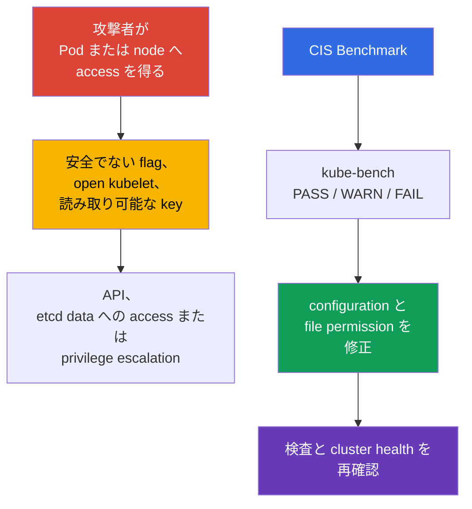
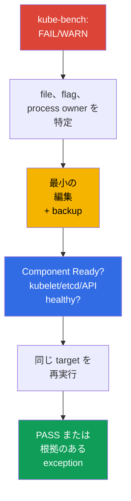

[Русская версия](ru.md) · [Eng version](README.md) · [Versión en español](es.md) · [Version française](fr.md) · [Deutsche Version](de.md) · [ქართული ვერსია](ge.md) · [繁體中文版](tw.md)

# 第07章. CIS Benchmark と kube-bench

> **課題。** cluster は Kubernetes 自体の脆弱性経由で破られることより、すでに Pod または node に access を得た攻撃者が、余分な open port、弱い component flag、全員が読める key といった安全でない細部を近くに見つけることのほうが多いです。個々では目立たない detail でも、組み合わされば認証なしの API、etcd の secret、node の privilege escalation への経路になり、いずれも application code からは見えません。

> **この後。** network policy は workload 間の攻撃者の経路を制限します。次に control plane と node 自身がどの程度安全に設定されているかを確認します。**CIS Kubernetes Benchmark** は hardening recommendation を検証可能な項目に変換し、`kube-bench` は cluster configuration と自動照合します。これは **Cluster Setup** domain（CKS、15%）の一部です。安全でない設定を見つけるだけでなく、cluster を動かしたまま修正する必要があります。

> **CKA で必要な知識。** 本章は `kubeadm`、static Pod、PKI の仕組みを繰り返しません。作業前に [kubeadm と control plane file](../../../cka/course/35/jp.md) および [Kubernetes certificate](../../../cka/course/39/jp.md) を復習してください。

## 07.1. CIS Kubernetes Benchmark: 何を検査するか

**CIS Kubernetes Benchmark** は Kubernetes configuration のための Center for Internet Security recommendation 集です。threat model、update、policy の代わりではなく、既知の attack surface を減らす flag、file permission、component setting の最小で再現可能な checklist を提供します。



> 🧠 `kube-bench` は利用できる file、argument、CIS profile を照合します。`FAIL`/`WARN` は active state と risk の評価が必要です。

検査は role と component ごとに分類されます。profile 名と recommendation 番号は benchmark version 間で変わるため、インストール済み Kubernetes version に対して `kube-bench` が選択した profile を基準にしてください。Kubernetes version と CIS Benchmark version は一対一で対応しません。ひとつの benchmark version が複数の Kubernetes version を対象にすることも逆もあり、`kube-bench` が benchmark を自動選択できるのは、インストール済み Kubernetes version が公開済み version mapping に含まれる場合だけです。

> 🔬 Version/profile mapping が report の信頼性を決めます。support される `kube-bench` が選んだ profile を使い、具体的な check を修正してください。

> **2026-09-08 時点の currentness snapshot。** kube-bench の `main` branch の `docs/platforms.md` には、Kubernetes `1.32-1.33` 用に CIS `1.12`、Kubernetes `1.34-1.35` 用に CIS `2.0` という table が公開されています。
>
> ただし、公開 support table と特定 kube-bench release の内容は区別します。たとえば以下で固定する `v0.16.0` にはまだ `cfg/cis-2.0` がありません。その bundled `cfg/config.yaml` は Kubernetes `1.34` を `cis-1.12` に対応付け、`1.35` の mapping はありません。
>
> したがって実行前に `docs/platforms.md` だけでなく、使用する tag/image の `cfg/config.yaml` と必要な `cfg/<benchmark>` directory の存在を確認します。`main` branch documentation に載っただけで、特定 release が profile を support すると見なしてはいけません。cluster version が固定 release の mapping にない場合、強制した `--benchmark` を authoritative な CIS assessment と見なさないでください。`--benchmark` は適用する test set を変えるだけで、対象外 version に対して valid にはしません。
>
> lab の目的が `kube-bench:v0.16.0` の bundled mapping が実際に cover する Kubernetes version 上で deterministic な assessment を得ることなら、Kubernetes `1.33` + `cis-1.12` を使います。
>
> 本章に関係する Lab103 は、`v0.16.0` が cover しない training baseline Kubernetes `1.36.0` を意図的に使います。そこでの `cis-1.12` は `forced-approximate` の学習 scenario としてのみ強制実行します。remediation の練習には有用ですが Kubernetes `1.36` の authoritative CIS compliance ではありません。

| CIS section | 検査内容 | 典型 object |
|---|---|---|
| Control plane / master | `kube-apiserver`、`kube-controller-manager`、`kube-scheduler` の flag | `/etc/kubernetes/manifests/` の static Pod manifest |
| etcd | TLS、data access、data directory と key の permission | `/etc/kubernetes/pki/etcd/`、`/var/lib/etcd` |
| Worker node | kubelet API、authentication/authorization、sysctl protection | kubelet config と systemd argument |
| Policies | RBAC、ServiceAccount、NetworkPolicy、Pod Security | API object と admission setting |

`PASS` は tool が自身の rule への適合を検出したこと、`FAIL` は違反、`WARN` は通常 state を一意に判定できない、または手動判断を要することを示します。全 `WARN` を機械的に修正してはいけません。一部の項目は managed control plane、alternative CNI、特定 architecture には適用されません。

## 07.2. kube-bench の実行と report の読み方

以下の command は、インストール済み `kube-bench` に cluster 用の support された benchmark mapping があることを確認してからだけ実行します。2026-09-08 snapshot では Kubernetes `1.36` は generic mapping にありません（§07.1 参照）。

`kube-bench` は読ませるべき file を持つ node 上で実行します。control plane node には通常 `master` と `etcd`、worker には `node` section が必要です。training cluster または node への SSH access がある場合、最も透明な方法は local 実行です。

> 🎯 file owner 上で scanner を実行し、backup を取った単一の active source を修正し、restart を待ち、effective state と health を確認してから check を再実行します。

```bash
# control plane node 上。利用可能 target は kube-bench version による。
sudo kube-bench run --targets master,etcd | tee kube-bench-control-plane.txt

# worker node 上。
sudo kube-bench run --targets node | tee kube-bench-worker.txt

# failed item とその ID を素早く探す。
grep -E '\[FAIL\]|\[WARN\]' kube-bench-control-plane.txt

# 修正後は target 全体ではなく report の check ID を再実行する。
# syntax は使用 version の `kube-bench run --help` で確認する。
sudo kube-bench run --targets master --check 1.2.1
```

`kube-bench` binary が node に直接 install されていない場合、component configuration/data の必要な `hostPID` と `hostPath` mount を持つ Pod/Job で代替実行できます。ready-made 例は upstream `kube-bench` repository にあります。この実行で検査できるのは Pod を schedule でき、host namespace/file に access できる node だけです。managed Kubernetes では通常 access 可能な worker node は検査できても、provider-owned control plane GKE/EKS/AKS/ACK は検査できません。Kubernetes API access だけでは control-plane check は利用可能になりません。

本章では direct node access を持つ `kubeadm` cluster を前提とするため、以降は local 実行を使います。

結果は次の順に読みます。recommendation number、path または flag、actual value、file owner/mode、修正後の確認方法を記録します。単に `PASS` の数を増やすより重要です。

| Status | Action |
|---|---|
| `PASS` | 初期 compliance として記録し、次の変更で弱めない |
| `FAIL` | cluster が使う component と configuration source を特定し、修正して確認する |
| `WARN` | recommendation text を読み、手動確認、exception の文書化、または修正を行う |

この cycle、すなわち `kube-bench` を実行し自身の report から具体的な `FAIL`/`WARN` を見つけ、修正して再確認することが本章全体の workflow です。finding set は deployment method、kubeadm distribution、component version、既に適用した hardening により cluster ごとに異なります。そのため以降は CIS recommendation を番号順に列挙せず、control plane と node の各 component（`kube-apiserver`、`kube-controller-manager`、`kube-scheduler`、`kubelet`、`etcd`）ごとに一 section を扱います。これは実際の `kube-bench` report の最頻カテゴリと安全な修正方法であり、全 benchmark item の網羅 list ではありません。

## 07.3. 例: kube-apiserver の FAIL を見つけ修正する

`kubeadm` cluster の `kube-apiserver` は static Pod として動きます。kubelet は control-plane node disk の `/etc/kubernetes/manifests/kube-apiserver.yaml` manifest を監視し、変更時に Pod を自動再作成します。したがって `kubectl` で Pod object を編集せず、この file を編集します。

修正 instruction を推測する必要はありません。report 内の `kube-bench` 自身が示します。各 `FAIL` には `== Remediations ==` section の item があり、例は次の通りです。

```text
[FAIL] 1.2.15 Ensure that the --profiling argument is set to false (Automated)
...
== Remediations master ==
1.2.15 Edit the API server pod specification file
/etc/kubernetes/manifests/kube-apiserver.yaml on the master node and set the
below parameter.
--profiling=false
```

Remediation は正確な file と flag を指定します。編集前に backup を `/etc/kubernetes/manifests/` **の外**へ保存します。kubelet は extension に関係なく、この directory 内の dot で始まらない name の全 file を読み、近くに偶然残した copy から static Pod を作ろうとする場合があります。Pod name が重なれば挙動は未定義で、backup の古い specification が静かに現行 manifest に勝つ可能性があります。

```bash
sudo install -d -m 0700 /etc/kubernetes/backup
sudo cp -a /etc/kubernetes/manifests/kube-apiserver.yaml \
  "/etc/kubernetes/backup/kube-apiserver.yaml.$(date +%Y%m%d%H%M%S)"
```

Remediation の flag を static Pod の `command` array に追加し file を保存したら、kubelet が Pod を再作成するのを待ちます。

```bash
# kubelet が static Pod を自動再作成する必要がある。
watch -n 2 'sudo crictl ps --name kube-apiserver'

# API が復旧した後。
kubectl get --raw='/readyz?verbose'
kubectl -n kube-system get pods -l component=kube-apiserver -o wide

# target 全体でなくこの check だけを再確認する。
sudo kube-bench run --targets master --check 1.2.15
```

## 07.4. 例: kube-scheduler の FAIL を見つけ修正する

profiling 無効化 check は三つの主 control-plane component 全てにありますが、ID は benchmark section により異なります。`kube-bench v0.16.0 / cis-1.12` では以下です。

- `1.2.15` - `kube-apiserver`。
- `1.3.2` - `kube-controller-manager`。
- `1.4.1` - `kube-scheduler`。

三つとも `node` でなく target `master` に属します。scheduler の例は次の通りです。

```text
[FAIL] 1.4.1 Ensure that the --profiling argument is set to false (Automated)
...
== Remediations master ==
1.4.1 Edit the Scheduler pod specification file
/etc/kubernetes/manifests/kube-scheduler.yaml on the master node and set the
below parameter.
--profiling=false
```

07.3 と同じ process を使います。`/etc/kubernetes/manifests/kube-scheduler.yaml` manifest を編集し、static Pod の再作成を待ち、`sudo kube-bench run --targets master --check 1.4.1` を再確認します。

ただし先に `kube-scheduler` が `--config=<path>` で起動していないか確認してください。`--config` が指定されると CLI flag `--profiling` は deprecated で runtime には無視され、effective setting は `KubeSchedulerConfiguration` にあります。

```yaml
apiVersion: kubescheduler.config.k8s.io/v1
kind: KubeSchedulerConfiguration
enableProfiling: false
```

`kube-bench v0.16.0 / cis-1.12` には制限があります。check `1.4.1` は process command line を解析し `KubeSchedulerConfiguration` を読みません。そのため `--config` 使用 scheduler では、`1.4.1` 結果だけを effective profiling state の証拠と見なせません。正しい config が `FAIL` を出す一方、無視される `--profiling=false` は形式上の `PASS` を出し得ます。この場合は active `--config` file を別に確認し、`enableProfiling: false`、scheduler health を確認して、`kube-bench` の相違を使用 benchmark/tool version の制限として記録します。`PASS` だけのために無視される CLI flag を追加してはいけません。

`kube-controller-manager` の `--profiling` は通常の CLI flag のままなので、その finding（`1.3.2`）はこの注意なしに 07.3 と同じように修正します。

worker node でも同じ cycle、`kube-bench` 実行、`FAIL` 発見、manifest 編集、検証を行います。ただし target と flag set は `node`（control-plane component でなく `kubelet`）です。07.5 はこの finding を扱います。

**試験では speed が完全性より重要です。** 典型的 CKS 課題は「kube-apiserver/kubelet の kube-bench report にこの ID の FAIL がある。修正せよ」で、全 finding の総覧でなく修正の事実が採点されます。高速 algorithm は、specific ID の `== Remediations ==` を開く → static Pod か systemd service（kubelet）か決める → 必要 file を編集 → restart を待つ → target 全体でなく同じ `--check <ID>` を再確認、です。

**編集後に component が起動しない場合。** static Pod manifest の argument または YAML error は編集自体を妨げず、新 Pod の起動を妨げます。典型原因は flag name の typo、conflicting duplicate argument、flag が参照する file の不存在です。復旧手順は次です。

1. 実際の状態を確認する: `sudo crictl ps -a --name <component>` と `sudo journalctl -u kubelet -n 100 --no-pager`。kubelet は新 manifest から static Pod を起動できない理由を log に出します。
2. 原因がすぐ見つからなければ manifest backup で編集を rollback します。試験で時間圧力下に複雑な YAML を調べるより速いです。
3. 復旧後、より正確に編集を繰り返し、次の finding へ進む前に再び `Ready` を待ちます。

## 07.5. kubelet: closed API と kernel parameter protection

kubelet は各 node で実行され Pod を実行する権限を持ちます。open read-only API、anonymous access、弱い authorization は node data を開示し、場合によっては compromise を拡大できます。`protectKernelDefaults: true` は、kubelet が動作に期待する kernel flag の値が異なると initialization を error で終了させます。`protectKernelDefaults: false` なら、kubelet はこれらの parameter を期待値へ自ら合わせようとします。

kubeadm node では通常 `/var/lib/kubelet/config.yaml` が main file で、追加 argument は `/var/lib/kubelet/kubeadm-flags.env` と systemd drop-in で与えます。Kubernetes 1.36 では `--config-dir` も確認します。kubelet は main config の後、この directory（subdirectory を含む）の `*.conf` file だけを lexical order で適用します。`*.yaml` は読み込みません。CLI flag はより高い priority を持ちます。path を仮定せず実際の configuration source を確認します。

```bash
sudo systemctl cat kubelet
sudo ps -ef | grep '[k]ubelet'

# 実際の ExecStart/process から --config と --config-dir の値を特定する。
# process が別のものを使うなら kubeadm path を代入しない。
KUBELET_CONFIG='<--config の実際の値>'
KUBELET_CONFIG_DIR='<--config-dir の実際の値または空文字列>'

if [[ -n "$KUBELET_CONFIG" ]]; then
  sudo grep -nE \
    'readOnlyPort|anonymous:|authorization:|protectKernelDefaults' \
    "$KUBELET_CONFIG"
else
  echo 'kubelet は --config なしで起動されています: built-in defaults、drop-ins、CLI flags を考慮してください'
fi

if [[ -n "$KUBELET_CONFIG_DIR" ]]; then
  sudo find "$KUBELET_CONFIG_DIR" -type f -name '*.conf' -print
fi
```

`--config` がなければ default path を割り当てません。kubelet は built-in default、指定があれば `--config-dir`、その後に final value を override し得る CLI flag を使います。effective state の証明では最後に `/configz` と照合します。

kubelet configuration API では対応する field を設定します。

```yaml
# /var/lib/kubelet/config.yaml
readOnlyPort: 0
authentication:
  anonymous:
    enabled: false
authorization:
  mode: Webhook
protectKernelDefaults: true
```

install で parameter を flag として渡す場合は、実際に接続された systemd environment/drop-in に追加し、source 間で value を重複させません。以下は shell command でなく必要な kubelet argument fragment です。

```text
--read-only-port=0
--anonymous-auth=false
--authorization-mode=Webhook
--protect-kernel-defaults=true
```

restart 前に sysctl を確認します。Kubernetes 1.36 で kubelet が期待する値は順に `1`、`0`、`10`、`1`、`1000000`、`25000000` です。盲目的に変えず、最初にどの sysctl source が node を管理するかを定め、整合する baseline にしてから kubelet を restart します。

```bash
# Kubernetes 1.36: kubelet が setupKernelTunables() で検査する parameter。
sudo sysctl \
  vm.overcommit_memory \
  vm.panic_on_oom \
  kernel.panic \
  kernel.panic_on_oops \
  kernel.keys.root_maxkeys \
  kernel.keys.root_maxbytes

# OS と Kubernetes の baseline に対する parameter 検査/調整後:
sudo systemctl restart kubelet
sudo systemctl --no-pager --full status kubelet
sudo journalctl -u kubelet -n 100 --no-pager
```

read-only port が実際に listen せず、protected API が正しい credentials と authorization だけで応答することを確認します。最後は file だけでなく、base config、`*.conf` drop-in、CLI override 後の最終 configuration を示す `/configz` と照合します。この request は kubelet API に認可される必要があります（例: API-server proxy 経由の administrative kubeconfig）。

```bash
listeners=$(sudo ss -lntp) || {
  echo 'ERROR: cannot inspect TCP listeners' >&2
  exit 1
}

if grep -q ':10255' <<<"$listeners"; then
  echo 'ERROR: read-only kubelet port is listening' >&2
  exit 1
else
  echo 'OK: read-only kubelet port is closed'
fi

# listen していれば protected kubelet API を表示する。
grep ':10250' <<<"$listeners"
kubectl get nodes

NODE="${NODE:?set target node name from kubectl get nodes}"
kubectl get --raw "/api/v1/nodes/${NODE}/proxy/configz" \
  | jq '.kubeletconfig | {readOnlyPort, authentication, authorization, protectKernelDefaults}'
```

external user からの `10250` access は、firewall と network topology でも制限し続ける必要があります。`authorization-mode=Webhook` だけで port は安全になりません。これは kubelet に、authenticated subject の権限を Kubernetes API へ問い合わせさせるものです。

## 07.6. 例: etcd の FAIL を見つけ修正する

etcd は Secrets、RBAC、configuration、workload specification という Kubernetes API の persistent state を保存します。data directory または TLS private key の読み取りは深刻な cluster compromise と等しいため、CIS は etcd file の owner と permission を個別に検査します。

```text
[FAIL] 1.1.12 Ensure that the etcd data directory ownership is set to etcd:etcd (Automated)
...
== Remediations master ==
1.1.12 On the etcd server node, get the etcd data directory, passed as an argument
--data-dir, from the below command:
ps -ef | grep etcd
Run the below command (based on the etcd data directory found above).
For example, chown etcd:etcd /var/lib/etcd
```

Remediation は明確です。最初に `ps` で actual data directory を決め、それから ownership を `etcd:etcd` にします。ここでの `ps` は actual `--data-dir` を探すためであり、期待する owner を導くためではありません。check `1.1.12` は process が実際にどの user で動くかにかかわらず literal `etcd:etcd` を要求します。

この要件は特定 install の runtime identity と分けて扱います。通常の kubeadm control plane static Pod は default で `root` として動きます。`RootlessControlPlane` では kubeadm は専用 non-root identity（etcd では `kubeadm-etcd`）を使います。そのため ownership を変える前に actual data directory、選んだ CIS profile の install への適用可能性、host 上の `etcd`/`etcd` account/group mapping の存在を確認します。benchmark の literal requirement を process user に置き換えてはいけません。

環境がこの check に適合する必要があり、host の `etcd:etcd` mapping が valid なら、directory 自体に最小 remediation を適用してその check だけを再確認します。

```bash
# process/manifest から actual --data-dir を特定する。
sudo ps -ef | grep '[e]tcd'
DATA_DIR=/var/lib/etcd   # 実際に見つけた値で置換する

sudo stat -c '%A %a %U:%G %n' "$DATA_DIR"
getent passwd etcd
getent group etcd

# 選んだ benchmark が適用可能で、host の etcd:etcd mapping が valid な場合だけ。
sudo chown etcd:etcd "$DATA_DIR"

# target は etcd でなく master。この check だけを再確認する。
sudo kube-bench run --targets master --check 1.1.12
```

access permission は別 check `1.1.11`（"permissions 700 or more restrictive"）です。これも修正する場合は、別々に適用・再確認します。

```bash
sudo chmod 700 "$DATA_DIR"
sudo kube-bench run --targets master --check 1.1.11
```

 「remediation は command を示すが、actual data directory と profile applicability を確認してから適用する」という原則は、etcd の隣接 CIS finding、Pod spec file（`/etc/kubernetes/manifests/etcd.yaml`）と TLS key（`/etc/kubernetes/pki/etcd/*.key`）の permission/owner にも当てはまります。`2379`/`2380` を外部に開かず、data directory と etcd process が自身の所有でない managed cluster へ例をそのまま移さないでください。

## 07.7. 再実行、診断、修正の証明

各 `FAIL` または意識的に扱う `WARN` では、短い procedure に従います。(1) Kubernetes version、`kube-bench` version または digest、選択 profile、report の CIS check ID を記録する。(2) active file/object の backup を作る。filesystem-hosted static Pod の backup は **`staticPodPath` の外**に置く。kubelet はこの directory の file を extension で filter せず、`.backup` ももう一つの manifest として処理し得ます。(3) control を一つだけ変更する。(4) restart を待ち component と cluster health を確認する。(5) 影響 target または check だけを再実行する（例: この syntax を support する version では `kube-bench run --targets master --check <ID>`）。(6) health error なら即座に backup を戻し、recovery を待って health check を再実行する。component health、effective configuration、targeted rerun を確認するまで修正成功を宣言してはいけません。specific `kube-bench` check が component が実際に使う configuration source を見ない場合（07.4 の `--config` scheduler 例のように）、tool の制限として記録し、形式的 `PASS` で effective-state verification を置き換えません。

self-managed cluster ではこの procedure は operator が責任を持つ control plane、node、file に適用します。managed Kubernetes では通常 provider が control plane を所有します。hostPath や直接編集で回避しようとせず、provider-owned control を documentation と照合し customer/provider-owned responsibility を記録してください。



control plane hardening 後の最小検査 set は次です。

```bash
# API server と基本 object が利用可能。
kubectl get --raw='/readyz?verbose'
kubectl get nodes
kubectl get --all-namespaces pods

# Static Pod と etcd が実際に動いている。
kubectl -n kube-system get pods -o wide
sudo crictl ps | grep -E 'kube-apiserver|kube-controller-manager|kube-scheduler|etcd'

# active value は file backup だけでなく実 process で探す。
sudo crictl ps --name kube-apiserver
sudo ps -ef | grep -E '[k]ube-apiserver|[k]ube-controller-manager|[k]ube-scheduler|[k]ubelet'

# 再評価し review 用 artifact を保存する。
sudo kube-bench run --targets master,etcd | tee kube-bench-after.txt
grep -E '\[FAIL\]|\[WARN\]' kube-bench-after.txt
```

典型的な error と診断です。

| Symptom | 考えられる原因 | 確認するもの |
|---|---|---|
| 編集後に API が利用不能 | static Pod の YAML error または未対応 flag | `journalctl -u kubelet`、`crictl ps -a`、manifest backup |
| `protectKernelDefaults` 後に kubelet が起動しない | node sysctl が必要 baseline と異なる | `journalctl -u kubelet`、sysctl source、OS policy |
| `kube-bench` が引き続き `FAIL` を示す | inactive file を変更した、または conflicting flag がある | `systemctl cat kubelet`、`ps`、`crictl inspect` |
| permission 変更後に etcd が起動しない | process user が data directory または key への access を失った | `stat`、process owner、etcd log |
| managed Kubernetes の検査が通らない | control plane は user 所有でなく、一部 recommendation が適用外 | provider documentation、customer/provider-owned control の分離 |

> 🏭 Versioned CIS baseline、定期的 drift 検査、exception owner、rollout 後の evidence。

## 07.8. production での適用

- **Baseline としての hardening。** control plane、kubelet、PKI permission の configuration は deployment ごとに手で直すのでなく、kubeadm configuration、node image、automation に記述します。
- **定期的な drift control。** `kube-bench` は Kubernetes update 後と、定期的に CI/CD または専用 security task で実行します。結果は benchmark と Kubernetes version とともに artifact として保存します。
- **Exception を文書化する。** managed control plane、別 CNI、architectural decision により rule が適用外になることがあります。各 exception について risk owner、理由、compensating control を記録します。
- **小さな batch で変更する。** static Pod は一つずつ変更し、`/readyz` と restart を確認します。HA control plane では rolling order と rollback plan を守ります。
- **目的に沿って権限を与える。** private key、kubeconfig、manifest、data directory は、実際に必要な service user と administrator にだけ access を許可します。permission は configuration management tool で定期的に検査します。

## 07.9. ミニ用語集

- **CIS Kubernetes Benchmark** - Kubernetes の安全な configuration に関する CIS recommendation。
- **kube-bench** - CIS Benchmark profile に対して configuration を検査する tool。
- **static Pod** - local node manifest で記述され、API 管理なしに kubelet が起動する Pod。
- **profiling** - process performance の diagnostic endpoint。component の active configuration source で無効にします。`--config` を持つ `kube-scheduler` では CLI flag `--profiling` でなく、`KubeSchedulerConfiguration` の `enableProfiling: false` です。
- **read-only port** - unauthenticated kubelet port。`--read-only-port=0` で無効にします。
- **protectKernelDefaults** - sysctl baseline が一致しない場合に kubelet の start を禁止する setting。
- **etcd data directory** - etcd data の directory。通常 `/var/lib/etcd`。
- **private key** - TLS identity の secret part。通常 `0600` の制限 access mode が必要です。

## 07.10. 章のまとめ

- CIS Benchmark は control plane、etcd、worker、policy の検証可能な hardening baseline を定め、`kube-bench` は具体的な `PASS`、`WARN`、`FAIL` を示します。
- 初めに active configuration source と process owner を特定し、その後 setting を変更します。再確認なしの report は修正を証明しません。
- `kube-apiserver` では health probe と kubeadm discovery を考慮して anonymous access を最小化し、安全な authorization、audit、`--profiling=false` を使うことが重要です。cluster lifecycle を確認せず `--anonymous-auth=false` を機械的に適用しません。
- profiling は `kube-apiserver`、`kube-controller-manager`、`kube-scheduler` で無効にしますが、有効な設定方法は component に依存します。`--config` 使用時の `kube-scheduler` は CLI `--profiling` でなく `KubeSchedulerConfiguration` の `enableProfiling: false` を確認します。
- kubelet には `--read-only-port=0`、`--anonymous-auth=false`、`--authorization-mode=Webhook`、`--protect-kernel-defaults=true`、または対応する `config.yaml` field が必要です。
- etcd data directory、PKI private key、kubeconfig、static Pod manifest には最小 permission が必要です。CIS check では actual data directory を特定してから、profile applicability と特定 install の runtime model を考慮し、benchmark が要求する ownership/permission を適用します。

## 07.11. 試験と実務での活用

**試験では。** 課題は通常 `kube-bench` の一つまたは複数 `FAIL` を指定し node access を与えます。component が static Pod、kubelet service、etcd のどれかを素早く特定し、backup を作り、active file を修正し、restart を待って結果を証明します。とくに頻出する、三 component の profiling、kubelet `protect-kernel-defaults`、closed read-only port、anonymous access、file mode を覚えてください。

**実務では。** CIS は platform team と security team の共通言語として有用ですが architectural analysis の代替ではありません。incident 前の configuration drift 発見を助け、reproducible な検査と文書化した exception は cluster update を予測可能にします。

## 07.12. 自己確認問題

<details>
<summary>1. `kube-bench` report の `WARN` は `FAIL` とどう異なり、同じように修正できないのはなぜですか。</summary>

`FAIL` は tool が rule 違反を検出したことを意味し、`WARN` は通常 state を一意に決められない、または手動判断が必要なことを意味します。`WARN` では recommendation text を読み、managed control plane、CNI、architecture への適用可能性を確認して exception を文書化するか修正します。すべての item を機械的に変更しません。
</details>

<details>
<summary>2. static Pod の修正で file を変えるだけで新しい container を確認しないのが不十分な理由は何ですか。</summary>

kubelet は manifest 変更を検出して static Pod を再作成する必要がありますが、YAML error または未対応 flag は control plane を利用不能にし得ます。編集後は `crictl ps` で新 container、`kubectl get --raw='/readyz?verbose'` で API availability、影響 check の targeted rerun を確認します。
</details>

<details>
<summary>3. profiling を無効にすべき control plane component と、設定方法が同一かを説明してください。</summary>

profiling は `kube-apiserver`、`kube-controller-manager`、`kube-scheduler` の三つで無効にします。apiserver だけでは不十分で、CIS は全三 component の profiling endpoint を検査します。設定方法は常に同じではありません。`kube-apiserver` と `kube-controller-manager` は CLI flag `--profiling=false` を使いますが、`kube-scheduler` の flag は deprecated です。`--config=<path>` で起動するなら、CLI でなく `KubeSchedulerConfiguration` の `enableProfiling: false` により無効化します。profiling 無効化は metric 無効化と同義ではありません。
</details>

<details>
<summary>4. 本章で kubelet API を閉じ sysctl baseline を守る四つの setting は何ですか。</summary>

`--read-only-port=0`、`--anonymous-auth=false`、`--authorization-mode=Webhook`、`--protect-kernel-defaults=true`、または対応する `config.yaml` field です。`protectKernelDefaults` を有効にする前に sysctl を確認します。baseline が一致しなければ kubelet は起動しないことがあります。
</details>

<details>
<summary>5. etcd process user を CIS check で必要な data directory owner と自動的に見なせない理由は何ですか。</summary>

CIS check には自身の期待 ownership（`etcd:etcd`）があり、remediation の `ps` は第一に actual `--data-dir` の特定に使います。runtime identity は implementation に依存します。通常 kubeadm control plane は default で etcd を `root` として実行し、rootless variant は別 identity を使います。よって data directory、benchmark applicability、UID/GID mapping を確認し、それから正確な remediation を行います。process user は check 自体の requirement を置き換えません。
</details>

<details>
<summary>6. TLS private key に適する permission と、certificate をより広く読める理由は何ですか。</summary>

private key は secret material のため最大限に制限した access が必要で、典型 baseline は mode `0600` です。owner は普遍的ではありません。通常 root-run kubeadm install ではしばしば `root:root` ですが、non-root control plane では実際に必要な service identity が key を所有すべきです。runtime identity を確認せず `root:root` に機械的に変えると process が自身の key を読めなくなる場合があります。

specific CIS control を検査するなら、その literal requirement を別に照合します。たとえば `cis-1.12` check `1.1.19` は Kubernetes PKI に `root:root` を期待し、これは特定 benchmark の requirement であり、全 runtime model の普遍 rule ではありません。

certificate は TLS identity の public part を含むため mode `0644` がしばしば許容されます。それでも ownership と actual path は deployment と選択 benchmark に照合します。
</details>

<details>
<summary>7. 修正後に API、etcd、kubelet が healthy であることをどの command で証明しますか。</summary>

API と object には `kubectl get --raw='/readyz?verbose'`、`kubectl get nodes`、`kubectl get --all-namespaces pods` を使います。static Pod と etcd は `kubectl -n kube-system get pods -o wide` と `sudo crictl ps`、kubelet は `sudo systemctl status kubelet` と `journalctl -u kubelet` で検査し、その後必要な `kube-bench` target または check を再実行します。
</details>

## 演習

[lab 103](../../labs/103/README_JP.MD) で `kube-bench` を実行して report を保存し、kubelet と `kube-apiserver` setting を修正し、Ingress の TLS を設定して binary hash を検証します。static Pod と system configuration を変更するため、control node console から課題を実行し各 step の後で cluster state を確認してください。

🌐 追加の interactive practice（killer.sh/killercoda、external resource）: [cis-benchmarks-kube-bench-fix-controlplane](https://killercoda.com/killer-shell-cks/scenario/cis-benchmarks-kube-bench-fix-controlplane)

追加資料: [CIS Kubernetes Benchmark](https://www.cisecurity.org/benchmark/kubernetes) と [kube-bench](https://github.com/aquasecurity/kube-bench) - profile と check explanation の primary source。

---
[目次](../README_JP.md) · [第06章](../06/jp.md) · [第08章](../08/jp.md)
