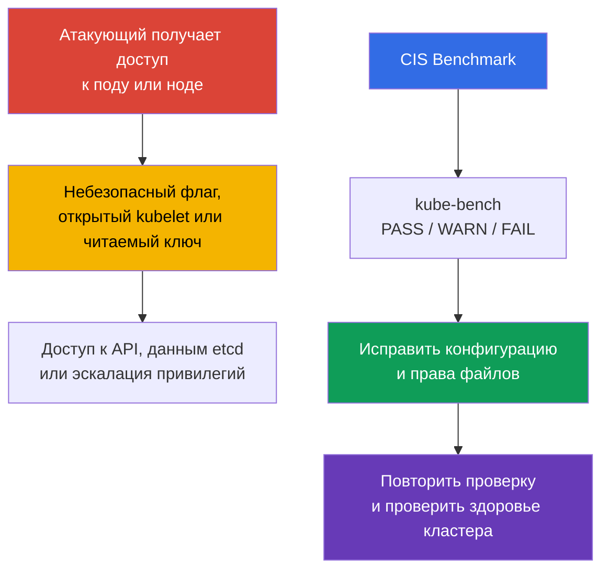
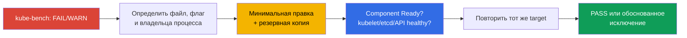

<!-- Standalone RU release: ссылки на переводы удалены, потому что соответствующие файлы не входят в архив. -->

# Глава 07. CIS Benchmark и kube-bench

> **Что дальше.** Сетевые политики ограничивают путь атакующего между workload. Теперь
> проверим, насколько безопасно настроены сами control plane и ноды. **CIS Kubernetes
> Benchmark** переводит рекомендации по hardening в проверяемые пункты, а `kube-bench`
> автоматически сопоставляет их с конфигурацией кластера. Это часть домена **Cluster Setup**
> (CKS, 15%): нужно не только найти небезопасную настройку, но и исправить её без потери
> работоспособности кластера.

> **Что нужно знать из CKA.** Эта глава не повторяет устройство `kubeadm`, static Pod и
> PKI. Перед работой вспомните [kubeadm и файлы control plane](../../../cka/course/35/ru.md)
> и [сертификаты Kubernetes](../../../cka/course/39/ru.md).

## 07.1. CIS Kubernetes Benchmark: что именно проверяем

**CIS Kubernetes Benchmark** - набор рекомендаций Center for Internet Security для
конфигурации Kubernetes. Он не заменяет модель угроз, обновления или policy, а даёт
минимальный воспроизводимый чек-лист: какие флаги, права файлов и настройки компонентов
снижают известную поверхность атаки.



Проверки сгруппированы по ролям и компонентам. Названия профилей и номера рекомендаций
меняются между версиями benchmark, поэтому ориентируйтесь на профиль, который выбрал
`kube-bench` для установленной версии Kubernetes. Версии Kubernetes и версии CIS Benchmark
не связаны один к одному: одна версия benchmark может покрывать несколько версий Kubernetes
и наоборот, а `kube-bench` умеет автоматически выбрать benchmark только тогда, когда
установленная версия Kubernetes присутствует в его опубликованной version mapping.

> **Снимок currentness на 2026-09-04.** Upstream `kube-bench` сопоставляет CIS `1.12` с
> Kubernetes `1.32-1.33` и CIS `2.0` с Kubernetes `1.34-1.35`; Kubernetes `1.36` (версия
> курса) в текущей mapping отсутствует. Перед запуском определите версию Kubernetes,
> сверьте её с актуальной [version mapping `kube-bench`](https://github.com/aquasecurity/kube-bench/blob/main/docs/platforms.md)
> и используйте только опубликованный benchmark, который её действительно покрывает. Если
> версия кластера ещё не поддерживается автоопределением, не интерпретируйте обычный
> запуск как авторитетную CIS-оценку: используйте отдельную поддерживаемую лабораторную
> версию для CIS-упражнения либо явно укажите выбранный вручную `--benchmark`.

| Раздел CIS | Что проверяется | Типовые объекты |
|---|---|---|
| Control plane / master | флаги `kube-apiserver`, `kube-controller-manager`, `kube-scheduler` | static Pod-манифесты в `/etc/kubernetes/manifests/` |
| etcd | TLS, доступ к данным, права data directory и ключей | `/etc/kubernetes/pki/etcd/`, `/var/lib/etcd` |
| Worker node | kubelet API, authentication/authorization, защита sysctl | kubelet config и systemd-аргументы |
| Policies | RBAC, ServiceAccount, NetworkPolicy, Pod Security | объекты API и настройки admission |

`PASS` означает, что инструмент увидел соответствие своему правилу. `FAIL` означает
нарушение, а `WARN` обычно означает, что проверка не смогла однозначно определить
состояние или требует ручного решения. Не исправляйте все `WARN` механически: часть
пунктов неприменима к managed control plane, альтернативному CNI или конкретной архитектуре.

## 07.2. Запуск kube-bench и чтение отчёта

Следующие команды применяйте только после подтверждения, что установленная версия
`kube-bench` имеет поддерживаемый benchmark mapping для вашего кластера: на снимке
2026-09-04 Kubernetes `1.36` в generic mapping отсутствует (см. §07.1).

Запускайте `kube-bench` на том узле, чьи файлы он должен читать. На узле control plane
обычно нужны разделы `master` и `etcd`, на worker - `node`. В учебном кластере или при SSH
доступе к ноде самый прозрачный вариант - локальный запуск:

```bash
# На узле control plane; доступные targets зависят от версии kube-bench.
sudo kube-bench run --targets master,etcd | tee kube-bench-control-plane.txt

# На рабочем узле.
sudo kube-bench run --targets node | tee kube-bench-worker.txt

# Быстро найти непрошедшие пункты и их идентификаторы.
grep -E '\[FAIL\]|\[WARN\]' kube-bench-control-plane.txt
```

Если в образе ноды нет бинаря, его можно запускать как привилегированный Pod, которому
видны host filesystem и PID namespace. Такой Pod сам является чувствительным инструментом:
используйте его только в доверенном административном namespace и удаляйте после проверки.

```yaml
apiVersion: v1
kind: Pod
metadata:
  name: kube-bench
  namespace: kube-system
spec:
  hostPID: true
  nodeName: control-plane
  restartPolicy: Never
  containers:
  - name: kube-bench
    image: aquasec/kube-bench:latest # для production зафиксируйте digest
    command: ["kube-bench", "run", "--targets", "master,etcd"]
    securityContext:
      privileged: true
    volumeMounts:
    - name: etc
      mountPath: /etc
      readOnly: true
    - name: var-lib
      mountPath: /var/lib
      readOnly: true
    - name: usr-bin
      mountPath: /usr/bin
      readOnly: true
    - name: usr-local-bin
      mountPath: /usr/local/bin
      readOnly: true
  volumes:
  - name: etc
    hostPath:
      path: /etc
  - name: var-lib
    hostPath:
      path: /var/lib
  - name: usr-bin
    hostPath:
      path: /usr/bin
  - name: usr-local-bin
    hostPath:
      path: /usr/local/bin
```

```bash
kubectl apply -f kube-bench.yaml
kubectl -n kube-system logs kube-bench | tee kube-bench-control-plane.txt
kubectl -n kube-system delete pod kube-bench
```

Читайте результат в таком порядке: зафиксируйте номер рекомендации, путь или флаг,
фактическое значение, владельца/режим файла и способ проверки после исправления. Это
важнее, чем просто увеличить число `PASS`.

| Статус | Действие |
|---|---|
| `PASS` | записать как исходное соответствие; не ослаблять при следующих изменениях |
| `FAIL` | выяснить, какой компонент и какой конфигурационный источник использует кластер, затем исправить и проверить |
| `WARN` | прочитать текст рекомендации; подтвердить вручную, задокументировать исключение или исправить |

## 07.3. kube-apiserver: минимизация опасных endpoints

`kube-apiserver` - граница управления кластером. Если он принимает анонимные запросы,
разрешает слишком широкий режим authorization, выдаёт подробные profiling endpoints или
не ведёт audit, атакующий получает больше способов узнать внутреннее состояние либо
обойти ожидаемый контроль.

В kubeadm-кластере апи-сервер обычно является static Pod. Его манифест находится в
`/etc/kubernetes/manifests/kube-apiserver.yaml`; kubelet заметит изменение файла и
пересоздаст Pod. Сначала сохраните копию и определите существующий список аргументов:

```bash
sudo install -d -m 700 /root/k8s-manifest-backup
sudo cp -p /etc/kubernetes/manifests/kube-apiserver.yaml \
  "/root/k8s-manifest-backup/kube-apiserver.yaml.$(date +%F-%H%M%S)"

sudo grep -nE -- '--(anonymous-auth|authorization-mode|audit-|profiling)' \
  /etc/kubernetes/manifests/kube-apiserver.yaml
```

Добавьте или скорректируйте аргументы в массиве `command` static Pod. Не оставляйте два
экземпляра одного флага с конфликтующими значениями.

```yaml
spec:
  containers:
  - name: kube-apiserver
    command:
    - kube-apiserver
    - --anonymous-auth=false
    - --authorization-mode=Node,RBAC
    - --profiling=false
    - --audit-policy-file=/etc/kubernetes/audit-policy.yaml
    - --audit-log-path=/var/log/kubernetes/audit/audit.log
    - --audit-log-maxage=30
    - --audit-log-maxbackup=10
    - --audit-log-maxsize=100
```

- `--anonymous-auth=false` не даёт неаутентифицированному запросу стать
  `system:anonymous`.
- `--authorization-mode=Node,RBAC` включает обычную модель авторизации для kubeadm.
  Не добавляйте `AlwaysAllow`; порядок и список modes нужно согласовать с архитектурой
  кластера.
- `--profiling=false` убирает profiling endpoints, которые могут раскрывать сведения о
  процессе и не должны быть доступны без необходимости.
- `--audit-*` подключают audit policy и сохраняют журнал. Сама policy подробно разбирается
  в главе 32; здесь важно, что отсутствие audit trail - находка CIS.

После изменения static Pod временно станет недоступен. Работайте через консоль ноды и не
перезапускайте все control-plane компоненты одновременно.

```bash
# kubelet должен автоматически пересоздать static Pod.
watch -n 2 'sudo crictl ps --name kube-apiserver'

# После восстановления API.
kubectl get --raw='/readyz?verbose'
kubectl -n kube-system get pods -l component=kube-apiserver -o wide
```

## 07.4. controller-manager и scheduler: profiling выключается везде

Частая ошибка - выключить profiling только у `kube-apiserver`. CIS проверяет этот флаг и у
`kube-controller-manager`, и у `kube-scheduler`. Оба компонента в kubeadm также обычно
работают как static Pod.

```bash
sudo install -d -m 700 /root/k8s-manifest-backup

for component in kube-controller-manager kube-scheduler; do
  sudo cp -p "/etc/kubernetes/manifests/${component}.yaml" \
    "/root/k8s-manifest-backup/${component}.yaml.$(date +%F-%H%M%S)"
  sudo grep -n -- '--profiling' "/etc/kubernetes/manifests/${component}.yaml" || true
done
```

Добавьте ровно один аргумент в `command` каждого манифеста:

```yaml
# /etc/kubernetes/manifests/kube-controller-manager.yaml
- --profiling=false
```

```yaml
# /etc/kubernetes/manifests/kube-scheduler.yaml
- --profiling=false
```

Kubelet перезапустит соответствующие static Pod. Проверяйте не только присутствие текста в
файле, но и новый работающий контейнер:

```bash
kubectl -n kube-system get pods \
  -l 'component in (kube-controller-manager,kube-scheduler)' -o wide
sudo crictl ps | grep -E 'kube-controller-manager|kube-scheduler'
```

Не путайте `--profiling=false` с отключением метрик. Метрики и profiling - разные
endpoints; решение о метриках принимают отдельно, исходя из наблюдаемости и сетевой защиты.

## 07.5. kubelet: закрытый API и защита параметров ядра

Kubelet запущен на каждой ноде и имеет полномочия выполнять Pod. Открытый read-only API,
анонимный доступ или слабая authorization позволяют получить данные ноды и в некоторых
случаях развить компрометацию. `protectKernelDefaults` запрещает kubelet стартовать, если
значения sysctl на ноде не соответствуют ожидаемым безопасным defaults: kubelet не будет
молча менять параметры ядра за администратора.

На kubeadm-ноде основной файл обычно `/var/lib/kubelet/config.yaml`, а дополнительные
аргументы задаются в `/var/lib/kubelet/kubeadm-flags.env` и systemd drop-in. Убедитесь в
реальном источнике конфигурации, а не предполагайте путь:

```bash
sudo systemctl cat kubelet
sudo ps -ef | grep '[k]ubelet'
sudo grep -nE 'readOnlyPort|anonymous:|authorization:|protectKernelDefaults' \
  /var/lib/kubelet/config.yaml
```

Для конфигурационного API kubelet задайте эквивалентные поля:

```yaml
# /var/lib/kubelet/config.yaml
readOnlyPort: 0
authentication:
  anonymous:
    enabled: false
authorization:
  mode: Webhook
protectKernelDefaults: true
```

Если в вашей установке параметр передаётся флагом, используйте его в фактически
подключённом systemd environment/drop-in, не дублируя значение между источниками:

```bash
# Пример требуемых значений в KUBELET_KUBEADM_ARGS или аналогичном источнике.
--read-only-port=0
--anonymous-auth=false
--authorization-mode=Webhook
--protect-kernel-defaults=true
```

Перед рестартом проверьте sysctl. При `protectKernelDefaults: true` kubelet может не
запуститься, если окружение управляет ожидаемыми параметрами ядра иначе. Значения и способ
их централизованной настройки определяет ОС и ваш baseline.

```bash
sudo sysctl -a 2>/dev/null | grep '^net\.ipv4\.ip_forward\|^net\.bridge\.'
sudo systemctl restart kubelet
sudo systemctl --no-pager --full status kubelet
sudo journalctl -u kubelet -n 100 --no-pager
```

Проверьте, что read-only порт действительно не слушается, а защищённый API отвечает только
с корректными credentials и authorization:

```bash
sudo ss -lntp | grep ':10255' || echo 'read-only kubelet port is closed'
sudo ss -lntp | grep ':10250'
kubectl get nodes
```

Для внешнего пользователя доступ к `10250` всё равно должен быть ограничен firewall и
сетевой топологией. `authorization-mode=Webhook` не делает порт безопасным сам по себе -
он заставляет kubelet спрашивать Kubernetes API о правах аутентифицированного субъекта.

## 07.6. etcd и файловые права: ключи не должны быть общими

etcd хранит состояние кластера: Secrets, ServiceAccount-токены, RBAC и спецификации
workload. Чтение data directory или TLS private key равнозначно серьёзной компрометации
кластера. Поэтому CIS проверяет TLS-настройки etcd, владельцев и режимы файлов.

Сначала смотрите фактического владельца процесса и файлы. В kubeadm static Pod etcd может
работать с UID `root`; в отдельной systemd-инсталляции - от пользователя `etcd`. Не меняйте
владельца data directory «по шаблону», если это лишит работающий процесс доступа.

```bash
sudo stat -c '%A %a %U:%G %n' \
  /etc/kubernetes/manifests/etcd.yaml \
  /etc/kubernetes/pki/etcd/server.crt \
  /etc/kubernetes/pki/etcd/server.key \
  /etc/kubernetes/admin.conf \
  /var/lib/etcd
sudo crictl ps --name etcd
sudo ps -eo user,group,args | grep '[e]tcd'
```

Безопасный ориентир для kubeadm-кластера: ключи доступны только root, сертификаты могут
быть читаемы, административный kubeconfig закрыт, static Pod-манифесты не могут менять
обычные пользователи. Применяйте команды только к существующим путям своего кластера.

```bash
# Private keys: секретны.
sudo chown root:root /etc/kubernetes/pki/etcd/*.key
sudo chmod 600 /etc/kubernetes/pki/etcd/*.key

# Сертификаты не содержат private key.
sudo chown root:root /etc/kubernetes/pki/etcd/*.crt
sudo chmod 644 /etc/kubernetes/pki/etcd/*.crt

# kubeconfig и static Pod-манифесты не должны быть доступны обычным пользователям.
sudo chown root:root /etc/kubernetes/admin.conf /etc/kubernetes/manifests/*.yaml
sudo chmod 600 /etc/kubernetes/admin.conf /etc/kubernetes/manifests/*.yaml
```

Для data directory выберите владельца по реальному пользователю процесса. Если etcd
запущен системным пользователем `etcd`, типовой вариант выглядит так; для kubeadm static
Pod с root этот пример не применяют без проверки.

```bash
# Только если `ps` подтверждает, что сервис etcd работает как etcd:etcd.
sudo chown -R etcd:etcd /var/lib/etcd
sudo chmod 700 /var/lib/etcd
```

Проверьте также, что etcd не слушает незащищённый client URL и использует TLS. Флаги
`--cert-file`, `--key-file`, `--trusted-ca-file`, `--client-cert-auth=true` и защищённые
`--listen-client-urls` должны быть видны в манифесте или unit. Не открывайте `2379` и `2380`
наружу: доступ к ним нужен только control plane и членам etcd cluster.

```bash
sudo grep -nE -- '--(cert-file|key-file|trusted-ca-file|client-cert-auth|listen-client-urls)' \
  /etc/kubernetes/manifests/etcd.yaml
sudo ss -lntp | grep -E ':(2379|2380)'
```

## 07.7. Повторный прогон, диагностика и доказательство исправления

Каждое изменение конфигурации состоит из четырёх шагов: изменить фактический источник,
дождаться рестарта компонента, проверить доступность кластера, затем повторить именно тот
CIS target, который сообщил о проблеме.



Минимальный набор проверок после hardening control plane:

```bash
# API server и базовые объекты доступны.
kubectl get --raw='/readyz?verbose'
kubectl get nodes
kubectl get --all-namespaces pods

# Static Pod и etcd действительно работают.
kubectl -n kube-system get pods -o wide
sudo crictl ps | grep -E 'kube-apiserver|kube-controller-manager|kube-scheduler|etcd'

# Активные значения ищем в реальном процессе, а не только в резервной копии файла.
sudo crictl ps --name kube-apiserver
sudo ps -ef | grep -E '[k]ube-apiserver|[k]ube-controller-manager|[k]ube-scheduler|[k]ubelet'

# Повторная оценка и сохранение артефакта для ревью.
sudo kube-bench run --targets master,etcd | tee kube-bench-after.txt
grep -E '\[FAIL\]|\[WARN\]' kube-bench-after.txt
```

Типичные ошибки и диагностика:

| Симптом | Вероятная причина | Что проверить |
|---|---|---|
| API недоступен после правки | ошибка YAML или неподдерживаемый флаг static Pod | `journalctl -u kubelet`, `crictl ps -a`, резервная копия манифеста |
| kubelet не поднялся после `protectKernelDefaults` | sysctl ноды не соответствует требуемому baseline | `journalctl -u kubelet`, источник sysctl и policy ОС |
| `kube-bench` продолжает показывать `FAIL` | изменён неактивный файл или указан конфликтующий флаг | `systemctl cat kubelet`, `ps`, `crictl inspect` |
| etcd не стартует после смены прав | пользователь процесса потерял доступ к data directory или key | `stat`, владельца процесса, логи etcd |
| Проверка в managed Kubernetes не проходит | control plane не принадлежит пользователю и часть рекомендаций не применима | документацию провайдера, разделить customer- и provider-owned controls |

## 07.8. Как это применяют в продакшене

- **Hardening как baseline.** Конфигурацию control plane, kubelet и права PKI описывают в
  kubeadm-конфигурации, image ноды или automation, а не правят вручную после каждого
  развёртывания.
- **Регулярный контроль дрейфа.** `kube-bench` запускают после обновления Kubernetes и
  периодически в CI/CD или отдельной security-задаче. Результат хранят как артефакт с
  версией benchmark и Kubernetes.
- **Исключения документируют.** Managed control plane, иной CNI или архитектурное решение
  могут сделать правило неприменимым. Для каждого исключения фиксируют владельца риска,
  причину и компенсирующий контроль.
- **Изменения малыми партиями.** Static Pod изменяют по одному, проверяя `/readyz` и
  перезапуск. В HA control plane соблюдают rolling-порядок и план отката.
- **Права выдаются по назначению.** Private key, kubeconfig, манифесты и data directory
  доступны только сервисному пользователю и администраторам, которым это действительно
  необходимо. Права регулярно проверяют средствами управления конфигурацией.

## 07.9. Мини-глоссарий

- **CIS Kubernetes Benchmark** - рекомендации CIS по безопасной конфигурации Kubernetes.
- **kube-bench** - инструмент, который проверяет конфигурацию по профилям CIS Benchmark.
- **static Pod** - Pod, описанный локальным манифестом ноды и запускаемый kubelet без
  управления через API.
- **profiling** - endpoints диагностики производительности процесса; без необходимости их
  отключают флагом `--profiling=false`.
- **read-only port** - неаутентифицированный порт kubelet; должен быть отключён
  `--read-only-port=0`.
- **protectKernelDefaults** - настройка kubelet, запрещающая старт при несоответствии
  sysctl baseline.
- **etcd data directory** - каталог с данными etcd, обычно `/var/lib/etcd`.
- **private key** - секретная часть TLS-идентичности; для неё нужен ограниченный режим
  доступа, обычно `0600`.

## 07.10. Итоги главы

- CIS Benchmark задаёт проверяемый baseline hardening для control plane, etcd, worker и
  политик; `kube-bench` показывает конкретные `PASS`, `WARN` и `FAIL`.
- Сначала определяют активный конфигурационный источник и владельца процесса, затем
  меняют настройки. Отчёт без повторной проверки не доказывает исправление.
- На `kube-apiserver` важны `--anonymous-auth=false`, безопасный
  `--authorization-mode`, audit и `--profiling=false`.
- `--profiling=false` нужен на всех трёх компонентах control plane: apiserver,
  controller-manager и scheduler.
- Для kubelet нужны `--read-only-port=0`, `--anonymous-auth=false`,
  `--authorization-mode=Webhook` и `--protect-kernel-defaults=true` либо их эквиваленты
  в `config.yaml`.
- etcd data directory, PKI private keys, kubeconfig и static Pod-манифесты требуют
  минимальных прав. Владельца `/var/lib/etcd` определяют по реальному пользователю
  процесса.

## 07.11. Как это пригодится: на экзамене и в реальной работе

**На экзамене.** Задание обычно называет один или несколько `FAIL` из `kube-bench` и даёт
доступ к ноде. Быстро найдите, является ли компонент static Pod, kubelet service или etcd,
сделайте резервную копию, исправьте активный файл, дождитесь рестарта и докажите результат.
Запомните особенно частые пункты: profiling на трёх компонентах, kubelet
`protect-kernel-defaults`, закрытый read-only port, anonymous access и режимы файлов.

**В реальной работе.** CIS - полезный общий язык между platform и security-командами, но не
замена архитектурному анализу. Он помогает обнаруживать дрейф конфигурации до инцидента,
а воспроизводимые проверки и документированные исключения делают обновления кластера
предсказуемыми.

## 07.12. Вопросы для самопроверки

1. Чем `WARN` в отчёте `kube-bench` отличается от `FAIL` и почему их нельзя исправлять
   одинаково?
2. Почему для исправления static Pod недостаточно только изменить файл и не проверить
   новый контейнер?
3. На каких трёх компонентах control plane нужен `--profiling=false`?
4. Какие четыре настройки kubelet из этой главы закрывают его API и защищают sysctl
   baseline?
5. Почему перед `chown -R /var/lib/etcd` нужно узнать пользователя процесса etcd?
6. Какие права уместны для TLS private key и почему сертификат можно читать шире?
7. Какими командами вы докажете, что после исправления API, etcd и kubelet здоровы?

## Практика

В [лабе 103](../../labs/103/README_RU.MD) вы запустите `kube-bench`, сохраните отчёт,
исправите настройки kubelet и `kube-apiserver`, настроите TLS для Ingress и проверите хеш
бинарника. Из-за правки static Pod и системных конфигураций выполняйте задания с консоли
контрольной ноды и проверяйте состояние кластера после каждого шага.

Дополнительно: [CIS Kubernetes Benchmark](https://www.cisecurity.org/benchmark/kubernetes)
и [kube-bench](https://github.com/aquasecurity/kube-bench) - первоисточники профилей и
пояснений к проверкам.

---
[Оглавление](../README_RU.md) · [Глава 06](../06/ru.md) · [Глава 08](../08/ru.md)
