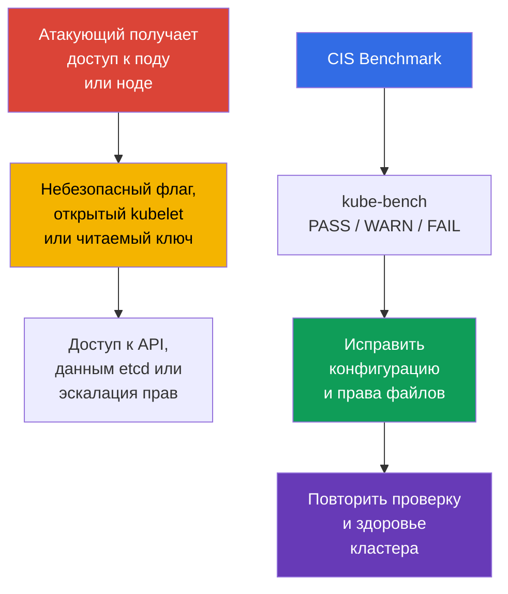
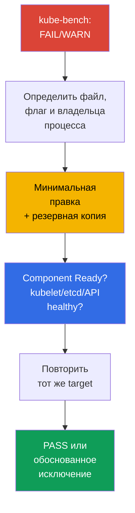

<!-- Standalone RU release: ссылки на переводы удалены, потому что соответствующие файлы не входят в архив. -->

# Глава 07. CIS Benchmark и kube-bench

> **Проблема.** Кластер редко ломают через уязвимость в самом Kubernetes: обычно
> атакующий, уже получивший доступ к Pod или ноде, находит рядом небезопасную мелочь -
> лишний открытый порт, слабый флаг компонента, читаемый всем ключ. По отдельности такие
> детали незаметны, но вместе они дают путь к API без проверки, к секретам в etcd или к
> эскалации прав на ноде - и ни одна из них не видна из кода приложения.

> **Что дальше.** Сетевые политики ограничивают путь атакующего между workload. Теперь
> проверим, насколько безопасно настроены сами control plane и ноды. **CIS Kubernetes
> Benchmark** переводит рекомендации по hardening в проверяемые пункты, а `kube-bench`
> автоматически сопоставляет их с конфигурацией кластера. Это часть домена **Cluster Setup**
> (CKS, 15%): нужно не только найти небезопасную настройку, но и исправить её без потери
> работоспособности кластера.

> **Что нужно знать из CKA.** Эта глава не повторяет устройство `kubeadm`, static Pod и
> PKI. Перед работой вспомните [kubeadm и файлы control plane](../../../cka/course/35/ru.md)
> и [сертификаты Kubernetes](../../../cka/course/39/ru.md).

## 07.1. CIS Kubernetes Benchmark: что именно проверяем

**CIS Kubernetes Benchmark** - набор рекомендаций Center for Internet Security для
конфигурации Kubernetes. Он не заменяет модель угроз, обновления или policy, а даёт
минимальный воспроизводимый чек-лист: какие флаги, права файлов и настройки компонентов
снижают известную поверхность атаки.



Проверки сгруппированы по ролям и компонентам. Названия профилей и номера рекомендаций
меняются между версиями benchmark, поэтому ориентируйтесь на профиль, который выбрал
`kube-bench` для установленной версии Kubernetes. Версии Kubernetes и версии CIS Benchmark
не связаны один к одному: одна версия benchmark может покрывать несколько версий Kubernetes
и наоборот, а `kube-bench` умеет автоматически выбрать benchmark только тогда, когда
установленная версия Kubernetes присутствует в его опубликованной version mapping.

> **Снимок currentness на 2026-09-08.** В `docs/platforms.md` ветки `main` kube-bench
> опубликована таблица: CIS `1.12` для Kubernetes `1.32-1.33` и CIS `2.0` для Kubernetes
> `1.34-1.35`.
>
> Однако published support table нужно отличать от содержимого конкретного релиза
> kube-bench. Например, закреплённый ниже `v0.16.0` ещё не содержит `cfg/cis-2.0`: его
> bundled `cfg/config.yaml` сопоставляет Kubernetes `1.34` с `cis-1.12`, а mapping для
> `1.35` отсутствует.
>
> Поэтому перед запуском проверяйте не только `docs/platforms.md`, но и сам
> `cfg/config.yaml` и наличие нужного каталога `cfg/<benchmark>` именно в используемом
> tag/image. Не считайте профиль поддерживаемым конкретным релизом только потому, что он
> уже указан в документации ветки `main`. Если версия кластера отсутствует в mapping
> закреплённого релиза, не считайте принудительный `--benchmark` авторитетной CIS-оценкой:
> `--benchmark` меняет только набор применяемых тестов, но не делает его валидным для
> непокрытой версии.
>
> Если цель лаборатории - получить детерминированную оценку на версии Kubernetes, которую
> `kube-bench:v0.16.0` реально покрывает своим bundled mapping, используйте Kubernetes
> `1.33` + `cis-1.12`.
>
> Связанная с этой главой Lab103 намеренно использует training baseline Kubernetes
> `1.36.0`, которого `v0.16.0` не покрывает. Там `cis-1.12` запускается принудительно
> только как `forced-approximate` учебный сценарий: результат полезен для практики
> remediation, но не является authoritative CIS compliance для Kubernetes `1.36`.

| Раздел CIS | Что проверяется | Типовые объекты |
|---|---|---|
| Control plane / master | флаги `kube-apiserver`, `kube-controller-manager`, `kube-scheduler` | static Pod-манифесты в `/etc/kubernetes/manifests/` |
| etcd | TLS, доступ к данным, права data directory и ключей | `/etc/kubernetes/pki/etcd/`, `/var/lib/etcd` |
| Worker node | kubelet API, authentication/authorization, защита sysctl | kubelet config и systemd-аргументы |
| Policies | RBAC, ServiceAccount, NetworkPolicy, Pod Security | объекты API и настройки admission |

`PASS` означает, что инструмент увидел соответствие своему правилу. `FAIL` означает
нарушение, а `WARN` обычно означает, что проверка не смогла однозначно определить
состояние или требует ручного решения. Не исправляйте все `WARN` механически: часть
пунктов неприменима к managed control plane, альтернативному CNI или конкретной архитектуре.

## 07.2. Запуск kube-bench и чтение отчёта

Следующие команды применяйте только после подтверждения, что установленная версия
`kube-bench` имеет поддерживаемый benchmark mapping для вашего кластера: на снимке
2026-09-08 Kubernetes `1.36` в generic mapping отсутствует (см. §07.1).

Запускайте `kube-bench` на том узле, чьи файлы он должен читать. На узле control plane
обычно нужны разделы `master` и `etcd`, на worker - `node`. В учебном кластере или при SSH
доступе к ноде самый прозрачный вариант - локальный запуск:

```bash
# На узле control plane; доступные targets зависят от версии kube-bench.
sudo kube-bench run --targets master,etcd | tee kube-bench-control-plane.txt

# На рабочем узле.
sudo kube-bench run --targets node | tee kube-bench-worker.txt

# Быстро найти непрошедшие пункты и их идентификаторы.
grep -E '\[FAIL\]|\[WARN\]' kube-bench-control-plane.txt

# После исправления повторите check ID из отчёта, а не весь target.
# Синтаксис подтвердите через `kube-bench run --help` вашей версии.
sudo kube-bench run --targets master --check 1.2.1
```

Если бинарник `kube-bench` не установлен непосредственно на ноду, его альтернативно можно
запустить в Pod/Job с `hostPID` и необходимыми `hostPath`-монтированиями конфигурации и
данных компонентов; готовые примеры есть в upstream-репозитории `kube-bench`. Такой запуск
проверяет только те ноды, на которые Pod можно запланировать и чьи host namespaces/файлы
ему доступны. В managed Kubernetes это обычно позволяет проверять доступные worker-ноды,
но не provider-owned control plane GKE/EKS/AKS/ACK: сам по себе доступ к Kubernetes API не
делает control-plane checks доступными.

В этой главе кластер считается поднятым `kubeadm` с прямым доступом к нодам, поэтому далее
используется именно локальный запуск.

Читайте результат в таком порядке: зафиксируйте номер рекомендации, путь или флаг,
фактическое значение, владельца/режим файла и способ проверки после исправления. Это
важнее, чем просто увеличить число `PASS`.

| Статус | Действие |
|---|---|
| `PASS` | записать как исходное соответствие; не ослаблять при следующих изменениях |
| `FAIL` | выяснить, какой компонент и какой конфигурационный источник использует кластер, затем исправить и проверить |
| `WARN` | прочитать текст рекомендации; подтвердить вручную, задокументировать исключение или исправить |

Именно этот цикл - запустить `kube-bench`, найти конкретный `FAIL`/`WARN` в своём отчёте,
исправить и перепроверить - и есть рабочий процесс всей главы. Набор находок у каждого
кластера свой: он зависит от способа развёртывания, дистрибутива kubeadm,
версий компонентов и уже применённого hardening. Поэтому дальше в главе не идёт по номерам
CIS-рекомендаций подряд, а разбирает по одному разделу на каждый компонент control plane и
ноды (`kube-apiserver`, `kube-controller-manager` и `kube-scheduler`, `kubelet`, `etcd`)
- как наиболее частые категории находок в реальных отчётах `kube-bench` и как их безопасно
исправить, а не исчерпывающий список всех возможных пунктов benchmark.

## 07.3. Пример: находим и исправляем FAIL у kube-apiserver

`kube-apiserver` в kubeadm-кластере запускается как static Pod: kubelet следит за
манифестом `/etc/kubernetes/manifests/kube-apiserver.yaml` на диске control-plane узла и
автоматически пересоздаёт Pod при его изменении. Поэтому редактируется именно этот файл,
а не объект Pod через `kubectl`.

Инструкцию по исправлению не нужно придумывать - её даёт сам `kube-bench` в отчёте.
Каждый `FAIL` сопровождается собственным пунктом в секции `== Remediations ==`, например:

```text
[FAIL] 1.2.15 Ensure that the --profiling argument is set to false (Automated)
...
== Remediations master ==
1.2.15 Edit the API server pod specification file
/etc/kubernetes/manifests/kube-apiserver.yaml on the master node and set the
below parameter.
--profiling=false
```

Remediation указывает точный файл и точный флаг. Перед правкой сохраните резервную копию
**вне** `/etc/kubernetes/manifests/`: kubelet читает все файлы этого каталога, чьё имя не
начинается с точки, независимо от расширения, и может попытаться создать static Pod из
случайно оставленной рядом копии - при совпадении имени Pod поведение неопределено и
устаревшая спецификация из backup может тихо победить актуальный manifest.

```bash
sudo install -d -m 0700 /etc/kubernetes/backup
sudo cp -a /etc/kubernetes/manifests/kube-apiserver.yaml \
  "/etc/kubernetes/backup/kube-apiserver.yaml.$(date +%Y%m%d%H%M%S)"
```

Добавьте флаг из remediation в массив `command` static Pod, сохраните файл и подождите,
пока kubelet пересоздаст Pod:

```bash
# kubelet должен автоматически пересоздать static Pod.
watch -n 2 'sudo crictl ps --name kube-apiserver'

# После восстановления API.
kubectl get --raw='/readyz?verbose'
kubectl -n kube-system get pods -l component=kube-apiserver -o wide

# Перепроверить именно этот check, а не весь target заново.
sudo kube-bench run --targets master --check 1.2.15
```

## 07.4. Пример: находим и исправляем FAIL у kube-scheduler

Проверка отключения profiling есть у всех трёх основных control-plane компонентов, но её
ID зависит от раздела benchmark. В `kube-bench v0.16.0 / cis-1.12` это:

- `1.2.15` - `kube-apiserver`;
- `1.3.2` - `kube-controller-manager`;
- `1.4.1` - `kube-scheduler`.

Все три относятся к target `master`, а не `node`. Например, для scheduler:

```text
[FAIL] 1.4.1 Ensure that the --profiling argument is set to false (Automated)
...
== Remediations master ==
1.4.1 Edit the Scheduler pod specification file
/etc/kubernetes/manifests/kube-scheduler.yaml on the master node and set the
below parameter.
--profiling=false
```

Применяется тот же процесс, что и в 07.3: отредактировать манифест
`/etc/kubernetes/manifests/kube-scheduler.yaml`, дождаться пересоздания static Pod,
перепроверить `sudo kube-bench run --targets master --check 1.4.1`.

Но сначала проверьте, не запущен ли `kube-scheduler` с `--config=<path>`. Если `--config`
задан, CLI-флаг `--profiling` deprecated и игнорируется runtime; effective настройка
находится в `KubeSchedulerConfiguration`:

```yaml
apiVersion: kubescheduler.config.k8s.io/v1
kind: KubeSchedulerConfiguration
enableProfiling: false
```

У `kube-bench v0.16.0 / cis-1.12` есть ограничение: check `1.4.1` анализирует process
command line и не читает `KubeSchedulerConfiguration`. Поэтому при scheduler с `--config`
результат `1.4.1` нельзя считать самостоятельным доказательством effective profiling
state: правильный config может дать `FAIL`, а игнорируемый `--profiling=false` -
формальный `PASS`. В таком случае отдельно проверьте активный файл `--config`, убедитесь,
что `enableProfiling: false`, проверьте здоровье scheduler и зафиксируйте расхождение
`kube-bench` как ограничение используемого benchmark/tool version. Не добавляйте
игнорируемый CLI-флаг только ради получения `PASS`.

У `kube-controller-manager` `--profiling` остаётся штатным CLI-флагом, поэтому его находка
(`1.3.2`) чинится ровно как в 07.3, без этой оговорки.

Ровно тот же цикл - запустить `kube-bench`, найти `FAIL`, отредактировать манифест,
проверить - выполняется и на worker-нодах, только с targets и набором флагов `node`
(`kubelet`, а не control-plane компоненты). Раздел 07.5 разбирает именно эту находку.

**На экзамене скорость важнее полноты.** Типичное задание CKS формулируется как «в
отчёте kube-bench для kube-apiserver/kubelet есть FAIL по такому-то ID - исправьте его»,
и оценивается именно факт исправления, а не общий обзор всех находок. Быстрый алгоритм:
открыть `== Remediations ==` для конкретного ID → определить, static Pod это или
systemd-сервис (kubelet) → отредактировать нужный файл → дождаться перезапуска →
перепроверить тем же `--check <ID>`, а не всем target заново.

**Если после правки компонент не стартовал.** Ошибка в аргументе или в YAML манифеста
статик-пода не блокирует редактирование - она блокирует запуск нового Pod. Типичные
причины: опечатка в имени флага, конфликтующий дубликат аргумента, несуществующий путь к
файлу, на который ссылается флаг. Порядок восстановления:

1. Проверить, что реально происходит: `sudo crictl ps -a --name <component>` и
   `sudo journalctl -u kubelet -n 100 --no-pager` - kubelet логирует причину, по которой
   он не может запустить static Pod из нового манифеста.
2. Если причина не находится быстро, откатить правку резервной копией манифеста - это
   быстрее, чем разбирать сложный YAML под давлением времени на экзамене.
3. После восстановления повторить правку точнее и снова дождаться `Ready`, прежде чем
   переходить к следующей находке.

## 07.5. kubelet: закрытый API и защита параметров ядра

Kubelet запущен на каждой ноде и имеет полномочия выполнять Pod. Открытый read-only API,
анонимный доступ или слабая authorization позволяют получить данные ноды и в некоторых
случаях развить компрометацию. `protectKernelDefaults: true` заставляет kubelet завершить
инициализацию ошибкой, если kernel flags, которые kubelet ожидает для своей работы, имеют
другие значения. При `protectKernelDefaults: false` kubelet пытается привести эти
параметры к ожидаемым значениям самостоятельно.

На kubeadm-ноде основной файл обычно `/var/lib/kubelet/config.yaml`, а дополнительные
аргументы задаются в `/var/lib/kubelet/kubeadm-flags.env` и systemd drop-in. В Kubernetes
1.36 также проверьте `--config-dir`: kubelet применяет основной config, затем только
файлы `*.conf` из этого каталога (включая подкаталоги) в лексическом порядке; `*.yaml`
там не загружаются. CLI-флаги имеют более высокий приоритет. Убедитесь в реальном источнике
конфигурации, а не предполагайте путь:

```bash
sudo systemctl cat kubelet
sudo ps -ef | grep '[k]ubelet'

# Из фактического ExecStart/process определите значения --config и --config-dir.
# Не подставляйте kubeadm-пути, если процесс использует другие.
KUBELET_CONFIG='<фактическое значение --config>'
KUBELET_CONFIG_DIR='<фактическое значение --config-dir или пустая строка>'

if [[ -n "$KUBELET_CONFIG" ]]; then
  sudo grep -nE \
    'readOnlyPort|anonymous:|authorization:|protectKernelDefaults' \
    "$KUBELET_CONFIG"
else
  echo 'kubelet запущен без --config: учитывайте built-in defaults, drop-ins и CLI flags'
fi

if [[ -n "$KUBELET_CONFIG_DIR" ]]; then
  sudo find "$KUBELET_CONFIG_DIR" -type f -name '*.conf' -print
fi
```

Если `--config` отсутствует, не назначайте ему путь по умолчанию: kubelet использует
built-in defaults, затем `--config-dir` (если задан), после чего CLI flags могут
переопределить итоговые значения. Для доказательства effective state в конце всё равно
сверьте `/configz`.

Для конфигурационного API kubelet задайте эквивалентные поля:

```yaml
# /var/lib/kubelet/config.yaml
readOnlyPort: 0
authentication:
  anonymous:
    enabled: false
authorization:
  mode: Webhook
protectKernelDefaults: true
```

Если в вашей установке параметр передаётся флагом, добавьте его в фактически подключённый
systemd environment/drop-in, не дублируя значение между источниками. Ниже не shell-команды,
а требуемые фрагменты аргументов kubelet:

```text
--read-only-port=0
--anonymous-auth=false
--authorization-mode=Webhook
--protect-kernel-defaults=true
```

Перед рестартом проверьте sysctl. Для Kubernetes 1.36 ожидаемые kubelet значения -
`1`, `0`, `10`, `1`, `1000000` и `25000000` соответственно. Не меняйте их вслепую: сначала
установите, какой sysctl source управляет нодой, затем приведите его к согласованному
baseline и только после этого перезапускайте kubelet.

```bash
# Kubernetes 1.36: параметры, которые kubelet проверяет в setupKernelTunables().
sudo sysctl \
  vm.overcommit_memory \
  vm.panic_on_oom \
  kernel.panic \
  kernel.panic_on_oops \
  kernel.keys.root_maxkeys \
  kernel.keys.root_maxbytes

# После проверки/приведения параметров к baseline вашей ОС и Kubernetes:
sudo systemctl restart kubelet
sudo systemctl --no-pager --full status kubelet
sudo journalctl -u kubelet -n 100 --no-pager
```

Проверьте, что read-only порт действительно не слушается, а защищённый API отвечает только
с корректными credentials и authorization. В конце сверяйте не только файлы: `/configz`
показывает итоговую конфигурацию после base config, `*.conf` drop-ins и CLI overrides.
Для этого запрос должен быть авторизован для kubelet API (например, административным
kubeconfig через API-server proxy):

```bash
sudo ss -lntp | grep ':10255' || echo 'read-only kubelet port is closed'
sudo ss -lntp | grep ':10250'
kubectl get nodes

NODE="${NODE:?set target node name from kubectl get nodes}"
kubectl get --raw "/api/v1/nodes/${NODE}/proxy/configz" \
  | jq '.kubeletconfig | {readOnlyPort, authentication, authorization, protectKernelDefaults}'
```

Для внешнего пользователя доступ к `10250` всё равно должен быть ограничен firewall и
сетевой топологией. `authorization-mode=Webhook` не делает порт безопасным сам по себе -
он заставляет kubelet спрашивать Kubernetes API о правах аутентифицированного субъекта.

## 07.6. Пример: находим и исправляем FAIL у etcd

etcd хранит persistent state Kubernetes API: Secrets, RBAC, конфигурацию и спецификации
workload. Чтение data directory или TLS private key равнозначно серьёзной компрометации
кластера, поэтому CIS отдельно проверяет владельца и права файлов etcd.

```text
[FAIL] 1.1.12 Ensure that the etcd data directory ownership is set to etcd:etcd (Automated)
...
== Remediations master ==
1.1.12 On the etcd server node, get the etcd data directory, passed as an argument
--data-dir, from the below command:
ps -ef | grep etcd
Run the below command (based on the etcd data directory found above).
For example, chown etcd:etcd /var/lib/etcd
```

Remediation прямо говорит: сначала определить фактический data directory через `ps`, а
затем привести его ownership к `etcd:etcd`. Команда `ps` здесь нужна именно для того,
чтобы найти реальный `--data-dir`, а не для того, чтобы вывести из неё ожидаемого
владельца - сам check `1.1.12` требует literal `etcd:etcd` независимо от того, каким
пользователем реально запущен процесс.

Это требование нужно отделять от runtime identity конкретной установки. В обычном kubeadm
control plane static Pod'ы по умолчанию запускаются от `root`; при `RootlessControlPlane`
kubeadm использует отдельную non-root identity (для etcd - `kubeadm-etcd`). Поэтому перед
изменением ownership проверьте фактический data directory, применимость выбранного CIS
profile к вашей установке и наличие нужного account/group mapping `etcd`/`etcd` на host -
не заменяйте literal requirement benchmark пользователем процесса.

Если среда должна удовлетворять именно этому check и mapping `etcd:etcd` для host валиден,
применяйте минимальную remediation к самому каталогу и перепроверяйте именно её:

```bash
# Определите фактический --data-dir из процесса/манифеста.
sudo ps -ef | grep '[e]tcd'
DATA_DIR=/var/lib/etcd   # замените на реально найденное значение

sudo stat -c '%A %a %U:%G %n' "$DATA_DIR"
getent passwd etcd
getent group etcd

# Только если выбранный benchmark применим и mapping etcd:etcd валиден для host.
sudo chown etcd:etcd "$DATA_DIR"

# Перепроверить именно этот check (target master, а не etcd).
sudo kube-bench run --targets master --check 1.1.12
```

Права доступа - отдельный check `1.1.11` ("permissions 700 или более строгие"); если
исправляется и он, применяйте и перепроверяйте отдельно:

```bash
sudo chmod 700 "$DATA_DIR"
sudo kube-bench run --targets master --check 1.1.11
```

Тот же принцип «remediation даёт команду, но применяют её после проверки фактического
data directory и применимости профиля» относится и к соседним находкам CIS про etcd -
права и владельца pod spec-файла (`/etc/kubernetes/manifests/etcd.yaml`) и TLS-ключей
(`/etc/kubernetes/pki/etcd/*.key`). Не открывайте `2379`/`2380` наружу и не переносите
пример один в один в managed-кластер, где data directory и процесс etcd вам не принадлежат.

## 07.7. Повторный прогон, диагностика и доказательство исправления

Для каждого `FAIL` или осознанного `WARN` действуйте по короткой процедуре: (1)
зафиксируйте версию Kubernetes, версию или digest `kube-bench`, выбранный профиль и CIS
check ID из отчёта; (2) сделайте резервную копию активного файла или объекта - для
filesystem-hosted static Pod храните backup **вне `staticPodPath`**: kubelet не
фильтрует файлы этого каталога по расширению и может обработать `.backup` как ещё один
manifest; (3) измените
ровно один control; (4) дождитесь рестарта и проверьте здоровье компонента и кластера;
(5) повторите только затронутый target или check (например, `kube-bench run --targets master --check <ID>` для версии, поддерживающей этот синтаксис); (6) при ошибке здоровья немедленно
верните резервную копию, дождитесь восстановления и повторите health check. Не объявляйте
исправление успешным, пока не проверены здоровье компонента, effective конфигурация и
targeted rerun. Если конкретный check `kube-bench` проверяет не тот конфигурационный
источник, который реально использует компонент (как в примере scheduler с `--config` из
07.4), зафиксируйте это как ограничение инструмента и не подменяйте effective-state
verification формальным `PASS`.

В self-managed кластере эта процедура относится к control plane, нодам и их файлам, за
которые отвечает оператор. В managed Kubernetes provider обычно владеет control plane:
не пытайтесь обходить это через hostPath или прямую правку, а сверяйте provider-owned
контроли с документацией и фиксируйте customer-/provider-owned ответственность.



Минимальный набор проверок после hardening control plane:

```bash
# API server и базовые объекты доступны.
kubectl get --raw='/readyz?verbose'
kubectl get nodes
kubectl get --all-namespaces pods

# Static Pod и etcd действительно работают.
kubectl -n kube-system get pods -o wide
sudo crictl ps | grep -E 'kube-apiserver|kube-controller-manager|kube-scheduler|etcd'

# Активные значения ищем в реальном процессе, а не только в резервной копии файла.
sudo crictl ps --name kube-apiserver
sudo ps -ef | grep -E '[k]ube-apiserver|[k]ube-controller-manager|[k]ube-scheduler|[k]ubelet'

# Повторная оценка и сохранение артефакта для ревью.
sudo kube-bench run --targets master,etcd | tee kube-bench-after.txt
grep -E '\[FAIL\]|\[WARN\]' kube-bench-after.txt
```

Типичные ошибки и диагностика:

| Симптом | Вероятная причина | Что проверить |
|---|---|---|
| API недоступен после правки | ошибка YAML или неподдерживаемый флаг static Pod | `journalctl -u kubelet`, `crictl ps -a`, резервная копия манифеста |
| kubelet не поднялся после `protectKernelDefaults` | sysctl ноды не соответствует требуемому baseline | `journalctl -u kubelet`, источник sysctl и policy ОС |
| `kube-bench` продолжает показывать `FAIL` | изменён неактивный файл или указан конфликтующий флаг | `systemctl cat kubelet`, `ps`, `crictl inspect` |
| etcd не стартует после смены прав | пользователь процесса потерял доступ к data directory или key | `stat`, владельца процесса, логи etcd |
| Проверка в managed Kubernetes не проходит | control plane не принадлежит пользователю и часть рекомендаций не применима | документацию провайдера, разделить customer- и provider-owned controls |

## 07.8. Как это применяют в продакшене

- **Hardening как baseline.** Конфигурацию control plane, kubelet и права PKI описывают в
  kubeadm-конфигурации, image ноды или automation, а не правят вручную после каждого
  развёртывания.
- **Регулярный контроль дрейфа.** `kube-bench` запускают после обновления Kubernetes и
  периодически в CI/CD или отдельной security-задаче. Результат хранят как артефакт с
  версией benchmark и Kubernetes.
- **Исключения документируют.** Managed control plane, иной CNI или архитектурное решение
  могут сделать правило неприменимым. Для каждого исключения фиксируют владельца риска,
  причину и компенсирующий контроль.
- **Изменения малыми партиями.** Static Pod изменяют по одному, проверяя `/readyz` и
  перезапуск. В HA control plane соблюдают rolling-порядок и план отката.
- **Права выдаются по назначению.** Private key, kubeconfig, манифесты и data directory
  доступны только сервисному пользователю и администраторам, которым это действительно
  необходимо. Права регулярно проверяют средствами управления конфигурацией.

## 07.9. Мини-глоссарий

- **CIS Kubernetes Benchmark** - рекомендации CIS по безопасной конфигурации Kubernetes.
- **kube-bench** - инструмент, который проверяет конфигурацию по профилям CIS Benchmark.
- **static Pod** - Pod, описанный локальным манифестом ноды и запускаемый kubelet без
  управления через API.
- **profiling** - endpoints диагностики производительности процесса; их отключают через
  активный конфигурационный источник компонента. Для `kube-scheduler` с `--config` это
  `enableProfiling: false` в `KubeSchedulerConfiguration`, а не CLI-флаг `--profiling`.
- **read-only port** - неаутентифицированный порт kubelet; должен быть отключён
  `--read-only-port=0`.
- **protectKernelDefaults** - настройка kubelet, запрещающая старт при несоответствии
  sysctl baseline.
- **etcd data directory** - каталог с данными etcd, обычно `/var/lib/etcd`.
- **private key** - секретная часть TLS-идентичности; для неё нужен ограниченный режим
  доступа, обычно `0600`.

## 07.10. Итоги главы

- CIS Benchmark задаёт проверяемый baseline hardening для control plane, etcd, worker и
  политик; `kube-bench` показывает конкретные `PASS`, `WARN` и `FAIL`.
- Сначала определяют активный конфигурационный источник и владельца процесса, затем
  меняют настройки. Отчёт без повторной проверки не доказывает исправление.
- На `kube-apiserver` важно минимизировать anonymous-доступ с учётом health probes и
  kubeadm discovery, использовать безопасную authorization, audit и `--profiling=false`.
  Не применяйте `--anonymous-auth=false` механически без проверки lifecycle кластера.
- profiling должен быть отключён на `kube-apiserver`, `kube-controller-manager` и
  `kube-scheduler`, но активный способ настройки зависит от компонента: для
  `kube-scheduler` при `--config` проверяйте `enableProfiling: false` в
  `KubeSchedulerConfiguration`, а не CLI-флаг `--profiling`.
- Для kubelet нужны `--read-only-port=0`, `--anonymous-auth=false`,
  `--authorization-mode=Webhook` и `--protect-kernel-defaults=true` либо их эквиваленты
  в `config.yaml`.
- etcd data directory, PKI private keys, kubeconfig и static Pod-манифесты требуют
  минимальных прав. Для CIS check сначала определяют фактический data directory, затем
  применяют именно требуемые benchmark ownership/permissions с учётом применимости
  профиля и runtime-модели конкретной установки.

## 07.11. Как это пригодится: на экзамене и в реальной работе

**На экзамене.** Задание обычно называет один или несколько `FAIL` из `kube-bench` и даёт
доступ к ноде. Быстро найдите, является ли компонент static Pod, kubelet service или etcd,
сделайте резервную копию, исправьте активный файл, дождитесь рестарта и докажите результат.
Запомните особенно частые пункты: profiling на трёх компонентах, kubelet
`protect-kernel-defaults`, закрытый read-only port, anonymous access и режимы файлов.

**В реальной работе.** CIS - полезный общий язык между platform и security-командами, но не
замена архитектурному анализу. Он помогает обнаруживать дрейф конфигурации до инцидента,
а воспроизводимые проверки и документированные исключения делают обновления кластера
предсказуемыми.

## 07.12. Вопросы для самопроверки

<details>
<summary>1. Чем `WARN` в отчёте `kube-bench` отличается от `FAIL` и почему их нельзя исправлять одинаково?</summary>

`FAIL` означает, что инструмент обнаружил нарушение своего правила, а `WARN` обычно говорит, что состояние нельзя определить однозначно или нужно ручное решение. Для `WARN` читают текст рекомендации, подтверждают применимость к managed control plane, CNI или архитектуре и затем документируют исключение либо исправляют его, а не меняют все пункты механически.
</details>

<details>
<summary>2. Почему для исправления static Pod недостаточно только изменить файл и не проверить новый контейнер?</summary>

Kubelet должен заметить изменение манифеста и пересоздать static Pod, но YAML-ошибка или неподдерживаемый флаг могут оставить control plane недоступным. После правки проверяют новый контейнер через `crictl ps`, доступность API через `kubectl get --raw='/readyz?verbose'` и targeted rerun затронутого check.
</details>

<details>
<summary>3. На каких компонентах control plane нужно отключить profiling, и одинаков ли способ настройки?</summary>

Profiling должен быть отключён на `kube-apiserver`, `kube-controller-manager` и `kube-scheduler`: нельзя ограничиться apiserver, CIS проверяет profiling endpoints всех трёх компонентов. Способ настройки не всегда одинаковый: `kube-apiserver` и `kube-controller-manager` используют CLI-флаг `--profiling=false`, но у `kube-scheduler` этот флаг deprecated - если он запущен с `--config=<path>`, отключать profiling нужно через `enableProfiling: false` в `KubeSchedulerConfiguration`, а не через CLI. Отключение profiling не тождественно отключению метрик.
</details>

<details>
<summary>4. Какие четыре настройки kubelet из этой главы закрывают его API и защищают sysctl baseline?</summary>

Это `--read-only-port=0`, `--anonymous-auth=false`, `--authorization-mode=Webhook` и `--protect-kernel-defaults=true` либо эквивалентные поля `config.yaml`. Перед включением `protectKernelDefaults` проверяют sysctl: при несоответствии baseline kubelet может не запуститься.
</details>

<details>
<summary>5. Почему пользователя процесса etcd нельзя автоматически считать требуемым владельцем data directory в CIS check?</summary>

CIS check задаёт собственное ожидаемое ownership (`etcd:etcd`), а `ps` в remediation используется прежде всего для определения фактического `--data-dir`. Runtime identity зависит от реализации: обычный kubeadm control plane по умолчанию запускает etcd от `root`, а rootless-вариант использует отдельную identity. Поэтому сначала проверяют data directory, применимость benchmark и UID/GID mapping, а затем выполняют точную remediation; process user не подменяет requirement самого check.
</details>

<details>
<summary>6. Какие права уместны для TLS private key и почему сертификат можно читать шире?</summary>

Private key - секретный материал, поэтому ему нужен максимально ограниченный доступ; типичный baseline - mode `0600`. Владелец не универсален: в обычной root-run kubeadm установке это часто `root:root`, а при non-root control plane ключ должен принадлежать той service identity, которой он реально нужен - механическая смена владельца на `root:root` без проверки runtime identity может лишить такой процесс доступа к собственному ключу.

Если проверяется конкретный CIS control, отдельно сверяйте его literal requirement: например, `cis-1.12` check `1.1.19` ожидает `root:root` для Kubernetes PKI, и это требование конкретного benchmark, а не универсальное правило для любой runtime-модели.

Сертификат содержит публичную часть TLS-идентичности, поэтому mode `0644` часто допустим; его ownership и фактические пути всё равно сверяют с deployment и выбранным benchmark.
</details>

<details>
<summary>7. Какими командами вы докажете, что после исправления API, etcd и kubelet здоровы?</summary>

Для API и объектов используют `kubectl get --raw='/readyz?verbose'`, `kubectl get nodes` и `kubectl get --all-namespaces pods`. Static Pod и etcd проверяют `kubectl -n kube-system get pods -o wide` и `sudo crictl ps`, kubelet — `sudo systemctl status kubelet` и `journalctl -u kubelet`; затем повторяют нужный target или check `kube-bench`.
</details>

## Практика

В [лабе 103](../../labs/103/README_RU.MD) вы запустите `kube-bench`, сохраните отчёт,
исправите настройки kubelet и `kube-apiserver`, настроите TLS для Ingress и проверите хеш
бинарника. Из-за правки static Pod и системных конфигураций выполняйте задания с консоли
контрольной ноды и проверяйте состояние кластера после каждого шага.

🌐 Дополнительная интерактивная практика (killer.sh/killercoda, внешний ресурс): [cis-benchmarks-kube-bench-fix-controlplane](https://killercoda.com/killer-shell-cks/scenario/cis-benchmarks-kube-bench-fix-controlplane)

Дополнительно: [CIS Kubernetes Benchmark](https://www.cisecurity.org/benchmark/kubernetes)
и [kube-bench](https://github.com/aquasecurity/kube-bench) - первоисточники профилей и
пояснений к проверкам.

---
[Оглавление](../README_RU.md) · [Глава 06](../06/ru.md) · [Глава 08](../08/ru.md)
