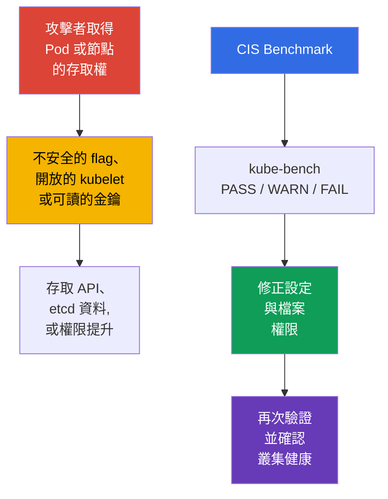
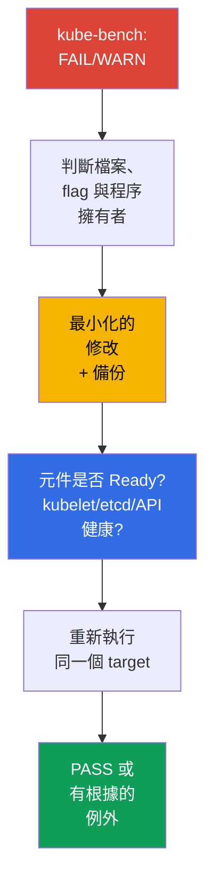

[Русская версия](ru.md) · [Eng version](README.md) · [Versión en español](es.md) · [Version française](fr.md) · [Deutsche Version](de.md) · [ქართული ვერსია](ge.md) · [日本語版](jp.md)

# 第 07 章。CIS Benchmark 與 kube-bench

> **問題。** 叢集很少是透過 Kubernetes 本身的漏洞被攻破的:通常是已經取得 Pod 或節點
> 存取權的攻擊者,在旁邊發現一個不安全的小細節——多餘的開放埠、元件的弱 flag、任何人
> 都能讀取的金鑰。這些細節單獨看並不起眼,但合在一起就能開出一條路,通往未經檢查的
> API、etcd 中的 Secrets,或節點上的權限提升——而這些沒有一項能從應用程式的程式碼中
> 看出來。

> **接下來。** NetworkPolicy 限制了攻擊者在 workload 之間移動的路徑。現在我們要檢查
> control plane 與節點本身的設定有多安全。**CIS Kubernetes Benchmark** 把 hardening
> 建議轉換成可檢查的項目,而 `kube-bench` 會自動把它們與叢集的設定進行比對。這是
> **Cluster Setup** 領域(CKS,15%)的一部分:不僅要找出不安全的設定,還要在不破壞
> 叢集可用性的前提下修正它。

> **需要哪些 CKA 基礎。** 本章不會重述 `kubeadm`、static Pod 與 PKI 的架構。開始前請
> 先複習[kubeadm 與 control plane 檔案](../../../cka/course/35/tw.md)以及
> [Kubernetes 憑證](../../../cka/course/39/tw.md)。

## 07.1. CIS Kubernetes Benchmark:究竟在檢查什麼

**CIS Kubernetes Benchmark** 是 Center for Internet Security 針對 Kubernetes 設定
提出的一套建議。它不能取代威脅模型、更新或 policy,而是提供一份最小可重現的檢查
清單:哪些 flag、檔案權限與元件設定能降低已知的攻擊面。



> 🧠 `kube-bench` 會比對可用的檔案、參數與 CIS profile;`FAIL`/`WARN` 需要評估 active
> state 與風險。

檢查項目依角色與元件分組。profile 的名稱與建議編號會隨 benchmark 版本改變,因此請以
`kube-bench` 為所安裝的 Kubernetes 版本選出的 profile 為準。Kubernetes 版本與 CIS
Benchmark 版本並非一對一對應:一個 benchmark 版本可能涵蓋多個 Kubernetes 版本,反之
亦然;而 `kube-bench` 只有在已安裝的 Kubernetes 版本存在於其公開的 version mapping
中時,才能自動選擇 benchmark。

> 🔬 Version/profile mapping 決定了報告的可信度;請使用受支援的 `kube-bench` 所選定
> 的 profile,並修正具體的 check。

> **2026-09-08 時效性快照。** 在 kube-bench 的 `main` 分支 `docs/platforms.md` 中
> 發佈的表格顯示:CIS `1.12` 對應 Kubernetes `1.32-1.33`,CIS `2.0` 對應 Kubernetes
> `1.34-1.35`。
>
> 但公開的支援表必須與具體 kube-bench 發行版的實際內容區分開來。例如,下方鎖定的
> `v0.16.0` 尚未包含 `cfg/cis-2.0`:它內建的 `cfg/config.yaml` 把 Kubernetes `1.34`
> 對應到 `cis-1.12`,而 `1.35` 的 mapping 並不存在。
>
> 因此執行前不只要檢查 `docs/platforms.md`,還要檢查所使用的 tag/image 中實際的
> `cfg/config.yaml` 以及是否存在所需的 `cfg/<benchmark>` 目錄。不要只因為某個 profile
> 已經寫在 `main` 分支的文件裡,就認為它已被具體的發行版支援。如果叢集的版本不在鎖定
> 發行版的 mapping 中,不要把強制指定的 `--benchmark` 當成具權威性的 CIS 評估:
> `--benchmark` 只會改變套用的測試集合,不會讓它對未涵蓋的版本生效。
>
> 如果 lab 的目標是在 `kube-bench:v0.16.0` 內建 mapping 真正涵蓋的 Kubernetes 版本上
> 取得確定性的評估結果,請使用 Kubernetes `1.33` + `cis-1.12`。
>
> 與本章相關的 Lab103 刻意使用訓練用的基準版本 Kubernetes `1.36.0`,而這個版本並不在
> `v0.16.0` 的涵蓋範圍內。那裡強制執行 `cis-1.12` 只是作為 `forced-approximate` 的教學
> 情境:結果對練習 remediation 有幫助,但對 Kubernetes `1.36` 而言並不是具權威性的
> CIS compliance。

| CIS 章節 | 檢查什麼 | 典型物件 |
|---|---|---|
| Control plane / master | `kube-apiserver`、`kube-controller-manager`、`kube-scheduler` 的 flag | `/etc/kubernetes/manifests/` 中的 static Pod 清單 |
| etcd | TLS、資料存取、data directory 與金鑰的權限 | `/etc/kubernetes/pki/etcd/`、`/var/lib/etcd` |
| Worker node | kubelet API、authentication/authorization、sysctl 保護 | kubelet config 與 systemd 參數 |
| Policies | RBAC、ServiceAccount、NetworkPolicy、Pod Security | API 物件與 admission 設定 |

`PASS` 表示工具認為符合它的規則。`FAIL` 表示違反規則,而 `WARN` 通常表示無法確定明確
的狀態,或需要人工判斷。不要機械式地修正所有 `WARN`:有些項目對 managed control
plane、替代的 CNI 或特定架構並不適用。

## 07.2. 執行 kube-bench 並讀懂報告

以下命令只應在確認已安裝的 `kube-bench` 版本對你的叢集有受支援的 benchmark mapping
之後才使用:在 2026-09-08 的快照中,Kubernetes `1.36` 並不在 generic mapping 中(見
§07.1)。

請在需要讀取檔案的那個節點上執行 `kube-bench`。在 control plane 節點上通常需要
`master` 與 `etcd` 章節,在 worker 節點上則是 `node`。在訓練用叢集或可以透過 SSH
存取節點時,最透明的選項是本地啟動:

> 🎯 在檔案的擁有者身上執行 scanner,並用備份修正唯一的活動來源,等待重啟,驗證
> effective state 與健康狀態,然後重新執行 check。

```bash
# 在 control plane 節點上;可用的 targets 依 kube-bench 版本而異。
sudo kube-bench run --targets master,etcd | tee kube-bench-control-plane.txt

# 在 worker 節點上。
sudo kube-bench run --targets node | tee kube-bench-worker.txt

# 快速找出未通過的項目與其 ID。
grep -E '\[FAIL\]|\[WARN\]' kube-bench-control-plane.txt

# 修正後只重新檢查報告中的 check ID,而不是整個 target。
# 用你版本的 `kube-bench run --help` 確認語法。
sudo kube-bench run --targets master --check 1.2.1
```

如果 `kube-bench` 的二進位檔沒有直接安裝在節點上,也可以在帶有 `hostPID` 以及必要
`hostPath` 掛載(用於掛載元件的設定與資料)的 Pod/Job 中執行;upstream 的
`kube-bench` 儲存庫有現成的範例。這種執行方式只能檢查 Pod 可被排程到、且其 host
namespaces/檔案可被存取的節點。在 managed Kubernetes 中,這通常能檢查可存取的
worker 節點,但無法檢查 provider 擁有的 GKE/EKS/AKS/ACK control plane:單純能存取
Kubernetes API 並不代表 control-plane 的 check 也能被存取。

本章假設叢集是用 `kubeadm` 建立、且可以直接存取節點,因此後面都使用本地啟動方式。

請按這個順序閱讀結果:記下建議編號、路徑或 flag、實際的值、擁有者/檔案模式,以及
修正後的驗證方法。這比單純增加 `PASS` 的數量更重要。

| 狀態 | 動作 |
|---|---|
| `PASS` | 記錄為初始符合狀態;後續變更時不要弱化它 |
| `FAIL` | 找出叢集實際使用哪個元件與哪個設定來源,然後修正並驗證 |
| `WARN` | 閱讀建議文字;手動確認、記錄例外情況,或直接修正 |

正是這個循環——執行 `kube-bench`、在自己的報告中找出具體的 `FAIL`/`WARN`、修正、
再驗證——就是本章的整個工作流程。每個叢集發現的項目都不同:它取決於部署方式、
kubeadm 發行版、元件版本,以及已經套用過的 hardening。因此本章接下來不會按 CIS
建議編號依序講解,而是針對 control plane 與節點的每個元件各分一個小節
(`kube-apiserver`、`kube-controller-manager` 和 `kube-scheduler`、`kubelet`、
`etcd`)——這些是實際 `kube-bench` 報告中最常見的發現類別,以及如何安全地修正它們,
而不是 benchmark 全部項目的完整清單。

## 07.3. 範例:找出並修正 kube-apiserver 的 FAIL

在 kubeadm 叢集中,`kube-apiserver` 以 static Pod 的形式執行:kubelet 監視
control-plane 節點磁碟上的清單 `/etc/kubernetes/manifests/kube-apiserver.yaml`,
並在其變更時自動重新建立 Pod。因此應該編輯的是這個檔案本身,而不是透過 `kubectl`
編輯 Pod 物件。

修正方式不需要自己想——`kube-bench` 會在報告中直接給出。每個 `FAIL` 都會在
`== Remediations ==` 章節中附上對應的項目,例如:

```text
[FAIL] 1.2.15 Ensure that the --profiling argument is set to false (Automated)
...
== Remediations master ==
1.2.15 Edit the API server pod specification file
/etc/kubernetes/manifests/kube-apiserver.yaml on the master node and set the
below parameter.
--profiling=false
```

Remediation 指出了確切的檔案與確切的 flag。修改前請在 `/etc/kubernetes/manifests/`
**之外**先建立備份:kubelet 會讀取該目錄中所有名稱不以句點開頭的檔案,而不論其副檔名
為何,並可能嘗試把不小心留在旁邊的副本當成 static Pod 建立——一旦 Pod 名稱相同,行為
就不確定,備份中過時的規格可能會悄悄蓋過目前有效的 manifest。

```bash
sudo install -d -m 0700 /etc/kubernetes/backup
sudo cp -a /etc/kubernetes/manifests/kube-apiserver.yaml \
  "/etc/kubernetes/backup/kube-apiserver.yaml.$(date +%Y%m%d%H%M%S)"
```

把 remediation 中的 flag 加入 static Pod 的 `command` 陣列,儲存檔案,並等待 kubelet
重新建立 Pod:

```bash
# kubelet 應該會自動重新建立 static Pod。
watch -n 2 'sudo crictl ps --name kube-apiserver'

# API 恢復之後。
kubectl get --raw='/readyz?verbose'
kubectl -n kube-system get pods -l component=kube-apiserver -o wide

# 只重新驗證這一個 check,而不是整個 target。
sudo kube-bench run --targets master --check 1.2.15
```

## 07.4. 範例:找出並修正 kube-scheduler 的 FAIL

三個主要的 control-plane 元件都有停用 profiling 的檢查,但其 ID 取決於 benchmark
的章節。在 `kube-bench v0.16.0 / cis-1.12` 中分別是:

- `1.2.15` - `kube-apiserver`;
- `1.3.2` - `kube-controller-manager`;
- `1.4.1` - `kube-scheduler`。

這三者都屬於 `master` target,而不是 `node`。例如,對 scheduler 而言:

```text
[FAIL] 1.4.1 Ensure that the --profiling argument is set to false (Automated)
...
== Remediations master ==
1.4.1 Edit the Scheduler pod specification file
/etc/kubernetes/manifests/kube-scheduler.yaml on the master node and set the
below parameter.
--profiling=false
```

適用的是與 07.3 相同的流程:編輯清單
`/etc/kubernetes/manifests/kube-scheduler.yaml`,等待 static Pod 重新建立,再用
`sudo kube-bench run --targets master --check 1.4.1` 重新驗證。

但請先檢查 `kube-scheduler` 是否以 `--config=<path>` 啟動。如果設定了 `--config`,
CLI flag `--profiling` 就是 deprecated 並在執行期被忽略;effective 設定位於
`KubeSchedulerConfiguration` 中:

```yaml
apiVersion: kubescheduler.config.k8s.io/v1
kind: KubeSchedulerConfiguration
enableProfiling: false
```

`kube-bench v0.16.0 / cis-1.12` 有一個限制:check `1.4.1` 分析的是 process command
line,而不會讀取 `KubeSchedulerConfiguration`。因此當 scheduler 使用 `--config`
時,不能把 `1.4.1` 的結果視為 effective profiling state 的獨立證據:正確的 config
可能導致 `FAIL`,而被忽略的 `--profiling=false` 卻可能得到形式上的 `PASS`。這種情況
下,應另外檢查活動中的 `--config` 檔案,確認 `enableProfiling: false`,檢查
scheduler 的健康狀態,並把 `kube-bench` 的落差記錄為所用 benchmark/tool 版本的限制。
不要只為了得到 `PASS` 而加上一個會被忽略的 CLI flag。

對 `kube-controller-manager` 而言,`--profiling` 仍是正常的 CLI flag,因此它的發現
(`1.3.2`)完全按照 07.3 的方式修正,沒有這個附加條件。

完全相同的循環——執行 `kube-bench`、找出 `FAIL`、編輯清單、驗證——也適用於
worker 節點,只是使用 `node` 的 targets 與 flag 集合(`kubelet`,而不是
control-plane 元件)。07.5 節正是討論這個發現。

**在考試中,速度比完整性更重要。** 典型的 CKS 任務會這樣描述:「kube-apiserver/
kubelet 的 kube-bench 報告中有某個 ID 的 FAIL——請修正它」,而評分依據正是修正這件
事本身,而不是對所有發現的全面總覽。快速演算法:開啟具體 ID 的
`== Remediations ==` → 判斷是 static Pod 還是 systemd 服務(kubelet)→ 編輯需要的
檔案 → 等待重啟 → 用同樣的 `--check <ID>` 重新驗證,而不是整個 target。

**如果修改後元件沒有啟動。** 參數或 static Pod 清單 YAML 中的錯誤不會阻止編輯本身,
而是阻止新 Pod 啟動。常見原因:flag 名稱拼錯、衝突的重複參數、flag 指向的檔案路徑不
存在。恢復順序:

1. 檢查實際發生了什麼:`sudo crictl ps -a --name <component>` 和
   `sudo journalctl -u kubelet -n 100 --no-pager`——kubelet 會記錄它無法從新清單
   啟動 static Pod 的原因。
2. 如果不能很快找出原因,就用清單的備份還原——這比在考試時間壓力下解析複雜的
   YAML 更快。
3. 恢復後更精確地重新修改,再次等待 `Ready`,才能繼續處理下一個發現。

## 07.5. kubelet:關閉 API 並保護核心參數

kubelet 在每個節點上執行,並有權限執行 Pod。開放的 read-only API、匿名存取或薄弱的
authorization,都可能讓人取得節點資料,某些情況下甚至能進一步擴大入侵範圍。
`protectKernelDefaults: true` 會讓 kubelet 在其所期望的 kernel flags 值不符合時,
以錯誤終止初始化。當 `protectKernelDefaults: false` 時,kubelet 會嘗試自行把這些
參數設成期望的值。

在 kubeadm 節點上,主要檔案通常是 `/var/lib/kubelet/config.yaml`,額外的參數則設定
在 `/var/lib/kubelet/kubeadm-flags.env` 與 systemd drop-in 中。在 Kubernetes
1.36 中,還要檢查 `--config-dir`:kubelet 會先套用主要 config,然後只按字典序
套用該目錄(包含子目錄)中的 `*.conf` 檔案;`*.yaml` 不會被載入。CLI flag 的優先
順序更高。請確認實際的設定來源,而不是憑空假設路徑:

```bash
sudo systemctl cat kubelet
sudo ps -ef | grep '[k]ubelet'

# 從實際的 ExecStart/process 判斷 --config 與 --config-dir 的值。
# 如果 process 使用的是其他路徑,不要代入 kubeadm 的預設路徑。
KUBELET_CONFIG='<--config 的實際值>'
KUBELET_CONFIG_DIR='<--config-dir 的實際值,或空字串>'

if [[ -n "$KUBELET_CONFIG" ]]; then
  sudo grep -nE \
    'readOnlyPort|anonymous:|authorization:|protectKernelDefaults' \
    "$KUBELET_CONFIG"
else
  echo 'kubelet 在沒有 --config 的情況下執行:請考量 built-in defaults、drop-in 與 CLI flags'
fi

if [[ -n "$KUBELET_CONFIG_DIR" ]]; then
  sudo find "$KUBELET_CONFIG_DIR" -type f -name '*.conf' -print
fi
```

如果沒有 `--config`,不要為它指定預設路徑:kubelet 會使用 built-in defaults,再套用
`--config-dir`(如有設定),之後 CLI flags 可能覆寫最終的值。為了證明 effective
state,最後仍應核對 `/configz`。

在 kubelet 的設定 API 中設定對應的欄位:

```yaml
# /var/lib/kubelet/config.yaml
readOnlyPort: 0
authentication:
  anonymous:
    enabled: false
authorization:
  mode: Webhook
protectKernelDefaults: true
```

如果在你的安裝中該參數是以 flag 傳遞,請把它加入實際生效的 systemd
environment/drop-in 中,不要在多個來源之間重複同一個值。以下不是 shell 命令,而是
kubelet 參數所需的片段:

```text
--read-only-port=0
--anonymous-auth=false
--authorization-mode=Webhook
--protect-kernel-defaults=true
```

重啟前請先檢查 sysctl。對 Kubernetes 1.36 而言,kubelet 期望的值分別是 `1`、`0`、
`10`、`1`、`1000000` 和 `25000000`。不要盲目修改它們:先確定是哪個 sysctl 來源在
管理該節點,把它調整為一致的 baseline,之後才重新啟動 kubelet。

```bash
# Kubernetes 1.36:kubelet 在 setupKernelTunables() 中檢查的參數。
sudo sysctl \
  vm.overcommit_memory \
  vm.panic_on_oom \
  kernel.panic \
  kernel.panic_on_oops \
  kernel.keys.root_maxkeys \
  kernel.keys.root_maxbytes

# 檢查/調整參數至你的作業系統與 Kubernetes 的 baseline 之後:
sudo systemctl restart kubelet
sudo systemctl --no-pager --full status kubelet
sudo journalctl -u kubelet -n 100 --no-pager
```

請驗證 read-only 埠確實沒有在監聽,而受保護的 API 只在具備正確 credentials 與
authorization 時才回應。最後不要只核對檔案:`/configz` 顯示的是套用 base config、
`*.conf` drop-in 與 CLI overrides 之後的最終設定。要做到這一點,請求必須經過 kubelet
API 授權(例如透過 API-server proxy 使用管理員的 kubeconfig):

```bash
listeners=$(sudo ss -lntp) || {
  echo 'ERROR: cannot inspect TCP listeners' >&2
  exit 1
}

if grep -q ':10255' <<<"$listeners"; then
  echo 'ERROR: read-only kubelet port is listening' >&2
  exit 1
else
  echo 'OK: read-only kubelet port is closed'
fi

# 如果受保護的 kubelet API 有在監聽,顯示出來。
grep ':10250' <<<"$listeners"
kubectl get nodes

NODE="${NODE:?set target node name from kubectl get nodes}"
kubectl get --raw "/api/v1/nodes/${NODE}/proxy/configz" \
  | jq '.kubeletconfig | {readOnlyPort, authentication, authorization, protectKernelDefaults}'
```

對於外部使用者,對 `10250` 的存取仍必須受防火牆與網路拓撲限制。
`authorization-mode=Webhook` 本身並不會讓埠變得安全——它只是讓 kubelet 向
Kubernetes API 詢問已驗證主體的權限。

## 07.6. 範例:找出並修正 etcd 的 FAIL

etcd 儲存 Kubernetes API 的持久狀態:Secrets、RBAC、設定以及 workload 規格。讀取
data directory 或 TLS private key,等同於叢集遭到嚴重入侵,因此 CIS 會另外檢查
etcd 檔案的擁有者與權限。

```text
[FAIL] 1.1.12 Ensure that the etcd data directory ownership is set to etcd:etcd (Automated)
...
== Remediations master ==
1.1.12 On the etcd server node, get the etcd data directory, passed as an argument
--data-dir, from the below command:
ps -ef | grep etcd
Run the below command (based on the etcd data directory found above).
For example, chown etcd:etcd /var/lib/etcd
```

Remediation 明確指出:先透過 `ps` 確定實際的 data directory,再把它的 ownership
改為 `etcd:etcd`。這裡的 `ps` 命令是用來找出真正的 `--data-dir`,而不是用來推斷
期望的擁有者——check `1.1.12` 本身要求字面上的 `etcd:etcd`,無論該程序實際上是以
哪個使用者執行的。

這項要求必須與具體安裝的 runtime identity 區分開來。在一般的 kubeadm control
plane 中,static Pod 預設以 `root` 執行;若使用 `RootlessControlPlane`,kubeadm
會使用獨立的 non-root identity(對 etcd 而言是 `kubeadm-etcd`)。因此在變更
ownership 之前,請先檢查實際的 data directory、所選 CIS profile 是否適用於你的
安裝,以及 host 上是否存在所需的 `etcd`/`etcd` 帳號/群組 mapping——不要用程序的
使用者取代 benchmark 的字面要求。

如果環境確實需要滿足這個 check,且 `etcd:etcd` 的 mapping 對該 host 是有效的,就
把最小化的 remediation 套用在目錄本身,並只重新驗證這一項:

```bash
# 從程序/清單判斷實際的 --data-dir。
sudo ps -ef | grep '[e]tcd'
DATA_DIR=/var/lib/etcd   # 替換成實際找到的值

sudo stat -c '%A %a %U:%G %n' "$DATA_DIR"
getent passwd etcd
getent group etcd

# 只有在所選 benchmark 適用且 etcd:etcd 的 mapping 對 host 有效時才執行。
sudo chown etcd:etcd "$DATA_DIR"

# 只重新驗證這個 check(target 是 master,而不是 etcd)。
sudo kube-bench run --targets master --check 1.1.12
```

存取權限是另一個獨立的 check `1.1.11`(「permissions 700 或更嚴格」);如果也要修正
它,請分開套用並分開驗證:

```bash
sudo chmod 700 "$DATA_DIR"
sudo kube-bench run --targets master --check 1.1.11
```

「remediation 給出命令,但套用前要先驗證實際的 data directory 與 profile 的
適用性」這個相同原則,也適用於相鄰的 etcd CIS 發現——pod spec 檔案
(`/etc/kubernetes/manifests/etcd.yaml`)以及 TLS 金鑰
(`/etc/kubernetes/pki/etcd/*.key`)的權限與擁有者。不要把 `2379`/`2380` 對外開放,
也不要把這個範例原封不動地搬到 data directory 與 etcd 程序不屬於你的 managed
叢集中。

## 07.7. 重新執行、診斷與證明修正結果

對每一個 `FAIL` 或經過判斷後接受的 `WARN`,依照一套簡短的程序行動:(1)從報告中
記下 Kubernetes 版本、`kube-bench` 的版本或 digest、所選 profile 與 CIS check
ID;(2)備份活動中的檔案或物件——對於檔案系統托管的 static Pod,備份必須存放在
**`staticPodPath` 之外**:kubelet 不會依副檔名過濾該目錄中的檔案,可能把 `.backup`
當成另一份清單處理;(3)只變更一項 control;(4)等待重啟,並檢查元件與叢集的
健康狀態;(5)只重新執行受影響的 target 或 check(例如對支援此語法的版本執行
`kube-bench run --targets master --check <ID>`);(6)如果健康檢查出錯,立即還原
備份,等待恢復,再重新執行健康檢查。在元件健康、effective 設定與 targeted rerun
都通過驗證之前,不要宣告修正成功。如果某個 `kube-bench` check 檢查的並非元件實際
使用的設定來源(如 07.4 中帶 `--config` 的 scheduler 範例),請把這記錄為工具本身
的限制,不要用形式上的 `PASS` 取代 effective-state 的驗證。

在 self-managed 叢集中,這套流程適用於 control plane、節點,以及由操作者負責的
檔案。在 managed Kubernetes 中,control plane 通常屬於 provider:不要嘗試透過
hostPath 或直接修改來繞過這一點,而應把 provider 擁有的 control 與文件核對,並記錄
客戶方/provider 方各自的責任範圍。



Hardening control plane 之後的最小驗證集合:

```bash
# API server 與基本物件都可存取。
kubectl get --raw='/readyz?verbose'
kubectl get nodes
kubectl get --all-namespaces pods

# Static Pod 與 etcd 確實在運作。
kubectl -n kube-system get pods -o wide
sudo crictl ps | grep -E 'kube-apiserver|kube-controller-manager|kube-scheduler|etcd'

# 在實際程序中尋找生效中的值,而不是只看檔案的備份。
sudo crictl ps --name kube-apiserver
sudo ps -ef | grep -E '[k]ube-apiserver|[k]ube-controller-manager|[k]ube-scheduler|[k]ubelet'

# 重新評估,並保存供審查用的產出物。
sudo kube-bench run --targets master,etcd | tee kube-bench-after.txt
grep -E '\[FAIL\]|\[WARN\]' kube-bench-after.txt
```

常見錯誤與診斷:

| 症狀 | 可能原因 | 該檢查什麼 |
|---|---|---|
| 修改後 API 無法存取 | static Pod 的 YAML 錯誤或不支援的 flag | `journalctl -u kubelet`、`crictl ps -a`、清單的備份 |
| `protectKernelDefaults` 之後 kubelet 沒有啟動 | 節點的 sysctl 不符合要求的 baseline | `journalctl -u kubelet`、sysctl 來源與作業系統 policy |
| `kube-bench` 持續顯示 `FAIL` | 改到了非活動中的檔案,或指定了衝突的 flag | `systemctl cat kubelet`、`ps`、`crictl inspect` |
| 改權限後 etcd 無法啟動 | 程序的使用者失去了對 data directory 或金鑰的存取權 | `stat`、程序擁有者、etcd 日誌 |
| managed Kubernetes 中的檢查無法通過 | control plane 不屬於使用者,部分建議不適用 | provider 的文件,區分客戶方與 provider 方的 control |

> 🏭 版本化的 CIS baseline、定期的 drift 檢查、例外的擁有者,以及 rollout 之後的
> evidence。

## 07.8. 在生產環境中如何應用

- **Hardening 作為 baseline。** control plane、kubelet 與 PKI 權限的設定應該寫在
  kubeadm 設定、節點映像或 automation 中,而不是每次部署後手動修改。
- **定期進行 drift 控制。** 在 Kubernetes 升級後以及在 CI/CD 或獨立的
  security 任務中定期執行 `kube-bench`。結果應以 benchmark 與 Kubernetes 版本
  作為附帶資訊,存放為產出物。
- **記錄例外情況。** Managed control plane、不同的 CNI 或架構決策,可能使某項規則
  不適用。對每個例外都要記錄風險擁有者、原因與補償性 control。
- **小批量變更。** static Pod 逐一修改,並檢查 `/readyz` 與重啟情況。在 HA control
  plane 中要遵守 rolling 順序並準備回滾計畫。
- **依用途授予權限。** private key、kubeconfig、清單與 data directory 只讓服務
  使用者與確實需要的管理員存取。應透過設定管理手段定期檢查權限。

## 07.9. 小詞彙表

- **CIS Kubernetes Benchmark** - CIS 針對安全 Kubernetes 設定提出的建議。
- **kube-bench** - 依 CIS Benchmark profile 檢查設定的工具。
- **static Pod** - 由節點本地清單描述、並由 kubelet 直接啟動、不受 API 管理的
  Pod。
- **profiling** - 程序的效能診斷端點;透過該元件當前生效的設定來源停用。對於帶
  `--config` 的 `kube-scheduler`,這是 `KubeSchedulerConfiguration` 中的
  `enableProfiling: false`,而不是 CLI flag `--profiling`。
- **read-only port** - 未經驗證的 kubelet 埠;必須透過 `--read-only-port=0`
  停用。
- **protectKernelDefaults** - 一項 kubelet 設定,在 sysctl 不符合 baseline 時
  拒絕啟動。
- **etcd data directory** - 存放 etcd 資料的目錄,通常是 `/var/lib/etcd`。
- **private key** - TLS 身分的機密部分;需要受限制的存取模式,通常是 `0600`。

## 07.10. 本章總結

- CIS Benchmark 為 control plane、etcd、worker 與 policy 制定了可檢查的
  hardening baseline;`kube-bench` 顯示具體的 `PASS`、`WARN` 與 `FAIL`。
- 應先判斷生效中的設定來源與程序擁有者,再變更設定。沒有重新驗證的報告不能證明
  已經修正。
- 在 `kube-apiserver` 上,重點是在顧及 health probe 與 kubeadm discovery 的前提下
  將匿名存取降到最低,使用安全的 authorization、audit,以及 `--profiling=false`。
  不要在沒有檢查叢集生命週期的情況下機械式地套用 `--anonymous-auth=false`。
- profiling 必須在 `kube-apiserver`、`kube-controller-manager` 與
  `kube-scheduler` 上停用,但生效中的設定方式依元件而異:對於帶 `--config` 的
  `kube-scheduler`,要檢查 `KubeSchedulerConfiguration` 中的
  `enableProfiling: false`,而不是 CLI flag `--profiling`。
- kubelet 需要 `--read-only-port=0`、`--anonymous-auth=false`、
  `--authorization-mode=Webhook` 與 `--protect-kernel-defaults=true`,或
  `config.yaml` 中對應的等效欄位。
- etcd data directory、PKI private key、kubeconfig 與 static Pod 清單都需要
  最小化的權限。對於 CIS check,應先判斷實際的 data directory,再套用 benchmark
  真正要求的 ownership/permissions,並考量 profile 的適用性與具體安裝的
  runtime 模型。

## 07.11. 這對你有何幫助:考試與實務工作

**在考試中。** 任務通常會指出一個或多個來自 `kube-bench` 的 `FAIL`,並提供對節點
的存取權。請快速判斷該元件是 static Pod、kubelet 服務還是 etcd,建立備份,修正
活動中的檔案,等待重啟,並證明結果。請特別記住這些常見項目:三個元件的
profiling、kubelet 的 `protect-kernel-defaults`、關閉的 read-only port、匿名
存取,以及檔案模式。

**在實務工作中。** CIS 是 platform 團隊與 security 團隊之間有用的共同語言,但不能
取代架構分析。它有助於在事故發生前發現設定漂移,而可重現的驗證與已記錄的例外,則
讓叢集升級變得可預測。

## 07.12. 自我檢查問題

<details>
<summary>1. `kube-bench` 報告中的 `WARN` 與 `FAIL` 有何不同,為什麼不能用同樣的方式修正?</summary>

`FAIL` 表示工具偵測到違反了它的規則,而 `WARN` 通常表示狀態無法明確判定,或需要
人工判斷。對於 `WARN`,應閱讀建議文字,確認它是否適用於 managed control plane、
CNI 或架構,然後記錄例外或修正它,而不是機械式地修改所有項目。
</details>

<details>
<summary>2. 為什麼修正 static Pod 時,只修改檔案而不檢查新容器是不夠的?</summary>

kubelet 必須注意到清單的變更並重新建立 static Pod,但 YAML 錯誤或不支援的 flag
可能讓 control plane 無法存取。修改後應透過 `crictl ps` 檢查新容器,透過
`kubectl get --raw='/readyz?verbose'` 檢查 API 是否可用,並對受影響的 check 執行
targeted rerun。
</details>

<details>
<summary>3. control plane 的哪些元件需要停用 profiling,設定方式是否相同?</summary>

profiling 必須在 `kube-apiserver`、`kube-controller-manager` 與
`kube-scheduler` 上停用:不能只處理 apiserver,CIS 會檢查這三個元件的
profiling 端點。設定方式並不總是相同:`kube-apiserver` 與
`kube-controller-manager` 使用 CLI flag `--profiling=false`,但
`kube-scheduler` 的這個 flag 已經 deprecated——如果它以 `--config=<path>`
啟動,就必須透過 `KubeSchedulerConfiguration` 中的 `enableProfiling: false`
停用 profiling,而不是透過 CLI。停用 profiling 不等於停用 metrics。
</details>

<details>
<summary>4. 本章介紹的哪四項 kubelet 設定能關閉它的 API 並保護 sysctl baseline?</summary>

分別是 `--read-only-port=0`、`--anonymous-auth=false`、
`--authorization-mode=Webhook` 與 `--protect-kernel-defaults=true`,或
`config.yaml` 中對應的等效欄位。在啟用 `protectKernelDefaults` 之前應先檢查
sysctl:若與 baseline 不符,kubelet 可能無法啟動。
</details>

<details>
<summary>5. 為什麼不能自動把 etcd 程序的使用者當成 CIS check 中要求的 data directory 擁有者?</summary>

CIS check 定義了自己期望的 ownership(`etcd:etcd`),而 remediation 中的 `ps`
主要是用來判斷實際的 `--data-dir`。runtime identity 取決於實作方式:一般的
kubeadm control plane 預設以 `root` 啟動 etcd,而 rootless 變體使用獨立的
identity。因此應先檢查 data directory、benchmark 的適用性與 UID/GID mapping,
再執行精確的 remediation;程序使用者本身並不能取代 check 本身的要求。
</details>

<details>
<summary>6. TLS private key 適合什麼樣的權限,為什麼憑證可以有更寬鬆的讀取權限?</summary>

private key 是機密材料,因此需要最嚴格的存取限制;典型的 baseline 是模式
`0600`。擁有者並非固定不變:在一般以 root 執行的 kubeadm 安裝中,通常是
`root:root`,而在 non-root control plane 中,金鑰應屬於實際需要它的 service
identity——如果不檢查 runtime identity 就機械式地把擁有者改成 `root:root`,可能
會讓該程序失去對自己金鑰的存取權。

如果檢查的是具體的 CIS control,應另外核對其字面要求:例如 `cis-1.12` 的 check
`1.1.19` 對 Kubernetes PKI 要求 `root:root`,這是具體 benchmark 的要求,而不是
適用於任何 runtime 模型的通用規則。

憑證包含 TLS 身分的公開部分,因此模式 `0644` 通常是可接受的;但其 ownership 與
實際路徑仍應與部署方式及所選 benchmark 核對。
</details>

<details>
<summary>7. 用哪些命令能證明修正之後 API、etcd 與 kubelet 都健康?</summary>

對於 API 與物件,使用 `kubectl get --raw='/readyz?verbose'`、
`kubectl get nodes` 與 `kubectl get --all-namespaces pods`。static Pod 與
etcd 用 `kubectl -n kube-system get pods -o wide` 與 `sudo crictl ps` 檢查,
kubelet 則用 `sudo systemctl status kubelet` 與 `journalctl -u kubelet`;
之後再重新執行所需的 target 或 `kube-bench` check。
</details>

## 練習

在 [lab 103](../../labs/103/README_TW.MD) 中,你將執行 `kube-bench`、儲存報告、
修正 kubelet 與 `kube-apiserver` 的設定、為 Ingress 設定 TLS,並驗證二進位檔的
雜湊值。由於涉及修改 static Pod 與系統設定,請在 control plane 節點的主控台上
執行任務,並在每個步驟之後檢查叢集狀態。

🌐 額外的互動式練習(killer.sh/killercoda,外部資源):
[cis-benchmarks-kube-bench-fix-controlplane](https://killercoda.com/killer-shell-cks/scenario/cis-benchmarks-kube-bench-fix-controlplane)

另外可參考:[CIS Kubernetes Benchmark](https://www.cisecurity.org/benchmark/kubernetes)
與 [kube-bench](https://github.com/aquasecurity/kube-bench)——profile 與檢查項目
說明的第一手資料來源。

---
[目錄](../README_TW.md) · [第 06 章](../06/tw.md) · [第 08 章](../08/tw.md)
