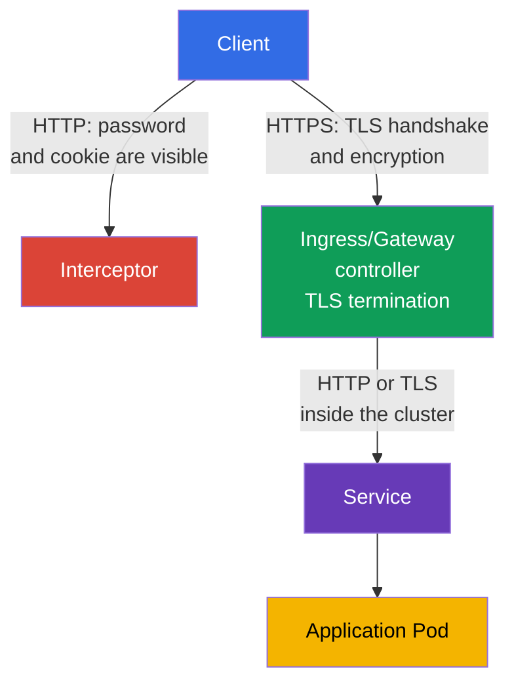
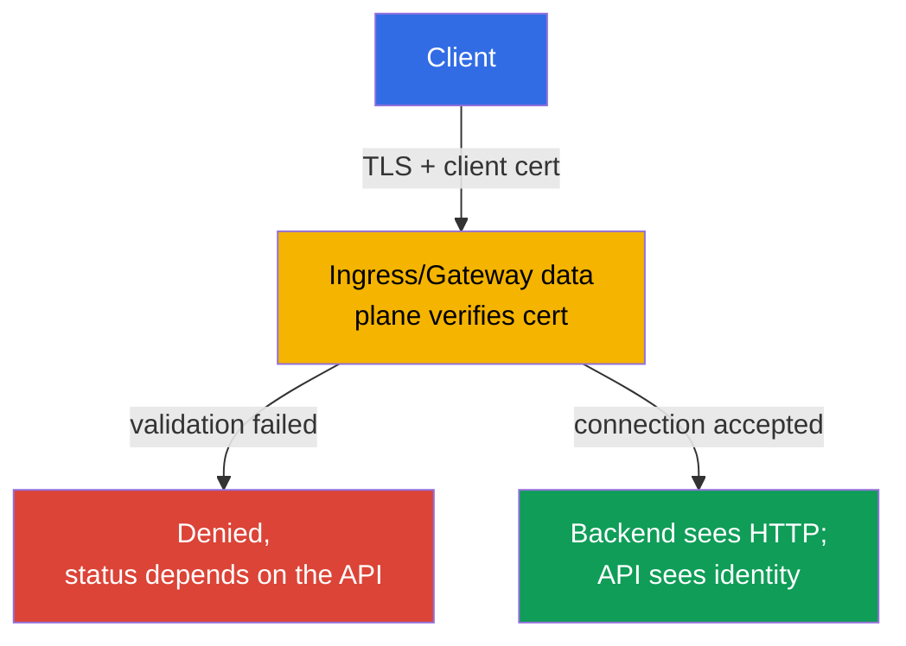

[Русская версия](ru.md) · [Versión en español](es.md) · [Version française](fr.md) · [Deutsche Version](de.md) · [ქართული ვერსია](ge.md) · [繁體中文版](tw.md) · [日本語版](jp.md)

# Chapter 08. Secure Ingress with TLS

> **The problem.** If an Ingress accepts traffic over ordinary HTTP, logins, cookies, bearer tokens, and form contents travel across the network in cleartext. A user on the same untrusted network, a malicious Wi-Fi access point, or an intermediary proxy can read the request or silently alter the response - the application's public entry point remains open to interception before traffic even reaches a Pod.

> **What comes next.** In Chapter 07, we checked and hardened cluster component configuration. Now we will protect the public entry point of applications. **Ingress with TLS** encrypts HTTP traffic between the client and ingress controller, confirms the server name, and prevents an interceptor from silently reading or altering a request. This is the Cluster Setup (15%) CKS domain.

> **What you need from CKA.** Basic Ingress and Service syntax and host/path routing are covered in [CKA Chapter 32](../../../cka/course/32/README.md). TLS architecture, certificates, private keys, and chain verification are covered in [CKA Chapter 00-3](../../../cka/course/00-3-tls/README.md). Here we consider the secure application of these mechanisms at the public entry point rather than repeat their basics.

> 🧠 TLS protects only the path from the client to TLS termination; controller → Service → Pod is a separate boundary.

## 08.1. Threat model: why HTTP at Ingress is insufficient

An ingress controller usually accepts traffic from an external network and routes it to a Service and then to a Pod. If the client connects over HTTP, logins, cookies, bearer tokens, and form contents travel across the network in cleartext. A user on the same untrusted network, a malicious Wi-Fi access point, or an intermediary proxy can read the request or alter the response.

TLS protects the channel from the client to the **TLS termination** point - the ingress controller. The controller presents a certificate for the host name, performs the TLS handshake, decrypts the request, and routes ordinary HTTP traffic to the backend. Therefore, TLS at the external entry point does not mean that the controller -> Service -> Pod path is automatically encrypted. Sensitive in-cluster traffic needs separate measures: application TLS, a service mesh, or Cilium transparent encryption, which is covered in Chapter 23.



Three properties are required at the same time:

- confidentiality - traffic between the client and controller cannot be read;
- integrity - a request or response cannot be silently modified;
- authenticity - the client verifies that the certificate was issued for the requested host.

Encryption does not fix an insecure backend, excessive RBAC, or an exposed endpoint. It is one defense-in-depth layer. Do not confuse a TLS certificate with a Kubernetes Secret either: a Secret stores the key and certificate but does not itself enable TLS until an Ingress references it.

> 🎯 Being able to issue a test certificate with a SAN for a given host, compare the certificate/key, and use `--cacert` instead of `-k` is the practical minimum for a TLS task.

## 08.2. Certificate and key: test self-signed and the production approach

For a lab, you can create a self-signed certificate. A client does not trust it by default, so ordinary `curl` ends with a chain-verification error.

The preferred test is to explicitly trust the lab certificate through `--cacert tls.crt`: curl will then continue verifying the certificate and the host name match. `curl -k` completely disables certificate verification and is acceptable only as a separate diagnostic check, not as proof of correct TLS configuration.

The name from the URL must be present in the **Subject Alternative Name** (SAN). Modern clients check SAN, not only the obsolete Common Name (CN) field. The certificate below is intended for `app.example.test`; for a different name, change both `HOST` and `subjectAltName`.

```bash
export HOST=app.example.test

openssl req -x509 -newkey rsa:2048 -nodes \
  -keyout tls.key \
  -out tls.crt \
  -days 30 \
  -subj "/CN=${HOST}" \
  -addext "subjectAltName=DNS:${HOST}"

# Before uploading to the cluster, check the subject and SAN
openssl x509 -in tls.crt -noout -subject -ext subjectAltName

# The certificate public key must match the private key public key.
# The hashes from the two commands must be identical.
openssl x509 -in tls.crt -pubkey -noout \
  | openssl pkey -pubin -outform DER | sha256sum
openssl pkey -in tls.key -pubout -outform DER \
  | sha256sum

# For a CA certificate, check the chain: leaf -> intermediate -> trusted root.
# `tls.crt` for a controller normally contains the leaf followed by intermediate; the root is not included.
openssl verify -show_chain -CAfile root-ca.crt \
  -untrusted intermediate-ca.crt leaf.crt
```

Before creating the Secret, matching public keys rule out a certificate/key pair from different issuances. In `openssl verify -show_chain` output, the leaf must be verified through the intermediate to a trusted root; an error at any link means that certificate must not be uploaded.

The `-nodes` option leaves the private key without a passphrase. This is necessary because the controller must read the key without interactive input. Protection in this case comes from strict RBAC for the Secret, restricted etcd access, and encryption at rest - not from a passphrase in the key file.

> 🏭 A trusted CA, automated renewal, an owner, expiry alerting, and tested Secret rotation.

In production, do not create long-lived self-signed certificates manually. Usually, `cert-manager` obtains a certificate from a trusted CA such as Let's Encrypt, stores it in a Secret, and renews it before expiry. The platform team must also define a certificate owner, expiry alerting, and a rotation procedure. If TLS terminates before the cluster on a cloud load balancer, verify that the connection to NGINX also meets organization requirements: TLS can be necessary on that segment too.

> 🎯 Create a `kubernetes.io/tls` Secret with `tls.crt` and `tls.key` keys, then verify its namespace and name: an Ingress can reference only a Secret in its own namespace.

## 08.3. TLS Secret: format and scope

For Ingress TLS, use a standard `kubernetes.io/tls` TLS Secret with `tls.crt` and `tls.key` keys. This is exactly the object created by `kubectl create secret tls`.

The portable Ingress TLS contract requires the certificate and private key under `tls.crt` and `tls.key`; additional checks of Secret type and content depend on the controller. Therefore, `kubernetes.io/tls` is the correct standard format for the course and production, but it should not be described as the only mechanism that the Ingress API itself can read. The `kubernetes.io/tls` type is provided for convenience and consistency: the Kubernetes API verifies the required keys for a Secret of this type, while TLS credentials can technically also be stored in an `Opaque` Secret, although that Secret receives no such validation and does not communicate the object's purpose to other engineers. The most reliable way to create it from already verified files is `kubectl create secret tls`: the command puts the certificate into `tls.crt` and the private key into `tls.key`.

```bash
kubectl -n web create secret tls app-example-tls \
  --cert=tls.crt \
  --key=tls.key

kubectl -n web get secret app-example-tls \
  -o jsonpath='{.type}{"\n"}{.data.tls\.crt}{"\n"}{.data.tls\.key}{"\n"}'
# kubernetes.io/tls
# base64 values of tls.crt and tls.key
```

The same object as a manifest looks as follows. Here `data` is intentionally left unfilled primarily because the private key `tls.key` must not be committed to Git in cleartext.

The X.509 certificate `tls.crt` contains the public key and is not itself a secret; whether to keep the public certificate in a repository is a separate repository-policy decision. The private key must always remain confidential. `stringData` is more convenient for short test values but does not make repository content secret.

```yaml
apiVersion: v1
kind: Secret
metadata:
  name: app-example-tls
  namespace: web
type: kubernetes.io/tls
data:
  tls.crt: <base64-encoded-certificate>
  tls.key: <base64-encoded-private-key>
```

A Secret is namespaced. An Ingress in namespace `web` cannot reference a Secret from `default` or another namespace. Do not grant an application `get`/`list` on all Secrets only for TLS: the certificate is usually served by the controller, while permission to create and read such Secrets is limited by a separate role. Base64 in `data` is encoding, not encryption.

> 🎯 Bind one host in `spec.tls.hosts` and `spec.rules.host`, specifying `secretName`, Service, and `ingressClassName`.

## 08.4. Ingress: bind host, TLS Secret, and backend

The portable Ingress API fields here are `spec.tls` (`hosts`, `secretName`) and `spec.rules` (`host`, `path`, `pathType`, `backend`). They describe the TLS certificate and routing but do **not** configure HTTP -> HTTPS redirect. `spec.ingressClassName` is also an API field, but the class value itself, for example `nginx`, selects a specific implementation. Annotations, including `nginx.ingress.kubernetes.io/*`, are not part of the Ingress API at all: only the respective controller determines their meaning.

Host matching matters twice: the controller selects the correct certificate during the TLS handshake and the client verifies that the URL name is in the SAN. Before applying, make sure the required class and Service exist:

```bash
kubectl get ingressclass
kubectl -n web get service web
```

The following assumes that Service `web` in namespace `web` listens on port 80. The manifest does not create the Service or Deployment: those are CKA basics and must exist separately.

```yaml
apiVersion: networking.k8s.io/v1
kind: Ingress
metadata:
  name: web-secure
  namespace: web
spec:
  # API field; `nginx` is an implementation choice, not a portable value.
  ingressClassName: nginx
  tls:
  - hosts:
    - app.example.test
    secretName: app-example-tls
  rules:
  - host: app.example.test
    http:
      paths:
      - path: /
        pathType: Prefix
        backend:
          service:
            name: web
            port:
              number: 80
```

You can check the object binding without external DNS:

```bash
kubectl -n web describe ingress web-secure
kubectl -n web get ingress web-secure -o yaml
kubectl -n web get secret app-example-tls -o jsonpath='{.type}{"\n"}'
```

In the `describe` output, check `Ingress Class`, the rule for `app.example.test`, the TLS host, Secret, and events.

An error reading the Secret or the absence of backend endpoints genuinely needs correction before a full end-to-end verification.

Consider the `ADDRESS` field separately: it reflects published Ingress status and can remain empty in NodePort, bare-metal, `hostNetwork`, port-forward, or some local fixtures even with a working Ingress. Check TLS readiness through the actual entry point of the selected controller, not only the presence of a value in `ADDRESS`.

## 08.5. ingress-nginx: retired controller and annotation boundaries

> **NGINX Ingress Controller retired.** Since March 2026, the `ingress-nginx` project has been retired and no longer receives releases or security fixes ([announcement](https://kubernetes.io/blog/2025/11/11/ingress-nginx-retirement/)). CKS requires a correctly configured Ingress with TLS, but the public competency does not guarantee a particular controller or nginx-specific annotations. On the exam, first check the controller supplied by the lab; `ingressClassName: nginx` syntax and its annotations are only one possible fixture. For production, do not deploy the retired controller on new clusters: choose a supported implementation or Gateway API. The portable part - TLS Secret, `spec.tls`, host/SNI, SAN, Service endpoints, and HTTPS verification - does not depend on the controller.

> 🎯 For ingress-nginx, `spec.tls` normally enables redirect; `ssl-redirect` and `force-ssl-redirect` depend on implementation and topology.

Even a correct TLS Ingress leaves a risk if HTTP remains available: a user can follow an old link and a cookie or form travels before the first HTTPS response. For **ingress-nginx**, the presence of a `spec.tls` block enables HTTP -> HTTPS redirect by default (usually `308`) unless controller configuration overrides it. Therefore, setting both `ssl-redirect` and `force-ssl-redirect` is neither necessary nor a correct mandatory recipe for an ordinary TLS Ingress.

This is ingress-nginx semantics, not the Ingress API. If you need to explicitly override ingress-nginx configuration for an Ingress with `spec.tls`, use only its controller-specific `ssl-redirect` annotation:

```yaml
metadata:
  annotations:
    nginx.ingress.kubernetes.io/ssl-redirect: "true"
```

Reserve `force-ssl-redirect` for a different topology: TLS terminates at an **external** load balancer/proxy, the controller receives HTTP, and the Ingress has no `spec.tls` block. The external proxy must then correctly pass information about the original HTTPS scheme or a redirect loop is possible. For example, a separate Ingress for this external SSL-offload configuration:

```yaml
apiVersion: networking.k8s.io/v1
kind: Ingress
metadata:
  name: web-external-tls
  namespace: web
  annotations:
    nginx.ingress.kubernetes.io/force-ssl-redirect: "true"
spec:
  ingressClassName: nginx
  rules:
  - host: app.example.test
    http:
      paths:
      - path: /
        pathType: Prefix
        backend:
          service:
            name: web
            port:
              number: 80
```

Do not replace edge redirect with application logic if it can be provided at the edge. Otherwise every backend must repeat the same configuration and an accidentally added Service can remain accessible over HTTP. HSTS supplements redirect after the first successful HTTPS connection, but does not replace TLS and requires a separately careful policy for domains and subdomains.

> 🏭 A supported Gateway API controller and its status/compatibility; the capabilities of `GatewayClass` are defined by the particular implementation.

> 🔬 **Gateway API v1.6 currentness.** In Gateway API v1.6, `TCPRoute` and `UDPRoute` moved to Standard `v1`; new experimental resources are placed in a separate `gateway.networking.x-k8s.io` group with an `X` prefix. `XBackend` remains experimental, and its `ExternalHostname` support requires deliberate opt-in because of security trade-offs, including confused-deputy risk. This is production-current context, not CKS Core. [Official release blog](https://kubernetes.io/blog/2026/08/03/gateway-api-v1-6-release/).

### Gateway API: the current production path

Gateway API describes three TLS models: **edge termination** (an HTTPS listener decrypts traffic at the Gateway), **TLS passthrough** (the Gateway passes the TLS handshake to the backend without termination), and TLS to the backend after termination (re-encryption). For the latter model, `BackendTLSPolicy` from Gateway API v1.4.0 - GA in the Standard Channel - configures SNI and backend certificate verification. Support for a specific model depends on the Gateway controller.

For a new production cluster, use a supported Gateway API implementation. In the example below, `platform-gateway` is an **implementation-specific** `GatewayClass` name: it is provided by the selected Gateway controller, not a standard Kubernetes value. `certificateRefs` refers to the same TLS Secret in namespace `web`; the HTTPS listener performs TLS termination and `HTTPRoute` routes the request to a Service.

```yaml
apiVersion: gateway.networking.k8s.io/v1
kind: Gateway
metadata:
  name: web-gateway
  namespace: web
spec:
  gatewayClassName: platform-gateway # name depends on the Gateway controller
  listeners:
  - name: https
    protocol: HTTPS
    port: 443
    hostname: app.example.test
    tls:
      mode: Terminate
      certificateRefs:
      - kind: Secret
        name: app-example-tls
---
apiVersion: gateway.networking.k8s.io/v1
kind: HTTPRoute
metadata:
  name: web-secure
  namespace: web
spec:
  parentRefs:
  - name: web-gateway
    sectionName: https
  hostnames:
  - app.example.test
  rules:
  - matches:
    - path:
        type: PathPrefix
        value: /
    backendRefs:
    - name: web
      port: 80
```

If the Gateway also exposes port 80, add a separate HTTP listener and `HTTPRoute` with the standard `RequestRedirect` filter to `https`; do not mix it with the HTTPS route to the backend.

> 🔬 TLS passthrough terminates TLS and mTLS at the backend; check controller support for `TLSRoute`, SNI routing, and passthrough.

### TLS passthrough: `TLSRoute`

For a backend that terminates TLS itself (for example, it needs its own certificate or mTLS), the Gateway does not decrypt the connection: the listener has `protocol: TLS` and `tls.mode: Passthrough`, and the route is selected by SNI. `TLSRoute` is GA in the Gateway API v1.5.0 Standard Channel. The minimal example below passes TLS for `app.example.test` to Service `web-tls` on port 443; the controller must support TLSRoute and passthrough.

```yaml
apiVersion: gateway.networking.k8s.io/v1
kind: Gateway
metadata:
  name: passthrough-gateway
  namespace: web
spec:
  gatewayClassName: platform-gateway
  listeners:
  - name: tls
    protocol: TLS
    port: 443
    hostname: app.example.test
    tls:
      mode: Passthrough
---
apiVersion: gateway.networking.k8s.io/v1
kind: TLSRoute
metadata:
  name: web-tls-passthrough
  namespace: web
spec:
  parentRefs:
  - name: passthrough-gateway
    sectionName: tls
  hostnames:
  - app.example.test
  rules:
  - backendRefs:
    - name: web-tls
      port: 443
```

With passthrough, the Secret containing the certificate belongs at the backend rather than in Gateway `certificateRefs`; check the backend's SNI/SAN certificate and endpoints.

A Gateway reference to a `Secret` in another namespace needs an explicit `ReferenceGrant` **in the Secret namespace**; without it, the controller must not accept the cross-namespace reference. Do not transfer this logic to `BackendTLSPolicy`: cross-namespace certificate/CA references for backend TLS are not allowed even with a `ReferenceGrant`.

Check supported `GatewayClass` objects with `kubectl get gatewayclass` and Gateway status before migrating traffic.

> 🧠 mTLS authenticates the client at the edge during the TLS handshake, but does not replace application authorization or mTLS between Pods.

## 08.6. mTLS at the entry point: the controller verifies the client certificate

Everything above in this chapter is **server-side TLS**: the controller proves its identity to the client with a certificate, while the client remains anonymous at the TLS layer. A separate task is **mutual TLS (mTLS) at the entry point**: the controller also requires the client to present its certificate and verifies it against a trusted CA **before** the request reaches the backend. Do not confuse this with topics from other chapters:

- Chapter 23 covers mTLS **between Pods inside a mesh** (Istio/Linkerd sidecar-to-sidecar);
- TLS passthrough in 08.5 transfers the obligation to verify the client **to the backend itself**, not to the Gateway/Ingress;
- here, the **controller at the cluster boundary** itself becomes a TLS server for the client and verifies the client certificate at the same time.



Do not make an HTTP status part of the general mTLS model. In ingress-nginx, `on` returns `400` on failed certificate verification, while `auth-tls-match-cn` can return `403`. In Gateway API, `AllowValidOnly` validates the certificate during the TLS handshake, so an implementation can reject the TLS connection itself without an HTTP response - there is no controller-neutral model of "always 400/403" here.

> 🔬 `auth-tls-*` is a retired ingress-nginx API; the portable model is a valid client certificate at the edge.

### ingress-nginx: `auth-tls-*` annotations

Client Certificate Authentication is enabled by a `Secret` containing the CA chain in the `ca.crt` key and a set of annotations on an `Ingress` object:

```yaml
apiVersion: networking.k8s.io/v1
kind: Ingress
metadata:
  name: web-mtls
  namespace: web
  annotations:
    nginx.ingress.kubernetes.io/auth-tls-secret: "web/client-ca"
    nginx.ingress.kubernetes.io/auth-tls-verify-client: "on"
    nginx.ingress.kubernetes.io/auth-tls-verify-depth: "1"
    nginx.ingress.kubernetes.io/auth-tls-pass-certificate-to-upstream: "true"
spec:
  tls:
  - hosts: [app.example.test]
    secretName: web-tls
  rules:
  - host: app.example.test
    http:
      paths:
      - path: /
        pathType: Prefix
        backend:
          service:
            name: web
            port:
              number: 80
```

- `auth-tls-secret` references a `namespace/name` Secret whose `ca.crt` contains the trusted CA chain for client certificates - it is separate from the server-side `web-tls` Secret in 08.3, even though both apply to the same host.
- `auth-tls-verify-client: "on"` requires a client certificate successfully verified by the CA in `auth-tls-secret`; failed certificate verification finishes with HTTP `400`.
- `optional` does not require every client to provide a certificate, but it is **not** a "never reject" mode: if a client presents a certificate not signed by the configured CA, ingress-nginx still returns HTTP `400`. When the request is permitted, its verification result can be passed upstream.
- `optional_no_ca` does not reject a request solely because the client certificate is not signed by the CA from `auth-tls-secret`; the verification result is passed upstream. Use this mode only if the application or a separate authorization layer truly decides based on that result.
- For an upstream request that is passed through, ingress-nginx sends `ssl-client-verify`, `ssl-client-subject-dn`, and `ssl-client-issuer-dn`; the complete PEM certificate in `ssl-client-cert` is sent only with `auth-tls-pass-certificate-to-upstream: "true"`.
- Client Certificate Authentication applies to the whole host, not an individual path.

> 🔬 Gateway API frontend validation requires API-version and controller support; check the field, CA references, and handshake.

### Gateway API: frontend client-certificate validation at Gateway level

Frontend client-certificate validation enters Gateway API through the `spec.tls.frontend` field of a `Gateway`, not through `HTTPRoute`. The current schema differs from the earlier proposal variant (`default.frontendValidation` from GEP-91): in the released API, the path is `spec.tls.frontend.default.validation`, and the per-port override is `spec.tls.frontend.perPort[].tls.validation`.

```yaml
apiVersion: gateway.networking.k8s.io/v1
kind: Gateway
metadata:
  name: mtls-gateway
  namespace: web
spec:
  gatewayClassName: platform-gateway
  tls:
    frontend:
      default:
        validation:
          caCertificateRefs:
          - group: ""
            kind: ConfigMap
            name: client-ca
          mode: AllowValidOnly
  listeners:
  - name: app-https
    protocol: HTTPS
    port: 443
    hostname: app.example.test
    tls:
      mode: Terminate
      certificateRefs:
      - group: ""
        kind: Secret
        name: web-tls
```

The `client-ca` `ConfigMap` contains the trusted CA certificate (trust anchor) in the `ca.crt` key. The portable Gateway API Core variant is one `caCertificateRefs` to one `ConfigMap` with one CA certificate. Multiple CA certificates in one `ca.crt`, multiple `caCertificateRefs`, or other resource kinds are implementation-specific support, so check such variants against the documentation for the particular Gateway controller.

- `spec.tls.frontend.default.validation` validates the client when connecting **to the Gateway** and applies to all HTTPS listeners without a per-port override; it is not the same as `BackendTLSPolicy`, which controls TLS from the Gateway **to the backend** - the two policies are independent and can apply at the same time.
- `spec.tls.frontend.perPort[].tls.validation` overrides this configuration for all HTTPS listeners on the specified port.
- `mode: AllowValidOnly` (the default) rejects a connection without a valid certificate. `AllowInsecureFallback` accepts a connection even without a certificate or when its verification fails, delegating client authorization to the backend. This condition is explicitly indicated by `InsecureFrontendValidationMode` on the `Gateway` and creates a significant security risk. Gateway API recommends this mode in test environments or only temporarily in non-test environments; prefer `AllowValidOnly` for ordinary production mTLS.
- Frontend client-certificate validation support depends on the specific Gateway API controller; before use, check it in the supported implementations list for your version.

Both mechanisms solve the same task through different APIs: NGINX Ingress through `auth-tls-*` and Gateway API through `spec.tls.frontend...validation` can validate a client certificate at the cluster boundary. Which is available depends not on the mTLS concept itself, but on which ingress controller or Gateway API implementation is deployed in the cluster - choose syntax for the controller actually installed, not the other way around.

### Pitfall: client-certificate validation scope depends on the API

A client certificate is verified during the TLS handshake, before HTTP path routing. But its exact policy scope differs by API and is not universal:

- **ingress-nginx:** Client Certificate Authentication applies **per host** and cannot have different rules for individual paths of one host. If `/admin` requires a strict client certificate while `/public` must not require one at the TLS layer, such handshake requirements cannot be expressed as two paths of one ingress-nginx host.
- **Gateway API:** frontend client-certificate validation is configured at the `Gateway` level: `default` applies to all HTTPS listeners with no override, and `perPort` applies to all HTTPS listeners on the specified port. Different `hostname`/listeners of one Gateway on one port do **not** receive independent client-certificate policies - GEP-91 explicitly explains that narrower binding would create an HTTP/2/TLS connection-coalescing bypass risk: an established TLS connection can serve a listener with a different hostname on the same port.

The practical consequence is: do not treat "a different hostname always means a separate mTLS policy" as a portable model. For Gateway API, separate handshake-level requirements across different ports or genuinely isolated TCP/TLS entry points that the selected implementation guarantees it will not coalesce; verify the concrete topology from controller documentation.

HTTP path/method authorization happens after the TLS handshake in an HTTP-aware authorization layer or the application. ingress-nginx `auth-tls-match-cn` is not path/method authorization: it only additionally compares the client certificate CN to a string/regex.

Do not transfer `ssl-client-verify` from ingress-nginx to Gateway API as a common contract. Ingress-nginx documents `ssl-client-*` headers, while Gateway API standardizes frontend certificate validation but not a common format for passing client identity to the backend. If the backend must receive that identity, separately verify the mechanism of the particular Gateway implementation.

Do not consider mTLS at the entry point a universal replacement for application RBAC or authorization: certificate validation at the cluster boundary confirms the TLS client identity but does not authorize a particular action inside the application.

> 🎯 `curl --resolve` with `--cacert` verifies HTTPS, while `openssl s_client -servername` verifies the certificate presented by the controller.

## 08.7. Verification: controller-neutral HTTPS, host, and certificate

First identify the real public entry point: the Service address of the selected Ingress/Gateway controller, a LoadBalancer hostname, or the address published by the fixture in use. A local cluster may need a NodePort address or `kubectl port-forward`; for a LoadBalancer, wait for an external address. No namespace or Service name of a particular controller is assumed.

```bash
kubectl get ingressclass
kubectl get gatewayclass
kubectl -n web get ingress,gateway,httproute,tlsroute
kubectl -n web get endpointslices -l kubernetes.io/service-name=web

export HOST=app.example.test
export ENTRYPOINT_IP=203.0.113.10  # replace with the selected controller address
```

If the test host is not published in DNS, `--resolve` makes `curl` use `ENTRYPOINT_IP` while retaining the correct Host header and SNI. A portable check is a successful HTTPS call to the backend with correct SNI and host, while the certificate is verified through `--cacert`:

```bash
curl --cacert tls.crt -vsS -o /dev/null -w 'HTTP %{http_code}\n' \
  --resolve "${HOST}:443:${ENTRYPOINT_IP}" \
  "https://${HOST}/"
# HTTP 200
```

Diagnostics only: connect without certificate verification. Success of this command **does not prove** a correct SAN/chain:

```bash
curl -kvsS -o /dev/null \
  --resolve "${HOST}:443:${ENTRYPOINT_IP}" \
  "https://${HOST}/"
```

The HTTP -> HTTPS redirect and its status depend on the controller. **Only if the fixture uses `ingress-nginx`** with `spec.tls` can you separately expect `308` and `Location`:

```bash
curl -vI --resolve "${HOST}:80:${ENTRYPOINT_IP}" "http://${HOST}/"
```

Check not only status `200`, but also the certificate received by the client. `-servername` enables SNI: without it, a controller in a cluster with multiple hosts can return the default certificate.

```bash
openssl s_client -connect "${ENTRYPOINT_IP}:443" -servername "${HOST}" </dev/null 2>/dev/null \
  | openssl x509 -noout -subject -issuer -ext subjectAltName
# subject=CN = app.example.test
# X509v3 Subject Alternative Name:
#     DNS:app.example.test
```

For a certificate trusted by the system trust store, use ordinary `curl` without `-k` and without the lab `--cacert tls.crt`: the client must verify the chain and name through the system trusted CAs. If an internal/private CA is used, pass its trusted CA bundle through `--cacert <ca-bundle.pem>` rather than disabling verification with `-k`. If `curl` reports `SSL certificate problem`, do not bypass the problem in production. Check expiry, SAN, the CA chain, `secretName`, namespace, and that the controller actually reread the updated Secret.

| Symptom | What to check | Probable cause |
|---|---|---|
| HTTP returns backend `200` | Annotations and actual controller | No `ssl-redirect`, the controller is not NGINX, or its configuration overrides redirect |
| HTTPS shows the default certificate | `spec.tls.hosts`, SAN, and SNI | Host does not match, Secret was not found, or request is without `--resolve`/SNI |
| `curl` receives `404` from NGINX | Host, `rules.host`, `ingressClassName` | The request reached the controller, but no rule was selected |
| HTTPS returns `503` | Service, endpoints, and Pod readiness | TLS works, but the backend is unavailable |
| Secret exists but TLS was not enabled | `tls.crt`, `tls.key`, namespace, and particular controller requirements | `tls.crt`/`tls.key` are missing or invalid, certificate does not match private key, Secret is in another namespace, or controller does not accept the Secret format in use |
| Browser does not trust the certificate | Issuer, chain, and expiry | Self-signed certificate or incomplete CA chain |

> 🏭 Certificate issuance and rotation, minimum private-key access, a supported controller, and synthetic checks after changes.

## 08.8. How this is applied in production

- **Automated issuance and rotation.** `cert-manager` and a trusted CA issue a certificate, renew it before expiry, and update the TLS Secret. The team monitors expiry metrics and receives an alert in advance.
- **HTTPS by default.** For ingress-nginx, `spec.tls` provides redirect by default; `ssl-redirect` is only an explicit controller-specific override. Use `force-ssl-redirect` only with external TLS offload and no `spec.tls` block. The external load balancer, controller, and application handle proxy headers consistently to avoid a redirect loop.
- **API migration plan.** For new clusters, Gateway with an HTTPS listener and `certificateRefs` together with `HTTPRoute` replaces retired ingress-nginx; the installed implementation selects the particular `GatewayClass`.
- **Minimal key access.** RBAC grants TLS Secret permissions only to the controller and certificate automation. Secret encryption at rest and protected etcd reduce the risk of private-key disclosure.
- **Boundary separation.** Separate namespaces, IngressClass, and certificates for tenants or critical domains reduce the chance of accidentally serving another tenant's certificate or route.
- **Verification after every change.** The pipeline makes an HTTPS request with correct SNI, checks expected certificate SAN, certificate expiry, and backend availability. If the policy provides an HTTP listener that redirects to HTTPS, the pipeline additionally checks the expected `30x` redirect. For an HTTPS-only topology, the correct result can be the complete absence of an available HTTP listener. This catches an error before a user sees it.

## 08.9. Mini-glossary

- **TLS termination** - completion of the TLS handshake and traffic decryption at an ingress controller.
- **Ingress** - an API object with rules for external HTTP/HTTPS routing to a Service.
- **IngressClass** - a choice of Ingress implementation, for example NGINX Ingress Controller; the class name depends on the installed controller.
- **GatewayClass** - a choice of Gateway API implementation; its name is also implementation-specific.
- **TLS Secret** - a `kubernetes.io/tls` Secret with `tls.crt` and `tls.key` keys.
- **SAN** - Subject Alternative Name, a list of DNS names/IP addresses for which a certificate is valid.
- **SNI** - Server Name Indication, the host name in a TLS handshake used to select a certificate.
- **self-signed certificate** - a certificate signed by its own key rather than a trusted CA; suitable for testing but not trusted by clients by default.
- **HTTP -> HTTPS redirect** - a permanent redirect from an unencrypted request to HTTPS.
- **mTLS at the entry point** - the controller additionally requires and verifies a client certificate during the TLS handshake before the request reaches the backend; do not confuse it with mesh mTLS (Chapter 23).
- **Gateway frontend client-certificate validation** - client-certificate validation through `spec.tls.frontend.default.validation` or the per-port `spec.tls.frontend.perPort[].tls.validation` override; separate from `BackendTLSPolicy`, which controls TLS to the backend.

## 08.10. Chapter summary

- TLS at Ingress protects the external HTTP channel from interception and alteration up to the TLS termination point.
- For testing, you can create a self-signed certificate with `openssl`, but the SAN must contain the host and `curl -k` must not remain in production.
- Before creating a Secret, the public keys of the certificate and private key must match, and the chain must verify as leaf -> intermediate -> trusted root. `kubectl create secret tls` creates a `kubernetes.io/tls` Secret with `tls.crt` and `tls.key`; Ingress and Secret must be in the same namespace.
- `spec.tls` binds the portable API fields `hosts` and `secretName`; `ingressClassName` selects the implementation, while the `nginx` name and its annotations are not portable.
- In ingress-nginx, `spec.tls` enables HTTP -> HTTPS redirect by default. You can set `ssl-redirect` as an explicit override only for ingress-nginx; `force-ssl-redirect` is for external TLS offload without a `spec.tls` block.
- For new production clusters, use Gateway API: an HTTPS listener with `certificateRefs` and `HTTPRoute`; choose edge termination, TLS passthrough, or re-encryption to the backend with `BackendTLSPolicy`. The implementation selects `GatewayClass`, and a cross-namespace Secret needs `ReferenceGrant` in the Secret namespace.
- Verification must include the certificate's SNI and SAN, Service endpoints, and Ingress events, not only the presence of YAML objects.

## 08.11. How this helps: on the exam and in real work

**On the exam.** The portable minimum is: generate a certificate for the specified host and check SAN; create a TLS Secret; reference it through `spec.tls`; compare host/SNI/SAN; verify that the selected controller and backend endpoints exist; and make a successful HTTPS call through `curl --resolve`. Always check namespace, `secretName`, `hosts`, and `ingressClassName` or a Gateway route. `308`, `ssl-redirect`, and `force-ssl-redirect` are details **only of an ingress-nginx fixture**: use them only if the task explicitly provides that controller and requires the respective topology.

**In real work.** Secure Ingress is the boundary between an untrusted client and an application. A robust configuration combines automated certificate rotation, minimal private-key access, strict SAN verification, mandatory HTTPS, and continuous synthetic checks. One incorrect annotation or a Secret in another namespace can leave the public endpoint without its expected protection.

## 08.12. Self-check questions

<details>
<summary>1. Where does TLS protection end when TLS terminates at Ingress, and why does this not guarantee encryption between controller and Pod?</summary>

TLS protects the channel from the client to the ingress controller, where the handshake and request decryption occur. The further controller → Service → Pod path can be HTTP or TLS, so sensitive in-cluster traffic requires application TLS, a service mesh, or Cilium transparent encryption.

</details>

<details>
<summary>2. Why is CN alone insufficient, and which certificate field must contain the DNS host?</summary>

Modern clients check the URL name against Subject Alternative Name, not only the obsolete Common Name. When issuing a self-signed certificate, add the required DNS host to `subjectAltName`, for example `DNS:${HOST}`, and check it with `openssl x509 -ext subjectAltName`.

</details>

<details>
<summary>3. What type and keys must a TLS Secret for Ingress have?</summary>

The standard option is a `kubernetes.io/tls` Secret with the certificate in `tls.crt` and the private key in `tls.key`. It is safer to create it through `kubectl create secret tls ... --cert=tls.crt --key=tls.key`. For portable configuration, correct `tls.crt`, `tls.key`, and support from the selected Ingress controller are decisive.

</details>

<details>
<summary>4. Why must an Ingress and its TLS Secret be in the same namespace?</summary>

A Secret is a namespaced object, and an Ingress from `web` cannot reference a Secret from `default` or another namespace. Therefore, `secretName` in `spec.tls` must reference a Secret created in the same namespace as the Ingress.

</details>

<details>
<summary>5. Why does ingress-nginx with `spec.tls` redirect by default, and when is the controller-specific `force-ssl-redirect` annotation needed?</summary>

For ingress-nginx, a `spec.tls` block enables HTTP → HTTPS redirect by default, usually 308, unless controller configuration overrides it. Reserve `force-ssl-redirect` for topology with external TLS offload, where TLS terminates before the controller, it receives HTTP, and the Ingress has no `spec.tls`; the proxy must correctly pass the original HTTPS scheme or a loop is possible.

</details>

<details>
<summary>6. Which two results are expected from `curl` for HTTP and HTTPS after configuring redirect?</summary>

An HTTPS call with the correct SNI and Host, for example through `curl --resolve`, must successfully reach the backend - HTTP 200 in the example. For a lab self-signed certificate, pass it as trusted through `--cacert tls.crt`; use `-k` only as a separate diagnostic bypass, as its success confirms the connection but does not prove a correct certificate, SAN, or chain. Only for an ingress-nginx fixture with `spec.tls`, a separate HTTP request is expected to return a redirect, usually 308 with `Location`; the status is not portable Ingress API semantics.

</details>

<details>
<summary>7. How can you confirm the matching certificate/key public key and leaf -> intermediate -> root chain before creating the Secret?</summary>

Obtain the certificate public-key hash through `openssl x509 -pubkey -noout | openssl pkey -pubin -outform DER | sha256sum` and compare it with the hash from `openssl pkey -in tls.key -pubout -outform DER | sha256sum`. Check the chain with `openssl verify -show_chain -CAfile root-ca.crt -untrusted intermediate-ca.crt leaf.crt`: the leaf must verify through the intermediate to a trusted root.

</details>

<details>
<summary>8. Why must `curl -k` not be used as proof of correct TLS configuration even with a self-signed certificate?</summary>

`-k` disables certificate verification and is therefore suitable only for diagnostics. If the lab self-signed certificate is available locally, use `--cacert tls.crt` instead: curl then trusts that certificate but continues checking TLS and the host name. In production, `-k` hides trust, SAN, chain, and possible impersonation errors; fix the problem rather than bypass it.

</details>

<details>
<summary>9. Why must `GatewayClass` not be treated as a portable name, and how does an HTTPS listener bind a Gateway to a certificate through `certificateRefs`?</summary>

The selected Gateway controller provides `GatewayClass`, so a name such as `platform-gateway` is implementation-specific rather than a Kubernetes standard. An HTTPS listener defines `tls.mode: Terminate` and `certificateRefs` for a TLS Secret; in the example the Secret is in the same namespace, while a cross-namespace reference would require a `ReferenceGrant` in the Secret namespace.

</details>

## Practice

🧪 Lab 103 (CIS, Secure Ingress TLS, TLS hardening, and binary verification):
[tasks/cks/labs/103](../../labs/103/README.MD)

🌐 Additional interactive practice (killer.sh/killercoda, external resource): [ingress-create](https://killercoda.com/killer-shell-cks/scenario/ingress-create) · [ingress-secure](https://killercoda.com/killer-shell-cks/scenario/ingress-secure)

🎮 Killercoda (in the browser, without installation): [Ingress Controller](https://killercoda.com/kubernetes-basics/course/kubernetes-fundamentals/ingress-controller) · [Create TLS Certificate](https://killercoda.com/kubernetes-basics/course/kubernetes-fundamentals/create-tls-certificate)

---

[Table of contents](../README.md) · [Chapter 07](../07/README.md) · [Chapter 09](../09/README.md)
