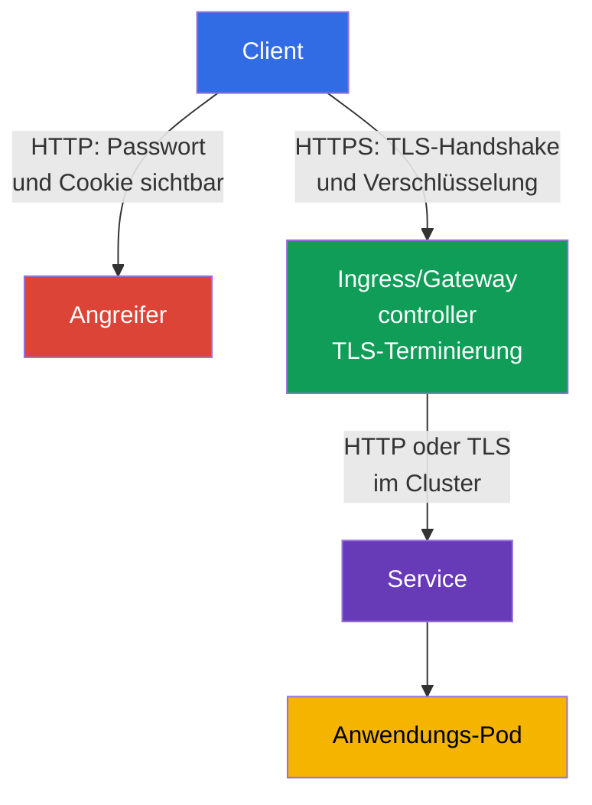
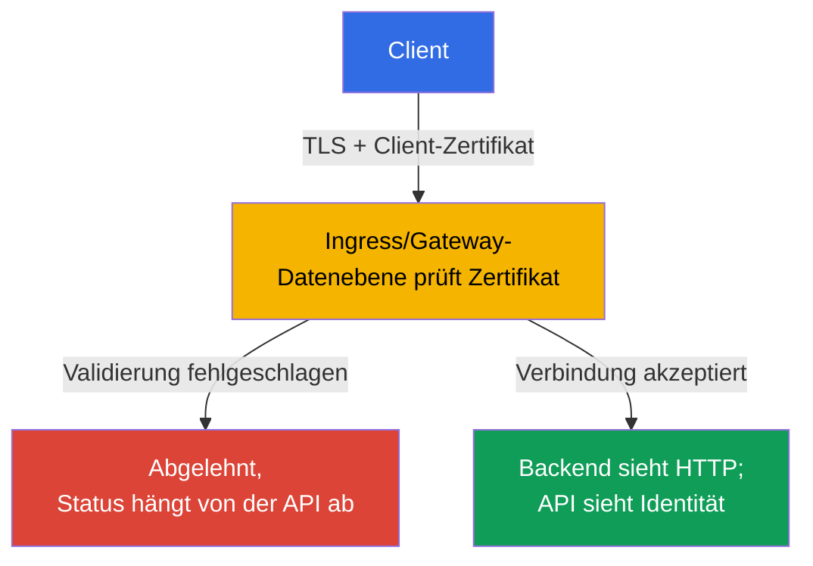

[Русская версия](ru.md) · [Eng version](README.md) · [Versión en español](es.md) · [Version française](fr.md) · [ქართული ვერსია](ge.md) · [繁體中文版](tw.md) · [日本語版](jp.md)

# Kapitel 08. Sicherer Ingress mit TLS

> **Das Problem.** Wenn ein Ingress Datenverkehr über gewöhnliches HTTP akzeptiert, werden Anmeldedaten, Cookies, Bearer-Token und Formularinhalte im Klartext über das Netzwerk übertragen. Ein Benutzer im selben nicht vertrauenswürdigen Netzwerk, ein bösartiger Wi-Fi-Access-Point oder ein zwischengeschalteter Proxy kann die Anfrage lesen oder die Antwort unbemerkt verändern - der öffentliche Einstiegspunkt der Anwendung bleibt für Abfangen offen, noch bevor der Datenverkehr einen Pod erreicht.

> **Was kommt als Nächstes.** In Kapitel 07 haben wir die Konfiguration der Cluster-Komponenten geprüft und gehärtet. Jetzt schützen wir den öffentlichen Einstiegspunkt von Anwendungen. **Ingress mit TLS** verschlüsselt HTTP-Datenverkehr zwischen Client und ingress controller, bestätigt den Servernamen und verhindert, dass ein Angreifer eine Anfrage unbemerkt liest oder verändert. Dies ist die CKS-Domain Cluster Setup (15%).

> **Was Sie aus CKA benötigen.** Die grundlegende Syntax von Ingress und Service sowie Host/Path-Routing werden in [CKA-Kapitel 32](../../../cka/course/32/de.md) behandelt. Die TLS-Architektur, Zertifikate, private Schlüssel und die Prüfung von Zertifikatsketten finden Sie in [CKA-Kapitel 00-3](../../../cka/course/00-3-tls/de.md). Hier betrachten wir die sichere Anwendung dieser Mechanismen am öffentlichen Einstiegspunkt, statt ihre Grundlagen zu wiederholen.

> 🧠 TLS schützt nur den Pfad vom Client bis zur TLS-Terminierung; controller → Service → Pod ist eine separate Grenze.

## 08.1. Bedrohungsmodell: Warum HTTP bei Ingress nicht ausreicht

Ein ingress controller akzeptiert üblicherweise Datenverkehr aus einem externen Netzwerk und leitet ihn zu einem Service und anschließend zu einem Pod weiter. Verbindet sich der Client über HTTP, werden Anmeldedaten, Cookies, Bearer-Token und Formularinhalte im Klartext über das Netzwerk übertragen. Ein Benutzer im selben nicht vertrauenswürdigen Netzwerk, ein bösartiger Wi-Fi-Access-Point oder ein zwischengeschalteter Proxy kann die Anfrage lesen oder die Antwort verändern.

TLS schützt den Kanal vom Client bis zum Punkt der **TLS-Terminierung** - dem ingress controller. Der Controller legt ein Zertifikat für den Hostnamen vor, führt den TLS-Handshake durch, entschlüsselt die Anfrage und leitet gewöhnlichen HTTP-Datenverkehr an das Backend weiter. TLS am externen Einstiegspunkt bedeutet daher nicht, dass der Pfad controller -> Service -> Pod automatisch verschlüsselt ist. Sensibler Datenverkehr innerhalb des Clusters benötigt separate Maßnahmen: TLS in der Anwendung, ein Service Mesh oder Cilium Transparent Encryption, das in Kapitel 23 behandelt wird.



Drei Eigenschaften werden gleichzeitig benötigt:

- Vertraulichkeit - Datenverkehr zwischen Client und controller darf nicht lesbar sein;
- Integrität - eine Anfrage oder Antwort darf nicht unbemerkt verändert werden;
- Authentizität - der Client prüft, dass das Zertifikat für den angeforderten Host ausgestellt wurde.

Verschlüsselung behebt kein unsicheres Backend, kein übermäßiges RBAC und keinen offengelegten Endpoint. Sie ist eine Ebene von Defense in Depth. Verwechseln Sie ein TLS-Zertifikat auch nicht mit einem Kubernetes Secret: Ein Secret speichert Schlüssel und Zertifikat, aktiviert TLS jedoch nicht selbst, bis ein Ingress darauf verweist.

> 🎯 Ein Testzertifikat mit SAN für einen gegebenen Host ausstellen, Zertifikat und Schlüssel vergleichen und `--cacert` statt `-k` verwenden zu können, ist das praktische Minimum für eine TLS-Aufgabe.

## 08.2. Zertifikat und Schlüssel: Test-Self-Signed und der Produktionsansatz

Für ein Lab können Sie ein Self-Signed-Zertifikat erstellen. Ein Client vertraut ihm standardmäßig nicht, daher endet ein gewöhnliches `curl` mit einem Fehler bei der Prüfung der Zertifikatskette.

Der bevorzugte Test ist, dem Lab-Zertifikat über `--cacert tls.crt` ausdrücklich zu vertrauen: curl prüft dann weiterhin das Zertifikat und die Übereinstimmung mit dem Hostnamen. `curl -k` deaktiviert die Zertifikatsprüfung vollständig und ist nur als separate diagnostische Prüfung akzeptabel, nicht als Nachweis einer korrekten TLS-Konfiguration.

Der Name aus der URL muss im **Subject Alternative Name** (SAN) enthalten sein. Moderne Clients prüfen SAN, nicht nur das veraltete Feld Common Name (CN). Das Zertifikat unten ist für `app.example.test` vorgesehen; für einen anderen Namen ändern Sie sowohl `HOST` als auch `subjectAltName`.

```bash
export HOST=app.example.test

openssl req -x509 -newkey rsa:2048 -nodes \
  -keyout tls.key \
  -out tls.crt \
  -days 30 \
  -subj "/CN=${HOST}" \
  -addext "subjectAltName=DNS:${HOST}"

# Vor dem Hochladen in den Cluster Subject und SAN prüfen
openssl x509 -in tls.crt -noout -subject -ext subjectAltName

# Der öffentliche Schlüssel des Zertifikats muss mit dem öffentlichen Schlüssel des privaten Schlüssels übereinstimmen.
# Die Hashes der beiden Befehle müssen identisch sein.
openssl x509 -in tls.crt -pubkey -noout \
  | openssl pkey -pubin -outform DER | sha256sum
openssl pkey -in tls.key -pubout -outform DER \
  | sha256sum

# Für ein CA-Zertifikat die Kette prüfen: Leaf -> Intermediate -> vertrauenswürdige Root.
# `tls.crt` für einen controller enthält normalerweise Leaf gefolgt von Intermediate; die Root ist nicht enthalten.
openssl verify -show_chain -CAfile root-ca.crt \
  -untrusted intermediate-ca.crt leaf.crt
```

Vor dem Erstellen des Secret schließen übereinstimmende öffentliche Schlüssel ein Zertifikat/Schlüssel-Paar aus verschiedenen Ausstellungen aus. In der Ausgabe von `openssl verify -show_chain` muss das Leaf über das Intermediate bis zu einer vertrauenswürdigen Root geprüft werden; ein Fehler in einem Glied bedeutet, dass dieses Zertifikat nicht hochgeladen werden darf.

Die Option `-nodes` lässt den privaten Schlüssel ohne Passphrase. Das ist erforderlich, weil der controller den Schlüssel ohne interaktive Eingabe lesen muss. Der Schutz beruht in diesem Fall auf strengem RBAC für das Secret, eingeschränktem etcd-Zugriff und Encryption at Rest - nicht auf einer Passphrase in der Schlüsseldatei.

> 🏭 Eine vertrauenswürdige CA, automatische Erneuerung, ein Verantwortlicher, Ablaufwarnungen und getestete Secret-Rotation.

Erstellen Sie in der Produktion keine langlebigen Self-Signed-Zertifikate manuell. Üblicherweise bezieht `cert-manager` ein Zertifikat von einer vertrauenswürdigen CA wie Let's Encrypt, speichert es in einem Secret und erneuert es vor Ablauf. Das Plattformteam muss außerdem einen Zertifikatsverantwortlichen, Ablaufwarnungen und ein Rotationsverfahren festlegen. Wenn TLS vor dem Cluster an einem Cloud Load Balancer terminiert wird, prüfen Sie, ob die Verbindung zu NGINX ebenfalls die Organisationsanforderungen erfüllt: TLS kann auch auf diesem Segment nötig sein.

> 🎯 Erstellen Sie ein Secret vom Typ `kubernetes.io/tls` mit den Schlüsseln `tls.crt` und `tls.key` und prüfen Sie dann Namespace und Namen: Ein Ingress kann nur auf ein Secret im eigenen Namespace verweisen.

## 08.3. TLS Secret: Format und Geltungsbereich

Verwenden Sie für Ingress TLS ein standardmäßiges TLS Secret vom Typ `kubernetes.io/tls` mit den Schlüsseln `tls.crt` und `tls.key`. Genau dieses Objekt erstellt `kubectl create secret tls`.

Der portable Ingress-TLS-Vertrag verlangt das Zertifikat und den privaten Schlüssel unter `tls.crt` und `tls.key`; zusätzliche Prüfungen von Secret-Typ und Inhalt hängen vom controller ab. `kubernetes.io/tls` ist daher das richtige Standardformat für Kurs und Produktion, sollte aber nicht als einziger Mechanismus beschrieben werden, den die Ingress API selbst lesen kann. Der Typ `kubernetes.io/tls` wird aus Gründen der Bequemlichkeit und Konsistenz bereitgestellt: Die Kubernetes API prüft die erforderlichen Schlüssel eines Secret dieses Typs, während TLS-Credentials technisch auch in einem `Opaque` Secret gespeichert werden können, obwohl dieses Secret keine solche Prüfung erhält und anderen Ingenieuren den Zweck des Objekts nicht vermittelt. Die zuverlässigste Methode, es aus bereits geprüften Dateien zu erstellen, ist `kubectl create secret tls`: Der Befehl legt das Zertifikat unter `tls.crt` und den privaten Schlüssel unter `tls.key` ab.

```bash
kubectl -n web create secret tls app-example-tls \
  --cert=tls.crt \
  --key=tls.key

kubectl -n web get secret app-example-tls \
  -o jsonpath='{.type}{"\n"}{.data.tls\.crt}{"\n"}{.data.tls\.key}{"\n"}'
# kubernetes.io/tls
# Base64-Werte von tls.crt und tls.key
```

Dasselbe Objekt als Manifest sieht wie folgt aus. Hier bleibt `data` vor allem deshalb absichtlich unausgefüllt, weil der private Schlüssel `tls.key` nicht im Klartext in Git committed werden darf.

Das X.509-Zertifikat `tls.crt` enthält den öffentlichen Schlüssel und ist selbst kein Secret; ob das öffentliche Zertifikat in einem Repository gespeichert wird, ist eine separate Entscheidung der Repository-Policy. Der private Schlüssel muss immer vertraulich bleiben. `stringData` ist für kurze Testwerte bequemer, macht den Repository-Inhalt aber nicht geheim.

```yaml
apiVersion: v1
kind: Secret
metadata:
  name: app-example-tls
  namespace: web
type: kubernetes.io/tls
data:
  tls.crt: <base64-encoded-certificate>
  tls.key: <base64-encoded-private-key>
```

Ein Secret ist namespaced. Ein Ingress im Namespace `web` kann nicht auf ein Secret aus `default` oder einem anderen Namespace verweisen. Erteilen Sie einer Anwendung nicht nur für TLS `get`/`list` auf alle Secret: Das Zertifikat wird gewöhnlich vom controller bereitgestellt, während die Berechtigung zum Erstellen und Lesen solcher Secret durch eine separate Rolle eingeschränkt wird. Base64 in `data` ist Kodierung, keine Verschlüsselung.

> 🎯 Binden Sie einen Host in `spec.tls.hosts` und `spec.rules.host` ein und geben Sie `secretName`, Service und `ingressClassName` an.

## 08.4. Ingress: Host, TLS Secret und Backend verbinden

Die portablen Felder der Ingress API sind hier `spec.tls` (`hosts`, `secretName`) und `spec.rules` (`host`, `path`, `pathType`, `backend`). Sie beschreiben TLS-Zertifikat und Routing, konfigurieren jedoch **keine** HTTP -> HTTPS-Weiterleitung. `spec.ingressClassName` ist ebenfalls ein API-Feld, aber der Klassenwert selbst, beispielsweise `nginx`, wählt eine bestimmte Implementierung aus. Annotations, einschließlich `nginx.ingress.kubernetes.io/*`, gehören überhaupt nicht zur Ingress API: Nur der jeweilige controller bestimmt ihre Bedeutung.

Der Host-Abgleich ist zweimal wichtig: Der controller wählt während des TLS-Handshake das richtige Zertifikat aus und der Client prüft, dass der Name aus der URL im SAN steht. Stellen Sie vor dem Anwenden sicher, dass die benötigte Klasse und der Service existieren:

```bash
kubectl get ingressclass
kubectl -n web get service web
```

Im Folgenden wird vorausgesetzt, dass Service `web` im Namespace `web` auf Port 80 lauscht. Das Manifest erstellt weder Service noch Deployment: Das sind CKA-Grundlagen und sie müssen separat existieren.

```yaml
apiVersion: networking.k8s.io/v1
kind: Ingress
metadata:
  name: web-secure
  namespace: web
spec:
  # API-Feld; `nginx` ist eine Implementierungswahl, kein portabler Wert.
  ingressClassName: nginx
  tls:
  - hosts:
    - app.example.test
    secretName: app-example-tls
  rules:
  - host: app.example.test
    http:
      paths:
      - path: /
        pathType: Prefix
        backend:
          service:
            name: web
            port:
              number: 80
```

Sie können die Objektbindung ohne externes DNS prüfen:

```bash
kubectl -n web describe ingress web-secure
kubectl -n web get ingress web-secure -o yaml
kubectl -n web get secret app-example-tls -o jsonpath='{.type}{"\n"}'
```

Prüfen Sie in der Ausgabe von `describe` die `Ingress Class`, die Regel für `app.example.test`, den TLS-Host, das Secret und die Events.

Ein Fehler beim Lesen des Secret oder das Fehlen von Backend-Endpoints muss tatsächlich behoben werden, bevor eine vollständige End-to-End-Prüfung erfolgen kann.

Betrachten Sie das Feld `ADDRESS` separat: Es spiegelt den veröffentlichten Ingress-Status wider und kann bei NodePort, Bare Metal, `hostNetwork`, Port-Forward oder einigen lokalen Fixtures leer bleiben, obwohl der Ingress funktioniert. Prüfen Sie die TLS-Bereitschaft über den tatsächlichen Einstiegspunkt des ausgewählten controller, nicht nur anhand eines Werts in `ADDRESS`.

## 08.5. ingress-nginx: eingestellter Controller und Grenzen der Annotations

> **NGINX Ingress Controller eingestellt.** Seit März 2026 ist das Projekt `ingress-nginx` eingestellt und erhält keine Releases oder Security-Fixes mehr ([Ankündigung](https://kubernetes.io/blog/2025/11/11/ingress-nginx-retirement/)). CKS verlangt einen korrekt konfigurierten Ingress mit TLS, aber die öffentliche Kompetenz garantiert keinen bestimmten controller oder nginx-spezifische Annotations. Prüfen Sie in der Prüfung zuerst den vom Lab bereitgestellten controller; die Syntax `ingressClassName: nginx` und seine Annotations sind nur ein mögliches Fixture. Stellen Sie den eingestellten Controller für die Produktion nicht auf neuen Clustern bereit: Wählen Sie eine unterstützte Implementierung oder Gateway API. Der portable Teil - TLS Secret, `spec.tls`, Host/SNI, SAN, Service-Endpoints und HTTPS-Prüfung - hängt nicht vom controller ab.

> 🎯 Für ingress-nginx aktiviert `spec.tls` normalerweise die Weiterleitung; `ssl-redirect` und `force-ssl-redirect` hängen von Implementierung und Topologie ab.

Auch ein korrekter TLS Ingress lässt ein Risiko bestehen, wenn HTTP verfügbar bleibt: Ein Benutzer kann einem alten Link folgen und ein Cookie oder Formular wird vor der ersten HTTPS-Antwort übertragen. Bei **ingress-nginx** aktiviert das Vorhandensein eines `spec.tls`-Blocks standardmäßig die HTTP -> HTTPS-Weiterleitung (üblicherweise `308`), sofern die Konfiguration des controller dies nicht überschreibt. Daher ist es weder notwendig noch als verpflichtendes Rezept für einen gewöhnlichen TLS Ingress korrekt, sowohl `ssl-redirect` als auch `force-ssl-redirect` zu setzen.

Dies ist ingress-nginx-Semantik, nicht die Ingress API. Wenn Sie die ingress-nginx-Konfiguration für einen Ingress mit `spec.tls` ausdrücklich überschreiben müssen, verwenden Sie nur seine controllerspezifische Annotation `ssl-redirect`:

```yaml
metadata:
  annotations:
    nginx.ingress.kubernetes.io/ssl-redirect: "true"
```

Reservieren Sie `force-ssl-redirect` für eine andere Topologie: TLS terminiert an einem **externen** Load Balancer/Proxy, der controller empfängt HTTP und der Ingress besitzt keinen `spec.tls`-Block. Der externe Proxy muss dann Informationen über das ursprüngliche HTTPS-Schema korrekt weitergeben, andernfalls ist eine Redirect-Schleife möglich. Zum Beispiel ein separater Ingress für diese externe SSL-Offload-Konfiguration:

```yaml
apiVersion: networking.k8s.io/v1
kind: Ingress
metadata:
  name: web-external-tls
  namespace: web
  annotations:
    nginx.ingress.kubernetes.io/force-ssl-redirect: "true"
spec:
  ingressClassName: nginx
  rules:
  - host: app.example.test
    http:
      paths:
      - path: /
        pathType: Prefix
        backend:
          service:
            name: web
            port:
              number: 80
```

Ersetzen Sie eine Weiterleitung am Edge nicht durch Anwendungslogik, wenn sie am Edge bereitgestellt werden kann. Andernfalls muss jedes Backend dieselbe Konfiguration wiederholen und ein versehentlich hinzugefügter Service kann über HTTP erreichbar bleiben. HSTS ergänzt die Weiterleitung nach der ersten erfolgreichen HTTPS-Verbindung, ersetzt TLS jedoch nicht und verlangt eine gesondert sorgfältige Policy für Domains und Subdomains.

> 🏭 Ein unterstützter Gateway API controller und dessen Status/Kompatibilität; die Fähigkeiten von `GatewayClass` werden durch die jeweilige Implementierung bestimmt.

> 🔬 **Aktualität von Gateway API v1.6.** In Gateway API v1.6 wechselten `TCPRoute` und `UDPRoute` zu Standard `v1`; neue experimentelle Ressourcen befinden sich in einer separaten Gruppe `gateway.networking.x-k8s.io` mit dem Präfix `X`. `XBackend` bleibt experimentell und seine Unterstützung für `ExternalHostname` erfordert wegen Security-Trade-offs, einschließlich eines Confused-Deputy-Risikos, eine bewusste Aktivierung. Dies ist aktueller Produktionskontext, nicht CKS Core. [Offizieller Release-Blog](https://kubernetes.io/blog/2026/08/03/gateway-api-v1-6-release/).

### Gateway API: der aktuelle Produktionspfad

Gateway API beschreibt drei TLS-Modelle: **Edge-Terminierung** (ein HTTPS-Listener entschlüsselt Datenverkehr am Gateway), **TLS Passthrough** (das Gateway leitet den TLS-Handshake ohne Terminierung an das Backend weiter) und TLS zum Backend nach der Terminierung (Re-Encryption). Beim letzten Modell konfiguriert `BackendTLSPolicy` aus Gateway API v1.4.0 - GA im Standard Channel - SNI und die Prüfung des Backend-Zertifikats. Die Unterstützung eines bestimmten Modells hängt vom Gateway controller ab.

Verwenden Sie für einen neuen Produktionscluster eine unterstützte Gateway API-Implementierung. Im folgenden Beispiel ist `platform-gateway` ein **implementierungsspezifischer** `GatewayClass`-Name: Er wird vom ausgewählten Gateway controller bereitgestellt und ist kein Kubernetes-Standardwert. `certificateRefs` verweist auf dasselbe TLS Secret im Namespace `web`; der HTTPS-Listener führt die TLS-Terminierung durch und `HTTPRoute` leitet die Anfrage zu einem Service weiter.

```yaml
apiVersion: gateway.networking.k8s.io/v1
kind: Gateway
metadata:
  name: web-gateway
  namespace: web
spec:
  gatewayClassName: platform-gateway # Name hängt vom Gateway controller ab
  listeners:
  - name: https
    protocol: HTTPS
    port: 443
    hostname: app.example.test
    tls:
      mode: Terminate
      certificateRefs:
      - kind: Secret
        name: app-example-tls
---
apiVersion: gateway.networking.k8s.io/v1
kind: HTTPRoute
metadata:
  name: web-secure
  namespace: web
spec:
  parentRefs:
  - name: web-gateway
    sectionName: https
  hostnames:
  - app.example.test
  rules:
  - matches:
    - path:
        type: PathPrefix
        value: /
    backendRefs:
    - name: web
      port: 80
```

Wenn das Gateway auch Port 80 bereitstellt, fügen Sie einen separaten HTTP-Listener und eine `HTTPRoute` mit dem Standardfilter `RequestRedirect` zu `https` hinzu; mischen Sie dies nicht mit der HTTPS-Route zum Backend.

> 🔬 TLS Passthrough terminiert TLS und mTLS im Backend; prüfen Sie die Unterstützung des controller für `TLSRoute`, SNI-Routing und Passthrough.

### TLS Passthrough: `TLSRoute`

Für ein Backend, das TLS selbst terminiert (weil es beispielsweise ein eigenes Zertifikat oder mTLS benötigt), entschlüsselt das Gateway die Verbindung nicht: Der Listener hat `protocol: TLS` und `tls.mode: Passthrough`, und die Route wird durch SNI ausgewählt. `TLSRoute` ist im Standard Channel von Gateway API v1.5.0 GA. Das folgende Minimalbeispiel leitet TLS für `app.example.test` an Service `web-tls` auf Port 443 weiter; der controller muss TLSRoute und Passthrough unterstützen.

```yaml
apiVersion: gateway.networking.k8s.io/v1
kind: Gateway
metadata:
  name: passthrough-gateway
  namespace: web
spec:
  gatewayClassName: platform-gateway
  listeners:
  - name: tls
    protocol: TLS
    port: 443
    hostname: app.example.test
    tls:
      mode: Passthrough
---
apiVersion: gateway.networking.k8s.io/v1
kind: TLSRoute
metadata:
  name: web-tls-passthrough
  namespace: web
spec:
  parentRefs:
  - name: passthrough-gateway
    sectionName: tls
  hostnames:
  - app.example.test
  rules:
  - backendRefs:
    - name: web-tls
      port: 443
```

Bei Passthrough gehört das Secret mit dem Zertifikat zum Backend und nicht in `certificateRefs` des Gateway; prüfen Sie das SNI/SAN-Zertifikat und die Endpoints des Backend.

Ein Gateway-Verweis auf ein `Secret` in einem anderen Namespace benötigt einen expliziten `ReferenceGrant` **im Secret-Namespace**; ohne diesen darf der controller die Namespace-übergreifende Referenz nicht akzeptieren. Übertragen Sie diese Logik nicht auf `BackendTLSPolicy`: Namespace-übergreifende Zertifikats-/CA-Referenzen für Backend TLS sind selbst mit einem `ReferenceGrant` nicht zulässig.

Prüfen Sie unterstützte `GatewayClass`-Objekte mit `kubectl get gatewayclass` und den Gateway-Status, bevor Sie Datenverkehr migrieren.

> 🧠 mTLS authentifiziert den Client am Edge während des TLS-Handshake, ersetzt jedoch weder die Anwendungsautorisierung noch mTLS zwischen Pods.

## 08.6. mTLS am Einstiegspunkt: Der Controller prüft das Client-Zertifikat

Alles oben in diesem Kapitel ist **serverseitiges TLS**: Der controller weist dem Client seine Identity mit einem Zertifikat nach, während der Client auf TLS-Ebene anonym bleibt. Eine separate Aufgabe ist **mutual TLS (mTLS) am Einstiegspunkt**: Der controller fordert vom Client zusätzlich sein Zertifikat an und prüft es anhand einer vertrauenswürdigen CA, **bevor** die Anfrage das Backend erreicht. Verwechseln Sie dies nicht mit Themen aus anderen Kapiteln:

- Kapitel 23 behandelt mTLS **zwischen Pods innerhalb eines Mesh** (Istio/Linkerd Sidecar-zu-Sidecar);
- TLS Passthrough aus 08.5 überträgt die Verpflichtung zur Client-Prüfung **auf das Backend selbst**, nicht auf Gateway/Ingress;
- hier wird gerade der **controller an der Cluster-Grenze** selbst zum TLS-Server für den Client und prüft gleichzeitig das Client-Zertifikat.



Machen Sie einen HTTP-Statuscode nicht zum Bestandteil des allgemeinen mTLS-Modells. Bei ingress-nginx liefert der Modus `on` bei fehlgeschlagener Zertifikatsprüfung `400`, während `auth-tls-match-cn` `403` liefern kann. In Gateway API validiert `AllowValidOnly` das Zertifikat während des TLS-Handshake, daher kann eine Implementierung die TLS-Verbindung selbst ohne HTTP-Antwort ablehnen - ein controller-neutrales Modell mit "immer 400/403" gibt es hier nicht.

> 🔬 `auth-tls-*` ist eine eingestellte ingress-nginx-API; das portable Modell ist ein gültiges Client-Zertifikat am Edge.

### ingress-nginx: Annotations `auth-tls-*`

Client Certificate Authentication wird durch ein `Secret` mit der CA-Kette im Schlüssel `ca.crt` und einen Satz Annotations auf einem `Ingress`-Objekt aktiviert:

```yaml
apiVersion: networking.k8s.io/v1
kind: Ingress
metadata:
  name: web-mtls
  namespace: web
  annotations:
    nginx.ingress.kubernetes.io/auth-tls-secret: "web/client-ca"
    nginx.ingress.kubernetes.io/auth-tls-verify-client: "on"
    nginx.ingress.kubernetes.io/auth-tls-verify-depth: "1"
    nginx.ingress.kubernetes.io/auth-tls-pass-certificate-to-upstream: "true"
spec:
  tls:
  - hosts: [app.example.test]
    secretName: web-tls
  rules:
  - host: app.example.test
    http:
      paths:
      - path: /
        pathType: Prefix
        backend:
          service:
            name: web
            port:
              number: 80
```

- `auth-tls-secret` verweist auf ein Secret im Format `namespace/name`, dessen `ca.crt` die vertrauenswürdige CA-Kette für Client-Zertifikate enthält - es ist ein separates Secret gegenüber dem serverseitigen `web-tls` aus 08.3, obwohl beide für denselben Host gelten.
- `auth-tls-verify-client: "on"` verlangt ein Client-Zertifikat, das erfolgreich anhand der CA aus `auth-tls-secret` geprüft wurde; eine fehlgeschlagene Zertifikatsprüfung endet mit HTTP `400`.
- `optional` verlangt nicht von jedem Client ein Zertifikat, ist aber **kein** Modus "nie ablehnen": Legt ein Client ein Zertifikat vor, das nicht von der konfigurierten CA signiert ist, gibt ingress-nginx weiterhin HTTP `400` zurück. Wenn die Anfrage zugelassen wird, kann ihr Prüfergebnis Upstream übergeben werden.
- `optional_no_ca` lehnt eine Anfrage nicht allein deshalb ab, weil das Client-Zertifikat nicht von der CA aus `auth-tls-secret` signiert ist; das Prüfergebnis wird Upstream übergeben. Verwenden Sie diesen Modus nur, wenn die Anwendung oder eine separate Autorisierungsschicht tatsächlich anhand dieses Ergebnisses entscheidet.
- Bei einer weitergeleiteten Upstream-Anfrage sendet ingress-nginx `ssl-client-verify`, `ssl-client-subject-dn` und `ssl-client-issuer-dn`; das vollständige PEM-Zertifikat in `ssl-client-cert` wird nur mit `auth-tls-pass-certificate-to-upstream: "true"` gesendet.
- Client Certificate Authentication gilt für den gesamten Host, nicht für einen einzelnen Path.

> 🔬 Die Frontend-Validierung von Gateway API erfordert Unterstützung durch API-Version und controller; prüfen Sie das Feld, CA-Referenzen und den Handshake.

### Gateway API: Frontend-Validierung von Client-Zertifikaten auf Gateway-Ebene

Die Frontend-Validierung von Client-Zertifikaten kommt über das Feld `spec.tls.frontend` eines `Gateway`-Objekts in Gateway API, nicht über `HTTPRoute`. Das aktuelle Schema unterscheidet sich von der früheren Proposal-Variante (`default.frontendValidation` aus GEP-91): In der veröffentlichten API lautet der Pfad `spec.tls.frontend.default.validation`, und der Override pro Port ist `spec.tls.frontend.perPort[].tls.validation`.

```yaml
apiVersion: gateway.networking.k8s.io/v1
kind: Gateway
metadata:
  name: mtls-gateway
  namespace: web
spec:
  gatewayClassName: platform-gateway
  tls:
    frontend:
      default:
        validation:
          caCertificateRefs:
          - group: ""
            kind: ConfigMap
            name: client-ca
          mode: AllowValidOnly
  listeners:
  - name: app-https
    protocol: HTTPS
    port: 443
    hostname: app.example.test
    tls:
      mode: Terminate
      certificateRefs:
      - group: ""
        kind: Secret
        name: web-tls
```

Das `ConfigMap` `client-ca` enthält das vertrauenswürdige CA-Zertifikat (Trust Anchor) im Schlüssel `ca.crt`. Die portable Core-Variante von Gateway API ist ein `caCertificateRefs` auf ein `ConfigMap` mit einem CA-Zertifikat. Mehrere CA-Zertifikate in einem `ca.crt`, mehrere `caCertificateRefs` oder andere Ressourcenarten sind implementierungsspezifische Unterstützung; prüfen Sie solche Varianten daher anhand der Dokumentation des jeweiligen Gateway controller.

- `spec.tls.frontend.default.validation` prüft den Client bei der Verbindung **zum Gateway** und gilt für alle HTTPS-Listener ohne Override pro Port; dies ist nicht dasselbe wie `BackendTLSPolicy`, die TLS vom Gateway **zum Backend** steuert - beide Policys sind unabhängig und können gleichzeitig gelten.
- `spec.tls.frontend.perPort[].tls.validation` überschreibt diese Konfiguration für alle HTTPS-Listener am angegebenen Port.
- `mode: AllowValidOnly` (Standard) lehnt eine Verbindung ohne gültiges Zertifikat ab. `AllowInsecureFallback` akzeptiert eine Verbindung auch ohne Zertifikat oder bei fehlgeschlagener Prüfung und delegiert die Entscheidung zur Client-Autorisierung an das Backend. Dieser Zustand wird durch die Bedingung `InsecureFrontendValidationMode` auf dem `Gateway` ausdrücklich markiert und schafft ein erhebliches Sicherheitsrisiko. Gateway API empfiehlt diesen Modus in Testumgebungen oder nur vorübergehend in Nicht-Testumgebungen; für gewöhnliches Produktions-mTLS sollten Sie `AllowValidOnly` bevorzugen.
- Die Unterstützung der Frontend-Validierung von Client-Zertifikaten hängt vom jeweiligen Gateway API controller ab; prüfen Sie sie vor der Verwendung in der Liste unterstützter Implementierungen für Ihre Version.

Beide Mechanismen lösen dieselbe Aufgabe über verschiedene APIs: Sowohl NGINX Ingress über `auth-tls-*` als auch Gateway API über `spec.tls.frontend...validation` können ein Client-Zertifikat an der Cluster-Grenze prüfen. Welcher verfügbar ist, hängt nicht vom mTLS-Konzept selbst ab, sondern davon, welcher ingress controller oder welche Gateway API-Implementierung im Cluster bereitgestellt ist - wählen Sie die Syntax für den tatsächlich installierten controller, nicht umgekehrt.

### Fallstrick: Der Geltungsbereich der Client-Zertifikatsvalidierung hängt von der API ab

Ein Client-Zertifikat wird während des TLS-Handshake vor dem HTTP-Path-Routing geprüft. Sein genauer Policy-Geltungsbereich unterscheidet sich jedoch zwischen APIs und ist nicht universell:

- **ingress-nginx:** Client Certificate Authentication gilt **pro Host** und kann für einzelne Paths eines Hosts keine unterschiedlichen Regeln haben. Wenn `/admin` ein striktes Client-Zertifikat verlangt, während `/public` auf TLS-Ebene keines verlangen darf, lassen sich solche Handshake-Anforderungen nicht durch zwei Paths eines ingress-nginx-Hosts ausdrücken.
- **Gateway API:** Die Frontend-Validierung von Client-Zertifikaten wird auf `Gateway`-Ebene konfiguriert: `default` gilt für alle HTTPS-Listener ohne Override und `perPort` für alle HTTPS-Listener am angegebenen Port. Unterschiedliche `hostname`/Listener eines Gateway auf einem Port erhalten **keine** unabhängigen Client-Zertifikats-Policys - GEP-91 erklärt ausdrücklich, dass eine engere Bindung ein Umgehungsrisiko durch HTTP/2/TLS Connection Coalescing erzeugen würde: Eine bereits bestehende TLS-Verbindung kann einen Listener mit anderem Hostname am selben Port bedienen.

Die praktische Folge: Verwenden Sie die Regel "unterschiedlicher Hostname bedeutet immer eine separate mTLS-Policy" nicht als portables Modell. Bei Gateway API müssen unterschiedliche Anforderungen auf Handshake-Ebene über verschiedene Ports oder wirklich isolierte TCP/TLS-Einstiegspunkte getrennt werden, die die ausgewählte Implementierung nachweislich nicht zusammenfasst; prüfen Sie die konkrete Topologie anhand der Dokumentation des controller.

Die Autorisierung nach HTTP-Path/Method erfolgt erst nach dem TLS-Handshake in einer HTTP-fähigen Autorisierungsschicht oder in der Anwendung. `auth-tls-match-cn` von ingress-nginx ist keine Path/Method-Autorisierung: Die Annotation gleicht nur zusätzlich den CN des Client-Zertifikats mit einer Zeichenfolge oder Regex ab.

Übertragen Sie `ssl-client-verify` aus ingress-nginx nicht als allgemeinen Vertrag auf Gateway API. Ingress-nginx dokumentiert `ssl-client-*`-Header und Gateway API standardisiert die Frontend-Zertifikatsvalidierung, aber kein allgemeines Format zur Übergabe der Client-Identity an das Backend. Wenn das Backend diese Identity erhalten muss, prüfen Sie separat den Mechanismus der jeweiligen Gateway-Implementierung.

Betrachten Sie mTLS am Einstiegspunkt nicht als universellen Ersatz für RBAC oder Anwendungsautorisierung: Die Zertifikatsprüfung an der Cluster-Grenze bestätigt die Identity des TLS-Clients, autorisiert aber keine bestimmte Aktion in der Anwendung.

> 🎯 `curl --resolve` mit `--cacert` prüft HTTPS, und `openssl s_client -servername` prüft das vom controller bereitgestellte Zertifikat.

## 08.7. Prüfung: Controller-neutrales HTTPS, Host und Zertifikat

Bestimmen Sie zuerst den tatsächlichen öffentlichen Einstiegspunkt: die Service-Adresse des ausgewählten Ingress/Gateway controller, den Hostname des Load Balancer oder die durch das verwendete Fixture veröffentlichte Adresse. Für einen lokalen Cluster kann eine NodePort-Adresse oder `kubectl port-forward` nötig sein; warten Sie bei einem LoadBalancer auf die externe Adresse. Es wird kein Namespace oder Service-Name eines bestimmten controller vorausgesetzt.

```bash
kubectl get ingressclass
kubectl get gatewayclass
kubectl -n web get ingress,gateway,httproute,tlsroute
kubectl -n web get endpointslices -l kubernetes.io/service-name=web

export HOST=app.example.test
export ENTRYPOINT_IP=203.0.113.10  # Durch die Adresse des ausgewählten controller ersetzen
```

Wenn der Test-Host nicht in DNS veröffentlicht ist, zwingt `--resolve` `curl`, `ENTRYPOINT_IP` zu verwenden, während der korrekte Host-Header und SNI erhalten bleiben. Die portable Prüfung ist ein erfolgreicher HTTPS-Aufruf des Backend mit korrektem SNI und Host, bei dem das Zertifikat durch `--cacert` geprüft wird:

```bash
curl --cacert tls.crt -vsS -o /dev/null -w 'HTTP %{http_code}\n' \
  --resolve "${HOST}:443:${ENTRYPOINT_IP}" \
  "https://${HOST}/"
# HTTP 200
```

Nur zur Diagnose: ohne Zertifikatsprüfung verbinden. Der Erfolg dieses Befehls **beweist nicht** die Korrektheit von SAN/Kette:

```bash
curl -kvsS -o /dev/null \
  --resolve "${HOST}:443:${ENTRYPOINT_IP}" \
  "https://${HOST}/"
```

Die HTTP -> HTTPS-Weiterleitung und ihr Status hängen vom controller ab. **Nur wenn das Fixture `ingress-nginx`** mit `spec.tls` verwendet, können Sie `308` und `Location` gesondert erwarten:

```bash
curl -vI --resolve "${HOST}:80:${ENTRYPOINT_IP}" "http://${HOST}/"
```

Prüfen Sie nicht nur den Status `200`, sondern auch das Zertifikat, das der Client erhalten hat. `-servername` aktiviert SNI: Ohne dieses kann ein controller in einem Cluster mit mehreren Hosts ein Standardzertifikat bereitstellen.

```bash
openssl s_client -connect "${ENTRYPOINT_IP}:443" -servername "${HOST}" </dev/null 2>/dev/null \
  | openssl x509 -noout -subject -issuer -ext subjectAltName
# subject=CN = app.example.test
# X509v3 Subject Alternative Name:
#     DNS:app.example.test
```

Verwenden Sie für ein Zertifikat, dem der System-Trust-Store vertraut, gewöhnliches `curl` ohne `-k` und ohne das Lab-`--cacert tls.crt`: Der Client muss Kette und Namen über die vertrauenswürdigen System-CAs prüfen. Wird eine interne/private CA verwendet, übergeben Sie das vertrauenswürdige CA-Bundle mit `--cacert <ca-bundle.pem>`, statt die Prüfung über `-k` zu deaktivieren. Wenn `curl` `SSL certificate problem` meldet, umgehen Sie das Problem nicht in der Produktion. Prüfen Sie Ablaufdatum, SAN, CA-Kette, `secretName`, Namespace und ob der controller das aktualisierte Secret tatsächlich erneut eingelesen hat.

| Symptom | Was prüfen | Wahrscheinliche Ursache |
| --- | --- | --- |
| HTTP gibt Backend-`200` zurück | Annotations und tatsächlichen controller | Kein `ssl-redirect`, controller ist nicht NGINX oder seine Konfiguration überschreibt die Weiterleitung |
| HTTPS zeigt ein Standardzertifikat | `spec.tls.hosts`, SAN und SNI | Host stimmt nicht überein, Secret wurde nicht gefunden oder Anfrage ohne `--resolve`/SNI |
| `curl` erhält `404` von NGINX | Host, `rules.host`, `ingressClassName` | Die Anfrage erreichte den controller, aber keine Regel wurde ausgewählt |
| HTTPS gibt `503` zurück | Service, Endpoints und Pod-Readiness | TLS funktioniert, aber das Backend ist nicht verfügbar |
| Secret existiert, aber TLS wurde nicht aktiviert | `tls.crt`, `tls.key`, Namespace und Anforderungen des jeweiligen controller | `tls.crt`/`tls.key` fehlen oder sind fehlerhaft, Zertifikat passt nicht zum privaten Schlüssel, Secret befindet sich in einem anderen Namespace oder controller akzeptiert das verwendete Secret-Format nicht |
| Browser vertraut dem Zertifikat nicht | Issuer, Kette und Ablaufdatum | Self-Signed-Zertifikat oder unvollständige CA-Kette |

> 🏭 Zertifikatsausstellung und -rotation, minimaler Zugriff auf den privaten Schlüssel, ein unterstützter controller und synthetische Prüfungen nach Änderungen.

## 08.8. Anwendung in der Produktion

- **Automatische Ausstellung und Rotation.** `cert-manager` und eine vertrauenswürdige CA stellen Zertifikate aus, erneuern sie vor Ablauf und aktualisieren das TLS Secret. Das Team überwacht die Metriken für das Ablaufdatum und erhält rechtzeitig Alerts.
- **HTTPS als Standard.** Bei ingress-nginx liefert `spec.tls` standardmäßig eine Weiterleitung; `ssl-redirect` ist nur ein ausdrücklich controllerspezifischer Override. `force-ssl-redirect` verwenden Sie nur bei externem TLS-Offload ohne `spec.tls`-Block. Externer Load Balancer, controller und Anwendung verarbeiten Proxy-Header abgestimmt, um keine Redirect-Schleife zu erzeugen.
- **API-Migrationsplan.** Bei neuen Clustern ersetzt Gateway mit HTTPS-Listener und `certificateRefs` zusammen mit `HTTPRoute` den eingestellten ingress-nginx; die installierte Implementierung wählt die konkrete `GatewayClass`.
- **Minimaler Zugriff auf Schlüssel.** RBAC erteilt nur dem controller und der Zertifikatsautomatisierung Berechtigungen für das TLS Secret. Secret Encryption at Rest und geschütztes etcd verringern das Risiko, dass private Schlüssel offengelegt werden.
- **Trennung von Grenzen.** Separate Namespaces, IngressClass und Zertifikate für Tenants oder kritische Domains verringern die Wahrscheinlichkeit, versehentlich ein fremdes Zertifikat oder eine fremde Route auszuliefern.
- **Prüfung nach jeder Änderung.** Eine Pipeline führt einen HTTPS-Aufruf mit korrektem SNI aus und prüft erwarteten SAN, Ablaufdatum des Zertifikats und Erreichbarkeit des Backend. Wenn die Policy einen HTTP-Listener mit Weiterleitung auf HTTPS vorsieht, prüft die Pipeline zusätzlich die erwartete `30x`-Weiterleitung. Bei einer reinen HTTPS-Topologie kann das korrekte Ergebnis das vollständige Fehlen eines erreichbaren HTTP-Listeners sein. Damit wird ein Fehler erkannt, bevor ein Benutzer ihn sieht.

## 08.9. Mini-Glossar

- **TLS-Terminierung** - Abschluss des TLS-Handshake und Entschlüsselung des Datenverkehrs am ingress controller.
- **Ingress** - API-Objekt mit Regeln für externes HTTP/HTTPS-Routing zu einem Service.
- **IngressClass** - Auswahl der Ingress-Implementierung, zum Beispiel NGINX Ingress Controller; der Klassenname hängt vom installierten controller ab.
- **GatewayClass** - Auswahl der Gateway API-Implementierung; ihr Name ist ebenfalls implementierungsspezifisch.
- **TLS Secret** - Secret vom Typ `kubernetes.io/tls` mit den Schlüsseln `tls.crt` und `tls.key`.
- **SAN** - Subject Alternative Name, die Liste der DNS-Namen/IP-Adressen, für die ein Zertifikat gültig ist.
- **SNI** - Server Name Indication, der Hostname im TLS-Handshake zur Auswahl des Zertifikats.
- **Self-Signed-Zertifikat** - ein mit dem eigenen Schlüssel statt mit einer vertrauenswürdigen CA signiertes Zertifikat; für Tests geeignet, aber Clients vertrauen ihm standardmäßig nicht.
- **HTTP -> HTTPS-Weiterleitung** - dauerhafte Weiterleitung einer unverschlüsselten Anfrage auf HTTPS.
- **mTLS am Einstiegspunkt** - der controller fordert zusätzlich ein Client-Zertifikat an und prüft es beim TLS-Handshake, bevor die Anfrage das Backend erreicht; nicht mit Mesh-mTLS (Kapitel 23) verwechseln.
- **Gateway Frontend-Validierung von Client-Zertifikaten** - Prüfung des Client-Zertifikats über `spec.tls.frontend.default.validation` oder den Override pro Port `spec.tls.frontend.perPort[].tls.validation`; getrennt von `BackendTLSPolicy`, die TLS zum Backend steuert.

## 08.10. Zusammenfassung des Kapitels

- TLS bei Ingress schützt den externen HTTP-Kanal bis zum Punkt der TLS-Terminierung vor Abfangen und Manipulation.
- Für Tests kann ein Self-Signed-Zertifikat mit `openssl` erstellt werden, aber SAN muss den Host enthalten und `curl -k` darf nicht in der Produktion verbleiben.
- Vor dem Erstellen eines Secret müssen die öffentlichen Schlüssel von Zertifikat und privatem Schlüssel übereinstimmen und die Kette als Leaf -> Intermediate -> vertrauenswürdige Root geprüft werden. `kubectl create secret tls` erstellt ein Secret vom Typ `kubernetes.io/tls` mit `tls.crt` und `tls.key`; Ingress und Secret müssen sich im selben Namespace befinden.
- In `spec.tls` verbinden die portablen API-Felder `hosts` und `secretName`; `ingressClassName` wählt die Implementierung, während der Name `nginx` und dessen Annotations nicht portabel sind.
- Bei ingress-nginx aktiviert `spec.tls` standardmäßig die HTTP -> HTTPS-Weiterleitung. `ssl-redirect` kann nur für ingress-nginx als ausdrücklicher Override gesetzt werden; `force-ssl-redirect` wird für externes TLS-Offload ohne `spec.tls`-Block benötigt.
- Verwenden Sie für neue Produktionscluster Gateway API: einen HTTPS-Listener mit `certificateRefs` und `HTTPRoute`; wählen Sie Edge-Terminierung, TLS Passthrough oder Re-Encryption zum Backend durch `BackendTLSPolicy`. `GatewayClass` wird durch die Implementierung gewählt und ein Namespace-übergreifendes Secret benötigt einen `ReferenceGrant` im Secret-Namespace.
- Die Prüfung muss SNI und SAN des Zertifikats, Service-Endpoints und Ingress-Events umfassen, nicht nur das Vorhandensein von YAML-Objekten.

## 08.11. Wie dies hilft: in der Prüfung und in der Praxis

**In der Prüfung.** Das portable Minimum: ein Zertifikat für den angegebenen Host erzeugen und SAN prüfen, ein TLS Secret erstellen, über `spec.tls` darauf verweisen, Host/SNI/SAN vergleichen, sicherstellen, dass ausgewählter controller und Backend-Endpoints existieren, und einen erfolgreichen HTTPS-Aufruf über `curl --resolve` ausführen. Prüfen Sie immer Namespace, `secretName`, `hosts` und `ingressClassName` oder die Gateway-Route. `308`, `ssl-redirect` und `force-ssl-redirect` sind Details **nur eines Fixtures mit ingress-nginx**: Verwenden Sie sie nur, wenn die Aufgabe diesen controller ausdrücklich bereitstellt und die entsprechende Topologie verlangt.

**In der Praxis.** Secure Ingress ist die Grenze zwischen einem nicht vertrauenswürdigen Client und einer Anwendung. Eine zuverlässige Konfiguration vereint automatische Zertifikatsrotation, minimalen Zugriff auf private Schlüssel, strikte SAN-Prüfung, verpflichtendes HTTPS und kontinuierliche synthetische Prüfungen. Eine falsche Annotation oder ein Secret in einem anderen Namespace kann einen öffentlichen Endpoint ohne den erwarteten Schutz zurücklassen.

## 08.12. Fragen zur Selbstkontrolle

<details>
<summary>1. Wo endet der TLS-Schutz bei TLS-Terminierung an Ingress, und warum garantiert das keine Verschlüsselung zwischen controller und Pod?</summary>

TLS schützt den Kanal vom Client bis zum ingress controller, wo Handshake und Entschlüsselung der Anfrage erfolgen. Der weitere Pfad controller → Service → Pod kann HTTP oder TLS sein, daher benötigt sensibler Datenverkehr im Cluster TLS in der Anwendung, ein Service Mesh oder Cilium Transparent Encryption.

</details>

<details>
<summary>2. Warum reicht ein CN allein nicht aus und welches Zertifikatsfeld muss ein DNS-Host enthalten?</summary>

Moderne Clients prüfen den Namen aus der URL anhand des Subject Alternative Name, nicht nur anhand des veralteten Common Name. Bei der Ausstellung eines Self-Signed-Zertifikats wird der erforderliche DNS-Host zu `subjectAltName` hinzugefügt, zum Beispiel `DNS:${HOST}`, und mit `openssl x509 -ext subjectAltName` geprüft.

</details>

<details>
<summary>3. Welchen Typ und welche Schlüssel muss ein TLS Secret für Ingress haben?</summary>

Die Standardvariante ist ein Secret vom Typ `kubernetes.io/tls` mit dem Zertifikat in `tls.crt` und dem privaten Schlüssel in `tls.key`. Am zuverlässigsten wird es über `kubectl create secret tls ... --cert=tls.crt --key=tls.key` erstellt. Für die portable Konfiguration sind korrektes `tls.crt`, `tls.key` und die Unterstützung des ausgewählten ingress controller entscheidend.

</details>

<details>
<summary>4. Warum müssen sich ein Ingress und sein TLS Secret im selben Namespace befinden?</summary>

Ein Secret ist ein namespaced Objekt und ein Ingress aus `web` kann nicht auf ein Secret aus `default` oder einem anderen Namespace verweisen. Daher muss `secretName` in `spec.tls` auf ein Secret verweisen, das im selben Namespace wie der Ingress erstellt wurde.

</details>

<details>
<summary>5. Warum führt ingress-nginx mit `spec.tls` standardmäßig eine Weiterleitung aus und wann wird die controllerspezifische Annotation `force-ssl-redirect` benötigt?</summary>

Bei ingress-nginx aktiviert der Block `spec.tls` standardmäßig eine HTTP → HTTPS-Weiterleitung, normalerweise 308, sofern die Konfiguration des controller sie nicht überschreibt. `force-ssl-redirect` ist für eine Topologie mit externem TLS-Offload reserviert, bei der TLS vor dem controller terminiert, dieser HTTP empfängt und der Ingress kein `spec.tls` besitzt; der Proxy muss das ursprüngliche HTTPS-Schema korrekt weitergeben, andernfalls ist eine Schleife möglich.

</details>

<details>
<summary>6. Welche zwei Ergebnisse werden von `curl` für HTTP und HTTPS nach dem Einrichten der Weiterleitung erwartet?</summary>

Ein HTTPS-Aufruf mit korrektem SNI und Host, zum Beispiel über `curl --resolve`, muss das Backend erfolgreich erreichen, im Beispiel HTTP 200. Übergeben Sie das Self-Signed-Zertifikat des Labs als vertrauenswürdiges Zertifikat mit `--cacert tls.crt`; verwenden Sie `-k` nur als separaten diagnostischen Bypass, denn dessen Erfolg bestätigt die Verbindung, beweist aber nicht die Korrektheit von Zertifikat, SAN oder Kette. Nur bei einem Fixture mit ingress-nginx und `spec.tls` liefert eine separate HTTP-Anfrage erwartungsgemäß eine Weiterleitung, üblicherweise 308, mit `Location`; der Status ist keine portable Semantik der Ingress API.

</details>

<details>
<summary>7. Wie bestätigen Sie vor dem Erstellen des Secret die Übereinstimmung des öffentlichen Schlüssels von Zertifikat/Schlüssel und die Kette Leaf -> Intermediate -> Root?</summary>

Den Hash des öffentlichen Zertifikatschlüssels erhalten Sie über `openssl x509 -pubkey -noout | openssl pkey -pubin -outform DER | sha256sum` und vergleichen ihn mit dem Hash aus `openssl pkey -in tls.key -pubout -outform DER | sha256sum`. Die Kette wird mit `openssl verify -show_chain -CAfile root-ca.crt -untrusted intermediate-ca.crt leaf.crt` geprüft: Das Leaf muss über das Intermediate bis zur vertrauenswürdigen Root geprüft werden.

</details>

<details>
<summary>8. Warum darf `curl -k` selbst mit einem Self-Signed-Zertifikat nicht als Nachweis einer korrekten TLS-Konfiguration verwendet werden?</summary>

`-k` deaktiviert die Zertifikatsprüfung und eignet sich daher nur zur Diagnose. Wenn das Self-Signed-Zertifikat des Labs lokal verfügbar ist, ist `--cacert tls.crt` besser: curl vertraut dann genau diesem Zertifikat, prüft jedoch weiterhin TLS und den Hostnamen. In der Produktion verbirgt `-k` Fehler beim Vertrauen, SAN, der Kette und eine mögliche Manipulation; das Problem muss behoben, nicht umgangen werden.

</details>

<details>
<summary>9. Warum kann `GatewayClass` nicht als portabler Name gelten und wie verbindet ein HTTPS-Listener ein Gateway über `certificateRefs` mit einem Zertifikat?</summary>

`GatewayClass` wird vom ausgewählten Gateway controller bereitgestellt, daher ist ein Name wie `platform-gateway` implementierungsspezifisch und kein Kubernetes-Standard. Der HTTPS-Listener legt `tls.mode: Terminate` und `certificateRefs` für ein TLS Secret fest; im Beispiel befindet sich das Secret im selben Namespace und ein Namespace-übergreifender Verweis würde einen `ReferenceGrant` im Secret-Namespace erfordern.

</details>

## Praxis

🧪 Lab 103 (CIS, Secure Ingress TLS, TLS-Härtung und Prüfung von Binaries):
[tasks/cks/labs/103](../../labs/103/README_DE.MD)

🌐 Zusätzliche interaktive Praxis (killer.sh/killercoda, externe Ressource): [ingress-create](https://killercoda.com/killer-shell-cks/scenario/ingress-create) · [ingress-secure](https://killercoda.com/killer-shell-cks/scenario/ingress-secure)

🎮 Killercoda (im Browser, ohne Installation): [Ingress Controller](https://killercoda.com/kubernetes-basics/course/kubernetes-fundamentals/ingress-controller) · [Create TLS Certificate](https://killercoda.com/kubernetes-basics/course/kubernetes-fundamentals/create-tls-certificate)

---

[Inhaltsverzeichnis](../README_DE.md) · [Kapitel 07](../07/de.md) · [Kapitel 09](../09/de.md)
