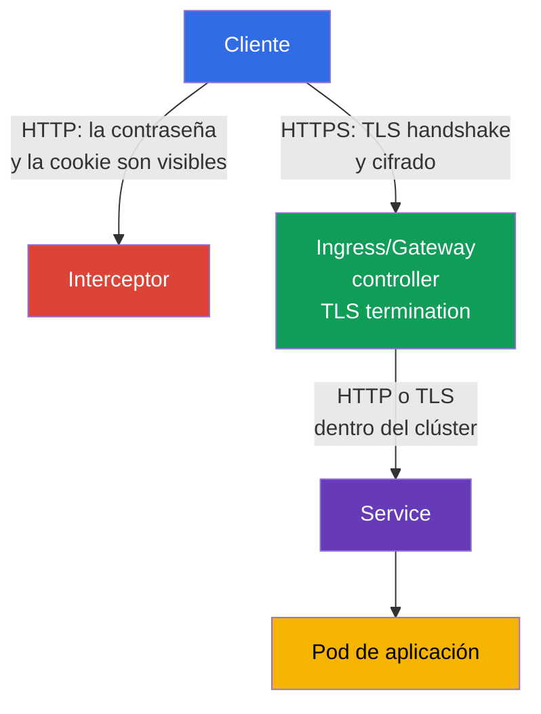
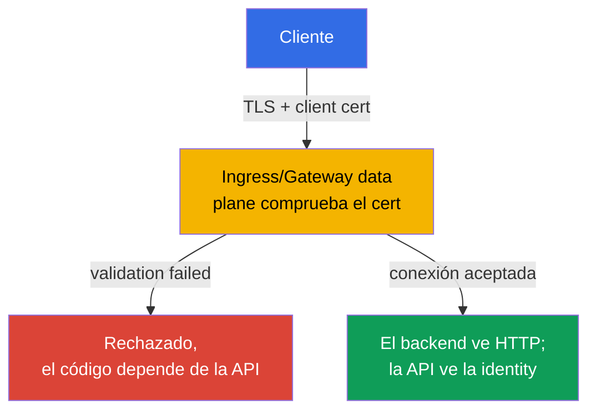

[Русская версия](ru.md) · [Eng version](README.md) · [Version française](fr.md) · [Deutsche Version](de.md) · [ქართული ვერსია](ge.md) · [繁體中文版](tw.md) · [日本語版](jp.md)

# Capítulo 08. Ingress seguro con TLS

> **El problema.** Si un Ingress acepta tráfico por HTTP normal, el inicio de sesión, las cookie, el bearer
> token y el contenido de los formularios recorren la red en texto claro. Un usuario en la misma
> red no confiable, un punto de acceso Wi-Fi malicioso o un proxy intermedio pueden leer la
> solicitud o alterar silenciosamente la respuesta - el punto de entrada público de la aplicación permanece
> expuesto a la interceptación antes incluso de que el tráfico llegue al Pod.

> **Qué sigue.** En el capítulo 07 comprobamos y reforzamos la configuración de los componentes del clúster.
> Ahora protegeremos el punto de entrada público de las aplicaciones. **Ingress con TLS** cifra el tráfico HTTP
> entre el cliente y el ingress controller, confirma el nombre del servidor e impide que un interceptor
> lea o altere silenciosamente una solicitud. Es el dominio Cluster Setup (15%) de CKS.

> **Lo necesario de CKA.** La sintaxis básica de Ingress y Service y el enrutamiento por host/path
> se explican en el [capítulo 32 de CKA](../../../cka/course/32/es.md). La arquitectura de TLS, el certificate,
> la private key y la verificación de la cadena se tratan en el [capítulo 00-3 de CKA](../../../cka/course/00-3-tls/es.md).
> Aquí vemos la aplicación segura de estos mecanismos en la entrada pública, sin
> repetir sus fundamentos.

> 🧠 TLS protege solamente la ruta del cliente hasta TLS termination; controller → Service → Pod es un límite independiente.

## 08.1. Modelo de amenazas: por qué HTTP en Ingress no es suficiente

Un ingress controller normalmente acepta tráfico desde una red externa y lo dirige a un Service,
y después a un Pod. Si el cliente se conecta por HTTP, el inicio de sesión, las cookie, el bearer token y el contenido
del formulario viajan por la red en texto claro. Un usuario de la misma red no confiable, un
punto de acceso Wi-Fi malicioso o un proxy intermedio pueden leer la solicitud o alterar la respuesta.

TLS protege el canal desde el cliente hasta el punto de **TLS termination** - el ingress controller. El
controller presenta un certificate para el nombre de host, realiza el TLS handshake, descifra la solicitud y
enruta el tráfico HTTP normal al backend. Por eso, TLS en la entrada externa no significa
que la ruta controller -> Service -> Pod se cifre automáticamente. El tráfico interno sensible
necesita medidas independientes: TLS en la aplicación, service mesh o Cilium
transparent encryption, que se trata en el capítulo 23.



Se necesitan tres propiedades simultáneamente:

- confidencialidad - el tráfico entre el cliente y el controller no se puede leer;
- integridad - no se puede modificar silenciosamente una solicitud o respuesta;
- autenticidad - el cliente verifica que el certificate fue emitido precisamente para el host solicitado.

El cifrado no corrige un backend inseguro, un RBAC excesivo ni un endpoint expuesto.
Es una capa de defense in depth. Tampoco se debe confundir un TLS certificate con un Kubernetes Secret:
el Secret almacena la clave y el certificate, pero no activa TLS por sí mismo hasta que un
Ingress lo referencia.

> 🎯 Poder emitir un certificate de prueba para un host dado con SAN, comparar certificate/key y usar `--cacert` en vez de `-k` es el mínimo práctico para una tarea de TLS.

## 08.2. Certificate y clave: self-signed de prueba y enfoque de production

Para una lab se puede crear un self-signed certificate. El cliente no confía en él de forma predeterminada,
por lo que un `curl` normal termina con un error de verificación de la cadena.

La prueba preferible es confiar explícitamente en el certificate de la lab mediante `--cacert tls.crt`: así
curl continuará verificando el certificate y la correspondencia del nombre de host. `curl -k` desactiva por completo
la certificate verification y es aceptable solo como una comprobación de diagnóstico independiente, no como
prueba de una configuración TLS correcta.

El nombre de la URL debe estar presente en el **Subject Alternative Name** (SAN). Los clientes modernos
comprueban SAN, no solo el campo obsoleto Common Name (CN). El certificate siguiente está pensado para
`app.example.test`; para otro nombre cambie tanto `HOST` como `subjectAltName`.

```bash
export HOST=app.example.test

openssl req -x509 -newkey rsa:2048 -nodes \
  -keyout tls.key \
  -out tls.crt \
  -days 30 \
  -subj "/CN=${HOST}" \
  -addext "subjectAltName=DNS:${HOST}"

# Antes de cargarlo en el clúster, comprobar el subject y SAN
openssl x509 -in tls.crt -noout -subject -ext subjectAltName

# La clave pública del certificate debe coincidir con la clave pública de la private key.
# Los hashes de los dos comandos deben ser idénticos.
openssl x509 -in tls.crt -pubkey -noout \
  | openssl pkey -pubin -outform DER | sha256sum
openssl pkey -in tls.key -pubout -outform DER \
  | sha256sum

# Para un CA certificate, comprobar la cadena: leaf -> intermediate -> trusted root.
# `tls.crt` para el controller normalmente contiene leaf y después intermediate; no se incluye root.
openssl verify -show_chain -CAfile root-ca.crt \
  -untrusted intermediate-ca.crt leaf.crt
```

Antes de crear el Secret, la coincidencia de las claves públicas descarta un par certificate/key de
emisiones distintas. En la salida de `openssl verify -show_chain`, el leaf debe verificarse mediante el
intermediate hasta un root confiable; un error en cualquier eslabón significa que tal certificate
no se puede cargar.

La opción `-nodes` deja la private key sin passphrase. Es necesario porque el
controller debe leer la clave sin una entrada interactiva. En este caso la protección se basa en
RBAC estricto para el Secret, acceso restringido a etcd y encryption at rest - no en una passphrase
en el archivo de clave.

> 🏭 CA confiable, renovación automática, propietario, alert antes del vencimiento y rotación de Secret comprobada.

En production no cree manualmente self-signed certificate de larga duración. Normalmente
`cert-manager` obtiene el certificate de una CA confiable, por ejemplo Let's Encrypt, lo guarda en un
Secret y lo actualiza antes de que venza. El equipo de plataforma también debe definir el propietario
del certificate, la alerta de vencimiento y el procedimiento de rotación. Si TLS termina antes del
clúster en un cloud load balancer, compruebe que la conexión hasta NGINX también cumpla
los requisitos de la organización: quizá se necesite TLS también en ese tramo.

> 🎯 Cree un Secret `kubernetes.io/tls` con las claves `tls.crt` y `tls.key`, y después compruebe el namespace y el nombre: Ingress solo puede referenciar un Secret de su propio namespace.

## 08.3. TLS Secret: formato y ámbito de visibilidad

Para Ingress TLS use el TLS Secret estándar de tipo `kubernetes.io/tls` con las claves
`tls.crt` y `tls.key`. Este es exactamente el objeto que crea `kubectl create secret tls`.

El Ingress TLS contract portable requiere certificate y private key bajo las claves `tls.crt` y
`tls.key`; las comprobaciones adicionales del tipo Secret y del contenido dependen del controller. Por ello,
`kubernetes.io/tls` es el formato estándar correcto para el curso y production, pero no debe
explicarse como el único mecanismo que la propia API de Ingress pueda leer. El
tipo `kubernetes.io/tls` se proporciona para comodidad y uniformidad: Kubernetes API comprueba la
presencia de las claves requeridas para un Secret de este tipo, y técnicamente las TLS credentials
pueden guardarse también en un Secret `Opaque`, aunque dicho Secret no recibe esa comprobación ni comunica
el propósito del objeto a otros ingenieros.
La forma más fiable de crearlo a partir de archivos ya comprobados es `kubectl create secret tls`: el comando coloca por sí mismo el certificate en la clave `tls.crt` y la private key en `tls.key`.

```bash
kubectl -n web create secret tls app-example-tls \
  --cert=tls.crt \
  --key=tls.key

kubectl -n web get secret app-example-tls \
  -o jsonpath='{.type}{"\n"}{.data.tls\.crt}{"\n"}{.data.tls\.key}{"\n"}'
# kubernetes.io/tls
# valores base64 de tls.crt y tls.key
```

El mismo objeto como manifiesto tiene este aspecto. Aquí `data` se deja vacío intencionadamente, sobre todo
porque la private key `tls.key` no se puede hacer commit en Git en texto claro.

Un X.509 certificate `tls.crt` contiene la clave pública y no es un secreto por sí mismo;
guardar o no el public certificate en el repositorio es una decisión separada de repository policy. La private
key siempre debe ser confidencial. `stringData` resulta más cómodo para valores cortos de prueba,
pero no vuelve secreto el contenido del repositorio.

```yaml
apiVersion: v1
kind: Secret
metadata:
  name: app-example-tls
  namespace: web
type: kubernetes.io/tls
data:
  tls.crt: <base64-encoded-certificate>
  tls.key: <base64-encoded-private-key>
```

Secret es namespaced. Un Ingress en el namespace `web` no puede referenciar un Secret de `default` ni
de otro namespace. No otorgue a la aplicación permiso `get`/`list` para todos los Secret solo por TLS:
normalmente el certificate lo atiende el controller, y el acceso para crear y leer tales Secret
se limita mediante un rol independiente. Base64 en `data` es codificación, no encryption.

> 🎯 Vincule un host en `spec.tls.hosts` y `spec.rules.host`, e indique `secretName`, Service e `ingressClassName`.

## 08.4. Ingress: vincular host, TLS Secret y backend

Los campos portables de Ingress API aquí son `spec.tls` (`hosts`, `secretName`) y `spec.rules`
(`host`, `path`, `pathType`, `backend`). Describen el TLS certificate y el enrutamiento, pero
**no** establecen el HTTP -> HTTPS redirect. `spec.ingressClassName` también es un campo API, sin embargo
el propio valor de clase, por ejemplo `nginx`, elige una implementación concreta. Las annotations, incluidas
`nginx.ingress.kubernetes.io/*`, no forman parte en absoluto de Ingress API: su significado lo define solo
el controller correspondiente.

La correspondencia del host es importante dos veces: el controller elige el certificate correcto durante el TLS
handshake, y el cliente comprueba que el nombre de la URL esté en SAN. Antes de aplicar, asegúrese de que
existen la clase y el Service necesarios:

```bash
kubectl get ingressclass
kubectl -n web get service web
```

Lo siguiente presupone que el Service `web` del namespace `web` escucha el puerto 80. El manifiesto no
crea Service ni Deployment: son base de CKA y deben existir por separado.

```yaml
apiVersion: networking.k8s.io/v1
kind: Ingress
metadata:
  name: web-secure
  namespace: web
spec:
  # Campo API; el nombre `nginx` es una elección de implementación, no un valor portable.
  ingressClassName: nginx
  tls:
  - hosts:
    - app.example.test
    secretName: app-example-tls
  rules:
  - host: app.example.test
    http:
      paths:
      - path: /
        pathType: Prefix
        backend:
          service:
            name: web
            port:
              number: 80
```

Puede comprobar la vinculación de los objetos sin DNS externo:

```bash
kubectl -n web describe ingress web-secure
kubectl -n web get ingress web-secure -o yaml
kubectl -n web get secret app-example-tls -o jsonpath='{.type}{"\n"}'
```

En la salida de `describe`, compruebe `Ingress Class`, la regla de `app.example.test`, el host TLS,
el Secret y los eventos.

Un error al leer el Secret o la ausencia de backend endpoints sí requieren corrección antes de
una comprobación end-to-end completa.

Considere por separado el campo `ADDRESS`: refleja el status publicado de Ingress y en
NodePort, bare-metal, `hostNetwork`, port-forward o algunos fixture locales puede
permanecer vacío incluso con un Ingress funcional. Compruebe la disponibilidad de TLS por el
entrypoint efectivo del controller elegido, no solo por la presencia de un valor en `ADDRESS`.

## 08.5. ingress-nginx: retired-controller y límites de las annotations

> **NGINX Ingress Controller retired.** Desde marzo de 2026 el proyecto `ingress-nginx` está retired y ya no recibe releases ni security fixes ([anuncio](https://kubernetes.io/blog/2025/11/11/ingress-nginx-retirement/)). CKS exige un Ingress con TLS correctamente configurado, pero la competencia pública no garantiza un controller concreto ni nginx-specific annotations. En el examen, compruebe primero el controller proporcionado por la lab; la sintaxis `ingressClassName: nginx` y sus annotations son solo un fixture posible. Para production no despliegue un retired-controller en clústeres nuevos: elija una implementación compatible o Gateway API. La parte portable - TLS Secret, `spec.tls`, host/SNI, SAN, Service endpoints y comprobación HTTPS - no depende del controller.

> 🎯 Para ingress-nginx, `spec.tls` normalmente incluye redirect; `ssl-redirect` y `force-ssl-redirect` dependen de la implementación y topology.

Incluso un TLS Ingress correcto deja un riesgo si HTTP sigue siendo accesible: el usuario puede
seguir un enlace antiguo, y la cookie o el formulario se enviarán antes de la primera respuesta HTTPS. Para
**ingress-nginx**, la presencia de un bloque `spec.tls` activa por defecto el redirect HTTP -> HTTPS
(normalmente `308`), salvo que una configuración del controller lo anule. Por eso, configurar a la vez
`ssl-redirect` y `force-ssl-redirect` no es necesario y es incorrecto como receta obligatoria para un
TLS Ingress normal.

Esta es precisamente la semántica de ingress-nginx, no de Ingress API. Si necesita anular explícitamente
la configuración de ingress-nginx para un Ingress con `spec.tls`, aplique solo su annotation
controller-specific `ssl-redirect`:

```yaml
metadata:
  annotations:
    nginx.ingress.kubernetes.io/ssl-redirect: "true"
```

`force-ssl-redirect` se reserva para otra topology: TLS termina en un load
balancer/proxy **externo**, el controller recibe HTTP y el Ingress no tiene bloque `spec.tls`. En tal caso, el proxy
externo debe transmitir correctamente la información sobre el esquema HTTPS original, de lo contrario puede producirse un
redirect loop. Por ejemplo, un Ingress independiente para esa configuración de external SSL offload:

```yaml
apiVersion: networking.k8s.io/v1
kind: Ingress
metadata:
  name: web-external-tls
  namespace: web
  annotations:
    nginx.ingress.kubernetes.io/force-ssl-redirect: "true"
spec:
  ingressClassName: nginx
  rules:
  - host: app.example.test
    http:
      paths:
      - path: /
        pathType: Prefix
        backend:
          service:
            name: web
            port:
              number: 80
```

No sustituya el redirect mediante la aplicación si puede proporcionarse en el edge. De otro modo, cada backend
debe repetir la misma configuración, y un Service añadido accidentalmente podría permanecer
accesible por HTTP. HSTS complementa el redirect después de la primera conexión HTTPS satisfactoria, pero no
sustituye TLS y requiere una policy cautelosa e independiente para dominios y subdominios.

> 🏭 Gateway API controller compatible y su status/compatibility; una implementación concreta determina las capacidades de `GatewayClass`.

> 🔬 **Estado actual de Gateway API v1.6.** En Gateway API v1.6, `TCPRoute` y `UDPRoute` pasaron a Standard `v1`; los nuevos experimental resources se trasladaron a un grupo independiente, `gateway.networking.x-k8s.io`, con el prefijo `X`. `XBackend` continúa siendo experimental y el soporte de `ExternalHostname` requiere un opt-in consciente debido al security trade-off, incluido el confused-deputy risk. Este es un contexto production-current, no CKS Core. [Blog oficial de la release](https://kubernetes.io/blog/2026/08/03/gateway-api-v1-6-release/).

### Gateway API: ruta actual para production

Gateway API describe tres modelos TLS: **edge termination** (un HTTPS listener descifra
el tráfico en Gateway), **TLS passthrough** (Gateway entrega el TLS handshake al backend sin
termination) y TLS al backend después de termination (re-encryption). Para el último modelo,
`BackendTLSPolicy` de Gateway API v1.4.0 - GA en Standard Channel - establece SNI y la verificación del
certificate del backend. El soporte de cada modelo depende del Gateway controller.

Para un clúster de production nuevo, use una implementación compatible de Gateway API. En el ejemplo
siguiente, `platform-gateway` es un nombre **implementation-specific** de `GatewayClass`: lo proporciona el
Gateway controller elegido, no es un valor estándar de Kubernetes. `certificateRefs`
referencia el mismo TLS Secret en el namespace `web`; el HTTPS listener realiza TLS termination,
y `HTTPRoute` dirige la solicitud al Service.

```yaml
apiVersion: gateway.networking.k8s.io/v1
kind: Gateway
metadata:
  name: web-gateway
  namespace: web
spec:
  gatewayClassName: platform-gateway # el nombre depende del Gateway controller
  listeners:
  - name: https
    protocol: HTTPS
    port: 443
    hostname: app.example.test
    tls:
      mode: Terminate
      certificateRefs:
      - kind: Secret
        name: app-example-tls
---
apiVersion: gateway.networking.k8s.io/v1
kind: HTTPRoute
metadata:
  name: web-secure
  namespace: web
spec:
  parentRefs:
  - name: web-gateway
    sectionName: https
  hostnames:
  - app.example.test
  rules:
  - matches:
    - path:
        type: PathPrefix
        value: /
    backendRefs:
    - name: web
      port: 80
```

Si Gateway también abre el puerto 80, añada un HTTP listener e `HTTPRoute` independientes con
el filtro estándar `RequestRedirect` hacia `https`; no lo mezcle con la HTTPS-route al backend.

> 🔬 TLS passthrough termina TLS y mTLS en el backend; compruebe el soporte de `TLSRoute`, enrutamiento SNI y passthrough en el controller.

### TLS passthrough: `TLSRoute`

Para un backend que termina TLS por sí mismo (por ejemplo, porque necesita su propio certificate o
mTLS), Gateway no descifra la conexión: el listener tiene `protocol: TLS` y
`tls.mode: Passthrough`, y la ruta se selecciona por SNI. `TLSRoute` es GA en Standard
Channel de Gateway API v1.5.0. El ejemplo mínimo siguiente entrega TLS para `app.example.test` al
Service `web-tls` por el puerto 443; el controller debe admitir TLSRoute y passthrough.

```yaml
apiVersion: gateway.networking.k8s.io/v1
kind: Gateway
metadata:
  name: passthrough-gateway
  namespace: web
spec:
  gatewayClassName: platform-gateway
  listeners:
  - name: tls
    protocol: TLS
    port: 443
    hostname: app.example.test
    tls:
      mode: Passthrough
---
apiVersion: gateway.networking.k8s.io/v1
kind: TLSRoute
metadata:
  name: web-tls-passthrough
  namespace: web
spec:
  parentRefs:
  - name: passthrough-gateway
    sectionName: tls
  hostnames:
  - app.example.test
  rules:
  - backendRefs:
    - name: web-tls
      port: 443
```

En passthrough, el Secret con el certificate está en el backend, no en `certificateRefs` de Gateway;
compruebe el SNI/SAN certificate precisamente del backend y sus endpoints.

La referencia de Gateway a un `Secret` de otro namespace requiere un `ReferenceGrant` explícito **en
el namespace del Secret**; sin él, el controller no debe aceptar la cross-namespace reference.
No traslade esta lógica a `BackendTLSPolicy`: las referencias cross-namespace a certificate/CA
para backend TLS no están permitidas, ni siquiera con `ReferenceGrant`.

Compruebe las `GatewayClass` admitidas mediante `kubectl get gatewayclass` y el estado de Gateway
antes de migrar el tráfico.

> 🧠 mTLS autentica al cliente en el edge durante el TLS handshake, pero no sustituye la authorization de la aplicación ni mTLS entre Pod.

## 08.6. mTLS en la entrada: el controller verifica el certificate del cliente

Todo lo anterior en el capítulo es **server-side TLS**: el controller demuestra su identity al cliente
mediante un certificate y el cliente permanece anónimo en el nivel TLS. Una tarea independiente es **mutual
TLS (mTLS) en la entrada**: el controller además exige que el cliente presente su
certificate y lo comprueba con una CA confiable **antes** de que la solicitud llegue al backend.
No lo confunda con temas de otros capítulos:

- el capítulo 23 trata mTLS **entre Pod dentro de mesh** (Istio/Linkerd sidecar-to-sidecar);
- TLS passthrough de 08.5 traslada el deber de comprobar el cliente **al propio backend**,
  no a Gateway/Ingress;
- aquí se trata precisamente de que el **controller en el límite del clúster** se convierte él mismo en
  servidor TLS del cliente y simultáneamente comprueba el certificate del cliente.



No haga que el código HTTP forme parte del modelo general de mTLS. En ingress-nginx, el modo `on` devuelve `400`
en caso de failed certificate verification, y `auth-tls-match-cn` puede devolver `403`. En Gateway
API, `AllowValidOnly` valida el certificate durante el TLS handshake, por lo que una implementación
puede rechazar la propia conexión TLS sin una respuesta HTTP - no existe aquí un modelo controller-neutral de
«siempre 400/403».

> 🔬 `auth-tls-*` es API de ingress-nginx retired; el modelo portable es un client certificate válido en el edge.

### ingress-nginx: annotations `auth-tls-*`

Client Certificate Authentication se activa mediante un `Secret` con la cadena de CA en la clave
`ca.crt` y un conjunto de annotations en el objeto `Ingress`:

```yaml
apiVersion: networking.k8s.io/v1
kind: Ingress
metadata:
  name: web-mtls
  namespace: web
  annotations:
    nginx.ingress.kubernetes.io/auth-tls-secret: "web/client-ca"
    nginx.ingress.kubernetes.io/auth-tls-verify-client: "on"
    nginx.ingress.kubernetes.io/auth-tls-verify-depth: "1"
    nginx.ingress.kubernetes.io/auth-tls-pass-certificate-to-upstream: "true"
spec:
  tls:
  - hosts: [app.example.test]
    secretName: web-tls
  rules:
  - host: app.example.test
    http:
      paths:
      - path: /
        pathType: Prefix
        backend:
          service:
            name: web
            port:
              number: 80
```

- `auth-tls-secret` referencia un `Secret` con el formato `namespace/name`, donde `ca.crt` contiene
  la cadena de CA confiable para los client certificate - es un `Secret` distinto del
  `web-tls` server-side de 08.3, aunque ambos correspondan al mismo host.
- `auth-tls-verify-client: "on"` exige un certificate de cliente verificado correctamente por la CA de
  `auth-tls-secret`; failed certificate verification termina con HTTP `400`.
- `optional` no exige certificate a cada cliente, pero **no** es el modo «no
  rechazar nunca»: si un cliente presenta un certificate no firmado por la CA configurada,
  ingress-nginx devuelve igualmente HTTP `400`. Cuando se permite la solicitud, el resultado de
  la comprobación puede pasarse al upstream.
- `optional_no_ca` no rechaza una solicitud únicamente porque el certificate del cliente no esté
  firmado por la CA de `auth-tls-secret`; el verification result se pasa al upstream. Use
  este modo solo si la aplicación o una authorization layer independiente realmente
  toma una decisión a partir de dicho resultado.
- Para la solicitud pasada al upstream, ingress-nginx transmite `ssl-client-verify`,
  `ssl-client-subject-dn` y `ssl-client-issuer-dn`; el certificate PEM completo en
  `ssl-client-cert` se transmite solo con `auth-tls-pass-certificate-to-upstream: "true"`.
- Client Certificate Authentication se aplica a todo el host, no a un path individual.

> 🔬 Frontend validation de Gateway API requiere soporte de la versión de API y del controller; compruebe el campo, CA references y handshake.

### Gateway API: frontend client-certificate validation en el nivel de Gateway

Frontend client-certificate validation entra en Gateway API a través del campo `spec.tls.frontend`
del objeto `Gateway`, no a través de `HTTPRoute`. El esquema actual se diferencia de una versión anterior del
proposal (`default.frontendValidation` de GEP-91): en la API publicada, la ruta es
`spec.tls.frontend.default.validation`, y el per-port override es
`spec.tls.frontend.perPort[].tls.validation`.

```yaml
apiVersion: gateway.networking.k8s.io/v1
kind: Gateway
metadata:
  name: mtls-gateway
  namespace: web
spec:
  gatewayClassName: platform-gateway
  tls:
    frontend:
      default:
        validation:
          caCertificateRefs:
          - group: ""
            kind: ConfigMap
            name: client-ca
          mode: AllowValidOnly
  listeners:
  - name: app-https
    protocol: HTTPS
    port: 443
    hostname: app.example.test
    tls:
      mode: Terminate
      certificateRefs:
      - group: ""
        kind: Secret
        name: web-tls
```

El `ConfigMap` `client-ca` contiene el CA certificate confiable (trust anchor) en la clave
`ca.crt`. La variante Core portable de Gateway API es una `caCertificateRefs` para un
`ConfigMap` con un CA certificate. Varios CA certificates en un solo `ca.crt`,
varias `caCertificateRefs` u otros resource kinds pertenecen al soporte
implementation-specific, así que compruebe tales variantes en la documentación del
Gateway controller concreto.

- `spec.tls.frontend.default.validation` comprueba al cliente al conectarse **a Gateway**
  y se aplica a todos los HTTPS listeners que no tengan per-port override; no es lo mismo
  que `BackendTLSPolicy`, que controla TLS de Gateway **al backend** - ambas
  policies son independientes y pueden aplicarse a la vez.
- `spec.tls.frontend.perPort[].tls.validation` anula esa configuración para todos los
  HTTPS listeners del puerto indicado.
- `mode: AllowValidOnly` (default) rechaza una conexión sin certificate válido.
  `AllowInsecureFallback` acepta la conexión incluso sin certificate o cuando su
  comprobación falla, delegando la decisión de authorization del cliente al backend. Este estado se
  marca explícitamente con la condición `InsecureFrontendValidationMode` en `Gateway` y crea un
  security risk significativo. Gateway API recomienda usar tal modo en un entorno
  de prueba o solo temporalmente en un entorno non-testing; para mTLS de production normal,
  prefiera `AllowValidOnly`.
- El soporte de frontend client-certificate validation depende del Gateway API
  controller concreto; antes de usarlo, compruébelo en la lista de implementations admitidas de
  su versión.

Ambos mecanismos resuelven la misma tarea con API diferentes: tanto NGINX Ingress mediante
`auth-tls-*` como Gateway API mediante `spec.tls.frontend...validation` pueden verificar el
certificate del cliente en el límite del clúster. Cuál está disponible no depende de
la capacidad de la idea de mTLS en sí, sino de qué ingress controller o Gateway API
implementation esté desplegada en el clúster - elija la sintaxis según el controller instalado
en realidad, y no al revés.

### Error frecuente: el scope de client-certificate validation depende de la API

El client certificate se verifica durante el TLS handshake, antes del enrutamiento HTTP por path. Pero
el ámbito exacto de la policy difiere entre API, no es universal:

- **ingress-nginx:** Client Certificate Authentication se aplica **per host** y no
  puede tener reglas distintas para paths separados de un mismo host. Si `/admin` exige un
  client certificate estricto, y `/public` no debe exigirlo en el nivel TLS, esos
  handshake-requirements no se pueden expresar mediante dos paths de un mismo host de ingress-nginx.
- **Gateway API:** frontend client-certificate validation se establece en el nivel de `Gateway`:
  `default` se aplica a todos los HTTPS listeners sin override, y `perPort` a todos los HTTPS
  listeners del puerto indicado. Los distintos `hostname`/listeners de un Gateway en el mismo
  puerto **no** obtienen client-certificate policies independientes - GEP-91 explica explícitamente
  que una asociación más estrecha crearía un riesgo de bypass por HTTP/2/TLS connection
  coalescing: una conexión TLS ya establecida puede atender un listener con otro
  hostname en el mismo puerto.

Consecuencia práctica: no use la regla «un hostname distinto siempre significa una
mTLS policy independiente» como modelo portable. Para Gateway API, los distintos requisitos a nivel de handshake
deben separarse en puertos distintos o en TCP/TLS entrypoints realmente aislados que la
implementación elegida garantice que no combina; compruebe la topology concreta mediante la
documentación del controller.

La authorization por HTTP path/method se realiza después del TLS handshake, en una HTTP-aware
authorization layer o aplicación. `auth-tls-match-cn` de ingress-nginx no es autorización por path/method:
solo compara adicionalmente el CN del client certificate con una cadena/regex.

No traslade `ssl-client-verify` de ingress-nginx a Gateway API como contract general.
Ingress-nginx documenta los headers `ssl-client-*`, mientras Gateway API estandariza frontend
certificate validation, pero no un formato general para entregar client identity al backend. Si el backend
debe recibir esta identity, compruebe por separado el mecanismo de la Gateway
implementation concreta.

No considere mTLS en la entrada un sustituto universal de RBAC o de la authorization de la aplicación:
la comprobación del certificate en el límite del clúster confirma la identity del cliente TLS, pero no
autoriza una acción concreta dentro de la aplicación.

> 🎯 `curl --resolve` con `--cacert` comprueba HTTPS, y `openssl s_client -servername` el certificate entregado por el controller.

## 08.7. Comprobación: HTTPS controller-neutral, host y certificate

Primero determine el punto de entrada público real: la dirección del Service del Ingress/Gateway
controller elegido, el hostname LoadBalancer o la dirección publicada por el fixture usado. Para
un clúster local quizá necesite una dirección NodePort o `kubectl port-forward`; para
LoadBalancer espere la dirección externa. No se presupone el namespace ni el nombre de Service de un
controller concreto.

```bash
kubectl get ingressclass
kubectl get gatewayclass
kubectl -n web get ingress,gateway,httproute,tlsroute
kubectl -n web get endpointslices -l kubernetes.io/service-name=web

export HOST=app.example.test
export ENTRYPOINT_IP=203.0.113.10  # sustituya por la dirección del controller elegido
```

Si el host de prueba no está publicado en DNS, `--resolve` obliga a `curl` a usar
`ENTRYPOINT_IP`, conservando el Host header y SNI correctos. La comprobación portable es una
llamada HTTPS satisfactoria al backend con SNI y host correctos, y el certificate se verifica mediante
`--cacert`:

```bash
curl --cacert tls.crt -vsS -o /dev/null -w 'HTTP %{http_code}\n' \
  --resolve "${HOST}:443:${ENTRYPOINT_IP}" \
  "https://${HOST}/"
# HTTP 200
```

Solo diagnóstico: conectarse sin certificate verification. Que este comando tenga éxito **no
demuestra** que SAN/la cadena sean correctos:

```bash
curl -kvsS -o /dev/null \
  --resolve "${HOST}:443:${ENTRYPOINT_IP}" \
  "https://${HOST}/"
```

El HTTP -> HTTPS redirect y su estado dependen del controller. **Solo si el fixture usa
`ingress-nginx`** con `spec.tls`, se puede esperar por separado `308` y `Location`:

```bash
curl -vI --resolve "${HOST}:80:${ENTRYPOINT_IP}" "http://${HOST}/"
```

Compruebe no solo el estado `200`, sino también el certificate que recibió el cliente. `-servername`
activa SNI: sin él, un controller en un clúster con varios host puede entregar el default
certificate.

```bash
openssl s_client -connect "${ENTRYPOINT_IP}:443" -servername "${HOST}" </dev/null 2>/dev/null \
  | openssl x509 -noout -subject -issuer -ext subjectAltName
# subject=CN = app.example.test
# X509v3 Subject Alternative Name:
#     DNS:app.example.test
```

Para un certificate en el que confía el system trust store, use `curl` normal sin
`-k` ni el `--cacert tls.crt` de la lab: el cliente debe verificar la cadena y el nombre mediante
las CA confiables del sistema. Si se usa una CA interna/private, entregue el CA bundle confiable
mediante `--cacert <ca-bundle.pem>`, no desactive verification con `-k`. Si
`curl` informa `SSL certificate problem`, no evite el problema en production. Compruebe la
vigencia, SAN, cadena CA, `secretName`, namespace y que el controller realmente
haya vuelto a leer el Secret actualizado.

| Síntoma                                              | Qué comprobar                                                                     | Causa probable                                                                                                                                                                                                                                                  |
| ----------------------------------------------------------- | --------------------------------------------------------------------------------------------- | ---------------------------------------------------------------------------------------------------------------------------------------------------------------------------------------------------------------------------------------------------------------------------------- |
| HTTP devuelve backend`200`                    | Annotations y controller efectivo                                       | Falta`ssl-redirect`, el controller no es NGINX o su configuración anula el redirect                                                                                                                                                         |
| HTTPS muestra el default certificate              | `spec.tls.hosts`, SAN y SNI                                                                | El host no coincide, no se encontró el Secret o la solicitud no usa`--resolve`/SNI                                                                                                                                                                                 |
| `curl` recibe `404` de NGINX                | Host,`rules.host`, `ingressClassName`                                                     | La solicitud llegó al controller, pero no se seleccionó la regla                                                                                                                                                                                                     |
| HTTPS devuelve`503`                           | Service, endpoints y readiness del Pod                                                           | TLS funciona, pero el backend no está disponible                                                                                                                                                                                                                            |
| El Secret existe, pero TLS no se activó           | `tls.crt`, `tls.key`, namespace y requisitos del controller concreto | faltan o son incorrectos`tls.crt`/`tls.key`, el certificate no coincide con la private key, el Secret está en otro namespace o el controller no acepta el formato de Secret usado |
| El navegador no confía en el certificate | Issuer, cadena y vigencia                                           | Self-signed certificate o cadena CA incompleta                                                                                                                                                                                                                  |

> 🏭 Emisión y rotación de certificate, acceso mínimo a la private key, controller compatible y synthetic checks tras los cambios.

## 08.8. Cómo se aplica en production

- **Emisión y rotación automáticas.** `cert-manager` y una CA confiable emiten el certificate,
  lo renuevan antes del vencimiento y actualizan el TLS Secret. El equipo vigila las métricas de
  vigencia y recibe un alert con antelación.
- **HTTPS por defecto.** Para ingress-nginx, `spec.tls` proporciona redirect por defecto;
  `ssl-redirect` es solo una anulación explícita controller-specific. `force-ssl-redirect`
  se aplica únicamente con external TLS offload sin bloque `spec.tls`. El load balancer externo,
  el controller y la aplicación procesan coherentemente los proxy headers para no provocar un
  redirect loop.
- **Plan de migración de API.** Para clústeres nuevos, Gateway con HTTPS listener y `certificateRefs`
  junto con `HTTPRoute` sustituye al ingress-nginx retired; la implementación instalada elige el
  `GatewayClass` concreto.
- **Acceso mínimo a las claves.** RBAC otorga permisos para TLS Secret solo al controller y a la
  automatización de certificates. Secret encryption at rest y etcd protegido reducen el riesgo de
  revelar la private key.
- **Separación de límites.** namespace, IngressClass y certificate independientes para un tenant o
  dominios críticos reducen la posibilidad de entregar accidentalmente un certificate o ruta ajenos.
- **Comprobación tras cada cambio.** El pipeline hace una solicitud HTTPS con SNI correcto,
  comprueba el SAN esperado, la vigencia del certificate y la disponibilidad del backend. Si la policy
  prevé un HTTP listener con redirección a HTTPS, el pipeline además comprueba el `30x` redirect
  esperado. Para una HTTPS-only topology, el resultado correcto puede ser la ausencia completa de
  un HTTP listener disponible. Esto detecta el error antes de que lo vea el usuario.

## 08.9. Mini glosario

- **TLS termination** - finalización del TLS handshake y descifrado del tráfico en el ingress controller.
- **Ingress** - objeto API con reglas de enrutamiento HTTP/HTTPS externo hacia Service.
- **IngressClass** - elección de implementación de Ingress, por ejemplo NGINX Ingress Controller; el nombre
  de clase depende del controller instalado.
- **GatewayClass** - elección de implementación de Gateway API; su nombre también es implementation-specific.
- **TLS Secret** - Secret de tipo `kubernetes.io/tls` con las claves `tls.crt` y `tls.key`.
- **SAN** - Subject Alternative Name, lista de nombres DNS/direcciones IP para los que es válido el
  certificate.
- **SNI** - Server Name Indication, nombre de host en TLS handshake para seleccionar el certificate.
- **self-signed certificate** - certificate firmado con su propia clave, no por una
  CA confiable; sirve para pruebas, pero los clientes no confían en él por defecto.
- **HTTP -> HTTPS redirect** - redirección permanente de una solicitud sin cifrar a HTTPS.
- **mTLS en la entrada** - el controller además exige y verifica el certificate del cliente durante el
  TLS handshake, antes de que la solicitud llegue al backend; no confundir con mesh mTLS (capítulo 23).
- **Gateway frontend client-certificate validation** - comprobación del certificate del cliente
  mediante `spec.tls.frontend.default.validation` o el per-port override
  `spec.tls.frontend.perPort[].tls.validation`; independiente de `BackendTLSPolicy`, que
  controla TLS hacia el backend.

## 08.10. Resumen del capítulo

- TLS en Ingress protege el canal HTTP externo frente a la interceptación y alteración hasta el punto de TLS termination.
- Para una prueba puede crearse un self-signed certificate mediante `openssl`, pero SAN debe contener el
  host, y no se puede dejar `curl -k` en production.
- Antes de crear el Secret, las claves públicas de certificate y private key deben coincidir, y la cadena
  debe comprobarse como leaf -> intermediate -> trusted root. `kubectl create secret tls`
  crea un Secret de tipo `kubernetes.io/tls` con `tls.crt` y `tls.key`; Ingress y Secret deben
  estar en el mismo namespace.
- En `spec.tls` se vinculan los campos API portables `hosts` y `secretName`; `ingressClassName`
  elige la implementación, y el nombre `nginx` y sus annotations no son portables.
- En ingress-nginx, `spec.tls` activa por defecto HTTP -> HTTPS redirect. `ssl-redirect`
  puede establecerse como una anulación explícita solo para ingress-nginx; `force-ssl-redirect`
  se necesita para external TLS offload sin bloque `spec.tls`.
- Para clústeres de production nuevos, use Gateway API: HTTPS listener con
  `certificateRefs` y `HTTPRoute`; elija edge termination, TLS passthrough o
  re-encryption al backend mediante `BackendTLSPolicy`. La implementación elige `GatewayClass`,
  y un Secret cross-namespace requiere `ReferenceGrant` en el namespace del Secret.
- La comprobación debe incluir SNI y SAN del certificate, Service endpoints y eventos de Ingress, no
  solo la presencia de objetos YAML.

## 08.11. Cómo sirve esto: en el examen y en el trabajo real

**En el examen.** El mínimo portable es: generar un certificate para el host indicado y
comprobar SAN, crear un TLS Secret, referenciarlo mediante `spec.tls`, comparar host/SNI/SAN,
asegurarse de que existen el controller elegido y los backend endpoints, y realizar una
llamada HTTPS correcta mediante `curl --resolve`. Compruebe siempre namespace, `secretName`, `hosts` e
`ingressClassName` o Gateway route. `308`, `ssl-redirect` y
`force-ssl-redirect` son detalles **solo de un fixture con ingress-nginx**: úselos únicamente si
la tarea proporciona explícitamente este controller y exige la topology correspondiente.

**En el trabajo real.** Secure Ingress es el límite entre el cliente no confiable y la aplicación.
Una configuración fiable combina rotación automática de certificate, acceso mínimo a la
private key, comprobación estricta de SAN, HTTPS obligatorio y synthetic checks continuos.
Una annotation incorrecta o un Secret en otro namespace puede dejar el endpoint público sin la
protección esperada.

## 08.12. Preguntas de autoevaluación

<details>
<summary>1. ¿Dónde termina la protección TLS con TLS termination en Ingress y por qué no garantiza el cifrado entre controller y Pod?</summary>

TLS protege el canal desde el cliente hasta el ingress controller, donde se realizan el handshake y el descifrado de la solicitud. La ruta posterior controller → Service → Pod puede ser HTTP o TLS, por lo que el tráfico interno sensible requiere TLS de la aplicación, service mesh o Cilium transparent encryption.

</details>

<details>
<summary>2. ¿Por qué CN no basta por sí solo y qué campo debe contener el DNS host del certificate?</summary>

Los clientes modernos comprueban el nombre de la URL mediante Subject Alternative Name, no solo por el Common Name obsoleto. Al emitir un self-signed certificate, el DNS host requerido se añade a `subjectAltName`, por ejemplo `DNS:${HOST}`, y se comprueba mediante `openssl x509 -ext subjectAltName`.

</details>

<details>
<summary>3. ¿Qué tipo y qué claves debe tener un TLS Secret para Ingress?</summary>

La variante estándar es un Secret de tipo `kubernetes.io/tls` con el certificate en `tls.crt` y la private key en `tls.key`. Es más fiable crearlo mediante `kubectl create secret tls ... --cert=tls.crt --key=tls.key`. Para una configuración portable, son esenciales `tls.crt`, `tls.key` correctos y el soporte del Ingress controller elegido.

</details>

<details>
<summary>4. ¿Por qué Ingress y su TLS Secret deben estar en el mismo namespace?</summary>

Secret es un objeto namespaced, y un Ingress de `web` no puede referenciar un Secret de `default` ni de otro namespace. Por tanto, `secretName` en `spec.tls` debe referenciar un Secret creado en el mismo namespace que el Ingress.

</details>

<details>
<summary>5. ¿Por qué ingress-nginx con `spec.tls` hace redirect por defecto y cuándo se necesita la annotation controller-specific `force-ssl-redirect`?</summary>

Para ingress-nginx, el bloque `spec.tls` activa HTTP → HTTPS redirect por defecto, normalmente 308, si la configuración del controller no lo anula. `force-ssl-redirect` se reserva para una topology con external TLS offload, cuando TLS termina antes del controller, este recibe HTTP y el Ingress no tiene `spec.tls`; el proxy debe transmitir correctamente el esquema HTTPS original, o puede producirse un loop.

</details>

<details>
<summary>6. ¿Qué dos resultados se esperan de `curl` para HTTP y HTTPS después de configurar redirect?</summary>

La llamada HTTPS con SNI y Host correctos, por ejemplo mediante `curl --resolve`, debe obtener correctamente el backend, en el ejemplo HTTP 200. Para el self-signed certificate de la lab, entréguelo como certificate confiable mediante `--cacert tls.crt`; use `-k` únicamente como diagnostic bypass independiente; su éxito confirma la conexión, pero no demuestra que el certificate, SAN o cadena sean correctos. Solo para un fixture con ingress-nginx y `spec.tls`, una solicitud HTTP separada devuelve previsiblemente redirect, normalmente 308, con `Location`; el estado no es semántica portable de Ingress API.

</details>

<details>
<summary>7. ¿Cómo confirmar antes de crear el Secret que la public key de certificate/key coincide y la cadena leaf -> intermediate -> root?</summary>

El hash de la public key del certificate se obtiene mediante `openssl x509 -pubkey -noout | openssl pkey -pubin -outform DER | sha256sum` y se compara con el hash de `openssl pkey -in tls.key -pubout -outform DER | sha256sum`. La cadena se comprueba con `openssl verify -show_chain -CAfile root-ca.crt -untrusted intermediate-ca.crt leaf.crt`: el leaf debe verificarse mediante el intermediate hasta el trusted root.

</details>

<details>
<summary>8. ¿Por qué `curl -k` no puede utilizarse como prueba de una configuración TLS correcta ni siquiera con self-signed certificate?</summary>

`-k` desactiva la certificate verification y por eso sirve solo para diagnóstico. Si el self-signed certificate de la lab está disponible localmente, es mejor usar `--cacert tls.crt`: entonces curl confía precisamente en ese certificate, pero sigue comprobando TLS y el nombre de host. En production, `-k` oculta errores de confianza, SAN, cadena y posible alteración; el problema debe corregirse, no evitarse.

</details>

<details>
<summary>9. ¿Por qué `GatewayClass` no puede considerarse un nombre portable y cómo vincula el HTTPS listener Gateway con el certificate mediante `certificateRefs`?</summary>

El Gateway controller elegido proporciona `GatewayClass`, por lo que un nombre como `platform-gateway` es implementation-specific, no estándar de Kubernetes. El HTTPS listener establece `tls.mode: Terminate` y `certificateRefs` hacia TLS Secret; en el ejemplo el Secret está en el mismo namespace, y una referencia cross-namespace requeriría `ReferenceGrant` en el namespace del Secret.

</details>

## Práctica

🧪 Lab 103 (CIS, Secure Ingress TLS, TLS hardening y comprobación de binarios):
[tasks/cks/labs/103](../../labs/103/README_ES.MD)

🌐 Práctica interactiva adicional (killer.sh/killercoda, recurso externo): [ingress-create](https://killercoda.com/killer-shell-cks/scenario/ingress-create) · [ingress-secure](https://killercoda.com/killer-shell-cks/scenario/ingress-secure)

🎮 Killercoda (en el navegador, sin instalación): [Ingress Controller](https://killercoda.com/kubernetes-basics/course/kubernetes-fundamentals/ingress-controller) · [Create TLS Certificate](https://killercoda.com/kubernetes-basics/course/kubernetes-fundamentals/create-tls-certificate)

---

[Índice](../README_ES.md) · [Capítulo 07](../07/es.md) · [Capítulo 09](../09/es.md)
