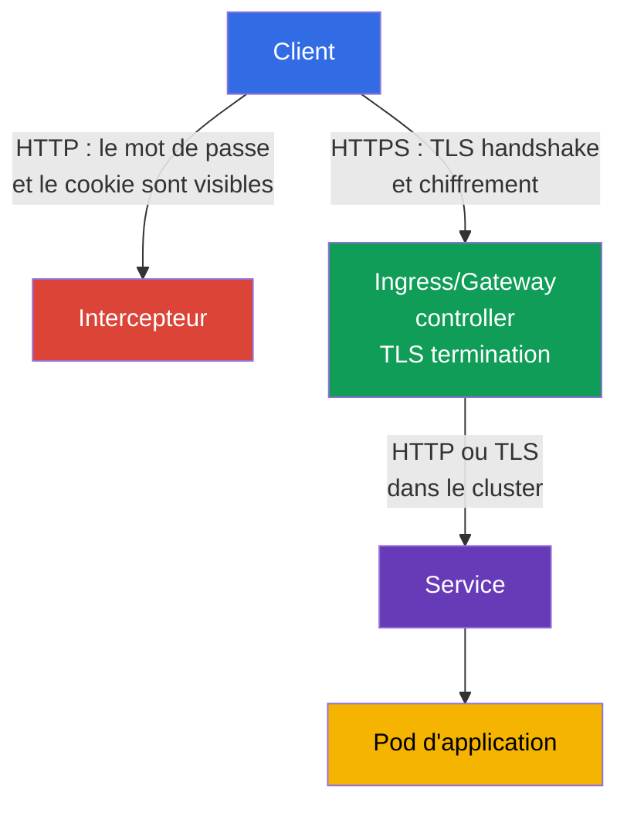
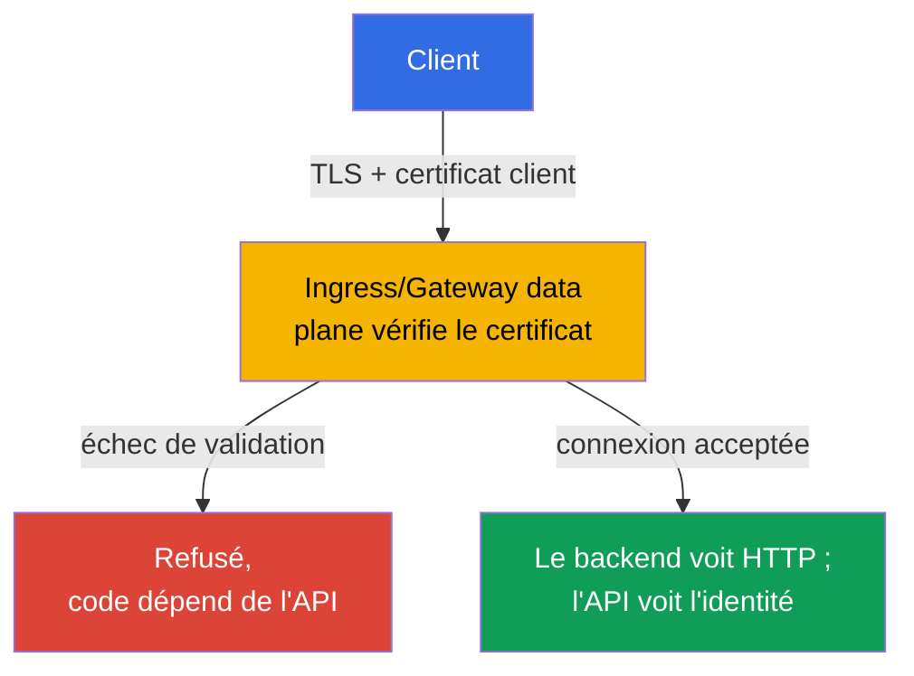

[Русская версия](ru.md) · [Eng version](README.md) · [Versión en español](es.md) · [Deutsche Version](de.md) · [ქართული ვერსია](ge.md) · [繁體中文版](tw.md) · [日本語版](jp.md)

# Chapitre 08. Ingress sécurisé avec TLS

> **Le problème.** Si un Ingress accepte du trafic via HTTP ordinaire, les identifiants, cookie, bearer token et le contenu des formulaires circulent sur le réseau en clair. Un utilisateur du même réseau non fiable, un point d'accès Wi-Fi malveillant ou un proxy intermédiaire peuvent lire la requête ou modifier silencieusement la réponse - le point d'entrée public de l'application reste exposé à l'interception avant même que le trafic n'atteigne un Pod.

> **La suite.** Dans le chapitre 07, nous avons vérifié et renforcé la configuration des composants du cluster. Nous allons maintenant protéger le point d'entrée public des applications. **Ingress avec TLS** chiffre le trafic HTTP entre le client et l'ingress controller, confirme le nom du serveur et empêche un intercepteur de lire ou de modifier silencieusement une requête. Il s'agit du domaine Cluster Setup (15 %) de CKS.

> **Prérequis de CKA.** La syntaxe de base d'Ingress et de Service ainsi que le routage par host/path sont traités dans le [chapitre 32 de CKA](../../../cka/course/32/fr.md). L'architecture TLS, les certificats, les clés privées et la vérification de chaîne sont traitées dans le [chapitre 00-3 de CKA](../../../cka/course/00-3-tls/fr.md). Ici, nous examinons l'utilisation sécurisée de ces mécanismes au point d'entrée public plutôt que de répéter leurs bases.

> 🧠 TLS protège uniquement le chemin du client jusqu'à TLS termination ; controller → Service → Pod constitue une frontière distincte.

## 08.1. Modèle de menace : pourquoi HTTP sur Ingress ne suffit pas

Un ingress controller accepte généralement le trafic d'un réseau externe et l'achemine vers un Service,
puis vers un Pod. Si le client se connecte via HTTP, les identifiants, cookie, bearer token et le contenu du
formulaire circulent sur le réseau en clair. Un utilisateur du même réseau non fiable, un point d'accès
Wi-Fi malveillant ou un proxy intermédiaire peuvent lire la requête ou modifier la réponse.

TLS protège le canal depuis le client jusqu'au point de **TLS termination** - l'ingress controller. Le
controller présente un certificat pour le nom de host, effectue le TLS handshake, déchiffre la requête et
achemine le trafic HTTP ordinaire vers le backend. Ainsi, TLS au point d'entrée externe ne signifie pas
que le chemin controller -> Service -> Pod est automatiquement chiffré. Le trafic sensible à l'intérieur
du cluster nécessite des mesures distinctes : TLS dans l'application, service mesh ou Cilium transparent
encryption, qui est traité au chapitre 23.



Trois propriétés sont nécessaires simultanément :

- confidentialité - le trafic entre le client et le controller ne peut pas être lu ;
- intégrité - une requête ou une réponse ne peut pas être modifiée silencieusement ;
- authenticité - le client vérifie que le certificat a été émis pour le host demandé.

Le chiffrement ne corrige pas un backend non sécurisé, un RBAC excessif ou un endpoint exposé.
C'est une couche de defense in depth. Ne confondez pas non plus un TLS certificate avec un Kubernetes Secret :
un Secret stocke la clé et le certificat, mais n'active pas lui-même TLS tant qu'un Ingress ne s'y réfère pas.

> 🎯 Savoir émettre un certificate de test avec un SAN pour un host donné, comparer le certificate/key et utiliser `--cacert` au lieu de `-k` est le minimum pratique pour une tâche TLS.

## 08.2. Certificat et clé : self-signed de test et approche de production

Pour un laboratoire, vous pouvez créer un self-signed certificate. Un client ne lui fait pas confiance par
défaut ; un `curl` ordinaire se termine donc par une erreur de vérification de chaîne.

Le test recommandé consiste à faire explicitement confiance au certificate de laboratoire via `--cacert tls.crt` :
curl continuera alors à vérifier le certificate et la correspondance du nom de host. `curl -k` désactive
complètement la certificate verification et n'est acceptable que comme contrôle de diagnostic distinct, pas
comme preuve d'une configuration TLS correcte.

Le nom figurant dans l'URL doit être présent dans le **Subject Alternative Name** (SAN). Les clients modernes
vérifient le SAN, et pas seulement le champ obsolète Common Name (CN). Le certificat ci-dessous est prévu
pour `app.example.test` ; pour un autre nom, modifiez à la fois `HOST` et `subjectAltName`.

```bash
export HOST=app.example.test

openssl req -x509 -newkey rsa:2048 -nodes \
  -keyout tls.key \
  -out tls.crt \
  -days 30 \
  -subj "/CN=${HOST}" \
  -addext "subjectAltName=DNS:${HOST}"

# Avant le téléversement dans le cluster, vérifiez le subject et le SAN
openssl x509 -in tls.crt -noout -subject -ext subjectAltName

# La clé publique du certificate doit correspondre à la clé publique de la private key.
# Les hachages des deux commandes doivent être identiques.
openssl x509 -in tls.crt -pubkey -noout \
  | openssl pkey -pubin -outform DER | sha256sum
openssl pkey -in tls.key -pubout -outform DER \
  | sha256sum

# Pour un CA certificate, vérifiez la chaîne : leaf -> intermediate -> trusted root.
# `tls.crt` pour un controller contient généralement leaf, puis intermediate ; root n'est pas inclus.
openssl verify -show_chain -CAfile root-ca.crt \
  -untrusted intermediate-ca.crt leaf.crt
```

Avant de créer le Secret, la correspondance des clés publiques exclut une paire certificate/key issue de
différentes émissions. Dans la sortie de `openssl verify -show_chain`, leaf doit être vérifié via
intermediate jusqu'à une root de confiance ; une erreur sur un quelconque maillon signifie que ce certificate
ne doit pas être téléversé.

L'option `-nodes` laisse la clé privée sans passphrase. Cela est nécessaire, car le controller doit lire la
clé sans saisie interactive. Dans ce cas, la protection provient d'un RBAC strict pour le Secret, d'un accès
restreint à etcd et du encryption at rest - et non d'une passphrase dans le fichier de clé.

> 🏭 Une CA de confiance, un renouvellement automatisé, un propriétaire, une alerte avant expiration et une rotation de Secret testée.

En production, ne créez pas manuellement de self-signed certificates à longue durée de vie. En général,
`cert-manager` obtient un certificat auprès d'une CA de confiance telle que Let's Encrypt, le stocke dans un
Secret et le renouvelle avant son expiration. L'équipe de plateforme doit également désigner le propriétaire
du certificat, prévoir une alerte d'expiration et une procédure de rotation. Si TLS se termine avant le
cluster sur un cloud load balancer, vérifiez que la connexion vers NGINX satisfait aussi les exigences de
l'organisation : TLS peut également être nécessaire sur ce segment.

> 🎯 Créez un Secret `kubernetes.io/tls` avec les clés `tls.crt` et `tls.key`, puis vérifiez son namespace et son nom : un Ingress ne peut référencer qu'un Secret de son propre namespace.

## 08.3. TLS Secret : format et portée

Pour TLS d'Ingress, utilisez un TLS Secret standard de type `kubernetes.io/tls` avec les clés `tls.crt`
et `tls.key`. C'est exactement l'objet créé par `kubectl create secret tls`.

Le contrat TLS Ingress portable exige le certificate et la private key sous les clés `tls.crt` et
`tls.key` ; les contrôles supplémentaires sur le type et le contenu du Secret dépendent du controller. Ainsi,
`kubernetes.io/tls` est le format standard correct pour le cours et la production, mais il ne faut pas le
présenter comme le seul mécanisme que l'API Ingress elle-même peut lire. Le type `kubernetes.io/tls` est
fourni pour la commodité et la cohérence : l'API Kubernetes vérifie les clés requises pour un Secret de ce
type, tandis que les TLS credentials peuvent techniquement aussi être stockés dans un Secret `Opaque`, bien
que ce Secret ne reçoive aucune validation de ce type et ne communique pas l'objectif de l'objet aux autres
ingénieurs. La méthode la plus fiable pour le créer à partir de fichiers déjà vérifiés est `kubectl create
secret tls` : la commande place elle-même le certificat dans `tls.crt` et la clé privée dans `tls.key`.

```bash
kubectl -n web create secret tls app-example-tls \
  --cert=tls.crt \
  --key=tls.key

kubectl -n web get secret app-example-tls \
  -o jsonpath='{.type}{"\n"}{.data.tls\.crt}{"\n"}{.data.tls\.key}{"\n"}'
# kubernetes.io/tls
# valeurs base64 de tls.crt et tls.key
```

Le même objet sous la forme d'un manifest est le suivant. Ici, `data` est intentionnellement laissé vide,
principalement parce que la private key `tls.key` ne doit pas être commitée dans Git en clair.

Le X.509 certificate `tls.crt` contient la clé publique et n'est pas lui-même un secret ; conserver ou non
le public certificate dans un repository est une décision distincte de repository policy. La private key doit
toujours rester confidentielle. `stringData` est plus pratique pour de courtes valeurs de test, mais ne rend
pas le contenu du repository secret.

```yaml
apiVersion: v1
kind: Secret
metadata:
  name: app-example-tls
  namespace: web
type: kubernetes.io/tls
data:
  tls.crt: <base64-encoded-certificate>
  tls.key: <base64-encoded-private-key>
```

Un Secret est namespaced. Un Ingress du namespace `web` ne peut pas référencer un Secret de `default` ou
d'un autre namespace. N'accordez pas à une application le droit `get`/`list` sur tous les Secrets uniquement
pour TLS : le certificate est généralement servi par le controller, tandis que le droit de créer et lire de
tels Secrets est limité par un rôle distinct. Le base64 dans `data` est un encodage, pas un chiffrement.

> 🎯 Associez un host dans `spec.tls.hosts` et `spec.rules.host`, en indiquant `secretName`, Service et `ingressClassName`.

## 08.4. Ingress : associer host, TLS Secret et backend

Les champs portables de l'API Ingress ici sont `spec.tls` (`hosts`, `secretName`) et `spec.rules`
(`host`, `path`, `pathType`, `backend`). Ils décrivent le TLS certificate et le routage, mais **ne**
configurent **pas** la redirection HTTP -> HTTPS. `spec.ingressClassName` est aussi un champ d'API, mais
la valeur de la classe elle-même, par exemple `nginx`, sélectionne une implémentation précise. Les annotations,
y compris `nginx.ingress.kubernetes.io/*`, ne font pas du tout partie de l'API Ingress : seul le controller
respectif détermine leur signification.

La correspondance du host importe deux fois : le controller sélectionne le bon certificate pendant le TLS
handshake, et le client vérifie que le nom de l'URL est dans le SAN. Avant l'application, assurez-vous que la
classe requise et le Service existent :

```bash
kubectl get ingressclass
kubectl -n web get service web
```

L'exemple ci-dessous suppose que le Service `web` du namespace `web` écoute sur le port 80. Le manifest ne
crée pas le Service ou le Deployment : ce sont des bases de CKA et ils doivent exister séparément.

```yaml
apiVersion: networking.k8s.io/v1
kind: Ingress
metadata:
  name: web-secure
  namespace: web
spec:
  # Champ d'API ; `nginx` est un choix d'implémentation, pas une valeur portable.
  ingressClassName: nginx
  tls:
  - hosts:
    - app.example.test
    secretName: app-example-tls
  rules:
  - host: app.example.test
    http:
      paths:
      - path: /
        pathType: Prefix
        backend:
          service:
            name: web
            port:
              number: 80
```

Vous pouvez vérifier l'association des objets sans DNS externe :

```bash
kubectl -n web describe ingress web-secure
kubectl -n web get ingress web-secure -o yaml
kubectl -n web get secret app-example-tls -o jsonpath='{.type}{"\n"}'
```

Dans la sortie de `describe`, vérifiez `Ingress Class`, la règle pour `app.example.test`, le TLS host,
le Secret et les événements.

Une erreur de lecture du Secret ou l'absence de backend endpoints exigent réellement une correction avant
une vérification end-to-end complète.

Considérez le champ `ADDRESS` séparément : il reflète le status Ingress publié et peut rester vide dans
NodePort, bare-metal, `hostNetwork`, port-forward ou certains fixtures locaux, même avec un Ingress
fonctionnel. Vérifiez la disponibilité de TLS via l'entrypoint réel du controller sélectionné, et non
seulement par la présence d'une valeur dans `ADDRESS`.

## 08.5. ingress-nginx : controller retiré et limites des annotations

> **NGINX Ingress Controller retiré.** Depuis mars 2026, le projet `ingress-nginx` est retiré et ne reçoit plus de releases ni de correctifs de sécurité ([annonce](https://kubernetes.io/blog/2025/11/11/ingress-nginx-retirement/)). CKS exige un Ingress correctement configuré avec TLS, mais la compétence publique ne garantit aucun controller particulier ni aucune annotation spécifique à nginx. Lors de l'examen, vérifiez d'abord le controller fourni par le laboratoire ; la syntaxe `ingressClassName: nginx` et ses annotations ne constituent qu'un fixture possible. En production, ne déployez pas le controller retiré sur de nouveaux clusters : choisissez une implémentation prise en charge ou Gateway API. La partie portable - TLS Secret, `spec.tls`, host/SNI, SAN, Service endpoints et vérification HTTPS - ne dépend pas du controller.

> 🎯 Pour ingress-nginx, `spec.tls` active habituellement la redirection ; `ssl-redirect` et `force-ssl-redirect` dépendent de l'implémentation et de la topology.

Même un Ingress TLS correct laisse un risque si HTTP reste disponible : un utilisateur peut suivre un ancien
lien et un cookie ou un formulaire circule avant la première réponse HTTPS. Pour **ingress-nginx**, la
présence d'un bloc `spec.tls` active par défaut la redirection HTTP -> HTTPS (généralement `308`), sauf si
la configuration du controller la remplace. Par conséquent, définir simultanément `ssl-redirect` et
`force-ssl-redirect` n'est ni nécessaire ni une recette obligatoire correcte pour un Ingress TLS ordinaire.

Il s'agit de la sémantique d'ingress-nginx, non de l'API Ingress. Si vous devez explicitement remplacer la
configuration d'ingress-nginx pour un Ingress avec `spec.tls`, utilisez uniquement son annotation spécifique
au controller `ssl-redirect` :

```yaml
metadata:
  annotations:
    nginx.ingress.kubernetes.io/ssl-redirect: "true"
```

Réservez `force-ssl-redirect` à une topology différente : TLS se termine sur un load balancer/proxy
**externe**, le controller reçoit HTTP et l'Ingress n'a pas de bloc `spec.tls`. Le proxy externe doit alors
transmettre correctement les informations sur le schéma HTTPS d'origine, sinon une redirect loop est possible.
Par exemple, un Ingress distinct pour cette configuration d'external SSL offload :

```yaml
apiVersion: networking.k8s.io/v1
kind: Ingress
metadata:
  name: web-external-tls
  namespace: web
  annotations:
    nginx.ingress.kubernetes.io/force-ssl-redirect: "true"
spec:
  ingressClassName: nginx
  rules:
  - host: app.example.test
    http:
      paths:
      - path: /
        pathType: Prefix
        backend:
          service:
            name: web
            port:
              number: 80
```

Ne remplacez pas la redirection à l'edge par de la logique applicative lorsqu'elle peut être fournie à l'edge.
Sinon, chaque backend doit répéter la même configuration et un Service ajouté par inadvertance peut rester
accessible via HTTP. HSTS complète la redirection après la première connexion HTTPS réussie, mais ne remplace
pas TLS et exige une politique distincte et soigneuse pour les domaines et sous-domaines.

> 🏭 Un Gateway API controller pris en charge et son status/compatibility ; les capacités de `GatewayClass` sont définies par l'implémentation particulière.

> 🔬 **État de Gateway API v1.6.** Dans Gateway API v1.6, `TCPRoute` et `UDPRoute` sont passés à Standard `v1` ; les nouvelles ressources expérimentales sont placées dans un groupe `gateway.networking.x-k8s.io` distinct avec un préfixe `X`. `XBackend` reste expérimental, et son support de `ExternalHostname` requiert un opt-in délibéré en raison de compromis de sécurité, y compris le risque de confused deputy. Il s'agit du contexte actuel de production, pas du CKS Core. [Blog officiel de la release](https://kubernetes.io/blog/2026/08/03/gateway-api-v1-6-release/).

### Gateway API : le chemin actuel de production

Gateway API décrit trois modèles TLS : **edge termination** (un listener HTTPS déchiffre le trafic au niveau du
Gateway), **TLS passthrough** (le Gateway transmet le TLS handshake au backend sans termination) et TLS vers le
backend après termination (re-encryption). Pour ce dernier modèle, `BackendTLSPolicy` de Gateway API v1.4.0 -
GA dans le Standard Channel - configure SNI et la vérification du certificat backend. Le support d'un modèle
précis dépend du Gateway controller.

Pour un nouveau cluster de production, utilisez une implémentation Gateway API prise en charge. Dans l'exemple
ci-dessous, `platform-gateway` est un nom de `GatewayClass` **spécifique à l'implémentation** : il est fourni
par le Gateway controller choisi, ce n'est pas une valeur Kubernetes standard. `certificateRefs` fait référence
au même TLS Secret du namespace `web` ; le listener HTTPS effectue la TLS termination et `HTTPRoute` achemine la
requête vers un Service.

```yaml
apiVersion: gateway.networking.k8s.io/v1
kind: Gateway
metadata:
  name: web-gateway
  namespace: web
spec:
  gatewayClassName: platform-gateway # le nom dépend du Gateway controller
  listeners:
  - name: https
    protocol: HTTPS
    port: 443
    hostname: app.example.test
    tls:
      mode: Terminate
      certificateRefs:
      - kind: Secret
        name: app-example-tls
---
apiVersion: gateway.networking.k8s.io/v1
kind: HTTPRoute
metadata:
  name: web-secure
  namespace: web
spec:
  parentRefs:
  - name: web-gateway
    sectionName: https
  hostnames:
  - app.example.test
  rules:
  - matches:
    - path:
        type: PathPrefix
        value: /
    backendRefs:
    - name: web
      port: 80
```

Si le Gateway expose également le port 80, ajoutez un listener HTTP distinct et un `HTTPRoute` avec le filtre
standard `RequestRedirect` vers `https` ; ne le mélangez pas avec la route HTTPS vers le backend.

> 🔬 TLS passthrough termine TLS et mTLS au niveau du backend ; vérifiez la prise en charge par le controller de `TLSRoute`, du routage SNI et du passthrough.

### TLS passthrough : `TLSRoute`

Pour un backend qui termine lui-même TLS (par exemple, s'il a besoin de son propre certificat ou de mTLS), le
Gateway ne déchiffre pas la connexion : le listener a `protocol: TLS` et `tls.mode: Passthrough`, et la route
est sélectionnée par SNI. `TLSRoute` est GA dans le Standard Channel de Gateway API v1.5.0. L'exemple minimal
ci-dessous transmet TLS pour `app.example.test` au Service `web-tls` sur le port 443 ; le controller doit prendre
en charge TLSRoute et passthrough.

```yaml
apiVersion: gateway.networking.k8s.io/v1
kind: Gateway
metadata:
  name: passthrough-gateway
  namespace: web
spec:
  gatewayClassName: platform-gateway
  listeners:
  - name: tls
    protocol: TLS
    port: 443
    hostname: app.example.test
    tls:
      mode: Passthrough
---
apiVersion: gateway.networking.k8s.io/v1
kind: TLSRoute
metadata:
  name: web-tls-passthrough
  namespace: web
spec:
  parentRefs:
  - name: passthrough-gateway
    sectionName: tls
  hostnames:
  - app.example.test
  rules:
  - backendRefs:
    - name: web-tls
      port: 443
```

Avec le passthrough, le Secret contenant le certificate appartient au backend plutôt qu'à `certificateRefs` du
Gateway ; vérifiez le certificate SNI/SAN et les endpoints du backend.

Une référence Gateway à un `Secret` dans un autre namespace nécessite un `ReferenceGrant` explicite **dans le
namespace du Secret** ; sans cela, le controller ne doit pas accepter la cross-namespace reference. Ne transférez
pas cette logique à `BackendTLSPolicy` : les références cross-namespace à des certificates/CA pour TLS backend ne
sont pas autorisées, même avec un `ReferenceGrant`.

Vérifiez les objets `GatewayClass` pris en charge avec `kubectl get gatewayclass` et le status du Gateway avant
de migrer le trafic.

> 🧠 mTLS authentifie le client à l'edge pendant le TLS handshake, mais ne remplace pas l'autorisation de l'application ni le mTLS entre les Pods.

## 08.6. mTLS à l'entrée : le controller vérifie le certificat client

Tout ce qui précède dans le chapitre relève du **TLS côté serveur** : le controller prouve son identité au
client par son certificat, tandis que le client reste anonyme au niveau TLS. Une tâche distincte est le
**TLS mutuel (mTLS) à l'entrée** : le controller exige en plus que le client présente son propre certificat
et le vérifie à l'aide d'une CA de confiance **avant** que la requête n'atteigne le backend. Ne confondez
pas cela avec les sujets d'autres chapitres :

- le chapitre 23 traite du mTLS **entre les Pods à l'intérieur du mesh** (Istio/Linkerd sidecar-to-sidecar) ;
- le TLS passthrough de 08.5 transfère la responsabilité de vérifier le client **au backend lui-même**,
  et non au Gateway/Ingress ;
- il s'agit ici précisément du cas où **le controller à la frontière du cluster** devient lui-même
  serveur TLS pour le client et vérifie simultanément le certificat client.



Ne faites pas du code HTTP une partie du modèle général de mTLS. Dans ingress-nginx, le mode `on` renvoie
`400` en cas d'échec de la vérification du certificat, et `auth-tls-match-cn` peut renvoyer `403`. Dans
Gateway API, `AllowValidOnly` valide le certificat pendant le TLS handshake ; l'implémentation peut donc
rejeter la connexion TLS elle-même sans réponse HTTP - il n'existe pas de modèle indépendant du controller
où la réponse est « toujours 400/403 ».

> 🔬 `auth-tls-*` est une API d'ingress-nginx retiré ; le modèle portable est un certificat client valide à l'edge.

### ingress-nginx : annotations `auth-tls-*`

L'authentification par certificat client est activée via un `Secret` contenant la chaîne de CA dans la clé
`ca.crt` et un ensemble d'annotations sur l'objet `Ingress` :

```yaml
apiVersion: networking.k8s.io/v1
kind: Ingress
metadata:
  name: web-mtls
  namespace: web
  annotations:
    nginx.ingress.kubernetes.io/auth-tls-secret: "web/client-ca"
    nginx.ingress.kubernetes.io/auth-tls-verify-client: "on"
    nginx.ingress.kubernetes.io/auth-tls-verify-depth: "1"
    nginx.ingress.kubernetes.io/auth-tls-pass-certificate-to-upstream: "true"
spec:
  tls:
  - hosts: [app.example.test]
    secretName: web-tls
  rules:
  - host: app.example.test
    http:
      paths:
      - path: /
        pathType: Prefix
        backend:
          service:
            name: web
            port:
              number: 80
```

- `auth-tls-secret` référence un `Secret` au format `namespace/name`, dans lequel `ca.crt` contient la
  chaîne de CA de confiance pour les certificats clients - c'est un `Secret` distinct de `web-tls` côté
  serveur de 08.3, bien que les deux se rapportent au même host.
- `auth-tls-verify-client: "on"` exige un certificat client qui peut être vérifié avec succès par la CA du
  `auth-tls-secret` ; l'échec de la vérification du certificat se termine par HTTP `400`.
- `optional` n'exige pas un certificat de chaque client, mais ce n'est **pas** le mode « ne jamais
  rejeter » : si le client présente un certificat qui n'est pas signé par la CA configurée,
  ingress-nginx renvoie toujours HTTP `400`. Lorsque la requête est admise, le résultat de la vérification
  peut être transmis à l'upstream.
- `optional_no_ca` ne rejette pas une requête simplement parce que le certificat client n'est pas signé par
  la CA de `auth-tls-secret` ; le résultat de la vérification est transmis à l'upstream. Utilisez ce mode
  seulement si l'application ou une couche d'autorisation distincte prend réellement une décision à partir
  de ce résultat.
- Pour une requête upstream transmise, ingress-nginx transmet `ssl-client-verify`,
  `ssl-client-subject-dn` et `ssl-client-issuer-dn` ; le certificat PEM complet dans `ssl-client-cert`
  n'est transmis que si `auth-tls-pass-certificate-to-upstream: "true"` est défini.
- L'authentification par certificat client s'applique à tout le host, et non à un path individuel.

> 🔬 La validation frontend de Gateway API requiert la prise en charge de la version d'API et du controller ; vérifiez le champ, les références de CA et le handshake.

### Gateway API : validation du certificat client frontend au niveau du Gateway

La validation frontend de certificat client entre dans Gateway API par le champ `spec.tls.frontend` de
l'objet `Gateway`, et non par `HTTPRoute`. Le schéma actuel diffère de la variante proposée plus tôt
(`default.frontendValidation` de GEP-91) : dans l'API publiée, le chemin est
`spec.tls.frontend.default.validation`, et le remplacement par port est
`spec.tls.frontend.perPort[].tls.validation`.

```yaml
apiVersion: gateway.networking.k8s.io/v1
kind: Gateway
metadata:
  name: mtls-gateway
  namespace: web
spec:
  gatewayClassName: platform-gateway
  tls:
    frontend:
      default:
        validation:
          caCertificateRefs:
          - group: ""
            kind: ConfigMap
            name: client-ca
          mode: AllowValidOnly
  listeners:
  - name: app-https
    protocol: HTTPS
    port: 443
    hostname: app.example.test
    tls:
      mode: Terminate
      certificateRefs:
      - group: ""
        kind: Secret
        name: web-tls
```

Le `ConfigMap` `client-ca` contient le certificat de CA de confiance (ancre de confiance) dans la clé
`ca.crt`. La variante Core portable de Gateway API est une seule entrée `caCertificateRefs` vers un seul
`ConfigMap` avec un seul certificat de CA. Plusieurs certificats de CA dans un même `ca.crt`, plusieurs
`caCertificateRefs` ou d'autres types de ressources relèvent d'une prise en charge spécifique à
l'implémentation ; vérifiez donc ces variantes dans la documentation du Gateway controller concerné.

- `spec.tls.frontend.default.validation` vérifie le client lorsqu'il se connecte **au Gateway** et
  s'applique à tous les listeners HTTPS sans remplacement par port ; ce n'est pas la même chose que
  `BackendTLSPolicy`, qui gère TLS du Gateway **vers le backend** - les deux politiques sont indépendantes
  et peuvent s'appliquer simultanément.
- `spec.tls.frontend.perPort[].tls.validation` remplace cette configuration pour tous les listeners HTTPS
  sur le port indiqué.
- `mode: AllowValidOnly` (valeur par défaut) rejette une connexion sans certificat valide.
  `AllowInsecureFallback` accepte une connexion même sans certificat ou lorsque sa vérification échoue, en
  déléguant la décision d'autoriser le client au backend. Cet état est explicitement signalé par la condition
  `InsecureFrontendValidationMode` sur le `Gateway` et crée un risque de sécurité important. Gateway API
  recommande d'utiliser ce mode dans un environnement de test, ou seulement temporairement dans un
  environnement hors test ; pour le mTLS de production habituel, préférez `AllowValidOnly`.
- La prise en charge de la validation frontend de certificat client dépend du controller Gateway API
  concerné ; avant de l'utiliser, vérifiez-la dans la liste des implémentations prises en charge par votre
  version.

Les deux mécanismes résolvent la même tâche via des API différentes : NGINX Ingress avec `auth-tls-*` et
Gateway API avec `spec.tls.frontend...validation` peuvent tous deux vérifier le certificat client à la
frontière du cluster. Celui qui est disponible dépend non des capacités de l'idée même de mTLS, mais de
l'ingress controller ou de l'implémentation Gateway API réellement déployé dans le cluster - choisissez la
syntaxe en fonction du controller effectivement installé, et non l'inverse.

### Piège : la portée de la validation de certificat client dépend de l'API

Le certificat client est vérifié durant le TLS handshake, avant le routage HTTP par path. Mais la portée
exacte de la policy varie entre les API et n'est pas universelle :

- **ingress-nginx :** l'authentification par certificat client s'applique **par host** et ne peut pas avoir
  de règles différentes pour des paths individuels du même host. Si `/admin` exige un certificat client
  strict, alors que `/public` ne doit pas l'exiger au niveau TLS, ces exigences de handshake ne peuvent pas
  être exprimées par deux paths du même host ingress-nginx.
- **Gateway API :** la validation frontend de certificat client est définie au niveau du `Gateway` :
  `default` s'applique à tous les listeners HTTPS sans remplacement, et `perPort` à tous les listeners HTTPS
  du port indiqué. Différents `hostname`/listeners d'un même Gateway sur un même port ne reçoivent **pas**
  de policies de certificat client indépendantes - GEP-91 explique explicitement qu'une association plus
  étroite créerait un risque de contournement via la coalescence de connexions HTTP/2/TLS : une connexion TLS
  déjà établie peut servir un listener avec un autre hostname sur le même port.

Conséquence pratique : n'utilisez pas la règle « un hostname différent signifie toujours une policy mTLS
distincte » comme modèle portable. Pour Gateway API, des exigences différentes au niveau du handshake
doivent être séparées sur différents ports ou sur des points d'entrée TCP/TLS réellement isolés, que
l'implémentation sélectionnée garantit de ne pas réunir ; vérifiez la topologie précise dans la documentation
du controller.

L'autorisation par HTTP path/method a lieu après le TLS handshake, dans une couche d'autorisation consciente
d'HTTP ou dans l'application. `auth-tls-match-cn` d'ingress-nginx n'est pas une autorisation par path/method :
elle vérifie seulement en plus que le CN du certificat client correspond à une chaîne ou une regex.

Ne transposez pas `ssl-client-verify` d'ingress-nginx vers Gateway API comme contrat général.
Ingress-nginx documente les headers `ssl-client-*`, tandis que Gateway API standardise la validation frontend
de certificat, mais pas un format général pour transmettre l'identité client au backend. Si le backend doit
recevoir cette identité, vérifiez séparément le mécanisme de l'implémentation Gateway concernée.

Ne considérez pas le mTLS à l'entrée comme un remplacement universel du RBAC ou de l'autorisation de
l'application : la vérification du certificat à la frontière du cluster confirme l'identité du client TLS,
mais n'autorise pas une action précise dans l'application.

> 🎯 `curl --resolve` avec `--cacert` vérifie HTTPS, et `openssl s_client -servername` vérifie le certificat servi par le controller.

## 08.7. Vérification : HTTPS, host et certificat indépendants du controller

Commencez par déterminer le véritable point d'entrée public : l'adresse du Service du controller
Ingress/Gateway choisi, le hostname du LoadBalancer ou l'adresse publiée par le fixture utilisé. Pour un
cluster local, une adresse NodePort ou `kubectl port-forward` peut être nécessaire ; pour un LoadBalancer,
attendez l'adresse externe. Aucun namespace ou nom de Service d'un controller donné n'est présupposé.

```bash
kubectl get ingressclass
kubectl get gatewayclass
kubectl -n web get ingress,gateway,httproute,tlsroute
kubectl -n web get endpointslices -l kubernetes.io/service-name=web

export HOST=app.example.test
export ENTRYPOINT_IP=203.0.113.10  # remplacez par l'adresse du controller sélectionné
```

Si le host de test n'est pas publié dans DNS, `--resolve` force `curl` à utiliser `ENTRYPOINT_IP` tout en
conservant le Host header et le SNI corrects. La vérification portable est un appel HTTPS réussi vers le
backend avec le SNI et le host corrects, tandis que le certificat est vérifié via `--cacert` :

```bash
curl --cacert tls.crt -vsS -o /dev/null -w 'HTTP %{http_code}\n' \
  --resolve "${HOST}:443:${ENTRYPOINT_IP}" \
  "https://${HOST}/"
# HTTP 200
```

Pour le diagnostic uniquement : se connecter sans vérifier le certificat. Le succès de cette commande **ne
prouve pas** la validité du SAN/de la chaîne :

```bash
curl -kvsS -o /dev/null \
  --resolve "${HOST}:443:${ENTRYPOINT_IP}" \
  "https://${HOST}/"
```

La redirection HTTP -> HTTPS et son statut dépendent du controller. **Seulement si le fixture utilise
`ingress-nginx`** avec `spec.tls`, vous pouvez vous attendre séparément à `308` et `Location` :

```bash
curl -vI --resolve "${HOST}:80:${ENTRYPOINT_IP}" "http://${HOST}/"
```

Vérifiez non seulement le statut `200`, mais aussi le certificat reçu par le client. `-servername` active
SNI : sans lui, un controller dans un cluster avec plusieurs hosts peut servir le certificat par défaut.

```bash
openssl s_client -connect "${ENTRYPOINT_IP}:443" -servername "${HOST}" </dev/null 2>/dev/null \
  | openssl x509 -noout -subject -issuer -ext subjectAltName
# subject=CN = app.example.test
# X509v3 Subject Alternative Name:
#     DNS:app.example.test
```

Pour un certificat auquel le trust store système fait confiance, utilisez un `curl` ordinaire, sans `-k` ni
`--cacert tls.crt` de laboratoire : le client doit vérifier la chaîne et le nom avec les CA de confiance du
système. Si une CA interne/privée est utilisée, transmettez le bundle de CA de confiance avec
`--cacert <ca-bundle.pem>` au lieu de désactiver la vérification avec `-k`. Si `curl` signale
`SSL certificate problem`, ne contournez pas le problème en production. Vérifiez la durée de validité, le
SAN, la chaîne de CA, `secretName`, le namespace et que le controller a bien relu le Secret mis à jour.

| Symptôme | À vérifier | Cause probable |
| --- | --- | --- |
| HTTP renvoie `200` du backend | Annotations et controller réel | Absence de `ssl-redirect`, controller différent de NGINX ou configuration qui remplace la redirection |
| HTTPS présente le certificat par défaut | `spec.tls.hosts`, SAN et SNI | Le host ne correspond pas, le Secret est introuvable ou la requête n'utilise pas `--resolve`/SNI |
| `curl` reçoit `404` de NGINX | Host, `rules.host`, `ingressClassName` | La requête atteint le controller, mais aucune règle n'est sélectionnée |
| HTTPS renvoie `503` | Service, endpoints et readiness du Pod | TLS fonctionne, mais le backend n'est pas disponible |
| Le Secret existe, mais TLS ne s'active pas | `tls.crt`, `tls.key`, namespace et exigences du controller concerné | `tls.crt`/`tls.key` sont absents ou incorrects, le certificat ne correspond pas à la private key, le Secret est dans un autre namespace ou le controller n'accepte pas le format de Secret utilisé |
| Le navigateur ne fait pas confiance au certificat | Issuer, chaîne et durée de validité | Certificat self-signed ou chaîne de CA incomplète |

> 🏭 Émission et rotation des certificats, accès minimal à la private key, controller pris en charge et vérifications synthétiques après les modifications.

## 08.8. Application en production

- **Émission et rotation automatisées.** `cert-manager` et une CA de confiance émettent le certificat,
  le renouvellent avant son expiration et mettent à jour le TLS Secret. L'équipe surveille les métriques de
  durée de validité et reçoit une alerte suffisamment tôt.
- **HTTPS par défaut.** Pour ingress-nginx, `spec.tls` fournit la redirection par défaut ;
  `ssl-redirect` n'est qu'un remplacement explicite spécifique au controller. `force-ssl-redirect` est
  utilisé seulement avec un external TLS offload sans bloc `spec.tls`. Le load balancer externe, le
  controller et l'application traitent les proxy headers de façon cohérente afin d'éviter une redirect loop.
- **Plan de migration d'API.** Pour les nouveaux clusters, un Gateway avec un listener HTTPS et
  `certificateRefs`, associé à `HTTPRoute`, remplace ingress-nginx retiré ; l'implémentation installée
  choisit le `GatewayClass` concret.
- **Accès minimal aux clés.** RBAC n'accorde des droits sur le TLS Secret qu'au controller et à
  l'automatisation des certificats. Le Secret encryption at rest et un etcd protégé réduisent le risque de
  divulgation de la private key.
- **Séparation des frontières.** Des namespaces, IngressClass et certificats distincts pour les tenants ou
  les domaines critiques réduisent la probabilité de servir accidentellement le certificat ou la route
  d'autrui.
- **Vérification après chaque modification.** Le pipeline envoie une requête HTTPS avec le SNI correct,
  vérifie le SAN attendu, la durée de validité du certificat et la disponibilité du backend. Si la policy
  prévoit un listener HTTP avec redirection vers HTTPS, le pipeline vérifie également la redirection `30x`
  attendue. Pour une topology HTTPS-only, le résultat correct peut être l'absence complète d'un listener HTTP
  accessible. Cela détecte l'erreur avant qu'un utilisateur ne la constate.

## 08.9. Mini-glossaire

- **TLS termination** - achèvement du TLS handshake et déchiffrement du trafic sur l'ingress controller.
- **Ingress** - objet d'API contenant les règles de routage HTTP/HTTPS externe vers un Service.
- **IngressClass** - sélection de l'implémentation Ingress, par exemple NGINX Ingress Controller ; le nom
  de la classe dépend du controller installé.
- **GatewayClass** - sélection de l'implémentation Gateway API ; son nom est également spécifique à
  l'implémentation.
- **TLS Secret** - Secret de type `kubernetes.io/tls` contenant les clés `tls.crt` et `tls.key`.
- **SAN** - Subject Alternative Name, liste de noms DNS/adresses IP pour lesquels le certificat est valide.
- **SNI** - Server Name Indication, nom de host dans le TLS handshake permettant de sélectionner le
  certificat.
- **certificat self-signed** - certificat signé par sa propre clé plutôt que par une CA de confiance ;
  adapté aux tests, mais auquel les clients ne font pas confiance par défaut.
- **redirection HTTP -> HTTPS** - redirection permanente d'une requête non chiffrée vers HTTPS.
- **mTLS à l'entrée** - le controller exige et vérifie en plus le certificat du client durant le TLS
  handshake, avant que la requête n'atteigne le backend ; à ne pas confondre avec le mesh mTLS (chapitre 23).
- **validation du certificat client frontend Gateway** - vérification du certificat client via
  `spec.tls.frontend.default.validation` ou le remplacement par port
  `spec.tls.frontend.perPort[].tls.validation` ; distincte de `BackendTLSPolicy`, qui gère TLS vers le
  backend.

## 08.10. Résumé du chapitre

- TLS sur Ingress protège le canal HTTP externe de l'interception et de la modification jusqu'au point de
  TLS termination.
- Pour les tests, vous pouvez créer un certificat self-signed avec `openssl`, mais le SAN doit contenir le
  host et `curl -k` ne doit pas subsister en production.
- Avant de créer le Secret, les clés publiques du certificat et de la private key doivent correspondre, et la
  chaîne doit être vérifiée comme suit : leaf -> intermediate -> trusted root. `kubectl create secret tls`
  crée un Secret de type `kubernetes.io/tls` avec `tls.crt` et `tls.key` ; Ingress et Secret doivent être
  dans le même namespace.
- Dans `spec.tls`, les champs d'API portables `hosts` et `secretName` sont associés ; `ingressClassName`
  sélectionne l'implémentation, tandis que le nom `nginx` et ses annotations ne sont pas portables.
- Dans ingress-nginx, `spec.tls` active par défaut une redirection HTTP -> HTTPS. `ssl-redirect` peut être
  défini comme remplacement explicite uniquement pour ingress-nginx ; `force-ssl-redirect` est nécessaire
  pour un external TLS offload sans bloc `spec.tls`.
- Pour les nouveaux clusters de production, utilisez Gateway API : un listener HTTPS avec
  `certificateRefs` et `HTTPRoute` ; choisissez l'edge termination, le TLS passthrough ou le re-encryption
  vers le backend avec `BackendTLSPolicy`. L'implémentation sélectionne `GatewayClass`, et un Secret
  cross-namespace nécessite un `ReferenceGrant` dans le namespace du Secret.
- La vérification doit inclure le SNI et le SAN du certificat, les endpoints du Service et les événements
  Ingress, et non seulement la présence d'objets YAML.

## 08.11. Utilité sur l'examen et dans le travail réel

**À l'examen.** Le minimum portable consiste à générer un certificat pour le host indiqué et à vérifier son
SAN, créer un TLS Secret, le référencer via `spec.tls`, faire correspondre host/SNI/SAN, vérifier que le
controller choisi et les endpoints backend existent, puis effectuer un appel HTTPS réussi avec
`curl --resolve`. Vérifiez toujours le namespace, `secretName`, `hosts` et `ingressClassName` ou la route
Gateway. `308`, `ssl-redirect` et `force-ssl-redirect` sont des détails **uniquement pour un fixture avec
ingress-nginx** : utilisez-les seulement si la tâche fournit explicitement ce controller et exige la
topology correspondante.

**Dans le travail réel.** Un Secure Ingress est la frontière entre un client non fiable et l'application.
Une configuration robuste combine la rotation automatisée des certificats, un accès minimal à la private key,
la vérification stricte du SAN, HTTPS obligatoire et des vérifications synthétiques continues. Une annotation
incorrecte ou un Secret dans un autre namespace peut laisser un endpoint public sans la protection attendue.

## 08.12. Questions d'auto-évaluation

<details>
<summary>1. Où s'arrête la protection TLS lors d'une TLS termination sur Ingress, et pourquoi cela ne garantit-il pas le chiffrement entre le controller et le Pod ?</summary>

TLS protège le canal du client à l'ingress controller, où le handshake et le déchiffrement de la requête ont
lieu. Le chemin ultérieur controller → Service → Pod peut être en HTTP ou TLS ; un TLS applicatif, un service
mesh ou Cilium transparent encryption sont donc nécessaires pour le trafic sensible à l'intérieur du cluster.

</details>

<details>
<summary>2. Pourquoi un CN seul est-il insuffisant, et dans quel champ le host DNS doit-il figurer dans le certificat ?</summary>

Les clients modernes vérifient le nom de l'URL avec le Subject Alternative Name, et non seulement avec le
Common Name obsolète. Lors de l'émission d'un certificat self-signed, le host DNS nécessaire est ajouté à
`subjectAltName`, par exemple `DNS:${HOST}`, puis vérifié avec `openssl x509 -ext subjectAltName`.

</details>

<details>
<summary>3. Quel type et quelles clés un TLS Secret pour Ingress doit-il avoir ?</summary>

La variante standard est un Secret de type `kubernetes.io/tls` contenant le certificat dans `tls.crt` et la
private key dans `tls.key`. Il est plus fiable de le créer avec `kubectl create secret tls ... --cert=tls.crt
--key=tls.key`. Pour une configuration portable, les éléments essentiels sont `tls.crt`, `tls.key` corrects
et la prise en charge par l'ingress controller choisi.

</details>

<details>
<summary>4. Pourquoi un Ingress et son TLS Secret doivent-ils être dans le même namespace ?</summary>

Un Secret est un objet namespaced, et un Ingress de `web` ne peut pas référencer un Secret de `default` ou
d'un autre namespace. Par conséquent, `secretName` dans `spec.tls` doit référencer un Secret créé dans le même
namespace que l'Ingress.

</details>

<details>
<summary>5. Pourquoi ingress-nginx avec `spec.tls` effectue-t-il une redirection par défaut, et quand l'annotation spécifique au controller `force-ssl-redirect` est-elle nécessaire ?</summary>

Pour ingress-nginx, le bloc `spec.tls` active par défaut une redirection HTTP → HTTPS, généralement 308, à
moins que la configuration du controller ne la remplace. `force-ssl-redirect` est réservé à une topology avec
external TLS offload, lorsque TLS se termine avant le controller, que celui-ci reçoit HTTP et que l'Ingress ne
possède pas `spec.tls` ; le proxy doit transmettre correctement le schéma HTTPS d'origine, sinon une boucle
est possible.

</details>

<details>
<summary>6. Quels deux résultats attend-on de `curl` pour HTTP et HTTPS après la configuration de la redirection ?</summary>

L'appel HTTPS avec les SNI et Host corrects, par exemple avec `curl --resolve`, doit atteindre le backend avec
succès, dans l'exemple HTTP 200. Pour le certificat self-signed du laboratoire, transmettez-le comme
certificat de confiance avec `--cacert tls.crt` ; utilisez `-k` uniquement comme bypass de diagnostic
distinct : son succès confirme la connexion, mais ne prouve pas la validité du certificat, du SAN ou de la
chaîne. Seulement pour un fixture avec ingress-nginx et `spec.tls`, une requête HTTP distincte renvoie comme
prévu une redirection, généralement 308, avec `Location` ; ce statut n'est pas une sémantique portable de
l'API Ingress.

</details>

<details>
<summary>7. Comment confirmer, avant de créer le Secret, la correspondance de la public key du certificat/de la clé et la chaîne leaf -> intermediate -> root ?</summary>

Le hachage de la public key du certificat est obtenu avec `openssl x509 -pubkey -noout | openssl pkey -pubin
-outform DER | sha256sum`, puis comparé au hachage de `openssl pkey -in tls.key -pubout -outform DER |
sha256sum`. Vérifiez la chaîne avec `openssl verify -show_chain -CAfile root-ca.crt -untrusted
intermediate-ca.crt leaf.crt` : le leaf doit être vérifié via l'intermediate jusqu'à la trusted root.

</details>

<details>
<summary>8. Pourquoi `curl -k` ne peut-il pas servir de preuve d'une configuration TLS correcte, même avec un certificat self-signed ?</summary>

`-k` désactive la vérification du certificat et ne convient donc qu'au diagnostic. Si le certificat
self-signed de laboratoire est disponible localement, il vaut mieux utiliser `--cacert tls.crt` : curl fait
alors confiance précisément à ce certificat, mais continue de vérifier TLS et le nom de host. En production,
`-k` masque les erreurs de confiance, de SAN, de chaîne et d'éventuelle substitution ; le problème doit être
corrigé, et non contourné.

</details>

<details>
<summary>9. Pourquoi `GatewayClass` ne peut-il pas être considéré comme un nom portable, et comment un listener HTTPS associe-t-il le Gateway au certificat via `certificateRefs` ?</summary>

Le `GatewayClass` est fourni par le Gateway controller choisi ; un nom comme `platform-gateway` est donc
spécifique à l'implémentation, et non une norme Kubernetes. Le listener HTTPS définit `tls.mode: Terminate`
et des `certificateRefs` vers le TLS Secret ; dans l'exemple, le Secret se trouve dans le même namespace,
tandis qu'une référence cross-namespace nécessiterait un `ReferenceGrant` dans le namespace du Secret.

</details>

## Pratique

🧪 TP 103 (CIS, Secure Ingress TLS, TLS hardening et vérification des binaires) :
[tasks/cks/labs/103](../../labs/103/README_FR.MD)

🌐 Pratique interactive supplémentaire (killer.sh/killercoda, ressource externe) : [ingress-create](https://killercoda.com/killer-shell-cks/scenario/ingress-create) · [ingress-secure](https://killercoda.com/killer-shell-cks/scenario/ingress-secure)

🎮 Killercoda (dans le navigateur, sans installation) : [Ingress Controller](https://killercoda.com/kubernetes-basics/course/kubernetes-fundamentals/ingress-controller) · [Create TLS Certificate](https://killercoda.com/kubernetes-basics/course/kubernetes-fundamentals/create-tls-certificate)

---

[Table des matières](../README_FR.md) · [Chapitre 07](../07/fr.md) · [Chapitre 09](../09/fr.md)
