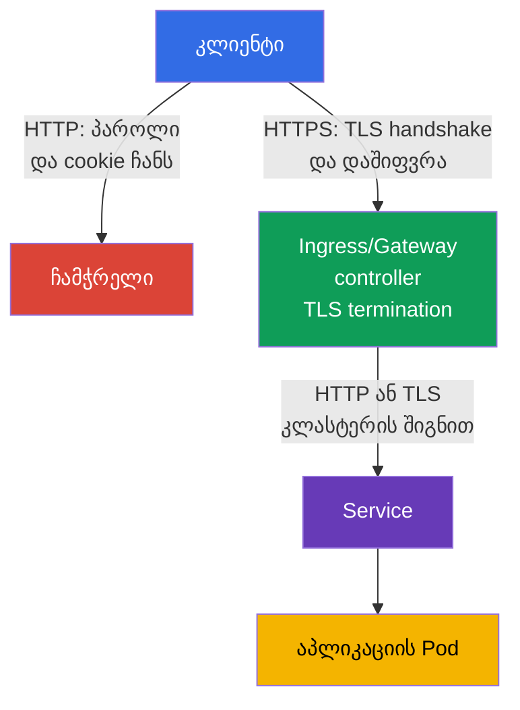
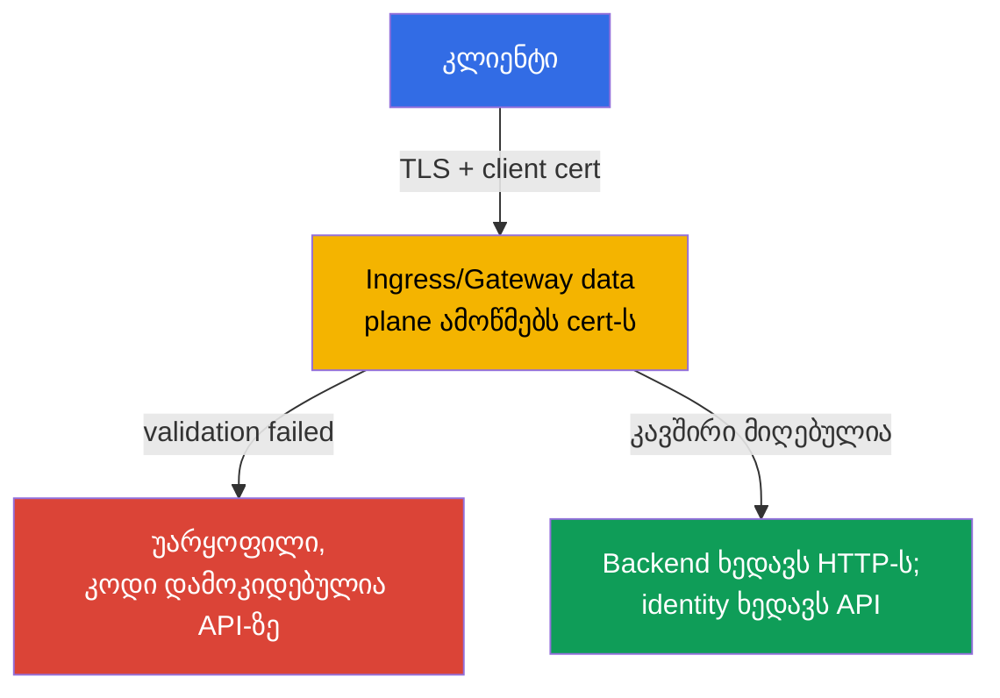

[Русская версия](ru.md) · [Eng version](README.md) · [Versión en español](es.md) · [Version française](fr.md) · [Deutsche Version](de.md) · [繁體中文版](tw.md) · [日本語版](jp.md)

# თავი 08. Secure Ingress TLS-ით

> **პრობლემა.** თუ Ingress ტრაფიკს ჩვეულებრივი HTTP-ით იღებს, login, cookie, bearer
> token და ფორმის შემცველობა ქსელში ღია ტექსტით მიდის. მომხმარებელი იმავე
> არასანდო ქსელში, მავნე Wi-Fi წერტილი ან შუალედური proxy შეძლებს მოთხოვნის
> წაკითხვას ან პასუხის შეუმჩნევლად შეცვლას - აპლიკაციის საჯარო შესასვლელი
> ჩაჭერისთვის ღია რჩება, სანამ ტრაფიკი საერთოდ მიაღწევს Pod-ს.

> **რა არის შემდეგ.** მე-07 თავში ჩვენ ამოწმებდით და ვამკაცრებდით კლასტერის კომპონენტების
> კონფიგურაციას. ახლა დავიცავთ აპლიკაციების საჯარო შესასვლელს. **Ingress TLS-ით**
> შიფრავს HTTP-ტრაფიკს კლიენტსა და ingress controller-ს შორის, ადასტურებს სერვერის
> სახელს და არ აძლევს ჩამჭრელს შესაძლებლობას შეუმჩნევლად წაიკითხოს ან შეცვალოს
> მოთხოვნა. ეს არის CKS-ის დომენი Cluster Setup (15%).

> **რა გჭირდებათ CKA-დან.** Ingress-ის, Service-ის ბაზისური სინტაქსი და host/path მარშრუტიზაცია
> განხილულია [CKA-ის 32-ე თავში](../../../cka/course/32/ge.md). TLS-ის მოწყობა, სერტიფიკატი,
> პრივატული გასაღები და ჯაჭვის შემოწმება - [CKA-ის 0.3 თავში](../../../cka/course/00-3-tls/ge.md).
> აქ განვიხილავთ ამ მექანიზმების უსაფრთხო გამოყენებას საჯარო შესასვლელზე და არა
> მათი საფუძვლების გამეორებას.

> 🧠 TLS იცავს მხოლოდ კლიენტიდან TLS termination-მდე გზას; controller → Service → Pod — ცალკე საზღვარია.

## 08.1. საფრთხის მოდელი: რატომ არ არის საკმარისი HTTP Ingress-ზე

Ingress controller ჩვეულებრივ იღებს ტრაფიკს გარე ქსელიდან და მიმართავს მას Service-თან,
შემდეგ კი Pod-თან. თუ კლიენტი HTTP-ით უერთდება, login, cookie, bearer token და ფორმის
შემცველობა ქსელში ღია ტექსტით მიდის. მომხმარებელი იმავე არასანდო ქსელში, მავნე
Wi-Fi წერტილი ან შუალედური proxy შეძლებს მოთხოვნის წაკითხვას ან პასუხის შეცვლას.

TLS იცავს არხს კლიენტიდან **TLS termination**-ის წერტილამდე - ingress controller-მდე.
Controller წარადგენს სერტიფიკატს host-ის სახელისთვის, ასრულებს TLS handshake-ს,
შიფრავს მოთხოვნას და მარშრუტიზაციას უკეთებს ჩვეულებრივი HTTP-ტრაფიკის backend-თან.
ამიტომ TLS გარე შესასვლელზე არ ნიშნავს, რომ controller -> Service -> Pod გზა
ავტომატურად დაშიფრულია. მგრძნობიარე შიდაკლასტერული ტრაფიკისთვის საჭიროა ცალკე
ზომები: TLS აპლიკაციაში, service mesh ან Cilium transparent encryption, რომელიც
განიხილება 23-ე თავში.



ერთდროულად საჭიროა სამი თვისება:

- კონფიდენციალურობა - კლიენტსა და controller-ს შორის ტრაფიკი არ უნდა იკითხებოდეს;
- მთლიანობა - მოთხოვნის ან პასუხის შეუმჩნევლად შეცვლა არ უნდა შეიძლებოდეს;
- ავთენტურობა - კლიენტი ამოწმებს, რომ სერტიფიკატი გაცემულია სწორედ მოთხოვნილი host-ისთვის.

დაშიფვრა არ ასწორებს არასაიმედო backend-ს, ზედმეტ RBAC-ს ან ღია endpoint-ს.
ეს არის defense in depth-ის ერთი ფენა. ასევე არ აურიოთ TLS certificate Kubernetes
Secret-ში: Secret ინახავს გასაღებსა და სერტიფიკატს, მაგრამ თავისთავად არ ჩართავს
TLS-ს, სანამ Ingress მას არ მიმართავს.

> 🎯 ტესტური certificate-ის გამოშვება მოცემული host-ისთვის SAN-ით, certificate/key-ის შედარება და `--cacert`-ის გამოყენება `-k`-ის ნაცვლად — TLS-ამოცანის პრაქტიკული მინიმუმია.

## 08.2. სერტიფიკატი და გასაღები: ტესტური self-signed და production-მიდგომა

ლაბორატორიისთვის შეგიძლიათ შექმნათ self-signed certificate. კლიენტი მას ნაგულისხმევად
არ ენდობა, ამიტომ ჩვეულებრივი `curl` ჯაჭვის შემოწმების შეცდომით დასრულდება.

სასურველი ტესტი - ლაბორატორიულ certificate-ს ცხადად ენდოთ `--cacert tls.crt`-ის მეშვეობით: ასე
curl განაგრძობს certificate-ისა და host-ის სახელთან შესაბამისობის შემოწმებას. `curl -k`
მთლიანად გამორთავს certificate verification-ს და დასაშვებია მხოლოდ როგორც ცალკე
დიაგნოსტიკური შემოწმება, მაგრამ არა როგორც სწორი TLS-კონფიგურაციის მტკიცებულება.

URL-ში მოცემული სახელი უნდა იყოს **Subject Alternative Name**-ში (SAN). თანამედროვე
კლიენტები ამოწმებენ SAN-ს და არა მხოლოდ მოძველებულ ველს Common Name (CN). ქვემოთ
სერტიფიკატი გათვლილია `app.example.test`-ზე; სხვა სახელისთვის შეცვალეთ როგორც
`HOST`, ასევე `subjectAltName`.

```bash
export HOST=app.example.test

openssl req -x509 -newkey rsa:2048 -nodes \
  -keyout tls.key \
  -out tls.crt \
  -days 30 \
  -subj "/CN=${HOST}" \
  -addext "subjectAltName=DNS:${HOST}"

# კლასტერში ატვირთვამდე შეამოწმეთ subject და SAN
openssl x509 -in tls.crt -noout -subject -ext subjectAltName

# certificate-ის public key უნდა ემთხვეოდეს private key-ის public key-ს.
# ორივე ბრძანების ჰეშები უნდა იყოს ერთნაირი.
openssl x509 -in tls.crt -pubkey -noout \
  | openssl pkey -pubin -outform DER | sha256sum
openssl pkey -in tls.key -pubout -outform DER \
  | sha256sum

# CA certificate-ისთვის შეამოწმეთ ჯაჭვი: leaf -> intermediate -> trusted root.
# `tls.crt` controller-ისთვის ჩვეულებრივ შეიცავს leaf-ს, შემდეგ intermediate-ს; root მასში არ იდება.
openssl verify -show_chain -CAfile root-ca.crt \
  -untrusted intermediate-ca.crt leaf.crt
```

Secret-ის შექმნამდე public key-ების დამთხვევა გამორიცხავს certificate/key-ის წყვილს
სხვადასხვა გამოშვებებიდან. `openssl verify -show_chain`-ის შედეგში leaf უნდა იყოს
შემოწმებული intermediate-ის მეშვეობით სანდო root-მდე; შეცდომა ნებისმიერ რგოლში ნიშნავს,
რომ ასეთი certificate არ შეიძლება აიტვირთოს.

პარამეტრი `-nodes` ტოვებს პრივატულ გასაღებს passphrase-ის გარეშე. ეს აუცილებელია,
რადგან controller-მა უნდა წაიკითხოს გასაღები ინტერაქტიული შეყვანის გარეშე. დაცვა ამ
შემთხვევაში ეყრდნობა Secret-ის მკაცრ RBAC-ს, etcd-ზე შეზღუდულ წვდომას და
encryption at rest-ს - და არა passphrase-ს გასაღების ფაილში.

> 🏭 სანდო CA, ავტომატური განახლება, პასუხისმგებელი პირი, ვადის ამოწურვის ალერტი და შემოწმებული Secret-ის როტაცია.

Production-ში ხელით ნუ შექმნით ხანგრძლივი ვადის self-signed certificate-ებს.
ჩვეულებრივ `cert-manager` იღებს სერტიფიკატს სანდო CA-სგან, მაგალითად Let's Encrypt-ისგან,
დებს მას Secret-ში და განაახლებს ვადის ამოწურვამდე. პლატფორმის გუნდმა ასევე უნდა
განსაზღვროს სერტიფიკატის პასუხისმგებელი პირი, ვადის ამოწურვის შესახებ შეტყობინება და
როტაციის პროცედურა. თუ TLS სრულდება კლასტერამდე cloud load balancer-ზე, შეამოწმეთ,
რომ NGINX-მდე კავშირიც აკმაყოფილებს ორგანიზაციის მოთხოვნებს: TLS შეიძლება საჭირო
იყოს ამ მონაკვეთზეც.

> 🎯 შექმენით `kubernetes.io/tls` Secret გასაღებებით `tls.crt` და `tls.key`, შემდეგ შეამოწმეთ namespace და სახელი: Ingress-ს შეუძლია მიმართოს მხოლოდ თავისივე namespace-ის Secret-ს.

## 08.3. TLS Secret: ფორმატი და მოქმედების არეალი

Ingress TLS-ისთვის გამოიყენეთ სტანდარტული TLS Secret ტიპით `kubernetes.io/tls` გასაღებებით
`tls.crt` და `tls.key`. სწორედ ასეთ ობიექტს ქმნის `kubectl create secret tls`.

გადატანადი Ingress TLS contract მოითხოვს certificate-სა და private key-ს გასაღებების
`tls.crt` და `tls.key` ქვეშ; Secret-ის ტიპისა და შემცველობის დამატებითი შემოწმებები
დამოკიდებულია controller-ზე. ამიტომ `kubernetes.io/tls` სწორი სტანდარტული ფორმატია
კურსისთვისაც და production-ისთვისაც, მაგრამ არ უნდა აიხსნას როგორც ერთადერთი
მექანიზმი, რომლის წაკითხვაც შეუძლია თავად Ingress API-ს. თავად ტიპი `kubernetes.io/tls`
გათვალისწინებულია მოხერხებულობისა და ერთგვაროვნებისთვის: Kubernetes API ამოწმებს ამ
ტიპის Secret-ისთვის საჭირო გასაღებების არსებობას, ხოლო TLS credentials ტექნიკურად
შეიძლება ინახებოდეს `Opaque` Secret-შიც, თუმცა ასეთი Secret ამ შემოწმებას ვერ იღებს
და სხვა ინჟინრებს ობიექტის დანიშნულებას ვერ აცნობებს.
ყველაზე საიმედო გზა მისი შექმნისა უკვე შემოწმებული ფაილებიდან - `kubectl create secret tls`:
ბრძანება თავად ჩადებს სერტიფიკატს `tls.crt` გასაღებში, ხოლო პრივატულ გასაღებს `tls.key`-ში.

```bash
kubectl -n web create secret tls app-example-tls \
  --cert=tls.crt \
  --key=tls.key

kubectl -n web get secret app-example-tls \
  -o jsonpath='{.type}{"\n"}{.data.tls\.crt}{"\n"}{.data.tls\.key}{"\n"}'
# kubernetes.io/tls
# tls.crt და tls.key-ის base64-მნიშვნელობები
```

იგივე ობიექტი მანიფესტის სახით ასე გამოიყურება. აქ `data` განზრახ არ არის შევსებული, უპირველეს ყოვლისა
იმიტომ, რომ private key `tls.key` არ შეიძლება Git-ში committed იყოს ღია სახით.

X.509 certificate `tls.crt` შეიცავს public key-ს და თავისთავად არ არის საიდუმლო;
public certificate-ის რეპოზიტორიში შენახვა - ცალკე repository policy-ის გადაწყვეტილებაა.
Private key ყოველთვის უნდა დარჩეს კონფიდენციალური. `stringData` უფრო მოსახერხებელია
მოკლე ტესტური მნიშვნელობებისთვის, მაგრამ ამით რეპოზიტორიის შემცველობა საიდუმლო არ ხდება.

```yaml
apiVersion: v1
kind: Secret
metadata:
  name: app-example-tls
  namespace: web
type: kubernetes.io/tls
data:
  tls.crt: <base64-encoded-certificate>
  tls.key: <base64-encoded-private-key>
```

Secret არის namespaced. Ingress namespace `web`-ში ვერ მიმართავს Secret-ს `default`-იდან
ან სხვა namespace-იდან. ნუ მისცემთ აპლიკაციას `get`/`list` უფლებას ყველა Secret-ზე მხოლოდ
TLS-ის გამო: ჩვეულებრივ certificate-ს ემსახურება controller, ხოლო ასეთი Secret-ების
შექმნისა და წაკითხვის უფლება შეზღუდულია ცალკე როლით. Base64 `data`-ში - ეს კოდირებაა,
არა encryption.

> 🎯 დააკავშირეთ ერთი host `spec.tls.hosts`-სა და `spec.rules.host`-ში, მიუთითეთ `secretName`, Service და `ingressClassName`.

## 08.4. Ingress: host-ის, TLS Secret-ისა და backend-ის დაკავშირება

Ingress API-ის გადატანადი ველები აქ არის `spec.tls` (`hosts`, `secretName`) და `spec.rules`
(`host`, `path`, `pathType`, `backend`). ისინი აღწერენ TLS certificate-სა და მარშრუტიზაციას,
მაგრამ **არ** ამყარებენ HTTP -> HTTPS redirect-ს. `spec.ingressClassName` ასევე API-ის
ველია, თუმცა თავად კლასის მნიშვნელობა, მაგალითად `nginx`, ირჩევს კონკრეტულ
რეალიზაციას. Annotations, მათ შორის `nginx.ingress.kubernetes.io/*`, საერთოდ არ შედის
Ingress API-ში: მათ მნიშვნელობას განსაზღვრავს მხოლოდ შესაბამისი controller.

Host-ის შესაბამისობა ორმაგად მნიშვნელოვანია: controller ირჩევს სწორ certificate-ს TLS
handshake-ის დროს, ხოლო კლიენტი ამოწმებს, რომ URL-ის სახელი არის SAN-ში. Apply-მდე
დარწმუნდით, რომ საჭირო კლასი და Service არსებობს:

```bash
kubectl get ingressclass
kubectl -n web get service web
```

ქვემოთ ვვარაუდობთ, რომ Service `web` namespace `web`-ში უსმენს პორტ 80-ს. მანიფესტი არ
ქმნის Service-ს ან Deployment-ს: ეს CKA-ის ბაზისია და ისინი ცალკე უნდა არსებობდნენ.

```yaml
apiVersion: networking.k8s.io/v1
kind: Ingress
metadata:
  name: web-secure
  namespace: web
spec:
  # API-ის ველი; სახელი `nginx` - რეალიზაციის არჩევანია, არა გადატანადი მნიშვნელობა.
  ingressClassName: nginx
  tls:
  - hosts:
    - app.example.test
    secretName: app-example-tls
  rules:
  - host: app.example.test
    http:
      paths:
      - path: /
        pathType: Prefix
        backend:
          service:
            name: web
            port:
              number: 80
```

ობიექტების კავშირის შემოწმება შესაძლებელია გარე DNS-ის გარეშეც:

```bash
kubectl -n web describe ingress web-secure
kubectl -n web get ingress web-secure -o yaml
kubectl -n web get secret app-example-tls -o jsonpath='{.type}{"\n"}'
```

`describe`-ის შედეგში შეამოწმეთ `Ingress Class`, წესი `app.example.test`-ისთვის, TLS host,
Secret და events.

Secret-ის წაკითხვის შეცდომა ან backend endpoints-ის არარსებობა ნამდვილად საჭიროებს
გასწორებას სრულფასოვან end-to-end შემოწმებამდე.

ველი `ADDRESS` განიხილეთ ცალკე: ის ასახავს Ingress-ის გამოქვეყნებულ status-ს და NodePort,
bare-metal, `hostNetwork`, port-forward ან ზოგიერთ ლოკალურ fixture-ში შეიძლება ცარიელი
დარჩეს მაშინაც კი, როცა Ingress მუშაობს. TLS-ის მზადყოფნა შეამოწმეთ არჩეული controller-ის
ფაქტობრივი entrypoint-ის მეშვეობით და არა მხოლოდ `ADDRESS`-ში მნიშვნელობის არსებობით.

## 08.5. ingress-nginx: retired-controller და annotations-ის საზღვრები

> **NGINX Ingress Controller retired.** 2026 წლის მარტიდან პროექტი `ingress-nginx` retired
> არის და აღარ იღებს რელიზებსა და security-fix-ებს ([announcement](https://kubernetes.io/blog/2025/11/11/ingress-nginx-retirement/)).
> CKS მოითხოვს სწორად კონფიგურირებულ Ingress-ს TLS-ით, მაგრამ საჯარო კომპეტენცია არ
> იძლევა გარანტიას კონკრეტულ controller-ზე ან nginx-specific annotations-ზე. გამოცდაზე
> ჯერ შეამოწმეთ ლაბორატორიის მიერ მოცემული controller; სინტაქსი `ingressClassName: nginx`
> და მისი annotations მხოლოდ შესაძლო fixture-ია. Production-ისთვის ნუ განათავსებთ
> retired-controller-ს ახალ კლასტერებზე: აირჩიეთ მხარდაჭერილი რეალიზაცია ან Gateway API.
> გადატანადი ნაწილი - TLS Secret, `spec.tls`, host/SNI, SAN, Service endpoints და HTTPS-ის
> შემოწმება - controller-ზე დამოკიდებული არ არის.

> 🎯 ingress-nginx-ისთვის `spec.tls` ჩვეულებრივ ჩართავს redirect-ს; `ssl-redirect` და `force-ssl-redirect` დამოკიდებულია რეალიზაციასა და topology-ზე.

მაშინაც კი, როცა TLS Ingress სწორია, რისკი რჩება, თუ HTTP ხელმისაწვდომი რჩება:
მომხმარებელს შეუძლია გადავიდეს ძველ ლინკზე, ხოლო cookie ან ფორმა გაივლის პირველ
HTTPS-პასუხამდე. **ingress-nginx**-ისთვის `spec.tls` ბლოკის არსებობა ნაგულისხმევად
რთავს HTTP -> HTTPS redirect-ს (ჩვეულებრივ `308`), თუ ეს არ არის გადაფარული
controller-ის კონფიგურაციით. ამიტომ ერთდროულად `ssl-redirect`-ისა და
`force-ssl-redirect`-ის დაყენება საჭირო არ არის და ჩვეულებრივი TLS Ingress-ისთვის
არასწორია, როგორც სავალდებულო რეცეპტი.

ეს სწორედ ingress-nginx-ის სემანტიკაა და არა Ingress API. თუ საჭიროა ცხადად
გადაფაროთ ingress-nginx-ის კონფიგურაცია Ingress-ისთვის `spec.tls`-ით, გამოიყენეთ
მხოლოდ მისი controller-specific annotation `ssl-redirect`:

```yaml
metadata:
  annotations:
    nginx.ingress.kubernetes.io/ssl-redirect: "true"
```

`force-ssl-redirect` შეინახეთ სხვა topology-სთვის: TLS სრულდება **გარე** load
balancer/proxy-ზე, controller იღებს HTTP-ს, და Ingress-ს არ აქვს `spec.tls` ბლოკი.
ამასთან გარე proxy-მ სწორად უნდა გადასცეს ინფორმაცია საწყისი HTTPS-სქემის შესახებ,
თორემ შესაძლებელია redirect loop. მაგალითად, ცალკე Ingress ასეთი external SSL
offload-კონფიგურაციისთვის:

```yaml
apiVersion: networking.k8s.io/v1
kind: Ingress
metadata:
  name: web-external-tls
  namespace: web
  annotations:
    nginx.ingress.kubernetes.io/force-ssl-redirect: "true"
spec:
  ingressClassName: nginx
  rules:
  - host: app.example.test
    http:
      paths:
      - path: /
        pathType: Prefix
        backend:
          service:
            name: web
            port:
              number: 80
```

ნუ შეცვლით redirect-ს აპლიკაციით, თუ მისი უზრუნველყოფა edge-ზეა შესაძლებელი. სხვაგვარად
თითოეულმა backend-მა უნდა გაიმეოროს იგივე კონფიგურაცია, ხოლო შემთხვევით დამატებული
Service შეიძლება HTTP-ით ხელმისაწვდომი დარჩეს. HSTS ავსებს redirect-ს პირველი
წარმატებული HTTPS-კავშირის შემდეგ, მაგრამ არ ცვლის TLS-ს და მოითხოვს ცალკე ფრთხილ
policy-ს domain-ებისა და subdomain-ებისთვის.

> 🏭 მხარდაჭერილი Gateway API controller და მისი status/compatibility; `GatewayClass`-ის შესაძლებლობებს განსაზღვრავს კონკრეტული რეალიზაცია.

> 🔬 **Gateway API v1.6 currentness.** Gateway API v1.6-ში `TCPRoute` და `UDPRoute` გადავიდნენ Standard `v1`-ში; ახალი experimental resources გატანილია ცალკე ჯგუფში `gateway.networking.x-k8s.io` `X`-პრეფიქსით. `XBackend` რჩება experimental, ხოლო მისი `ExternalHostname`-ის მხარდაჭერა მოითხოვს ცნობიერ opt-in-ს security trade-off-ის გამო, მათ შორის confused-deputy risk-ის. ეს production-current კონტექსტია და არა CKS Core. [ოფიციალური release blog](https://kubernetes.io/blog/2026/08/03/gateway-api-v1-6-release/).

### Gateway API: მიმდინარე production-გზა

Gateway API აღწერს სამ TLS-მოდელს: **edge termination** (HTTPS listener შიფრავს
ტრაფიკს Gateway-ზე), **TLS passthrough** (Gateway გადასცემს TLS-handshake-ს backend-ს
termination-ის გარეშე) და TLS backend-მდე termination-ის შემდეგ (re-encryption).
ბოლო მოდელისთვის `BackendTLSPolicy` Gateway API v1.4.0-დან — GA Standard Channel-ში —
ადგენს SNI-სა და backend-ის certificate-ის შემოწმებას. კონკრეტული მოდელის მხარდაჭერა
დამოკიდებულია Gateway controller-ზე.

ახალი production-კლასტერისთვის გამოიყენეთ მხარდაჭერილი Gateway API რეალიზაცია. ქვემოთ
მოცემულ მაგალითში `platform-gateway` - **implementation-specific** სახელია `GatewayClass`-ისთვის:
მას უზრუნველყოფს არჩეული Gateway controller, ეს არ არის Kubernetes-ის სტანდარტული
მნიშვნელობა. `certificateRefs` მიმართავს იმავე TLS Secret-ს namespace `web`-ში; HTTPS
listener ასრულებს TLS termination-ს, ხოლო `HTTPRoute` მიმართავს მოთხოვნას Service-თან.

```yaml
apiVersion: gateway.networking.k8s.io/v1
kind: Gateway
metadata:
  name: web-gateway
  namespace: web
spec:
  gatewayClassName: platform-gateway # სახელი დამოკიდებულია Gateway controller-ზე
  listeners:
  - name: https
    protocol: HTTPS
    port: 443
    hostname: app.example.test
    tls:
      mode: Terminate
      certificateRefs:
      - kind: Secret
        name: app-example-tls
---
apiVersion: gateway.networking.k8s.io/v1
kind: HTTPRoute
metadata:
  name: web-secure
  namespace: web
spec:
  parentRefs:
  - name: web-gateway
    sectionName: https
  hostnames:
  - app.example.test
  rules:
  - matches:
    - path:
        type: PathPrefix
        value: /
    backendRefs:
    - name: web
      port: 80
```

თუ Gateway ასევე ხსნის პორტ 80-ს, დაამატეთ ცალკე HTTP listener და `HTTPRoute`
სტანდარტული ფილტრით `RequestRedirect` `https`-ზე; ნუ აურევთ მას HTTPS-route-თან
backend-ისკენ.

> 🔬 TLS passthrough ასრულებს TLS-სა და mTLS-ს backend-ზე; შეამოწმეთ `TLSRoute`-ის, SNI-მარშრუტიზაციის და passthrough-ის მხარდაჭერა controller-ში.

### TLS passthrough: `TLSRoute`

Backend-ისთვის, რომელიც თავად ასრულებს TLS-ს (მაგალითად, საჭიროებს საკუთარ
certificate-ს ან mTLS-ს), Gateway არ შიფრავს კავშირს: listener-ს აქვს `protocol: TLS`
და `tls.mode: Passthrough`, ხოლო route ირჩევა SNI-ის მიხედვით. `TLSRoute` არის GA
Standard Channel Gateway API v1.5.0-ში. ქვემოთ მოცემული მინიმალური მაგალითი გადასცემს
TLS-ს `app.example.test`-ისთვის Service `web-tls`-ს პორტ 443-ზე; controller-მა უნდა
დაუჭიროს მხარი TLSRoute-სა და passthrough-ს.

```yaml
apiVersion: gateway.networking.k8s.io/v1
kind: Gateway
metadata:
  name: passthrough-gateway
  namespace: web
spec:
  gatewayClassName: platform-gateway
  listeners:
  - name: tls
    protocol: TLS
    port: 443
    hostname: app.example.test
    tls:
      mode: Passthrough
---
apiVersion: gateway.networking.k8s.io/v1
kind: TLSRoute
metadata:
  name: web-tls-passthrough
  namespace: web
spec:
  parentRefs:
  - name: passthrough-gateway
    sectionName: tls
  hostnames:
  - app.example.test
  rules:
  - backendRefs:
    - name: web-tls
      port: 443
```

Passthrough-ის დროს certificate-ის Secret მდებარეობს backend-ზე და არა Gateway-ის
`certificateRefs`-ში; შეამოწმეთ backend-ის SNI/SAN certificate და მისი endpoints.

Gateway-ის მიმართვას `Secret`-ისკენ სხვა namespace-ში სჭირდება ცხადი `ReferenceGrant`
**Secret-ის namespace-ში**; მის გარეშე controller-მა არ უნდა მიიღოს cross-namespace
reference. ნუ გადაიტანთ ამ ლოგიკას `BackendTLSPolicy`-ზე: cross-namespace ლინკები
certificate/CA-სთვის backend TLS-ისთვის დაუშვებელია `ReferenceGrant`-ის არსებობის
შემთხვევაშიც.

შეამოწმეთ მხარდაჭერილი `GatewayClass` `kubectl get gatewayclass`-ის მეშვეობით და
Gateway-ის status ტრაფიკის მიგრაციამდე.

> 🧠 mTLS ავთენტიფიცირებს კლიენტს edge-ზე TLS handshake-ში, მაგრამ არ ცვლის აპლიკაციის authorization-ს ან mTLS-ს Pod-ებს შორის.

## 08.6. mTLS შესასვლელზე: controller ამოწმებს კლიენტის სერტიფიკატს

ყველაფერი ზემოთ ამ თავში არის **server-side TLS**: controller ადასტურებს კლიენტს
საკუთარ identity-ს სერტიფიკატით, ხოლო კლიენტი რჩება ანონიმური TLS-ის დონეზე.
ცალკე ამოცანაა **mutual TLS (mTLS) შესასვლელზე**: controller დამატებით მოითხოვს
კლიენტისგან საკუთარი სერტიფიკატის წარდგენას და ამოწმებს მას სანდო CA-ს მიხედვით
**სანამ** მოთხოვნა მიაღწევს backend-ს. ნუ აურევთ ამას სხვა თავების თემებთან:

- 23-ე თავი განიხილავს mTLS-ს **Pod-ებს შორის mesh-ის შიგნით** (Istio/Linkerd sidecar-to-sidecar);
- TLS passthrough 08.5-დან გადააქვს კლიენტის შემოწმების ვალდებულება **თავად backend-ზე**,
  და არა Gateway/Ingress-ზე;
- აქ საუბარია სწორედ იმაზე, რომ **controller კლასტერის საზღვარზე** თავად ხდება
  TLS-სერვერი კლიენტისთვის და ამავე დროს ამოწმებს კლიენტის სერტიფიკატს.



ნუ აქცევთ HTTP-კოდს საერთო mTLS-მოდელის ნაწილად. ingress-nginx-ში რეჟიმი `on`
აბრუნებს `400`-ს failed certificate verification-ის დროს, ხოლო `auth-tls-match-cn`
შეიძლება დააბრუნოს `403`. Gateway API-ში `AllowValidOnly` ამოწმებს სერტიფიკატს
TLS handshake-ის დროს, ამიტომ რეალიზაციას შეუძლია უარყოს თავად TLS-კავშირი
HTTP-პასუხის გარეშე - controller-neutral მოდელი «ყოველთვის 400/403» აქ არ არსებობს.

> 🔬 `auth-tls-*` — retired ingress-nginx API; გადატანადი მოდელია ვალიდური client certificate edge-ზე.

### ingress-nginx: annotations `auth-tls-*`

Client Certificate Authentication ირთვება `Secret`-ის მეშვეობით CA-ჯაჭვით გასაღებში
`ca.crt` და annotations-ების ერთობლიობით `Ingress` ობიექტზე:

```yaml
apiVersion: networking.k8s.io/v1
kind: Ingress
metadata:
  name: web-mtls
  namespace: web
  annotations:
    nginx.ingress.kubernetes.io/auth-tls-secret: "web/client-ca"
    nginx.ingress.kubernetes.io/auth-tls-verify-client: "on"
    nginx.ingress.kubernetes.io/auth-tls-verify-depth: "1"
    nginx.ingress.kubernetes.io/auth-tls-pass-certificate-to-upstream: "true"
spec:
  tls:
  - hosts: [app.example.test]
    secretName: web-tls
  rules:
  - host: app.example.test
    http:
      paths:
      - path: /
        pathType: Prefix
        backend:
          service:
            name: web
            port:
              number: 80
```

- `auth-tls-secret` მიმართავს `Secret`-ს ფორმატით `namespace/name`, სადაც `ca.crt`
  შეიცავს კლიენტის სერტიფიკატებისთვის სანდო CA-ჯაჭვს - ეს ცალკე `Secret`-ია
  server-side `web-tls`-ისგან 08.3-დან, თუმცა ორივე ერთ host-ს ეხება.
- `auth-tls-verify-client: "on"` მოითხოვს კლიენტის სერტიფიკატს, წარმატებით
  შემოწმებულს `auth-tls-secret`-ის CA-ს მიხედვით; failed certificate verification
  სრულდება HTTP `400`-ით.
- `optional` არ მოითხოვს სერტიფიკატს ყველა კლიენტისგან, მაგრამ ეს **არ არის**
  რეჟიმი «არასდროს უარყო»: თუ კლიენტმა წარადგინა სერტიფიკატი, ხელმოუწერელი
  კონფიგურირებული CA-ს მიერ, ingress-nginx მაინც აბრუნებს HTTP `400`-ს. როცა
  მოთხოვნა დაიშვება, შემოწმების შედეგი შეიძლება გადაეცეს upstream-ს.
- `optional_no_ca` არ უარყოფს მოთხოვნას მხოლოდ იმის გამო, რომ კლიენტის
  სერტიფიკატი ხელმოუწერელია `auth-tls-secret`-ის CA-ს მიერ; verification result
  გადაეცემა upstream-ს. ეს რეჟიმი გამოიყენეთ მხოლოდ თუ აპლიკაცია ან ცალკე
  authorization layer ნამდვილად იღებს გადაწყვეტილებას ამ შედეგის მიხედვით.
- გატარებული upstream მოთხოვნისთვის ingress-nginx გადასცემს `ssl-client-verify`,
  `ssl-client-subject-dn` და `ssl-client-issuer-dn`; სრული PEM-სერტიფიკატი
  `ssl-client-cert`-ში გადაეცემა მხოლოდ `auth-tls-pass-certificate-to-upstream: "true"`-ისას.
- Client Certificate Authentication გამოიყენება მთელ host-ზე და არა ცალკე path-ზე.

> 🔬 Gateway API-ის frontend validation მოითხოვს API-ის ვერსიისა და controller-ის მხარდაჭერას; შეამოწმეთ ველი, CA references და handshake.

### Gateway API: frontend client-certificate validation Gateway-ის დონეზე

Frontend client-certificate validation Gateway API-ში შედის `Gateway` ობიექტის ველის
`spec.tls.frontend` მეშვეობით და არა `HTTPRoute`-ის მეშვეობით. აქტუალური სქემა
განსხვავდება უფრო ადრეული proposal-ვარიანტისგან (`default.frontendValidation`
GEP-91-დან): გამოშვებულ API-ში გზა არის `spec.tls.frontend.default.validation`,
ხოლო per-port override - `spec.tls.frontend.perPort[].tls.validation`.

```yaml
apiVersion: gateway.networking.k8s.io/v1
kind: Gateway
metadata:
  name: mtls-gateway
  namespace: web
spec:
  gatewayClassName: platform-gateway
  tls:
    frontend:
      default:
        validation:
          caCertificateRefs:
          - group: ""
            kind: ConfigMap
            name: client-ca
          mode: AllowValidOnly
  listeners:
  - name: app-https
    protocol: HTTPS
    port: 443
    hostname: app.example.test
    tls:
      mode: Terminate
      certificateRefs:
      - group: ""
        kind: Secret
        name: web-tls
```

`ConfigMap` `client-ca` შეიცავს სანდო CA certificate-ს (trust anchor) გასაღებში
`ca.crt`. Gateway API-ის გადატანადი Core-ვარიანტია ერთი `caCertificateRefs` ერთ
`ConfigMap`-ზე ერთი CA certificate-ით. რამდენიმე CA certificate ერთ `ca.crt`-ში,
რამდენიმე `caCertificateRefs` ან სხვა resource kinds მიეკუთვნება
implementation-specific მხარდაჭერას, ამიტომ ასეთი ვარიანტები შეამოწმეთ
კონკრეტული Gateway controller-ის დოკუმენტაციით.

- `spec.tls.frontend.default.validation` ამოწმებს კლიენტს **Gateway-სთან**
  დაკავშირებისას და გამოიყენება ყველა HTTPS listener-ისთვის, რომლებისთვისაც არ
  არსებობს per-port override; ეს არ არის იგივე, რაც `BackendTLSPolicy`, რომელიც
  მართავს TLS-ს Gateway-დან **backend-მდე** - ორივე policy დამოუკიდებელია და
  შეიძლება ერთდროულად გამოიყენებოდეს.
- `spec.tls.frontend.perPort[].tls.validation` გადაფარავს ამ კონფიგურაციას
  ყველა HTTPS listener-ისთვის მითითებულ პორტზე.
- `mode: AllowValidOnly` (default) უარყოფს კავშირს ვალიდური სერტიფიკატის გარეშე.
  `AllowInsecureFallback` იღებს კავშირს სერტიფიკატის გარეშეც ან მისი წარუმატებელი
  შემოწმებისასაც, დელეგირებას უკეთებს კლიენტის authorization-ის შესახებ
  გადაწყვეტილებას backend-ს. ეს მდგომარეობა ცხადად აღინიშნება პირობით
  `InsecureFrontendValidationMode` `Gateway`-ზე და ქმნის მნიშვნელოვან security
  risk-ს. Gateway API გირჩევთ ამ რეჟიმის გამოყენებას სატესტო გარემოში ან
  მხოლოდ დროებით non-testing გარემოში; ჩვეულებრივი production mTLS-ისთვის
  ამჯობინეთ `AllowValidOnly`.
- Frontend client-certificate validation-ის მხარდაჭერა დამოკიდებულია კონკრეტულ
  Gateway API controller-ზე; გამოყენებამდე შეამოწმეთ ის თქვენი ვერსიის
  მხარდაჭერილი implementations-ის სიაში.

ორივე მექანიზმი წყვეტს ერთსა და იმავე ამოცანას სხვადასხვა API-ით: NGINX Ingress
`auth-tls-*`-ის მეშვეობითაც და Gateway API `spec.tls.frontend...validation`-ის
მეშვეობითაც შეუძლიათ კლიენტის სერტიფიკატის შემოწმება კლასტერის საზღვარზე. რომელი
მათგანი ხელმისაწვდომია, დამოკიდებულია არა mTLS-ის იდეის შესაძლებლობებზე, არამედ
იმაზე, თუ რომელი ingress controller ან Gateway API implementation არის
განთავსებული კლასტერში - აირჩიეთ სინტაქსი ფაქტობრივად დაინსტალირებული
controller-ის მიხედვით და არა პირიქით.

### საფრთხე: client-certificate validation-ის scope დამოკიდებულია API-ზე

Client certificate მოწმდება TLS handshake-ის დროს, HTTP-მარშრუტიზაციამდე path-ის
მიხედვით. მაგრამ policy-ის ზუსტი მოქმედების არეალი განსხვავდება API-ებს შორის და
უნივერსალური არ არის:

- **ingress-nginx:** Client Certificate Authentication გამოიყენება **host-ზე** და
  არ შეუძლია ჰქონდეს განსხვავებული წესები ერთი host-ის ცალკეული paths-ისთვის.
  თუ `/admin` მოითხოვს მკაცრ client certificate-ს, ხოლო `/public`-მა არ უნდა
  მოითხოვოს ის TLS-დონეზე, ასეთი handshake-მოთხოვნები ვერ გამოისახება ერთი
  ingress-nginx host-ის ორი path-ით.
- **Gateway API:** frontend client-certificate validation მოცემულია `Gateway`-ის
  დონეზე: `default` გამოიყენება ყველა HTTPS listener-ისთვის override-ის გარეშე,
  ხოლო `perPort` - ყველა HTTPS listener-ისთვის მითითებულ პორტზე. ერთი Gateway-ის
  განსხვავებული `hostname`/listeners ერთ პორტზე **არ** იღებენ დამოუკიდებელ
  client-certificate policies-ს - GEP-91 ცხადად განმარტავს, რომ ვიწრო მიბმა
  შექმნიდა გვერდის ავლის რისკს HTTP/2/TLS connection coalescing-ის მეშვეობით:
  უკვე დამყარებულ TLS-კავშირს შეუძლია მოემსახუროს listener-ს სხვა hostname-ით
  იმავე პორტზე.

პრაქტიკული შედეგი: ნუ გამოიყენებთ წესს «განსხვავებული hostname ყოველთვის ნიშნავს
ცალკე mTLS policy-ს» როგორც გადატანად მოდელს. Gateway API-სთვის handshake-დონის
განსხვავებული მოთხოვნები საჭიროა გაანაწილოთ სხვადასხვა პორტებზე ან ნამდვილად
იზოლირებულ TCP/TLS entrypoints-ზე, რომლებსაც არჩეული რეალიზაცია გარანტირებულად
არ აერთიანებს; კონკრეტული topology შეამოწმეთ controller-ის დოკუმენტაციით.

ავტორიზაცია HTTP path/method-ის მიხედვით სრულდება უკვე TLS handshake-ის შემდეგ
HTTP-ცნობიერ authorization layer-ში ან აპლიკაციაში. `auth-tls-match-cn`
ingress-nginx-ის - არ არის path/method authorization: ის მხოლოდ დამატებით ადარებს
კლიენტის სერტიფიკატის CN-ს სტრიქონთან/regex-თან.

ნუ გადაიტანთ `ssl-client-verify`-ს ingress-nginx-იდან Gateway API-ზე, როგორც
საერთო contract-ს. Ingress-nginx აღწერს `ssl-client-*` headers-ს, ხოლო Gateway API
standardizes-ს frontend certificate validation-ს, მაგრამ არა საერთო ფორმატს
client identity-ის backend-ისთვის გადაცემისთვის. თუ backend-მა უნდა მიიღოს ეს
identity, ცალკე შეამოწმეთ კონკრეტული Gateway implementation-ის მექანიზმი.

ნუ ჩათვლით mTLS-ს შესასვლელზე RBAC-ის ან აპლიკაციის authorization-ის უნივერსალურ
ჩანაცვლებად: სერტიფიკატის შემოწმება კლასტერის საზღვარზე ადასტურებს TLS-კლიენტის
identity-ს და არა კონკრეტული მოქმედების ავტორიზაციას აპლიკაციის შიგნით.

> 🎯 `curl --resolve` `--cacert`-თან ერთად ამოწმებს HTTPS-ს, ხოლო `openssl s_client -servername` — controller-ის მიერ გაცემულ certificate-ს.

## 08.7. შემოწმება: controller-neutral HTTPS, host და სერტიფიკატი

ჯერ განსაზღვრეთ რეალური საჯარო შესასვლელი: არჩეული Ingress/Gateway controller-ის
Service-ის მისამართი, LoadBalancer-ის hostname ან გამოყენებული fixture-ის მიერ
გამოქვეყნებული მისამართი. ლოკალური კლასტერისთვის შეიძლება საჭირო იყოს NodePort-ის
მისამართი ან `kubectl port-forward`; LoadBalancer-ისთვის დაელოდეთ გარე მისამართს.
არ ივარაუდება კონკრეტული controller-ის namespace ან Service-ის სახელი.

```bash
kubectl get ingressclass
kubectl get gatewayclass
kubectl -n web get ingress,gateway,httproute,tlsroute
kubectl -n web get endpointslices -l kubernetes.io/service-name=web

export HOST=app.example.test
export ENTRYPOINT_IP=203.0.113.10  # შეცვალეთ არჩეული controller-ის მისამართით
```

თუ ტესტური host არ არის გამოქვეყნებული DNS-ში, `--resolve` აიძულებს `curl`-ს
გამოიყენოს `ENTRYPOINT_IP`, სწორი Host header-ისა და SNI-ის შენარჩუნებით.
გადატანადი შემოწმებაა წარმატებული HTTPS-გამოძახება backend-თან სწორი SNI-ითა
და host-ით, ამასთან სერტიფიკატი მოწმდება `--cacert`-ის მეშვეობით:

```bash
curl --cacert tls.crt -vsS -o /dev/null -w 'HTTP %{http_code}\n' \
  --resolve "${HOST}:443:${ENTRYPOINT_IP}" \
  "https://${HOST}/"
# HTTP 200
```

მხოლოდ დიაგნოსტიკა: დაკავშირება certificate-ის შემოწმების გარეშე. ამ ბრძანების
წარმატება **არ ამტკიცებს** SAN-ის/ჯაჭვის სისწორეს:

```bash
curl -kvsS -o /dev/null \
  --resolve "${HOST}:443:${ENTRYPOINT_IP}" \
  "https://${HOST}/"
```

HTTP -> HTTPS redirect და მისი სტატუსი დამოკიდებულია controller-ზე. **მხოლოდ თუ
fixture იყენებს `ingress-nginx`-ს** `spec.tls`-ით, შეგიძლიათ ცალკე ელოდოთ `308`-ს
და `Location`-ს:

```bash
curl -vI --resolve "${HOST}:80:${ENTRYPOINT_IP}" "http://${HOST}/"
```

შეამოწმეთ არა მხოლოდ სტატუსი `200`, არამედ სერტიფიკატიც, რომელიც კლიენტმა
მიიღო. `-servername` რთავს SNI-ს: მის გარეშე controller-ს კლასტერში რამდენიმე
host-ით შეუძლია დააბრუნოს default certificate.

```bash
openssl s_client -connect "${ENTRYPOINT_IP}:443" -servername "${HOST}" </dev/null 2>/dev/null \
  | openssl x509 -noout -subject -issuer -ext subjectAltName
# subject=CN = app.example.test
# X509v3 Subject Alternative Name:
#     DNS:app.example.test
```

Certificate-ისთვის, რომელსაც ენდობა სისტემური trust store, გამოიყენეთ ჩვეულებრივი
`curl` `-k`-ისა და ლაბორატორიული `--cacert tls.crt`-ის გარეშე: კლიენტმა უნდა
შეამოწმოს ჯაჭვი და სახელი სისტემური სანდო CA-ების მეშვეობით. თუ გამოიყენება
შიდა/private CA, გადაეცით სანდო CA bundle `--cacert <ca-bundle.pem>`-ის მეშვეობით
და არ გამორთოთ verification `-k`-ის მეშვეობით. თუ `curl` აბრუნებს
`SSL certificate problem`-ს, ნუ ავუვლით პრობლემას production-ში. შეამოწმეთ ვადის
ამოწურვა, SAN, CA-ჯაჭვი, `secretName`, namespace და ის, რომ controller-მა
ნამდვილად ხელახლა წაიკითხა განახლებული Secret.

| სიმპტომი                                              | რა შემოწმდეს                                                                     | სავარაუდო მიზეზი                                                                                                                                                                                                                                                  |
| ----------------------------------------------------------- | --------------------------------------------------------------------------------------------- | ---------------------------------------------------------------------------------------------------------------------------------------------------------------------------------------------------------------------------------------------------------------------------------- |
| HTTP აბრუნებს backend-ის `200`-ს                    | Annotations და ფაქტობრივი controller                                       | არ არის `ssl-redirect`, controller არ არის NGINX ან მისი კონფიგურაცია გადაფარავს redirect-ს                                                                                                                                                         |
| HTTPS აჩვენებს default certificate-ს              | `spec.tls.hosts`, SAN და SNI                                                                | Host არ ემთხვევა, Secret ვერ მოიძებნა ან მოთხოვნა `--resolve`/SNI-ის გარეშეა                                                                                                                                                                                 |
| `curl`-ი იღებს `404`-ს NGINX-იდან                | Host, `rules.host`, `ingressClassName`                                                     | მოთხოვნამ მიაღწია controller-ს, მაგრამ წესი არ არჩეულა                                                                                                                                                                                                     |
| HTTPS აბრუნებს `503`-ს                           | Service, endpoints და Pod-ის readiness                                                           | TLS მუშაობს, მაგრამ backend მიუწვდომელია                                                                                                                                                                                                                            |
| Secret არსებობს, მაგრამ TLS არ ჩაირთო           | `tls.crt`, `tls.key`, namespace და კონკრეტული controller-ის მოთხოვნები | აკლია ან არასწორია `tls.crt`/`tls.key`, certificate არ შეესაბამება private key-ს, Secret სხვა namespace-შია ან controller არ იღებს გამოყენებულ Secret-ის ფორმატს |
| ბრაუზერი არ ენდობა სერტიფიკატს | Issuer, ჯაჭვი და ვადის ამოწურვა                                           | Self-signed certificate ან არასრული CA-ჯაჭვი                                                                                                                                                                                                                  |

> 🏭 Certificate-ის გამოშვება და როტაცია, private key-ზე მინიმალური წვდომა, მხარდაჭერილი controller და synthetic-შემოწმებები ცვლილებების შემდეგ.

## 08.8. როგორ გამოიყენება ეს production-ში

- **ავტომატური გამოშვება და როტაცია.** `cert-manager` და სანდო CA გასცემენ
  certificate-ს, ახანგრძლივებენ მას ვადის ამოწურვამდე და ანახლებენ TLS Secret-ს.
  გუნდი ადევნებს თვალს ვადის ამოწურვის მეტრიკებს და იღებს alert-ს წინასწარ.
- **HTTPS ნაგულისხმევად.** ingress-nginx-ისთვის `spec.tls` ნაგულისხმევად იძლევა
  redirect-ს; `ssl-redirect` - მხოლოდ ცხადი controller-specific override. `force-ssl-redirect`
  გამოიყენება მხოლოდ external TLS offload-ის დროს `spec.tls` ბლოკის გარეშე. გარე
  load balancer, controller და აპლიკაცია შეთანხმებულად ამუშავებენ proxy headers-ს,
  რომ არ მიიღონ redirect loop.
- **API-ის მიგრაციის გეგმა.** ახალი კლასტერებისთვის Gateway HTTPS listener-ითა და
  `certificateRefs`-ით ერთად `HTTPRoute`-თან ცვლის retired ingress-nginx-ს; კონკრეტულ
  `GatewayClass`-ს ირჩევს დაინსტალირებული რეალიზაცია.
- **გასაღებებზე მინიმალური წვდომა.** RBAC აძლევს TLS Secret-ზე უფლებებს მხოლოდ
  controller-სა და სერტიფიკატების ავტომატიზაციას. Secret encryption at rest და
  დაცული etcd ამცირებს private key-ის გამჟღავნების რისკს.
- **საზღვრების გაყოფა.** ცალკე namespace, IngressClass და certificate tenant-ისთვის
  ან კრიტიკული domains-ისთვის ამცირებს შემთხვევით სხვისი certificate-ის ან route-ის
  გაცემის ალბათობას.
- **შემოწმება ყოველი ცვლილების შემდეგ.** Pipeline აკეთებს HTTPS-მოთხოვნას სწორი
  SNI-ით, ამოწმებს მოსალოდნელ SAN-ს, certificate-ის ვადის ამოწურვას და backend-ის
  ხელმისაწვდომობას. თუ policy ითვალისწინებს HTTP listener-ს HTTPS-ზე
  გადამისამართებით, pipeline დამატებით ამოწმებს მოსალოდნელ `30x` redirect-ს.
  სუფთა HTTPS-only topology-სთვის სწორ შედეგად შეიძლება ჩაითვალოს ხელმისაწვდომი
  HTTP listener-ის სრული არარსებობა. ეს იჭერს შეცდომას მანამ, სანამ მას
  მომხმარებელი დაინახავს.

## 08.9. მინი-ლექსიკონი

- **TLS termination** - TLS handshake-ის დასრულება და ტრაფიკის გაშიფვრა ingress controller-ზე.
- **Ingress** - API-ობიექტი გარე HTTP/HTTPS-მარშრუტიზაციის წესებით Service-თან.
- **IngressClass** - Ingress-რეალიზაციის არჩევანი, მაგალითად NGINX Ingress Controller;
  კლასის სახელი დამოკიდებულია დაინსტალირებულ controller-ზე.
- **GatewayClass** - Gateway API-რეალიზაციის არჩევანი; მისი სახელიც implementation-specific-ია.
- **TLS Secret** - Secret ტიპით `kubernetes.io/tls` გასაღებებით `tls.crt` და `tls.key`.
- **SAN** - Subject Alternative Name, DNS-სახელების/IP-მისამართების სია, რომლებისთვისაც
  certificate მოქმედია.
- **SNI** - Server Name Indication, host-ის სახელი TLS handshake-ში certificate-ის
  ასარჩევად.
- **self-signed certificate** - certificate, ხელმოწერილი საკუთარი გასაღებით და არა
  სანდო CA-ს მიერ; ტესტისთვის ვარგისია, მაგრამ კლიენტები მას ნაგულისხმევად არ ენდობიან.
- **HTTP -> HTTPS redirect** - დაუშიფრავი მოთხოვნის მუდმივი გადამისამართება HTTPS-ზე.
- **mTLS შესასვლელზე** - controller დამატებით მოითხოვს და ამოწმებს კლიენტის
  სერტიფიკატს TLS handshake-ის დროს, სანამ მოთხოვნა backend-ს მიაღწევს; ნუ აურევთ
  mesh mTLS-თან (23-ე თავი).
- **Gateway frontend client-certificate validation** - კლიენტის სერტიფიკატის
  შემოწმება `spec.tls.frontend.default.validation`-ის ან per-port override
  `spec.tls.frontend.perPort[].tls.validation`-ის მეშვეობით; ცალკე `BackendTLSPolicy`-სგან,
  რომელიც მართავს TLS-ს backend-მდე.

## 08.10. თავის შეჯამება

- TLS Ingress-ზე იცავს გარე HTTP-არხს ჩაჭერისა და შეცვლისგან TLS termination-ის
  წერტილამდე.
- ტესტისთვის შეგიძლიათ შექმნათ self-signed certificate `openssl`-ის მეშვეობით,
  მაგრამ SAN აუცილებლად უნდა შეიცავდეს host-ს, ხოლო `curl -k` production-ში ვერ
  დარჩება.
- Secret-ის შექმნამდე certificate-ისა და private key-ის public keys უნდა ემთხვეოდეს
  ერთმანეთს, ხოლო ჯაჭვი უნდა შემოწმდეს როგორც leaf -> intermediate -> trusted root.
  `kubectl create secret tls` ქმნის Secret-ს ტიპით `kubernetes.io/tls` `tls.crt`-ით
  და `tls.key`-ით; Ingress და Secret უნდა იყოს ერთ namespace-ში.
- `spec.tls`-ში უკავშირდება გადატანადი API-ველები `hosts` და `secretName`;
  `ingressClassName` ირჩევს რეალიზაციას, ხოლო სახელი `nginx` და მისი annotations -
  არ არის გადატანადი.
- ingress-nginx-ში `spec.tls` ნაგულისხმევად რთავს HTTP -> HTTPS redirect-ს.
  `ssl-redirect` შეიძლება მითითდეს როგორც ცხადი override მხოლოდ ingress-nginx-ისთვის;
  `force-ssl-redirect` საჭიროა external TLS offload-ისთვის `spec.tls` ბლოკის გარეშე.
- ახალი production-კლასტერებისთვის გამოიყენეთ Gateway API: HTTPS listener
  `certificateRefs`-ით და `HTTPRoute`; აირჩიეთ edge termination, TLS passthrough ან
  re-encryption backend-ისკენ `BackendTLSPolicy`-ის მეშვეობით. `GatewayClass`-ს ირჩევს
  რეალიზაცია, ხოლო cross-namespace Secret-ს სჭირდება `ReferenceGrant` Secret-ის
  namespace-ში.
- შემოწმება უნდა მოიცავდეს სერტიფიკატის SNI-სა და SAN-ს, Service endpoints-ს და
  Ingress-ის events-ს და არა მხოლოდ YAML-ობიექტების არსებობას.

## 08.11. როგორ გამოგადგებათ: გამოცდაზე და რეალურ სამუშაოში

**გამოცდაზე.** გადატანადი მინიმუმი: certificate-ის გენერაცია მოცემული host-ისთვის
და SAN-ის შემოწმება, TLS Secret-ის შექმნა, მასზე მითითება `spec.tls`-ის მეშვეობით,
host/SNI/SAN-ის შედარება, დარწმუნება, რომ არჩეული controller და backend endpoints
არსებობს, და წარმატებული HTTPS-გამოძახება `curl --resolve`-ის მეშვეობით. ყოველთვის
შეამოწმეთ namespace, `secretName`, `hosts` და `ingressClassName` ან Gateway route.
`308`, `ssl-redirect` და `force-ssl-redirect` — დეტალებია **მხოლოდ ingress-nginx-იან
fixture-ში**: გამოიყენეთ ისინი მხოლოდ თუ ამოცანა ცხადად გაძლევთ ამ controller-ს
და მოითხოვს შესაბამის topology-ს.

**რეალურ სამუშაოში.** Secure Ingress - საზღვარია არასანდო კლიენტსა და აპლიკაციას
შორის. საიმედო კონფიგურაცია აერთიანებს certificate-ის ავტომატურ როტაციას, private
key-ზე მინიმალურ წვდომას, SAN-ის მკაცრ შემოწმებას, სავალდებულო HTTPS-ს და
უწყვეტ synthetic-შემოწმებებს. ერთმა არასწორმა annotation-მა ან Secret-მა სხვა
namespace-ში შეიძლება საჯარო endpoint მოსალოდნელი დაცვის გარეშე დატოვოს.

## 08.12. თვითშემოწმების კითხვები

<details>
<summary>1. სად სრულდება TLS-ის დაცვა TLS termination-ისას Ingress-ზე და რატომ არ იძლევა ეს გარანტიას შიფრვაზე controller-სა და Pod-ს შორის?</summary>

TLS იცავს არხს კლიენტიდან ingress controller-მდე, სადაც სრულდება handshake და მოთხოვნის გაშიფვრა. შემდგომი გზა controller → Service → Pod შეიძლება იყოს HTTP ან TLS, ამიტომ მგრძნობიარე შიდაკლასტერული ტრაფიკისთვის საჭიროა TLS აპლიკაციაში, service mesh ან Cilium transparent encryption.

</details>

<details>
<summary>2. რატომ არ არის საკმარისი მხოლოდ CN და რომელი ველი certificate-ისა უნდა შეიცავდეს DNS host-ს?</summary>

თანამედროვე კლიენტები ამოწმებენ URL-ის სახელს Subject Alternative Name-ის მიხედვით და არა მხოლოდ მოძველებული Common Name-ის მიხედვით. Self-signed certificate-ის გამოშვებისას საჭირო DNS host ემატება `subjectAltName`-ს, მაგალითად `DNS:${HOST}`, და მოწმდება `openssl x509 -ext subjectAltName`-ის მეშვეობით.

</details>

<details>
<summary>3. რა ტიპი და რა გასაღებები უნდა ჰქონდეს TLS Secret-ს Ingress-ისთვის?</summary>

სტანდარტული ვარიანტია Secret ტიპით `kubernetes.io/tls` certificate-ით `tls.crt`-ში და private key-ით `tls.key`-ში. საიმედოა მისი შექმნა `kubectl create secret tls ... --cert=tls.crt --key=tls.key`-ის მეშვეობით. გადატანადი კონფიგურაციისთვის მთავარია სწორი `tls.crt`, `tls.key` და არჩეული Ingress controller-ის მხარდაჭერა.

</details>

<details>
<summary>4. რატომ უნდა იყოს Ingress და მისი TLS Secret ერთსა და იმავე namespace-ში?</summary>

Secret — namespaced ობიექტია, და Ingress `web`-იდან ვერ მიმართავს Secret-ს `default`-იდან ან სხვა namespace-იდან. ამიტომ `secretName` `spec.tls`-ში უნდა მიმართავდეს Secret-ს, შექმნილს იმავე namespace-ში, სადაც Ingress-ია.

</details>

<details>
<summary>5. რატომ აკეთებს ingress-nginx `spec.tls`-ით ნაგულისხმევად redirect-ს და როდის სჭირდება controller-specific annotation `force-ssl-redirect`?</summary>

ingress-nginx-ისთვის ბლოკი `spec.tls` ნაგულისხმევად რთავს HTTP → HTTPS redirect-ს, ჩვეულებრივ 308-ს, თუ controller-ის კონფიგურაცია მას არ გადაფარავს. `force-ssl-redirect` ინახება topology-სთვის external TLS offload-ით, როცა TLS სრულდება controller-მდე, ის იღებს HTTP-ს და Ingress-ს არ აქვს `spec.tls`; proxy-მ სწორად უნდა გადასცეს საწყისი HTTPS-სქემა, თორემ შესაძლებელია loop.

</details>

<details>
<summary>6. რა ორ შედეგს ველოდებით `curl`-გან HTTP-სა და HTTPS-ისთვის redirect-ის დაყენების შემდეგ?</summary>

HTTPS-გამოძახება სწორი SNI-ითა და Host-ით, მაგალითად `curl --resolve`-ის მეშვეობით, უნდა წარმატებით მიაღწიოს backend-ს, მაგალითში — HTTP 200. ლაბორატორიული self-signed certificate-ისთვის გადაეცით ის, როგორც სანდო certificate, `--cacert tls.crt`-ის მეშვეობით; `-k` გამოიყენეთ მხოლოდ როგორც ცალკე diagnostic bypass, მისი წარმატება ადასტურებს კავშირს, მაგრამ არ ადასტურებს certificate-ის, SAN-ის ან ჯაჭვის სისწორეს. მხოლოდ ingress-nginx-იანი და `spec.tls`-იანი fixture-ისთვის ცალკე HTTP-მოთხოვნა მოსალოდნელად აბრუნებს redirect-ს, ჩვეულებრივ 308-ს, `Location`-ით; სტატუსი არ არის Ingress API-ის გადატანადი სემანტიკა.

</details>

<details>
<summary>7. როგორ დაადასტურებთ Secret-ის შექმნამდე certificate/key-ის public key-ის დამთხვევასა და ჯაჭვს leaf -> intermediate -> root?</summary>

Certificate-ის public key-ის ჰეში მიიღება `openssl x509 -pubkey -noout | openssl pkey -pubin -outform DER | sha256sum`-ის მეშვეობით და ედარება `openssl pkey -in tls.key -pubout -outform DER | sha256sum`-ის ჰეშს. ჯაჭვი მოწმდება `openssl verify -show_chain -CAfile root-ca.crt -untrusted intermediate-ca.crt leaf.crt`-ით: leaf უნდა იყოს შემოწმებული intermediate-ის მეშვეობით სანდო root-მდე.

</details>

<details>
<summary>8. რატომ არ შეიძლება `curl -k`-ის გამოყენება სწორი TLS-კონფიგურაციის მტკიცებულებად თუნდაც self-signed certificate-თან?</summary>

`-k` გამორთავს certificate-ის შემოწმებას და ამიტომ გამოსადეგია მხოლოდ დიაგნოსტიკისთვის. თუ ლაბორატორიის self-signed certificate ლოკალურად ხელმისაწვდომია, სჯობს გამოიყენოთ `--cacert tls.crt`: ასე curl ენდობა სწორედ ამ certificate-ს, მაგრამ განაგრძობს TLS-ისა და host-ის სახელის შემოწმებას. Production-ში `-k` მალავს ნდობის, SAN-ის, ჯაჭვის შეცდომებს და შესაძლო შეცვლას; პრობლემა უნდა გასწორდეს და არა აიხვიოს.

</details>

<details>
<summary>9. რატომ არ შეიძლება `GatewayClass` ჩაითვალოს გადატანად სახელად და როგორ აკავშირებს HTTPS listener Gateway-ს certificate-თან `certificateRefs`-ის მეშვეობით?</summary>

`GatewayClass`-ს უზრუნველყოფს არჩეული Gateway controller, ამიტომ სახელი, როგორიც არის `platform-gateway`, არის implementation-specific და არა Kubernetes-ის სტანდარტი. HTTPS listener ადგენს `tls.mode: Terminate`-ს და `certificateRefs`-ს TLS Secret-ისკენ; მაგალითში Secret იმავე namespace-შია, ხოლო cross-namespace მიმართვას დასჭირდებოდა `ReferenceGrant` Secret-ის namespace-ში.

</details>

## პრაქტიკა

🧪 ლაბი 103 (CIS, Secure Ingress TLS, TLS hardening და ბინარების შემოწმება):
[tasks/cks/labs/103](../../labs/103/README_GE.MD)

🌐 დამატებითი ინტერაქტიული პრაქტიკა (killer.sh/killercoda, გარე რესურსი): [ingress-create](https://killercoda.com/killer-shell-cks/scenario/ingress-create) · [ingress-secure](https://killercoda.com/killer-shell-cks/scenario/ingress-secure)

🎮 Killercoda (ბრაუზერში, ინსტალაციის გარეშე): [Ingress Controller](https://killercoda.com/kubernetes-basics/course/kubernetes-fundamentals/ingress-controller) · [Create TLS Certificate](https://killercoda.com/kubernetes-basics/course/kubernetes-fundamentals/create-tls-certificate)

---

[სარჩევი](../README_GE.md) · [თავი 07](../07/ge.md) · [თავი 09](../09/ge.md)
