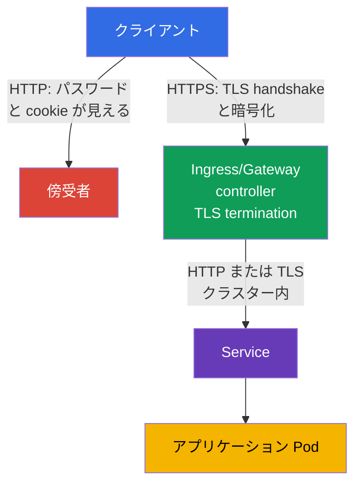
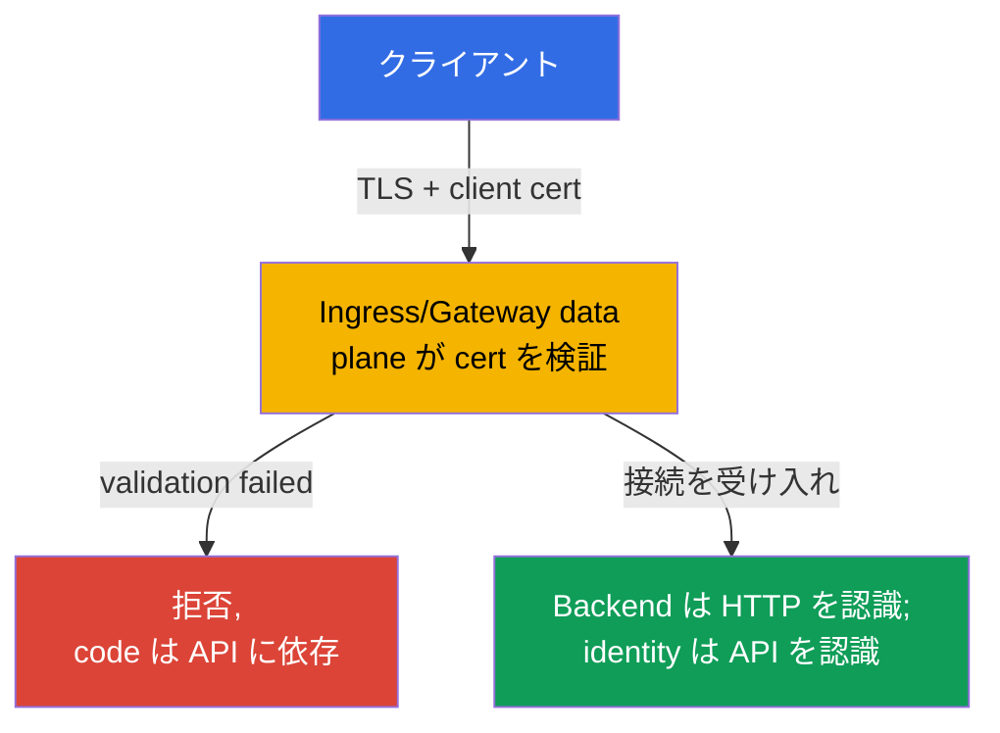

[Русская версия](ru.md) · [Eng version](README.md) · [Versión en español](es.md) · [Version française](fr.md) · [Deutsche Version](de.md) · [ქართული ვერსია](ge.md) · [繁體中文版](tw.md)

# 第08章. TLS を用いた Secure Ingress

> **課題。** Ingress が通常の HTTP でトラフィックを受ける場合、ログイン、cookie、bearer token、フォーム内容はネットワークを平文で流れます。同じ信頼できないネットワークのユーザー、悪意ある Wi-Fi access point、または中間 proxy はリクエストを読んだり応答を密かに改ざんしたりできます。アプリケーションの public entrypoint は、トラフィックが Pod に届く前から傍受に開かれています。

> **この先。** 第07章ではクラスターコンポーネントの設定を確認し強化しました。次にアプリケーションの public entrypoint を保護します。**TLS を持つ Ingress** はクライアントと ingress controller 間の HTTP トラフィックを暗号化し、サーバー名を確認し、傍受者がリクエストを密かに読んだり改ざんしたりすることを防ぎます。これは CKS の Cluster Setup (15%) ドメインです。

> **CKAで必要な知識。** Ingress、Service、host/path によるルーティングの基本構文は[CKA 第32章](../../../cka/course/32/jp.md)で、TLS、certificate、private key、chain 検証は[CKA 第00-3章](../../../cka/course/00-3-tls/jp.md)で扱っています。ここでは基礎を繰り返さず、public entrypoint でこれらを安全に適用します。

> 🧠 TLS が保護するのはクライアントから TLS termination までの経路だけです。controller → Service → Pod は別の境界です。

## 08.1. 脅威モデル: Ingress の HTTP だけでは不十分な理由

Ingress controller は通常、外部ネットワークからのトラフィックを受け、Service、次いで Pod へ送ります。クライアントが HTTP で接続すれば、ログイン、cookie、bearer token、フォーム内容は平文で流れます。同じ信頼できないネットワークのユーザー、悪意ある Wi-Fi access point、中間 proxy はリクエストを読んだり応答を改ざんしたりできます。

TLS はクライアントから **TLS termination**、すなわち ingress controller までのチャネルを保護します。controller は host 名の certificate を提示し、TLS handshake を行い、リクエストを復号して通常の HTTP トラフィックを backend へルーティングします。そのため外部 entrypoint の TLS は controller -> Service -> Pod 経路が自動的に暗号化されることを意味しません。機密性の高いクラスター内トラフィックには、アプリケーション TLS、service mesh、第23章で扱う Cilium transparent encryption など別の手段が必要です。



同時に三つの性質が必要です。

- 機密性 - クライアントと controller 間のトラフィックを読めないこと。
- 完全性 - リクエストまたは応答を密かに変更できないこと。
- 真正性 - certificate が要求した host に対して発行されていることをクライアントが検証すること。

暗号化は安全でない backend、過剰な RBAC、公開 endpoint を修正しません。これは defense in depth の一層です。TLS certificate と Kubernetes Secret も混同してはいけません。Secret は key と certificate を保存しますが、Ingress がそれを参照するまで TLS を有効にしません。

> 🎯 指定 host 用に SAN を持つテスト certificate を発行し、certificate/key を照合し、`-k` ではなく `--cacert` を使えることが TLS 課題の実践的な最小要件です。

## 08.2. Certificate と key: テスト用 self-signed と production アプローチ

ラボでは self-signed certificate を作成できます。クライアントはデフォルトでこれを信頼しないため、通常の `curl` は chain verification error で終了します。

推奨するテストは、`--cacert tls.crt` でラボ certificate を明示的に信頼することです。これにより curl は certificate と host 名の一致を検証し続けます。`curl -k` は certificate verification を完全に無効化するため、個別の診断確認には使えますが、正しい TLS 設定の証明にはなりません。

URL の名前は **Subject Alternative Name** (SAN) に存在する必要があります。現代のクライアントは古い Common Name (CN) フィールドだけでなく SAN を検証します。以下の certificate は `app.example.test` 用です。別の名前なら `HOST` と `subjectAltName` の両方を変更します。

```bash
export HOST=app.example.test

openssl req -x509 -newkey rsa:2048 -nodes \
  -keyout tls.key \
  -out tls.crt \
  -days 30 \
  -subj "/CN=${HOST}" \
  -addext "subjectAltName=DNS:${HOST}"

# クラスターへアップロードする前に subject と SAN を確認する
openssl x509 -in tls.crt -noout -subject -ext subjectAltName

# certificate の public key は private key の public key と一致しなければならない。
# 二つのコマンドの hash は同一である必要がある。
openssl x509 -in tls.crt -pubkey -noout \
  | openssl pkey -pubin -outform DER | sha256sum
openssl pkey -in tls.key -pubout -outform DER \
  | sha256sum

# CA certificate では chain を確認する: leaf -> intermediate -> trusted root。
# controller 用の `tls.crt` は通常 leaf の後に intermediate を含み、root は入れない。
openssl verify -show_chain -CAfile root-ca.crt \
  -untrusted intermediate-ca.crt leaf.crt
```

Secret 作成前の public key の一致確認により、別発行の certificate/key ペアを除外します。`openssl verify -show_chain` の出力では leaf が intermediate を経て信頼された root まで検証される必要があります。どのリンクでも error があれば、その certificate はアップロードできません。

`-nodes` は private key を passphrase なしにします。controller が対話入力なしで key を読む必要があるためです。この場合の保護は key ファイルの passphrase ではなく、Secret の厳格な RBAC、etcd へのアクセス制限、encryption at rest で構築します。

> 🏭 信頼できる CA、自動更新、所有者、有効期限前の alert、検証済み Secret rotation。

production では長期の self-signed certificate を手動で作成しません。通常 `cert-manager` が Let's Encrypt など信頼できる CA から certificate を取得し、Secret に置き、有効期限前に更新します。platform チームは certificate 所有者、有効期限 alert、rotation 手順も定めるべきです。TLS がクラスタ―前段の cloud load balancer で termination する場合は、NGINX までの接続も組織要件に適合することを確認します。その区間にも TLS が必要な場合があります。

> 🎯 `tls.crt` と `tls.key` をキーにする `kubernetes.io/tls` Secret を作成し、namespace と名前を確認してください。Ingress は自身と同じ namespace の Secret だけを参照できます。

## 08.3. TLS Secret: 形式とスコープ

Ingress TLS には、キー `tls.crt` と `tls.key` を持つ標準 TLS Secret、型 `kubernetes.io/tls` を使います。これは `kubectl create secret tls` が作成するオブジェクトです。

移植可能な Ingress TLS contract では certificate と private key が `tls.crt`、`tls.key` のキーにあることが必要です。Secret 型と内容への追加検証は controller に依存します。したがって `kubernetes.io/tls` はコースと production の正しい標準形式ですが、Ingress API が読める唯一のメカニズムと説明すべきではありません。この型は利便性と一貫性のためにあり、Kubernetes API はこの型の Secret に必要なキーがあることを検証します。TLS credentials は技術的には `Opaque` Secret にも保存できますが、その Secret にはこの検証がなく、他のエンジニアにオブジェクトの目的を伝えません。確認済みのファイルから最も確実に作成する方法は `kubectl create secret tls` です。このコマンドは certificate を `tls.crt`、private key を `tls.key` に置きます。

```bash
kubectl -n web create secret tls app-example-tls \
  --cert=tls.crt \
  --key=tls.key

kubectl -n web get secret app-example-tls \
  -o jsonpath='{.type}{"\n"}{.data.tls\.crt}{"\n"}{.data.tls\.key}{"\n"}'
# kubernetes.io/tls
# tls.crt と tls.key の base64 値
```

同じオブジェクトを manifest で表すと次のようになります。ここで `data` は意図的に未入力です。主な理由は private key `tls.key` を平文で Git に commit できないためです。

X.509 certificate `tls.crt` は public key を含み、それ自体は secret ではありません。public certificate を repository に保存するかは別の repository policy の判断です。Private key は常に機密に保つ必要があります。`stringData` は短いテスト値には便利ですが、repository 内容を秘密にするものではありません。

```yaml
apiVersion: v1
kind: Secret
metadata:
  name: app-example-tls
  namespace: web
type: kubernetes.io/tls
data:
  tls.crt: <base64-encoded-certificate>
  tls.key: <base64-encoded-private-key>
```

Secret は namespaced です。namespace `web` の Ingress は `default` や別 namespace の Secret を参照できません。TLS のためだけにアプリケーションへ全 Secret の `get`/`list` を与えないでください。通常 certificate は controller が提供し、そのような Secret の作成・読み取りアクセスは別 role に制限されます。`data` の Base64 は encryption ではなく encoding です。

> 🎯 `spec.tls.hosts` と `spec.rules.host` の一つの host を結び、`secretName`、Service、`ingressClassName` を指定してください。

## 08.4. Ingress: host、TLS Secret、backend を結ぶ

ここでの移植可能な Ingress API fields は `spec.tls`（`hosts`、`secretName`）と `spec.rules`（`host`、`path`、`pathType`、`backend`）です。これらは TLS certificate とルーティングを記述しますが、HTTP -> HTTPS redirect は設定**しません**。`spec.ingressClassName` も API field ですが、たとえば `nginx` という class 値は特定実装を選びます。`nginx.ingress.kubernetes.io/*` を含む annotations は Ingress API の一部ではなく、意味は対応 controller だけが定義します。

host の対応付けは二度重要です。controller は TLS handshake 中に正しい certificate を選び、クライアントは URL の名前が SAN にあることを検証します。適用前に必要な class と Service が存在することを確認してください。

```bash
kubectl get ingressclass
kubectl -n web get service web
```

以下では namespace `web` の Service `web` が port 80 を listen すると仮定します。この manifest は Service や Deployment を作成しません。これらは CKA の基礎であり、別途存在する必要があります。

```yaml
apiVersion: networking.k8s.io/v1
kind: Ingress
metadata:
  name: web-secure
  namespace: web
spec:
  # API field。`nginx` という名前は移植可能な値ではなく実装の選択です。
  ingressClassName: nginx
  tls:
  - hosts:
    - app.example.test
    secretName: app-example-tls
  rules:
  - host: app.example.test
    http:
      paths:
      - path: /
        pathType: Prefix
        backend:
          service:
            name: web
            port:
              number: 80
```

外部 DNS なしでオブジェクトの結び付きを確認できます。

```bash
kubectl -n web describe ingress web-secure
kubectl -n web get ingress web-secure -o yaml
kubectl -n web get secret app-example-tls -o jsonpath='{.type}{"\n"}'
```

`describe` の出力では、`Ingress Class`、`app.example.test` の rule、TLS host、Secret、events を確認します。

Secret 読み取り error または backend endpoints がない場合は、完全な end-to-end 検証前に修正が必要です。

`ADDRESS` field は個別に扱います。これは公開された Ingress status を反映しますが、NodePort、bare-metal、`hostNetwork`、port-forward、一部のローカル fixture では、Ingress が動作していても空のままの場合があります。TLS の準備状態は `ADDRESS` の値だけでなく、選択した controller の実際の entrypoint で確認してください。

## 08.5. ingress-nginx: retired controller と annotations の境界

> **NGINX Ingress Controller は retired です。** 2026 年 3 月以降、`ingress-nginx` project は retired となり、releases も security fixes も提供されません（[announcement](https://kubernetes.io/blog/2025/11/11/ingress-nginx-retirement/)）。CKS では TLS を備えた正しい Ingress 設定が求められますが、公開されている competency が特定の controller や nginx-specific annotations を保証するわけではありません。exam では、まず lab から提供された controller を確認してください。`ingressClassName: nginx` の syntax とその annotations は、あくまであり得る fixture にすぎません。production では新しい cluster に retired controller を deploy しないでください。support されている implementation または Gateway API を選びます。持ち運べる部分、すなわち TLS Secret、`spec.tls`、host/SNI、SAN、Service endpoints、HTTPS の検証は controller に依存しません。

> 🎯 ingress-nginx では、通常 `spec.tls` が redirect を有効にします。`ssl-redirect` と `force-ssl-redirect` は implementation と topology に依存します。

TLS Ingress が正しくても、HTTP が利用可能なままならリスクが残ります。user が古い link をたどり、最初の HTTPS response を受け取る前に cookie や form が送られる可能性があります。**ingress-nginx** では、controller setting で override されていない限り、`spec.tls` block があると default で HTTP -> HTTPS redirect（通常は `308`）が有効になります。そのため、通常の TLS Ingress に `ssl-redirect` と `force-ssl-redirect` を同時に設定する必要はなく、必須の recipe とするのは誤りです。

これは Ingress API ではなく、ingress-nginx 固有の semantics です。`spec.tls` のある Ingress に対する ingress-nginx setting を明示的に override する必要がある場合は、その controller-specific annotation である `ssl-redirect` だけを使用します。

```yaml
metadata:
  annotations:
    nginx.ingress.kubernetes.io/ssl-redirect: "true"
```

`force-ssl-redirect` は別の topology 用です。TLS が**外部の** load balancer/proxy で terminate され、controller は HTTP を受け取り、Ingress に `spec.tls` block がない場合に使います。この場合、external proxy は元の HTTPS scheme の情報を正しく渡さなければならず、そうでなければ redirect loop が起こる可能性があります。たとえば、このような external SSL offload configuration 用の別 Ingress です。

```yaml
apiVersion: networking.k8s.io/v1
kind: Ingress
metadata:
  name: web-external-tls
  namespace: web
  annotations:
    nginx.ingress.kubernetes.io/force-ssl-redirect: "true"
spec:
  ingressClassName: nginx
  rules:
  - host: app.example.test
    http:
      paths:
      - path: /
        pathType: Prefix
        backend:
          service:
            name: web
            port:
              number: 80
```

edge で redirect を実現できるなら、application で置き換えないでください。そうしないと、各 backend が同じ setting を繰り返す必要があり、誤って追加された Service が HTTP でアクセス可能なままになる可能性があります。HSTS は最初に成功した HTTPS connection の後では redirect を補完しますが、TLS の代わりにはならず、domain と subdomain には別途慎重な policy が必要です。

> 🏭 support されている Gateway API controller と、その status/compatibility を確認してください。`GatewayClass` の capabilities は具体的な implementation が決めます。

> 🔬 **Gateway API v1.6 の currentness。** Gateway API v1.6 では `TCPRoute` と `UDPRoute` が Standard `v1` へ移行しました。新しい experimental resources は `X` prefix を持つ別 group `gateway.networking.x-k8s.io` へ移されました。`XBackend` は experimental のままであり、その `ExternalHostname` support には、confused-deputy risk を含む security trade-off のため、意識的な opt-in が必要です。これは CKS Core ではなく、production-current の context です。[公式 release blog](https://kubernetes.io/blog/2026/08/03/gateway-api-v1-6-release/)。

### Gateway API: 現在の production 向けの道筋

Gateway API は 3 つの TLS model を記述します。**edge termination**（HTTPS listener が Gateway で traffic を decrypt する）、**TLS passthrough**（Gateway が termination せず TLS handshake を backend へ渡す）、および termination 後の backend への TLS（re-encryption）です。最後の model では、Gateway API v1.4.0 の `BackendTLSPolicy`（Standard Channel で GA）が SNI と backend certificate の検証を指定します。特定の model を support するかは Gateway controller に依存します。

新しい production cluster には、support されている Gateway API implementation を使用してください。以下の example の `platform-gateway` は **implementation-specific** な `GatewayClass` 名です。これは選択した Gateway controller が提供するもので、standard Kubernetes value ではありません。`certificateRefs` は namespace `web` 内の同じ TLS Secret を参照します。HTTPS listener が TLS termination を行い、`HTTPRoute` が request を Service へ送ります。

```yaml
apiVersion: gateway.networking.k8s.io/v1
kind: Gateway
metadata:
  name: web-gateway
  namespace: web
spec:
  gatewayClassName: platform-gateway # 名前は Gateway controller に依存する
  listeners:
  - name: https
    protocol: HTTPS
    port: 443
    hostname: app.example.test
    tls:
      mode: Terminate
      certificateRefs:
      - kind: Secret
        name: app-example-tls
---
apiVersion: gateway.networking.k8s.io/v1
kind: HTTPRoute
metadata:
  name: web-secure
  namespace: web
spec:
  parentRefs:
  - name: web-gateway
    sectionName: https
  hostnames:
  - app.example.test
  rules:
  - matches:
    - path:
        type: PathPrefix
        value: /
    backendRefs:
    - name: web
      port: 80
```

Gateway が port 80 も開く場合は、別の HTTP listener と、`https` への standard `RequestRedirect` filter を持つ `HTTPRoute` を追加してください。backend への HTTPS route と混在させないでください。

> 🔬 TLS passthrough では TLS と mTLS は backend で terminate されます。controller による `TLSRoute`、SNI routing、passthrough の support を確認してください。

### TLS passthrough: `TLSRoute`

TLS を自ら terminate する backend（たとえば独自の certificate または mTLS が必要な場合）では、Gateway は connection を decrypt しません。listener は `protocol: TLS` と `tls.mode: Passthrough` を持ち、route は SNI により選択されます。`TLSRoute` は Gateway API v1.5.0 の Standard Channel で GA です。以下の最小 example は、`app.example.test` 向けの TLS を port 443 の Service `web-tls` に渡します。controller は TLSRoute と passthrough を support していなければなりません。

```yaml
apiVersion: gateway.networking.k8s.io/v1
kind: Gateway
metadata:
  name: passthrough-gateway
  namespace: web
spec:
  gatewayClassName: platform-gateway
  listeners:
  - name: tls
    protocol: TLS
    port: 443
    hostname: app.example.test
    tls:
      mode: Passthrough
---
apiVersion: gateway.networking.k8s.io/v1
kind: TLSRoute
metadata:
  name: web-tls-passthrough
  namespace: web
spec:
  parentRefs:
  - name: passthrough-gateway
    sectionName: tls
  hostnames:
  - app.example.test
  rules:
  - backendRefs:
    - name: web-tls
      port: 443
```

passthrough では certificate を含む Secret は Gateway の `certificateRefs` ではなく backend にあります。backend 自身の SNI/SAN certificate と endpoints を確認してください。

別 namespace の `Secret` への Gateway reference には、**Secret の namespace 内に**明示的な `ReferenceGrant` が必要です。これがなければ controller は cross-namespace reference を受け入れてはなりません。この logic を `BackendTLSPolicy` に当てはめないでください。backend TLS の certificate/CA への cross-namespace references は、`ReferenceGrant` があっても許可されません。

traffic を移行する前に、`kubectl get gatewayclass` で support されている `GatewayClass` と Gateway status を確認してください。

> 🧠 mTLS は TLS handshake において edge で client を authenticate しますが、application の authorization や Pod 間の mTLS に代わるものではありません。

## 08.6. 入口での mTLS: controller が client certificate を検証する

この chapter でここまで扱ったものはすべて **server-side TLS** です。controller は certificate により client に自身の identity を証明しますが、TLS level では client は anonymous のままです。別の課題が、入口における **mutual TLS (mTLS)** です。controller が client に certificate の提示を追加で要求し、request が backend に到達する**前に**、信頼する CA によってそれを検証します。これを別 chapter の topic と混同しないでください。

- chapter 23 は mesh 内の Pod **間の** mTLS（Istio/Linkerd の sidecar-to-sidecar）を扱います。
- 08.5 の TLS passthrough は、client の検証の責任を Gateway/Ingress ではなく、**backend 自身へ**移します。
- ここで扱うのは、**cluster の境界にある controller** 自身が client の TLS server となり、同時に client certificate を検証することです。



HTTP code を mTLS の共通 model の一部と見なさないでください。ingress-nginx では `on` mode が failed certificate verification に対して `400` を返し、`auth-tls-match-cn` は `403` を返すことがあります。Gateway API では `AllowValidOnly` が TLS handshake 中に certificate を validate するため、implementation は HTTP response なしに TLS connection 自体を拒否できます。controller-neutral な「常に 400/403」という model は存在しません。

> 🔬 `auth-tls-*` は retired された ingress-nginx の API です。持ち運べる model は、edge で有効な client certificate を検証することです。

### ingress-nginx: `auth-tls-*` annotations

Client Certificate Authentication は、`ca.crt` key に CA chain を持つ `Secret` と、`Ingress` object 上の annotations の組み合わせで有効にします。

```yaml
apiVersion: networking.k8s.io/v1
kind: Ingress
metadata:
  name: web-mtls
  namespace: web
  annotations:
    nginx.ingress.kubernetes.io/auth-tls-secret: "web/client-ca"
    nginx.ingress.kubernetes.io/auth-tls-verify-client: "on"
    nginx.ingress.kubernetes.io/auth-tls-verify-depth: "1"
    nginx.ingress.kubernetes.io/auth-tls-pass-certificate-to-upstream: "true"
spec:
  tls:
  - hosts: [app.example.test]
    secretName: web-tls
  rules:
  - host: app.example.test
    http:
      paths:
      - path: /
        pathType: Prefix
        backend:
          service:
            name: web
            port:
              number: 80
```

- `auth-tls-secret` は `namespace/name` 形式の `Secret` を参照し、その `ca.crt` には client certificate 用に信頼する CA chain が含まれます。これは 08.3 の server-side `web-tls` とは別の `Secret` であり、両者は同じ host に関係していても別です。
- `auth-tls-verify-client: "on"` は、`auth-tls-secret` の CA により正常に検証できる client certificate を要求します。failed certificate verification は HTTP `400` で終了します。
- `optional` はすべての client に certificate を要求しませんが、**決して拒否しない** mode ではありません。client が設定済み CA に署名されていない certificate を提示した場合、ingress-nginx はそれでも HTTP `400` を返します。request が許可された場合、verification result を upstream に渡せます。
- `optional_no_ca` は、client certificate が `auth-tls-secret` の CA に署名されていないことだけを理由に request を拒否しません。verification result は upstream に渡されます。この mode は application または別の authorization layer が実際にその result に基づいて decision を行う場合にのみ使用してください。
- ingress-nginx は通過させた upstream request に `ssl-client-verify`、`ssl-client-subject-dn`、`ssl-client-issuer-dn` を渡します。完全な PEM certificate を `ssl-client-cert` で渡すのは、`auth-tls-pass-certificate-to-upstream: "true"` の場合だけです。
- Client Certificate Authentication は個々の path ではなく、host 全体に適用されます。

> 🔬 Gateway API の frontend validation には API version と controller の support が必要です。field、CA references、handshake を確認してください。

### Gateway API: Gateway level の frontend client-certificate validation

Frontend client-certificate validation は `HTTPRoute` ではなく、`Gateway` object の `spec.tls.frontend` field を通じて Gateway API に入ります。現在の schema は以前の proposal variant（GEP-91 の `default.frontendValidation`）とは異なります。released API の path は `spec.tls.frontend.default.validation` であり、per-port override は `spec.tls.frontend.perPort[].tls.validation` です。

```yaml
apiVersion: gateway.networking.k8s.io/v1
kind: Gateway
metadata:
  name: mtls-gateway
  namespace: web
spec:
  gatewayClassName: platform-gateway
  tls:
    frontend:
      default:
        validation:
          caCertificateRefs:
          - group: ""
            kind: ConfigMap
            name: client-ca
          mode: AllowValidOnly
  listeners:
  - name: app-https
    protocol: HTTPS
    port: 443
    hostname: app.example.test
    tls:
      mode: Terminate
      certificateRefs:
      - group: ""
        kind: Secret
        name: web-tls
```

`ConfigMap` `client-ca` は、`ca.crt` key に信頼する CA certificate（trust anchor）を含みます。持ち運び可能な Gateway API Core variant は、1 つの CA certificate を持つ 1 つの `ConfigMap` に対する 1 つの `caCertificateRefs` です。1 つの `ca.crt` 内の複数 CA certificate、複数の `caCertificateRefs`、または他の resource kinds は implementation-specific support に属するため、そのような variant は具体的な Gateway controller の documentation で確認してください。

- `spec.tls.frontend.default.validation` は **Gateway への** connection 時に client を検証し、per-port override がないすべての HTTPS listeners に適用されます。これは Gateway **から backend へ**の TLS を管理する `BackendTLSPolicy` と同じものではありません。両 policy は独立しており、同時に適用できます。
- `spec.tls.frontend.perPort[].tls.validation` は、指定した port 上のすべての HTTPS listeners に対してこの configuration を override します。
- `mode: AllowValidOnly`（default）は、有効な certificate のない connection を拒否します。`AllowInsecureFallback` は certificate がない場合や検証に失敗した場合でも connection を受け入れ、client authorization の decision を backend に委ねます。この state は `Gateway` の `InsecureFrontendValidationMode` condition により明示的に示され、重大な security risk を生じます。Gateway API は、この mode を test environment で、または non-testing environment では一時的にのみ使用することを推奨しています。通常の production mTLS では `AllowValidOnly` を選んでください。
- frontend client-certificate validation の support は具体的な Gateway API controller に依存します。使用前に、対象 version の support されている implementations の一覧で確認してください。

両 mechanism は異なる API で同じ課題を解決します。NGINX Ingress の `auth-tls-*` も、Gateway API の `spec.tls.frontend...validation` も、cluster 境界で client certificate を検証できます。どちらが使えるかは mTLS という概念自体の capabilities ではなく、cluster に deploy されている ingress controller または Gateway API implementation によって決まります。逆ではなく、実際に install されている controller に合わせて syntax を選んでください。

### 落とし穴: client-certificate validation の scope は API に依存する

Client certificate は HTTP path による routing 前、TLS handshake 中に検証されます。しかし policy の正確な scope は universal ではなく、API 間で異なります。

- **ingress-nginx:** Client Certificate Authentication は **host ごと**に適用され、同じ host の個別 paths に異なる rule を設定できません。`/admin` に厳格な client certificate が必要で、`/public` では TLS level でそれを要求してはならない場合、このような handshake requirements は 1 つの ingress-nginx host の 2 つの paths では表現できません。
- **Gateway API:** frontend client-certificate validation は `Gateway` level で設定します。`default` は override のないすべての HTTPS listeners に、`perPort` は指定 port 上のすべての HTTPS listeners に適用されます。同じ port の 1 つの Gateway にある異なる `hostname`/listeners が独立した client-certificate policies を持つことは**できません**。GEP-91 は、より狭い binding では HTTP/2/TLS connection coalescing による bypass risk が生じると明確に説明しています。すでに確立した TLS connection が、同じ port で別の hostname を持つ listener に service を提供できるためです。

実務上の帰結として、「異なる hostname は常に別の mTLS policy を意味する」という rule を持ち運び可能な model として使用しないでください。Gateway API では、異なる handshake-level requirements を別 ports または、選択した implementation が結合しないことを保証する真に隔離された TCP/TLS entrypoints に分ける必要があります。具体的な topology は controller documentation で確認してください。

HTTP path/method による authorization は、TLS handshake 後に HTTP-aware authorization layer または application で実行します。ingress-nginx の `auth-tls-match-cn` は path/method authorization ではありません。これは client certificate の CN を string/regex と追加で照合するだけです。

ingress-nginx の `ssl-client-verify` を共通 contract として Gateway API に持ち込まないでください。ingress-nginx は `ssl-client-*` headers を document していますが、Gateway API が standardize しているのは frontend certificate validation であり、backend に client identity を渡す共通 format ではありません。backend がこの identity を受け取る必要があるなら、具体的な Gateway implementation の mechanism を別途確認してください。

入口での mTLS を RBAC や application authorization の普遍的な代替と見なさないでください。cluster 境界での certificate verification は TLS client の identity を確認しますが、application 内の特定 action を authorize するものではありません。

> 🎯 `curl --resolve` と `--cacert` は HTTPS を検証し、`openssl s_client -servername` は controller が提示した certificate を検証します。

## 08.7. 検証: controller-neutral な HTTPS、host、certificate

まず実際の public entry point を特定してください。選択した Ingress/Gateway controller の Service address、LoadBalancer hostname、または使用中の fixture が公開している address です。local cluster では NodePort address または `kubectl port-forward` が必要になることがあります。LoadBalancer の場合は external address を待ちます。特定の controller の namespace や Service name は前提にしません。

```bash
kubectl get ingressclass
kubectl get gatewayclass
kubectl -n web get ingress,gateway,httproute,tlsroute
kubectl -n web get endpointslices -l kubernetes.io/service-name=web

export HOST=app.example.test
export ENTRYPOINT_IP=203.0.113.10  # 選択した controller のアドレスに置き換える
```

test host が DNS で公開されていない場合、`--resolve` は正しい Host header と SNI を保ったまま、`curl` に `ENTRYPOINT_IP` を使わせます。持ち運び可能な検証とは、正しい SNI と host を用いて backend への HTTPS call が成功し、`--cacert` により certificate が検証されることです。

```bash
curl --cacert tls.crt -vsS -o /dev/null -w 'HTTP %{http_code}\n' \
  --resolve "${HOST}:443:${ENTRYPOINT_IP}" \
  "https://${HOST}/"
# HTTP 200
```

diagnostic 専用として、certificate verification なしで接続します。この command の成功は、正しい SAN/chain を**証明しません**。

```bash
curl -kvsS -o /dev/null \
  --resolve "${HOST}:443:${ENTRYPOINT_IP}" \
  "https://${HOST}/"
```

HTTP -> HTTPS redirect とその status は controller に依存します。`spec.tls` を持つ **ingress-nginx を fixture が使用する場合に限り**、`308` と `Location` を個別に期待できます。

```bash
curl -vI --resolve "${HOST}:80:${ENTRYPOINT_IP}" "http://${HOST}/"
```

`200` status だけでなく、client が受け取った certificate も確認してください。`-servername` は SNI を有効にします。これがないと、複数 host のある cluster では controller が default certificate を返す可能性があります。

```bash
openssl s_client -connect "${ENTRYPOINT_IP}:443" -servername "${HOST}" </dev/null 2>/dev/null \
  | openssl x509 -noout -subject -issuer -ext subjectAltName
# subject=CN = app.example.test
# X509v3 Subject Alternative Name:
#     DNS:app.example.test
```

system trust store が信頼する certificate の場合は、通常の `curl` を `-k` も lab 用の `--cacert tls.crt` も付けずに使用してください。client は system trusted CA により chain と name を検証します。internal/private CA を使用する場合は、`-k` で verification を無効にするのではなく、信頼する CA bundle を `--cacert <ca-bundle.pem>` で渡します。`curl` が `SSL certificate problem` を報告した場合、production で問題を回避しないでください。有効期限、SAN、CA chain、`secretName`、namespace、そして controller が更新された Secret を実際に再読み込みしたことを確認してください。

| 症状 | 確認すること | 可能性が高い原因 |
| --- | --- | --- |
| HTTP が backend の `200` を返す | annotations と実際の controller | `ssl-redirect` がない、controller が NGINX ではない、または controller configuration が redirect を override している |
| HTTPS が default certificate を表示する | `spec.tls.hosts`、SAN、SNI | Host が一致しない、Secret が見つからない、または request に `--resolve`/SNI がない |
| `curl` が NGINX から `404` を受け取る | Host、`rules.host`、`ingressClassName` | request は controller に到達したが rule が選択されなかった |
| HTTPS が `503` を返す | Service、endpoints、Pod readiness | TLS は動作しているが backend が利用できない |
| Secret はあるが TLS が有効にならない | `tls.crt`、`tls.key`、namespace、具体的な controller の requirements | `tls.crt`/`tls.key` が欠落または不正、certificate が private key と一致しない、Secret が別 namespace にある、または controller が使われた Secret format を受け入れない |
| browser が certificate を信頼しない | Issuer、chain、有効期限 | self-signed certificate または不完全な CA chain |

> 🏭 certificate の発行と rotation、private key への最小 access、support されている controller、変更後の synthetic checks。

## 08.8. production での適用方法

- **自動発行と rotation。** `cert-manager` と信頼する CA が certificate を発行し、期限前に renew して TLS Secret を更新します。team は有効期限 metrics を監視し、事前に alert を受けます。
- **デフォルトで HTTPS。** ingress-nginx では `spec.tls` が default で redirect を提供します。`ssl-redirect` は明示的な controller-specific override 専用です。`force-ssl-redirect` は `spec.tls` block のない external TLS offload の場合にのみ使います。external load balancer、controller、application は redirect loop を起こさないよう、proxy headers を一貫して扱います。
- **API migration plan。** 新しい cluster では、HTTPS listener と `certificateRefs` を備えた Gateway と `HTTPRoute` が retired ingress-nginx を置き換えます。具体的な `GatewayClass` は install された implementation が選びます。
- **key への最小 access。** RBAC は TLS Secret の permissions を controller と certificate automation だけに与えます。Secret encryption at rest と保護された etcd は private key 漏えいの risk を減らします。
- **境界の分離。** tenant または critical domain ごとに namespace、IngressClass、certificate を分けると、誤って他者の certificate や route を提示する可能性を減らせます。
- **各変更後の検証。** pipeline は正しい SNI で HTTPS request を行い、期待する SAN、certificate の有効期限、backend の可用性を確認します。policy に HTTPS への redirect を持つ HTTP listener があるなら、pipeline は期待する `30x` redirect も確認します。HTTPS-only topology では、利用可能な HTTP listener が完全に存在しないことが正しい結果となる場合があります。これにより user が目にする前に error を捉えられます。

## 08.9. ミニ用語集

- **TLS termination** — ingress controller で TLS handshake を終え、traffic を decrypt すること。
- **Ingress** — Service への外部 HTTP/HTTPS routing rule を持つ API object。
- **IngressClass** — NGINX Ingress Controller など、Ingress implementation の選択。class name は install された controller に依存します。
- **GatewayClass** — Gateway API implementation の選択。その name も implementation-specific です。
- **TLS Secret** — `tls.crt` と `tls.key` keys を持つ type `kubernetes.io/tls` の Secret。
- **SAN** — Subject Alternative Name。certificate が有効な DNS names/IP addresses の list。
- **SNI** — Server Name Indication。certificate を選ぶための、TLS handshake 内の host name。
- **self-signed certificate** — 信頼する CA ではなく自身の key で署名した certificate。test には適しますが、default では clients に信頼されません。
- **HTTP -> HTTPS redirect** — encryption されていない request を HTTPS へ恒久的に redirect すること。
- **入口での mTLS** — controller が TLS handshake 中に client certificate を追加で要求・検証し、request が backend に到達する前に行うもの。mesh mTLS（chapter 23）と混同しないでください。
- **Gateway frontend client-certificate validation** — `spec.tls.frontend.default.validation` または per-port override `spec.tls.frontend.perPort[].tls.validation` による client certificate verification。backend への TLS を管理する `BackendTLSPolicy` とは別です。

## 08.10. chapter のまとめ

- Ingress の TLS は、TLS termination point までの外部 HTTP channel を interception と tampering から守ります。
- test では `openssl` により self-signed certificate を作れますが、SAN には host を含める必要があり、`curl -k` を production に残してはなりません。
- Secret を作る前に、certificate の public key と private key が一致し、chain が leaf -> intermediate -> trusted root として検証できる必要があります。`kubectl create secret tls` は `tls.crt` と `tls.key` を持つ `kubernetes.io/tls` type の Secret を作成します。Ingress と Secret は同じ namespace に置かなければなりません。
- `spec.tls` では持ち運び可能な API fields `hosts` と `secretName` を結び付けます。`ingressClassName` は implementation を選択しますが、`nginx` という name とその annotations は持ち運べません。
- ingress-nginx では、`spec.tls` が default で HTTP -> HTTPS redirect を有効にします。`ssl-redirect` は ingress-nginx 専用の明示的 override として設定できます。`force-ssl-redirect` は、`spec.tls` block のない external TLS offload に必要です。
- 新しい production clusters には Gateway API を使用してください。`certificateRefs` と `HTTPRoute` を持つ HTTPS listener を用い、edge termination、TLS passthrough、または `BackendTLSPolicy` による backend への re-encryption を選択します。`GatewayClass` は implementation が選択し、cross-namespace Secret には Secret namespace 内の `ReferenceGrant` が必要です。
- 検証には、YAML objects の存在だけでなく、certificate の SNI と SAN、Service endpoints、Ingress events を含める必要があります。

## 08.11. 試験と実務での活用

**試験で。** 持ち運び可能な minimum は、指定 host 用の certificate を生成して SAN を検証し、TLS Secret を作り、`spec.tls` で参照し、host/SNI/SAN を照合し、選択した controller と backend endpoints が存在することを確認して、`curl --resolve` により HTTPS call を成功させることです。常に namespace、`secretName`、`hosts`、`ingressClassName` または Gateway route を確認してください。`308`、`ssl-redirect`、`force-ssl-redirect` は **ingress-nginx fixture 専用**の details です。task がこの controller を明示的に提供し、該当 topology を求める場合にのみ使います。

**実務で。** Secure Ingress は、信頼できない client と application の間の boundary です。信頼性のある configuration は、自動 certificate rotation、private key への最小 access、厳格な SAN verification、強制 HTTPS、継続的な synthetic checks を組み合わせます。誤った annotation 一つ、または別 namespace にある Secret 一つで、public endpoint が期待する protection なしに残る可能性があります。

## 08.12. 自己確認の質問

<details>
<summary>1. Ingress で TLS termination を行う場合、TLS protection はどこで終わり、なぜ controller と Pod 間の encryption は保証されないのですか？</summary>

TLS は client から ingress controller までの channel を保護し、そこで handshake と request の decryption が行われます。その後の controller → Service → Pod の path は HTTP または TLS になり得るため、sensitive な in-cluster traffic には application TLS、service mesh、または Cilium transparent encryption が必要です。

</details>

<details>
<summary>2. CN だけではなぜ不十分で、DNS host は certificate のどの field に含める必要がありますか？</summary>

modern clients は、obsolete な Common Name だけでなく、URL の name を Subject Alternative Name で検証します。self-signed certificate を発行する際には、必要な DNS host を `subjectAltName` に、たとえば `DNS:${HOST}` として追加し、`openssl x509 -ext subjectAltName` で確認します。

</details>

<details>
<summary>3. Ingress 用の TLS Secret はどの type と keys を持つ必要がありますか？</summary>

standard variant は、certificate を `tls.crt`、private key を `tls.key` に持つ `kubernetes.io/tls` type の Secret です。`kubectl create secret tls ... --cert=tls.crt --key=tls.key` で作成する方が安全です。持ち運び可能な configuration で重要なのは、正しい `tls.crt`、`tls.key`、選択した Ingress controller の support です。

</details>

<details>
<summary>4. Ingress とその TLS Secret が同じ namespace に存在する必要があるのはなぜですか？</summary>

Secret は namespaced object であり、`web` の Ingress は `default` または別 namespace の Secret を参照できません。したがって `spec.tls` の `secretName` は、Ingress と同じ namespace に作成された Secret を参照する必要があります。

</details>

<details>
<summary>5. `spec.tls` を持つ ingress-nginx が default で redirect を行うのはなぜで、いつ controller-specific annotation `force-ssl-redirect` が必要ですか？</summary>

ingress-nginx では、controller setting で override されていない限り、`spec.tls` block が default で HTTP → HTTPS redirect（通常は 308）を有効にします。`force-ssl-redirect` は、TLS が controller の前で terminate され、controller は HTTP を受け取り、Ingress に `spec.tls` がない external TLS offload topology に使います。proxy は元の HTTPS scheme を正しく渡さなければ loop が発生する可能性があります。

</details>

<details>
<summary>6. redirect 設定後、HTTP と HTTPS に対する `curl` にはどの 2 つの結果を期待しますか？</summary>

正しい SNI と Host を持つ HTTPS call（たとえば `curl --resolve`）は backend への取得に成功し、example では HTTP 200 になります。lab の self-signed certificate には、`--cacert tls.crt` でそれを trusted certificate として渡します。`-k` は別の diagnostic bypass としてだけ使用し、その成功は connection を確認しても certificate、SAN、chain の正しさは証明しません。ingress-nginx と `spec.tls` を持つ fixture に限り、別の HTTP request は通常 `Location` を伴う redirect（通常は 308）を返します。この status は持ち運び可能な Ingress API semantics ではありません。

</details>

<details>
<summary>7. Secret 作成前に certificate/key の public key の一致と leaf -> intermediate -> root chain をどのように確認しますか？</summary>

certificate の public key hash は `openssl x509 -pubkey -noout | openssl pkey -pubin -outform DER | sha256sum` で取得し、`openssl pkey -in tls.key -pubout -outform DER | sha256sum` の hash と比較します。chain は `openssl verify -show_chain -CAfile root-ca.crt -untrusted intermediate-ca.crt leaf.crt` で検証します。leaf は intermediate を通って trusted root まで検証されなければなりません。

</details>

<details>
<summary>8. self-signed certificate を使う場合でも、正しい TLS configuration の証明として `curl -k` を使えないのはなぜですか？</summary>

`-k` は certificate verification を無効にするため、diagnostic 専用です。lab の self-signed certificate が local にあるなら、`--cacert tls.crt` を使う方が適切です。これにより curl はその certificate だけを信頼しつつ、TLS と host name の検証を続けます。production では、`-k` は trust、SAN、chain、潜在的な tampering の errors を隠します。問題は回避するのではなく修正する必要があります。

</details>

<details>
<summary>9. `GatewayClass` を持ち運び可能な name とみなせないのはなぜですか。また HTTPS listener は `certificateRefs` を通じて Gateway と certificate をどのように結び付けますか？</summary>

`GatewayClass` は選択した Gateway controller が提供するため、`platform-gateway` のような name は Kubernetes standard ではなく implementation-specific です。HTTPS listener は `tls.mode: Terminate` と TLS Secret への `certificateRefs` を設定します。example では Secret は同じ namespace にあります。cross-namespace reference には Secret namespace 内の `ReferenceGrant` が必要です。

</details>

## 練習

🧪 Lab 103（CIS、Secure Ingress TLS、TLS hardening、binary verification）:
[tasks/cks/labs/103](../../labs/103/README_JP.MD)

🌐 追加の interactive practice（killer.sh/killercoda、external resource）: [ingress-create](https://killercoda.com/killer-shell-cks/scenario/ingress-create) · [ingress-secure](https://killercoda.com/killer-shell-cks/scenario/ingress-secure)

🎮 Killercoda（browser で、installation 不要）: [Ingress Controller](https://killercoda.com/kubernetes-basics/course/kubernetes-fundamentals/ingress-controller) · [Create TLS Certificate](https://killercoda.com/kubernetes-basics/course/kubernetes-fundamentals/create-tls-certificate)

---

[目次](../README_JP.md) · [第07章](../07/jp.md) · [第09章](../09/jp.md)
