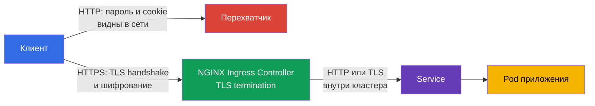

<!-- Standalone RU release: ссылки на переводы удалены, потому что соответствующие файлы не входят в архив. -->

# Глава 08. Secure Ingress с TLS

> **Что дальше.** В главе 07 мы проверяли и усиливали конфигурацию компонентов кластера.
> Теперь защитим публичную точку входа приложений. **Ingress с TLS** шифрует HTTP-трафик
> между клиентом и ingress controller, подтверждает имя сервера и не даёт перехватчику
> незаметно прочитать или подменить запрос. Это домен Cluster Setup (15%) CKS.

> **Что нужно из CKA.** Базовый синтаксис Ingress, Service и маршрутизация по host/path
> разобраны в [главе 32 CKA](../../../cka/course/32/ru.md). Устройство TLS, сертификат,
> закрытый ключ и проверка цепочки - в [главе 00-3 CKA](../../../cka/course/00-3-tls/ru.md).
> Здесь рассматриваем безопасное применение этих механизмов на публичном входе, а не
> повторяем их основы.

## 08.1. Модель угроз: почему HTTP на Ingress недостаточен

Ingress controller обычно принимает трафик из внешней сети и направляет его к Service,
а затем к Pod. Если клиент подключается по HTTP, логин, cookie, bearer token и содержимое
формы идут по сети открытым текстом. Пользователь в той же недоверенной сети, вредоносная
точка Wi-Fi или промежуточный прокси могут прочитать запрос либо подменить ответ.

TLS защищает канал от клиента до точки **TLS termination** - ingress controller. Контроллер
предъявляет сертификат для имени хоста, выполняет TLS handshake, расшифровывает запрос и
маршрутизирует обычный HTTP-трафик к backend. Поэтому TLS на внешнем входе не означает,
что путь controller -> Service -> Pod автоматически зашифрован. Для чувствительного
внутрикластерного трафика нужны отдельные меры: TLS у приложения, service mesh или Cilium
transparent encryption, которая рассматривается в главе 23.



Нужны одновременно три свойства:

- конфиденциальность - трафик между клиентом и controller нельзя прочитать;
- целостность - нельзя незаметно изменить запрос или ответ;
- аутентичность - клиент проверяет, что сертификат выдан именно для запрошенного host.

Шифрование не исправляет небезопасный backend, избыточный RBAC или открытый endpoint.
Это один слой defense in depth. Также нельзя путать TLS certificate с Kubernetes Secret:
Secret хранит ключ и сертификат, но сам по себе не включает TLS, пока на него не сошлётся
Ingress.

## 08.2. Сертификат и ключ: тестовый self-signed и production-подход

Для лаборатории можно создать self-signed certificate. Клиент не доверяет ему по умолчанию,
поэтому при проверке будет нужен `curl -k`. Это нормально только для теста: флаг `-k`
отключает проверку сертификата и в production скрывает ошибки доверия и подмены.

Имя из URL должно присутствовать в **Subject Alternative Name** (SAN). Современные клиенты
проверяют SAN, а не только устаревшее поле Common Name (CN). Ниже сертификат рассчитан на
`app.example.test`; для другого имени измените и `HOST`, и `subjectAltName`.

```bash
export HOST=app.example.test

openssl req -x509 -newkey rsa:2048 -nodes \
  -keyout tls.key \
  -out tls.crt \
  -days 30 \
  -subj "/CN=${HOST}" \
  -addext "subjectAltName=DNS:${HOST}"

# До загрузки в кластер проверить subject и SAN
openssl x509 -in tls.crt -noout -subject -ext subjectAltName
```

Параметр `-nodes` оставляет закрытый ключ без passphrase. Это необходимо, потому что
controller должен прочитать ключ без интерактивного ввода. Защита в этом случае строится на
строгом RBAC для Secret, ограничении доступа к etcd и encryption at rest - не на passphrase
в файле ключа.

В production не создавайте долгоживущие self-signed certificate вручную. Обычно
`cert-manager` получает сертификат у доверенного CA, например Let's Encrypt, кладёт его в
Secret и обновляет до истечения срока. Команда платформы должна также определить владельца
сертификата, оповещение об истечении и процедуру ротации. Если TLS завершается перед
кластером на cloud load balancer, проверьте, что соединение до NGINX также соответствует
требованиям организации: TLS может понадобиться и на этом участке.

## 08.3. TLS Secret: формат и область видимости

Ingress ищет certificate и key в Secret типа `kubernetes.io/tls`. Наиболее надёжный способ
создать его из уже проверенных файлов - `kubectl create secret tls`: команда сама положит
сертификат в ключ `tls.crt`, а закрытый ключ в `tls.key`.

```bash
kubectl -n web create secret tls app-example-tls \
  --cert=tls.crt \
  --key=tls.key

kubectl -n web get secret app-example-tls \
  -o jsonpath='{.type}{"\n"}{.data.tls\.crt}{"\n"}{.data.tls\.key}{"\n"}'
# kubernetes.io/tls
# base64-значения tls.crt и tls.key
```

Тот же объект в виде манифеста выглядит так. Здесь `data` намеренно не заполнен: ключ и
сертификат нельзя хранить в Git в открытом виде. `stringData` удобнее для коротких
тестовых значений, но не делает секретным содержимое репозитория.

```yaml
apiVersion: v1
kind: Secret
metadata:
  name: app-example-tls
  namespace: web
type: kubernetes.io/tls
data:
  tls.crt: <base64-encoded-certificate>
  tls.key: <base64-encoded-private-key>
```

Secret namespaced. Ingress в namespace `web` не может сослаться на Secret из `default` или
другого namespace. Не давайте приложению право `get`/`list` всех Secret только ради TLS:
обычно certificate обслуживает controller, а доступ к созданию и чтению таких Secret
ограничен отдельной ролью. Base64 в `data` - это кодирование, а не encryption.

## 08.4. Ingress: связать host, TLS Secret и backend

В `spec.tls` указывают host и `secretName`. Сопоставление host важно дважды: NGINX выбирает
правильный сертификат во время TLS handshake, а клиент проверяет, что имя из URL есть в SAN.
`ingressClassName: nginx` исключает неоднозначность в кластере с несколькими controller.
Перед применением убедитесь, что этот класс существует:

```bash
kubectl get ingressclass
kubectl -n web get service web
```

Ниже предполагается, что Service `web` в namespace `web` слушает порт 80. Манифест не
создаёт Service или Deployment: это CKA-база и они должны существовать отдельно.

```yaml
apiVersion: networking.k8s.io/v1
kind: Ingress
metadata:
  name: web-secure
  namespace: web
  annotations:
    nginx.ingress.kubernetes.io/ssl-redirect: "true"
    nginx.ingress.kubernetes.io/force-ssl-redirect: "true"
spec:
  ingressClassName: nginx
  tls:
  - hosts:
    - app.example.test
    secretName: app-example-tls
  rules:
  - host: app.example.test
    http:
      paths:
      - path: /
        pathType: Prefix
        backend:
          service:
            name: web
            port:
              number: 80
```

Проверить связь объектов можно без внешнего DNS:

```bash
kubectl -n web describe ingress web-secure
kubectl -n web get ingress web-secure -o yaml
kubectl -n web get secret app-example-tls -o jsonpath='{.type}{"\n"}'
```

В выводе `describe` проверьте `Ingress Class`, правило для `app.example.test`, TLS host и
Secret. Событие об ошибке чтения Secret, пустое поле `ADDRESS` или backend без endpoints
означают, что запрос ещё не готов проверять TLS: сначала исправьте controller, Secret,
Service или готовность Pod.

## 08.5. NGINX Ingress: обязательный редирект HTTP -> HTTPS

> **NGINX Ingress Controller retired.** Проект `ingress-nginx` объявлен retired (март 2026) и больше не получает релизов и security-фиксов ([анонс](https://kubernetes.io/blog/2025/11/11/ingress-nginx-retirement/)). Экзамен CKS сохраняет компетенцию «Ingress с TLS» и может использовать NGINX Ingress как готовый fixture, поэтому его синтаксис (`ingressClassName: nginx`, аннотации) нужен для экзамена. Но для production не разворачивайте retired-controller на новых кластерах: выбирайте поддерживаемый Ingress Controller или мигрируйте на Gateway API. Навык `spec.tls` + TLS Secret универсален и от конкретного controller не зависит.

Даже корректный TLS Ingress оставляет риск, если HTTP остаётся доступным: пользователь может
перейти по старой ссылке, а cookie или форма уйдут до первого HTTPS-ответа. NGINX Ingress
Controller при TLS обычно включает redirect, но безопасность не должна зависеть от значения
по умолчанию chart или ConfigMap.

Явно задайте аннотации в Ingress:

```yaml
metadata:
  annotations:
    nginx.ingress.kubernetes.io/ssl-redirect: "true"
    nginx.ingress.kubernetes.io/force-ssl-redirect: "true"
```

`ssl-redirect` включает перенаправление на HTTPS для Ingress с TLS. `force-ssl-redirect`
нужен, когда controller получает HTTP от внешнего load balancer, который уже завершил TLS
или передал информацию об исходной схеме через proxy headers. Точное поведение зависит от
версии и конфигурации NGINX Ingress Controller, поэтому проверяйте его реальным запросом.
Для постоянного перенаправления controller обычно возвращает `308 Permanent Redirect`;
некоторые конфигурации могут вернуть другой 30x, но `Location` обязан вести на `https://`.

Не заменяйте redirect приложением, если его можно обеспечить на Ingress. Иначе каждый
backend должен повторять одинаковую настройку, а случайно добавленный Service может остаться
доступным по HTTP. HSTS дополняет redirect после первого успешного HTTPS-подключения, но не
заменяет TLS и требует отдельной осторожной политики для доменов и поддоменов.

## 08.6. Проверка: redirect, HTTPS, host и сертификат

Получите IP или hostname ingress controller. Для локального кластера может понадобиться
адрес NodePort или `kubectl port-forward`; для LoadBalancer дождитесь внешнего адреса.

```bash
kubectl -n ingress-nginx get service ingress-nginx-controller
kubectl -n web get ingress web-secure

export HOST=app.example.test
export INGRESS_IP=<IP-адрес-ingress-controller>
```

Если тестовый host не опубликован в DNS, `--resolve` заставит `curl` использовать
`INGRESS_IP`, сохранив правильный Host header и SNI. Первая команда должна показать
`308` и `Location: https://app.example.test/...`; `-I` не следует за redirect.

```bash
# HTTP не обслуживает приложение: постоянный redirect на HTTPS
curl -kvI --resolve "${HOST}:80:${INGRESS_IP}" "http://${HOST}/"

# Следовать redirect. Оба --resolve нужны для портов 80 и 443.
curl -kvL \
  --resolve "${HOST}:80:${INGRESS_IP}" \
  --resolve "${HOST}:443:${INGRESS_IP}" \
  "http://${HOST}/"

# TLS-запрос приходит к backend и должен вернуть 200.
# -k допустим здесь только потому, что сертификат self-signed.
curl -kvsS -o /dev/null -w 'HTTP %{http_code}\n' \
  --resolve "${HOST}:443:${INGRESS_IP}" \
  "https://${HOST}/"
# HTTP 200
```

Проверяйте не только статус `200`, но и сертификат, который получил клиент. `-servername`
включает SNI: без него controller в кластере с несколькими host может отдать default
certificate.

```bash
openssl s_client -connect "${INGRESS_IP}:443" -servername "${HOST}" </dev/null 2>/dev/null \
  | openssl x509 -noout -subject -issuer -ext subjectAltName
# subject=CN = app.example.test
# X509v3 Subject Alternative Name:
#     DNS:app.example.test
```

Для сертификата от доверенного CA уберите `-k`: обычный `curl` обязан успешно проверить
цепочку и имя. Если `curl` сообщает `SSL certificate problem`, не обходите проблему в
production. Проверьте срок действия, SAN, цепочку CA, `secretName`, namespace и то, что
controller действительно перечитал обновлённый Secret.

| Симптом | Что проверить | Вероятная причина |
|---|---|---|
| HTTP возвращает backend `200` | Аннотации и фактический controller | Нет `ssl-redirect`, controller не NGINX или его конфигурация переопределяет redirect |
| HTTPS показывает default certificate | `spec.tls.hosts`, SAN и SNI | Host не совпадает, Secret не найден или запрос без `--resolve`/SNI |
| `curl` получает `404` от NGINX | Host, `rules.host`, `ingressClassName` | Запрос попал в controller, но правило не выбрано |
| HTTPS возвращает `503` | Service, endpoints и readiness Pod | TLS работает, но backend недоступен |
| Secret есть, но TLS не включился | `type`, `tls.crt`, `tls.key`, namespace | Неверный тип, пустой/несовместимый ключ либо Secret в другом namespace |
| Браузер не доверяет сертификату | Issuer, цепочка и срок действия | Self-signed certificate или неполная цепочка CA |

## 08.7. Как это применяют в продакшене

- **Автоматическая выдача и ротация.** `cert-manager` и доверенный CA выпускают certificate,
  продлевают его до истечения и обновляют TLS Secret. Команда следит за метриками срока
  действия и получает alert заранее.
- **HTTPS по умолчанию.** Ingress с TLS всегда содержит явный HTTP -> HTTPS redirect.
  Внешний load balancer, controller и приложение согласованно обрабатывают proxy headers,
  чтобы не получить redirect loop.
- **Минимальный доступ к ключам.** RBAC даёт права на TLS Secret только controller и
  автоматизации сертификатов. Secret encryption at rest и защищённый etcd уменьшают риск
  раскрытия private key.
- **Разделение границ.** Отдельные namespace, IngressClass и certificate для tenant либо
  критичных доменов уменьшают вероятность случайно отдать чужой certificate или маршрут.
- **Проверка после каждого изменения.** Pipeline делает HTTPS-запрос с правильным SNI,
  проверяет ожидаемый SAN, срок действия, 30x-redirect и доступность backend. Это ловит
  ошибку до того, как её увидит пользователь.

## 08.8. Мини-глоссарий

- **TLS termination** - завершение TLS handshake и расшифровка трафика на ingress controller.
- **Ingress** - API-объект с правилами внешней HTTP/HTTPS-маршрутизации к Service.
- **IngressClass** - выбор реализации Ingress, например NGINX Ingress Controller.
- **TLS Secret** - Secret типа `kubernetes.io/tls` с ключами `tls.crt` и `tls.key`.
- **SAN** - Subject Alternative Name, список DNS-имён/IP-адресов, для которых действителен
  certificate.
- **SNI** - Server Name Indication, имя host в TLS handshake для выбора certificate.
- **self-signed certificate** - certificate, подписанный собственным ключом, а не доверенным
  CA; подходит для теста, но не доверен клиентами по умолчанию.
- **HTTP -> HTTPS redirect** - постоянное перенаправление незашифрованного запроса на HTTPS.

## 08.9. Итоги главы

- TLS на Ingress защищает внешний HTTP-канал от перехвата и подмены до точки TLS termination.
- Для теста можно создать self-signed certificate через `openssl`, но SAN обязан содержать
  host, а `curl -k` нельзя оставлять в production.
- `kubectl create secret tls` создаёт Secret типа `kubernetes.io/tls` с `tls.crt` и
  `tls.key`; Ingress и Secret должны быть в одном namespace.
- В `spec.tls` связывают `hosts` и `secretName`, а `ingressClassName: nginx` выбирает
  controller явно.
- В NGINX Ingress задавайте `ssl-redirect` и `force-ssl-redirect`, затем подтверждайте
  HTTP -> HTTPS реальным `curl`: 308 с `Location`, а HTTPS - 200.
- Проверка должна включать SNI и SAN сертификата, Service endpoints и события Ingress, а не
  только наличие YAML-объектов.

## 08.10. Как это пригодится: на экзамене и в реальной работе

**На экзамене.** Нужно быстро сгенерировать certificate для заданного host, создать TLS
Secret, сослаться на него в `spec.tls` Ingress и подтвердить конфигурацию. Внимательно
проверяйте namespace, `secretName`, `hosts` и `ingressClassName`. Для NGINX задача может
требовать явный HTTP -> HTTPS redirect: ожидайте 308 на HTTP и успешный HTTPS-вызов через
`curl --resolve`.

**В реальной работе.** Secure Ingress - граница между недоверенным клиентом и приложением.
Надёжная конфигурация объединяет автоматическую ротацию certificate, минимальный доступ к
private key, строгую проверку SAN, обязательный HTTPS и непрерывные synthetic-проверки.
Одна неправильная аннотация или Secret в другом namespace способна оставить публичный
endpoint без ожидаемой защиты.

## 08.11. Вопросы для самопроверки

1. Где заканчивается защита TLS при TLS termination на Ingress и почему это не гарантирует
   шифрование между controller и Pod?
2. Почему одного CN недостаточно и какое поле certificate должен содержать DNS host?
3. Какой тип и какие ключи должен иметь TLS Secret для Ingress?
4. Почему Ingress и его TLS Secret должны находиться в одном namespace?
5. Чем различаются `ssl-redirect` и `force-ssl-redirect` NGINX Ingress Controller?
6. Какие два результата ожидаются от `curl` для HTTP и HTTPS после настройки redirect?
7. Почему `curl -k` приемлем для self-signed certificate в лаборатории, но опасен в
   production?

## Практика

🧪 Лаба 103 (CIS, Secure Ingress TLS, TLS hardening и проверка бинарников):
[tasks/cks/labs/103](../../labs/103/README_RU.MD)

🎮 Killercoda (в браузере, без установки): [Ingress Controller](https://killercoda.com/kubernetes-basics/course/kubernetes-fundamentals/ingress-controller) · [Create TLS Certificate](https://killercoda.com/kubernetes-basics/course/kubernetes-fundamentals/create-tls-certificate)

---
[Оглавление](../README_RU.md) · [Глава 07](../07/ru.md) · [Глава 09](../09/ru.md)
