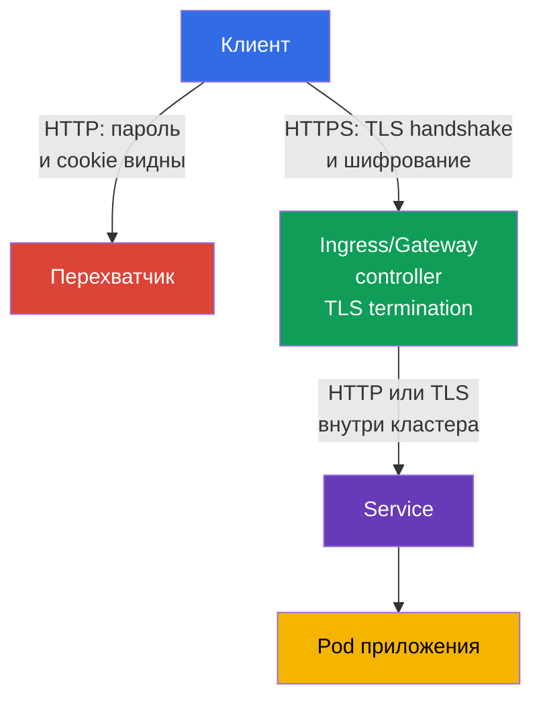
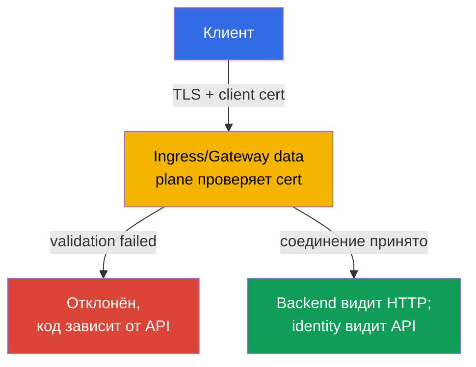

<!-- Standalone RU release: ссылки на переводы удалены, потому что соответствующие файлы не входят в архив. -->

# Глава 08. Secure Ingress с TLS

> **Проблема.** Если Ingress принимает трафик по обычному HTTP, логин, cookie, bearer
> token и содержимое формы идут по сети открытым текстом. Пользователь в той же
> недоверенной сети, вредоносная точка Wi-Fi или промежуточный прокси могут прочитать
> запрос или незаметно подменить ответ - публичная точка входа приложения остаётся
> открытой для перехвата до того, как трафик вообще дойдёт до Pod.

> **Что дальше.** В главе 07 мы проверяли и усиливали конфигурацию компонентов кластера.
> Теперь защитим публичную точку входа приложений. **Ingress с TLS** шифрует HTTP-трафик
> между клиентом и ingress controller, подтверждает имя сервера и не даёт перехватчику
> незаметно прочитать или подменить запрос. Это домен Cluster Setup (15%) CKS.

> **Что нужно из CKA.** Базовый синтаксис Ingress, Service и маршрутизация по host/path
> разобраны в [главе 32 CKA](../../../cka/course/32/ru.md). Устройство TLS, сертификат,
> закрытый ключ и проверка цепочки - в [главе 00-3 CKA](../../../cka/course/00-3-tls/ru.md).
> Здесь рассматриваем безопасное применение этих механизмов на публичном входе, а не
> повторяем их основы.

> 🧠 TLS защищает только путь клиента до TLS termination; controller → Service → Pod — отдельная граница.

## 08.1. Модель угроз: почему HTTP на Ingress недостаточен

Ingress controller обычно принимает трафик из внешней сети и направляет его к Service,
а затем к Pod. Если клиент подключается по HTTP, логин, cookie, bearer token и содержимое
формы идут по сети открытым текстом. Пользователь в той же недоверенной сети, вредоносная
точка Wi-Fi или промежуточный прокси могут прочитать запрос либо подменить ответ.

TLS защищает канал от клиента до точки **TLS termination** - ingress controller. Контроллер
предъявляет сертификат для имени хоста, выполняет TLS handshake, расшифровывает запрос и
маршрутизирует обычный HTTP-трафик к backend. Поэтому TLS на внешнем входе не означает,
что путь controller -> Service -> Pod автоматически зашифрован. Для чувствительного
внутрикластерного трафика нужны отдельные меры: TLS у приложения, service mesh или Cilium
transparent encryption, которая рассматривается в главе 23.



Нужны одновременно три свойства:

- конфиденциальность - трафик между клиентом и controller нельзя прочитать;
- целостность - нельзя незаметно изменить запрос или ответ;
- аутентичность - клиент проверяет, что сертификат выдан именно для запрошенного host.

Шифрование не исправляет небезопасный backend, избыточный RBAC или открытый endpoint.
Это один слой defense in depth. Также нельзя путать TLS certificate с Kubernetes Secret:
Secret хранит ключ и сертификат, но сам по себе не включает TLS, пока на него не сошлётся
Ingress.

> 🎯 Уметь выпустить тестовый certificate для заданного host с SAN, сверить certificate/key и использовать `--cacert` вместо `-k` — практический минимум для TLS-задачи.

## 08.2. Сертификат и ключ: тестовый self-signed и production-подход

Для лаборатории можно создать self-signed certificate. Клиент не доверяет ему по умолчанию,
поэтому обычный `curl` завершится ошибкой проверки цепочки.

Предпочтительный тест - явно доверить лабораторный certificate через `--cacert tls.crt`: так
curl продолжит проверять certificate и соответствие имени host. `curl -k` полностью отключает
certificate verification и допустим только как отдельная диагностическая проверка, но не как
доказательство корректной TLS-конфигурации.

Имя из URL должно присутствовать в **Subject Alternative Name** (SAN). Современные клиенты
проверяют SAN, а не только устаревшее поле Common Name (CN). Ниже сертификат рассчитан на
`app.example.test`; для другого имени измените и `HOST`, и `subjectAltName`.

```bash
export HOST=app.example.test

openssl req -x509 -newkey rsa:2048 -nodes \
  -keyout tls.key \
  -out tls.crt \
  -days 30 \
  -subj "/CN=${HOST}" \
  -addext "subjectAltName=DNS:${HOST}"

# До загрузки в кластер проверить subject и SAN
openssl x509 -in tls.crt -noout -subject -ext subjectAltName

# Публичный ключ certificate обязан совпадать с публичным ключом private key.
# Хеши двух команд должны быть одинаковыми.
openssl x509 -in tls.crt -pubkey -noout \
  | openssl pkey -pubin -outform DER | sha256sum
openssl pkey -in tls.key -pubout -outform DER \
  | sha256sum

# Для CA certificate проверить цепочку: leaf -> intermediate -> trusted root.
# `tls.crt` для controller обычно содержит leaf, затем intermediate; root в него не кладут.
openssl verify -show_chain -CAfile root-ca.crt \
  -untrusted intermediate-ca.crt leaf.crt
```

До создания Secret совпадение публичных ключей исключает пару certificate/key от разных
выпусков. В выводе `openssl verify -show_chain` leaf должен быть проверен через
intermediate до доверенного root; ошибка на любом звене означает, что такой certificate
нельзя загружать.

Параметр `-nodes` оставляет закрытый ключ без passphrase. Это необходимо, потому что
controller должен прочитать ключ без интерактивного ввода. Защита в этом случае строится на
строгом RBAC для Secret, ограничении доступа к etcd и encryption at rest - не на passphrase
в файле ключа.

> 🏭 Доверенный CA, автоматическое продление, владелец, alert до истечения и проверенная ротация Secret.

В production не создавайте долгоживущие self-signed certificate вручную. Обычно
`cert-manager` получает сертификат у доверенного CA, например Let's Encrypt, кладёт его в
Secret и обновляет до истечения срока. Команда платформы должна также определить владельца
сертификата, оповещение об истечении и процедуру ротации. Если TLS завершается перед
кластером на cloud load balancer, проверьте, что соединение до NGINX также соответствует
требованиям организации: TLS может понадобиться и на этом участке.

> 🎯 Создайте `kubernetes.io/tls` Secret с ключами `tls.crt` и `tls.key`, затем проверьте namespace и имя: Ingress может сослаться только на Secret из своего namespace.

## 08.3. TLS Secret: формат и область видимости

Для Ingress TLS используйте стандартный TLS Secret типа `kubernetes.io/tls` с ключами
`tls.crt` и `tls.key`. Именно такой объект создаёт `kubectl create secret tls`.

Переносимый Ingress TLS contract требует certificate и private key под ключами `tls.crt` и
`tls.key`; дополнительные проверки типа Secret и содержимого зависят от controller. Поэтому
`kubernetes.io/tls` - правильный стандартный формат для курса и production, но не следует
объяснять его как единственный механизм, который сам Ingress API способен прочитать. Сам
тип `kubernetes.io/tls` предоставлен для удобства и единообразия: Kubernetes API проверяет
наличие требуемых ключей для Secret этого типа, а TLS credentials технически могут
храниться и в `Opaque` Secret, хотя такой Secret не получает эту проверку и не сообщает
назначение объекта другим инженерам.
Наиболее надёжный способ создать его из уже проверенных файлов - `kubectl create secret tls`: команда сама положит сертификат в ключ `tls.crt`, а закрытый ключ в `tls.key`.

```bash
kubectl -n web create secret tls app-example-tls \
  --cert=tls.crt \
  --key=tls.key

kubectl -n web get secret app-example-tls \
  -o jsonpath='{.type}{"\n"}{.data.tls\.crt}{"\n"}{.data.tls\.key}{"\n"}'
# kubernetes.io/tls
# base64-значения tls.crt и tls.key
```

Тот же объект в виде манифеста выглядит так. Здесь `data` намеренно не заполнен прежде всего
потому, что private key `tls.key` нельзя коммитить в Git в открытом виде.

X.509 certificate `tls.crt` содержит публичный ключ и сам по себе не является секретом;
хранить ли public certificate в репозитории - отдельное решение repository policy. Private
key всегда должен оставаться конфиденциальным. `stringData` удобнее для коротких тестовых
значений, но не делает секретным содержимое репозитория.

```yaml
apiVersion: v1
kind: Secret
metadata:
  name: app-example-tls
  namespace: web
type: kubernetes.io/tls
data:
  tls.crt: <base64-encoded-certificate>
  tls.key: <base64-encoded-private-key>
```

Secret namespaced. Ingress в namespace `web` не может сослаться на Secret из `default` или
другого namespace. Не давайте приложению право `get`/`list` всех Secret только ради TLS:
обычно certificate обслуживает controller, а доступ к созданию и чтению таких Secret
ограничен отдельной ролью. Base64 в `data` - это кодирование, а не encryption.

> 🎯 Свяжите один host в `spec.tls.hosts` и `spec.rules.host`, укажите `secretName`, Service и `ingressClassName`.

## 08.4. Ingress: связать host, TLS Secret и backend

Переносимые поля Ingress API здесь - `spec.tls` (`hosts`, `secretName`) и `spec.rules`
(`host`, `path`, `pathType`, `backend`). Они описывают TLS certificate и маршрутизацию, но
**не** задают HTTP -> HTTPS redirect. `spec.ingressClassName` - тоже поле API, однако само
значение класса, например `nginx`, выбирает конкретную реализацию. Аннотации, включая
`nginx.ingress.kubernetes.io/*`, вообще не входят в Ingress API: их смысл определяет только
соответствующий controller.

Сопоставление host важно дважды: controller выбирает правильный certificate во время TLS
handshake, а клиент проверяет, что имя из URL есть в SAN. Перед применением убедитесь, что
нужный класс и Service существуют:

```bash
kubectl get ingressclass
kubectl -n web get service web
```

Ниже предполагается, что Service `web` в namespace `web` слушает порт 80. Манифест не
создаёт Service или Deployment: это CKA-база и они должны существовать отдельно.

```yaml
apiVersion: networking.k8s.io/v1
kind: Ingress
metadata:
  name: web-secure
  namespace: web
spec:
  # Поле API; имя `nginx` - выбор реализации, а не переносимое значение.
  ingressClassName: nginx
  tls:
  - hosts:
    - app.example.test
    secretName: app-example-tls
  rules:
  - host: app.example.test
    http:
      paths:
      - path: /
        pathType: Prefix
        backend:
          service:
            name: web
            port:
              number: 80
```

Проверить связь объектов можно без внешнего DNS:

```bash
kubectl -n web describe ingress web-secure
kubectl -n web get ingress web-secure -o yaml
kubectl -n web get secret app-example-tls -o jsonpath='{.type}{"\n"}'
```

В выводе `describe` проверьте `Ingress Class`, правило для `app.example.test`, TLS host,
Secret и события.

Ошибка чтения Secret или отсутствие backend endpoints действительно требуют исправления до
полноценной end-to-end проверки.

Поле `ADDRESS` рассматривайте отдельно: оно отражает опубликованный status Ingress и в
NodePort, bare-metal, `hostNetwork`, port-forward или некоторых локальных fixture может
оставаться пустым даже при рабочем Ingress. Готовность TLS проверяйте через фактический
entrypoint выбранного controller, а не только по наличию значения в `ADDRESS`.

## 08.5. ingress-nginx: retired-controller и границы аннотаций

> **NGINX Ingress Controller retired.** С марта 2026 проект `ingress-nginx` retired и больше не получает релизов и security-фиксов ([анонс](https://kubernetes.io/blog/2025/11/11/ingress-nginx-retirement/)). CKS требует корректно настроенный Ingress с TLS, но публичная компетенция не гарантирует конкретный controller или nginx-specific annotations. На экзамене сначала проверяйте controller, данный лабораторией; синтаксис `ingressClassName: nginx` и его аннотации — лишь возможный fixture. Для production не разворачивайте retired-controller на новых кластерах: выбирайте поддерживаемую реализацию или Gateway API. Переносимая часть — TLS Secret, `spec.tls`, host/SNI, SAN, Service endpoints и проверка HTTPS — не зависит от controller.

> 🎯 Для ingress-nginx `spec.tls` обычно включает redirect; `ssl-redirect` и `force-ssl-redirect` зависят от реализации и topology.

Даже корректный TLS Ingress оставляет риск, если HTTP остаётся доступным: пользователь может
перейти по старой ссылке, а cookie или форма уйдут до первого HTTPS-ответа. Для
**ingress-nginx** наличие блока `spec.tls` по умолчанию включает redirect HTTP -> HTTPS
(обычно `308`), если это не переопределено настройкой controller. Поэтому одновременно
задавать `ssl-redirect` и `force-ssl-redirect` не требуется и для обычного TLS Ingress
неверно как обязательный рецепт.

Это именно семантика ingress-nginx, а не Ingress API. Если нужно явно переопределить
настройку ingress-nginx для Ingress с `spec.tls`, применяют только его controller-specific
аннотацию `ssl-redirect`:

```yaml
metadata:
  annotations:
    nginx.ingress.kubernetes.io/ssl-redirect: "true"
```

`force-ssl-redirect` оставляют для другой топологии: TLS завершается **внешним** load
balancer/proxy, controller получает HTTP, и у Ingress нет блока `spec.tls`. При этом внешний
proxy должен корректно передавать информацию об исходной HTTPS-схеме, иначе возможен
redirect loop. Например, отдельный Ingress для такой external SSL offload-конфигурации:

```yaml
apiVersion: networking.k8s.io/v1
kind: Ingress
metadata:
  name: web-external-tls
  namespace: web
  annotations:
    nginx.ingress.kubernetes.io/force-ssl-redirect: "true"
spec:
  ingressClassName: nginx
  rules:
  - host: app.example.test
    http:
      paths:
      - path: /
        pathType: Prefix
        backend:
          service:
            name: web
            port:
              number: 80
```

Не заменяйте redirect приложением, если его можно обеспечить на edge. Иначе каждый backend
должен повторять одинаковую настройку, а случайно добавленный Service может остаться
доступным по HTTP. HSTS дополняет redirect после первого успешного HTTPS-подключения, но не
заменяет TLS и требует отдельной осторожной политики для доменов и поддоменов.

> 🏭 Поддерживаемый Gateway API controller и его status/compatibility; возможности `GatewayClass` определяет конкретная реализация.

### Gateway API: текущий production-путь

Gateway API описывает три TLS-модели: **edge termination** (HTTPS listener расшифровывает
трафик на Gateway), **TLS passthrough** (Gateway передаёт TLS-handshake backend без
termination) и TLS к backend после termination (ре-encryption). Для последней модели
`BackendTLSPolicy` из Gateway API v1.4.0 — GA в Standard Channel — задаёт SNI и проверку
certificate backend. Поддержка конкретной модели зависит от Gateway controller.

Для нового production-кластера используйте поддерживаемую реализацию Gateway API. В примере
ниже `platform-gateway` - **implementation-specific** имя `GatewayClass`: его предоставляет
выбранный Gateway controller, это не стандартное значение Kubernetes. `certificateRefs`
ссылается на тот же TLS Secret в namespace `web`; HTTPS listener выполняет TLS termination,
а `HTTPRoute` направляет запрос к Service.

```yaml
apiVersion: gateway.networking.k8s.io/v1
kind: Gateway
metadata:
  name: web-gateway
  namespace: web
spec:
  gatewayClassName: platform-gateway # имя зависит от Gateway controller
  listeners:
  - name: https
    protocol: HTTPS
    port: 443
    hostname: app.example.test
    tls:
      mode: Terminate
      certificateRefs:
      - kind: Secret
        name: app-example-tls
---
apiVersion: gateway.networking.k8s.io/v1
kind: HTTPRoute
metadata:
  name: web-secure
  namespace: web
spec:
  parentRefs:
  - name: web-gateway
    sectionName: https
  hostnames:
  - app.example.test
  rules:
  - matches:
    - path:
        type: PathPrefix
        value: /
    backendRefs:
    - name: web
      port: 80
```

Если Gateway также открывает порт 80, добавьте отдельный HTTP listener и `HTTPRoute` с
стандартным фильтром `RequestRedirect` на `https`; не смешивайте его с HTTPS-route к backend.

> 🔬 TLS passthrough завершает TLS и mTLS на backend; проверьте поддержку `TLSRoute`, SNI-маршрутизации и passthrough у controller.

### TLS passthrough: `TLSRoute`

Для backend, который сам завершает TLS (например, ему нужен собственный certificate или
mTLS), Gateway не расшифровывает соединение: listener имеет `protocol: TLS` и
`tls.mode: Passthrough`, а маршрут выбирается по SNI. `TLSRoute` является GA в Standard
Channel Gateway API v1.5.0. Минимальный пример ниже передаёт TLS для `app.example.test`
Service `web-tls` на порт 443; controller обязан поддерживать TLSRoute и passthrough.

```yaml
apiVersion: gateway.networking.k8s.io/v1
kind: Gateway
metadata:
  name: passthrough-gateway
  namespace: web
spec:
  gatewayClassName: platform-gateway
  listeners:
  - name: tls
    protocol: TLS
    port: 443
    hostname: app.example.test
    tls:
      mode: Passthrough
---
apiVersion: gateway.networking.k8s.io/v1
kind: TLSRoute
metadata:
  name: web-tls-passthrough
  namespace: web
spec:
  parentRefs:
  - name: passthrough-gateway
    sectionName: tls
  hostnames:
  - app.example.test
  rules:
  - backendRefs:
    - name: web-tls
      port: 443
```

При passthrough Secret с certificate находится у backend, а не в `certificateRefs` Gateway;
проверьте SNI/SAN certificate именно backend и его endpoints.

Ссылке Gateway на `Secret` в другом namespace необходим явный `ReferenceGrant` **в
namespace Secret**; без него controller не должен принять cross-namespace reference.
Не переносите эту логику на `BackendTLSPolicy`: cross-namespace ссылки на certificate/CA
для backend TLS не разрешены, даже при наличии `ReferenceGrant`.

Проверьте поддерживаемые `GatewayClass` через `kubectl get gatewayclass` и статус Gateway
перед миграцией трафика.

> 🧠 mTLS аутентифицирует клиента на edge в TLS handshake, но не заменяет authorization приложения или mTLS между Pod.

## 08.6. mTLS на входе: controller проверяет сертификат клиента

Всё выше в главе - **server-side TLS**: controller доказывает клиенту свою identity
сертификатом, а клиент остаётся анонимным на уровне TLS. Отдельная задача - **mutual
TLS (mTLS) на входе**: controller дополнительно требует у клиента предъявить свой
сертификат и проверяет его по доверенному CA **до** того, как запрос дойдёт до backend.
Не путайте это с темами из других глав:

- глава 23 разбирает mTLS **между Pod внутри mesh** (Istio/Linkerd sidecar-to-sidecar);
- TLS passthrough из 08.5 переносит обязанность проверки клиента **на сам backend**,
  а не на Gateway/Ingress;
- здесь речь именно про то, что **controller на границе кластера** сам становится
  TLS-сервером для клиента и одновременно проверяет клиентский сертификат.



Не делайте HTTP-код частью общей модели mTLS. В ingress-nginx режим `on` возвращает `400`
при failed certificate verification, а `auth-tls-match-cn` может вернуть `403`. В Gateway
API `AllowValidOnly` валидирует сертификат во время TLS handshake, поэтому реализация
может отклонить само TLS-соединение без HTTP-ответа - controller-neutral модели «всегда
400/403» здесь не существует.

> 🔬 `auth-tls-*` — API retired ingress-nginx; переносимая модель — валидный client certificate на edge.

### ingress-nginx: аннотации `auth-tls-*`

Client Certificate Authentication включается через `Secret` с CA-цепочкой в ключе
`ca.crt` и набор аннотаций на объекте `Ingress`:

```yaml
apiVersion: networking.k8s.io/v1
kind: Ingress
metadata:
  name: web-mtls
  namespace: web
  annotations:
    nginx.ingress.kubernetes.io/auth-tls-secret: "web/client-ca"
    nginx.ingress.kubernetes.io/auth-tls-verify-client: "on"
    nginx.ingress.kubernetes.io/auth-tls-verify-depth: "1"
    nginx.ingress.kubernetes.io/auth-tls-pass-certificate-to-upstream: "true"
spec:
  tls:
  - hosts: [app.example.test]
    secretName: web-tls
  rules:
  - host: app.example.test
    http:
      paths:
      - path: /
        pathType: Prefix
        backend:
          service:
            name: web
            port:
              number: 80
```

- `auth-tls-secret` ссылается на `Secret` формата `namespace/name`, где `ca.crt` содержит
  доверенную CA-цепочку для клиентских сертификатов - это отдельный `Secret` от
  server-side `web-tls` из 08.3, хотя оба относятся к одному host.
- `auth-tls-verify-client: "on"` требует сертификат клиента, успешно проверяемый по CA из
  `auth-tls-secret`; failed certificate verification завершается HTTP `400`.
- `optional` не требует сертификат от каждого клиента, но это **не** режим «никогда не
  отклонять»: если клиент предъявил сертификат, не подписанный настроенным CA,
  ingress-nginx всё равно возвращает HTTP `400`. Когда запрос допускается, результат
  проверки может быть передан upstream.
- `optional_no_ca` не отклоняет запрос только из-за того, что клиентский сертификат не
  подписан CA из `auth-tls-secret`; verification result передаётся upstream. Используйте
  этот режим только если приложение или отдельный authorization layer действительно
  принимает решение по этому результату.
- Для пропущенного upstream запроса ingress-nginx передаёт `ssl-client-verify`,
  `ssl-client-subject-dn` и `ssl-client-issuer-dn`; полный PEM-сертификат в
  `ssl-client-cert` передаётся только при `auth-tls-pass-certificate-to-upstream: "true"`.
- Client Certificate Authentication применяется на весь host, а не на отдельный path.

> 🔬 Frontend validation Gateway API требует поддержки версии API и controller; проверьте поле, CA references и handshake.

### Gateway API: frontend client-certificate validation на уровне Gateway

Frontend client-certificate validation входит в Gateway API через поле `spec.tls.frontend`
объекта `Gateway`, а не через `HTTPRoute`. Актуальная схема отличается от более раннего
proposal-варианта (`default.frontendValidation` из GEP-91): в released API путь -
`spec.tls.frontend.default.validation`, а per-port override -
`spec.tls.frontend.perPort[].tls.validation`.

```yaml
apiVersion: gateway.networking.k8s.io/v1
kind: Gateway
metadata:
  name: mtls-gateway
  namespace: web
spec:
  gatewayClassName: platform-gateway
  tls:
    frontend:
      default:
        validation:
          caCertificateRefs:
          - group: ""
            kind: ConfigMap
            name: client-ca
          mode: AllowValidOnly
  listeners:
  - name: app-https
    protocol: HTTPS
    port: 443
    hostname: app.example.test
    tls:
      mode: Terminate
      certificateRefs:
      - group: ""
        kind: Secret
        name: web-tls
```

`ConfigMap` `client-ca` содержит доверенный CA certificate (trust anchor) в ключе
`ca.crt`. Переносимый Core-вариант Gateway API - один `caCertificateRefs` на один
`ConfigMap` с одним CA certificate. Несколько CA certificates в одном `ca.crt`,
несколько `caCertificateRefs` или другие resource kinds относятся к
implementation-specific support, поэтому такие варианты проверяйте по документации
конкретного Gateway controller.

- `spec.tls.frontend.default.validation` проверяет клиента при подключении **к Gateway**
  и применяется ко всем HTTPS listeners, для которых нет per-port override; это не то же
  самое, что `BackendTLSPolicy`, которая управляет TLS от Gateway **к backend** - обе
  политики независимы и могут применяться одновременно.
- `spec.tls.frontend.perPort[].tls.validation` переопределяет эту конфигурацию для всех
  HTTPS listeners на указанном порту.
- `mode: AllowValidOnly` (default) отклоняет соединение без валидного сертификата.
  `AllowInsecureFallback` принимает соединение даже без сертификата или при неуспешной
  его проверке, делегируя решение об авторизации клиента backend. Это состояние явно
  помечается условием `InsecureFrontendValidationMode` на `Gateway` и создаёт
  значительный security risk. Gateway API рекомендует использовать такой режим в
  тестовой среде либо только временно в non-testing среде; для обычного production mTLS
  предпочитайте `AllowValidOnly`.
- Поддержка frontend client-certificate validation зависит от конкретного Gateway API
  controller; перед использованием проверьте её в списке поддерживаемых implementations
  вашей версии.

Оба механизма решают одну и ту же задачу разными API: и NGINX Ingress через
`auth-tls-*`, и Gateway API через `spec.tls.frontend...validation` умеют проверять
клиентский сертификат на границе кластера. Какой из них доступен, зависит не от
возможностей самой идеи mTLS, а от того, какой ingress controller или Gateway API
implementation развёрнута в кластере - выбирайте синтаксис по фактически установленному
controller, а не наоборот.

### Подводный камень: scope client-certificate validation зависит от API

Client certificate проверяется во время TLS handshake, до HTTP-маршрутизации по path. Но
точная область действия policy различается между API, а не универсальна:

- **ingress-nginx:** Client Certificate Authentication применяется **per host** и не
  может иметь разные правила для отдельных paths одного host. Если `/admin` требует
  строгий client certificate, а `/public` не должен его требовать на TLS-уровне, такие
  handshake-requirements нельзя выразить двумя paths одного ingress-nginx host.
- **Gateway API:** frontend client-certificate validation задаётся на уровне `Gateway`:
  `default` применяется ко всем HTTPS listeners без override, а `perPort` - ко всем HTTPS
  listeners на указанном порту. Разные `hostname`/listeners одного Gateway на одном
  порту **не** получают независимые client-certificate policies - GEP-91 явно объясняет,
  что более узкая привязка создала бы риск обхода через HTTP/2/TLS connection
  coalescing: уже установленное TLS-соединение может обслуживать listener с другим
  hostname на том же порту.

Практическое следствие: не используйте правило «разный hostname всегда означает
отдельную mTLS policy» как переносимую модель. Для Gateway API разные handshake-level
требования нужно разводить по разным портам либо по действительно изолированным
TCP/TLS entrypoints, которые выбранная реализация гарантированно не объединяет;
конкретную топологию проверяйте по документации controller.

Авторизация по HTTP path/method выполняется уже после TLS handshake в HTTP-aware
authorization layer или приложении. `auth-tls-match-cn` ingress-nginx - не path/method
authorization: она лишь дополнительно сверяет CN клиентского сертификата со строкой/regex.

Не переносите `ssl-client-verify` из ingress-nginx на Gateway API как общий contract.
Ingress-nginx документирует `ssl-client-*` headers, а Gateway API стандартизует frontend
certificate validation, но не общий формат передачи client identity backend. Если backend
должен получать эту identity, отдельно проверьте механизм конкретной Gateway
implementation.

Не считайте mTLS на входе универсальной заменой RBAC или authorization приложения:
проверка сертификата на границе кластера подтверждает identity TLS-клиента, а не
авторизует конкретное действие внутри приложения.

> 🎯 `curl --resolve` с `--cacert` проверяет HTTPS, а `openssl s_client -servername` — certificate, отданный controller.

## 08.7. Проверка: controller-neutral HTTPS, host и сертификат

Сначала определите реальную публичную точку входа: адрес Service выбранного Ingress/Gateway
controller, hostname LoadBalancer либо адрес, опубликованный используемым fixture. Для
локального кластера может понадобиться адрес NodePort или `kubectl port-forward`; для
LoadBalancer дождитесь внешнего адреса. Не предполагается namespace или имя Service
конкретного controller.

```bash
kubectl get ingressclass
kubectl get gatewayclass
kubectl -n web get ingress,gateway,httproute,tlsroute
kubectl -n web get endpointslices -l kubernetes.io/service-name=web

export HOST=app.example.test
export ENTRYPOINT_IP=203.0.113.10  # замените на адрес выбранного controller
```

Если тестовый host не опубликован в DNS, `--resolve` заставит `curl` использовать
`ENTRYPOINT_IP`, сохранив правильный Host header и SNI. Переносимая проверка - успешный
HTTPS-вызов к backend с правильным SNI и host, при этом сертификат проверяется через
`--cacert`:

```bash
curl --cacert tls.crt -vsS -o /dev/null -w 'HTTP %{http_code}\n' \
  --resolve "${HOST}:443:${ENTRYPOINT_IP}" \
  "https://${HOST}/"
# HTTP 200
```

Только диагностика: соединиться без проверки certificate. Успех этой команды **не
доказывает** корректность SAN/цепочки:

```bash
curl -kvsS -o /dev/null \
  --resolve "${HOST}:443:${ENTRYPOINT_IP}" \
  "https://${HOST}/"
```

HTTP -> HTTPS redirect и его статус зависят от controller. **Только если fixture использует
`ingress-nginx`** с `spec.tls`, можно отдельно ожидать `308` и `Location`:

```bash
curl -vI --resolve "${HOST}:80:${ENTRYPOINT_IP}" "http://${HOST}/"
```

Проверяйте не только статус `200`, но и сертификат, который получил клиент. `-servername`
включает SNI: без него controller в кластере с несколькими host может отдать default
certificate.

```bash
openssl s_client -connect "${ENTRYPOINT_IP}:443" -servername "${HOST}" </dev/null 2>/dev/null \
  | openssl x509 -noout -subject -issuer -ext subjectAltName
# subject=CN = app.example.test
# X509v3 Subject Alternative Name:
#     DNS:app.example.test
```

Для certificate, которому доверяет системный trust store, используйте обычный `curl` без
`-k` и без лабораторного `--cacert tls.crt`: клиент должен проверить цепочку и имя через
системные доверенные CA. Если используется внутренний/private CA, передавайте доверенный
CA bundle через `--cacert <ca-bundle.pem>`, а не отключайте verification через `-k`. Если
`curl` сообщает `SSL certificate problem`, не обходите проблему в production. Проверьте
срок действия, SAN, цепочку CA, `secretName`, namespace и то, что controller действительно
перечитал обновлённый Secret.

| Симптом                                              | Что проверить                                                                     | Вероятная причина                                                                                                                                                                                                                                                  |
| ----------------------------------------------------------- | --------------------------------------------------------------------------------------------- | ---------------------------------------------------------------------------------------------------------------------------------------------------------------------------------------------------------------------------------------------------------------------------------- |
| HTTP возвращает backend`200`                    | Аннотации и фактический controller                                       | Нет`ssl-redirect`, controller не NGINX или его конфигурация переопределяет redirect                                                                                                                                                         |
| HTTPS показывает default certificate              | `spec.tls.hosts`, SAN и SNI                                                                | Host не совпадает, Secret не найден или запрос без`--resolve`/SNI                                                                                                                                                                                 |
| `curl` получает `404` от NGINX                | Host,`rules.host`, `ingressClassName`                                                     | Запрос попал в controller, но правило не выбрано                                                                                                                                                                                                     |
| HTTPS возвращает`503`                           | Service, endpoints и readiness Pod                                                           | TLS работает, но backend недоступен                                                                                                                                                                                                                            |
| Secret есть, но TLS не включился           | `tls.crt`, `tls.key`, namespace и требования конкретного controller | отсутствуют или некорректны`tls.crt`/`tls.key`, certificate не соответствует private key, Secret находится в другом namespace либо controller не принимает используемый формат Secret |
| Браузер не доверяет сертификату | Issuer, цепочка и срок действия                                           | Self-signed certificate или неполная цепочка CA                                                                                                                                                                                                                  |

> 🏭 Выпуск и ротация certificate, минимальный доступ к private key, поддерживаемый controller и synthetic-проверки после изменений.

## 08.8. Как это применяют в продакшене

- **Автоматическая выдача и ротация.** `cert-manager` и доверенный CA выпускают certificate,
  продлевают его до истечения и обновляют TLS Secret. Команда следит за метриками срока
  действия и получает alert заранее.
- **HTTPS по умолчанию.** Для ingress-nginx `spec.tls` по умолчанию даёт redirect;
  `ssl-redirect` - только явное controller-specific переопределение. `force-ssl-redirect`
  применяют лишь при external TLS offload без блока `spec.tls`. Внешний load balancer,
  controller и приложение согласованно обрабатывают proxy headers, чтобы не получить
  redirect loop.
- **План миграции API.** Для новых кластеров Gateway с HTTPS listener и `certificateRefs`
  вместе с `HTTPRoute` заменяет retired ingress-nginx; конкретный `GatewayClass` выбирает
  установленная реализация.
- **Минимальный доступ к ключам.** RBAC даёт права на TLS Secret только controller и
  автоматизации сертификатов. Secret encryption at rest и защищённый etcd уменьшают риск
  раскрытия private key.
- **Разделение границ.** Отдельные namespace, IngressClass и certificate для tenant либо
  критичных доменов уменьшают вероятность случайно отдать чужой certificate или маршрут.
- **Проверка после каждого изменения.** Pipeline делает HTTPS-запрос с правильным SNI,
  проверяет ожидаемый SAN, срок действия certificate и доступность backend. Если политика
  предусматривает HTTP listener с перенаправлением на HTTPS, pipeline дополнительно
  проверяет ожидаемый `30x` redirect. Для HTTPS-only topology корректным результатом может
  быть полное отсутствие доступного HTTP listener. Это ловит ошибку до того, как её увидит
  пользователь.

## 08.9. Мини-глоссарий

- **TLS termination** - завершение TLS handshake и расшифровка трафика на ingress controller.
- **Ingress** - API-объект с правилами внешней HTTP/HTTPS-маршрутизации к Service.
- **IngressClass** - выбор реализации Ingress, например NGINX Ingress Controller; имя
  класса зависит от установленного controller.
- **GatewayClass** - выбор реализации Gateway API; его имя также implementation-specific.
- **TLS Secret** - Secret типа `kubernetes.io/tls` с ключами `tls.crt` и `tls.key`.
- **SAN** - Subject Alternative Name, список DNS-имён/IP-адресов, для которых действителен
  certificate.
- **SNI** - Server Name Indication, имя host в TLS handshake для выбора certificate.
- **self-signed certificate** - certificate, подписанный собственным ключом, а не доверенным
  CA; подходит для теста, но не доверен клиентами по умолчанию.
- **HTTP -> HTTPS redirect** - постоянное перенаправление незашифрованного запроса на HTTPS.
- **mTLS на входе** - controller дополнительно требует и проверяет сертификат клиента при
  TLS handshake, до того как запрос дойдёт до backend; не путать с mesh mTLS (глава 23).
- **Gateway frontend client-certificate validation** - проверка клиентского сертификата
  через `spec.tls.frontend.default.validation` или per-port override
  `spec.tls.frontend.perPort[].tls.validation`; отдельно от `BackendTLSPolicy`, которая
  управляет TLS к backend.

## 08.10. Итоги главы

- TLS на Ingress защищает внешний HTTP-канал от перехвата и подмены до точки TLS termination.
- Для теста можно создать self-signed certificate через `openssl`, но SAN обязан содержать
  host, а `curl -k` нельзя оставлять в production.
- До создания Secret публичные ключи certificate и private key должны совпадать, а цепочка
  должна проверяться как leaf -> intermediate -> trusted root. `kubectl create secret tls`
  создаёт Secret типа `kubernetes.io/tls` с `tls.crt` и `tls.key`; Ingress и Secret должны
  быть в одном namespace.
- В `spec.tls` связывают переносимые API-поля `hosts` и `secretName`; `ingressClassName`
  выбирает реализацию, а имя `nginx` и её аннотации - не переносимы.
- В ingress-nginx `spec.tls` по умолчанию включает HTTP -> HTTPS redirect. `ssl-redirect`
  можно задать как явное переопределение только для ingress-nginx; `force-ssl-redirect`
  нужен для external TLS offload без блока `spec.tls`.
- Для новых production-кластеров используйте Gateway API: HTTPS listener с
  `certificateRefs` и `HTTPRoute`; выберите edge termination, TLS passthrough или
  re-encryption к backend через `BackendTLSPolicy`. `GatewayClass` выбирается реализацией,
  а cross-namespace Secret требует `ReferenceGrant` в namespace Secret.
- Проверка должна включать SNI и SAN сертификата, Service endpoints и события Ingress, а не
  только наличие YAML-объектов.

## 08.11. Как это пригодится: на экзамене и в реальной работе

**На экзамене.** Переносимый минимум: сгенерировать certificate для заданного host и
проверить SAN, создать TLS Secret, сослаться на него через `spec.tls`, сверить host/SNI/SAN,
убедиться, что выбранные controller и backend endpoints существуют, и выполнить успешный
HTTPS-вызов через `curl --resolve`. Всегда проверяйте namespace, `secretName`, `hosts` и
`ingressClassName` либо Gateway route. `308`, `ssl-redirect` и
`force-ssl-redirect` — детали **только fixture с ingress-nginx**: используйте их лишь если
задача явно предоставляет этот controller и требует соответствующую топологию.

**В реальной работе.** Secure Ingress - граница между недоверенным клиентом и приложением.
Надёжная конфигурация объединяет автоматическую ротацию certificate, минимальный доступ к
private key, строгую проверку SAN, обязательный HTTPS и непрерывные synthetic-проверки.
Одна неправильная аннотация или Secret в другом namespace способна оставить публичный
endpoint без ожидаемой защиты.

## 08.12. Вопросы для самопроверки

<details>
<summary>1. Где заканчивается защита TLS при TLS termination на Ingress и почему это не гарантирует шифрование между controller и Pod?</summary>

TLS защищает канал от клиента до ingress controller, где выполняются handshake и расшифровка запроса. Дальнейший путь controller → Service → Pod может быть HTTP или TLS, поэтому для чувствительного внутрикластерного трафика требуются TLS приложения, service mesh или Cilium transparent encryption.

</details>

<details>
<summary>2. Почему одного CN недостаточно и какое поле certificate должен содержать DNS host?</summary>

Современные клиенты проверяют имя из URL по Subject Alternative Name, а не только по устаревшему Common Name. При выпуске self-signed certificate нужный DNS host добавляют в `subjectAltName`, например `DNS:${HOST}`, и проверяют его через `openssl x509 -ext subjectAltName`.

</details>

<details>
<summary>3. Какой тип и какие ключи должен иметь TLS Secret для Ingress?</summary>

Стандартный вариант - Secret типа `kubernetes.io/tls` с certificate в `tls.crt` и private key в `tls.key`. Надёжнее создать его через `kubectl create secret tls ... --cert=tls.crt --key=tls.key`. Для переносимой конфигурации ключевыми являются корректные `tls.crt`, `tls.key` и поддержка выбранного Ingress controller.

</details>

<details>
<summary>4. Почему Ingress и его TLS Secret должны находиться в одном namespace?</summary>

Secret — namespaced объект, и Ingress из `web` не может сослаться на Secret из `default` или другого namespace. Поэтому `secretName` в `spec.tls` должен ссылаться на Secret, созданный в том же namespace, что и Ingress.

</details>

<details>
<summary>5. Почему ingress-nginx с `spec.tls` по умолчанию делает redirect и когда нужна controller-specific аннотация `force-ssl-redirect`?</summary>

Для ingress-nginx блок `spec.tls` по умолчанию включает HTTP → HTTPS redirect, обычно 308, если настройка controller не переопределена. `force-ssl-redirect` оставляют для топологии с external TLS offload, когда TLS завершается до controller, тот получает HTTP и у Ingress нет `spec.tls`; proxy обязан корректно передавать исходную HTTPS-схему, иначе возможен loop.

</details>

<details>
<summary>6. Какие два результата ожидаются от `curl` для HTTP и HTTPS после настройки redirect?</summary>

HTTPS-вызов с правильными SNI и Host, например через `curl --resolve`, должен успешно получить backend, в примере — HTTP 200. Для лабораторного self-signed certificate передайте его как доверенный certificate через `--cacert tls.crt`; `-k` используйте только как отдельный diagnostic bypass, его успех подтверждает соединение, но не доказывает корректность certificate, SAN или цепочки. Только для fixture с ingress-nginx и `spec.tls` отдельный HTTP-запрос ожидаемо возвращает redirect, обычно 308, с `Location`; статус не является переносимой семантикой Ingress API.

</details>

<details>
<summary>7. Как до создания Secret подтвердить совпадение public key certificate/key и цепочку leaf -> intermediate -> root?</summary>

Хеш публичного ключа certificate получают через `openssl x509 -pubkey -noout | openssl pkey -pubin -outform DER | sha256sum` и сравнивают с хешем `openssl pkey -in tls.key -pubout -outform DER | sha256sum`. Цепочку проверяют `openssl verify -show_chain -CAfile root-ca.crt -untrusted intermediate-ca.crt leaf.crt`: leaf должен быть проверен через intermediate до trusted root.

</details>

<details>
<summary>8. Почему `curl -k` нельзя использовать как доказательство корректной TLS-конфигурации даже с self-signed certificate?</summary>

`-k` отключает проверку certificate и поэтому подходит только для диагностики. Если self-signed certificate лаборатории доступен локально, лучше использовать `--cacert tls.crt`: тогда curl доверяет именно этому certificate, но продолжает проверять TLS и имя host. В production `-k` скрывает ошибки доверия, SAN, цепочки и возможной подмены; проблему нужно исправлять, а не обходить.

</details>

<details>
<summary>9. Почему `GatewayClass` нельзя считать переносимым именем и как HTTPS listener связывает Gateway с certificate через `certificateRefs`?</summary>

`GatewayClass` предоставляет выбранный Gateway controller, поэтому имя вроде `platform-gateway` implementation-specific, а не стандарт Kubernetes. HTTPS listener задаёт `tls.mode: Terminate` и `certificateRefs` на TLS Secret; в примере Secret находится в том же namespace, а cross-namespace ссылка потребовала бы `ReferenceGrant` в namespace Secret.

</details>

## Практика

🧪 Лаба 103 (CIS, Secure Ingress TLS, TLS hardening и проверка бинарников):
[tasks/cks/labs/103](../../labs/103/README_RU.MD)

🌐 Дополнительная интерактивная практика (killer.sh/killercoda, внешний ресурс): [ingress-create](https://killercoda.com/killer-shell-cks/scenario/ingress-create) · [ingress-secure](https://killercoda.com/killer-shell-cks/scenario/ingress-secure)

🎮 Killercoda (в браузере, без установки): [Ingress Controller](https://killercoda.com/kubernetes-basics/course/kubernetes-fundamentals/ingress-controller) · [Create TLS Certificate](https://killercoda.com/kubernetes-basics/course/kubernetes-fundamentals/create-tls-certificate)

---

[Оглавление](../README_RU.md) · [Глава 07](../07/ru.md) · [Глава 09](../09/ru.md)
