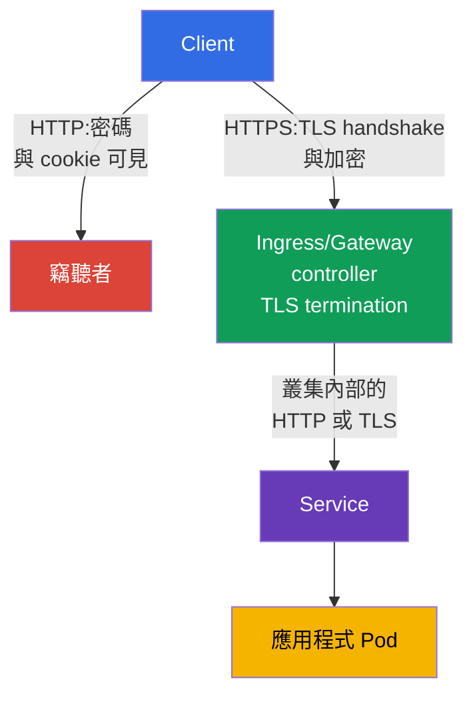
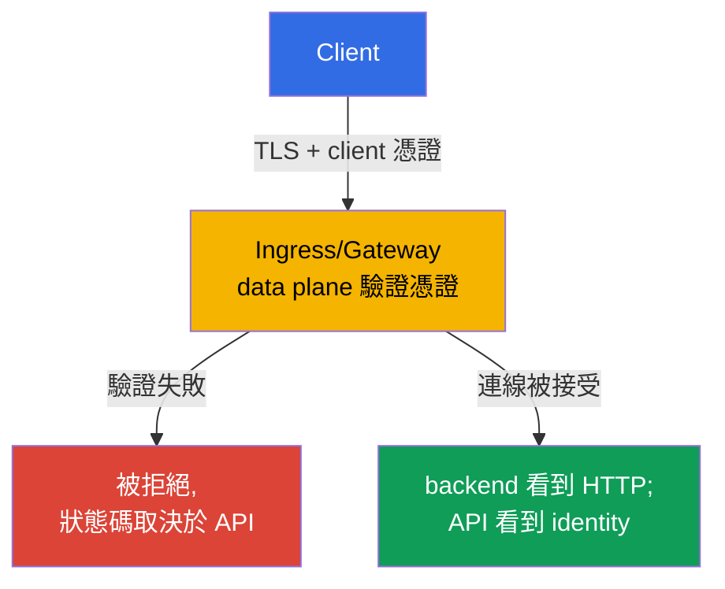

[Русская версия](ru.md) · [Eng version](README.md) · [Versión en español](es.md) · [Version française](fr.md) · [Deutsche Version](de.md) · [ქართული ვერსია](ge.md) · [日本語版](jp.md)

# 第 08 章。使用 TLS 保護 Ingress

> **問題。** 如果 Ingress 以一般 HTTP 接受流量,登入資訊、cookie、bearer
> token 與表單內容就會以明文在網路上傳輸。同一個不受信任網路中的使用者、
> 惡意的 Wi-Fi access point 或中間的 proxy 都可能讀取請求或在不被察覺的
> 情況下竄改回應 — 應用程式對外的公開入口在流量抵達 Pod 之前,就已經對
> 竊聽開放。

> **接下來。** 在第 07 章中,我們檢查並強化了叢集元件的設定。現在要保護
> 應用程式對外的公開入口。**Ingress 搭配 TLS** 會加密 client 與 ingress
> controller 之間的 HTTP 流量,確認伺服器名稱,並防止竊聽者在不被察覺的
> 情況下讀取或竄改請求。這屬於 CKS 的 Cluster Setup(15%)領域。

> **需要的 CKA 基礎。** Ingress、Service 的基本語法以及依 host/path 進行
> 路由的方式,已在 [CKA 第 32 章](../../../cka/course/32/tw.md) 中說明。
> TLS 的架構、憑證、私鑰以及鏈的驗證,則在 [CKA 第 00-3 章](../../../cka/course/00-3-tls/tw.md)
> 中討論。這裡討論的是如何在公開入口安全地套用這些機制,而不是重複它們的
> 基礎知識。

> 🧠 TLS 只保護 client 到 TLS termination 之間的路徑;controller → Service → Pod 是另一條邊界。

## 08.1. 威脅模型:為什麼 Ingress 上的 HTTP 不夠

Ingress controller 通常會從外部網路接收流量,再將其導向 Service,然後導向
Pod。如果 client 以 HTTP 連線,登入資訊、cookie、bearer token 與表單內容就
會以明文在網路上傳輸。同一個不受信任網路中的使用者、惡意的 Wi-Fi access
point 或中間的 proxy 都可能讀取請求或竄改回應。

TLS 保護的是 client 到 **TLS termination** 端點(即 ingress controller)
之間的通道。controller 會為主機名稱提供憑證、完成 TLS handshake、解密請求,
再將一般的 HTTP 流量路由到 backend。因此,外部入口上的 TLS 並不代表
controller -> Service -> Pod 的路徑就自動被加密。對於敏感的叢集內部流量,
需要另外的措施:應用程式層的 TLS、service mesh,或第 23 章會討論的 Cilium
transparent encryption。



需要同時具備三種特性:

- 機密性 — client 與 controller 之間的流量不可被讀取;
- 完整性 — 請求或回應不能被在不被察覺的情況下修改;
- 真實性 — client 驗證憑證確實是為所請求的 host 而發出的。

加密無法修正不安全的 backend、過度寬鬆的 RBAC 或暴露的 endpoint。它只是
defense in depth 中的一層。同時也不要把 TLS 憑證與 Kubernetes Secret 混為
一談:Secret 儲存金鑰與憑證,但除非有 Ingress 引用它,否則它本身並不會啟用
TLS。

> 🎯 能為指定 host 發出附帶 SAN 的測試憑證、核對憑證與金鑰是否相符,並使用 `--cacert` 而非 `-k`,是 TLS 題目的實務底線。

## 08.2. 憑證與金鑰:測試用的 self-signed 與生產做法

在實驗環境中可以建立 self-signed 憑證。client 預設不會信任它,因此一般的
`curl` 會在鏈驗證時失敗。

比較好的測試方式是透過 `--cacert tls.crt` 明確信任這個實驗用憑證:這樣
curl 仍會繼續驗證憑證與 host 名稱是否相符。`curl -k` 會完全關閉憑證驗證,
只適合作為單獨的診斷檢查,不能當作 TLS 設定正確的證明。

URL 中的名稱必須出現在 **Subject Alternative Name**(SAN)中。現代
client 驗證的是 SAN,而不只是已過時的 Common Name(CN)欄位。下面的憑證
是針對 `app.example.test` 產生的;若要換成其他名稱,需同時修改 `HOST` 與
`subjectAltName`。

```bash
export HOST=app.example.test

openssl req -x509 -newkey rsa:2048 -nodes \
  -keyout tls.key \
  -out tls.crt \
  -days 30 \
  -subj "/CN=${HOST}" \
  -addext "subjectAltName=DNS:${HOST}"

# 上傳到叢集前先檢查 subject 和 SAN
openssl x509 -in tls.crt -noout -subject -ext subjectAltName

# 憑證的公鑰必須與私鑰的公鑰一致。
# 以下兩個命令的雜湊值應該相同。
openssl x509 -in tls.crt -pubkey -noout \
  | openssl pkey -pubin -outform DER | sha256sum
openssl pkey -in tls.key -pubout -outform DER \
  | sha256sum

# 對於 CA 憑證要檢查鏈:leaf -> intermediate -> trusted root。
# controller 用的 `tls.crt` 通常包含 leaf,接著是 intermediate;root 不會放進去。
openssl verify -show_chain -CAfile root-ca.crt \
  -untrusted intermediate-ca.crt leaf.crt
```

在建立 Secret 之前,公鑰一致可以排除憑證與私鑰來自不同發行批次的情況。在
`openssl verify -show_chain` 的輸出中,leaf 應該能透過 intermediate 一路
驗證到受信任的 root;任何一環出錯,都代表這份憑證不能上傳。

參數 `-nodes` 會讓私鑰不帶 passphrase。這是必要的,因為 controller 必須能
在沒有互動輸入的情況下讀取這個金鑰。這種情況下的防護建立在對 Secret 嚴格的
RBAC、限制 etcd 存取以及 encryption at rest 之上 — 而不是靠金鑰檔案裡的
passphrase。

> 🏭 受信任的 CA、自動展期、擁有者、到期前的 alert,以及經過驗證的 Secret 輪替。

在生產環境中,不要手動建立長期存在的 self-signed 憑證。通常會由
`cert-manager` 向受信任的 CA(例如 Let's Encrypt)取得憑證,存入 Secret,
並在到期前更新。平台團隊也應該定義憑證的擁有者、到期提醒與輪替流程。如果
TLS 是在叢集之前的雲端 load balancer 上終止,也要檢查到 NGINX 之間的連線
是否符合組織要求:這一段也可能需要 TLS。

> 🎯 建立類型為 `kubernetes.io/tls` 且包含 `tls.crt` 與 `tls.key` 金鑰的 Secret,然後檢查 namespace 與名稱:Ingress 只能引用自己 namespace 中的 Secret。

## 08.3. TLS Secret:格式與作用範圍

在 Ingress TLS 中,請使用類型為 `kubernetes.io/tls`、包含 `tls.crt` 與
`tls.key` 金鑰的標準 TLS Secret。`kubectl create secret tls` 建立的正是
這種物件。

可移植的 Ingress TLS contract 要求憑證與私鑰分別放在 `tls.crt` 與
`tls.key` 這兩個金鑰下;至於 Secret 類型與內容的額外檢查則取決於
controller。因此,`kubernetes.io/tls` 對課程與生產環境來說都是正確的標準
格式,但不應被說成是 Ingress API 本身唯一能讀取的機制。`kubernetes.io/tls`
這個類型本身是為了方便與統一而提供的:Kubernetes API 會檢查這種類型的
Secret 是否具備必要的金鑰,而 TLS credentials 技術上也可以存放在 `Opaque`
Secret 中,只是這樣的 Secret 不會得到這項檢查,也無法向其他工程師表達出這
個物件的用途。
最可靠的建立方式是從已驗證過的檔案透過 `kubectl create secret tls` 建立:
這個命令會自行把憑證放入 `tls.crt` 金鑰,把私鑰放入 `tls.key`。

```bash
kubectl -n web create secret tls app-example-tls \
  --cert=tls.crt \
  --key=tls.key

kubectl -n web get secret app-example-tls \
  -o jsonpath='{.type}{"\n"}{.data.tls\.crt}{"\n"}{.data.tls\.key}{"\n"}'
# kubernetes.io/tls
# tls.crt 與 tls.key 的 base64 值
```

同樣的物件以 manifest 表示時如下。這裡的 `data` 之所以刻意留空,主要是因為
私鑰 `tls.key` 不能以明文形式提交到 Git。

X.509 憑證 `tls.crt` 包含公鑰,它本身並不是機密資料;是否要把公開憑證存放
在版本庫中,是 repository policy 的另一個決定。私鑰則必須始終保持機密。
`stringData` 用於短的測試值比較方便,但不會讓版本庫的內容因此變成機密。

```yaml
apiVersion: v1
kind: Secret
metadata:
  name: app-example-tls
  namespace: web
type: kubernetes.io/tls
data:
  tls.crt: <base64-encoded-certificate>
  tls.key: <base64-encoded-private-key>
```

Secret 是 namespaced 的。namespace `web` 中的 Ingress 不能引用 `default`
或其他 namespace 中的 Secret。不要僅僅為了 TLS 就給應用程式對所有 Secret
的 `get`/`list` 權限:憑證通常是由 controller 提供的,而建立與讀取這類
Secret 的權限,應交由獨立的 Role 來限制。`data` 中的 base64 是編碼,不是
加密。

> 🎯 在 `spec.tls.hosts` 與 `spec.rules.host` 中對應同一個 host,並指定 `secretName`、Service 與 `ingressClassName`。

## 08.4. Ingress:連結 host、TLS Secret 與 backend

這裡涉及的可移植 Ingress API 欄位是 `spec.tls`(`hosts`、`secretName`)
與 `spec.rules`(`host`、`path`、`pathType`、`backend`)。它們描述 TLS
憑證與路由,但**不會**設定 HTTP -> HTTPS redirect。`spec.ingressClassName`
也是一個 API 欄位,但類別本身的值,例如 `nginx`,選擇的是特定的實作。
Annotation(包括 `nginx.ingress.kubernetes.io/*`)完全不屬於 Ingress
API:它們的意義只由對應的 controller 決定。

host 的對應很重要,原因有兩個:controller 在 TLS handshake 期間會依此選擇
正確的憑證,而 client 會檢查 URL 中的名稱是否出現在 SAN 中。套用之前,先
確認所需的 class 與 Service 都存在:

```bash
kubectl get ingressclass
kubectl -n web get service web
```

以下假設 namespace `web` 中的 Service `web` 監聽埠 80。這份 manifest 不會
建立 Service 或 Deployment:那是 CKA 的基礎知識,必須另外存在。

```yaml
apiVersion: networking.k8s.io/v1
kind: Ingress
metadata:
  name: web-secure
  namespace: web
spec:
  # API 欄位;`nginx` 是實作的選擇,不是可移植的值。
  ingressClassName: nginx
  tls:
  - hosts:
    - app.example.test
    secretName: app-example-tls
  rules:
  - host: app.example.test
    http:
      paths:
      - path: /
        pathType: Prefix
        backend:
          service:
            name: web
            port:
              number: 80
```

不需要外部 DNS 就能檢查這些物件之間的連結:

```bash
kubectl -n web describe ingress web-secure
kubectl -n web get ingress web-secure -o yaml
kubectl -n web get secret app-example-tls -o jsonpath='{.type}{"\n"}'
```

在 `describe` 的輸出中,檢查 `Ingress Class`、`app.example.test` 對應的
規則、TLS host、Secret 以及事件。

Secret 讀取失敗或缺少 backend endpoints,確實需要在進行完整的
end-to-end 檢查之前先修正。

`ADDRESS` 欄位要另外看待:它反映的是 Ingress 對外發布的 status,在
NodePort、bare-metal、`hostNetwork`、port-forward 或某些本地 fixture 中,
即使 Ingress 是可正常運作的,這個值仍可能是空的。要確認 TLS 是否就緒,應該
透過所選 controller 實際的入口點來檢查,而不是只看 `ADDRESS` 是否有值。

## 08.5. ingress-nginx:已 retire 的 controller 與 annotation 的邊界

> **NGINX Ingress Controller 已 retire。** 自 2026 年 3 月起,`ingress-nginx`
> 專案已 retire,不再收到 release 與 security 修補([公告](https://kubernetes.io/blog/2025/11/11/ingress-nginx-retirement/))。
> CKS 要求正確設定帶有 TLS 的 Ingress,但公開的能力範圍並不保證任何特定的
> controller 或 nginx 專屬的 annotation。在考試中,務必先確認實驗環境提供的
> controller;`ingressClassName: nginx` 的語法及其 annotation,只是其中一種
> 可能的 fixture。在生產環境中,不要在新叢集上部署已 retire 的 controller:
> 請選擇仍受支援的實作或 Gateway API。可移植的部分 — TLS Secret、
> `spec.tls`、host/SNI、SAN、Service endpoints 與 HTTPS 驗證 — 不依賴
> controller。

> 🎯 對 ingress-nginx 而言,`spec.tls` 通常會啟用 redirect;`ssl-redirect` 與 `force-ssl-redirect` 取決於實作與拓樸。

即使 TLS Ingress 設定正確,只要 HTTP 仍然可以存取,就會留下風險:使用者可能
點擊舊連結,cookie 或表單會在第一次 HTTPS 回應之前就傳送出去。對於
**ingress-nginx**,只要存在 `spec.tls` 區塊,預設就會啟用 HTTP -> HTTPS
redirect(通常是 `308`),除非被 controller 的設定覆寫。因此,同時設定
`ssl-redirect` 與 `force-ssl-redirect` 並非必要,而把它當成一般 TLS
Ingress 的必備做法也是不正確的。

這正是 ingress-nginx 的語意,而不是 Ingress API 的語意。如果需要針對帶有
`spec.tls` 的 Ingress 明確覆寫 ingress-nginx 的設定,只需使用它專屬的
annotation `ssl-redirect`:

```yaml
metadata:
  annotations:
    nginx.ingress.kubernetes.io/ssl-redirect: "true"
```

`force-ssl-redirect` 則保留給另一種拓樸:TLS 在**外部**的 load
balancer/proxy 上終止,controller 收到的是 HTTP,而該 Ingress 沒有
`spec.tls` 區塊。此時外部 proxy 必須正確傳遞原始 HTTPS scheme 的資訊,否則
可能造成 redirect loop。例如,針對這種外部 SSL offload 設定的獨立
Ingress:

```yaml
apiVersion: networking.k8s.io/v1
kind: Ingress
metadata:
  name: web-external-tls
  namespace: web
  annotations:
    nginx.ingress.kubernetes.io/force-ssl-redirect: "true"
spec:
  ingressClassName: nginx
  rules:
  - host: app.example.test
    http:
      paths:
      - path: /
        pathType: Prefix
        backend:
          service:
            name: web
            port:
              number: 80
```

如果 redirect 可以在 edge 完成,就不要改由應用程式來負責。否則每個 backend
都要重複同樣的設定,而不小心新增的 Service 也可能仍然可以透過 HTTP 存取。
HSTS 是在第一次成功建立 HTTPS 連線之後,對 redirect 的補充,但它不能取代
TLS,也需要對 domain 與 subdomain 另外訂定謹慎的政策。

> 🏭 受支援的 Gateway API controller 及其 status/相容性;`GatewayClass` 的能力由具體的實作決定。

> 🔬 **Gateway API v1.6 現況。** 在 Gateway API v1.6 中,`TCPRoute` 與 `UDPRoute` 已轉入 Standard `v1`;新的 experimental 資源被移到獨立的群組 `gateway.networking.x-k8s.io`,並帶有 `X` 前綴。`XBackend` 仍屬於 experimental,而它對 `ExternalHostname` 的支援,由於安全性 trade-off(包括 confused-deputy 風險),需要有意識地 opt-in。這是目前的生產環境情境,不屬於 CKS Core。[官方 release blog](https://kubernetes.io/blog/2026/08/03/gateway-api-v1-6-release/)。

### Gateway API:目前的生產路徑

Gateway API 描述了三種 TLS 模型:**edge termination**(HTTPS listener 在
Gateway 上解密流量)、**TLS passthrough**(Gateway 不做 termination,直接
把 TLS handshake 傳給 backend)以及 termination 之後再到 backend 的 TLS
(re-encryption)。針對最後這種模型,Gateway API v1.4.0 中的
`BackendTLSPolicy` — 已在 Standard Channel 中 GA — 用來設定 backend 的
SNI 與憑證驗證。具體模型是否受支援,取決於 Gateway controller。

對於新的生產叢集,請使用受支援的 Gateway API 實作。下面範例中,
`platform-gateway` 是一個**實作專屬**的 `GatewayClass` 名稱:它由選定的
Gateway controller 提供,不是 Kubernetes 的標準值。`certificateRefs` 引用
namespace `web` 中同一個 TLS Secret;HTTPS listener 執行 TLS termination,
而 `HTTPRoute` 把請求路由到 Service。

```yaml
apiVersion: gateway.networking.k8s.io/v1
kind: Gateway
metadata:
  name: web-gateway
  namespace: web
spec:
  gatewayClassName: platform-gateway # 名稱取決於 Gateway controller
  listeners:
  - name: https
    protocol: HTTPS
    port: 443
    hostname: app.example.test
    tls:
      mode: Terminate
      certificateRefs:
      - kind: Secret
        name: app-example-tls
---
apiVersion: gateway.networking.k8s.io/v1
kind: HTTPRoute
metadata:
  name: web-secure
  namespace: web
spec:
  parentRefs:
  - name: web-gateway
    sectionName: https
  hostnames:
  - app.example.test
  rules:
  - matches:
    - path:
        type: PathPrefix
        value: /
    backendRefs:
    - name: web
      port: 80
```

如果 Gateway 也開放埠 80,請新增一個獨立的 HTTP listener 與 `HTTPRoute`,
搭配標準的 `RequestRedirect` filter 導向 `https`;不要把它與導向 backend
的 HTTPS route 混在一起。

> 🔬 TLS passthrough 會在 backend 終止 TLS 與 mTLS;請確認 controller 是否支援 `TLSRoute`、SNI 路由與 passthrough。

### TLS passthrough:`TLSRoute`

對於自行終止 TLS 的 backend(例如它需要自己的憑證,或者需要 mTLS),
Gateway 不會解密這個連線:listener 的 `protocol` 是 `TLS`,`tls.mode` 是
`Passthrough`,路由則依 SNI 選擇。`TLSRoute` 在 Gateway API v1.5.0 的
Standard Channel 中已經 GA。下面這個最簡範例,把 `app.example.test` 的
TLS 傳給埠 443 上的 Service `web-tls`;controller 必須支援 TLSRoute 與
passthrough。

```yaml
apiVersion: gateway.networking.k8s.io/v1
kind: Gateway
metadata:
  name: passthrough-gateway
  namespace: web
spec:
  gatewayClassName: platform-gateway
  listeners:
  - name: tls
    protocol: TLS
    port: 443
    hostname: app.example.test
    tls:
      mode: Passthrough
---
apiVersion: gateway.networking.k8s.io/v1
kind: TLSRoute
metadata:
  name: web-tls-passthrough
  namespace: web
spec:
  parentRefs:
  - name: passthrough-gateway
    sectionName: tls
  hostnames:
  - app.example.test
  rules:
  - backendRefs:
    - name: web-tls
      port: 443
```

在 passthrough 情境下,存放憑證的 Secret 屬於 backend,不在 Gateway 的
`certificateRefs` 中;要檢查的是 backend 本身的 SNI/SAN 憑證及其
endpoints。

Gateway 引用另一個 namespace 中的 `Secret`,需要在 **Secret 所在的
namespace** 中有明確的 `ReferenceGrant`;沒有它,controller 就不應該接受
這種跨 namespace 的引用。不要把這套邏輯套用到 `BackendTLSPolicy` 上:即使
有 `ReferenceGrant`,backend TLS 用的跨 namespace 憑證/CA 引用也不被允許。

在遷移流量之前,透過 `kubectl get gatewayclass` 檢查受支援的
`GatewayClass`,以及 Gateway 的 status。

> 🧠 mTLS 在 TLS handshake 時於 edge 驗證 client,但不能取代應用程式的 authorization,也不能取代 Pod 之間的 mTLS。

## 08.6. 入口處的 mTLS:controller 驗證 client 憑證

到目前為止,本章討論的都是**server-side TLS**:controller 用憑證向
client 證明自己的身分,而在 TLS 層級上,client 本身仍是匿名的。另一項獨立
的任務是**入口處的 mutual TLS(mTLS)**:controller 會額外要求 client
提供自己的憑證,並在請求抵達 backend **之前**,依受信任的 CA 驗證這份
憑證。不要把它與其他章節中的主題混淆:

- 第 23 章討論的是 mesh **內 Pod 之間**的 mTLS(Istio/Linkerd
  sidecar-to-sidecar);
- 08.5 中的 TLS passthrough,是把驗證 client 的責任轉移到**backend
  本身**,而不是 Gateway/Ingress;
- 這裡討論的正是**叢集邊界的 controller** 本身同時成為 client 的 TLS
  伺服器,並驗證 client 的憑證。



不要把某個 HTTP 狀態碼當成整個 mTLS 模型的一部分。在 ingress-nginx 中,
模式 `on` 在憑證驗證失敗時會回傳 `400`,而 `auth-tls-match-cn` 可能回傳
`403`。在 Gateway API 中,`AllowValidOnly` 是在 TLS handshake 期間驗證
憑證,因此某個實作可能直接拒絕 TLS 連線本身,而沒有任何 HTTP 回應 — 「一定
是 400/403」這種 controller-neutral 的模型並不存在。

> 🔬 `auth-tls-*` 是已 retire 的 ingress-nginx API;可移植的模型是「edge 上有效的 client 憑證」這件事本身。

### ingress-nginx:`auth-tls-*` annotation

Client Certificate Authentication 是透過一個在 `ca.crt` 金鑰中存放 CA
鏈的 `Secret`,加上 `Ingress` 物件上的一組 annotation 來啟用的:

```yaml
apiVersion: networking.k8s.io/v1
kind: Ingress
metadata:
  name: web-mtls
  namespace: web
  annotations:
    nginx.ingress.kubernetes.io/auth-tls-secret: "web/client-ca"
    nginx.ingress.kubernetes.io/auth-tls-verify-client: "on"
    nginx.ingress.kubernetes.io/auth-tls-verify-depth: "1"
    nginx.ingress.kubernetes.io/auth-tls-pass-certificate-to-upstream: "true"
spec:
  tls:
  - hosts: [app.example.test]
    secretName: web-tls
  rules:
  - host: app.example.test
    http:
      paths:
      - path: /
        pathType: Prefix
        backend:
          service:
            name: web
            port:
              number: 80
```

- `auth-tls-secret` 引用格式為 `namespace/name` 的 `Secret`,其中 `ca.crt`
  存放供 client 憑證使用的受信任 CA 鏈 — 這與 08.3 中 server-side 的
  `web-tls` 是不同的 `Secret`,雖然兩者都對應同一個 host。
- `auth-tls-verify-client: "on"` 要求 client 提供能透過 `auth-tls-secret`
  中的 CA 成功驗證的憑證;憑證驗證失敗會以 HTTP `400` 結束。
- `optional` 不要求每個 client 都提供憑證,但這**並不是**「永不拒絕」的
  模式:如果 client 提供的憑證不是由設定的 CA 簽發,ingress-nginx 仍然會
  回傳 HTTP `400`。當請求被允許時,驗證結果可以傳給 upstream。
- `optional_no_ca` 不會僅僅因為 client 憑證不是由 `auth-tls-secret` 中的
  CA 簽發就拒絕請求;驗證結果會傳給 upstream。只有在應用程式或另外的
  authorization layer 確實會依這個結果做決策時,才使用這個模式。
- 對於被放行到 upstream 的請求,ingress-nginx 會傳遞
  `ssl-client-verify`、`ssl-client-subject-dn` 與 `ssl-client-issuer-dn`;
  完整的 PEM 憑證只有在設定
  `auth-tls-pass-certificate-to-upstream: "true"` 時,才會透過
  `ssl-client-cert` 傳遞。
- Client Certificate Authentication 是套用在整個 host 上,而不是單一
  path。

> 🔬 Gateway API 的 frontend 驗證需要 API 版本與 controller 的支援;請檢查欄位、CA 參照與 handshake。

### Gateway API:在 Gateway 層級進行 frontend client-certificate 驗證

frontend client-certificate 驗證是透過 `Gateway` 物件的 `spec.tls.frontend`
欄位進入 Gateway API 的,而不是透過 `HTTPRoute`。目前的 schema 與更早的
proposal 版本(GEP-91 中的 `default.frontendValidation`)不同:在已發布的
API 中,路徑是 `spec.tls.frontend.default.validation`,而 per-port 的
override 是 `spec.tls.frontend.perPort[].tls.validation`。

```yaml
apiVersion: gateway.networking.k8s.io/v1
kind: Gateway
metadata:
  name: mtls-gateway
  namespace: web
spec:
  gatewayClassName: platform-gateway
  tls:
    frontend:
      default:
        validation:
          caCertificateRefs:
          - group: ""
            kind: ConfigMap
            name: client-ca
          mode: AllowValidOnly
  listeners:
  - name: app-https
    protocol: HTTPS
    port: 443
    hostname: app.example.test
    tls:
      mode: Terminate
      certificateRefs:
      - group: ""
        kind: Secret
        name: web-tls
```

`ConfigMap` `client-ca` 在 `ca.crt` 金鑰中存放受信任的 CA 憑證(trust
anchor)。Gateway API 中可移植的 Core 做法,是一個 `caCertificateRefs`
對應一個含有單一 CA 憑證的 `ConfigMap`。在同一個 `ca.crt` 中放多個 CA
憑證、使用多個 `caCertificateRefs`,或使用其他資源類型,都屬於
implementation-specific 的支援,因此這類變化請依照具體 Gateway
controller 的文件來檢查。

- `spec.tls.frontend.default.validation` 是在連線**到 Gateway** 時驗證
  client,並套用到所有沒有 per-port override 的 HTTPS listener;這與
  管理 Gateway **到 backend** 的 TLS 的 `BackendTLSPolicy` 不同 — 這兩種
  policy 是獨立的,可以同時套用。
- `spec.tls.frontend.perPort[].tls.validation` 會針對指定埠上的所有
  HTTPS listener,覆寫這個設定。
- `mode: AllowValidOnly`(預設)會拒絕沒有有效憑證的連線。
  `AllowInsecureFallback` 即使沒有憑證,或憑證驗證失敗,也會接受連線,把
  client 授權的決定交給 backend。這種狀態會透過 `Gateway` 上的
  `InsecureFrontendValidationMode` condition 明確標示出來,並帶來相當大的
  安全風險。Gateway API 建議只在測試環境使用這個模式,或者只在非測試環境中
  暫時使用;一般生產環境的 mTLS 應優先選擇 `AllowValidOnly`。
- frontend client-certificate 驗證是否受支援,取決於具體的 Gateway API
  controller;使用前請在你所用版本支援的實作清單中確認。

這兩種機制透過不同的 API 解決同一個問題:NGINX Ingress 透過
`auth-tls-*`,以及 Gateway API 透過 `spec.tls.frontend...validation`,都
能在叢集邊界驗證 client 憑證。哪一種可用,取決的不是 mTLS 概念本身的能力,
而是叢集中實際部署的是哪個 ingress controller 或 Gateway API
implementation — 應依照實際安裝的 controller 來選擇語法,而不是反過來。

### 陷阱:client-certificate 驗證的作用範圍因 API 而異

Client 憑證是在 TLS handshake 期間、也就是在依 path 進行 HTTP 路由之前
被驗證的。但 policy 的具體作用範圍在不同 API 之間並不一致,並非通用:

- **ingress-nginx:** Client Certificate Authentication 是**依 host** 套用
  的,無法對同一個 host 下不同的 path 設定不同的規則。如果 `/admin` 需要
  嚴格的 client 憑證,而 `/public` 在 TLS 層級不應該要求憑證,這種
  handshake 層級的需求,無法透過同一個 ingress-nginx host 下的兩個 path
  來表達。
- **Gateway API:** frontend client-certificate 驗證是在 `Gateway` 層級
  設定的:`default` 套用到所有沒有 override 的 HTTPS listener,`perPort`
  則套用到指定埠上所有的 HTTPS listener。同一個 Gateway、同一個埠上不同
  的 `hostname`/listener,**不會**取得各自獨立的 client-certificate
  policy — GEP-91 明確說明,更細緻的綁定會因為 HTTP/2/TLS connection
  coalescing 而帶來繞過風險:已經建立的 TLS 連線,可能會服務同一個埠上、
  hostname 不同的另一個 listener。

實務上的結論是:不要把「不同的 hostname 永遠代表不同的 mTLS policy」當成
可移植的模型。對 Gateway API 而言,不同的 handshake 層級需求需要分散到不同
的埠,或分散到真正獨立、且所選實作確實不會合併的 TCP/TLS 入口點上;具體的
拓樸請依照 controller 的文件來確認。

依 HTTP path/method 進行的授權,是在 TLS handshake 之後,由具備 HTTP
能力的 authorization layer 或應用程式來完成的。ingress-nginx 的
`auth-tls-match-cn` 不是 path/method 的 authorization:它只是額外把 client
憑證的 CN 與某個字串或 regex 比對而已。

不要把 ingress-nginx 中的 `ssl-client-verify` 當成通用的 contract 套用到
Gateway API 上。ingress-nginx 文件記載的是 `ssl-client-*` header,而
Gateway API 標準化的是 frontend 憑證驗證,但並沒有把 client identity 傳給
backend 的通用格式。如果 backend 需要取得這個 identity,請另外檢查具體
Gateway 實作提供的機制。

不要把入口處的 mTLS 當成 RBAC 或應用程式 authorization 的萬用替代品:
叢集邊界的憑證驗證,確認的是 TLS client 的 identity,而不是授權應用程式內
的某個具體動作。

> 🎯 `curl --resolve` 搭配 `--cacert` 驗證的是 HTTPS 本身;`openssl s_client -servername` 驗證的是 controller 實際交出的憑證。

## 08.7. 驗證:controller-neutral 的 HTTPS、host 與憑證

首先確認實際對外的公開入口:所選 Ingress/Gateway controller 的 Service
位址、LoadBalancer 的 hostname,或所用 fixture 發布出來的位址。對本地叢集
而言,可能需要 NodePort 的位址或 `kubectl port-forward`;對 LoadBalancer
則要等待外部位址就緒。這裡不預設特定 controller 的 namespace 或 Service
名稱。

```bash
kubectl get ingressclass
kubectl get gatewayclass
kubectl -n web get ingress,gateway,httproute,tlsroute
kubectl -n web get endpointslices -l kubernetes.io/service-name=web

export HOST=app.example.test
export ENTRYPOINT_IP=203.0.113.10  # 替換成所選 controller 的位址
```

如果測試用的 host 沒有發布到 DNS 中,`--resolve` 會強制 `curl` 使用
`ENTRYPOINT_IP`,同時保留正確的 Host header 與 SNI。可移植的驗證方式是:
以正確的 SNI 與 host 成功呼叫 backend 的 HTTPS,同時透過 `--cacert` 驗證
憑證:

```bash
curl --cacert tls.crt -vsS -o /dev/null -w 'HTTP %{http_code}\n' \
  --resolve "${HOST}:443:${ENTRYPOINT_IP}" \
  "https://${HOST}/"
# HTTP 200
```

僅供診斷:不驗證憑證直接連線。這個命令成功,**不能證明** SAN 或鏈是正確
的:

```bash
curl -kvsS -o /dev/null \
  --resolve "${HOST}:443:${ENTRYPOINT_IP}" \
  "https://${HOST}/"
```

HTTP -> HTTPS redirect 及其狀態碼取決於 controller。**只有當 fixture 使用
`ingress-nginx`** 且帶有 `spec.tls` 時,才能另外預期 `308` 與
`Location`:

```bash
curl -vI --resolve "${HOST}:80:${ENTRYPOINT_IP}" "http://${HOST}/"
```

不要只檢查狀態碼是否為 `200`,也要檢查 client 實際拿到的憑證。
`-servername` 會啟用 SNI:沒有它,一個服務多個 host 的叢集中,controller
可能會回傳預設憑證。

```bash
openssl s_client -connect "${ENTRYPOINT_IP}:443" -servername "${HOST}" </dev/null 2>/dev/null \
  | openssl x509 -noout -subject -issuer -ext subjectAltName
# subject=CN = app.example.test
# X509v3 Subject Alternative Name:
#     DNS:app.example.test
```

對於系統 trust store 信任的憑證,請使用不加 `-k`、也不加實驗用
`--cacert tls.crt` 的一般 `curl`:client 應該透過系統中受信任的 CA 來驗證
鏈與名稱。如果使用的是內部/private CA,請透過 `--cacert <ca-bundle.pem>`
傳入受信任的 CA bundle,而不是用 `-k` 關閉驗證。如果 `curl` 回報
`SSL certificate problem`,在生產環境中不要繞過這個問題。應檢查有效期限、
SAN、CA 鏈、`secretName`、namespace,以及 controller 是否確實重新讀取了
更新後的 Secret。

| 症狀                                  | 該檢查什麼                                                 | 可能原因                                                                                   |
| ------------------------------------- | ---------------------------------------------------------- | ------------------------------------------------------------------------------------------- |
| HTTP 收到 backend 的 `200`            | annotation 與實際使用的 controller                          | 沒有 `ssl-redirect`、controller 不是 NGINX,或其設定覆寫了 redirect                          |
| HTTPS 顯示的是預設憑證                | `spec.tls.hosts`、SAN 與 SNI                                | host 不相符、找不到 Secret,或請求沒有帶 `--resolve`/SNI                                     |
| `curl` 從 NGINX 收到 `404`            | host、`rules.host`、`ingressClassName`                     | 請求到達了 controller,但沒有選中任何規則                                                    |
| HTTPS 回傳 `503`                      | Service、endpoints 與 Pod 的 readiness                     | TLS 正常運作,但 backend 無法使用                                                            |
| Secret 存在,但 TLS 沒有啟用           | `tls.crt`、`tls.key`、namespace 以及具體 controller 的要求 | `tls.crt`/`tls.key` 缺失或不正確、憑證與私鑰不相符、Secret 位於其他 namespace,或 controller 不接受目前使用的 Secret 格式 |
| 瀏覽器不信任該憑證                    | Issuer、鏈與有效期限                                        | self-signed 憑證,或不完整的 CA 鏈                                                           |

> 🏭 憑證的發行與輪替、對私鑰的最小存取權、受支援的 controller,以及變更之後的 synthetic 檢查。

## 08.8. 生產環境中的實際做法

- **自動發行與輪替。** `cert-manager` 搭配受信任的 CA 發行憑證,在到期前
  展期,並更新 TLS Secret。團隊持續追蹤有效期限的指標,並提早收到 alert。
- **預設就是 HTTPS。** 對 ingress-nginx 而言,`spec.tls` 預設就會啟用
  redirect;`ssl-redirect` 只是明確的、controller 專屬的覆寫。
  `force-ssl-redirect` 只用在沒有 `spec.tls` 區塊的 external TLS
  offload。外部 load balancer、controller 與應用程式要一致地處理 proxy
  header,以免出現 redirect loop。
- **API 遷移計畫。** 對新叢集而言,帶有 HTTPS listener 與
  `certificateRefs` 的 Gateway,搭配 `HTTPRoute`,取代已 retire 的
  ingress-nginx;具體的 `GatewayClass` 由安裝的實作來選擇。
- **對金鑰的最小存取權。** RBAC 只讓 controller 與憑證自動化取得對 TLS
  Secret 的權限。Secret encryption at rest 與受保護的 etcd,能降低私鑰
  外洩的風險。
- **邊界分離。** 為不同 tenant 或關鍵網域使用獨立的 namespace、
  IngressClass 與憑證,能降低不小心交出別人的憑證或路由的可能性。
- **每次變更後都要驗證。** Pipeline 會以正確的 SNI 發出 HTTPS 請求,檢查
  預期的 SAN、憑證的有效期限,以及 backend 是否可用。如果政策要求有一個
  HTTP listener 會轉向 HTTPS,pipeline 還要另外檢查預期中的 `30x`
  redirect。對純 HTTPS 的拓樸而言,正確的結果可能就是完全沒有可存取的
  HTTP listener。這能在使用者發現錯誤之前先攔截下來。

## 08.9. 小詞彙表

- **TLS termination** — 在 ingress controller 上完成 TLS handshake 並解密
  流量。
- **Ingress** — 帶有外部 HTTP/HTTPS 路由規則、對應到 Service 的 API
  物件。
- **IngressClass** — 選擇 Ingress 的實作,例如 NGINX Ingress Controller;
  class 的名稱取決於安裝的 controller。
- **GatewayClass** — 選擇 Gateway API 的實作;它的名稱同樣是
  implementation-specific 的。
- **TLS Secret** — 類型為 `kubernetes.io/tls`、包含 `tls.crt` 與
  `tls.key` 金鑰的 Secret。
- **SAN** — Subject Alternative Name,憑證有效的 DNS 名稱/IP 位址清單。
- **SNI** — Server Name Indication,TLS handshake 中用來選擇憑證的
  host 名稱。
- **self-signed 憑證** — 用自己的金鑰而不是受信任的 CA 簽署的憑證;適合
  測試,但 client 預設不會信任它。
- **HTTP -> HTTPS redirect** — 把未加密的請求永久重新導向到 HTTPS。
- **入口處的 mTLS** — controller 在 TLS handshake 時額外要求並驗證 client
  的憑證,且發生在請求抵達 backend 之前;不要與 mesh mTLS(第 23 章)混
  淆。
- **Gateway frontend client-certificate 驗證** — 透過
  `spec.tls.frontend.default.validation` 或 per-port 的
  `spec.tls.frontend.perPort[].tls.validation` 進行的 client 憑證驗證;
  與管理 TLS 到 backend 的 `BackendTLSPolicy` 是分開的。

## 08.10. 本章總結

- Ingress 上的 TLS,保護的是外部 HTTP 通道,在 TLS termination 之前防止
  竊聽與竄改。
- 測試時可以透過 `openssl` 建立 self-signed 憑證,但 SAN 必須包含 host,
  而 `curl -k` 不能留在生產環境中。
- 建立 Secret 之前,憑證與私鑰的公鑰必須一致,鏈也必須依 leaf ->
  intermediate -> trusted root 的順序驗證。`kubectl create secret tls`
  會建立類型為 `kubernetes.io/tls`、含有 `tls.crt` 與 `tls.key` 的
  Secret;Ingress 與 Secret 必須在同一個 namespace。
- 在 `spec.tls` 中連結可移植的 API 欄位 `hosts` 與 `secretName`;
  `ingressClassName` 選擇的是實作,而 `nginx` 這個名稱及其 annotation
  並不可移植。
- 在 ingress-nginx 中,`spec.tls` 預設會啟用 HTTP -> HTTPS redirect。
  `ssl-redirect` 只能作為 ingress-nginx 的明確覆寫來設定;
  `force-ssl-redirect` 用於沒有 `spec.tls` 區塊的 external TLS
  offload。
- 對新的生產叢集,請使用 Gateway API:帶有 `certificateRefs` 的 HTTPS
  listener 搭配 `HTTPRoute`;可選擇 edge termination、TLS passthrough,
  或透過 `BackendTLSPolicy` 對 backend 做 re-encryption。
  `GatewayClass` 由實作來選擇,跨 namespace 的 Secret 需要在 Secret 所在
  的 namespace 中有 `ReferenceGrant`。
- 驗證應該包括憑證的 SNI 與 SAN、Service endpoints 以及 Ingress 事件,
  而不只是確認 YAML 物件存在。

## 08.11. 這對你有何幫助:考試與實務工作

**在考試中。** 可移植的最低要求是:針對指定 host 產生憑證並檢查 SAN、建立
TLS Secret、透過 `spec.tls` 引用它、核對 host/SNI/SAN、確認所選的
controller 與 backend endpoints 都存在,並透過 `curl --resolve` 完成一次
成功的 HTTPS 呼叫。務必檢查 namespace、`secretName`、`hosts` 與
`ingressClassName`,或是 Gateway route。`308`、`ssl-redirect` 與
`force-ssl-redirect` 都是**只有在 fixture 使用 ingress-nginx 時**才有的
細節:只有在題目明確提供這個 controller 並要求相應的拓樸時,才使用它們。

**在實務工作中。** Secure Ingress 是不受信任的 client 與應用程式之間的
邊界。可靠的設定會結合自動的憑證輪替、對私鑰的最小存取權、嚴格的 SAN
驗證、強制的 HTTPS,以及持續的 synthetic 檢查。任何一個錯誤的
annotation,或放在錯誤 namespace 的 Secret,都可能讓一個公開的 endpoint
失去原本應有的防護。

## 08.12. 自我檢查問題

<details>
<summary>1. TLS termination 在 Ingress 上完成之後,TLS 的保護到哪裡結束,為什麼這無法保證 controller 與 Pod 之間也是加密的?</summary>

TLS 保護的是 client 到 ingress controller 之間的通道,handshake 與請求解密
都在這裡完成。之後 controller → Service → Pod 的路徑可能是 HTTP 也可能是
TLS,因此對敏感的叢集內部流量,需要應用程式層的 TLS、service mesh,或
Cilium transparent encryption。

</details>

<details>
<summary>2. 為什麼光有 CN 還不夠,憑證的哪個欄位必須包含 DNS host?</summary>

現代 client 是依 Subject Alternative Name 來檢查 URL 中的名稱,而不只是
依已過時的 Common Name。發出 self-signed 憑證時,需要把所需的 DNS host
加入 `subjectAltName`,例如 `DNS:${HOST}`,並透過
`openssl x509 -ext subjectAltName` 來檢查。

</details>

<details>
<summary>3. Ingress 用的 TLS Secret 應該是什麼類型,應該有哪些金鑰?</summary>

標準做法是類型為 `kubernetes.io/tls` 的 Secret,憑證放在 `tls.crt`,私鑰
放在 `tls.key`。透過
`kubectl create secret tls ... --cert=tls.crt --key=tls.key` 建立最可靠。
對可移植的設定而言,關鍵在於正確的 `tls.crt`、`tls.key`,以及所選 Ingress
controller 是否支援。

</details>

<details>
<summary>4. 為什麼 Ingress 和它的 TLS Secret 必須在同一個 namespace?</summary>

Secret 是 namespaced 物件,`web` 中的 Ingress 不能引用 `default` 或其他
namespace 中的 Secret。因此 `spec.tls` 中的 `secretName`,必須引用與該
Ingress 建立在同一個 namespace 的 Secret。

</details>

<details>
<summary>5. 為什麼帶有 `spec.tls` 的 ingress-nginx 預設會做 redirect,什麼時候需要 controller 專屬的 annotation `force-ssl-redirect`?</summary>

對 ingress-nginx 而言,`spec.tls` 區塊預設會啟用 HTTP → HTTPS redirect,
通常是 308,除非 controller 的設定覆寫了它。`force-ssl-redirect` 保留給
external TLS offload 的拓樸:TLS 在 controller 之前終止,controller 收到
的是 HTTP,而該 Ingress 沒有 `spec.tls`;proxy 必須正確傳遞原始的 HTTPS
scheme,否則可能出現 loop。

</details>

<details>
<summary>6. 設定好 redirect 之後,對 HTTP 與 HTTPS 分別執行 `curl` 應該預期得到什麼兩種結果?</summary>

以正確的 SNI 與 Host 發出的 HTTPS 呼叫,例如透過 `curl --resolve`,應該能
成功取得 backend 的回應,範例中是 HTTP 200。對於實驗用的 self-signed 憑證,
請透過 `--cacert tls.crt` 把它當成受信任的憑證傳入;`-k` 只能當成獨立的
診斷用 bypass,它成功只能確認連線本身,不能證明憑證、SAN 或鏈是正確的。
只有在 fixture 使用 ingress-nginx 且帶有 `spec.tls` 時,單獨的 HTTP 請求
才會依預期得到 redirect,通常是 308,並帶有 `Location`;這個狀態碼不是
Ingress API 的可移植語意。

</details>

<details>
<summary>7. 在建立 Secret 之前,如何確認憑證/私鑰的公鑰一致,以及 leaf -> intermediate -> root 的鏈是完整的?</summary>

透過
`openssl x509 -pubkey -noout | openssl pkey -pubin -outform DER | sha256sum`
取得憑證公鑰的雜湊值,並與
`openssl pkey -in tls.key -pubout -outform DER | sha256sum` 的雜湊值比較。
鏈則透過
`openssl verify -show_chain -CAfile root-ca.crt -untrusted intermediate-ca.crt leaf.crt`
來檢查:leaf 必須能經由 intermediate 一路驗證到受信任的 root。

</details>

<details>
<summary>8. 為什麼即使用的是 self-signed 憑證,也不能把 `curl -k` 當成 TLS 設定正確的證明?</summary>

`-k` 會關閉憑證驗證,因此只適合用於診斷。如果實驗用的 self-signed 憑證能在
本機取得,比較好的做法是使用 `--cacert tls.crt`:這樣 curl 會信任這份特定的
憑證,但仍會繼續驗證 TLS 與 host 名稱。在生產環境中,`-k` 會隱藏信任、SAN、
鏈,以及可能的竄改所產生的錯誤;問題應該被修正,而不是被繞過。

</details>

<details>
<summary>9. 為什麼 `GatewayClass` 不能被當作可移植的名稱,HTTPS listener 又是如何透過 `certificateRefs` 把 Gateway 與憑證連結起來的?</summary>

`GatewayClass` 是由選定的 Gateway controller 提供的,因此像
`platform-gateway` 這樣的名稱是 implementation-specific 的,不是
Kubernetes 的標準值。HTTPS listener 設定 `tls.mode: Terminate` 與指向 TLS
Secret 的 `certificateRefs`;在範例中,Secret 位於同一個 namespace,而
跨 namespace 的引用則需要在 Secret 所在的 namespace 中有
`ReferenceGrant`。

</details>

## 練習

🧪 Lab 103(CIS、Secure Ingress TLS、TLS hardening 與二進位檔驗證):
[tasks/cks/labs/103](../../labs/103/README_TW.MD)

🌐 額外的互動式練習(killer.sh/killercoda,外部資源):[ingress-create](https://killercoda.com/killer-shell-cks/scenario/ingress-create) · [ingress-secure](https://killercoda.com/killer-shell-cks/scenario/ingress-secure)

🎮 Killercoda(瀏覽器內,無需安裝):[Ingress Controller](https://killercoda.com/kubernetes-basics/course/kubernetes-fundamentals/ingress-controller) · [Create TLS Certificate](https://killercoda.com/kubernetes-basics/course/kubernetes-fundamentals/create-tls-certificate)

---

[目錄](../README_TW.md) · [第 07 章](../07/tw.md) · [第 09 章](../09/tw.md)
