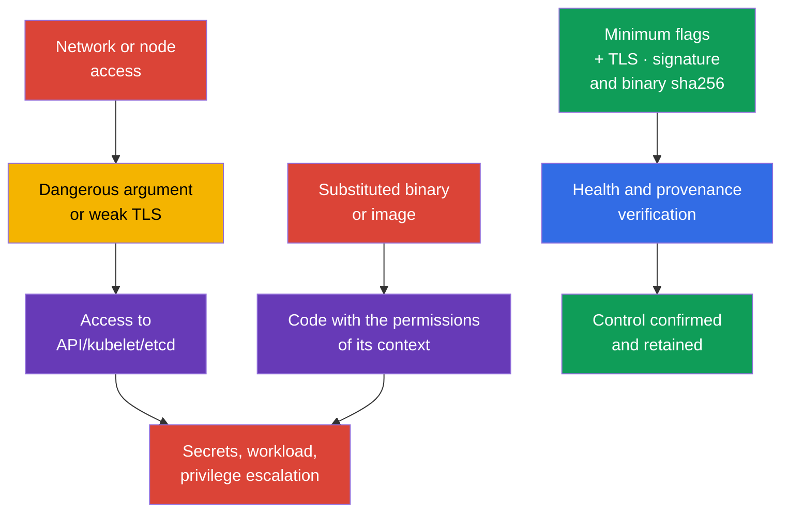
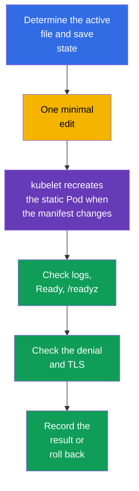

[Русская версия](ru.md) · [Versión en español](es.md) · [Version française](fr.md) · [Deutsche Version](de.md) · [ქართული ვერსია](ge.md) · [繁體中文版](tw.md) · [日本語版](jp.md)

# Chapter 09. Insecure component arguments, TLS hardening, and binary verification

> **The problem.** An attacker who gains network access to a control-plane endpoint or
> the ability to change a file on a node does not look for a vulnerability in Kubernetes itself, but for an insecure
> adjacent argument: anonymous access, a read-only kubelet port, weak TLS, or a substituted
> `kubelet`/`kubectl`/image before it even starts. One such flaw can open access to
> API/etcd or provide code execution in the context of a substituted artifact. For a platform
> binary, consequences depend on the runtime: a substituted kubelet/control-plane binary gets
> the permissions of its service process, while a substituted `kubectl` gets the permissions of its invoking
> OS user and access to that user's kubeconfig/credentials.

> **What comes next.** In chapter 08, we protected external HTTP ingress with TLS. Now we must protect
> the control-plane components and kubelet themselves: one insecure argument can open an
> anonymous API, diagnostic endpoint, or weak TLS channel. Then we verify that we run
> the published Kubernetes binaries. This is the **Cluster
> Setup** domain (CKS, 15%).

> **What you need from CKA.** The control-plane architecture, kubeadm, and static Pods are covered in
> [CKA chapter 35](../../../cka/course/35/README.md), while the Kubernetes component attack surface is in
> [CKA chapter 02](../../../cka/course/02/README.md). Their basic configuration is not repeated here:
> we find dangerous arguments, safely change the active configuration, and demonstrate the result.

> 🧠 Protection is determined by active runtime state, not by a line in a template, tag, or expected version.

## 09.1. Threat model: a flag or artifact as an entry point

The control plane makes decisions for the whole cluster. `kube-apiserver` grants and checks
API access, `kubelet` starts Pods on a node, and `etcd` stores Secrets, RBAC, and desired
state. Therefore, a weak parameter has a greater impact than an error in one application.

A typical attack chain looks like this: an attacker gains network access to an endpoint or
the ability to change a file on a node; they use anonymous access, a read-only kubelet port,
`AlwaysAllow`, or profiling; then read data or act with someone else's permissions.
An alternative path is to substitute an artifact before execution. A substituted kubelet or
control-plane binary runs with the permissions of the corresponding service/host process;
a substituted `kubectl` with the permissions of the local user and their available Kubernetes
credentials; a container image with the permissions of its workload security context. Therefore,
verify provenance before execution and assess consequences by actual execution
context, not by the blanket formula “component permissions”.



Hardening is not a set of “for CIS” lines. Before changing anything, answer four questions:
which process really uses the parameter, who its client is, whether certificates and
cipher suites are compatible, how to verify availability, and how to roll back. In managed Kubernetes, part of the
control plane belongs to the provider: do not try to change its host files; instead check
the documentation of available security settings.

> 🎯 Inspect active config and process args, correct the one effective source, restart the component, and confirm active state, behavior, and health; for a binary - provenance and SHA-256.

## 09.2. Dangerous arguments: what to find and why

Not every flag is equally dangerous in every topology. Its value, listening address, firewall,
TLS, and RBAC form one control. But the following settings require explicit justification or
remediation.

| Component | Dangerous setting | Risk | Safe target |
|---|---|---|---|
| `kube-apiserver` | broad anonymous access | a request without accepted credentials can be processed as `system:anonymous`; with erroneous RBAC this creates an unauthenticated access path | a benchmark can require `--anonymous-auth=false`; in production first check health endpoints and kubeadm discovery, and in Kubernetes 1.34+ restrict anonymous access through `AuthenticationConfiguration` when necessary |
| `kube-apiserver` | `--authorization-mode=AlwaysAllow` or added `AlwaysAllow` | every authenticated request passes authorization | for kubeadm, normally `Node,RBAC` |
| `kube-apiserver` | `--profiling=true` | profiling can reveal process state and is unnecessary on a public boundary | `--profiling=false` |
| `kube-apiserver` | legacy `--insecure-port`/`--insecure-bind-address` | API without TLS and authentication | do not enable; these legacy options are removed in modern Kubernetes |
| `kubelet` | `--read-only-port` other than `0` | an unauthenticated endpoint can reveal Pod and node data | `--read-only-port=0` or `readOnlyPort: 0` |
| `kubelet` | `--anonymous-auth=true` | an anonymous client reaches the kubelet API | `--anonymous-auth=false` or a config API field |
| `kubelet` | `--authorization-mode=AlwaysAllow` | any authenticated client gets excessively broad access to the kubelet API | `--authorization-mode=Webhook` |
| `kubelet` | `--protect-kernel-defaults=false` | on a baseline mismatch, kubelet does not fail fast and can attempt to change host-level kernel flags to expected values | `--protect-kernel-defaults=true` after checking sysctl |
| `kube-controller-manager` | `--profiling=true` or `--use-service-account-credentials=false` | unnecessary diagnostics or use of broad credentials instead of separate SAs | `--profiling=false`, separate service account credentials |
| `kube-scheduler` | profiling enabled or endpoint on a broad `--bind-address` | a diagnostic endpoint becomes accessible to an unnecessary network | `enableProfiling: false`; deprecated CLI `--profiling` and kube-bench handling for a config-based scheduler are covered in [chapter 07](../07/README.md) |
| `etcd` | `--client-cert-auth=false`, insecure `--listen-client-urls` | a client without mTLS or an external network gains access to cluster storage | mTLS, localhost/internal network, firewall |

For a specific CIS/CKS task, a benchmark can explicitly require `--anonymous-auth=false`;
then meet the exact task requirement and demonstrate the result.

In kubeadm production, do not apply this change mechanically. Standard token-based
`kubeadm join` uses public reading of `kube-public/cluster-info` by the
`system:unauthenticated` group, so completely disabling anonymous authentication changes the
discovery lifecycle. Also check `kube-apiserver` health probes if they access
anonymous health endpoints.

In Kubernetes 1.34+, you can use `AuthenticationConfiguration`, allowing anonymous
access only for explicitly required endpoints. If public `cluster-info` is no longer
needed, first move join/discovery to an appropriate alternative and only then remove this access.
For example, a separate file mounted into the static Pod through
`--authentication-config=<path>` can contain:

```yaml
apiVersion: apiserver.config.k8s.io/v1
kind: AuthenticationConfiguration
anonymous:
  enabled: true
  conditions:
  - path: /livez
  - path: /readyz
  - path: /healthz
```

If anonymous access remains only for `/livez`, `/readyz`, and `/healthz`, ordinary
token-based `kubeadm join` through public `cluster-info` does not work. This is acceptable
only if the node-addition lifecycle has moved to another discovery mechanism.

If the `anonymous` field is set in `AuthenticationConfiguration`, you cannot use
`--anonymous-auth` at the same time. The endpoint-scoped option does not make a benchmark pass when it
explicitly requires `--anonymous-auth=false`; select and document the model applicable to
your cluster.

First inventory active parameters, not only the template file. Look for
duplicates: the last or actually used value depends on the implementation, while conflicting flags
complicate troubleshooting. If `kube-bench` already reports the specific finding
(chapter 07), use its remediation as the source of the exact flag and file; TLS-specific
parameters (`--tls-min-version`, `--tls-cipher-suites`) are covered separately below in 09.4-09.5.

`--enable-debugging-handlers` for kubelet is also evaluated by risk: it enables
diagnostic handlers whose needed parts can be used by `kubectl logs`, `exec`,
and `port-forward`. Do not disable it blindly. First determine necessary operations and
protect the kubelet API on `10250` with authentication + `Webhook` authorization.

Restrict network access to `10250` at node or infrastructure level: a host firewall,
cloud security group/ACL, or CNI-specific host policy. Do not rely on ordinary Kubernetes
`NetworkPolicy` as portable kubelet-endpoint control: this is host/node
traffic, and NetworkPolicy behavior for `hostNetwork` and node IP depends on the CNI implementation.
The same applies to metrics: profiling and metrics are different endpoints.

## 09.3. Where to change configuration and how to restart safely

The general process for safely editing static Pod control plane configuration (backup, minimal change,
health verification, recovery after failure) is covered in chapter 07 - it is not
repeated here, but supplemented with one chapter-specific technique and kubelet/scheduler/controller-manager
discovery-configuration details that are particularly important for TLS and
cipher changes below in 09.4.

Kubelet is not a static Pod: its configuration is usually in
`/var/lib/kubelet/config.yaml`, while additional arguments are in
`/var/lib/kubelet/kubeadm-flags.env` and a systemd drop-in. In Kubernetes 1.36, also look for
`--config-dir`: kubelet applies its primary config, then only `*.conf` drop-in files
(including subdirectories) from this directory in lexical order; it ignores `*.yaml` in it.
In Kubernetes 1.36, kubelet merges sources in this order: CLI feature gates
have the lowest priority, then the primary config applies, then `*.conf` from
`--config-dir`, while the remaining CLI arguments have the highest priority. Therefore, for
ordinary parameters in this chapter, a CLI flag can override YAML/drop-ins, but do not extend this
rule to `--feature-gates`.

Determine actual `--config`, `--config-dir`, and CLI arguments through
`systemctl cat kubelet` and the actual process command line. Do not set one ordinary
parameter in several sources at once without necessity.

For scheduler, first check whether `--config=<path>` is set:
`KubeSchedulerConfiguration` can be its effective source, and some legacy CLI flags are
deprecated/ignored when `--config` is present. For example, scheduler `--profiling` is deprecated;
in component config, check `enableProfiling: false`.

For `kube-controller-manager`, Kubernetes 1.36 has no general `--config` option
equivalent to scheduler: its working parameters are still set by CLI flags in the active manifest /
process args. `KubeControllerManagerConfiguration` exists as a component configuration
API and an internal/configz representation, but is not a general external `--config` file for
kube-controller-manager.

Therefore, first determine the runtime of the particular component, then check exactly the
active source that it supports.



An additional technique for a static Pod control plane is atomic rename through a hidden
candidate in the same watched directory. It is more reliable than ordinary backup+edit where it is important not to
leave the cluster without API even temporarily because of an error in intermediate YAML:

```bash
# 1. Create a hidden candidate in the watched directory itself; kubelet ignores files
# whose name begins with a dot, so the Pod is not recreated before atomic replacement.
# /etc/kubernetes/manifests can be a separate mount: if the candidate is created in
# /etc/kubernetes, mv across different filesystems becomes copy+unlink and ceases to be
# an atomic rename.
sudo install -d -m 700 /root/k8s-manifest-backup
CANDIDATE=$(sudo mktemp /etc/kubernetes/manifests/.kube-apiserver.yaml.candidate.XXXXXX)
sudo cp -p /etc/kubernetes/manifests/kube-apiserver.yaml "$CANDIDATE"
sudo cp -p /etc/kubernetes/manifests/kube-apiserver.yaml \
  /root/k8s-manifest-backup/kube-apiserver.yaml.$(date +%F-%H%M%S)
sudoedit "$CANDIDATE"

# 2. Actually validate the candidate YAML/API structure without touching the running static Pod.
sudo kubectl apply --dry-run=client --validate=strict -f "$CANDIDATE"

# 3. Only after successful validation, atomically replace the watched manifest.
# Candidate and target are in one directory and one filesystem,
# so rename is guaranteed to be atomic.
sudo mv -f "$CANDIDATE" /etc/kubernetes/manifests/kube-apiserver.yaml

# 4. Watch recreation from the node console, then check the API.
watch -n 2 'sudo crictl ps -a --name kube-apiserver'
kubectl get --raw='/readyz?verbose'
kubectl get nodes

# If the static Pod does not start, first read kubelet and runtime logs.
sudo journalctl -u kubelet -n 100 --no-pager
sudo crictl ps -a --name kube-apiserver
sudo crictl logs "$(sudo crictl ps -aq --name kube-apiserver | head -n1)"
```

Keep permanent backup files outside `/etc/kubernetes/manifests/` anyway (as in step 1
above): a hidden candidate is needed only for the replacement itself, not as a long-term copy.

Before kubelet, first check sysctl values and configuration, then restart only it. An ordinary `systemctl restart kubelet` by itself does not stop already running Pods and containers: the container runtime continues to execute them, and after starting kubelet restores reconciliation. Nevertheless, on a control plane, change kubelet one node at a time and monitor the Node heartbeat, kubelet logs, and `/readyz`: a configuration error can leave a node `NotReady` or prevent further management of static Pods.

```yaml
# /var/lib/kubelet/config.yaml - example configuration-API fragment.
readOnlyPort: 0
authentication:
  anonymous:
    enabled: false
authorization:
  mode: Webhook
protectKernelDefaults: true
```

```bash
sudo systemctl restart kubelet
sudo systemctl --no-pager --full status kubelet
sudo journalctl -u kubelet -n 100 --no-pager
check_kubelet_10255() {
  local listeners

  if ! listeners="$(sudo ss -H -lntp 'sport = :10255')"; then
    echo 'ERROR: cannot inspect listening TCP sockets; port 10255 is not verified' >&2
    return 1
  fi

  if [[ -n "$listeners" ]]; then
    printf '%s\n' "$listeners"
    echo 'FAIL: kubelet read-only port 10255 is listening' >&2
    return 1
  fi

  echo 'PASS: kubelet read-only port 10255 is closed'
}
check_kubelet_10255
kubectl get nodes

# Final result after base config, *.conf drop-ins, and CLI overrides; authorized access is required.
NODE="${NODE:?set target node name from kubectl get nodes}"
kubectl get --raw "/api/v1/nodes/${NODE}/proxy/configz" \
  | jq '.kubeletconfig | {readOnlyPort, authentication, authorization, protectKernelDefaults}'
```

## 09.4. TLS hardening for apiserver, kubelet, and etcd

TLS already protects the channel, but the version and cipher-suite set determine which cryptographic
options a client can negotiate at all. Allowing obsolete protocols or weak
ciphers makes downgrade and use of outdated cryptography easier. A minimum of `TLS 1.2`
is normally compatible with modern Kubernetes clients; `TLS 1.3` restricts
clients more strongly and requires separate verification of the entire control plane, automation, and monitoring.

Modern Go and Kubernetes defaults already exclude obsolete protocols and insecure
suites; there is no universal “short secure list.” Do not carry a random
short list between components or versions. If organization policy or a specific
CIS profile requires an approved list, apply exactly that list after inventorying
certificates and clients, rather than opposing it to the hardening baseline.
An RSA-only list is not a safe default: it breaks an endpoint with an ECDSA certificate
and narrows compatibility unnecessarily. TLS 1.3 suites in Go are usually not controlled by
`--tls-cipher-suites`: the TLS implementation selects them, so this flag concerns primarily
TLS 1.2 and older.

> 🔬 Cipher-suite pinning and TLS 1.3 require approved policy, client inventory, and comparison of values with the component version.

For Kubernetes components, allowed string values of the flag normally take the form
`VersionTLS12` and `VersionTLS13`. For etcd, the value name depends on the etcd version: current
help commonly uses `TLS1.2`/`TLS1.3`. Do not carry a value between programs by
guesswork - before editing, check `--help` of the binary running that version, not
documentation from memory or another release.

On the exam, the quickest way to obtain the exact flags and permitted values is from the
running process itself, rather than looking on the web - documentation for the needed version can be
unavailable or take time to find. If a component runs in a static Pod and its
container is `Running`, first use `kubectl exec`. `Ready=False` itself does not
prohibit exec: a running container and available API/RBAC/streaming path matter for exec.
Readiness determines a Pod's `Ready` state, is used to include a Pod in Service traffic, and
participates in availability/rollout semantics of workload controllers, but is not a gate for `kubectl exec`.
If the API/RBAC/streaming path for `kubectl exec` is unavailable but the component really runs as a
CRI container, use `crictl exec` with the specific container ID.

If a component runs as a separate host `systemd` service, `crictl exec` does not apply:
get the executable from the active process or `ExecStart` and invoke its `--help`
directly on the node.

```bash
# Static Pod / mirror Pod: the container must be Running (Ready is not required).
kubectl -n kube-system exec kube-apiserver-<node> -- kube-apiserver --help 2>&1 \
  | grep -A2 -- '--tls-min-version\|--tls-cipher-suites'

kubectl -n kube-system exec etcd-<node> -- etcd --help 2>&1 \
  | grep -A2 -- '--cipher-suites\|--tls-min-version'

# Fallback only if etcd actually runs as a CRI container.
CID="$(sudo crictl ps -q --name etcd | head -n1)"
if [[ -n "$CID" ]]; then
  sudo crictl exec "$CID" etcd --help 2>&1 \
    | grep -A2 -- '--tls-min-version'
fi

# If etcd is a separate host/systemd process, use that process's executable.
PID="$(pgrep -xo etcd)"
if [[ -n "$PID" ]]; then
  sudo "/proc/${PID}/exe" --help 2>&1 \
    | grep -A2 -- '--tls-min-version'
fi
```

The `--help` output shows the exact flag name and, for most versions, a short description with
permitted values next to the flag. This is the same binary and version that actually runs in the
cluster, so there is no mismatch with documentation for another release and no time is spent
switching to a browser.

Evidence for the benchmark requirement “etcd accepts no lower than TLS 1.2” is the active
`--tls-min-version` and a verified handshake, not an arbitrary RSA-only cipher list;
check the exact wording and version of the benchmark in use.

```yaml
# /etc/kubernetes/manifests/kube-apiserver.yaml, command fragment.
# Modern Go defaults leave suites without explicit pinning.
- kube-apiserver
- --tls-min-version=VersionTLS12
# Add --tls-cipher-suites only with approved policy/compatibility.
# If policy requires a list, include both ECDSA and RSA suites needed by your certificates:
# - --tls-cipher-suites=TLS_ECDHE_ECDSA_WITH_AES_128_GCM_SHA256,TLS_ECDHE_ECDSA_WITH_AES_256_GCM_SHA384,TLS_ECDHE_RSA_WITH_AES_128_GCM_SHA256,TLS_ECDHE_RSA_WITH_AES_256_GCM_SHA384
```

For kubelet, prefer its config API; if the installation passes parameters through
systemd, use equivalent flags in the single active source. Likewise,
leave `tlsCipherSuites` unset until documented policy requires it.

```yaml
# /var/lib/kubelet/config.yaml, fragment; support for exact fields depends on kubelet version.
tlsMinVersion: VersionTLS12
```

```yaml
# /etc/kubernetes/manifests/etcd.yaml, example for etcd that accepts the TLS1.2 value.
# --cipher-suites is not added: Go defaults are safe unless policy requires otherwise.
- etcd
- --tls-min-version=TLS1.2
```

Do not restrict TLS only on the server endpoint. etcd has client and peer traffic, while
apiserver has kubelet, controller-manager, scheduler, kubectl, webhook, and
automation clients. First collect the actual certificates/keys, listening addresses, and clients;
then apply the change on a test or one HA node. When moving to
`VersionTLS13`, expect an old TLS 1.2 client to be denied - this does not prove a server
error, but requires a client-migration plan.

Verification of the TLS minimum must include two different things:

1. protocol evidence - the permitted version negotiates successfully, while a version below
   the configured minimum is rejected;
2. application health - the component remains operational after the change.

For apiserver, it is enough to check a handshake on `6443`; kubelet `10250` often requires
a client certificate and authorization after the handshake; for etcd, `etcdctl endpoint health`
proves only application health, so verify the protocol handshake separately through
`openssl s_client`. Do not print a private key to the terminal or copy PKI from the node.

Before a negative test, ensure that the TLS client used can actually offer the legacy
protocol version being tested. Modern OpenSSL or a system crypto policy can themselves prohibit
TLS 1.1. If a client rejects TLS 1.1 locally, that result does not prove the server-side
`tls-min-version`. A negative test is evidence only when you can see that the client tried to
negotiate the legacy protocol and the rejection came from the endpoint under test. This rule applies equally
to apiserver, kubelet, and etcd.

```bash
# apiserver, positive test: TLS 1.2 must negotiate successfully.
# Replace the address and SNI with your cluster's values.
export API=127.0.0.1:6443
OUT="$(mktemp)"

if openssl s_client \
    -connect "$API" \
    -servername kubernetes \
    -tls1_2 \
    -CAfile /etc/kubernetes/pki/ca.crt \
    -verify_return_error \
    </dev/null >"$OUT" 2>&1
then
  if grep -Eq 'Cipher is \(NONE\)|Cipher[[:space:]]*:[[:space:]]*0000' "$OUT"; then
    cat "$OUT"
    rm -f "$OUT"
    echo 'FAIL: TLS 1.2 handshake has no negotiated cipher' >&2
    exit 1
  fi
  grep -E 'Protocol|Cipher|Verify return code' "$OUT"
  echo 'PASS: TLS 1.2 handshake succeeded'
else
  cat "$OUT" >&2
  rm -f "$OUT"
  echo 'FAIL: TLS 1.2 handshake failed' >&2
  exit 1
fi
rm -f "$OUT"

# apiserver, negative test: TLS 1.1 must be rejected by the server.
# A simple grep for "protocol|alert" does not distinguish server-side rejection from a local
# OpenSSL/crypto-policy prohibition before ClientHello is sent - both facts must be proven.
# It is formulated as a function: return 1 on every non-PASS branch so exit status matches
# the textual verdict and automation (cmd && echo PASS, CI wrapper, $?) does not break.
check_tls11_rejected() {
  local endpoint="$1"
  local servername="$2"
  local neg rc

  neg="$(mktemp)" || return 1

  # @SECLEVEL=0 weakens only this one-time test client so that modern
  # OpenSSL can form a TLS 1.1 ClientHello where possible; the server is unchanged.
  if openssl s_client \
      -connect "$endpoint" \
      -servername "$servername" \
      -tls1_1 \
      -cipher 'DEFAULT:@SECLEVEL=0' \
      -msg -state \
      </dev/null >"$neg" 2>&1
  then
    rc=0
  else
    rc=$?
  fi

  if grep -Eq '^>>> .*Handshake.*ClientHello' "$neg" \
     && grep -Eq '^<<< .*Alert.*fatal protocol_version|alert protocol version' "$neg"
  then
    echo 'PASS: client sent TLS 1.1 ClientHello and server rejected it with protocol_version'
    rm -f "$neg"
    return 0
  fi

  if grep -Eqi 'no protocols available|no ciphers available|unsupported protocol' "$neg" \
     && ! grep -Eq '^>>> .*Handshake.*ClientHello' "$neg"
  then
    cat "$neg" >&2
    echo 'INCONCLUSIVE: local OpenSSL/crypto policy blocked TLS 1.1 before ClientHello' >&2
    rm -f "$neg"
    return 1
  fi

  cat "$neg" >&2
  echo "INCONCLUSIVE/FAIL: server-side TLS 1.1 rejection was not proven (s_client rc=${rc})" >&2
  rm -f "$neg"
  return 1
}
check_tls11_rejected "$API" kubernetes

# etcd: first verify the permitted TLS 1.2 handshake with mTLS - the same model,
# as apiserver: s_client exit status, -verify_return_error, and a check of the
# actually negotiated cipher, not only Verify return code.
OUT="$(mktemp)"

if sudo openssl s_client \
    -connect 127.0.0.1:2379 \
    -tls1_2 \
    -CAfile /etc/kubernetes/pki/etcd/ca.crt \
    -cert /etc/kubernetes/pki/etcd/healthcheck-client.crt \
    -key /etc/kubernetes/pki/etcd/healthcheck-client.key \
    -verify_return_error \
    </dev/null >"$OUT" 2>&1
then
  if grep -Eq 'Cipher is \(NONE\)|Cipher[[:space:]]*:[[:space:]]*0000' "$OUT"; then
    cat "$OUT"
    rm -f "$OUT"
    echo 'FAIL: etcd TLS 1.2 handshake has no negotiated cipher' >&2
    exit 1
  fi
  grep -E 'Protocol|Cipher|Verify return code' "$OUT"
  echo 'PASS: etcd TLS 1.2 handshake succeeded'
else
  cat "$OUT" >&2
  rm -f "$OUT"
  echo 'FAIL: etcd TLS 1.2 handshake failed' >&2
  exit 1
fi
rm -f "$OUT"

# Then a negative test: TLS 1.1 must not negotiate. The same criterion as for
# apiserver: prove that the client sent ClientHello and the server returned protocol_version.
# A separate function (not check_tls11_rejected): etcd requires an mTLS client cert/key,
# which the apiserver function does not accept. Return 1 on every non-PASS branch for the same reason.
check_etcd_tls11_rejected() {
  local endpoint="$1" cacert="$2" cert="$3" key="$4"
  local neg rc

  neg="$(mktemp)" || return 1

  if sudo openssl s_client \
      -connect "$endpoint" \
      -tls1_1 \
      -cipher 'DEFAULT:@SECLEVEL=0' \
      -CAfile "$cacert" \
      -cert "$cert" \
      -key "$key" \
      -msg -state \
      </dev/null >"$neg" 2>&1
  then
    rc=0
  else
    rc=$?
  fi

  if grep -Eq '^>>> .*Handshake.*ClientHello' "$neg" \
     && grep -Eq '^<<< .*Alert.*fatal protocol_version|alert protocol version' "$neg"
  then
    echo 'PASS: client sent TLS 1.1 ClientHello and etcd rejected it with protocol_version'
    rm -f "$neg"
    return 0
  fi

  if grep -Eqi 'no protocols available|no ciphers available|unsupported protocol' "$neg" \
     && ! grep -Eq '^>>> .*Handshake.*ClientHello' "$neg"
  then
    cat "$neg" >&2
    echo 'INCONCLUSIVE: local OpenSSL/crypto policy blocked TLS 1.1 before ClientHello' >&2
    rm -f "$neg"
    return 1
  fi

  cat "$neg" >&2
  echo "INCONCLUSIVE/FAIL: etcd server-side TLS 1.1 rejection was not proven (s_client rc=${rc})" >&2
  rm -f "$neg"
  return 1
}
check_etcd_tls11_rejected 127.0.0.1:2379 \
  /etc/kubernetes/pki/etcd/ca.crt \
  /etc/kubernetes/pki/etcd/healthcheck-client.crt \
  /etc/kubernetes/pki/etcd/healthcheck-client.key

# Separately verify etcd application health.
export ETCDCTL_API=3
sudo etcdctl --endpoints=https://127.0.0.1:2379 endpoint health \
  --cacert=/etc/kubernetes/pki/etcd/ca.crt \
  --cert=/etc/kubernetes/pki/etcd/healthcheck-client.crt \
  --key=/etc/kubernetes/pki/etcd/healthcheck-client.key

# Desired source: the manifest really contains the expected edit.
sudo grep -nE -- '--(tls-min-version|tls-cipher-suites|cipher-suites)' \
  /etc/kubernetes/manifests/{kube-apiserver,etcd}.yaml

# Active runtime: the manifest is only a desired source that kubelet periodically
# reads; read argv of the processes actually running on this node.
for PROC in kube-apiserver etcd; do
  PID="$(pgrep -xo "$PROC")" || {
    echo "ERROR: running process not found: $PROC" >&2
    continue
  }
  echo "=== active argv: $PROC (pid=$PID) ==="
  sudo cat "/proc/${PID}/cmdline" \
    | tr '\0' '\n' \
    | grep -E -- '--(tls-min-version|tls-cipher-suites|cipher-suites)' \
    || echo "INFO: matching TLS flag is absent from active argv of $PROC"
done

# Then behavioral TLS tests and health.
kubectl get --raw='/readyz?verbose'
kubectl get nodes
```

| Symptom after the change | Likely cause | Verification and action |
|---|---|---|
| apiserver does not start | YAML typo, unsupported flag, or cipher | `journalctl -u kubelet`, `crictl logs`; restore the last working manifest |
| client gets protocol version | client is older than the configured minimum | upgrade the client or temporarily select an agreed minimum under an approved exception |
| TLS handshake fails with TLS 1.2 | certificate key algorithm is incompatible with permitted cipher suites | inspect `openssl x509 -text`, add suitable ECDSA/RSA suites |
| etcd is not healthy | peer/client cannot negotiate TLS or lost access to a key | test all member endpoints with mTLS, inspect etcd logs, roll back one node |
| `openssl` shows a TLS 1.3 cipher not in the list | the TLS library controls TLS 1.3 ciphers | check minimum version and version documentation; do not treat this as bypassing the flag |

## 09.5. Verifying Kubernetes platform binaries: signature and sha256

HTTPS during download protects transport, but does not prove who released the file. SHA-256
verifies **integrity**: the downloaded binary equals the bytes described by the selected digest.
It is not proof of provenance: a hash obtained together with a file from the same
untrusted source, or an unapproved baseline, does not create trust.

For Kubernetes, use a version-specific official release artifact. Kubernetes publishes a
keyless cosign signature and certificate alongside the binary; `verify-blob` verifies the signature and
certificate binding to the expected identity and OIDC issuer, which proves release origin.
Check identity and issuer explicitly rather than accepting an arbitrary certificate. Pin the
version in a variable: `latest` cannot be reproduced reliably.

```bash
export K8S_VERSION=v1.36.0
export ARCH=amd64
export BIN=kubectl
export BASE="https://dl.k8s.io/release/${K8S_VERSION}/bin/linux/${ARCH}"

# Obtain the binary and published keyless signature/certificate from the version-specific release.
for FILE in "${BIN}" "${BIN}.sig" "${BIN}.cert" "${BIN}.sha256"; do
  curl -fsSL --retry 3 --retry-delay 3 "${BASE}/${FILE}" -o "${FILE}"
done

# Official Kubernetes Release Engineering values for binary artifacts.
# cosign 2+ requires both constraints; do not remove them for a “successful” verification.
cosign verify-blob "${BIN}" \
  --signature "${BIN}.sig" \
  --certificate "${BIN}.cert" \
  --certificate-identity krel-staging@k8s-releng-prod.iam.gserviceaccount.com \
  --certificate-oidc-issuer https://accounts.google.com

# SHA-256 is an additional equality check of bytes against an approved release digest.
printf '%s  %s\n' "$(tr -d '[:space:]' < "${BIN}.sha256")" "${BIN}" > "${BIN}.sha256sum"
sha256sum --check "${BIN}.sha256sum"
# kubectl: OK

# For an already installed file, obtain the observed digest and compare it with approved inventory.
sha256sum /usr/bin/kubelet
```

Thus, signature/certificate with the expected identity/issuer provides provenance, while a
checksum provides integrity relative to a trusted release digest. Kubernetes also publishes signed
SBOMs (SPDX), but image digest pinning, container-image signature, SBOM, and admission policy belong to the
**Supply Chain Security (20%)** domain, not Cluster Setup in this chapter. See
[chapters 24-28](../24/README.md) for these controls; here we verify only release artifacts and binaries of
the Kubernetes platform itself.

Detailed container-image verification, including digest, signing, and SBOM, is intentionally not
duplicated here: this is Supply Chain Security, see [chapters 24-28](../24/README.md).

## 09.6. Practical scenario: detect substitution before damage

Imagine that a `kubelet` substituted after download has reached a worker. An ordinary
`kubelet --version` check does not find the problem: a malicious binary can return the expected
version.

First record observed hashes, compare them with the approved release manifest, and
perform evidence/provenance/baseline/authorized-change triage before choosing containment. Do not “fix”
a mismatch by changing the reference hash: on an unconfirmed change or other signs of
substitution, escalate according to the incident runbook.

```bash
# 1. Preserve evidence on the node before replacing the file.
sudo sha256sum /usr/bin/kubelet | sudo tee /root/kubelet.sha256.observed
sudo stat -c '%y %s %U:%G %a %n' /usr/bin/kubelet
sudo systemctl cat kubelet

# 2. Compare the observed hash with the approved release digest from trusted inventory.
# Inventory format: '<digest>  /usr/bin/kubelet'. The command returns FAIL on mismatch.
sudo sha256sum --check /root/approved-kubelet.sha256

# Perform further imageID/digest verification through the supply-chain procedure in chapters 24-28.
```

`sha256sum --check` with `FAILED` is a signal for investigation, but by itself does not prove
compromise or prescribe the single answer “isolate.” First preserve evidence and perform triage:
(1) confirm the path, version, and expected approved baseline, excluding an inventory error or an
update of the wrong file; (2) verify release provenance through
`cosign verify-blob` with expected certificate identity/issuer and compare package/release
metadata; (3) find an authorized change - a change record, rollout, package-manager, and CI
logs - and correlate time, owner, and digest; (4) compare with the previously known-good
baseline and scope on other nodes. Do not “fix” a mismatch by changing the reference hash.

If evidence does not confirm an authorized change, provenance/baseline does not match, or there are
other signs of substitution, escalate according to the incident runbook: stop further
spread, apply proportionate containment (up to cordon/drain or node isolation), preserve logs,
and replace the node or binary in a controlled way. A single hash reliably reports a mismatch of
expected bytes, but does not explain its cause or change path. Responding to a container image and
registry/CI evidence belongs to supply-chain procedures in chapters 24-28.

## 09.7. Verifying the result and troubleshooting

After every edit, evidence is needed at three levels: active configuration,
actual behavior, and cluster health. The presence of a line in an unused file is not
verification.

```bash
# 1a. Desired control-plane source: for the kubeadm default staticPodPath.
# If staticPodPath is changed, use the actually active directory.
STATIC_POD_DIR=/etc/kubernetes/manifests
sudo grep -nE -- \
  '--(anonymous-auth|authorization-mode|profiling|tls-min-version|cipher-suites)' \
  "${STATIC_POD_DIR}"/{kube-apiserver,kube-controller-manager,kube-scheduler,etcd}.yaml

# 1b. Active runtime argv of control-plane processes: a manifest is only a desired source
# that kubelet periodically reads, not proof of a recreated Pod.
sudo ps -ww -eo pid,args \
  | grep -E '[k]ube-apiserver|[k]ube-controller-manager|[k]ube-scheduler|[e]tcd'

# Obtain argv without truncation for a particular parameter when needed:
APIPID="$(pgrep -xo kube-apiserver)" || {
  echo 'ERROR: kube-apiserver process not found' >&2
  false
}
sudo cat "/proc/${APIPID}/cmdline" | tr '\0' '\n'

# 1c. Kubelet: first show actual startup sources, rather than guessing a path.
sudo systemctl cat kubelet
sudo ps -ef | grep '[k]ubelet'

# 1d. Final actuated KubeletConfiguration after base config, --config-dir, and overrides.
NODE="${NODE:?set target node name from kubectl get nodes}"
kubectl get --raw "/api/v1/nodes/${NODE}/proxy/configz" \
  | jq '.kubeletconfig | {
      readOnlyPort,
      authentication,
      authorization,
      protectKernelDefaults,
      tlsMinVersion,
      tlsCipherSuites
    }'
```

Verify manifest and runtime separately: the manifest proves the desired source, while the process
command line proves the static Pod was actually recreated with new argv. If a component
reads additional component config through `--config`, separately verify the active
config file/effective endpoint of the component; argv alone is then insufficient too.

If `/configz` is unavailable due to permissions or topology, do not fall back to
a hard-coded `/var/lib/kubelet/config.yaml`: obtain actual `--config` and
`--config-dir` from the unit/process, read exactly them, and then account for ordinary CLI overrides.

```bash
# 2. Behavior: the read-only kubelet port is closed. The check_kubelet_10255 function (see §09.3)
# returns 1 on every non-PASS branch so exit status matches the textual verdict.
check_kubelet_10255() {
  local listeners

  if ! listeners="$(sudo ss -H -lntp 'sport = :10255')"; then
    echo 'ERROR: cannot inspect listening TCP sockets; port 10255 is not verified' >&2
    return 1
  fi

  if [[ -n "$listeners" ]]; then
    printf '%s\n' "$listeners"
    echo 'FAIL: kubelet read-only port 10255 is listening' >&2
    return 1
  fi

  echo 'PASS: kubelet read-only port 10255 is closed'
}
check_kubelet_10255
```

Confirm the TLS minimum with positive/negative protocol tests from §09.4. Do not repeat a
simplified `openssl ... -tls1_1 | grep ...` without checking local-client capabilities:
modern OpenSSL or system crypto policy can themselves prohibit TLS 1.1, and such a
test admits a false positive.

```bash
# 3. Health: API, nodes, and static Pods have returned to a working state.
kubectl get --raw='/readyz?verbose'
kubectl get nodes
kubectl -n kube-system get pods -o wide
sudo crictl ps | grep -E 'kube-apiserver|kube-controller-manager|kube-scheduler|etcd'
```

| Check fails | Check first | Common cause |
|---|---|---|
| `kubectl` does not respond after a static Pod edit | `journalctl -u kubelet`, `crictl ps -a`, container logs | incorrect YAML, flag, or mount |
| flag is visible but `kube-bench` still reports FAIL | process args and one value source | a template, not the active manifest, was changed; a duplicate exists |
| port `10255` still listens | systemd drop-in and kubelet `ps` | wrong config file was edited or an old flag overrides YAML |
| TLS 1.2 client no longer connects | certificate algorithm, cipher list, client TLS | suites are too narrow or client is incompatible |
| `sha256sum --check` returns FAIL | approved manifest, path, and version | wrong binary, corrupted download, or substitution |

`kube-bench` is useful as a regression control, but its profile must match the Kubernetes
version and architecture. Rerun relevant targets after the fix and save the
report together with the benchmark version. `WARN` requires a manual decision, not mechanically
adding a flag.

```bash
sudo kube-bench run --targets master,etcd | tee kube-bench-after.txt
grep -E '\[FAIL\]|\[WARN\]' kube-bench-after.txt
```

> 🏭 An immutable versioned baseline for arguments, TLS, and binaries; canary/rolling rollout and temporary exceptions with an owner and expiry.

## 09.8. How this is used in production

- **Immutable baseline.** Component arguments, kubelet config, and TLS policy are set through
  kubeadm config, the node image, or configuration management. Manual editing of a static Pod is an
  emergency or training technique that must then be returned to the source of truth.
- **Compatible TLS hardening.** Client inventory, a canary change on one HA node,
  handshake-error monitoring, and a rollback plan precede `VersionTLS13` or narrowing cipher
  suites. Exceptions have an expiry, owner, and compensating control.
- **Drift detection.** Run `kube-bench` regularly and check effective process args
  and configuration. For kubelet, alert on any `10255` listener. For etcd, `2379/2380`
  being `LISTEN` is normal: alert on deviation from the approved bind/exposure
  baseline - an unexpected interface or process, access from an unauthorized network, missing
  required mTLS/firewall, or other drift relative to the cluster topology.
- **Verifiable delivery.** The pipeline verifies a binary's keyless signature/certificate against
  expected identity/issuer and SHA-256 as an integrity check, and keeps the approved
  platform baseline separately. Image signing, SBOM, registry, and admission controls are
  supply-chain topics of chapters 24-28.
- **Safe rollback.** Keep the manifest backup outside the static Pod directory, and test rollback
  in non-production. On suspected substitution, reinstalling the node from a trusted image is preferable
  to continuing to operate a potentially modified host.

## 09.9. Mini-glossary

- **static Pod** - a Pod from a local node manifest, managed by kubelet rather than
  scheduler through the Kubernetes API.
- **`--anonymous-auth`** - a setting allowing or disallowing anonymous identity for an
  API endpoint.
- **read-only kubelet port** - the legacy unauthenticated kubelet port, which must
  be disabled with value `0`.
- **TLS minimum version** - the minimum TLS version a server negotiates with a client.
- **cipher suite** - a set of TLS cryptographic algorithms; the permitted set must be
  compatible with the certificate algorithm and clients.
- **SHA-256 checksum** - a 256-bit file digest used to verify exact
  byte equality with a published artifact.
- **provenance** - demonstrable artifact origin: who released it and from which trusted release
  or pipeline.

## 09.10. Chapter summary

- Dangerous `anonymous-auth`, `AlwaysAllow`, profiling, a read-only kubelet port, and broad
  diagnostic endpoints expand the attack surface of the control plane and nodes.
- First determine the active parameter source. kubeadm control-plane components normally
  are static Pods from `/etc/kubernetes/manifests/`, while kubelet is a systemd service with config
  API and/or arguments.
- Change static Pods one at a time, with a backup outside the watched directory, `kubelet`/CRI
  observation, and immediate `/readyz` verification.
- For apiserver and kubelet, set the TLS minimum version; for etcd, set the corresponding
  `--tls-min-version`, comparing exact values with the etcd version. Modern Go/Kubernetes
  suite defaults are safe; pin a suite list only for approved policy,
  benchmark, or compatibility, and test it with certificate key algorithm and clients.
- `cosign verify-blob` with expected certificate identity/issuer verifies Kubernetes-binary
  provenance; `sha256sum --check` additionally compares bytes with a trusted
  checksum. Image digest, signing, and SBOM belong to Supply Chain Security - chapters 24-28.
- Proof of hardening includes active arguments, a negative test of dangerous
  behavior, TLS handshake, control-plane health, and a repeated `kube-bench`.

## 09.11. How this helps: on the exam and in real work

**On the exam.** A CKS task can give SSH to a control-plane node and ask you to correct an
insecure flag, TLS policy, or binary hash. Quickly determine whether it is a static Pod or
kubelet service; keep a backup outside `/etc/kubernetes/manifests`; make one edit;
wait for restart and demonstrate both the configuration and health. For a checksum, do not compare
by eye: create input for `sha256sum --check` and retain its `OK`/`FAIL`.

A common specific variant is to set the minimum TLS version on
`kube-apiserver` and `etcd` (for example, “no lower than TLS 1.2” or “TLS 1.3 only”). For apiserver,
this is `--tls-min-version=VersionTLS12`/`VersionTLS13` in the manifest
`/etc/kubernetes/manifests/kube-apiserver.yaml`; for etcd, it is `--tls-min-version=TLS1.2`/`TLS1.3`
in `/etc/kubernetes/manifests/etcd.yaml`: the etcd value name differs from apiserver, and under a
timer it is easy to carry over the wrong format from memory. If you doubt the exact value for
the installed version, checking it through `--help` of the running binary
(the method in 09.4) is faster than searching the web. After editing, wait for the static Pod to be recreated and
demonstrate both sides: the permitted version completes a handshake and a version below the minimum
is rejected - that, not only successful `/readyz`, proves that the policy applied.

**In real work.** Component hardening is a platform-contract change,
not a one-time CIS checkbox. It requires client inventory, an IaC source of truth, rolling
deployment, and telemetry. Digest and provenance verification moves trust from a mutable artifact name
to specific bytes, but works only together with protected sources,
signature, and admission control.

## 09.12. Self-check questions

<details>
<summary>1. Why are `--anonymous-auth=true` and RBAC for `system:anonymous` together more dangerous than either
   factor on its own?</summary>

`--anonymous-auth=true` turns a request without credentials into the `system:anonymous` subject, but does not itself yet grant API permissions. A binding for `system:anonymous` or `system:unauthenticated` grants permissions, and together these settings allow obtaining them without a certificate or token. Therefore, check both the authentication path and existing bindings.
</details>

<details>
<summary>2. Which configuration sources must be checked before changing kubelet parameters?</summary>

First inspect `systemctl cat kubelet` and actual process arguments through `ps` to find the real `--config`, `--config-dir`, and other CLI arguments. In Kubernetes 1.36, merge order is: CLI feature gates have the lowest priority, then primary config, then `*.conf` drop-ins, then CLI arguments other than feature gates have the highest priority. When accessible, check the resulting `KubeletConfiguration` through `/configz`; do not set one parameter in several sources at once without need.
</details>

<details>
<summary>3. Why must backup manifests not be stored inside `/etc/kubernetes/manifests/`?</summary>

Kubelet scans the static Pod directory and is not limited to `.yaml`/`.yml` files: it processes every file whose name does not begin with a dot. Thus, a backup with any ordinary name can be read as another manifest and create a conflict. Keep backups outside the watched directory, for example in `/root/k8s-manifest-backup`.
</details>

<details>
<summary>4. How does `VersionTLS12` in a Kubernetes component differ from possible `TLS1.2` in the etcd CLI, and how do you find the correct value?</summary>

Kubernetes components normally accept the `VersionTLS12` string, while current etcd can expect `TLS1.2`. These are interfaces of different programs, so you cannot transfer a value by guesswork. Before changing it, check `etcd --help` of the running version or its package documentation.
</details>

<details>
<summary>5. Why can a restricted RSA cipher-suite set break an endpoint with an ECDSA certificate?</summary>

An RSA-only list contains no suite compatible with the key algorithm of an ECDSA certificate. As a result, a TLS 1.2 handshake cannot select a common cipher suite, even though the endpoint and certificate can be sound. With policy-based pinning, include compatible ECDSA and RSA suites for the certificates and clients actually used.
</details>

<details>
<summary>6. Which commands confirm that TLS 1.1 is rejected, TLS 1.2 is permitted, and apiserver remains healthy after the change?</summary>

For a positive TLS 1.2 test, check the exit status of `openssl s_client` itself, use `-verify_return_error` for certificate verification, and ensure a nonempty cipher actually negotiated; merely grepping `Protocol`/`Verify return code` is insufficient. For a negative test, seeing the word `protocol` or any handshake error is insufficient: prove that the client **sent** TLS 1.1 `ClientHello` and that the peer under test **returned** a fatal `protocol_version` alert. `openssl s_client -msg -state` distinguishes server-side rejection from a local OpenSSL/crypto-policy prohibition; if ClientHello was not sent, the result is `INCONCLUSIVE`, not PASS. After protocol tests, confirm apiserver health through `/readyz` and `kubectl get nodes`.
</details>

<details>
<summary>7. Why does a container-image tag not prove its contents, and what does an image digest prove?</summary>

A tag is a mutable reference and can point to different bytes after republishing, so it does not identify particular image contents. A digest ties an image to specific cryptographic content: the received image must match that digest. Signature verification, SBOM, and admission policy are separate supply-chain controls, not a property of a tag.
</details>

<details>
<summary>8. Why does SHA-256 confirm integrity but not provenance, and which certificate identity and OIDC issuer must `cosign verify-blob` check for a Kubernetes binary?</summary>

SHA-256 confirms byte equality with a selected digest, but a digest obtained with the same untrusted file does not prove who released it. For provenance, `cosign verify-blob` verifies the signature and certificate with identity `krel-staging@k8s-releng-prod.iam.gserviceaccount.com` and issuer `https://accounts.google.com`. Do not remove either constraint for a successful verification.
</details>

## Practice

🧪 Lab 103 (CIS, Secure Ingress TLS, TLS hardening, and binary verification):
[tasks/cks/labs/103](../../labs/103/README.MD)

🌐 Additional interactive practice (killer.sh/killercoda, external resource): [verify-platform-binaries-kubelet](https://killercoda.com/killer-shell-cks/scenario/verify-platform-binaries-kubelet)

🎮 Killercoda (in a browser, without installation): [Kubernetes Security - Kube-bench](https://killercoda.com/killer-shell-cks/scenario/kube-bench) · [Kubernetes Certificates](https://killercoda.com/kubernetes-basics/course/kubernetes-fundamentals/certificates)

## Mixed checkpoint: Cluster Setup is complete

Before moving to Cluster Hardening, spend 15-20 minutes without hints checking that the
Cluster Setup domain (chapters 04-09) is retained, rather than merely read in order:

1. Create a `NetworkPolicy` with default-deny ingress/egress in a new namespace and demonstrate
   with one permitted and one denied request that the rule actually applied (chapter 04).
2. Run `kube-bench` (or read an existing report) and name one `FAIL` that
   you would fix first and why (chapter 07).
3. Explain why `hostNetwork: false` on a particular Pod keeps that Pod in the ordinary
   pod network but is not itself an enforcement control: which mechanism must
   prevent untrusted workloads from creating a Pod with `hostNetwork: true`, and why ordinary
   Kubernetes `NetworkPolicy` cannot be considered a portable firewall for host-network/node
   traffic (chapters 04 and 05 are different chapters of one domain, but make sure you do not confuse
   the layers)?
4. **Mixed task.** Take Secure Ingress with TLS (chapter 08) and explain what
   happens if the backend Pod has no NetworkPolicy: what bypass becomes possible
   if TLS terminates at Ingress while traffic from Ingress to the Pod inside the cluster is not restricted?
5. Without hints, name the command with which you would check sha256/signature of a platform binary
   on a node (chapter 09), and explain why binding to a specific release-artifact digest
   is more reliable than downloading through a mutable version link such as `latest` (this is a separate
   identity model from a container image tag/digest - here it concerns a release binary from dl.k8s.io,
   not a container registry).

If task 4 caused difficulty, return to chapters 04 and 08 together rather than separately.

---
[Table of contents](../README.md) · [Chapter 08](../08/README.md) · [Chapter 10](../10/README.md)

  # @SECLEVEL=0 weakens only this one-time test client so that modern
  # OpenSSL can form a TLS 1.1 ClientHello where possible; the server is unchanged.
  if openssl s_client \
      -connect "$endpoint" \
      -servername "$servername" \
      -tls1_1 \
      -cipher 'DEFAULT:@SECLEVEL=0' \
      -msg -state \
      </dev/null >"$neg" 2>&1
  then
    rc=0
  else
    rc=$?
  fi

  if grep -Eq '^>>> .*Handshake.*ClientHello' "$neg" \
     && grep -Eq '^<<< .*Alert.*fatal protocol_version|alert protocol version' "$neg"
  then
    echo 'PASS: client sent TLS 1.1 ClientHello and server rejected it with protocol_version'
    rm -f "$neg"
    return 0
  fi

  if grep -Eqi 'no protocols available|no ciphers available|unsupported protocol' "$neg" \
     && ! grep -Eq '^>>> .*Handshake.*ClientHello' "$neg"
  then
    cat "$neg" >&2
    echo 'INCONCLUSIVE: local OpenSSL/crypto policy blocked TLS 1.1 before ClientHello' >&2
    rm -f "$neg"
    return 1
  fi

  cat "$neg" >&2
  echo "INCONCLUSIVE/FAIL: server-side TLS 1.1 rejection was not proven (s_client rc=${rc})" >&2
  rm -f "$neg"
  return 1
}
check_tls11_rejected "$API" kubernetes

# etcd: first verify the permitted TLS 1.2 handshake with mTLS - the same model
# as apiserver: s_client exit status, -verify_return_error, and a check of the
# actually negotiated cipher, not only Verify return code.
OUT="$(mktemp)"

if sudo openssl s_client \
    -connect 127.0.0.1:2379 \
    -tls1_2 \
    -CAfile /etc/kubernetes/pki/etcd/ca.crt \
    -cert /etc/kubernetes/pki/etcd/healthcheck-client.crt \
    -key /etc/kubernetes/pki/etcd/healthcheck-client.key \
    -verify_return_error \
    </dev/null >"$OUT" 2>&1
then
  if grep -Eq 'Cipher is \(NONE\)|Cipher[[:space:]]*:[[:space:]]*0000' "$OUT"; then
    cat "$OUT"
    rm -f "$OUT"
    echo 'FAIL: etcd TLS 1.2 handshake has no negotiated cipher' >&2
    exit 1
  fi
  grep -E 'Protocol|Cipher|Verify return code' "$OUT"
  echo 'PASS: etcd TLS 1.2 handshake succeeded'
else
  cat "$OUT" >&2
  rm -f "$OUT"
  echo 'FAIL: etcd TLS 1.2 handshake failed' >&2
  exit 1
fi
rm -f "$OUT"

# Then a negative test: TLS 1.1 must not negotiate. The same criterion as for
# apiserver: prove that the client sent ClientHello and the server returned protocol_version.
# A separate function (not check_tls11_rejected): etcd requires an mTLS client cert/key,
# which the apiserver function does not accept. Return 1 on every non-PASS branch for the same reason.
check_etcd_tls11_rejected() {
  local endpoint="$1" cacert="$2" cert="$3" key="$4"
  local neg rc

  neg="$(mktemp)" || return 1
