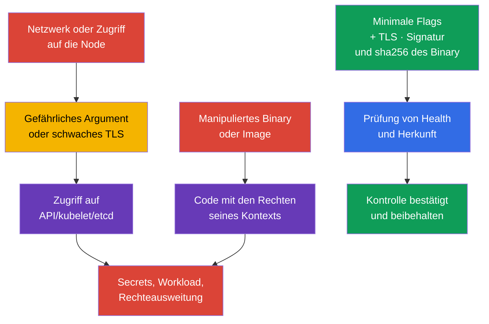
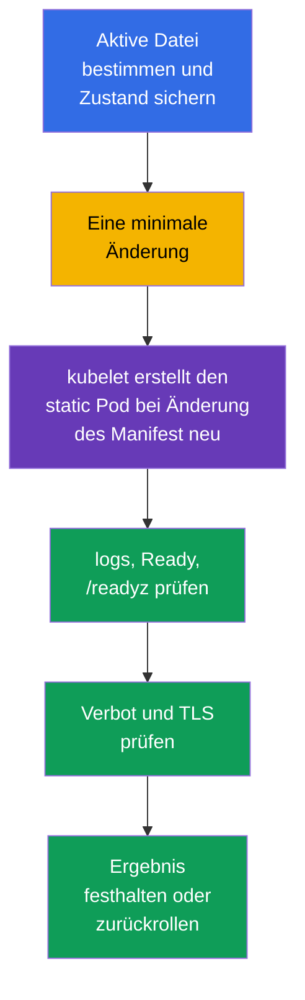

[Русская версия](ru.md) · [Eng version](README.md) · [Versión en español](es.md) · [Version française](fr.md) · [ქართული ვერსია](ge.md) · [繁體中文版](tw.md) · [日本語版](jp.md)

# Kapitel 09. Unsichere Komponentenargumente, TLS-Hardening und Binary-Verifizierung

> **Das Problem.** Ein Angreifer, der Netzwerkzugriff auf einen Endpoint des control plane oder
> die Möglichkeit erhält, eine Datei auf einer Node zu ändern, sucht keine Schwachstelle in
> Kubernetes selbst, sondern ein unsicheres Argument daneben: anonymous access, ein read-only
> kubelet port, schwaches TLS oder ein manipulierter `kubelet`/`kubectl`/Image noch vor dessen
> Ausführung. Ein einziger solcher Mangel kann Zugriff auf API/etcd öffnen oder Codeausführung
> im Kontext des manipulierten Artefakts ermöglichen. Bei einem platform binary hängen die
> Folgen vom Runtime ab: ein manipuliertes kubelet/control-plane binary erhält die Rechte des
> entsprechenden service process, und ein manipuliertes `kubectl` die Rechte des OS-Benutzers,
> der es gestartet hat, sowie Zugriff auf dessen kubeconfig/credentials.

> **Was folgt.** In Kapitel 08 haben wir den externen HTTP-Eingang mit TLS geschützt. Jetzt
> müssen die Komponenten des control plane und kubelet selbst geschützt werden: ein einziges
> unsicheres Argument kann eine anonyme API, einen diagnostischen Endpoint oder einen schwachen
> TLS-Kanal öffnen. Danach prüfen wir, dass wir wirklich die veröffentlichten Kubernetes-Binaries
> ausführen. Dies ist die Domain **Cluster Setup** (CKS, 15%).

> **Was Sie aus CKA benötigen.** Der Aufbau des control plane, kubeadm und static Pod werden in
> [Kapitel 35 der CKA](../../../cka/course/35/de.md) behandelt, und die Angriffsfläche der
> Kubernetes-Komponenten in [Kapitel 02 der CKA](../../../cka/course/02/de.md). Hier wird deren
> Grundkonfiguration nicht wiederholt: Wir suchen gefährliche Argumente, ändern die aktive
> Konfiguration sicher und weisen das Ergebnis nach.

> 🧠 Der Schutz wird durch den active runtime state bestimmt, nicht durch eine Zeile in einer Vorlage, einen tag oder eine erwartete Version.

## 09.1. Bedrohungsmodell: Flag oder Artefakt als Einstiegspunkt

Der control plane trifft Entscheidungen für den gesamten Cluster. `kube-apiserver` erteilt und
prüft Zugriff auf die API, `kubelet` startet Pods auf einer Node, und `etcd` speichert Secrets,
RBAC und den gewünschten Zustand. Deshalb hat ein schwacher Parameter eine größere Wirkung als
der Fehler einer einzelnen Anwendung.

Eine typische Angriffskette sieht so aus: Ein Angreifer erhält Netzwerkzugriff auf einen Endpoint
oder die Möglichkeit, eine Datei auf einer Node zu ändern; er nutzt anonymous access, einen
read-only kubelet port, `AlwaysAllow` oder profiling; er liest Daten oder führt eine Aktion mit
fremden Rechten aus. Ein alternativer Weg besteht darin, ein Artefakt vor der Ausführung zu
manipulieren. Ein manipuliertes kubelet oder control-plane binary läuft mit den Rechten des
entsprechenden service/host process; ein manipuliertes `kubectl` mit den Rechten des lokalen
Benutzers und dessen verfügbaren Kubernetes credentials; eine container image mit den Rechten
ihres workload security context. Deshalb wird die provenance vor der Ausführung geprüft, und die
Folgen werden anhand des tatsächlichen execution context bewertet, nicht anhand der allgemeinen
Formel „Rechte der Komponente".



Hardening ist keine Sammlung von Zeilen „für CIS". Beantworten Sie vor einer Änderung vier
Fragen: welcher Prozess den Parameter tatsächlich verwendet, wer sein Client ist, ob Zertifikate
und cipher suites kompatibel sind, wie die Verfügbarkeit geprüft wird und wie ein Rollback
erfolgt. Bei Managed Kubernetes gehört ein Teil des control plane dem Anbieter: Versuchen Sie
nicht, dessen host files zu bearbeiten, sondern prüfen Sie die Dokumentation der verfügbaren
Sicherheitseinstellungen.

> 🎯 Prüfen Sie active config und process args, korrigieren Sie die einzige effective source, starten Sie die Komponente neu und bestätigen Sie active state, Verhalten und health; bei einem Binary zusätzlich provenance und SHA-256.

## 09.2. Gefährliche Argumente: wonach suchen und warum

Nicht alle Flags sind in jeder Topologie gleich gefährlich. Wert, Listening-Adresse, Firewall,
TLS und RBAC bilden zusammen eine einzige Kontrolle. Die folgenden Einstellungen benötigen jedoch
eine ausdrückliche Begründung oder Korrektur.

| Komponente | Gefährliche Einstellung | Risiko | Sicherer Richtwert |
|---|---|---|---|
| `kube-apiserver` | breiter anonymous access | eine Anfrage ohne akzeptierte credentials kann als `system:anonymous` verarbeitet werden; bei fehlerhaftem RBAC entsteht ein Pfad für nicht authentifizierten Zugriff | ein benchmark kann `--anonymous-auth=false` verlangen; in production zuerst die health endpoints und kubeadm discovery prüfen, und in Kubernetes 1.34+ anonymous access bei Bedarf über `AuthenticationConfiguration` einschränken |
| `kube-apiserver` | `--authorization-mode=AlwaysAllow` oder hinzugefügtes `AlwaysAllow` | jede authentifizierte Anfrage besteht authorization | bei kubeadm üblicherweise `Node,RBAC` |
| `kube-apiserver` | `--profiling=true` | profiling kann den Prozesszustand offenlegen und wird an einer öffentlichen Grenze nicht benötigt | `--profiling=false` |
| `kube-apiserver` | legacy `--insecure-port`/`--insecure-bind-address` | API ohne TLS und authentication | nicht aktivieren; in modernem Kubernetes sind diese legacy-Optionen entfernt |
| `kubelet` | `--read-only-port` ungleich `0` | ein nicht authentifizierter endpoint kann Pod- und Node-Daten offenlegen | `--read-only-port=0` oder `readOnlyPort: 0` |
| `kubelet` | `--anonymous-auth=true` | ein anonymer Client gelangt an die kubelet API | `--anonymous-auth=false` oder ein Feld der config API |
| `kubelet` | `--authorization-mode=AlwaysAllow` | jeder authentifizierte Client erhält zu weiten Zugriff auf die kubelet API | `--authorization-mode=Webhook` |
| `kubelet` | `--protect-kernel-defaults=false` | bei einer Abweichung vom baseline endet kubelet nicht fail-fast und kann versuchen, host-level kernel flags auf die erwarteten Werte zu ändern | `--protect-kernel-defaults=true` nach Prüfung der sysctl |
| `kube-controller-manager` | `--profiling=true` oder `--use-service-account-credentials=false` | unnötige Diagnostik oder Verwendung breiter credentials statt separater SA | `--profiling=false`, separate service account credentials |
| `kube-scheduler` | profiling aktiviert oder endpoint auf breitem `--bind-address` | ein diagnostischer endpoint wird für ein unnötiges Netzwerk zugänglich | `enableProfiling: false`; das deprecated CLI `--profiling` und die kube-bench-Einschränkung für den config-basierten scheduler werden in [Kapitel 07](../07/de.md) behandelt |
| `etcd` | `--client-cert-auth=false`, unsicheres `--listen-client-urls` | ein Client ohne mTLS oder ein externes Netzwerk erhält Zugriff auf den Cluster-Speicher | mTLS, localhost/internes Netzwerk, Firewall |

Für eine konkrete CIS/CKS-Aufgabe kann ein benchmark ausdrücklich `--anonymous-auth=false`
verlangen; dann erfüllen Sie genau die Anforderung der Aufgabe und weisen das Ergebnis nach.

Wenden Sie diese Korrektur in production mit kubeadm nicht mechanisch an. Das standardmäßige
token-basierte `kubeadm join` nutzt das öffentliche Lesen von `kube-public/cluster-info` durch die
Gruppe `system:unauthenticated`, sodass das vollständige Deaktivieren von anonymous
authentication den discovery lifecycle verändert. Prüfen Sie außerdem die health probes von
`kube-apiserver`, falls diese auf anonymous health endpoints zugreifen.

In Kubernetes 1.34+ können Sie `AuthenticationConfiguration` verwenden, um anonymous access nur
für ausdrücklich benötigte endpoints zuzulassen. Wird der öffentliche `cluster-info` nicht mehr
benötigt, migrieren Sie zunächst join/discovery auf eine geeignete Alternative und entfernen Sie
diesen Zugriff erst danach. Eine separate Datei, die über
`--authentication-config=<path>` und das entsprechende Mount in den static Pod eingebunden ist,
kann zum Beispiel enthalten:

```yaml
apiVersion: apiserver.config.k8s.io/v1
kind: AuthenticationConfiguration
anonymous:
  enabled: true
  conditions:
  - path: /livez
  - path: /readyz
  - path: /healthz
```

Belassen Sie anonymous access nur für `/livez`, `/readyz` und `/healthz`, funktioniert das
gewöhnliche token-basierte `kubeadm join` über den öffentlichen `cluster-info` nicht mehr. Das ist
nur zulässig, wenn der lifecycle der Node-Aufnahme auf einen anderen discovery mechanism
umgestellt wurde.

Ist in `AuthenticationConfiguration` das Feld `anonymous` gesetzt, kann `--anonymous-auth` nicht
gleichzeitig verwendet werden. Die endpoint-scoped Variante lässt keinen benchmark bestehen, der
ausdrücklich `--anonymous-auth=false` verlangt; wählen und dokumentieren Sie das für Ihren Cluster
passende Modell.

Inventarisieren Sie zuerst die aktiven Parameter, nicht nur die Vorlagendatei. Suchen Sie nach
Duplikaten: Welcher Wert der letzte oder tatsächlich verwendete ist, hängt von der Implementierung
ab, und widersprüchliche Flags erschweren die Diagnose. Liefert `kube-bench` (Kapitel 07) bereits
einen konkreten Befund, verwenden Sie dessen remediation als Quelle für das exakte Flag und die
Datei; TLS-spezifische Parameter (`--tls-min-version`, `--tls-cipher-suites`) werden unten
getrennt in 09.4-09.5 behandelt.

`--enable-debugging-handlers` von kubelet wird ebenfalls nach Risiko bewertet: Es aktiviert
diagnostische handlers, deren benötigte Teile `kubectl logs`, `exec` und `port-forward` nutzen
können. Deaktivieren Sie es nicht blind. Bestimmen Sie zuerst die benötigten Operationen und
schützen Sie die kubelet API auf `10250` mit authentication + `Webhook`-authorization.

Beschränken Sie den Netzwerkzugriff auf `10250` auf Ebene der Node oder Infrastruktur: host
firewall, cloud security group/ACL oder CNI-spezifische host policy. Verlassen Sie sich nicht auf
eine gewöhnliche Kubernetes `NetworkPolicy` als übertragbare Kontrolle für den kubelet endpoint:
Das ist host/node traffic, und das Verhalten von NetworkPolicy für `hostNetwork` und node IP hängt
von der CNI-Implementierung ab. Dieselbe Regel gilt für Metriken: profiling und metrics sind
unterschiedliche endpoints.

## 09.3. Wo die Konfiguration ändern und wie sicher neu starten

Der allgemeine Prozess für die sichere Bearbeitung eines static Pod des control plane (backup,
minimale Änderung, health-Prüfung, Wiederherstellung nach einem Fehler) wird in Kapitel 07
behandelt - hier wird er nicht wiederholt, sondern durch eine für dieses Kapitel spezifische
Technik sowie durch Nuancen der discovery-Konfiguration von kubelet/scheduler/controller-manager
ergänzt, die besonders für die TLS- und cipher-Änderungen unten in 09.4 wichtig sind.

Kubelet ist kein static Pod: Seine Konfiguration befindet sich üblicherweise in
`/var/lib/kubelet/config.yaml`, und zusätzliche Argumente in
`/var/lib/kubelet/kubeadm-flags.env` und einem systemd drop-in. In Kubernetes 1.36 suchen Sie
außerdem nach `--config-dir`: kubelet wendet zuerst die Basis-config an und danach nur die
drop-in-Dateien `*.conf` (einschließlich Unterverzeichnisse) aus diesem Verzeichnis, in lexikalischer
Reihenfolge; `*.yaml` darin werden ignoriert. In Kubernetes 1.36 fügt kubelet die Quellen in
folgender Reihenfolge zusammen: CLI feature gates haben die niedrigste Priorität, danach wird die
Basis-config angewendet, danach `*.conf` aus `--config-dir`, und die übrigen CLI arguments haben
die höchste Priorität. Für die gewöhnlichen Parameter dieses Kapitels kann ein CLI-Flag daher
YAML/drop-in überschreiben, übertragen Sie diese Regel aber nicht auf `--feature-gates`.

Ermitteln Sie die tatsächlichen `--config`, `--config-dir` und CLI arguments über
`systemctl cat kubelet` und die tatsächliche process command line. Legen Sie einen gewöhnlichen
Parameter nicht ohne Notwendigkeit gleichzeitig in mehreren Quellen fest.

Prüfen Sie für scheduler zuerst, ob `--config=<path>` gesetzt ist:
`KubeSchedulerConfiguration` kann dessen effective source sein, und ein Teil der legacy CLI flags
ist bei vorhandenem `--config` deprecated/ignored. So ist zum Beispiel `--profiling` des scheduler
deprecated; in component config wird `enableProfiling: false` geprüft.

Für `kube-controller-manager` gibt es in Kubernetes 1.36 keine allgemeine Option `--config`
äquivalent zu scheduler: Dessen Arbeitsparameter werden weiterhin über CLI flags im active
manifest / in den process args festgelegt. `KubeControllerManagerConfiguration` existiert als API
für component configuration und interne/configz-Darstellung, ist aber keine allgemeine externe
`--config`-Datei von kube-controller-manager.

Bestimmen Sie daher zuerst den Runtime der konkreten Komponente und prüfen Sie dann genau die von
ihr unterstützte active source.



Eine zusätzliche Technik für static Pod des control plane ist atomic rename über einen hidden
candidate im selben watched directory. Sie ist zuverlässiger als das gewöhnliche backup+edit dort,
wo es wichtig ist, den Cluster nicht einmal für den Moment eines Fehlers im zwischenzeitlichen YAML
ohne API zu lassen:

```bash
# 1. Einen hidden candidate im watched directory selbst erstellen; kubelet ignoriert Dateien,
# deren Name mit einem Punkt beginnt, sodass der Pod nicht neu erstellt wird, bis der atomare
# Austausch erfolgt.
# /etc/kubernetes/manifests kann ein separater Mount sein: Wird der candidate in
# /etc/kubernetes erstellt, wird mv zwischen verschiedenen filesystem zu copy+unlink und
# ist kein atomic rename mehr.
sudo install -d -m 700 /root/k8s-manifest-backup
CANDIDATE=$(sudo mktemp /etc/kubernetes/manifests/.kube-apiserver.yaml.candidate.XXXXXX)
sudo cp -p /etc/kubernetes/manifests/kube-apiserver.yaml "$CANDIDATE"
sudo cp -p /etc/kubernetes/manifests/kube-apiserver.yaml \
  /root/k8s-manifest-backup/kube-apiserver.yaml.$(date +%F-%H%M%S)
sudoedit "$CANDIDATE"

# 2. Die YAML/API-Struktur des candidate tatsächlich prüfen, ohne den laufenden static Pod zu berühren.
sudo kubectl apply --dry-run=client --validate=strict -f "$CANDIDATE"

# 3. Erst nach erfolgreicher Prüfung das watched manifest atomar ersetzen.
# Candidate und target befinden sich im selben directory und auf demselben Dateisystem,
# daher ist rename garantiert atomar.
sudo mv -f "$CANDIDATE" /etc/kubernetes/manifests/kube-apiserver.yaml

# 4. Die Neuerstellung von der Node-Konsole aus beobachten, dann die API prüfen.
watch -n 2 'sudo crictl ps -a --name kube-apiserver'
kubectl get --raw='/readyz?verbose'
kubectl get nodes

# Wenn der static Pod nicht startet, zuerst die kubelet- und runtime-logs lesen.
sudo journalctl -u kubelet -n 100 --no-pager
sudo crictl ps -a --name kube-apiserver
sudo crictl logs "$(sudo crictl ps -aq --name kube-apiserver | head -n1)"
```

Bewahren Sie dauerhafte backup-Dateien trotzdem außerhalb von `/etc/kubernetes/manifests/` auf
(wie in Schritt 1 oben): der hidden candidate wird nur für die Dauer des Austauschs selbst benötigt,
nicht als langfristige Kopie.

Prüfen Sie bei kubelet zuerst die sysctl-Werte und die Konfiguration, und starten Sie danach nur
es neu. Ein gewöhnliches `systemctl restart kubelet` stoppt für sich genommen nicht bereits
laufende Pods und Container: Der container runtime führt sie weiter aus, und kubelet stellt nach
dem Start reconciliation wieder her. Ändern Sie kubelet auf dem control-plane dennoch Node für
Node und kontrollieren Sie den Node heartbeat, die kubelet-logs und `/readyz`: Ein
Konfigurationsfehler kann die Node in `NotReady` belassen oder die weitere Verwaltung von static
Pod verhindern.

```yaml
# /var/lib/kubelet/config.yaml - Beispiel eines Fragments der Konfigurations-API.
readOnlyPort: 0
authentication:
  anonymous:
    enabled: false
authorization:
  mode: Webhook
protectKernelDefaults: true
```

```bash
sudo systemctl restart kubelet
sudo systemctl --no-pager --full status kubelet
sudo journalctl -u kubelet -n 100 --no-pager
check_kubelet_10255() {
  local listeners

  if ! listeners="$(sudo ss -H -lntp 'sport = :10255')"; then
    echo 'ERROR: cannot inspect listening TCP sockets; port 10255 is not verified' >&2
    return 1
  fi

  if [[ -n "$listeners" ]]; then
    printf '%s\n' "$listeners"
    echo 'FAIL: kubelet read-only port 10255 is listening' >&2
    return 1
  fi

  echo 'PASS: kubelet read-only port 10255 is closed'
}
check_kubelet_10255
kubectl get nodes

# Ergebnis nach base config, *.conf drop-ins und CLI overrides; benötigt autorisierten Zugriff.
NODE="${NODE:?set target node name from kubectl get nodes}"
kubectl get --raw "/api/v1/nodes/${NODE}/proxy/configz" \
  | jq '.kubeletconfig | {readOnlyPort, authentication, authorization, protectKernelDefaults}'
```

## 09.4. TLS-Hardening für apiserver, kubelet und etcd

TLS schützt bereits den Kanal, aber die Version und die Menge der cipher suites bestimmen, welche
kryptografischen Varianten ein Client überhaupt aushandeln kann. Das Zulassen veralteter Protokolle
oder schwacher Chiffren erleichtert Downgrade und die Verwendung veralteter Kryptografie. Ein
Minimum von `TLS 1.2` ist meist mit modernen Kubernetes-Clients kompatibel; `TLS 1.3` schränkt
Clients stärker ein und erfordert eine separate Prüfung des gesamten control plane, der automation
und des monitoring.

Moderne Go- und Kubernetes-Defaults schließen veraltete Protokolle und unsichere suites bereits
aus; eine universelle „kurze sichere Liste" gibt es nicht. Übertragen Sie keine zufällige kurze
Liste zwischen Komponenten oder Versionen. Verlangt die Policy der Organisation oder ein konkretes
CIS profile eine genehmigte Liste, wenden Sie genau diese nach dem inventory von Zertifikaten und
Clients an, statt die Liste dem hardening baseline entgegenzustellen. Eine RSA-only-Liste ist kein
sicherer default: Sie bricht einen endpoint mit ECDSA-Zertifikat und schränkt die Kompatibilität
unnötig ein. TLS-1.3-suites in Go werden üblicherweise nicht durch `--tls-cipher-suites`
gesteuert: Sie werden von der TLS-Implementierung gewählt, weshalb dieses Flag hauptsächlich
TLS 1.2 und älter betrifft.

> 🔬 Das Pinning von cipher suites und TLS 1.3 erfordert eine genehmigte policy, ein inventory der Clients und den Abgleich der Werte mit der Version der Komponente.

Für Kubernetes-Komponenten haben die zulässigen String-Werte des Flags üblicherweise die Form
`VersionTLS12` und `VersionTLS13`. Bei etcd hängt der Name des Werts von der etcd-Version ab: Die
aktuelle help verwendet häufig `TLS1.2`/`TLS1.3`. Übertragen Sie keinen Wert zwischen Programmen
nach Vermutung - prüfen Sie vor der Änderung `--help` genau des laufenden binary dieser Version,
nicht die Dokumentation aus dem Gedächtnis oder aus einem anderen Release.

In der Prüfung erhalten Sie die exakte Liste der Flags und zulässigen Werte am schnellsten vom
tatsächlich laufenden Prozess selbst, nicht durch Suche im Web - die Dokumentationsseite der
benötigten Version kann nicht verfügbar sein oder Zeit für die Suche kosten. Läuft die Komponente
in einem static Pod und ihr container befindet sich im Zustand `Running`, können Sie zuerst
`kubectl exec` verwenden. `Ready=False` allein verbietet exec nicht: Für exec sind ein running
container und ein verfügbarer API/RBAC/streaming-Pfad wichtig. Readiness bestimmt den
`Ready`-State des Pod, wird bei der Aufnahme eines Pod in den Service traffic verwendet und ist an
der availability/rollout-Semantik von workload controllers beteiligt, ist aber kein gate für
`kubectl exec`. Ist der API/RBAC/streaming-Pfad für `kubectl exec` nicht verfügbar, die Komponente
läuft jedoch tatsächlich als CRI container, verwenden Sie `crictl exec` mit der konkreten
container ID.

Läuft die Komponente als separater host-`systemd`-service, ist `crictl exec` nicht anwendbar:
Ermitteln Sie das executable aus dem aktiven Prozess oder `ExecStart` und rufen Sie dessen
`--help` direkt auf der Node auf.

```bash
# Static Pod / mirror Pod: der container muss Running sein (Ready ist nicht erforderlich).
kubectl -n kube-system exec kube-apiserver-<node> -- kube-apiserver --help 2>&1 \
  | grep -A2 -- '--tls-min-version\|--tls-cipher-suites'

kubectl -n kube-system exec etcd-<node> -- etcd --help 2>&1 \
  | grep -A2 -- '--cipher-suites\|--tls-min-version'

# Fallback nur, wenn etcd tatsächlich als CRI container läuft.
CID="$(sudo crictl ps -q --name etcd | head -n1)"
if [[ -n "$CID" ]]; then
  sudo crictl exec "$CID" etcd --help 2>&1 \
    | grep -A2 -- '--tls-min-version'
fi

# Ist etcd ein separater host/systemd-Prozess, das executable dieses Prozesses verwenden.
PID="$(pgrep -xo etcd)"
if [[ -n "$PID" ]]; then
  sudo "/proc/${PID}/exe" --help 2>&1 \
    | grep -A2 -- '--tls-min-version'
fi
```

Die Ausgabe von `--help` zeigt den exakten Namen des Flags und bei den meisten Versionen eine
kurze Beschreibung mit den zulässigen Werten neben dem Flag. Es ist dasselbe binary und dieselbe
Version, die tatsächlich im Cluster läuft, daher entstehen keine Abweichungen zur Dokumentation
eines anderen Release, und es geht keine Zeit für den Wechsel in den Browser verloren.

Der Nachweis für die benchmark-Anforderung „etcd akzeptiert nicht weniger als TLS 1.2" sind der
aktive `--tls-min-version` und ein geprüfter handshake, nicht eine beliebige RSA-only cipher-Liste;
prüfen Sie die exakte Formulierung und Version des angewendeten benchmark.

```yaml
# /etc/kubernetes/manifests/kube-apiserver.yaml, Fragment von command.
# Moderne Go-Defaults belassen die suites ohne ausdrückliches Pinning.
- kube-apiserver
- --tls-min-version=VersionTLS12
# --tls-cipher-suites nur bei genehmigter policy/Kompatibilität hinzufügen.
# Verlangt die policy eine Liste, sowohl ECDSA- als auch RSA-suites einschließen, die für Ihre Zertifikate nötig sind:
# - --tls-cipher-suites=TLS_ECDHE_ECDSA_WITH_AES_128_GCM_SHA256,TLS_ECDHE_ECDSA_WITH_AES_256_GCM_SHA384,TLS_ECDHE_RSA_WITH_AES_128_GCM_SHA256,TLS_ECDHE_RSA_WITH_AES_256_GCM_SHA384
```

Für kubelet wird dessen config API bevorzugt; übergibt die Installation Parameter über systemd,
verwenden Sie die äquivalenten Flags in der einzigen aktiven Quelle. Ebenso wird `tlsCipherSuites`
unbesetzt gelassen, solange keine dokumentierte policy dies verlangt.

```yaml
# /var/lib/kubelet/config.yaml, Fragment; die Unterstützung exakter Felder hängt von der kubelet-Version ab.
tlsMinVersion: VersionTLS12
```

```yaml
# /etc/kubernetes/manifests/etcd.yaml, Beispiel für etcd, das den Wert TLS1.2 akzeptiert.
# --cipher-suites wird nicht hinzugefügt: Go-Defaults sind sicher, sofern die policy nichts anderes verlangt.
- etcd
- --tls-min-version=TLS1.2
```

Beschränken Sie TLS nicht nur auf den server endpoint. etcd hat client- und peer-traffic, und
apiserver hat Clients wie kubelet, controller-manager, scheduler, kubectl, webhooks und
automation. Sammeln Sie zuerst die tatsächlichen certificates/keys, Listening-Adressen und Clients;
wenden Sie die Änderung dann auf einer Test- oder einer einzelnen HA-Node an. Beim Übergang zu
`VersionTLS13` erwarten Sie, dass ein alter TLS-1.2-Client abgelehnt wird - das ist kein Beweis für
einen Serverfehler, erfordert aber einen Migrationsplan für den Client.

Die Prüfung des TLS-Minimums muss zwei verschiedene Dinge umfassen:

1. protocol evidence - die zulässige Version wird erfolgreich ausgehandelt, und eine Version
   unter dem festgelegten minimum wird abgelehnt;
2. application health - die Komponente bleibt nach der Änderung funktionsfähig.

Für apiserver genügt es, den handshake auf `6443` zu prüfen; bei kubelet erfordert `10250` oft ein
client certificate und authorization nach dem handshake; bei etcd beweist
`etcdctl endpoint health` nur application health, daher prüfen Sie den protocol handshake separat
über `openssl s_client`. Geben Sie keinen private key im Terminal aus und kopieren Sie keine PKI
von der Node.

Stellen Sie vor dem negative test sicher, dass der verwendete TLS-Client tatsächlich in der Lage
ist, die getestete legacy-Protokollversion anzubieten. Modernes OpenSSL oder die crypto policy des
Systems können TLS 1.1 selbst verbieten. Lehnt der Client TLS 1.1 lokal ab, beweist dieses
Ergebnis nicht das server-seitige `tls-min-version`. Ein negative test gilt nur dann als Beweis,
wenn erkennbar ist, dass der Client versucht hat, das legacy protocol auszuhandeln, und die
Ablehnung vom geprüften endpoint kam. Diese Regel gilt gleichermaßen für apiserver, kubelet und
etcd.

```bash
# apiserver, positive test: TLS 1.2 muss erfolgreich ausgehandelt werden.
# Adresse und SNI durch die Werte Ihres Clusters ersetzen.
export API=127.0.0.1:6443
OUT="$(mktemp)"

if openssl s_client \
    -connect "$API" \
    -servername kubernetes \
    -tls1_2 \
    -CAfile /etc/kubernetes/pki/ca.crt \
    -verify_return_error \
    </dev/null >"$OUT" 2>&1
then
  if grep -Eq 'Cipher is \(NONE\)|Cipher[[:space:]]*:[[:space:]]*0000' "$OUT"; then
    cat "$OUT"
    rm -f "$OUT"
    echo 'FAIL: TLS 1.2 handshake has no negotiated cipher' >&2
    exit 1
  fi
  grep -E 'Protocol|Cipher|Verify return code' "$OUT"
  echo 'PASS: TLS 1.2 handshake succeeded'
else
  cat "$OUT" >&2
  rm -f "$OUT"
  echo 'FAIL: TLS 1.2 handshake failed' >&2
  exit 1
fi
rm -f "$OUT"

# apiserver, negative test: TLS 1.1 muss vom Server abgelehnt werden.
# Ein einfaches grep nach "protocol|alert" unterscheidet keine server-seitige Ablehnung von einem
# lokalen Verbot durch OpenSSL/crypto policy vor dem Senden des ClientHello - beide Fakten müssen belegt werden.
# Als Funktion formuliert: return 1 in allen non-PASS-Zweigen, damit der exit status mit dem
# textuellen verdict übereinstimmt und automation (cmd && echo PASS, CI wrapper, $?) nicht bricht.
check_tls11_rejected() {
  local endpoint="$1"
  local servername="$2"
  local neg rc

  neg="$(mktemp)" || return 1

  # @SECLEVEL=0 schwächt nur diesen einmaligen test-client, damit modernes OpenSSL nach
  # Möglichkeit ein TLS-1.1-ClientHello bilden kann; der server ändert sich nicht.
  if openssl s_client \
      -connect "$endpoint" \
      -servername "$servername" \
      -tls1_1 \
      -cipher 'DEFAULT:@SECLEVEL=0' \
      -msg -state \
      </dev/null >"$neg" 2>&1
  then
    rc=0
  else
    rc=$?
  fi

  if grep -Eq '^>>> .*Handshake.*ClientHello' "$neg" \
     && grep -Eq '^<<< .*Alert.*fatal protocol_version|alert protocol version' "$neg"
  then
    echo 'PASS: client sent TLS 1.1 ClientHello and server rejected it with protocol_version'
    rm -f "$neg"
    return 0
  fi

  if grep -Eqi 'no protocols available|no ciphers available|unsupported protocol' "$neg" \
     && ! grep -Eq '^>>> .*Handshake.*ClientHello' "$neg"
  then
    cat "$neg" >&2
    echo 'INCONCLUSIVE: local OpenSSL/crypto policy blocked TLS 1.1 before ClientHello' >&2
    rm -f "$neg"
    return 1
  fi

  cat "$neg" >&2
  echo "INCONCLUSIVE/FAIL: server-side TLS 1.1 rejection was not proven (s_client rc=${rc})" >&2
  rm -f "$neg"
  return 1
}
check_tls11_rejected "$API" kubernetes

# etcd: zuerst den zulässigen TLS-1.2-handshake mit mTLS prüfen - dasselbe Modell
# wie für apiserver: exit status von s_client, -verify_return_error und Prüfung
# der tatsächlich ausgehandelten cipher, nicht nur Verify return code.
OUT="$(mktemp)"

if sudo openssl s_client \
    -connect 127.0.0.1:2379 \
    -tls1_2 \
    -CAfile /etc/kubernetes/pki/etcd/ca.crt \
    -cert /etc/kubernetes/pki/etcd/healthcheck-client.crt \
    -key /etc/kubernetes/pki/etcd/healthcheck-client.key \
    -verify_return_error \
    </dev/null >"$OUT" 2>&1
then
  if grep -Eq 'Cipher is \(NONE\)|Cipher[[:space:]]*:[[:space:]]*0000' "$OUT"; then
    cat "$OUT"
    rm -f "$OUT"
    echo 'FAIL: etcd TLS 1.2 handshake has no negotiated cipher' >&2
    exit 1
  fi
  grep -E 'Protocol|Cipher|Verify return code' "$OUT"
  echo 'PASS: etcd TLS 1.2 handshake succeeded'
else
  cat "$OUT" >&2
  rm -f "$OUT"
  echo 'FAIL: etcd TLS 1.2 handshake failed' >&2
  exit 1
fi
rm -f "$OUT"

# Danach negative test: TLS 1.1 darf nicht ausgehandelt werden. Dasselbe criterion wie für
# apiserver: beweisen, dass der Client ClientHello gesendet hat und der Server protocol_version zurückgab.
# Separate Funktion (nicht check_tls11_rejected): etcd erfordert mTLS client cert/key,
# die apiserver-Funktion nimmt diese nicht an. return 1 in allen non-PASS-Zweigen aus demselben Grund.
check_etcd_tls11_rejected() {
  local endpoint="$1" cacert="$2" cert="$3" key="$4"
  local neg rc

  neg="$(mktemp)" || return 1

  if sudo openssl s_client \
      -connect "$endpoint" \
      -tls1_1 \
      -cipher 'DEFAULT:@SECLEVEL=0' \
      -CAfile "$cacert" \
      -cert "$cert" \
      -key "$key" \
      -msg -state \
      </dev/null >"$neg" 2>&1
  then
    rc=0
  else
    rc=$?
  fi

  if grep -Eq '^>>> .*Handshake.*ClientHello' "$neg" \
     && grep -Eq '^<<< .*Alert.*fatal protocol_version|alert protocol version' "$neg"
  then
    echo 'PASS: client sent TLS 1.1 ClientHello and etcd rejected it with protocol_version'
    rm -f "$neg"
    return 0
  fi

  if grep -Eqi 'no protocols available|no ciphers available|unsupported protocol' "$neg" \
     && ! grep -Eq '^>>> .*Handshake.*ClientHello' "$neg"
  then
    cat "$neg" >&2
    echo 'INCONCLUSIVE: local OpenSSL/crypto policy blocked TLS 1.1 before ClientHello' >&2
    rm -f "$neg"
    return 1
  fi

  cat "$neg" >&2
  echo "INCONCLUSIVE/FAIL: etcd server-side TLS 1.1 rejection was not proven (s_client rc=${rc})" >&2
  rm -f "$neg"
  return 1
}
check_etcd_tls11_rejected 127.0.0.1:2379 \
  /etc/kubernetes/pki/etcd/ca.crt \
  /etc/kubernetes/pki/etcd/healthcheck-client.crt \
  /etc/kubernetes/pki/etcd/healthcheck-client.key

# Separat das application health von etcd prüfen.
export ETCDCTL_API=3
sudo etcdctl --endpoints=https://127.0.0.1:2379 endpoint health \
  --cacert=/etc/kubernetes/pki/etcd/ca.crt \
  --cert=/etc/kubernetes/pki/etcd/healthcheck-client.crt \
  --key=/etc/kubernetes/pki/etcd/healthcheck-client.key

# Desired source: das manifest enthält tatsächlich die erwartete Änderung.
sudo grep -nE -- '--(tls-min-version|tls-cipher-suites|cipher-suites)' \
  /etc/kubernetes/manifests/{kube-apiserver,etcd}.yaml

# Active runtime: das manifest ist nur die desired source, die kubelet periodisch liest;
# argv der tatsächlich laufenden Prozesse auf dieser Node lesen.
for PROC in kube-apiserver etcd; do
  PID="$(pgrep -xo "$PROC")" || {
    echo "ERROR: running process not found: $PROC" >&2
    continue
  }
  echo "=== active argv: $PROC (pid=$PID) ==="
  sudo cat "/proc/${PID}/cmdline" \
    | tr '\0' '\n' \
    | grep -E -- '--(tls-min-version|tls-cipher-suites|cipher-suites)' \
    || echo "INFO: matching TLS flag is absent from active argv of $PROC"
done

# Danach behavioral TLS tests und health.
kubectl get --raw='/readyz?verbose'
kubectl get nodes
```

| Symptom nach der Änderung | Wahrscheinliche Ursache | Prüfung und Aktion |
|---|---|---|
| apiserver startet nicht | Tippfehler im YAML, nicht unterstütztes Flag oder cipher | `journalctl -u kubelet`, `crictl logs`; das letzte working manifest wiederherstellen |
| Client erhält protocol version | Client ist älter als das festgelegte minimum | Client aktualisieren oder vorübergehend ein abgestimmtes Minimum über eine genehmigte Ausnahme wählen |
| TLS handshake schlägt bei TLS 1.2 fehl | certificate key algorithm ist mit den zulässigen cipher suites nicht kompatibel | `openssl x509 -text` prüfen, passende ECDSA/RSA-suites hinzufügen |
| etcd ist nicht healthy | peer/client kann TLS nicht aushandeln oder hat den Zugriff auf den key verloren | alle Mitglieder-endpoints mit mTLS prüfen, etcd-logs, Rollback einer Node |
| `openssl` zeigt einen TLS-1.3-cipher außerhalb der Liste | TLS-1.3-ciphers werden von der TLS-Bibliothek gesteuert | minimum version und Dokumentation der Version prüfen, nicht als Umgehung des Flags betrachten |

## 09.5. Verifizierung von Kubernetes Platform Binaries: Signatur und sha256

HTTPS beim Download schützt den Transport, beweist aber nicht, wer die Datei veröffentlicht hat.
SHA-256 prüft die **Integrität**: Das heruntergeladene binary entspricht genau den Bytes, die
durch den gewählten digest beschrieben werden. Das ist kein Beweis für provenance: Ein Hash, der
zusammen mit der Datei aus derselben nicht vertrauenswürdigen Quelle bezogen wird, oder ein nicht
genehmigtes baseline schafft kein Vertrauen.

Beziehen Sie für Kubernetes den versionsspezifischen offiziellen release artifact. Kubernetes
veröffentlicht eine keyless cosign signature und ein certificate neben dem binary; `verify-blob`
prüft die Signatur und die Bindung des certificate an die erwarteten identity und den OIDC issuer,
also die Herkunft des release. Prüfen Sie identity und issuer ausdrücklich, statt ein beliebiges
Zertifikat zu akzeptieren. Legen Sie die Version in einer Variable fest: `latest` lässt sich nicht
zuverlässig reproduzieren.

```bash
export K8S_VERSION=v1.36.0
export ARCH=amd64
export BIN=kubectl
export BASE="https://dl.k8s.io/release/${K8S_VERSION}/bin/linux/${ARCH}"

# Das binary und die veröffentlichte keyless signature/certificate aus dem versionsspezifischen release beziehen.
for FILE in "${BIN}" "${BIN}.sig" "${BIN}.cert" "${BIN}.sha256"; do
  curl -fsSL --retry 3 --retry-delay 3 "${BASE}/${FILE}" -o "${FILE}"
done

# Offizielle Werte der Kubernetes Release Engineering für binary artifacts.
# cosign 2+ verlangt beide Einschränkungen; entfernen Sie diese nicht, um eine „erfolgreiche" Prüfung zu erreichen.
cosign verify-blob "${BIN}" \
  --signature "${BIN}.sig" \
  --certificate "${BIN}.cert" \
  --certificate-identity krel-staging@k8s-releng-prod.iam.gserviceaccount.com \
  --certificate-oidc-issuer https://accounts.google.com

# SHA-256 ist eine zusätzliche Prüfung der Byte-Gleichheit mit dem genehmigten release digest.
printf '%s  %s\n' "$(tr -d '[:space:]' < "${BIN}.sha256")" "${BIN}" > "${BIN}.sha256sum"
sha256sum --check "${BIN}.sha256sum"
# kubectl: OK

# Für eine bereits installierte Datei den beobachteten digest ermitteln und mit dem approved inventory abgleichen.
sha256sum /usr/bin/kubelet
```

Somit liefern signature/certificate mit den erwarteten identity/issuer die provenance, während
der checksum die integrity gegenüber dem vertrauenswürdigen release digest liefert. Kubernetes
veröffentlicht außerdem signierte SBOM (SPDX), aber image digest pinning, die Signatur von
container image, SBOM und admission policy gehören zur Domain **Supply Chain Security (20%)**,
nicht zu Cluster Setup dieses Kapitels. Die Praxis dieser Kontrollen finden Sie in den
[Kapiteln 24-28](../24/de.md); hier prüfen wir nur release artifacts und binaries der Kubernetes-
Plattform selbst.

Detaillierte Prüfungen von container image, einschließlich digest, signing und SBOM, werden hier
absichtlich nicht dupliziert: Das ist Supply Chain Security, siehe [Kapitel 24-28](../24/de.md).

## 09.6. Praktisches Szenario: Manipulation vor Schaden erkennen

Stellen Sie sich vor, auf einem worker landet ein `kubelet`, das nach dem Herunterladen manipuliert
wurde. Eine gewöhnliche Prüfung mit `kubelet --version` entdeckt das Problem nicht: Ein bösartiges
binary kann die erwartete Version zurückgeben.

Sichern Sie zuerst die beobachteten Hashes, gleichen Sie sie mit dem genehmigten release manifest
ab und führen Sie evidence/provenance/baseline/authorized-change triage durch, bevor Sie ein
containment wählen. „Korrigieren" Sie einen mismatch nicht, indem Sie den Referenz-Hash ändern: Bei
einer unbestätigten Änderung oder anderen Anzeichen einer Manipulation eskalieren Sie gemäß dem
incident runbook.

```bash
# 1. Evidence auf der Node sichern, bevor die Datei ersetzt wird.
sudo sha256sum /usr/bin/kubelet | sudo tee /root/kubelet.sha256.observed
sudo stat -c '%y %s %U:%G %a %n' /usr/bin/kubelet
sudo systemctl cat kubelet

# 2. Den observed hash mit dem genehmigten release digest aus dem trusted inventory vergleichen.
# Format des inventory: '<digest>  /usr/bin/kubelet'. Der Befehl liefert bei Abweichung FAIL.
sudo sha256sum --check /root/approved-kubelet.sha256

# Die weitere Prüfung von imageID/digest gemäß dem supply-chain-Verfahren der Kapitel 24-28 durchführen.
```

Ein `sha256sum --check` mit `FAILED` ist ein Signal zum Untersuchen, beweist aber für sich genommen
keine Kompromittierung und gibt nicht die einzige Antwort „isolieren" vor. Sichern Sie zuerst
evidence und führen Sie triage durch: (1) bestätigen Sie Pfad, Version und das erwartete approved
baseline und schließen Sie einen Fehler im inventory oder die Aktualisierung der falschen Datei
aus; (2) prüfen Sie die provenance des release über `cosign verify-blob` mit den erwarteten
certificate identity/issuer und gleichen Sie package/release metadata ab; (3) finden Sie den
authorized change - change record, rollout, package-manager- und CI-logs - und gleichen Sie Zeit,
Eigentümer und digest ab; (4) vergleichen Sie mit dem vorherigen bekannten guten baseline und dem
scope auf anderen Nodes. „Korrigieren" Sie einen mismatch nicht, indem Sie den Referenz-Hash
ändern.

Bestätigt die evidence keinen authorised change, stimmen provenance/baseline nicht überein, oder
gibt es andere Anzeichen einer Manipulation, eskalieren Sie gemäß dem incident runbook: Stoppen Sie
die weitere Ausbreitung, wenden Sie ein angemessenes containment an (bis hin zu cordon/drain oder
Isolierung der Node), sichern Sie logs und ersetzen Sie die Node oder das binary kontrolliert. Ein
einzelner Hash meldet zuverlässig, dass die erwarteten Bytes nicht übereinstimmen, erklärt aber
nicht die Ursache oder den Weg der Änderung. Die Reaktion auf container image und
registry/CI-evidence gehört zu den supply-chain-Verfahren der Kapitel 24-28.

## 09.7. Ergebnisprüfung und Diagnose

Nach jeder Änderung werden Nachweise auf drei Ebenen benötigt: aktive Konfiguration, tatsächliches
Verhalten und die Gesundheit des Clusters. Das Vorhandensein einer Zeile in einer nicht verwendeten
Datei ist keine Prüfung.

```bash
# 1a. Desired source des control plane: für den kubeadm-Standard staticPodPath.
# Wurde staticPodPath geändert, das tatsächlich aktive Verzeichnis verwenden.
STATIC_POD_DIR=/etc/kubernetes/manifests
sudo grep -nE -- \
  '--(anonymous-auth|authorization-mode|profiling|tls-min-version|cipher-suites)' \
  "${STATIC_POD_DIR}"/{kube-apiserver,kube-controller-manager,kube-scheduler,etcd}.yaml

# 1b. Active runtime argv der control-plane-Prozesse: das manifest ist nur desired source,
# die kubelet periodisch liest, kein Beweis für einen neu erstellten Pod.
sudo ps -ww -eo pid,args \
  | grep -E '[k]ube-apiserver|[k]ube-controller-manager|[k]ube-scheduler|[e]tcd'

# Für einen konkreten Parameter bei Bedarf argv ohne truncation abrufen:
APIPID="$(pgrep -xo kube-apiserver)" || {
  echo 'ERROR: kube-apiserver process not found' >&2
  false
}
sudo cat "/proc/${APIPID}/cmdline" | tr '\0' '\n'

# 1c. Kubelet: zuerst die tatsächlichen startup sources anzeigen, den Pfad nicht raten.
sudo systemctl cat kubelet
sudo ps -ef | grep '[k]ubelet'

# 1d. Endgültige actuated KubeletConfiguration nach base config, --config-dir und overrides.
NODE="${NODE:?set target node name from kubectl get nodes}"
kubectl get --raw "/api/v1/nodes/${NODE}/proxy/configz" \
  | jq '.kubeletconfig | {
      readOnlyPort,
      authentication,
      authorization,
      protectKernelDefaults,
      tlsMinVersion,
      tlsCipherSuites
    }'
```

Manifest und runtime werden separat geprüft: Das manifest belegt die desired source, und die
process command line, dass der static Pod tatsächlich mit dem neuen argv neu erstellt wurde. Liest
eine Komponente zusätzliche component config über `--config`, prüfen Sie separat auch die aktive
config-Datei/den effective endpoint der Komponente; ein bloßes argv genügt in diesem Fall ebenfalls
nicht.

Ist `/configz` aufgrund von Berechtigungen oder topology nicht verfügbar, kehren Sie nicht zur
hartkodierten `/var/lib/kubelet/config.yaml` zurück: Ermitteln Sie die tatsächlichen `--config` und
`--config-dir` aus unit/process, lesen Sie genau diese und berücksichtigen Sie danach die
gewöhnlichen CLI overrides.

```bash
# 2. Verhalten: der read-only kubelet port ist geschlossen. Die Funktion check_kubelet_10255 (siehe §09.3)
# liefert 1 in allen non-PASS-Zweigen, damit der exit status mit dem textuellen verdict übereinstimmt.
check_kubelet_10255() {
  local listeners

  if ! listeners="$(sudo ss -H -lntp 'sport = :10255')"; then
    echo 'ERROR: cannot inspect listening TCP sockets; port 10255 is not verified' >&2
    return 1
  fi

  if [[ -n "$listeners" ]]; then
    printf '%s\n' "$listeners"
    echo 'FAIL: kubelet read-only port 10255 is listening' >&2
    return 1
  fi

  echo 'PASS: kubelet read-only port 10255 is closed'
}
check_kubelet_10255
```

Bestätigen Sie das TLS-Minimum mit den positive/negative protocol tests aus §09.4. Wiederholen Sie
nicht das vereinfachte `openssl ... -tls1_1 | grep ...` ohne Prüfung der Fähigkeiten des lokalen
Clients: Modernes OpenSSL oder die crypto policy des Systems können TLS 1.1 selbst verbieten, und
ein solcher Test lässt einen false positive zu.

```bash
# 3. Health: API, Nodes und static Pod sind in den funktionsfähigen Zustand zurückgekehrt.
kubectl get --raw='/readyz?verbose'
kubectl get nodes
kubectl -n kube-system get pods -o wide
sudo crictl ps | grep -E 'kube-apiserver|kube-controller-manager|kube-scheduler|etcd'
```

| Prüfung schlägt fehl | Zuerst prüfen | Häufige Ursache |
|---|---|---|
| `kubectl` antwortet nach einer static-Pod-Bearbeitung nicht | `journalctl -u kubelet`, `crictl ps -a`, container-logs | fehlerhaftes YAML, Flag oder Mount |
| Flag ist sichtbar, aber `kube-bench` weist weiterhin FAIL aus | process args und eine Quelle des Werts | die Vorlage wurde geändert, nicht das active manifest; es gibt ein Duplikat |
| Port `10255` lauscht weiterhin | systemd drop-in und `ps` von kubelet | die falsche config-Datei wurde bearbeitet oder ein altes Flag überschreibt YAML |
| ein TLS-1.2-Client kann nicht mehr verbinden | certificate algorithm, cipher list, client TLS | zu enger Satz von suites oder inkompatibler Client |
| `sha256sum --check` liefert FAIL | approved manifest, Pfad und Version | falsches binary, beschädigter Download oder Manipulation |

`kube-bench` ist als Regressionskontrolle nützlich, aber sein Profil muss mit der Kubernetes-
Version und -Architektur übereinstimmen. Wiederholen Sie die relevanten targets nach der Korrektur
und bewahren Sie den Report zusammen mit der benchmark-Version auf. `WARN` erfordert eine manuelle
Entscheidung, nicht das mechanische Hinzufügen eines Flags.

```bash
sudo kube-bench run --targets master,etcd | tee kube-bench-after.txt
grep -E '\[FAIL\]|\[WARN\]' kube-bench-after.txt
```

> 🏭 Immutable versioned baseline für Argumente, TLS und binary; canary/rolling rollout und temporäre Ausnahmen mit owner und expiry.

## 09.8. Wie dies in der Produktion angewendet wird

- **Immutable baseline.** Komponentenargumente, kubelet config und TLS policy werden über
  kubeadm config, das Node-Image oder configuration management festgelegt. Die manuelle
  Bearbeitung eines static Pod ist ein Notfall- oder Lernverfahren, das danach in die source of
  truth zurückgeführt werden muss.
- **Kompatibles TLS-Hardening.** Inventory der Clients, eine canary-Änderung auf einer HA-Node,
  monitoring von handshake-Fehlern und ein Rollback-Plan gehen `VersionTLS13` oder der
  Einschränkung der cipher suites voraus. Ausnahmen haben eine Frist, einen Eigentümer und eine
  kompensierende Kontrolle.
- **Drift detection.** `kube-bench` wird regelmäßig ausgeführt, effective process args und die
  Konfiguration werden geprüft. Für kubelet ist bei jedem listener `10255` ein alert nötig. Bei
  etcd ist `LISTEN` auf `2379/2380` selbst normal: Ein alert wird bei Abweichung vom genehmigten
  bind/exposure baseline ausgelöst - eine unerwartete Schnittstelle oder ein unerwarteter Prozess,
  Zugriff aus einem nicht erlaubten Netzwerk, das Fehlen des erforderlichen mTLS/Firewall oder
  eine andere Abweichung von der topology des Clusters.
- **Nachprüfbare Auslieferung.** Die pipeline prüft die keyless signature/certificate des binary
  mit den erwarteten identity/issuer und SHA-256 als integrity check und bewahrt das genehmigte
  platform baseline separat auf. Image signing, SBOM, registry und admission controls sind
  supply-chain-Themen der Kapitel 24-28.
- **Sicheres Rollback.** Das backup manifest wird außerhalb des static-Pod-Verzeichnisses
  aufbewahrt, und das Rollback wird außerhalb von production getestet. Bei Verdacht auf
  Manipulation ist es vorzuziehen, die Node aus einem vertrauenswürdigen Image neu zu
  installieren, statt mit einem möglicherweise geänderten Host weiterzuarbeiten.

## 09.9. Mini-Glossar

- **static Pod** - ein Pod aus einem lokalen Manifest der Node, verwaltet von kubelet, nicht vom
  scheduler über die Kubernetes API.
- **`--anonymous-auth`** - eine Einstellung, die anonymous identity für einen API endpoint erlaubt
  oder verbietet.
- **read-only kubelet port** - ein legacy nicht authentifizierter kubelet-Port, der mit dem Wert
  `0` deaktiviert werden muss.
- **TLS minimum version** - die minimale TLS-Version, die der Server mit dem Client aushandelt.
- **cipher suite** - eine Menge kryptografischer TLS-Algorithmen; die zulässige Menge muss mit dem
  certificate algorithm und den Clients kompatibel sein.
- **SHA-256 checksum** - ein 256-Bit-digest einer Datei, verwendet zur Prüfung der exakten
  Byte-Übereinstimmung mit dem veröffentlichten Artefakt.
- **provenance** - die nachweisbare Herkunft eines Artefakts: wer es aus welchem vertrauenswürdigen
  release oder pipeline veröffentlicht hat.

## 09.10. Zusammenfassung des Kapitels

- Gefährliches `anonymous-auth`, `AlwaysAllow`, profiling, read-only kubelet port und breite
  diagnostic endpoints erweitern die Angriffsfläche von control plane und Nodes.
- Zuerst wird die aktive Quelle des Parameters bestimmt. Die control-plane-Komponenten von kubeadm
  sind üblicherweise static Pod aus `/etc/kubernetes/manifests/`, kubelet ein systemd service mit
  config API und/oder Argumenten.
- Static Pod werden einzeln geändert, mit backup außerhalb des watched directory, Beobachtung von
  `kubelet`/CRI und sofortiger Prüfung von `/readyz`.
- Für apiserver und kubelet wird TLS minimum version festgelegt, für etcd das entsprechende
  `--tls-min-version`, wobei die exakten Werte mit der etcd-Version abgeglichen werden. Moderne
  Go/Kubernetes-Defaults für suites sind sicher; eine Liste von suites wird nur für eine genehmigte
  policy, ein benchmark oder Kompatibilität festgelegt und mit certificate key algorithm und
  Clients geprüft.
- `cosign verify-blob` mit den erwarteten certificate identity/issuer prüft die provenance eines
  Kubernetes binary; `sha256sum --check` vergleicht zusätzlich die Bytes mit einem
  vertrauenswürdigen checksum. Image digest, signing und SBOM gehören zu Supply Chain Security -
  Kapitel 24-28.
- Der Nachweis von hardening umfasst aktive arguments, eine negative Prüfung des gefährlichen
  Verhaltens, TLS handshake, die health des control plane und ein erneutes `kube-bench`.

## 09.11. Wie dies hilft: in der Prüfung und in der realen Arbeit

**In der Prüfung.** Eine CKS-Aufgabe kann SSH auf eine Node des control plane geben und darum
bitten, ein unsicheres Flag, eine TLS policy oder einen binary hash zu korrigieren. Ermitteln Sie
schnell, ob es sich um einen static Pod oder einen kubelet service handelt; sichern Sie ein backup
außerhalb von `/etc/kubernetes/manifests`; nehmen Sie eine einzige Änderung vor; warten Sie den
Neustart ab und weisen Sie sowohl die Konfiguration als auch die health nach. Vergleichen Sie
checksum nicht mit bloßem Auge: erstellen Sie einen Eintrag für `sha256sum --check` und bewahren
Sie dessen `OK`/`FAIL` auf.

Eine häufige konkrete Variante einer solchen Aufgabe ist, die minimale TLS-Version auf
`kube-apiserver` und `etcd` festzulegen (zum Beispiel „nicht niedriger als TLS 1.2" oder „nur
TLS 1.3"). Bei apiserver ist das `--tls-min-version=VersionTLS12`/`VersionTLS13` im manifest
`/etc/kubernetes/manifests/kube-apiserver.yaml`, bei etcd `--tls-min-version=TLS1.2`/`TLS1.3` in
`/etc/kubernetes/manifests/etcd.yaml`: Der Name des Werts unterscheidet sich bei etcd von apiserver,
und unter Zeitdruck wird leicht das falsche Format aus dem Gedächtnis übertragen. Zweifeln Sie am
exakten Wert für die installierte Version, prüfen Sie ihn schneller über `--help` des laufenden
binary selbst (die Methode aus 09.4), als im Web zu suchen. Warten Sie nach der Änderung die
Neuerstellung des static Pod ab und weisen Sie beide Seiten nach: Die zulässige Version besteht den
handshake, und die Version unter dem minimum wird abgelehnt - genau das, nicht nur ein
erfolgreiches `/readyz`, beweist, dass die policy angewendet wurde.

**In der realen Arbeit.** Das Hardening von Komponenten ist eine Änderung des Plattformvertrags,
keine einmalige CIS-Checkbox. Es erfordert ein inventory der Clients, eine IaC-source-of-truth,
rolling-Einführung und telemetry. Die Prüfung von digest und provenance verlagert das Vertrauen von
einem veränderlichen Artefaktnamen auf konkrete Bytes, funktioniert aber nur zusammen mit
geschützten Quellen, Signatur und Zugriffskontrolle.

## 09.12. Fragen zur Selbstkontrolle

<details>
<summary>1. Warum sind `--anonymous-auth=true` und RBAC für `system:anonymous` zusammen gefährlicher
   als jeder dieser Faktoren einzeln?</summary>

`--anonymous-auth=true` verwandelt eine Anfrage ohne credential in das Subjekt `system:anonymous`,
gewährt ihm aber für sich genommen noch keine API-Rechte. Ein binding für `system:anonymous` oder
`system:unauthenticated` gewährt Berechtigungen, und zusammen ermöglichen diese Einstellungen, sie
ohne Zertifikat oder Token zu erhalten. Daher müssen sowohl der authentication-Pfad als auch die
vorhandenen bindings geprüft werden.
</details>

<details>
<summary>2. Welche Konfigurationsquellen müssen geprüft werden, bevor kubelet-Parameter geändert werden?</summary>

Zuerst werden `systemctl cat kubelet` und die tatsächlichen Argumente des Prozesses über `ps`
betrachtet, um die realen `--config`, `--config-dir` und übrigen CLI arguments zu finden. In
Kubernetes 1.36 ist die merge order wie folgt: CLI feature gates haben die niedrigste Priorität,
danach die Basis-config, danach die drop-ins `*.conf`, und CLI arguments außer feature gates haben
die höchste Priorität. Die endgültige `KubeletConfiguration` wird bei verfügbarem Zugriff über
`/configz` geprüft; ein Parameter sollte nicht ohne Notwendigkeit gleichzeitig in mehreren Quellen
festgelegt werden.
</details>

<details>
<summary>3. Warum dürfen backup-manifests nicht innerhalb von `/etc/kubernetes/manifests/` gespeichert werden?</summary>

Kubelet durchsucht das static-Pod-Verzeichnis und beschränkt sich nicht auf Dateien `.yaml`/`.yml`:
Es verarbeitet jede Datei, deren Name nicht mit einem Punkt beginnt. Ein backup mit einem beliebigen
gewöhnlichen Namen kann daher als weiteres manifest gelesen werden und einen Konflikt erzeugen.
Backups müssen außerhalb des watched directory aufbewahrt werden, zum Beispiel in
`/root/k8s-manifest-backup`.
</details>

<details>
<summary>4. Wie unterscheidet sich `VersionTLS12` bei einer Kubernetes-Komponente vom möglichen `TLS1.2`
   im CLI von etcd, und wie ermittelt man den korrekten Wert?</summary>

Kubernetes-Komponenten akzeptieren üblicherweise die Zeichenfolge `VersionTLS12`, während aktuelles
etcd den Wert `TLS1.2` erwarten kann. Das sind Schnittstellen unterschiedlicher Programme, daher
darf der Wert nicht nach Vermutung übertragen werden. Prüfen Sie vor der Änderung `etcd --help` der
laufenden Version oder die Dokumentation des jeweiligen Pakets.
</details>

<details>
<summary>5. Warum kann ein eingeschränkter Satz von RSA cipher suites einen endpoint mit ECDSA-Zertifikat brechen?</summary>

Eine RSA-only-Liste enthält keine suite, die mit dem Schlüsselalgorithmus eines ECDSA-Zertifikats
kompatibel ist. Dadurch kann ein TLS-1.2-handshake keine gemeinsame cipher suite wählen, obwohl der
endpoint und das Zertifikat selbst in Ordnung sein können. Beim policy-basierten pinning müssen
kompatible ECDSA- und RSA-suites für die tatsächlich verwendeten Zertifikate und Clients eingeschlossen
werden.
</details>

<details>
<summary>6. Mit welchen Befehlen bestätigen Sie, dass TLS 1.1 abgelehnt wird, TLS 1.2 zugelassen ist und
   apiserver nach der Änderung gesund ist?</summary>

Für den positive TLS-1.2-test wird der exit status von `openssl s_client` selbst geprüft,
`-verify_return_error` bei der certificate verification verwendet und sichergestellt, dass
tatsächlich eine nicht leere cipher ausgehandelt wurde; ein bloßes grep nach
`Protocol`/`Verify return code` genügt nicht. Für den negative test genügt es nicht, das Wort
`protocol` oder irgendeinen handshake-Fehler zu sehen: Es muss bewiesen werden, dass der Client
TLS-1.1-`ClientHello` **gesendet** hat und der geprüfte peer eine fatale `protocol_version`-Alert
**zurückgegeben** hat. `openssl s_client -msg -state` erlaubt es, eine server-seitige Ablehnung von
einem lokalen Verbot durch OpenSSL/crypto policy zu unterscheiden; wurde kein ClientHello gesendet,
gilt das Ergebnis als `INCONCLUSIVE`, nicht als PASS. Nach den protocol tests wird die health von
apiserver über `/readyz` und `kubectl get nodes` bestätigt.
</details>

<details>
<summary>7. Warum beweist der tag einer container image nicht ihren Inhalt, und was beweist ein image digest?</summary>

Ein tag ist eine veränderliche Referenz und kann nach einer erneuten Veröffentlichung auf andere
Bytes verweisen, daher identifiziert er keinen konkreten Image-Inhalt. Ein digest bindet ein Image
an einen konkreten kryptografischen Inhalt: Das erhaltene Image muss diesem digest entsprechen. Die
Prüfung von Signatur, SBOM und admission policy sind separate supply-chain-Kontrollen, keine
Eigenschaft eines tag.
</details>

<details>
<summary>8. Warum bestätigt SHA-256 integrity, aber nicht provenance, und welche certificate identity und
   welchen OIDC issuer muss `cosign verify-blob` für ein Kubernetes binary prüfen?</summary>

SHA-256 bestätigt die Byte-Gleichheit mit einem gewählten digest, aber ein digest, der zusammen mit
derselben nicht vertrauenswürdigen Datei bezogen wird, beweist nicht, wer sie veröffentlicht hat.
Für provenance prüft `cosign verify-blob` die Signatur und das certificate mit der identity
`krel-staging@k8s-releng-prod.iam.gserviceaccount.com` und dem issuer
`https://accounts.google.com`. Keine der beiden Einschränkungen darf entfernt werden, um eine
erfolgreiche Prüfung zu erreichen.
</details>

## Praxis

🧪 Lab 103 (CIS, Secure Ingress TLS, TLS-Härtung und Prüfung von Binaries):
[tasks/cks/labs/103](../../labs/103/README_DE.MD)

🌐 Zusätzliche interaktive Praxis (killer.sh/killercoda, externe Ressource): [verify-platform-binaries-kubelet](https://killercoda.com/killer-shell-cks/scenario/verify-platform-binaries-kubelet)

🎮 Killercoda (im Browser, ohne Installation): [Kubernetes Security - Kube-bench](https://killercoda.com/killer-shell-cks/scenario/kube-bench) · [Kubernetes Certificates](https://killercoda.com/kubernetes-basics/course/kubernetes-fundamentals/certificates)

## Kombinierter Checkpoint: Cluster Setup abgeschlossen

Bevor Sie zu Cluster Hardening übergehen, prüfen Sie 15-20 Minuten ohne Hinweise, dass die Domain
Cluster Setup (Kapitel 04-09) sich gefestigt hat und nicht nur der Reihe nach gelesen wurde:

1. Erstellen Sie eine `NetworkPolicy` mit default-deny ingress/egress in einem neuen Namespace und
   belegen Sie mit einer erlaubten und einer verbotenen Anfrage, dass die Regel tatsächlich
   angewendet wurde (Kapitel 04).
2. Führen Sie `kube-bench` aus (oder lesen Sie einen vorhandenen Report) und nennen Sie einen
   `FAIL`, den Sie zuerst korrigieren würden, und warum (Kapitel 07).
3. Erklären Sie, warum `hostNetwork: false` bei einem konkreten Pod diesen Pod im gewöhnlichen
   pod network hält, selbst aber keine enforcement-Kontrolle ist: Welcher Mechanismus muss
   verhindern, dass nicht vertrauenswürdige Workloads einen Pod mit `hostNetwork: true` erstellen,
   und warum kann eine gewöhnliche Kubernetes `NetworkPolicy` nicht als übertragbare Firewall für
   host-network/node traffic gelten (Kapitel 04 und 05 sind unterschiedliche Kapitel derselben
   Domain, prüfen Sie jedoch, ob Sie die Ebenen nicht verwechseln)?
4. **Kombinierte Aufgabe.** Nehmen Sie Secure Ingress mit TLS (Kapitel 08) und erklären Sie, was
   passiert, wenn der Backend-Pod dabei keine NetworkPolicy hat: Welche Umgehung wäre möglich,
   wenn TLS am Ingress terminiert, der Traffic vom Ingress zum Pod innerhalb des Clusters aber
   nicht eingeschränkt ist?
5. Nennen Sie ohne Hinweis den Befehl, mit dem Sie sha256/Signatur eines platform binary auf einer
   Node prüfen würden (Kapitel 09), und erklären Sie, warum die Bindung an einen konkreten
   release-artifact digest zuverlässiger ist als der Download über einen veränderlichen
   Version-Link wie `latest` (dies ist ein separates Identitätsmodell gegenüber container image
   tag/digest - hier geht es um ein release binary von dl.k8s.io, nicht um eine container
   registry).

Bereitete Aufgabe 4 Schwierigkeiten, kehren Sie zu den Kapiteln 04 und 08 gemeinsam zurück, nicht
getrennt.

---
[Inhaltsverzeichnis](../README_DE.md) · [Kapitel 08](../08/de.md) · [Kapitel 10](../10/de.md)
