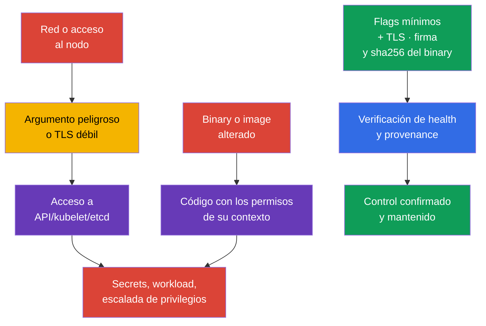
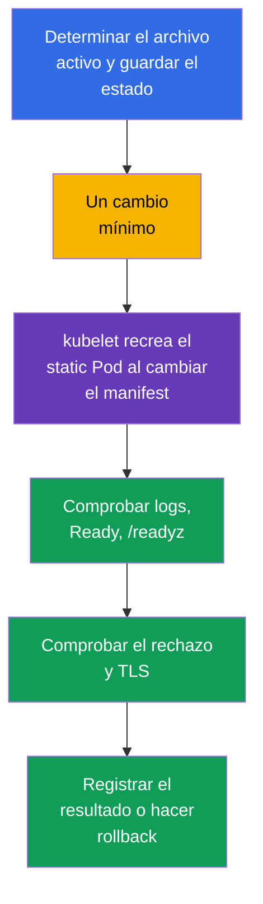

[Русская версия](ru.md) · [Eng version](README.md) · [Version française](fr.md) · [Deutsche Version](de.md) · [ქართული ვერსია](ge.md) · [繁體中文版](tw.md) · [日本語版](jp.md)

# Capítulo 09. Argumentos inseguros de componentes, hardening de TLS y verificación de binarios

> **El problema.** Un atacante que obtiene acceso de red a un endpoint del control plane o
> la capacidad de modificar un archivo en un nodo no busca una vulnerabilidad en Kubernetes mismo,
> sino un argumento inseguro cercano: anonymous access, un read-only kubelet port, TLS débil o un
> `kubelet`/`kubectl`/image alterado antes de su ejecución. Una sola deficiencia así puede abrir
> acceso a API/etcd o dar ejecución de código en el contexto del artefacto alterado. Para un
> binary de plataforma, las consecuencias dependen del runtime: un binary kubelet/control-plane
> alterado obtiene los permisos del service process correspondiente, y un `kubectl` alterado, los
> permisos del usuario OS que lo ejecutó y acceso a su kubeconfig/credentials.

> **Qué sigue.** En el capítulo 08 protegimos el ingress HTTP externo con TLS. Ahora hay que
> proteger los propios componentes del control plane y kubelet: un argumento inseguro puede abrir
> una API anónima, un endpoint de diagnóstico o un canal TLS débil. Después verificaremos que
> ejecutamos precisamente los binarios Kubernetes publicados. Este es el dominio **Cluster
> Setup** (CKS, 15%).

> **Qué necesita de CKA.** La arquitectura del control plane, kubeadm y los static Pod se tratan
> en el [capítulo 35 de CKA](../../../cka/course/35/es.md), y la superficie de los componentes
> Kubernetes, en el [capítulo 02 de CKA](../../../cka/course/02/es.md). Aquí no se repite su
> configuración básica: buscamos argumentos peligrosos, modificamos de forma segura la
> configuración activa y demostramos el resultado.

> 🧠 La protección la determina el active runtime state, no una línea de una plantilla, un tag o una versión esperada.

## 09.1. Modelo de amenazas: un flag o artefacto como punto de entrada

El control plane toma decisiones para todo el clúster. `kube-apiserver` concede y comprueba
acceso a la API, `kubelet` inicia Pods en un nodo y `etcd` almacena Secrets, RBAC y el estado
deseado. Por tanto, un parámetro débil tiene mayor efecto que un error en una sola aplicación.

Una cadena de ataque típica tiene este aspecto: un atacante obtiene acceso de red a un endpoint o
la capacidad de modificar un archivo en un nodo; utiliza anonymous access, un read-only kubelet
port, `AlwaysAllow` o profiling; lee datos o realiza una acción con permisos ajenos. Una ruta
alternativa es alterar un artefacto antes de ejecutarlo. Un kubelet o binary del control plane
alterado se ejecuta con los permisos del service/host process correspondiente; un `kubectl`
alterado, con los permisos del usuario local y sus Kubernetes credentials disponibles; una
container image, con los permisos de su workload security context. Por ello, verifique la
provenance antes de ejecutar y evalúe las consecuencias según el execution context real, no según
la fórmula general «permisos del componente».



Hardening no es un conjunto de líneas «para CIS». Antes de modificar algo, responda cuatro
preguntas: qué proceso usa realmente el parámetro, quién es su cliente, si los certificados y
las cipher suites son compatibles, cómo verificar disponibilidad y cómo hacer rollback. En
Kubernetes gestionado, una parte del control plane pertenece al proveedor: no intente modificar
sus host files; consulte la documentación de las configuraciones de seguridad disponibles.

> 🎯 Inspeccione active config y process args, corrija la única effective source, reinicie el componente y confirme active state, comportamiento y health; para un binary, provenance y SHA-256.

## 09.2. Argumentos peligrosos: qué buscar y por qué

No todos los flags son igualmente peligrosos en cualquier topología. El valor, dirección de
escucha, firewall, TLS y RBAC forman un único control. Pero las siguientes configuraciones
requieren justificación explícita o corrección.

| Componente | Configuración peligrosa | Riesgo | Referencia segura |
|---|---|---|---|
| `kube-apiserver` | anonymous access amplio | una solicitud sin credentials aceptadas puede procesarse como `system:anonymous`; con RBAC erróneo, crea una ruta de acceso no autenticado | un benchmark puede requerir `--anonymous-auth=false`; en producción compruebe primero los health endpoints y kubeadm discovery, y en Kubernetes 1.34+ restrinja anonymous access mediante `AuthenticationConfiguration` si es necesario |
| `kube-apiserver` | `--authorization-mode=AlwaysAllow` o `AlwaysAllow` añadido | toda solicitud autenticada pasa authorization | para kubeadm, normalmente `Node,RBAC` |
| `kube-apiserver` | `--profiling=true` | profiling puede revelar el estado del proceso y es innecesario en un límite público | `--profiling=false` |
| `kube-apiserver` | legacy `--insecure-port`/`--insecure-bind-address` | API sin TLS ni authentication | no habilitar; estas opciones legacy se eliminaron en Kubernetes moderno |
| `kubelet` | `--read-only-port` distinto de `0` | un endpoint no autenticado puede revelar datos de Pod y nodo | `--read-only-port=0` o `readOnlyPort: 0` |
| `kubelet` | `--anonymous-auth=true` | un cliente anónimo llega a la API kubelet | `--anonymous-auth=false` o un campo config API |
| `kubelet` | `--authorization-mode=AlwaysAllow` | cualquier cliente autenticado obtiene acceso excesivamente amplio a la API kubelet | `--authorization-mode=Webhook` |
| `kubelet` | `--protect-kernel-defaults=false` | si el baseline no coincide, kubelet no termina fail-fast y puede intentar cambiar host-level kernel flags a los valores esperados | `--protect-kernel-defaults=true` tras comprobar sysctl |
| `kube-controller-manager` | `--profiling=true` o `--use-service-account-credentials=false` | diagnóstico innecesario o uso de credentials amplias en vez de SA separadas | `--profiling=false`, service account credentials separadas |
| `kube-scheduler` | profiling habilitado o endpoint en un `--bind-address` amplio | un endpoint de diagnóstico queda accesible a una red innecesaria | `enableProfiling: false`; el CLI `--profiling` deprecated y la comprobación kube-bench para scheduler basado en config se tratan en el [capítulo 07](../07/es.md) |
| `etcd` | `--client-cert-auth=false`, `--listen-client-urls` inseguro | un cliente sin mTLS o una red externa obtiene acceso al almacenamiento del clúster | mTLS, localhost/red interna, firewall |

Para una tarea CIS/CKS concreta, un benchmark puede requerir explícitamente
`--anonymous-auth=false`; en ese caso cumpla exactamente el requisito de la tarea y demuestre
el resultado.

En producción con kubeadm, no aplique este cambio mecánicamente. El `kubeadm join` estándar
basado en tokens usa la lectura pública de `kube-public/cluster-info` por el grupo
`system:unauthenticated`, por lo que deshabilitar por completo anonymous authentication cambia el
lifecycle de discovery. Compruebe también los health probes de `kube-apiserver` si acceden a
anonymous health endpoints.

En Kubernetes 1.34+ puede usar `AuthenticationConfiguration`, permitiendo anonymous access solo
para endpoints explícitamente necesarios. Si `cluster-info` público deja de ser necesario,
primero migre join/discovery a una alternativa adecuada y solo después elimine ese acceso. Por
ejemplo, un archivo separado, conectado al static Pod mediante
`--authentication-config=<path>` y el mount correspondiente, puede contener:

```yaml
apiVersion: apiserver.config.k8s.io/v1
kind: AuthenticationConfiguration
anonymous:
  enabled: true
  conditions:
  - path: /livez
  - path: /readyz
  - path: /healthz
```

Si deja anonymous access solo para `/livez`, `/readyz` y `/healthz`, el `kubeadm join`
ordinario basado en tokens mediante `cluster-info` público no funcionará. Esto es aceptable
solo si el lifecycle de incorporación de nodos se migró a otro discovery mechanism.

Si en `AuthenticationConfiguration` se establece el campo `anonymous`, no se puede usar
`--anonymous-auth` al mismo tiempo. La variante con scope por endpoint no aprueba un benchmark
que exige explícitamente `--anonymous-auth=false`; elija y documente el modelo aplicable a su
clúster.

Primero inventaríe los parámetros activos, no solo el archivo de plantilla. Busque duplicados: el
último valor o el realmente utilizado depende de la implementación, y los flags en conflicto
complican el diagnóstico. Si `kube-bench` (capítulo 07) ya informa un hallazgo concreto, use su
remediation como fuente del flag y archivo exactos; los parámetros específicos de TLS
(`--tls-min-version`, `--tls-cipher-suites`) se tratan por separado más abajo, en 09.4-09.5.

`--enable-debugging-handlers` de kubelet también se evalúa por riesgo: habilita handlers de
diagnóstico cuyas partes necesarias pueden usar `kubectl logs`, `exec` y `port-forward`. No lo
deshabilite a ciegas. Primero determine las operaciones necesarias y proteja la API kubelet en
`10250` con authentication + authorization `Webhook`.

Restrinja el acceso de red a `10250` en el nivel del nodo o la infraestructura: host firewall,
cloud security group/ACL o CNI-specific host policy. No confíe en una Kubernetes `NetworkPolicy`
ordinaria como control portable del endpoint kubelet: es host/node traffic, y el comportamiento de
NetworkPolicy para `hostNetwork` y node IP depende de la implementación CNI. La misma regla se
aplica a las métricas: profiling y metrics son endpoints diferentes.

## 09.3. Dónde modificar la configuración y cómo reiniciar de forma segura

El proceso general para editar de forma segura un static Pod del control plane (backup, cambio
mínimo, comprobación de health, recuperación tras un fallo) se trata en el capítulo 07. Aquí no
se repite, sino que se complementa con una técnica específica de este capítulo y los matices de
discovery de configuración de kubelet/scheduler/controller-manager, especialmente importantes
para los cambios TLS y cipher de 09.4.

Kubelet no es un static Pod: su configuración suele estar en `/var/lib/kubelet/config.yaml`, y
los argumentos adicionales, en `/var/lib/kubelet/kubeadm-flags.env` y un systemd drop-in. En
Kubernetes 1.36 busque también `--config-dir`: kubelet aplica el config principal y después solo
los drop-in-files `*.conf` (incluidos subdirectorios) de ese directorio, en orden léxico; los
`*.yaml` allí se ignoran. En Kubernetes 1.36 kubelet fusiona las fuentes en este orden: los CLI
feature gates tienen la prioridad más baja, después se aplica el config principal, luego los
`*.conf` de `--config-dir`, y los demás CLI arguments tienen la prioridad más alta. Por tanto,
para los parámetros ordinarios de este capítulo un CLI flag puede sobrescribir YAML/drop-in, pero
no traslade esta regla a `--feature-gates`.

Determine los `--config`, `--config-dir` y CLI arguments reales mediante `systemctl cat kubelet`
y el process command line efectivo. No establezca un parámetro ordinario simultáneamente en varias
fuentes sin necesidad.

Para scheduler, compruebe primero si se define `--config=<path>`:
`KubeSchedulerConfiguration` puede ser su effective source, y parte de los legacy CLI flags están
deprecated/ignored cuando existe `--config`. Por ejemplo, el `--profiling` de scheduler es
deprecated; en component config se comprueba `enableProfiling: false`.

Para `kube-controller-manager`, Kubernetes 1.36 no tiene una opción general `--config`
equivalente a la de scheduler: sus parámetros de trabajo siguen definiéndose mediante CLI flags en
el active manifest / process args. `KubeControllerManagerConfiguration` existe como API de
component configuration y representación interna/configz, pero no es un archivo `--config`
externo general de kube-controller-manager.

Por ello, determine primero el runtime del componente concreto y compruebe precisamente la active
source que este admite.



Una técnica adicional para static Pod del control plane es el atomic rename mediante un hidden
candidate en el mismo watched directory. Es más fiable que el backup+edit ordinario cuando es
importante no dejar el clúster sin API ni siquiera durante un error en el YAML intermedio:

```bash
# 1. Crear un hidden candidate en el propio watched directory; kubelet ignora los archivos
# cuyo nombre comienza con punto, por lo que el Pod no se recreará hasta el reemplazo atómico.
# /etc/kubernetes/manifests puede ser un mount separado: si se crea el candidate en
# /etc/kubernetes, mv entre filesystem diferentes se convierte en copy+unlink y deja de ser
# un atomic rename.
sudo install -d -m 700 /root/k8s-manifest-backup
CANDIDATE=$(sudo mktemp /etc/kubernetes/manifests/.kube-apiserver.yaml.candidate.XXXXXX)
sudo cp -p /etc/kubernetes/manifests/kube-apiserver.yaml "$CANDIDATE"
sudo cp -p /etc/kubernetes/manifests/kube-apiserver.yaml \
  /root/k8s-manifest-backup/kube-apiserver.yaml.$(date +%F-%H%M%S)
sudoedit "$CANDIDATE"

# 2. Comprobar realmente la estructura YAML/API del candidate sin tocar el static Pod en ejecución.
sudo kubectl apply --dry-run=client --validate=strict -f "$CANDIDATE"

# 3. Solo después de una comprobación correcta, reemplazar atómicamente el watched manifest.
# Candidate y target están en el mismo directory y filesystem, por lo que rename es
# atómico de forma garantizada.
sudo mv -f "$CANDIDATE" /etc/kubernetes/manifests/kube-apiserver.yaml

# 4. Observar la recreación desde la consola del nodo y luego comprobar la API.
watch -n 2 'sudo crictl ps -a --name kube-apiserver'
kubectl get --raw='/readyz?verbose'
kubectl get nodes

# Si el static Pod no inicia, leer primero los kubelet y runtime logs.
sudo journalctl -u kubelet -n 100 --no-pager
sudo crictl ps -a --name kube-apiserver
sudo crictl logs "$(sudo crictl ps -aq --name kube-apiserver | head -n1)"
```

Mantenga de todos modos los backup-files persistentes fuera de `/etc/kubernetes/manifests/`
(como en el paso 1): el hidden candidate solo se necesita durante el propio reemplazo, no como una
copia a largo plazo.

Para kubelet, compruebe primero los valores sysctl y la configuración y después reinicie solo ese
componente. Un `systemctl restart kubelet` ordinario por sí mismo no detiene los Pods y
contenedores ya iniciados: container runtime continúa ejecutándolos, y kubelet restaura
reconciliation tras arrancar. Sin embargo, en control-plane cambie kubelet nodo a nodo y controle
el Node heartbeat, los kubelet logs y `/readyz`: un error de configuración puede dejar el nodo
`NotReady` o impedir el control posterior de los static Pod.

```yaml
# /var/lib/kubelet/config.yaml - ejemplo de fragmento de configuración API.
readOnlyPort: 0
authentication:
  anonymous:
    enabled: false
authorization:
  mode: Webhook
protectKernelDefaults: true
```

```bash
sudo systemctl restart kubelet
sudo systemctl --no-pager --full status kubelet
sudo journalctl -u kubelet -n 100 --no-pager
check_kubelet_10255() {
  local listeners

  if ! listeners="$(sudo ss -H -lntp 'sport = :10255')"; then
    echo 'ERROR: cannot inspect listening TCP sockets; port 10255 is not verified' >&2
    return 1
  fi

  if [[ -n "$listeners" ]]; then
    printf '%s\n' "$listeners"
    echo 'FAIL: kubelet read-only port 10255 is listening' >&2
    return 1
  fi

  echo 'PASS: kubelet read-only port 10255 is closed'
}
check_kubelet_10255
kubectl get nodes

# Configuración final después de base config, *.conf drop-ins y CLI overrides; se necesita acceso autorizado.
NODE="${NODE:?set target node name from kubectl get nodes}"
kubectl get --raw "/api/v1/nodes/${NODE}/proxy/configz" \
  | jq '.kubeletconfig | {readOnlyPort, authentication, authorization, protectKernelDefaults}'
```

## 09.4. Hardening de TLS para apiserver, kubelet y etcd

TLS ya protege el canal, pero la versión y el conjunto de cipher suites determinan qué
variantes criptográficas puede negociar un cliente. Permitir protocolos obsoletos o cifrados
débiles facilita el downgrade y el uso de criptografía obsoleta. Un mínimo de `TLS 1.2` suele
ser compatible con clientes Kubernetes modernos; `TLS 1.3` restringe más a los clientes y exige
una comprobación independiente de todo el control plane, automation y monitoring.

Los defaults modernos de Go y Kubernetes ya excluyen protocolos obsoletos y suites inseguras; no
existe una «lista corta segura» universal. No traslade una lista corta aleatoria entre
componentes o versiones. Si la policy de la organización o un CIS profile concreto exige una
lista aprobada, aplique precisamente esa tras el inventory de certificados y clientes, sin
oponer la lista al hardening baseline. Una lista solo RSA no es un default seguro: rompe un
endpoint con certificado ECDSA y restringe innecesariamente la compatibilidad. Las suites TLS
1.3 en Go normalmente no se controlan con `--tls-cipher-suites`: las selecciona la
implementación TLS, por lo que este flag afecta principalmente a TLS 1.2 y anteriores.

> 🔬 El pinning de cipher suites y TLS 1.3 requieren una policy aprobada, inventory de clientes y comprobación de valores con la versión del componente.

Para los componentes Kubernetes, los valores de cadena permitidos del flag suelen ser
`VersionTLS12` y `VersionTLS13`. Para etcd, el nombre del valor depende de la versión de etcd:
la ayuda actual suele usar `TLS1.2`/`TLS1.3`. No traslade un valor entre programas por
conjetura: antes de editar, compruebe `--help` del binary en ejecución de esa versión, no una
documentación recordada ni la de otro release.

En el examen, lo más rápido es obtener la lista exacta de flags y valores permitidos del proceso
que está ejecutándose, no buscar en la web: la página de documentación de la versión necesaria
puede no estar disponible o requerir tiempo para encontrarla. Si un componente se ejecuta en un
static Pod y su container está `Running`, primero puede usar `kubectl exec`. `Ready=False` por
sí mismo no impide exec: para exec importan un running container y una ruta disponible de
API/RBAC/streaming. Readiness determina el Pod `Ready` state, se usa al incluir un Pod en el
Service traffic y participa en la availability/rollout semantics de los workload controllers,
pero no es un gate para `kubectl exec`. Si la ruta API/RBAC/streaming para `kubectl exec` no está
disponible, pero el componente se ejecuta realmente como CRI container, use `crictl exec` con el
container ID concreto.

Si el componente se ejecuta como un host `systemd` service separado, `crictl exec` no es
aplicable: obtenga el executable del proceso activo o de `ExecStart` y ejecute su `--help`
directamente en el nodo.

```bash
# Static Pod / mirror Pod: el container debe estar Running (Ready no es obligatorio).
kubectl -n kube-system exec kube-apiserver-<node> -- kube-apiserver --help 2>&1 \
  | grep -A2 -- '--tls-min-version\|--tls-cipher-suites'

kubectl -n kube-system exec etcd-<node> -- etcd --help 2>&1 \
  | grep -A2 -- '--cipher-suites\|--tls-min-version'

# Fallback solo si etcd realmente se ejecuta como un CRI container.
CID="$(sudo crictl ps -q --name etcd | head -n1)"
if [[ -n "$CID" ]]; then
  sudo crictl exec "$CID" etcd --help 2>&1 \
    | grep -A2 -- '--tls-min-version'
fi

# Si etcd es un host/systemd process separado, use el executable de ese proceso.
PID="$(pgrep -xo etcd)"
if [[ -n "$PID" ]]; then
  sudo "/proc/${PID}/exe" --help 2>&1 \
    | grep -A2 -- '--tls-min-version'
fi
```

La salida de `--help` muestra el nombre exacto del flag y, en la mayoría de versiones, una breve
descripción con los valores permitidos junto al flag. Es el mismo binary y la misma versión que
realmente se ejecutan en el clúster, por lo que no surgen discrepancias con documentación de otro
release y no se pierde tiempo cambiando al navegador.

La prueba del requisito del benchmark «etcd acepta no menos que TLS 1.2» son el
`--tls-min-version` activo y un handshake verificado, no una lista de cipher RSA-only arbitraria;
compruebe la redacción exacta y la versión del benchmark aplicable.

```yaml
# /etc/kubernetes/manifests/kube-apiserver.yaml, fragmento de command.
# Los defaults modernos de Go dejan las suites sin pinning explícito.
- kube-apiserver
- --tls-min-version=VersionTLS12
# Añada --tls-cipher-suites solo con una policy/compatibilidad aprobada.
# Si la policy exige una lista, incluya las suites ECDSA y RSA necesarias para sus certificados:
# - --tls-cipher-suites=TLS_ECDHE_ECDSA_WITH_AES_128_GCM_SHA256,TLS_ECDHE_ECDSA_WITH_AES_256_GCM_SHA384,TLS_ECDHE_RSA_WITH_AES_128_GCM_SHA256,TLS_ECDHE_RSA_WITH_AES_256_GCM_SHA384
```

Para kubelet se prefiere su config API; si la instalación pasa parámetros mediante systemd, use
los flags equivalentes en la única fuente activa. De igual modo, deje `tlsCipherSuites` sin
definir mientras una policy documentada no lo requiera.

```yaml
# /var/lib/kubelet/config.yaml, fragmento; el soporte de campos exactos depende de la versión de kubelet.
tlsMinVersion: VersionTLS12
```

```yaml
# /etc/kubernetes/manifests/etcd.yaml, ejemplo para etcd que acepta el valor TLS1.2.
# No se añade --cipher-suites: los defaults de Go son seguros si la policy no exige otra cosa.
- etcd
- --tls-min-version=TLS1.2
```

No restrinja TLS solo al server endpoint. etcd tiene client y peer traffic, y apiserver tiene
clientes kubelet, controller-manager, scheduler, kubectl, webhooks y automation. Primero
recopile los certificates/keys reales, direcciones de escucha y clientes; después aplique el
cambio en un nodo de prueba o una sola HA-node. Al migrar a `VersionTLS13`, espere que un cliente
TLS 1.2 antiguo sea rechazado: esto no prueba un error del servidor, pero exige un plan de
migración del cliente.

La comprobación del mínimo TLS debe incluir dos cosas diferentes:

1. protocol evidence: la versión permitida se negocia correctamente y una versión inferior al
   minimum establecido se rechaza;
2. application health: el componente sigue operativo tras el cambio.

Para apiserver basta comprobar el handshake en `6443`; kubelet `10250` a menudo requiere client
certificate y authorization después del handshake; para etcd, `etcdctl endpoint health` solo
demuestra application health, por lo que compruebe el protocol handshake por separado mediante
`openssl s_client`. No imprima una private key en la terminal ni copie PKI desde el nodo.

Antes del negative test, asegúrese de que el cliente TLS utilizado es realmente capaz de ofrecer
la versión legacy de protocolo que se prueba. OpenSSL moderno o la crypto policy del sistema
pueden prohibir TLS 1.1 por sí mismos. Si el cliente rechaza TLS 1.1 localmente, ese resultado no
demuestra `tls-min-version` del lado del servidor. Un negative test cuenta como prueba solo cuando
se ve que el cliente intentó negociar el legacy protocol y el rechazo llegó del endpoint probado.
Esta regla se aplica por igual a apiserver, kubelet y etcd.

```bash
# apiserver, positive test: TLS 1.2 debe negociarse correctamente.
# Sustituya la dirección y SNI por los valores de su clúster.
export API=127.0.0.1:6443
OUT="$(mktemp)"

if openssl s_client \
    -connect "$API" \
    -servername kubernetes \
    -tls1_2 \
    -CAfile /etc/kubernetes/pki/ca.crt \
    -verify_return_error \
    </dev/null >"$OUT" 2>&1
then
  if grep -Eq 'Cipher is \(NONE\)|Cipher[[:space:]]*:[[:space:]]*0000' "$OUT"; then
    cat "$OUT"
    rm -f "$OUT"
    echo 'FAIL: TLS 1.2 handshake has no negotiated cipher' >&2
    exit 1
  fi
  grep -E 'Protocol|Cipher|Verify return code' "$OUT"
  echo 'PASS: TLS 1.2 handshake succeeded'
else
  cat "$OUT" >&2
  rm -f "$OUT"
  echo 'FAIL: TLS 1.2 handshake failed' >&2
  exit 1
fi
rm -f "$OUT"

# apiserver, negative test: el servidor debe rechazar TLS 1.1.
# Un grep simple de "protocol|alert" no distingue un rechazo server-side de una
# prohibición de OpenSSL/crypto policy local antes de enviar ClientHello: hay que probar ambos hechos.
# Está formulado como función: return 1 en todas las ramas non-PASS para que el exit status coincida
# con el verdict textual y la automatización (cmd && echo PASS, CI wrapper, $?) no falle.
check_tls11_rejected() {
  local endpoint="$1"
  local servername="$2"
  local neg rc

  neg="$(mktemp)" || return 1

  # @SECLEVEL=0 debilita solo este test-client de una vez, para que OpenSSL moderno pueda
  # en lo posible formar un TLS 1.1 ClientHello; el server no cambia.
  if openssl s_client \
      -connect "$endpoint" \
      -servername "$servername" \
      -tls1_1 \
      -cipher 'DEFAULT:@SECLEVEL=0' \
      -msg -state \
      </dev/null >"$neg" 2>&1
  then
    rc=0
  else
    rc=$?
  fi

  if grep -Eq '^>>> .*Handshake.*ClientHello' "$neg" \
     && grep -Eq '^<<< .*Alert.*fatal protocol_version|alert protocol version' "$neg"
  then
    echo 'PASS: client sent TLS 1.1 ClientHello and server rejected it with protocol_version'
    rm -f "$neg"
    return 0
  fi

  if grep -Eqi 'no protocols available|no ciphers available|unsupported protocol' "$neg" \
     && ! grep -Eq '^>>> .*Handshake.*ClientHello' "$neg"
  then
    cat "$neg" >&2
    echo 'INCONCLUSIVE: local OpenSSL/crypto policy blocked TLS 1.1 before ClientHello' >&2
    rm -f "$neg"
    return 1
  fi

  cat "$neg" >&2
  echo "INCONCLUSIVE/FAIL: server-side TLS 1.1 rejection was not proven (s_client rc=${rc})" >&2
  rm -f "$neg"
  return 1
}
check_tls11_rejected "$API" kubernetes

# etcd: comprobar primero el TLS 1.2 handshake permitido con mTLS, el mismo modelo
# que para apiserver: exit status de s_client, -verify_return_error y comprobación del
# cipher realmente negociado, no solo Verify return code.
OUT="$(mktemp)"

if sudo openssl s_client \
    -connect 127.0.0.1:2379 \
    -tls1_2 \
    -CAfile /etc/kubernetes/pki/etcd/ca.crt \
    -cert /etc/kubernetes/pki/etcd/healthcheck-client.crt \
    -key /etc/kubernetes/pki/etcd/healthcheck-client.key \
    -verify_return_error \
    </dev/null >"$OUT" 2>&1
then
  if grep -Eq 'Cipher is \(NONE\)|Cipher[[:space:]]*:[[:space:]]*0000' "$OUT"; then
    cat "$OUT"
    rm -f "$OUT"
    echo 'FAIL: etcd TLS 1.2 handshake has no negotiated cipher' >&2
    exit 1
  fi
  grep -E 'Protocol|Cipher|Verify return code' "$OUT"
  echo 'PASS: etcd TLS 1.2 handshake succeeded'
else
  cat "$OUT" >&2
  rm -f "$OUT"
  echo 'FAIL: etcd TLS 1.2 handshake failed' >&2
  exit 1
fi
rm -f "$OUT"

# Después, negative test: TLS 1.1 no debe negociarse. El mismo criterion que para
# apiserver: demostrar que el cliente envió ClientHello y el servidor devolvió protocol_version.
# Función separada (no check_tls11_rejected): etcd requiere mTLS client cert/key,
# la función de apiserver no los recibe. return 1 en todas las ramas non-PASS por la misma razón.
check_etcd_tls11_rejected() {
  local endpoint="$1" cacert="$2" cert="$3" key="$4"
  local neg rc

  neg="$(mktemp)" || return 1

  if sudo openssl s_client \
      -connect "$endpoint" \
      -tls1_1 \
      -cipher 'DEFAULT:@SECLEVEL=0' \
      -CAfile "$cacert" \
      -cert "$cert" \
      -key "$key" \
      -msg -state \
      </dev/null >"$neg" 2>&1
  then
    rc=0
  else
    rc=$?
  fi

  if grep -Eq '^>>> .*Handshake.*ClientHello' "$neg" \
     && grep -Eq '^<<< .*Alert.*fatal protocol_version|alert protocol version' "$neg"
  then
    echo 'PASS: client sent TLS 1.1 ClientHello and etcd rejected it with protocol_version'
    rm -f "$neg"
    return 0
  fi

  if grep -Eqi 'no protocols available|no ciphers available|unsupported protocol' "$neg" \
     && ! grep -Eq '^>>> .*Handshake.*ClientHello' "$neg"
  then
    cat "$neg" >&2
    echo 'INCONCLUSIVE: local OpenSSL/crypto policy blocked TLS 1.1 before ClientHello' >&2
    rm -f "$neg"
    return 1
  fi

  cat "$neg" >&2
  echo "INCONCLUSIVE/FAIL: etcd server-side TLS 1.1 rejection was not proven (s_client rc=${rc})" >&2
  rm -f "$neg"
  return 1
}
check_etcd_tls11_rejected 127.0.0.1:2379 \
  /etc/kubernetes/pki/etcd/ca.crt \
  /etc/kubernetes/pki/etcd/healthcheck-client.crt \
  /etc/kubernetes/pki/etcd/healthcheck-client.key

# Comprobar por separado el application health de etcd.
export ETCDCTL_API=3
sudo etcdctl --endpoints=https://127.0.0.1:2379 endpoint health \
  --cacert=/etc/kubernetes/pki/etcd/ca.crt \
  --cert=/etc/kubernetes/pki/etcd/healthcheck-client.crt \
  --key=/etc/kubernetes/pki/etcd/healthcheck-client.key

# Desired source: el manifest realmente contiene el cambio esperado.
sudo grep -nE -- '--(tls-min-version|tls-cipher-suites|cipher-suites)' \
  /etc/kubernetes/manifests/{kube-apiserver,etcd}.yaml

# Active runtime: el manifest es solo la desired source, que kubelet lee periódicamente;
# leer argv de los procesos que realmente se ejecutan en este nodo.
for PROC in kube-apiserver etcd; do
  PID="$(pgrep -xo "$PROC")" || {
    echo "ERROR: running process not found: $PROC" >&2
    continue
  }
  echo "=== active argv: $PROC (pid=$PID) ==="
  sudo cat "/proc/${PID}/cmdline" \
    | tr '\0' '\n' \
    | grep -E -- '--(tls-min-version|tls-cipher-suites|cipher-suites)' \
    || echo "INFO: matching TLS flag is absent from active argv of $PROC"
done

# Después, behavioral TLS tests y health.
kubectl get --raw='/readyz?verbose'
kubectl get nodes
```

| Síntoma después del cambio | Causa probable | Comprobación y acción |
|---|---|---|
| apiserver no inicia | errata en YAML, flag o cipher no admitido | `journalctl -u kubelet`, `crictl logs`; restaurar el último working manifest |
| el cliente recibe protocol version | el client es más antiguo que el minimum establecido | actualizar el cliente o elegir temporalmente un mínimo acordado mediante excepción aprobada |
| TLS handshake falla con TLS 1.2 | certificate key algorithm no es compatible con las cipher suites permitidas | comprobar `openssl x509 -text`, añadir suites ECDSA/RSA adecuadas |
| etcd no está healthy | peer/client no puede negociar TLS o perdió acceso a la key | comprobar todos los endpoint de miembros con mTLS, logs de etcd, rollback de un nodo |
| `openssl` muestra un cipher TLS 1.3 fuera de la lista | la biblioteca TLS controla los ciphers TLS 1.3 | comprobar minimum version y documentación de la versión, no considerarlo una omisión del flag |

## 09.5. Verificación de Kubernetes platform binaries: firma y sha256

HTTPS durante la descarga protege el transporte, pero no prueba quién publicó el archivo.
SHA-256 comprueba la **integridad**: el binary descargado es igual a los bytes descritos por el
digest seleccionado. No es prueba de provenance: un hash recibido junto al archivo desde la
misma fuente no confiable, o un baseline no aprobado, no crea confianza.

Para Kubernetes, obtenga el release artifact oficial específico de la versión. Kubernetes publica
la keyless cosign signature y certificate junto al binary; `verify-blob` comprueba la firma y la
vinculación del certificate a la identity y OIDC issuer esperados, es decir, el origen del release.
Compruebe identity e issuer explícitamente, en vez de aceptar un certificado arbitrario. Fije la
versión en una variable: `latest` no se puede reproducir de forma fiable.

```bash
export K8S_VERSION=v1.36.0
export ARCH=amd64
export BIN=kubectl
export BASE="https://dl.k8s.io/release/${K8S_VERSION}/bin/linux/${ARCH}"

# Obtener el binary y la keyless signature/certificate publicada del release específico de la versión.
for FILE in "${BIN}" "${BIN}.sig" "${BIN}.cert" "${BIN}.sha256"; do
  curl -fsSL --retry 3 --retry-delay 3 "${BASE}/${FILE}" -o "${FILE}"
done

# Valores oficiales de Kubernetes Release Engineering para binary artifacts.
# cosign 2+ exige ambas restricciones; no las elimine para lograr una verificación «correcta».
cosign verify-blob "${BIN}" \
  --signature "${BIN}.sig" \
  --certificate "${BIN}.cert" \
  --certificate-identity krel-staging@k8s-releng-prod.iam.gserviceaccount.com \
  --certificate-oidc-issuer https://accounts.google.com

# SHA-256 es una comprobación adicional de igualdad de bytes con el release digest aprobado.
printf '%s  %s\n' "$(tr -d '[:space:]' < "${BIN}.sha256")" "${BIN}" > "${BIN}.sha256sum"
sha256sum --check "${BIN}.sha256sum"
# kubectl: OK

# Para un archivo ya instalado, obtener el digest observado y cotejarlo con el approved inventory.
sha256sum /usr/bin/kubelet
```

Así, signature/certificate con identity/issuer esperados proporcionan provenance, mientras que el
checksum proporciona integrity respecto al release digest confiable. Kubernetes también publica
SBOM firmados (SPDX), pero image digest pinning, firma de container image, SBOM y admission policy
pertenecen al dominio **Supply Chain Security (20%)**, no a Cluster Setup de este capítulo.
Consulte la práctica de estos controles en los [capítulos 24-28](../24/es.md); aquí comprobamos
solo release artifacts y binaries de la propia plataforma Kubernetes.

Las comprobaciones detalladas de container image, incluidos digest, signing y SBOM, no se duplican
deliberadamente aquí: son Supply Chain Security; consulte los [capítulos 24-28](../24/es.md).

## 09.6. Escenario práctico: detectar una alteración antes del daño

Imagine que llegó a un worker un `kubelet` alterado después de su descarga. Una comprobación
ordinaria `kubelet --version` no descubrirá el problema: un binary malicioso puede devolver la
versión esperada.

Primero conserve los hashes observados, compárelos con el release manifest aprobado y realice
evidence/provenance/baseline/authorized-change triage antes de elegir containment. No «corrija» un
mismatch cambiando el hash de referencia: ante un cambio no confirmado u otras señales de
alteración, escale mediante el incident runbook.

```bash
# 1. Conservar evidence en el nodo antes de reemplazar el archivo.
sudo sha256sum /usr/bin/kubelet | sudo tee /root/kubelet.sha256.observed
sudo stat -c '%y %s %U:%G %a %n' /usr/bin/kubelet
sudo systemctl cat kubelet

# 2. Comparar el observed hash con el release digest aprobado del trusted inventory.
# Formato de inventory: '<digest>  /usr/bin/kubelet'. El comando devolverá FAIL si no coincide.
sudo sha256sum --check /root/approved-kubelet.sha256

# Realice la comprobación posterior de imageID/digest mediante el procedimiento supply-chain de los capítulos 24-28.
```

Un `sha256sum --check` con `FAILED` es una señal para investigar, pero por sí solo no demuestra
compromiso ni prescribe una única respuesta de «aislar». Primero conserve evidence y haga triage:
(1) confirme la ruta, versión y approved baseline esperado, descartando un error de inventory o
la actualización del archivo equivocado; (2) compruebe la provenance del release mediante
`cosign verify-blob` con la certificate identity/issuer esperadas, y coteje package/release
metadata; (3) encuentre un authorized change - change record, rollout, package-manager y logs de
CI - y relacione hora, propietario y digest; (4) compare con el baseline bueno conocido anterior
y el scope en otros nodos. No «corrija» un mismatch cambiando el hash de referencia.

Si la evidence no confirma un authorised change, la provenance/baseline no coincide o hay otras
señales de alteración, escale mediante el incident runbook: detenga la propagación posterior,
aplique containment proporcionado (hasta cordon/drain o aislamiento del nodo), conserve logs y
reemplace el nodo o binary de forma controlada. Un solo hash comunica de forma fiable que los bytes
esperados no coinciden, pero no explica su causa ni la ruta de modificación. La respuesta a
container image y registry/CI evidence pertenece a los procedimientos supply-chain de los
capítulos 24-28.

## 09.7. Verificación del resultado y diagnóstico

Después de cualquier edición se necesitan pruebas en tres niveles: configuración activa,
comportamiento real y salud del clúster. La presencia de una línea en un archivo no utilizado no
constituye una comprobación.

```bash
# 1a. Desired source del control plane: para el staticPodPath predeterminado de kubeadm.
# Si staticPodPath cambia, use el directorio realmente activo.
STATIC_POD_DIR=/etc/kubernetes/manifests
sudo grep -nE -- \
  '--(anonymous-auth|authorization-mode|profiling|tls-min-version|cipher-suites)' \
  "${STATIC_POD_DIR}"/{kube-apiserver,kube-controller-manager,kube-scheduler,etcd}.yaml

# 1b. Active runtime argv de procesos control-plane: el manifest es solo desired source,
# que kubelet lee periódicamente, no prueba de un Pod recreado.
sudo ps -ww -eo pid,args \
  | grep -E '[k]ube-apiserver|[k]ube-controller-manager|[k]ube-scheduler|[e]tcd'

# Para un parámetro concreto, obtenga argv sin truncation si es necesario:
APIPID="$(pgrep -xo kube-apiserver)" || {
  echo 'ERROR: kube-apiserver process not found' >&2
  false
}
sudo cat "/proc/${APIPID}/cmdline" | tr '\0' '\n'

# 1c. Kubelet: mostrar primero las startup sources reales, no adivinar la ruta.
sudo systemctl cat kubelet
sudo ps -ef | grep '[k]ubelet'

# 1d. KubeletConfiguration actuada final después de base config, --config-dir y overrides.
NODE="${NODE:?set target node name from kubectl get nodes}"
kubectl get --raw "/api/v1/nodes/${NODE}/proxy/configz" \
  | jq '.kubeletconfig | {
      readOnlyPort,
      authentication,
      authorization,
      protectKernelDefaults,
      tlsMinVersion,
      tlsCipherSuites
    }'
```

Manifest y runtime se comprueban por separado: el manifest demuestra la desired source, y el
process command line, que el static Pod realmente se recreó con el argv nuevo. Si un componente
lee component config adicional mediante `--config`, compruebe por separado el config file activo/
effective endpoint del componente; un argv por sí solo tampoco basta en ese caso.

Si `/configz` no está disponible debido a permisos o topology, no vuelva al
`/var/lib/kubelet/config.yaml` hardcodeado: obtenga los `--config` y `--config-dir` reales del
unit/process, lea precisamente esos y tenga después en cuenta los CLI overrides ordinarios.

```bash
# 2. Comportamiento: el read-only kubelet port está cerrado. La función check_kubelet_10255 (véase §09.3)
# devuelve 1 en todas las ramas non-PASS para que el exit status coincida con el verdict textual.
check_kubelet_10255() {
  local listeners

  if ! listeners="$(sudo ss -H -lntp 'sport = :10255')"; then
    echo 'ERROR: cannot inspect listening TCP sockets; port 10255 is not verified' >&2
    return 1
  fi

  if [[ -n "$listeners" ]]; then
    printf '%s\n' "$listeners"
    echo 'FAIL: kubelet read-only port 10255 is listening' >&2
    return 1
  fi

  echo 'PASS: kubelet read-only port 10255 is closed'
}
check_kubelet_10255
```

Confirme el mínimo TLS con los positive/negative protocol tests de §09.4. No repita el
simplificado `openssl ... -tls1_1 | grep ...` sin comprobar las capacidades del cliente local:
OpenSSL moderno o la crypto policy del sistema pueden prohibir TLS 1.1 por sí mismos, y tal test
admite un false positive.

```bash
# 3. Health: API, nodos y static Pod volvieron al estado operativo.
kubectl get --raw='/readyz?verbose'
kubectl get nodes
kubectl -n kube-system get pods -o wide
sudo crictl ps | grep -E 'kube-apiserver|kube-controller-manager|kube-scheduler|etcd'
```

| La comprobación falla | Comprobar primero | Causa frecuente |
|---|---|---|
| `kubectl` no responde después de un static Pod edit | `journalctl -u kubelet`, `crictl ps -a`, logs del container | YAML, flag o mount incorrecto |
| el flag es visible, pero `kube-bench` sigue en FAIL | process args y una fuente del valor | se modificó la plantilla, no el active manifest; hay un duplicado |
| el puerto `10255` sigue escuchando | systemd drop-in y `ps` de kubelet | se editó el config file equivocado o un flag antiguo sobrescribe YAML |
| un cliente TLS 1.2 dejó de conectar | certificate algorithm, cipher list, client TLS | conjunto de suites demasiado estrecho o client incompatible |
| `sha256sum --check` devuelve FAIL | approved manifest, ruta y version | binary equivocado, descarga dañada o alteración |

`kube-bench` es útil como control de regresión, pero su perfil debe coincidir con la versión y
arquitectura Kubernetes. Repita los targets relevantes tras la corrección y conserve el informe
junto con la versión del benchmark. `WARN` requiere una decisión manual, no añadir mecánicamente
un flag.

```bash
sudo kube-bench run --targets master,etcd | tee kube-bench-after.txt
grep -E '\[FAIL\]|\[WARN\]' kube-bench-after.txt
```

> 🏭 Immutable versioned baseline para argumentos, TLS y binary; canary/rolling rollout y excepciones temporales con owner y expiry.

## 09.8. Cómo se usa esto en producción

- **Immutable baseline.** Los argumentos de componentes, kubelet config y TLS policy se definen
  mediante kubeadm config, node image o configuration management. La edición manual de un static
  Pod es una medida de emergencia o enseñanza, que después debe volver al source of truth.
- **Hardening TLS compatible.** El inventory de clientes, un cambio canary en un HA-node,
  monitoring de errores de handshake y un plan de rollback preceden a `VersionTLS13` o al
  estrechamiento de cipher suites. Las excepciones tienen plazo, propietario y control compensatorio.
- **Drift detection.** Se ejecuta `kube-bench` regularmente y se comprueban effective process args
  y configuración. Para kubelet, debe haber alert ante cualquier listener `10255`. Para etcd,
  `2379/2380` en `LISTEN` es normal: se alerta ante desviación del bind/exposure baseline aprobado,
  interfaz o proceso inesperado, acceso desde una red no permitida, falta del mTLS/firewall exigido
  u otro drift respecto a la topology del clúster.
- **Entrega verificable.** El pipeline comprueba la keyless signature/certificate del binary con
  identity/issuer esperados y SHA-256 como integrity check, y conserva el platform baseline
  aprobado por separado. Image signing, SBOM, registry y admission controls son temas
  supply-chain de los capítulos 24-28.
- **Rollback seguro.** El backup manifest se conserva fuera del static Pod directory, y el
  rollback se prueba fuera de producción. Ante sospecha de alteración, es preferible reinstalar el
  nodo desde una image confiable a continuar trabajando con un host potencialmente modificado.

## 09.9. Mini-glosario

- **static Pod** - Pod de un manifest local del nodo, gestionado por kubelet, no por scheduler
  mediante Kubernetes API.
- **`--anonymous-auth`** - configuración que permite o prohíbe la anonymous identity para un
  API endpoint.
- **read-only kubelet port** - puerto kubelet legacy no autenticado, que debe deshabilitarse con
  el valor `0`.
- **TLS minimum version** - versión mínima de TLS que el servidor negocia con el cliente.
- **cipher suite** - conjunto de algoritmos criptográficos TLS; el conjunto permitido debe ser
  compatible con certificate algorithm y clientes.
- **SHA-256 checksum** - digest de archivo de 256 bits utilizado para comprobar la coincidencia
  exacta de bytes con el artefacto publicado.
- **provenance** - origen demostrable de un artefacto: quién y desde qué release o pipeline
  confiable lo publicó.

## 09.10. Resumen del capítulo

- Los peligrosos `anonymous-auth`, `AlwaysAllow`, profiling, read-only kubelet port y diagnostic
  endpoints amplios expanden la superficie de ataque del control plane y los nodos.
- Primero se determina la fuente activa del parámetro. Los componentes control-plane de kubeadm
  suelen ser static Pod de `/etc/kubernetes/manifests/`; kubelet es un systemd service con config
  API y/o argumentos.
- Los static Pod se cambian de uno en uno, con backup fuera del watched directory, observación de
  `kubelet`/CRI y comprobación inmediata de `/readyz`.
- Para apiserver y kubelet se establece TLS minimum version y, para etcd, el
  `--tls-min-version` correspondiente, comprobando los valores exactos contra la versión etcd.
  Los defaults de suites modernos de Go/Kubernetes son seguros; se fija una lista de suites solo
  para una policy, benchmark o compatibilidad aprobados, y se comprueba con certificate key
  algorithm y clientes.
- `cosign verify-blob` con certificate identity/issuer esperados comprueba la provenance de un
  Kubernetes binary; `sha256sum --check` compara además los bytes con un checksum confiable.
  Image digest, signing y SBOM pertenecen a Supply Chain Security, capítulos 24-28.
- La prueba de hardening incluye arguments activos, una comprobación negativa del comportamiento
  peligroso, TLS handshake, health del control plane y otro `kube-bench`.

## 09.11. Cómo ayuda esto: en el examen y en el trabajo real

**En el examen.** Una tarea CKS puede dar SSH a un nodo control plane y pedir corregir un flag
inseguro, TLS policy o hash binary. Determine rápidamente si se trata de un static Pod o un
kubelet service; conserve el backup fuera de `/etc/kubernetes/manifests`; haga un cambio;
espere el reinicio y demuestre tanto la configuración como health. Para checksum, no compare a
ojo: cree una entrada `sha256sum --check` y conserve su `OK`/`FAIL`.

Una variante concreta frecuente de esa tarea es establecer la versión mínima TLS en
`kube-apiserver` y `etcd` (por ejemplo, «no menor que TLS 1.2» o «solo TLS 1.3»). Para apiserver
es `--tls-min-version=VersionTLS12`/`VersionTLS13` en el manifest
`/etc/kubernetes/manifests/kube-apiserver.yaml`, y para etcd,
`--tls-min-version=TLS1.2`/`TLS1.3` en `/etc/kubernetes/manifests/etcd.yaml`: el nombre del valor
de etcd difiere de apiserver, y bajo presión de tiempo es fácil trasladar de memoria el formato
incorrecto. Si duda del valor exacto para la versión instalada, es más rápido comprobarlo con
`--help` del binary que se ejecuta (el método de 09.4) que buscar en la web. Tras la edición,
espere que se recree el static Pod y demuestre ambos lados: la versión permitida pasa el handshake
y la versión inferior al minimum se rechaza. Eso, no solo un `/readyz` correcto, prueba que la
policy se aplicó.

**En el trabajo real.** El hardening de componentes es un cambio del contrato de plataforma, no
una casilla CIS aislada. Requiere inventory de clientes, un source of truth IaC, despliegue rolling
y telemetry. La comprobación de digest y provenance transfiere la confianza de un nombre mutable
de artefacto a bytes concretos, pero funciona solo junto con fuentes protegidas, firma y control
de admisión.

## 09.12. Preguntas de autoevaluación

<details>
<summary>1. ¿Por qué `--anonymous-auth=true` y RBAC para `system:anonymous` son juntos más peligrosos que cada
   factor por separado?</summary>

`--anonymous-auth=true` convierte una solicitud sin credential en el sujeto `system:anonymous`,
pero por sí solo aún no le concede permisos API. Un binding para `system:anonymous` o
`system:unauthenticated` concede permisos, y juntos estos ajustes permiten obtenerlos sin
certificado ni token. Por ello, se deben comprobar tanto la ruta de authentication como los
bindings existentes.
</details>

<details>
<summary>2. ¿Qué fuentes de configuración se deben comprobar antes de cambiar parámetros kubelet?</summary>

Primero inspeccione `systemctl cat kubelet` y los argumentos reales del proceso mediante `ps` para
encontrar los `--config`, `--config-dir` y demás CLI arguments efectivos. En Kubernetes 1.36, el
merge order es: los CLI feature gates tienen la prioridad más baja, después el config principal,
luego los drop-ins `*.conf`, y los CLI arguments salvo feature gates tienen la prioridad más alta.
Cuando sea accesible, compruebe la `KubeletConfiguration` resultante mediante `/configz`; no
establezca un parámetro en varias fuentes a la vez sin necesidad.
</details>

<details>
<summary>3. ¿Por qué los backup manifests no se deben almacenar en `/etc/kubernetes/manifests/`?</summary>

Kubelet explora el static Pod directory y no se limita a archivos `.yaml`/`.yml`: procesa todo
archivo cuyo nombre no empiece con un punto. Así, un backup con cualquier nombre ordinario puede
leerse como otro manifest y crear un conflicto. Conserve los backups fuera del watched directory,
por ejemplo, en `/root/k8s-manifest-backup`.
</details>

<details>
<summary>4. ¿En qué se diferencia `VersionTLS12` de un componente Kubernetes del posible `TLS1.2` en el CLI de
   etcd, y cómo se averigua el valor correcto?</summary>

Los componentes Kubernetes suelen aceptar la cadena `VersionTLS12`, mientras que etcd actual
puede esperar el valor `TLS1.2`. Son interfaces de programas distintos, por lo que no se puede
trasladar un valor por conjetura. Antes de modificarlo, compruebe el `etcd --help` de la versión
en ejecución o la documentación de su paquete.
</details>

<details>
<summary>5. ¿Por qué un conjunto restringido de RSA cipher suites puede romper un endpoint con un ECDSA certificate?</summary>

Una lista solo RSA no contiene una suite compatible con el algoritmo de clave de un certificado
ECDSA. Como resultado, un TLS 1.2 handshake no puede seleccionar una cipher suite común, aunque
el endpoint y el certificado estén en buen estado. Con policy-based pinning, incluya suites ECDSA
y RSA compatibles para los certificados y clientes realmente usados.
</details>

<details>
<summary>6. ¿Qué comandos confirman que TLS 1.1 se rechaza, TLS 1.2 se permite y apiserver sigue saludable
   después del cambio?</summary>

Para un positive TLS 1.2 test, compruebe el exit status del propio `openssl s_client`, use
`-verify_return_error` para certificate verification y asegúrese de que realmente se negoció un
cipher no vacío; un mero grep de `Protocol`/`Verify return code` es insuficiente. Para un negative
test, no basta ver la palabra `protocol` o cualquier handshake error: demuestre que el cliente
**envió** TLS 1.1 `ClientHello` y que el peer probado **devolvió** una alerta fatal
`protocol_version`. `openssl s_client -msg -state` distingue un rechazo server-side de una
prohibición local de OpenSSL/crypto-policy; si no se envió ClientHello, el resultado es
`INCONCLUSIVE`, no PASS. Tras los protocol tests, confirme la health de apiserver mediante
`/readyz` y `kubectl get nodes`.
</details>

<details>
<summary>7. ¿Por qué un tag de container image no prueba su contenido y qué prueba un image digest?</summary>

Un tag es una referencia mutable y puede apuntar a otros bytes después de republicarse, por lo
que no identifica contenido de image concreto. Un digest vincula una image a contenido
criptográfico específico: la image recibida debe coincidir con ese digest. La verificación de
firma, SBOM y admission policy son controles supply-chain separados, no una propiedad de un tag.
</details>

<details>
<summary>8. ¿Por qué SHA-256 confirma integrity, pero no provenance, y qué certificate identity y
   OIDC issuer debe comprobar `cosign verify-blob` para un Kubernetes binary?</summary>

SHA-256 confirma la igualdad de bytes con un digest seleccionado, pero un digest recibido con el
mismo archivo no confiable no prueba quién lo publicó. Para provenance, `cosign verify-blob`
comprueba la firma y el certificate con identity
`krel-staging@k8s-releng-prod.iam.gserviceaccount.com` e issuer
`https://accounts.google.com`. No elimine ninguna de las dos restricciones para lograr una
verificación correcta.
</details>

## Práctica

🧪 Lab 103 (CIS, Secure Ingress TLS, hardening de TLS y verificación de binarios):
[tasks/cks/labs/103](../../labs/103/README_ES.MD)

🌐 Práctica interactiva adicional (killer.sh/killercoda, recurso externo): [verify-platform-binaries-kubelet](https://killercoda.com/killer-shell-cks/scenario/verify-platform-binaries-kubelet)

🎮 Killercoda (en navegador, sin instalación): [Kubernetes Security - Kube-bench](https://killercoda.com/killer-shell-cks/scenario/kube-bench) · [Kubernetes Certificates](https://killercoda.com/kubernetes-basics/course/kubernetes-fundamentals/certificates)

## Checkpoint mixto: Cluster Setup completado

Antes de pasar a Cluster Hardening, dedique 15-20 minutos, sin pistas, a comprobar que el dominio
Cluster Setup (capítulos 04-09) se ha consolidado y no solo se ha leído en orden:

1. Cree una `NetworkPolicy` con default-deny ingress/egress en un namespace nuevo y demuestre con
   una solicitud permitida y otra prohibida que la regla se aplicó realmente (capítulo 04).
2. Ejecute `kube-bench` (o lea un informe existente) e indique un `FAIL` que corregiría primero y
   por qué (capítulo 07).
3. Explique por qué `hostNetwork: false` en un Pod concreto mantiene ese Pod en la pod network
   ordinaria, pero no es en sí un control enforcement: qué mecanismo debe impedir que workloads
   no confiables creen un Pod con `hostNetwork: true`, y por qué la Kubernetes `NetworkPolicy`
   ordinaria no se puede considerar un firewall portable para host-network/node traffic (los
   capítulos 04 y 05 son capítulos distintos de un mismo dominio, pero asegúrese de no confundir
   los niveles).
4. **Tarea mixta.** Tome Secure Ingress con TLS (capítulo 08) y explique qué ocurre si el backend
   Pod no tiene NetworkPolicy: qué bypass sería posible si TLS termina en Ingress, mientras que el
   tráfico de Ingress al Pod dentro del clúster no está restringido.
5. Sin pistas, indique el comando con el que comprobaría sha256/firma de un platform binary en un
   nodo (capítulo 09) y explique por qué la vinculación a un release-artifact digest concreto es
   más fiable que descargar mediante un version-link mutable como `latest` (es un modelo de
   identidad separado de container image tag/digest: aquí se trata de un release binary de
   dl.k8s.io, no de un container registry).

Si la tarea 4 le resultó difícil, vuelva a los capítulos 04 y 08 juntos, no por separado.

---
[Índice](../README_ES.md) · [Capítulo 08](../08/es.md) · [Capítulo 10](../10/es.md)
