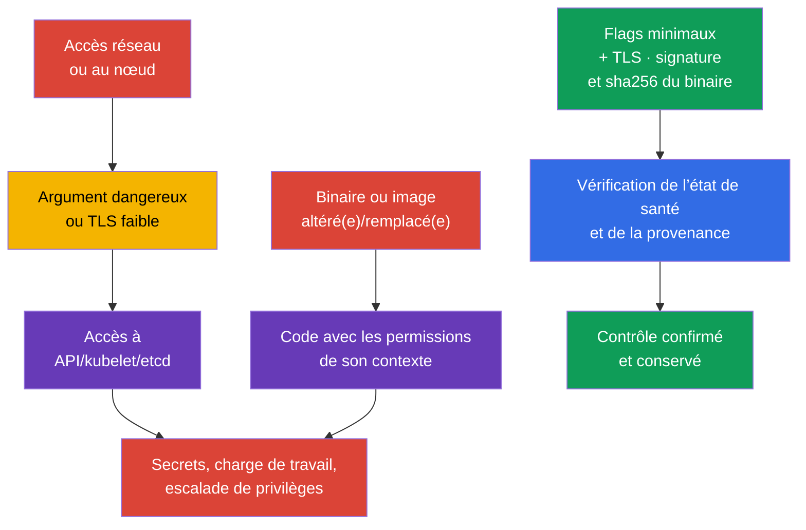
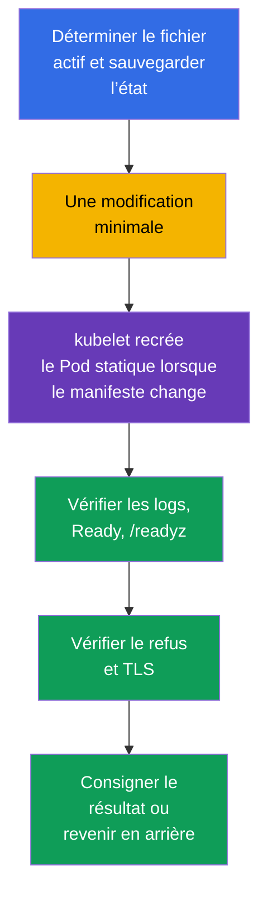

[Русская версия](ru.md) · [Eng version](README.md) · [Versión en español](es.md) · [Deutsche Version](de.md) · [ქართული ვერსია](ge.md) · [繁體中文版](tw.md) · [日本語版](jp.md)

# Chapitre 09. Arguments de composants non sécurisés, durcissement TLS et vérification des binaires

> **Le problème.** Un attaquant qui obtient un accès réseau à un endpoint du control plane ou
> la capacité de modifier un fichier sur un nœud ne cherche pas une vulnérabilité dans Kubernetes lui-même, mais un argument
> adjacent non sécurisé : accès anonyme, port kubelet en lecture seule, TLS faible, ou un
> `kubelet`/`kubectl`/une image altéré(e) ou remplacé(e) de façon inattendue avant même son démarrage. Une telle faille peut ouvrir un accès à
> l’API/etcd ou permettre l’exécution de code dans le contexte d’un artefact altéré ou remplacé. Pour un
> binaire de plateforme, les conséquences dépendent de l’exécution : un binaire kubelet/control-plane altéré ou remplacé obtient
> les permissions de son processus de service, tandis qu’un `kubectl` altéré ou remplacé obtient les permissions de l’utilisateur
> OS qui l’invoque et l’accès au kubeconfig/aux identifiants de cet utilisateur.

> **La suite.** Dans le chapitre 08, nous avons protégé l’ingress HTTP externe avec TLS. Nous devons maintenant protéger
> les composants du control plane et kubelet eux-mêmes : un argument non sécurisé peut ouvrir une
> API anonyme, un endpoint de diagnostic ou un canal TLS faible. Nous vérifions ensuite que nous exécutons
> les binaires Kubernetes publiés. Cela relève du domaine **Cluster
> Setup** (CKS, 15 %).

> **Ce dont vous avez besoin de CKA.** L’architecture du control plane, kubeadm et les Pods statiques sont abordés dans
> le [chapitre 35 de CKA](../../../cka/course/35/fr.md), tandis que la surface d’attaque des composants Kubernetes est dans
> le [chapitre 02 de CKA](../../../cka/course/02/fr.md). Leur configuration de base n’est pas répétée ici :
> nous trouvons les arguments dangereux, modifions la configuration active en toute sécurité et démontrons le résultat.

> 🧠 La protection est déterminée par l’état d’exécution actif, non par une ligne dans un modèle, un tag ou une version attendue.

## 09.1. Modèle de menaces : un flag ou un artefact comme point d’entrée

Le control plane prend des décisions pour tout le cluster. `kube-apiserver` accorde et vérifie
l’accès à l’API, `kubelet` démarre les Pods sur un nœud, et `etcd` stocke les Secrets, RBAC et l’état
souhaité. Ainsi, un paramètre faible a un impact plus important qu’une erreur dans une application.

Une chaîne d’attaque typique ressemble à ceci : un attaquant obtient un accès réseau à un endpoint ou
la capacité de modifier un fichier sur un nœud ; il utilise un accès anonyme, un port kubelet en lecture seule,
`AlwaysAllow` ou le profiling ; puis lit des données ou agit avec les permissions de quelqu’un d’autre.
Un autre chemin consiste à altérer ou remplacer un artefact avant son exécution. Un binaire kubelet ou
control-plane altéré ou remplacé s’exécute avec les permissions du processus de service/hôte correspondant ;
un `kubectl` altéré ou remplacé s’exécute avec les permissions de l’utilisateur local et ses identifiants Kubernetes
disponibles ; une image de conteneur avec les permissions du contexte de sécurité de sa charge de travail. Ainsi,
vérifiez la provenance avant l’exécution et évaluez les conséquences selon le contexte d’exécution
réel, non selon la formule générale « permissions du composant ».



Le durcissement n’est pas un ensemble de lignes « pour CIS ». Avant de modifier quoi que ce soit, répondez à quatre questions :
quel processus utilise réellement le paramètre, qui est son client, si les certificats et les
suites de chiffrement sont compatibles, comment vérifier la disponibilité et comment revenir en arrière. Dans Kubernetes managé, une partie du
control plane appartient au fournisseur : n’essayez pas de modifier ses fichiers hôte ; consultez plutôt
la documentation des paramètres de sécurité disponibles.

> 🎯 Inspectez la configuration active et les arguments de processus, corrigez l’unique source effective, redémarrez le composant et confirmez l’état actif, le comportement et l’état de santé ; pour un binaire - la provenance et SHA-256.

## 09.2. Arguments dangereux : quoi rechercher et pourquoi

Tous les flags ne sont pas également dangereux dans chaque topologie. Leur valeur, adresse d’écoute, firewall,
TLS et RBAC forment un contrôle unique. Mais les paramètres suivants exigent une justification explicite ou
une remédiation.

| Composant | Paramètre dangereux | Risque | Cible sûre |
|---|---|---|---|
| `kube-apiserver` | accès anonyme étendu | une requête sans identifiants acceptés peut être traitée comme `system:anonymous` ; avec un RBAC erroné, cela crée un chemin d’accès non authentifié | un benchmark peut exiger `--anonymous-auth=false` ; en production, vérifiez d’abord les endpoints de santé et la découverte kubeadm, et dans Kubernetes 1.34+ restreignez l’accès anonyme via `AuthenticationConfiguration` si nécessaire |
| `kube-apiserver` | `--authorization-mode=AlwaysAllow` ou ajout de `AlwaysAllow` | chaque requête authentifiée passe l’autorisation | pour kubeadm, normalement `Node,RBAC` |
| `kube-apiserver` | `--profiling=true` | le profiling peut révéler l’état du processus et est inutile sur une frontière publique | `--profiling=false` |
| `kube-apiserver` | anciens `--insecure-port`/`--insecure-bind-address` | API sans TLS ni authentification | ne pas activer ; ces options anciennes sont supprimées dans les Kubernetes modernes |
| `kubelet` | `--read-only-port` différent de `0` | un endpoint non authentifié peut révéler les données de Pod et de nœud | `--read-only-port=0` ou `readOnlyPort: 0` |
| `kubelet` | `--anonymous-auth=true` | un client anonyme atteint l’API kubelet | `--anonymous-auth=false` ou un champ de l’API de configuration |
| `kubelet` | `--authorization-mode=AlwaysAllow` | tout client authentifié obtient un accès excessivement étendu à l’API kubelet | `--authorization-mode=Webhook` |
| `kubelet` | `--protect-kernel-defaults=false` | en cas de non-concordance avec la baseline, kubelet n’échoue pas rapidement et peut tenter de modifier les flags du kernel au niveau hôte pour atteindre les valeurs attendues | `--protect-kernel-defaults=true` après vérification de sysctl |
| `kube-controller-manager` | `--profiling=true` ou `--use-service-account-credentials=false` | diagnostics inutiles ou utilisation d’identifiants étendus au lieu de SAs distincts | `--profiling=false`, identifiants de service account distincts |
| `kube-scheduler` | profiling activé ou endpoint sur une large `--bind-address` | un endpoint de diagnostic devient accessible à un réseau inutile | `enableProfiling: false` ; le CLI `--profiling` obsolète et la gestion par kube-bench d’un scheduler fondé sur une configuration sont abordés au [chapitre 07](../07/fr.md) |
| `etcd` | `--client-cert-auth=false`, `--listen-client-urls` non sécurisé | un client sans mTLS ou un réseau externe accède au stockage du cluster | mTLS, réseau local/interne, firewall |

Pour une tâche CIS/CKS précise, un benchmark peut exiger explicitement `--anonymous-auth=false` ;
respectez alors l’exigence exacte de la tâche et démontrez le résultat.

En production avec kubeadm, n’appliquez pas cette modification mécaniquement. La commande standard
`kubeadm join` fondée sur un token utilise la lecture publique de `kube-public/cluster-info` par le groupe
`system:unauthenticated`, donc désactiver complètement l’authentification anonyme modifie le cycle de vie de
la découverte. Vérifiez aussi les probes de santé de `kube-apiserver` si elles accèdent à
des endpoints de santé anonymes.

Dans Kubernetes 1.34+, vous pouvez utiliser `AuthenticationConfiguration`, en autorisant l’accès
anonyme uniquement aux endpoints explicitement requis. Si `cluster-info` public n’est plus
nécessaire, déplacez d’abord l’ajout/la découverte des nœuds vers une alternative appropriée, puis seulement supprimez cet accès.
Par exemple, un fichier distinct monté dans le Pod statique via
`--authentication-config=<path>` peut contenir :

```yaml
apiVersion: apiserver.config.k8s.io/v1
kind: AuthenticationConfiguration
anonymous:
  enabled: true
  conditions:
  - path: /livez
  - path: /readyz
  - path: /healthz
```

Si l’accès anonyme ne reste que pour `/livez`, `/readyz` et `/healthz`, la commande
`kubeadm join` ordinaire fondée sur un token via `cluster-info` public ne fonctionne pas. Cela n’est acceptable
que si le cycle de vie d’ajout des nœuds a basculé vers un autre mécanisme de découverte.

Si le champ `anonymous` est défini dans `AuthenticationConfiguration`, vous ne pouvez pas utiliser
`--anonymous-auth` en même temps. L’option limitée aux endpoints ne satisfait pas un benchmark lorsqu’il
exige explicitement `--anonymous-auth=false` ; sélectionnez et documentez le modèle applicable à
votre cluster.

Inventoriez d’abord les paramètres actifs, pas seulement le fichier modèle. Recherchez les
doublons : la dernière valeur ou celle réellement utilisée dépend de l’implémentation, tandis que des flags en conflit
compliquent le diagnostic. Si `kube-bench` signale déjà la constatation précise
(chapitre 07), utilisez sa remédiation comme source du flag et du fichier exacts ; les paramètres
spécifiques à TLS (`--tls-min-version`, `--tls-cipher-suites`) sont abordés séparément ci-dessous dans 09.4-09.5.

`--enable-debugging-handlers` pour kubelet est également évalué selon le risque : il active des
handlers de diagnostic dont les parties nécessaires peuvent être utilisées par `kubectl logs`, `exec`
et `port-forward`. Ne le désactivez pas aveuglément. Déterminez d’abord les opérations nécessaires et
protégez l’API kubelet sur `10250` avec authentification + autorisation `Webhook`.

Restreignez l’accès réseau à `10250` au niveau du nœud ou de l’infrastructure : un firewall hôte,
un security group/ACL cloud ou une politique hôte propre au CNI. Ne vous fiez pas à une `NetworkPolicy` Kubernetes ordinaire
comme contrôle portable de l’endpoint kubelet : il s’agit de trafic hôte/nœud,
et le comportement de NetworkPolicy pour `hostNetwork` et l’IP de nœud dépend de l’implémentation CNI.
Il en va de même pour les métriques : profiling et métriques sont des endpoints différents.

## 09.3. Où modifier la configuration et comment redémarrer en toute sécurité

Le processus général pour modifier en sécurité la configuration du control plane en Pod statique (sauvegarde, modification minimale,
vérification de l’état de santé, récupération après échec) est traité au chapitre 07 - il n’est pas
répété ici, mais complété par une technique propre au chapitre et les détails de découverte de la configuration
de kubelet/scheduler/controller-manager, particulièrement importants pour les changements TLS et de
chiffrement ci-dessous dans 09.4.

Kubelet n’est pas un Pod statique : sa configuration se trouve habituellement dans
`/var/lib/kubelet/config.yaml`, tandis que les arguments supplémentaires sont dans
`/var/lib/kubelet/kubeadm-flags.env` et un drop-in systemd. Dans Kubernetes 1.36, recherchez aussi
`--config-dir` : kubelet applique sa configuration principale, puis uniquement les fichiers drop-in `*.conf`
(y compris les sous-répertoires) de ce répertoire dans l’ordre lexical ; il y ignore les fichiers `*.yaml`.
Dans Kubernetes 1.36, kubelet fusionne les sources dans cet ordre : les feature gates CLI
ont la priorité la plus basse, puis la configuration principale s’applique, ensuite les `*.conf` de
`--config-dir`, tandis que les arguments CLI restants ont la priorité la plus haute. Ainsi, pour les
paramètres ordinaires de ce chapitre, un flag CLI peut remplacer YAML/les drop-ins, mais n’étendez pas cette
règle à `--feature-gates`.

Déterminez les `--config`, `--config-dir` et arguments CLI réels avec
`systemctl cat kubelet` et la ligne de commande du processus réel. Ne définissez pas un paramètre ordinaire
dans plusieurs sources à la fois, sauf nécessité.

Pour scheduler, vérifiez d’abord si `--config=<path>` est défini :
`KubeSchedulerConfiguration` peut être sa source effective, et certains flags CLI anciens sont
obsolètes/ignorés lorsque `--config` est présent. Par exemple, le `--profiling` de scheduler est obsolète ;
dans la configuration du composant, vérifiez `enableProfiling: false`.

Pour `kube-controller-manager`, Kubernetes 1.36 n’a pas d’option générale `--config`
équivalente à scheduler : ses paramètres de fonctionnement sont toujours définis par des flags CLI dans le manifeste actif /
les arguments du processus. `KubeControllerManagerConfiguration` existe comme configuration de composant
API et représentation interne/configz, mais n’est pas un fichier externe général `--config` pour
kube-controller-manager.

Ainsi, déterminez d’abord l’exécution du composant particulier, puis vérifiez exactement la
source active qu’il prend en charge.



Une technique supplémentaire pour un control plane en Pod statique est le renommage atomique via un
candidat caché dans le même répertoire surveillé. Elle est plus fiable que la sauvegarde+modification ordinaire lorsqu’il importe de ne pas
laisser le cluster sans API, même temporairement, à cause d’une erreur dans le YAML intermédiaire :

```bash
# 1. Créez un candidat caché dans le répertoire surveillé lui-même ; kubelet ignore les fichiers
# dont le nom commence par un point, le Pod n’est donc pas recréé avant le remplacement atomique.
# /etc/kubernetes/manifests peut être un montage distinct : si le candidat est créé dans
# /etc/kubernetes, mv entre différents systèmes de fichiers devient copy+unlink et cesse d’être
# un renommage atomique.
sudo install -d -m 700 /root/k8s-manifest-backup
CANDIDATE=$(sudo mktemp /etc/kubernetes/manifests/.kube-apiserver.yaml.candidate.XXXXXX)
sudo cp -p /etc/kubernetes/manifests/kube-apiserver.yaml "$CANDIDATE"
sudo cp -p /etc/kubernetes/manifests/kube-apiserver.yaml \
  /root/k8s-manifest-backup/kube-apiserver.yaml.$(date +%F-%H%M%S)
sudoedit "$CANDIDATE"

# 2. Validez réellement la structure YAML/API candidate sans toucher au Pod statique en cours d’exécution.
sudo kubectl apply --dry-run=client --validate=strict -f "$CANDIDATE"

# 3. Seulement après validation réussie, remplacez atomiquement le manifeste surveillé.
# Le candidat et la cible sont dans un même répertoire et un même système de fichiers,
# le renommage est donc garanti atomique.
sudo mv -f "$CANDIDATE" /etc/kubernetes/manifests/kube-apiserver.yaml

# 4. Surveillez la recréation depuis la console du nœud, puis vérifiez l’API.
watch -n 2 'sudo crictl ps -a --name kube-apiserver'
kubectl get --raw='/readyz?verbose'
kubectl get nodes

# Si le Pod statique ne démarre pas, lisez d’abord les logs kubelet et runtime.
sudo journalctl -u kubelet -n 100 --no-pager
sudo crictl ps -a --name kube-apiserver
sudo crictl logs "$(sudo crictl ps -aq --name kube-apiserver | head -n1)"
```

Conservez tout de même les fichiers de sauvegarde permanents hors de `/etc/kubernetes/manifests/` (comme à l’étape 1
ci-dessus) : un candidat caché n’est nécessaire que pour le remplacement lui-même, non comme copie à long terme.

Avant kubelet, vérifiez d’abord les valeurs et la configuration sysctl, puis ne redémarrez que celui-ci. Un `systemctl restart kubelet` ordinaire à lui seul n’arrête pas les Pods et conteneurs déjà en cours d’exécution : le runtime de conteneur continue de les exécuter et, après le démarrage, kubelet restaure la réconciliation. Néanmoins, sur un control plane, modifiez kubelet un nœud à la fois et surveillez le heartbeat du Node, les logs kubelet et `/readyz` : une erreur de configuration peut laisser un nœud `NotReady` ou empêcher la gestion ultérieure des Pods statiques.

```yaml
# /var/lib/kubelet/config.yaml - exemple de fragment d’API de configuration.
readOnlyPort: 0
authentication:
  anonymous:
    enabled: false
authorization:
  mode: Webhook
protectKernelDefaults: true
```

```bash
sudo systemctl restart kubelet
sudo systemctl --no-pager --full status kubelet
sudo journalctl -u kubelet -n 100 --no-pager
check_kubelet_10255() {
  local listeners

  if ! listeners="$(sudo ss -H -lntp 'sport = :10255')"; then
    echo 'ERROR: cannot inspect listening TCP sockets; port 10255 is not verified' >&2
    return 1
  fi

  if [[ -n "$listeners" ]]; then
    printf '%s\n' "$listeners"
    echo 'FAIL: kubelet read-only port 10255 is listening' >&2
    return 1
  fi

  echo 'PASS: kubelet read-only port 10255 is closed'
}
check_kubelet_10255
kubectl get nodes

# Résultat final après la configuration de base, les drop-ins *.conf et les remplacements CLI ; un accès autorisé est requis.
NODE="${NODE:?set target node name from kubectl get nodes}"
kubectl get --raw "/api/v1/nodes/${NODE}/proxy/configz" \
  | jq '.kubeletconfig | {readOnlyPort, authentication, authorization, protectKernelDefaults}'
```

## 09.4. Renforcement TLS pour apiserver, kubelet et etcd

TLS protège déjà le canal, mais la version et l’ensemble des suites de chiffrement déterminent quelles options
cryptographiques un client peut négocier. Autoriser des protocoles obsolètes ou des
algorithmes de chiffrement faibles facilite les rétrogradations et l’utilisation de cryptographie dépassée. Un minimum de `TLS 1.2`
est normalement compatible avec les clients Kubernetes modernes ; `TLS 1.3` restreint
plus fortement les clients et exige une vérification distincte de l’ensemble du control plane, de l’automatisation et de la supervision.

Les valeurs par défaut modernes de Go et Kubernetes excluent déjà les protocoles obsolètes et les suites
non sûres ; il n’existe pas de « courte liste sécurisée » universelle. Ne transportez pas une
courte liste arbitraire entre composants ou versions. Si la politique de l’organisation ou un profil
CIS spécifique exige une liste approuvée, appliquez exactement cette liste après avoir inventorié les
certificats et les clients, plutôt que de l’opposer à la base de renforcement.
Une liste RSA uniquement n’est pas une valeur par défaut sûre : elle casse un endpoint avec un certificat ECDSA
et réduit inutilement la compatibilité. Les suites TLS 1.3 dans Go ne sont généralement pas contrôlées par
`--tls-cipher-suites` : l’implémentation TLS les sélectionne, ce flag concerne donc principalement
TLS 1.2 et les versions antérieures.

> 🔬 L’épinglage des suites de chiffrement et TLS 1.3 exigent une politique approuvée, l’inventaire des clients et la comparaison des valeurs avec la version du composant.

Pour les composants Kubernetes, les valeurs de chaîne autorisées du flag prennent normalement la forme
`VersionTLS12` et `VersionTLS13`. Pour etcd, le nom de la valeur dépend de la version d’etcd : l’aide
actuelle utilise couramment `TLS1.2`/`TLS1.3`. Ne transposez pas une valeur entre programmes par
supposition - avant de modifier, vérifiez `--help` du binaire qui exécute cette version, et non
la documentation de mémoire ou d’une autre release.

À l’examen, le moyen le plus rapide d’obtenir les flags exacts et les valeurs autorisées est de les tirer du
processus en cours d’exécution, plutôt que de chercher sur le Web - la documentation de la version nécessaire peut être
indisponible ou demander du temps à trouver. Si un composant s’exécute dans un Pod statique et que son
conteneur est `Running`, utilisez d’abord `kubectl exec`. `Ready=False` en soi n’interdit pas
exec : un conteneur en cours d’exécution ainsi que des chemins API/RBAC/streaming disponibles sont ce qui compte pour exec.
La disponibilité détermine l’état `Ready` d’un Pod, sert à inclure un Pod dans le trafic d’un Service, et
participe à la sémantique de disponibilité/de déploiement progressif des contrôleurs de charge de travail, mais elle ne bloque pas `kubectl exec`.
Si le chemin API/RBAC/streaming de `kubectl exec` n’est pas disponible mais que le composant s’exécute réellement comme
conteneur CRI, utilisez `crictl exec` avec l’ID de conteneur spécifique.

Si un composant s’exécute comme service hôte `systemd` distinct, `crictl exec` ne s’applique pas :
obtenez l’exécutable du processus actif ou de `ExecStart` et invoquez son `--help`
directement sur le nœud.

```bash
# Pod statique / Pod miroir : le conteneur doit être Running (Ready n’est pas requis).
kubectl -n kube-system exec kube-apiserver-<node> -- kube-apiserver --help 2>&1 \
  | grep -A2 -- '--tls-min-version\|--tls-cipher-suites'

kubectl -n kube-system exec etcd-<node> -- etcd --help 2>&1 \
  | grep -A2 -- '--cipher-suites\|--tls-min-version'

# Solution de repli uniquement si etcd s’exécute réellement comme conteneur CRI.
CID="$(sudo crictl ps -q --name etcd | head -n1)"
if [[ -n "$CID" ]]; then
  sudo crictl exec "$CID" etcd --help 2>&1 \
    | grep -A2 -- '--tls-min-version'
fi

# Si etcd est un processus hôte/systemd distinct, utilisez l’exécutable de ce processus.
PID="$(pgrep -xo etcd)"
if [[ -n "$PID" ]]; then
  sudo "/proc/${PID}/exe" --help 2>&1 \
    | grep -A2 -- '--tls-min-version'
fi
```

La sortie de `--help` montre le nom exact du flag et, pour la plupart des versions, une courte description avec
les valeurs autorisées à côté du flag. Il s’agit du même binaire et de la même version qui s’exécutent réellement dans le
cluster ; il n’y a donc pas de décalage avec la documentation d’une autre release et aucun temps n’est perdu à
passer au navigateur.

La preuve de l’exigence du benchmark « etcd n’accepte pas moins que TLS 1.2 » est le
`--tls-min-version` actif et un handshake vérifié, et non une liste arbitraire de chiffres RSA uniquement ;
vérifiez le libellé exact et la version du benchmark utilisé.

```yaml
# /etc/kubernetes/manifests/kube-apiserver.yaml, fragment de commande.
# Les valeurs par défaut modernes de Go laissent les suites sans épinglage explicite.
- kube-apiserver
- --tls-min-version=VersionTLS12
# Ajoutez --tls-cipher-suites uniquement avec une politique/compatibilité approuvée.
# Si la politique exige une liste, incluez les suites ECDSA et RSA nécessaires à vos certificats :
# - --tls-cipher-suites=TLS_ECDHE_ECDSA_WITH_AES_128_GCM_SHA256,TLS_ECDHE_ECDSA_WITH_AES_256_GCM_SHA384,TLS_ECDHE_RSA_WITH_AES_128_GCM_SHA256,TLS_ECDHE_RSA_WITH_AES_256_GCM_SHA384
```

Pour kubelet, préférez son API de configuration ; si l’installation transmet les paramètres via
systemd, utilisez les flags équivalents dans l’unique source active. De même,
laissez `tlsCipherSuites` non défini jusqu’à ce qu’une politique documentée l’exige.

```yaml
# /var/lib/kubelet/config.yaml, fragment ; la prise en charge des champs exacts dépend de la version de kubelet.
tlsMinVersion: VersionTLS12
```

```yaml
# /etc/kubernetes/manifests/etcd.yaml, exemple pour etcd qui accepte la valeur TLS1.2.
# --cipher-suites n’est pas ajouté : les valeurs par défaut de Go sont sûres sauf si la politique exige autre chose.
- etcd
- --tls-min-version=TLS1.2
```

Ne restreignez pas TLS uniquement sur l’endpoint serveur. etcd a du trafic client et pair, tandis que
apiserver a des clients kubelet, controller-manager, scheduler, kubectl, webhook et
d’automatisation. Collectez d’abord les certificats/clés réels, les adresses d’écoute et les clients ;
puis appliquez le changement sur un nœud de test ou un nœud HA. Lors du passage à
`VersionTLS13`, attendez-vous à ce qu’un ancien client TLS 1.2 soit refusé - cela ne prouve pas une
erreur du serveur, mais exige un plan de migration des clients.

La vérification du minimum TLS doit inclure deux éléments distincts :

1. preuve protocolaire - la version autorisée négocie avec succès, tandis qu’une version inférieure
   au minimum configuré est rejetée ;
2. santé de l’application - le composant reste opérationnel après le changement.

Pour apiserver, il suffit de vérifier un handshake sur `6443` ; kubelet `10250` exige souvent
un certificat client et une autorisation après le handshake ; pour etcd, `etcdctl endpoint health`
prouve seulement la santé de l’application, vérifiez donc séparément le handshake de protocole via
`openssl s_client`. N’affichez pas une clé privée dans le terminal et ne copiez pas la PKI depuis le nœud.

Avant un test négatif, assurez-vous que le client TLS utilisé peut réellement proposer la version de
protocole héritée testée. OpenSSL moderne ou une politique cryptographique système peuvent eux-mêmes interdire
TLS 1.1. Si un client rejette TLS 1.1 localement, ce résultat ne prouve pas le
`tls-min-version` côté serveur. Un test négatif n’est une preuve que lorsque vous pouvez voir que le client a tenté de
négocier le protocole hérité et que le rejet provient de l’endpoint testé. Cette règle s’applique également
à apiserver, kubelet et etcd.

```bash
# apiserver, test positif : TLS 1.2 doit négocier avec succès.
# Remplacez l’adresse et le SNI par les valeurs de votre cluster.
export API=127.0.0.1:6443
OUT="$(mktemp)"

if openssl s_client \
    -connect "$API" \
    -servername kubernetes \
    -tls1_2 \
    -CAfile /etc/kubernetes/pki/ca.crt \
    -verify_return_error \
    </dev/null >"$OUT" 2>&1
then
  if grep -Eq 'Cipher is \(NONE\)|Cipher[[:space:]]*:[[:space:]]*0000' "$OUT"; then
    cat "$OUT"
    rm -f "$OUT"
    echo 'FAIL: TLS 1.2 handshake has no negotiated cipher' >&2
    exit 1
  fi
  grep -E 'Protocol|Cipher|Verify return code' "$OUT"
  echo 'PASS: TLS 1.2 handshake succeeded'
else
  cat "$OUT" >&2
  rm -f "$OUT"
  echo 'FAIL: TLS 1.2 handshake failed' >&2
  exit 1
fi
rm -f "$OUT"

# apiserver, test négatif : TLS 1.1 doit être rejeté par le serveur.
# Un simple grep de « protocol|alert » ne distingue pas un rejet côté serveur d’une interdiction
# OpenSSL/politique cryptographique locale avant l’envoi de ClientHello - les deux faits doivent être prouvés.
# Il est formulé comme une fonction : return 1 dans toute branche autre que PASS afin que le statut de sortie corresponde
# au verdict textuel et que l’automatisation (cmd && echo PASS, wrapper CI, $?) ne se casse pas.
check_tls11_rejected() {
  local endpoint="$1"
  local servername="$2"
  local neg rc

  neg="$(mktemp)" || return 1

  # @SECLEVEL=0 affaiblit uniquement ce client de test ponctuel afin que
  # OpenSSL moderne puisse former un ClientHello TLS 1.1 lorsque possible ; le serveur reste inchangé.
  if openssl s_client \
      -connect "$endpoint" \
      -servername "$servername" \
      -tls1_1 \
      -cipher 'DEFAULT:@SECLEVEL=0' \
      -msg -state \
      </dev/null >"$neg" 2>&1
  then
    rc=0
  else
    rc=$?
  fi

  if grep -Eq '^>>> .*Handshake.*ClientHello' "$neg" \
     && grep -Eq '^<<< .*Alert.*fatal protocol_version|alert protocol version' "$neg"
  then
    echo 'PASS: client sent TLS 1.1 ClientHello and server rejected it with protocol_version'
    rm -f "$neg"
    return 0
  fi

  if grep -Eqi 'no protocols available|no ciphers available|unsupported protocol' "$neg" \
     && ! grep -Eq '^>>> .*Handshake.*ClientHello' "$neg"
  then
    cat "$neg" >&2
    echo 'INCONCLUSIVE: local OpenSSL/crypto policy blocked TLS 1.1 before ClientHello' >&2
    rm -f "$neg"
    return 1
  fi

  cat "$neg" >&2
  echo "INCONCLUSIVE/FAIL: server-side TLS 1.1 rejection was not proven (s_client rc=${rc})" >&2
  rm -f "$neg"
  return 1
}
check_tls11_rejected "$API" kubernetes

# etcd : vérifiez d’abord le handshake TLS 1.2 autorisé avec mTLS - le même modèle
# que pour apiserver : statut de sortie de s_client, -verify_return_error et vérification du
# suite de chiffrement réellement négociée, pas uniquement du code Verify return.
OUT="$(mktemp)"

if sudo openssl s_client \
    -connect 127.0.0.1:2379 \
    -tls1_2 \
    -CAfile /etc/kubernetes/pki/etcd/ca.crt \
    -cert /etc/kubernetes/pki/etcd/healthcheck-client.crt \
    -key /etc/kubernetes/pki/etcd/healthcheck-client.key \
    -verify_return_error \
    </dev/null >"$OUT" 2>&1
then
  if grep -Eq 'Cipher is \(NONE\)|Cipher[[:space:]]*:[[:space:]]*0000' "$OUT"; then
    cat "$OUT"
    rm -f "$OUT"
    echo 'FAIL: etcd TLS 1.2 handshake has no negotiated cipher' >&2
    exit 1
  fi
  grep -E 'Protocol|Cipher|Verify return code' "$OUT"
  echo 'PASS: etcd TLS 1.2 handshake succeeded'
else
  cat "$OUT" >&2
  rm -f "$OUT"
  echo 'FAIL: etcd TLS 1.2 handshake failed' >&2
  exit 1
fi
rm -f "$OUT"

# Puis un test négatif : TLS 1.1 ne doit pas négocier. Même critère que pour
# apiserver : prouvez que le client a envoyé ClientHello et que le serveur a renvoyé protocol_version.
# Une fonction distincte (pas check_tls11_rejected) : etcd exige un certificat/une clé client mTLS,
# que la fonction apiserver n’accepte pas. Return 1 dans toute branche autre que PASS pour la même raison.
check_etcd_tls11_rejected() {
  local endpoint="$1" cacert="$2" cert="$3" key="$4"
  local neg rc

  neg="$(mktemp)" || return 1

  if sudo openssl s_client \
      -connect "$endpoint" \
      -tls1_1 \
      -cipher 'DEFAULT:@SECLEVEL=0' \
      -CAfile "$cacert" \
      -cert "$cert" \
      -key "$key" \
      -msg -state \
      </dev/null >"$neg" 2>&1
  then
    rc=0
  else
    rc=$?
  fi

  if grep -Eq '^>>> .*Handshake.*ClientHello' "$neg" \
     && grep -Eq '^<<< .*Alert.*fatal protocol_version|alert protocol version' "$neg"
  then
    echo 'PASS: client sent TLS 1.1 ClientHello and etcd rejected it with protocol_version'
    rm -f "$neg"
    return 0
  fi

  if grep -Eqi 'no protocols available|no ciphers available|unsupported protocol' "$neg" \
     && ! grep -Eq '^>>> .*Handshake.*ClientHello' "$neg"
  then
    cat "$neg" >&2
    echo 'INCONCLUSIVE: local OpenSSL/crypto policy blocked TLS 1.1 before ClientHello' >&2
    rm -f "$neg"
    return 1
  fi

  cat "$neg" >&2
  echo "INCONCLUSIVE/FAIL: etcd server-side TLS 1.1 rejection was not proven (s_client rc=${rc})" >&2
  rm -f "$neg"
  return 1
}
check_etcd_tls11_rejected 127.0.0.1:2379 \
  /etc/kubernetes/pki/etcd/ca.crt \
  /etc/kubernetes/pki/etcd/healthcheck-client.crt \
  /etc/kubernetes/pki/etcd/healthcheck-client.key

# Vérifiez séparément la santé de l’application etcd.
export ETCDCTL_API=3
sudo etcdctl --endpoints=https://127.0.0.1:2379 endpoint health \
  --cacert=/etc/kubernetes/pki/etcd/ca.crt \
  --cert=/etc/kubernetes/pki/etcd/healthcheck-client.crt \
  --key=/etc/kubernetes/pki/etcd/healthcheck-client.key

# Source souhaitée : le manifeste contient réellement la modification attendue.
sudo grep -nE -- '--(tls-min-version|tls-cipher-suites|cipher-suites)' \
  /etc/kubernetes/manifests/{kube-apiserver,etcd}.yaml

# Runtime actif : le manifeste n’est qu’une source souhaitée que kubelet lit périodiquement ;
# lisez argv des processus qui s’exécutent réellement sur ce nœud.
for PROC in kube-apiserver etcd; do
  PID="$(pgrep -xo "$PROC")" || {
    echo "ERROR: running process not found: $PROC" >&2
    continue
  }
  echo "=== active argv: $PROC (pid=$PID) ==="
  sudo cat "/proc/${PID}/cmdline" \
    | tr '\0' '\n' \
    | grep -E -- '--(tls-min-version|tls-cipher-suites|cipher-suites)' \
    || echo "INFO: matching TLS flag is absent from active argv of $PROC"
done

# Puis les tests comportementaux TLS et la santé.
kubectl get --raw='/readyz?verbose'
kubectl get nodes
```

| Symptôme après le changement | Cause probable | Vérification et action |
|---|---|---|
| apiserver ne démarre pas | faute de frappe YAML, flag non pris en charge ou algorithme de chiffrement | `journalctl -u kubelet`, `crictl logs` ; restaurez le dernier manifeste fonctionnel |
| le client obtient une version de protocole | le client est plus ancien que le minimum configuré | mettez à niveau le client ou sélectionnez temporairement un minimum convenu dans le cadre d’une exception approuvée |
| le handshake TLS échoue avec TLS 1.2 | l’algorithme de clé du certificat est incompatible avec les suites de chiffrement autorisées | inspectez `openssl x509 -text`, ajoutez des suites ECDSA/RSA adaptées |
| etcd n’est pas sain | le pair/client ne peut pas négocier TLS ou a perdu l’accès à une clé | testez tous les endpoints de membres avec mTLS, inspectez les logs etcd, annulez sur un nœud |
| `openssl` affiche une suite de chiffrement TLS 1.3 absente de la liste | la bibliothèque TLS contrôle les suites de chiffrement TLS 1.3 | vérifiez la version minimale et la documentation de version ; ne considérez pas cela comme un contournement du flag |

## 09.5. Vérification des binaires de la plateforme Kubernetes : signature et sha256

HTTPS lors du téléchargement protège le transport, mais ne prouve pas qui a publié le fichier.
SHA-256 vérifie l’**intégrité** : le binaire téléchargé est égal aux octets décrits par le
digest sélectionné. Ce n’est pas une preuve de provenance : un hachage obtenu avec le fichier
depuis la même source non fiable, ou une référence non approuvée, ne crée pas de confiance.

Pour Kubernetes, prenez l’artefact de publication officiel propre à la version. Kubernetes publie
une signature cosign sans clé et un certificat avec le binaire ; `verify-blob` vérifie la signature
et la liaison du certificat à l’identity et à l’OIDC issuer attendus, c’est-à-dire l’origine de la
publication. Vérifiez explicitement l’identity et l’issuer, au lieu d’accepter un certificat
arbitraire. Figez la version dans une variable : `latest` ne peut pas être reproduit de manière fiable.

```bash
export K8S_VERSION=v1.36.0
export ARCH=amd64
export BIN=kubectl
export BASE="https://dl.k8s.io/release/${K8S_VERSION}/bin/linux/${ARCH}"

# Télécharger le binaire et la signature/le certificat sans clé publiés de la publication propre à la version.
for FILE in "${BIN}" "${BIN}.sig" "${BIN}.cert" "${BIN}.sha256"; do
  curl -fsSL --retry 3 --retry-delay 3 "${BASE}/${FILE}" -o "${FILE}"
done

# Valeurs officielles de Kubernetes Release Engineering pour les artefacts binaires.
# cosign 2+ exige les deux contraintes ; ne les supprimez pas pour une vérification « réussie ».
cosign verify-blob "${BIN}" \
  --signature "${BIN}.sig" \
  --certificate "${BIN}.cert" \
  --certificate-identity krel-staging@k8s-releng-prod.iam.gserviceaccount.com \
  --certificate-oidc-issuer https://accounts.google.com

# SHA-256 - vérification supplémentaire de l’égalité des octets avec le digest de publication approuvé.
printf '%s  %s\n' "$(tr -d '[:space:]' < "${BIN}.sha256")" "${BIN}" > "${BIN}.sha256sum"
sha256sum --check "${BIN}.sha256sum"
# kubectl: OK

# Pour un fichier déjà installé, obtenir le digest observé et le comparer à l’inventaire approuvé.
sha256sum /usr/bin/kubelet
```

Ainsi, une signature/un certificat avec l’identity/l’issuer attendus fournissent la provenance,
tandis que la somme de contrôle fournit l’intégrité par rapport à un digest de publication fiable.
Kubernetes publie aussi des SBOM (SPDX) signés, mais l’épinglage de digest d’image, la signature
d’image de conteneur, les SBOM et l’admission policy relèvent du domaine **Supply Chain Security
(20 %)**, et non du Cluster Setup de ce chapitre. Consultez la pratique de ces contrôles dans les
[chapitres 24-28](../24/fr.md) ; ici, nous ne vérifions que les artefacts de publication et les
binaires de la plateforme Kubernetes elle-même.

Les vérifications détaillées des images de conteneur, notamment du digest, de la signature et des
SBOM, ne sont volontairement pas répétées ici : elles relèvent de Supply Chain Security ; voir les
[chapitres 24-28](../24/fr.md).

## 09.6. Scénario pratique : détecter une substitution avant les dégâts

Imaginez qu’un `kubelet` remplacé après son téléchargement arrive sur un worker. Une vérification
ordinaire par `kubelet --version` ne détectera pas le problème : un binaire malveillant peut renvoyer
la version attendue.

Conservez d’abord les hachages observés, comparez-les au manifeste de publication approuvé et
effectuez un triage des preuves, de la provenance, de la référence et des changements autorisés avant
de choisir le confinement. Ne « corrigez » pas un écart en modifiant le hachage de référence : en cas
de changement non confirmé ou d’autres signes de substitution, escaladez selon le runbook d’incident.

```bash
# 1. Conserver les preuves sur le nœud avant de remplacer le fichier.
sudo sha256sum /usr/bin/kubelet | sudo tee /root/kubelet.sha256.observed
sudo stat -c '%y %s %U:%G %a %n' /usr/bin/kubelet
sudo systemctl cat kubelet

# 2. Comparer le hachage observé au digest de publication approuvé de l’inventaire fiable.
# Format de l’inventaire : '<digest>  /usr/bin/kubelet'. La commande renverra FAIL en cas de non-correspondance.
sudo sha256sum --check /root/approved-kubelet.sha256

# Effectuez la vérification ultérieure de imageID/digest selon la procédure supply-chain des chapitres 24-28.
```

Un `sha256sum --check` avec `FAILED` est un signal à examiner, mais ne prouve pas à lui seul une
compromission et ne prescrit pas une réponse unique d’« isolement ». Conservez d’abord les preuves et
effectuez le triage : (1) confirmez le chemin, la version et la référence approuvée attendue, en
écartant une erreur d’inventaire ou la mise à jour du mauvais fichier ; (2) vérifiez la provenance de
la publication par `cosign verify-blob` avec l’identity/l’issuer de certificat attendus, et comparez
les métadonnées du package/de la publication ; (3) trouvez un changement autorisé - enregistrement de
changement, rollout, gestionnaire de paquets et journaux CI - et rapprochez l’heure, le propriétaire
et le digest ; (4) comparez avec la référence précédemment connue comme bonne et avec le périmètre sur
les autres nœuds. Ne « corrigez » pas un écart en modifiant le hachage de référence.

Si les preuves ne confirment pas un changement autorisé, que la provenance/la référence ne
correspondent pas ou qu’il existe d’autres signes de substitution, escaladez selon le runbook
d’incident : arrêtez la propagation ultérieure, appliquez un confinement proportionné (jusqu’au
cordon/drain ou à l’isolement du nœud), conservez les journaux et remplacez le nœud ou le binaire de
manière contrôlée. Un seul hachage indique de façon fiable que les octets attendus ne correspondent
pas, mais n’explique pas la cause ni le chemin de modification. La réponse relative aux images de
conteneur et aux preuves registry/CI relève des procédures supply-chain des chapitres 24-28.

## 09.7. Vérification du résultat et diagnostic

Après toute modification, il faut des preuves à trois niveaux : la configuration active, le
comportement réel et la santé du cluster. La présence d’une ligne dans un fichier inutilisé ne
constitue pas une vérification.

```bash
# 1a. Source souhaitée du control plane : pour le staticPodPath par défaut de kubeadm.
# Si staticPodPath a été modifié, utilisez le répertoire réellement actif.
STATIC_POD_DIR=/etc/kubernetes/manifests
sudo grep -nE -- \
  '--(anonymous-auth|authorization-mode|profiling|tls-min-version|cipher-suites)' \
  "${STATIC_POD_DIR}"/{kube-apiserver,kube-controller-manager,kube-scheduler,etcd}.yaml

# 1b. argv du runtime actif des processus du control plane : le manifeste n’est qu’une source souhaitée,
# que kubelet lit périodiquement, et non la preuve d’un Pod recréé.
sudo ps -ww -eo pid,args \
  | grep -E '[k]ube-apiserver|[k]ube-controller-manager|[k]ube-scheduler|[e]tcd'

# Pour un paramètre précis, obtenez au besoin argv sans troncature :
APIPID="$(pgrep -xo kube-apiserver)" || {
  echo 'ERROR: kube-apiserver process not found' >&2
  false
}
sudo cat "/proc/${APIPID}/cmdline" | tr '\0' '\n'

# 1c. Kubelet : affichez d’abord les sources de démarrage réelles, plutôt que de deviner le chemin.
sudo systemctl cat kubelet
sudo ps -ef | grep '[k]ubelet'

# 1d. KubeletConfiguration effective finale après la config de base, --config-dir et les overrides.
NODE="${NODE:?set target node name from kubectl get nodes}"
kubectl get --raw "/api/v1/nodes/${NODE}/proxy/configz" \
  | jq '.kubeletconfig | {
      readOnlyPort,
      authentication,
      authorization,
      protectKernelDefaults,
      tlsMinVersion,
      tlsCipherSuites
    }'
```

Le manifeste et le runtime sont vérifiés séparément : le manifeste prouve la source souhaitée, et la
ligne de commande du processus prouve que le Pod statique a bien été recréé avec le nouvel argv. Si
un composant lit une configuration supplémentaire via `--config`, vérifiez séparément le fichier de
configuration actif/l’endpoint effectif du composant ; un argv seul ne suffit pas non plus dans ce cas.

Si `/configz` est indisponible à cause des autorisations ou de la topologie, ne revenez pas au
`/var/lib/kubelet/config.yaml` codé en dur : obtenez les véritables `--config` et `--config-dir` de
l’unité/du processus, lisez précisément ceux-ci, puis tenez compte des overrides CLI ordinaires.

```bash
# 2. Comportement : le port kubelet read-only est fermé. La fonction check_kubelet_10255 (voir §09.3)
# renvoie 1 dans toutes les branches non-PASS afin que le statut de sortie corresponde au verdict textuel.
check_kubelet_10255() {
  local listeners

  if ! listeners="$(sudo ss -H -lntp 'sport = :10255')"; then
    echo 'ERROR: cannot inspect listening TCP sockets; port 10255 is not verified' >&2
    return 1
  fi

  if [[ -n "$listeners" ]]; then
    printf '%s\n' "$listeners"
    echo 'FAIL: kubelet read-only port 10255 is listening' >&2
    return 1
  fi

  echo 'PASS: kubelet read-only port 10255 is closed'
}
check_kubelet_10255
```

Confirmez le minimum TLS avec les tests de protocole positif/négatif de §09.4. Ne répétez pas le
`openssl ... -tls1_1 | grep ...` simplifié sans vérifier les capacités du client local : OpenSSL
moderne ou la crypto policy du système peuvent eux-mêmes interdire TLS 1.1, et un tel test admet un
faux positif.

```bash
# 3. Santé : l’API, les nœuds et les Pods statiques sont revenus à l’état opérationnel.
kubectl get --raw='/readyz?verbose'
kubectl get nodes
kubectl -n kube-system get pods -o wide
sudo crictl ps | grep -E 'kube-apiserver|kube-controller-manager|kube-scheduler|etcd'
```

| La vérification échoue | À vérifier d’abord | Cause fréquente |
|---|---|---|
| `kubectl` ne répond pas après une modification de Pod statique | `journalctl -u kubelet`, `crictl ps -a`, journaux du conteneur | YAML, flag ou montage incorrect |
| le flag est visible, mais `kube-bench` est toujours en FAIL | arguments du processus et une source de la valeur | le modèle, et non le manifeste actif, a été modifié ; il existe un doublon |
| le port `10255` est toujours à l’écoute | drop-in systemd et `ps` de kubelet | le mauvais fichier de configuration a été modifié ou un ancien flag écrase YAML |
| un client TLS 1.2 ne se connecte plus | algorithme du certificat, liste de cipher, TLS client | ensemble de suites trop étroit ou client incompatible |
| `sha256sum --check` renvoie FAIL | manifeste approuvé, chemin et version | mauvais binaire, téléchargement endommagé ou substitution |

`kube-bench` est utile comme contrôle de régression, mais son profil doit correspondre à la version
et à l’architecture de Kubernetes. Répétez les cibles pertinentes après la correction et conservez
le rapport avec la version du benchmark. `WARN` demande une décision manuelle, pas l’ajout mécanique
d’un flag.

```bash
sudo kube-bench run --targets master,etcd | tee kube-bench-after.txt
grep -E '\[FAIL\]|\[WARN\]' kube-bench-after.txt
```

> 🏭 Référence immuable et versionnée pour les arguments, TLS et les binaires ; rollout canary/rolling et exceptions temporaires avec propriétaire et expiration.

## 09.8. Comment cela est appliqué en production

- **Référence immuable.** Les arguments des composants, la configuration kubelet et la policy TLS
  sont définis via la configuration kubeadm, l’image du nœud ou la gestion de configuration. La
  modification manuelle d’un Pod statique est une mesure d’urgence ou d’apprentissage, qui doit
  ensuite être réintégrée dans la source de vérité.
- **Durcissement TLS compatible.** L’inventaire des clients, une modification canary sur un nœud HA,
  la surveillance des erreurs de handshake et un plan de rollback précèdent `VersionTLS13` ou le
  resserrement des suites de chiffrement. Les exceptions ont une durée, un propriétaire et un contrôle compensatoire.
- **Détection de dérive.** Exécutez régulièrement `kube-bench`, vérifiez les arguments effectifs des
  processus et la configuration. Pour kubelet, une alerte doit se déclencher pour tout listener
  `10255`. Pour etcd, `2379/2380` à l’état `LISTEN` est normal : l’alerte porte sur un écart par
  rapport à la référence approuvée de bind/exposure - interface ou processus inattendu, accès depuis
  un réseau non autorisé, absence du mTLS/firewall exigé, ou autre dérive par rapport à la topologie du cluster.
- **Livraison vérifiable.** Le pipeline vérifie la signature/le certificat sans clé du binaire avec
  l’identity/l’issuer attendus et SHA-256 comme contrôle d’intégrité, et conserve séparément la
  référence de la plateforme approuvée. La signature d’image, les SBOM, le registry et les admission
  controls sont des sujets supply-chain des chapitres 24-28.
- **Rollback sûr.** Le manifeste de sauvegarde est conservé hors du répertoire des Pods statiques, et
  le rollback est testé hors production. En cas de suspicion de substitution, il est préférable de
  réinstaller le nœud depuis une image fiable que de continuer à travailler avec un hôte potentiellement modifié.

## 09.9. Mini-glossaire

- **Pod statique** - Pod issu d’un manifeste local du nœud, géré par kubelet, et non par le
  scheduler via l’API Kubernetes.
- **`--anonymous-auth`** - paramètre qui autorise ou interdit l’identity anonyme pour un endpoint
  d’API.
- **port kubelet read-only** - port kubelet hérité, non authentifié, qui doit être désactivé par la
  valeur `0`.
- **version minimale TLS** - version TLS minimale que le serveur négocie avec le client.
- **suite de chiffrement** - ensemble d’algorithmes cryptographiques TLS ; l’ensemble autorisé doit
  être compatible avec l’algorithme de certificat et les clients.
- **somme de contrôle SHA-256** - digest de fichier sur 256 bits utilisé pour vérifier la
  correspondance exacte des octets avec l’artefact publié.
- **provenance** - origine démontrable d’un artefact : qui l’a publié et depuis quelle publication ou
  quel pipeline fiable.

## 09.10. Résumé du chapitre

- Les dangereux `anonymous-auth`, `AlwaysAllow`, profiling, port kubelet read-only et larges
  endpoints de diagnostic étendent la surface d’attaque du control plane et des nœuds.
- Déterminez d’abord la source active du paramètre. Les composants du control plane de kubeadm sont
  généralement des Pods statiques de `/etc/kubernetes/manifests/` ; kubelet est un service systemd
  avec une API de configuration et/ou des arguments.
- Modifiez les Pods statiques un par un, avec une sauvegarde hors du répertoire surveillé, la
  surveillance de `kubelet`/CRI et une vérification immédiate de `/readyz`.
- Pour apiserver et kubelet, définissez une version TLS minimale et, pour etcd, le
  `--tls-min-version` correspondant, en vérifiant les valeurs exactes auprès de la version etcd.
  Les suites par défaut modernes de Go/Kubernetes sont sûres ; ne fixez une liste de suites que pour
  une policy, un benchmark ou une compatibilité approuvés, et vérifiez-la avec l’algorithme de clé du
  certificat et les clients.
- `cosign verify-blob` avec l’identity/l’issuer de certificat attendus vérifie la provenance d’un
  binaire Kubernetes ; `sha256sum --check` compare en plus les octets à une somme de contrôle fiable.
  Le digest d’image, la signature et les SBOM relèvent de Supply Chain Security, chapitres 24-28.
- La preuve du durcissement comprend les arguments actifs, une vérification négative du comportement
  dangereux, le handshake TLS, la santé du control plane et une nouvelle exécution de `kube-bench`.

## 09.11. Utilité : à l’examen et dans le travail réel

**À l’examen.** Une tâche CKS peut fournir un accès SSH à un nœud du control plane et demander de
corriger un flag non sécurisé, une policy TLS ou un hachage de binaire. Déterminez rapidement s’il
s’agit d’un Pod statique ou d’un service kubelet ; conservez la sauvegarde hors de
`/etc/kubernetes/manifests` ; effectuez une modification ; attendez le redémarrage et démontrez à la
fois la configuration et la santé. Pour une somme de contrôle, ne comparez pas à l’œil : créez une
entrée pour `sha256sum --check` et conservez son `OK`/`FAIL`.

Une variante fréquente de cette tâche consiste à définir la version minimale TLS pour
`kube-apiserver` et `etcd` (par exemple, « pas inférieure à TLS 1.2 » ou « TLS 1.3 uniquement »).
Pour apiserver, il s’agit de `--tls-min-version=VersionTLS12`/`VersionTLS13` dans le manifeste
`/etc/kubernetes/manifests/kube-apiserver.yaml`, et pour etcd, de `--tls-min-version=TLS1.2`/`TLS1.3`
dans `/etc/kubernetes/manifests/etcd.yaml` : le nom de la valeur etcd diffère de celui d’apiserver,
et, sous contrainte de temps, il est facile de reporter le mauvais format de mémoire. En cas de doute
sur la valeur exacte de la version installée, il est plus rapide de la vérifier avec le `--help` du
binaire en cours d’exécution (méthode de la section 09.4) que de chercher sur le Web. Après la
modification, attendez que le Pod statique soit recréé et démontrez les deux côtés : la version
autorisée réussit le handshake, et la version inférieure au minimum est rejetée. C’est cela, et non
seulement un `/readyz` réussi, qui prouve que la policy a été appliquée.

**Dans le travail réel.** Le durcissement des composants est un changement du contrat de la
plateforme, non une case CIS isolée. Il exige l’inventaire des clients, une source de vérité IaC, un
déploiement rolling et de la télémétrie. La vérification du digest et de la provenance transfère la
confiance d’un nom d’artefact mutable à des octets précis, mais ne fonctionne qu’avec des sources
protégées, une signature et un contrôle d’admission.

## 09.12. Questions d’autoévaluation

<details>
<summary>1. Pourquoi `--anonymous-auth=true` et RBAC pour `system:anonymous` sont-ils ensemble plus dangereux que chacun
   de ces facteurs séparément ?</summary>

`--anonymous-auth=true` transforme une requête sans credential en sujet `system:anonymous`, mais ne
lui octroie pas à lui seul de droits API. Un binding pour `system:anonymous` ou
`system:unauthenticated` accorde des permissions, et ces réglages combinés permettent de les obtenir
sans certificat ni token. Il faut donc vérifier à la fois le chemin d’authentification et les bindings existants.
</details>

<details>
<summary>2. Quelles sources de configuration faut-il vérifier avant de modifier les paramètres de kubelet ?</summary>

Inspectez d’abord `systemctl cat kubelet` et les arguments réels du processus via `ps` afin de
trouver les véritables `--config`, `--config-dir` et les autres arguments CLI. Dans Kubernetes 1.36,
l’ordre de fusion est le suivant : les feature gates CLI ont la priorité la plus basse, puis viennent
la configuration principale, les drop-ins `*.conf`, et les arguments CLI autres que les feature
gates ont la priorité la plus élevée. Lorsque c’est accessible, vérifiez la `KubeletConfiguration`
résultante par `/configz` ; ne définissez pas inutilement un paramètre dans plusieurs sources à la fois.
</details>

<details>
<summary>3. Pourquoi les manifestes de sauvegarde ne doivent-ils pas être stockés dans `/etc/kubernetes/manifests/` ?</summary>

Kubelet parcourt le répertoire des Pods statiques et ne se limite pas aux fichiers `.yaml`/`.yml` :
il traite tout fichier dont le nom ne commence pas par un point. Ainsi, une sauvegarde portant un nom
ordinaire peut être lue comme un autre manifeste et créer un conflit. Les sauvegardes doivent être
conservées hors du répertoire surveillé, par exemple dans `/root/k8s-manifest-backup`.
</details>

<details>
<summary>4. En quoi `VersionTLS12` d’un composant Kubernetes diffère-t-il de l’éventuel `TLS1.2` dans l’interface CLI
   d’etcd, et comment connaître la valeur correcte ?</summary>

Les composants Kubernetes acceptent généralement la chaîne `VersionTLS12`, tandis qu’etcd actuel
peut attendre la valeur `TLS1.2`. Ce sont les interfaces de programmes distincts ; on ne doit donc
pas reporter une valeur par supposition. Avant la modification, vérifiez le `etcd --help` de la
version en cours d’exécution ou la documentation de son package.
</details>

<details>
<summary>5. Pourquoi un ensemble restreint de suites de chiffrement RSA peut-il casser un endpoint avec un certificat ECDSA ?</summary>

Une liste réservée à RSA ne contient pas de suite compatible avec l’algorithme de clé d’un certificat
ECDSA. Par conséquent, le handshake TLS 1.2 ne pourra pas sélectionner de suite de chiffrement
commune, alors même que l’endpoint et le certificat peuvent être valides. Avec un pinning fondé sur
une policy, incluez des suites ECDSA et RSA compatibles pour les certificats et clients réellement utilisés.
</details>

<details>
<summary>6. Quelles commandes permettent de confirmer que TLS 1.1 est rejeté, que TLS 1.2 est autorisé et qu’apiserver
   reste sain après la modification ?</summary>

Pour un test TLS 1.2 positif, vérifiez le statut de sortie de `openssl s_client` lui-même, utilisez
`-verify_return_error` lors de la vérification du certificat et assurez-vous qu’une suite de
chiffrement non vide a réellement été négociée ; un simple `grep` de `Protocol`/`Verify return code`
ne suffit pas. Pour le test négatif, il ne suffit pas de voir le mot `protocol` ou une erreur de
handshake quelconque : il faut prouver que le client a **envoyé** un `ClientHello` TLS 1.1 et que le
pair testé a **renvoyé** une alerte fatale `protocol_version`. `openssl s_client -msg -state` permet
de distinguer un refus côté serveur d’une interdiction locale d’OpenSSL/de crypto policy ; si aucun
ClientHello n’a été envoyé, le résultat est `INCONCLUSIVE`, et non PASS. Après les tests de protocole,
confirmez la santé d’apiserver avec `/readyz` et `kubectl get nodes`.
</details>

<details>
<summary>7. Pourquoi un tag d’image de conteneur ne prouve-t-il pas son contenu, et que prouve un digest d’image ?</summary>

Un tag est une référence mutable et peut pointer vers d’autres octets après une nouvelle publication ;
il n’identifie donc pas un contenu d’image précis. Un digest lie une image à un contenu cryptographique
précis : l’image reçue doit correspondre à ce digest. La vérification de signature, les SBOM et
l’admission policy sont des contrôles supply-chain distincts, et non une propriété d’un tag.
</details>

<details>
<summary>8. Pourquoi SHA-256 confirme-t-il l’intégrité, mais pas la provenance, et quelle certificate identity et quel
   OIDC issuer `cosign verify-blob` doit-il vérifier pour un binaire Kubernetes ?</summary>

SHA-256 confirme l’égalité des octets avec un digest choisi, mais un digest reçu avec le même fichier
non fiable ne prouve pas qui l’a publié. Pour la provenance, `cosign verify-blob` vérifie la signature
et le certificat avec l’identity `krel-staging@k8s-releng-prod.iam.gserviceaccount.com` et l’issuer
`https://accounts.google.com`. Les deux contraintes ne doivent pas être supprimées pour obtenir une
vérification réussie.
</details>

## Pratique

🧪 Lab 103 (CIS, Secure Ingress TLS, durcissement TLS et vérification des binaires) :
[tasks/cks/labs/103](../../labs/103/README_FR.MD)

🌐 Pratique interactive supplémentaire (killer.sh/killercoda, ressource externe) : [verify-platform-binaries-kubelet](https://killercoda.com/killer-shell-cks/scenario/verify-platform-binaries-kubelet)

🎮 Killercoda (dans le navigateur, sans installation) : [Kubernetes Security - Kube-bench](https://killercoda.com/killer-shell-cks/scenario/kube-bench) · [Kubernetes Certificates](https://killercoda.com/kubernetes-basics/course/kubernetes-fundamentals/certificates)

## Checkpoint mixte : Cluster Setup terminé

Avant de passer à Cluster Hardening, vérifiez pendant 15 à 20 minutes, sans indice, que le domaine
Cluster Setup (chapitres 04-09) est acquis, et non simplement lu dans l’ordre :

1. Créez une `NetworkPolicy` avec ingress/egress default-deny dans un nouveau namespace et prouvez,
   avec une requête autorisée et une requête refusée, que la règle a réellement été appliquée (chapitre 04).
2. Exécutez `kube-bench` (ou lisez un rapport existant) et indiquez un `FAIL` que vous corrigeriez en
   premier, ainsi que la raison (chapitre 07).
3. Expliquez pourquoi `hostNetwork: false` sur un Pod donné maintient ce Pod dans le réseau de Pods
   ordinaire, mais n’est pas, à lui seul, un contrôle d’application : quel mécanisme doit empêcher les
   workloads non fiables de créer un Pod avec `hostNetwork: true`, et pourquoi une `NetworkPolicy`
   Kubernetes ordinaire ne peut-elle pas être considérée comme un firewall portable pour le trafic du
   host-network/nœud (les chapitres 04 et 05 sont des chapitres distincts d’un même domaine ; vérifiez
   que vous ne confondez pas les niveaux) ?
4. **Exercice mixte.** Prenez Secure Ingress avec TLS (chapitre 08) et expliquez ce qui se produirait
   si le Pod backend n’a pas de NetworkPolicy : quel contournement serait possible si TLS se termine
   à l’Ingress et que le trafic de l’Ingress vers le Pod à l’intérieur du cluster n’est pas restreint ?
5. Sans indice, nommez la commande avec laquelle vous vérifieriez le sha256/la signature d’un binaire
   de plateforme sur un nœud (chapitre 09), et expliquez pourquoi la liaison à un digest d’artefact de
   publication précis est plus fiable que le téléchargement via un lien de version mutable tel que
   `latest` (il s’agit ici d’un modèle d’identité distinct du tag/digest d’image de conteneur : il est
   question d’un binaire de publication avec dl.k8s.io, et non d’un registry de conteneurs).

Si l’exercice 4 vous a posé problème, revenez aux chapitres 04 et 08 ensemble, et non séparément.

---
[Table des matières](../README_FR.md) · [Chapitre 08](../08/fr.md) · [Chapitre 10](../10/fr.md)
