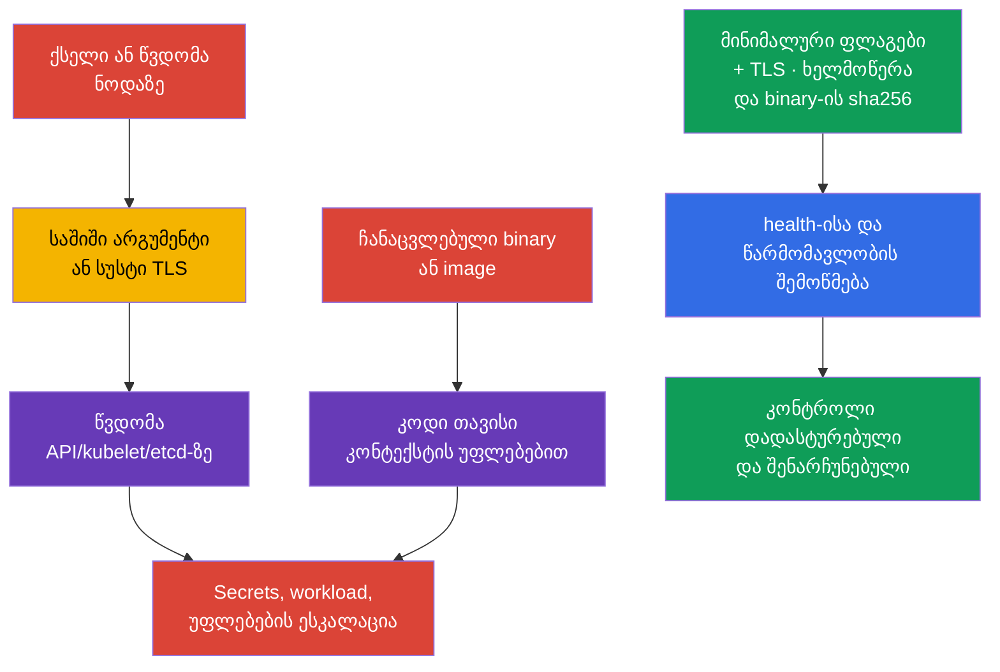
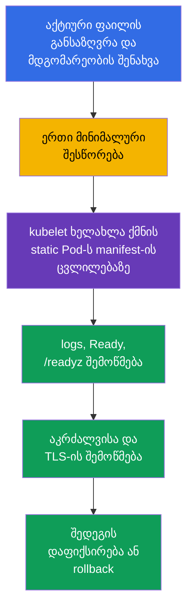

[Русская версия](ru.md) · [Eng version](README.md) · [Versión en español](es.md) · [Version française](fr.md) · [Deutsche Version](de.md) · [繁體中文版](tw.md) · [日本語版](jp.md)

# თავი 09. კომპონენტების დაუცველი არგუმენტები, TLS-hardening და ბინარების შემოწმება

> **პრობლემა.** შემტევი, რომელმაც მიიღო ქსელური წვდომა control plane-ის endpoint-ზე ან
> შესაძლებლობა შეცვალოს ფაილი ნოდაზე, ეძებს არა დაუცველობას თავად Kubernetes-ში, არამედ
> დაუცველ არგუმენტს გვერდით: anonymous access, read-only kubelet port, სუსტი TLS ან
> ჩანაცვლებული `kubelet`/`kubectl`/image ჯერ კიდევ გაშვებამდე. ერთმა ასეთმა ხარვეზმა
> შეიძლება გახსნას წვდომა API/etcd-ზე ან მისცეს კოდის შესრულება ჩანაცვლებული არტეფაქტის
> კონტექსტში. platform binary-სთვის შედეგები დამოკიდებულია runtime-ზე: ჩანაცვლებული
> kubelet/control-plane binary იღებს შესაბამისი service process-ის უფლებებს, ხოლო
> ჩანაცვლებული `kubectl` - მისი გამშვები OS-მომხმარებლის უფლებებს და წვდომას მის
> kubeconfig/credentials-ზე.

> **შემდეგი ნაბიჯი.** მე-08 თავში დავიცავით გარე HTTP-შესასვლელი TLS-ით. ახლა საჭიროა
> დავიცვათ თავად control plane-ისა და kubelet-ის კომპონენტები: ერთმა დაუცველმა არგუმენტმა
> შეიძლება გახსნას ანონიმური API, დიაგნოსტიკური endpoint ან სუსტი TLS-არხი. შემდეგ
> გადავამოწმებთ, რომ ვუშვებთ ზუსტად გამოქვეყნებულ Kubernetes-ბინარებს. ეს არის დომენი
> **Cluster Setup** (CKS, 15%).

> **რა გჭირდებათ CKA-დან.** control plane-ის მოწყობა, kubeadm და static Pod განხილულია
> [CKA-ს 35-ე თავში](../../../cka/course/35/ge.md), ხოლო Kubernetes-კომპონენტების
> ზედაპირი - [CKA-ს 02-ე თავში](../../../cka/course/02/ge.md). აქ არ მეორდება მათი
> საბაზისო კონფიგურაცია: ჩვენ ვეძებთ საშიშ არგუმენტებს, უსაფრთხოდ ვცვლით აქტიურ
> კონფიგურაციას და ვამტკიცებთ შედეგს.

> 🧠 დაცვას განსაზღვრავს active runtime state და არა სტრიქონი შაბლონში, tag ან მოსალოდნელი ვერსია.

## 09.1. საფრთხის მოდელი: ფლაგი ან არტეფაქტი, როგორც შესვლის წერტილი

control plane იღებს გადაწყვეტილებებს მთელი კლასტერისთვის. `kube-apiserver`
გასცემს და ამოწმებს წვდომას API-ზე, `kubelet` უშვებს Pod-ს ნოდაზე, ხოლო `etcd` ინახავს
Secrets-ს, RBAC-ს და სასურველ მდგომარეობას. ამიტომ სუსტ პარამეტრს უფრო დიდი ეფექტი აქვს,
ვიდრე ერთი აპლიკაციის შეცდომას.

ტიპური შეტევის ჯაჭვი ასე გამოიყურება: შემტევი იღებს ქსელურ წვდომას endpoint-ზე
ან შესაძლებლობას შეცვალოს ფაილი ნოდაზე; იყენებს anonymous access-ს, read-only kubelet
port-ს, `AlwaysAllow`-ს ან profiling-ს; კითხულობს მონაცემებს ან ასრულებს მოქმედებას
სხვისი უფლებებით. ალტერნატიული გზაა არტეფაქტის ჩანაცვლება შესრულებამდე. ჩანაცვლებული
kubelet ან control-plane binary იმართება შესაბამისი service/host process-ის უფლებებით;
ჩანაცვლებული `kubectl` - ლოკალური მომხმარებლის უფლებებით და მისთვის ხელმისაწვდომი
Kubernetes credentials-ით; container image - თავისი workload security context-ის
უფლებებით. ამიტომ provenance მოწმდება შესრულებამდე, ხოლო შედეგები ფასდება რეალური
execution context-ის მიხედვით და არა კომპონენტის უფლებების ზოგადი ფორმულით.



Hardening არ არის სტრიქონების ნაკრები „CIS-ისთვის". ცვლილებამდე უპასუხეთ
ოთხ კითხვას: რომელი პროცესი იყენებს რეალურად პარამეტრს, ვინ არის მისი client, თავსებადია
თუ არა სერტიფიკატები და cipher suites, როგორ გადამოწმდეს ხელმისაწვდომობა და როგორ მოხდეს
rollback. managed Kubernetes-ში control plane-ის ნაწილი ეკუთვნის პროვაიდერს: ნუ
შეეცდებით მის host files-ის რედაქტირებას, არამედ შეამოწმეთ ხელმისაწვდომი
security-პარამეტრების დოკუმენტაცია.

> 🎯 შეამოწმეთ active config და process args, გაასწორეთ ერთადერთი effective source, გადატვირთეთ კომპონენტი და დაადასტურეთ active state, ქცევა და health; binary-სთვის — provenance და SHA-256.

## 09.2. საშიში არგუმენტები: რა ვეძებოთ და რატომ

ყველა ფლაგი ერთნაირად საშიში არ არის ნებისმიერ ტოპოლოგიაში. მნიშვნელობა,
მისმენის მისამართი, firewall, TLS და RBAC ერთობლივად ქმნიან ერთ კონტროლს. მაგრამ შემდეგი
პარამეტრები საჭიროებენ აშკარა დასაბუთებას ან გასწორებას.

| კომპონენტი | საშიში პარამეტრი | რისკი | უსაფრთხო ორიენტირი |
|---|---|---|---|
| `kube-apiserver` | ფართო anonymous access | მოთხოვნა მიღებული credentials-ის გარეშე შეიძლება დამუშავდეს როგორც `system:anonymous`; შეცდომიანი RBAC-ის შემთხვევაში ეს ქმნის არაავთენტიფიცირებული წვდომის გზას | benchmark-მა შეიძლება მოითხოვოს `--anonymous-auth=false`; production-ში ჯერ შეამოწმეთ health endpoints და kubeadm discovery, ხოლო Kubernetes 1.34+-ში საჭიროების შემთხვევაში შეზღუდეთ anonymous access `AuthenticationConfiguration`-ის მეშვეობით |
| `kube-apiserver` | `--authorization-mode=AlwaysAllow` ან დამატებული `AlwaysAllow` | ნებისმიერი ავთენტიფიცირებული მოთხოვნა გადის authorization-ს | kubeadm-ისთვის ჩვეულებრივ `Node,RBAC` |
| `kube-apiserver` | `--profiling=true` | profiling-მა შეიძლება გაამჟღავნოს პროცესის მდგომარეობა და საჭირო არ არის საჯარო საზღვარზე | `--profiling=false` |
| `kube-apiserver` | legacy `--insecure-port`/`--insecure-bind-address` | API TLS-ისა და authentication-ის გარეშე | არ ჩართოთ; თანამედროვე Kubernetes-ში ეს legacy-ოფციები ამოღებულია |
| `kubelet` | `--read-only-port` არ უდრის `0`-ს | არაავთენტიფიცირებულმა endpoint-მა შეიძლება გაამჟღავნოს Pod- და node-მონაცემები | `--read-only-port=0` ან `readOnlyPort: 0` |
| `kubelet` | `--anonymous-auth=true` | ანონიმური client ხვდება kubelet API-ზე | `--anonymous-auth=false` ან config API-ის ველი |
| `kubelet` | `--authorization-mode=AlwaysAllow` | ნებისმიერი ავთენტიფიცირებული client იღებს ზედმეტად ფართო წვდომას kubelet API-ზე | `--authorization-mode=Webhook` |
| `kubelet` | `--protect-kernel-defaults=false` | baseline-თან შეუსაბამობის შემთხვევაში kubelet არ დასრულდება fail-fast რეჟიმში და შეიძლება სცადოს host-level kernel flags-ის შეცვლა მოსალოდნელ მნიშვნელობებამდე | `--protect-kernel-defaults=true` sysctl-ის შემოწმების შემდეგ |
| `kube-controller-manager` | `--profiling=true` ან `--use-service-account-credentials=false` | ზედმეტი დიაგნოსტიკა ან ფართო credentials-ის გამოყენება ცალკეული SA-ების ნაცვლად | `--profiling=false`, ცალკეული service account credentials |
| `kube-scheduler` | profiling ჩართულია ან endpoint ფართო `--bind-address`-ზეა | დიაგნოსტიკური endpoint ხელმისაწვდომი ხდება ზედმეტი ქსელისთვის | `enableProfiling: false`; deprecated CLI `--profiling` და kube-bench-ის შეზღუდვა config-based scheduler-ისთვის განხილულია [07-ე თავში](../07/ge.md) |
| `etcd` | `--client-cert-auth=false`, დაუცველი `--listen-client-urls` | client mTLS-ის გარეშე ან გარე ქსელი იღებს წვდომას კლასტერის storage-ზე | mTLS, localhost/შიდა ქსელი, firewall |

კონკრეტული CIS/CKS-დავალებისთვის benchmark-მა შეიძლება პირდაპირ მოითხოვოს
`--anonymous-auth=false`; ასეთ შემთხვევაში შეასრულეთ ზუსტად დავალების მოთხოვნა და
დაამტკიცეთ შედეგი.

production kubeadm-ში ეს შესწორება მექანიკურად არ გამოიყენოთ. სტანდარტული
token-based `kubeadm join` იყენებს `kube-public/cluster-info`-ს საჯარო კითხვას ჯგუფის
`system:unauthenticated` მიერ, ამიტომ anonymous authentication-ის სრული გამორთვა ცვლის
discovery lifecycle-ს. ასევე შეამოწმეთ `kube-apiserver`-ის health probes, თუ ისინი
მიმართავენ anonymous health endpoints-ს.

Kubernetes 1.34+-ში შეგიძლიათ გამოიყენოთ `AuthenticationConfiguration`,
დაუშვათ anonymous access მხოლოდ აშკარად საჭირო endpoints-სთვის. თუ საჯარო `cluster-info`
აღარ არის საჭირო, ჯერ გადაიყვანეთ join/discovery შესაბამის ალტერნატივაზე და მხოლოდ
შემდეგ მოაშორეთ ეს წვდომა. მაგალითად, ცალკე ფაილს, რომელიც static Pod-ში მიერთებულია
`--authentication-config=<path>`-ის და შესაბამისი mount-ის მეშვეობით, შეუძლია შეიცავდეს:

```yaml
apiVersion: apiserver.config.k8s.io/v1
kind: AuthenticationConfiguration
anonymous:
  enabled: true
  conditions:
  - path: /livez
  - path: /readyz
  - path: /healthz
```

თუ anonymous access დარჩება მხოლოდ `/livez`, `/readyz` და `/healthz`-სთვის,
ჩვეულებრივი token-based `kubeadm join` საჯარო `cluster-info`-ს მეშვეობით არ იმუშავებს.
ეს დასაშვებია მხოლოდ იმ შემთხვევაში, თუ ნოდების დამატების lifecycle გადატანილია სხვა
discovery mechanism-ზე.

თუ `AuthenticationConfiguration`-ში მითითებულია ველი `anonymous`, ერთდროულად
`--anonymous-auth`-ის გამოყენება არ შეიძლება. Endpoint-scoped ვარიანტი არ აკმაყოფილებს
benchmark-ს, რომელიც აშკარად მოითხოვს `--anonymous-auth=false`-ს; აირჩიეთ და
დააფიქსირეთ თქვენს კლასტერზე მისადაგებული მოდელი.

ჯერ დაათვალიერეთ (inventory) აქტიური პარამეტრები და არა მხოლოდ შაბლონური
ფაილი. მოძებნეთ დუბლიკატები: უკანასკნელი ან ფაქტობრივად გამოყენებული მნიშვნელობა
დამოკიდებულია იმპლემენტაციაზე, ხოლო კონფლიქტური ფლაგები ართულებენ დიაგნოსტიკას. თუ
კონკრეტულ მიგნებას უკვე იძლევა `kube-bench` (07-ე თავი), გამოიყენეთ მისი remediation
როგორც ზუსტი ფლაგისა და ფაილის წყარო; TLS-სპეციფიკური პარამეტრები
(`--tls-min-version`, `--tls-cipher-suites`) განხილულია ცალკე ქვემოთ, 09.4-09.5-ში.

kubelet-ის `--enable-debugging-handlers`-იც ფასდება რისკის მიხედვით: ის
რთავს დიაგნოსტიკურ handlers-ს, რომელთა საჭირო ნაწილები შეიძლება იყენებდეს `kubectl
logs`-ს, `exec`-ს და `port-forward`-ს. არ გამორთოთ ის ბრმად. ჯერ განსაზღვრეთ საჭირო
ოპერაციები და დაიცავით kubelet API `10250`-ზე authentication-ითა და `Webhook`
authorization-ით.

ქსელური წვდომა `10250`-ზე შეზღუდეთ ნოდის ან ინფრასტრუქტურის დონეზე: host
firewall, cloud security group/ACL ან CNI-specific host policy. ნუ დაეყრდნობით
ჩვეულებრივ Kubernetes `NetworkPolicy`-ს, როგორც kubelet endpoint-ის გადატანად
კონტროლს: ეს არის host/node traffic, ხოლო `NetworkPolicy`-ის ქცევა `hostNetwork`-ისა
და node IP-სთვის დამოკიდებულია CNI-ის იმპლემენტაციაზე. იგივე წესი ეხება მეტრიკებსაც:
profiling და metrics - სხვადასხვა endpoint-ია.

## 09.3. სად შევცვალოთ კონფიგურაცია და როგორ გადავიტვირთოთ უსაფრთხოდ

control plane-ის static Pod-ის უსაფრთხო რედაქტირების ზოგადი პროცესი (backup,
მინიმალური ცვლილება, health-ის შემოწმება, ავარიის შემდეგ აღდგენა) განხილულია 07-ე
თავში - აქ ის არ მეორდება, არამედ ივსება ამ თავისთვის სპეციფიკური ერთი ტექნიკითა და
kubelet/scheduler/controller-manager-ის discovery-კონფიგურაციის ნიუანსებით, რომლებიც
განსაკუთრებით მნიშვნელოვანია TLS- და cipher-შესწორებებისთვის ქვემოთ, 09.4-ში.

kubelet არ არის static Pod: მისი კონფიგურაცია ჩვეულებრივ მდებარეობს
`/var/lib/kubelet/config.yaml`-ში, ხოლო დამატებითი არგუმენტები -
`/var/lib/kubelet/kubeadm-flags.env`-სა და systemd drop-in-ში. Kubernetes 1.36-ში ასევე
მოძებნეთ `--config-dir`: kubelet ჯერ იყენებს ძირითად config-ს, შემდეგ კი მხოლოდ
drop-in-ფაილებს `*.conf` (ქვედირექტორიების ჩათვლით) ამ დირექტორიიდან ლექსიკური
თანმიმდევრობით; `*.yaml` მასში იგნორირებულია. Kubernetes 1.36-ში kubelet აერთიანებს
წყაროებს შემდეგი თანმიმდევრობით: CLI feature gates-ს აქვს ყველაზე დაბალი პრიორიტეტი,
შემდეგ გამოიყენება ძირითადი config, შემდეგ `*.conf` `--config-dir`-იდან, ხოლო დანარჩენ
CLI arguments-ს აქვს ყველაზე მაღალი პრიორიტეტი. ამიტომ ამ თავის ჩვეულებრივი
პარამეტრებისთვის CLI-ფლაგმა შეიძლება გადაფაროს YAML/drop-in, მაგრამ ეს წესი ნუ
გადაიტანთ `--feature-gates`-ზე.

რეალური `--config`, `--config-dir` და CLI arguments განსაზღვრეთ
`systemctl cat kubelet`-ისა და პროცესის ფაქტობრივი command line-ის მეშვეობით. ნუ
დააყენებთ ერთ ჩვეულებრივ პარამეტრს ერთდროულად რამდენიმე წყაროში საჭიროების გარეშე.

scheduler-ისთვის ჯერ შეამოწმეთ, დაყენებულია თუ არა `--config=<path>`:
`KubeSchedulerConfiguration` შეიძლება იყოს მისი effective source, ხოლო legacy CLI
flags-ის ნაწილი `--config`-ის არსებობისას deprecated/ignored არის. მაგალითად,
scheduler-ის `--profiling` deprecated არის; component config-ში მოწმდება
`enableProfiling: false`.

`kube-controller-manager`-ისთვის Kubernetes 1.36-ში scheduler-ის
ეკვივალენტური საერთო ოფცია `--config` არ არსებობს: მისი სამუშაო პარამეტრები კვლავ
ინაცვლება CLI flags-ით active manifest-ში / process args-ში.
`KubeControllerManagerConfiguration` არსებობს როგორც component configuration API და
შიდა/configz-წარმოდგენა, მაგრამ არ არის `kube-controller-manager`-ის საერთო გარე
`--config`-ფაილი.

ამიტომ ჯერ განსაზღვრეთ კონკრეტული კომპონენტის runtime, შემდეგ კი შეამოწმეთ
ზუსტად მის მიერ მხარდაჭერილი active source.



control plane-ის static Pod-ისთვის დამატებითი ტექნიკაა atomic rename hidden
candidate-ის მეშვეობით იმავე watched directory-ში. ის უფრო საიმედოა, ვიდრე ჩვეულებრივი
backup+edit იქ, სადაც მნიშვნელოვანია კლასტერი არ დარჩეს API-ის გარეშე შუალედური YAML-ის
შეცდომის მომენტშიც კი:

```bash
# 1. შევქმნათ hidden candidate უშუალოდ watched directory-ში; kubelet იგნორირებს
# ფაილებს, რომელთა სახელი წერტილით იწყება, ამიტომ Pod არ ხელახლა შეიქმნება ატომური
# ჩანაცვლების მომენტამდე.
# /etc/kubernetes/manifests შეიძლება იყოს ცალკე mount: თუ candidate შეიქმნება
# /etc/kubernetes-ში, mv სხვადასხვა filesystem-ს შორის იქცევა copy+unlink-ად და
# აღარ არის atomic rename.
sudo install -d -m 700 /root/k8s-manifest-backup
CANDIDATE=$(sudo mktemp /etc/kubernetes/manifests/.kube-apiserver.yaml.candidate.XXXXXX)
sudo cp -p /etc/kubernetes/manifests/kube-apiserver.yaml "$CANDIDATE"
sudo cp -p /etc/kubernetes/manifests/kube-apiserver.yaml \
  /root/k8s-manifest-backup/kube-apiserver.yaml.$(date +%F-%H%M%S)
sudoedit "$CANDIDATE"

# 2. რეალურად შევამოწმოთ candidate-ის YAML/API-სტრუქტურა, running static
# Pod-ის შეხების გარეშე.
sudo kubectl apply --dry-run=client --validate=strict -f "$CANDIDATE"

# 3. მხოლოდ წარმატებული შემოწმების შემდეგ ატომურად შევცვალოთ watched
# manifest. Candidate და target ერთ directory-ში და ერთ ფაილურ სისტემაზეა,
# ამიტომ rename გარანტირებულად atomic-ია.
sudo mv -f "$CANDIDATE" /etc/kubernetes/manifests/kube-apiserver.yaml

# 4. დავაკვირდეთ ხელახლა შექმნას ნოდის კონსოლიდან, შემდეგ შევამოწმოთ API.
watch -n 2 'sudo crictl ps -a --name kube-apiserver'
kubectl get --raw='/readyz?verbose'
kubectl get nodes

# თუ static Pod არ იწყება, ჯერ წავიკითხოთ kubelet-ისა და runtime-ის logs.
sudo journalctl -u kubelet -n 100 --no-pager
sudo crictl ps -a --name kube-apiserver
sudo crictl logs "$(sudo crictl ps -aq --name kube-apiserver | head -n1)"
```

მუდმივი backup-ფაილები მაინც შეინახეთ `/etc/kubernetes/manifests/`-ის გარეთ
(როგორც ზემოთ, ნაბიჯ 1-ში): hidden candidate საჭიროა მხოლოდ თავად ჩანაცვლების დროისთვის
და არა როგორც გრძელვადიანი ასლი.

kubelet-ისთვის ჯერ შეამოწმეთ sysctl-ის მნიშვნელობები და კონფიგურაცია, შემდეგ
კი გადატვირთეთ მხოლოდ ის. ჩვეულებრივი `systemctl restart kubelet` თავისთავად არ
აჩერებს უკვე გაშვებულ Pod-ებსა და კონტეინერებს: container runtime აგრძელებს მათ
შესრულებას, ხოლო kubelet გაშვების შემდეგ აღადგენს reconciliation-ს. მიუხედავად ამისა,
control-plane-ზე kubelet შეცვალეთ ნოდა-ნოდა და აკონტროლეთ Node heartbeat, kubelet-ის
logs და `/readyz`: კონფიგურაციის შეცდომამ შეიძლება ნოდა `NotReady`-ში დატოვოს ან
ხელი შეუშალოს static Pod-ის შემდგომ მართვას.

```yaml
# /var/lib/kubelet/config.yaml - კონფიგურაციული API-ის ფრაგმენტის მაგალითი.
readOnlyPort: 0
authentication:
  anonymous:
    enabled: false
authorization:
  mode: Webhook
protectKernelDefaults: true
```

```bash
sudo systemctl restart kubelet
sudo systemctl --no-pager --full status kubelet
sudo journalctl -u kubelet -n 100 --no-pager
check_kubelet_10255() {
  local listeners

  if ! listeners="$(sudo ss -H -lntp 'sport = :10255')"; then
    echo 'ERROR: cannot inspect listening TCP sockets; port 10255 is not verified' >&2
    return 1
  fi

  if [[ -n "$listeners" ]]; then
    printf '%s\n' "$listeners"
    echo 'FAIL: kubelet read-only port 10255 is listening' >&2
    return 1
  fi

  echo 'PASS: kubelet read-only port 10255 is closed'
}
check_kubelet_10255
kubectl get nodes

# შედეგი base config-ის, *.conf drop-ins-ისა და CLI overrides-ის შემდეგ;
# საჭიროა ავტორიზებული წვდომა.
NODE="${NODE:?set target node name from kubectl get nodes}"
kubectl get --raw "/api/v1/nodes/${NODE}/proxy/configz" \
  | jq '.kubeletconfig | {readOnlyPort, authentication, authorization, protectKernelDefaults}'
```

## 09.4. apiserver, kubelet და etcd-ის TLS-hardening

TLS უკვე იცავს არხს, მაგრამ ვერსია და cipher suites-ის ნაკრები განსაზღვრავს,
რომელი კრიპტოგრაფიული ვარიანტების შეთანხმება საერთოდ შეუძლია client-ს. მოძველებული
პროტოკოლების ან სუსტი შიფრების დაშვება აადვილებს downgrade-ს და მოძველებული
კრიპტოგრაფიის გამოყენებას. მინიმუმი `TLS 1.2` ჩვეულებრივ თავსებადია თანამედროვე
Kubernetes-client-ებთან; `TLS 1.3` უფრო მკაცრად ზღუდავს client-ებს და მოითხოვს მთელი
control plane-ის, automation-ისა და monitoring-ის ცალკე შემოწმებას.

Go-ისა და Kubernetes-ის თანამედროვე defaults უკვე გამორიცხავს მოძველებულ
პროტოკოლებსა და დაუცველ suites-ს; უნივერსალური „მოკლე უსაფრთხო სია" არ არსებობს. ნუ
გადაიტანთ შემთხვევით მოკლე სიას კომპონენტებს ან ვერსიებს შორის. თუ ორგანიზაციის policy
ან კონკრეტული CIS profile მოითხოვს დამტკიცებულ სიას, გამოიყენეთ ზუსტად ის სერტიფიკატებისა
და client-ების inventory-ის შემდეგ და არ დაუპირისპიროთ სია hardening baseline-ს.
RSA-only სია არ არის უსაფრთხო default: ის ამტვრევს endpoint-ს ECDSA-სერტიფიკატით და
საჭიროების გარეშე ავიწროებს თავსებადობას. Go-ში TLS 1.3 suites ჩვეულებრივ არ
იმართება `--tls-cipher-suites`-ით: მათ ირჩევს TLS-იმპლემენტაცია, ამიტომ ეს ფლაგი
ძირითადად ეხება TLS 1.2-ს და უფრო ძველებს.

> 🔬 cipher suites-ის pinning-სა და TLS 1.3-ს სჭირდება დამტკიცებული policy, client-ების inventory და მნიშვნელობების შედარება კომპონენტის ვერსიასთან.

Kubernetes-კომპონენტებისთვის ფლაგის დასაშვები სტრიქონული მნიშვნელობები
ჩვეულებრივ არის სახის `VersionTLS12` და `VersionTLS13`. etcd-სთვის მნიშვნელობის
სახელი დამოკიდებულია etcd-ის ვერსიაზე: აქტუალური help ხშირად იყენებს
`TLS1.2`/`TLS1.3`-ს. ნუ გადაიტანთ მნიშვნელობას პროგრამებს შორის ვარაუდით - შესწორებამდე
შეამოწმეთ `--help` ზუსტად ამ ვერსიის გაშვებული binary-ისთვის და არა დოკუმენტაცია
მეხსიერებიდან ან სხვა release-იდან.

გამოცდაზე ფლაგებისა და დასაშვები მნიშვნელობების ზუსტი სია ყველაზე სწრაფად
მიიღება უშუალოდ მომუშავე პროცესისგან და არა web-ში ძებნით - საჭირო ვერსიის
დოკუმენტაციის გვერდი შეიძლება მიუწვდომელი იყოს ან დრო წაართვას ძებნას. თუ component
მუშაობს static Pod-ში და მისი container იმყოფება `Running` მდგომარეობაში, ჯერ
შეგიძლიათ გამოიყენოთ `kubectl exec`. `Ready=False` თავისთავად არ კრძალავს exec-ს:
exec-ისთვის მნიშვნელოვანია running container და ხელმისაწვდომი API/RBAC/streaming
path. Readiness განსაზღვრავს Pod-ის `Ready` state-ს, გამოიყენება Pod-ის Service
traffic-ში ჩართვისას და მონაწილეობს workload controllers-ის availability/rollout
სემანტიკაში, მაგრამ არ არის gate `kubectl exec`-ისთვის. თუ API/RBAC/streaming path
`kubectl exec`-ისთვის მიუწვდომელია, მაგრამ component ნამდვილად გაშვებულია როგორც CRI
container, გამოიყენეთ `crictl exec` კონკრეტული container ID-ით.

თუ component გაშვებულია ცალკე host `systemd` service-ად, `crictl exec`
გამოუსადეგარია: მიიღეთ executable აქტიური პროცესიდან ან `ExecStart`-იდან და
გამოიძახეთ მისი `--help` პირდაპირ ნოდაზე.

```bash
# Static Pod / mirror Pod: container უნდა იყოს Running (Ready სავალდებულო
# არ არის).
kubectl -n kube-system exec kube-apiserver-<node> -- kube-apiserver --help 2>&1 \
  | grep -A2 -- '--tls-min-version\|--tls-cipher-suites'

kubectl -n kube-system exec etcd-<node> -- etcd --help 2>&1 \
  | grep -A2 -- '--cipher-suites\|--tls-min-version'

# Fallback მხოლოდ იმ შემთხვევაში, თუ etcd ნამდვილად მუშაობს როგორც CRI
# container.
CID="$(sudo crictl ps -q --name etcd | head -n1)"
if [[ -n "$CID" ]]; then
  sudo crictl exec "$CID" etcd --help 2>&1 \
    | grep -A2 -- '--tls-min-version'
fi

# თუ etcd ცალკე host/systemd process არის, გამოიყენეთ ამ პროცესის
# executable.
PID="$(pgrep -xo etcd)"
if [[ -n "$PID" ]]; then
  sudo "/proc/${PID}/exe" --help 2>&1 \
    | grep -A2 -- '--tls-min-version'
fi
```

`--help`-ის გამოტანა აჩვენებს ფლაგის ზუსტ სახელს და, უმეტეს ვერსიებში,
მოკლე აღწერას დასაშვები მნიშვნელობებით ფლაგის გვერდით. ეს არის ზუსტად ის იგივე binary
და ვერსია, რომელიც რეალურად მუშაობს კლასტერში, ამიტომ სხვა release-ის დოკუმენტაციასთან
შეუსაბამობა არ წარმოიქმნება და დრო არ იხარჯება ბრაუზერზე გადართვაზე.

benchmark-ის მოთხოვნის „etcd იღებს არანაკლებ TLS 1.2-ს" მტკიცებულებაა
აქტიური `--tls-min-version` და შემოწმებული handshake და არა თვითნებური RSA-only
cipher list; შეადარეთ გამოყენებული benchmark-ის ზუსტი ფორმულირება და ვერსია.

```yaml
# /etc/kubernetes/manifests/kube-apiserver.yaml, command-ის ფრაგმენტი.
# Go-ის თანამედროვე defaults suites-ს ტოვებს აშკარა pinning-ის გარეშე.
- kube-apiserver
- --tls-min-version=VersionTLS12
# დაამატეთ --tls-cipher-suites მხოლოდ დამტკიცებული policy/თავსებადობის
# შემთხვევაში.
# თუ policy მოითხოვს სიას, ჩართეთ ECDSA-ც და RSA suites-ც, რომლებიც საჭიროა
# თქვენი სერტიფიკატებისთვის:
# - --tls-cipher-suites=TLS_ECDHE_ECDSA_WITH_AES_128_GCM_SHA256,TLS_ECDHE_ECDSA_WITH_AES_256_GCM_SHA384,TLS_ECDHE_RSA_WITH_AES_128_GCM_SHA256,TLS_ECDHE_RSA_WITH_AES_256_GCM_SHA384
```

kubelet-ისთვის უპირატესია მისი config API; თუ ინსტალაცია პარამეტრებს
გადასცემს systemd-ის მეშვეობით, გამოიყენეთ ეკვივალენტური ფლაგები ერთადერთ აქტიურ
წყაროში. ანალოგიურად, `tlsCipherSuites`-ს ტოვებენ დაუყენებლად, სანამ ამას არ
მოითხოვს დოკუმენტირებული policy.

```yaml
# /var/lib/kubelet/config.yaml, ფრაგმენტი; ზუსტი ველების მხარდაჭერა
# დამოკიდებულია kubelet-ის ვერსიაზე.
tlsMinVersion: VersionTLS12
```

```yaml
# /etc/kubernetes/manifests/etcd.yaml, მაგალითი etcd-ისთვის, რომელიც
# იღებს მნიშვნელობას TLS1.2.
# --cipher-suites არ არის დამატებული: Go-ის defaults უსაფრთხოა, თუ policy
# სხვას არ მოითხოვს.
- etcd
- --tls-min-version=TLS1.2
```

TLS ნუ შემოსაზღვრავთ მხოლოდ server endpoint-ით. etcd-ს აქვს client- და
peer-traffic, ხოლო apiserver-ს - client-ები kubelet, controller-manager, scheduler,
kubectl, webhooks და automation. ჯერ შეაგროვეთ ფაქტობრივი certificates/keys, მისმენის
მისამართები და clients; შემდეგ გამოიყენეთ ცვლილება ტესტურ ან ერთ HA-ნოდაზე.
`VersionTLS13`-ზე გადასვლისას ელოდეთ ძველი TLS 1.2-client-ის უარყოფას - ეს არ არის
server-ის შეცდომის მტკიცებულება, მაგრამ საჭიროებს client-ის მიგრაციის გეგმას.

TLS minimum-ის შემოწმება უნდა მოიცავდეს ორ განსხვავებულ ნივთს:

1. protocol evidence - დასაშვები ვერსია წარმატებით შეთანხმდება, ხოლო დაყენებულ
   minimum-ზე დაბალი ვერსია უარყოფილია;
2. application health - კომპონენტი ცვლილების შემდეგ რჩება ფუნქციონალური.

apiserver-ისთვის საკმარისია handshake-ის შემოწმება `6443`-ზე; kubelet-ისთვის
`10250` ხშირად საჭიროებს client certificate-ს და authorization-ს handshake-ის შემდეგ;
etcd-ისთვის `etcdctl endpoint health` ამტკიცებს მხოლოდ application health-ს, ამიტომ
protocol handshake ცალკე შეამოწმეთ `openssl s_client`-ის მეშვეობით. ნუ გამოიტანთ
private key-ს ტერმინალში და ნუ დააკოპირებთ PKI-ს ნოდიდან.

negative test-ის წინ დარწმუნდით, რომ გამოყენებული TLS-client ნამდვილად
შეუძლია შესთავაზოს ტესტირებადი legacy-პროტოკოლის ვერსია. თანამედროვე OpenSSL ან
სისტემური crypto policy შეიძლება თავად კრძალავდეს TLS 1.1-ს. თუ client ლოკალურად
უარყოფს TLS 1.1-ს, ასეთი შედეგი არ ამტკიცებს server-side `tls-min-version`-ს.
Negative test მტკიცებულებად ითვლება მხოლოდ მაშინ, როცა ჩანს, რომ client-მა სცადა
legacy protocol-ის შეთანხმება, ხოლო უარი მოვიდა შემოწმებული endpoint-იდან. ეს წესი
ერთნაირად ეხება apiserver-ს, kubelet-ს და etcd-ს.

```bash
# apiserver, positive test: TLS 1.2 უნდა შეთანხმდეს წარმატებით.
# ჩაანაცვლეთ მისამართი და SNI თქვენი კლასტერის მნიშვნელობებით.
export API=127.0.0.1:6443
OUT="$(mktemp)"

if openssl s_client \
    -connect "$API" \
    -servername kubernetes \
    -tls1_2 \
    -CAfile /etc/kubernetes/pki/ca.crt \
    -verify_return_error \
    </dev/null >"$OUT" 2>&1
then
  if grep -Eq 'Cipher is \(NONE\)|Cipher[[:space:]]*:[[:space:]]*0000' "$OUT"; then
    cat "$OUT"
    rm -f "$OUT"
    echo 'FAIL: TLS 1.2 handshake has no negotiated cipher' >&2
    exit 1
  fi
  grep -E 'Protocol|Cipher|Verify return code' "$OUT"
  echo 'PASS: TLS 1.2 handshake succeeded'
else
  cat "$OUT" >&2
  rm -f "$OUT"
  echo 'FAIL: TLS 1.2 handshake failed' >&2
  exit 1
fi
rm -f "$OUT"

# apiserver, negative test: TLS 1.1 server-ის მიერ უნდა იყოს უარყოფილი.
# მარტივი grep "protocol|alert"-ზე არ განასხვავებს server-side უარს OpenSSL/crypto
# policy-ის ლოკალური აკრძალვისგან ClientHello-ის გაგზავნამდე - საჭიროა ორივე
# ფაქტის დამტკიცება.
# გაფორმებულია როგორც ფუნქცია: return 1 ყველა non-PASS შტოზე, რათა exit status
# ემთხვეოდეს ტექსტურ verdict-ს და ავტომატიზაცია (cmd && echo PASS, CI wrapper, $?)
# არ დაიშალოს.
check_tls11_rejected() {
  local endpoint="$1"
  local servername="$2"
  local neg rc

  neg="$(mktemp)" || return 1

  # @SECLEVEL=0 ასუსტებს მხოლოდ ამ ერთჯერად test-client-ს, რათა თანამედროვე
  # OpenSSL-მა შეძლებისდაგვარად შეძლოს TLS 1.1 ClientHello-ის ფორმირება; server არ
  # იცვლება.
  if openssl s_client \
      -connect "$endpoint" \
      -servername "$servername" \
      -tls1_1 \
      -cipher 'DEFAULT:@SECLEVEL=0' \
      -msg -state \
      </dev/null >"$neg" 2>&1
  then
    rc=0
  else
    rc=$?
  fi

  if grep -Eq '^>>> .*Handshake.*ClientHello' "$neg" \
     && grep -Eq '^<<< .*Alert.*fatal protocol_version|alert protocol version' "$neg"
  then
    echo 'PASS: client sent TLS 1.1 ClientHello and server rejected it with protocol_version'
    rm -f "$neg"
    return 0
  fi

  if grep -Eqi 'no protocols available|no ciphers available|unsupported protocol' "$neg" \
     && ! grep -Eq '^>>> .*Handshake.*ClientHello' "$neg"
  then
    cat "$neg" >&2
    echo 'INCONCLUSIVE: local OpenSSL/crypto policy blocked TLS 1.1 before ClientHello' >&2
    rm -f "$neg"
    return 1
  fi

  cat "$neg" >&2
  echo "INCONCLUSIVE/FAIL: server-side TLS 1.1 rejection was not proven (s_client rc=${rc})" >&2
  rm -f "$neg"
  return 1
}
check_tls11_rejected "$API" kubernetes

# etcd: ჯერ შევამოწმოთ დასაშვები TLS 1.2 handshake mTLS-ით - იგივე
# მოდელი, რაც apiserver-ისთვის: s_client-ის exit status, -verify_return_error და
# რეალურად შეთანხმებული cipher-ის შემოწმება და არა მხოლოდ Verify return code.
OUT="$(mktemp)"

if sudo openssl s_client \
    -connect 127.0.0.1:2379 \
    -tls1_2 \
    -CAfile /etc/kubernetes/pki/etcd/ca.crt \
    -cert /etc/kubernetes/pki/etcd/healthcheck-client.crt \
    -key /etc/kubernetes/pki/etcd/healthcheck-client.key \
    -verify_return_error \
    </dev/null >"$OUT" 2>&1
then
  if grep -Eq 'Cipher is \(NONE\)|Cipher[[:space:]]*:[[:space:]]*0000' "$OUT"; then
    cat "$OUT"
    rm -f "$OUT"
    echo 'FAIL: etcd TLS 1.2 handshake has no negotiated cipher' >&2
    exit 1
  fi
  grep -E 'Protocol|Cipher|Verify return code' "$OUT"
  echo 'PASS: etcd TLS 1.2 handshake succeeded'
else
  cat "$OUT" >&2
  rm -f "$OUT"
  echo 'FAIL: etcd TLS 1.2 handshake failed' >&2
  exit 1
fi
rm -f "$OUT"

# შემდეგ negative test: TLS 1.1 არ უნდა შეთანხმდეს. იგივე criterion, რაც
# apiserver-ისთვის: დავამტკიცოთ, რომ client-მა გაგზავნა ClientHello, ხოლო server-მა
# დააბრუნა protocol_version.
# ცალკე ფუნქცია (არა check_tls11_rejected): etcd მოითხოვს mTLS client cert/key-ს,
# apiserver-ფუნქცია მათ არ იღებს. return 1 ყველა non-PASS შტოზე იმავე მიზეზით.
check_etcd_tls11_rejected() {
  local endpoint="$1" cacert="$2" cert="$3" key="$4"
  local neg rc

  neg="$(mktemp)" || return 1

  if sudo openssl s_client \
      -connect "$endpoint" \
      -tls1_1 \
      -cipher 'DEFAULT:@SECLEVEL=0' \
      -CAfile "$cacert" \
      -cert "$cert" \
      -key "$key" \
      -msg -state \
      </dev/null >"$neg" 2>&1
  then
    rc=0
  else
    rc=$?
  fi

  if grep -Eq '^>>> .*Handshake.*ClientHello' "$neg" \
     && grep -Eq '^<<< .*Alert.*fatal protocol_version|alert protocol version' "$neg"
  then
    echo 'PASS: client sent TLS 1.1 ClientHello and etcd rejected it with protocol_version'
    rm -f "$neg"
    return 0
  fi

  if grep -Eqi 'no protocols available|no ciphers available|unsupported protocol' "$neg" \
     && ! grep -Eq '^>>> .*Handshake.*ClientHello' "$neg"
  then
    cat "$neg" >&2
    echo 'INCONCLUSIVE: local OpenSSL/crypto policy blocked TLS 1.1 before ClientHello' >&2
    rm -f "$neg"
    return 1
  fi

  cat "$neg" >&2
  echo "INCONCLUSIVE/FAIL: etcd server-side TLS 1.1 rejection was not proven (s_client rc=${rc})" >&2
  rm -f "$neg"
  return 1
}
check_etcd_tls11_rejected 127.0.0.1:2379 \
  /etc/kubernetes/pki/etcd/ca.crt \
  /etc/kubernetes/pki/etcd/healthcheck-client.crt \
  /etc/kubernetes/pki/etcd/healthcheck-client.key

# ცალკე შევამოწმოთ etcd-ის application health.
export ETCDCTL_API=3
sudo etcdctl --endpoints=https://127.0.0.1:2379 endpoint health \
  --cacert=/etc/kubernetes/pki/etcd/ca.crt \
  --cert=/etc/kubernetes/pki/etcd/healthcheck-client.crt \
  --key=/etc/kubernetes/pki/etcd/healthcheck-client.key

# Desired source: manifest ნამდვილად შეიცავს მოსალოდნელ შესწორებას.
sudo grep -nE -- '--(tls-min-version|tls-cipher-suites|cipher-suites)' \
  /etc/kubernetes/manifests/{kube-apiserver,etcd}.yaml

# Active runtime: თავად manifest არის მხოლოდ desired source, რომელსაც
# kubelet პერიოდულად კითხულობს; წავიკითხოთ ამ ნოდაზე რეალურად მომუშავე
# პროცესების argv.
for PROC in kube-apiserver etcd; do
  PID="$(pgrep -xo "$PROC")" || {
    echo "ERROR: running process not found: $PROC" >&2
    continue
  }
  echo "=== active argv: $PROC (pid=$PID) ==="
  sudo cat "/proc/${PID}/cmdline" \
    | tr '\0' '\n' \
    | grep -E -- '--(tls-min-version|tls-cipher-suites|cipher-suites)' \
    || echo "INFO: matching TLS flag is absent from active argv of $PROC"
done

# შემდეგ behavioral TLS tests და health.
kubectl get --raw='/readyz?verbose'
kubectl get nodes
```

| სიმპტომი ცვლილების შემდეგ | სავარაუდო მიზეზი | შემოწმება და მოქმედება |
|---|---|---|
| apiserver არ იწყება | YAML-ის შეცდომა, მხარდაუჭერელი ფლაგი ან cipher | `journalctl -u kubelet`, `crictl logs`; აღვადგინოთ ბოლო working manifest |
| client იღებს protocol version-ს | client უფრო ძველია, ვიდრე დაყენებული minimum | განვაახლოთ client ან დროებით ავირჩიოთ შეთანხმებული minimum დამტკიცებული გამონაკლისით |
| TLS handshake ცდება TLS 1.2-ზე | certificate key algorithm თავსებადი არ არის დაშვებულ cipher suites-თან | შევამოწმოთ `openssl x509 -text`, დავამატოთ შესაბამისი ECDSA/RSA suites |
| etcd არ არის healthy | peer/client ვერ თანხმდება TLS-ზე ან დაკარგა წვდომა key-ზე | ყველა წევრი endpoint-ის შემოწმება mTLS-ით, etcd-ის logs, ერთი ნოდის rollback |
| `openssl` აჩვენებს TLS 1.3 cipher-ს სიის გარეთ | TLS 1.3 ciphers-ს აკონტროლებს TLS-ბიბლიოთეკა | შევამოწმოთ minimum version და ვერსიის დოკუმენტაცია, ეს არ ჩავთვალოთ ფლაგის გვერდის ავლად |

## 09.5. Kubernetes platform binaries-ის შემოწმება: ხელმოწერა და sha256

HTTPS ჩამოტვირთვისას იცავს ტრანსპორტს, მაგრამ არ ამტკიცებს, ვინ გამოუშვა
ფაილი. SHA-256 ამოწმებს **მთლიანობას**: ჩამოტვირთული binary ტოლია იმ ბაიტებისა,
რომლებიც აღწერილია არჩეული digest-ით. ეს არ არის provenance-ის მტკიცებულება: hash,
რომელიც მიღებულია ფაილთან ერთად იმავე არასანდო წყაროდან, ან დაუმტკიცებელი baseline
ნდობას არ ქმნის.

Kubernetes-ისთვის აიღეთ version-specific ოფიციალური release artifact.
Kubernetes აქვეყნებს keyless cosign signature-ს და certificate-ს binary-ის გვერდით;
`verify-blob` ამოწმებს ხელმოწერას და certificate-ის მიბმას მოსალოდნელ identity-სა და
OIDC issuer-თან, ანუ release-ის წარმომავლობას. შეამოწმეთ identity და issuer აშკარად და
ნუ მიიღებთ თვითნებურ certificate-ს. დააფიქსირეთ ვერსია ცვლადში: `latest`-ის საიმედოდ
გამეორება შეუძლებელია.

```bash
export K8S_VERSION=v1.36.0
export ARCH=amd64
export BIN=kubectl
export BASE="https://dl.k8s.io/release/${K8S_VERSION}/bin/linux/${ARCH}"

# მივიღოთ binary და გამოქვეყნებული keyless signature/certificate
# version-specific release-იდან.
for FILE in "${BIN}" "${BIN}.sig" "${BIN}.cert" "${BIN}.sha256"; do
  curl -fsSL --retry 3 --retry-delay 3 "${BASE}/${FILE}" -o "${FILE}"
done

# Kubernetes Release Engineering-ის ოფიციალური მნიშვნელობები binary
# artifacts-ისთვის.
# cosign 2+ მოითხოვს ორივე შეზღუდვას; ნუ მოაშორებთ მათ „წარმატებული" შემოწმებისთვის.
cosign verify-blob "${BIN}" \
  --signature "${BIN}.sig" \
  --certificate "${BIN}.cert" \
  --certificate-identity krel-staging@k8s-releng-prod.iam.gserviceaccount.com \
  --certificate-oidc-issuer https://accounts.google.com

# SHA-256 - დამატებითი შემოწმება ბაიტების ტოლობისა დამტკიცებულ release
# digest-თან.
printf '%s  %s\n' "$(tr -d '[:space:]' < "${BIN}.sha256")" "${BIN}" > "${BIN}.sha256sum"
sha256sum --check "${BIN}.sha256sum"
# kubectl: OK

# უკვე დაყენებული ფაილისთვის მივიღოთ დაკვირვებული digest და შევადაროთ
# approved inventory-ს.
sha256sum /usr/bin/kubelet
```

ამრიგად, signature/certificate მოსალოდნელი identity/issuer-ით იძლევა
provenance-ს, ხოლო checksum იძლევა integrity-ს სანდო release digest-თან მიმართებაში.
Kubernetes ასევე აქვეყნებს ხელმოწერილ SBOM-ს (SPDX), მაგრამ image digest pinning,
container image-ის ხელმოწერა, SBOM და admission policy ეკუთვნის დომენს Supply Chain
Security (20%) და არა ამ თავის Cluster Setup-ს. ამ კონტროლების პრაქტიკა იხილეთ
[24-28-ე თავებში](../24/ge.md); აქ ვამოწმებთ მხოლოდ release artifacts-ს და თავად
Kubernetes-პლატფორმის binaries-ს.

container image-ის დეტალური შემოწმებები, digest, signing და SBOM-ის
ჩათვლით, აქ განზრახ არ არის დუბლირებული: ეს Supply Chain Security-ია, იხილეთ
[24-28-ე თავები](../24/ge.md).

## 09.6. პრაქტიკული სცენარი: ჩანაცვლების აღმოჩენა ზიანამდე

წარმოიდგინეთ, რომ worker-ზე მოხვდა `kubelet`, ჩამოტვირთვის შემდეგ
ჩანაცვლებული. ჩვეულებრივი შემოწმება `kubelet --version` პრობლემას ვერ აღმოაჩენს:
მავნე binary-ს შეუძლია დააბრუნოს მოსალოდნელი ვერსია.

ჯერ შეინახეთ დაკვირვებული hashes, შეადარეთ ისინი დამტკიცებულ release
manifest-ს და ჩაატარეთ evidence/provenance/baseline/authorized-change triage
containment-ის არჩევამდე. ნუ „გაასწორებთ" mismatch-ს ეტალონური hash-ის შეცვლით:
დაუდასტურებელი ცვლილების ან ჩანაცვლების სხვა ნიშნების შემთხვევაში ესკალაცია
გაატარეთ incident runbook-ის მიხედვით.

```bash
# 1. დავაფიქსიროთ მტკიცებულებები ნოდაზე ფაილის ჩანაცვლებამდე.
sudo sha256sum /usr/bin/kubelet | sudo tee /root/kubelet.sha256.observed
sudo stat -c '%y %s %U:%G %a %n' /usr/bin/kubelet
sudo systemctl cat kubelet

# 2. შევადაროთ observed hash დამტკიცებულ release digest-ს trusted
# inventory-დან.
# inventory-ის ფორმატი: '<digest>  /usr/bin/kubelet'. ბრძანება დააბრუნებს FAIL-ს
# შეუსაბამობისას.
sudo sha256sum --check /root/approved-kubelet.sha256

# imageID/digest-ის შემდგომი შემოწმება ჩაატარეთ 24-28-ე თავების
# supply-chain პროცედურის მიხედვით.
```

`sha256sum --check`-ის შედეგი `FAILED`-ით - სიგნალია გამოძიებისთვის, მაგრამ
თავისთავად არ ამტკიცებს კომპრომეტაციას და არ ადგენს ერთადერთ პასუხს „იზოლირება".
ჯერ შეინახეთ evidence და ჩაატარეთ triage: (1) დაადასტურეთ path, ვერსია და
მოსალოდნელი approved baseline, გამორიცხავთ inventory-ის შეცდომას ან არასწორი
ფაილის განახლებას; (2) შეამოწმეთ release-ის provenance `cosign verify-blob`-ის
მეშვეობით მოსალოდნელი certificate identity/issuer-ით და შეადარეთ package/release
metadata; (3) მოძებნეთ authorized change - change record, rollout, package-manager-ისა
და CI-ის logs - და შეადარეთ დრო, owner და digest; (4) შეადარეთ წინა ცნობილ კარგ
baseline-ს და scope-ს სხვა ნოდებზე. ნუ „გაასწორებთ" mismatch-ს ეტალონური hash-ის
შეცვლით.

თუ evidence არ ადასტურებს authorised change-ს, provenance/baseline არ
ემთხვევა ან არსებობს ჩანაცვლების სხვა ნიშნები, ესკალაცია გაატარეთ incident
runbook-ის მიხედვით: შეაჩერეთ შემდგომი გავრცელება, გამოიყენეთ თანაზომადი
containment (cordon/drain-მდე ან ნოდის იზოლაციამდე), შეინახეთ logs და შეცვალეთ ნოდა
ან binary კონტროლირებადი გზით. ერთი hash საიმედოდ იტყობინება მოსალოდნელი ბაიტების
შეუსაბამობის შესახებ, მაგრამ არ ხსნის მის მიზეზს ან ცვლილების გზას. container
image-სა და registry/CI evidence-ზე რეაგირება ეხება 24-28-ე თავების supply-chain
პროცედურებს.

## 09.7. შედეგის შემოწმება და დიაგნოსტიკა

ნებისმიერი შესწორების შემდეგ საჭიროა მტკიცებულებები სამ დონეზე:
აქტიური კონფიგურაცია, ფაქტობრივი ქცევა და კლასტერის health. სტრიქონის არსებობა
გამოუყენებელ ფაილში შემოწმებას არ წარმოადგენს.

```bash
# 1a. control plane-ის desired source: kubeadm-ის default staticPodPath-ისთვის.
# თუ staticPodPath შეცვლილია, გამოიყენეთ რეალურად აქტიური კატალოგი.
STATIC_POD_DIR=/etc/kubernetes/manifests
sudo grep -nE -- \
  '--(anonymous-auth|authorization-mode|profiling|tls-min-version|cipher-suites)' \
  "${STATIC_POD_DIR}"/{kube-apiserver,kube-controller-manager,kube-scheduler,etcd}.yaml

# 1b. control-plane-პროცესების active runtime argv: manifest არის მხოლოდ
# desired source, რომელსაც kubelet პერიოდულად კითხულობს და არა ხელახლა შექმნილი
# Pod-ის მტკიცებულება.
sudo ps -ww -eo pid,args \
  | grep -E '[k]ube-apiserver|[k]ube-controller-manager|[k]ube-scheduler|[e]tcd'

# კონკრეტული პარამეტრისთვის საჭიროების შემთხვევაში მიიღეთ argv
# truncation-ის გარეშე:
APIPID="$(pgrep -xo kube-apiserver)" || {
  echo 'ERROR: kube-apiserver process not found' >&2
  false
}
sudo cat "/proc/${APIPID}/cmdline" | tr '\0' '\n'

# 1c. Kubelet: ჯერ ვაჩვენოთ რეალური startup sources და არა path-ის
# გამოცნობა.
sudo systemctl cat kubelet
sudo ps -ef | grep '[k]ubelet'

# 1d. საბოლოო actuated KubeletConfiguration base config-ის, --config-dir-ისა
# და overrides-ის შემდეგ.
NODE="${NODE:?set target node name from kubectl get nodes}"
kubectl get --raw "/api/v1/nodes/${NODE}/proxy/configz" \
  | jq '.kubeletconfig | {
      readOnlyPort,
      authentication,
      authorization,
      protectKernelDefaults,
      tlsMinVersion,
      tlsCipherSuites
    }'
```

manifest და runtime მოწმდება ცალ-ცალკე: manifest ამტკიცებს desired
source-ს, ხოლო process command line - იმას, რომ static Pod ნამდვილად ხელახლა შეიქმნა
ახალი argv-ით. თუ კომპონენტი კითხულობს დამატებით component config-ს `--config`-ის
მეშვეობით, ცალკე შეამოწმეთ კომპონენტის აქტიური config-ფაილიც/effective endpoint-იც;
მხოლოდ argv ამ შემთხვევაშიც არასაკმარისია.

თუ `/configz` მიუწვდომელია permissions-ის ან topology-ის გამო, ნუ
დაუბრუნდებით ჰარდკოდირებულ `/var/lib/kubelet/config.yaml`-ს: მიიღეთ ფაქტობრივი
`--config` და `--config-dir` unit/process-იდან, წაიკითხეთ ზუსტად ისინი, შემდეგ
გაითვალისწინეთ ჩვეულებრივი CLI overrides.

```bash
# 2. ქცევა: read-only kubelet port დახურულია. ფუნქცია check_kubelet_10255
# (იხ. §09.3) აბრუნებს 1-ს ყველა non-PASS შტოზე, რათა exit status ემთხვეოდეს
# ტექსტურ verdict-ს.
check_kubelet_10255() {
  local listeners

  if ! listeners="$(sudo ss -H -lntp 'sport = :10255')"; then
    echo 'ERROR: cannot inspect listening TCP sockets; port 10255 is not verified' >&2
    return 1
  fi

  if [[ -n "$listeners" ]]; then
    printf '%s\n' "$listeners"
    echo 'FAIL: kubelet read-only port 10255 is listening' >&2
    return 1
  fi

  echo 'PASS: kubelet read-only port 10255 is closed'
}
check_kubelet_10255
```

TLS minimum დაადასტურეთ §09.4-ის positive/negative protocol tests-ით. ნუ
გაიმეორებთ გამარტივებულ `openssl ... -tls1_1 | grep ...`-ს ლოკალური client-ის
შესაძლებლობების შემოწმების გარეშე: თანამედროვე OpenSSL ან სისტემური crypto policy
შეიძლება თავად კრძალავდეს TLS 1.1-ს, და ასეთი ტესტი დაუშვებს false positive-ს.

```bash
# 3. Health: API, nodes და static Pod დაბრუნდა სამუშაო მდგომარეობაში.
kubectl get --raw='/readyz?verbose'
kubectl get nodes
kubectl -n kube-system get pods -o wide
sudo crictl ps | grep -E 'kube-apiserver|kube-controller-manager|kube-scheduler|etcd'
```

| შემოწმება ვერ გადის | ჯერ შევამოწმოთ | ხშირი მიზეზი |
|---|---|---|
| `kubectl` არ პასუხობს static Pod-ის edit-ის შემდეგ | `journalctl -u kubelet`, `crictl ps -a`, container-ის logs | არასწორი YAML, ფლაგი ან mount |
| ფლაგი ჩანს, მაგრამ `kube-bench` მაინც FAIL-ია | process args და მნიშვნელობის ერთი წყარო | შეცვლილია შაბლონი და არა აქტიური manifest; არსებობს დუბლიკატი |
| port `10255` მაინც ისმენს | systemd drop-in და kubelet-ის `ps` | ირედაქტირებოდა არასწორი config file ან ძველი flag გადაფარავს YAML-ს |
| TLS 1.2 client-მა შეწყვიტა დაკავშირება | certificate algorithm, cipher list, client TLS | ზედმეტად ვიწრო suites-ის ნაკრები ან შეუთავსებელი client |
| `sha256sum --check` აბრუნებს FAIL-ს | approved manifest, path და version | არასწორი binary, დაზიანებული ჩამოტვირთვა ან ჩანაცვლება |

`kube-bench` სასარგებლოა როგორც regression-ის კონტროლი, მაგრამ მისი
profile უნდა ემთხვეოდეს Kubernetes-ის ვერსიასა და architecture-ს. გაიმეორეთ
რელევანტური targets გასწორების შემდეგ და შეინახეთ report benchmark-ის ვერსიასთან
ერთად. `WARN` მოითხოვს ხელით მიღებულ გადაწყვეტილებას და არა ფლაგის მექანიკურ
დამატებას.

```bash
sudo kube-bench run --targets master,etcd | tee kube-bench-after.txt
grep -E '\[FAIL\]|\[WARN\]' kube-bench-after.txt
```

> 🏭 Immutable versioned baseline არგუმენტებისთვის, TLS-ისთვის და binary-სთვის; canary/rolling rollout და დროებითი გამონაკლისები owner-ითა და expiry-ით.

## 09.8. როგორ გამოიყენება ეს production-ში

- **Immutable baseline.** კომპონენტების არგუმენტები, kubelet config და TLS
  policy დგინდება kubeadm config-ის, ნოდის image-ის ან configuration management-ის
  მეშვეობით. static Pod-ის ხელით რედაქტირება საავარიო ან სასწავლო ხერხია, რომელიც
  შემდეგ საჭიროა დაუბრუნდეს source of truth-ს.
- **თავსებადი TLS-hardening.** client-ების inventory, ერთი HA-ნოდის
  canary-ცვლილება, handshake-შეცდომების monitoring და rollback-გეგმა წინ უსწრებს
  `VersionTLS13`-ს ან cipher suites-ის შევიწროებას. გამონაკლისებს აქვთ ვადა, owner
  და კომპენსატორული კონტროლი.
- **Drift detection.** რეგულარულად უშვებენ `kube-bench`-ს, ამოწმებენ
  effective process args-სა და კონფიგურაციას. kubelet-ისთვის alert საჭიროა
  ნებისმიერ listener `10255`-ზე. etcd-ისთვის `2379/2380`-ზე თავად `LISTEN`
  ჩვეულებრივია: alert ყალიბდება დამტკიცებული bind/exposure baseline-ისგან
  გადახრაზე - მოულოდნელი interface ან process, წვდომა არაავტორიზებული ქსელიდან,
  საჭირო mTLS/firewall-ის არარსებობა ან სხვა drift კლასტერის topology-სთან
  მიმართებაში.
- **გადამოწმებადი მიწოდება.** pipeline ამოწმებს binary-ის keyless
  signature/certificate-ს მოსალოდნელი identity/issuer-ით და SHA-256-ს, როგორც
  integrity check-ს, ინახავს დამტკიცებულ platform baseline-ს ცალკე. Image signing,
  SBOM, registry და admission controls — 24-28-ე თავების supply-chain თემაა.
- **უსაფრთხო rollback.** backup manifest ინახება static Pod directory-ის
  გარეთ, ხოლო rollback შემოწმებულია non-production-ში. ჩანაცვლებაზე ეჭვის
  შემთხვევაში სასურველია ნოდის ხელახლა დაყენება სანდო image-იდან, ვიდრე
  პოტენციურად შეცვლილ host-თან მუშაობის გაგრძელება.

## 09.9. მინი-ლექსიკონი

- **static Pod** - Pod ნოდის ლოკალური manifest-იდან, რომელსაც მართავს
  kubelet და არა scheduler Kubernetes API-ის მეშვეობით.
- **`--anonymous-auth`** - პარამეტრი, რომელიც უშვებს ან კრძალავს anonymous
  identity-ს API endpoint-ისთვის.
- **read-only kubelet port** - legacy არაავთენტიფიცირებული kubelet-ის
  port, რომელიც უნდა იყოს გამორთული მნიშვნელობით `0`.
- **TLS minimum version** - TLS-ის მინიმალური ვერსია, რომელსაც server
  client-თან შეთანხმდება.
- **cipher suite** - TLS-ის კრიპტოგრაფიული ალგორითმების ნაკრები;
  დასაშვები ნაკრები უნდა იყოს თავსებადი certificate algorithm-სა და client-ებთან.
- **SHA-256 checksum** - ფაილის 256-ბიტიანი digest, გამოიყენება
  ბაიტების ზუსტი დამთხვევის შემოწმებისთვის გამოქვეყნებულ artifact-თან.
- **provenance** - artifact-ის დასამტკიცებელი წარმომავლობა: ვინ და
  რომელი სანდო release-იდან ან pipeline-იდან გამოუშვა ის.

## 09.10. თავის შეჯამება

- საშიში `anonymous-auth`, `AlwaysAllow`, profiling, read-only kubelet
  port და ფართო diagnostic endpoints აფართოებს control plane-ისა და nodes-ის
  შეტევის ზედაპირს.
- ჯერ განისაზღვრება პარამეტრის აქტიური წყარო. kubeadm-ის control-plane
  კომპონენტები ჩვეულებრივ არის static Pod `/etc/kubernetes/manifests/`-იდან,
  kubelet - systemd service config API-ითა და/ან არგუმენტებით.
- static Pod იცვლება ერთ-ერთი, backup-ით watched directory-ის გარეთ,
  kubelet/CRI-ის დაკვირვებით და `/readyz`-ის დაუყოვნებელი შემოწმებით.
- apiserver-ისა და kubelet-ისთვის დგინდება TLS minimum version, ხოლო
  etcd-ისთვის - შესაბამისი `--tls-min-version`, ზუსტი მნიშვნელობების etcd-ის
  ვერსიასთან შედარებით. Go/Kubernetes-ის თანამედროვე defaults suites-ისთვის
  უსაფრთხოა; suites-ის სია ფიქსირდება მხოლოდ დამტკიცებული policy-სთვის,
  benchmark-სთვის ან თავსებადობისთვის და მოწმდება certificate key algorithm-სა და
  client-ებთან.
- `cosign verify-blob` მოსალოდნელი certificate identity/issuer-ით
  ამოწმებს Kubernetes binary-ის წარმომავლობას; `sha256sum --check` დამატებით
  ადარებს ბაიტებს trusted checksum-თან. Image digest, signing და SBOM ეხება Supply
  Chain Security-ს — 24-28-ე თავებს.
- hardening-ის მტკიცებულება მოიცავს აქტიურ arguments-ს, საშიში ქცევის
  უარყოფით შემოწმებას, TLS handshake-ს, control plane-ის health-ს და განმეორებით
  `kube-bench`-ს.

## 09.11. როგორ გამოგადგებათ: გამოცდაზე და რეალურ სამუშაოში

**გამოცდაზე.** CKS-ის დავალებამ შეიძლება მოგცეთ SSH control plane-ის
node-ზე და მოითხოვოს დაუცველი flag-ის, TLS policy-ის ან binary hash-ის გასწორება.
სწრაფად დაადგინეთ, static Pod არის ეს თუ kubelet service; შეინახეთ backup
`/etc/kubernetes/manifests`-ის გარეთ; შეიტანეთ ერთი შესწორება; დაელოდეთ
გადატვირთვას და დაამტკიცეთ როგორც კონფიგურაცია, ისე health. checksum-ს თვალით
ნუ შეადარებთ: შექმენით `sha256sum --check`-ის ჩანაწერი და შეინახეთ მისი
`OK`/`FAIL`.

ასეთი დავალების ხშირი კონკრეტული ვარიანტია TLS-ის მინიმალური ვერსიის
დაყენება `kube-apiserver`-სა და `etcd`-ზე (მაგალითად, „არანაკლებ TLS 1.2" ან
„მხოლოდ TLS 1.3"). apiserver-ისთვის ეს არის
`--tls-min-version=VersionTLS12`/`VersionTLS13` manifest-ში
`/etc/kubernetes/manifests/kube-apiserver.yaml`, etcd-ისთვის -
`--tls-min-version=TLS1.2`/`TLS1.3` `/etc/kubernetes/manifests/etcd.yaml`-ში:
მნიშვნელობის სახელი etcd-ში განსხვავდება apiserver-ისგან, და დროის ზეწოლის ქვეშ
ადვილია არასწორი ფორმატის მეხსიერებიდან გადატანა. თუ ეჭვი გეპარებათ დაყენებული
ვერსიისთვის ზუსტ მნიშვნელობაში, უფრო სწრაფია მისი შემოწმება უშუალოდ გაშვებული
binary-ის `--help`-ით (მეთოდი 09.4-იდან), ვიდრე web-ში ძებნა. შესწორების შემდეგ
დაელოდეთ static Pod-ის ხელახლა შექმნას და დაამტკიცეთ ორივე მხარე: დასაშვები
ვერსია გადის handshake-ს, ხოლო minimum-ზე დაბალი ვერსია უარყოფილია - ზუსტად ეს,
და არა მხოლოდ წარმატებული `/readyz`, ამტკიცებს, რომ policy გამოყენებულია.

**რეალურ სამუშაოში.** კომპონენტების hardening არის პლატფორმული
კონტრაქტის ცვლილება და არა ერთჯერადი CIS-გალოჩკა. ის მოითხოვს client-ების
inventory-ს, IaC source of truth-ს, rolling დანერგვას და telemetry-ს. digest-ისა
და provenance-ის შემოწმება ნდობას გადააქვს ცვლადი artifact-სახელიდან
კონკრეტულ ბაიტებზე, მაგრამ მუშაობს მხოლოდ დაცულ წყაროებთან, ხელმოწერასთან და
დაშვების კონტროლთან ერთად.

## 09.12. თვითშემოწმების კითხვები

<details>
<summary>1. რატომ არის `--anonymous-auth=true` და RBAC `system:anonymous`-ისთვის
   ერთად უფრო საშიში, ვიდრე თითოეული ეს ფაქტორი ცალ-ცალკე?</summary>

`--anonymous-auth=true` გარდაქმნის credential-ის გარეშე მოთხოვნას
სუბიექტად `system:anonymous`, მაგრამ თავისთავად ჯერ არ გასცემს მას API-უფლებებს.
binding `system:anonymous`-ისთვის ან `system:unauthenticated`-ისთვის იძლევა
ნებართვებს, ხოლო ერთად ეს პარამეტრები საშუალებას აძლევს მათ მიღებას სერტიფიკატის
ან token-ის გარეშე. ამიტომ საჭიროა როგორც authentication-გზის, ისე არსებული
bindings-ის შემოწმება.
</details>

<details>
<summary>2. რომელი კონფიგურაციის წყაროები უნდა შემოწმდეს, სანამ kubelet-ის
   პარამეტრები შეიცვლება?</summary>

ჯერ ათვალიერებენ `systemctl cat kubelet`-ს და პროცესის ფაქტობრივ
არგუმენტებს `ps`-ის მეშვეობით, რათა იპოვონ რეალური `--config`, `--config-dir` და
დანარჩენი CLI arguments. Kubernetes 1.36-ში merge order ასეთია: CLI feature
gates-ს აქვს ყველაზე დაბალი პრიორიტეტი, შემდეგ ძირითადი config, შემდეგ `*.conf`
drop-ins, ხოლო CLI arguments, feature gates-ის გარდა, - ყველაზე მაღალი. საბოლოო
`KubeletConfiguration` წვდომის შემთხვევაში მოწმდება `/configz`-ის მეშვეობით; ერთი
პარამეტრი არ ღირს საჭიროების გარეშე ერთდროულად რამდენიმე წყაროში დაყენება.
</details>

<details>
<summary>3. რატომ არ შეიძლება backup-manifests-ის შენახვა
   `/etc/kubernetes/manifests/`-ის შიგნით?</summary>

kubelet სკანირებს static Pod directory-ს და არ შემოისაზღვრება
ფაილებით `.yaml`/`.yml`: მუშავდება ყველა ფაილი, რომლის სახელიც წერტილით არ
იწყება. ამიტომ backup ნებისმიერი ჩვეულებრივი სახელით შეიძლება წაკითხულ იქნას
როგორც კიდევ ერთი manifest და შექმნას კონფლიქტი. სარეზერვო ასლები უნდა
ინახებოდეს watched directory-ის გარეთ, მაგალითად `/root/k8s-manifest-backup`-ში.
</details>

<details>
<summary>4. რით განსხვავდება `VersionTLS12` Kubernetes-კომპონენტში შესაძლო
   `TLS1.2`-ისგან etcd-ის CLI-ში და როგორ გავიგოთ სწორი მნიშვნელობა?</summary>

Kubernetes-კომპონენტები ჩვეულებრივ იღებენ სტრიქონს `VersionTLS12`,
ხოლო აქტუალურ etcd-ს შეუძლია ელოდოს მნიშვნელობას `TLS1.2`. ეს სხვადასხვა
პროგრამის interface-ებია, ამიტომ მნიშვნელობის ვარაუდით გადატანა არ შეიძლება.
ცვლილებამდე საჭიროა შემოწმდეს გაშვებული ვერსიის `etcd --help` ან მისი პაკეტის
დოკუმენტაცია.
</details>

<details>
<summary>5. რატომ შეუძლია RSA cipher suites-ის შეზღუდულ ნაკრებს დაამტვრიოს
   endpoint ECDSA certificate-ით?</summary>

RSA-only სია არ შეიცავს suite-ს, თავსებადს ECDSA-სერტიფიკატის key
algorithm-თან. შედეგად TLS 1.2 handshake ვერ აირჩევს საერთო cipher suite-ს,
თუმცა თავად endpoint და certificate შეიძლება გამართული იყოს. policy-based
pinning-ისას საჭიროა თავსებადი ECDSA და RSA suites-ის ჩართვა ფაქტობრივად
გამოყენებული certificates-ისა და client-ებისთვის.
</details>

<details>
<summary>6. რომელი ბრძანებებით დაადასტურებთ, რომ TLS 1.1 უარყოფილია, TLS 1.2
   დაშვებულია, ხოლო apiserver ცვლილების შემდეგ healthy არის?</summary>

positive TLS 1.2 test-ისთვის ამოწმებენ თავად `openssl s_client`-ის
exit status-ს, იყენებენ `-verify_return_error`-ს certificate verification-ის
დროს და რწმუნდებიან, რომ ნამდვილად შეთანხმებულია არაცარიელი cipher; ერთი
grep-ი `Protocol`/`Verify return code`-ზე არასაკმარისია. negative test-ისთვის
არასაკმარისია სიტყვა `protocol`-ის ან ნებისმიერი handshake error-ის დანახვა:
საჭიროა დამტკიცდეს, რომ client-მა **გაგზავნა** TLS 1.1 `ClientHello`, ხოლო
შემოწმებულმა peer-მა **დააბრუნა** fatal `protocol_version` alert. `openssl
s_client -msg -state` საშუალებას იძლევა გავმიჯნოთ server-side უარი და OpenSSL/
crypto policy-ის ლოკალური აკრძალვა; თუ ClientHello არ გაგზავნილა, შედეგი
ითვლება `INCONCLUSIVE`-დ და არა PASS-დ. protocol tests-ის შემდეგ apiserver-ის
health დასტურდება `/readyz`-ითა და `kubectl get nodes`-ით.
</details>

<details>
<summary>7. რატომ არ ამტკიცებს container image-ის tag მის შემცველობას და რას
   ამტკიცებს image digest?</summary>

tag არის ცვლადი ბმული და განმეორებითი publication-ის შემდეგ შეიძლება
მიუთითებდეს სხვა ბაიტებზე, ამიტომ ის არ აიდენტიფიცირებს image-ის კონკრეტულ
შემცველობას. digest აკავშირებს image-ს კონკრეტულ კრიპტოგრაფიულ შემცველობასთან:
მიღებული image უნდა შეესაბამებოდეს ამ digest-ს. ხელმოწერის, SBOM-ისა და
admission policy-ის შემოწმება — ცალკეული supply-chain კონტროლებია და არა
tag-ის თვისება.
</details>

<details>
<summary>8. რატომ ადასტურებს SHA-256 integrity-ს და არა provenance-ს, და
   რომელი certificate identity და OIDC issuer უნდა შეამოწმოს `cosign
   verify-blob`-მა Kubernetes binary-სთვის?</summary>

SHA-256 ადასტურებს ბაიტების დამთხვევას არჩეულ digest-თან, მაგრამ
digest, მიღებული იმავე არასანდო ფაილთან ერთად, არ ამტკიცებს, ვინ გამოუშვა ის.
provenance-ისთვის `cosign verify-blob` ამოწმებს ხელმოწერას და certificate-ს
identity-ით `krel-staging@k8s-releng-prod.iam.gserviceaccount.com` და
issuer-ით `https://accounts.google.com`. ორივე შეზღუდვის მოშორება წარმატებული
შემოწმებისთვის არ შეიძლება.
</details>

## პრაქტიკა

🧪 ლაბი 103 (CIS, Secure Ingress TLS, TLS hardening და ბინარების შემოწმება):
[tasks/cks/labs/103](../../labs/103/README_GE.MD)

🌐 დამატებითი ინტერაქტიული პრაქტიკა (killer.sh/killercoda, გარე რესურსი): [verify-platform-binaries-kubelet](https://killercoda.com/killer-shell-cks/scenario/verify-platform-binaries-kubelet)

🎮 Killercoda (ბრაუზერში, ინსტალაციის გარეშე): [Kubernetes Security - Kube-bench](https://killercoda.com/killer-shell-cks/scenario/kube-bench) · [Kubernetes Certificates](https://killercoda.com/kubernetes-basics/course/kubernetes-fundamentals/certificates)

## შერეული checkpoint: Cluster Setup დასრულებულია

სანამ Cluster Hardening-ზე გადახვალთ, 15-20 წუთის განმავლობაში მინიშნებების
გარეშე შეამოწმეთ, რომ დომენი Cluster Setup (04-09-ე თავები) გამყარდა და არა უბრალოდ
თანმიმდევრობით იქნა წაკითხული:

1. შექმენით `NetworkPolicy` default-deny ingress/egress-ით ახალ
   namespace-ში და დაამტკიცეთ ერთი დაშვებული და ერთი აკრძალული მოთხოვნით, რომ
   წესი ნამდვილად გამოიყენება (04-ე თავი).
2. გაუშვით `kube-bench` (ან წაიკითხეთ არსებული report) და მიუთითეთ
   ერთი `FAIL`, რომელსაც პირველად გაასწორებდით, და რატომ (07-ე თავი).
3. ახსენით, რატომ ინარჩუნებს `hostNetwork: false` კონკრეტულ Pod-ს
   ჩვეულებრივ pod network-ში, მაგრამ თავისთავად არ არის enforcement-კონტროლი:
   რომელმა მექანიზმმა უნდა აკრძალოს არასანდო workload-ს `hostNetwork: true`-ით
   Pod-ის შექმნა, და რატომ არ შეიძლება ჩვეულებრივი Kubernetes `NetworkPolicy`
   ჩაითვალოს გადატანად firewall-ად host-network/node traffic-ისთვის (04-ე და
   05-ე თავები ერთი დომენის სხვადასხვა თავია, მაგრამ შეამოწმეთ, ხომ არ ურევთ
   დონეებს)?
4. **შერეული დავალება.** აიღეთ Secure Ingress TLS-ით (08-ე თავი) და
   ახსენით, რა მოხდება, თუ backend Pod-ს ამასთან არ აქვს `NetworkPolicy`:
   რომელი გვერდის ავლა გახდებოდა შესაძლებელი, თუ TLS terminate ხდება
   Ingress-ზე, ხოლო ტრაფიკი Ingress-იდან Pod-მდე კლასტერის შიგნით
   შეუზღუდავია?
5. მინიშნების გარეშე დაასახელეთ ბრძანება, რომლითაც შეამოწმებდით
   platform binary-ის sha256/ხელმოწერას ნოდაზე (09-ე თავი), და ახსენით, რატომ
   არის კონკრეტულ release-artifact digest-ზე მიბმა უფრო საიმედო, ვიდრე
   ჩამოტვირთვა ცვლადი version-ბმულით, როგორიცაა `latest` (ეს ცალკე
   იდენტურობის მოდელია container image tag/digest-ისგან - აქ საუბარია release
   binary-ზე dl.k8s.io-დან და არა container registry-ზე).

თუ მე-4 დავალებამ გაგიჭირდათ - დაუბრუნდით 04-ე და 08-ე თავებს ერთად და
არა ცალ-ცალკე.

---
[სარჩევი](../README_GE.md) · [თავი 08](../08/ge.md) · [თავი 10](../10/ge.md)
