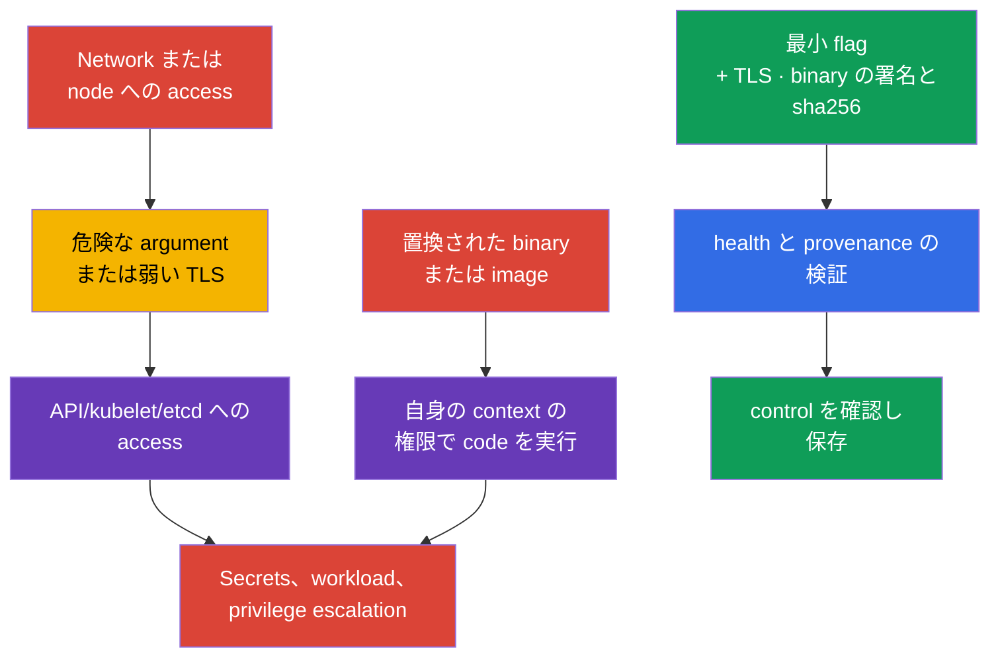
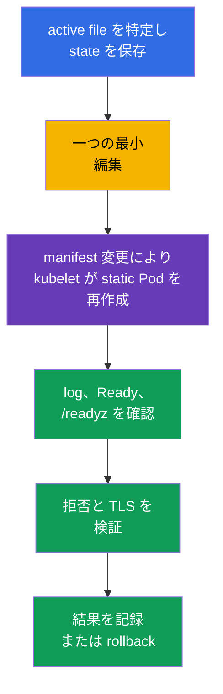

[Русская версия](ru.md) · [Eng version](README.md) · [Versión en español](es.md) · [Version française](fr.md) · [Deutsche Version](de.md) · [ქართული ვერსია](ge.md) · [繁體中文版](tw.md)

# 第09章. 安全でない component argument、TLS hardening、binary verification

> **課題。** control plane endpoint への network access、または node file を変更する能力を得た攻撃者は Kubernetes 自体の vulnerability ではなく、近くの安全でない argument を探します。anonymous access、read-only kubelet port、弱い TLS、起動前のすり替えられた `kubelet`/`kubectl`/image です。この一つの欠陥で API/etcd への access、または置換 artifact の context での code execution が可能になります。platform binary の影響は runtime に依存します。置換された kubelet/control-plane binary は対応する service process の権限を得、置換された `kubectl` は起動した OS user の権限とその kubeconfig/credentials への access を得ます。

> **この後。** 第08章では外部 HTTP entry を TLS で保護しました。次に control plane component と kubelet 自体を守ります。一つの安全でない argument が anonymous API、diagnostic endpoint、弱い TLS channel を開くことがあります。その後、公開された Kubernetes binary そのものを実行していることを検証します。これは **Cluster Setup** domain（CKS、15%）です。

> **CKA で必要な知識。** control plane、kubeadm、static Pod は [CKA 第35章](../../../cka/course/35/jp.md)、Kubernetes component surface は [CKA 第02章](../../../cka/course/02/jp.md) で扱います。ここでは基本設定を繰り返さず、危険 argument を探し、active configuration を安全に変更し、結果を証明します。

> 🧠 防御は template、tag、期待 version の一行ではなく、active runtime state によって決まります。

## 09.1. 脅威モデル: entry point としての flag または artifact

control plane は cluster 全体の判断を行います。`kube-apiserver` は API access を発行・検証し、`kubelet` は node 上で Pod を起動し、`etcd` は Secrets、RBAC、desired state を保存します。そのため弱い parameter は一 application の error より大きな影響を持ちます。

典型 attack chain は次の通りです。攻撃者が endpoint への network access または node 上の file を変更する能力を得て、anonymous access、read-only kubelet port、`AlwaysAllow`、profiling を利用し、data を読むか他者の権限で action を実行します。別経路は実行前の artifact substitution です。置換 kubelet/control-plane binary は対応 service/host process の権限で、置換 `kubectl` は local user の権限と利用可能な Kubernetes credentials で、container image は自身の workload security context の権限で動きます。したがって provenance は実行前に検証し、結果は「component の権限」という一般式でなく実際の execution context により評価します。



Hardening は「CIS 用」の line 集ではありません。変更前に四つを答えます。どの process が parameter を実際に使うか、client は誰か、certificate と cipher suite は互換か、availability をどう確認しどう rollback するかです。managed Kubernetes では control plane の一部を provider が所有します。host file を編集しようとせず、利用可能な security setting の documentation を確認します。

> 🎯 active config と process argument を確認し、唯一の effective source を修正して component を restart し、active state、behavior、health を確認します。binary は provenance と SHA-256 を確認します。

## 09.2. 危険な argument: 探すものと理由

すべての flag があらゆる topology で同じ危険度を持つわけではありません。value、listening address、firewall、TLS、RBAC は一つの control です。しかし次の setting は明示的な根拠または修正を必要とします。

| Component | 危険な setting | Risk | 安全な目安 |
|---|---|---|---|
| `kube-apiserver` | 広い anonymous access | accepted credentials を持たない request が `system:anonymous` として処理され、RBAC error があれば unauthenticated access 経路になる | benchmark では `--anonymous-auth=false` が必要な場合がある。production では最初に health endpoint と kubeadm discovery を確認し、Kubernetes 1.34+ では必要に応じ `AuthenticationConfiguration` で anonymous access を制限 |
| `kube-apiserver` | `--authorization-mode=AlwaysAllow` または追加された `AlwaysAllow` | authenticated request がすべて authorization を通過 | kubeadm は通常 `Node,RBAC` |
| `kube-apiserver` | `--profiling=true` | profiling は process state を露出し public boundary には不要 | `--profiling=false` |
| `kube-apiserver` | legacy `--insecure-port`/`--insecure-bind-address` | TLS/authentication なしの API | 有効にしない。modern Kubernetes ではこの legacy option は削除済み |
| `kubelet` | `--read-only-port` が `0` でない | unauthenticated endpoint が Pod/node data を露出し得る | `--read-only-port=0` または `readOnlyPort: 0` |
| `kubelet` | `--anonymous-auth=true` | anonymous client が kubelet API に到達 | `--anonymous-auth=false` または config API field |
| `kubelet` | `--authorization-mode=AlwaysAllow` | authenticated client が kubelet API に過剰な access を得る | `--authorization-mode=Webhook` |
| `kubelet` | `--protect-kernel-defaults=false` | baseline が不一致でも kubelet は fail-fast せず、host-level kernel flag を期待値に変えようとする可能性がある | sysctl 確認後の `--protect-kernel-defaults=true` |
| `kube-controller-manager` | `--profiling=true` または `--use-service-account-credentials=false` | 余分な diagnostic、または別々の SA でなく広い credentials の使用 | `--profiling=false`、個別 service account credentials |
| `kube-scheduler` | profiling 有効、または広い `--bind-address` の endpoint | diagnostic endpoint が不要な network に公開される | `enableProfiling: false`。deprecated CLI `--profiling` と config-based scheduler における kube-bench の制限は [第07章](../07/jp.md) |
| `etcd` | `--client-cert-auth=false`、安全でない `--listen-client-urls` | mTLS なしの client または external network が cluster store に access | mTLS、localhost/internal network、firewall |

specific CIS/CKS 課題で benchmark が `--anonymous-auth=false` を明示的に要求する場合、課題の requirement をそのまま実施し結果を証明します。

production kubeadm ではこの変更を機械的に適用しません。標準 token-based `kubeadm join` は `system:unauthenticated` group による `kube-public/cluster-info` の public read を使うため、anonymous authentication の完全無効化は discovery lifecycle を変えます。また、anonymous health endpoint を使う `kube-apiserver` health probe も確認します。

Kubernetes 1.34+ では、explicit に必要な endpoint だけに anonymous access を許す `AuthenticationConfiguration` を使えます。public `cluster-info` が不要なら、最初に join/discovery を適切な alternative へ移し、その後にこの access を除去します。たとえば static Pod に `--authentication-config=<path>` と対応 mount で接続する別 file は次を含められます。

```yaml
apiVersion: apiserver.config.k8s.io/v1
kind: AuthenticationConfiguration
anonymous:
  enabled: true
  conditions:
  - path: /livez
  - path: /readyz
  - path: /healthz
```

anonymous access を `/livez`、`/readyz`、`/healthz` だけに残すと、public `cluster-info` を通す通常の token-based `kubeadm join` は機能しません。node-addition lifecycle を別 discovery mechanism に移した場合だけ許容されます。

`AuthenticationConfiguration` に `anonymous` field がある場合、`--anonymous-auth` を同時に使えません。endpoint-scoped variant は `--anonymous-auth=false` を明示的に要求する benchmark を pass にしません。cluster に適用する model を選び文書化します。

template file だけでなく active parameter を最初に inventory します。duplicate を探してください。最後または実際に使われる value は implementation に依存し、conflicting flag は診断を難しくします。specific finding が既に `kube-bench`（第07章）にある場合、その remediation を正確な flag/file の source とします。TLS-specific parameter（`--tls-min-version`、`--tls-cipher-suites`）は以下の 09.4-09.5 で別途扱います。

kubelet の `--enable-debugging-handlers` も risk により評価します。これは diagnostic handler を有効にし、その必要部分を `kubectl logs`、`exec`、`port-forward` が使用する場合があります。盲目的に無効化せず、先に必要 operation を決め、`10250` の kubelet API を authentication + `Webhook` authorization で保護します。

`10250` への network access は node または infrastructure 層で制限します。host firewall、cloud security group/ACL、CNI-specific host policy です。通常の Kubernetes `NetworkPolicy` を kubelet endpoint の portable control と見なさないでください。これは host/node traffic であり、`hostNetwork` と node IP に対する NetworkPolicy の behavior は CNI implementation に依存します。同じことは metrics にも当てはまります。profiling と metrics は別 endpoint です。

## 09.3. configuration の変更場所と安全な restart 方法

static Pod control plane を安全に編集する一般 process（backup、最小変更、health check、failure recovery）は第07章で扱います。ここでは繰り返さず、本章特有の一技法と、以下の 09.4 における TLS/cipher 編集で重要になる kubelet/scheduler/controller-manager configuration discovery の注意点を補います。

kubelet は static Pod ではありません。configuration は通常 `/var/lib/kubelet/config.yaml`、追加 argument は `/var/lib/kubelet/kubeadm-flags.env` と systemd drop-in にあります。Kubernetes 1.36 では `--config-dir` も探します。kubelet は main config、次にその directory（subdirectory を含む）の `*.conf` drop-in を lexical order で適用し、`*.yaml` は無視します。Kubernetes 1.36 では source は次の順に結合されます。CLI feature gate は最低 priority、main config、`--config-dir` の `*.conf`、その他 CLI argument が最高 priority です。よって本章の通常 parameter は CLI flag が YAML/drop-in を override し得ますが、この rule を `--feature-gates` へ適用してはいけません。

actual `--config`、`--config-dir`、CLI argument は `systemctl cat kubelet` と actual process command line で定めます。必要なしに一つの通常 parameter を複数 source に設定しません。

scheduler は先に `--config=<path>` の有無を確認します。`KubeSchedulerConfiguration` が effective source になり、`--config` があると一部 legacy CLI flag は deprecated/ignored です。たとえば scheduler の `--profiling` は deprecated で、component config では `enableProfiling: false` を確認します。

`kube-controller-manager` には Kubernetes 1.36 で scheduler 相当の一般 `--config` option がありません。working parameter は active manifest/process argument の CLI flag で与え続けます。`KubeControllerManagerConfiguration` は component configuration API および internal/configz representation として存在しますが、kube-controller-manager の一般的な外部 `--config` file ではありません。

したがって先に component の runtime を定め、それが support する active source だけを検査します。



static Pod control plane 用の追加技法は、同じ watched directory 内の hidden candidate を atomic rename することです。中間 YAML error の瞬間にも API なしで cluster を残さないことが重要な場合、通常の backup+edit より信頼できます。

```bash
# 1. watched directory 自体に hidden candidate を作る。kubelet は dot で始まる
# name の file を無視するため、atomic replacement まで Pod は再作成されない。
# /etc/kubernetes/manifests は別 mount のことがある。candidate を
# /etc/kubernetes に作ると、異なる filesystem 間の mv は copy+unlink となり
# atomic rename でなくなる。
sudo install -d -m 700 /root/k8s-manifest-backup
CANDIDATE=$(sudo mktemp /etc/kubernetes/manifests/.kube-apiserver.yaml.candidate.XXXXXX)
sudo cp -p /etc/kubernetes/manifests/kube-apiserver.yaml "$CANDIDATE"
sudo cp -p /etc/kubernetes/manifests/kube-apiserver.yaml \
  /root/k8s-manifest-backup/kube-apiserver.yaml.$(date +%F-%H%M%S)
sudoedit "$CANDIDATE"

# 2. running static Pod に触れず candidate の YAML/API structure を実際に検証する。
sudo kubectl apply --dry-run=client --validate=strict -f "$CANDIDATE"

# 3. 成功した検証後にのみ watched manifest を atomic に置換する。
# Candidate と target は同 directory・filesystem にあるため、rename は必ず atomic。
sudo mv -f "$CANDIDATE" /etc/kubernetes/manifests/kube-apiserver.yaml

# 4. node console から再作成を観察し、次に API を検査する。
watch -n 2 'sudo crictl ps -a --name kube-apiserver'
kubectl get --raw='/readyz?verbose'
kubectl get nodes

# static Pod が起動しないなら、最初に kubelet と runtime log を読む。
sudo journalctl -u kubelet -n 100 --no-pager
sudo crictl ps -a --name kube-apiserver
sudo crictl logs "$(sudo crictl ps -aq --name kube-apiserver | head -n1)"
```

permanent backup は依然 `/etc/kubernetes/manifests/` の外に保存します（上の step 1 のように）。hidden candidate は置換の間だけ必要で、long-term copy ではありません。

kubelet は sysctl と configuration を先に確認してから、それだけを restart します。通常の `systemctl restart kubelet` は既に実行中の Pod/container を止めません。container runtime が実行を続け、kubelet は start 後に reconciliation を復元します。それでも control-plane では kubelet を一 node ずつ変更し、Node heartbeat、kubelet log、`/readyz` を監視します。configuration error は node を `NotReady` にし、その後の static Pod 管理を妨げる可能性があります。

```yaml
# /var/lib/kubelet/config.yaml - configuration API fragment の例。
readOnlyPort: 0
authentication:
  anonymous:
    enabled: false
authorization:
  mode: Webhook
protectKernelDefaults: true
```

```bash
sudo systemctl restart kubelet
sudo systemctl --no-pager --full status kubelet
sudo journalctl -u kubelet -n 100 --no-pager
check_kubelet_10255() {
  local listeners

  if ! listeners="$(sudo ss -H -lntp 'sport = :10255')"; then
    echo 'ERROR: cannot inspect listening TCP sockets; port 10255 is not verified' >&2
    return 1
  fi

  if [[ -n "$listeners" ]]; then
    printf '%s\n' "$listeners"
    echo 'FAIL: kubelet read-only port 10255 is listening' >&2
    return 1
  fi

  echo 'PASS: kubelet read-only port 10255 is closed'
}
check_kubelet_10255
kubectl get nodes

# base config、*.conf drop-in、CLI override 後の final state。authorized access が必要。
NODE="${NODE:?set target node name from kubectl get nodes}"
kubectl get --raw "/api/v1/nodes/${NODE}/proxy/configz" \
  | jq '.kubeletconfig | {readOnlyPort, authentication, authorization, protectKernelDefaults}'
```

## 09.4. apiserver、kubelet、etcd の TLS hardening

TLS は channel を保護しますが、version と cipher suite set は client がどの cryptographic option を negotiate できるかを決めます。obsolete protocol や weak cipher を許すと downgrade と古い cryptography の使用が容易になります。通常、最低 `TLS 1.2` は modern Kubernetes client と互換です。`TLS 1.3` は client をより厳しく制限するため、control plane、automation、monitoring 全体を別に検証する必要があります。

modern Go と Kubernetes の default はすでに obsolete protocol と insecure suite を除外しており、普遍的な「短い安全 list」はありません。component や version の間で偶然見つけた短い list を移植しないでください。organization policy または specific CIS profile が approved list を要求するなら、certificate と client の inventory 後にその list を適用し、hardening baseline と対立させません。RSA-only list は安全 default ではありません。ECDSA certificate の endpoint を壊し、不必要に互換性を狭めます。Go の TLS 1.3 suite は通常 `--tls-cipher-suites` では管理されず TLS implementation が選ぶため、この flag は主に TLS 1.2 以前に関係します。

> 🔬 Cipher suite pinning と TLS 1.3 には approved policy、client inventory、component version による value の確認が必要です。

Kubernetes component の flag で許される string value は通常 `VersionTLS12` と `VersionTLS13` です。etcd の value 名は etcd version に依存し、current help では `TLS1.2`/`TLS1.3` を使うことがあります。推測で program 間の value を移さず、編集前に memory や別 release documentation ではなく、その version で実行中の binary の `--help` を確認してください。

試験では、web を探すより実行中 process 自身から正確な flag と許容 value list を得るほうが速いです。必要 version の documentation page が見つからない、または search に時間がかかることがあります。component が static Pod で container が `Running` なら最初に `kubectl exec` を使えます。`Ready=False` 自体は exec を妨げません。exec に必要なのは running container と使用可能な API/RBAC/streaming path です。Readiness は Pod の `Ready` state を決め、Service traffic への含有や workload controller の availability/rollout semantics に使われますが、`kubectl exec` の gate ではありません。`kubectl exec` の API/RBAC/streaming path が使えず、component が実際に CRI container として実行されているなら、specific container ID で `crictl exec` を使います。

component が独立した host `systemd` service なら `crictl exec` は使えません。active process または `ExecStart` から executable を得て、node 上で直接 `--help` を呼びます。

```bash
# Static Pod / mirror Pod: container は Running である必要がある（Ready は必須でない）。
kubectl -n kube-system exec kube-apiserver-<node> -- kube-apiserver --help 2>&1 \
  | grep -A2 -- '--tls-min-version\|--tls-cipher-suites'

kubectl -n kube-system exec etcd-<node> -- etcd --help 2>&1 \
  | grep -A2 -- '--cipher-suites\|--tls-min-version'

# fallback は etcd が実際に CRI container として動く場合だけ。
CID="$(sudo crictl ps -q --name etcd | head -n1)"
if [[ -n "$CID" ]]; then
  sudo crictl exec "$CID" etcd --help 2>&1 \
    | grep -A2 -- '--tls-min-version'
fi

# etcd が独立した host/systemd process なら、その process の executable を使う。
PID="$(pgrep -xo etcd)"
if [[ -n "$PID" ]]; then
  sudo "/proc/${PID}/exe" --help 2>&1 \
    | grep -A2 -- '--tls-min-version'
fi
```

`--help` output は正確な flag 名と、多くの version では flag 近くの許容 value の短い説明を示します。これは cluster で実際に動く同じ binary・同じ version なので、別 release documentation との差異がなく browser 切替の時間も不要です。

benchmark の「etcd は TLS 1.2 未満を受け付けない」という requirement の証拠は、active `--tls-min-version` と検証済み handshake であり、任意の RSA-only cipher list ではありません。適用する benchmark の正確な表現と version を確認します。

```yaml
# /etc/kubernetes/manifests/kube-apiserver.yaml, command fragment.
# modern Go default では suite を明示 pinning しない。
- kube-apiserver
- --tls-min-version=VersionTLS12
# approved policy/compatibility が必要なときだけ --tls-cipher-suites を追加する。
# policy が list を要求するなら certificate に必要な ECDSA と RSA suite の両方を含める:
# - --tls-cipher-suites=TLS_ECDHE_ECDSA_WITH_AES_128_GCM_SHA256,TLS_ECDHE_ECDSA_WITH_AES_256_GCM_SHA384,TLS_ECDHE_RSA_WITH_AES_128_GCM_SHA256,TLS_ECDHE_RSA_WITH_AES_256_GCM_SHA384
```

kubelet には config API を優先します。install が systemd 経由で parameter を渡すなら、唯一の active source に equivalent flag を使います。同様に `tlsCipherSuites` は文書化された policy が要求するまで未設定のままにします。

```yaml
# /var/lib/kubelet/config.yaml, fragment。exact field の support は kubelet version に依存する。
tlsMinVersion: VersionTLS12
```

```yaml
# /etc/kubernetes/manifests/etcd.yaml, TLS1.2 value を受け付ける etcd の例。
# policy が別のものを要求しない限り、Go default が安全なので --cipher-suites は追加しない。
- etcd
- --tls-min-version=TLS1.2
```

TLS を server endpoint だけに限定しません。etcd には client と peer traffic があり、apiserver には kubelet、controller-manager、scheduler、kubectl、webhook、automation client があります。最初に actual certificate/key、listening address、client を集め、次に test または一つの HA node へ変更を適用します。`VersionTLS13` への移行では old TLS 1.2 client が拒否されることを予想します。これは server error の証明ではありませんが、client migration plan を要します。

TLS minimum の検証には二つの別事項が必要です。

1. protocol evidence - 許可 version は成功して negotiate され、設定 minimum 未満の version は拒否される。
2. application health - component は変更後も動作可能である。

apiserver は `6443` の handshake で十分です。kubelet `10250` は handshake 後に client certificate と authorization を要することが多いです。etcd の `etcdctl endpoint health` は application health だけを証明するため、protocol handshake は `openssl s_client` で別に検査します。private key を terminal に出力・copy しません。

negative test 前に、TLS client が実際に test する legacy protocol version を提案できるか確認します。modern OpenSSL や system crypto policy 自身が TLS 1.1 を禁止することがあります。client が local で TLS 1.1 を拒否しても server-side `tls-min-version` の証明にはなりません。negative test が証拠になるのは、client が legacy protocol を negotiate しようとし、拒否が検査 endpoint から来たことが分かるときだけです。この rule は apiserver、kubelet、etcd に共通です。

```bash
# apiserver, positive test: TLS 1.2 が成功して negotiate される必要がある。
# address と SNI は cluster の値に置換する。
export API=127.0.0.1:6443
OUT="$(mktemp)"

if openssl s_client \
    -connect "$API" \
    -servername kubernetes \
    -tls1_2 \
    -CAfile /etc/kubernetes/pki/ca.crt \
    -verify_return_error \
    </dev/null >"$OUT" 2>&1
then
  if grep -Eq 'Cipher is \(NONE\)|Cipher[[:space:]]*:[[:space:]]*0000' "$OUT"; then
    cat "$OUT"
    rm -f "$OUT"
    echo 'FAIL: TLS 1.2 handshake has no negotiated cipher' >&2
    exit 1
  fi
  grep -E 'Protocol|Cipher|Verify return code' "$OUT"
  echo 'PASS: TLS 1.2 handshake succeeded'
else
  cat "$OUT" >&2
  rm -f "$OUT"
  echo 'FAIL: TLS 1.2 handshake failed' >&2
  exit 1
fi
rm -f "$OUT"

# apiserver, negative test: TLS 1.1 は server が拒否する必要がある。
# "protocol|alert" への単純な grep では、ClientHello 送信前の local
# OpenSSL/crypto policy の拒否と server-side 拒否を区別できない。両方を証明する。
# function にする。すべての non-PASS branch で return 1 とし、exit status が
# textual verdict と一致して automation (cmd && echo PASS, CI wrapper, $?) を壊さない。
check_tls11_rejected() {
  local endpoint="$1"
  local servername="$2"
  local neg rc

  neg="$(mktemp)" || return 1

  # @SECLEVEL=0 はこの one-time test client だけを弱め、modern OpenSSL が可能なら
  # TLS 1.1 ClientHello を作れるようにする。server は変更しない。
  if openssl s_client \
      -connect "$endpoint" \
      -servername "$servername" \
      -tls1_1 \
      -cipher 'DEFAULT:@SECLEVEL=0' \
      -msg -state \
      </dev/null >"$neg" 2>&1
  then
    rc=0
  else
    rc=$?
  fi

  if grep -Eq '^>>> .*Handshake.*ClientHello' "$neg" \
     && grep -Eq '^<<< .*Alert.*fatal protocol_version|alert protocol version' "$neg"
  then
    echo 'PASS: client sent TLS 1.1 ClientHello and server rejected it with protocol_version'
    rm -f "$neg"
    return 0
  fi

  if grep -Eqi 'no protocols available|no ciphers available|unsupported protocol' "$neg" \
     && ! grep -Eq '^>>> .*Handshake.*ClientHello' "$neg"
  then
    cat "$neg" >&2
    echo 'INCONCLUSIVE: local OpenSSL/crypto policy blocked TLS 1.1 before ClientHello' >&2
    rm -f "$neg"
    return 1
  fi

  cat "$neg" >&2
  echo "INCONCLUSIVE/FAIL: server-side TLS 1.1 rejection was not proven (s_client rc=${rc})" >&2
  rm -f "$neg"
  return 1
}
check_tls11_rejected "$API" kubernetes

# etcd: 最初に mTLS による許可 TLS 1.2 handshake を確認する。model は apiserver と同じで、
# s_client exit status、-verify_return_error、実際に negotiate した cipher を検査し
# Verify return code だけを見ない。
OUT="$(mktemp)"

if sudo openssl s_client \
    -connect 127.0.0.1:2379 \
    -tls1_2 \
    -CAfile /etc/kubernetes/pki/etcd/ca.crt \
    -cert /etc/kubernetes/pki/etcd/healthcheck-client.crt \
    -key /etc/kubernetes/pki/etcd/healthcheck-client.key \
    -verify_return_error \
    </dev/null >"$OUT" 2>&1
then
  if grep -Eq 'Cipher is \(NONE\)|Cipher[[:space:]]*:[[:space:]]*0000' "$OUT"; then
    cat "$OUT"
    rm -f "$OUT"
    echo 'FAIL: etcd TLS 1.2 handshake has no negotiated cipher' >&2
    exit 1
  fi
  grep -E 'Protocol|Cipher|Verify return code' "$OUT"
  echo 'PASS: etcd TLS 1.2 handshake succeeded'
else
  cat "$OUT" >&2
  rm -f "$OUT"
  echo 'FAIL: etcd TLS 1.2 handshake failed' >&2
  exit 1
fi
rm -f "$OUT"

# 次に negative test: TLS 1.1 は negotiate されない必要がある。apiserver と同じ criterion:
# client が ClientHello を送り server が protocol_version を返したことを証明する。
# 独立 function (check_tls11_rejected ではない): etcd には mTLS client cert/key が必要で、
# apiserver function はそれを受けない。同じ理由で全 non-PASS branch は return 1。
check_etcd_tls11_rejected() {
  local endpoint="$1" cacert="$2" cert="$3" key="$4"
  local neg rc

  neg="$(mktemp)" || return 1

  if sudo openssl s_client \
      -connect "$endpoint" \
      -tls1_1 \
      -cipher 'DEFAULT:@SECLEVEL=0' \
      -CAfile "$cacert" \
      -cert "$cert" \
      -key "$key" \
      -msg -state \
      </dev/null >"$neg" 2>&1
  then
    rc=0
  else
    rc=$?
  fi

  if grep -Eq '^>>> .*Handshake.*ClientHello' "$neg" \
     && grep -Eq '^<<< .*Alert.*fatal protocol_version|alert protocol version' "$neg"
  then
    echo 'PASS: client sent TLS 1.1 ClientHello and etcd rejected it with protocol_version'
    rm -f "$neg"
    return 0
  fi

  if grep -Eqi 'no protocols available|no ciphers available|unsupported protocol' "$neg" \
     && ! grep -Eq '^>>> .*Handshake.*ClientHello' "$neg"
  then
    cat "$neg" >&2
    echo 'INCONCLUSIVE: local OpenSSL/crypto policy blocked TLS 1.1 before ClientHello' >&2
    rm -f "$neg"
    return 1
  fi

  cat "$neg" >&2
  echo "INCONCLUSIVE/FAIL: etcd server-side TLS 1.1 rejection was not proven (s_client rc=${rc})" >&2
  rm -f "$neg"
  return 1
}
check_etcd_tls11_rejected 127.0.0.1:2379 \
  /etc/kubernetes/pki/etcd/ca.crt \
  /etc/kubernetes/pki/etcd/healthcheck-client.crt \
  /etc/kubernetes/pki/etcd/healthcheck-client.key

# etcd の application health を別に確認する。
export ETCDCTL_API=3
sudo etcdctl --endpoints=https://127.0.0.1:2379 endpoint health \
  --cacert=/etc/kubernetes/pki/etcd/ca.crt \
  --cert=/etc/kubernetes/pki/etcd/healthcheck-client.crt \
  --key=/etc/kubernetes/pki/etcd/healthcheck-client.key

# Desired source: manifest が期待する編集を実際に含む。
sudo grep -nE -- '--(tls-min-version|tls-cipher-suites|cipher-suites)' \
  /etc/kubernetes/manifests/{kube-apiserver,etcd}.yaml

# Active runtime: manifest は kubelet が定期的に読む desired source にすぎない。
# この node で実際に動く process の argv を読む。
for PROC in kube-apiserver etcd; do
  PID="$(pgrep -xo "$PROC")" || {
    echo "ERROR: running process not found: $PROC" >&2
    continue
  }
  echo "=== active argv: $PROC (pid=$PID) ==="
  sudo cat "/proc/${PID}/cmdline" \
    | tr '\0' '\n' \
    | grep -E -- '--(tls-min-version|tls-cipher-suites|cipher-suites)' \
    || echo "INFO: matching TLS flag is absent from active argv of $PROC"
done

# 次に behavioral TLS test と health。
kubectl get --raw='/readyz?verbose'
kubectl get nodes
```

| 変更後の symptom | 考えられる原因 | 検査と action |
|---|---|---|
| apiserver が起動しない | YAML typo、unsupported flag、cipher | `journalctl -u kubelet`、`crictl logs`。最後の working manifest を復元 |
| client が protocol version を受ける | client が設定 minimum より古い | client を update、または approved exception に基づく negotiated minimum を一時的に選択 |
| TLS 1.2 で TLS handshake が失敗 | certificate key algorithm が許可 cipher suite と非互換 | `openssl x509 -text` を確認し、適切な ECDSA/RSA suite を追加 |
| etcd が healthy でない | peer/client が TLS を negotiate できない、または key access を失った | mTLS による全 member endpoint、etcd log、一 node rollback を確認 |
| `openssl` が list にない TLS 1.3 cipher を示す | TLS 1.3 cipher は TLS library が制御 | minimum version と version documentation を確認し、flag の回避と見なさない |

## 09.5. Kubernetes platform binary の検証: signature と sha256

download 中の HTTPS は transport を保護しますが、file を誰が release したかは証明しません。SHA-256 は**integrity**を検証します。download した binary が選択した digest で記述された byte と等しいことです。これは provenance の証明ではありません。同じ信頼できない source から file と一緒に得た hash、または未承認 baseline は trust を生みません。

Kubernetes では version 固有の official release artifact を使います。Kubernetes は binary と共に keyless cosign signature と certificate を公開します。`verify-blob` は signature と、expected identity および OIDC issuer への certificate binding を検証し、release origin を証明します。任意の certificate を受け入れず、identity と issuer を明示的に確認します。version は variable に pin します。`latest` は信頼して再現できません。

```bash
export K8S_VERSION=v1.36.0
export ARCH=amd64
export BIN=kubectl
export BASE="https://dl.k8s.io/release/${K8S_VERSION}/bin/linux/${ARCH}"

# version 固有の release から binary と公開された keyless signature/certificate を取得する。
for FILE in "${BIN}" "${BIN}.sig" "${BIN}.cert" "${BIN}.sha256"; do
  curl -fsSL --retry 3 --retry-delay 3 "${BASE}/${FILE}" -o "${FILE}"
done

# binary artifact 用の Kubernetes Release Engineering の official value。
# cosign 2+ は両方の constraint を要求する。「成功する」verification のために外してはいけない。
cosign verify-blob "${BIN}" \
  --signature "${BIN}.sig" \
  --certificate "${BIN}.cert" \
  --certificate-identity krel-staging@k8s-releng-prod.iam.gserviceaccount.com \
  --certificate-oidc-issuer https://accounts.google.com

# SHA-256 は approved release digest に対する byte の追加 equality check。
printf '%s  %s\n' "$(tr -d '[:space:]' < "${BIN}.sha256")" "${BIN}" > "${BIN}.sha256sum"
sha256sum --check "${BIN}.sha256sum"
# kubectl: OK

# すでに install された file では、observed digest を取得して approved inventory と比較する。
sha256sum /usr/bin/kubelet
```

したがって expected identity/issuer を備えた signature/certificate は provenance を提供し、checksum は trusted release digest に対する integrity を提供します。Kubernetes は signed SBOM（SPDX）も公開しますが、image digest pinning、container-image signature、SBOM、admission policy は、この章の Cluster Setup ではなく**Supply Chain Security（20%）**domain に属します。これらの control は[第24〜28章](../24/jp.md)を参照してください。ここでは Kubernetes platform 自体の release artifact と binary だけを検証します。

digest、signing、SBOM を含む詳細な container-image verification は、意図してここに重複させません。Supply Chain Security なので、[第24〜28章](../24/jp.md)を参照してください。

## 09.6. 実践 scenario: 被害が起きる前に binary tampering を検出する

download 後に改ざんまたは置換された `kubelet` binary が worker に届いたとします。通常の `kubelet --version` check では問題を見つけられません。malicious binary は期待どおりの version を返せます。

最初に observed hash を記録し、approved release manifest と比較してから、containment を選ぶ前に evidence/provenance/baseline/authorized-change の triage を行います。reference hash を変更して mismatch を「修正」してはいけません。未確認の change、binary tampering、unexpected replacement の他の兆候がある場合は incident runbook に従って escalate します。

```bash
# 1. file を置換する前に node 上の evidence を保存する。
sudo sha256sum /usr/bin/kubelet | sudo tee /root/kubelet.sha256.observed
sudo stat -c '%y %s %U:%G %a %n' /usr/bin/kubelet
sudo systemctl cat kubelet

# 2. observed hash を trusted inventory の approved release digest と比較する。
# Inventory format: '<digest>  /usr/bin/kubelet'。mismatch 時は FAIL を返す。
sudo sha256sum --check /root/approved-kubelet.sha256

# chapters 24-28 の supply-chain procedure を通じて、さらに imageID/digest verification を行う。
```

`sha256sum --check` の `FAILED` は investigation の signal ですが、それだけでは compromise を証明せず、唯一の答えとして「isolate」も指示しません。最初に evidence を保存し、triage を行います。(1) path、version、expected approved baseline を確認し、inventory error または間違った file の update を除外します。(2) expected certificate identity/issuer を持つ `cosign verify-blob` で release provenance を検証し、package/release metadata を比較します。(3) change record、rollout、package-manager、CI log という authorized change を探し、time、owner、digest を相関させます。(4) previously known-good baseline と比較し、他 node 上の scope を確認します。reference hash を変えて mismatch を「修正」してはいけません。

evidence が authorized change を確認できない、provenance/baseline が一致しない、または binary tampering/unexpected replacement の他の兆候がある場合は、incident runbook に従って escalate します。さらなる spread を止め、proportionate containment（cordon/drain または node isolation まで）を適用し、log を保存して、controlled な方法で node または binary を置換します。一つの hash は expected byte の mismatch を確実に報告しますが、その原因や change path は説明しません。container image と registry/CI evidence への対応は第24〜28章の supply-chain procedure に属します。

## 09.7. 結果の検証と troubleshooting

各編集後には三つの level の evidence が必要です。active configuration、actual behavior、cluster health です。使われない file に line があることは verification ではありません。

```bash
# 1a. desired control-plane source: kubeadm default staticPodPath 用。
# staticPodPath を変更している場合は、実際に active な directory を使う。
STATIC_POD_DIR=/etc/kubernetes/manifests
sudo grep -nE -- \
  '--(anonymous-auth|authorization-mode|profiling|tls-min-version|cipher-suites)' \
  "${STATIC_POD_DIR}"/{kube-apiserver,kube-controller-manager,kube-scheduler,etcd}.yaml

# 1b. control-plane process の active runtime argv: manifest は desired source にすぎない。
# kubelet が定期的に読むもので、recreated Pod の証明ではない。
sudo ps -ww -eo pid,args \
  | grep -E '[k]ube-apiserver|[k]ube-controller-manager|[k]ube-scheduler|[e]tcd'

# particular parameter が必要な場合、truncation なしで argv を取得する:
APIPID="$(pgrep -xo kube-apiserver)" || {
  echo 'ERROR: kube-apiserver process not found' >&2
  false
}
sudo cat "/proc/${APIPID}/cmdline" | tr '\0' '\n'

# 1c. Kubelet: path を推測する前に actual startup source を表示する。
sudo systemctl cat kubelet
sudo ps -ef | grep '[k]ubelet'

# 1d. base config、--config-dir、override 後の final effective KubeletConfiguration。
NODE="${NODE:?set target node name from kubectl get nodes}"
kubectl get --raw "/api/v1/nodes/${NODE}/proxy/configz" \
  | jq '.kubeletconfig | {
      readOnlyPort,
      authentication,
      authorization,
      protectKernelDefaults,
      tlsMinVersion,
      tlsCipherSuites
    }'
```

manifest と runtime は別々に検証します。manifest は desired source を証明し、process command line は new argv で static Pod が実際に recreated されたことを証明します。component が `--config` 経由で additional component config を読む場合は、active config file/effective endpoint も別途検証します。その場合 argv だけでも不十分です。

permission または topology により `/configz` が使えないとき、hard-coded の `/var/lib/kubelet/config.yaml` に fallback してはいけません。unit/process から actual `--config` と `--config-dir` を取得し、正確にそれらを読んでから、通常の CLI override を考慮します。

```bash
# 2. behavior: read-only kubelet port は closed。check_kubelet_10255 function（§09.3）
# は、exit status が textual verdict と一致するよう、PASS 以外のすべてで 1 を返す。
check_kubelet_10255() {
  local listeners

  if ! listeners="$(sudo ss -H -lntp 'sport = :10255')"; then
    echo 'ERROR: cannot inspect listening TCP sockets; port 10255 is not verified' >&2
    return 1
  fi

  if [[ -n "$listeners" ]]; then
    printf '%s\n' "$listeners"
    echo 'FAIL: kubelet read-only port 10255 is listening' >&2
    return 1
  fi

  echo 'PASS: kubelet read-only port 10255 is closed'
}
check_kubelet_10255
```

§09.4 の positive/negative protocol test で TLS minimum を確認します。local-client capability を確認せず、簡略化した `openssl ... -tls1_1 | grep ...` を繰り返してはいけません。modern OpenSSL または system crypto policy 自体が TLS 1.1 を禁止して false positive を許すことがあります。

```bash
# 3. health: API、node、static Pod が working state に戻った。
kubectl get --raw='/readyz?verbose'
kubectl get nodes
kubectl -n kube-system get pods -o wide
sudo crictl ps | grep -E 'kube-apiserver|kube-controller-manager|kube-scheduler|etcd'
```

| Check の失敗 | 最初に確認するもの | よくある原因 |
|---|---|---|
| static Pod 編集後に `kubectl` が応答しない | `journalctl -u kubelet`、`crictl ps -a`、container log | incorrect YAML、flag、または mount |
| flag は visible だが `kube-bench` が依然 FAIL を報告 | process args と value source 一つ | active manifest でなく template を変更した、または duplicate がある |
| port `10255` が依然 listen している | systemd drop-in と kubelet `ps` | 間違った config file を編集した、または old flag が YAML を override |
| TLS 1.2 client が接続しなくなった | certificate algorithm、cipher list、client TLS | suite が狭すぎる、または client が非互換 |
| `sha256sum --check` が FAIL を返す | approved manifest、path、version | wrong binary、corrupted download、binary tampering、unexpected replacement |

`kube-bench` は regression control として有用ですが、その profile は Kubernetes version と architecture に一致する必要があります。fix 後に relevant target を再実行し、benchmark version と共に report を保存します。`WARN` は manual decision を要し、mechanically flag を追加するものではありません。

```bash
sudo kube-bench run --targets master,etcd | tee kube-bench-after.txt
grep -E '\[FAIL\]|\[WARN\]' kube-bench-after.txt
```

> 🏭 argument、TLS、binary の immutable で versioned な baseline、canary/rolling rollout、owner と expiry を持つ temporary exception。

## 09.8. production での使い方

- **Immutable baseline.** Component argument、kubelet config、TLS policy は kubeadm config、node image、または configuration management で設定します。static Pod の manual editing は emergency または training の技法であり、その後 source of truth へ戻す必要があります。
- **Compatible TLS hardening.** client inventory、HA node 一つでの canary change、handshake-error monitoring、rollback plan が、`VersionTLS13` または cipher suite の narrowing に先行します。exception には expiry、owner、compensating control を持たせます。
- **Drift detection.** `kube-bench` を定期的に実行し、effective process args と configuration を確認します。kubelet では `10255` listener があれば alert します。etcd では `2379/2380` が `LISTEN` なのは正常です。approved bind/exposure baseline からの deviation、すなわち unexpected interface/process、unauthorized network からの access、必要な mTLS/firewall の欠如、または cluster topology に対する他の drift で alert します。
- **Verifiable delivery.** pipeline は expected identity/issuer に対して binary の keyless signature/certificate を検証し、integrity check として SHA-256 を確認し、approved platform baseline は別に保持します。image signing、SBOM、registry、admission control は第24〜28章の supply-chain topic です。
- **Safe rollback.** manifest backup は static Pod directory の外に保管し、non-production で rollback を test します。binary tampering または unexpected replacement が疑われるときは、potentially modified host の運用を続けるより trusted image から node を rebuild するほうが望ましいです。

## 09.9. ミニ glossary

- **static Pod** — Kubernetes API 経由で scheduler によらず、kubelet が管理する local node manifest の Pod。
- **`--anonymous-auth`** — API endpoint の anonymous identity を許可または拒否する setting。
- **read-only kubelet port** — legacy の unauthenticated kubelet port。value `0` で無効にする必要がある。
- **TLS minimum version** — server が client と negotiate する最小 TLS version。
- **cipher suite** — TLS cryptographic algorithm の set。許可 set は certificate algorithm と client に互換でなければならない。
- **SHA-256 checksum** — published artifact との厳密な byte equality の検証に使う 256-bit file digest。
- **provenance** — 実証可能な artifact origin。誰が、どの trusted release または pipeline から release したか。

## 09.10. 章のまとめ

- 危険な `anonymous-auth`、`AlwaysAllow`、profiling、read-only kubelet port、広い diagnostic endpoint は control plane と node の attack surface を拡大します。
- 最初に active parameter source を定めます。kubeadm control-plane component は通常 `/etc/kubernetes/manifests/` の static Pod であり、kubelet は config API および/または argument を持つ systemd service です。
- static Pod は一度に一つ変更し、watched directory 外の backup、`kubelet`/CRI observation、即時の `/readyz` verification を行います。
- apiserver と kubelet は TLS minimum version を設定し、etcd は対応する `--tls-min-version` を設定します。exact value は etcd version と比較します。modern Go/Kubernetes の suite default は安全です。approved policy、benchmark、compatibility の場合だけ suite list を pin し、certificate key algorithm と client で test します。
- expected certificate identity/issuer を持つ `cosign verify-blob` は Kubernetes binary の provenance を検証し、`sha256sum --check` はさらに trusted checksum と byte を比較します。image digest、signing、SBOM は Supply Chain Security の第24〜28章に属します。
- hardening の証明には active argument、dangerous behavior の negative test、TLS handshake、control-plane health、repeated `kube-bench` が含まれます。

## 09.11. この知識が役立つ場面: 試験と実務

**試験で。** CKS task では control-plane node への SSH を与えられ、安全でない flag、TLS policy、binary hash の修正を求められることがあります。static Pod か kubelet service かを素早く定め、`/etc/kubernetes/manifests` の外に backup を残し、一つ編集します。restart を待ち、configuration と health の両方を示します。checksum では目視で比較せず、`sha256sum --check` 用の input を作り、その `OK`/`FAIL` を保持します。

よくある specific variant は、`kube-apiserver` と `etcd` の minimum TLS version を設定するものです（例:「TLS 1.2 未満は禁止」または「TLS 1.3 のみ」）。apiserver では manifest `/etc/kubernetes/manifests/kube-apiserver.yaml` の `--tls-min-version=VersionTLS12`/`VersionTLS13`、etcd では `/etc/kubernetes/manifests/etcd.yaml` の `--tls-min-version=TLS1.2`/`TLS1.3` です。etcd の value name は apiserver と異なり、timer 下では memory から間違った format を持ち込むことがあります。install 済み version の exact value が不明なら、running binary の `--help` での確認（09.4 の method）は web search より速いです。編集後、static Pod の recreate を待って両側を示します。許可された version は handshake を完了し、minimum 未満の version は拒否されることです。単に `/readyz` が成功するだけでなく、それが policy が適用された証明になります。

**実務で。** Component hardening は一回限りの CIS checkbox ではなく platform-contract change です。client inventory、IaC source of truth、rolling deployment、telemetry を必要とします。digest と provenance verification は mutable artifact name から specific byte へ trust を移しますが、protected source、signature、admission control と共に初めて機能します。

## 09.12. Self-check question

<details>
<summary>1. `--anonymous-auth=true` と `system:anonymous` の RBAC は、なぜ一方だけより組み合わせると危険ですか？</summary>

`--anonymous-auth=true` は credentials なしの request を `system:anonymous` subject にしますが、それ自体はまだ API permission を付与しません。`system:anonymous` または `system:unauthenticated` の binding が permission を付与し、この設定と組み合わせると certificate や token なしにその permission を取得できます。よって authentication path と existing binding の両方を確認します。
</details>

<details>
<summary>2. kubelet parameter を変更する前に、どの configuration source を確認する必要がありますか？</summary>

まず `systemctl cat kubelet` と `ps` による actual process argument を調べ、real `--config`、`--config-dir`、その他の CLI argument を見つけます。Kubernetes 1.36 では merge order は次です。CLI feature gate が最低 priority、primary config、`*.conf` drop-in、feature gate 以外の CLI argument が最高 priority です。access できる場合は `/configz` から resulting `KubeletConfiguration` を確認します。必要がない限り、一つの parameter を複数 source に設定してはいけません。
</details>

<details>
<summary>3. backup manifest を `/etc/kubernetes/manifests/` 内に保存してはいけない理由は？</summary>

kubelet は static Pod directory を scan し、`.yaml`/`.yml` file だけに限定されません。name が dot で始まらないすべての file を処理します。そのため通常の name の backup も別の manifest として読まれ conflict を作る可能性があります。たとえば `/root/k8s-manifest-backup` のように watched directory 外へ backup を保管します。
</details>

<details>
<summary>4. Kubernetes component の `VersionTLS12` と etcd CLI で可能な `TLS1.2` はどう異なり、正しい value はどう見つけますか？</summary>

Kubernetes component は通常 `VersionTLS12` string を受け付けますが、current etcd は `TLS1.2` を期待できます。これらは別 program の interface なので、推測で value を移してはいけません。変更前に、running version の `etcd --help` または package documentation を確認します。
</details>

<details>
<summary>5. 制限した RSA cipher-suite set が、ECDSA certificate の endpoint を壊し得るのはなぜですか？</summary>

RSA-only list は ECDSA certificate の key algorithm と互換な suite を含みません。その結果、endpoint と certificate が健全でも TLS 1.2 handshake は共通 cipher suite を選べません。policy に基づく pinning では、実際に使う certificate と client の両方に互換な ECDSA/RSA suite を含めます。
</details>

<details>
<summary>6. TLS 1.1 が拒否され、TLS 1.2 が許可され、変更後も apiserver が healthy であることを確認する command は？</summary>

positive TLS 1.2 test では、`openssl s_client` 自身の exit status を確認し、certificate verification に `-verify_return_error` を使い、nonempty cipher が実際に negotiate されたことを確認します。`Protocol`/`Verify return code` を grep するだけでは不十分です。negative test では、`protocol` という語または任意の handshake error を見るだけでは不十分です。client が TLS 1.1 `ClientHello` を**送信**し、test 対象の peer が fatal `protocol_version` alert を**返した**ことを証明します。`openssl s_client -msg -state` は server-side rejection と local OpenSSL/crypto-policy の禁止を区別します。ClientHello が送信されなければ結果は PASS でなく `INCONCLUSIVE` です。protocol test の後に `/readyz` と `kubectl get nodes` で apiserver health を確認します。
</details>

<details>
<summary>7. container-image tag が contents を証明しない理由と、image digest が証明することは？</summary>

tag は mutable reference であり、republish 後に別の byte を指せるため particular image contents を識別しません。digest は image を specific cryptographic content に結び付けます。received image はその digest に一致する必要があります。signature verification、SBOM、admission policy は tag の property ではなく、別々の supply-chain control です。
</details>

<details>
<summary>8. SHA-256 は integrity を確認しても provenance を確認しないのはなぜですか？ また Kubernetes binary に対して `cosign verify-blob` はどの certificate identity と OIDC issuer を確認すべきですか？</summary>

SHA-256 は選択した digest との byte equality を確認しますが、同じ信頼できない file と共に得た digest は release 者を証明しません。provenance では `cosign verify-blob` が identity `krel-staging@k8s-releng-prod.iam.gserviceaccount.com` と issuer `https://accounts.google.com` を持つ signature と certificate を検証します。successful verification のためにどちらの constraint も外してはいけません。
</details>

## Practice

🧪 Lab 103（CIS、Secure Ingress TLS、TLS hardening、binary verification）:
[tasks/cks/labs/103](../../labs/103/README_JP.MD)

🌐 追加の interactive practice（killer.sh/killercoda、external resource）: [verify-platform-binaries-kubelet](https://killercoda.com/killer-shell-cks/scenario/verify-platform-binaries-kubelet)

🎮 Killercoda（browser 内、installation 不要）: [Kubernetes Security - Kube-bench](https://killercoda.com/killer-shell-cks/scenario/kube-bench) · [Kubernetes Certificates](https://killercoda.com/kubernetes-basics/course/kubernetes-fundamentals/certificates)

## Mixed checkpoint: Cluster Setup 完了

Cluster Hardening へ進む前に、hint なしで 15〜20 分かけ、Cluster Setup domain（第04〜09章）が順に読んだだけでなく定着しているか確認します。

1. 新しい namespace に default-deny ingress/egress の `NetworkPolicy` を作成し、許可される request 一つと拒否される request 一つで rule が実際に適用されたことを示します（第04章）。
2. `kube-bench` を実行する（または existing report を読む）ことで、最初に修正する `FAIL` 一つとその理由を挙げます（第07章）。
3. particular Pod の `hostNetwork: false` が、その Pod を ordinary pod network に置く一方で enforcement control そのものではない理由を説明します。どの mechanism が untrusted workload に `hostNetwork: true` の Pod を作らせない必要があるか、また通常の Kubernetes `NetworkPolicy` を host-network/node traffic の portable firewall と見なせない理由は何ですか？（第04章と第05章は一 domain の異なる章ですが、layer を混同しないようにしてください。）
4. **Mixed task.** TLS を伴う Secure Ingress（第08章）について、backend Pod に NetworkPolicy がない場合に何が起きるか説明します。Ingress で TLS を terminate し、cluster 内で Ingress から Pod への traffic が制限されない場合、どの bypass が可能になりますか？
5. hint なしで、node 上で platform binary の sha256/signature を確認する command を挙げ、`latest` のような mutable version link 経由で download するより、specific release-artifact digest への binding が信頼できる理由を説明します（これは container image tag/digest とは別の identity model です。ここでは container registry でなく dl.k8s.io の release binary を扱います）。

task 4 が難しかった場合は、第04章と第08章を別々でなく一緒に復習してください。

---
[目次](../README_JP.md) · [第08章](../08/jp.md) · [第10章](../10/jp.md)
