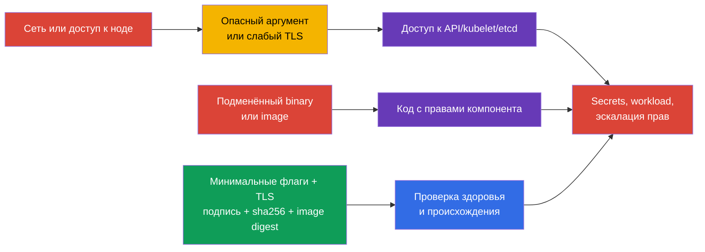
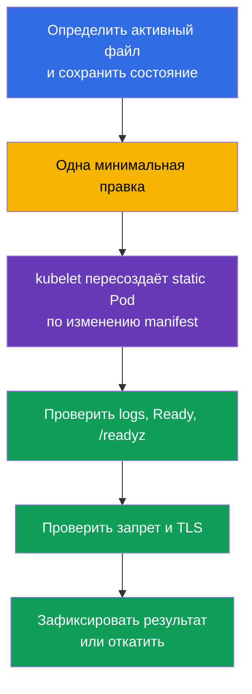

<!-- Standalone RU release: ссылки на переводы удалены, потому что соответствующие файлы не входят в архив. -->

# Глава 09. Небезопасные аргументы компонентов, TLS-хардненинг и проверка бинарников

> **Что дальше.** В главе 08 мы защитили внешний HTTP-вход TLS. Теперь нужно защитить
> сами компоненты control plane и kubelet: один небезопасный аргумент может открыть
> анонимный API, диагностический endpoint или слабый TLS-канал. Затем проверим, что
> запускаем именно опубликованные Kubernetes-бинарники и образы. Это домен **Cluster
> Setup** (CKS, 10%).

> **Что нужно из CKA.** Устройство control plane, kubeadm и static Pod разобраны в
> [главе 35 CKA](../../../cka/course/35/ru.md), а поверхность компонентов Kubernetes - в
> [главе 02 CKA](../../../cka/course/02/ru.md). Здесь не повторяется их базовая настройка:
> мы ищем опасные аргументы, безопасно меняем активную конфигурацию и доказываем результат.

## 09.1. Модель угроз: флаг или артефакт как точка входа

Control plane принимает решения за весь кластер. `kube-apiserver` выдаёт и проверяет
доступ к API, `kubelet` запускает Pod на ноде, а `etcd` хранит Secrets, RBAC и желаемое
состояние. Поэтому слабый параметр имеет больший эффект, чем ошибка одного приложения.

Типовая цепочка атаки выглядит так: атакующий получает сетевой доступ к endpoint или
возможность изменить файл на ноде; использует anonymous access, read-only kubelet port,
`AlwaysAllow` либо profiling; читает данные или выполняет действие с чужими полномочиями.
Альтернативный путь - подменить `kubelet`, `kubectl` или образ ещё до запуска. Если
платформа доверяет артефакту без проверки, вредоносный код стартует с полномочиями
компонента.



Hardening - не набор строк «для CIS». Перед изменением ответьте на четыре вопроса:
какой процесс реально использует параметр, кто его клиент, совместимы ли сертификаты и
cipher suites, как проверить доступность и как откатиться. В managed Kubernetes часть
control plane принадлежит провайдеру: не пытайтесь править его host files, а проверьте
документацию доступных security-настроек.

## 09.2. Опасные аргументы: что искать и почему

Не все флаги одинаково опасны в любой топологии. Значение, слушающий адрес, firewall,
TLS и RBAC образуют один контроль. Но следующие настройки требуют явного обоснования или
исправления.

| Компонент | Опасная настройка | Риск | Безопасный ориентир |
|---|---|---|---|
| `kube-apiserver` | `--anonymous-auth=true` | запрос становится `system:anonymous`; при ошибочном RBAC получает доступ | `--anonymous-auth=false` |
| `kube-apiserver` | `--authorization-mode=AlwaysAllow` или добавленный `AlwaysAllow` | любой аутентифицированный запрос проходит authorization | для kubeadm обычно `Node,RBAC` |
| `kube-apiserver` | `--profiling=true` | profiling может раскрыть состояние процесса и не нужен на публичной границе | `--profiling=false` |
| `kube-apiserver` | legacy `--insecure-port`/`--insecure-bind-address` | API без TLS и authentication | не включать; в современных Kubernetes эти legacy-опции удалены |
| `kubelet` | `--read-only-port` не равен `0` | неаутентифицированный endpoint может раскрыть Pod и node data | `--read-only-port=0` или `readOnlyPort: 0` |
| `kubelet` | `--anonymous-auth=true` | анонимный клиент попадает на kubelet API | `--anonymous-auth=false` или поле config API |
| `kubelet` | `--authorization-mode=AlwaysAllow` | любой аутентифицированный клиент получает слишком широкий доступ к kubelet API | `--authorization-mode=Webhook` |
| `kubelet` | `--protect-kernel-defaults=false` | kubelet может молча работать при дрейфе security sysctl baseline | `--protect-kernel-defaults=true` после проверки sysctl |
| `kube-controller-manager` | `--profiling=true` или `--use-service-account-credentials=false` | лишняя диагностика или использование широких учётных данных вместо отдельных SA | `--profiling=false`, отдельные service account credentials |
| `kube-scheduler` | `--profiling=true` или endpoint на широком `--bind-address` | диагностический endpoint становится доступен лишней сети | `--profiling=false`, доступ только из административной сети |
| `etcd` | `--client-cert-auth=false`, небезопасный `--listen-client-urls` | клиент без mTLS или внешняя сеть получает доступ к хранилищу кластера | mTLS, localhost/внутренняя сеть, firewall |

Сначала инвентаризируйте активные параметры, а не только шаблонный файл. Ищите
дубликаты: последнее или фактически использованное значение зависит от реализации, а
конфликтующие флаги усложняют диагностику.

```bash
# На узле control plane: static Pod-манифесты и аргументы запущенных контейнеров.
sudo grep -nE -- '--(anonymous-auth|authorization-mode|profiling|tls-|cipher|insecure)' \
  /etc/kubernetes/manifests/{kube-apiserver,kube-controller-manager,kube-scheduler,etcd}.yaml
sudo crictl ps -a
sudo crictl inspect "$(sudo crictl ps -q --name kube-apiserver | head -n1)" \
  | grep -A2 -B2 'tls-min-version\|cipher-suites\|anonymous-auth'

# На каждой ноде: источник запуска kubelet и фактическая конфигурация.
sudo systemctl cat kubelet
sudo ps -ef | grep '[k]ubelet'
sudo grep -nE 'readOnlyPort|anonymous:|authorization:|protectKernelDefaults|tls' \
  /var/lib/kubelet/config.yaml
```

`--enable-debugging-handlers` у kubelet тоже оценивают по риску: он включает
диагностические handlers, нужные части которых могут использовать `kubectl logs`, `exec`
и `port-forward`. Не отключайте его вслепую. Сначала определите нужные операции,
защитите порт `10250` network policy/firewall и включите authentication + `Webhook`
authorization. То же правило относится к метрикам: profiling и metrics - разные endpoint.

## 09.3. Где менять конфигурацию и как безопасно перезапускать

В kubeadm-кластере `kube-apiserver`, `kube-controller-manager`, `kube-scheduler` и часто
`etcd` - **static Pod**. Их локальные манифесты обычно находятся в
`/etc/kubernetes/manifests/`. Kubelet наблюдает этот каталог и пересоздаёт Pod после
изменения манифеста; API server для этого не нужен. Именно поэтому ошибка YAML, неверный
флаг или неподходящий cipher может временно лишить кластер API.

Kubelet не является static Pod: его конфигурация обычно находится в
`/var/lib/kubelet/config.yaml`, а дополнительные аргументы - в
`/var/lib/kubelet/kubeadm-flags.env` и systemd drop-in. Реальный путь определяется
`systemctl cat kubelet` и process arguments. Не задавайте один параметр одновременно в
`config.yaml` и флаге.



Правьте один control-plane компонент за раз и храните backup **вне**
`/etc/kubernetes/manifests/`: backup с расширением YAML в этом каталоге может быть принят
kubelet за ещё один static Pod. Работайте через консоль ноды, особенно на одноузловом
control plane; в HA-кластере меняйте одну ноду и дождитесь её здоровья перед следующей.

```bash
# 1. Сохранить манифест вне watched directory и проверить синтаксис до изменения.
sudo install -d -m 700 /root/k8s-manifest-backup
sudo cp -p /etc/kubernetes/manifests/kube-apiserver.yaml \
  /root/k8s-manifest-backup/kube-apiserver.yaml.$(date +%F-%H%M%S)
sudo kubeadm init phase control-plane all --help >/dev/null 2>&1 || true

# 2. Отредактировать только command kube-apiserver.
sudoedit /etc/kubernetes/manifests/kube-apiserver.yaml

# 3. Наблюдать пересоздание с консоли ноды, затем проверить API.
watch -n 2 'sudo crictl ps -a --name kube-apiserver'
kubectl get --raw='/readyz?verbose'
kubectl get nodes

# Если static Pod не стартует, сначала прочитать kubelet и runtime logs.
sudo journalctl -u kubelet -n 100 --no-pager
sudo crictl ps -a --name kube-apiserver
sudo crictl logs "$(sudo crictl ps -aq --name kube-apiserver | head -n1)"
```

Для kubelet сначала проверьте значения sysctl и конфигурацию, затем перезапустите только его. Обычный `systemctl restart kubelet` сам по себе не останавливает уже запущенные Pod и контейнеры: container runtime продолжает их выполнять, а kubelet после старта восстанавливает reconciliation. Тем не менее на control-plane меняйте kubelet по одной ноде и контролируйте Node heartbeat, kubelet logs и `/readyz`: ошибка конфигурации может оставить ноду `NotReady` или помешать дальнейшему управлению static Pod.

```yaml
# /var/lib/kubelet/config.yaml - пример фрагмента конфигурационного API.
readOnlyPort: 0
authentication:
  anonymous:
    enabled: false
authorization:
  mode: Webhook
protectKernelDefaults: true
```

```bash
sudo systemctl restart kubelet
sudo systemctl --no-pager --full status kubelet
sudo journalctl -u kubelet -n 100 --no-pager
sudo ss -lntp | grep ':10255' || echo 'read-only kubelet port is closed'
kubectl get nodes
```

## 09.4. TLS-хардненинг apiserver, kubelet и etcd

TLS уже защищает канал, но версия и набор cipher suites определяют, какие криптографические
варианты клиент вообще может согласовать. Разрешение устаревших протоколов или слабых
шифров облегчает downgrade и использование устаревшей криптографии. Минимум `TLS 1.2`
обычно совместим с современными Kubernetes-клиентами; `TLS 1.3` сильнее ограничивает
клиентов и требует отдельной проверки всего control plane, automation и monitoring.

Современные defaults Go и Kubernetes уже исключают устаревшие протоколы и небезопасные
suites; универсального «короткого безопасного списка» нет. Не закрепляйте cipher suites
по умолчанию. Это делают только когда конкретная policy, benchmark или совместимость
компонента требует воспроизводимого списка, после inventory сертификатов и клиентов.
RSA-only список не является безопасным default: он ломает endpoint с ECDSA-сертификатом
и без необходимости сужает совместимость. TLS 1.3 suites в Go обычно не управляются
`--tls-cipher-suites`: их выбирает TLS-реализация, поэтому этот флаг касается главным
образом TLS 1.2 и старше.

Для Kubernetes-компонентов допустимые строковые значения флага обычно имеют вид
`VersionTLS12` и `VersionTLS13`. Для etcd имя значения зависит от версии etcd: актуальный
help часто использует `TLS1.2`/`TLS1.3`. Не переносите значение между программами по
догадке - перед правкой проверьте `etcd --help` запущенной версии или документацию именно
её пакета. Например, доказательством требования benchmark «etcd принимает не ниже TLS
1.2» служат активный `--tls-min-version` и проверенный handshake, а не произвольный
RSA-only cipher list; сверяйте точную формулировку и версию применяемого benchmark.

```yaml
# /etc/kubernetes/manifests/kube-apiserver.yaml, фрагмент command.
# Современные Go defaults оставляют suites без явного pinning.
- kube-apiserver
- --tls-min-version=VersionTLS12
# Добавляйте --tls-cipher-suites только при утверждённой policy/совместимости.
# Если policy требует списка, включите и ECDSA, и RSA suites, нужные вашим сертификатам:
# - --tls-cipher-suites=TLS_ECDHE_ECDSA_WITH_AES_128_GCM_SHA256,TLS_ECDHE_ECDSA_WITH_AES_256_GCM_SHA384,TLS_ECDHE_RSA_WITH_AES_128_GCM_SHA256,TLS_ECDHE_RSA_WITH_AES_256_GCM_SHA384
```

Для kubelet предпочтителен его config API; если установка передаёт параметры через
systemd, используйте эквивалентные флаги в единственном активном источнике. Аналогично,
`tlsCipherSuites` оставляют незаданным, пока его не требует документированная policy.

```yaml
# /var/lib/kubelet/config.yaml, фрагмент; поддержка точных полей зависит от версии kubelet.
tlsMinVersion: VersionTLS12
```

```yaml
# /etc/kubernetes/manifests/etcd.yaml, пример для etcd, принимающего значение TLS1.2.
# --cipher-suites не добавлен: defaults Go безопасны, если policy не требует иного.
- etcd
- --tls-min-version=TLS1.2
```

Не ограничивайте TLS только server endpoint. У etcd есть client и peer traffic, а у
apiserver - клиенты kubelet, controller-manager, scheduler, kubectl, webhooks и
автоматизация. Сначала соберите фактические certificates/keys, слушающие адреса и clients;
потом примените изменение на тестовой или одной HA-ноде. При переходе на
`VersionTLS13` ожидайте отказ старого TLS 1.2-клиента - это не доказательство ошибки
сервера, но требует плана миграции клиента.

Проверка должна удостоверить и разрешённый, и запрещённый protocol. Для apiserver
достаточно проверить handshake на `6443`; для kubelet `10250` часто требует client
certificate и authorization после handshake; для etcd нужен его CA и клиентский cert.
Не выводите private key в терминал и не копируйте PKI с ноды.

```bash
# apiserver: TLS 1.2 должен согласоваться, TLS 1.1 - завершиться protocol-version error.
# Замените адрес и SNI на значения своего кластера.
export API=127.0.0.1:6443
openssl s_client -connect "$API" -servername kubernetes -tls1_2 \
  -CAfile /etc/kubernetes/pki/ca.crt </dev/null 2>&1 | grep -E 'Protocol|Cipher|Verify return code'
openssl s_client -connect "$API" -servername kubernetes -tls1_1 \
  </dev/null 2>&1 | grep -Ei 'protocol|alert|handshake failure'

# etcd: проверка TLS выполняется с доверенным client certificate и CA.
export ETCDCTL_API=3
sudo etcdctl --endpoints=https://127.0.0.1:2379 endpoint health \
  --cacert=/etc/kubernetes/pki/etcd/ca.crt \
  --cert=/etc/kubernetes/pki/etcd/healthcheck-client.crt \
  --key=/etc/kubernetes/pki/etcd/healthcheck-client.key

# После правки подтвердить активные аргументы и здоровье всех компонентов.
sudo grep -nE -- '--(tls-min-version|tls-cipher-suites|cipher-suites)' \
  /etc/kubernetes/manifests/{kube-apiserver,etcd}.yaml
kubectl get --raw='/readyz?verbose'
kubectl get nodes
```

| Симптом после изменения | Вероятная причина | Проверка и действие |
|---|---|---|
| apiserver не стартует | опечатка YAML, неподдерживаемый флаг или cipher | `journalctl -u kubelet`, `crictl logs`; восстановить последний working manifest |
| клиент получает protocol version | client старее заданного minimum | обновить клиент или временно выбрать согласованный минимум по утверждённому исключению |
| TLS handshake падает при TLS 1.2 | certificate key algorithm не совместим с разрешёнными cipher suites | проверить `openssl x509 -text`, добавить подходящие ECDSA/RSA suites |
| etcd не healthy | peer/client не может согласовать TLS или потерял доступ к key | проверка всех членских endpoint с mTLS, логи etcd, откат одной ноды |
| `openssl` показывает TLS 1.3 cipher не из списка | TLS 1.3 ciphers контролирует TLS-библиотека | проверять minimum version и документацию версии, не считать это обходом флага |

## 09.5. Verify platform binaries и образы: подпись, sha256 и digest

HTTPS при скачивании защищает транспорт, но не доказывает, кто выпустил файл. SHA-256
проверяет **целостность**: скачанный binary равен байтам, описанным выбранным digest.
Это не доказательство provenance: хеш, полученный вместе с файлом с того же
недоверенного источника, или неутверждённый baseline не создаёт доверия.

Для Kubernetes берите version-specific официальный release artifact. Kubernetes публикует
keyless cosign signature и certificate рядом с binary; `verify-blob` проверяет подпись и
привязку certificate к ожидаемым identity и OIDC issuer, то есть происхождение релиза.
Проверяйте identity и issuer явно, а не принимайте произвольный сертификат. Фиксируйте
версию в переменной: `latest` нельзя надёжно воспроизвести.

```bash
export K8S_VERSION=v1.36.0
export ARCH=amd64
export BIN=kubectl
export BASE="https://dl.k8s.io/release/${K8S_VERSION}/bin/linux/${ARCH}"

# Получить binary и опубликованные keyless signature/certificate из version-specific release.
for FILE in "${BIN}" "${BIN}.sig" "${BIN}.cert" "${BIN}.sha256"; do
  curl -fsSL --retry 3 --retry-delay 3 "${BASE}/${FILE}" -o "${FILE}"
done

# Официальные значения Kubernetes Release Engineering для binary artifacts.
# cosign 2+ требует оба ограничения; не убирайте их ради «успешной» проверки.
cosign verify-blob "${BIN}" \
  --signature "${BIN}.sig" \
  --certificate "${BIN}.cert" \
  --certificate-identity krel-staging@k8s-releng-prod.iam.gserviceaccount.com \
  --certificate-oidc-issuer https://accounts.google.com

# SHA-256 - дополнительная проверка равенства байтов с утверждённым release digest.
printf '%s  %s\n' "$(tr -d '[:space:]' < "${BIN}.sha256")" "${BIN}" > "${BIN}.sha256sum"
sha256sum --check "${BIN}.sha256sum"
# kubectl: OK

# Для уже установленного файла получить наблюдаемый digest и сверить с approved inventory.
sha256sum /usr/bin/kubelet
```

Таким образом, signature/certificate с ожидаемыми identity/issuer дают provenance, а
checksum даёт integrity относительно доверенного release digest. Kubernetes также
публикует подписанные SBOM (SPDX): их можно аналогично проверить `verify-blob` при
аудите состава релиза. Это полезная компактная связь артефакта с составом, но не заменяет
политику допуска, CI controls и остальную supply-chain практику из соответствующих глав.

Container image tag изменяем: `nginx:1.27` сегодня и завтра может указывать на разные
байты. Digest неизменяем и связывает workload с точным content-addressed объектом.
Сначала разрешите tag в digest, затем закрепите digest в манифесте или проверьте digest
уже работающего Pod.

```bash
# Получить digest образа инструментом, который есть в вашей среде.
crane digest registry.k8s.io/pause:3.10
# Пример результата: sha256:<64-hex>

# Манифест фиксирует exact image, а не плавающий tag.
cat <<'EOF' | kubectl apply -f -
apiVersion: v1
kind: Pod
metadata:
  name: digest-pinned
spec:
  containers:
  - name: pause
    image: registry.k8s.io/pause@sha256:<ожидаемый-64-символьный-digest>
EOF

# Сверить digest, который kubelet реально зафиксировал в imageID.
kubectl get pod digest-pinned \
  -o jsonpath='{.status.containerStatuses[0].imageID}{"\n"}'
# containerd://registry.k8s.io/pause@sha256:<ожидаемый-digest>
```

Не вставляйте строку с угловыми скобками в рабочий манифест: замените placeholder на
проверенный 64-hex digest. Для критичного production workload digest полезно дополнять
подписью образа и admission-политикой - это рассматривается в главах supply chain.

## 09.6. Практический сценарий: обнаружить подмену до ущерба

Представьте, что на worker попал `kubelet`, подменённый после загрузки, или CI получил
образ с тем же tag, но другим digest. Обычная проверка `kubelet --version` либо имя tag
не обнаружит проблему: вредоносный binary может вернуть ожидаемую версию, а tag не
идентифицирует content.

Сначала сохраните наблюдаемые хеши и imageID, сопоставьте их с утверждённым release
manifest и проведите evidence/provenance/baseline/authorized-change triage перед выбором
containment. Не «исправляйте» mismatch изменением эталонного хеша: при неподтверждённом
изменении или иных признаках подмены эскалируйте по incident runbook.

```bash
# 1. Зафиксировать доказательства на ноде до замены файла.
sudo sha256sum /usr/bin/kubelet | sudo tee /root/kubelet.sha256.observed
sudo stat -c '%y %s %U:%G %a %n' /usr/bin/kubelet
sudo systemctl cat kubelet

# 2. Сравнить observed hash с утверждённым release digest из trusted inventory.
# Формат inventory: '<digest>  /usr/bin/kubelet'. Команда вернёт FAIL при несовпадении.
sudo sha256sum --check /root/approved-kubelet.sha256

# 3. Найти фактические образы workload по imageID, а не только spec.image.
kubectl get pods -A -o jsonpath='{range .items[*]}{.metadata.namespace}{"/"}{.metadata.name}{"\t"}{range .status.containerStatuses[*]}{.name}{"="}{.imageID}{" "}{end}{"\n"}{end}'
```

`sha256sum --check` с `FAILED` - сигнал для расследования, но сам по себе не доказывает
компрометацию и не задаёт единственный ответ «изолировать». Сначала сохраните evidence и
проведите triage: (1) подтвердите путь, версию и ожидаемый approved baseline, исключив
ошибку inventory или обновление не того файла; (2) проверьте provenance релиза через
`cosign verify-blob` с ожидаемыми certificate identity/issuer и сверяйте package/release
metadata; (3) найдите authorized change - change record, rollout, package-manager и CI
логи - и сопоставьте время, владельца и digest; (4) сравните с предыдущим известным
хорошим baseline и scope на других нодах. Не «исправляйте» mismatch изменением эталонного
хеша.

Если evidence не подтверждает authorised change, provenance/baseline не сходятся или есть
иные признаки подмены, эскалируйте по incident runbook: остановите дальнейшее
распространение, примените соразмерное containment (вплоть до cordon/drain или изоляции
ноды), сохраните логи и замените ноду либо binary контролируемым способом. Для image
остановите rollout, закрепите известный хороший digest и проверьте registry audit logs,
CI logs и admission records. Один хеш надёжно сообщает о несовпадении ожидаемых байтов,
но не объясняет его причину или путь изменения.

## 09.7. Проверка результата и диагностика

После любой правки нужны доказательства на трёх уровнях: активная конфигурация,
фактическое поведение и здоровье кластера. Наличие строки в неиспользуемом файле не
является проверкой.

```bash
# 1. Конфигурация: флаги в активных static Pod manifests, kubelet config и процессах.
sudo grep -nE -- '--(anonymous-auth|authorization-mode|profiling|tls-min-version|cipher-suites)' \
  /etc/kubernetes/manifests/{kube-apiserver,kube-controller-manager,kube-scheduler,etcd}.yaml
sudo grep -nE 'readOnlyPort|anonymous:|authorization:|tlsMinVersion|tlsCipherSuites' \
  /var/lib/kubelet/config.yaml
sudo ps -ef | grep -E '[k]ubelet|[k]ube-apiserver'

# 2. Поведение: read-only kubelet port закрыт, старый TLS protocol отвергнут.
sudo ss -lntp | grep ':10255' || echo 'PASS: kubelet read-only port is closed'
openssl s_client -connect 127.0.0.1:6443 -tls1_1 </dev/null 2>&1 \
  | grep -Ei 'protocol|alert|handshake failure'

# 3. Здоровье: API, ноды и static Pod вернулись в рабочее состояние.
kubectl get --raw='/readyz?verbose'
kubectl get nodes
kubectl -n kube-system get pods -o wide
sudo crictl ps | grep -E 'kube-apiserver|kube-controller-manager|kube-scheduler|etcd'
```

| Проверка не проходит | Сначала проверить | Частая причина |
|---|---|---|
| `kubectl` не отвечает после static Pod edit | `journalctl -u kubelet`, `crictl ps -a`, логи контейнера | неверный YAML, флаг или монтирование |
| флаг виден, но `kube-bench` всё ещё FAIL | process args и один источник значения | изменён шаблон, а не активный manifest; есть дубликат |
| порт `10255` всё ещё слушает | systemd drop-in и `ps` kubelet | правился не тот config file или старый flag переопределяет YAML |
| TLS 1.2 клиент перестал подключаться | certificate algorithm, cipher list, client TLS | слишком узкий набор suites или несовместимый client |
| `sha256sum --check` возвращает FAIL | approved manifest, путь и version | неверный binary, повреждённая загрузка или подмена |
| imageID не совпадает с allowlist digest | resolved registry digest и rollout history | mutable tag был перезаписан или применён другой manifest |

`kube-bench` полезен как контроль регрессии, но его профиль должен совпадать с версией
Kubernetes и архитектурой. Повторите релевантные targets после исправления и сохраните
отчёт вместе с версией benchmark. `WARN` требует ручного решения, а не механического
добавления флага.

```bash
sudo kube-bench run --targets master,etcd | tee kube-bench-after.txt
grep -E '\[FAIL\]|\[WARN\]' kube-bench-after.txt
```

## 09.8. Как это применяют в продакшене

- **Immutable baseline.** Аргументы компонентов, kubelet config и TLS policy задают через
  kubeadm config, image ноды или configuration management. Ручная правка static Pod -
  аварийный или учебный приём, который затем нужно вернуть в source of truth.
- **Совместимое ужесточение TLS.** Inventory клиентов, canary-изменение одной HA-ноды,
  monitoring ошибок handshake и план отката предшествуют `VersionTLS13` или сужению cipher
  suites. Исключения имеют срок, владельца и компенсирующий контроль.
- **Drift detection.** Регулярно запускают `kube-bench`, проверяют process args и alert на
  открытые `10255`, `2379`, `2380` и неожиданные слушающие адреса.
- **Проверяемая поставка.** Pipeline проверяет keyless signature/certificate binary с
  ожидаемыми identity/issuer и SHA-256 как integrity check, сохраняет утверждённые digests
  в inventory и deploy-манифестах, запрещает mutable tags policy. Registry access, CI logs
  и admission events дают audit trail.
- **Безопасный rollback.** Backup manifest хранится вне static Pod directory, а rollback
  проверен в non-production. При подозрении на подмену предпочтительнее переустановить
  ноду из доверенного образа, чем продолжать работу с потенциально изменённым хостом.

## 09.9. Мини-глоссарий

- **static Pod** - Pod из локального манифеста ноды, которым управляет kubelet, а не
  scheduler через Kubernetes API.
- **`--anonymous-auth`** - настройка, разрешающая или запрещающая anonymous identity для
  API endpoint.
- **read-only kubelet port** - legacy неаутентифицированный порт kubelet, который должен
  быть отключён значением `0`.
- **TLS minimum version** - минимальная версия TLS, которую сервер согласует с клиентом.
- **cipher suite** - набор криптографических алгоритмов TLS; допустимый набор должен быть
  совместим с certificate algorithm и клиентами.
- **SHA-256 checksum** - 256-битный digest файла, используемый для проверки точного
  совпадения байтов с опубликованным артефактом.
- **image digest** - неизменяемый content-addressed идентификатор container image вида
  `sha256:<hash>`, в отличие от mutable tag.
- **provenance** - доказуемое происхождение артефакта: кто и из какого доверенного release
  или pipeline его выпустил.

## 09.10. Итоги главы

- Опасные `anonymous-auth`, `AlwaysAllow`, profiling, read-only kubelet port и широкие
  diagnostic endpoints расширяют поверхность атаки control plane и нод.
- Сначала определяют активный источник параметра. Control-plane компоненты kubeadm обычно
  являются static Pod из `/etc/kubernetes/manifests/`, kubelet - systemd service с config
  API и/или аргументами.
- Static Pod меняют по одному, с backup вне watched directory, наблюдением `kubelet`/CRI
  и немедленной проверкой `/readyz`.
- Для apiserver и kubelet задают TLS minimum version, а для etcd - соответствующий
  `--tls-min-version`, сверяя точные значения с версией etcd. Современные Go/Kubernetes
  defaults suites безопасны; список suites закрепляют только для утверждённой policy,
  benchmark или совместимости и проверяют его с certificate key algorithm и клиентами.
- `cosign verify-blob` с ожидаемыми certificate identity/issuer проверяет происхождение
  Kubernetes binary; `sha256sum --check` дополнительно сравнивает байты с trusted
  checksum. Для образов фиксируют и сверяют immutable digest, а не только tag.
- Доказательство hardening включает активные arguments, отрицательную проверку опасного
  поведения, TLS handshake, health control plane и повторный `kube-bench`.

## 09.11. Как это пригодится: на экзамене и в реальной работе

**На экзамене.** Задание CKS может дать SSH на узел control plane и попросить исправить
небезопасный флаг, TLS policy или hash binary. Быстро установите, static Pod это или
kubelet service; сохраните backup вне `/etc/kubernetes/manifests`; внесите одну правку;
дождитесь перезапуска и докажите и настройку, и здоровье. Для checksum не сравнивайте
глазами: создайте вход `sha256sum --check` и сохраните его `OK`/`FAIL`.

**В реальной работе.** Ужесточение компонентов - изменение платформенного контракта,
а не разовая CIS-галочка. Оно требует inventory клиентов, IaC source of truth, rolling
внедрения и telemetry. Проверка digest и provenance переносит доверие с изменяемого имени
артефакта на конкретные байты, но работает только вместе с защищёнными источниками,
подписью и контролем допуска.

## 09.12. Вопросы для самопроверки

1. Почему `--anonymous-auth=true` и RBAC для `system:anonymous` вместе опаснее, чем каждый
   из этих факторов по отдельности?
2. Какие источники конфигурации нужно проверить, прежде чем менять параметры kubelet?
3. Почему нельзя хранить YAML backup внутри `/etc/kubernetes/manifests/`?
4. Чем `VersionTLS12` у Kubernetes-компонента отличается от возможного `TLS1.2` в CLI
   etcd и как узнать корректное значение?
5. Почему ограниченный набор RSA cipher suites может сломать endpoint с ECDSA certificate?
6. Какими командами вы подтвердите, что TLS 1.1 отвергнут, TLS 1.2 разрешён, а apiserver
   после изменения здоров?
7. Почему tag container image не доказывает его содержимое и что доказывает image digest?
8. Почему SHA-256 подтверждает integrity, но не provenance, и какие certificate identity и
   OIDC issuer должен проверять `cosign verify-blob` для Kubernetes binary?

## Практика

🧪 Лаба 103 (CIS, Secure Ingress TLS, TLS hardening и проверка бинарников):
[tasks/cks/labs/103](../../labs/103/README_RU.MD)

🎮 Killercoda (в браузере, без установки): [Kubernetes Security - Kube-bench](https://killercoda.com/killer-shell-cks/scenario/kube-bench) · [Kubernetes Certificates](https://killercoda.com/kubernetes-basics/course/kubernetes-fundamentals/certificates)

---
[Оглавление](../README_RU.md) · [Глава 08](../08/ru.md) · [Глава 10](../10/ru.md)
