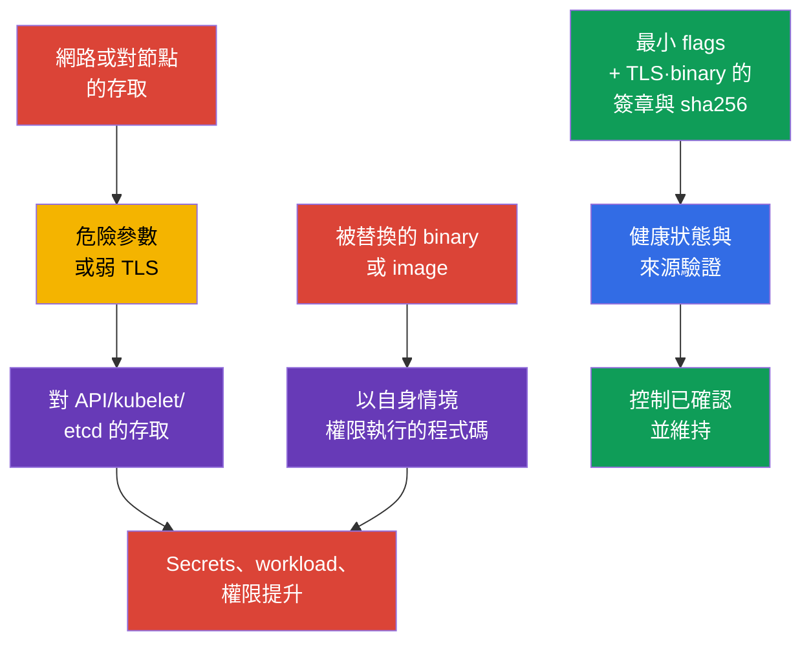
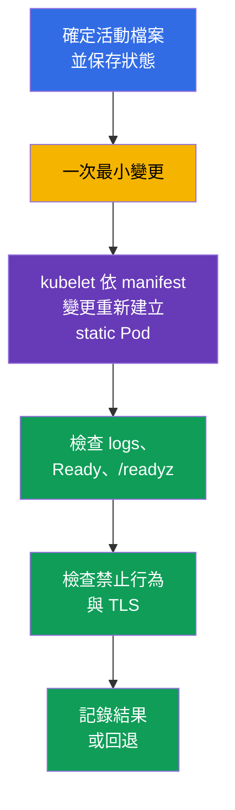

[Русская версия](ru.md) · [Eng version](README.md) · [Versión en español](es.md) · [Version française](fr.md) · [Deutsche Version](de.md) · [ქართული ვერსია](ge.md) · [日本語版](jp.md)

# 第 09 章。元件不安全參數、TLS 強化與二進位檔驗證

> **問題。** 取得 control plane endpoint 網路存取權,或能夠修改節點上檔案的攻擊者,
> 尋找的通常不是 Kubernetes 本身的漏洞,而是旁邊的不安全參數:anonymous access、
> read-only kubelet port、弱 TLS,或是在執行前就被替換的 `kubelet`/`kubectl`/映像。
> 這類單一缺陷就可能開啟對 API/etcd 的存取,或在被替換 artifact 的情境下取得程式碼
> 執行權。對 platform binary 而言,後果取決於 runtime:被替換的 kubelet/control-plane
> binary 會取得對應 service process 的權限,而被替換的 `kubectl` 則取得啟動它的
> OS 使用者的權限,以及對其 kubeconfig/credentials 的存取。

> **接下來。** 在第 08 章我們用 TLS 保護了外部 HTTP 入口。現在需要保護 control plane
> 元件與 kubelet 本身:單一不安全參數就可能開啟匿名 API、診斷 endpoint 或弱 TLS 通道。
> 接著要確認我們執行的確實是官方發佈的 Kubernetes 二進位檔。這是 **Cluster
> Setup**(CKS,15%)領域。

> **需要哪些 CKA 基礎。** control plane 架構、kubeadm 和 static Pod 已在
> [CKA 第 35 章](../../../cka/course/35/tw.md)說明,Kubernetes 元件的攻擊面則在
> [CKA 第 02 章](../../../cka/course/02/tw.md)。這裡不重複其基本設定:我們要找出
> 危險參數,安全地變更活動設定,並證明結果。

> 🧠 防護取決於 active runtime state,而不是範本中的一行、tag 或預期版本。

## 09.1. 威脅模型:flag 或 artifact 作為進入點

Control plane 為整個叢集做決策。`kube-apiserver` 授予並驗證對 API 的存取,`kubelet`
在節點上啟動 Pod,而 `etcd` 儲存 Secrets、RBAC 與期望狀態。因此一個弱參數的影響,
遠比單一應用程式的錯誤更大。

典型的攻擊鏈是這樣的:攻擊者取得對 endpoint 的網路存取權,或修改節點上檔案的能力;
利用 anonymous access、read-only kubelet port、`AlwaysAllow` 或 profiling;讀取
資料或以他人權限執行動作。另一條路徑是在執行前替換 artifact。被替換的 kubelet 或
control-plane binary 會以對應 service/host process 的權限執行;被替換的 `kubectl`
則以本機使用者的權限,以及其可用的 Kubernetes credentials 執行;container image
則以自身 workload security context 的權限執行。因此 provenance 要在執行前檢查,
而後果要依實際 execution context 評估,不能只用「元件的權限」這個籠統公式。



Hardening 不是為了「符合 CIS」而堆砌的一串設定。變更前請先回答四個問題:哪個
process 實際使用該參數、它的客戶端是誰、certificate 與 cipher suites 是否相容、
如何驗證可用性,以及如何回退。在 managed Kubernetes 中,control plane 的一部分
屬於供應商:不要嘗試修改供應商的 host files,而要查閱其文件中可用的安全設定。

> 🎯 檢查 active config 與 process args,修正唯一的 effective source,重新啟動元件,
> 並確認 active state、行為與 health;對 binary 而言還要確認 provenance 與 SHA-256。

## 09.2. 危險參數:該找什麼、為什麼

在任何拓樸中,不是所有 flag 都同等危險。值、監聽位址、firewall、TLS 與 RBAC
共同組成一個控制。但以下設定需要明確的理由或修正。

| 元件 | 危險設定 | 風險 | 安全參考值 |
|---|---|---|---|
| `kube-apiserver` | 過寬的 anonymous access | 沒有被接受 credentials 的請求可能被當作 `system:anonymous` 處理;若 RBAC 設定錯誤,就形成未經驗證存取的路徑 | benchmark 可能要求 `--anonymous-auth=false`;在 production 中請先檢查 health endpoints 和 kubeadm discovery,並在 Kubernetes 1.34+ 視需要透過 `AuthenticationConfiguration` 限制 anonymous access |
| `kube-apiserver` | `--authorization-mode=AlwaysAllow` 或加入了 `AlwaysAllow` | 任何已驗證的請求都會通過 authorization | kubeadm 通常是 `Node,RBAC` |
| `kube-apiserver` | `--profiling=true` | profiling 可能揭露程序狀態,在公開邊界上並非必需 | `--profiling=false` |
| `kube-apiserver` | legacy `--insecure-port`/`--insecure-bind-address` | 沒有 TLS 與 authentication 的 API | 不要啟用;現代 Kubernetes 已移除這些 legacy 選項 |
| `kubelet` | `--read-only-port` 不等於 `0` | 未經驗證的 endpoint 可能洩漏 Pod 與 node 資料 | `--read-only-port=0` 或 `readOnlyPort: 0` |
| `kubelet` | `--anonymous-auth=true` | 匿名客戶端能存取 kubelet API | `--anonymous-auth=false` 或 config API 中的欄位 |
| `kubelet` | `--authorization-mode=AlwaysAllow` | 任何已驗證的客戶端都能取得對 kubelet API 過寬的存取權 | `--authorization-mode=Webhook` |
| `kubelet` | `--protect-kernel-defaults=false` | 與 baseline 不一致時,kubelet 不會 fail-fast 終止,且可能嘗試把 host-level kernel flags 改為預期值 | 檢查 sysctl 後設為 `--protect-kernel-defaults=true` |
| `kube-controller-manager` | `--profiling=true` 或 `--use-service-account-credentials=false` | 多餘的診斷,或使用過寬的 credentials 而非個別 SA | `--profiling=false`,使用個別的 service account credentials |
| `kube-scheduler` | 啟用 profiling,或 endpoint 監聽在過寬的 `--bind-address` | 診斷 endpoint 暴露給不必要的網路 | `enableProfiling: false`;deprecated 的 CLI `--profiling` 與 config-based scheduler 對 kube-bench 的限制在[第 07 章](../07/tw.md)說明 |
| `etcd` | `--client-cert-auth=false`、不安全的 `--listen-client-urls` | 沒有 mTLS 的客戶端或外部網路取得對叢集儲存的存取權 | mTLS、localhost/內部網路、firewall |

對於具體的 CIS/CKS 任務,benchmark 可能明確要求 `--anonymous-auth=false`;
這時就執行任務要求的確切內容,並證明結果。

在 production 的 kubeadm 環境中,不要機械式地套用這項修正。標準的 token-based
`kubeadm join` 依賴 `system:unauthenticated` 群組對 `kube-public/cluster-info`
的公開讀取,因此完全停用 anonymous authentication 會改變 discovery lifecycle。
如果 `kube-apiserver` 的 health probes 存取的是 anonymous health endpoints,
也請檢查它們。

在 Kubernetes 1.34+ 中可以使用 `AuthenticationConfiguration`,只允許明確需要的
endpoints 使用 anonymous access。如果不再需要公開的 `cluster-info`,請先把
join/discovery 遷移到合適的替代方案,然後才移除這個存取。舉例來說,一個透過
`--authentication-config=<path>` 與相應掛載掛入 static Pod 的獨立檔案,可以包含:

```yaml
apiVersion: apiserver.config.k8s.io/v1
kind: AuthenticationConfiguration
anonymous:
  enabled: true
  conditions:
  - path: /livez
  - path: /readyz
  - path: /healthz
```

如果只為 `/livez`、`/readyz` 和 `/healthz` 保留 anonymous access,一般
token-based 的 `kubeadm join` 透過公開的 `cluster-info` 就無法運作。只有在
節點加入的 lifecycle 已切換到其他 discovery mechanism 時,這才是可接受的。

如果 `AuthenticationConfiguration` 中設定了 `anonymous` 欄位,就不能同時使用
`--anonymous-auth`。endpoint-scoped 的做法並不會讓明確要求
`--anonymous-auth=false` 的 benchmark 通過;請選擇並記錄適用於你叢集的模型。

先盤點實際生效的參數,而不只是範本檔案。留意重複項:哪個值是最後或實際被使用的
值取決於實作,而互相衝突的 flag 會讓診斷更困難。如果 `kube-bench`(第 07 章)已經
給出具體發現,請使用它的 remediation 作為精確 flag 與檔案的來源;TLS 專屬參數
(`--tls-min-version`、`--tls-cipher-suites`)會在下面 09.4-09.5 另外說明。

kubelet 的 `--enable-debugging-handlers` 也要依風險評估:它啟用了診斷用的
handlers,其中一些必要部分可能被 `kubectl logs`、`exec` 和 `port-forward` 使用。
不要盲目停用它。請先確定所需的操作,並在 `10250` 上以 authentication +
`Webhook` authorization 保護 kubelet API。

請在節點或基礎架構層限制對 `10250` 的網路存取:host firewall、cloud security
group/ACL,或 CNI 特定的 host policy。不要指望一般的 Kubernetes `NetworkPolicy`
能作為 kubelet endpoint 的可移植控制:那屬於 host/node traffic,而 NetworkPolicy
對 `hostNetwork` 與 node IP 的行為取決於 CNI 的實作。同一規則也適用於 metrics:
profiling 與 metrics 是不同的 endpoint。

## 09.3. 該在哪裡變更設定,以及如何安全地重新啟動

安全編輯 control plane static Pod 的一般流程(backup、最小變更、健康檢查、失敗後
還原)已在第 07 章說明——這裡不重複,而是補充本章特有的一項技巧,以及
kubelet/scheduler/controller-manager discovery 設定的細節,這些對下面 09.4 的
TLS 與 cipher 修改特別重要。

Kubelet 不是 static Pod:它的設定通常位於 `/var/lib/kubelet/config.yaml`,額外
的參數則在 `/var/lib/kubelet/kubeadm-flags.env` 與 systemd drop-in 中。在
Kubernetes 1.36 中還要留意 `--config-dir`:kubelet 會先套用主要 config,再依
字典順序套用該目錄(包含子目錄)中的 drop-in 檔案 `*.conf`;其中的 `*.yaml`
會被忽略。在 Kubernetes 1.36 中,kubelet 合併來源的順序是:CLI feature gates
優先度最低,接著套用主要 config,再套用 `--config-dir` 中的 `*.conf`,其餘
CLI arguments 優先度最高。因此對本章的一般參數而言,CLI flag 可能覆蓋
YAML/drop-in,但不要把這個規則套用到 `--feature-gates`。

請透過 `systemctl cat kubelet` 與實際的 process command line 確定真正生效的
`--config`、`--config-dir` 與 CLI arguments。不要在沒有必要的情況下,把同一個
一般參數同時設定在多個來源中。

對 scheduler,先檢查是否設定了 `--config=<path>`:`KubeSchedulerConfiguration`
可能是其 effective source,而在有 `--config` 時,部分 legacy CLI flags 是
deprecated/ignored。例如 scheduler 的 `--profiling` 已 deprecated;在
component config 中要檢查 `enableProfiling: false`。

對於 `kube-controller-manager`,在 Kubernetes 1.36 中沒有等同於 scheduler 的
通用 `--config` 選項:它的運作參數仍是透過 active manifest / process args 中的
CLI flags 設定。`KubeControllerManagerConfiguration` 是作為 component
configuration API 與內部/configz 呈現存在,但不是 kube-controller-manager
的通用外部 `--config` 檔案。

因此請先確定具體元件的 runtime,再只檢查它支援的 active source。



control plane static Pod 的額外技巧,是在同一個 watched directory 中透過 hidden
candidate 進行 atomic rename。在不希望叢集因為中間 YAML 的錯誤而在任何一刻失去
API 的情況下,這比一般的 backup+edit 更可靠:

```bash
# 1. 在 watched directory 本身建立 hidden candidate;kubelet 會忽略檔名以點開頭的
# 檔案,因此在原子替換前 Pod 不會被重新建立。
# /etc/kubernetes/manifests 可能是獨立的 mount:如果在 /etc/kubernetes 建立
# candidate,不同 filesystem 之間的 mv 會變成 copy+unlink,不再是 atomic rename。
sudo install -d -m 700 /root/k8s-manifest-backup
CANDIDATE=$(sudo mktemp /etc/kubernetes/manifests/.kube-apiserver.yaml.candidate.XXXXXX)
sudo cp -p /etc/kubernetes/manifests/kube-apiserver.yaml "$CANDIDATE"
sudo cp -p /etc/kubernetes/manifests/kube-apiserver.yaml \
  /root/k8s-manifest-backup/kube-apiserver.yaml.$(date +%F-%H%M%S)
sudoedit "$CANDIDATE"

# 2. 實際檢查 candidate 的 YAML/API 結構,而不影響正在執行的 static Pod。
sudo kubectl apply --dry-run=client --validate=strict -f "$CANDIDATE"

# 3. 只有在檢查成功後,才原子性地取代 watched manifest。
# Candidate 與 target 位於同一目錄且在同一個檔案系統上,因此 rename 保證是原子的。
sudo mv -f "$CANDIDATE" /etc/kubernetes/manifests/kube-apiserver.yaml

# 4. 從節點 console 觀察重新建立過程,然後檢查 API。
watch -n 2 'sudo crictl ps -a --name kube-apiserver'
kubectl get --raw='/readyz?verbose'
kubectl get nodes

# 若 static Pod 未能啟動,先閱讀 kubelet 與 runtime logs。
sudo journalctl -u kubelet -n 100 --no-pager
sudo crictl ps -a --name kube-apiserver
sudo crictl logs "$(sudo crictl ps -aq --name kube-apiserver | head -n1)"
```

即便如此,永久的 backup 檔案仍要存放在 `/etc/kubernetes/manifests/` 之外
(如上面步驟 1):hidden candidate 只在替換過程本身需要,不是長期副本。

對 kubelet,請先檢查 sysctl 值與設定,然後只重新啟動它。一般的
`systemctl restart kubelet` 本身並不會停止已經在執行的 Pod 與容器:
container runtime 會繼續執行它們,而 kubelet 啟動後會重新恢復 reconciliation。
儘管如此,在 control-plane 上仍要逐節點變更 kubelet,並控制 Node heartbeat、
kubelet logs 與 `/readyz`:設定錯誤可能讓節點停在 `NotReady`,或妨礙後續對
static Pod 的管理。

```yaml
# /var/lib/kubelet/config.yaml - config API 片段的範例。
readOnlyPort: 0
authentication:
  anonymous:
    enabled: false
authorization:
  mode: Webhook
protectKernelDefaults: true
```

```bash
sudo systemctl restart kubelet
sudo systemctl --no-pager --full status kubelet
sudo journalctl -u kubelet -n 100 --no-pager
check_kubelet_10255() {
  local listeners

  if ! listeners="$(sudo ss -H -lntp 'sport = :10255')"; then
    echo 'ERROR: cannot inspect listening TCP sockets; port 10255 is not verified' >&2
    return 1
  fi

  if [[ -n "$listeners" ]]; then
    printf '%s\n' "$listeners"
    echo 'FAIL: kubelet read-only port 10255 is listening' >&2
    return 1
  fi

  echo 'PASS: kubelet read-only port 10255 is closed'
}
check_kubelet_10255
kubectl get nodes

# base config、*.conf drop-ins 與 CLI overrides 之後的結果;需要已授權的存取。
NODE="${NODE:?set target node name from kubectl get nodes}"
kubectl get --raw "/api/v1/nodes/${NODE}/proxy/configz" \
  | jq '.kubeletconfig | {readOnlyPort, authentication, authorization, protectKernelDefaults}'
```

## 09.4. apiserver、kubelet 與 etcd 的 TLS 強化

TLS 本身已保護通道,但版本與 cipher suites 的集合決定了客戶端究竟能協商出哪些
密碼學選項。允許過時的協定或弱密碼會讓 downgrade 與使用過時密碼學變得容易。
`TLS 1.2` 這個最低值通常與現代 Kubernetes 客戶端相容;`TLS 1.3` 對客戶端的限制
更嚴格,需要對整個 control plane、automation 與 monitoring 另外驗證。

現代 Go 與 Kubernetes 的 defaults 已經排除了過時協定與不安全的 suites;沒有
通用的「短安全清單」。不要在元件或版本之間隨意搬用一份短清單。如果組織政策或
具體的 CIS profile 要求一份經核准的清單,請在對憑證與客戶端做 inventory 之後
套用該清單,而不是把清單和 hardening baseline 對立起來。純 RSA 清單不是安全的
default:它會破壞使用 ECDSA 憑證的 endpoint,並不必要地縮小相容性。Go 中的
TLS 1.3 suites 通常不受 `--tls-cipher-suites` 控制:它們由 TLS 實作本身選擇,
因此該 flag 主要影響 TLS 1.2 及更舊版本。

> 🔬 Pinning cipher suites 與 TLS 1.3 需要經核准的 policy、客戶端 inventory,以及
> 依元件版本核對數值。

對 Kubernetes 元件而言,flag 允許的字串值通常是 `VersionTLS12` 和
`VersionTLS13` 這種形式。對 etcd 而言,值的名稱依 etcd 版本而異:目前的 help
常使用 `TLS1.2`/`TLS1.3`。不要憑猜測在不同程式之間搬用值——變更前請檢查該版本
實際執行 binary 的 `--help`,而不是憑記憶或其他 release 的文件。

在考試中,取得 flag 與允許值精確清單最快的方式,是問實際執行中的程序本身,而不是
在網路上搜尋——所需版本的文件頁面可能無法存取,或需要花時間搜尋。如果元件在
static Pod 中執行,且其 container 處於 `Running` 狀態,可以先使用
`kubectl exec`。`Ready=False` 本身並不禁止 exec:exec 需要的是 running container
與可用的 API/RBAC/streaming 路徑。Readiness 決定 Pod 的 `Ready` state,用於將
Pod 納入 Service traffic,並參與 workload controllers 的 availability/rollout
語義,但它不是 `kubectl exec` 的 gate。如果 `kubectl exec` 所需的
API/RBAC/streaming 路徑不可用,但元件確實以 CRI container 執行,請使用具體
container ID 的 `crictl exec`。

如果元件以獨立的 host `systemd` service 執行,`crictl exec` 就不適用:請從
活動的 process 或 `ExecStart` 取得 executable,並直接在節點上呼叫它的
`--help`。

```bash
# Static Pod / mirror Pod:container 必須是 Running(Ready 不是必需的)。
kubectl -n kube-system exec kube-apiserver-<node> -- kube-apiserver --help 2>&1 \
  | grep -A2 -- '--tls-min-version\|--tls-cipher-suites'

kubectl -n kube-system exec etcd-<node> -- etcd --help 2>&1 \
  | grep -A2 -- '--cipher-suites\|--tls-min-version'

# 只有在 etcd 確實以 CRI container 執行時才使用此 fallback。
CID="$(sudo crictl ps -q --name etcd | head -n1)"
if [[ -n "$CID" ]]; then
  sudo crictl exec "$CID" etcd --help 2>&1 \
    | grep -A2 -- '--tls-min-version'
fi

# 如果 etcd 是獨立的 host/systemd process,使用該 process 的 executable。
PID="$(pgrep -xo etcd)"
if [[ -n "$PID" ]]; then
  sudo "/proc/${PID}/exe" --help 2>&1 \
    | grep -A2 -- '--tls-min-version'
fi
```

`--help` 的輸出顯示 flag 的精確名稱,並在大多數版本中,在 flag 旁附上包含允許值的
簡短說明。這正是叢集中實際執行的同一個 binary 與同一個版本,因此不會與其他
release 的文件產生差異,也不需要花時間切到瀏覽器。

證明 benchmark「etcd 不接受低於 TLS 1.2」這項要求的,是活動中的
`--tls-min-version` 與已驗證的 handshake,而不是任意的純 RSA cipher 清單;
請核對所套用 benchmark 的確切措辭與版本。

```yaml
# /etc/kubernetes/manifests/kube-apiserver.yaml,command 的片段。
# 現代 Go defaults 讓 suites 保持沒有明確 pinning。
- kube-apiserver
- --tls-min-version=VersionTLS12
# 只有在經核准的 policy/相容性要求下才加入 --tls-cipher-suites。
# 若 policy 要求清單,請同時包含你憑證所需的 ECDSA 與 RSA suites:
# - --tls-cipher-suites=TLS_ECDHE_ECDSA_WITH_AES_128_GCM_SHA256,TLS_ECDHE_ECDSA_WITH_AES_256_GCM_SHA384,TLS_ECDHE_RSA_WITH_AES_128_GCM_SHA256,TLS_ECDHE_RSA_WITH_AES_256_GCM_SHA384
```

對 kubelet 而言,優先使用其 config API;如果安裝方式是透過 systemd 傳遞參數,
請在唯一的 active source 中使用等效的 flag。同樣地,除非有文件化的 policy
要求,否則 `tlsCipherSuites` 應保持未設定。

```yaml
# /var/lib/kubelet/config.yaml,片段;精確欄位的支援情況取決於 kubelet 版本。
tlsMinVersion: VersionTLS12
```

```yaml
# /etc/kubernetes/manifests/etcd.yaml,etcd 接受 TLS1.2 值的範例。
# 沒有加入 --cipher-suites:除非 policy 要求其他值,否則 Go 的 defaults 是安全的。
- etcd
- --tls-min-version=TLS1.2
```

不要只限制 server endpoint 的 TLS。etcd 有 client 與 peer traffic,而
apiserver 的客戶端包括 kubelet、controller-manager、scheduler、kubectl、
webhooks 與 automation。請先收集實際的 certificates/keys、監聽位址與客戶端;
然後在測試節點或單一 HA 節點上套用變更。轉換到 `VersionTLS13` 時,請預期舊的
TLS 1.2 客戶端會被拒絕——這不能證明伺服器有錯,但需要客戶端的遷移計畫。

TLS minimum 的檢查必須包含兩個不同的面向:

1. protocol evidence——允許的版本能成功協商,而低於設定 minimum 的版本會被拒絕;
2. application health——元件變更後仍保持可運作。

對 apiserver,只需檢查 `6443` 上的 handshake;對 kubelet,`10250` 常在
handshake 之後還需要 client certificate 與 authorization;對 etcd,
`etcdctl endpoint health` 只證明 application health,因此請另外透過
`openssl s_client` 檢查 protocol handshake。不要在終端機中輸出 private key,
也不要從節點複製 PKI。

在做 negative test 前,請確認所用的 TLS 客戶端確實能夠提出被測試的 legacy
協定版本。現代 OpenSSL 或系統的 crypto policy 可能本身就禁止 TLS 1.1。如果客戶端
在本機就拒絕了 TLS 1.1,這個結果並不能證明伺服器端的 `tls-min-version`。只有在
能看出客戶端嘗試協商 legacy protocol,而拒絕是來自被測試的 endpoint 時,negative
test 才算得上證明。這個規則對 apiserver、kubelet 與 etcd 同樣適用。

```bash
# apiserver,positive test:TLS 1.2 應能成功協商。
# 將位址與 SNI 換成你叢集的實際值。
export API=127.0.0.1:6443
OUT="$(mktemp)"

if openssl s_client \
    -connect "$API" \
    -servername kubernetes \
    -tls1_2 \
    -CAfile /etc/kubernetes/pki/ca.crt \
    -verify_return_error \
    </dev/null >"$OUT" 2>&1
then
  if grep -Eq 'Cipher is \(NONE\)|Cipher[[:space:]]*:[[:space:]]*0000' "$OUT"; then
    cat "$OUT"
    rm -f "$OUT"
    echo 'FAIL: TLS 1.2 handshake has no negotiated cipher' >&2
    exit 1
  fi
  grep -E 'Protocol|Cipher|Verify return code' "$OUT"
  echo 'PASS: TLS 1.2 handshake succeeded'
else
  cat "$OUT" >&2
  rm -f "$OUT"
  echo 'FAIL: TLS 1.2 handshake failed' >&2
  exit 1
fi
rm -f "$OUT"

# apiserver,negative test:TLS 1.1 應被伺服器拒絕。
# 單純用 "protocol|alert" 做 grep 無法區分伺服器端拒絕,和本機
# OpenSSL/crypto policy 在送出 ClientHello 之前就先禁止——這兩個事實都需要證明。
# 寫成函式:所有 non-PASS 分支都 return 1,讓 exit status 與文字 verdict 一致,
# 不會破壞 automation(cmd && echo PASS、CI wrapper、$?)。
check_tls11_rejected() {
  local endpoint="$1"
  local servername="$2"
  local neg rc

  neg="$(mktemp)" || return 1

  # @SECLEVEL=0 只弱化這個一次性的 test-client,讓現代 OpenSSL 盡可能能組出
  # TLS 1.1 ClientHello;伺服器不會改變。
  if openssl s_client \
      -connect "$endpoint" \
      -servername "$servername" \
      -tls1_1 \
      -cipher 'DEFAULT:@SECLEVEL=0' \
      -msg -state \
      </dev/null >"$neg" 2>&1
  then
    rc=0
  else
    rc=$?
  fi

  if grep -Eq '^>>> .*Handshake.*ClientHello' "$neg" \
     && grep -Eq '^<<< .*Alert.*fatal protocol_version|alert protocol version' "$neg"
  then
    echo 'PASS: client sent TLS 1.1 ClientHello and server rejected it with protocol_version'
    rm -f "$neg"
    return 0
  fi

  if grep -Eqi 'no protocols available|no ciphers available|unsupported protocol' "$neg" \
     && ! grep -Eq '^>>> .*Handshake.*ClientHello' "$neg"
  then
    cat "$neg" >&2
    echo 'INCONCLUSIVE: local OpenSSL/crypto policy blocked TLS 1.1 before ClientHello' >&2
    rm -f "$neg"
    return 1
  fi

  cat "$neg" >&2
  echo "INCONCLUSIVE/FAIL: server-side TLS 1.1 rejection was not proven (s_client rc=${rc})" >&2
  rm -f "$neg"
  return 1
}
check_tls11_rejected "$API" kubernetes

# etcd:先用 mTLS 檢查允許的 TLS 1.2 handshake——與 apiserver 相同的模型:
# s_client 的 exit status、-verify_return_error,並檢查實際協商出的 cipher,
# 不只看 Verify return code。
OUT="$(mktemp)"

if sudo openssl s_client \
    -connect 127.0.0.1:2379 \
    -tls1_2 \
    -CAfile /etc/kubernetes/pki/etcd/ca.crt \
    -cert /etc/kubernetes/pki/etcd/healthcheck-client.crt \
    -key /etc/kubernetes/pki/etcd/healthcheck-client.key \
    -verify_return_error \
    </dev/null >"$OUT" 2>&1
then
  if grep -Eq 'Cipher is \(NONE\)|Cipher[[:space:]]*:[[:space:]]*0000' "$OUT"; then
    cat "$OUT"
    rm -f "$OUT"
    echo 'FAIL: etcd TLS 1.2 handshake has no negotiated cipher' >&2
    exit 1
  fi
  grep -E 'Protocol|Cipher|Verify return code' "$OUT"
  echo 'PASS: etcd TLS 1.2 handshake succeeded'
else
  cat "$OUT" >&2
  rm -f "$OUT"
  echo 'FAIL: etcd TLS 1.2 handshake failed' >&2
  exit 1
fi
rm -f "$OUT"

# 接著做 negative test:TLS 1.1 不應被協商成功。與 apiserver 相同的判準:
# 證明客戶端送出了 ClientHello,而伺服器回應了 protocol_version。
# 獨立的函式(不是 check_tls11_rejected):etcd 需要 mTLS client cert/key,
# apiserver 的函式不接受這些參數。基於同樣理由,所有 non-PASS 分支都 return 1。
check_etcd_tls11_rejected() {
  local endpoint="$1" cacert="$2" cert="$3" key="$4"
  local neg rc

  neg="$(mktemp)" || return 1

  if sudo openssl s_client \
      -connect "$endpoint" \
      -tls1_1 \
      -cipher 'DEFAULT:@SECLEVEL=0' \
      -CAfile "$cacert" \
      -cert "$cert" \
      -key "$key" \
      -msg -state \
      </dev/null >"$neg" 2>&1
  then
    rc=0
  else
    rc=$?
  fi

  if grep -Eq '^>>> .*Handshake.*ClientHello' "$neg" \
     && grep -Eq '^<<< .*Alert.*fatal protocol_version|alert protocol version' "$neg"
  then
    echo 'PASS: client sent TLS 1.1 ClientHello and etcd rejected it with protocol_version'
    rm -f "$neg"
    return 0
  fi

  if grep -Eqi 'no protocols available|no ciphers available|unsupported protocol' "$neg" \
     && ! grep -Eq '^>>> .*Handshake.*ClientHello' "$neg"
  then
    cat "$neg" >&2
    echo 'INCONCLUSIVE: local OpenSSL/crypto policy blocked TLS 1.1 before ClientHello' >&2
    rm -f "$neg"
    return 1
  fi

  cat "$neg" >&2
  echo "INCONCLUSIVE/FAIL: etcd server-side TLS 1.1 rejection was not proven (s_client rc=${rc})" >&2
  rm -f "$neg"
  return 1
}
check_etcd_tls11_rejected 127.0.0.1:2379 \
  /etc/kubernetes/pki/etcd/ca.crt \
  /etc/kubernetes/pki/etcd/healthcheck-client.crt \
  /etc/kubernetes/pki/etcd/healthcheck-client.key

# 另外檢查 etcd 的 application health。
export ETCDCTL_API=3
sudo etcdctl --endpoints=https://127.0.0.1:2379 endpoint health \
  --cacert=/etc/kubernetes/pki/etcd/ca.crt \
  --cert=/etc/kubernetes/pki/etcd/healthcheck-client.crt \
  --key=/etc/kubernetes/pki/etcd/healthcheck-client.key

# Desired source:manifest 確實包含預期的變更。
sudo grep -nE -- '--(tls-min-version|tls-cipher-suites|cipher-suites)' \
  /etc/kubernetes/manifests/{kube-apiserver,etcd}.yaml

# Active runtime:manifest 只是 kubelet 定期讀取的 desired source;
# 讀取該節點上實際執行 process 的 argv。
for PROC in kube-apiserver etcd; do
  PID="$(pgrep -xo "$PROC")" || {
    echo "ERROR: running process not found: $PROC" >&2
    continue
  }
  echo "=== active argv: $PROC (pid=$PID) ==="
  sudo cat "/proc/${PID}/cmdline" \
    | tr '\0' '\n' \
    | grep -E -- '--(tls-min-version|tls-cipher-suites|cipher-suites)' \
    || echo "INFO: matching TLS flag is absent from active argv of $PROC"
done

# 然後做 behavioral TLS tests 與 health 檢查。
kubectl get --raw='/readyz?verbose'
kubectl get nodes
```

| 變更後的症狀 | 可能原因 | 檢查與行動 |
|---|---|---|
| apiserver 無法啟動 | YAML 打錯字、不支援的 flag 或 cipher | `journalctl -u kubelet`、`crictl logs`;還原最後一個 working manifest |
| 客戶端收到 protocol version 錯誤 | 客戶端比設定的 minimum 更舊 | 更新客戶端,或依經核准的例外暫時選擇一致的 minimum |
| TLS 1.2 時 handshake 失敗 | certificate 的 key algorithm 與允許的 cipher suites 不相容 | 檢查 `openssl x509 -text`,加入相容的 ECDSA/RSA suites |
| etcd 不健康 | peer/client 無法協商 TLS,或失去對 key 的存取 | 用 mTLS 檢查所有成員 endpoint、etcd logs,並回退單一節點 |
| `openssl` 顯示清單外的 TLS 1.3 cipher | TLS 1.3 ciphers 由 TLS 函式庫控制 | 檢查 minimum version 與該版本的文件,不要視為繞過 flag |

## 09.5. 驗證 Kubernetes platform binaries:簽章與 sha256

下載時的 HTTPS 保護的是傳輸,但無法證明檔案是誰發佈的。SHA-256 驗證的是
**完整性(integrity)**:下載的 binary 等於所選 digest 描述的位元組。這不是
provenance 的證明:與檔案一起從同一個不受信任來源取得的 hash,或未經核准的
baseline,都不會建立信任。

對 Kubernetes,請取用版本特定的官方 release artifact。Kubernetes 會在 binary
旁邊發佈 keyless cosign signature 與 certificate;`verify-blob` 會驗證簽章,
以及 certificate 與預期 identity、OIDC issuer 之間的綁定,也就是 release 的
來源。請明確驗證 identity 與 issuer,不要接受任意憑證。把版本固定在變數中:
`latest` 無法可靠地重現。

```bash
export K8S_VERSION=v1.36.0
export ARCH=amd64
export BIN=kubectl
export BASE="https://dl.k8s.io/release/${K8S_VERSION}/bin/linux/${ARCH}"

# 從版本特定的 release 取得 binary 與已發佈的 keyless signature/certificate。
for FILE in "${BIN}" "${BIN}.sig" "${BIN}.cert" "${BIN}.sha256"; do
  curl -fsSL --retry 3 --retry-delay 3 "${BASE}/${FILE}" -o "${FILE}"
done

# Kubernetes Release Engineering 對 binary artifacts 的官方值。
# cosign 2+ 需要同時滿足這兩項限制;不要為了讓檢查「通過」而移除它們。
cosign verify-blob "${BIN}" \
  --signature "${BIN}.sig" \
  --certificate "${BIN}.cert" \
  --certificate-identity krel-staging@k8s-releng-prod.iam.gserviceaccount.com \
  --certificate-oidc-issuer https://accounts.google.com

# SHA-256 是與經核准的 release digest 做位元組相等性的額外檢查。
printf '%s  %s\n' "$(tr -d '[:space:]' < "${BIN}.sha256")" "${BIN}" > "${BIN}.sha256sum"
sha256sum --check "${BIN}.sha256sum"
# kubectl: OK

# 對已安裝的檔案,取得觀察到的 digest 並與 approved inventory 核對。
sha256sum /usr/bin/kubelet
```

如此一來,具備預期 identity/issuer 的 signature/certificate 提供了 provenance,
而 checksum 相對於受信任的 release digest 提供了 integrity。Kubernetes 也發佈
已簽署的 SBOM(SPDX),但 image digest pinning、container image 簽章、SBOM
與 admission policy 屬於 **Supply Chain Security(20%)** 領域,不屬於本章的
Cluster Setup。這些控制的實作請見[第 24-28 章](../24/tw.md);這裡只驗證
Kubernetes 平台本身的 release artifacts 與 binaries。

container image 的詳細檢查,包括 digest、signing 與 SBOM,這裡不再重複:那是
Supply Chain Security 的內容,見[第 24-28 章](../24/tw.md)。

## 09.6. 實務情境:在造成損害前發現替換

假設一台 worker 上的 `kubelet` 在下載後被替換了。一般的 `kubelet --version`
檢查無法發現這個問題:惡意 binary 可能回報預期的版本。

請先儲存觀察到的 hash,將其對照經核准的 release manifest,並在選擇 containment
之前先進行 evidence/provenance/baseline/authorized-change 的 triage。不要
透過改動參考 hash 來「修正」不一致:若變更未經確認,或有其他被替換的跡象,請依
incident runbook 升級處理。

```bash
# 1. 在替換檔案之前,先在節點上固定證據。
sudo sha256sum /usr/bin/kubelet | sudo tee /root/kubelet.sha256.observed
sudo stat -c '%y %s %U:%G %a %n' /usr/bin/kubelet
sudo systemctl cat kubelet

# 2. 將觀察到的 hash 與 trusted inventory 中經核准的 release digest 比較。
# inventory 格式:'<digest>  /usr/bin/kubelet'。不一致時指令會回報 FAIL。
sudo sha256sum --check /root/approved-kubelet.sha256

# 進一步的 imageID/digest 檢查請依第 24-28 章的 supply-chain 程序執行。
```

`sha256sum --check` 回報 `FAILED` 是需要調查的訊號,但本身並不能證明已被入侵,
也沒有指定唯一的答案是「隔離」。請先保存 evidence 並進行 triage:(1)確認路徑、
版本與預期的 approved baseline,排除 inventory 錯誤或更新了錯誤檔案的可能;
(2)透過 `cosign verify-blob` 以預期的 certificate identity/issuer 檢查
release 的 provenance,並核對 package/release metadata;(3)尋找 authorized
change——change record、rollout、package-manager 與 CI 的 logs——並核對時間、
負責人與 digest;(4)與先前已知良好的 baseline 比較,並確認其他節點上的 scope。
不要透過改動參考 hash 來「修正」不一致。

如果 evidence 無法確認有 authorised change、provenance/baseline 不一致,或有
其他被替換的跡象,請依 incident runbook 升級處理:停止進一步擴散,套用相應的
containment(甚至可以是 cordon/drain 或隔離節點),保存 logs,並以受控方式替換
節點或 binary。單一 hash 能可靠地回報預期位元組不符,但無法解釋原因或變更途徑。
對 container image 及 registry/CI evidence 的應對屬於第 24-28 章的
supply-chain 程序。

## 09.7. 結果驗證與診斷

任何變更之後,都需要三個層級的證據:active 設定、實際行為,以及叢集的健康狀態。
未使用檔案中存在某一行,並不算是驗證。

```bash
# 1a. control plane 的 desired source:對 kubeadm 預設的 staticPodPath。
# 若 staticPodPath 被改動,使用實際生效的目錄。
STATIC_POD_DIR=/etc/kubernetes/manifests
sudo grep -nE -- \
  '--(anonymous-auth|authorization-mode|profiling|tls-min-version|cipher-suites)' \
  "${STATIC_POD_DIR}"/{kube-apiserver,kube-controller-manager,kube-scheduler,etcd}.yaml

# 1b. control-plane 程序的 active runtime argv:manifest 只是 kubelet 定期
# 讀取的 desired source,不是 Pod 已重新建立的證明。
sudo ps -ww -eo pid,args \
  | grep -E '[k]ube-apiserver|[k]ube-controller-manager|[k]ube-scheduler|[e]tcd'

# 若需要某個具體參數不被截斷的 argv:
APIPID="$(pgrep -xo kube-apiserver)" || {
  echo 'ERROR: kube-apiserver process not found' >&2
  false
}
sudo cat "/proc/${APIPID}/cmdline" | tr '\0' '\n'

# 1c. Kubelet:先顯示實際的 startup sources,不要猜測路徑。
sudo systemctl cat kubelet
sudo ps -ef | grep '[k]ubelet'

# 1d. 經 base config、--config-dir 與 overrides 之後,最終生效的 KubeletConfiguration。
NODE="${NODE:?set target node name from kubectl get nodes}"
kubectl get --raw "/api/v1/nodes/${NODE}/proxy/configz" \
  | jq '.kubeletconfig | {
      readOnlyPort,
      authentication,
      authorization,
      protectKernelDefaults,
      tlsMinVersion,
      tlsCipherSuites
    }'
```

manifest 與 runtime 要分開驗證:manifest 證明的是 desired source,而 process
command line 才能證明 static Pod 確實以新的 argv 被重新建立。如果元件透過
`--config` 讀取額外的 component config,請另外檢查該元件的 active
config 檔案/effective endpoint;在這種情況下,單看 argv 也不夠。

如果因權限或 topology 而無法存取 `/configz`,不要退回去只看硬編碼的
`/var/lib/kubelet/config.yaml`:請從 unit/process 取得實際的 `--config` 和
`--config-dir`,讀取這些檔案本身,然後再考量一般的 CLI overrides。

```bash
# 2. 行為:read-only kubelet port 已關閉。函式 check_kubelet_10255(見 §09.3)
# 在所有 non-PASS 分支都回傳 1,讓 exit status 與文字 verdict 一致。
check_kubelet_10255() {
  local listeners

  if ! listeners="$(sudo ss -H -lntp 'sport = :10255')"; then
    echo 'ERROR: cannot inspect listening TCP sockets; port 10255 is not verified' >&2
    return 1
  fi

  if [[ -n "$listeners" ]]; then
    printf '%s\n' "$listeners"
    echo 'FAIL: kubelet read-only port 10255 is listening' >&2
    return 1
  fi

  echo 'PASS: kubelet read-only port 10255 is closed'
}
check_kubelet_10255
```

請用 §09.4 的 positive/negative protocol tests 確認 TLS minimum。不要重複
簡化的 `openssl ... -tls1_1 | grep ...` 而不檢查本機客戶端的能力:現代
OpenSSL 或系統的 crypto policy 本身就可能禁止 TLS 1.1,這種測試會產生
false positive。

```bash
# 3. 健康狀態:API、節點與 static Pod 已恢復正常運作狀態。
kubectl get --raw='/readyz?verbose'
kubectl get nodes
kubectl -n kube-system get pods -o wide
sudo crictl ps | grep -E 'kube-apiserver|kube-controller-manager|kube-scheduler|etcd'
```

| 檢查未通過 | 先檢查什麼 | 常見原因 |
|---|---|---|
| static Pod 編輯後 `kubectl` 沒有回應 | `journalctl -u kubelet`、`crictl ps -a`、容器 logs | 錯誤的 YAML、flag 或掛載 |
| flag 可見,但 `kube-bench` 仍然 FAIL | process args 與值的唯一來源 | 改動的是範本而不是 active manifest;存在重複項 |
| 連接埠 `10255` 仍在監聽 | kubelet 的 systemd drop-in 與 `ps` | 改動的不是正確的 config file,或舊 flag 覆蓋了 YAML |
| TLS 1.2 客戶端無法再連線 | certificate algorithm、cipher list、client TLS | suites 集合過窄,或客戶端不相容 |
| `sha256sum --check` 回傳 FAIL | approved manifest、路徑與版本 | binary 錯誤、下載損毀,或被替換 |

`kube-bench` 適合當作 regression 控制,但其 profile 必須與 Kubernetes 版本及
架構一致。修正後請重跑相關 targets,並連同 benchmark 版本一起保存報告。
`WARN` 需要人工決策,而不是機械式地加上 flag。

```bash
sudo kube-bench run --targets master,etcd | tee kube-bench-after.txt
grep -E '\[FAIL\]|\[WARN\]' kube-bench-after.txt
```

> 🏭 針對參數、TLS 與 binary 的 immutable versioned baseline;canary/rolling
> rollout,以及帶有 owner 和 expiry 的臨時例外。

## 09.8. 這在生產環境中的實際做法

- **Immutable baseline。** 元件參數、kubelet config 與 TLS policy 透過
  kubeadm config、節點 image 或 configuration management 設定。手動編輯
  static Pod 是緊急或學習用的手段,之後要回歸 source of truth。
- **相容的 TLS 強化。** 客戶端 inventory、在單一 HA 節點上的 canary 變更、對
  handshake 錯誤的 monitoring,以及回退計畫,要先於 `VersionTLS13` 或縮小
  cipher suites。例外要有期限、負責人與補償性控制。
- **Drift detection。** 定期執行 `kube-bench`,檢查 effective process args
  與設定。對 kubelet,任何 `10255` 的 listener 都需要 alert。對 etcd,
  `2379/2380` 本身出現 `LISTEN` 是正常的:alert 是針對偏離經核准的
  bind/exposure baseline 而建立的——例如意外的介面或程序、來自不允許網路的
  存取、缺少必要的 mTLS/firewall,或其他與叢集拓樸不符的 drift。
- **可驗證的交付。** Pipeline 檢查 binary 的 keyless signature/certificate
  是否符合預期 identity/issuer,並用 SHA-256 做 integrity check,另外保存
  經核准的 platform baseline。Image signing、SBOM、registry 與 admission
  controls 是第 24-28 章的 supply-chain 主題。
- **安全的回退。** backup manifest 存放在 static Pod 目錄之外,回退方式在
  非 production 環境中經過驗證。若懷疑被替換,寧可從受信任的 image 重新安裝
  節點,也不要繼續使用可能被更改過的主機。

## 09.9. 小詞彙表

- **static Pod** - 由節點本機 manifest 產生的 Pod,由 kubelet 管理,而不是由
  scheduler 透過 Kubernetes API 管理。
- **`--anonymous-auth`** - 允許或禁止 API endpoint 使用 anonymous identity 的
  設定。
- **read-only kubelet port** - legacy 的未經驗證 kubelet 連接埠,必須以值
  `0` 停用。
- **TLS minimum version** - 伺服器會與客戶端協商的最低 TLS 版本。
- **cipher suite** - 一組 TLS 密碼演算法;允許的集合必須與 certificate
  algorithm 及客戶端相容。
- **SHA-256 checksum** - 檔案的 256 位元 digest,用於驗證與已發佈 artifact
  位元組完全一致。
- **provenance** - artifact 可證明的來源:由誰、從哪個受信任的 release 或
  pipeline 發佈。

## 09.10. 本章總結

- 危險的 `anonymous-auth`、`AlwaysAllow`、profiling、read-only kubelet port
  與過寬的診斷 endpoints,擴大了 control plane 與節點的攻擊面。
- 首先要確定參數的 active source。kubeadm 的 control-plane 元件通常是
  `/etc/kubernetes/manifests/` 中的 static Pod,kubelet 則是具備 config API
  和/或參數的 systemd service。
- static Pod 要逐個變更,backup 放在 watched directory 之外,並觀察
  `kubelet`/CRI,同時立即檢查 `/readyz`。
- 對 apiserver 和 kubelet 設定 TLS minimum version,對 etcd 則設定相應的
  `--tls-min-version`,並依 etcd 版本核對確切值。現代 Go/Kubernetes 的
  suites defaults 是安全的;只有在經核准的 policy、benchmark 或相容性需求下
  才固定 suites 清單,並與 certificate key algorithm 及客戶端一起檢查。
- `cosign verify-blob` 搭配預期的 certificate identity/issuer 驗證
  Kubernetes binary 的來源;`sha256sum --check` 另外將位元組與受信任的
  checksum 比較。Image digest、signing 與 SBOM 屬於 Supply Chain Security——
  第 24-28 章。
- hardening 的證明包括 active arguments、對危險行為的否定測試、TLS
  handshake、control plane 的健康狀態,以及再次執行的 `kube-bench`。

## 09.11. 這對考試和實際工作有何用

**在考試中。** CKS 任務可能給你 control plane 節點的 SSH,並要求修正不安全的
flag、TLS policy 或 binary hash。請快速判斷是 static Pod 還是 kubelet
service;將 backup 存放在 `/etc/kubernetes/manifests` 之外;只做一次變更;
等待重新啟動,並同時證明設定與健康狀態。checksum 不要用眼睛比對:建立一個
`sha256sum --check` 的輸入,並保存其 `OK`/`FAIL` 結果。

這類任務常見的具體變化,是為 `kube-apiserver` 與 `etcd` 設定最低 TLS 版本
(例如「不低於 TLS 1.2」或「僅 TLS 1.3」)。對 apiserver,這是
`/etc/kubernetes/manifests/kube-apiserver.yaml` 中的
`--tls-min-version=VersionTLS12`/`VersionTLS13`;對 etcd,則是
`/etc/kubernetes/manifests/etcd.yaml` 中的
`--tls-min-version=TLS1.2`/`TLS1.3`:etcd 的值名稱與 apiserver 不同,在計時
壓力下很容易憑記憶帶錯格式。如果你對所安裝版本的確切值有疑慮,透過執行中
binary 本身的 `--help` 檢查(09.4 的方法)會比上網搜尋更快。變更後請等待
static Pod 重新建立,並證明兩個方向:允許的版本能通過 handshake,而低於
minimum 的版本會被拒絕——正是這一點,而不只是成功的 `/readyz`,才能證明
policy 已生效。

**在實際工作中。** 元件強化是平台契約的變更,不是一次性的 CIS 打勾項目。
它需要客戶端 inventory、IaC source of truth、rolling 導入與 telemetry。
digest 與 provenance 的檢查,把信任從可變的 artifact 名稱轉移到具體的
位元組上,但只有搭配受保護的來源、簽章與存取控制才有效。

## 09.12. 自我檢查問題

<details>
<summary>1. 為什麼 `--anonymous-auth=true` 與針對 `system:anonymous` 的 RBAC 綁定一起,
   比這兩個因素各自單獨存在更危險?</summary>

`--anonymous-auth=true` 會把沒有 credential 的請求轉換成主體
`system:anonymous`,但它本身還不會賦予任何 API 權限。針對 `system:anonymous`
或 `system:unauthenticated` 的 binding 賦予權限,而兩者結合就能在沒有憑證或
token 的情況下取得這些權限。因此需要同時檢查 authentication 路徑,以及既有的
bindings。
</details>

<details>
<summary>2. 在變更 kubelet 參數之前,需要檢查哪些設定來源?</summary>

首先要查看 `systemctl cat kubelet` 與透過 `ps` 取得的實際 process 參數,找出
真正生效的 `--config`、`--config-dir` 與其餘 CLI arguments。在 Kubernetes
1.36 中,合併順序是:CLI feature gates 優先度最低,接著是主要 config,再來是
`*.conf` drop-ins,而 feature gates 以外的 CLI arguments 優先度最高。最終
生效的 `KubeletConfiguration` 在可存取時透過 `/configz` 檢查;不應在沒有必要
時把同一個參數同時設定在多個來源。
</details>

<details>
<summary>3. 為什麼不能把 backup manifest 存放在 `/etc/kubernetes/manifests/` 裡面?</summary>

kubelet 會掃描 static Pod 目錄,而不只限於 `.yaml`/`.yml` 檔案:它會處理所有
檔名不以點開頭的檔案。因此任何一般名稱的 backup,都可能被當作另一個 manifest
讀取並造成衝突。備份需要存放在 watched directory 之外,例如
`/root/k8s-manifest-backup`。
</details>

<details>
<summary>4. Kubernetes 元件的 `VersionTLS12` 與 etcd CLI 中可能的 `TLS1.2` 有什麼
   不同,如何得知正確的值?</summary>

Kubernetes 元件通常接受 `VersionTLS12` 這個字串,而目前的 etcd 可能期望
`TLS1.2` 這個值。這是不同程式的介面,因此不能憑猜測搬用數值。變更前需要檢查
執行版本的 `etcd --help`,或該套件的文件。
</details>

<details>
<summary>5. 為什麼受限的 RSA cipher suites 集合可能會破壞使用 ECDSA 憑證的
   endpoint?</summary>

純 RSA 清單不包含與 ECDSA 憑證的金鑰演算法相容的 suite。結果是,即使 endpoint
與憑證本身都沒問題,TLS 1.2 handshake 也無法選出共同的 cipher suite。在
policy-based pinning 時,需要為實際使用的憑證與客戶端包含相容的 ECDSA 與
RSA suites。
</details>

<details>
<summary>6. 你會用哪些命令證明 TLS 1.1 被拒絕、TLS 1.2 被允許,而 apiserver 在變更後是
   健康的?</summary>

對於 positive TLS 1.2 test,要檢查 `openssl s_client` 本身的 exit status,
在 certificate verification 時使用 `-verify_return_error`,並確認確實協商出
非空的 cipher;僅對 `Protocol`/`Verify return code` 做 `grep` 是不夠的。
對於 negative test,看到 `protocol` 這個字或任何 handshake error 都不夠:
必須證明客戶端**送出了** TLS 1.1 `ClientHello`,而被測試的 peer **回應了**
fatal 的 `protocol_version` alert。`openssl s_client -msg -state` 能區分
伺服器端的拒絕與本機 OpenSSL/crypto policy 的禁止;如果沒有送出
ClientHello,結果應視為 `INCONCLUSIVE`,而不是 PASS。protocol tests 之後,
再透過 `/readyz` 與 `kubectl get nodes` 確認 apiserver 的健康狀態。
</details>

<details>
<summary>7. 為什麼 container image 的 tag 無法證明其內容,image digest 又能證明什麼?</summary>

tag 是可變的參照,在重新發佈後可能指向不同的位元組,因此它無法識別具體的
image 內容。digest 把 image 綁定到具體的密碼學內容:取得的 image 必須符合這個
digest。簽章驗證、SBOM 與 admission policy 是獨立的 supply-chain 控制,不是
tag 的性質。
</details>

<details>
<summary>8. 為什麼 SHA-256 能確認 integrity 卻無法確認 provenance,而 Kubernetes
   binary 的 `cosign verify-blob` 應該驗證哪個 certificate identity 與
   OIDC issuer?</summary>

SHA-256 確認的是與所選 digest 位元組相符,但若 digest 是與同一個不受信任
檔案一起取得的,並不能證明是誰發佈的。要證明 provenance,`cosign verify-blob`
會檢查簽章,以及 identity 為
`krel-staging@k8s-releng-prod.iam.gserviceaccount.com`、issuer 為
`https://accounts.google.com` 的 certificate。這兩項限制都不能為了讓檢查
「通過」而被移除。
</details>

## 練習

🧪 Lab 103(CIS、Secure Ingress TLS、TLS 強化與 binary 驗證):
[tasks/cks/labs/103](../../labs/103/README_TW.MD)

🌐 額外的互動練習(killer.sh/killercoda,外部資源):[verify-platform-binaries-kubelet](https://killercoda.com/killer-shell-cks/scenario/verify-platform-binaries-kubelet)

🎮 Killercoda(瀏覽器內,免安裝):[Kubernetes Security - Kube-bench](https://killercoda.com/killer-shell-cks/scenario/kube-bench) · [Kubernetes Certificates](https://killercoda.com/kubernetes-basics/course/kubernetes-fundamentals/certificates)

## 混合檢查點:Cluster Setup 已完成

在進入 Cluster Hardening 之前,請不看提示花 15-20 分鐘確認 Cluster Setup 領域
(第 04-09 章)已經內化,而不只是依序讀過:

1. 在新的 namespace 中建立一個 default-deny ingress/egress 的 `NetworkPolicy`,
   並用一個被允許與一個被禁止的請求證明規則確實生效(第 04 章)。
2. 執行 `kube-bench`(或閱讀既有報告),指出一個你會優先修正的 `FAIL`,並說明
   原因(第 07 章)。
3. 說明為什麼具體 Pod 的 `hostNetwork: false` 能讓該 Pod 保持在一般 pod
   network 中,但本身並不是一個 enforcement 控制:應該由什麼機制禁止不受信任
   的 workload 建立 `hostNetwork: true` 的 Pod,以及為什麼一般 Kubernetes
   `NetworkPolicy` 不能被視為 host-network/node traffic 的可移植 firewall
   (第 04 章與第 05 章是同一領域中不同的章節,但請檢查自己是否混淆了層級)?
4. **混合任務。** 拿第 08 章的 Secure Ingress with TLS 為例,說明如果 backend
   Pod 沒有 NetworkPolicy 會發生什麼:如果 TLS 在 Ingress 上終止,而 Ingress
   到叢集內 Pod 的流量不受限制,會出現什麼樣的繞過?
5. 不看提示,說出你會用來檢查節點上 platform binary 的 sha256/簽章的命令
   (第 09 章),並說明為什麼綁定到具體的 release-artifact digest,比透過
   `latest` 這類可變版本連結下載更可靠(這是與 container image tag/digest
   不同的另一種身分模型——這裡談的是來自 dl.k8s.io 的 release binary,不是
   container registry)。

如果任務 4 造成困難,請一起回到第 04 章與第 08 章,而不是分開複習。

---
[目錄](../README_TW.md) · [第 08 章](../08/tw.md) · [第 10 章](../10/tw.md)
