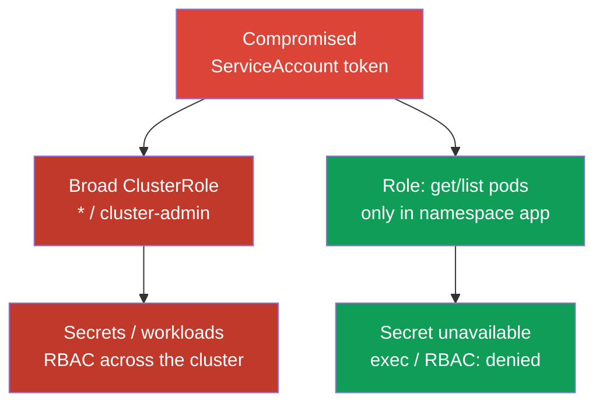
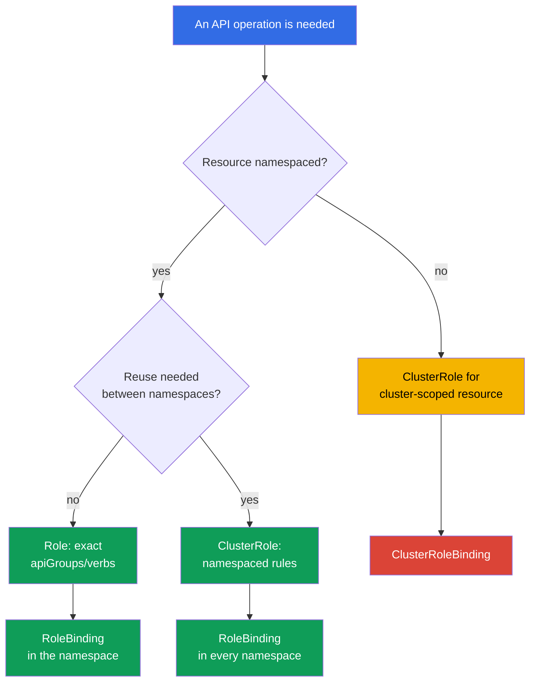

[Русская версия](ru.md)

# Chapter 10. RBAC for minimizing access

> **The problem.** An attacker who gains a shell in a Pod or a stolen token will not stop at one namespace if the ServiceAccount or user has excessive permissions. A broad `verb`, a forgotten `cluster-admin` granted for convenience, or available `escalate`/`bind`/`impersonate` turns a local compromise into reading every Secret, creating Pod objects on any node, or complete cluster takeover. The vulnerability itself does not decide this - RBAC has already allowed it.

> **What comes next.** Chapters 07-09 reduced the attack surface of cluster components. Now we limit the consequences of compromising an identity, ServiceAccount, or Pod: RBAC must grant only access that is truly required. This is the CKS Cluster Hardening domain (15%).

> **What you need from CKA.** The basic syntax of `Role`, `ClusterRole`, `RoleBinding`, and `ClusterRoleBinding` is already covered in [CKA Chapter 38](../../../cka/course/38/README.md). Here we do not repeat creation of the four objects; instead we examine auditing, privilege escalation, and safe rule design.

## 10.1. Least privilege: one extra verb changes the incident boundary

RBAC answers an API-server request using a combination of identity, `verb`, resource, namespace, and sometimes object name. Permissions are **additive**: if any `RoleBinding` or `ClusterRoleBinding` grants access, a narrower role does not take it away. You therefore cannot express denial with another role; remove or narrow the existing binding. Kubernetes RBAC is an **allow-only** model: it has no negative deny rules or conditions such as time of day or source IP. In general, do not delegate such requirements to admission: it runs after authentication/authorization only for create/delete/modify (and some custom verbs), while `get`, `list`, and `watch` bypass the admission layer. Conditional **API authorization** requires an external/Webhook authorizer or another authorization/policy layer; additionally limit source IP by network - firewall, load balancer, or NetworkPolicy where applicable. Admission policy is suitable only for requests it actually intercepts, not as a substitute for RBAC conditions.

The attack scenario is typical: a developer or ServiceAccount was given `cluster-admin` “temporarily”, or a controller received `verbs: ["*"]`. After its token is compromised, an attacker can read a Secret with credentials, run `pods/exec` in an application, create a workload as a more privileged ServiceAccount, or grant themselves a new role. The initial compromise of one namespace becomes cluster compromise.



Least privilege does not mean merely replacing `cluster-admin` with a role that has a less imposing name. For every subject, determine which API operations it needs, which resources, in which namespace, for how long, and whether it needs API access at all. For an ordinary application, the correct answer is often a dedicated ServiceAccount without a token; Chapter 11 discusses tokens.

Start with `Role` and `RoleBinding` when the task is local to a namespace. Use `ClusterRole` for cluster-scoped resources or a reusable rule set, but it can be granted through `RoleBinding` in only one namespace. `ClusterRoleBinding` expands scope to the entire cluster and needs separate justification.

> 🎯 Check a specific identity, verb, resource, and scope using a `can-i` pair: required action - `yes`; dangerous neighbor - `no`.

## 10.2. Auditing effective permissions: `kubectl auth can-i`

YAML shows intent, not final authorization: a subject can receive access from several bindings, a built-in role, a group, or an aggregated `ClusterRole`. Ask the API server with `kubectl auth can-i`.

```bash
# Overview of the current identity's rules in a specific namespace.
kubectl auth can-i --list -n cks-104

# Check cluster-scoped and cross-namespace boundaries as separate actions.
kubectl auth can-i get nodes
kubectl auth can-i list pods -n cks-104
kubectl auth can-i list pods -n default

# If the question is whether this action is allowed in all namespaces:
kubectl auth can-i list pods --all-namespaces

# A particular expected allow and expected denial - but these are the permissions of YOUR
# current identity, not those of the audited ServiceAccount or user.
kubectl auth can-i list pods -n cks-104
kubectl auth can-i get secrets -n cks-104

# Check as the ServiceAccount from Lab 104.
SA=system:serviceaccount:cks-104:app-sa
kubectl auth can-i list pods -n cks-104 --as="$SA"
kubectl auth can-i delete pods -n cks-104 --as="$SA"
kubectl auth can-i get secrets -n cks-104 --as="$SA"
# yes
# no
# no
```

Without `--as`, `can-i` always answers for the identity under which you run `kubectl` - your own kubeconfig, not the tested identity. A task almost always asks about a specific ServiceAccount, user, or group, so the check needs `--as=<identity>`: without it, `yes`/`no` proves nothing about the audit target, only your own permissions.

`--as-group` does not replace `--as` and is not an independent alternative. It is a list of additional impersonated groups, applied only together with an impersonated user. If a task tests permissions received through a group binding, set `--as` and **also** the required `--as-group`:

```bash
kubectl auth can-i list pods -n cks-104 \
  --as=group-audit-user \
  --as-group=developers
```

Remember that `--as=<user>` does not automatically restore that user's real groups: list the impersonated groups that belong to the tested scenario.

`--list` is useful for reviewing rules, but do not treat it as a guaranteed complete list of effective permissions for every authorizer chain. It relies on `SelfSubjectRulesReview`, whose official documentation explicitly warns that the returned list can be incomplete depending on the cluster authorization mode and evaluation errors. `--list` also does not support `--all-namespaces`: `kubectl` explicitly rejects that flag combination because `SelfSubjectRulesReview` lists rules in exactly one namespace and is not a cluster-wide inventory. Confirm critical boundaries with separate positive/negative `kubectl auth can-i <verb> <resource>` checks for the relevant identity, as in the examples above.

`--list` is useful for review, but does not replace verification of critical permissions: output can be long and a wildcard hides a particular risk. In an acceptance test, always check the pair “required action = `yes`” and “dangerous adjacent action = `no`”. For a cluster-scoped resource, do not specify a namespace:

```bash
kubectl auth can-i get nodes --as="$SA"
kubectl auth can-i create clusterrolebindings --as="$SA"
kubectl auth can-i create pods/exec -n cks-104 --as="$SA"
```

`--as` uses Kubernetes impersonation. In Kubernetes 1.36, a request can be allowed either by broad legacy verb `impersonate` or by Constrained Impersonation: a separate permission on the identity and separate `impersonate-on:<mode>:<verb>` permission on the actual API request performed. If required impersonation permissions are absent, the API returns `forbidden` before checking the permissions of the impersonated identity.

For a security audit, do not grant legacy `impersonate` automatically: choose the model that fits the required workflow and document its scope.

> 🔬 Constrained Impersonation in Kubernetes 1.36+ separately limits the substituted identity and the action permitted while impersonating.

### 10.2.1. Constrained Impersonation: limit identity and action

> **Kubernetes 1.36+ / advanced.** This is production material beyond the mandatory CKS core. The exam priority is precise ordinary Role/Binding and minimal `impersonate`.

**Constrained Impersonation** is Beta in Kubernetes v1.36+ and enabled by default. Unlike ordinary `impersonate`, it does not allow performing every action that the target can perform. For an ordinary user (an `Impersonate-User` value that does not start with `system:serviceaccount:` or `system:node:`), API server performs **two separate checks**:

1. **Identity permission** - whether this specific identity can be impersonated. For a generic user, this is a rule in `apiGroups: ["authentication.k8s.io"]`, resource `users`, with `resourceNames` for the required name and verb `impersonate:user-info`. Because a user has no namespace scope, grant it through `ClusterRole` and `ClusterRoleBinding`.
2. **Action-at-scope permission** - whether a particular operation can be performed in its scope *while impersonating this identity*. For Pod `list`, it is `impersonate-on:user-info:list` on `pods`; for `watch`, `impersonate-on:user-info:watch`. These can be granted with `Role`/`RoleBinding` only in the required namespace. Identity permission alone is insufficient.

The example lets ServiceAccount `audit-reader` impersonate only generic user `readonly@example.com` and only list/watch Pod objects in `cks-104`:

```yaml
apiVersion: rbac.authorization.k8s.io/v1
kind: ClusterRole
metadata:
  name: impersonate-readonly-identity
rules:
- apiGroups: ["authentication.k8s.io"]
  resources: ["users"]
  resourceNames: ["readonly@example.com"]
  verbs: ["impersonate:user-info"]
---
apiVersion: rbac.authorization.k8s.io/v1
kind: ClusterRoleBinding
metadata:
  name: audit-reader-impersonate-readonly
subjects:
- kind: ServiceAccount
  name: audit-reader
  namespace: cks-104
roleRef:
  apiGroup: rbac.authorization.k8s.io
  kind: ClusterRole
  name: impersonate-readonly-identity
---
apiVersion: rbac.authorization.k8s.io/v1
kind: Role
metadata:
  name: impersonate-readonly-pods
  namespace: cks-104
rules:
- apiGroups: [""]
  resources: ["pods"]
  verbs:
  - "impersonate-on:user-info:list"
  - "impersonate-on:user-info:watch"
---
apiVersion: rbac.authorization.k8s.io/v1
kind: RoleBinding
metadata:
  name: audit-reader-impersonate-readonly-pods
  namespace: cks-104
subjects:
- kind: ServiceAccount
  name: audit-reader
  namespace: cks-104
roleRef:
  apiGroup: rbac.authorization.k8s.io
  kind: Role
  name: impersonate-readonly-pods
```

The client uses the same headers or `kubectl --as=readonly@example.com`; only API-server checks change. Old `impersonate` continues to work and remains a broad fallback, so do not grant it together with constrained rules without a separate reason.

Important: constrained permission applies to the **actual API request**, not the action that a client describes inside another review object. The `impersonate-on:user-info:list/watch` on `pods` shown above therefore lets you actually `list/watch pods` under `--as`, but does not by itself permit:

```bash
kubectl auth can-i list pods --as=readonly@example.com -n cks-104
```

`kubectl auth can-i` creates `SelfSubjectAccessReview`, so that audit workflow needs constrained permissions that cover `create` on `selfsubjectaccessreviews.authorization.k8s.io`, or a controlled legacy impersonator. Do not broaden a constrained role only for `can-i` convenience if you can check the required operation directly in a safe read-only scenario.

For inventory, first find where an ability could come from, then inspect rules and subjects. Do not edit built-in roles until you know who uses them.

```bash
ROLE_NAME='role-name-to-review'
kubectl get role,rolebinding -A
kubectl get clusterrole,clusterrolebinding
kubectl describe rolebinding -n cks-104 app-sa-pod-reader
kubectl get clusterrolebinding -o wide
kubectl get clusterrole "$ROLE_NAME" -o yaml
```

## 10.3. Dangerous verbs and resources: escalation paths

Not all rules are equal. Read-only access to `pods` and `get` on `secrets` have entirely different impact, and some verbs implicitly obtain existing permissions. During review, look for the following combinations before ordinary `get`/`list`.

| Verb or resource | Why it is dangerous | Safe approach |
|---|---|---|
| `escalate` on `roles`/`clusterroles` | Together with ordinary `create`/`update` on Role/ClusterRole, removes the requirement to hold every permission written into the role. | Do not grant it to workloads or ordinary namespace administrators; control both CRUD on RBAC objects and the bypass verb separately. |
| `bind` on `roles`/`clusterroles` | Together with ordinary `create`/`update` on RoleBinding/ClusterRoleBinding, removes the requirement to hold permissions from the referenced role. | Restrict to particular roles with `resourceNames` and grant only with truly needed binding management. |
| `impersonate` on `users`, `groups`, `serviceaccounts`, `uids`, or `userextras/<name>` | Allows requests as another identity, including a more privileged one. Extra fields use an exact resource name, for example `userextras/scopes`, in API group `authentication.k8s.io`. | Grant to an auditor only when needed, and restrict with `resourceNames`. |
| `create`/`update`/`patch` RoleBinding and ClusterRoleBinding | Together with an accessible role, can transfer permissions; ClusterRoleBinding does this for the whole cluster. | Prohibit for applications; separate access granting from workload development. |
| `get`/`list`/`watch` `secrets` | A Secret often holds a password, registry credential, key, or bearer token; `list`/`watch` disclose many Secret values. | Specify one Secret with `resourceNames` for `get`, or give the application no API access. |
| `create` `serviceaccounts/token` | Issues a token for the selected ServiceAccount and can become a way to use its permissions. | Allow only trusted automation, for specific ServiceAccount objects. |
| `create` `pods/exec` | Gives interactive command execution in a running Pod plus access to its network, filesystem, and mounted Secret objects. | Do not include in ordinary roles; use short-lived break-glass access and audit. |
| `create` `pods/portforward` | Creates a tunnel to Pod ports, bypassing ordinary network exposure. | Grant narrowly for diagnostics and revoke after the incident. |
| `create` workload (`pods`, `deployments`, `jobs`, etc.) | Creating a Pod/workload in a namespace itself gives strong indirect access: you can select any ServiceAccount in that namespace and reference Secret, ConfigMap, and accessible storage from a Pod spec, even without separate `get secrets` for the original identity. This can obtain another workload's data or API permissions. If policy permits a privileged/host-level Pod, consequences can extend to the node. | Do not grant to untrusted tenant identities unnecessarily; treat workload creation as privileged, constraining Pod Security, ServiceAccount, Secret/storage design, and admission policy. |
| `nodes` | Access to Node objects discloses infrastructure information; changing a Node is a cluster-wide operation. | Exclude from tenant roles; grant to separate operational identities. |
| `get` `nodes/proxy` | Allows proxy requests to kubelet. This is not read-only: kubelet proxy operations can bypass admission and ordinary API-server audit. | Do not grant to workloads or tenant roles; grant only to strictly controlled operational identity. |

Write a subresource with a slash: `resources: ["pods/exec"]`. `exec` and `portforward` normally need `create`, not `get`. Do not replace the precise rule `resources: ["pods/exec"]` with a rule for all `pods`: they are different API paths and risks. Conversely, `get` on `nodes/proxy` is a separate dangerous permission for kubelet proxy, not harmless Node reading.

In Kubernetes 1.36, `KubeletFineGrainedAuthz` is GA and permanently enabled. For a legitimate operational task, grant a narrow subresource instead of `nodes/proxy`: for example, `nodes/stats`, `nodes/metrics`, `nodes/log`, `nodes/pods`, `nodes/healthz`, or `nodes/configz`. Kubelet checks these paths separately; `nodes/proxy` remains the fallback for other requests and compatibility.

```yaml
# Example for a monitoring identity. Do not use this rule for arbitrary kubelet operations.
rules:
- apiGroups: [""]
  resources: ["nodes/metrics", "nodes/stats"]
  verbs: ["get"]
```

Wildcards are especially dangerous in three places: `apiGroups: ["*"]`, `resources: ["*"]`, and `verbs: ["*"]`. They include new API groups, CRD, subresources, and verbs added after an upgrade. A rule safe today silently becomes broader tomorrow. A wildcard also hinders audit: YAML does not reveal whether access to `secrets`, `pods/exec`, or `rolebindings` exists.

> 🧠 RBAC is additive: a narrow role does not cancel an issued Allow. `escalate`, `bind`, `impersonate`, bindings, Secret, and dangerous subresources can transfer others' permissions.

```yaml
# Unsafe: the entire current and future namespace API
rules:
- apiGroups: ["*"]
  resources: ["*"]
  verbs: ["*"]
```

```yaml
# Minimum for a read-only controller in one namespace
rules:
- apiGroups: [""]
  resources: ["pods"]
  verbs: ["get", "list"]
```

## 10.4. Designing a minimal Role

First write the access contract in ordinary language: “`app-sa` reads the Pod list and state of a particular ConfigMap in `cks-104`; it does not change a workload, Secret, or RBAC.” Then translate it into minimal rules. Separate reading (`get`, `list`, `watch`) from modification (`create`, `update`, `patch`, `delete`): a controller that observes Pod objects does not necessarily need to delete them.

> 🎯 State the access contract, choose a narrow scope (`Role` + `RoleBinding` for a namespace), and prove the permitted action and denial on a dangerous adjacent resource or namespace.

```yaml
apiVersion: v1
kind: ServiceAccount
metadata:
  name: app-sa
  namespace: cks-104
---
apiVersion: rbac.authorization.k8s.io/v1
kind: Role
metadata:
  name: app-sa-pod-reader
  namespace: cks-104
rules:
- apiGroups: [""]
  resources: ["pods"]
  verbs: ["get", "list"]
---
apiVersion: rbac.authorization.k8s.io/v1
kind: RoleBinding
metadata:
  name: app-sa-pod-reader
  namespace: cks-104
subjects:
- kind: ServiceAccount
  name: app-sa
  namespace: cks-104
roleRef:
  apiGroup: rbac.authorization.k8s.io
  kind: Role
  name: app-sa-pod-reader
```

`resourceNames` further restricts `get`, `update`, `patch`, and `delete` by object name. This is useful for one known ConfigMap or Secret. For a **top-level resource**, it does not constrain `create` or `deletecollection`: object name is not part of the URL for those requests. This is not a rule for every subresource: named subresources such as `pods/exec` can be limited using `resourceNames` (see [RBAC reference](https://kubernetes.io/docs/reference/access-authn-authz/rbac/)). `list`/`watch` with `resourceNames` require a client field selector `metadata.name=<name>` and are often inconvenient; do not treat them as a full substitute for namespace isolation.

```yaml
apiVersion: rbac.authorization.k8s.io/v1
kind: Role
metadata:
  name: app-config-reader
  namespace: cks-104
rules:
- apiGroups: [""]
  resources: ["configmaps"]
  resourceNames: ["app-config"]
  verbs: ["get"]
```

Check resource scope before choosing an object. `pods`, `configmaps`, `deployments`, and `secrets` are namespaced, so `Role` limits their namespace. `nodes`, `namespaces`, `persistentvolumes`, and `clusterroles` are cluster-scoped: they need `ClusterRole`, and `RoleBinding` does not make a cluster-scoped resource local. If a set of namespaced rules is needed in several namespaces, define a `ClusterRole` but bind it with a separate `RoleBinding` in every permitted namespace.

`nonResourceURLs` describes API-server URLs rather than Kubernetes objects. Such URLs have no namespace scope, so the rule belongs in `ClusterRole` and must be granted by `ClusterRoleBinding`. For example, a dedicated health-check identity can receive exactly `nonResourceURLs: ["/healthz"]` and `verbs: ["get"]`, without wildcard `/*`. `RoleBinding`, even when it refers to this `ClusterRole`, does not turn a non-resource URL into a namespaced permission.



`ClusterRole` does not automatically mean cluster-wide access: it can contain rules for namespaced resources and be granted through `RoleBinding` only in a specific namespace. Cluster-wide scope appears precisely with `ClusterRoleBinding`. Cluster-scoped resources and `nonResourceURLs` need `ClusterRole` + `ClusterRoleBinding`.

## 10.5. Built-in and aggregated ClusterRole: hidden permission expansion

Built-in `ClusterRole` objects are convenient, but not equal in risk. `view` is for reading ordinary namespaced objects and intentionally has no access to Secret, Role, or RoleBinding because a Secret often holds ServiceAccount privileges. `edit` permits changing most namespaced resources and reading Secret, but cannot change Role or RoleBinding; it can nevertheless run a Pod as any ServiceAccount in the same namespace. `admin` can manage most RBAC in a namespace.

Built-in `cluster-admin` holds the broadest wildcard permissions. Through `ClusterRoleBinding`, the same `ClusterRole` gives cluster-wide superuser access. Through `RoleBinding`, it is limited to one namespace, but built-in `cluster-admin` semantics give complete control of resources in that namespace, **including the Namespace object itself** - an important exception because Namespace is cluster-scoped. Such a `RoleBinding` is not cluster-wide but remains an extremely privileged namespaced binding; every `cluster-admin` assignment needs separate justification and control.

| Role | Practical meaning | Risk when granted to an application or broad group |
|---|---|---|
| `view` | View ordinary namespace resources; no Secret, Role, or RoleBinding | Can disclose topology, images, and configuration, but has lower risk of credential leakage. |
| `edit` | Modify most namespace resources and read Secret; without changing Role/RoleBinding | Can modify workloads, read Secret, and run a Pod as any namespace ServiceAccount. |
| `admin` | Broad namespace administration, including roles/bindings inside its boundary | High risk of namespace escalation and takeover of team applications. |
| `cluster-admin` | Through `ClusterRoleBinding` - full access to the entire cluster; through `RoleBinding` - complete control of resources in that binding's namespace, including the Namespace object itself | Even a local binding is extremely risky; ClusterRoleBinding means cluster compromise. |

Aggregation can extend a built-in ClusterRole with rules from other ClusterRole objects. The RBAC controller combines rules from roles labeled `rbac.authorization.k8s.io/aggregate-to-<role>: "true"`. This is useful for CRD: for example, a plugin can add read-only rules for its API to `view`. But this label is a supply-chain and RBAC boundary: a created or modified role can silently grant every `view`, `edit`, or `admin` user additional permissions.

> 🧠 `aggregate-to-*` changes the effective permissions of the whole built-in-role audience; a wildcard in the source role expands permissions massively.

```yaml
# Example: extend the built-in view role only to read a CRD.
# Add such a role only after a separate security review.
apiVersion: rbac.authorization.k8s.io/v1
kind: ClusterRole
metadata:
  name: aggregate-widget-view
  labels:
    rbac.authorization.k8s.io/aggregate-to-view: "true"
rules:
- apiGroups: ["example.io"]
  resources: ["widgets"]
  verbs: ["get", "list", "watch"]
```

Check aggregated rules in the final built-in role and also aggregation sources themselves. Do not edit system ClusterRole objects with `system:` prefix: API server can restore them on start or upgrade. Manage your ClusterRole objects and labels through Git, code review, and a limited set of identities allowed to change RBAC.

```bash
# Final effective rules of the built-in role
kubectl get clusterrole view -o yaml

# All ClusterRole objects that can extend view/edit/admin
kubectl get clusterrole -l rbac.authorization.k8s.io/aggregate-to-view=true
kubectl get clusterrole -l rbac.authorization.k8s.io/aggregate-to-edit=true
kubectl get clusterrole -l rbac.authorization.k8s.io/aggregate-to-admin=true
```

### Compact escalation map

| Capability | Boundary it changes | Control |
|---|---|---|
| `create` CSR together with ability to `approve`/`sign` | Can issue a client certificate with broader identity; `create` alone is insufficient | Separate creation, approval, and signing among controlled identities. |
| Manage `ValidatingWebhookConfiguration`/`MutatingWebhookConfiguration` | Changes validation or mutation of admission requests cluster-wide | Do not grant to tenant roles; review webhook endpoint, CA, and rules. |
| `patch` Namespace labels | Can change Pod Security Admission labels and admit a different Pod profile | Restrict to a dedicated platform identity and review label changes. |
| Create/change PV with `hostPath` | A claim and Pod can obtain a node filesystem path | Prohibit for tenant roles; control storage policy and Pod Security Admission. |
| Issue ServiceAccount tokens (`create serviceaccounts/token`) | Allows acting with the permissions of the selected ServiceAccount | Allow only trusted automation on particular ServiceAccount objects. |
| Membership in `system:masters` | This is a superuser group that bypasses ordinary RBAC evaluation | Do not grant to applications; control certificate source and external groups. |

> 🎯 After an RBAC change, prove both the permitted action and the expected denial.

## 10.6. Verification: prove both the required access and denial

After applying a role, do not stop at `kubectl get role`: the object can exist but not be bound, conflict with another binding, or be too broad. In Lab 104, verification for `app-sa` must prove exactly the required boundary.

```bash
kubectl apply -f app-sa-rbac.yaml

SA=system:serviceaccount:cks-104:app-sa

# Functionally necessary right
kubectl auth can-i get pods -n cks-104 --as="$SA"
kubectl auth can-i list pods -n cks-104 --as="$SA"
# yes
# yes

# Undesired permissions: workload modification, Secret, exec, and RBAC
kubectl auth can-i delete pods -n cks-104 --as="$SA"
kubectl auth can-i get secrets -n cks-104 --as="$SA"
kubectl auth can-i create pods/exec -n cks-104 --as="$SA"
kubectl auth can-i create rolebindings -n cks-104 --as="$SA"
kubectl auth can-i create clusterrolebindings --as="$SA"
# no
# no
# no
# no
# no
```

Also check scope. The same identity must not read Pod objects in a neighboring namespace and must not have cluster-scoped permissions merely because it was granted Pod access.

```bash
kubectl auth can-i list pods -n default --as="$SA"
kubectl auth can-i get nodes --as="$SA"
# no
# no
```

If the answer is unexpectedly `yes`, find all of the subject's bindings, then repeat the check after removing or narrowing the excess access. Delete the exact object, rather than accidentally denying another team access:

```bash
kubectl get rolebinding -A -o yaml | grep -n -C 4 'app-sa'
kubectl get clusterrolebinding -o yaml | grep -n -C 4 'app-sa'

# Only after confirming the binding owner and purpose
kubectl delete clusterrolebinding app-sa-excessive-access
```

In production, include this `can-i` set in a smoke test after an RBAC change, and send Role, ClusterRole, and binding changes for review. Regularly reassess long-lived access by actual ServiceAccount purpose, audit logs, and workload owner.

> 🏭 Roles and aggregation labels live in Git, changes undergo review, critical positive/negative `can-i` checks run in CI, and break-glass has an owner and expiry.

## 10.7. How this is applied in production

- **Role by default.** Teams and applications receive namespaced `Role`/`RoleBinding`; `ClusterRoleBinding` requires an owner, reason, expiry, and security review.
- **ServiceAccount by default.** Do not give application permissions to the `default` ServiceAccount. If a workload does not call the Kubernetes API, set `automountServiceAccountToken: false`; otherwise create a dedicated ServiceAccount with minimal permissions. This keeps audit and revocation focused.
- **RBAC as code.** Keep custom roles in Git and check rule and aggregation-label diffs in CI. Explicitly block wildcard, `escalate`, `bind`, `impersonate`, and Secret access without an explicit exception.
- **API-server authorization configuration.** First determine which of two mutually exclusive configuration methods is used.

  For command-line configuration, verify that `--authorization-mode` contains the required chain, for example `Node,RBAC`.

  For file-based configuration through `--authorization-config`, do not also set `--authorization-mode`: verify `type: RBAC` and the contents and order of `authorizers` directly in `AuthorizationConfiguration`.

  The authorizer-chain contents and order must be part of security review.
- **Periodic audit.** Inventory `ClusterRoleBinding`, `system:serviceaccount` subjects, built-in roles, and aggregators; check critical contracts with `kubectl auth can-i`.
- **Break-glass instead of permanent admin.** Emergency access must be a separate short-lived identity, logged and revoked after work, rather than `cluster-admin` on an everyday user.

## 10.8. Mini-glossary

- **least privilege** - granting only the minimum permission set an identity needs for a particular task.
- **verb** - a Kubernetes API operation, for example `get`, `list`, `create`, `bind`, or `escalate`.
- **resource / subresource** - an API object and its subresource, for example `pods` and `pods/exec`.
- **`resourceNames`** - restriction of a rule to particular object names where API server supports it.
- **impersonation** - executing a request as another identity through API headers.
- **aggregation** - automatic addition of one ClusterRole's rules to a built-in ClusterRole by label.
- **wildcard** - `*` in `apiGroups`, `resources`, or `verbs`; it includes unknown future objects and is therefore dangerous in a security role.
- **break-glass access** - controlled temporary privileged access for an emergency.

## 10.9. Chapter summary

- RBAC permissions are additive: you cannot compensate for an extra binding with a narrower role; find and remove or narrow it.
- Least privilege begins with `Role` and `RoleBinding` in a particular namespace; cluster-level access and `ClusterRoleBinding` need separate justification.
- `kubectl auth can-i --list` gives a useful rule overview when the result is complete, but not a guaranteed exhaustive inventory. Prove security-critical boundaries with targeted `can-i` checks: expected access must return `yes`, forbidden access `no`.
- Especially dangerous are `escalate`, `bind`, `impersonate`, changing a binding, `secrets`, `serviceaccounts/token`, `pods/exec`, `pods/portforward`, and `get nodes/proxy`.
- Do not use `*` without exceptional, documented reason: a wildcard includes current and future APIs, resources, subresources, and verbs.
- Aggregated ClusterRole objects can silently expand `view`, `edit`, and `admin`; review `aggregate-to-*` labels and the sources of those roles.

## 10.10. How this helps on the exam and at work

**On the exam.** Quickly create or narrow a `Role` with exact `apiGroups`, `resources`, and `verbs`, bind it to the correct ServiceAccount in the specified namespace, and immediately check `kubectl auth can-i --as=system:serviceaccount:<ns>:<sa>`. Read a resource literally: `pods/exec` is not the same as `pods`; `nodes` is cluster-scoped. When excess access must be removed, first find the corresponding binding rather than changing everything at once.

**In real work.** RBAC limits the blast radius of a stolen token, automation error, and Pod compromise. The most dangerous incidents usually arise not from YAML syntax but from convenient broad roles, wildcards, and hidden bindings. Regular `can-i` audits, aggregation-label review, and an explicit access contract make RBAC a verifiable security boundary.

> ### 🔴 Attacker's view
> **Asset:** Kubernetes API resources.
>
> **Starting foothold:** code execution inside a Pod.
>
> **Attacker objective:** use workload identity to access the API.
>
> **Abuse path:** check for a token, its audience and TTL, then RBAC permissions and ability to `list` Pod objects, read Secret, or create/execute a workload through `pods/exec`.
>
> **Expected evidence:** audit events and SubjectAccessReview.
>
> **Control:** `automountServiceAccountToken: false` where API is not needed; a projected short-lived token where it is; minimal RBAC.
>
> **Retest:** an allowed API call works and a prohibited one returns `403`.
>
> **ATT&CK:** [T1528 - Steal Application Access Token](https://attack.mitre.org/techniques/T1528/).

## 10.11. Self-check questions

<details>
<summary>1. Why can a narrower Role not cancel permission granted by another binding?</summary>

Kubernetes RBAC is additive: a permission applies when at least one RoleBinding or ClusterRoleBinding grants it. The allow-only model has no deny rule that can override already granted access. To remove an excess permission, find and delete or narrow the binding that grants it.
</details>

<details>
<summary>2. Which two `can-i` checks prove `app-sa` can read Pod objects but cannot delete them?</summary>

For the allowed action, run `kubectl auth can-i get pods -n cks-104 --as=system:serviceaccount:cks-104:app-sa` and expect `yes`. For denial, run `kubectl auth can-i delete pods -n cks-104 --as=system:serviceaccount:cks-104:app-sa` and expect `no`. This pair checks the API-server decision, not only role YAML.
</details>

<details>
<summary>3. Why is `get`/`list` on Secret more dangerous than reading most ordinary resources?</summary>

A Secret often holds a password, registry credential, key, or bearer token, so reading it reveals usable credentials rather than only topology or state. `list` and `watch` can reveal many Secret values at once. If one known Secret is needed, this chapter recommends a focused `get` using `resourceNames`, or no application API access.
</details>

<details>
<summary>4. How does `bind` differ from `escalate`, and how can each lead to escalation?</summary>

Both verbs bypass RBAC's built-in protection, but neither replaces ordinary CRUD on an object. `escalate` together with `create`/`update` on Role or ClusterRole lets a subject write permissions into a role that it does not hold. `bind` together with `create`/`update` on RoleBinding or ClusterRoleBinding lets it assign a referenced role without holding all of that role's permissions. Therefore audit both parts of the path: ability to change an RBAC object and the corresponding bypass verb.
</details>

<details>
<summary>5. Why must `create pods/exec` and `create pods/portforward` be reviewed separately from ordinary access to `pods`?</summary>

These are separate API subresources, written as `pods/exec` and `pods/portforward`, not ordinary resource `pods`. `create pods/exec` gives command execution in an existing Pod with its network, filesystem, and mounted Secret objects; `create pods/portforward` creates a tunnel to Pod ports. Do not implicitly include them in an ordinary read role; normally grant them only for controlled diagnostics.
</details>

<details>
<summary>6. Why does `resourceNames` not restrict `create` and `deletecollection` of a top-level resource, but can apply to a named subresource such as `pods/exec`?</summary>

For `create` and `deletecollection` on a top-level resource, object name is not part of the request URL, so API server cannot restrict it with `resourceNames`. This is not a universal restriction for all subresources. A named subresource such as `pods/exec` can be restricted because the request addresses a specific Pod.
</details>

<details>
<summary>7. Why is `get nodes/proxy` not a read-only right, and to whom is it acceptable to grant it?</summary>

`get nodes/proxy` allows proxy requests to kubelet, and those operations can bypass admission and ordinary API-server audit. It is therefore not harmless reading of a Node object. Do not grant it to workloads or tenant roles; it is acceptable only for a strictly controlled operational identity, preferably using narrower `nodes/metrics`, `nodes/stats`, and other fine-grained subresources.
</details>

<details>
<summary>8. How does label `rbac.authorization.k8s.io/aggregate-to-view=true` change effective access, and why is a wildcard in an aggregated role especially risky?</summary>

The RBAC controller adds rules from a ClusterRole with this label to final built-in role `view`, so every user of `view` receives new access. A wildcard in this source role covers current and future API groups, resources, subresources, and verbs for the broad `view` audience. Therefore review both the final role and every aggregation source role.
</details>

<details>
<summary>9. **Flashback (Chapter 04).** `NetworkPolicy` from Chapter 04 is an allow-list: default-deny first, then narrow allowances. Where does the same “deny everything, then explicitly allow” logic work in RBAC design, and when does a request actually receive default-deny?</summary>

In RBAC, start with the absence of required permissions and add only exact `apiGroups`, `resources`, and `verbs` at minimal scope. A request is denied when no applicable `RoleBinding` or `ClusterRoleBinding` grants Allow. Check not only the binding where the subject appears directly, but also permissions received through its groups, such as `system:serviceaccounts` for a ServiceAccount. Therefore the absence of a direct `RoleBinding` for a user or ServiceAccount does not itself prove lack of access; confirm the final boundary with `kubectl auth can-i` for a specific identity. Unlike NetworkPolicy, the RBAC authorizer in API server makes the decision, but the result is likewise an explicit allow-list.
</details>

## Practice

In [Lab 104](../../labs/104/README.MD), create `app-sa` with a minimal Role for reading Pod objects, prove with `auth can-i` that `delete pods` is denied, and remove an excessive binding. In the same lab, you disable automatic ServiceAccount token mounting and restrict anonymous access to API server - the next chapters develop this RBAC boundary.

🌐 Additional interactive practice (killer.sh/killercoda, external resource): [rbac-serviceaccount-permissions](https://killercoda.com/killer-shell-cks/scenario/rbac-serviceaccount-permissions) · [rbac-user-permissions](https://killercoda.com/killer-shell-cks/scenario/rbac-user-permissions) · [certificate-signing-requests-sign-manually](https://killercoda.com/killer-shell-cks/scenario/certificate-signing-requests-sign-manually) · [certificate-signing-requests-sign-k8s](https://killercoda.com/killer-shell-cks/scenario/certificate-signing-requests-sign-k8s)

🎮 Killercoda (in the browser, without installation): [Create a Role and Role Binding](https://killercoda.com/chadmcrowell/course/cka/create-role) · [Create a Cluster Role and Role Binding](https://killercoda.com/chadmcrowell/course/cka/create-cluster-role)

---
[Table of contents](../README.md) · [Chapter 09](../09/README.md) · [Chapter 11](../11/README.md)
