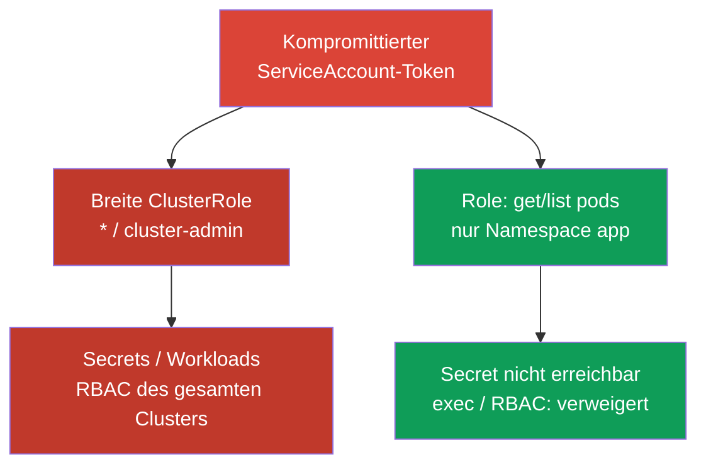
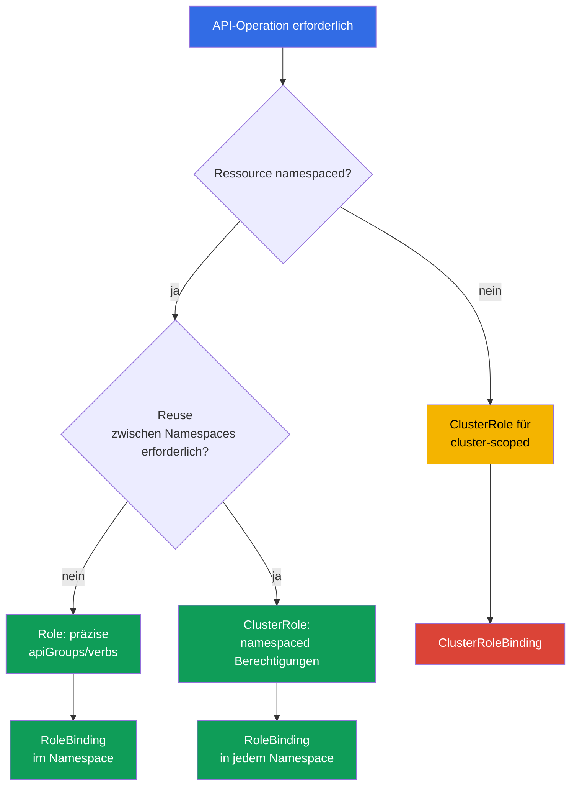

[Русская версия](ru.md) · [Eng version](README.md) · [Versión en español](es.md) · [Version française](fr.md) · [ქართული ვერსია](ge.md) · [繁體中文版](tw.md) · [日本語版](jp.md)

# Kapitel 10. RBAC zur Minimierung des Zugriffs

> **Das Problem.** Ein Angreifer, der eine Shell in einem Pod oder einen gestohlenen Token
> erlangt hat, wird nicht an der Grenze eines Namespace gestoppt, wenn ein ServiceAccount
> oder Benutzer überflüssige Berechtigungen besitzt. Ein breites `verb`, ein aus Bequemlichkeit
> vergessenes `cluster-admin` oder verfügbares `escalate`/`bind`/`impersonate` verwandeln eine
> lokale Kompromittierung in das Lesen aller Secrets, das Erstellen von Pods auf jeder node
> oder die vollständige Übernahme des Clusters - und das entscheidet nicht die Schwachstelle
> selbst, sondern was RBAC im Voraus erlaubt hat.

> **Wie es weitergeht.** In den Kapiteln 07-09 haben wir die Angriffsfläche der
> Clusterkomponenten reduziert. Nun begrenzen wir die Folgen einer Kompromittierung einer
> Identity, eines ServiceAccounts oder eines Pods: RBAC darf nur den wirklich benötigten
> Zugriff erteilen. Dies ist die CKS-Domain Cluster Hardening (15 %).

> **Was Sie aus CKA benötigen.** Die grundlegende Syntax von `Role`, `ClusterRole`,
> `RoleBinding` und `ClusterRoleBinding` wurde bereits in
> [CKA-Kapitel 38](../../../cka/course/38/de.md) behandelt. Hier wiederholen wir nicht das
> Erstellen der vier Objekte, sondern betrachten Audit, Privilege Escalation und das sichere
> Entwerfen von Regeln.

## 10.1. Least Privilege: Ein zusätzliches Verb verändert die Incident-Grenze

RBAC beantwortet eine Anfrage an den API server anhand der Kombination aus Identity, `verb`,
Ressource, Namespace und manchmal Objektname. Berechtigungen sind **additiv**: Wenn irgendein
`RoleBinding` oder `ClusterRoleBinding` Zugriff erteilt, nimmt eine engere Rolle ihn nicht
weg. Eine Verweigerung lässt sich daher nicht durch eine zweite Rolle ausdrücken: Der
bestehende Binding muss entfernt oder eingegrenzt werden. Kubernetes RBAC ist ein
**allow-only**-Modell: Es kennt keine negativen Deny-Regeln und keine Bedingungen wie
Tageszeit oder Source-IP. Solche Anforderungen lassen sich im Allgemeinen nicht an
Admission delegieren: Sie läuft nach Authentication/Authorization nur für
create/delete/modify (und einige Custom Verbs); `get`, `list` und `watch` umgehen die
Admission Layer. Für bedingte **API-Autorisierung** ist ein externer/Webhook Authorizer oder
eine andere Authorization-/Policy Layer nötig; die Source-IP wird zusätzlich auf
Netzwerkebene eingeschränkt - durch Firewall, Load Balancer oder gegebenenfalls
NetworkPolicy. Eine Admission Policy eignet sich nur für Anfragen, die sie tatsächlich
abfängt, nicht als Ersatz für RBAC-Bedingungen.

Das Angriffsszenario ist typisch: Ein Entwickler oder ServiceAccount erhielt „vorübergehend“
`cluster-admin`, oder ein Controller bekam `verbs: ["*"]`. Nach der Kompromittierung seines
Tokens kann ein Angreifer ein Secret mit Zugangsdaten lesen, `pods/exec` in einer Anwendung
ausführen, einen Workload im Namen eines privilegierteren ServiceAccounts erstellen oder
sich selbst eine neue Rolle geben. Die ursprüngliche Kompromittierung eines Namespace wird
zur Kompromittierung des Clusters.



Least Privilege bedeutet nicht einfach, `cluster-admin` durch eine Rolle mit einem weniger
mächtigen Namen zu ersetzen. Für jedes Subject muss bestimmt werden: Welche API-Operationen
werden benötigt, auf welchen Ressourcen, in welchem Namespace, für welchen Zeitraum und
wird überhaupt API-Zugang benötigt? Für eine gewöhnliche Anwendung ist die richtige Antwort
oft ein separater ServiceAccount ohne Token; Tokens werden in Kapitel 11 behandelt.

Beginnen Sie mit `Role` und `RoleBinding`, wenn die Aufgabe auf einen Namespace beschränkt
ist. `ClusterRole` wird für cluster-scoped Ressourcen oder einen wiederverwendbaren
Regelsatz benötigt, kann aber durch `RoleBinding` nur in einem Namespace erteilt werden.
`ClusterRoleBinding` erweitert den Scope auf den gesamten Cluster und erfordert eine
separate Begründung.

> 🎯 Prüfen Sie konkrete Identity, Verb, Ressource und Scope mit einem Paar `can-i`: Die benötigte Aktion ergibt `yes`, die gefährliche benachbarte Aktion `no`.

## 10.2. Audit der tatsächlichen Berechtigungen: `kubectl auth can-i`

YAML zeigt die Absicht, aber nicht die endgültige Autorisierung: Ein Subject kann Zugriff
über mehrere Bindings, eine eingebaute Rolle, eine Gruppe oder eine aggregierte
`ClusterRole` erhalten. Prüfen Sie die Antwort des API server mit `kubectl auth can-i`.

```bash
# Überblick über die Regeln der aktuellen Identity in einem bestimmten Namespace.
kubectl auth can-i --list -n cks-104

# Prüfen Sie cluster-scoped und Namespace-übergreifende Grenzen durch einzelne Aktionen.
kubectl auth can-i get nodes
kubectl auth can-i list pods -n cks-104
kubectl auth can-i list pods -n default

# Wenn die Frage lautet: „Ist diese Aktion in allen Namespaces erlaubt?“:
kubectl auth can-i list pods --all-namespaces

# Konkrete erwartete Erlaubnis und erwartete Verweigerung - aber dies sind die Rechte IHRER
# aktuellen Identity, nicht des geprüften ServiceAccounts oder Benutzers.
kubectl auth can-i list pods -n cks-104
kubectl auth can-i get secrets -n cks-104

# Prüfung als ServiceAccount aus Lab 104.
SA=system:serviceaccount:cks-104:app-sa
kubectl auth can-i list pods -n cks-104 --as="$SA"
kubectl auth can-i delete pods -n cks-104 --as="$SA"
kubectl auth can-i get secrets -n cks-104 --as="$SA"
# yes
# no
# no
```

Ohne `--as` antwortet `can-i` immer für die Identity, unter der Sie `kubectl` selbst
ausführen - also für Ihren eigenen kubeconfig und nicht für die getestete Identity. Die
Aufgabe fragt fast immer nach einem bestimmten ServiceAccount, Benutzer oder einer Gruppe;
für die Prüfung ist deshalb `--as=<identity>` nötig. Ohne diese Option beweist `yes`/`no`
nichts über das Ziel des Audits, sondern nur etwas über Ihre eigenen Rechte.

`--as-group` ersetzt `--as` nicht und ist keine eigenständige Alternative: Es ist eine Liste
zusätzlicher impersonated Groups, die nur zusammen mit einem impersonated User gilt. Wenn
die Aufgabe Berechtigungen prüft, die gerade über einen Group Binding erlangt werden, setzen
Sie `--as` und **zusätzlich** die benötigten `--as-group`:

```bash
kubectl auth can-i list pods -n cks-104 \
  --as=group-audit-user \
  --as-group=developers
```

Beachten Sie, dass `--as=<user>` die tatsächlichen Gruppen dieses Benutzers nicht
automatisch wiederherstellt: Geben Sie die impersonated Groups an, die Teil des geprüften
Szenarios sind.

`--list` ist als Überblick über Regeln praktisch, darf aber nicht als garantiert
vollständige Liste der effective Permissions für jede Authorizer Chain gelten: Der Befehl
stützt sich auf `SelfSubjectRulesReview`, und dessen offizielle Dokumentation warnt
ausdrücklich, dass die zurückgegebene Liste abhängig vom Authorization Mode des Clusters und
von Evaluation-Fehlern unvollständig sein kann. `--list` unterstützt außerdem nicht
`--all-namespaces`: `kubectl` verweigert diese Flag-Kombination ausdrücklich, weil
`SelfSubjectRulesReview` Regeln genau in einem Namespace auflistet und kein clusterweites
Inventory ist. Bestätigen Sie kritische Grenzen mit getrennten positiven/negativen
`kubectl auth can-i <verb> <resource>` für die konkrete Identity, wie in den obigen
Beispielen.

`--list` ist für ein Review hilfreich, ersetzt aber nicht die Prüfung kritischer
Berechtigungen: Die Ausgabe kann lang sein, und ein Wildcard verdeckt das konkrete Risiko.
Prüfen Sie in einem Acceptance-Test stets das Paar „benötigte Aktion = `yes`“ und
„gefährliche benachbarte Aktion = `no`“. Für eine cluster-scoped Ressource geben Sie keinen
Namespace an:

```bash
kubectl auth can-i get nodes --as="$SA"
kubectl auth can-i create clusterrolebindings --as="$SA"
kubectl auth can-i create pods/exec -n cks-104 --as="$SA"
```

Das Flag `--as` verwendet Kubernetes Impersonation. In Kubernetes 1.36 kann eine Anfrage
entweder durch das breite Legacy Verb `impersonate` oder durch Constrained Impersonation
erlaubt werden: eine separate Berechtigung für die Identity und ein separates
`impersonate-on:<mode>:<verb>` für die tatsächlich ausgeführte API-Anfrage. Fehlen die
notwendigen Impersonation Permissions, gibt die API vor der Prüfung der Rechte der
impersonated Identity `forbidden` zurück.

Erteilen Sie für ein Security-Audit nicht automatisch das Legacy-`impersonate`: Wählen Sie
das Modell, das zum erforderlichen Workflow passt, und dokumentieren Sie seinen Scope.

> 🔬 Constrained Impersonation in Kubernetes 1.36+ beschränkt die zu imitierende Identity und die während der Imitation erlaubte Aktion getrennt.

### 10.2.1. Constrained Impersonation: Identity und Aktion beschränken

> **Kubernetes 1.36+ / advanced.** Dies ist Production-Material über den verpflichtenden
> CKS-Kern hinaus: Prüfungspriorität haben präzise gewöhnliche Role/Binding und minimales
> `impersonate`.

**Constrained Impersonation** ist in Kubernetes v1.36+ Beta und standardmäßig aktiviert.
Anders als gewöhnliches `impersonate` erlaubt sie nicht, im Namen des Ziels alles zu tun,
was dieses tun kann. Für einen gewöhnlichen Benutzer (der Wert von `Impersonate-User`
beginnt nicht mit `system:serviceaccount:` oder `system:node:`) führt der API server
**zwei getrennte Prüfungen** aus:

1. **Identity Permission** - ob genau diese Identity imitiert werden darf. Für einen Generic
   User ist dies eine Regel in `apiGroups: ["authentication.k8s.io"]`, auf der Ressource
   `users`, mit `resourceNames` des erforderlichen Namens und dem Verb
   `impersonate:user-info`. Da ein User keinen Namespace-Scope hat, erteilen Sie sie über
   `ClusterRole` und `ClusterRoleBinding`.
2. **Action-at-Scope Permission** - ob die konkrete Operation in ihrem Scope *bei dieser
   Imitation* ausgeführt werden darf. Für `list` Pods ist dies
   `impersonate-on:user-info:list` auf `pods`, für `watch`
   `impersonate-on:user-info:watch`. Diese Berechtigungen können durch `Role`/`RoleBinding`
   nur im benötigten Namespace erteilt werden. Die Berechtigung für die Identity allein
   reicht nicht aus.

Das Beispiel erlaubt dem ServiceAccount `audit-reader`, nur den Generic User
`readonly@example.com` und nur `list`/`watch` Pods in `cks-104` zu imitieren:

```yaml
apiVersion: rbac.authorization.k8s.io/v1
kind: ClusterRole
metadata:
  name: impersonate-readonly-identity
rules:
- apiGroups: ["authentication.k8s.io"]
  resources: ["users"]
  resourceNames: ["readonly@example.com"]
  verbs: ["impersonate:user-info"]
---
apiVersion: rbac.authorization.k8s.io/v1
kind: ClusterRoleBinding
metadata:
  name: audit-reader-impersonate-readonly
subjects:
- kind: ServiceAccount
  name: audit-reader
  namespace: cks-104
roleRef:
  apiGroup: rbac.authorization.k8s.io
  kind: ClusterRole
  name: impersonate-readonly-identity
---
apiVersion: rbac.authorization.k8s.io/v1
kind: Role
metadata:
  name: impersonate-readonly-pods
  namespace: cks-104
rules:
- apiGroups: [""]
  resources: ["pods"]
  verbs:
  - "impersonate-on:user-info:list"
  - "impersonate-on:user-info:watch"
---
apiVersion: rbac.authorization.k8s.io/v1
kind: RoleBinding
metadata:
  name: audit-reader-impersonate-readonly-pods
  namespace: cks-104
subjects:
- kind: ServiceAccount
  name: audit-reader
  namespace: cks-104
roleRef:
  apiGroup: rbac.authorization.k8s.io
  kind: Role
  name: impersonate-readonly-pods
```

Der Client nutzt dieselben Header oder `kubectl --as=readonly@example.com`; nur die
Prüfungen des API server ändern sich. Das alte `impersonate` funktioniert weiter und bleibt
ein breiter Fallback. Erteilen Sie es deshalb nicht ohne separaten Grund zusammen mit
Constrained-Regeln.

Wichtig: Die Constrained Permission bezieht sich auf die **tatsächliche API-Anfrage**, nicht
auf eine Aktion, die der Client innerhalb eines anderen Review-Objekts beschreibt. Daher
erlauben die oben gezeigten `impersonate-on:user-info:list/watch` auf `pods` die
tatsächlichen `list/watch pods` unter `--as`, erlauben aber für sich allein nicht:

```bash
kubectl auth can-i list pods --as=readonly@example.com -n cks-104
```

`kubectl auth can-i` erstellt ein `SelfSubjectAccessReview`. Für einen solchen
Audit-Workflow sind daher Constrained Permissions erforderlich, die `create` auf
`selfsubjectaccessreviews.authorization.k8s.io` abdecken, oder ein kontrollierter
Legacy-Impersonator. Erweitern Sie die Constrained Role nicht nur wegen der Bequemlichkeit
von `can-i`, wenn die benötigte Operation direkt in einem sicheren Read-only-Szenario
geprüft werden kann.

Suchen Sie für das Inventory zunächst, woher die Berechtigung stammen könnte, und betrachten
Sie dann Regeln und Subjects. Bearbeiten Sie eingebaute Rollen nicht, bevor Sie verstanden
haben, wer sie verwendet.

```bash
ROLE_NAME='role-name-to-review'
kubectl get role,rolebinding -A
kubectl get clusterrole,clusterrolebinding
kubectl describe rolebinding -n cks-104 app-sa-pod-reader
kubectl get clusterrolebinding -o wide
kubectl get clusterrole "$ROLE_NAME" -o yaml
```


## 10.3. Gefährliche Verbs und Ressourcen: Wege zur Eskalation

Nicht alle Regeln sind gleich. Read-only-Zugriff auf `pods` und `get` auf `secrets` haben
völlig unterschiedliche Auswirkungen, und manche Verbs erlauben, bereits vorhandene Rechte
indirekt zu erlangen. Suchen Sie bei einem Review vor gewöhnlichen `get`/`list` nach den
folgenden Kombinationen.

| Verb oder Ressource | Warum gefährlich | Sicherer Ansatz |
|---|---|---|
| `escalate` auf `roles`/`clusterroles` | Zusammen mit gewöhnlichem `create`/`update` auf Role/ClusterRole entfällt die Anforderung, selbst alle Permissions zu besitzen, die in die Rolle geschrieben werden. | Nicht an Workloads und gewöhnliche Namespace-Administratoren erteilen; sowohl CRUD auf RBAC-Objekten als auch das Bypass-Verb getrennt kontrollieren. |
| `bind` auf `roles`/`clusterroles` | Zusammen mit gewöhnlichem `create`/`update` auf RoleBinding/ClusterRoleBinding entfällt die Anforderung, selbst die Permissions der referenzierten Rolle zu besitzen. | Mit `resourceNames` auf konkrete Rollen begrenzen und nur zusammen mit tatsächlich benötigter Verwaltung von Bindings erteilen. |
| `impersonate` auf `users`, `groups`, `serviceaccounts`, `uids` oder `userextras/<name>` | Erlaubt, Anfragen im Namen einer anderen, auch privilegierteren Identity auszuführen. Extra-Felder werden über einen exakten Resource Name festgelegt, etwa `userextras/scopes` in der API Group `authentication.k8s.io`. | Nur bei Bedarf an Auditoren geben und mit `resourceNames` begrenzen. |
| `create`/`update`/`patch` RoleBinding und ClusterRoleBinding | Kann zusammen mit einer verfügbaren Rolle Rechte weitergeben; ClusterRoleBinding tut dies für den gesamten Cluster. | Der Anwendung verweigern; die Vergabe von Zugriff von der Workload-Entwicklung trennen. |
| `get`/`list`/`watch` `secrets` | Ein Secret enthält oft Passwort, Registry Credential, Schlüssel oder Bearer Token; `list`/`watch` legen die Werte vieler Secrets offen. | Für `get` ein konkretes Secret über `resourceNames` angeben oder der Anwendung keinen API-Zugang geben. |
| `create` `serviceaccounts/token` | Stellt ein Token für den ausgewählten ServiceAccount aus und kann ein Weg sein, dessen Rechte zu verwenden. | Nur vertrauenswürdiger Automatisierung und für konkrete ServiceAccounts erlauben. |
| `create` `pods/exec` | Erlaubt die interaktive Ausführung von Befehlen in einem bereits laufenden Pod und Zugriff auf dessen Netzwerk, Dateisystem und gemountete Secrets. | Nicht in gewöhnliche Rollen aufnehmen; kurzlebigen Break-glass-Zugang und Audit verwenden. |
| `create` `pods/portforward` | Erstellt einen Tunnel zu Pod-Ports und umgeht die gewöhnliche Netzwerk-Exposition. | Gezielt für Diagnose erteilen und nach dem Incident widerrufen. |
| `create` Workload (`pods`, `deployments`, `jobs` usw.) | Das Erstellen eines Pods/Workloads in einem Namespace gibt bereits für sich starken indirekten Zugriff: Jeder ServiceAccount dieses Namespace kann ausgewählt und im Pod spec auf Secret, ConfigMap und verfügbaren Storage verwiesen werden, auch ohne separates `get secrets` der ursprünglichen Identity. Damit können Daten oder API-Rechte eines anderen Workloads erlangt werden. Wenn die Policy privileged-/Host-level-Pods zulässt, können die Folgen auf die node übergreifen. | Nicht ohne Bedarf an nicht vertrauenswürdige Tenant-Identities erteilen; Workload-Erstellung als privilegiertes Recht behandeln und Pod Security, ServiceAccount-, Secret-/Storage-Design sowie Admission Policy beschränken. |
| `nodes` | Zugriff auf node-Objekte legt Infrastrukturinformationen offen; das Ändern einer node ist eine clusterweite Operation. | Aus Tenant-Rollen ausschließen; separaten Operational Identities erteilen. |
| `get` `nodes/proxy` | Erlaubt Proxy-Anfragen an das kubelet. Das ist kein Read-only-Zugriff: Kubelet-Proxy-Operationen können Admission und das normale Audit des API server umgehen. | Nicht an Workloads und Tenant-Rollen erteilen; nur einer streng kontrollierten Operational Identity bereitstellen. |

Eine Subresource wird mit Schrägstrich geschrieben: `resources: ["pods/exec"]`. Für `exec`
und `portforward` ist gewöhnlich gerade `create` und nicht `get` nötig. Ersetzen Sie die
präzise Regel `resources: ["pods/exec"]` nicht durch eine Regel für alle `pods`: Das sind
unterschiedliche API-Pfade und Risiken. Dagegen ist `get` auf `nodes/proxy` eine separate
gefährliche Berechtigung für den kubelet Proxy und kein harmloses Lesen einer node.

In Kubernetes 1.36 ist `KubeletFineGrainedAuthz` GA und dauerhaft aktiviert. Erteilen Sie
für eine legitime operative Aufgabe eine enge Subresource statt `nodes/proxy`, etwa
`nodes/stats`, `nodes/metrics`, `nodes/log`, `nodes/pods`, `nodes/healthz` oder
`nodes/configz`. Das kubelet prüft gerade diese Pfade getrennt; für andere Anfragen und zur
Kompatibilität bleibt `nodes/proxy` als Fallback bestehen.

```yaml
# Beispiel für eine Monitoring-Identity; ersetzen Sie damit keine beliebigen Kubelet-Operationen.
rules:
- apiGroups: [""]
  resources: ["nodes/metrics", "nodes/stats"]
  verbs: ["get"]
```

Wildcards sind besonders an drei Stellen gefährlich: `apiGroups: ["*"]`,
`resources: ["*"]` und `verbs: ["*"]`. Sie erfassen neue API-Groups, CRDs, Subresources und
Verbs, die nach einem Upgrade hinzukommen. Eine heute sichere Regel wird morgen unbemerkt
breiter. Ein Wildcard erschwert auch das Audit: Aus YAML lässt sich nicht erkennen, ob
Zugriff auf `secrets`, `pods/exec` oder `rolebindings` besteht.

> 🧠 RBAC ist additiv: Eine enge Rolle hebt ein erteiltes Allow nicht auf; `escalate`, `bind`, `impersonate`, Bindings, Secrets und gefährliche Subresources können fremde Rechte weitergeben.

```yaml
# Unsicher: die gesamte aktuelle und zukünftige API des Namespace.
rules:
- apiGroups: ["*"]
  resources: ["*"]
  verbs: ["*"]
```

```yaml
# Minimal für einen Read-only-Controller in einem Namespace.
rules:
- apiGroups: [""]
  resources: ["pods"]
  verbs: ["get", "list"]
```

## 10.4. Entwurf einer minimalen Role

Schreiben Sie zuerst den Zugriffsvertrag in gewöhnlicher Sprache auf: „`app-sa` liest die
Liste der Pods und den Zustand einer bestimmten ConfigMap in `cks-104`; es verändert weder
Workloads, Secrets noch RBAC.“ Übersetzen Sie ihn dann in minimale Regeln. Trennen Sie
Lesen (`get`, `list`, `watch`) und Ändern (`create`, `update`, `patch`, `delete`): Ein
Controller, der Pods beobachtet, braucht nicht zwingend die Berechtigung, sie zu löschen.

> 🎯 Formulieren Sie den Zugriffsvertrag, wählen Sie einen engen Scope (`Role` + `RoleBinding` für den Namespace) und weisen Sie die erlaubte Aktion und die Verweigerung bei einer gefährlichen benachbarten Ressource oder einem Namespace nach.

```yaml
apiVersion: v1
kind: ServiceAccount
metadata:
  name: app-sa
  namespace: cks-104
---
apiVersion: rbac.authorization.k8s.io/v1
kind: Role
metadata:
  name: app-sa-pod-reader
  namespace: cks-104
rules:
- apiGroups: [""]
  resources: ["pods"]
  verbs: ["get", "list"]
---
apiVersion: rbac.authorization.k8s.io/v1
kind: RoleBinding
metadata:
  name: app-sa-pod-reader
  namespace: cks-104
subjects:
- kind: ServiceAccount
  name: app-sa
  namespace: cks-104
roleRef:
  apiGroup: rbac.authorization.k8s.io
  kind: Role
  name: app-sa-pod-reader
```

`resourceNames` schränkt `get`, `update`, `patch` und `delete` zusätzlich auf den Namen
eines Objekts ein. Das ist für eine einzelne bekannte ConfigMap oder ein Secret nützlich.
Bei einer **Top-level-Ressource** beschränkt es `create` und `deletecollection` nicht: In
diesen Anfragen ist der Objektname nicht Teil der URL. Das ist keine Regel für alle
Subresources: Benannte Subresources wie `pods/exec` können mit `resourceNames` begrenzt
werden (siehe [RBAC-Referenz](https://kubernetes.io/docs/reference/access-authn-authz/rbac/)).
`list`/`watch` mit `resourceNames` erfordern beim Client den Field Selector
`metadata.name=<name>` und sind oft unpraktisch; betrachten Sie sie nicht als vollständigen
Ersatz für Namespace-Isolation.

```yaml
apiVersion: rbac.authorization.k8s.io/v1
kind: Role
metadata:
  name: app-config-reader
  namespace: cks-104
rules:
- apiGroups: [""]
  resources: ["configmaps"]
  resourceNames: ["app-config"]
  verbs: ["get"]
```

Prüfen Sie den Scope einer Ressource vor der Wahl des Objekts. `pods`, `configmaps`,
`deployments` und `secrets` sind namespaced, daher beschränkt `Role` sie auf den Namespace.
`nodes`, `namespaces`, `persistentvolumes` und `clusterroles` sind cluster-scoped: Dafür ist
`ClusterRole` erforderlich; `RoleBinding` macht eine cluster-scoped Ressource nicht lokal.
Wird ein Satz namespaced Berechtigungen in mehreren Namespaces benötigt, definieren Sie eine
`ClusterRole`, binden sie aber mit getrennten `RoleBinding` in jedem erlaubten Namespace.

`nonResourceURLs` beschreibt URLs des API server und keine Kubernetes-Objekte. Solche URLs
haben keinen Namespace-Scope; die Regel muss daher in einer `ClusterRole` stehen und über
`ClusterRoleBinding` erteilt werden. Einer separaten Health-check-Identity lässt sich
beispielsweise genau `nonResourceURLs: ["/healthz"]` und `verbs: ["get"]` geben, ohne
Wildcard `/*` zu erteilen. `RoleBinding`, auch wenn es auf eine solche `ClusterRole`
verweist, macht eine Non-resource-URL nicht zu einer namespaced Permission.



`ClusterRole` bedeutet nicht automatisch clusterweiten Zugriff: Sie kann Regeln für
namespaced Ressourcen enthalten und durch `RoleBinding` nur in einem bestimmten Namespace
erteilt werden. Clusterweiter Scope entsteht erst durch `ClusterRoleBinding`. Für
cluster-scoped Ressourcen und `nonResourceURLs` sind `ClusterRole` + `ClusterRoleBinding`
erforderlich.


## 10.5. Eingebaute und aggregierte ClusterRole: versteckte Erweiterung von Rechten

Eingebaute `ClusterRole` sind praktisch, unterscheiden sich aber im Risiko. `view` ist zum
Lesen gewöhnlicher namespaced Objekte bestimmt und erteilt absichtlich keinen Zugriff auf
Secrets, Role oder RoleBinding: Ein Secret enthält häufig Privilegien eines ServiceAccounts.
`edit` erlaubt, die meisten namespaced Ressourcen zu ändern und Secrets zu lesen, kann aber
Role oder RoleBinding nicht ändern; dabei kann es einen Pod im Namen jedes ServiceAccounts
desselben Namespace starten. `admin` kann den größten Teil von RBAC innerhalb eines Namespace
verwalten.

Das eingebaute `cluster-admin` enthält maximal breite Wildcard-Berechtigungen. Über
`ClusterRoleBinding` erteilt dieselbe `ClusterRole` clusterweiten Superuser-Zugang. Über
`RoleBinding` ist sie auf den Scope eines bestimmten Namespace beschränkt, doch die
eingebaute Semantik von `cluster-admin` gibt vollständige Kontrolle über die Ressourcen
dieses Namespace, **einschließlich des Namespace-Objekts selbst** - eine wichtige Ausnahme,
weil Namespace selbst eine cluster-scoped Ressource ist. Ein solcher `RoleBinding` wird
nicht clusterweit, ist aber dennoch ein äußerst privilegierter namespaced Binding; jede
Zuweisung von `cluster-admin` muss separat begründet und kontrolliert werden.

| Rolle | Praktische Bedeutung | Risiko bei Zuweisung an Anwendung oder breite Gruppe |
|---|---|---|
| `view` | Anzeige gewöhnlicher Ressourcen eines Namespace; ohne Secrets, Role und RoleBinding | Kann Topologie, Images und Konfiguration offenlegen, aber mit geringerem Risiko eines Credential-Leaks. |
| `edit` | Ändern der meisten Ressourcen eines Namespace und Lesen von Secrets; ohne Änderung von Role/RoleBinding | Workloads können geändert, Secrets gelesen und Pods im Namen jedes ServiceAccounts des Namespace gestartet werden. |
| `admin` | Breite Administration eines Namespace einschließlich Verwaltung von Roles/Bindings in seiner Grenze | Hohes Risiko der Eskalation im Namespace und der Übernahme der Anwendungen eines Teams. |
| `cluster-admin` | Über `ClusterRoleBinding` vollständiger Zugriff auf den ganzen Cluster; über `RoleBinding` vollständige Kontrolle über die Ressourcen des Namespace dieses Bindings einschließlich des Namespace-Objekts selbst | Selbst eine lokale Bindung ist extrem riskant; ClusterRoleBinding bedeutet Kompromittierung des Clusters. |

Aggregation erlaubt, eine eingebaute ClusterRole durch Regeln anderer ClusterRole zu
erweitern. Der RBAC-Controller vereinigt die Regeln von Rollen mit dem Label
`rbac.authorization.k8s.io/aggregate-to-<role>: "true"`. Das ist für CRDs nützlich: Ein
Plugin kann etwa seine API-Read-only-Regeln zu `view` hinzufügen. Doch dieses Label ist eine
Supply-Chain- und RBAC-Grenze: Eine erstellte oder geänderte Rolle kann allen Benutzern von
`view`, `edit` oder `admin` unbemerkt zusätzliche Rechte geben.

> 🧠 `aggregate-to-*` verändert die effective Permissions der gesamten Zielgruppe einer eingebauten Rolle; ein Wildcard in der Quellrolle erweitert Rechte in großer Breite.

```yaml
# Beispiel: Die eingebaute Rolle view wird nur um Lesezugriff auf eine CRD erweitert.
# Fügen Sie eine solche Rolle nur nach einem separaten Security-Review hinzu.
apiVersion: rbac.authorization.k8s.io/v1
kind: ClusterRole
metadata:
  name: aggregate-widget-view
  labels:
    rbac.authorization.k8s.io/aggregate-to-view: "true"
rules:
- apiGroups: ["example.io"]
  resources: ["widgets"]
  verbs: ["get", "list", "watch"]
```

Prüfen Sie die aggregierten Regeln der resultierenden eingebauten Rolle sowie die Quellen
der Aggregation selbst. Bearbeiten Sie System-ClusterRole mit dem Präfix `system:` nicht:
Der API server kann sie beim Start oder Upgrade wiederherstellen. Verwalten Sie eigene
ClusterRole und Labels durch Git, Code Review und einen begrenzten Kreis von Identities, die
RBAC ändern dürfen.

```bash
# Resultierende effektive Regeln der eingebauten Rolle.
kubectl get clusterrole view -o yaml

# Alle ClusterRole, die view/edit/admin erweitern können.
kubectl get clusterrole -l rbac.authorization.k8s.io/aggregate-to-view=true
kubectl get clusterrole -l rbac.authorization.k8s.io/aggregate-to-edit=true
kubectl get clusterrole -l rbac.authorization.k8s.io/aggregate-to-admin=true
```

### Kompakte Eskalationskarte

| Möglichkeit | Grenze, die sie verändert | Kontrolle |
|---|---|---|
| `create` CSR zusammen mit der Möglichkeit zu `approve`/`sign` | Kann ein Client Certificate mit breiterer Identity ausstellen; `create` allein reicht nicht aus | Erstellen, Approval und Signing zwischen kontrollierten Identities trennen. |
| Verwaltung von `ValidatingWebhookConfiguration`/`MutatingWebhookConfiguration` | Ändert die Validierung oder Mutation clusterweiter Admission-Anfragen | Nicht an Tenant-Rollen erteilen; Endpoint, CA und Webhook-Regeln prüfen. |
| `patch` von Labels eines `Namespace` | Kann Pod-Security-Admission-Labels ändern und ein anderes Pod-Profil zulassen | Auf eine separate Platform-Identity beschränken und Label-Änderungen reviewen. |
| Erstellen/Ändern eines PV mit `hostPath` | Ein Claim und Pod können Zugang zu einem Pfad im Dateisystem der node erhalten | Tenant-Rollen verweigern; Storage Policy und Pod Security Admission kontrollieren. |
| Ausstellen von ServiceAccount-Tokens (`create serviceaccounts/token`) | Erlaubt, mit den Rechten des ausgewählten ServiceAccounts zu handeln | Nur vertrauenswürdiger Automatisierung für konkrete ServiceAccounts erlauben. |
| Mitgliedschaft in `system:masters` | Dies ist eine Superuser-Gruppe, die die gewöhnliche RBAC-Prüfung umgeht | Nicht an Anwendungen erteilen; Quelle von Zertifikaten und externe Gruppen kontrollieren. |

> 🎯 Weisen Sie nach einer RBAC-Änderung sowohl die erlaubte Aktion als auch die erwartete Verweigerung nach.

## 10.6. Prüfung: benötigten Zugriff und Verweigerung nachweisen

Beschränken Sie sich nach dem Anwenden einer Rolle nicht auf `kubectl get role`: Das Objekt
kann vorhanden, aber nicht gebunden sein, mit einer anderen Bindung kollidieren oder zu breit
sein. In Lab 104 muss die Prüfung für `app-sa` genau die erforderliche Grenze nachweisen.

```bash
kubectl apply -f app-sa-rbac.yaml

SA=system:serviceaccount:cks-104:app-sa

# Funktional erforderliche Berechtigung.
kubectl auth can-i get pods -n cks-104 --as="$SA"
kubectl auth can-i list pods -n cks-104 --as="$SA"
# yes
# yes

# Unerwünschte Rechte: Workload ändern, Secret, exec und RBAC.
kubectl auth can-i delete pods -n cks-104 --as="$SA"
kubectl auth can-i get secrets -n cks-104 --as="$SA"
kubectl auth can-i create pods/exec -n cks-104 --as="$SA"
kubectl auth can-i create rolebindings -n cks-104 --as="$SA"
kubectl auth can-i create clusterrolebindings --as="$SA"
# no
# no
# no
# no
# no
```

Prüfen Sie auch den Sichtbarkeitsbereich. Dieselbe Identity darf einen Pod in einem
benachbarten Namespace nicht lesen und darf nicht nur deshalb cluster-scoped Rechte haben,
weil ihr Zugriff auf Pods erteilt wurde.

```bash
kubectl auth can-i list pods -n default --as="$SA"
kubectl auth can-i get nodes --as="$SA"
# no
# no
```

Wenn die Antwort unerwartet `yes` lautet, finden Sie alle Bindings des Subjects und
wiederholen die Prüfung nach Entfernen oder Einschränken des überflüssigen Zugriffs. Zu
löschen ist das präzise Objekt, nicht zufällig der Zugriff einer anderen Gruppe:

```bash
kubectl get rolebinding -A -o yaml | grep -n -C 4 'app-sa'
kubectl get clusterrolebinding -o yaml | grep -n -C 4 'app-sa'

# Erst nach Bestätigung von Eigentümer und Zweck des Bindings.
kubectl delete clusterrolebinding app-sa-excessive-access
```

Nehmen Sie diesen Satz von `can-i` in Production nach einer RBAC-Änderung in den Smoke Test
auf und senden Sie Änderungen an Role, ClusterRole und Bindings zum Review. Überprüfen Sie
langfristigen Zugriff regelmäßig anhand des tatsächlichen Zwecks des ServiceAccounts,
der Audit-Logs und des Workload-Eigentümers.

> 🏭 Rollen und Aggregation Labels liegen in Git, Änderungen durchlaufen Review, kritische positive/negative `can-i`-Prüfungen sind CI; Break-glass hat einen Eigentümer und eine Laufzeit.


## 10.7. Wie dies in Production eingesetzt wird

- **Role als Standard.** Teams und Anwendungen erhalten namespaced `Role`/`RoleBinding`;
  `ClusterRoleBinding` erfordert einen Eigentümer, Grund, Ablaufzeit und Security Review.
- **ServiceAccount als Standard.** Geben Sie dem `default`-ServiceAccount keine
  Anwendungsrechte. Wenn ein Workload nicht auf die Kubernetes API zugreift, setzen Sie
  `automountServiceAccountToken: false`; andernfalls erstellen Sie einen separaten
  ServiceAccount mit minimalen Rechten. So bleiben Audit und Widerruf des Zugriffs
  punktgenau.
- **RBAC als Code.** Bewahren Sie eigene Rollen in Git auf, prüfen Sie Diff der Regeln und
  Aggregation Labels in CI. Blockieren Sie Wildcard, `escalate`, `bind`, `impersonate` und
  Zugang zu Secrets ohne explizite Ausnahme separat.
- **Konfiguration der API-server-Autorisierung.** Bestimmen Sie zuerst, welche der beiden
  einander ausschließenden Konfigurationsarten verwendet wird.

  Prüfen Sie bei Command-line-Konfiguration, dass `--authorization-mode` die erforderliche
  Chain enthält, beispielsweise `Node,RBAC`.

  Setzen Sie bei File-based-Konfiguration über `--authorization-config` nicht gleichzeitig
  `--authorization-mode`: Prüfen Sie das Vorhandensein von `type: RBAC`, die
  Zusammenstellung und Reihenfolge von `authorizers` direkt in der
  `AuthorizationConfiguration`.

  Zusammensetzung und Reihenfolge der Authorizer Chain müssen Teil des Security Review sein.
- **Periodisches Audit.** Inventarisieren Sie `ClusterRoleBinding`, Subjects
  `system:serviceaccount`, eingebaute Rollen und Aggregatoren; prüfen Sie kritische
  Verträge mit `kubectl auth can-i`.
- **Break-glass statt dauerhaftem Admin.** Notfallzugriff muss eine separate kurzlebige
  Identity sein, protokolliert und nach der Arbeit widerrufen werden, statt beim
  alltäglichen Benutzer als `cluster-admin` bestehen zu bleiben.

## 10.8. Mini-Glossar

- **least privilege** - Erteilung nur des minimalen Satzes an Berechtigungen, den eine
  Identity für eine bestimmte Aufgabe benötigt.
- **verb** - eine Kubernetes-API-Operation, beispielsweise `get`, `list`, `create`, `bind`
  oder `escalate`.
- **resource / subresource** - API-Objekt und dessen Subresource, beispielsweise `pods` und
  `pods/exec`.
- **`resourceNames`** - Einschränkung einer Regel auf konkrete Objektnamen, wo sie der
  API server unterstützt.
- **impersonation** - Ausführen einer Anfrage im Namen einer anderen Identity durch
  API-Header.
- **aggregation** - automatisches Hinzufügen der Regeln einer ClusterRole zu einer
  eingebauten ClusterRole über ein Label.
- **wildcard** - `*` in `apiGroups`, `resources` oder `verbs`; schließt unbekannte künftige
  Objekte ein und ist deshalb in einer Security-Rolle gefährlich.
- **break-glass access** - kontrollierter temporärer privilegierter Zugriff für einen
  Notfall.

## 10.9. Zusammenfassung des Kapitels

- RBAC-Berechtigungen sind additiv: Ein überflüssiger Binding lässt sich nicht durch eine
  engere Rolle kompensieren; er muss gefunden, entfernt oder eingeschränkt werden.
- Least Privilege beginnt mit `Role` und `RoleBinding` in einem bestimmten Namespace;
  Zugriff auf Clusterebene und `ClusterRoleBinding` erfordern eine separate Begründung.
- `kubectl auth can-i --list` liefert einen nützlichen Überblick über Regeln, wenn das
  Ergebnis vollständig ist, jedoch kein garantiert erschöpfendes Inventory.
  Security-kritische Grenzen weisen Sie durch zielgerichtete `can-i`-Prüfungen nach: Der
  erwartete Zugriff muss `yes`, der verbotene `no` zurückgeben.
- Besonders gefährlich sind `escalate`, `bind`, `impersonate`, das Ändern von Bindings,
  `secrets`, `serviceaccounts/token`, `pods/exec`, `pods/portforward` und
  `get nodes/proxy`.
- Verwenden Sie `*` nicht ohne außergewöhnliche und dokumentierte Begründung: Wildcards
  schließen aktuelle und künftige APIs, Ressourcen, Subresources und Verbs ein.
- Aggregierte ClusterRole können `view`, `edit` und `admin` unbemerkt erweitern; Labels
  `aggregate-to-*` und die Quellen solcher Rollen müssen reviewed werden.

## 10.10. Wie dies in Prüfung und realer Arbeit hilft

**In der Prüfung.** Erstellen oder beschränken Sie schnell eine `Role` mit präzisen
`apiGroups`, `resources` und `verbs`, binden Sie sie an den richtigen ServiceAccount im
vorgegebenen Namespace und prüfen Sie sofort
`kubectl auth can-i --as=system:serviceaccount:<ns>:<sa>`. Lesen Sie die Ressource
wörtlich: `pods/exec` ist nicht dasselbe wie `pods`; `nodes` ist cluster-scoped. Wenn
überflüssiger Zugriff entfernt werden soll, finden Sie zuerst den entsprechenden Binding,
statt alles wahllos zu ändern.

**In der realen Arbeit.** RBAC begrenzt den Blast Radius eines gestohlenen Tokens,
Automatisierungsfehler und einer Pod-Kompromittierung. Die gefährlichsten Incidents entstehen
gewöhnlich nicht durch die YAML-Syntax, sondern durch bequeme breite Rollen, Wildcards und
versteckte Bindings. Regelmäßiges `can-i`-Audit, Review von Aggregation Labels und ein
expliziter Zugriffsvertrag machen RBAC zu einer überprüfbaren Security-Grenze.

> ### 🔴 Angreiferperspektive
> **Asset:** Ressourcen der Kubernetes API.
>
> **Starting foothold:** Ausführen von Code in einem Pod.
>
> **Attacker objective:** Die Workload-Identity zum API-Zugriff nutzen.
>
> **Abuse path:** Vorhandensein eines Tokens, seine Audience und TTL sowie RBAC-Permissions und die Möglichkeit prüfen, Pods zu `list`, Secrets zu lesen oder über `pods/exec` einen Workload zu erstellen/auszuführen.
>
> **Expected evidence:** Audit-Events und SubjectAccessReview.
>
> **Control:** `automountServiceAccountToken: false`, wo die API nicht benötigt wird; projected kurzlebige Tokens, wo sie benötigt werden; minimales RBAC.
>
> **Retest:** Der erlaubte API Call funktioniert, der verbotene gibt `403` zurück.
>
> **ATT&CK:** [T1528 - Steal Application Access Token](https://attack.mitre.org/techniques/T1528/).

## 10.11. Fragen zur Selbstkontrolle

<details>
<summary>1. Warum kann eine engere Role eine durch einen anderen Binding erteilte Berechtigung nicht aufheben?</summary>

RBAC in Kubernetes ist additiv: Eine Berechtigung wirkt, wenn mindestens ein RoleBinding oder
ClusterRoleBinding sie erteilt. Im Allow-only-Modell gibt es keine Deny-Regel, die bereits
erteilten Zugriff überlagern könnte. Um eine überflüssige Berechtigung zu entfernen, müssen
Sie genau den Binding finden und entfernen oder einschränken, der sie erteilt.
</details>

<details>
<summary>2. Welche zwei `can-i`-Prüfungen weisen nach, dass `app-sa` Pods lesen, aber nicht löschen kann?</summary>

Für die erlaubte Aktion führen Sie
`kubectl auth can-i get pods -n cks-104 --as=system:serviceaccount:cks-104:app-sa` aus und
erwarten `yes`. Für die Verweigerung führen Sie
`kubectl auth can-i delete pods -n cks-104 --as=system:serviceaccount:cks-104:app-sa` aus
und erwarten `no`. Dieses Paar prüft die tatsächliche Entscheidung des API server und nicht
nur die YAML der Rolle.
</details>

<details>
<summary>3. Warum ist `get`/`list` von Secrets gefährlicher als das Lesen der meisten gewöhnlichen Ressourcen?</summary>

Ein Secret enthält oft Passwort, Registry Credential, Schlüssel oder Bearer Token; sein Lesen
legt daher nicht nur Topologie oder Status, sondern fertige Zugangsdaten offen. `list` und
`watch` können die Werte vieler Secrets auf einmal offenlegen. Wenn nur ein bekanntes Secret
benötigt wird, empfiehlt das Kapitel ein präzises `get` mit `resourceNames` oder keinen
API-Zugang für die Anwendung.
</details>

<details>
<summary>4. Worin unterscheidet sich `bind` von `escalate`, und wie kann jedes zur Eskalation führen?</summary>

Beide Verbs umgehen den eingebauten RBAC-Schutz, ersetzen aber nicht gewöhnliches CRUD auf
dem Objekt. `escalate` erlaubt zusammen mit `create`/`update` einer Role oder ClusterRole,
Permissions in eine Rolle zu schreiben, die das Subject selbst nicht besitzt. `bind`
erlaubt zusammen mit `create`/`update` eines RoleBinding oder ClusterRoleBinding, die
referenzierte Rolle zuzuweisen, ohne selbst alle ihre Permissions zu besitzen. Bei einem
Audit werden daher beide Teile des Pfads geprüft: die Möglichkeit, das RBAC-Objekt zu ändern,
und das entsprechende Bypass-Verb.
</details>

<details>
<summary>5. Warum müssen `create pods/exec` und `create pods/portforward` getrennt vom gewöhnlichen Zugriff auf `pods` reviewed werden?</summary>

Dies sind separate Subresource-APIs, die als `pods/exec` und `pods/portforward` geschrieben
werden, nicht die gewöhnliche Ressource `pods`. `create pods/exec` erlaubt die Ausführung von
Befehlen in einem bestehenden Pod mit seinem Netzwerk, Dateisystem und gemounteten Secrets;
`create pods/portforward` legt einen Tunnel zu Pod-Ports an. Deshalb dürfen sie nicht
implizit in eine gewöhnliche Read-Rolle aufgenommen werden und werden normalerweise nur für
kontrollierte Diagnose erteilt.
</details>

<details>
<summary>6. Warum beschränkt `resourceNames` `create` und `deletecollection` einer Top-level-Ressource nicht, kann aber auf eine benannte Subresource wie `pods/exec` angewendet werden?</summary>

Bei `create` und `deletecollection` einer Top-level-Ressource ist der Objektname nicht Teil
der Request-URL; der API server kann sie deshalb nicht über `resourceNames` beschränken.
Dies ist keine universelle Einschränkung aller Subresources. Eine benannte Subresource wie
`pods/exec` kann durch `resourceNames` eingeschränkt werden, weil die Anfrage einen
bestimmten Pod adressiert.
</details>

<details>
<summary>7. Warum ist `get nodes/proxy` keine Read-only-Berechtigung, und wem darf sie erteilt werden?</summary>

`get nodes/proxy` erlaubt Proxy-Anfragen an das kubelet, und solche Operationen können
Admission und das gewöhnliche Audit des API server umgehen. Es handelt sich daher nicht um
harmloses Lesen eines Node-Objekts. Die Berechtigung darf nicht an Workloads oder
Tenant-Rollen gehen; sie ist nur für eine streng kontrollierte Operational Identity
vertretbar, möglichst mit engeren `nodes/metrics`, `nodes/stats` und anderen
Fine-grained-Subresources.
</details>

<details>
<summary>8. Wie verändert das Label `rbac.authorization.k8s.io/aggregate-to-view=true` den effective Access, und warum ist ein Wildcard in einer aggregierten Rolle besonders riskant?</summary>

Der RBAC-Controller fügt die Regeln einer ClusterRole mit diesem Label der resultierenden
eingebauten Rolle `view` hinzu, sodass alle ihre Benutzer neuen Zugriff erhalten. Ein
Wildcard in einer solchen Quellrolle erfasst aktuelle und künftige API-Gruppen, Ressourcen,
Subresources und Verbs zugleich für die breite Zielgruppe von `view`. Deshalb müssen sowohl
die resultierende Rolle als auch alle Rollenquellen der Aggregation reviewed werden.
</details>

<details>
<summary>9. **Rückblick (Kapitel 04).** Die `NetworkPolicy` aus Kapitel 04 ist eine Allow-list: zuerst default-deny, dann enge Erlaubnisse. Wo funktioniert im RBAC-Design dieselbe Logik „alles verbieten, dann explizit erlauben“, und wann erhält eine Anfrage tatsächlich default-deny?</summary>

RBAC beginnt mit dem Fehlen der erforderlichen Berechtigungen und fügt nur präzise
`apiGroups`, `resources` und `verbs` mit minimalem Scope hinzu. Eine Anfrage wird
verweigert, wenn kein anwendbarer `RoleBinding` oder `ClusterRoleBinding` ein Allow erteilt.
Zu prüfen sind nicht nur Bindings, in denen ein Subject direkt angegeben ist, sondern auch
Rechte, die es über seine Gruppen erhält (etwa `system:serviceaccounts` für einen
ServiceAccount). Das Fehlen eines direkten `RoleBinding` für einen Benutzer oder
ServiceAccount beweist daher noch nicht selbst das Fehlen von Zugriff; die tatsächliche
Grenze wird mit `kubectl auth can-i` für die konkrete Identity bestätigt. Anders als bei
NetworkPolicy trifft der RBAC Authorizer des API server die Entscheidung, das Ergebnis ist
aber ebenfalls eine explizite Allow-list.
</details>

## Praxis

Erstellen Sie in [Lab 104](../../labs/104/README_DE.MD) `app-sa` mit einer minimalen Role
zum Lesen von Pods, weisen Sie über `auth can-i` nach, dass `delete pods` verboten ist, und
entfernen Sie die überflüssige Bindung. In demselben Lab deaktivieren Sie das automatische
Mounten des ServiceAccount-Tokens und beschränken den anonymen Zugriff auf den API server -
die folgenden Kapitel entwickeln diese RBAC-Grenze weiter.

🌐 Zusätzliche interaktive Praxis (killer.sh/killercoda, externe Ressource): [rbac-serviceaccount-permissions](https://killercoda.com/killer-shell-cks/scenario/rbac-serviceaccount-permissions) · [rbac-user-permissions](https://killercoda.com/killer-shell-cks/scenario/rbac-user-permissions) · [certificate-signing-requests-sign-manually](https://killercoda.com/killer-shell-cks/scenario/certificate-signing-requests-sign-manually) · [certificate-signing-requests-sign-k8s](https://killercoda.com/killer-shell-cks/scenario/certificate-signing-requests-sign-k8s)

🎮 Killercoda (im Browser, ohne Installation): [Eine Role und Role Binding erstellen](https://killercoda.com/chadmcrowell/course/cka/create-role) · [Eine Cluster Role und Role Binding erstellen](https://killercoda.com/chadmcrowell/course/cka/create-cluster-role)

---
[Inhaltsverzeichnis](../README_DE.md) · [Kapitel 09](../09/de.md) · [Kapitel 11](../11/de.md)

